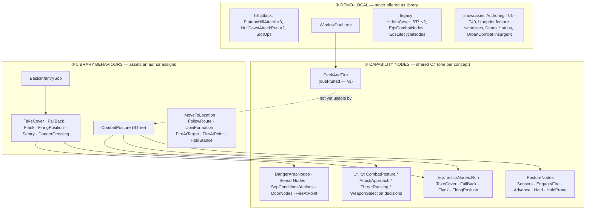

<!--STATUS
state: LIVE
updated: 2026-10-10
current-answer: §5 DECISIONS (user, 2026-10-10: L1–L4 accepted = R-254; L6 replaced by the user's own ruling = R-255) · §6 the retreat
  concepts (L7) · §4 keeps the leans as proposed. Nothing built yet.
stale-below: nothing
known-rot: none
known-conflict: DESIGN_Decision_Layer.md §3.3c/§3.3d (HSM and blueprint posture parity) — ⛔ OVERTURNED for the library by R-255
  (§5): the three posture hosts were a proof; that doc's parity requirement still has to be marked superseded there.
related-designs:
  - OVERVIEW_Behaviour_Building_Blocks.md — OWNS the map of what exists; this review OWNS the verdict on which of it is generic.
  - TUTORIAL_Behaviour_Composition.md — OWNS the five roles and the composition patterns (P1–P6) the library is built from.
  - DESIGN_Peek_And_Fire.md — OWNS PeekAndFire (R-234, R-238); §3 here audits its genericity.
  - DESIGN_Decision_Layer.md — OWNS the posture tree, SOP and drills (§3, §4); L2/L6 touch its TakeCover option and host parity.
  - DESIGN_Eqs_Consuming_Behaviours.md — OWNS the EQS tactics (TakeCover/FallBack/Flank/FiringPosition, §9).
  - designs/group-maneuvers/Squad_Coordination_Design_v1_1.md — OWNS the squad layer (five primitives, manoeuvres).
  - DESIGN_Behavior_Self_Registration.md — OWNS the behaviour registry (BehaviorNames, SR_R2 "nothing checks they agree").
-->

# Review — is the behaviour library GENERIC?

> 🔒 **User, `2026-10-10`:** *"the peek-and-fire was written as part of the duel scenario … might not be generic enough
> (or maybe it is, i need you to verify that). adding behaviors (especially some ad-hoc ones) wildly would clutter the
> behavior space. … we aim to having behaviors that are largely generic, usable in any military combat scenario."*

## 0. The shape — three layers, and where each block sits today

*What the picture shows that prose hid: the generic capability is already concentrated in a few node families (①), and every
ad-hoc piece is a DEMO-LOCAL tree or a legacy duplicate (③) — the clutter is in ③ and in the missing line between ② and ③,
not in ①. Peek-and-fire is a ① node used only by a ③ tree.*

## 1. Verdict

| question | answer |
|---|---|
| is the core generic? | ✅ **mostly** — posture decision, EQS tactics, SOP, danger crossing, sensor/door/fire nodes carry no scenario constant beyond tunable defaults |
| is peek-and-fire generic? | ⚠ **a sound core, duel-tuned** — the hide/expose/fire/heat cycle is general; the exposure model, failure handling, single-threat aim and defaults are the duel's (§3). ⛔ Not ready to be the posture's TakeCover child as-is |
| where is the clutter? | ⛔ **8 fire paths, 4 cover paths, 6 hold nodes, 6 "has target" checks** (§2) — most of the excess is demo-local or legacy, not in the library |
| what is missing? | ⛔ **a written line between library and demo** — no document names the library or a promotion rule (searched `docs/`+`.dev/`: none); the registry lists 3 behaviours with no tree and omits 6 real ones |

## 2. INVENTORY and the overlap clusters

| query | total | note |
|---|---|---|
| `search_graph label=Class file_pattern=*Hrot.AI.Behaviors/Brains/*` (re-indexed after the `2026-10-10` merge) | **88** (`has_more:false`) | node classes, params/state structs, C#-built trees |
| assets under `Hrot.AI.Behaviors/Assets` + `Recipes` + C# trees + registry, read by a sweep (file:line per row) | ~130 assets, ~60 bindable nodes | ⚠ graph does NOT see JSON `MethodFqn` bindings — usage was established by grep, per CLAUDE.md |

| cluster | members | generic one(s) | the rest |
|---|---|---|---|
| **fire** | `PostureNodes.Fire/Engage`, `EqsTacticsNodes.FireOnTheMove`, `CgfNodes.Action_FireAtTarget`, PeekAndFire's burst, `FireAtPoint`, `HillAttackTankNodes.Action_AimAndFireSpecific`, `InsurgentNodes.Action_AimAndFire`, `HsmChannelRegionNodes.Activity_FireChannel` | `PostureNodes.Fire` (the ONE aimed step, R-174), `FireAtPoint` (point / indirect) | `FireAtTarget` overlaps `Engage`; hill-attack, insurgent, channel-region = demo-local |
| **cover** | `EqsTacticsNodes.TakeCover`, `EqsCombatNodes.Action_MoveToOptimalCover`, PeekAndFire hide, `Demo_TakeCover` | `EqsTacticsNodes.TakeCover` | `EqsCombatNodes` + `HideInCover_BT/_v2` = legacy (kept on purpose: `DESIGN_Occurrence_Scoped_Storage` L4980 *"no real users ≠ not needed"*); `Demo_TakeCover` = a stub whose name shadows the real one |
| **hold** | `PostureNodes.Hold`, `HoldProne`, `HoldStance.Hold`, `CgfNodes.Action_HoldPosition`, `EqsCombatNodes.Action_HoldPosition`, `InsurgentNodes.Action_HoldPosition` | `PostureNodes.Hold`, `HoldProne`, `HoldStance` (three different jobs) | `CgfNodes.Action_HoldPosition` dead (no attribute, old signature); the other two legacy/demo |
| **has target** | `EqsCombatNodes.Condition_HasTarget`, `HillAttackTankNodes.Condition_HasTarget` (dead), `InsurgentNodes…`, `Condition_TargetAliveAndVisible`, `SensorNodes.ThreatsAtLeast`, `SopConditions.InContact` | `SensorNodes.ThreatsAtLeast`, `SopConditions.*` | the rest legacy/demo |
| **sensor keeping** | `EqsLifecycleNodes`, `EqsTacticsNodes.EnsureSensor`, `PostureNodes.Keep/KeepPair`, `DangerAreaNodes.EnsureSensor`, blueprint SpawnSensor | `PostureNodes.Keep` (+ `EqsChildSensor.Ensure`) | `EqsLifecycleNodes` superseded; `EnsureSensor` duplicates `Keep` (predates PeekAndFire) |
| **three hosts** | CombatPosture BTree / HSM / Bp; DangerCrossing BTree / Bp; PlatoonHillAttack C# / JSON / Bp; HullDownAttackRun C# / JSON | the BTree of each | HSM/Bp posture lack AttackApproach + Flank/FiringPosition (parity gap) |

**Built but never composed** (generic, no asset or scenario binds them): `Flank` / `FiringPosition` trees,
`UtilityNodes.RankCandidates`, `SensorNodes.Sees/Read`, the six squad manoeuvres + `ManeuverSelect`, and the
`Flee` / `PlanRoute` / `FollowPath` / `Embark` executors (not even registered on CGF).

**Registry** (`BehaviorNames.cs`): `InfantryCombat`, `Ambush`, `ConvoyEscort` (:18–20) have **no tree** — yet
`DefendAreaMapper.cs:42-43` routes infantry and APCs to them (runtime effect ⛔ not measured); `CombatPosture`, `TakeCover`,
`FallBack`, `Sentry`, `DangerCrossing` are **absent**; `BehaviorCatalog.cs:34` lists 5 names.

## 3. Peek-and-fire, audited

| | as built | ⇒ for a generic block |
|---|---|---|
| ✅ general | hide → expose → aimed / blind → recover cycle; aimed fire needs sight + aim time (D3/D4); heat that cools, with hysteresis, outliving the node (B2–B4, `FiringPositionMemory.cs:79-145`); pick from the answer span by score − heat; stay down when suppressed or reloading; bursts at the freshest evidence (D13/D14); suppress-then-bound (D12) | keep — this is the "fight from cover" capability the posture's TakeCover lacks |
| ⚠ exposure model | stance-vs-step keyed on the template id (`PeekAndFireNodes.cs:245-246`); a cover point's stance means "hidden at", read as the PEEK stance in a stance peek (:255 vs `CoverPoint.cs:30`); no peek-stance override; `StanceRequest.Set` failures ignored (:278, :311, :336, :465, :475) | mode from the point's kind; cover stance = hide stance, peek one step up; no stance ⇒ step peek or Failure |
| ⚠ failure paths | no cover ⇒ Running forever, silent (:237); unreachable point re-picked forever (:272, :432); no peek point ⇒ hidden forever (:317); burned with nowhere else ⇒ silent ~59 s (:295) | a timeout that falls back (fire from here / Failure) + an unreachable blacklist |
| ⚠ ROE / friendlies / mount | exposes under HoldFire; ReturnFire's 5 s window mostly closes while it stays down (3 s) + hides (2–5 s); blind burst has **no friendly-line check** (`FireAtPointExecutor.cs:61`); burst always mount 0 (:365) | ROE-aware exposure; friendly-line check for direct-fire bursts; `MountAuto` |
| ⚠ one threat | one `TopAim`; a heard shot from enemy 2 re-aims the cover while sight still checks enemy 1 (:395-402 vs :347); `PostureNodes.Fire` re-ranks and may shoot a different entity than the one checked (`PostureNodes.cs:301`); heat has no bearing | heard slot near the threat only; pass the node's target into `Fire`; (opt.) heat per bearing |
| ⚠ squad / seed | squad-mates converge on the same point (deterministic ranking, per-unit heat); `SimRng` seed `index ^ salt ^ (int)simTime` is symmetric (`SimRng.cs:65`) | penalise points near a friend's mirrored `HidePoint`; fix the seed |
| ⛔ scope | infantry only (stance system, 0.5 m arrival, 3 m peek radius, 1 m blind aim height); vehicles pass the entry gate and do nonsense | **state the scope: infantry.** Vehicles keep hull-down (`HillCrestHullDownManeuver`) |
| defaults | the duel's (§8.4 *"defaults are the duel's"*); reasonable for a town rifleman (15 m search); `0 = default` makes blind fire / heat penalty impossible to switch off | separate "unset" from 0 |

## 4. The leans — each for the user to approve or change

| # | lean | why · blast radius |
|---|---|---|
| **L1** | ⭐ **Write the line between library and demo:** a short `## Library` section in `OVERVIEW_Behaviour_Building_Blocks.md` naming ② and ③, plus a **promotion rule** — a block enters the library only when it (a) carries no scenario constant (only tunable defaults), (b) states its unit scope (infantry / vehicle / any), (c) has a rail outside its originating demo, (d) is the ONE implementation of its concept (ruling 9 / R-174) | nothing written exists (searched); the rule stops ad-hoc blocks entering the author's palette. Docs only |
| **L2** | ⭐ **Peek-and-fire becomes the library's "fight from cover" node — generalised FIRST, then bound to CombatPosture's TakeCover option (CE-3157).** Five changes, §3 rows 2–6: exposure model · failure paths · ROE/friendly-line/mount on bursts · one-threat coherence · squad de-confliction + seed. Scope stated as **infantry** | it is a superset of TakeCover-with-fire, and Decision Layer §3.1 already defines TakeCover as *"fire from it"*; a second fire-from-cover node would be the clutter you warned of. ⚠ touches `FireAtPointExecutor` (also `bt-grenade-posture`, `bt-mortar-roof` — indirect fire exempt), `PostureNodes.Fire` callers, `FiringPositionMemory` (recorded struct), the duel rail, posture baselines |
| **L3** | **Legacy stays, but OUT of the library:** `HideInCover_BT/_v2`, `EqsCombatNodes`, `EqsLifecycleNodes` marked legacy reference trees (the design record keeps them: L4980). **Delete only the dead:** `CgfNodes.Action_HoldPosition` (no attribute), `HillAttackTankNodes.Condition_HasTarget` (bound by nothing) — after a corpus check per item | "no rush removals"; only the genuinely dead go |
| **L4** | **Fix the registry:** add the real library behaviours to `BehaviorNames`/`BehaviorCatalog`; the three tree-less names either get a tree or the `DefendAreaMapper` routes to `CombatPosture` (lean: route — `InfantryCombat` IS what CombatPosture does) | a tactical intent today resolves to a name with no behaviour. File as a finding first (measure the runtime effect) |
| **L5** | **Fire paths:** keep two generic steps — `PostureNodes.Fire` (aimed) and `FireAtPoint` (point/indirect); route `CgfNodes.Action_FireAtTarget` onto `PostureNodes.Fire` (one aimed step); hill-attack/insurgent stay demo-local | ruling 9 on implementations; small |
| **L6** | **Host parity:** the CombatPosture HSM and blueprint lack AttackApproach + Flank/FiringPosition. Lean: **the library behaviour is the BTree; the HSM/Bp variants are the three-host DEMO (U3)** and stay demo-local, kept in parity only for the shared options | ⚠ Decision Layer §3.3c/§3.3d asked for parity — every posture change (e.g. CE-3090) costs three edits. Changing the lean: if authors are expected to pick a host per unit, parity must be a library rule instead |
| **L7** | **Built-but-never-composed** generic blocks (Flank/FiringPosition trees, squad manoeuvres, Flee/PlanRoute/Embark executors, RankCandidates) stay; ⚠ `FleeExecutor` vs `FallBack` is a second retreat concept — decide one | they are designed (EQS §9, squad design); not clutter, just unused |

⇒ ⭐ **Order if approved:** L1 (written line) → L2 (generalise peek-and-fire, then CE-3157) → L4 (registry finding) → L5/L3 (tidy) → L6/L7 (decisions only).

## 5. DECISIONS — user, `2026-10-10`

> 🔒 **User, verbatim:** *"L1 accepted · L2 accepted · L3 accepted · L4 accepted"* · on L6: *"that was likely just a proof that it
> can be implemented using all platforms. we do not need to keep all, we can drop btrees and HSMs, and we can even rewrite all the
> libray stuff into c# form for better maintainability."*

| # | decision | ledger |
|---|---|---|
| L1–L4 | ✅ accepted as proposed in §4 | **R-254** |
| L6 | ✅ **REPLACED by the user's ruling:** the three posture hosts were a PROOF. The library keeps the **BTree** form; its **blueprint and HSM copies are dropped**; library BTrees may be C#-built | **R-255** |
| L5 | ✅ approved | **R-254** (extended) |
| L7 | ⏳ the retreat question — §6 | — |

> 🔒 **User, `2026-10-10`, correcting my reading:** *"..we can drop blueprint and HSM, not btrees"*

⭐ **R-255 as ruled:** the library's form is the **BTREE**. The **blueprint and HSM copies** of library behaviours (`CombatPostureBp` + its `Posture*` wrapper trees, `CombatPostureHsm`, `DangerCrossingBp`, the `ua-three-hosts` demo) are dropped. Library BTrees may be **C#-built** (as `MoveToLocation`, `FireAtPoint`, `WindowDuel` already are, R-223) for maintainability. ⚠ The blueprint and HSM ENGINES stay — this is about the library's copies, not the hosts.

~~Open interpretation (asked): blueprints stay the doctrine surface, HSM engine stays~~ — ⛔ SUPERSEDED by the correction above.

> 🔒 **User, `2026-10-10`, refining R-255:** *"yes but only where there is redundancy and where HSM not the most suitable option from the three possibilities (HSM, btree, blueprints)"* · *"ok as long as the demo showing the feature stays, just using the library c# implementation"* · *"L5 approved"*.

| refinement | meaning |
|---|---|
| ⭐ HSM / blueprint copies go **only where REDUNDANT and where that host is not the most suitable** | not a blanket deletion: each library behaviour keeps the host that fits it best; a copy is retired only when it duplicates the BTree and adds nothing |
| ⭐ the three-host DEMO stays | `ua-three-hosts` keeps showing that one decision runs on all three hosts — rewritten to call the library's C# implementation, not to keep three library copies |
| ✅ L5 approved | `FireAtTarget` routes onto `PostureNodes.Fire` (with an explicit target); `CgfNodes.Action_FireAtTarget` is retired |

## 6. Retreat concepts (L7)

| concept | what it does | used by | verdict |
|---|---|---|---|
| ⭐ `EqsTacticsNodes.FallBack` (+ `Tactics/FallBack.btree.json`) | EQS `FindSafeRetreatPoint` (hidden from the threat, far from it) → one pathed move → Success on arrival | posture **Flee** option (all three hosts); `BasicInfantrySop` (withdraw on contact under HoldFire, `CE-2080`) | ✅ **the library retreat** |
| posture option **Flee** | not a mechanism — the decision option that RUNS FallBack; needs ≥ half health and a hidden escape (`CE-3090`) | `CombatPostureDecision` | ✅ library (decision) |
| `FleeExecutor` (`ActionIdFlee`, `Navigation/Executors/FleeExecutor.cs`) | locomotion action: move AWAY from a threat entity along a flee vector, re-planned every N ticks; no cover, no terrain scoring | ⛔ registered on no CGF; tests + the old FDP cognitive example only | ⛔ second retreat concept → **legacy, out of the library** (L3 rule) |
| `HillAttackTankNodes.Action_ReverseToBaseline` | tank reverses off the crest to its baseline slot | hill attack | demo-local (vehicle hull-down) |
| PeekAndFire relocate / suppress-and-bound (D8/D12) | moves to the NEXT cover while still fighting | window duel | not a retreat — relocation |
| `HoldProne` | the alternative when too hurt to flee (`CE-3090`) | posture | not a retreat |
| `Demo_Retreat.bp` | delay stub | `Demo_MissionPlan` | demo |

⇒ **Lean:** ONE retreat = `FallBack`. `FleeExecutor` leaves the library (legacy per L3); ⚠ revisit only if `FallBack` needs a
no-cover escape (what it does when the EQS finds no point is ⛔ not measured).

