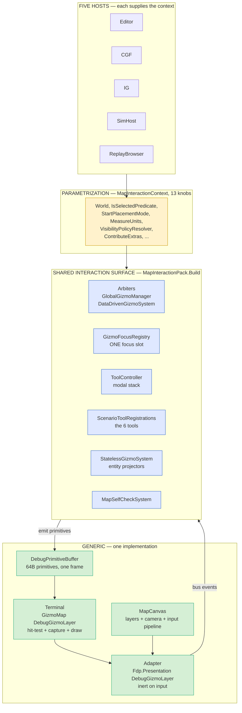
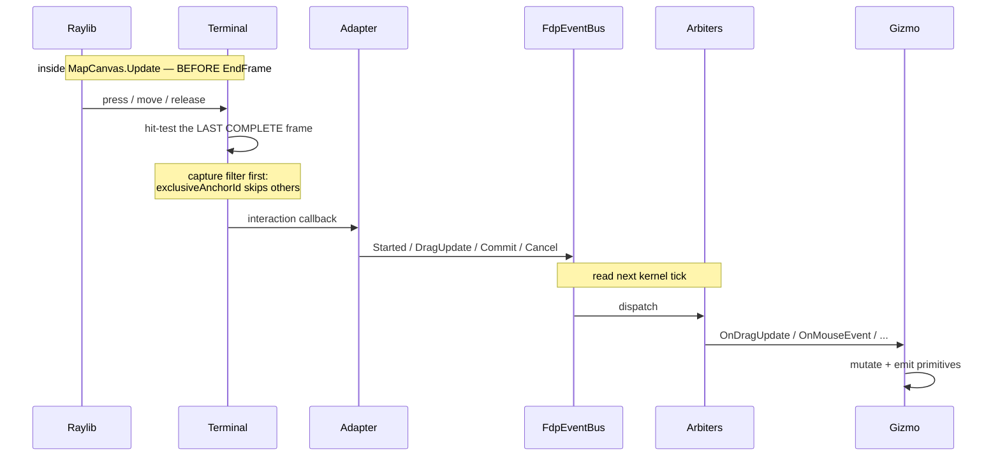
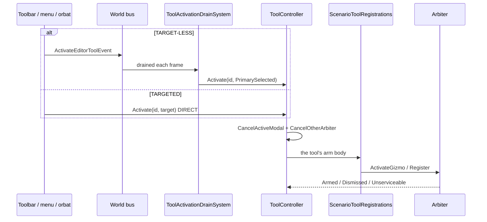
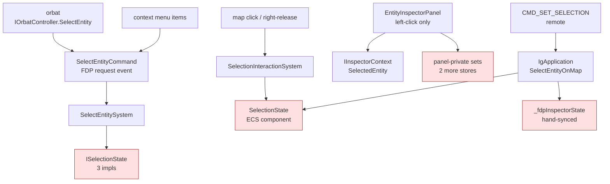
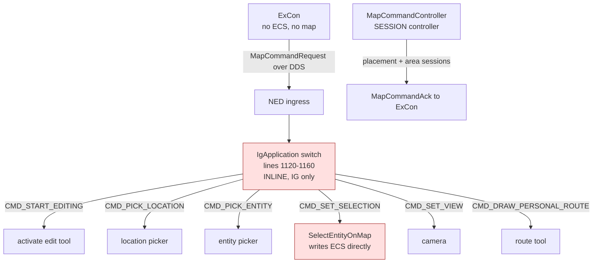

<!--STATUS
state: SNAPSHOT
build-state: N/A — this document describes what EXISTS. It specifies nothing and owns nothing.
snapshot-date: 2026-09-10
updated: 2026-09-10
current-answer: §1 is the block map, §2 the data flows, §3 the remote-map-control path. §4 is the
  FINDINGS LEDGER from the 2026-09-10 session (the reason this file exists). §5 is FUTURE INTENTIONS
  and the two owning designs that do not exist yet. §6 lists rot found in OTHER documents.
owns-nothing: ⛔ NOT an owning design. Do NOT cite this to justify a change.
  The real owners: docs/DESIGN_Map_Rendering_And_Interaction.md (the layer reference) ·
  docs/UX/UX_Feature_Map_Parity.md (UXI-23 — projectors, construction, policy) ·
  docs/UX/UX_Feature_Tool_Model.md (UXI-07 — tools, modality, routing) ·
  docs/UX/UX_Feature_Selection.md (UXI-11 — selection) ·
  docs/UX/UX_Feature_Multi_Select.md (UXI-24).
verified: 2026-09-10 — every claim below measured from source this session, file:line inline.
  Coverage: check_index_coverage over Hrot.Editor, Hrot.Presentation, Fdp.Presentation, Fdp.Toolkits —
  index mode full, recording complete, no parse gaps in any file cited here.
known-rot: none of its own; §6 records rot found in OTHER documents.
-->
# SNAPSHOT — the 2-D map interaction architecture, `2026-09-10`

> ⛔⛔ **This is a point-in-time SNAPSHOT, not a design.** It exists because a session's worth of
> measurement kept discovering architecture that was true, load-bearing and written down nowhere — and
> because two owning designs that *should* exist do not yet (§5).
>
> ⭐ **What it adds that the owning docs do not:** they describe LAYERS and TO-BE; this describes
> **COMPOSITION, OWNERSHIP and DATA FLOW as built**, plus the findings ledger.
> ⛔ **It deliberately does NOT redraw** `DESIGN_Map_Rendering_And_Interaction.md` §1.2's layer map,
> §3.1's press-to-commit sequence or §4's TO-BE diagrams — read those there.

---

## 1. The block map — **who builds what**

⭐ The map splits into a **generic surface** (one implementation, shared) and a **per-host interaction
surface** (the parametrization). The unification of the second is `UXI-23`, and it is largely done.

| | evidence |
|---|---|
| `MapInteractionPack.Build(MapInteractionContext)` is adopted by **all five hosts** | Editor `EditorSubsystem.cs:1821` · CGF `CgfSubsystem.cs:1163` · IG `IgApplication.cs:779` · SimHost `SimHostApp.cs:394` · ReplayBrowser `ReplayBrowserSubsystem.cs:173` |
| the group it builds, **in order** | `MapInteractionPack.cs:131-132` — `globalManager, dataDriven, stateless, selfCheck`. ⚠ **the order is load-bearing** — see `CE-259r` (§4) |
| the 13 knobs | `MapInteractionContext.cs` — `World` (required) · `InteractionBus` · `Settings` · `IsSelectedPredicate` · `StartEnabled` · `BufferCapacity` · `BreakpointManager` · `StartPlacementMode` · `ReportUnserviceableTool` · `MeasureUnits` · `VisibilityPolicyResolver` · `ReportMapDiagnostic` · `ContributeExtras` |
| ⭐ the **extension seam** | `ContributeExtras: Action<MapInteractionRegistries>` — hands a host `Gizmos`/`Stateless`/`Settings`/`Buffer`/`InteractionBus`, invoked *"AFTER the reflection pass and BEFORE the systems are constructed"* |
| `UXI-23` slice state | S1 · S2 · S2a · S2b · S3 · S4 **BUILT**; ⛔ **only S5, the ACTION half, remains** |

### 1.1 What is still per-host — **the honest list**

| concern | state |
|---|---|
| ⭐ **free-space (canvas) context menu** | ✅ **shared AND data-driven.** `CanvasContextMenuGizmo` *(an `IGlobalStatelessGizmo`)* reads `CanvasContextMenuState`, an **ECS component**; each host only registers `CanvasMenuUpdateSystem` to keep it fresh. ⇒ the menu DEFINITION is data, not host code |
| ⚠ **entity placement** | **half-unified** — the `Spawn` TOOL is shared; the BEHAVIOUR is a host delegate `MapInteractionContext.StartPlacementMode`, implemented per host by `ScenarioSpawnAdapter` |
| ⚠ **entity context menu** | the panel seam is shared *(`IEntityContextMenuHandler`)*; the ITEMS are host lambdas — 5 registration sites: Editor `EditorSubsystem.cs:2289/2291/2316/2388` · IG `:1287` · CGF `:1432` · SimHost `:179` · shared helper `FdpEntityInspectorHelper.cs:56` |
| 🔴 **selection** | **4 stores, ~11 writers** — see §2.3 |
| 🔴 **remote map control** | **IG only, and inline** — see §3 |

---

## 2. Data flows

### 2.1 Local input → state

⚠ **The frame boundary is the trap.** Per host frame: `EndFrame` **clears** the buffer, then the kernel
runs the group which **refills** it. ⇒ a hit-test during `canvas.Update` sees the **previous complete**
frame; a hit-test dispatched *inside* the group sees a **partly-filled** one. 📄 `CE-259r`.

### 2.2 Tool activation — **as built** *(⚠ supersedes `DESIGN_Map_Rendering_And_Interaction.md` §3.2)*

🔴 **§3.2 of the reference design is STALE:** it shows the DRAIN owning `ToggleEntityGizmo`. Since
`UXI-07` step 3b the drain is *"an EVENT ADAPTER and nothing else"* and the tool bodies live in
`ScenarioToolRegistrations`, which `MapInteractionPack.Build` calls. 📄 §6.

### 2.3 Selection — **four stores, and the writers do not agree**

| 🔴 | measured |
|---|---|
| **4 stores** | `SelectionState` component · `ISelectionState` *(3 impls)* · `EntityInspectorPanel._selectedEntities:377` · `DerEntityInspectorPanel._selectedEntityId:77` |
| **9 `PrimarySelected` write sites** | `CgfSubsystem.cs:1461`,`:2884` · `EditorSubsystem.cs:754`,`:789`,`:1946`,`:2008`,`:2013` · `SelectEntitySystem.cs:83` |
| **3 hand-rolled `SetSelected`** | `SelectionInteractionSystem` · `EditorSubsystem` · `IgApplication.SelectEntityOnMap:1596-1614` |
| ⛔ **no FDP-internal "selection changed" event exists** | both `SelectionChangedEvent` *(`[DdsTopic]`, `MapMessages.cs:106`)* and `SelectionChangedEventDto` *(`Commands.cs:117`)* are NETWORK types ⇒ `R-134` forbids panels listening to them |
| ✅ the **request** event exists | `SelectEntityCommand` — ⚠ single-entity (`long NetworkId`), no multi-select |

---

## 3. Remote map control — **as built**

| | measured |
|---|---|
| the dispatcher | ⛔ **is not a class** — an inline `switch` in `IgApplication.cs:1120-1160`, IG only |
| `MapCommandController`'s real job | **entity-creation SESSIONS** — placement `:185`, area authoring `:276`/`:294`/`:318`, ack correlation `:340`, 3 status codes; single-session state |
| is it IG-specific? | ⛔ **only by namespace and wiring** — deps are host-neutral *(`MapCanvas`, `FdpEventBus`, `Action<MapCommandAckDto>`, `long`, `GlobalGizmoManager?`)*, constructed once at `IgApplication.cs:863` |
| is it DDS-coupled? | ⛔ **no** — every `Hrot.NED.Messages` reference is a DOC COMMENT *(`:20`,`:66`,`:84`,`:168`)*, none in code. `R-134`-clean |
| 🔴 echo suppression in the wrong place | `ParseCommandAndSetSelection` selects *"**without publishing a `SelectionChangedEvent`** (to avoid ExCon→IG→ExCon echo loops)"* ⇒ under a request/notify protocol that leaves **every local panel stale**. It belongs at the EGRESS translator |

---

## 4. FINDINGS LEDGER — `2026-09-10`

⭐ Filed as tracker rows unless marked otherwise. **All measured; `file:line` in the row.**

| id | finding | state |
|---|---|---|
| **`CE-259q`** | a self-removing gizmo never told `ToolController` ⇒ "Edit Shape" armed every OTHER time *(deterministic 2-cycle)* | ✅ **FIXED** |
| **`CE-259r`** | the picker's hover hit-tests an **empty** frame *(reproduced headlessly: `frame=0`, `hitTest=NULL` during the arbiter; resolves after the group)* | 🔴 open · lean = reorder the group |
| **`CE-259s`** | `ToolActivationDrainSystem` registered **before** `SelectEntitySystem` ⇒ the inspector menu arms on the **pre-menu** selection; those 3 items also still use the idiom `§4.7d` retired | 🔴 open · lean = targeted idiom |
| **`CE-259t`** | the shared orbat seam sets ExCon's selection **locally only**; its private panel does it correctly ⇒ **latent** — adopting the shared panel would stop selection reaching the cluster | 🔴 open · one line |
| — | **`IsFocused` is a DEAD parameter on 14 of 14** production `IEntityStatefulGizmo` implementations — stored, never read | 📄 `UX_Feature_Tool_Model.md` §4.7i |
| — | **`"Mark Target for N Units…"` is incoherent** — gates on the right-clicked entity holding `TargetMemory`, then seeds the SELECTED entities | 📄 §4.13, RETIRED |
| — | **`ChainToMap` defaults to `false`**; only ReplayBrowser sets it ⇒ inspector selection never reaches the editor's map | 📄 `UX_Feature_Selection.md` §2.6 |
| — | **`DerEntityInspectorPanel` has NO selection seam at all** — no context, no callback, only a private int | 📄 §2.6 |
| — | **no Stride host registers `SharedOrbatPanel`** | gap, not a defect |
| — | **`tracker-counts.py` counts only `**BP-\d+` rows** *(`:41`)* ⇒ the whole `CE-` series is invisible to that gate | ⚠ unfiled — re-baselines the published table |
| — | z-order: `FindTopmostInteractivePrimitive` ranks by `DebugLayer` with **emission order as the tiebreak** *(`:510`)*, and both entity pick boxes and tool handles are **layer 0** | context for `CE-259r` |
| — | ⛔ **NOT MEASURED:** what ExCon's two `FdpEventBus` instances carry — decides whether its DTO-to-logic ingress is an `R-134` shape or deliberate | open question |

---

## 5. FUTURE INTENTIONS — **rulings recorded, nothing built**

### 5.1 User rulings, `2026-09-10`

| # | ruling | home |
|---|---|---|
| 1 | a suspended tool draws its **geometry but NO handles**; they return on resume | `UX_Feature_Tool_Model.md` §4.7i |
| 2 | **only the selected entity is editable** — an entity LOSING selection cancels its edit *(per-entity predicate, not a global change event)* | §4.14 ② |
| 3 | clicks during an edit must not select — **map-input concern only** | §4.14 ③ |
| 4 | **panels are map- and tool-unaware**: they publish a selection **request** and react to a **notification**; nothing else | §4.14 ⑤ · §2.6 ④ |
| 5 | **selection is HOST-LOCAL.** Owner = the global ECS repo on ECS nodes, *no one else*; one similar central piece on non-ECS nodes | §2.6 |
| 6 | remote map control is **just another requester** — translate, then publish the same FDP request | §2.6 |
| 7 | target-pick moves to the **selected perceiver's** menu, fanning out over all selected that support it | §4.13 |
| 8 | the menu shows only items applicable to **ALL** selected | §2.4 / ruling 47 *(pre-existing)* |

### 5.2 The two owning designs that DO NOT EXIST

| # | needed for | why it cannot be squeezed into an existing doc |
|---|---|---|
| ⭐⭐ **A** | **the interaction-surface layer** | 📐 `DESIGN_Map_Rendering_And_Interaction.md` says of itself *"**Owns nothing** — it is the shared reference"*, and §4.3 SPLITS ownership: `UXI-23` = projectors/construction/policy, `UXI-07` = tools/modality/routing, action half **joint**. ⇒ **no document owns "the interaction surface" as a thing.** 🔒 User intent: *"as unified as possible … best if there is just one implementation, where role-specific means just parametrizing"* — which is what `MapInteractionPack`+`MapInteractionContext` already are; the design has to say so and own the seam |
| ⭐⭐ **B** | **remote map control** | 🔒 User intent: *"the remote map command dispatcher should rather be a separate module installable on any host having 2d map, and maybe present just on IG node"* ⇒ present-by-CONFIGURATION, not by code shape *(`R-141`)*. ⭐ The seam exists — `ContributeExtras` — ⛔ but the dispatcher does not, and *"wiring the remote map command to host-internal selection will then be just one of many responsibilities"* |

⚠ **Sequencing that follows from the measurements, not from preference:**
`CE-259r` and §4.7i are independent and buildable now · ruling ② needs `§2.3`'s inspector arm · rulings
④/⑤/⑥ need `UXI-11` §2.1 (one store) **and** a new FDP-internal notification event · design **B** wants
design **A**'s seam to be owned first.

⛔ **A constraint for design B, recorded so it is not rediscovered:** if the dispatcher is folded into
`MapCommandController`, **session state must stay separate from dispatch** — selection and view are
stateless one-shots, placement/area are stateful single-session, and mixing them is how a selection command
gets silently refused because a placement session is open.

---

## 6. Rot found in OTHER documents — **obligation-⑤ repairs owed**

| document | rot |
|---|---|
| `DESIGN_Map_Rendering_And_Interaction.md` **§3.2** | its sequence diagram shows `ToolActivationDrainSystem` owning `ToggleEntityGizmo`. 🔴 Since `UXI-07` step 3b the drain is *"an EVENT ADAPTER and nothing else"*; the bodies are in `ScenarioToolRegistrations`. ⇒ **the diagram is stale** |
| same, **§4.2** | its table marks `IToolController` · `ActiveModal` · `ModalStack` · `PushModal` · `Cancel` as *"already designed, user-ruled, **NOT-BUILT**"*. 🔴 **All are BUILT** *(`UXI-07`, `2026-09-09`)*, and `PushModal`'s suspend/resume was operator-confirmed |
| `VertexEditGizmo.cs:27` | ✅ **already fixed** `2026-09-10` — it claimed the gizmo never calls `_onRemove()` itself, false since the right-release arm existed |

⛔ **Not repaired here on purpose:** this snapshot must not edit documents it does not own. The two §6 rows
are listed so the next session repairs them in place.

---

## 7. What this snapshot does NOT cover

⛔ rendering internals *(`DESIGN_Map_Rendering_And_Interaction.md` §2)* · the wire/DDS gizmo streaming path
*(built but **UNWIRED** — `PollAndApply` has no production caller; the only one is commented out at
`StrideNodeBootstrapper.cs:202`, "wire in SM-006")* · Stride hosts *(no orbat, and the 2-D map surface there
was not measured)* · blueprint/AI graph editors · `ExCon`'s mission-plan editing.
