<!--STATUS
state: LIVE
updated: 2026-10-06
current-answer: the whole file — a TUTORIAL: what each building block is for, how to pick between them, how to compose them
stale-below: none
known-rot: none known; built/not-built facts are a 2026-10-06 snapshot — §9 lists the gaps, re-check them against the tracker
related-designs:
  - docs/OVERVIEW_Behaviour_Building_Blocks.md — the MAP of every block (this file is the GUIDE to choosing among them)
  - docs/TUTORIAL_Universal_Soldier.md — the worked example of §8, step by step with scenario JSON
  - docs/AI_DEV_GUIDE.md — owns the paradigm tiers (FastBTree / FastHSM / hardcoded) and their "choose X when" rules
  - docs/DESIGN_Decision_Layer.md — owns task / SOP / reaction / ROE (§4) and utility in BTree / HSM / blueprint (§3.3–§3.3e)
  - docs/DESIGN_Eqs_Consuming_Behaviours.md — owns the measured BTree / HSM / blueprint comparison (§4.2) and the EQS tactics nodes
  - docs/DESIGN_Sensors_And_Doctrine.md — owns sensors, memory and the read-sensor nodes (§5–§7)
  - docs/designs/eqs-2/EQS_Design_v1.3_final.md — owns the EQS templates (§19)
-->

# Composing behaviours — which building block, when, and how they fit

This guide answers three questions an author meets on every behaviour:

1. **Which kind of thing do I need?** (a host, a node, a decision, a sensor, a query, an order)
2. **Which one of that kind fits my situation — and why?**
3. **How do I plug them together** so the goal comes out?

It ends with the "universal soldier" rifleman as a worked example (§8). The full block list is in the
[overview map](OVERVIEW_Behaviour_Building_Blocks.md); this file is about **choosing and composing**.

---

## 1. The mental model — five roles

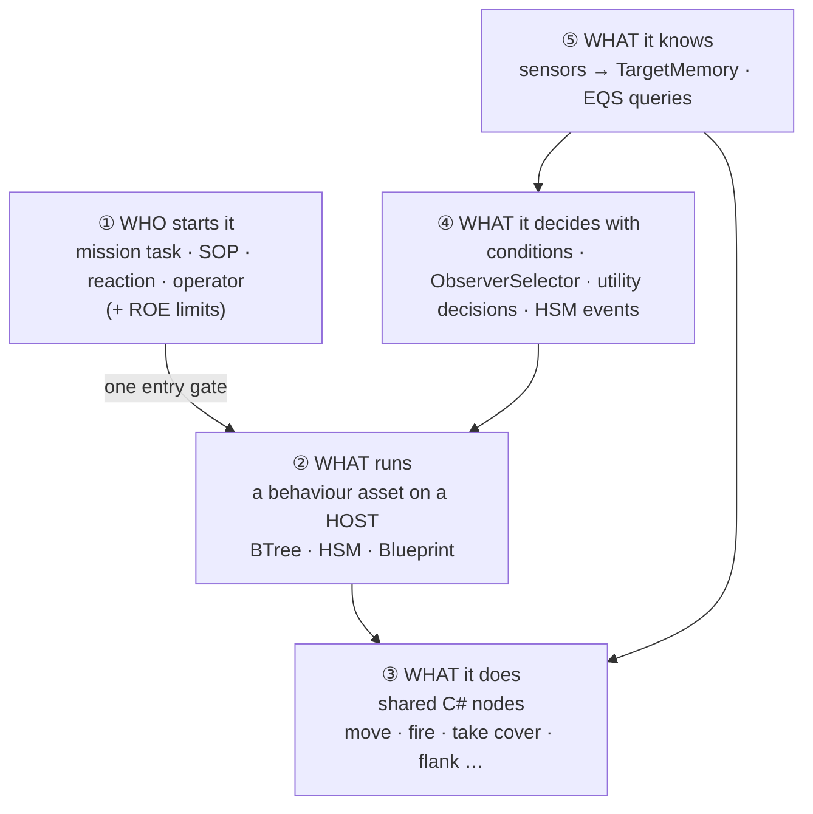

*What the picture shows:* a behaviour is never one thing. Most mistakes come from putting a job in the wrong
role — e.g. writing "react to contact" inside a tree (④) when it belongs to the SOP (①), or hand-wiring a
cover search in a graph (②) when a shared node (③) already does it.

⭐ **The single most useful rule:** the *logic* lives in **shared C# nodes** (③); the *host* (②) only gives it
a **structure**. The same `TakeCover` node runs unchanged in a BTree, an HSM state and a blueprint
([EQS-consuming §4.2](DESIGN_Eqs_Consuming_Behaviours.md)). So choosing a host is choosing a *shape*, not
re-implementing anything.

---

## 2. Choosing the host — BTree, HSM or Blueprint

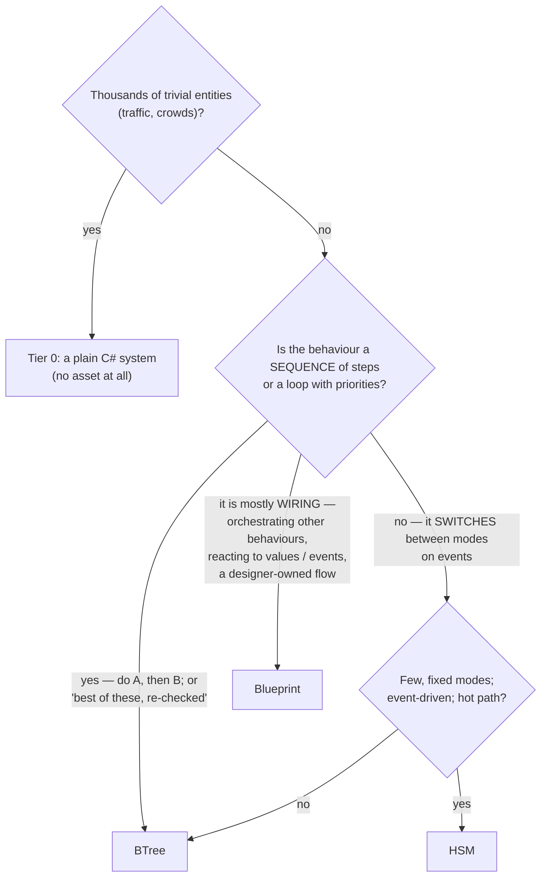

| host | pick it when | why (source) | avoid it when |
|---|---|---|---|
| **BTree** | complex, sequential or prioritised logic: ambush, route following, multi-phase combat; "pick the best branch, re-checked every tick" | familiar selector / sequence / decorator; **Observer** nodes reactively abort a running branch ([AI_DEV_GUIDE](AI_DEV_GUIDE.md) "Choose FastBTree when") · smallest asset: a whole SOP is 281 lines, a cover loop 3–4 nodes ([EQS-consuming §4.2](DESIGN_Eqs_Consuming_Behaviours.md)) | the logic is really a handful of modes switched by events |
| **HSM** | **reactive** behaviour that switches between a small, fixed set of modes on events (escort, patrol loop, posture switching) | event-driven, does not poll, zero allocation; pays off for **switching**, not for one loop (AI_DEV_GUIDE "Choose FastHSM when"; EQS-consuming §4.2) · `Sensor.Acquired / Lost / Hit / …` arrive as HSM events | a single loop — two states + transitions is more structure than it needs |
| **Blueprint** | **orchestration and wiring**: run other behaviours as tasks, react to a value / event / EQS answer (`When`), mission plans as graphs, designer-tunable flows | visual, data-driven; `ScoreDecision`, `Behaviour Task Start`, per-kind sensor nodes ([Decision Layer §3.3d](DESIGN_Decision_Layer.md)) | the step itself is algorithmic — the same cover loop is ~15 wired nodes (~700 lines) vs ~80 lines of C# (EQS-consuming §4.2) |
| **shared C# node** | a reusable *capability* (a manoeuvre, a sensor-keeping step, a check) | written once, bound by all three hosts; testable with a plain unit rail | you only need to arrange existing nodes — use a host |

⭐ **Lean for a new tactical behaviour:** a **BTree** around shared nodes. Reach for an **HSM** when you find
yourself modelling *modes* that events switch between, and a **blueprint** when the job is *orchestrating*
other behaviours rather than doing something itself.

---

## 3. Choosing how it decides

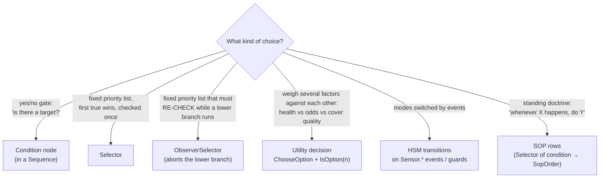

| mechanism | use for | example in the repo |
|---|---|---|
| **Condition** | a single gate | `Condition_HasTarget`, `SopConditions.SensedFresh` |
| **Selector** | priority list evaluated in order | the SOP's rows ("first true wins") |
| **ObserverSelector** | priority list that must **interrupt** a running lower branch the moment a higher one becomes true | CombatPosture's "run the winner"; `DangerCrossing` |
| **Utility decision** | *trade-offs*: several inputs (0..1) scored by curves and weights; hysteresis stops flicker | `CombatPosture`, `AttackApproach`, `ThreatRanking`, `WeaponSelection` |
| **HSM transition** | event-driven mode change | `CombatPostureHsm` (guards on `IsOption`) |
| **SOP row** | doctrine that applies across tasks | `BasicInfantrySop` |

⭐ **Rule of thumb:** if you are writing nested `if` thresholds on health / ammo / enemy count and tuning them
against each other, that is a **utility decision**. If one condition simply has priority over another, a
**Selector / ObserverSelector** is clearer and cheaper.

⚠ Utility decisions are written in **C#** today (no editor yet); the hosts *use* them through `ChooseOption`
(BTree / HSM) and `ScoreDecision` (blueprint).

---

## 4. Choosing who starts it

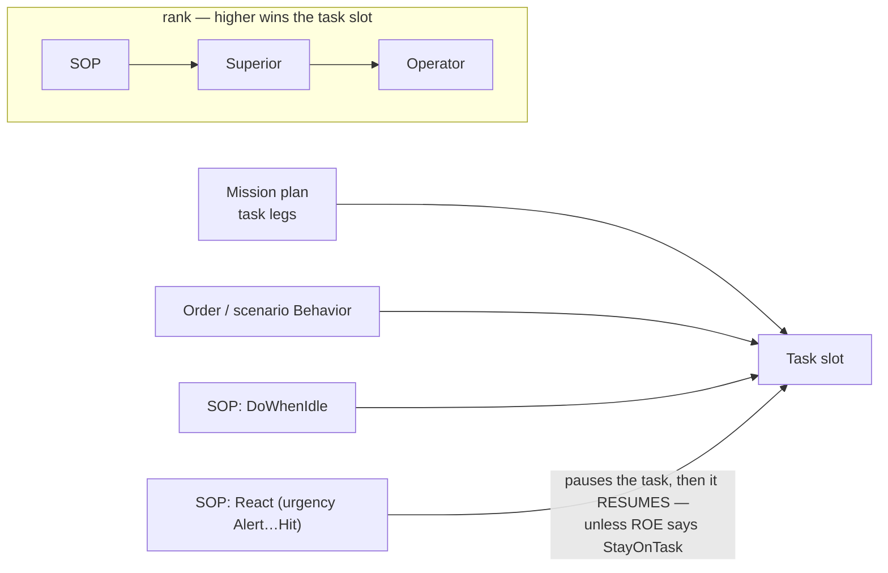

| starter | use for | note |
|---|---|---|
| **Mission plan** | a sequence of jobs ("go here, then cross, then hold") | each task starts when the previous finishes (`BehaviorFinished`) |
| **Order / scenario `Behavior`** | one job | what `tt-posture` uses |
| **SOP `DoWhenIdle`** | what a unit does with no orders | `Idle` in `BasicInfantrySop` |
| **SOP `React`** | interrupt the task for something urgent | pauses the task; the task **resumes** afterwards |
| **ROE** | limits, not a starter: `Fire` (HoldFire / ReturnFire / FireAtWill) is enforced in the weapon executor; `Reactions: StayOnTask` refuses reactions while a task runs | `BehaviorIngressSystem.cs:248` |

⭐ **Where does "react to contact" go?**
- If the task is *dumb* (a move, a patrol) → let the **SOP react** (it pauses the task, then resumes it).
- If the task is *smart* (it already fights — `CombatPosture`) → **`StayOnTask`**, otherwise the SOP's blunt
  reaction replaces the smart choice.

---

## 5. Choosing what it knows — sensors, memory, queries

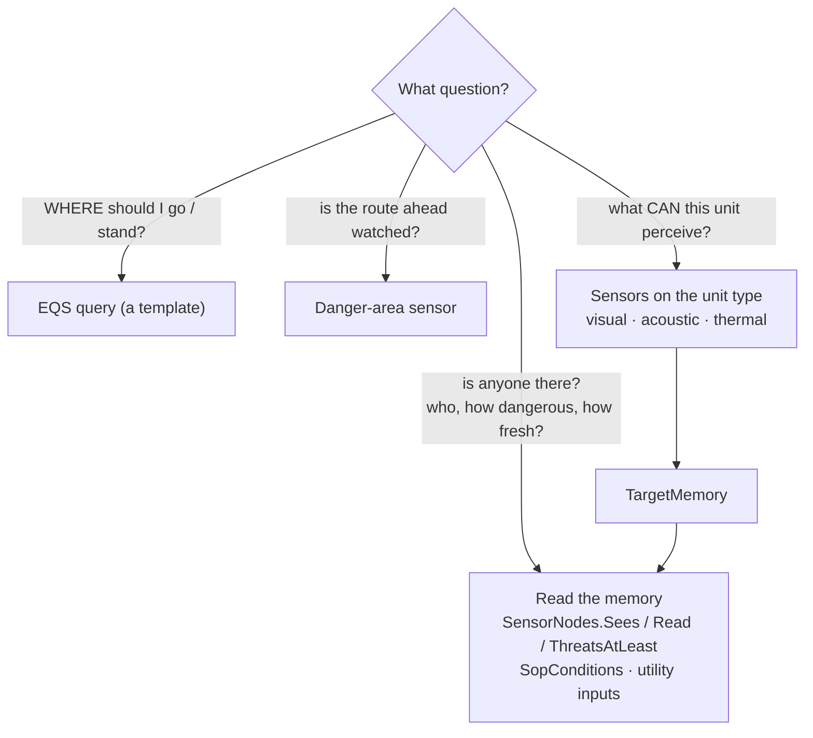

**Pick the EQS template by the question:**

| question | template | scores spots by |
|---|---|---|
| where can I hide from *that* threat? | `FindCoverFromTarget` | hidden from the threat, near me, least exposed to *all* known threats, reachable |
| where can I withdraw to? | `FindSafeRetreatPoint` | hidden from the threat, farther from it is better |
| where can I shoot from? | `FindOpenFiringPosition` | sees the threat, near, high ground, least exposed |
| how do I get round it? | `FindFlankingPosition` | sees the threat from the side |
| who can I see? | `FindThreatsInView` | hostile, alive, nearest first |
| who is in that area? | `EntitiesOfForceInArea` | inside a polygon, of one force |

⭐ **Usually you do not run a query by hand:** the tactics nodes (`TakeCover`, `FallBack`, `Flank`,
`FiringPosition`) each own their query, aim it at the top threat (or a *heard* point) and move the unit. Run a
query yourself (`MaintainEqsSensor` / `SpawnEqsSensor`) only for a question no tactics node answers.

**Sensors are data on the unit type** (TKB): vision range gives an implicit visual sensor, hearing range an
implicit acoustic one. A behaviour may retune / enable / disable a sensor, but normally just reads memory.

---

## 6. Composition patterns

### P1 — Decide · sense · act (the core pattern)

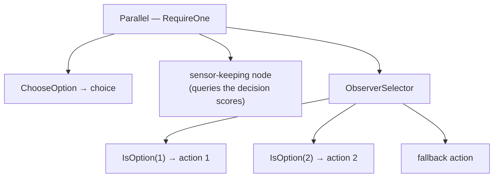

Everything runs every tick: the decision re-scores, the sensors keep the scores fresh, the ObserverSelector
switches branch the moment the winner changes. ⚠ The compiler refuses a Parallel nested inside another
Parallel ([Decision Layer §3.3e](DESIGN_Decision_Layer.md)) — put extra decisions and sensors in the **same**
Parallel (P2).

### P2 — Nested decision (a decision only one branch needs)

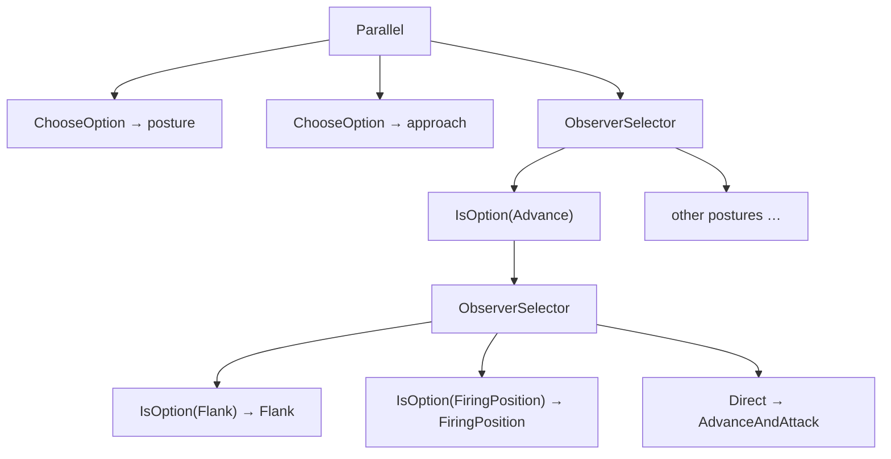

The inner decision is *scored* in the top Parallel but only *read* inside its branch.

### P3 — Doctrine table (an SOP)

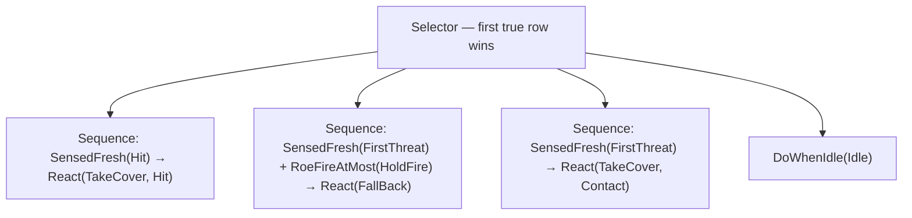

An SOP **issues orders**, it does not act. Each row: conditions → `SopOrder`. Assign it per unit (`Sop` key).

### P4 — Legs of a mission

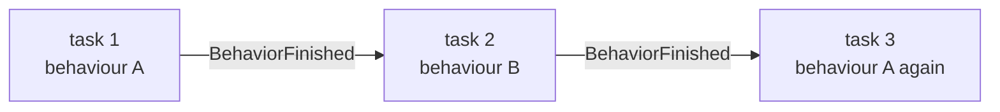

Use when the job has phases that are *different behaviours* (fight to a corner → cross a street → fight to the
objective). Each task carries its own params.

### P5 — One decision, three hosts

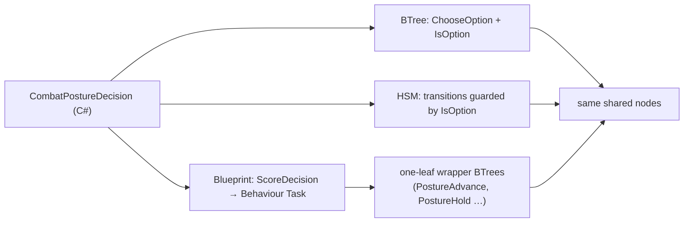

Proven equal by the U3 `ua-three-hosts` demo. A blueprint runs **registered behaviours**, not nodes — so a node
it needs is wrapped in a one-leaf BTree (reused, not re-implemented).

### P6 — Stateful nodes clean up after themselves

A stateful node (sensors it spawned, a move it issued, a weapon it aimed) has a **deactivator**. When a switch
leaves its branch — in a BTree, or an HSM state's OnExit — the deactivator runs: sensors are dropped, the move
and the fire stop, and re-entry starts clean. You get this for free by using the shared nodes.

---

## 7. Putting it together — a checklist

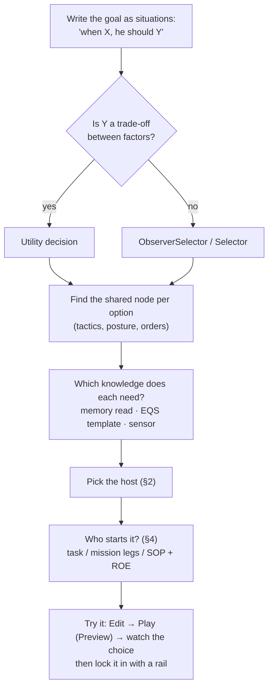

---

## 8. Worked example — the "universal soldier" rifleman

**Goal:** move through an urban area; on the way eliminate or avoid threats, counting his chances (they may
come in groups); don't over-expose; retreat if needed; flank and surprise from a good firing position.

| situation in the goal | role | block chosen | why this one |
|---|---|---|---|
| move to a point while fighting | ③ node | `AdvanceAndAttack` | moves and fires at the top threat in one step |
| weigh odds, health, cover against each other | ④ decide | **utility** `CombatPostureDecision` | it is a trade-off (§3) — `EnemyStrengthRatio` sums the danger of *every* remembered contact, so a group weighs more |
| don't over-expose | ⑤ know | `FindCoverFromTarget`, `FindOpenFiringPosition` | both score spots by exposure to all known threats |
| take cover / retreat | ③ node | `TakeCover`, `FallBack` | own their query, aim at the threat (or a heard point), move |
| flank / surprise from a firing position | ④ + ③ | **nested utility** `AttackApproachDecision` (P2) → `Flank` / `FiringPosition` | only scores a manoeuvre when the threat **cannot see him** — the surprise rule |
| re-decide instantly when things change | ④ | **P1** Parallel + ObserverSelector | branch switches the tick the winner changes; deactivators clean up (P6) |
| the host | ② | **BTree** | prioritised, re-checked logic around shared nodes (§2) — shipped as `CombatPosture` |
| through the town | ① | **mission plan** legs (P4): `CombatPosture` → `DangerCrossing` → `CombatPosture` | one objective per leg; a watched street is its own behaviour |
| who is in charge during a leg | ① | ROE `FireAtWill` + **`StayOnTask`** | the task is smart; the SOP must not replace its choices (§4) |
| when he has no orders | ① | SOP `BasicInfantrySop` (P3) | the safety net |

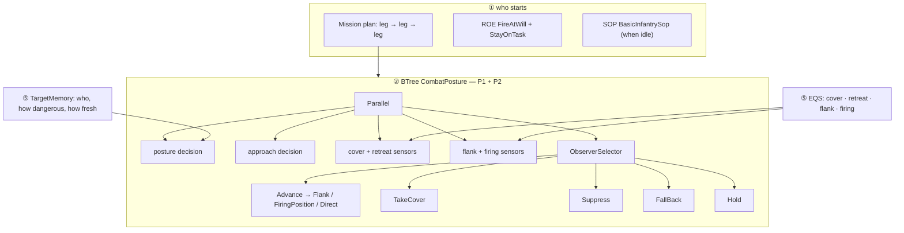

⭐ Nearly all of this ships as **`CombatPosture`**; the step-by-step with scenario JSON, parameters and tuning is
in [TUTORIAL_Universal_Soldier.md](TUTORIAL_Universal_Soldier.md).

---

## 9. Gaps to design around (2026-10-06)

| gap | consequence | workaround |
|---|---|---|
| no utility **editor** | decisions are C# | copy a starter-pack decision, change weights / inputs |
| no **re-routing** around a threat | "avoid" = cover / fall back, then continue | split the route into legs around known danger |
| a hurt unit on **open ground** finds no cover / retreat point ([CE-3090](blueprints/Blueprint_Issues_Tracker.md)) | no defensive posture there | keep legs near structures |
| BTree inspector cannot bind a stateful node's working state (CE-2099) | utility-in-BTree trees are hand-edited JSON | start from `CombatPosture.btree.json` |
| BTree / blueprint sensor nodes have no **heard-point** pin | only C# tactics nodes aim at a sound | use the tactics nodes |
| **thermal** built but no unit has heat data | no night detection by heat | — |
| squad manoeuvre (U7) | no squad-level flanking | units decide individually |
