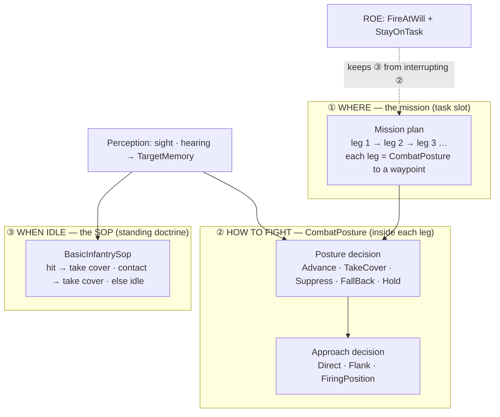
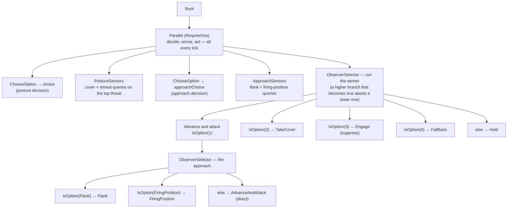
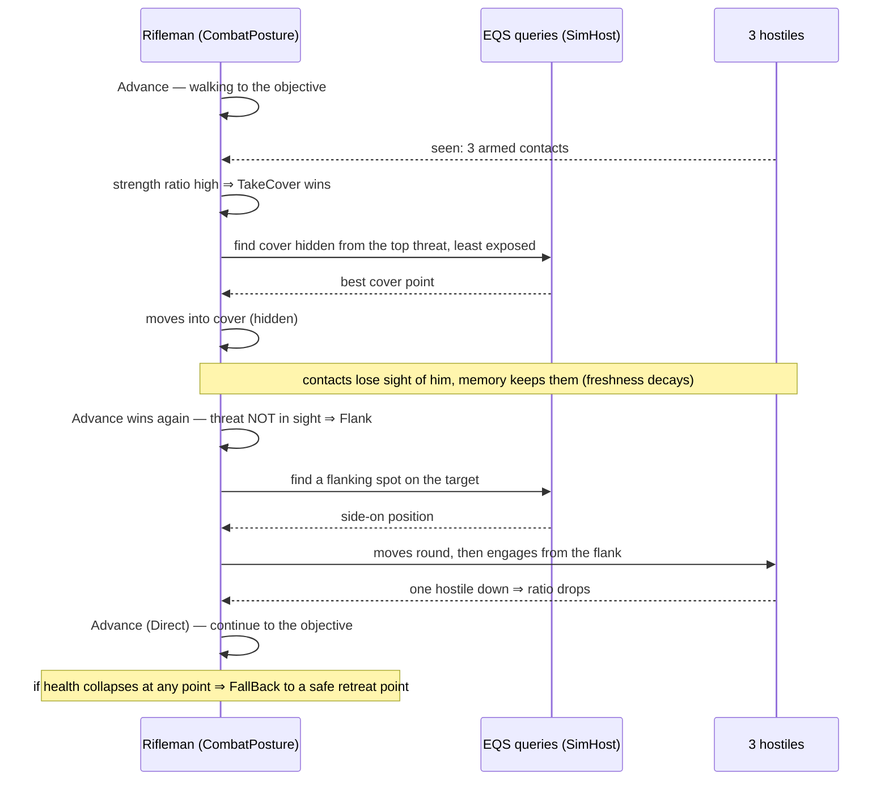
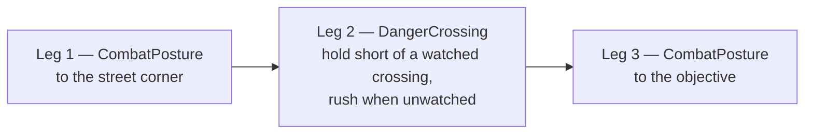
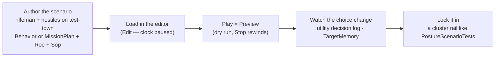

<!--STATUS
state: LIVE
updated: 2026-10-06
current-answer: the whole file — a TUTORIAL composing shipped building blocks; §8 lists what is NOT possible yet
stale-below: none
known-rot: none known; every asset / parameter quoted here was read from the repo on 2026-10-06 — re-check §8 against the tracker
related-designs:
  - docs/TUTORIAL_Behaviour_Composition.md — the GUIDE to choosing between blocks (host, decision, starter, sensing) and composing them
  - docs/OVERVIEW_Behaviour_Building_Blocks.md — the map of every building block this tutorial uses
  - docs/DESIGN_Decision_Layer.md — owns the task / SOP / reaction gate (§4) and utility-in-BTree (§3.3)
  - docs/DESIGN_Sensors_And_Doctrine.md — owns sensors, memory, threat = danger × freshness (§7.8)
  - docs/DESIGN_Eqs_Consuming_Behaviours.md — owns the TakeCover / FallBack / Flank / FiringPosition nodes
  - docs/designs/eqs-2/EQS_Design_v1.3_final.md — owns the cover / retreat / flank / firing-position queries (§19)
  - docs/DESIGN_Utility_AI_Demo_Scenarios.md — owns the U1–U7 demos that exercise the same pieces
-->

# Tutorial — an autonomous "universal soldier" rifleman

**Goal.** A rifleman moves through an urban area to an objective, and on the way handles whatever he meets:
he weighs his chances against what he knows (including groups), takes cover rather than standing exposed,
falls back when it goes badly, and — when the enemy cannot see him — flanks or moves to a good firing
position instead of walking straight in.

⭐ **The good news:** almost all of this is already one shipped behaviour, **`CombatPosture`**. The tutorial
shows how to use it, how it thinks, how to chain it through a town, how to make it your own — and, honestly,
what it cannot do yet (§8).

---

## 1. The idea — three layers



*What the picture shows:* the "smart combat" lives INSIDE the task (②), not in reactions. The SOP (③) is the
safety net for the moments the unit has no task. ROE decides which of the two is in charge while a task runs.

---

## 2. Step 1 — one leg: send him to a point, fighting on the way

Give the rifleman the `CombatPosture` behaviour as his task, with an objective. This is exactly what the
`tt-posture` recipe does
([`Recipes/Scenarios/tt-posture/scenario.json`](../Hrot/Subsystems/Hrot.AI.Behaviors/Recipes/Scenarios/tt-posture/scenario.json)):

```json
"Behavior": {
  "Name": "CombatPosture",
  "Params": "{\"advance\":{\"Objective\":[325,300,0],\"Speed\":2,\"ArrivalRadius\":3,\"CooldownSeconds\":1}}",
  "Origin": "Superior"
}
```

| param (`advance.*`) | meaning |
|---|---|
| `Objective` | where to go (world x, y, z) |
| `Speed` | walking speed, m/s |
| `ArrivalRadius` | "close enough" — the leg ends here with Success |
| `CooldownSeconds` | seconds between shots while advancing |

That alone already gives you: advance while shooting at the top threat; drop into cover when outgunned;
suppress; fall back when hurt; flank or take a firing position when the enemy can't see him.

---

## 3. Step 2 — how it thinks

### 3.1 The tree, as shipped

[`Assets/BTrees/Tactics/CombatPosture.btree.json`](../Hrot/Subsystems/Hrot.AI.Behaviors/Assets/BTrees/Tactics/CombatPosture.btree.json):



*What the picture shows:* the decisions and the sensors run **side by side** with the acting branch, so the
choice is re-scored every tick and the ObserverSelector switches branch the moment the winner changes — no
"finish what you started" lag. The sensors exist so the decision can score options (a cover option is only as
good as the best cover the query found).

### 3.2 The posture decision — "counting his chances"

[`CombatPostureDecision.cs`](../FDP/Toolkits/Fdp.Toolkits/Utility/StarterPack/CombatPostureDecision.cs) — each
option is scored 0..1 from inputs; the highest wins, with a **0.08 hysteresis bonus** for the current winner
so he doesn't flicker between two close options.

| option | scored from (weight, curve) | reads as |
|---|---|---|
| **Advance & attack** | health (0.7, ↑) · ammo (0.9, threshold) · **enemy strength ratio (0.8, ↓)** | healthy, armed, not outgunned |
| **Take cover** | health (0.8, ↓) · **best cover found (1.0)** · strength ratio (0.6, S-curve) | hurt or outgunned, and real cover exists |
| **Suppress** | ammo (0.9) · has a live target (step) · health · strength ratio (S-curve) | fight from where he is |
| **Fall back** | health (1.0, ↓²) · **best retreat point (0.8)** · strength ratio (0.7, S-curve) | badly hurt and losing, with somewhere to go |
| **Hold** | 0.2 + a little health | the floor — nothing better |

⭐ **"Chances against a group"** is the **enemy strength ratio**
([`StandardInputs.cs:255`](../FDP/Toolkits/Fdp.Toolkits/Utility/Inputs/StandardInputs.cs)):
`Σ danger of every remembered contact ÷ (that + own strength)`. Three armed hostiles weigh 3× one; an unarmed
one weighs 0.3; a contact he only **heard** counts too (by its sound class). So a group tips him from
Advance toward Cover / FallBack automatically.

⭐ **"Don't expose himself"** is in the **queries**, not the decision: the cover, retreat and firing-position
searches all score candidate spots with **threat exposure** — how many of the threats he knows of can see that
spot ([EQS design §19.5](designs/eqs-2/EQS_Design_v1.3_final.md)).

### 3.3 The approach decision — "flank and surprise"

[`AttackApproachDecision.cs`](../FDP/Toolkits/Fdp.Toolkits/Utility/StarterPack/AttackApproachDecision.cs) —
only consulted while the posture is Advance:

| option | scored from | reads as |
|---|---|---|
| **Direct** | threat in sight now · +0.4 | he's already seen / in a firefight — just go |
| **Flank** | has a live target · threat **NOT** in sight · best flanking spot | the enemy is known but not watching him → go round |
| **FiringPosition** | has a live target · threat **NOT** in sight · best open firing spot | → take a spot that sees the enemy, then engage |

⭐ That "**not in sight**" factor is the surprise rule: he only manoeuvres when the enemy can't see him, and
fights directly when it can.

### 3.4 A fight, step by step



---

## 4. Step 3 — the route through town: chain legs in a mission plan

One `CombatPosture` goes to one point. A route = a **mission plan** of legs; each leg starts when the previous
one finishes (`BehaviorFinished`). The shape is the one the `ua-danger-crossing` scenario uses
([`scenarios/ua-danger-crossing/scenario.json`](../scenarios/ua-danger-crossing/scenario.json)):

```json
"MissionPlan": { "PlanData": { "activeTaskId": "00000000-0000-0000-0000-000000000000", "tasks": [
  { "taskId": "<guid-1>", "executingEngine": "", "behaviorName": "CombatPosture",
    "behaviorParams": "{\"advance\":{\"Objective\":[220,180,0],\"Speed\":2,\"ArrivalRadius\":3}}",
    "triggers": [{ "type": "BehaviorFinished", "params": "" }] },
  { "taskId": "<guid-2>", "executingEngine": "", "behaviorName": "DangerCrossing",
    "behaviorParams": "{\"sensor\":{\"RouteTo\":[285,220,0]},\"walk\":{\"X\":285,\"Y\":220,\"Speed\":1.5,\"ArrivalRadius\":3}}",
    "triggers": [{ "type": "BehaviorFinished", "params": "" }] },
  { "taskId": "<guid-3>", "executingEngine": "", "behaviorName": "CombatPosture",
    "behaviorParams": "{\"advance\":{\"Objective\":[325,300,0],\"Speed\":2,\"ArrivalRadius\":3}}",
    "triggers": [{ "type": "BehaviorFinished", "params": "" }] }
] } }
```



*Why a separate crossing leg:* an open street is the one place `CombatPosture` handles poorly (it walks the
direct line). `DangerCrossing` waits short of a crossing an enemy is watching and crosses when the watch lifts
([Utility Demo §10.4a](DESIGN_Utility_AI_Demo_Scenarios.md)). ⚠ It does no fighting itself — see §5.

---

## 5. Step 4 — ROE and SOP: who is in charge

```json
"Roe": { "Fire": "FireAtWill", "Reactions": "StayOnTask", "SetBy": "Superior" },
"Sop": { "Name": "BasicInfantrySop", "Params": "{}", "Origin": "Superior" }
```

| setting | why |
|---|---|
| `Fire: FireAtWill` | he may open fire on his own. `HoldFire` would make every shot fail in the weapon executor — no behaviour can bypass it |
| ⭐ `Reactions: StayOnTask` | while a leg runs, the SOP's reactions are **refused** (`BehaviorIngressSystem.cs:248`). Without it, the SOP's "first contact → TakeCover" row would **pause** `CombatPosture` the moment a threat appears — replacing the smart choice with a blunt one |
| `Sop: BasicInfantrySop` | the safety net when he has **no** task (mission finished, or between orders): hit → take cover, contact → take cover, else idle |

⚠ **The trade-off you are choosing:** with `StayOnTask`, a contact during a `DangerCrossing` leg is also not
reacted to (that leg doesn't fight). If you prefer reactions there, use `Reactions: React` — but then the SOP
pre-empts `CombatPosture` legs too. ⭐ **Lean: `StayOnTask`**, and keep crossing legs short.

---

## 6. Step 5 — make it yours

### 6.1 Tune the numbers, no code

Every parameter in §3 is a blackboard variable with a default, overridable per unit in the scenario's
`behaviorParams` JSON — the same way `advance` is set:

| variable | default | turn it to |
|---|---|---|
| `sensors.SearchRadius` | 60 m | how far he looks for cover / retreat |
| `cover.MinRepositionMetres` | 5 m | how big a better spot must be before he moves again |
| `approachSensors.SearchRadius` | 40 m | how far he looks for flank / firing spots |
| `flank.Speed`, `firing.Speed` | 3 m/s | how fast he manoeuvres |
| `fallback.Speed` | 2.5 m/s | how fast he withdraws |

### 6.2 Change *how he decides* — your own decision (C#)

⚠ There is **no utility editor yet** — decisions are C#. Copy the posture decision and change what you want;
reuse the `Posture` options so the tree's branches still match:

```csharp
[UtilityDecision(
    assetId:         "<your-own-unique-id>",
    displayName:     "Universal soldier posture",
    kind:            DecisionKind.PostureSelect,
    category:        "Tactical/Posture",
    hysteresisBonus: 0.10f,                      // a bit stickier
    OptionNames = typeof(Posture))]
public sealed partial class UniversalSoldierPosture : IUtilityDecisionDefinition
{
    public static void Build(IUtilityDecisionBuilder b) => b
        .Option((ushort)Posture.AdvanceAndAttack, ScoringMode.WeightedProduct, o => o
            .Consider(In.HealthFraction(),     0.7f, Curve.Linear)
            .Consider(In.AmmoFraction(),       0.9f, Curve.Threshold)
            .Consider(In.EnemyStrengthRatio(), 1.0f, Curve.InverseLinear))   // more cautious vs groups
        // … TakeCover / Suppress / Flee / Hold as in CombatPostureDecision, tuned to taste
        ;
}
```

Then point the tree at it: copy `CombatPosture` (editor: File → New Behavior…, or copy the JSON with a new
`AssetId`) and set its `choose` variable to `{"Decision":"<your-own-unique-id>"}`. The catalog finds the new
decision by its attribute — no registration code.

Inputs you can use (21 in [`StandardInputs.cs`](../FDP/Toolkits/Fdp.Toolkits/Utility/Inputs/StandardInputs.cs) +
squad ones in `SquadInputs.cs`): health, ammo, weapon ready, threat in sight, contact danger / freshness /
threat level, line of sight, `EnemyStrengthRatio`, EQS top score / result count, weapon range fit /
effectiveness, and for a squad `SquadStrengthRatio`, `SquadKnowsContact`.

---

## 7. Step 6 — try it



Closest worked examples to copy from: `tt-posture` (one leg), U1 `ua-posture` (postures react to health),
U4 `ua-attack-approach` (Direct / Flank / FiringPosition behind a wall), `ua-danger-crossing` (the crossing),
`tt-take-cover`, `tt-heard-shot` (reacting to a shot he only heard). Runbook:
[RUNBOOK_Utility_AI_Demos](RUNBOOK_Utility_AI_Demos.md).

---

## 8. What it cannot do yet — read before you rely on it

| you might expect | today | tracked |
|---|---|---|
| a hurt soldier takes cover or falls back | ✅ **fixed (`CE-3092`)**: a wounded soldier keeps moving; only death, or a platform that opts into a mobility kill in its TKB entry (the APC), stops a unit on a hit | [CE-3092](blueprints/Blueprint_Issues_Tracker.md) — done |
| he wins against a group by tactics | ⛔ **the combat model is symmetric**: every shot flies straight at the target, hits whatever the line meets, 25 damage — no range, motion, stance or cover in hit chance, and Suppress has no effect on the enemy. Two soldiers who see each other fire in the same frame (LOS is symmetric) and trade hit for hit, so 1 vs 3 is lost by arithmetic. Measured on `ua-universal-soldier` (CE-3094) | [CE-3094](blueprints/Blueprint_Issues_Tracker.md) |
| **avoid** a threat by re-routing around it | ⛔ no re-routing. "Avoid" = take cover / fall back, then continue the same leg | — (not designed) |
| a route as one order | ⛔ one objective per leg — use the mission plan (§4) | — |
| a hurt soldier in the **open** finds safety | ⚠ the cover / retreat queries find nothing on open ground ⇒ no defensive posture there. Urban areas (walls) are fine | [CE-3090](blueprints/Blueprint_Issues_Tracker.md) |
| fighting during a crossing leg | ⚠ `DangerCrossing` does not fight (§5 trade-off) | — |
| editing decisions in the editor | ⛔ C# only (§6.2) | Decision Layer §2 |
| seeing enemies by heat (night) | ⚠ thermal sensing is built, but no shipped unit has heat data | Thermal & Acoustic §8.1 |
| a squad coordinating the manoeuvre | ⛔ squad manoeuvre (U7) not built | CE-507 |
| aiming queries at a heard shot from BTree / blueprint nodes | ⚠ only the C# tactics nodes can (the ones `CombatPosture` uses — so it works here) | Thermal & Acoustic §8 |
