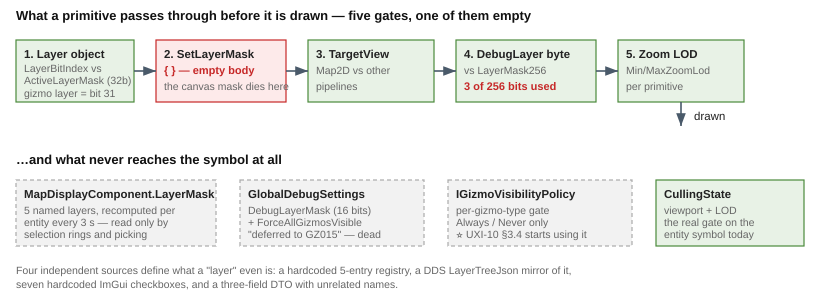

# Architect Question 28 — unifying map layers and entity filtering

> **For [UXI-28](UX_Issues.md#uxi-28) · opened 2026-08-12. Status: ◐ open — decisions pending.**
> Requested by the user: *"unification to a similar concept of defining, entity filtering and controlling
> map layers is desired; best if it follows the same sequence of default settings → overrides as the DDS
> net uses in IG, generalized. It needs to be compatible with the gizmo layers, as the whole map is
> rendered using gizmos."*
>
> Follows the format of [Q27](Architect_Question_27_Tool_Model.md): decision-shaped sub-questions, each
> with options, a recommended lean, and the reuse-vs-build tradeoff.

## 0. The verified ground truth

| | Mechanism | Reality |
|--:|---|---|
| 1 | `IMapLayer.LayerBitIndex` vs `MapCanvas.ActiveLayerMask` (32-bit) | gates **whole layer objects**. `DebugGizmoLayer` = bit 31; nothing clears it ⇒ always on |
| 2 | `DebugPrimitiveRenderer2D.SetLayerMask(ushort)` | 🔴 **empty body**. `DebugGizmoLayer.cs:100` pushes the canvas mask in; it dies there |
| 3 | `DebugPrimitive.DebugLayer` (byte) vs `LayerControlGizmo`'s `LayerMask256` | ✅ **the only filter that reaches drawn primitives**. Default `SetAll()`; a backend `LayerControlMask` primitive asserts authority for the frame. **3 of 256 bits used**; bits 3-255 force-set visible |
| 4 | `MapDisplayComponent.LayerMask` (uint, 5 named layers) | computed per entity every ~3 s by `MapLayerAssignmentSystem` — 🔴 **read only by selection rings and picking; the symbol emitter never reads it** (always `layer: 0`) |
| 5 | `GlobalDebugSettings.DebugLayerMask` + `IGizmoVisibilityPolicy` | both deferred-dead ("GZ015 Phase 6"); ⭐ UXI-10 §3.4 begins using the policy |

**Four independent definition sources**: the hardcoded `MapLayerRegistry` (5 predicates), the DDS
`IGCapabilitiesAnnounce.LayerTreeJson` (a runtime *mirror* of it, **published and unconsumed**), seven
hardcoded `ConfigPanel` checkboxes, and `LayerControlDto`'s three unrelated names.

⭐ **The good news, and the spine of every answer below:** mechanism 3 **already is** the shape the user
asked for — *permissive default, backend asserts authority per frame*, travelling as a gizmo primitive.
It is the same default→override sequence as IG's DDS style layer, and it is gizmo-native by construction.
**The work is to widen and feed it, not to invent it.**

---

## A. Partition or tags — 🔒 **RULED: tags**

> **User, 2026-08-12:** *"I would like one entity **or gizmo** to belong to more than one layer."*

⇒ **A2.** Multi-membership, and it applies to **both axes** — an entity carries classes, a gizmo carries
kinds, and a primitive belongs to the union. C below collapses accordingly.

## B. 🔒 **RULED: the byte becomes a combination id** — and it costs nothing on the wire

> **User, 2026-08-12:** *"Maybe the `DebugLayer` byte for the gizmo needs to be dynamically calculated out
> of the bitmasks?"*

⭐ **This works, and it is better than widening the struct.** Reinterpret the byte as an **index into the
set of tag-combinations actually in use this frame**, not as a layer id:

| Stage | What it does | Change |
|---|---|---|
| **Backend, per entity** | tags → 64-bit mask (already computed by `MapLayerAssignmentSystem`) | reuse |
| **Backend, at emit** | `id = intern(entityMask \| gizmoKindMask)` → a byte | **new, small** |
| **Backend, once per frame** | for each interned combination, evaluate *"is this combination visible?"* → set bit *id* in the `LayerMask256` it already emits as `LayerControlMask` | **new, small** |
| **Renderer** | `if (!activeLayers.IsSet(prim.DebugLayer)) continue;` | 🔒 **unchanged, byte for byte** |

| | |
|---|---|
| ✅ **No wire-format change** | `DebugPrimitive` stays 64 bytes; no spare-offset audit needed; the DDS terminal path is untouched |
| ✅ **The renderer stays a dumb terminal** | it never learns what a layer *is* — exactly the architecture the gizmo pipeline was built for |
| ✅ **Combination ids never leave the frame** | the primitives *and* the mask come from the same backend frame, so they cannot disagree |
| ✅ **The visibility policy lives in one place** | ANY/ALL (see B′) is a backend decision, changeable without touching the renderer or the wire |

⚠ **Two costs, both real:**

| | |
|---|---|
| **256-combination ceiling** | 64 layers ⇒ up to 2⁶⁴ combinations, but only *observed* ones get ids. In practice entities cluster into few distinct tag sets. 🔴 **Overflow must be explicit** — on the 257th, degrade to "always visible" **and log**, never silently drop |
| **Interning cost per primitive** | ⇒ **cache the id, don't intern per primitive**: store it next to the mask in `MapDisplayComponent` (recomputed by the system that already recomputes the mask), then combine with the gizmo's kind via a small `[entityCombination × gizmoKind] → id` table |

### 🔴 B′ — the blocker: `DebugLayer` has **three** jobs, not one

Verified — the byte is also:

| Job | Evidence |
|---|---|
| 1. visibility filter | `DebugPrimitiveRenderer2D.cs:96` |
| 2. 🔴 **primary painter's-algorithm sort key** — `DebugLayer` ascending, `ZIndex` as tie-break | `:175-180` |
| 3. 🔴 **hit-test priority** — highest `DebugLayer` wins the pick | `DebugGizmoLayer.cs:447` |

⇒ **An interned combination id would scramble draw order and make pick priority arbitrary.** Today
`Perception`(1) and `AiHelpers`(2) deliberately draw *above* `Entities`(0), and that ordering is a side
effect of the layer numbering.

**The separation is available**: `DebugPrimitive.ZIndex` already exists — *"intra-layer sort;
0=background"*. So:

| | Option |
|--:|---|
| **B′1** | **Sort and hit-test by `ZIndex` alone**; `DebugLayer` becomes purely the visibility key. ⚠ Requires assigning meaningful `ZIndex` values to reproduce today's ordering |
| **B′2** | Keep an ordering byte separate from the combination id — ⚠ needs a spare byte after all |
| **B′3** | Make interning **order-preserving** (allocate ids in ascending primary-layer order) — ⚠ fragile: ids shift as combinations appear |

**Lean: B′1.** It uses a field built for exactly this, and it makes draw order *declared* rather than an
accident of layer numbering. ⚠ It is a **visible change to the production map's draw order** — needs a
before/after check on IG, and a golden-image or ordering test.

⚠ **Also note a stale doc comment**: `DebugGizmoLayer.cs:91` claims *"`DebugLayer` is **NOT** used as a
Z-order key"* — while `:447` uses it to choose the pick winner and `:178` sorts by it. Whatever is decided,
that comment must stop lying.

### B″ — 🔴 ANY or ALL? (new, and it decides operator behaviour)

A primitive tagged `{ground, hostile}`; the operator hides `hostile`.

| | Rule | Result |
|--:|---|---|
| **ANY** | visible if **any** of its tags is visible | ⛔ still shown — it is still `ground`. *"Hide all hostiles"* silently fails |
| **ALL** | hidden if **any** of its tags is hidden | ✅ hidden |

**Lean: ALL.** It makes *"hide hostiles"* and *"hide perception overlays"* both behave as an operator
expects, and it makes the two axes compose — a perception cone on a hostile unit tagged
`{perception, hostile, ground}` disappears when *either* `perception` or `hostile` is switched off.
⚠ **The asymmetry to accept:** the more tags an entity carries, the easier it is to hide. An untagged
primitive (combination 0, empty set) is **always visible** — which preserves today's permissive default.

## C. The two axes — 🔒 collapsed by the tags ruling

Ruling A2 covers *"entity **or gizmo**"*, so **one tag space serves both**: entity classes (ground, air,
vehicles, graphics, roads) and visual kinds (entities, perception, ai-helpers) are bits in the same 64-bit
space, and a primitive's combination is the union of the two.

⇒ My earlier lean (C3 — move visual kinds to `IGizmoVisibilityPolicy`) is **withdrawn**: it cannot express
*"hide perception overlays **on hostiles only**"*, which one tag space with ALL semantics gets for free.
⚠ The policy seam still earns its keep for **culling** ([UXI-10](UX_Feature_Entity_Symbology.md) §3.4) —
a different job, per gizmo type, not per tag.

## D. Where do layer definitions come from?

**Lean: host-declared defaults + IG's DDS override**, mirroring [ruling 20](UX_RESUME_INTERACTION.md)'s
source layering exactly:

| Layer of the sequence | Source |
|---|---|
| default | the host registers its own layer set at startup (service maps: the 5 classes; IG: the same, plus whatever it announces) |
| override | 🔒 **IG only** — the DDS layer tree |

⇒ `MapLayerRegistry`'s 5 hardcoded predicates become **one host's registration**, not a global truth, and
`LayerTreeJson` stops being a mirror of a constant and becomes the actual override channel. ⚠ **Note it is
currently published and consumed by nobody** — ExCon has no reader.

## E. What gets deleted?

| | Verdict |
|---|---|
| `SetLayerMask(ushort) { }` | 🔴 **delete or implement — do not leave.** It reads as working code |
| `GlobalDebugSettings.DebugLayerMask` / `ForceAllGizmosVisible` | **delete** — deferred since GZ015, its UI is a literal stub |
| `MapCanvas.ActiveLayerMask` + `IMapLayer.LayerBitIndex` | **keep** — genuinely different granularity (whole layer objects: grid, roads, trajectories) |
| The duplicate `ConfigPanel` / `MapLayerState` / `IMapConfigController` (byte-identical in two projects) | **delete one** — folds in [UXI-14](UX_Issues.md#uxi-14) |
| `MapLayerRegistry`'s copy of `MapLayerBits`' constants | **delete** — the file's own comment admits they are hand-synced |

## F. One layer UI, or two?

Today there are **two unrelated panels**: `LayerControlGizmo`'s generic StructInspector (3 checkboxes,
gizmo-emitted) and `ConfigPanel` (7 checkboxes, ImGui, duplicated). Neither is generated from a registry.

**Lean: one panel, generated from the registered layer set** — so adding a layer needs no UI edit. Keep
the **gizmo-emitted** delivery, since that is what already works remotely and satisfies the
gizmo-compatibility constraint.

## G. Which hosts get which layers?

**Lean: every host registers the same five entity classes** (they are generic — ground/air/vehicles/
graphics/roads), and hosts differ only in *overrides*. ⚠ Today `MapLayerAssignmentSystem` runs only in IG
and the Editor; **CGF registers no `LayerControlGizmo` at all**, so it is silently all-visible.

---

## Open, needing your ruling

✅ **Settled:** A = tags (entities *and* gizmos) · B = combination-id byte, no wire change · C = one tag
space.

| # | Question |
|--:|---|
| **1** | 🔴 **B′ — draw order.** The combination-id trick requires taking sort **and** hit-test priority off `DebugLayer`. Move both to `ZIndex` (my lean), and accept a **visible change to IG's draw order** that needs an ordering test? |
| **2** | 🔴 **B″ — ANY or ALL?** My lean is **ALL** (hidden if any tag is hidden), so *"hide hostiles"* works and the axes compose |
| **3** | **Overflow policy** — on the 257th distinct combination: degrade to always-visible + log (my lean), or evict least-recently-used? |
| **4** | **E — `MapCanvas.ActiveLayerMask` survives** as the whole-layer-object switch? Or should everything collapse into one mechanism? |
| **5** | Should **selection/highlight** and **search results** become tags too? With one tag space they *can* be — *"dim everything except my search hits"* becomes free. Your phrase was *"defining, entity filtering and controlling map layers"*, so filtering may be wider than layers |
| **6** | **How many layers may be defined?** My lean caps the tag space at **64** (a `ulong` interns cheaply); today's total is 8 |
