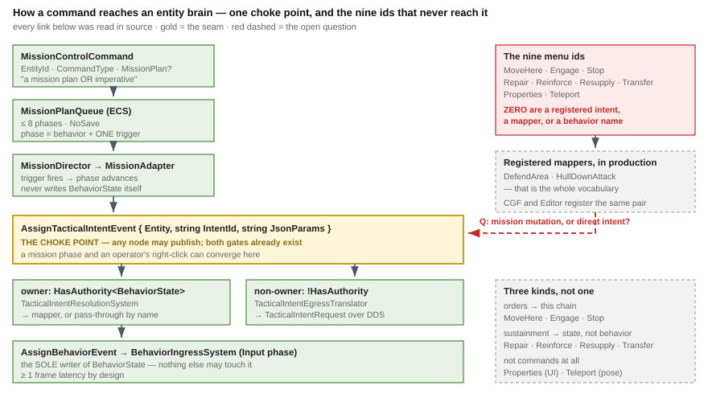

# Architect Question 29 — entity commanding: what a map "order" actually is

> **For [UXI-32](UX_Issues.md#uxi-32) · opened 2026-08-13. Status: ✅ **FULLY ANSWERED, 2026-08-13** —
> rulings 38-46, **no open decisions**. §B, §C, §E, §F, §H, §I and §J are settled; §D and the
> parameter-authoring work are deliberately scoped out to a later design.**
> Raised by the user, 2026-08-13: *"the actions like MoveHere, Engage, Stop, Properties, Teleport, Repair,
> Reinforce, Resupply, Transfer are unresolved and need a dedicated design pass. **The only supported way
> of commanding entities now is via a mission having a list of conditional behaviors to perform.** This is
> not ExCon-only, must be equally supported by the CGF subsystem (who owns the entity brain)."*
>
> ⇒ This **supersedes [UXI-23 §5](UX_Feature_Map_Parity.md)**, whose A/B/C options all assumed the nine ids
> were ordinary actions with missing handlers. They are not.
> ⚠ [Correction 33](UX_Tasks_Detail.md#corrections) records why my *"keep them ExCon-only"* lean was wrong.
>
> Format follows [Q28](Architect_Question_28_Map_Layers.md): decision-shaped sub-questions, each with
> options, a recommended lean, and the reuse-vs-build tradeoff.



## 0. Verified ground truth — the commanding chain, end to end

**Every link below was read, not inferred.**

| Stage | What | Where |
|--:|---|---|
| 1 | `MissionControlCommand { EntityId, eMissionCommandType, MissionPlan?, TaskId, BaseVersion }` — *"wrapper for a mission plan **or imperative**"* | `Hrot.Core/Network/Commands.cs:27-34` |
| 2 | `MissionControlExecutionSystem` applies it. ⚠ Requires a **live** `EntityRepository`; waits **10 frames** for the entity then NAKs `EntityNotFound` | `Hrot.Common/Systems/MissionControlExecutionSystem.cs:42-46,87-90` |
| 3 | `MissionPlanQueue` — **≤ 8 phases**, `DataPolicy.NoSave` | `Fdp.Toolkits/Behavior/Components/MissionComponents.cs:140-163` |
| 4 | `MissionDirectorSystem` evaluates the phase trigger and publishes the transition | `Fdp.Toolkits/Behavior/Systems/MissionDirectorSystem.cs:27-41` |
| 5 | `MissionAdapterSystem` detects the phase change and publishes an **`AssignTacticalIntentEvent`**. 🔒 It *"intentionally does **not** mutate `BehaviorState` or `BrainBlackboard` directly"* | `Hrot.CGF/Systems/MissionAdapterSystem.cs` |
| 6 | ⭐ **`AssignTacticalIntentEvent { Entity, string IntentId, string JsonParams }`** — the choke point | `Fdp.Toolkits/Behavior/Events/AssignTacticalIntentEvent.cs:23-43` |
| 7 | **Complementary authority gates** — `TacticalIntentResolutionSystem` runs `if (!HasAuthority<BehaviorState>) continue`; `TacticalIntentEgressTranslator` runs `if (HasAuthority<BehaviorState>) continue` and writes `TacticalIntentRequest` | `TacticalIntentResolutionSystem.cs:93-95` · `TacticalIntentEgressTranslator.cs:72` |
| 8 | `ITacticalOrderMapper.TryMap(self, repo, jsonParams, out AssignBehaviorEvent)` — or **pass-through**, treating `IntentId` as a behavior name | `ITacticalOrderMapper.cs:23-55` |
| 9 | `BehaviorIngressSystem` (**Input** phase) — 🔒 **the sole `BehaviorState` writer** | guide `:472-474` |

### ⭐ The ECS tier keeps **both** representations — authored *and* executable

⚠ **An earlier draft of this document said the wire DTO was strictly richer than the runtime. That was
wrong** — it missed the managed component. `MissionControlExecutionSystem` writes **both**, in the same
block (`:182-186`):

```csharp
repo.SetComponent(entity, queue);                                    // executable, ≤8, ints + enum
repo.SetManagedComponent(entity, new ActiveMissionPlan { Plan = domainPlan });  // authored, unbounded, strings
SmartEgressUtil.MarkDirty(repo, entity, EntityMissionDescriptorOrdinal);
```

| | `ActiveMissionPlan` — **authored** | `MissionPlanQueue` — **executable** |
|---|---|---|
| kind | **managed** component (`DomainMissionPlan.cs:45-49`) | unmanaged, ECS-chunk (`MissionComponents.cs:140`) |
| plan | `List<DomainMissionTask>` — **unbounded** | **≤ 8** phases, `[InlineArray]` |
| step | `string BehaviorName`, `string BehaviorParams`, `string ExecutingEngine` | `int BehaviorId` |
| condition | **`List<DomainMissionTrigger>`**, each `{ string Type, string Params }` | **one** enum + **one** float |

⇒ 🔒 **The authored surplus is not lost — it is retained beside the projection.** The real question
becomes *which* one is authoritative when they disagree, and whether the operator is told (§D).

⚠ `BehaviorName` crosses as a **string** while the runtime uses an **int**, and the engine forbids the
obvious conversion: *"`BehaviorId`s are stable forever, never reused… **never `string.GetHashCode()`** —
use `BehaviorIds` + `TryGetId`"* (guide `:469-471`).

### What is actually registered today

| | |
|---|---|
| **`ITacticalOrderMapper` implementations, registered in production** | **two**: `DefendArea`, `HullDownAttack` — registered identically by **CGF** (`CgfSubsystem.cs:321-323`) and the **Editor** (`EditorSubsystem.cs:863-865`) |
| Defined but **never registered** | `ForceManeuverMapper`, `ClearForceManeuverMapper` (`Fdp.Toolkits/Squad/Mappers/`) |
| Of the **nine** menu ids | **zero** are a registered intent, a mapper, or a behavior name |

### 🔴 Of the five imperative verbs, **two are dead**

| Verb | Producers | Handler |
|---|---|:--:|
| `CMD_REPLACE_MISSION` | **four** — IG (`IgApplication.cs:3019`, `MiniExConPanelState.cs:249`), Editor (`EditorMissionService.cs:145`), ExCon (`MissionEditorService.cs:107`), SimHost (`SimHostVisualization.cs:283`) | ✅ |
| `CMD_JUMP_TO_TASK` | `MissionPanel.cs:152` | ✅ |
| `CMD_ABORT_ALL` | ⭐ **ExCon's ORBAT panel** (`OrbatPanel.cs:309`) | ✅ |
| 🔴 `CMD_APPEND_TASK` | **none** — the enum member and one `[DdsCase]` attribute, nothing else | ❌ falls to `default:` → `NotSupported` (`:243-245`) |
| 🔴 `CMD_INSERT_TASK` | **none** | ❌ same |

⇒ **There is no "add one task to a plan" operation today.** Every editor rewrites the whole plan.

### ⭐ And the authoring panel already exists — shared, and not where the brain is

| | |
|---|---|
| **`MissionPanel`** — **815 lines**, a full task/trigger editor (add · delete · move · edit behavior + params · edit trigger type + params · Commit / Force-Commit / Jump / Abort) | `Hrot/Engine/Hrot.Presentation/Panels/MissionPanel.cs` — an **engine-level shared panel** |
| Hosted by | **ExCon** (`ExConSubsystem.cs:357`) and the **Editor** (`EditorSubsystem.cs:1582`) |
| 🔴 **Not hosted by** | **CGF** — the node that owns the brain — nor SimHost, nor IG |
| ⭐ And the Editor already chains map selection into it | *"Synchronise map selection to the `MissionPanel` using Network ID"* (`EditorSubsystem.cs:1651`) — **the pattern CGF needs already exists, one host over** |

⇒ ⭐ **Seam-law instance 21.** The user's *"must be equally supported by CGF"* is, in large part,
**hosting a panel that is already shared** — not building a mission UI.

⭐ **The spine of every answer below:** stage 6 is a **single choke point that any node may publish to**,
already authority-routed and already network-transparent. A mission phase and an operator's right-click
can converge on it. **The work is to feed it, not to invent a path.** ⇒ **seam-law instance 20.**

---

## A. The nine ids are **three different kinds**, not one — 🎯 split them first

| Kind | Ids | Why it is different |
|---|---|---|
| **Tactical orders** | `MoveHere` · `Engage` · `Stop` | change what the entity *does* ⇒ must enter at stage 6 and end at a behavior |
| **Sustainment / logistics** | `Repair` · `Reinforce` · `Resupply` · `Transfer` | change entity **state or structure**, not behavior. `Transfer` may also mean re-parenting under `UnitRoster` (**cap 16 subordinates**, `UnitRoster.cs:32`) |
| **Not commands at all** | `Properties` · `Teleport` | `Properties` = *open the inspector*, a pure UI action. `Teleport` = a **pose write**, which [UXI-29](UX_Feature_Authority_Aware_Writes.md) already owns |

| | Option | Consequence |
|--:|---|---|
| **A1** | 🎯 **Split into the three kinds and route each to its own existing mechanism** | `Properties`/`Teleport` bind **immediately** under [UXI-23](UX_Feature_Map_Parity.md)/[UXI-29](UX_Feature_Authority_Aware_Writes.md) — they were never blocked. Only the first two kinds wait for this design |
| **A2** | Treat all nine uniformly as "orders" | forces `Properties` through the cognitive tier, which is absurd, and hides that two of the nine are already solvable |

**Lean: A1 — ✅ consistent with the rulings.** It shrinks the open question from nine ids to **seven**,
and unblocks two today.

> 🔒 **User, 2026-08-13:** *"There will need to be a behavior created for each of them (**full
> implementation out of scope of this — maybe just empty placeholder behaviors for now**)."*

⇒ 🔒 **[Ruling 39](UX_RESUME_INTERACTION.md): each order gets a real `BehaviorId` and a registered
behavior, but the behavior body may be an empty placeholder.** ⭐ That is what makes this slice
shippable — the *plumbing* is provable end to end (menu → intent → mapper → `BehaviorState`) without
anyone having to specify what *Resupply* means tactically.

⚠ **The engine constraint applies from day one, placeholder or not**: `BehaviorId`s are *"stable forever,
never reused"*, civilian 1001-1999 / military 2001-2999, project convention 3000+, and the registry must
be **fully written before the first frame** (guide `:469-471`, overview §8.3). ⇒ **allocate the ids
deliberately now**; a placeholder body can be replaced later, an id cannot.

### ⚠ And five of the nine are never even **emitted**

`Teleport` · `Repair` · `Reinforce` · `Resupply` · `Transfer` live on ExCon's `Admin` / `DamageControl` /
`Logistics` menu strategies (`ContextMenuLogic.cs:182-192`). 🔴 **`SetStrategy` has zero callers** — only
its own definition (`:81`) and the interface declaration (`IContextMenuLogic.cs:28`) — and
`_currentStrategy` defaults to `Standard` (`:40`). ⇒ **only `Properties` is ever emitted** of those six,
and it dead-ends at `GlobalActionDispatchSystem`'s silent no-op like the rest.

⇒ ⚠ **The register's *"43% of the vocabulary is inert"* ([UXI-23 §1](UX_Feature_Map_Parity.md)) understated
it**: five of those ids are not merely unhandled, they are **unreachable UI**. Deciding their fate costs
nothing today because nothing shows them.

## B. Does an operator right-click produce a **mission** or an **intent**? — 🔒 **RULED: intent**

> **User, 2026-08-13:** *"Mission plan exists both for saving to scenario (and being applied on scenario
> start) as well as for runtime modification (only whole-plan replace implemented now). **The right-click
> commands make sense at exercise runtime as immediate orders replacing any previously active behavior**…
> the right-click menu should issue the **tactical intent** (and replace any previous behavior)."*

⇒ **B1.** ⚠ **My lean B2 was wrong** ([Correction 35](UX_Tasks_Detail.md#corrections)) — I reasoned from
*"the only supported way of commanding is a mission"* to *"therefore a click edits the mission"*, but the
mission is the **planned** form and a right-click is an **immediate** one. They are different lifecycles,
not competing encodings.

| | |
|---|---|
| ✅ **`AssignTacticalIntentEvent` is published directly** — no plan round-trip, no `BaseVersion` conflict, no 8-phase cap |
| ✅ **§G's partial-failure problem disappears** — a fan-out is N intent publishes, not N versioned plan commits, so [UXI-24 §3.5](UX_Feature_Multi_Select.md)'s one-ECB atomicity **does** hold |
| ✅ **`CMD_APPEND_TASK` being dead stops mattering** — nothing needs it |
| 🔒 **The order replaces any previously active behavior** — which is already what `BehaviorIngressSystem` does on `AssignBehaviorEvent` (it resets `BrainBTreeState` and HSM instance state) |
| ⚠ **The mission will overwrite the operator's order** at the next phase transition | inherent to B1, and correct: the plan resumes control. ⚠ **Worth surfacing in the UI** — an operator who orders *Stop* and sees the unit move again 20 s later will call it a bug |

### The original options, kept for the record

| | Option | Consequence |
|--:|---|---|
| **B1** | **Direct `AssignTacticalIntentEvent`** — the click publishes an intent, bypassing `MissionPlanQueue` | ✅ one event, immediate, already authority-routed. 🔴 **Invisible to the mission**: `MissionAdapterSystem` will re-publish the phase's own intent on the next phase change and silently override the operator |
| **B2** | 🎯 **A mission mutation** — the click edits the entity's plan | ✅ **matches the user's statement literally**; the order is durable, inspectable and survives a phase change. 🔴 **But the natural verb does not exist**: `CMD_APPEND_TASK` has **no producer and no handler** and returns `NotSupported`. So B2 today means **read-modify-`CMD_REPLACE_MISSION`** — a whole-plan rewrite per order, with the `BaseVersion` conflict window that implies. ⚠ Costs a round-trip, and ⚠ **the 8-phase cap becomes user-visible** |
| **B2′** | B2, **after implementing `CMD_APPEND_TASK`** | ⭐ the enum member, the DDS union case and the neutral DTO all already exist — this is a handler arm, not a protocol change. 🔴 **Architect ruling needed on whether the verb was left unimplemented deliberately** |
| **B3** | Both — intent for "right now", mission edit for "from now on" | ⚠ two vocabularies for one gesture; the operator must understand the difference. Defensible only if the UI names it (*"Move here now"* vs *"add to plan"*) |

**Lean: B2**, because the user's sentence is a statement about the *supported* model, not a preference.
⚠ **But B1 is what `Stop` most naturally is** (`CMD_ABORT_ALL` is a plan verb, so even `Stop` has a B2
form) — 🔴 **this is the central question of the whole design and I do not want to guess it.**

## C. 🔒 **RULED: one action id + a JSON argument** — and the investigation says yes

> **User, 2026-08-13:** *"Can our menu actions now carry parameters? **One action id with json argument
> could handle any behavior in a generic way.** Please investigate — I think this is the most elegant
> solution (I do not want to alloc a global action id for each possible behavior)."*

### ✅ The answer: not today — but the destination and the wire **already have the exact shape**

| Endpoint | Shape today | |
|---|---|:--:|
| 🎯 **`AssignTacticalIntentEvent`** — the destination | **`{ Entity, string IntentId, string JsonParams }`** | ⭐ **already *is* "one id + a JSON argument"** |
| 🎯 **`GizmoInteractionBatch`** — the DDS record | `int ActionId` **and** `[DdsManaged] string? PayloadJson` | ⭐ **both fields already on the same record** |

`PayloadJson` is commented *"JSON payload for `StructUpdate` events. **Null for other kinds.**"*
(`GizmoInteractionBatch.cs:40-41`), and `WriteMenuAction` (`GizmoInteractionEgressTranslator.cs:93-105`)
sets `ActionId` and leaves it unset — while `WriteStructUpdate`, ten lines below, fills it.

⇒ ⭐ **Seam-law instance 22, and the cleanest of the whole programme: the proposal needs one existing
field filled, not a protocol change.** No DDS schema edit, no id-space growth.

### 🔴 The gaps are in the middle of the chain

| # | Hop | Carries an argument? |
|--:|---|:--:|
| 1 | `ContextMenuItemDto` — the menu schema (`id · label · icon · enabled · style · shortcut · tooltip · separator · children · priority · checked`) | ❌ **no args field** |
| 2 | `ImGuiMenuRenderer` — 🔴 **holds the whole DTO and calls `onAction?.Invoke(item.Id)`** (`:83,:89`) | ❌ **discards it at the click** |
| 3 | `GizmoMenuActionEvent { AnchorId, ActionId, GizmoTypeId }` | ❌ |
| 4 | **`GizmoInteractionBatch`** | ✅ **`PayloadJson` exists, unset for `MenuAction`** |
| 5 | `ContextActionTriggered { EntityNetworkId, string ActionName }` — managed class | ⚠ a string, but it holds *the id as text* |
| 6 | `ContextActionInvokedDto { MapId, ActionId, EntityId }` — the ExCon DTO | ❌ |
| 7 | `GlobalActionRequestedEvent { int ActionId; Entity Target }` — **blittable**, `Pack = 1` | ❌ **and cannot simply gain a string** |
| 8 | `GlobalActionHandler(ISimulationView, Entity)` | ❌ |

⚠ **Hop 2 is the sharpest**: the parameters would be **in scope at the click**, in the very object being
rendered. The callback signature is what throws them away.

⚠ **Hop 7 is the only real design choice.** `GlobalActionRequestedEvent` is a blittable struct with
`[DataPolicy(NoRecord)]`; adding a `string` breaks that. Options:

| | | |
|---|---|---|
| **7a** | 🎯 **A managed sibling event** carrying `{ ActionId, Target, ArgsJson }` | ⭐ the bus already supports managed events, the ECB already records them (`OpCode.PublishManagedEvent = 9`), and `ContextActionTriggered` is **already** a managed class with a string. Blittable path untouched for parameterless actions |
| **7b** | Intern the JSON and carry a `uint` hash | ⭐ direct precedent — the menu JSON itself travels as an interned hash (`internMap.TryResolve(menuHash)`). ⚠ but interning is **backwards** here: the argument travels terminal → host, so the host cannot pre-intern it |
| **7c** | Widen the handler signature to take the args | needed regardless of 7a/7b — hop 8 must receive them |

**Lean: 7a + 7c.**

### ⇒ One id, and the vocabulary moves into the payload

```jsonc
// menu item
{ "id": 300, "label": "Move Here", "args": "{\"intent\":\"MoveHere\",\"speed\":\"normal\"}" }
```

| | |
|---|---|
| 🔒 **One `GlobalActionIds` value** — e.g. `IssueTacticalIntent = 300` | 🔒 **no id per behavior**, exactly as ruled |
| ✅ **The handler is a two-liner** — deserialize, publish `AssignTacticalIntentEvent { IntentId, JsonParams }` | the destination shape needs no adaptation at all |
| ✅ **`ITacticalOrderMapper` already takes `jsonParams` verbatim** (`ITacticalOrderMapper.cs:53`) | the parameter channel is end-to-end once the middle is filled |
| ⚠ **The click-time parameters (§F) merge into the same payload** | a `MoveHere` needs the clicked world point, which the menu could not know at build time |

⚠ **Two hand-rolled parsers of the same JSON exist** — `ContextMenuItemDto` (the schema) and
`JsonEntityContextMenuHandler.AddElement`, which reads only `id`/`label`/`enabled`/`separator`/`children`
(`:74-119`). **Both must learn `args`, or the inspector menu silently drops parameters.**

## D. Authored vs executable — 🔒 **mostly moot under B1**

> **User, 2026-08-13:** *"Mission plan exists both for saving to scenario (and being applied on scenario
> start) as well as for runtime modification (only whole-plan replace implemented now)… **the mission
> panel is the right place where missions are edited, it likely needs no urgent changes as it works well
> enough now** (redesign for better UX needs a dedicated design session — just please note it so we do not
> forget)."*

⇒ 🔒 **Whole-plan replace is the accepted runtime model**; `CMD_APPEND_TASK`/`CMD_INSERT_TASK` being dead
is **known and accepted**, not a defect to fix here. And since a right-click produces an **intent**, not a
plan edit, D no longer gates this design.

⚠ **Noted so it is not forgotten:** a `MissionPanel` **UX redesign needs its own design session** —
filed as [UXI-33](UX_Issues.md#uxi-33). Not urgent; the panel works.

The questions below remain open as **runtime-semantics** matters for whoever next touches the mission
tier — they no longer block UXI-32.

### The original questions, retained

Both live on the entity (§0). An unbounded authored plan projects into **8** phases, and a task's
**list** of JSON-parameterised triggers projects into **one enum + one float**.

| | Question | Options |
|--:|---|---|
| **D1** | When they disagree, **which is authoritative**? | (a) the executable queue — the plan is a display artefact · (b) 🎯 **the authored plan** — the queue is a derived cache, re-projected on change |
| **D2** | What happens to the **surplus**? | (a) drop + warn — already the documented cap behaviour (*"excess tasks dropped + Warn"*, guide `:183`) · (b) 🎯 **reject at the boundary** for user-authored plans, so the operator learns *before* committing · (c) widen the ECS side |
| **D3** | Is a **multi-trigger task** meaningful at all? | the authored form allows N triggers; the runtime evaluates one. Is that OR, AND, or *"first wins"* — or is the wire form simply over-modelled? |

⚠ **D2(c) is the one I would not take**: it touches a hot cognitive component whose `[InlineArray]`
carries a documented defensive-copy trap (guide `:105-112`). Demand-driven caution says leave the runtime
alone unless the architect says it is under-specified.

**Lean: D1(b) + D2(b) for user-authored plans**, keeping drop-and-warn for machine-generated ones.
🔴 **D3 is a runtime-semantics ruling, not a UI one, and I will not guess it** — it decides whether the
authoring panel should even offer a second trigger.

## E. Who may issue an order — 🔒 **RULED: any subsystem with TKB data**

> **User, 2026-08-13:** *"Any subsystem can issue as long as the TKB data is available (**it needs to be
> for ExCon as well — probably a gap**)."*

⇒ 🔒 **[Ruling 44](UX_RESUME_INTERACTION.md).** Issuing is already unconstrained by §E's gates; the real
precondition is **TKB availability**, because the menu content comes from TKB (§I). ⇒ **the eligibility
question becomes a data question**, and ExCon — being DDS-only with no ECS world — is the one at risk.


🔒 **Stage 7's complementary gates already answer this**, and the answer is *"any node"*:
the owner resolves, a non-owner forwards as `TacticalIntentRequest`. ⇒ **CGF, SimHost, Editor, IG and
ExCon are peers on this channel by construction** — which is precisely the user's *"not ExCon-only"*.

| | Question | Lean |
|--:|---|---|
| **E0** | 🔴 **Does CGF host `MissionPanel`?** | 🎯 **It must, per the user's ruling** — and this is the cheapest part of the whole issue: the panel is a shared 815-line component two other hosts already construct, and the Editor's map-selection→panel sync (`EditorSubsystem.cs:1651`) is the pattern to copy. ⚠ **CGF is also the only host where the order resolves with no network hop**, since it holds `BehaviorState` authority |
| **E1** | Does the **Editor** issue orders, given [ruling 22](UX_RESUME_INTERACTION.md) *"Editor owns all"*? | 🎯 **Yes, and it is already wired** — the Editor builds the same mapper registry as CGF (`:863-865`), hosts `MissionPanel`, and its `EditorMissionService` publishes `MissionControlIntent` on the **local bus, no DDS** (`EditorMissionService.cs:145`) |
| **E2** | Does **ReplayBrowser**? | 🎯 **No** — read-only host. The order set is *hidden*, not disabled: a replay cannot accept commands in principle ([UXI-23 §3.3](UX_Feature_Map_Parity.md)) |
| **E3** | Does the map surface need per-node knowledge of who owns the brain? | 🎯 **No.** ⭐ This is the same conclusion [UXI-29](UX_Feature_Authority_Aware_Writes.md) reached for attribute writes: publish the event, let the gates route it |

## F. Parameter capture — an order is not complete at the click

🔒 **Ruled 2026-08-13:** the **behavior set and its default params come from TKB** ([ruling 43](UX_RESUME_INTERACTION.md)),
so a menu item arrives pre-populated. What remains is the *click-time* half — the parameters TKB cannot
know.

| Order | Needs |
|---|---|
| `MoveHere` | a **world point** — available from the right-click itself |
| `Engage` | a **target entity** — a second pick |
| `Stop` | nothing |
| `Repair` · `Resupply` · `Reinforce` | a **source/amount**, or nothing if the rule is implicit |
| `Transfer` | a **destination unit** — an ORBAT pick, not a map pick |

| | Option | Consequence |
|--:|---|---|
| **F1** | 🎯 **Reuse the existing interactive-pick tool model** — *Mark Target* already does `await _mapPickAdapter.PickEntityAsync()` (`EditorSubsystem.cs:1464`) | ✅ **the pattern exists and ships**; ✅ [UXI-07](UX_Feature_Tool_Model.md)'s modal-tool stack and [ruling 13](UX_RESUME_INTERACTION.md)'s progress/cancel obligations already cover a pending pick |
| **F2** | A parameter dialog per order | ⚠ heavier, and wrong for `MoveHere`, whose parameter *is* the click |

**Lean: F1**, with the JSON payload built by the same code that formats `JsonParams` today.
⚠ **`ExecutingEngine` on `MissionTask` is unexplained** — I could not determine what values it takes or
who reads it. **Flagging rather than guessing.**

## G. Multi-select — an order to twelve entities

[UXI-24 §3.5](UX_Feature_Multi_Select.md) already defines `PerEntity` vs `Selection` fan-out.

| | |
|---|---|
| ⭐ **`AssignTacticalIntentEvent` is per-entity by signature**, so a `PerEntity` fan-out is N events and needs nothing new | consistent with `GlobalActionRequestedEvent` |
| ⚠ **But a mission edit (B2) is not obviously per-entity** — *"order twelve units"* is twelve **whole-plan rewrites** (§B2, since append does not exist), each gated by an optimistic-concurrency check: `if (intent.BaseVersion > 0 && intent.BaseVersion != currentVersion) → VersionConflict` (`MissionControlExecutionSystem.cs:145-149`) | 🔴 **Verified: partial failure is reachable** — 9 commit, 3 NAK on a stale version. [UXI-24 §3.5](UX_Feature_Multi_Select.md)'s *"one ECB, atomic"* rule **cannot** hold across a network round-trip |
| **Question** | is a partially-applied multi-entity order acceptable, with per-entity feedback — or must it be all-or-nothing? |

**Lean: accept partial, report precisely.** All-or-nothing across N independent network commits needs a
distributed transaction, and the cluster already has one (`2PC`, `CreateUpdateDeleteEntityAck`) — 🔴 but
reusing it for orders is a significant claim I will not make without a ruling.

## H. Formation / hierarchy orders — 🔒 **RULED: no special handling needed**

> **User, 2026-08-13:** *"Formations now solved by issuing entity-specific command/intent to the
> **commander entity** — no special handling needed. TKB should be solving this case as also the commander
> entity should have its own specific TKB id."*

⇒ ⭐ **The question dissolves.** A formation order is an ordinary intent addressed to the commander
entity; the commander's **own TKB id** supplies its own command set, so *"order the platoon"* is
*"right-click the platoon commander"* and needs no group concept in the UI at all.

| | |
|---|---|
| ✅ **No group-addressing mechanism** — no fan-out to subordinates from the UI, no roster walk at the menu layer |
| ✅ **`UnitRoster`'s 16-subordinate cap stops being a UI concern** — it is the commander behavior's business, not the menu's |
| ⭐ **It also validates §I's TKB-driven menu**: different entity kinds get different command sets *because they have different TKB ids*, and a commander is simply another kind |
| ⚠ `JoinFormationExecutor` is still *"null while the executor is a stub"* (`CgfLogicPack.cs:106-107`) | ⇒ the commander-side behavior is placeholder work, consistent with [ruling 39](UX_RESUME_INTERACTION.md) |

---

## I. 🔒 **RULED: the command set comes from TKB** — and the pattern already exists once

> **User, 2026-08-13:** *"For now the right-click command behavs and their default params should be
> **loaded from tkb (new fields needed)**. Any subsystem can issue as long as the tkb data available (it
> needs to be for ExCon as well — probably a gap)."*

### ⭐ The recipe is already proven end to end — for exactly **two** orders

`DefendArea` is the worked example, and every piece the user described is present:

| # | Piece | Where |
|--:|---|---|
| 1 | **Typed params DTO** — `DefendAreaIntentDto { CenterLat, CenterLon, RadiusMeters }`, tagged `[BehaviorContract("DefendArea", BehaviorCategory.AllMilitary)]` | `MapDefinitions/Behavior/Intents/DefendAreaIntentDto.cs` |
| 2 | **Auto-discovery** into a per-entity-type list — `BehaviorCatalog.GetValidBehaviors(long tkbType)`, built by `[BehaviorContract]` reflection | `MapDefinitions/Tkb/BehaviorCatalog.cs:23,72-83` |
| 3 | **Matching mapper**, keyed on the same string — *"this string must match the `TargetIntentId` of `DefendAreaMapper`"* | the DTO's own doc comment |
| 4 | **Schema-driven parameter UI** — `BehaviorSchemaDiscovery.AutoRegister` → `BehaviorUiRegistry`, which is what `MissionPanel` is constructed with | `BehaviorUiSetup.cs:24` · `EditorSubsystem.cs:1582` |

⇒ **Adding an order = one intent DTO + one mapper + one behavior.** ⭐ And [ruling 39](UX_RESUME_INTERACTION.md)'s
placeholder bodies make step 3's behavior trivial.

⇒ ⚠ **This also means [ruling 42](UX_RESUME_INTERACTION.md)'s deferred parameter-authoring work is not
greenfield** — a schema-driven behavior-parameter form already ships inside `MissionPanel`. Noted on
[UXI-33](UX_Issues.md#uxi-33).

### ⭐ And `BehaviorCatalog` is already **per-TKB-type**, already used by **ExCon**

| | |
|---|---|
| `ExCon/Services/MissionEditorService.cs:73` | `return BehaviorCatalog.GetValidBehaviors(entity.TkbType);` |
| `Editor/Adapters/EditorMissionService.cs:76` | the same call |
| ⭐ **Commander entities already have their own list** — `Unit_TankPlatoon`, `Unit_TankPlatoon_Auto`, `Unit_InfantrySquad` → `s_commanderBehaviors` | 🔒 **[ruling 45](UX_RESUME_INTERACTION.md)'s formation mechanism is already implemented at the catalog layer** |

### 🔴 So the "ExCon gap" is real — but narrower and sharper than expected

| | |
|---|---|
| ✅ **ExCon already resolves a per-`TkbType` behavior list** — via `BehaviorCatalog`, a **compiled static catalog** needing no database |
| 🔴 **ExCon has no `ITkbDatabase` at all** — zero references to it, `TkbTemplate`, or any loader. Its entity catalogue is a **hand-written array** of `(id, name)` pairs (`ExConSubsystem.cs:337-348`) |
| 🔴 **And TKB content is not replicated anywhere.** `EntityMasterTopic` carries only `long TkbTypeValue` — a bare id (`EntityMasterTopic.cs:35`). **No DDS topic carries descriptor content or a digest**; TKB moves as **staged `.zip` files on local disk** (`TkbLoadClusterStateHandler.cs:79`) |
| ⚠ **And only SimHost actually loads them** — CGF, IG and the Editor run on the **compiled-in `NedTkbCatalog`** (`HrotEnvironment.CreateTkb()`), not on authored data |

### 🔒 **RULED: disk, with a hardcoded fallback, behind a provider API** — and both seams already exist

> **User, 2026-08-13:** *"TKB data should be read from disk by the subsystems needing TKB, with fallback
> to hardcoded stuff. **Shared code, reused.** Network replication might come later. **TKB access should
> be hidden behind some provider API** to allow for switching implementations (disk/network) later."*

⭐ **Both halves of the provider API are already in the repo, at two distinct levels:**

| Level | Interface | Shape | Implementations |
|---|---|---|---|
| **Source** — where bytes come from | **`ITkbStorageStrategy : IDisposable`** (`Tkb/Vfs/ITkbStorageStrategy.cs:10`) — *"Abstraction over a TKB storage medium"* | `EnumerateEntityFiles()` · `WriteEntityFile` · `DeleteEntityFile` | `RawDirectoryTkbProvider`, `ZipTkbProvider` |
| **Consumption** — what callers use | **`ITkbDatabase`** (`Fdp.Core/Abstractions/ITkbDatabase.cs`) | `GetByType` · `TryGetByType` · `GetByName` · `GetAll` · `Register` · `Clear` · `ActiveTkbName` | `TkbDatabase` |

| | |
|---|---|
| ✅ **Consumers already never touch files** — every host reads through `ITkbDatabase` | the *"hidden behind a provider API"* requirement is **already met on the read side** |
| ✅ **`TkbUnifiedLoader` is already the switching facade** — it auto-detects `.zip` vs directory and picks the strategy (`:27-44`) | ⇒ **a network strategy slots in beside `ZipTkbProvider`**, exactly as ruled |
| ✅ **Read-only mediums are already modelled** — `ZipTkbProvider` throws `NotSupportedException` from `WriteEntityFile`/`DeleteEntityFile` | a network provider does the same; no interface change |

⇒ ⭐ **Seam-law instance 23.** The provider abstraction is not to be designed — it is to be **composed and
adopted**.

#### 🔴 What is actually missing: the composition, and it is ~6 lines written in the wrong place

The whole disk-load recipe exists **once**, buried in SimHost's cluster-state handler
(`TkbLoadClusterStateHandler.cs:96-103`):

```csharp
_tkbDb.Clear();
using var loader = new TkbUnifiedLoader(localPath);
var deserializer = new TkbDeserializer();
foreach (var entityFile in loader.EnumerateEntityFiles())
    deserializer.ParseAndRegister(entityFile, _tkbDb);
_tkbDb.ActiveTkbName = requestedTkb;
```

| | |
|---|---|
| 🔴 **No fallback** — a missing file throws `FileNotFoundException` (`:89-93`) | the ruling requires degrading to the hardcoded catalog |
| ⭐ **It has a differential cache worth keeping** — reload is skipped when name + file mtime are unchanged (`:83-87`) | ⇒ extract **with** the cache, do not reinvent |
| 🔴 **Only SimHost has any of it** | CGF, IG and the Editor call `HrotEnvironment.CreateTkb()`, which only does `NedTkbCatalog.RegisterAll` |

#### 🎯 The shape — one shared entry point that four hosts already call

⭐ **`HrotEnvironment.CreateTkb()` is the single shared construction point** (`HrotEnvironment.cs:17-23`),
reached by CGF via `HrotNodeBuilder`, and directly by IG and the Editor. **One change there reaches four
hosts** — that is the *"shared code, reused"* hook, already in place.

```csharp
public static TkbDatabase CreateTkb(string? sourcePath = null)
{
    var tkb = new TkbDatabase();
    if (!TkbBootstrap.TryLoadFromDisk(tkb, sourcePath))   // ← ITkbStorageStrategy via TkbUnifiedLoader
        NedTkbCatalog.RegisterAll(tkb);                    // ← fallback, logged, never silent
    TkbPostLoad.Apply(tkb);                                // ← hooks that must run either way
    return tkb;
}
```

| | |
|---|---|
| 🔒 **Log which source won** | a host silently running the hardcoded catalog when it was meant to read disk is exactly the class of bug this programme keeps finding |
| ⭐ **SimHost's handler becomes a caller**, keeping its mtime cache and its *strict* mode | a cluster transition **should** fail loudly on a missing staged TKB; a desktop Editor should not |
| 🔴 **ExCon gets a `TkbDatabase` for the first time** — it has none today | the descriptor read then works there like anywhere else |

#### ⚠ Two things to check before declaring the seam adequate for network

| | |
|---|---|
| ⚠ **`ITkbStorageStrategy` is corpus-shaped, not query-shaped** | `EnumerateEntityFiles()` streams *every* entity file; there is **no by-id accessor**. That fits *"fetch the corpus over the network"* and does **not** fit *"query one type on demand"*. 🔒 Fine for the ruled scope — but decide which model network means **before** implementing, or the interface will need widening then |
| ⚠ **`RouteTkbExtensions.ApplyRoutePlanToBlueprint` is a no-op stub today** (`:34-35`, *"until Phase 6"*) yet documented as *"call once, after `NedTkbCatalog.RegisterAll()`, from **every** host"* | ⇒ it runs in `CreateTkb()` and **not** on SimHost's disk path. Harmless while it is empty; **the moment it does something, the disk path silently skips it.** That is why the sketch above has a `TkbPostLoad.Apply` step on **both** branches |

#### ⇒ The command-set descriptor

| | Option | Consequence |
|--:|---|---|
| **I1** | 🎯 **New `[TkbDescriptor("AI.CommandSet")]` DTO** beside `BehaviorProfileDto` | ✅ data-driven as ruled; ⭐ **backward-compatible by construction** — unknown keys are silently skipped and missing fields fall to declared defaults (`FdpJsonOptionsRegistry.DefaultRelaxed`, no `UnmappedMemberHandling` set) |
| **I2** | Extend the compiled **`BehaviorCatalog`** instead | 🔴 compiled-in, not data — what the ruling moves away from |
| **I3** | 🔒 **I1, with the hardcoded catalog as the fallback source** | ⭐ **this is exactly ruling 46's disk-with-fallback, applied to the command set specifically** — the menu degrades to the static list rather than emptying |

🔒 **Settled: I1 + I3.** ⚠ **Network replication is explicitly *later*** — no DDS topic for TKB content is
in scope, and the `ITkbStorageStrategy` seam is what keeps that a later, local decision.

⭐ **Precedent for the new descriptor is directly adjacent:** `BehaviorProfileDto`
(`[TkbDescriptor("AI.BehaviorProfile")]`) already carries `DefaultBehaviorHash`, `BrainTier`, `CanMove`,
`CanShoot`, `CanInteract` — **TKB already references behaviors**, so a command set sits naturally beside
it rather than introducing a new concern.

## Summary — the rulings

| # | Question | My lean |
|--:|---|---|
| **A** | Split the nine into orders / sustainment / not-commands? | ✅ **A1**. `Properties` + `Teleport` bind now; the rest become TKB-driven behaviors |
| **B** | Mission mutation or direct intent? | 🔒 **RULED: direct intent**, replacing the active behavior ([ruling 38](UX_RESUME_INTERACTION.md)) |
| **C** | Where does the order vocabulary live? | 🔒 **RULED: one action id + a JSON argument** ([ruling 41](UX_RESUME_INTERACTION.md)). ✅ **Investigated — feasible; the destination and the DDS record already have the shape**, 8 hops need the middle filled |
| **D** | Authored plan vs executable queue | 🔒 **Moot here** — whole-plan replace is accepted; `MissionPanel` needs no urgent change ([ruling 40](UX_RESUME_INTERACTION.md)). UX redesign deferred to [UXI-33](UX_Issues.md#uxi-33) |
| **E** | Who may issue? | 🔒 **RULED: any subsystem**, provided TKB data is available — **ExCon included** ([ruling 44](UX_RESUME_INTERACTION.md)) |
| **F** | Parameter capture | **F1** for the click-time half; **TKB supplies the defaults** ([ruling 43](UX_RESUME_INTERACTION.md)) |
| **G** | Multi-entity orders: partial or atomic? | ✅ **Dissolved by B** — N intent publishes, not N versioned plan commits, so the one-ECB rule holds |
| **H** | Formation / hierarchy orders | 🔒 **RULED: no special handling** — order the **commander entity**, whose own TKB id carries its command set ([ruling 45](UX_RESUME_INTERACTION.md)) |
| **I** | Where the command set comes from | 🔒 **RULED: TKB, new fields** ([ruling 43](UX_RESUME_INTERACTION.md)). Menu-generated-from-behaviors and full parameter authoring are **explicitly deferred** ([ruling 42](UX_RESUME_INTERACTION.md)) |
| **J** | How TKB data reaches each subsystem | 🔒 **RULED: disk-first + hardcoded fallback, shared code, behind the existing provider seam** ([ruling 46](UX_RESUME_INTERACTION.md)). Network **later** |

### ✅ No open decisions — [ruling 46](UX_RESUME_INTERACTION.md) closed the last one

TKB reaches every subsystem that needs it **from disk, with a hardcoded fallback, through the existing
`ITkbStorageStrategy` / `ITkbDatabase` seams**, composed once in `HrotEnvironment.CreateTkb()`.
**Network replication is explicitly later** — and the storage seam is what keeps that a local decision
rather than a protocol commitment.

| Row | Ruling |
|--:|---|
| **J** | 🔒 **TKB source: disk-first, hardcoded fallback, shared, provider-backed** ([ruling 46](UX_RESUME_INTERACTION.md)). ⭐ Both seams exist; the work is composition. ⚠ Decide what *"network"* means (corpus fetch vs per-id query) before implementing — the current interface only supports the former |

⚠ **Unverified, flagged rather than guessed:** `MissionTask.ExecutingEngine`'s value space and consumer;
whether `Repair`/`Resupply`/`Reinforce` have any runtime meaning at all in the current combat/health
model; whether `CMD_APPEND_TASK`/`CMD_INSERT_TASK` were left unimplemented deliberately or abandoned.

⚠ **One premise did not survive checking.** A census reported `CmdAppendPersonalWaypoint` as a
*"fully production-wired, mission-independent order path"*, which would contradict the user's
*"only supported way"*. **Its consumer is wired; its producer is not** — the publisher sits inside
`IgApplication.OnCanvasWorldClick`, which has **zero production callers**
([UXI-31](UX_Issues.md#uxi-31), [Correction 34](UX_Tasks_Detail.md#corrections)). ⇒ **the user's premise
holds**: missions are the only operator-reachable commanding path.
