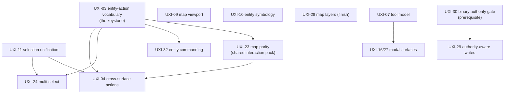

<!--STATUS
state: LIVE
build-state: PLAN — the remaining interaction-UX backlog, sequenced. Not itself buildable; each phase
  graduates to its own design (inventory + class/sequence UML) before code, per the WHO-DESIGNS frame model.
verified: 2026-08-28 (coordinator source scan — the four cluster verifications behind the verdicts)
updated: 2026-08-28
current-answer: §2 the verified ledger · §3 the dependency graph · §4 the phased sequence · §5 the cheap
  partial-cleanups that ride existing seams. The per-feature verdicts are the CODE-VERIFIED truth, not the
  stale "✅ designed" lines each UX_Feature_*.md used to carry (now corrected in-place).
design-basis: the 20 docs/UX/UX_Feature_*.md (intent) · DESIGN_Subsystem_Composition_Unification.md (the
  bundle/seam mechanism these features now compose through) · Architect_Question_26/27/29 (the gated ones) ·
  rulings 22/30 (authority) · the cgf==editor programme (which delivered the shell/composition/diagnostics
  half — see §1).
-->
# PLAN — the remaining interaction-UX backlog *(sequenced)*

> 🎯 **The fault line, measured `2026-08-28`:** the cgf==editor programme delivered the **shell / composition
> / diagnostics** UX; the **interaction-model** UX is largely still design-only. Of ~19 feature areas:
> **4 DONE · 5 PARTIAL · 11 NOT-BUILT** — and every NOT-BUILT one is an interaction feature.

## 1. ⭐ WHY THESE ARE STILL OPEN — the split is not an accident
The composition unification collapsed *how the shells are wired*. It never touched *how a person acts on an
entity* — the action vocabulary, selection model, commanding, tools, map interaction, authority routing.
Those are the eleven below. ⭐ **The good news: they now compose through the seams the unification built**
*(`IUiBundle`, the shared registrars, `GlobalActionRegistry`, `CgfEditorShellToolbar`)* — a shared action
registry is a bundle; extending shell parity to the other hosts rides the same mechanism. The refactor was
the enabling groundwork.

## 2. 📐 THE VERIFIED LEDGER *(code scan, not doc self-status)*

| verdict | features |
|---|---|
| ✅ **DONE** | UXI-06 perspective restore · UXI-08 layout defaults · UXI-37 CGF brain diagnostics+authoring · Curated Scenarios |
| 🟡 **PARTIAL** | UXI-05 menu-follows-focus · UXI-35/36 shell parity · UXI-28 map layers · UXI-01 dead-UI removal · UXI-02 half-built decisions |
| ❌ **NOT-BUILT** | UXI-07 tool model · UXI-09 map viewport · UXI-10 entity symbology · UXI-23 map parity · UXI-03 entity-action vocabulary · UXI-04 cross-surface actions · UXI-11 selection unification · UXI-24 multi-select · UXI-32 entity commanding · UXI-16/27 modal surfaces · UXI-29 authority-aware writes |

## 3. ⭐⭐ THE DEPENDENCY GRAPH — **what unblocks what**

⭐ **Two roots unblock the most:** **UXI-03** *(the action descriptor/registry — 04, 24, 32, 23 all wait on
it)* and **UXI-11** *(one selection store — 24 and the map-side of 04 wait on it)*. Do these first.

## 4. ⭐⭐⭐ THE PHASED SEQUENCE

| phase | features | why here | rough size |
|---|---|---|---|
| **A — foundations** | **UXI-03** entity-action vocabulary · **UXI-11** selection unification | the two keystones; nothing downstream is honest until one shared action registry and one selection store exist. ⚠ UXI-03 is Q26-gated — resolve the architect question first | `RW-M` each |
| **B — the interaction surfaces** | **UXI-04** cross-surface actions · **UXI-24** multi-select · **UXI-32** entity commanding | each is the *payoff* of A — same action set everywhere, additive selection, right-click orders. 32 is the biggest *(tactical-intent args channel, ~8 hops)* | 04 `RW-L` · 24 `RW-M` · 32 `RW-H` |
| **C — map interaction** | **UXI-23** map parity *(shared pack — hosts 04's map side)* · **UXI-10** symbology · **UXI-09** viewport · **UXI-28** map layers *(finish the tag redesign + CGF panel)* | the map cluster; 23 should land with/after 03 so the map gizmo is registry-backed. 10/09 are independent polish | 23 `RW-M` · 10 `RW-M` · 09 `RW-L` · 28 `RW-M` |
| **D — tools & modals** | **UXI-07** tool model *(Q27 already answered — ready)* · **UXI-16/27** modal surfaces | 07 makes "a tool" first-class *(modal stack, focus-driven cancel)*; modals build on it | 07 `RW-M/H` · 16/27 `RW-M` |
| **E — authority** | **UXI-30** binary authority gate *(prerequisite)* → **UXI-29** authority-aware writes | gizmo writes go direct-if-owned else network-request; needs the authority gate first. ⭐ closes the loop with UXI-35/36's unbuilt authority-derivation half | 30 `RW-M` · 29 `RW-H` |

⚠ **Windowed-check dependency:** phases B and C are interaction visuals — **09, 10, 24, 28, 32 need a
windowed verification pass** *(the same class as `CE-055`/`CE-087`; the headless harness proves models, not
the pixel)*. Budget a display box per phase, not per item.

## 5. ⭐ THE CHEAP PARTIAL-CLEANUPS — ride existing seams, do opportunistically
These are small and mostly independent of the phases above — finish them when a nearby batch touches the area:

| id | remainder | note |
|---|---|---|
| **UXI-05** | perspective-scope a real production menu item; guard the 4 hosts' `BeginMainMenuBar` blocks on `CurrentPerspective` | the second half is a cgf==editor `--mode all` parity fix — fold into the composition lane |
| **UXI-35/36** | extend `CgfEditorShellToolbar` to the other 5 hosts *(rides the bundle seam)*; the authority-derivation half joins **UXI-29 / phase E** | |
| **UXI-01** | ⚠ **reconcile intent first** — `EditorOrbatPanel`'s code comment says "STAYS" while the doc condemns it; then delete `EntityPropertyInspector` (+ test) | a doc/code disagreement, not a pure deletion |
| **UXI-02** | delete `SelectionRenderSystem`/`SelectionRenderConstants` (+ update `RenderLayerPresenceTests`); fix the dangling `<see cref>` in `SelectionState.cs:11/48` → `SelectionHighlightGizmo` | |
| **UXI-28** | *(also in phase C)* the tag/combination redesign + CGF's layer panel | the pre-existing mask round-trip is done |

## 6. ⛔ PROCESS
Each phase graduates to its own `DESIGN_*` doc with inventory + class/sequence UML **before** code
*(WHO-DESIGNS frame model)*. UXI-03 and UXI-29 additionally carry **architect questions** *(Q26 · rulings
22/30)* to resolve WITH the user before build. ⭐ These are interaction features — prefer the shared seams
the composition unification just built over new parallel wiring *(ruling 9)*.
