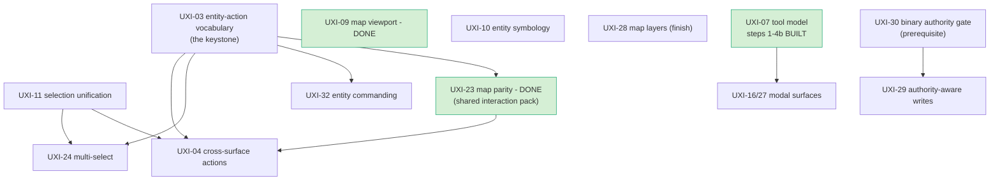

<!--STATUS
state: LIVE
build-state: PLAN — the remaining interaction-UX backlog, sequenced. Not itself buildable; each phase
  graduates to its own design (inventory + class/sequence UML) before code, per the WHO-DESIGNS frame model.
verified: 2026-09-19 (re-measured with the codebase-memory GRAPH for the set- and absence-shaped
  claims — search_graph, query_graph over IMPLEMENTS/USAGE, check_index_coverage full/complete with no
  parse gaps in Hrot.CGF, ScenarioEditor and Vis2D — with grep only to corroborate. The 2026-08-28 scan
  was grep-shaped and three weeks stale.)
updated: 2026-09-19
current-answer: ⭐ §2 the RE-VERIFIED ledger — read §2.1 first, it names THE FIVE THAT MOVED since
  2026-08-28 and what is left of each · §3 the dependency graph · §4 the phased sequence · §5 the cheap
  partial-cleanups. The per-feature verdicts are the CODE-VERIFIED truth, not the "✅ designed" lines each
  UX_Feature_*.md carries — and note UX_Issues.md's legend, where ✅ means DESIGNED and ☑ means DONE.
  ⛔ The superseded 2026-08-28 ledger is at the foot of this file under ## ⛔ HISTORY.
known-rot: none open. The two rot rows this plan's cluster owed (DESIGN_Map_Rendering_And_Interaction.md
  §3.2 and §4.2) were repaired 2026-09-19 in that file.
related-designs:
  - docs/UX/UX_Feature_Tool_Model.md — owns UXI-07: tools, modality, input routing, and the four
    operator-found input defects of 2026-09-09 (§4.7e-§4.7g).
  - docs/UX/UX_Feature_Selection.md — owns UXI-11: the store/writer inventory and the target state.
    It is NOT stale; re-verified 2026-09-10 and already records CGF being off the selection chain.
  - docs/UX/UX_Feature_Map_Parity.md — owns UXI-23: projectors, construction, policy.
  - docs/UX/UX_Feature_Entity_Symbology.md — owns UXI-10, whose headline half is still unbuilt.
  - docs/SNAPSHOT_Map_Interaction_Architecture.md — a measured 2026-09-10 snapshot of what EXISTS;
    owns nothing, but its §4 findings ledger and §6 rot list are the freshest map-cluster truth.
  - docs/DESIGN_Map_Rendering_And_Interaction.md — the shared AS-IS layer reference both UXI-23 and
    UXI-07 build against.
design-basis: the 20 docs/UX/UX_Feature_*.md (intent) · DESIGN_Subsystem_Composition_Unification.md (the
  bundle/seam mechanism these features now compose through) · Architect_Question_26/27/29 (the gated ones) ·
  rulings 22/30 (authority) · the cgf==editor programme (which delivered the shell/composition/diagnostics
  half — see §1).
-->
# PLAN — the remaining interaction-UX backlog *(sequenced)*

> 🎯 **The fault line, re-measured `2026-09-19`:** the cgf==editor programme delivered the **shell /
> composition / diagnostics** UX; the **interaction-model** UX was largely design-only — ⭐ **and the MAP
> and TOOL half has since been built.** Of ~20 feature areas: **6 DONE · 8 PARTIAL · 6 NOT-BUILT**.
>
> ⚠⚠ **SUPERSEDED — this line used to read *"measured `2026-08-28` … 4 DONE · 5 PARTIAL · 11 NOT-BUILT —
> and every NOT-BUILT one is an interaction feature."*** ⛔ That last clause is no longer true: `UXI-23`
> *(map parity)* and `UXI-09` *(viewport)* are interaction features and are **DONE**; `UXI-07`
> *(tool model)* is interaction and is **mostly built**.
>
> ⭐⭐ **What is left is now a COHERENT remainder, not a scatter:** every NOT-BUILT row is an **entity-action
> or authority** concern — the action vocabulary and the four features that wait on it, plus modals and
> authority-aware writes. 🔒 **The map/tool substrate they were waiting for now exists.**

## 1. ⭐ WHY THESE ARE STILL OPEN — the split is not an accident
The composition unification collapsed *how the shells are wired*. It never touched *how a person acts on an
entity* — the action vocabulary, selection model, commanding, tools, map interaction, authority routing.
⚠ **Corrected `2026-09-19`: this used to say "those are the ELEVEN below."** ⭐ **Two of them — map parity
and the viewport — are now DONE, and the tool model is mostly built**, so the open set is **six**, plus
three partials. ⭐ **The good news: they now compose through the seams the unification built**
*(`IUiBundle`, the shared registrars, `GlobalActionRegistry`, `CgfEditorShellToolbar`)* — a shared action
registry is a bundle; extending shell parity to the other hosts rides the same mechanism. The refactor was
the enabling groundwork.

## 2. 📐 THE VERIFIED LEDGER *(code scan, not doc self-status)*

> ⭐⭐⭐ **RE-VERIFIED `2026-09-19` — the `2026-08-28` ledger was WRONG ON FIVE OF NINETEEN.** Three weeks of
> the map/tool cluster landed after it was written and nothing re-measured it. 📐 This pass used the
> **graph** for the set-shaped and absence-shaped claims *(`search_graph`, `query_graph` over `IMPLEMENTS`
> and `USAGE` edges, `check_index_coverage` = `full`/`complete`, no parse gaps)* and grep only to
> corroborate. ⛔ **The prior ledger's three rows are moved to `## ⛔ HISTORY` at the foot of this file** —
> do not quote them.

| verdict | features |
|---|---|
| ✅ **DONE** | UXI-06 perspective restore · UXI-08 layout defaults · UXI-37 CGF brain diagnostics+authoring · Curated Scenarios · ⭐ **UXI-23 map parity** · ⭐ **UXI-09 map viewport** |
| 🟡 **PARTIAL** | UXI-05 menu-follows-focus · UXI-35/36 shell parity · UXI-28 map layers · UXI-01 dead-UI removal · UXI-02 half-built decisions · ⭐ **UXI-07 tool model** *(steps 1–4b built; 5–6 open)* · ⭐ **UXI-10 symbology** · ⭐ **UXI-11 selection** |
| ❌ **NOT-BUILT** | UXI-03 entity-action vocabulary · UXI-04 cross-surface actions · UXI-24 multi-select · UXI-32 entity commanding · UXI-16/27 modal surfaces · UXI-29 authority-aware writes |

### 2.1 ⭐⭐ THE FIVE THAT MOVED — **what changed, and what is left**

| # | was | is | the measurement |
|---|---|---|---|
| **UXI-23** *(map parity)* | ❌ | ✅ **DONE** | `MapInteractionPack.Build` is called by **all five** hosts — IG · CGF · ReplayBrowser · SimHost · Editor. The pack owns construction; the host schedules |
| **UXI-09** *(map viewport)* | ❌ | ✅ **DONE** | `new MapCamera(` is down to **2** production sites *(+`MapCanvas` itself)* from the filed **5** copy-pastes |
| **UXI-07** *(tool model)* | ❌ | 🟡 **steps 1–4b BUILT** | `IToolController`/`ActiveModal`/`ModalStack`/`PushModal`/`Cancel` all exist; `PushModal`'s suspend/resume was **operator-confirmed** `2026-09-09`. ⛔ **Open: steps 5–6** — `ShowOnToolbar` is set on **6** descriptors and read by **0** consumers, and nothing binds `ActiveModalChanged`, so no toolbar button can show applicability or active state *(`CE-259m`)* |
| **UXI-10** *(symbology)* | ❌ | 🟡 **PARTIAL** | ⭐ the visibility/pick-box half landed. ⛔ **The headline half did NOT:** `ResolvedStyle` has **8 production consumers and NOT ONE is a gizmo or map layer** *(graph `USAGE` edges — the component, 2 registration sites, the trail recorder, the producer `StyleResolutionSystem`, IG's text inspector)*. Meanwhile **none of the 8 presentation gizmos** reads it, and `EntityPresentationGizmoShared.cs:236` paints **every** entity `Rgba32(100,220,255)`. ⇒ `StyleResolutionSystem` computes affiliation tint every tick — its own rails assert `HostileStyleSetId_SetsTintRed` / `FriendlyStyleSetId_SetsTintBlue` — and the map never reads it |
| **UXI-11** *(selection)* | ❌ | 🟡 **PARTIAL — and SMALLER than filed** | ⭐ **CGF has already adopted the shared store**: it holds `_selectionState` **and** `_sharedEntitySelection`. ⛔ What it lacks is a **system** writing them from map input — `SelectionInteractionSystem` is constructed in **4** hosts *(IG · ReplayBrowser · SimHost · Editor)*, not CGF. ⇒ the CGF half is *"the input path is missing"*, **not** *"selection is missing"* |

⚠ **A trap for anyone about to "unify selection":** `.*Selection.*` matches **67** classes, but the SEAM is
**2 interfaces** — `ISelectionState` *(2 production impls: `DefaultSelectionState`, `SimHostInspectorAdapter`)*
and `IEntitySelectionSource`. ⛔ **The other ~60 are BTree/HSM/Blueprint NODE selections** — a different
concept that must not be folded in.

## 3. ⭐⭐ THE DEPENDENCY GRAPH — **what unblocks what**

⭐⭐ **Read the green nodes as DISCHARGED PREREQUISITES.** `UXI-23` was an input to `UXI-04`'s map side and
it is built; `UXI-07` gated `UXI-16/27` and is built to step 4b. ⇒ **the graph's remaining critical path is
`UXI-03` → {04, 24, 32} and `UXI-11` → {24, 04}** — one keystone still unstarted, one now a partial.

⭐ **Two roots unblock the most:** **UXI-03** *(the action descriptor/registry — 04, 24, 32, 23 all wait on
it)* and **UXI-11** *(one selection store — 24 and the map-side of 04 wait on it)*. Do these first.

## 4. ⭐⭐⭐ THE PHASED SEQUENCE

> ⭐⭐ **AMENDED `2026-09-19` — phases C and D have LARGELY HAPPENED, out of order.** The map/tool cluster
> was built first *(`UXI-23` · `UXI-09` · `UXI-07` steps 1–4b)*, driven by live operator testing rather
> than this sequence. ⛔ **That is not a process failure to correct** — it delivered the substrate phases
> A and B need. ⇒ ⭐ **the live sequence is now: A *(still first, still unstarted)* → B → the REMAINDERS
> of C and D.** Each row below carries its `2026-09-19` state.

| phase | state `2026-09-19` |
|---|---|
| **A — foundations** | ⛔ **unstarted.** `UXI-03` and `UXI-11` are still the two keystones; `UXI-11` is now a PARTIAL *(CGF store adopted, input path missing)* and therefore **smaller than filed** |
| **B — interaction surfaces** | ⛔ **unstarted**, and still gated on A |
| **C — map interaction** | ✅ `UXI-23` **DONE** · ✅ `UXI-09` **DONE** · 🟡 `UXI-10` symbology **PARTIAL** *(affiliation colour never reaches the map)* · 🟡 `UXI-28` map layers unchanged |
| **D — tools & modals** | 🟡 `UXI-07` **steps 1–4b BUILT**, steps 5–6 open *(`ShowOnToolbar`: 6 writers, 0 readers)* · ⛔ `UXI-16/27` modal surfaces unstarted |
| **E — authority** | ⛔ **unstarted** |

⛔ **The original phase table follows, unchanged, for its sizing and reasoning** — ⚠ **its "why here"
columns are still sound; only the STATE above has moved.**

| phase | features | why here | rough size |
|---|---|---|---|
| **A — foundations** | **UXI-03** entity-action vocabulary · **UXI-11** selection unification | the two keystones; nothing downstream is honest until one shared action registry and one selection store exist. ⚠⚠ **CORRECTED `2026-08-28`: `UXI-03` is NOT meaningfully Q26-gated any more.** 📐 `Q26`'s Answers table records **six of seven sub-questions RULED BY THE USER on `2026-08-10`** — `A`=**A2** *(local surfaces unify; IG's network pipeline stays separate)* · `A′`=**yes, stage 2** · `A″`=**investigated** *(items are closures not data ⇒ resolves into the descriptor/binding split)* · `B`=**investigated** *(the exact payload: id · dynamic label · visibility predicate · enabled predicate+reason · group · children · execute · selection · `PerEntity`\|`Selection`; converge on `EditorCommandDescriptor`'s `Func<>` shape)* · `C`=**C1** *(build ON `GlobalActionRegistry`; invent nothing parallel)* · `D`=**both, ordered** *(mode enables, perspective customises)*. ⛔ **Only `Q26-E` is open** — *is Stage 0 acceptable as a delete-only batch* — a **batch-shape** question, not a design blocker. ⇒ ⭐ **phase A can start; carry `E` as a lean and confirm it when the batch is shaped.** | `RW-M` each |
| **B — the interaction surfaces** | **UXI-04** cross-surface actions · **UXI-24** multi-select · **UXI-32** entity commanding | each is the *payoff* of A — same action set everywhere, additive selection, right-click orders. 32 is the biggest *(tactical-intent args channel, ~8 hops)* | 04 `RW-L` · 24 `RW-M` · 32 `RW-H` |
| **C — map interaction** | **UXI-23** map parity *(shared pack — hosts 04's map side)* · **UXI-10** symbology · **UXI-09** viewport · **UXI-28** map layers *(finish the tag redesign + CGF panel)* | the map cluster; 23 should land with/after 03 so the map gizmo is registry-backed. 10/09 are independent polish | ⚠⚠ **23 RE-SIZED `2026-08-28`: `RW-M` → `RW-H`, and it SLICES into five** *(`S1` gate `RW-S` · `S2` construct `RW-M` · `S3` declare+report `RW-L` · `S4` configuration `RW-M` · `S5` the action half `RW-M`)* — 📄 **[`UX_Feature_Map_Parity.md`](UX_Feature_Map_Parity.md) §3.9.** ⭐ **`S1` alone restores a broken map and lands entirely in SHARED code.** · 10 `RW-M` · 09 `RW-L` · 28 `RW-M` |
| **D — tools & modals** | **UXI-07** tool model *(Q27 already answered — ready)* · **UXI-16/27** modal surfaces | 07 makes "a tool" first-class *(modal stack, focus-driven cancel)*; modals build on it | 07 `RW-M/H` · 16/27 `RW-M` |
| **E — authority** | **UXI-30** binary authority gate *(prerequisite)* → **UXI-29** authority-aware writes | gizmo writes go direct-if-owned else network-request; needs the authority gate first. ⭐ closes the loop with UXI-35/36's unbuilt authority-derivation half | 30 `RW-M` · 29 `RW-H` |

⚠ **Windowed-check dependency:** phases B and C are interaction visuals — **09, 10, 24, 28, 32 need a
windowed verification pass** *(the same class as `CE-055`/`CE-087`; the headless harness proves models, not
the pixel)*. Budget a display box per phase, not per item.

## 5. ⭐ THE CHEAP PARTIAL-CLEANUPS — ride existing seams, do opportunistically
These are small and mostly independent of the phases above — finish them when a nearby batch touches the area:

| id | remainder | note |
|---|---|---|
| **UXI-05** | perspective-scope a real production menu item; guard the 4 hosts' `BeginMainMenuBar` blocks on `CurrentPerspective` | the second half is a cgf==editor `--mode all` parity fix — fold into the composition lane |
| **UXI-35/36** | extend `CgfEditorShellToolbar` to the other 5 hosts *(rides the bundle seam)*; the authority-derivation half joins **UXI-29 / phase E** | |
| **UXI-01** | ⚠ **reconcile intent first** — `EditorOrbatPanel`'s code comment says "STAYS" while the doc condemns it; then delete `EntityPropertyInspector` (+ test) | a doc/code disagreement, not a pure deletion |
| **UXI-02** | delete `SelectionRenderSystem`/`SelectionRenderConstants` (+ update `RenderLayerPresenceTests`); fix the dangling `<see cref>` in `SelectionState.cs:11/48` → `SelectionHighlightGizmo` | |
| **UXI-28** | *(also in phase C)* the tag/combination redesign + CGF's layer panel | the pre-existing mask round-trip is done |

## 6. ⛔ PROCESS
Each phase graduates to its own `DESIGN_*` doc with inventory + class/sequence UML **before** code
*(WHO-DESIGNS frame model)*. UXI-03 and UXI-29 additionally carry **architect questions** *(Q26 · rulings
22/30)* to resolve WITH the user before build. ⭐ These are interaction features — prefer the shared seams
the composition unification just built over new parallel wiring *(ruling 9)*.

---

## ⛔ HISTORY — the SUPERSEDED `2026-08-28` ledger

⚠ **Kept so a reader who saw it elsewhere can tell it is dead.** ⛔ **Do not quote it.** It was wrong on
five rows because the map/tool cluster shipped after it was written and nothing re-measured it until
`2026-09-19`.

| verdict | features *(as claimed `2026-08-28`)* |
|---|---|
| ✅ DONE | UXI-06 · UXI-08 · UXI-37 · Curated Scenarios |
| 🟡 PARTIAL | UXI-05 · UXI-35/36 · UXI-28 · UXI-01 · UXI-02 |
| ❌ NOT-BUILT | **UXI-07** · **UXI-09** · **UXI-10** · **UXI-23** · UXI-03 · UXI-04 · **UXI-11** · UXI-24 · UXI-32 · UXI-16/27 · UXI-29 |

⭐ **The lesson, recorded because it is the reusable part:** the `2026-08-28` scan was **grep-shaped**, and
four of the five wrong rows were *set-* or *absence-*shaped claims — *"who builds the pack"*, *"how many
camera copies"*, *"who reads `ResolvedStyle`"*, *"does CGF have selection"*. ⛔ **grep can confirm a guess;
it cannot enumerate a set or prove an absence.** ⇒ a ledger like this one is re-verified with the graph.
