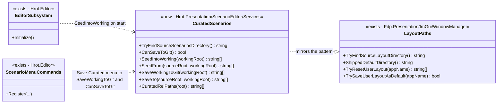
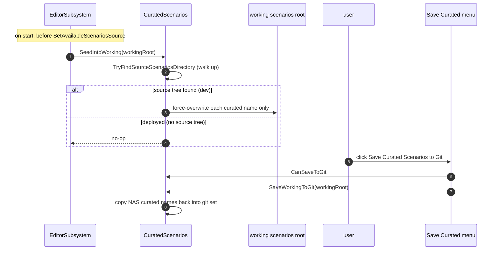

<!--STATUS
state: LIVE
build-state: BUILT
updated: 2026-08-22
current-answer: this whole file — the curated test-scenario set (git-committed, copied to the working NAS
  folder on start, saved back via a menu item). BUILT on the coordinator branch.
stale-below: nothing.
known-rot: none.
known-conflict: none.
design-basis: mirrors UX_Feature_Layout_Defaults.md (UXI-08 "revert-on-start plus save-as-default");
  user requirements 2026-08-22 (dev-only; non-curated never overwritten; the git folder IS the manifest;
  editor primary, CGF may reuse the shared helper).
-->
# Feature — curated test scenarios (git-committed, seeded on start)

> **User, 2026-08-22:** *"in git we will store a small set of scenario files and only THIS SMALL set
> (defined by the scenario file in the git folder) will be copied to the NAS folder (and back once we
> select the menu item that saves those back to git area). Non-curated scenarios should NOT be
> overwritten. Development-only; in real deployment there will be no git folder so nothing to copy. Only
> the editor should support it (CGF can as well if the code is shared)."*

Mirrors the shipped-default-**layout** pattern (`UX_Feature_Layout_Defaults.md`, UXI-08). The layout
feature is safe to force-overwrite every start because its folder is **per-user**; the scenarios working
folder is **cluster-shared** — so the design is scoped to a **manifest-driven overlay** that never touches
anything but the curated names, and is dev-only by construction.

## The model — the git folder IS the manifest

| | |
|---|---|
| **Curated set** | whatever `<name>/scenario.json` folders live under the repo's `scenarios/` directory. Nothing else lists them; the folder's contents define membership. |
| **On start (editor)** | for each curated `<name>` → copy git → `NAS\scenarios\<name>`, **force-overwrite only those names**. Non-curated scenarios untouched; nothing deleted. Curated ones sit in the normal root, so they load normally. |
| **Menu — *File ▸ Scenario ▸ Save Curated Scenarios to Git*** | for each curated `<name>` → copy `NAS\scenarios\<name>` → git, force-overwrite. Refreshes the set's contents; does not add/remove members (edit membership by hand in git). |
| **Dev-only** | the git set is found by walking up to the source tree (as `LayoutPaths.TryFindSourceLayoutDirectory` does). A deployed build has no source tree ⇒ the start-up seed is a no-op and the menu item is disabled-with-reason. No output-copy is shipped. |
| **Removal** | dropping a name from git just stops it being refreshed; its NAS copy stays as an ordinary user scenario. Never deleted. |

## UML — the as-built *(obligation ①/⑤; the class MIRRORS the existing `LayoutPaths`, drawn beside it)*

⭐ `CuratedScenarios` is a deliberate mirror of the shipped-default-layout helper `LayoutPaths` — same walk-up
probe, same force-overwrite-curated-only shape. Drawn on one canvas so the parallel is explicit and neither
duplicates logic the other should own.

## The decisions (settled with the user, 2026-08-22)

| # | Decision | Resolution |
|---|---|---|
| A | Scope | Overlay by name — curated names only; non-curated never touched. |
| B | When | Every start (dev-only; no toggle). |
| C | Who | Editor wires it; the helper is host-agnostic so CGF may reuse it. |
| D | Git home | Adopt the existing committed repo-root `scenarios/` (`hill-attack`, `test-fire`, `test-move`) — wiring it turns it from a stray tracked folder into the deliberate curated source. |
| E | Menu | "Save Curated Scenarios to Git" = refresh the git-defined set from working copies; disabled outside a checkout. |
| F | Guard | Dev-only via the walk-up probe; deployed = no-op + disabled. |

## As built

| piece | where |
|---|---|
| The helper (walk-up probe, seed, save-back, manifest enumeration) | `Hrot/Engine/Hrot.Presentation/ScenarioEditor/Services/CuratedScenarios.cs` — `TryFindSourceScenariosDirectory` · `SeedIntoWorking`/`SeedFrom` · `SaveWorkingToGit`/`SaveTo` · `CuratedRelPaths` |
| Start-up seed | `EditorSubsystem.cs` — `CuratedScenarios.SeedIntoWorking(EditorBootstrap.ScenariosRoot)` just before the scenario list is built |
| Menu item | `ScenarioMenuCommands.cs` — `scenario.updateCurated`, "Save Curated Scenarios to Git" |
| Rails | `Hrot/Engine/Hrot.Presentation.Tests/ScenarioEditor/CuratedScenariosTests.cs` — overlay/force-overwrite, non-curated untouched, sidecars, save-back, empty-source no-op, probe shape (7 cases) |

## Reuse

Directly mirrors `Fdp.Presentation.WindowManager.LayoutPaths` (`TryFindSourceLayoutDirectory` /
`TryResetUserLayout` / `TrySaveUserLayoutAsDefault`), changed only to a directory-tree copy because a
scenario is a folder, not two named files.
