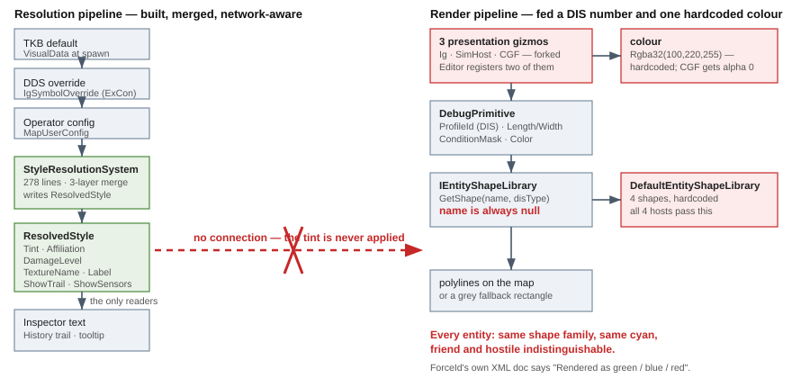

# Feature design — entity symbology on the map

> **Design for [UXI-10](UX_Issues.md#uxi-10) · drafted 2026-08-12.** **Status: ✅ designed — ready to
> break into `UXT` tasks.** Also **verifies and absorbs [UXI-19](UX_Issues.md#uxi-19)** (previously
> *unverified*) and supplies the mechanism behind [UXI-11](UX_Issues.md#uxi-11).



## 0. 🔴 The issue as filed is the smallest part of it

> *"Map symbology seam exists and no host uses it — every host passes `DefaultEntityShapeLibrary`."*

True. But the scan found something larger: **HROT has two symbology pipelines, fully built, that are not
connected to each other.**

| | Pipeline | Ends at |
|---|---|---|
| **Upstream** | `StyleResolutionSystem` — **278 lines**, a **3-layer merge** (TKB default → DDS override → operator config) writing `ResolvedStyle` **every PostSimulation tick** | 🔴 **text UI only** — the inspector, a tooltip, and history-trail sampling |
| **Downstream** | `IEntityShapeLibrary` → `EntityShapeProfile` → polylines on the map | fed a **DIS number** and **one hardcoded colour** |

⇒ The colour is **computed correctly, every frame, for every entity — and thrown away.**

## 1. Prior art ([rule 6](UX_Issues.md#rules))

| Exists? | What | Adoption | Bearing |
|:--:|---|---|---|
| ✅ | **`StyleResolutionSystem`** + **`ResolvedStyle`** — Tint, Affiliation, DamageLevel, TextureName, Label, ShowTrail, ShowSensors | **0 renderers** | ⭐ **the resolver this design was going to invent already exists** — `StyleResolutionSystem.cs`, `ResolvedStyle.cs` |
| ✅ | `ApplyAffiliationColor(...)` inside that system (`StyleResolutionSystem.cs:113`) | 1 (internal) | it already merges `EntityInfo.ForceId` and the DDS `StyleSetId` into a tint |
| ✅ | **`ForceId`** — `Neutral / Friend / Hostile`, **145 references** in `Hrot/` | perception, EQS, TKB | 🔴 its own XML doc says *"Rendered as **green** / **blue** / **red**"* (`ForceId.cs:12-19`) — **no renderer implements it** |
| ✅ | **`ResolvedStyleConstants`** — the affiliation palette: Friend `(0,100,255)`, Hostile `(255,0,0)`, Neutral `(0,255,0)`, Unknown white | 1 (the resolver) | ⭐ **the authoritative table** — §3.2 |
| ⚠ | **`GetAffiliationColor(ForceId)`** — a **second** copy of the palette | 🔴 `private`, 1 caller | `EntityPlacementGizmo.cs:255-261`. The **placement ghost** is correctly coloured; the moment the entity is placed it turns cyan. ⚠ **And it disagrees**: Friend is `(0,0,255)` here vs `(0,100,255)` in `ResolvedStyleConstants` |
| ⚠ | `MilStd2525Renderer.GetAffiliationColor` — a **third** palette (Neutral=**Yellow**, Unknown=**Green**) | the `MilStd2525` primitive, **never emitted** | ⚠ three inconsistent affiliation palettes; only the unreachable one is unit-tested |
| ✅ | `IEntityShapeLibrary.GetShape(string? shapeName, ulong fallbackDisType)` | 4 explicit hosts + CGF implicitly | 🔴 **`shapeName` is `null` at the only call site** (`DebugPrimitiveRenderer2D.cs:410`) — half the interface is dead |
| 🔴 | **`VisualData.MapShapeName`** — a `FixedString32`, doc-commented *"Optional explicit name of the 2-D map shape to render **from the entity shape library**"* | **0 readers** | ⭐⭐ **the purpose-built field for the dead parameter.** Declared (`VisualData.cs:33`), carried through the TKB DTO (`VisualDefinitionDto.cs:29`), **populated by the translator** (`PresentationTkbTranslator.cs:41`), present in scenario JSON — and **read nowhere in the repo** |
| ✅ | `StatelessGizmoRegistry.Register(projector, visibilityPolicy)` — an **`IGizmoVisibilityPolicy` parameter** | default only | ⭐ the clean fix for the double-registration (§3.4) |
| ⚠ | `EntityPresentationGizmoShared` — the shared helper | 3 gizmos, **inconsistently** | CGF bypasses it for the shape (§2, defect E) |

⭐ **Seam-law instance 10 — the largest yet.** Not a helper nobody wired: a **278-line system with DDS
integration and operator overrides**, running every tick, whose output the map never reads. **Instance 11**
is `MapShapeName`: a field authored in scenario data, translated into a component, and never read.

### ⚠ The filed wording is wrong in one detail, and it matters

> *"every host passes `DefaultEntityShapeLibrary`"*

| Host | Reality |
|---|---|
| Editor, SimHost, IG, ReplayBrowser | ✅ pass it **explicitly** (`EditorSubsystem.cs:1545`, `SimHostVisualization.cs:242`, `IgApplication.cs:826`, `ReplayBrowserSubsystem.cs:237`) |
| **CGF** | ⚠ **omits the argument** — the 3-arg `DebugGizmoLayer` ctor (`CgfSubsystem.cs:583`); the default arrives through **three levels of `??`** |
| **StrideMock** | ⚠ **not wired at all** — its renderer call is commented `// wire in SM-009`; it draws `Raylib.DrawCircleV(..., Color.Red)` per entity (`StrideMockSubsystem.cs:218-221`) |
| **ExCon** | ✅ correctly absent — it has no map ([ruling 16](UX_RESUME_INTERACTION.md)) |

⇒ 🔒 **The accurate statement:** *every host with a map gets the default — four by choice, one by omission —
and **no second implementation of `IEntityShapeLibrary` exists**.* And the seam is **not an uncalled
interface**: it fires every frame at `DebugPrimitiveRenderer2D.cs:410`. What is dead is the
**polymorphism** and the **name parameter**, not the call.

## 2. 🔴 Verified defects

| | Defect | Evidence |
|--:|---|---|
| **A** | **Every entity is the same cyan.** `prim.Color = new Rgba32(100, 220, 255, 255)` — a literal, for all entities in all subsystems. **Friend and hostile are indistinguishable on the map** while the simulation itself distinguishes them | `EntityPresentationGizmoShared.cs:92` |
| **B** | **CGF's shapes are `alpha 0`.** CGF calls `draw.DrawSemanticShape(...)` **directly** instead of the shared helper; the builder leaves `Color` at `default` = `(0,0,0,0)`, and the renderer uses `ToRaylibColor(prim.Color)`. ⚠ **Even the debug fallback is invisible** — the magenta "unknown profile" rectangle is drawn with `color.A`, i.e. CGF's zero alpha | `CgfEntityPresentationGizmo.cs:49` vs `DebugPrimitiveBuffer.cs:364-376`, `DebugPrimitiveRenderer2D.cs:197,437` |
| **C** | **CGF emits no pick box** — `EmitPickBox` is called by the IG and SimHost gizmos, not CGF ⇒ **CGF entities cannot be picked on the map**. This is the mechanism behind [UXI-11](UX_Issues.md#uxi-11) | `CgfEntityPresentationGizmo.cs:45-49` |
| **D** | **Damage visuals exist in one subsystem of three.** IG computes the condition mask from health; **CGF and SimHost hardcode `conditionMask: 0u`** ⇒ a damaged vehicle looks healthy in both | `IgEntityPresentationGizmo.cs:33-38` vs `CgfEntityPresentationGizmo.cs:49`, `SimHostEntityPresentationGizmo.cs:35` |
| **E** | 🔴 **[UXI-19](UX_Issues.md#uxi-19) is REAL — now verified.** See below |
| **F** | **`ResolveProfileId` returns 0 off a snapshot** — `if (view is not EntityRepository repo) return 0UL;` ⇒ `_fallback` ⇒ a grey rectangle, silently | `EntityPresentationGizmoShared.cs:48` |
| **G** | **The shape vocabulary is 4 hardcoded profiles** selected by a DIS bit-decode; the named half is unreachable. ⚠ `rotary_wing` reuses the `fixed_wing` geometry verbatim | `DefaultEntityShapeLibrary.cs:15-42,106-107` |
| **H** | **Zero test coverage of shape selection.** No test constructs `DefaultEntityShapeLibrary` or calls `GetShape`; the one test renderer overrides `DispatchShape` and never calls `base`, so it cannot reach the library | `GizmoPresentationTests.cs:23-34` |
| **I** | **`SelectionHighlightGizmo` is not registered in SimHost or CGF** — neither calls `Hrot.Common.Diagnostics.Gizmos.GizmoRegistrar.RegisterAll` ⇒ no selection ring, and no `HealthBarGizmo` either | `SimHostApp.cs:337-345`, `CgfSubsystem.cs:498-500` vs `EditorSubsystem.cs:1100` |

### 🔴 UXI-19 verified — the Editor draws every entity twice

It was filed as *"two presentation gizmos may match one entity — **unverified**"*. The chain is now closed:

| Step | Evidence |
|---|---|
| Projector keys **differ by one component** — `IgEntityPresentationGizmo` needs `(SimTransform, NetworkIdentity, CullingState)`; `SimHostEntityPresentationGizmo` needs `(SimTransform, NetworkIdentity)` | `IgEntityPresentationGizmo.cs:13`, `SimHostEntityPresentationGizmo.cs:14` |
| Matching is a **superset** test, with no exclusivity | `BitMask512.HasAll(comp, rule.RequiredMask)` — `StatelessGizmoSystem.cs:104` |
| The Editor registers **both** registrars | `EditorSubsystem.cs:1094-1097` |
| Editor entities **do** get `CullingState` — `MapCullingSystem` sets it on **every entity with `SimTransform`** | `MapCullingSystem.cs:68-80`, module registered `EditorSubsystem.cs:971` |

⇒ In the Editor, every networked entity emits **two spatial anchors, two pick boxes and two semantic
shapes** per frame.

⚠ **And it defeats [UXI-09](UX_Feature_Map_Viewport.md).** The IG gizmo honours culling
(`if (!cull.IsVisible) return;`); the SimHost one does not. So the Editor computes culling and then draws
the culled entities anyway — **narrowing the cull rect in UXI-09 buys the Editor nothing until this is
fixed.**

## 3. The design

🔒 **Connect the two pipelines. Do not build a third.** No change to `FDP/ExtDeps/GizmoMap` — the seam
there is an interface, and HROT implements it.

### 3.1 The one assignment that fixes A, B and D

`EntityPresentationGizmoShared.DrawSemanticShape` reads the style that is already there:

```csharp
var (tint, condition) = view.HasComponent<ResolvedStyle>(entity)
    ? (style.Tint.ToRgba32(), ConditionFrom(style.DamageLevel))
    : (AffiliationColors.For(view, entity), 0u);       // ← falls back to ForceId, then to today's cyan
prim.Color = tint;
```

| Fixes | How |
|---|---|
| **A** | the tint is the merged, network-aware, affiliation-derived colour |
| **B** | CGF routes through the same helper ⇒ never `alpha 0` |
| **D** | condition comes from `ResolvedStyle.DamageLevel` — the *merged* damage, not IG's local component ⇒ all three subsystems agree |

⭐ **`ConditionFrom` keeps IG's existing thresholds** (`≥50` damaged, `≥90` immobile,
`IgEntityPresentationGizmo.cs:37-38`) — promoted, not re-invented.

### 3.2 One affiliation palette — and it is **not** the private one

⚠ **Correction to this design's own first draft**: the palette to keep is **`ResolvedStyleConstants`**, not
`EntityPlacementGizmo.GetAffiliationColor`. Three palettes exist and two disagree:

| Source | Friend | Neutral | Unknown | Verdict |
|---|---|---|---|---|
| **`ResolvedStyleConstants`** | `(0,100,255)` | green | white | 🔒 **authoritative** — it is what the resolver already writes into `ResolvedStyle.Tint` |
| `EntityPlacementGizmo.GetAffiliationColor` (private) | `(0,0,255)` | green | — | ⇒ **delete**, redirect to the constants |
| `MilStd2525Renderer.GetAffiliationColor` | blue | **yellow** | **green** | leave alone — it serves a primitive nothing emits; ⚠ note it before anyone revives that path |

⇒ After this, the placement ghost and the placed entity finally match, because both read one table.

### 3.3 One presentation gizmo, not three

`IgEntityPresentationGizmo` + `SimHostEntityPresentationGizmo` + `CgfEntityPresentationGizmo` →
**`EntityPresentationGizmo`**, projector key `(SimTransform, NetworkIdentity)`.

⚠ **CGF's one genuine difference survives**: it prefers `NetworkTransform` over `SimTransform` when
populated (`CgfEntityPresentationGizmo.cs:26-42`). That becomes a **pose-source rule** inside the shared
gizmo — *prefer `NetworkTransform` when non-default* — which is correct for the others too, since they
have no `NetworkTransform` to prefer.

### 3.4 Culling moves to a visibility policy — ⭐ the seam already exists

```csharp
registry.Register(new EntityPresentationGizmo(), new CullingStateVisibilityPolicy());
```

`StatelessGizmoRegistry.Register` **already takes an `IGizmoVisibilityPolicy`** and defaults it to
`AlwaysVisiblePolicy.Instance` (`StatelessGizmoRegistry.cs:87`). Moving `CullingState` out of the
projector key and into the policy:

| | |
|---|---|
| ✅ **Kills the double-match by construction** — one gizmo, one key | defect E / UXI-19 |
| ✅ **Culling applies uniformly**, so UXI-09's narrowed rect pays off in the Editor | |
| ✅ Subsystems without culling register the same gizmo with the default policy | no fork |

### 3.5 Make the `shapeName` half real — the actual filed issue

```csharp
_shapeLibrary.GetShape(prim.ShapeName, prim.ProfileId)     // renderer, today: GetShape(null, …)
```

⭐ **The name already exists in the data.** `VisualData.MapShapeName` is authored in TKB/scenario JSON,
translated into the component (`PresentationTkbTranslator.cs:41`), and read by nobody. Its doc comment
states its purpose exactly: *"Optional explicit name of the 2-D map shape to render from the entity shape
library. When empty, the renderer selects a shape automatically based on `DISEntityType`."* — **that is
this design's specification, written before the code diverged from it.**

🔒 **Resolve the shape name in the layer that already resolves style.** `StyleResolutionSystem` gains one
more merged output — shape name — seeded from `VisualData.MapShapeName`, overridable by the DDS layer,
alongside the tint it already merges. ⚠ Keep it **distinct from `TextureName`**: that field carries
`SymbolCode` / `TextureOverride` (a *texture*), which is a different concept from a *vector shape profile*.

Carrying it to the renderer: `DebugPrimitive` is a **fixed-layout struct** with no room for a string, but
the buffer already interns strings by FNV-1a for menu bindings (`DebugPrimitiveBuffer.cs:378-385`).
🔒 **Use that same mechanism** — intern the name, carry the `uint` hash, resolve hash → name → profile in
the renderer.

⇒ Scenario authors get **`mapShapeName` working as documented**, and ExCon's DDS override can change a
symbol at runtime.

### 3.6 `HrotEntityShapeLibrary` — using the seam, without touching ExtDeps

```csharp
public sealed class HrotEntityShapeLibrary : IEntityShapeLibrary
{
    public void Register(string name, EntityShapeProfile profile);
    public void Register(ulong disType, EntityShapeProfile profile);
    public EntityShapeProfile GetShape(string? shapeName, ulong fallbackDisType);   // name → dis → default
}
```

Passed at the **four explicit injection points** (`EditorSubsystem.cs:1545`, `IgApplication.cs:826`,
`SimHostVisualization.cs:242`, `ReplayBrowserSubsystem.cs:237`) **and at CGF's**, which today omits the
argument entirely (`CgfSubsystem.cs:583`). It **delegates to the default for anything unregistered**, so
the shipped 4 profiles keep working.

⚠ **Make the omission impossible to repeat**: CGF's silent default came from an optional parameter with a
`??` chain three levels deep. The library should be a **required** argument at the layer constructor —
the default becomes something a host *chooses*, not something it *misses*.

### 3.7 Defect F — profile resolution off a snapshot

`ResolveProfileId` needs the live repo because `GetDisType` is an `EntityRepository` method. ⚠ **Do not
paper over it**: log once when the cast fails, and 📌 **carry the DIS type in the primitive instead** — the
gizmo already runs where the repo is available, so resolve early and pass the value. No new component.

## 4. Acceptance

| # | Case | Cls |
|---|---|:--:|
| 10.1 | `AffiliationColors.For(Friend/Hostile/Neutral)` = blue / red / green, matching `ForceId`'s documentation | H |
| 10.2 | Entity with `ResolvedStyle` → the emitted primitive's `Color` **is** `style.Tint` | H |
| 10.3 | Entity without `ResolvedStyle` → falls back to `EntityInfo.ForceId`; without that, today's cyan | H |
| 10.4 | 🔴 **CGF's semantic shape is never `alpha 0`** | H |
| 10.5 | CGF emits a **pick box** | H |
| 10.6 | `DamageLevel` 0 / 50 / 90 → condition mask `0` / `Damaged` / `Damaged\|Immobile`, in **all three** subsystems | H |
| 10.7 | 🔴 An entity with `(SimTransform, NetworkIdentity, CullingState)` in an Editor-style registry emits **exactly one** semantic shape — the UXI-19 regression guard | H |
| 10.8 | An invisible (`CullingState.IsVisible = false`) entity emits **nothing**, via the visibility policy | H |
| 10.9 | Entity with `NetworkTransform` populated → the shared gizmo uses it; unpopulated → `SimTransform` | H |
| 10.10 | `HrotEntityShapeLibrary` returns a registered profile by name; by DIS id; and **delegates to the default** when unregistered | H |
| 10.11 | 🔴 **`VisualData.MapShapeName` reaches the library** — a scenario naming `mapShapeName` resolves the **named** profile, not the DIS fallback. The field's own doc comment becomes true | H |
| 10.12 | A DDS shape override changes the resolved profile end-to-end | H |
| 10.17 | Empty `MapShapeName` → falls back to the DIS decode, exactly as documented | H |
| 10.18 | The three affiliation palettes collapse to one — the placement ghost's Friend colour **equals** `ResolvedStyleConstants.Friend*` | H |
| 10.19 | The shape library is a **required** constructor argument — CGF cannot silently default again | H |
| 10.13 | `ResolveProfileId` off a **snapshot** view logs once and still yields a usable profile | H |
| 10.14 | Placement ghost and the placed entity render the **same colour** | I |
| 10.15 | Two entities, opposing `ForceId` → visibly different colours on the map in every subsystem | I |
| 10.16 | Editor: an entity is drawn **once**, and off-screen entities are not drawn | I |

**17 H · 3 I · 0 V.** ⚠ Note 10.10-10.11, 10.17: **there is currently no test anywhere that calls
`GetShape`** (defect H), so these are the first coverage this logic has ever had.

## 5. 🔒 Out of scope

| | |
|---|---|
| MIL-STD-2525 / APP-6 symbol set | a symbol *library*, not the plumbing; §3.6 makes it addable without further design |
| Texture/sprite symbols | `ResolvedStyle.TextureName` is carried, not yet rendered as a texture |
| Labels on the map | `ResolvedStyle.LabelText` is resolved and unused — ⚠ **a second unconsumed field**; own issue |
| `ShowSensors` / FOV cones | same — resolved, unconsumed |
| Selection highlight's **appearance** | separate gizmo, unaffected — ⚠ but its **absence in SimHost/CGF** (defect I) is a registration bug worth its own issue |
| StrideMock's red circles | its renderer call is commented out pending `SM-009`; out of this issue's reach |
| ExCon's own map | DDS-only, no ECS ([ruling 16](UX_RESUME_INTERACTION.md)) — it *produces* the override this design consumes |

## 6. Risks

| | |
|---|---|
| ⚠ **Everything on the map changes colour** | that is the feature — but it is the most visible change in the programme so far. ⭐ Recommend it lands with [UXI-09](UX_Feature_Map_Viewport.md) so the map's visual change is one event, not two |
| ⚠ **Collapsing three gizmos touches all three subsystems** | 10.7-10.9 are the guards; the pose-source rule (§3.3) is the one real behavioural merge |
| ⚠ **Interning a name per entity per frame** | the intern map is idempotent and allocates only on first sight — but ⚠ **measure**: this runs per visible entity. If it costs, cache the hash in `ResolvedStyle` at resolution time instead |
| ⚠ **`ResolvedStyle` is IG-namespaced** (`Hrot.IG.Components`) while becoming a cross-subsystem contract | it already **is** one — the Editor registers it (`EditorSubsystem.cs:601`). Promotion is a rename, but note it before more code depends on the namespace |
| ⚠ **UXI-19's fix changes the Editor's draw count** | half the primitives disappear. If anything depends on the duplicate (nothing found), it will surface here |
