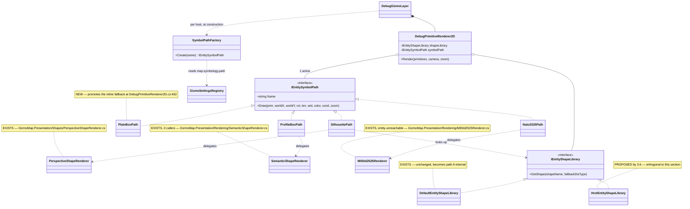
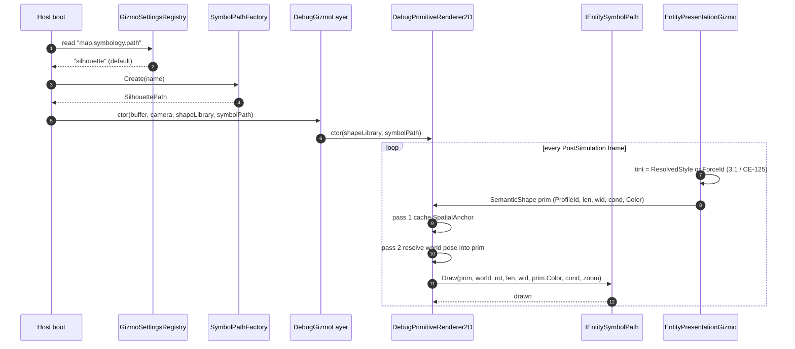

<!--STATUS
state: LIVE
build-state: NOT-BUILT
verified: 2026-08-28 (coordinator source scan)
current-answer: 3.3 and 3.4 are BUILT (UXI-23 S2a/S4). 3.8 is READY-TO-BUILD and carries the
  UML: the FOUR symbol renderers become switchable paths, one active per host, named in host config
  (user ruling 2026-08-30). Still NOT-BUILT: 3.0, 3.1 (CE-125 - the renderer hardcodes cyan at
  EntityPresentationGizmoShared.cs:92), 3.2, 3.5, 3.6, 3.7.
-->
# Feature design — entity symbology on the map

> **Design for [UXI-10](UX_Issues.md#uxi-10) · drafted 2026-08-12.** **Status: ❌ NOT-BUILT (design only) — renderer still hardcodes cyan (`EntityPresentationGizmoShared.cs:92`); resolved style not consumed; the three per-host gizmos never merged.** Also **verifies and absorbs [UXI-19](UX_Issues.md#uxi-19)** (previously
> *unverified*) and supplies the mechanism behind [UXI-11](UX_Issues.md#uxi-11).


## 0. 🔴 The issue as filed is the smallest part of it

> *"Map symbology seam exists and no host uses it — every host passes `DefaultEntityShapeLibrary`."*

True. But the scan found something larger: **HROT has two symbology pipelines, fully built, that are not
connected to each other.**

| | Pipeline | Ends at |
|---|---|---|
| **Upstream** | `StyleResolutionSystem` — **278 lines**, a **3-layer merge** (TKB default → DDS override → operator config) writing `ResolvedStyle` **every PostSimulation tick** | 🔴 **text UI only** — the inspector, a tooltip, and history-trail sampling |
| **Downstream** | `IEntityShapeLibrary` → `EntityShapeProfile` → polylines on the map | fed a **DIS number** and **one hardcoded colour** |

⇒ The colour is **computed correctly, every frame, for every entity — and thrown away.**

## 1. Prior art ([rule 6](UX_Issues.md#rules))

| Exists? | What | Adoption | Bearing |
|:--:|---|---|---|
| ✅ | **`StyleResolutionSystem`** + **`ResolvedStyle`** — Tint, Affiliation, DamageLevel, TextureName, Label, ShowTrail, ShowSensors | **0 renderers** | ⭐ **the resolver this design was going to invent already exists** — `StyleResolutionSystem.cs`, `ResolvedStyle.cs` |
| ✅ | `ApplyAffiliationColor(...)` inside that system (`StyleResolutionSystem.cs:113`) | 1 (internal) | it already merges `EntityInfo.ForceId` and the DDS `StyleSetId` into a tint |
| ✅ | **`ForceId`** — `Neutral / Friend / Hostile`, **145 references** in `Hrot/` | perception, EQS, TKB | 🔴 its own XML doc says *"Rendered as **green** / **blue** / **red**"* (`ForceId.cs:12-19`) — **no renderer implements it** |
| ✅ | **`ResolvedStyleConstants`** — the affiliation palette: Friend `(0,100,255)`, Hostile `(255,0,0)`, Neutral `(0,255,0)`, Unknown white | 1 (the resolver) | ⭐ **the authoritative table** — §3.2 |
| ⚠ | **`GetAffiliationColor(ForceId)`** — a **second** copy of the palette | 🔴 `private`, 1 caller | `EntityPlacementGizmo.cs:255-261`. The **placement ghost** is correctly coloured; the moment the entity is placed it turns cyan. ⚠ **And it disagrees**: Friend is `(0,0,255)` here vs `(0,100,255)` in `ResolvedStyleConstants` |
| ⚠ | `MilStd2525Renderer.GetAffiliationColor` — a **third** palette (Neutral=**Yellow**, Unknown=**Green**) | the `MilStd2525` primitive, **never emitted** | ⚠ three inconsistent affiliation palettes; only the unreachable one is unit-tested |
| ✅ | `IEntityShapeLibrary.GetShape(string? shapeName, ulong fallbackDisType)` | 4 explicit hosts + CGF implicitly | 🔴 **`shapeName` is `null` at the only call site** (`DebugPrimitiveRenderer2D.cs:410`) — half the interface is dead |
| 🔴 | **`VisualData.MapShapeName`** — a `FixedString32`, doc-commented *"Optional explicit name of the 2-D map shape to render **from the entity shape library**"* | **0 readers** | ⭐⭐ **the purpose-built field for the dead parameter.** Declared (`VisualData.cs:33`), carried through the TKB DTO (`VisualDefinitionDto.cs:29`), **populated by the translator** (`PresentationTkbTranslator.cs:41`), present in scenario JSON — and **read nowhere in the repo** |
| ✅ | `StatelessGizmoRegistry.Register(projector, visibilityPolicy)` — an **`IGizmoVisibilityPolicy` parameter** | default only | ⭐ the clean fix for the double-registration (§3.4) |
| ⚠ | `EntityPresentationGizmoShared` — the shared helper | 3 gizmos, **inconsistently** | CGF bypasses it for the shape (§2, defect E) |

⭐ **Seam-law instance 10 — the largest yet.** Not a helper nobody wired: a **278-line system with DDS
integration and operator overrides**, running every tick, whose output the map never reads. **Instance 11**
is `MapShapeName`: a field authored in scenario data, translated into a component, and never read.

### ⚠ The filed wording is wrong in one detail, and it matters

> *"every host passes `DefaultEntityShapeLibrary`"*

| Host | Reality |
|---|---|
| Editor, SimHost, IG, ReplayBrowser | ✅ pass it **explicitly** (`EditorSubsystem.cs:1545`, `SimHostVisualization.cs:242`, `IgApplication.cs:826`, `ReplayBrowserSubsystem.cs:237`) |
| **CGF** | ⚠ **omits the argument** — the 3-arg `DebugGizmoLayer` ctor (`CgfSubsystem.cs:583`); the default arrives through **three levels of `??`** |
| **StrideMock** | ⚠ **not wired at all** — its renderer call is commented `// wire in SM-009`; it draws `Raylib.DrawCircleV(..., Color.Red)` per entity (`StrideMockSubsystem.cs:218-221`) |
| **ExCon** | ✅ correctly absent — it has no map ([ruling 16](UX_RESUME_INTERACTION.md)) |

⇒ 🔒 **The accurate statement:** *every host with a map gets the default — four by choice, one by omission —
and **no second implementation of `IEntityShapeLibrary` exists**.* And the seam is **not an uncalled
interface**: it fires every frame at `DebugPrimitiveRenderer2D.cs:410`. What is dead is the
**polymorphism** and the **name parameter**, not the call.

## 2. 🔴 Verified defects

| | Defect | Evidence |
|--:|---|---|
| **A** | **Every entity is the same cyan.** `prim.Color = new Rgba32(100, 220, 255, 255)` — a literal, for all entities in all subsystems. **Friend and hostile are indistinguishable on the map** while the simulation itself distinguishes them | `EntityPresentationGizmoShared.cs:92` |
| **B** | **CGF's shapes are `alpha 0`.** CGF calls `draw.DrawSemanticShape(...)` **directly** instead of the shared helper; the builder leaves `Color` at `default` = `(0,0,0,0)`, and the renderer uses `ToRaylibColor(prim.Color)`. ⚠ **Even the debug fallback is invisible** — the magenta "unknown profile" rectangle is drawn with `color.A`, i.e. CGF's zero alpha | `CgfEntityPresentationGizmo.cs:49` vs `DebugPrimitiveBuffer.cs:364-376`, `DebugPrimitiveRenderer2D.cs:197,437` |
| **C** | **CGF emits no pick box** — `EmitPickBox` is called by the IG and SimHost gizmos, not CGF ⇒ **CGF entities cannot be picked on the map**. This is the mechanism behind [UXI-11](UX_Issues.md#uxi-11) | `CgfEntityPresentationGizmo.cs:45-49` |
| **D** | **Damage visuals exist in one subsystem of three.** IG computes the condition mask from health; **CGF and SimHost hardcode `conditionMask: 0u`** ⇒ a damaged vehicle looks healthy in both | `IgEntityPresentationGizmo.cs:33-38` vs `CgfEntityPresentationGizmo.cs:49`, `SimHostEntityPresentationGizmo.cs:35` |
| **E** | 🔴 **[UXI-19](UX_Issues.md#uxi-19) is REAL — now verified.** See below |
| **F** | **`ResolveProfileId` returns 0 off a snapshot** — `if (view is not EntityRepository repo) return 0UL;` ⇒ `_fallback` ⇒ a grey rectangle, silently | `EntityPresentationGizmoShared.cs:48` |
| **G** | **The shape vocabulary is 4 hardcoded profiles** selected by a DIS bit-decode; the named half is unreachable. ⚠ `rotary_wing` reuses the `fixed_wing` geometry verbatim | `DefaultEntityShapeLibrary.cs:15-42,106-107` |
| **H** | **Zero test coverage of shape selection.** No test constructs `DefaultEntityShapeLibrary` or calls `GetShape`; the one test renderer overrides `DispatchShape` and never calls `base`, so it cannot reach the library | `GizmoPresentationTests.cs:23-34` |
| **J** | 🔴 **Rotating an entity in CGF does not visibly rotate it** — the rotator writes `SimTransform.Rotation`, the gizmo draws `NetworkTransform.LastRotation`. ⚠ **The pose-source fix alone is not the remedy** — see below | `EntityRotatorGizmo.cs:118-122` + `CgfSubsystem.cs:605` vs `CgfEntityPresentationGizmo.cs:27-35` |
| **J′** | 🔒 **RULED (user, 2026-08-12): CGF must not write `SimTransform` at all.** *"Similar to Delete — CGF does not own `SimTransform`, so it needs to send a request to SimHost, not change ECS directly. Editor owns all."* ⇒ making the pose source uniform turns *"never rotates"* into *"rotates, then snaps back on the next DDS sample"* (ingress overwrites `SimTransform` for non-owned entities, `:85-89`). **The real fix is a request path** — mirroring `DeleteEntity`'s `DestroyEntityCommand` publish-by-`NetworkId` (`CgfSubsystem.cs:777-785`). 🔴 **No such command exists for pose** ⇒ **[UXI-29](UX_Issues.md#uxi-29)**, out of scope here | `EntityDragGizmo.cs:155`, `EntityRotatorGizmo.cs:118` both `GetComponentRW<SimTransform>` |
| **I** | **`SelectionHighlightGizmo` is not registered in SimHost or CGF** — neither calls `Hrot.Common.Diagnostics.Gizmos.GizmoRegistrar.RegisterAll` ⇒ no selection ring, and no `HealthBarGizmo` either | `SimHostApp.cs:337-345`, `CgfSubsystem.cs:498-500` vs `EditorSubsystem.cs:1100` |

### 🔴 UXI-19 verified — the Editor draws every entity twice

It was filed as *"two presentation gizmos may match one entity — **unverified**"*. The chain is now closed:

| Step | Evidence |
|---|---|
| Projector keys **differ by one component** — `IgEntityPresentationGizmo` needs `(SimTransform, NetworkIdentity, CullingState)`; `SimHostEntityPresentationGizmo` needs `(SimTransform, NetworkIdentity)` | `IgEntityPresentationGizmo.cs:13`, `SimHostEntityPresentationGizmo.cs:14` |
| Matching is a **superset** test, with no exclusivity | `BitMask512.HasAll(comp, rule.RequiredMask)` — `StatelessGizmoSystem.cs:104` |
| The Editor registers **both** registrars | `EditorSubsystem.cs:1094-1097` |
| Editor entities **do** get `CullingState` — `MapCullingSystem` sets it on **every entity with `SimTransform`** | `MapCullingSystem.cs:68-80`, module registered `EditorSubsystem.cs:971` |

⇒ In the Editor, every networked entity emits **two spatial anchors, two pick boxes and two semantic
shapes** per frame.

⚠ **And it defeats [UXI-09](UX_Feature_Map_Viewport.md).** The IG gizmo honours culling
(`if (!cull.IsVisible) return;`); the SimHost one does not. So the Editor computes culling and then draws
the culled entities anyway — **narrowing the cull rect in UXI-09 buys the Editor nothing until this is
fixed.**

## 2.5 🔒 RULED by the user, 2026-08-12 — two classes of map

> *"`StyleResolutionSystem` was meant for the **IG 2D map** (production 2D map, remotely controlled via a
> DDS API), based on DDS-network-provided styles. CGF, SimHost and Editor are **service-level maps**. We
> can and should share the infrastructure where it looks useful — generic, reusable, user-attractive and
> helpful features. The DDS feed (plus ECS components) is the source of the data for IG, while for the
> others the sources are mostly internal/local user inputs only (no remote DDS control)."*

| | **IG — production map** | **Editor · CGF · SimHost · ReplayBrowser — service maps** |
|---|---|---|
| Controlled by | **remote DDS API** + ECS | **local user input** + ECS only |
| Layer 1 — TKB / `VisualData` / `ForceId` | ✅ | ✅ **generic — share** |
| Layer 2 — `IgSymbolOverride` (DDS) | ✅ **IG's reason to exist** | ❌ **must not be required** |
| Layer 3 — operator / user config | ✅ | ✅ **mechanism is generic**; the specific toggles may differ |
| Consumption — tint, damage, shape name | ✅ | ✅ **generic — share** |

🔒 **So the sharing is of the *machinery and the generic layers*, not of the DDS pipeline.** This design
must not make a service map depend on a DDS concept it will never receive.

⭐ **And the Editor already proves the split works** — it registers `StyleResolutionModule`
(`EditorSubsystem.cs:972`) today, with layer 2 **inert** because nothing populates `IgSymbolOverride`
locally. The layered shape is already in production; it has simply never been named.

| Host | Runs the resolver today? |
|---|---|
| **IG** | ✅ `IgNodeBootstrapper.cs:171` — all three layers |
| **Editor** | ✅ `EditorSubsystem.cs:972` — layers 1 + 3, layer 2 inert ⇒ 🔴 **the tint is already computed and still discarded; the fix here is consumption only** |
| **CGF · SimHost · ReplayBrowser** | ❌ not registered — they need the shared resolver, without the DDS layer |

## 3. The design

🔒 **Connect the two pipelines. Do not build a third.** No change to `FDP/ExtDeps/GizmoMap` — the seam
there is an interface, and HROT implements it.

### 3.0 The resolver becomes layered — IG adds one layer, service maps add none

```csharp
public interface IStyleSource                 // ordered; later sources overwrite earlier
{
    void Apply(ISimulationView view, Entity e, ref StyleDraft draft);
}
```

| Source | Registered by | Reads |
|---|---|---|
| `TkbStyleSource` | **all hosts** | `VisualData` (symbol, colour hex, **`MapShapeName`**) + `EntityInfo.ForceId` |
| `UserConfigStyleSource` | **all hosts** | the host's own config object (force-hostile, hide-labels, …) |
| **`DdsOverrideStyleSource`** | 🔒 **IG only** | `IgSymbolOverride` — the DDS-fed layer |

⇒ `StyleResolutionSystem` moves to the shared layer and takes its sources as a constructor argument. **Its
current three-layer body becomes IG's source list** — no behaviour change for IG, which is the host it was
written for.

| | |
|---|---|
| ✅ **Service maps never learn what DDS is** | they register two sources; the DDS type stays in IG |
| ✅ **IG keeps exactly today's behaviour** | same three layers, same order, now named |
| ✅ **The seam is the contribution point** the programme already uses elsewhere — descriptor + per-host binding |
| ⚠ `MapUserConfig` lives in `Hrot.IG.Systems` | the Editor already depends on it (`EditorSubsystem.cs:972`). Moving it out is part of this, not a separate cleanup |

### 3.1 The one assignment that fixes A, B and D

`EntityPresentationGizmoShared.DrawSemanticShape` reads the style that is already there:

```csharp
var (tint, condition) = view.HasComponent<ResolvedStyle>(entity)
    ? (style.Tint.ToRgba32(), ConditionFrom(style.DamageLevel))
    : (AffiliationColors.For(view, entity), 0u);       // ← falls back to ForceId, then to today's cyan
prim.Color = tint;
```

| Fixes | How |
|---|---|
| **A** | the tint is the merged, network-aware, affiliation-derived colour |
| **B** | CGF routes through the same helper ⇒ never `alpha 0` |
| **D** | condition comes from `ResolvedStyle.DamageLevel` — the *merged* damage, not IG's local component ⇒ all three subsystems agree |

⭐ **`ConditionFrom` keeps IG's existing thresholds** (`≥50` damaged, `≥90` immobile,
`IgEntityPresentationGizmo.cs:37-38`) — promoted, not re-invented.

### 3.2 One affiliation palette — and it is **not** the private one

⚠ **Correction to this design's own first draft**: the palette to keep is **`ResolvedStyleConstants`**, not
`EntityPlacementGizmo.GetAffiliationColor`. Three palettes exist and two disagree:

| Source | Friend | Neutral | Unknown | Verdict |
|---|---|---|---|---|
| **`ResolvedStyleConstants`** | `(0,100,255)` | green | white | 🔒 **authoritative** — it is what the resolver already writes into `ResolvedStyle.Tint` |
| `EntityPlacementGizmo.GetAffiliationColor` (private) | `(0,0,255)` | green | — | ⇒ **delete**, redirect to the constants |
| `MilStd2525Renderer.GetAffiliationColor` | blue | **yellow** | **green** | leave alone — it serves a primitive nothing emits; ⚠ note it before anyone revives that path ⇒ ⭐ **that revival is §3.8, and the note is resolved there (§3.8.8): entity-driven ⇒ `prim.Color`; SIDC-driven ⇒ this palette** |

⇒ After this, the placement ghost and the placed entity finally match, because both read one table.

### 3.3 One presentation gizmo, not three

`IgEntityPresentationGizmo` + `SimHostEntityPresentationGizmo` + `CgfEntityPresentationGizmo` →
**`EntityPresentationGizmo`**, projector key `(SimTransform, NetworkIdentity)`.

🔒 **RULED by the user, 2026-08-12:** *"CGF's `NetworkTransform` does not make sense to me. CGF is not
different from the others — all should use the same source (`SimTransform`) and the same rendering path for
the symbol (same gizmo, same DIS-type / TKB-derived shape, maybe just IG can override via DDS)."*

⚠ **This corrects an earlier draft of this very section** ([Correction 26](UX_Tasks_Detail.md#corrections)),
which kept CGF's preference as a "pose-source rule" on the false premise that the other hosts have no
`NetworkTransform` to prefer. **They do** — `SharedTranslatorPack` is created for **every** role
(`NedReplicationModule.cs:215-216`), so IG, SimHost and CGF worlds all carry it. That rule would have
**silently changed the production map's pose source**.

⇒ 🔒 **One pose source: `SimTransform`.** The preference is deleted, not migrated. Evidence it is
vestigial *and* harmful:

| | |
|---|---|
| **Both are written from the same decode** | `GeoSpatialIngressTranslator.Decode` sets `NetworkTransform` at `:75` and `SimTransform` at `:89` from the *same* `position`/`rotation` ⇒ numerically identical after ingress |
| **`SimTransform` is deliberately the local authority** | the `:85` guard — *"do NOT override `SimTransform` for locally-owned entities"* — exists precisely so local edits survive DDS loopback |
| 🔴 **The preference breaks CGF's own Rotate** | `EntityRotatorGizmo.CommitRotation` writes **`SimTransform.Rotation` only** (`EntityRotatorGizmo.cs:118-122`), and CGF wires that gizmo to its *Rotate* menu item (`CgfSubsystem.cs:605-608`) — while its gizmo draws `NetworkTransform.LastRotation`. ⇒ **rotating an entity in CGF does not visibly rotate it** |
| **The stated rationale points at deleted code** | the comment cites `CgfDebugVisualizerAdapter`, which was **removed** in the gizmo migration. The only recorded justification is a task instruction hedged with *"Optionally… CGF nodes **may** use `NetworkTransform` as a more current position source"* — a hypothesis, never verified |

#### ⭐ Is there already one gizmo that serves all hosts? — analysed, **no**

A repo-wide census of every gizmo emitting a per-entity visual: **the three presentation gizmos are the
only candidates, and none is a superset** — `Ig` adds culling + damage, `SimHost` adds the pick box,
`CGF` adds the (wrong) pose preference and loses both. ⇒ **merging them is correct and is this design's
§3.3**; there is nothing to adopt instead.

⚠ **But the merge does not close the real gap**, which is *registration*, not implementation:

| Subsystem | Per-entity gizmos registered |
|---|---|
| **IG · Editor** | full set — health bar, selection ring, rotation, vision cone, nav target, LOS, routes, areas, overlays, effects, … |
| **ReplayBrowser** | broad read-only set |
| **SimHost** | presentation + canvas menu + drag — **nothing else** |
| **CGF** | presentation + canvas menu — **nothing else** |

⇒ 🔒 **Out of scope here, worth its own issue**: SimHost and CGF get **no** health bars, selection rings,
headings, routes or overlays — and nothing records whether that is a deliberate capability choice or
drift. ⚠ It is the same shape as [UXI-13](UX_Issues.md#uxi-13) (four hand-maintained gizmo menu blocks):
**per-subsystem registration lists with no declared rationale.**

### 3.4 Culling moves to a visibility policy — ✅ **BUILT `2026-08-30` by `UXI-23` `S4`**

> ✅✅ **This section is AS-BUILT.** `CullingStateVisibilityPolicy` exists at
> `Hrot.Presentation/ScenarioEditor/Map/`, and the pack's default resolver attaches it to the entity
> projector. 📄 The full record, including two things §3.4 did not know: `UX_Feature_Map_Parity.md` §3.2f.

⚠⚠ **What §3.4 could not see, and why it sat unbuilt:**

| # | |
|---|---|
| **①** | 🔴 **The consumer half did not exist.** `StatelessGizmoSystem` called only `IsGloballyEnabled` — so the `CullingStateVisibilityPolicy` this section prescribes would have been **stored and silently ignored**. ✅ `S4` made the system honour `IsEntityVisible` |
| **②** | 🔴 **Reflection could not supply the policy.** ⛔ The code line below is a **hand-written registration site that `ST-031` deleted**. ✅ `S4` added a `Func<Type, IGizmoVisibilityPolicy?>` resolver to `RegisterAll`, so the wiring is `MapInteractionContext.VisibilityPolicyResolver` rather than a literal `Register` call |
| **③** | ⭐ **The double-match this section aimed at was already gone.** `S2a` merged the three entity projectors, so *"one gizmo, one key"* was banked by a different route |
| **⚠** | 🔴 **`CE-131`:** IG's culling input marks EVERY entity invisible *(viewport from projected screen corners)*. ⇒ **the setting defaults OFF**; this section is now correctly placed but still wired to a broken source |


```csharp
registry.Register(new EntityPresentationGizmo(), new CullingStateVisibilityPolicy());
```

`StatelessGizmoRegistry.Register` **already takes an `IGizmoVisibilityPolicy`** and defaults it to
`AlwaysVisiblePolicy.Instance` (`StatelessGizmoRegistry.cs:87`). Moving `CullingState` out of the
projector key and into the policy:

| | |
|---|---|
| ✅ **Kills the double-match by construction** — one gizmo, one key | defect E / UXI-19 |
| ✅ **Culling applies uniformly**, so UXI-09's narrowed rect pays off in the Editor | |
| ✅ Subsystems without culling register the same gizmo with the default policy | no fork |

### 3.5 Make the `shapeName` half real — the actual filed issue

```csharp
_shapeLibrary.GetShape(prim.ShapeName, prim.ProfileId)     // renderer, today: GetShape(null, …)
```

⭐ **The name already exists in the data.** `VisualData.MapShapeName` is authored in TKB/scenario JSON,
translated into the component (`PresentationTkbTranslator.cs:41`), and read by nobody. Its doc comment
states its purpose exactly: *"Optional explicit name of the 2-D map shape to render from the entity shape
library. When empty, the renderer selects a shape automatically based on `DISEntityType`."* — **that is
this design's specification, written before the code diverged from it.**

🔒 **Resolve the shape name in the layer that already resolves style.** The resolver gains one more merged
output — shape name — seeded from `VisualData.MapShapeName` by `TkbStyleSource`, ⭐ **so every host gets it
from local scenario data**; IG's `DdsOverrideStyleSource` can additionally override it at runtime. ⚠ Keep
it **distinct from `TextureName`**: that field carries `SymbolCode` / `TextureOverride` (a *texture*),
which is a different concept from a *vector shape profile*.

Carrying it to the renderer: `DebugPrimitive` is a **fixed-layout struct** with no room for a string, but
the buffer already interns strings by FNV-1a for menu bindings (`DebugPrimitiveBuffer.cs:378-385`).
🔒 **Use that same mechanism** — intern the name, carry the `uint` hash, resolve hash → name → profile in
the renderer.

⇒ Scenario authors get **`mapShapeName` working as documented on every map**, and IG additionally gets
runtime symbol control from the DDS feed — each host fed from the sources it actually has.

### 3.6 `HrotEntityShapeLibrary` — using the seam, without touching ExtDeps

```csharp
public sealed class HrotEntityShapeLibrary : IEntityShapeLibrary
{
    public void Register(string name, EntityShapeProfile profile);
    public void Register(ulong disType, EntityShapeProfile profile);
    public EntityShapeProfile GetShape(string? shapeName, ulong fallbackDisType);   // name → dis → default
}
```

Passed at the **four explicit injection points** (`EditorSubsystem.cs:1545`, `IgApplication.cs:826`,
`SimHostVisualization.cs:242`, `ReplayBrowserSubsystem.cs:237`) **and at CGF's**, which today omits the
argument entirely (`CgfSubsystem.cs:583`). It **delegates to the default for anything unregistered**, so
the shipped 4 profiles keep working.

⚠ **Make the omission impossible to repeat**: CGF's silent default came from an optional parameter with a
`??` chain three levels deep. The library should be a **required** argument at the layer constructor —
the default becomes something a host *chooses*, not something it *misses*.

### 3.7 Defect F — profile resolution off a snapshot

`ResolveProfileId` needs the live repo because `GetDisType` is an `EntityRepository` method. ⚠ **Do not
paper over it**: log once when the cast fails, and 📌 **carry the DIS type in the primitive instead** — the
gizmo already runs where the repo is available, so resolve early and pass the value. No new component.

### 3.8 ⭐⭐⭐ The four symbol renderers become SWITCHABLE PATHS — one active per host, named in host config

<!--build-state: READY-TO-BUILD (step 2); step 1 is CE-125 / §3.1-->

> 🔒🔒 **RULED by the user, `2026-08-30`, verbatim:** *"i do not want to lose any of the renderers. they
> should become alternative symbol rendering paths, switchable (one active) per host, active path defined
> in hosts config."*

⭐⭐ **This is [`R-137`](../blueprints/RULINGS.md) applied to symbology:** unification may not cost a
capability — where it would, put the capability back **as configuration**. ⛔ Nothing here is deleted.

#### 3.8.1 ⭐⭐ INVENTORY — **the graph found a renderer three rounds of grep did not**

```
cli search_graph {"project":"home-user-HROT",
                  "name_pattern":".*(ShapeLibrary|SymbolRenderer|ShapeRenderer|Symbology|MilStd).*"}
  → total 31, has_more false
grep -rn "new DebugPrimitiveRenderer2D|DefaultEntityShapeLibrary()"     → 5 construction sites
grep -rn "SemanticShapeRenderer"                                        → 0 callers
```

🔴 **`SemanticShapeRenderer` was absent from the first inventory**, which was grep-only and reported
**three** paths. ⚠ It has **zero callers** anywhere in the repo. 📌 Textbook instance of the rule in
`CLAUDE.md`: *grep answers "does X exist"; only the graph answers "what is the complete set of X".*

| # | path | what it draws | where | live? |
|---|---|---|---|---|
| **A** | **silhouette** | oriented polyline platform outline; 4 profiles (`ground_vehicle`, `humanoid`, `fixed_wing`, `rotary_wing`≡fixed_wing); perspective exaggeration; `ShowWhen`/`HideWhen` condition gating | `PerspectiveShapeRenderer` + `IEntityShapeLibrary` | ✅ **all 4 Raylib hosts** |
| **B** | **box** | axis-aligned magenta wire rectangle, 1 px | inline `else` branch, `DebugPrimitiveRenderer2D.cs:432` | ✅ live, but as an **unnamed fallback**, not a choosable path |
| **C** | **nato2525** | filled disc in affiliation colour + 4-char SIDC label | `MilStd2525Renderer` | ⛔ **unreachable for entities** — its `MilStd2525` primitive is emitted only by `DemoSceneGenerator.cs:366` |
| **D** | **profile** | rect from a profile registry + **red X on damage**; magenta circle when unregistered | `SemanticShapeRenderer` + `ISemanticShapeProfileRegistry` | 🔴 **entirely dead — 0 callers** |

⛔⛔ **C and D are NOT vestiges.** 📄 `.dev/_DONE/gizmos-1/batches/BATCH-20-INSTRUCTIONS.md:124-146`
specifies both, by name, as deliverables of `GZ055` — *"Stub NATO symbol rendering"* and *"Minimal
profile-based renderer"*, each with its exact contract. ⇒ ⭐ the *"unreferenced is not unintentional"*
rule holds: they were **built on purpose and never wired**. This section wires them.

⚠ **Not in scope, and not renderers of this kind:** `EntityPlacementGizmo`'s ghost sphere (a *different
gizmo*, not an alternative symbol for a placed entity — its palette is handled by §3.2) and
`DebugPrimitiveRenderer3D` (a different **backend**, Stride/3-D, which deliberately skips 2-D-screen
shapes).

#### 3.8.2 🔴 Why `IEntityShapeLibrary` is NOT the seam — **measured, and it refutes the obvious answer**

⭐ The tempting design is *"three shape libraries"*: the seam already exists, and all five hosts already
inject it (`IgApplication.cs:855` · `SimHostVisualization.cs:243` · `EditorSubsystem.cs:2193` ·
`ReplayBrowserSubsystem.cs:249`; CGF omits it, §3.6). ⛔ **It does not work.**

📐 `IEntityShapeLibrary` returns `EntityShapeProfile` = **polylines only**. The four paths differ in *how
they draw*, not only in *which outline*:

| path | needs | expressible as polylines? |
|---|---|---|
| A | oriented polylines | ✅ — this is what the seam is for |
| B | axis-aligned rect, no rotation | ⚠ approximable, but loses the "ignore pose" behaviour |
| C | **filled** disc + **text** label | ⛔ **no** |
| D | rect + **red X overlay** + registry lookup | ⛔ **no** |

⇒ 🔒 **The switch has to be at the DRAW call, not at the shape lookup.** `IEntityShapeLibrary` stays
exactly as it is and becomes path A's internal detail.

#### 3.8.3 ⚠⚠ An argued deviation from §3's *"no change to `FDP/ExtDeps/GizmoMap`"*

📌 §3 opens with 🔒 *"No change to `FDP/ExtDeps/GizmoMap` — the seam there is an interface, and HROT
implements it."* ⛔ **For this feature there is no such interface**, and **three of the four renderers
already live inside ExtDeps.**

| option | verdict |
|---|---|
| ⭐⭐ **Add `IEntitySymbolPath` + one dispatch line to `DebugPrimitiveRenderer2D`** | ✅ **RECOMMENDED** — ~30 lines, purely **additive**, default `null` ⇒ byte-identical to today. It makes ExtDeps code that already exists reachable; it forks nothing |
| ⚠ Subclass and intercept via the existing `virtual DispatchShape` | ⛔ **double-draws** — the `Fdp.Toolkit.Vis2D` wrapper runs its own dispatch loop **and then** `_inner.Render(...)`. Still an ExtDeps change to fix |
| ⛔ Honour the constraint literally | ⛔ **loses C and D**, which is what the user ruled against |

⇒ 🔒 **§3's constraint is amended, narrowly:** *no **forking** of ExtDeps; an additive seam that exposes
its own renderers is allowed.* ⚠ Recorded here rather than silently taken.

#### 3.8.4 ⭐⭐ The seam — class diagram



#### 3.8.5 ⭐⭐ Selection and one frame — sequence diagram



#### 3.8.6 ⭐ Configuration

| key | values | default |
|---|---|---|
| **`map.symbology.path`** | `silhouette` · `box` · `profile` · `nato2525` | 🔒 **`silhouette`** — today's behaviour on every host, byte-identical |

⭐ Read through **`GizmoSettingsRegistry`**, the same per-host, injectable, persistable settings object
`EntityPresentationGizmoSettings` already uses (📄 `UX_Feature_Map_Parity.md` §3.2c). ⇒ **one active path
per host, named in that host's config** — exactly the ruling.
⚠ **Make it a REQUIRED constructor argument** at the layer, per §3.6's warning: CGF's missing shape
library came from an optional parameter with a `??` chain three levels deep. ⛔ The default must be a
thing a host **chooses**, not one it **misses**.

#### 3.8.7 🔴 What each path needs that the primitive does not carry

📐 **Measured — `SemanticShape`'s payload union is FULL.** Header `0-23`; `ProfileId 24-31`,
`LengthMeters 32-35`, `WidthMeters 36-39`, `ConditionMask 40-43`; and `44-63` are the `Resolved*` fields
the two-pass renderer overwrites. ⛔ **There is no free offset for a new field**, and §3 forbids widening
the struct.

| path | inputs it needs | available today? |
|---|---|---|
| A · silhouette | ProfileId, len, wid, cond, pose, colour | ✅ all present |
| B · box | len, wid, colour | ✅ all present |
| D · profile | ProfileId, len, wid, cond, colour | ✅ all present — `SemanticShapeRenderer.Draw` already takes an `Rgba32 color` |
| C · nato2525 | **affiliation** (+ optional SIDC) | ⚠ **partly** — see below |

⭐⭐ **C is buildable anyway, because affiliation IS the colour.** MIL-STD-2525 affiliation is expressed as
the symbol's colour, and `prim.Color` carries one. ⇒ `Nato2525Path` draws the filled disc in
`prim.Color`; ⭐ it becomes *correct* the moment §3.1 / `CE-125` makes that colour affiliation-derived,
with **no contract change at all**.

⛔ **What is deferred, explicitly:** the STANAG **frame shapes** (circle=friend, diamond=hostile,
square=neutral, quatrefoil=unknown) need the *discrete* affiliation, not a colour. That needs a payload
decision — the same unresolved carrier problem §3.5 has for the shape-name hash. 📌 **Filed as a
follow-on, not hand-waved.**

#### 3.8.8 ⭐ Palette — §3.2 unchanged, and its own note is now being cashed

📌 §3.2 ruled *"`MilStd2525Renderer.GetAffiliationColor` — leave alone; it serves a primitive nothing
emits; ⚠ **note it before anyone revives that path**."* ⭐ **This is that revival**, and the note resolves
cleanly:

| driven by | colour source |
|---|---|
| an **entity** (`SemanticShape`) on the `nato2525` path | 🔒 **`prim.Color`** ⇒ `ResolvedStyleConstants` wins, per §3.2 |
| a genuine **`MilStd2525` primitive** (SIDC string) | ⭐ its **own** SIDC palette — that is what makes it a distinct path, not drift |

⇒ ⭐⭐ **No palette conflict remains.** §3.2's verdicts for `ResolvedStyleConstants` (authoritative) and
`EntityPlacementGizmo` (delete, redirect) stand unchanged.

#### 3.8.9 ⭐ Sequencing — **two independent steps; order is free, value is not**

| step | what | depends on |
|---|---|---|
| **1** | 🔒 **`CE-125` / §3.1** — the affiliation-derived tint reaches `prim.Color` | — |
| **2** | ⭐ **this section** — the seam, the four paths, the config key | — |

⚠⚠ **Correction to an earlier statement of mine:** I said step 1 was a **prerequisite** for step 2. 📐
Measured since: `SemanticShapeRenderer.Draw` and a `prim.Color`-driven `Nato2525Path` both compile and run
without it. ⇒ **step 2 does not depend on step 1** — but until step 1 lands every path renders in the
literal cyan of `EntityPresentationGizmoShared.cs:92`, so **step 1 is what makes step 2 worth looking at.**
⭐ Doing 1 then 2 is still the recommended order.

#### 3.8.10 ⭐ Acceptance

| # | |
|---|---|
| ① | ⭐⭐ **Default is byte-identical.** With no config key set, every host renders exactly what it renders today — a rail asserting the default path is `SilhouettePath` and that `DebugPrimitiveRenderer2D` with `symbolPath: null` takes the pre-existing code path |
| ② | ⭐ **Each of the four paths draws** — a rail per path, driving a capturing/headless double rather than Raylib, asserting the path's distinctive output (A: polyline count from the profile · B: one rect · C: disc in `prim.Color` · D: rect **plus** the red X when `ConditionMask` bit 0 is set) |
| ③ | ⭐⭐ **Config selects it per host** — a rail that sets `map.symbology.path` on two `GizmoSettingsRegistry` instances and asserts two different `IEntitySymbolPath` types, proving *one active per host* |
| ④ | ⭐ **Nothing is lost** — `MilStd2525Renderer`, `SemanticShapeRenderer`, `PerspectiveShapeRenderer` and the `case MilStd2525:` demo dispatch all still exist and are still reachable. ⛔ A diff that deletes any of them fails this section |
| ⑤ | ⚠ **The deferred half is stated, not silently dropped** — STANAG frame shapes remain unbuilt pending the payload-carrier decision (§3.8.7) |

## 4. Acceptance

| # | Case | Cls |
|---|---|:--:|
| 10.1 | `AffiliationColors.For(Friend/Hostile/Neutral)` = blue / red / green, matching `ForceId`'s documentation | H |
| 10.2 | Entity with `ResolvedStyle` → the emitted primitive's `Color` **is** `style.Tint` | H |
| 10.3 | Entity without `ResolvedStyle` → falls back to `EntityInfo.ForceId`; without that, today's cyan | H |
| 10.4 | 🔴 **CGF's semantic shape is never `alpha 0`** | H |
| 10.5 | CGF emits a **pick box** | H |
| 10.6 | `DamageLevel` 0 / 50 / 90 → condition mask `0` / `Damaged` / `Damaged\|Immobile`, in **all three** subsystems | H |
| 10.7 | 🔴 An entity with `(SimTransform, NetworkIdentity, CullingState)` in an Editor-style registry emits **exactly one** semantic shape — the UXI-19 regression guard | H |
| 10.8 | An invisible (`CullingState.IsVisible = false`) entity emits **nothing**, via the visibility policy | H |
| 10.9 | 🔒 **Pose comes from `SimTransform` in every host**, even when `NetworkTransform` is populated and differs — the one-source guard | H |
| 10.23 | 🔴 CGF's *Rotate* **emits a request and writes no ECS** — the drawn symbol follows once the owner replies. ⚠ **Depends on [UXI-29](UX_Issues.md#uxi-29)**; until then CGF's *Rotate* stays as-is and this design does **not** claim to fix it | I |
| 10.10 | `HrotEntityShapeLibrary` returns a registered profile by name; by DIS id; and **delegates to the default** when unregistered | H |
| 10.11 | 🔴 **`VisualData.MapShapeName` reaches the library** — a scenario naming `mapShapeName` resolves the **named** profile, not the DIS fallback. The field's own doc comment becomes true | H |
| 10.12 | 🔒 **A service map resolves style with no DDS source registered** — `IgSymbolOverride` present on an entity is **ignored** when `DdsOverrideStyleSource` is absent | H |
| 10.20 | IG's source list reproduces **today's** 3-layer merge exactly — the no-behaviour-change guard for the production map | H |
| 10.21 | A DDS shape/style override changes the resolved profile end-to-end **in IG** | H |
| 10.22 | Editor: `ResolvedStyle` is already populated before this change ⇒ the tint appears with **no new module registered** | H |
| 10.17 | Empty `MapShapeName` → falls back to the DIS decode, exactly as documented | H |
| 10.18 | The three affiliation palettes collapse to one — the placement ghost's Friend colour **equals** `ResolvedStyleConstants.Friend*` | H |
| 10.19 | The shape library is a **required** constructor argument — CGF cannot silently default again | H |
| 10.13 | `ResolveProfileId` off a **snapshot** view logs once and still yields a usable profile | H |
| 10.14 | Placement ghost and the placed entity render the **same colour** | I |
| 10.15 | Two entities, opposing `ForceId` → visibly different colours on the map in every subsystem | I |
| 10.16 | Editor: an entity is drawn **once**, and off-screen entities are not drawn | I |

**20 H · 4 I · 0 V.** ⚠ Note 10.10-10.11, 10.17: **there is currently no test anywhere that calls
`GetShape`** (defect H), so these are the first coverage this logic has ever had. 🔒 **10.20 is the
load-bearing one** — IG is the production map, and this design must be provably invisible to it.

## 5. 🔒 Out of scope

| | |
|---|---|
| MIL-STD-2525 / APP-6 symbol set | a symbol *library*, not the plumbing; §3.6 makes it addable without further design |
| Texture/sprite symbols | `ResolvedStyle.TextureName` is carried, not yet rendered as a texture |
| Labels on the map | `ResolvedStyle.LabelText` is resolved and unused — ⚠ **a second unconsumed field**; own issue |
| `ShowSensors` / FOV cones | same — resolved, unconsumed |
| Selection highlight's **appearance** | separate gizmo, unaffected — ⚠ but its **absence in SimHost/CGF** (defect I) is a registration bug worth its own issue |
| StrideMock's red circles | its renderer call is commented out pending `SM-009`; out of this issue's reach |
| ExCon's own map | DDS-only, no ECS ([ruling 16](UX_RESUME_INTERACTION.md)) — it *produces* the override this design consumes |

## 6. Risks

| | |
|---|---|
| ⚠ **Everything on the map changes colour** | that is the feature — but it is the most visible change in the programme so far. ⭐ Recommend it lands with [UXI-09](UX_Feature_Map_Viewport.md) so the map's visual change is one event, not two |
| ⚠ **Collapsing three gizmos touches all three subsystems** | 10.7-10.9 are the guards; the pose-source rule (§3.3) is the one real behavioural merge |
| ⚠ **Interning a name per entity per frame** | the intern map is idempotent and allocates only on first sight — but ⚠ **measure**: this runs per visible entity. If it costs, cache the hash in `ResolvedStyle` at resolution time instead |
| ⚠ **`ResolvedStyle` is IG-namespaced** (`Hrot.IG.Components`) while becoming a cross-subsystem contract | it already **is** one — it lives in the shared `Hrot.Core` project and the Editor registers it (`EditorSubsystem.cs:601`). Promotion is a **namespace** rename, not a move. ⚠ Same for `MapUserConfig`, which the Editor already reaches into `Hrot.IG.Systems` to get |
| 🔒 **Touching IG is touching the production map** | per [ruling 20](UX_RESUME_INTERACTION.md), IG is the DDS-controlled production surface. The refactor must be behaviour-preserving there — 10.20 exists for exactly this, and IG's source list should be reviewed as its own step rather than folded into the service-map work |
| ⚠ **Layer-3 toggles may not generalise** | *hide labels* is generically useful; *operator force-hostile* is a production-map concept. Register per host — do not assume the service maps want IG's flag set |
| ⚠ **UXI-19's fix changes the Editor's draw count** | half the primitives disappear. If anything depends on the duplicate (nothing found), it will surface here |
