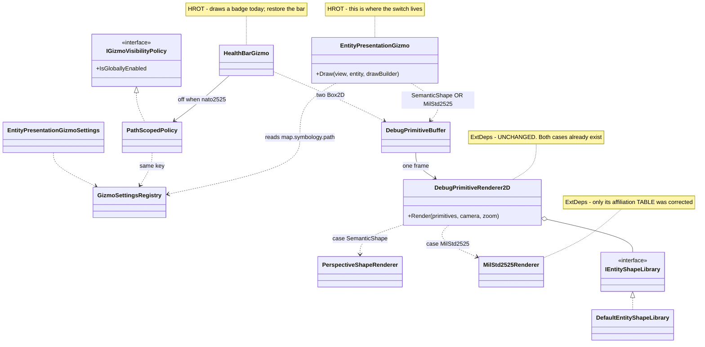
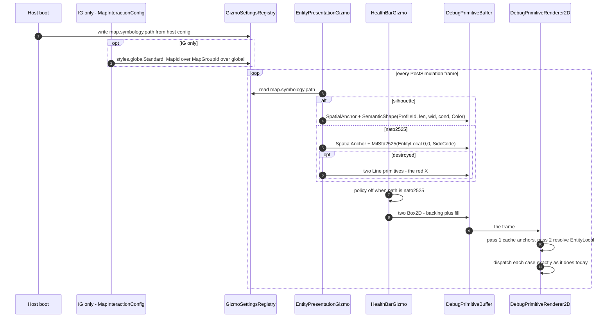

<!--STATUS
state: LIVE
build-state: NOT-BUILT
verified: 2026-08-28 (coordinator source scan)
current-answer: 3.3 and 3.4 are BUILT (UXI-23 S2a/S4). START AT 3.8 - READY-TO-BUILD, with UML:
  TWO selectable symbol paths (silhouette, nato2525-as-a-stub) plus a non-selectable emergency box
  fallback. THE SWITCH IS EMIT-SIDE, in EntityPresentationGizmo - the ExtDeps renderer is NOT touched,
  because MilStd2525 is already a peer token with its own renderer case (3.8.3). 3.8's step 0 is DONE:
  SemanticShapeRenderer deleted and the NATO affiliation table corrected (3.8.11). Still NOT-BUILT:
  3.1 (CE-125 - the renderer hardcodes cyan at EntityPresentationGizmoShared.cs:92), 3.2, 3.5, 3.6, 3.7.
known-rot: 3.0 is SUPERSEDED by 3.8.9 - the JSON style cascade is IG-ONLY, so StyleResolutionSystem is
  NOT lifted to every host. 3.8's first two drafts are in the HISTORY section and must not be quoted -
  both put a renderer seam inside FDP/ExtDeps/GizmoMap, which the final design does not need.
known-rot: 3.0 is SUPERSEDED by 3.8.9 - the user ruled the JSON style cascade an IG-ONLY speciality, so
  StyleResolutionSystem is NOT lifted to every host. 3.8's own first draft is in the HISTORY section and
  must not be quoted.
-->
# Feature design — entity symbology on the map

> **Design for [UXI-10](UX_Issues.md#uxi-10) · drafted 2026-08-12.** **Status: ❌ NOT-BUILT (design only) — renderer still hardcodes cyan (`EntityPresentationGizmoShared.cs:92`); resolved style not consumed; the three per-host gizmos never merged.** Also **verifies and absorbs [UXI-19](UX_Issues.md#uxi-19)** (previously
> *unverified*) and supplies the mechanism behind [UXI-11](UX_Issues.md#uxi-11).


## 0. 🔴 The issue as filed is the smallest part of it

> *"Map symbology seam exists and no host uses it — every host passes `DefaultEntityShapeLibrary`."*

True. But the scan found something larger: **HROT has two symbology pipelines, fully built, that are not
connected to each other.**

| | Pipeline | Ends at |
|---|---|---|
| **Upstream** | `StyleResolutionSystem` — **278 lines**, a **3-layer merge** (TKB default → DDS override → operator config) writing `ResolvedStyle` **every PostSimulation tick** | 🔴 **text UI only** — the inspector, a tooltip, and history-trail sampling |
| **Downstream** | `IEntityShapeLibrary` → `EntityShapeProfile` → polylines on the map | fed a **DIS number** and **one hardcoded colour** |

⇒ The colour is **computed correctly, every frame, for every entity — and thrown away.**

## 1. Prior art ([rule 6](UX_Issues.md#rules))

| Exists? | What | Adoption | Bearing |
|:--:|---|---|---|
| ✅ | **`StyleResolutionSystem`** + **`ResolvedStyle`** — Tint, Affiliation, DamageLevel, TextureName, Label, ShowTrail, ShowSensors | **0 renderers** | ⭐ **the resolver this design was going to invent already exists** — `StyleResolutionSystem.cs`, `ResolvedStyle.cs` |
| ✅ | `ApplyAffiliationColor(...)` inside that system (`StyleResolutionSystem.cs:113`) | 1 (internal) | it already merges `EntityInfo.ForceId` and the DDS `StyleSetId` into a tint |
| ✅ | **`ForceId`** — `Neutral / Friend / Hostile`, **145 references** in `Hrot/` | perception, EQS, TKB | 🔴 its own XML doc says *"Rendered as **green** / **blue** / **red**"* (`ForceId.cs:12-19`) — **no renderer implements it** |
| ✅ | **`ResolvedStyleConstants`** — the affiliation palette: Friend `(0,100,255)`, Hostile `(255,0,0)`, Neutral `(0,255,0)`, Unknown white | 1 (the resolver) | ⭐ **the authoritative table** — §3.2 |
| ⚠ | **`GetAffiliationColor(ForceId)`** — a **second** copy of the palette | 🔴 `private`, 1 caller | `EntityPlacementGizmo.cs:255-261`. The **placement ghost** is correctly coloured; the moment the entity is placed it turns cyan. ⚠ **And it disagrees**: Friend is `(0,0,255)` here vs `(0,100,255)` in `ResolvedStyleConstants` |
| ⚠ | `MilStd2525Renderer.GetAffiliationColor` — a **third** palette (Neutral=**Yellow**, Unknown=**Green**) | the `MilStd2525` primitive, **never emitted** | ⚠ three inconsistent affiliation palettes; only the unreachable one is unit-tested |
| ✅ | `IEntityShapeLibrary.GetShape(string? shapeName, ulong fallbackDisType)` | 4 explicit hosts + CGF implicitly | 🔴 **`shapeName` is `null` at the only call site** (`DebugPrimitiveRenderer2D.cs:410`) — half the interface is dead |
| 🔴 | **`VisualData.MapShapeName`** — a `FixedString32`, doc-commented *"Optional explicit name of the 2-D map shape to render **from the entity shape library**"* | **0 readers** | ⭐⭐ **the purpose-built field for the dead parameter.** Declared (`VisualData.cs:33`), carried through the TKB DTO (`VisualDefinitionDto.cs:29`), **populated by the translator** (`PresentationTkbTranslator.cs:41`), present in scenario JSON — and **read nowhere in the repo** |
| ✅ | `StatelessGizmoRegistry.Register(projector, visibilityPolicy)` — an **`IGizmoVisibilityPolicy` parameter** | default only | ⭐ the clean fix for the double-registration (§3.4) |
| ⚠ | `EntityPresentationGizmoShared` — the shared helper | 3 gizmos, **inconsistently** | CGF bypasses it for the shape (§2, defect E) |

⭐ **Seam-law instance 10 — the largest yet.** Not a helper nobody wired: a **278-line system with DDS
integration and operator overrides**, running every tick, whose output the map never reads. **Instance 11**
is `MapShapeName`: a field authored in scenario data, translated into a component, and never read.

### ⚠ The filed wording is wrong in one detail, and it matters

> *"every host passes `DefaultEntityShapeLibrary`"*

| Host | Reality |
|---|---|
| Editor, SimHost, IG, ReplayBrowser | ✅ pass it **explicitly** (`EditorSubsystem.cs:1545`, `SimHostVisualization.cs:242`, `IgApplication.cs:826`, `ReplayBrowserSubsystem.cs:237`) |
| **CGF** | ⚠ **omits the argument** — the 3-arg `DebugGizmoLayer` ctor (`CgfSubsystem.cs:583`); the default arrives through **three levels of `??`** |
| **StrideMock** | ⚠ **not wired at all** — its renderer call is commented `// wire in SM-009`; it draws `Raylib.DrawCircleV(..., Color.Red)` per entity (`StrideMockSubsystem.cs:218-221`) |
| **ExCon** | ✅ correctly absent — it has no map ([ruling 16](UX_RESUME_INTERACTION.md)) |

⇒ 🔒 **The accurate statement:** *every host with a map gets the default — four by choice, one by omission —
and **no second implementation of `IEntityShapeLibrary` exists**.* And the seam is **not an uncalled
interface**: it fires every frame at `DebugPrimitiveRenderer2D.cs:410`. What is dead is the
**polymorphism** and the **name parameter**, not the call.

## 2. 🔴 Verified defects

| | Defect | Evidence |
|--:|---|---|
| **A** | **Every entity is the same cyan.** `prim.Color = new Rgba32(100, 220, 255, 255)` — a literal, for all entities in all subsystems. **Friend and hostile are indistinguishable on the map** while the simulation itself distinguishes them | `EntityPresentationGizmoShared.cs:92` |
| **B** | **CGF's shapes are `alpha 0`.** CGF calls `draw.DrawSemanticShape(...)` **directly** instead of the shared helper; the builder leaves `Color` at `default` = `(0,0,0,0)`, and the renderer uses `ToRaylibColor(prim.Color)`. ⚠ **Even the debug fallback is invisible** — the magenta "unknown profile" rectangle is drawn with `color.A`, i.e. CGF's zero alpha | `CgfEntityPresentationGizmo.cs:49` vs `DebugPrimitiveBuffer.cs:364-376`, `DebugPrimitiveRenderer2D.cs:197,437` |
| **C** | **CGF emits no pick box** — `EmitPickBox` is called by the IG and SimHost gizmos, not CGF ⇒ **CGF entities cannot be picked on the map**. This is the mechanism behind [UXI-11](UX_Issues.md#uxi-11) | `CgfEntityPresentationGizmo.cs:45-49` |
| **D** | **Damage visuals exist in one subsystem of three.** IG computes the condition mask from health; **CGF and SimHost hardcode `conditionMask: 0u`** ⇒ a damaged vehicle looks healthy in both | `IgEntityPresentationGizmo.cs:33-38` vs `CgfEntityPresentationGizmo.cs:49`, `SimHostEntityPresentationGizmo.cs:35` |
| **E** | 🔴 **[UXI-19](UX_Issues.md#uxi-19) is REAL — now verified.** See below |
| **F** | **`ResolveProfileId` returns 0 off a snapshot** — `if (view is not EntityRepository repo) return 0UL;` ⇒ `_fallback` ⇒ a grey rectangle, silently | `EntityPresentationGizmoShared.cs:48` |
| **G** | **The shape vocabulary is 4 hardcoded profiles** selected by a DIS bit-decode; the named half is unreachable. ⚠ `rotary_wing` reuses the `fixed_wing` geometry verbatim | `DefaultEntityShapeLibrary.cs:15-42,106-107` |
| **H** | **Zero test coverage of shape selection.** No test constructs `DefaultEntityShapeLibrary` or calls `GetShape`; the one test renderer overrides `DispatchShape` and never calls `base`, so it cannot reach the library | `GizmoPresentationTests.cs:23-34` |
| **J** | 🔴 **Rotating an entity in CGF does not visibly rotate it** — the rotator writes `SimTransform.Rotation`, the gizmo draws `NetworkTransform.LastRotation`. ⚠ **The pose-source fix alone is not the remedy** — see below | `EntityRotatorGizmo.cs:118-122` + `CgfSubsystem.cs:605` vs `CgfEntityPresentationGizmo.cs:27-35` |
| **J′** | 🔒 **RULED (user, 2026-08-12): CGF must not write `SimTransform` at all.** *"Similar to Delete — CGF does not own `SimTransform`, so it needs to send a request to SimHost, not change ECS directly. Editor owns all."* ⇒ making the pose source uniform turns *"never rotates"* into *"rotates, then snaps back on the next DDS sample"* (ingress overwrites `SimTransform` for non-owned entities, `:85-89`). **The real fix is a request path** — mirroring `DeleteEntity`'s `DestroyEntityCommand` publish-by-`NetworkId` (`CgfSubsystem.cs:777-785`). 🔴 **No such command exists for pose** ⇒ **[UXI-29](UX_Issues.md#uxi-29)**, out of scope here | `EntityDragGizmo.cs:155`, `EntityRotatorGizmo.cs:118` both `GetComponentRW<SimTransform>` |
| **I** | **`SelectionHighlightGizmo` is not registered in SimHost or CGF** — neither calls `Hrot.Common.Diagnostics.Gizmos.GizmoRegistrar.RegisterAll` ⇒ no selection ring, and no `HealthBarGizmo` either | `SimHostApp.cs:337-345`, `CgfSubsystem.cs:498-500` vs `EditorSubsystem.cs:1100` |

### 🔴 UXI-19 verified — the Editor draws every entity twice

It was filed as *"two presentation gizmos may match one entity — **unverified**"*. The chain is now closed:

| Step | Evidence |
|---|---|
| Projector keys **differ by one component** — `IgEntityPresentationGizmo` needs `(SimTransform, NetworkIdentity, CullingState)`; `SimHostEntityPresentationGizmo` needs `(SimTransform, NetworkIdentity)` | `IgEntityPresentationGizmo.cs:13`, `SimHostEntityPresentationGizmo.cs:14` |
| Matching is a **superset** test, with no exclusivity | `BitMask512.HasAll(comp, rule.RequiredMask)` — `StatelessGizmoSystem.cs:104` |
| The Editor registers **both** registrars | `EditorSubsystem.cs:1094-1097` |
| Editor entities **do** get `CullingState` — `MapCullingSystem` sets it on **every entity with `SimTransform`** | `MapCullingSystem.cs:68-80`, module registered `EditorSubsystem.cs:971` |

⇒ In the Editor, every networked entity emits **two spatial anchors, two pick boxes and two semantic
shapes** per frame.

⚠ **And it defeats [UXI-09](UX_Feature_Map_Viewport.md).** The IG gizmo honours culling
(`if (!cull.IsVisible) return;`); the SimHost one does not. So the Editor computes culling and then draws
the culled entities anyway — **narrowing the cull rect in UXI-09 buys the Editor nothing until this is
fixed.**

## 2.5 🔒 RULED by the user, 2026-08-12 — two classes of map

> *"`StyleResolutionSystem` was meant for the **IG 2D map** (production 2D map, remotely controlled via a
> DDS API), based on DDS-network-provided styles. CGF, SimHost and Editor are **service-level maps**. We
> can and should share the infrastructure where it looks useful — generic, reusable, user-attractive and
> helpful features. The DDS feed (plus ECS components) is the source of the data for IG, while for the
> others the sources are mostly internal/local user inputs only (no remote DDS control)."*

| | **IG — production map** | **Editor · CGF · SimHost · ReplayBrowser — service maps** |
|---|---|---|
| Controlled by | **remote DDS API** + ECS | **local user input** + ECS only |
| Layer 1 — TKB / `VisualData` / `ForceId` | ✅ | ✅ **generic — share** |
| Layer 2 — `IgSymbolOverride` (DDS) | ✅ **IG's reason to exist** | ❌ **must not be required** |
| Layer 3 — operator / user config | ✅ | ✅ **mechanism is generic**; the specific toggles may differ |
| Consumption — tint, damage, shape name | ✅ | ✅ **generic — share** |

🔒 **So the sharing is of the *machinery and the generic layers*, not of the DDS pipeline.** This design
must not make a service map depend on a DDS concept it will never receive.

⭐ **And the Editor already proves the split works** — it registers `StyleResolutionModule`
(`EditorSubsystem.cs:972`) today, with layer 2 **inert** because nothing populates `IgSymbolOverride`
locally. The layered shape is already in production; it has simply never been named.

| Host | Runs the resolver today? |
|---|---|
| **IG** | ✅ `IgNodeBootstrapper.cs:171` — all three layers |
| **Editor** | ✅ `EditorSubsystem.cs:972` — layers 1 + 3, layer 2 inert ⇒ 🔴 **the tint is already computed and still discarded; the fix here is consumption only** |
| **CGF · SimHost · ReplayBrowser** | ❌ not registered — they need the shared resolver, without the DDS layer |

## 3. The design

🔒 **Connect the two pipelines. Do not build a third.** No change to `FDP/ExtDeps/GizmoMap` — the seam
there is an interface, and HROT implements it.

### 3.0 ⛔ SUPERSEDED by §3.8.9 — the resolver stays IG-only

> 🔒 **User ruling, `2026-08-30`:** *"no json cascading for CGF/SimHost/ReplayBrowser."* ⇒ ⛔ **do NOT lift
> `StyleResolutionSystem`, `MapUserConfig` or `IgSymbolOverride` out of `Hrot.IG`.** ⭐ The text below is the
> superseded plan, kept because §3.1 still cites its vocabulary. 📄 **Read §3.8.9 instead.**

#### ⛔ (superseded) The resolver becomes layered — IG adds one layer, service maps add none

```csharp
public interface IStyleSource                 // ordered; later sources overwrite earlier
{
    void Apply(ISimulationView view, Entity e, ref StyleDraft draft);
}
```

| Source | Registered by | Reads |
|---|---|---|
| `TkbStyleSource` | **all hosts** | `VisualData` (symbol, colour hex, **`MapShapeName`**) + `EntityInfo.ForceId` |
| `UserConfigStyleSource` | **all hosts** | the host's own config object (force-hostile, hide-labels, …) |
| **`DdsOverrideStyleSource`** | 🔒 **IG only** | `IgSymbolOverride` — the DDS-fed layer |

⇒ `StyleResolutionSystem` moves to the shared layer and takes its sources as a constructor argument. **Its
current three-layer body becomes IG's source list** — no behaviour change for IG, which is the host it was
written for.

| | |
|---|---|
| ✅ **Service maps never learn what DDS is** | they register two sources; the DDS type stays in IG |
| ✅ **IG keeps exactly today's behaviour** | same three layers, same order, now named |
| ✅ **The seam is the contribution point** the programme already uses elsewhere — descriptor + per-host binding |
| ⚠ `MapUserConfig` lives in `Hrot.IG.Systems` | the Editor already depends on it (`EditorSubsystem.cs:972`). Moving it out is part of this, not a separate cleanup |

### 3.1 The one assignment that fixes A, B and D

`EntityPresentationGizmoShared.DrawSemanticShape` reads the style that is already there:

```csharp
var (tint, condition) = view.HasComponent<ResolvedStyle>(entity)
    ? (style.Tint.ToRgba32(), ConditionFrom(style.DamageLevel))
    : (AffiliationColors.For(view, entity), 0u);       // ← falls back to ForceId, then to today's cyan
prim.Color = tint;
```

| Fixes | How |
|---|---|
| **A** | the tint is the merged, network-aware, affiliation-derived colour |
| **B** | CGF routes through the same helper ⇒ never `alpha 0` |
| **D** | condition comes from `ResolvedStyle.DamageLevel` — the *merged* damage, not IG's local component ⇒ all three subsystems agree |

⭐ **`ConditionFrom` keeps IG's existing thresholds** (`≥50` damaged, `≥90` immobile,
`IgEntityPresentationGizmo.cs:37-38`) — promoted, not re-invented.

### 3.2 One affiliation palette — and it is **not** the private one

⚠ **Correction to this design's own first draft**: the palette to keep is **`ResolvedStyleConstants`**, not
`EntityPlacementGizmo.GetAffiliationColor`. Three palettes exist and two disagree:

| Source | Friend | Neutral | Unknown | Verdict |
|---|---|---|---|---|
| **`ResolvedStyleConstants`** | `(0,100,255)` | green | white | 🔒 **authoritative** — it is what the resolver already writes into `ResolvedStyle.Tint` |
| `EntityPlacementGizmo.GetAffiliationColor` (private) | `(0,0,255)` | green | — | ⇒ **delete**, redirect to the constants |
| `MilStd2525Renderer.GetAffiliationColor` | blue | **yellow** | **green** | leave alone — it serves a primitive nothing emits; ⚠ note it before anyone revives that path ⇒ ⭐ **that revival is §3.8, and the note is resolved there (§3.8.8): entity-driven ⇒ `prim.Color`; SIDC-driven ⇒ this palette** |

⇒ After this, the placement ghost and the placed entity finally match, because both read one table.

### 3.3 One presentation gizmo, not three

`IgEntityPresentationGizmo` + `SimHostEntityPresentationGizmo` + `CgfEntityPresentationGizmo` →
**`EntityPresentationGizmo`**, projector key `(SimTransform, NetworkIdentity)`.

🔒 **RULED by the user, 2026-08-12:** *"CGF's `NetworkTransform` does not make sense to me. CGF is not
different from the others — all should use the same source (`SimTransform`) and the same rendering path for
the symbol (same gizmo, same DIS-type / TKB-derived shape, maybe just IG can override via DDS)."*

⚠ **This corrects an earlier draft of this very section** ([Correction 26](UX_Tasks_Detail.md#corrections)),
which kept CGF's preference as a "pose-source rule" on the false premise that the other hosts have no
`NetworkTransform` to prefer. **They do** — `SharedTranslatorPack` is created for **every** role
(`NedReplicationModule.cs:215-216`), so IG, SimHost and CGF worlds all carry it. That rule would have
**silently changed the production map's pose source**.

⇒ 🔒 **One pose source: `SimTransform`.** The preference is deleted, not migrated. Evidence it is
vestigial *and* harmful:

| | |
|---|---|
| **Both are written from the same decode** | `GeoSpatialIngressTranslator.Decode` sets `NetworkTransform` at `:75` and `SimTransform` at `:89` from the *same* `position`/`rotation` ⇒ numerically identical after ingress |
| **`SimTransform` is deliberately the local authority** | the `:85` guard — *"do NOT override `SimTransform` for locally-owned entities"* — exists precisely so local edits survive DDS loopback |
| 🔴 **The preference breaks CGF's own Rotate** | `EntityRotatorGizmo.CommitRotation` writes **`SimTransform.Rotation` only** (`EntityRotatorGizmo.cs:118-122`), and CGF wires that gizmo to its *Rotate* menu item (`CgfSubsystem.cs:605-608`) — while its gizmo draws `NetworkTransform.LastRotation`. ⇒ **rotating an entity in CGF does not visibly rotate it** |
| **The stated rationale points at deleted code** | the comment cites `CgfDebugVisualizerAdapter`, which was **removed** in the gizmo migration. The only recorded justification is a task instruction hedged with *"Optionally… CGF nodes **may** use `NetworkTransform` as a more current position source"* — a hypothesis, never verified |

#### ⭐ Is there already one gizmo that serves all hosts? — analysed, **no**

A repo-wide census of every gizmo emitting a per-entity visual: **the three presentation gizmos are the
only candidates, and none is a superset** — `Ig` adds culling + damage, `SimHost` adds the pick box,
`CGF` adds the (wrong) pose preference and loses both. ⇒ **merging them is correct and is this design's
§3.3**; there is nothing to adopt instead.

⚠ **But the merge does not close the real gap**, which is *registration*, not implementation:

| Subsystem | Per-entity gizmos registered |
|---|---|
| **IG · Editor** | full set — health bar, selection ring, rotation, vision cone, nav target, LOS, routes, areas, overlays, effects, … |
| **ReplayBrowser** | broad read-only set |
| **SimHost** | presentation + canvas menu + drag — **nothing else** |
| **CGF** | presentation + canvas menu — **nothing else** |

⇒ 🔒 **Out of scope here, worth its own issue**: SimHost and CGF get **no** health bars, selection rings,
headings, routes or overlays — and nothing records whether that is a deliberate capability choice or
drift. ⚠ It is the same shape as [UXI-13](UX_Issues.md#uxi-13) (four hand-maintained gizmo menu blocks):
**per-subsystem registration lists with no declared rationale.**

### 3.4 Culling moves to a visibility policy — ✅ **BUILT `2026-08-30` by `UXI-23` `S4`**

> ✅✅ **This section is AS-BUILT.** `CullingStateVisibilityPolicy` exists at
> `Hrot.Presentation/ScenarioEditor/Map/`, and the pack's default resolver attaches it to the entity
> projector. 📄 The full record, including two things §3.4 did not know: `UX_Feature_Map_Parity.md` §3.2f.

⚠⚠ **What §3.4 could not see, and why it sat unbuilt:**

| # | |
|---|---|
| **①** | 🔴 **The consumer half did not exist.** `StatelessGizmoSystem` called only `IsGloballyEnabled` — so the `CullingStateVisibilityPolicy` this section prescribes would have been **stored and silently ignored**. ✅ `S4` made the system honour `IsEntityVisible` |
| **②** | 🔴 **Reflection could not supply the policy.** ⛔ The code line below is a **hand-written registration site that `ST-031` deleted**. ✅ `S4` added a `Func<Type, IGizmoVisibilityPolicy?>` resolver to `RegisterAll`, so the wiring is `MapInteractionContext.VisibilityPolicyResolver` rather than a literal `Register` call |
| **③** | ⭐ **The double-match this section aimed at was already gone.** `S2a` merged the three entity projectors, so *"one gizmo, one key"* was banked by a different route |
| **⚠** | 🔴 **`CE-131`:** IG's culling input marks EVERY entity invisible *(viewport from projected screen corners)*. ⇒ **the setting defaults OFF**; this section is now correctly placed but still wired to a broken source |


```csharp
registry.Register(new EntityPresentationGizmo(), new CullingStateVisibilityPolicy());
```

`StatelessGizmoRegistry.Register` **already takes an `IGizmoVisibilityPolicy`** and defaults it to
`AlwaysVisiblePolicy.Instance` (`StatelessGizmoRegistry.cs:87`). Moving `CullingState` out of the
projector key and into the policy:

| | |
|---|---|
| ✅ **Kills the double-match by construction** — one gizmo, one key | defect E / UXI-19 |
| ✅ **Culling applies uniformly**, so UXI-09's narrowed rect pays off in the Editor | |
| ✅ Subsystems without culling register the same gizmo with the default policy | no fork |

### 3.5 Make the `shapeName` half real — the actual filed issue

```csharp
_shapeLibrary.GetShape(prim.ShapeName, prim.ProfileId)     // renderer, today: GetShape(null, …)
```

⭐ **The name already exists in the data.** `VisualData.MapShapeName` is authored in TKB/scenario JSON,
translated into the component (`PresentationTkbTranslator.cs:41`), and read by nobody. Its doc comment
states its purpose exactly: *"Optional explicit name of the 2-D map shape to render from the entity shape
library. When empty, the renderer selects a shape automatically based on `DISEntityType`."* — **that is
this design's specification, written before the code diverged from it.**

🔒 **Resolve the shape name in the layer that already resolves style.** The resolver gains one more merged
output — shape name — seeded from `VisualData.MapShapeName` by `TkbStyleSource`, ⭐ **so every host gets it
from local scenario data**; IG's `DdsOverrideStyleSource` can additionally override it at runtime. ⚠ Keep
it **distinct from `TextureName`**: that field carries `SymbolCode` / `TextureOverride` (a *texture*),
which is a different concept from a *vector shape profile*.

Carrying it to the renderer: `DebugPrimitive` is a **fixed-layout struct** with no room for a string, but
the buffer already interns strings by FNV-1a for menu bindings (`DebugPrimitiveBuffer.cs:378-385`).
🔒 **Use that same mechanism** — intern the name, carry the `uint` hash, resolve hash → name → profile in
the renderer.

⇒ Scenario authors get **`mapShapeName` working as documented on every map**, and IG additionally gets
runtime symbol control from the DDS feed — each host fed from the sources it actually has.

### 3.6 `HrotEntityShapeLibrary` — using the seam, without touching ExtDeps

```csharp
public sealed class HrotEntityShapeLibrary : IEntityShapeLibrary
{
    public void Register(string name, EntityShapeProfile profile);
    public void Register(ulong disType, EntityShapeProfile profile);
    public EntityShapeProfile GetShape(string? shapeName, ulong fallbackDisType);   // name → dis → default
}
```

Passed at the **four explicit injection points** (`EditorSubsystem.cs:1545`, `IgApplication.cs:826`,
`SimHostVisualization.cs:242`, `ReplayBrowserSubsystem.cs:237`) **and at CGF's**, which today omits the
argument entirely (`CgfSubsystem.cs:583`). It **delegates to the default for anything unregistered**, so
the shipped 4 profiles keep working.

⚠ **Make the omission impossible to repeat**: CGF's silent default came from an optional parameter with a
`??` chain three levels deep. The library should be a **required** argument at the layer constructor —
the default becomes something a host *chooses*, not something it *misses*.

### 3.7 Defect F — profile resolution off a snapshot

`ResolveProfileId` needs the live repo because `GetDisType` is an `EntityRepository` method. ⚠ **Do not
paper over it**: log once when the cast fails, and 📌 **carry the DIS type in the primitive instead** — the
gizmo already runs where the repo is available, so resolve early and pass the value. No new component.

### 3.8 ⭐⭐⭐ TWO SELECTABLE SYMBOL PATHS — **the switch is EMIT-SIDE; the renderer does not change**

<!--build-state: READY-TO-BUILD-->

> 🔒 **User ruling, `2026-08-30`:** *"i do not want to lose any of the renderers. they should become
> alternative symbol rendering paths, switchable (one active) per host, active path defined in hosts config."*
> 🔒 **Refined:** *"i see basically just 2 meaningful selectable renderers … the entity-real-sized wire rect
> with health bar is a good fallback (non-selectable, just an emergency fallback if nothing better exists)."*
> 🔒 **And the decisive correction:** *"Isn't the ExtDeps gizmo just the rendering code existing independently
> of when and who gives orders? The switch what to render per host should then not live in the rendering code
> … only the control logic outside of ExtDeps should change."*

⚠⚠ **Two earlier drafts of this section are SUPERSEDED** — one proposed four paths, both proposed a renderer
seam inside `FDP/ExtDeps/GizmoMap`. 📄 `## ⛔ HISTORY`.

#### 3.8.1 ⭐⭐ INVENTORY

```
cli search_graph {"name_pattern":".*(ShapeLibrary|SymbolRenderer|ShapeRenderer|Symbology|MilStd).*"}
  → total 31, has_more false           # found SemanticShapeRenderer, which grep had missed
grep -rn "\[GizmoProjector"                          → 16 projectors, 6 of them map-drawing
grep -rhoi '"symbolCode"[^,}]*' --include=*.json     → real 15-char SIDCs authored in TKB assets
grep -rn "PresentationTkbTranslator" (non-test)      → registered on IG and SimHost only
git log --all -S HealthBar --name-only               → the deleted bar (§3.8.5)
```

| # | renderer | draws | verdict |
|---|---|---|---|
| **A** | `PerspectiveShapeRenderer` + `IEntityShapeLibrary` | oriented polyline silhouette, perspective exaggeration, condition gating | ⭐⭐ **path `silhouette`** |
| **B** | inline `else` in the renderer's `SemanticShape` case | entity-sized wire rect | ⛔ **non-selectable emergency fallback** (§3.8.4) |
| **C** | `MilStd2525Renderer` | filled disc in the affiliation colour + black outline + 4-char SIDC label | ⭐ **path `nato2525`** — ⚠ **a STUB, deliberately** |
| **D** | ~~`SemanticShapeRenderer`~~ | rect + red X; magenta circle fallback | 🔴 **DELETED `2026-08-30`** (§3.8.3b) |

⭐ **`nato2525` stays a stub on purpose.** `.dev/_DONE/gizmos-1/batches/BATCH-20-INSTRUCTIONS.md:126` asked for
exactly *"Stub NATO symbol rendering"*; 🔒 the user ruled *"it can stay a stub but still a selectable entity
renderer mode."* ⛔ It is **not** the composed multi-polyline STANAG frame renderer; that remains unbuilt, and
⚠ **must not be re-filed as a defect.**

##### ⛔ Six projectors that are NOT switchable, by construction

`MapOverlayGizmo` *(`MapOverlayStyle`)* · `TacticalAreaGizmo` + `RouteGizmo` *(`TkbIdentity`)* ·
`EffectPresentationGizmo` · `ProjectilePresentationGizmo` · `EqsSensorGizmo` — ⭐⭐ **none emits an entity
symbol primitive**, so the switch cannot reach them even by accident. 🔒 Matches the user's ruling that
*"specific map drawing entities with their own specific look & behavior … is not style-switchable."*

#### 3.8.2 ⭐⭐ How the silhouette polyline is chosen — **name first, DIS second, and the name half is dead**

📐 `DefaultEntityShapeLibrary.GetShape(shapeName, fallbackDisType)`:

```
shapeName non-empty AND registered  →  that profile
else  decode fallbackDisType: kind 1 + domain 1 → ground_vehicle
                              kind 1 + domain 2 → cat ≥ 20 ? rotary_wing : fixed_wing
                              kind 3            → humanoid
else  → EntityShapeProfile { Name = "_fallback" }        ⇒ the emergency box, §3.8.4
```

🔴 **The call site passes `null`** *(`DebugPrimitiveRenderer2D.cs:410`)*, so only the DIS half ever runs and
TKB's `VisualData.MapShapeName` is authored, translated and read by nobody. 📄 §3.5 owns that fix.

#### 3.8.3 ⭐⭐⭐ THE SWITCH IS EMIT-SIDE — **`MilStd2525` is already a peer token with its own renderer case**

⛔⛔ **Two earlier drafts put an `IEntitySymbolPath` interface inside `DebugPrimitiveRenderer2D`. That was
wrong**, and the reasoning error is worth recording because it is easy to repeat.

📐 **The true premise:** `SemanticShape` is a **semantic token**, not a drawing instruction — the primitive is
a 64-byte wire type and, in its own words, *"when the **dumb terminal** receives them, it uses a two-pass
renderer."* Resolving *profile → geometry* terminal-side is deliberate.
🔴 **The false inference:** *"therefore the style choice is part of that resolution, so the switch is
renderer-side too."*

⭐⭐⭐ **It is not — because `DebugPrimitiveShape.MilStd2525` is already a PEER token with its own renderer
case** *(`DebugPrimitiveRenderer2D.cs:442` → `MilStd2525Renderer.Draw`)*. It is a sibling of `SemanticShape`,
not a sub-case of it. ⇒ 🔒 **choosing between two tokens is emit-side control logic**, and the renderer stays
exactly as dumb as it is.

| host chose | `EntityPresentationGizmo` emits |
|---|---|
| `silhouette` | today's `MakeSemanticShape(...)` — ⭐ **unchanged** |
| `nato2525` | a `MilStd2525` primitive — `Space = EntityLocal`, `AnchorIndex` = the entity, offset `(0,0)`, `SidcCode` = §3.8.3c |

⭐⭐ **Zero changes to `FDP/ExtDeps/GizmoMap`'s rendering code**, and §3's *"no change to ExtDeps"* constraint
is **honoured**, not deviated from. ⭐ One primitive per entity either way.

##### ⭐ Entity-anchoring works today — measured, and it corrects a caveat

⚠ The demo emits `MilStd2525` in `CoordinateSpace.World` *(`DemoSceneGenerator.cs:366`)*, which reads like a
constraint. 📐 **It is not.** Pass 2's anchor resolution ends in:

```csharp
default:   // Icon and other shapes: transform via IconWorldPosX/Y
    (float wx, float wy) = ApplyAnchor2D_XY(in entry, cos, sin, prim.IconWorldPosX, prim.IconWorldPosY);
```

⭐⭐ `IconWorldPosX/Y` are at offsets **24/28** — the *same physical bytes* as `MilWorldPosX/MilWorldPosY`.
`MilStd2525` has no case of its own, so it lands in `default` and is anchor-resolved through exactly those
fields. ⇒ 🔒 **emit it `EntityLocal` at offset `(0,0)` and the symbol sits on the entity and moves with it**,
resolving against the same `SpatialAnchor` as `SemanticShape`. *(The branch also rotates the offset by the
anchor yaw; at `(0,0)` that is a no-op — and a NATO symbol should not rotate with the platform.)*

##### 3.8.3b 🔴 `SemanticShapeRenderer` is DELETED

> 🔒 **User, `2026-08-30`:** *"SemanticShapeRenderer is not doing anything I wanted and is basically superseded
> by other ways of rendering entity shapes, we can remove it completely."*

📐 It was a second, weaker implementation of `silhouette`'s job: its `ISemanticShapeProfileRegistry` mapped
`profileId` → **dimensions** where `IEntityShapeLibrary` maps to **polylines**; it drew a rectangle, a red X on
damage, and a magenta circle when unregistered. **Zero callers from its first commit**, and
`UX_Seam_Inventory.md` already recorded its registry at **`0/0/0`** adoption.
⭐ Deleted with `ISemanticShapeProfileRegistry` and `SemanticShapeProfile`. ⭐ The one behaviour worth keeping —
the damage X — is two `Line` primitives emit-side (§3.8.6), which is cheaper than keeping a renderer alive.
⚠ **This is a deletion FROM ExtDeps, which the "no change" constraint never forbade** — that constraint is
about not forking or extending it.

##### 3.8.3c ⭐⭐ The SIDC already exists in the data — and PRESENCE decides, not the host

📐 **Measured end to end.** `IgVisualDef.SymbolCode` defaults to `"SFGPUCIZ-------"`, TKB assets author real
15-character SIDCs — `SFGPUCI--------`, `SFGPUCIZ--H----` — and the chain `BdcTkbBuilder:97` →
`VisualDefinitionDto.SymbolCode` → `PresentationTkbTranslator:47` → `VisualData.SymbolCode` →
`StyleResolutionSystem:100` → `ResolvedStyle.TextureName` is live, with
`ResolvedStyleConstants.TextureNameMaxBytes = 16` sized for exactly 15 chars + null
*(`IG-BATCH-03-REPORT.md:78`: "Texture names are MIL-STD-2525 symbol codes")*.
⚠ **So the field named `TextureName` is really a SIDC** — which is why §3.5 insists `MapShapeName` stay
distinct from it.

##### ⭐⭐⭐ PRESENCE-DECIDED, so there is NO per-host decision to make

> 🔒 **User, `2026-08-30`:** *"One of the rules was that gizmo should work depending on presence of ECS
> component, isn't this the case, allowing unification (if VisualData present, we use it, otherwise we
> synthetize…)"*

⭐⭐ **Yes — and it is already this codebase's stated rule.** `EntityPresentationGizmo`'s own comment: *"A
`[GizmoProjector]` requirement is a **hard filter**, never an optional input"*, and it already reads health
that way *(`if (view.HasComponent<IgHealthState>(entity))`)*.

| `VisualData` present | the gizmo uses |
|---|---|
| ✅ | the **authored** SIDC, `ColorHex` and `MapShapeName` |
| ⛔ | a SIDC **synthesised** from `EntityInfo.ForceId` + DIS type, and today's derived colour |

⇒ ⛔⛔ **An earlier draft of this section framed this as *"decide at build time which hosts synthesise."*
That was wrong** — a host-config question the presence rule already answers. `VisualData` is an **optional
read**, never a projector key, and no host is broken either way.

##### ✅ AS-BUILT `2026-08-30` — `CE-137`: every TKB-spawning host now writes it

> 🔒 **User ruling:** *"the more the subsystems are same, the better — if VisualData is not IG-only concept,
> then for sure lets add it to SimHost and anywhere where it makes sense."*

⭐ **It is not IG-only.** `VisualData` is authored TKB data — `SymbolCode`, `ModelPath`, `ColorHex`,
`MapShapeName` — written at spawn from the TKB's `VisualDefinitionDto`.

| host | TKB spawn path? | `PresentationTkbTranslator` |
|---|---|---|
| **IG** | ✅ | ✅ `IgNodeBootstrapper:116` |
| **SimHost** | ✅ | ✅ `SimHostNodeBootstrapper:160` *(added by `S1`)* |
| **Editor** | ✅ *(5 translators)* | ✅ **ADDED `2026-08-30`** — the same omission `S1` fixed on SimHost |
| **Stride editor** | ✅ *(6 translators)* | ✅ **ADDED `2026-08-30`** |
| ⛔ **CGF · ReplayBrowser** | 🔴 **none at all** | ⛔ n/a — their entities arrive by **network replication**, so affiliation comes over the wire in `EntityInfo`. ⚠ **Not an omission; a different sourcing path** |

⭐ Gated by `EveryTkbSpawningHost_ConstructsThePresentationTranslator` — ⚠ **a SOURCE SCAN, and here that is
the right instrument**: the existing rails assert the *component is present after injection*, which stays
green when the translator is simply absent from a list. The two halves are complementary.
⚠ **The Stride edit is NOT compiler-verified** — the `Stride/` tree cannot build on Linux
*(`Microsoft.WindowsDesktop.App` unresolvable, pre-existing and unrelated)*. `HrotStrideApp.Game` references
`Hrot.Core` where the type lives, and the line is fully qualified, but it needs a Windows build to confirm.

⚠⚠ **A correction to `S1`'s own comment, folded into the source `2026-08-30`.** It claimed that without this
translator *"the shared entity gizmos drew nothing — 3 non-`Line` primitives against Scenario's 69."*
📐 **Wrong, and it conflated two halves of one batch:** the entity projector keys on
`SimTransform` + `NetworkIdentity`, not `VisualData`; the `3 → 69` recovery is attributable to the
**`MapDisplayComponent`** registration, without which `DebugGizmoLayer` layer-culled every entity.
⇒ ⭐ **the translator buys AUTHORED SYMBOLOGY, not a drawn map.**

#### 3.8.4 ⭐⭐ The emergency fallback — not selectable, and already correctly sized

🔒 **User:** *"the entity-real-sized wire rect with health bar is a good fallback (non-selectable) … not a
normal shape renderer anyone would want selected intentionally."*
📐 **The sizing already exists:** `TryGetVehicleDimensions` fills `LengthMeters`/`WidthMeters` from TKB, and
the renderer defaults `len = 5`, `wid = len * 0.5` when they are zero. ⇒ ⭐ **no code; a demotion in the
design.** It is what `silhouette` falls back to when the profile resolves to `_fallback`.

#### 3.8.5 ⭐⭐⭐ THE HEALTH BAR — it existed, it was deleted, it is being restored

| | |
|---|---|
| ⭐ **built** | `NedVisualizerAdapter` *(`SstVisualizerAdapter.cs`)*; made always-on by **`e726734cc` "fix: health bar on IG map"**, `2026-04-22` |
| 🔴 **deleted** | **`5ce023677` "GZ059: eradicate legacy IVisualizerAdapter/EntityRenderLayer rendering stack"**, `2026-05-08` — 268 lines + 95 of constants |
| ⛔ **never replaced** | `HealthBarGizmo` emits `DrawEntityBadge("87%")`, and ⚠⚠ **has read-and-DISCARDED `BarWidth`/`BarHeight` since its first commit** *(`HealthBarGizmoInstance`, BATCH-07)*. The badge was written *beside* the bar; the bar was deleted underneath it |

```csharp
Raylib.DrawRectangleV(pos, new Vector2(width, height), new Color(30,30,30,200));  // dark backing
float fillWidth = width * (health / 100f);                                        // fill lerps on %
Raylib.DrawRectangleV(pos, new Vector2(fillWidth, height), fill);
Raylib.DrawRectangleLinesEx(new Rectangle(pos.X,pos.Y,width,height), 1f, Color.White);
```

🔒 **Three DISCRETE colours** — `green ≥ 66`, `yellow ≥ 33`, else `red` — with the **fill WIDTH** proportional
to the percentage; confirmed by the user against a smooth-lerp alternative. 📐 `30 × 6` px, `25` px above.

⭐⭐ **No new machinery:** `IDebugDrawBuilder.DrawBox2D` takes a `fillColor`, the renderer honours an explicit
fill **plus** an outline on one primitive, `SizeMode.ScreenPixels` exists, and `Box2D` anchor-resolves in
`EntityLocal`. ⇒ **backing box + fill box, ~15 lines**, and `BarWidth`/`BarHeight` finally get used.

#### 3.8.6 ⭐⭐ Decorations are per path

| decoration | `silhouette` | `nato2525` | box fallback | emitted by |
|---|---|---|---|---|
| **health bar** | ✅ | ⛔ | ✅ | `HealthBarGizmo` — a separate projector, gated by an `IGizmoVisibilityPolicy` on the path setting *(`S4`'s existing mechanism, no new one)* |
| **red X on destroyed** | ⛔ | ✅ | ⛔ | ⭐ `EntityPresentationGizmo` — **two `Line` primitives** when the damage condition is set |

🔒 **User:** *"the red X for destroyed entities should be part of all renderers not having the health bar (i.e.
the nato 2525); the silhouette should have the health bar rendered at the top."*
⭐ Both decorations are emit-side, which is why the whole design needs no renderer change.

#### 3.8.7 ⭐⭐ Class diagram



#### 3.8.8 ⭐⭐ One frame — sequence diagram



#### 3.8.9 ⭐ Configuration — host-scoped for everyone; IG additionally has its own cascade

| key | values | default |
|---|---|---|
| **`map.symbology.path`** | `silhouette` · `nato2525` | 🔒 **`silhouette`** — byte-identical to today on every host |

⭐ Read through **`GizmoSettingsRegistry`**, the same per-host injectable settings object
`EntityPresentationGizmoSettings` uses *(📄 `UX_Feature_Map_Parity.md` §3.2c)*.

##### 🔒 The JSON cascade is an **IG SPECIALITY** — ⛔ not a shared feature

> 🔒 **User:** *"no json cascading for CGF/SimHost/ReplayBrowser … the style cascading could stay as IG
> subsystem speciality which may affect some configs of shared map rendering of IG (like switching the entity
> rendering style)."*

⇒ ⛔⛔ **SUPERSEDES §3.0**, which proposed lifting `StyleResolutionSystem` to every host. The resolver,
`MapUserConfig`, `IgSymbolOverride` and the cascade stay in `Hrot.IG`.

##### ⭐⭐ IG's per-map style mount point — measured, and not where we guessed

| carrier | scope | state |
|---|---|---|
| ⭐⭐⭐ **`MapInteractionConfig.ConfigurationJson`** | **per map** — `[DdsKey] MapId` + `[DdsKey] MapGroupId`, documented **`MapId > MapGroupId > global`** | ✅ on the wire, and **IG already parses it** *(`IgApplication.cs:~3250`)* — ⚠ only the `"interaction"` key. 🔴 Its own comment names `"styles"`, and nothing reads it |
| `MapConfigStatus.CurrentSettingsJson` | per map instance | *"the FULL current configuration state"* — the *"last received per-map style"* |
| ⚠ `MapEntitySymbol.StyleParamsJson` | **per ENTITY** | ⛔ **not the per-map style.** The entity-instance override the user ruled unnecessary |

⇒ ⭐ IG's hook is `ConfigurationJson` → `"styles"` → `globalStandard` *(the spec's own name,
`map-specs.md:1543`)*, writing `map.symbology.path`. 🔒 **The shared renderer never learns what DDS is.**

#### 3.8.10 ⭐ The truncated cascade — what to delete, what to KEEP

| field | verdict |
|---|---|
| `IgSymbolOverride.TextureOverride` · `.LabelOverride` | ⛔ **DELETE** — written `null` / never set at both ingress sites |
| ⭐⭐ **`.ShowHistory`** | ✅✅ **KEEP.** It gates `ResolvedStyle.ShowTrail` → `HistoryRecordingSystem` → `HistoryTrail`; never set at ingress, so **IG's whole movement-trail feature is dead by construction**. 🔒 *"Let's keep the history trail."* ⇒ **`CE-135`** |
| ⚠ `MapEntitySymbol.StyleParamsJson` | ⚠ **KEEP ON THE WIRE** — `[DdsTopic]` + `[DdsIdlFile]`, an external contract with ExCon/IOS. Leave unparsed and documented |

#### 3.8.11 ⭐⭐ Palettes — **two, and they do not conflict**

🔒 **User:** *"let's use what is there now"* for the entity palette; *"I want the colors right"* for NATO.

| path | colour source |
|---|---|
| `silhouette`, box fallback | ⭐ `ResolvedStyleConstants` via `prim.Color` — Friend `(0,100,255)` · Hostile `(255,0,0)` · Neutral green · Unknown white. **Unchanged**; §3.2's verdicts stand |
| `nato2525` | ⭐⭐ the **standard's own** affiliation colours, derived from SIDC character 2. The renderer ignores `prim.Color` **and that is correct** — the colour is a property of the symbology standard, not of the primitive; the gizmo selects it by choosing the affiliation character |

##### ✅ AS-BUILT `2026-08-30` — the NATO affiliation table was wrong and is fixed

📐 **The previous table had neutral and unknown SWAPPED** against the standard, put Joker with the friends, and
covered only 7 of the 15 affiliation characters — everything else fell to the "unknown" arm and rendered green.

| affiliation | characters | colour |
|---|---|---|
| Friend | `F` friend · `A` assumed friend · `D` exercise friend · `M` exercise assumed friend | light blue `(128,224,255)` |
| Hostile | `H` hostile · `S` suspect · `J` joker · `K` faker | light red `(255,128,128)` |
| Neutral | `N` neutral · `L` exercise neutral | light green `(170,255,170)` |
| Unknown | `U` · `P` pending · `G` exercise pending · `W` exercise unknown · `O` none specified · anything unrecognised or too short | light yellow `(255,255,128)` |

⚠ **Joker and Faker are friendly tracks acting as suspect/hostile for exercise purposes**, and the standard
renders them in the hostile colour — which is why `J` moved out of the friendly bucket.
⭐ Gated by a 18-case `[Theory]` plus a distinctness rail *(four identical colours would satisfy the mapping
test on its own)*, inverse-edit red-proved: reverting neutral to the old value reddens exactly the `N`/`L` cases.

⚠⚠ **A THIRD affiliation decoder disagrees** — `PresentationTkbTranslator.DeriveForceId` reads the same SIDC
character but maps only `F`→Friend, `H`→Hostile, **everything else**→Neutral. ⇒ an *assumed friend* (`A`) or
*exercise friend* (`D`) entity gets `ForceId.Neutral` and a neutral tint on the silhouette path. 📌 Filed as
**`CE-136`**; ⛔ not fixed here because it changes TKB-derived affiliation on every host.

#### 3.8.12 ⭐ Sequencing

| step | what | depends on |
|---|---|---|
| ✅ **0** | **DONE `2026-08-30`** — delete `SemanticShapeRenderer`; correct the NATO affiliation table | — |
| **1** | 🔒 `CE-125` / §3.1 — the affiliation-derived tint reaches `prim.Color` | — |
| **2** | ⭐ the health bar restoration (§3.8.5) — self-contained | — |
| **3** | ⭐ the emit-side switch + the SIDC source + the config key | — |
| **4** | ⚠ IG's `"styles"` parsing (§3.8.9) — IG-only | 3 |

⚠ **Step 1 is not a prerequisite for step 3** — but until it lands, `silhouette` renders in the literal cyan of
`EntityPresentationGizmoShared.cs:92`. ⭐ `nato2525` is unaffected by it, since its colour comes from the SIDC.

#### 3.8.13 ⭐ Acceptance

| # | |
|---|---|
| ① | ⭐⭐ **Default is byte-identical** — with no key set every host emits exactly what it emits today |
| ② | ⭐⭐ **The renderer is untouched** — ⛔ a diff that modifies `DebugPrimitiveRenderer2D`'s dispatch, or adds a seam to it, fails this section |
| ③ | ⭐ **The switch is emit-side** — a rail driving `EntityPresentationGizmo` with each setting and asserting the emitted primitive's `Shape` is `SemanticShape` vs `MilStd2525` |
| ④ | ⭐⭐ **The NATO symbol is entity-anchored** — a rail asserting `Space == EntityLocal` and a matching `AnchorIndex`, ⛔ not `CoordinateSpace.World` |
| ⑤ | ⭐⭐⭐ **The health bar is a BAR** — two `Box2D` with `FillColor.A > 0`, fill width proportional to health, three discrete colours at the `66`/`33` boundaries. ⛔ *"a primitive was emitted"* is VACUOUS — the badge satisfies it |
| ⑥ | ⭐ **Decorations follow the path** — `HealthBarGizmo` emits nothing on `nato2525`; the red X emits only on `nato2525` and only when destroyed |
| ⑦ | ⭐⭐ **Config selects per host** — two `GizmoSettingsRegistry` instances, two different emitted shapes |
| ⑧ | ⚠ **`ShowHistory` survives** — a rail asserting the field still reaches `ResolvedStyle.ShowTrail` |
| ⑨ | ✅ **The NATO palette matches the standard** — the `[Theory]` above, plus the distinctness rail |

## 4. Acceptance

| # | Case | Cls |
|---|---|:--:|
| 10.1 | `AffiliationColors.For(Friend/Hostile/Neutral)` = blue / red / green, matching `ForceId`'s documentation | H |
| 10.2 | Entity with `ResolvedStyle` → the emitted primitive's `Color` **is** `style.Tint` | H |
| 10.3 | Entity without `ResolvedStyle` → falls back to `EntityInfo.ForceId`; without that, today's cyan | H |
| 10.4 | 🔴 **CGF's semantic shape is never `alpha 0`** | H |
| 10.5 | CGF emits a **pick box** | H |
| 10.6 | `DamageLevel` 0 / 50 / 90 → condition mask `0` / `Damaged` / `Damaged\|Immobile`, in **all three** subsystems | H |
| 10.7 | 🔴 An entity with `(SimTransform, NetworkIdentity, CullingState)` in an Editor-style registry emits **exactly one** semantic shape — the UXI-19 regression guard | H |
| 10.8 | An invisible (`CullingState.IsVisible = false`) entity emits **nothing**, via the visibility policy | H |
| 10.9 | 🔒 **Pose comes from `SimTransform` in every host**, even when `NetworkTransform` is populated and differs — the one-source guard | H |
| 10.23 | 🔴 CGF's *Rotate* **emits a request and writes no ECS** — the drawn symbol follows once the owner replies. ⚠ **Depends on [UXI-29](UX_Issues.md#uxi-29)**; until then CGF's *Rotate* stays as-is and this design does **not** claim to fix it | I |
| 10.10 | `HrotEntityShapeLibrary` returns a registered profile by name; by DIS id; and **delegates to the default** when unregistered | H |
| 10.11 | 🔴 **`VisualData.MapShapeName` reaches the library** — a scenario naming `mapShapeName` resolves the **named** profile, not the DIS fallback. The field's own doc comment becomes true | H |
| 10.12 | 🔒 **A service map resolves style with no DDS source registered** — `IgSymbolOverride` present on an entity is **ignored** when `DdsOverrideStyleSource` is absent | H |
| 10.20 | IG's source list reproduces **today's** 3-layer merge exactly — the no-behaviour-change guard for the production map | H |
| 10.21 | A DDS shape/style override changes the resolved profile end-to-end **in IG** | H |
| 10.22 | Editor: `ResolvedStyle` is already populated before this change ⇒ the tint appears with **no new module registered** | H |
| 10.17 | Empty `MapShapeName` → falls back to the DIS decode, exactly as documented | H |
| 10.18 | The three affiliation palettes collapse to one — the placement ghost's Friend colour **equals** `ResolvedStyleConstants.Friend*` | H |
| 10.19 | The shape library is a **required** constructor argument — CGF cannot silently default again | H |
| 10.13 | `ResolveProfileId` off a **snapshot** view logs once and still yields a usable profile | H |
| 10.14 | Placement ghost and the placed entity render the **same colour** | I |
| 10.15 | Two entities, opposing `ForceId` → visibly different colours on the map in every subsystem | I |
| 10.16 | Editor: an entity is drawn **once**, and off-screen entities are not drawn | I |

**20 H · 4 I · 0 V.** ⚠ Note 10.10-10.11, 10.17: **there is currently no test anywhere that calls
`GetShape`** (defect H), so these are the first coverage this logic has ever had. 🔒 **10.20 is the
load-bearing one** — IG is the production map, and this design must be provably invisible to it.

## 5. 🔒 Out of scope

| | |
|---|---|
| MIL-STD-2525 / APP-6 symbol set | a symbol *library*, not the plumbing; §3.6 makes it addable without further design |
| Texture/sprite symbols | `ResolvedStyle.TextureName` is carried, not yet rendered as a texture |
| Labels on the map | `ResolvedStyle.LabelText` is resolved and unused — ⚠ **a second unconsumed field**; own issue |
| `ShowSensors` / FOV cones | same — resolved, unconsumed |
| Selection highlight's **appearance** | separate gizmo, unaffected — ⚠ but its **absence in SimHost/CGF** (defect I) is a registration bug worth its own issue |
| StrideMock's red circles | its renderer call is commented out pending `SM-009`; out of this issue's reach |
| ExCon's own map | DDS-only, no ECS ([ruling 16](UX_RESUME_INTERACTION.md)) — it *produces* the override this design consumes |

## 6. Risks

| | |
|---|---|
| ⚠ **Everything on the map changes colour** | that is the feature — but it is the most visible change in the programme so far. ⭐ Recommend it lands with [UXI-09](UX_Feature_Map_Viewport.md) so the map's visual change is one event, not two |
| ⚠ **Collapsing three gizmos touches all three subsystems** | 10.7-10.9 are the guards; the pose-source rule (§3.3) is the one real behavioural merge |
| ⚠ **Interning a name per entity per frame** | the intern map is idempotent and allocates only on first sight — but ⚠ **measure**: this runs per visible entity. If it costs, cache the hash in `ResolvedStyle` at resolution time instead |
| ⚠ **`ResolvedStyle` is IG-namespaced** (`Hrot.IG.Components`) while becoming a cross-subsystem contract | it already **is** one — it lives in the shared `Hrot.Core` project and the Editor registers it (`EditorSubsystem.cs:601`). Promotion is a **namespace** rename, not a move. ⚠ Same for `MapUserConfig`, which the Editor already reaches into `Hrot.IG.Systems` to get |
| 🔒 **Touching IG is touching the production map** | per [ruling 20](UX_RESUME_INTERACTION.md), IG is the DDS-controlled production surface. The refactor must be behaviour-preserving there — 10.20 exists for exactly this, and IG's source list should be reviewed as its own step rather than folded into the service-map work |
| ⚠ **Layer-3 toggles may not generalise** | *hide labels* is generically useful; *operator force-hostile* is a production-map concept. Register per host — do not assume the service maps want IG's flag set |
| ⚠ **UXI-19's fix changes the Editor's draw count** | half the primitives disappear. If anything depends on the duplicate (nothing found), it will surface here |

## ⛔ HISTORY

### ⛔ HISTORY — §3.8's FIRST TWO DRAFTS (`2026-08-30`, both superseded the same day)

⛔ **Do not quote it. Three claims were wrong**, each corrected by the user against measurement:

| the draft said | ⭐ the truth |
|---|---|
| **FOUR selectable paths** — `silhouette` · `box` · `profile` · `nato2525` | 🔒 **two selectable + one emergency fallback.** The box *"is not a normal shape renderer anyone would want selected intentionally"*, and `SemanticShapeRenderer` contributes only its damage-X |
| `nato2525` is a real symbol path that *"becomes correct"* once `CE-125` lands | ⚠ it is a **STUB by its own spec** *(`BATCH-20-INSTRUCTIONS.md:126`)*, kept selectable **as a stub** — 🔒 *"a disc is nothing anyone would want"* |
| the health bar was out of scope, and `HealthBarGizmo` merely *"draws no bar"* | 🔴 **a real bar existed and was DELETED** by `5ce023677` — §3.8.5. Restoring it is part of this design |

⚠ **It also proposed a palette change** *(gray neutral, magenta unknown)*; 🔒 the user ruled *"let's use what is
there now"* ⇒ §3.8.11.
⚠ **And it asked whether the JSON cascade should be shared**; 🔒 ruled **IG-only** ⇒ §3.8.9.

#### ⛔ The SECOND draft — the renderer seam

⛔ It kept two paths and the fallback, but put an **`IEntitySymbolPath` interface + a dispatch line inside
`DebugPrimitiveRenderer2D`**, and argued an *"additive deviation"* from §3's no-ExtDeps-change constraint.

> 🔒 **User:** *"Isn't the ExtDeps gizmo just the rendering code existing independently of when and who gives
> orders for the rendering part to render something? The switch what to render per host should then not live
> in the rendering code."*

⭐⭐ **Right, and the codebase already agreed:** `DebugPrimitiveShape.MilStd2525` is a **peer token with its own
renderer case**, so choosing between it and `SemanticShape` is emit-side. ⇒ 🔒 **no ExtDeps seam, no deviation,
no interface.** 📄 §3.8.3.

⚠ The second draft also claimed the NATO symbol *"must be world-anchored"*, reading the demo's
`CoordinateSpace.World` as a constraint. 📐 **False** — `MilStd2525` anchor-resolves through pass 2's `default`
branch, because `IconWorldPosX/Y` and `MilWorldPosX/Y` share offsets 24/28. 📄 §3.8.3a.
