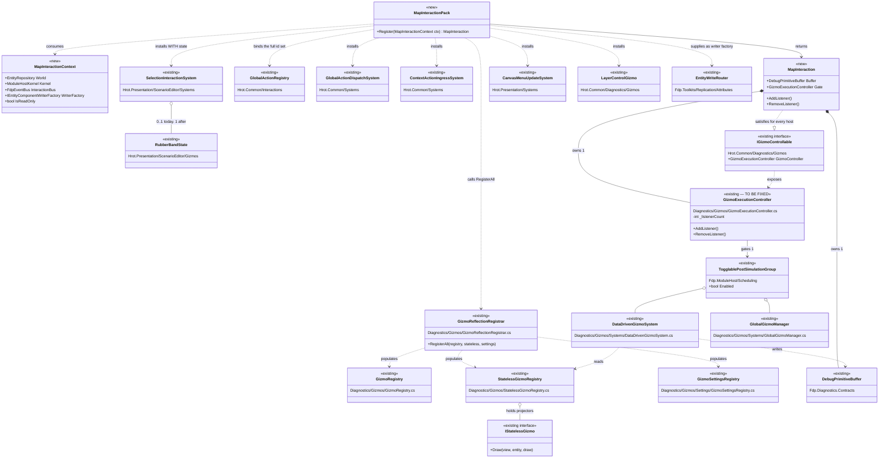
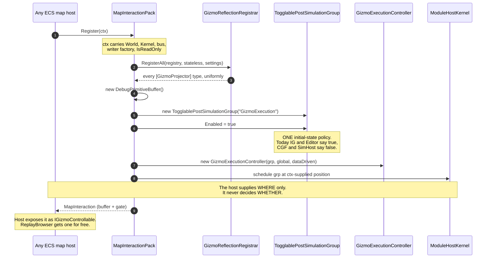
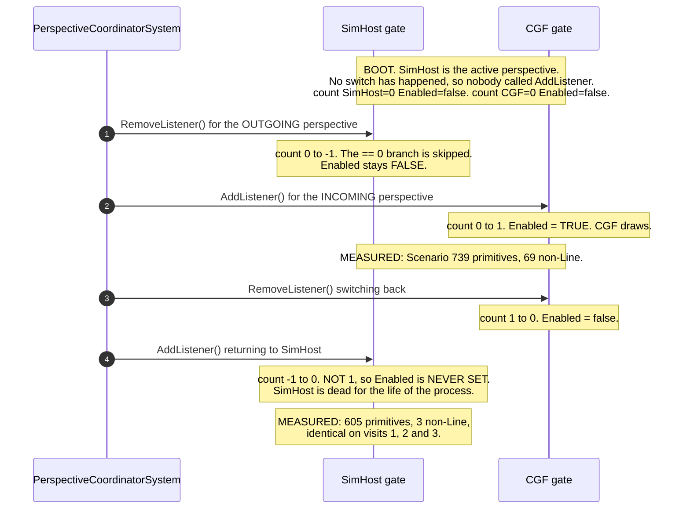

<!--STATUS
state: LIVE
build-state: DESIGN — UML AUTHORED 2026-08-28 (section 3.2b: one classDiagram + two
  sequenceDiagrams, all parsing). The owed verification is now CLOSED: StatelessGizmoSystem (the
  [GizmoProjector] runner) is INSIDE the gated group, the grid/menu/layer emitters are outside it, so a
  closed gate yields chrome-without-entities exactly as measured. It also OVERTURNED recommendation (1):
  GZH-003 shows the per-host initial Enabled state is DELIBERATE (interactive on, headless-first off), so
  "Enabled = true everywhere" is retracted and startEnabled becomes a host rule the context supplies.
  ONE blocker remains before READY-TO-BUILD: re-size. RW-M in PLAN_Interaction_UX_Backlog section 4 is
  LIGHT now the pack owns composition + execution rather than registration alone.
verified: 2026-08-28 (coordinator source scan)
current-answer: NOT-BUILT (design only) -- confirmed independently 2026-08-28: grep finds ZERO
  occurrences of MapInteractionPack/MapInteractionContext. No shared pack; IG fork
  (HandleContextMenuActionById) intact. READ SECTION 2b FIRST: section 2's per-host baseline has
  INVERTED -- CGF now emits the full entity gizmo set (CgfSubsystem.cs:928) and SIMHOST emits none,
  which is the host a user reported broken (CE-123). Section 3.3's work split is stale accordingly.
  Section 5 is CLOSED (the seven commanding ids deferred to UXI-32/Q29; Properties+Teleport unblocked).
-->
# Feature design — map-interaction parity

> **Design for [UXI-23](UX_Issues.md#uxi-23) · drafted 2026-08-12.** Absorbs
> [UXI-22](UX_Issues.md#uxi-22) and UXI-04 step 5. **Status: ❌ NOT-BUILT (design only) — no shared `MapInteractionPack`; IG's fork (`HandleContextMenuActionById`) intact; CGF registers no `GlobalActionRegistry` (CE-051/E3 shared only center/select across Editor+CGF).**
> Depends on [UXI-10](UX_Feature_Entity_Symbology.md) → [UXI-11](UX_Feature_Selection.md).

## 0. 🔴 The issue as filed is optimistic in one direction and pessimistic in another

> *"Mostly one missing registrar call per host."*

⚠ **Not one call** — and the deeper finding is that **there are two dispatch mechanisms**, not one
under-adopted mechanism.

| | Shared `GlobalActionRegistry` | IG's hand-written `switch` |
|---|---|---|
| Adopters | Editor **11** ids · SimHost **4** · ReplayBrowser **2** · **CGF 0** | **IG only**, 6 ids |
| Where | `EditorSubsystem.cs:1139-1258` etc. | `IgApplication.cs:2386-2400` → `ExecuteLocalContextAction` |

🔴 **IG — the richest map host — does not use the shared vocabulary at all.** Verified: zero occurrences
of `GlobalActionRegistry` in `IgApplication.cs`. It maps ids to local strings
(`CenterOnEntity → "IG_CenterOnEntity"`, `Delete → "IG_DeleteEntity"`, …) and forwards the rest to ExCon
as `ContextActionTriggered`.

⇒ ⭐ **Seam-law instance 15, and the sharpest yet**: the shared action registry is adopted by three hosts,
and the one host with the most map interactions runs a private fork.

## 1. The verified matrix

**21 ids defined** (`GlobalActionIds.cs:13-48`). Handlers registered in the shared registry:

| | Editor | SimHost | CGF | IG | ReplayBrowser |
|---|:--:|:--:|:--:|:--:|:--:|
| `CenterOnEntity` `Select` `Delete` | ✅✅✅ | — | — | ⚠ *fork* (Centre, Delete) | ✅ — — |
| `Rotate` | ✅ | ✅ | — | — | — |
| `Measure` `PlaceEntity` | ✅✅ | — | — | ⚠ *fork* (Measure) | — |
| `EditOverlay` `EditRoute` | ✅✅ | — | — | ⚠ *fork* (both) | — |
| `OpenLayerControl` | ✅ | ✅ | — | — | ✅ |
| `ToggleAiTrace` ×2 | ✅✅ | ✅✅ | — | — | — |
| **Total** | **11** | **4** | **0** | **0 shared / 6 forked** | **2** |

⚠ **[Correction 30](UX_Tasks_Detail.md#corrections):** [UX_Map_Parity_Baseline.md](UX_Map_Parity_Baseline.md)
states SimHost registers *"only `Rotate` and `OpenLayerControl`"* — it also registers **both AI-trace
toggles** (`SimHostApp.cs:384-389`, added a month before that inventory). SimHost has **4**, not 2.

### 🔴 Nine ids have **no handler anywhere in the repo**

`MoveHere · Engage · Stop · Properties · Teleport · Repair · Reinforce · Resupply · Transfer` — each has
only its definition plus a menu-item emission. They are emitted by `ContextMenuProjectorGizmo` and
`ExCon/Logic/ContextMenuLogic.cs` and handled **only by ExCon**.

⇒ **43% of the declared vocabulary is inert in every ECS host.** §5 is the decision.

### 🔴 And one item is already dead **on screen**

`CanvasMenuUpdateSystem` emits a hardcoded `[{"id":200,"label":"Measurement Tool"}]` and is registered by
**Editor, SimHost, CGF and IG** (`:1337`, `:457`, `:545`, `:872`) — but SimHost has **no `Measure`
handler** and CGF has **no dispatch pipeline at all**.

⇒ 🔴 **Right-clicking empty map in SimHost or CGF today offers "Measurement Tool", and clicking it does
nothing.** The register listed inert items as a *risk of activating menus early*; it is **already true**.

## 2. What each host is missing — measured

| | Registrar calls | `GlobalActionRegistry` | `SelectionInteractionSystem` | Drag | Rubber-band **visual** |
|---|:--:|:--:|:--:|:--:|:--:|
| **Editor** | 6 + 4 manual | ✅ 11 | ✅ | ✅ | ✅ |
| **ReplayBrowser** | 4 + 7 manual | ✅ 2 | ✅ | — | ✅ |
| **IG** | 6 | ⚠ fork | ✅ | ✅ | ❌ |
| **SimHost** | 2 + drag | ✅ 4 | ✅ | ✅ | ❌ |
| **CGF** | **2, nothing manual** | ❌ | ❌ | ❌ | ❌ |

⚠ **Rubber-band is subtler than "missing"**: `SelectionInteractionSystem` takes `RubberBandState?` as an
**optional** ctor arg. SimHost and IG pass `null`, so **box-select logic runs and nothing is drawn** —
a *blind* rubber band, not an absent one. Only Editor and ReplayBrowser draw it.

🔴 **CGF is missing `Hrot.Common.Diagnostics.Gizmos.GizmoRegistrar` entirely**, costing it the selection
ring, context-menu projector, health bars, layer control, rotation, LOS, vision cones, nav targets and
the spatial grid — in one absent call.

## 2b. ⚠⚠ MEASURED `2026-08-28` — **§2's PER-HOST BASELINE HAS INVERTED. CGF is fixed; SIMHOST is now the empty one.**

🔒 **User visual test on `--mode all`:** *"The entities were not shown in the SimHost perspective. in
Scenario perspective, map was showing them."* ⇒ 📐 **confirmed by `GET /panels/_gizmo?max=4000`** after a
live load of `hill-attack`:

| perspective | primitives | non-`Line` | verdict |
|---|---:|---:|---|
| **`Scenario`** *(CGF)* | 739 | **69** — `Box2D 8`, `Arrow 12`, `Text 8`, `SemanticShape 16`, `SpatialAnchor 16` | ✅ **the richest entity output of the three** |
| **`IG`** | 714 | **104** — `Box2D 24`, `SpatialAnchor 24`, `SemanticShape 24`, `EntityBadge 6` | ✅ |
| 🔴 **`SimHost`** | 605 | 🔴 **3** — `LayerControlMask`, `MainMenuBinding`, `ContextMenuBinding` + `Line 602` | 🔴 **grid and shell bindings only — ZERO per-entity primitives** |

⇒ ⛔⛔ **§2's table and §3.3's work split are STALE IN BOTH DIRECTIONS and must not be planned against
as-written:**

| §2/§3.3 says | 📐 measured now |
|---|---|
| *"CGF is missing `Hrot.Common.Diagnostics.Gizmos.GizmoRegistrar` entirely"* · *"CGF: the whole pack"* | ⚠ **CGF now calls `GizmoReflectionRegistrar.RegisterAll` at `CgfSubsystem.cs:928`** and emits the full entity set. ⭐ Fixed by the cgf==editor correctives *(`CE-016`, and the catalog-contributor round)* **after this design was written** |
| *"SimHost: the missing 7 ids + `Common.Diagnostics` registrar + rubber-band state"* — i.e. a **partial** host | 🔴 **SimHost emits NO entity primitives at all** — worse than the table implies, and it is the host a user actually reported as broken |

⭐⭐ **Why this strengthens the design rather than weakening it.** The two hosts swapped places **without
either behaviour being intended**, because each wires its own map independently — which is precisely
§3.2's argument for `MapInteractionPack`. ⇒ 🔒 **a per-host baseline table is a snapshot that rots; the
pack is what makes the question unaskable.** ⚠ **So do not re-derive the table before building — build the
pack and let `23.1`-`23.3`'s parameterised cases hold it.**

⚠ **The SimHost gap itself is NOT yet root-caused** — 📄 **`CE-123`** carries the elimination table
*(camera, missing projector class, un-called `RegisterAll`, two buffers, boot listener asymmetry, a missing
`gizmoByPerspective` entry and a null `GizmoController` are ALL disproved by measurement)*. ⭐ Open leads:
whether `_dataDrivenGizmoSystem` is **scheduled** on the cluster path, and the `LayerControlMask` primitive
as a possible emit-time filter.

⭐ **One prerequisite is better than §7 claims.** §7 orders `UXI-10 → UXI-11 → UXI-29 → this` and warns that
binding `Rotate` in CGF before `UXI-29` hands it an action writing a component it does not own.
📐 **Measured: `UXI-29`'s mechanism IS BUILT** — `IEntityComponentWriter`
*(`FDP/Toolkits/Fdp.Toolkits/Replication/Patching/IEntityComponentWriter.cs:40`)* and `EntityWriteRouter`
*(`.../Replication/Attributes/EntityWriteRouter.cs:29`)*, adopted by **IG** *(`IgApplication.cs:755,760`)*,
**SimHost** *(`SimHostApp.cs:362,397`)* and **Editor** *(`EditorSubsystem.cs:1621,1651`)*.
⇒ ⭐ **the risk narrows from "UXI-29 is unbuilt" to one concrete fact: `CGF` is NOT in the adopter list**, so
CGF must route its writes through `EntityWriteRouter` before it binds a write-action. ⚠ The `UXI-29` doc
header still reads *"designed"* — ⛔ **the code is ahead of it here.**

## 2c. 📐 REFRESHED INVENTORY `2026-08-28` — **the five-host wiring matrix, re-measured**

⭐ Replaces §2's table for planning purposes. `Y` = the symbol appears in that subsystem's non-test
production sources.

| host | `GizmoReflectionRegistrar` | `GlobalActionRegistry` | `SelectionInteractionSystem` | `RubberBandState` | `CanvasMenuUpdateSystem` | `DataDrivenGizmoSystem` | `GizmoExecutionController` |
|---|:--:|:--:|:--:|:--:|:--:|:--:|:--:|
| **Editor** | ✅ | ✅ | ✅ | ✅ | ✅ | ✅ | ✅ |
| **CGF** | ✅ | 🔴 | 🔴 | 🔴 | ✅ | ✅ | ✅ |
| **IG** | ✅ | 🔴 *(fork)* | ✅ | 🔴 | ✅ | ✅ | ✅ |
| **SimHost** | ✅ | ✅ | ✅ | 🔴 | ✅ | ✅ | ✅ |
| **ReplayBrowser** | ✅ | ✅ | ✅ | ✅ | 🔴 | ✅ | 🔴 |

⭐⭐ **What this CHANGES in the design:**

| | |
|---|---|
| ✅ **§2's headline finding is RETIRED** | *"CGF is missing `Hrot.Common.Diagnostics.Gizmos.GizmoRegistrar` entirely"* — **all five hosts now register the gizmo projectors.** ⇒ §3.3's *"CGF: the whole pack"* is wrong; CGF's remaining gap is the **action/selection half**, not the gizmo half |
| ⭐ **the blind rubber band is WIDER than recorded** | §2 named SimHost and IG; measured, **CGF too** — only Editor and ReplayBrowser carry a `RubberBandState`. ⇒ acceptance `23.7` covers three hosts, not two |
| 🔴 **NEW — `ReplayBrowser` has NO `GizmoExecutionController`** | ⇒ `PerspectiveCoordinatorSystem:76-78`'s `incoming.GizmoController?.AddListener()` **silently no-ops** for it *(the `?.` swallows it)*. ⚠ Not in the design; it means the perspective-switch gizmo handover cannot apply to that host at all |
| ⛔⛔ **AND THE ONE THAT MATTERS MOST: `SimHost` HAS EVERY SYMBOL EDITOR HAS except `RubberBandState`, AND STILL EMITS NO ENTITY GIZMOS** *(§2b)* | ⇒ 🔒 **the SimHost gap is NOT a missing registration** — which is consistent with all seven hypotheses eliminated in `CE-123`. It is something about **execution/scheduling in the cluster composition**, and ⭐⭐ **that is exactly the class of fault a per-host wiring matrix CANNOT see** — five hosts each wire this privately, so "does it actually run?" is not answerable by inspection. 📌 **The strongest argument in this document for the pack, and it was found by a user's eyes, not by any table.** |

## 3. The design

### 3.1 🔒 One dispatch mechanism

Retire IG's `switch` into the shared `GlobalActionRegistry`. IG's six local behaviours become six
registered handlers; `HandleContextMenuActionById`/`ExecuteLocalContextAction` go away.

⚠ **IG keeps its ExCon forwarding** — that is a *fallback for unhandled ids*, not a dispatch mechanism,
and it stays as the registry's miss path.

### 3.0 🔴🔴🔴 THE PACK MUST OWN GIZMO **EXECUTION**, NOT ONLY REGISTRATION — *root-caused `2026-08-28`*

> ⭐⭐⭐ **User:** *"we are unifying the map rendering across hosts, so whatever it takes; and rendering =
> gizmos so how can we NOT unify gizmo execution?"*

🔒 **Answer: we cannot — and the SimHost map failure is the proof, because the fault is ENTIRELY on the
execution side.** ⛔ §3.2's pack as drafted is a **registration** entry point *(registrars, the action
registry, `SelectionInteractionSystem`, `CanvasMenuUpdateSystem`, the layer control)*. It names none of the
machinery below, and **that is exactly where the bug lives.**

#### The two halves, concretely

| | what it is | shared today? |
|---|---|---|
| **REGISTRATION** | *which* projectors exist — `GizmoReflectionRegistrar.RegisterAll` populating `GizmoRegistry`/`StatelessGizmoRegistry` | ✅ **yes, all five hosts** *(§2c)* |
| 🔴 **EXECUTION** | *whether they run this frame* — the `DebugPrimitiveBuffer`, `DataDrivenGizmoSystem`, `GlobalGizmoManager`, the **`TogglablePostSimulationGroup`** that wraps them, the **`GizmoExecutionController`** gate over it, its placement in the host's schedule, and `buffer.EndFrame(dt)` | ⛔ **no — hand-wired per host, five different ways** |

#### 📐 THE ROOT CAUSE — a two-part interaction, neither part visible from one host

**Part 1 — the gate's counter is not clamped at zero** *(`FDP/Toolkits/Fdp.Toolkits/Diagnostics/Gizmos/GizmoExecutionController.cs`)*:

```csharp
public void AddListener()    { if (Interlocked.Increment(ref _listenerCount) == 1) _group.Enabled = true; }
public void RemoveListener() { if (Interlocked.Decrement(ref _listenerCount) == 0) { …; _group.Enabled = false; } }
```

⇒ ⛔ **`Enabled = true` fires ONLY on the exact 0→1 transition.** A `RemoveListener` before any
`AddListener` drives the count to **−1**, after which `AddListener` yields **0** — and the group is
**never enabled again for the life of the process.**

**Part 2 — the group's INITIAL state differs per host.** 📐 Measured:

| host | initial `gizmoGroup.Enabled` | boot perspective? | outcome |
|---|:--:|:--:|---|
| **IG** *(`IgApplication.cs:861`)* | ⭐ **`true`** | no | ✅ **immune** — already on, so the counter cannot matter |
| **Editor** | ⭐ **`true`** | n/a | ✅ immune |
| **CGF** *(`CgfSubsystem.cs:955`)* | ⚠ **`false`** | no | ✅ works — being *entered* first, its first event is `AddListener` **0→1** ⇒ enabled |
| 🔴 **SimHost** *(`SimHostApp.cs:444`)* | ⚠ **`false`** | 🔴 **YES** | 🔴 **DEAD** — as the boot perspective it is **LEFT before it is ever ENTERED**, so its first event is `RemoveListener` *(0→−1)*; every later `AddListener` yields 0 and never re-enables |
| **ReplayBrowser** | — *(no controller at all)* | no | ⛔ the gate cannot apply |

⭐⭐⭐ **THE POINT, and it is the whole argument for this design:** ⛔ **the defect is not
*"SimHost is misconfigured."*** It is that **one gate has three different initial states across five hosts
plus an unclamped counter that only misbehaves for whichever host happens to BOOT FIRST.**
🔒 **Change the default perspective from `SimHost` to `Scenario` and CGF would break instead** — same code,
different victim. ⇒ ⭐⭐ **no per-host inspection can find this**, which is why it survived a seven-hypothesis
elimination pass *(`CE-123`)* and was found only by a user looking at two screens.

📐 **Confirmed by prediction:** SimHost read **605 primitives / 3 non-`Line`** on visit 1, 2 **and** 3
across alternating switches, while `Scenario` read **739 / 69** on each of its visits — exactly what an
unclamped counter starting from a `RemoveListener` predicts.

⚠⚠ **NOT FULLY CLOSED — see §3.2b's closing subsection.** 📐 SimHost's frame still carries
`LayerControlMask`, `MainMenuBinding`, `ContextMenuBinding` and 602 grid `Line`s, so **some emission
survives there.** ⇒ the counter mechanism above is **measured and real**; whether it is the **whole**
explanation is **not** — one verification is owed before the fix in ①–③ can be called correct.

#### ⇒ What the pack must therefore own

| # | |
|---|---|
| **①** | ⭐⭐ **construct** the buffer, `DataDrivenGizmoSystem`, `GlobalGizmoManager`, the togglable group and the controller — **one code path, one initial state** |
| **②** | ⚠⚠ **SUPERSEDED — see §3.2b's closing subsection.** This originally recommended one policy, `Enabled = true` everywhere. ⛔ **RETRACTED:** `GZH-003` shows the split is deliberate *(interactive hosts on, headless-first hosts off)*. ⭐ **Corrected:** the pack owns the gate MECHANISM and takes **`startEnabled` as a host rule from the context** |
| **③** | 🔒 **clamp the counter** — `RemoveListener` below zero is a **bug to assert on**, not to absorb. ⚠ It is what made a host-ordering accident permanent |
| **④** | ⭐ **schedule it**, with the host supplying only *where* *(its group/kernel handle)* — ⛔ never *whether* |
| **⑤** | ⭐ **`ReplayBrowser` gets a controller too** — §3.1b makes it a member, so the gate must exist there |

⚠ **Scope honesty:** ① – ⑤ widen §3.2 from *registration* to *composition + execution*. ⭐ That is a bigger
pack than drafted and it is what the user's *"whatever it takes"* asks for — ⛔ but it also means the
`RW-M` estimate in `PLAN_Interaction_UX_Backlog` §4 is **light**; re-size when the UML is authored.

### 3.1b 🔒🔒🔒 MEMBERSHIP IS A RULE, NOT A HOST LIST — **every ECS-enabled host** *(user, `2026-08-28`)*

> ⭐⭐⭐ **User, verbatim:** *"both cgf, ig and simhost should show the map (and replaybrowser as well). And
> all the same way, using same gizmos etc, diffing just in the components currently present on the entity,
> no differences, as written in the docs/UX documents. Map needs to be unified, same like many other UI
> componenst we already unified."*
> ⭐⭐ **And, on being offered a SimHost-only fix:** *"chasing SimHost gap means deepening the separation of
> hosts, doesn't it? I can live with SimHost having no map if i knew we would work on unification that
> brings same map capability to all ECS-enabled hosts."*

⛔⛔ **THE SIMHOST-ONLY FIX IS REJECTED, and the reasoning is the user's:** patching SimHost's private map
wiring **adds a line to the very code this pack deletes**. ⇒ 🔒 **a per-host repair is not a step toward
unification, it is a step away from it** — and a mapless SimHost is the *acceptable* cost of not deepening
the divergence. ⚠ **Investigating the SimHost gap is still valuable** — but as **inventory input to this
design** *(what must the pack own so "does it actually run?" stops being per-host?)*, ⛔ **never as a patch.**

⭐⭐⭐ **The sharpening this adds to §3.2.** §3.2 says *"all hosts share the FULL set"* and §2/§3.3 then
enumerate **five named hosts** — ⛔ a list, which is what let the baseline rot and both hosts swap places
unnoticed *(§2b)*. 🔒 **Restate it as a RULE:**

> ⭐ **Every ECS-enabled host that presents a map calls `MapInteractionPack.Register` — membership is
> derived from "has an ECS world + presents a map", never from a maintained host list.**

| ⭐ why the rule beats the list | |
|---|---|
| ⭐⭐ **a new host cannot be forgotten** | there is no table to update, so there is no table to forget |
| ⭐ **`ReplayBrowser` stops being a special case** | it is ECS-enabled and presents a map ⇒ it is a member; its read-only-ness is a **predicate outcome** *(§3.2's applicability)*, not an exclusion |
| ⛔ **and it makes §2/§2c snapshots, not specifications** | ⚠ they document today's drift; **the rule is the contract** |

⚠ **What it does NOT license:** ⛔ it is not *"every host gets every behaviour"*. Per §3.2 + ruling 49,
**membership is uniform and visibility is earned** — an action a host structurally cannot service is not
shown. ⭐ The user's own words already say this: *"diffing just in the components currently present on the
entity"* ⇒ **the entity's components decide what draws, not the host's identity.**

### 3.2 🔒 One registration entry point — `MapInteractionPack`

```csharp
public static class MapInteractionPack
{
    public static void Register(MapInteractionContext ctx);   // every map subsystem calls exactly this
}
```

It performs, in one place, what five hosts do differently today: the four gizmo registrars, the action
registry + dispatch + `ContextActionIngressSystem`, `SelectionInteractionSystem` **with** a
`RubberBandState`, the rubber-band gizmo, the drag gizmo ([ruling 36](UX_RESUME_INTERACTION.md)),
`CanvasMenuUpdateSystem`, and the layer control.

🔒 **Per [the 2026-08-10 ruling](UX_Issues.md#uxi-23), all hosts share the FULL set** — differences are
data availability or host rules, never set membership. ⇒ a host that cannot service an action **binds it
and reports why**, rather than omitting it:

| | |
|---|---|
| ✅ **Membership is uniform** | the pack decides; the host does not curate |
| ✅ **Absence becomes impossible** | there is no "forgot to call registrar #3" |
| ⭐ **Applicability stays per-host** | via [UXI-03](UX_Feature_Entity_Action_Vocabulary.md)'s descriptor predicates |

> 🔒 **RULED 2026-08-13 ([ruling 49](UX_RESUME_INTERACTION.md)):** *"permanently grayed item is useless."*
> ⇒ an action this host **structurally cannot service is not shown at all**. This design originally said
> *disabled with a reason, never silently missing* — **inverted**
> ([Correction 39](UX_Tasks_Detail.md#corrections)).
>
> ⭐ **The distinction that survives, and it is a good one:** grey means *"not now, try later"*. That is
> honest only for a **transient** blocker — the [API §5](UX_Interaction_API.md) exclusivity gate, or
> [UXI-08](UX_Feature_Layout_Defaults.md) case 5's *running outside the repo*. A blocker that can never
> clear in this host is **not a state, it is a fact about the host**, so the item does not belong in its
> menu at all.
>
> ⚠ **§3.2's uniform-membership rule still holds** — the **pack** registers the full set; the *menu* then
> shows what this host can actually do. Membership is uniform, **visibility is earned**. That keeps the
> "forgot to call registrar #3" failure impossible without producing dead rows.

### 3.2b ⭐⭐⭐ THE UML — **authored `2026-08-28`, AFTER the §2c enumeration** *(obligation ②)*

> 🔒 **Reading rule:** every box marked **`«existing»`** is real code with its file named. ⛔ Only
> `MapInteractionPack` and `MapInteractionContext` are new. ⭐ **That is the point of drawing it** — the
> shared machinery already exists in `Fdp.Toolkits`/`Hrot.Common`; what does not exist is **one place that
> composes it**, which is why five hosts each grew their own.

#### Class diagram — **the pack owns COMPOSITION, and the parts are already shared**



⭐⭐ **What the diagram makes obvious, and prose did not:** ⛔ **`MapInteraction` is the box that does not
exist today.** Each host builds `DebugPrimitiveBuffer` + `TogglablePostSimulationGroup` +
`GizmoExecutionController` **inline in its own `Initialize`** — so the *"owns 1"* relations are drawn once
here and implemented five times in the repo. ⇒ 🔒 **`IGizmoControllable` becomes satisfied BY THE PACK**,
which is what gives `ReplayBrowser` a controller *(§2c: it has none)* without anyone remembering to add one.

#### Sequence 1 — **composition at host init** *(what replaces five hand-wirings)*



#### Sequence 2 — 🔴 **the perspective switch, and the bug this design exists to kill**



🔒 **The fix the pack carries, drawn as behaviour rather than prose:**

| # | change | why the diagram forced it |
|---|---|---|
| **①** | **`Enabled = true` at construction, for every host** | sequence 1 step 6 — a single arrow where five hosts each had their own literal |
| **②** | **clamp the counter; `RemoveListener` below zero is an assert** | sequence 2 step 2 is the whole defect, and it is invisible unless the boot case is drawn |
| **③** | **the boot perspective gets an `AddListener` on activation** | ⇒ *"left before it is entered"* stops being expressible |
| **④** | **`IGizmoControllable` satisfied by the pack** | class diagram: `ReplayBrowser` cannot have a null gate any more |

#### ✅ THE VERIFICATION IS CLOSED — **and it OVERTURNED recommendation ①** *(`2026-08-28`)*

📐 **Read what is actually INSIDE the gate** *(`SimHostApp.cs:434-443`)*:

```csharp
var gizmoGroup = new TogglablePostSimulationGroup("GizmoExecution",
    _globalGizmoManager,
    _dataDrivenGizmoSystem,
    new StatelessGizmoSystem(_statelessGizmoRegistry, _gizmoBuffer, isSelectedPredicate: …));
// GZH-003: headless-first; enable only when a terminal connects.
gizmoGroup.Enabled = false;
```

⇒ ⭐⭐ **`StatelessGizmoSystem` — the runner for every `[GizmoProjector]`, i.e. for
`SimHostEntityPresentationGizmo` — is INSIDE the gate.** The grid, `LayerControlMask` and the two menu
bindings are emitted by systems **outside** it *(host chrome, always drawn)*. ⇒ 🔒 **a closed gate yields
exactly what was measured: chrome, and no entities.** ✅ **Hypothesis (i) confirmed; (ii) — a second
suppressing filter — is eliminated. §3.0's mechanism stands.**

⛔⛔ **BUT recommendation ① WAS WRONG, and this is the correction.** 📄 **`.dev/_DONE/gizmos-2-headless/TASK-DETAILS.md`
§`GZH-003`, verbatim:**

> *"For each subsystem that runs in interactive mode by default (IG, Editor), keep `Enabled = true` at
> startup — they already open a window. For headless-first subsystems (SimHost, CGF), start
> `Enabled = false`."*

⇒ ⭐⭐⭐ **The three initial states are DELIBERATE, DESIGNED, and load-bearing** — a headless SimHost must not
pay for gizmo execution with nobody watching. ⛔ **So "make every host start `true`" would DISCARD a real
optimisation** *(and its two `GZH-003` integration tests: *"start SimHost headless, confirm
`DataDrivenGizmoSystem.Execute` is never called"*)*. 🔒 **Recommendation ① is RETRACTED.**

⭐⭐ **The defect is therefore NARROWER and cleaner than §3.0 first framed it.** `GZH-003`'s design assumes
`AddListener()` reliably makes the 0→1 transition when a viewer attaches. **It does — unless a
`RemoveListener()` arrives first**, which happens *only* because the boot perspective is **left before it is
ever entered**. ⇒ 🔒 **the fault is the unclamped counter plus `PerspectiveCoordinatorSystem`'s asymmetric
lifecycle — NOT the per-host initial state.**

| ⭐ the corrected fix set | |
|---|---|
| ⛔ ~~① `Enabled = true` everywhere~~ | **RETRACTED** — contradicts `GZH-003`'s headless-first intent |
| ⭐⭐⭐ **② clamp the counter** *(`RemoveListener` below zero is a bug to assert on, never to absorb)* | **this alone fixes the reported symptom** |
| ⭐⭐ **③ the active-at-boot perspective gets an `AddListener` on activation** | makes *"left before it is entered"* inexpressible — the structural half |
| ⭐ **④ `IGizmoControllable` satisfied by the pack** | `ReplayBrowser` cannot hold a null gate *(§2c)* |
| ⭐ **⑤ the pack owns the gate BOUNDARY explicitly** | ⭐ i.e. *which* emitters are perspective-gated and which are always-on chrome — measured above, and today implicit in five separate composition roots |

⭐⭐⭐ **AND THIS SHARPENS WHAT "UNIFIED" MEANS HERE — it is §3.2's own rule, applied to execution:**
🔒 **share the MECHANISM; let the RULE vary through a parameter.** ⇒ the gate, the counter, the group
membership and the boundary are **the pack's** *(identical everywhere)*; **`startEnabled`** is a
**host rule** the context supplies *(interactive ⇒ `true`, headless-first ⇒ `false`)*.
⛔ **"Unified" was never "make every host identical"** — 📌 that reading is what nearly cost a designed
optimisation, and §3.2 already said so: *"differences are data availability or host rules, never set
membership."*
