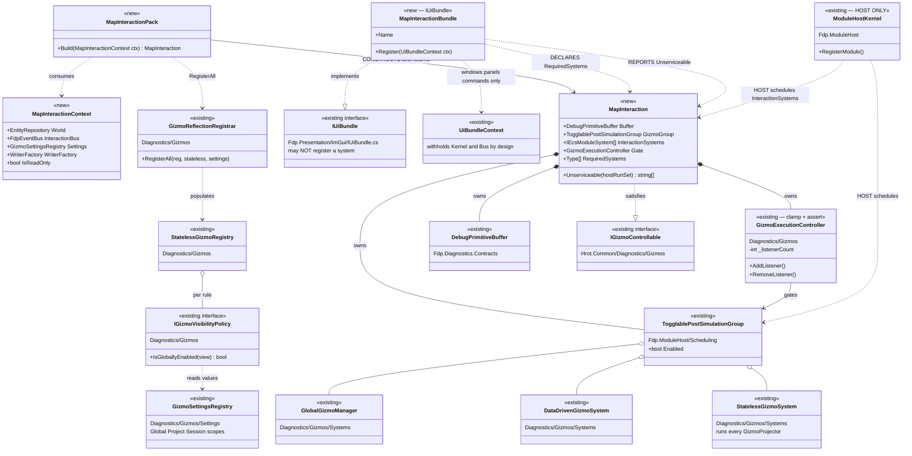
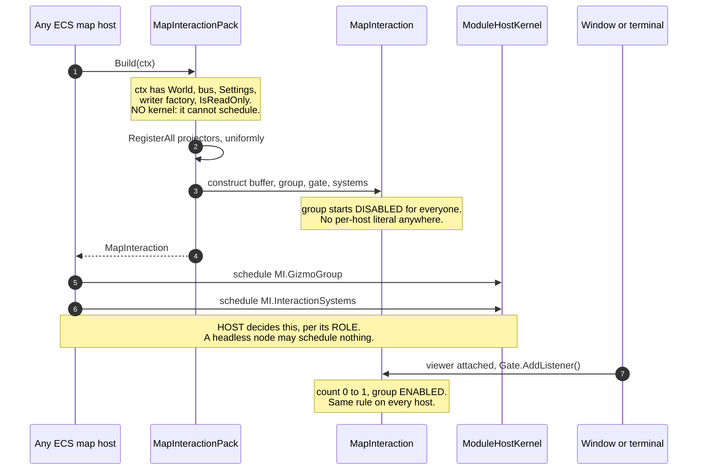
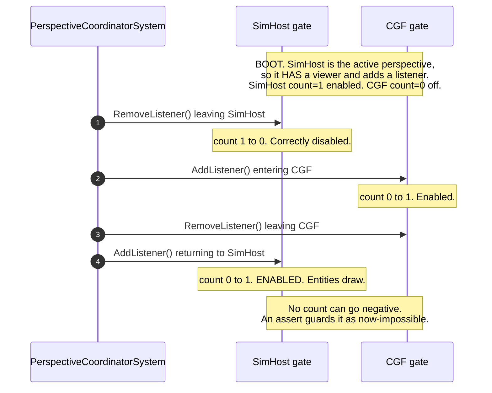

<!--STATUS
state: LIVE
build-state: DESIGN — UML AUTHORED 2026-08-28 (section 3.2b: one classDiagram + two
  sequenceDiagrams, all parsing). The owed verification is now CLOSED: StatelessGizmoSystem (the
  [GizmoProjector] runner) is INSIDE the gated group, the grid/menu/layer emitters are outside it, so a
  closed gate yields chrome-without-entities exactly as measured. It also OVERTURNED recommendation (1):
  GZH-003 shows the per-host initial Enabled state is DELIBERATE (interactive on, headless-first off), so
  "Enabled = true everywhere" is retracted and startEnabled becomes a host rule the context supplies.
  UML REDRAWN 2026-08-28 to the construct-vs-schedule split, after the user ruled "pack owns
  construction, host decides scheduling" (section 3.2a's architect call is CLOSED). MapInteractionContext
  deliberately carries no ModuleHostKernel, so the section 3.2 violation is unreachable rather than merely
  forbidden. ONE blocker remains before READY-TO-BUILD: re-size -- RW-M in PLAN_Interaction_UX_Backlog
  section 4 is light now the pack owns construction + execution and must also adopt IGizmoVisibilityPolicy. RW-M in PLAN_Interaction_UX_Backlog section 4 is
  LIGHT now the pack owns composition + execution rather than registration alone.
verified: 2026-08-28 (coordinator source scan)
current-answer: NOT-BUILT (design only) -- confirmed independently 2026-08-28: grep finds ZERO
  occurrences of MapInteractionPack/MapInteractionContext. No shared pack; IG fork
  (HandleContextMenuActionById) intact. READ SECTION 2b FIRST: section 2's per-host baseline has
  INVERTED -- CGF now emits the full entity gizmo set (CgfSubsystem.cs:928) and SIMHOST emits none,
  which is the host a user reported broken (CE-123). Section 3.3's work split is stale accordingly.
  Section 5 is CLOSED (the seven commanding ids deferred to UXI-32/Q29; Properties+Teleport unblocked).
-->
# Feature design — map-interaction parity

> **Design for [UXI-23](UX_Issues.md#uxi-23) · drafted 2026-08-12.** Absorbs
> [UXI-22](UX_Issues.md#uxi-22) and UXI-04 step 5. **Status: ❌ NOT-BUILT (design only) — no shared `MapInteractionPack`; IG's fork (`HandleContextMenuActionById`) intact; CGF registers no `GlobalActionRegistry` (CE-051/E3 shared only center/select across Editor+CGF).**
> Depends on [UXI-10](UX_Feature_Entity_Symbology.md) → [UXI-11](UX_Feature_Selection.md).

## 0. 🔴 The issue as filed is optimistic in one direction and pessimistic in another

> *"Mostly one missing registrar call per host."*

⚠ **Not one call** — and the deeper finding is that **there are two dispatch mechanisms**, not one
under-adopted mechanism.

| | Shared `GlobalActionRegistry` | IG's hand-written `switch` |
|---|---|---|
| Adopters | Editor **11** ids · SimHost **4** · ReplayBrowser **2** · **CGF 0** | **IG only**, 6 ids |
| Where | `EditorSubsystem.cs:1139-1258` etc. | `IgApplication.cs:2386-2400` → `ExecuteLocalContextAction` |

🔴 **IG — the richest map host — does not use the shared vocabulary at all.** Verified: zero occurrences
of `GlobalActionRegistry` in `IgApplication.cs`. It maps ids to local strings
(`CenterOnEntity → "IG_CenterOnEntity"`, `Delete → "IG_DeleteEntity"`, …) and forwards the rest to ExCon
as `ContextActionTriggered`.

⇒ ⭐ **Seam-law instance 15, and the sharpest yet**: the shared action registry is adopted by three hosts,
and the one host with the most map interactions runs a private fork.

## 1. The verified matrix

**21 ids defined** (`GlobalActionIds.cs:13-48`). Handlers registered in the shared registry:

| | Editor | SimHost | CGF | IG | ReplayBrowser |
|---|:--:|:--:|:--:|:--:|:--:|
| `CenterOnEntity` `Select` `Delete` | ✅✅✅ | — | — | ⚠ *fork* (Centre, Delete) | ✅ — — |
| `Rotate` | ✅ | ✅ | — | — | — |
| `Measure` `PlaceEntity` | ✅✅ | — | — | ⚠ *fork* (Measure) | — |
| `EditOverlay` `EditRoute` | ✅✅ | — | — | ⚠ *fork* (both) | — |
| `OpenLayerControl` | ✅ | ✅ | — | — | ✅ |
| `ToggleAiTrace` ×2 | ✅✅ | ✅✅ | — | — | — |
| **Total** | **11** | **4** | **0** | **0 shared / 6 forked** | **2** |

⚠ **[Correction 30](UX_Tasks_Detail.md#corrections):** [UX_Map_Parity_Baseline.md](UX_Map_Parity_Baseline.md)
states SimHost registers *"only `Rotate` and `OpenLayerControl`"* — it also registers **both AI-trace
toggles** (`SimHostApp.cs:384-389`, added a month before that inventory). SimHost has **4**, not 2.

### 🔴 Nine ids have **no handler anywhere in the repo**

`MoveHere · Engage · Stop · Properties · Teleport · Repair · Reinforce · Resupply · Transfer` — each has
only its definition plus a menu-item emission. They are emitted by `ContextMenuProjectorGizmo` and
`ExCon/Logic/ContextMenuLogic.cs` and handled **only by ExCon**.

⇒ **43% of the declared vocabulary is inert in every ECS host.** §5 is the decision.

### 🔴 And one item is already dead **on screen**

`CanvasMenuUpdateSystem` emits a hardcoded `[{"id":200,"label":"Measurement Tool"}]` and is registered by
**Editor, SimHost, CGF and IG** (`:1337`, `:457`, `:545`, `:872`) — but SimHost has **no `Measure`
handler** and CGF has **no dispatch pipeline at all**.

⇒ 🔴 **Right-clicking empty map in SimHost or CGF today offers "Measurement Tool", and clicking it does
nothing.** The register listed inert items as a *risk of activating menus early*; it is **already true**.

## 2. What each host is missing — measured

| | Registrar calls | `GlobalActionRegistry` | `SelectionInteractionSystem` | Drag | Rubber-band **visual** |
|---|:--:|:--:|:--:|:--:|:--:|
| **Editor** | 6 + 4 manual | ✅ 11 | ✅ | ✅ | ✅ |
| **ReplayBrowser** | 4 + 7 manual | ✅ 2 | ✅ | — | ✅ |
| **IG** | 6 | ⚠ fork | ✅ | ✅ | ❌ |
| **SimHost** | 2 + drag | ✅ 4 | ✅ | ✅ | ❌ |
| **CGF** | **2, nothing manual** | ❌ | ❌ | ❌ | ❌ |

⚠ **Rubber-band is subtler than "missing"**: `SelectionInteractionSystem` takes `RubberBandState?` as an
**optional** ctor arg. SimHost and IG pass `null`, so **box-select logic runs and nothing is drawn** —
a *blind* rubber band, not an absent one. Only Editor and ReplayBrowser draw it.

🔴 **CGF is missing `Hrot.Common.Diagnostics.Gizmos.GizmoRegistrar` entirely**, costing it the selection
ring, context-menu projector, health bars, layer control, rotation, LOS, vision cones, nav targets and
the spatial grid — in one absent call.

## 2b. ⚠⚠ MEASURED `2026-08-28` — **§2's PER-HOST BASELINE HAS INVERTED. CGF is fixed; SIMHOST is now the empty one.**

🔒 **User visual test on `--mode all`:** *"The entities were not shown in the SimHost perspective. in
Scenario perspective, map was showing them."* ⇒ 📐 **confirmed by `GET /panels/_gizmo?max=4000`** after a
live load of `hill-attack`:

| perspective | primitives | non-`Line` | verdict |
|---|---:|---:|---|
| **`Scenario`** *(CGF)* | 739 | **69** — `Box2D 8`, `Arrow 12`, `Text 8`, `SemanticShape 16`, `SpatialAnchor 16` | ✅ **the richest entity output of the three** |
| **`IG`** | 714 | **104** — `Box2D 24`, `SpatialAnchor 24`, `SemanticShape 24`, `EntityBadge 6` | ✅ |
| 🔴 **`SimHost`** | 605 | 🔴 **3** — `LayerControlMask`, `MainMenuBinding`, `ContextMenuBinding` + `Line 602` | 🔴 **grid and shell bindings only — ZERO per-entity primitives** |

⇒ ⛔⛔ **§2's table and §3.3's work split are STALE IN BOTH DIRECTIONS and must not be planned against
as-written:**

| §2/§3.3 says | 📐 measured now |
|---|---|
| *"CGF is missing `Hrot.Common.Diagnostics.Gizmos.GizmoRegistrar` entirely"* · *"CGF: the whole pack"* | ⚠ **CGF now calls `GizmoReflectionRegistrar.RegisterAll` at `CgfSubsystem.cs:928`** and emits the full entity set. ⭐ Fixed by the cgf==editor correctives *(`CE-016`, and the catalog-contributor round)* **after this design was written** |
| *"SimHost: the missing 7 ids + `Common.Diagnostics` registrar + rubber-band state"* — i.e. a **partial** host | 🔴 **SimHost emits NO entity primitives at all** — worse than the table implies, and it is the host a user actually reported as broken |

⭐⭐ **Why this strengthens the design rather than weakening it.** The two hosts swapped places **without
either behaviour being intended**, because each wires its own map independently — which is precisely
§3.2's argument for `MapInteractionPack`. ⇒ 🔒 **a per-host baseline table is a snapshot that rots; the
pack is what makes the question unaskable.** ⚠ **So do not re-derive the table before building — build the
pack and let `23.1`-`23.3`'s parameterised cases hold it.**

⚠ **The SimHost gap itself is NOT yet root-caused** — 📄 **`CE-123`** carries the elimination table
*(camera, missing projector class, un-called `RegisterAll`, two buffers, boot listener asymmetry, a missing
`gizmoByPerspective` entry and a null `GizmoController` are ALL disproved by measurement)*. ⭐ Open leads:
whether `_dataDrivenGizmoSystem` is **scheduled** on the cluster path, and the `LayerControlMask` primitive
as a possible emit-time filter.

⭐ **One prerequisite is better than §7 claims.** §7 orders `UXI-10 → UXI-11 → UXI-29 → this` and warns that
binding `Rotate` in CGF before `UXI-29` hands it an action writing a component it does not own.
📐 **Measured: `UXI-29`'s mechanism IS BUILT** — `IEntityComponentWriter`
*(`FDP/Toolkits/Fdp.Toolkits/Replication/Patching/IEntityComponentWriter.cs:40`)* and `EntityWriteRouter`
*(`.../Replication/Attributes/EntityWriteRouter.cs:29`)*, adopted by **IG** *(`IgApplication.cs:755,760`)*,
**SimHost** *(`SimHostApp.cs:362,397`)* and **Editor** *(`EditorSubsystem.cs:1621,1651`)*.
⇒ ⭐ **the risk narrows from "UXI-29 is unbuilt" to one concrete fact: `CGF` is NOT in the adopter list**, so
CGF must route its writes through `EntityWriteRouter` before it binds a write-action. ⚠ The `UXI-29` doc
header still reads *"designed"* — ⛔ **the code is ahead of it here.**

## 2c. 📐 REFRESHED INVENTORY `2026-08-28` — **the five-host wiring matrix, re-measured**

⭐ Replaces §2's table for planning purposes. `Y` = the symbol appears in that subsystem's non-test
production sources.

| host | `GizmoReflectionRegistrar` | `GlobalActionRegistry` | `SelectionInteractionSystem` | `RubberBandState` | `CanvasMenuUpdateSystem` | `DataDrivenGizmoSystem` | `GizmoExecutionController` |
|---|:--:|:--:|:--:|:--:|:--:|:--:|:--:|
| **Editor** | ✅ | ✅ | ✅ | ✅ | ✅ | ✅ | ✅ |
| **CGF** | ✅ | 🔴 | 🔴 | 🔴 | ✅ | ✅ | ✅ |
| **IG** | ✅ | 🔴 *(fork)* | ✅ | 🔴 | ✅ | ✅ | ✅ |
| **SimHost** | ✅ | ✅ | ✅ | 🔴 | ✅ | ✅ | ✅ |
| **ReplayBrowser** | ✅ | ✅ | ✅ | ✅ | 🔴 | ✅ | 🔴 |

⭐⭐ **What this CHANGES in the design:**

| | |
|---|---|
| ✅ **§2's headline finding is RETIRED** | *"CGF is missing `Hrot.Common.Diagnostics.Gizmos.GizmoRegistrar` entirely"* — **all five hosts now register the gizmo projectors.** ⇒ §3.3's *"CGF: the whole pack"* is wrong; CGF's remaining gap is the **action/selection half**, not the gizmo half |
| ⭐ **the blind rubber band is WIDER than recorded** | §2 named SimHost and IG; measured, **CGF too** — only Editor and ReplayBrowser carry a `RubberBandState`. ⇒ acceptance `23.7` covers three hosts, not two |
| 🔴 **NEW — `ReplayBrowser` has NO `GizmoExecutionController`** | ⇒ `PerspectiveCoordinatorSystem:76-78`'s `incoming.GizmoController?.AddListener()` **silently no-ops** for it *(the `?.` swallows it)*. ⚠ Not in the design; it means the perspective-switch gizmo handover cannot apply to that host at all |
| ⛔⛔ **AND THE ONE THAT MATTERS MOST: `SimHost` HAS EVERY SYMBOL EDITOR HAS except `RubberBandState`, AND STILL EMITS NO ENTITY GIZMOS** *(§2b)* | ⇒ 🔒 **the SimHost gap is NOT a missing registration** — which is consistent with all seven hypotheses eliminated in `CE-123`. It is something about **execution/scheduling in the cluster composition**, and ⭐⭐ **that is exactly the class of fault a per-host wiring matrix CANNOT see** — five hosts each wire this privately, so "does it actually run?" is not answerable by inspection. 📌 **The strongest argument in this document for the pack, and it was found by a user's eyes, not by any table.** |

## 3. The design

### 3.1 🔒 One dispatch mechanism

Retire IG's `switch` into the shared `GlobalActionRegistry`. IG's six local behaviours become six
registered handlers; `HandleContextMenuActionById`/`ExecuteLocalContextAction` go away.

⚠ **IG keeps its ExCon forwarding** — that is a *fallback for unhandled ids*, not a dispatch mechanism,
and it stays as the registry's miss path.

### 3.0 🔴🔴🔴 THE PACK MUST OWN GIZMO **EXECUTION**, NOT ONLY REGISTRATION — *root-caused `2026-08-28`*

> ⭐⭐⭐ **User:** *"we are unifying the map rendering across hosts, so whatever it takes; and rendering =
> gizmos so how can we NOT unify gizmo execution?"*

🔒 **Answer: we cannot — and the SimHost map failure is the proof, because the fault is ENTIRELY on the
execution side.** ⛔ §3.2's pack as drafted is a **registration** entry point *(registrars, the action
registry, `SelectionInteractionSystem`, `CanvasMenuUpdateSystem`, the layer control)*. It names none of the
machinery below, and **that is exactly where the bug lives.**

#### The two halves, concretely

| | what it is | shared today? |
|---|---|---|
| **REGISTRATION** | *which* projectors exist — `GizmoReflectionRegistrar.RegisterAll` populating `GizmoRegistry`/`StatelessGizmoRegistry` | ✅ **yes, all five hosts** *(§2c)* |
| 🔴 **EXECUTION** | *whether they run this frame* — the `DebugPrimitiveBuffer`, `DataDrivenGizmoSystem`, `GlobalGizmoManager`, the **`TogglablePostSimulationGroup`** that wraps them, the **`GizmoExecutionController`** gate over it, its placement in the host's schedule, and `buffer.EndFrame(dt)` | ⛔ **no — hand-wired per host, five different ways** |

#### 📐 THE ROOT CAUSE — a two-part interaction, neither part visible from one host

**Part 1 — the gate's counter is not clamped at zero** *(`FDP/Toolkits/Fdp.Toolkits/Diagnostics/Gizmos/GizmoExecutionController.cs`)*:

```csharp
public void AddListener()    { if (Interlocked.Increment(ref _listenerCount) == 1) _group.Enabled = true; }
public void RemoveListener() { if (Interlocked.Decrement(ref _listenerCount) == 0) { …; _group.Enabled = false; } }
```

⇒ ⛔ **`Enabled = true` fires ONLY on the exact 0→1 transition.** A `RemoveListener` before any
`AddListener` drives the count to **−1**, after which `AddListener` yields **0** — and the group is
**never enabled again for the life of the process.**

**Part 2 — the group's INITIAL state differs per host.** 📐 Measured:

| host | initial `gizmoGroup.Enabled` | boot perspective? | outcome |
|---|:--:|:--:|---|
| **IG** *(`IgApplication.cs:861`)* | ⭐ **`true`** | no | ✅ **immune** — already on, so the counter cannot matter |
| **Editor** | ⭐ **`true`** | n/a | ✅ immune |
| **CGF** *(`CgfSubsystem.cs:955`)* | ⚠ **`false`** | no | ✅ works — being *entered* first, its first event is `AddListener` **0→1** ⇒ enabled |
| 🔴 **SimHost** *(`SimHostApp.cs:444`)* | ⚠ **`false`** | 🔴 **YES** | 🔴 **DEAD** — as the boot perspective it is **LEFT before it is ever ENTERED**, so its first event is `RemoveListener` *(0→−1)*; every later `AddListener` yields 0 and never re-enables |
| **ReplayBrowser** | — *(no controller at all)* | no | ⛔ the gate cannot apply |

⭐⭐⭐ **THE POINT, and it is the whole argument for this design:** ⛔ **the defect is not
*"SimHost is misconfigured."*** It is that **one gate has three different initial states across five hosts
plus an unclamped counter that only misbehaves for whichever host happens to BOOT FIRST.**
🔒 **Change the default perspective from `SimHost` to `Scenario` and CGF would break instead** — same code,
different victim. ⇒ ⭐⭐ **no per-host inspection can find this**, which is why it survived a seven-hypothesis
elimination pass *(`CE-123`)* and was found only by a user looking at two screens.

📐 **Confirmed by prediction:** SimHost read **605 primitives / 3 non-`Line`** on visit 1, 2 **and** 3
across alternating switches, while `Scenario` read **739 / 69** on each of its visits — exactly what an
unclamped counter starting from a `RemoveListener` predicts.

⚠⚠ **NOT FULLY CLOSED — see §3.2b's closing subsection.** 📐 SimHost's frame still carries
`LayerControlMask`, `MainMenuBinding`, `ContextMenuBinding` and 602 grid `Line`s, so **some emission
survives there.** ⇒ the counter mechanism above is **measured and real**; whether it is the **whole**
explanation is **not** — one verification is owed before the fix in ①–③ can be called correct.

#### ⇒ What the pack must therefore own

| # | |
|---|---|
| **①** | ⭐⭐ **construct** the buffer, `DataDrivenGizmoSystem`, `GlobalGizmoManager`, the togglable group and the controller — **one code path, one initial state** |
| **②** | ⚠⚠ **SUPERSEDED — see §3.2b's closing subsection.** This originally recommended one policy, `Enabled = true` everywhere. ⛔ **RETRACTED:** `GZH-003` shows the split is deliberate *(interactive hosts on, headless-first hosts off)*. ⭐ **Corrected:** the pack owns the gate MECHANISM and takes **`startEnabled` as a host rule from the context** |
| **③** | 🔒 **clamp the counter** — `RemoveListener` below zero is a **bug to assert on**, not to absorb. ⚠ It is what made a host-ordering accident permanent |
| **④** | ⭐ **schedule it**, with the host supplying only *where* *(its group/kernel handle)* — ⛔ never *whether* |
| **⑤** | ⭐ **`ReplayBrowser` gets a controller too** — §3.1b makes it a member, so the gate must exist there |

⚠ **Scope honesty:** ① – ⑤ widen §3.2 from *registration* to *composition + execution*. ⭐ That is a bigger
pack than drafted and it is what the user's *"whatever it takes"* asks for — ⛔ but it also means the
`RW-M` estimate in `PLAN_Interaction_UX_Backlog` §4 is **light**; re-size when the UML is authored.

### 3.1b 🔒🔒🔒 MEMBERSHIP IS A RULE, NOT A HOST LIST — **every ECS-enabled host** *(user, `2026-08-28`)*

> ⭐⭐⭐ **User, verbatim:** *"both cgf, ig and simhost should show the map (and replaybrowser as well). And
> all the same way, using same gizmos etc, diffing just in the components currently present on the entity,
> no differences, as written in the docs/UX documents. Map needs to be unified, same like many other UI
> componenst we already unified."*
> ⭐⭐ **And, on being offered a SimHost-only fix:** *"chasing SimHost gap means deepening the separation of
> hosts, doesn't it? I can live with SimHost having no map if i knew we would work on unification that
> brings same map capability to all ECS-enabled hosts."*

⛔⛔ **THE SIMHOST-ONLY FIX IS REJECTED, and the reasoning is the user's:** patching SimHost's private map
wiring **adds a line to the very code this pack deletes**. ⇒ 🔒 **a per-host repair is not a step toward
unification, it is a step away from it** — and a mapless SimHost is the *acceptable* cost of not deepening
the divergence. ⚠ **Investigating the SimHost gap is still valuable** — but as **inventory input to this
design** *(what must the pack own so "does it actually run?" stops being per-host?)*, ⛔ **never as a patch.**

⭐⭐⭐ **The sharpening this adds to §3.2.** §3.2 says *"all hosts share the FULL set"* and §2/§3.3 then
enumerate **five named hosts** — ⛔ a list, which is what let the baseline rot and both hosts swap places
unnoticed *(§2b)*. 🔒 **Restate it as a RULE:**

> ⭐ **Every ECS-enabled host that presents a map calls `MapInteractionPack.Register` — membership is
> derived from "has an ECS world + presents a map", never from a maintained host list.**

| ⭐ why the rule beats the list | |
|---|---|
| ⭐⭐ **a new host cannot be forgotten** | there is no table to update, so there is no table to forget |
| ⭐ **`ReplayBrowser` stops being a special case** | it is ECS-enabled and presents a map ⇒ it is a member; its read-only-ness is a **predicate outcome** *(§3.2's applicability)*, not an exclusion |
| ⛔ **and it makes §2/§2c snapshots, not specifications** | ⚠ they document today's drift; **the rule is the contract** |

⚠ **What it does NOT license:** ⛔ it is not *"every host gets every behaviour"*. Per §3.2 + ruling 49,
**membership is uniform and visibility is earned** — an action a host structurally cannot service is not
shown. ⭐ The user's own words already say this: *"diffing just in the components currently present on the
entity"* ⇒ **the entity's components decide what draws, not the host's identity.**

### 3.2 🔒 One registration entry point — `MapInteractionPack`

```csharp
public static class MapInteractionPack
{
    public static void Register(MapInteractionContext ctx);   // every map subsystem calls exactly this
}
```

It performs, in one place, what five hosts do differently today: the four gizmo registrars, the action
registry + dispatch + `ContextActionIngressSystem`, `SelectionInteractionSystem` **with** a
`RubberBandState`, the rubber-band gizmo, the drag gizmo ([ruling 36](UX_RESUME_INTERACTION.md)),
`CanvasMenuUpdateSystem`, and the layer control.

🔒 **Per [the 2026-08-10 ruling](UX_Issues.md#uxi-23), all hosts share the FULL set** — differences are
data availability or host rules, never set membership. ⇒ a host that cannot service an action **binds it
and reports why**, rather than omitting it:

| | |
|---|---|
| ✅ **Membership is uniform** | the pack decides; the host does not curate |
| ✅ **Absence becomes impossible** | there is no "forgot to call registrar #3" |
| ⭐ **Applicability stays per-host** | via [UXI-03](UX_Feature_Entity_Action_Vocabulary.md)'s descriptor predicates |

> 🔒 **RULED 2026-08-13 ([ruling 49](UX_RESUME_INTERACTION.md)):** *"permanently grayed item is useless."*
> ⇒ an action this host **structurally cannot service is not shown at all**. This design originally said
> *disabled with a reason, never silently missing* — **inverted**
> ([Correction 39](UX_Tasks_Detail.md#corrections)).
>
> ⭐ **The distinction that survives, and it is a good one:** grey means *"not now, try later"*. That is
> honest only for a **transient** blocker — the [API §5](UX_Interaction_API.md) exclusivity gate, or
> [UXI-08](UX_Feature_Layout_Defaults.md) case 5's *running outside the repo*. A blocker that can never
> clear in this host is **not a state, it is a fact about the host**, so the item does not belong in its
> menu at all.
>
> ⚠ **§3.2's uniform-membership rule still holds** — the **pack** registers the full set; the *menu* then
> shows what this host can actually do. Membership is uniform, **visibility is earned**. That keeps the
> "forgot to call registrar #3" failure impossible without producing dead rows.

### 3.2a ⛔⛔⛔ THE PACK MAY NOT SCHEDULE SYSTEMS — **canon already forbids it, and already supplies the alternative** *(found `2026-08-28`, after the user asked for one more prior-art scan)*

> 🔒 **User:** *"dont you want to make one more scan? it seems like evey time i ask about something weird in
> your suggestion you find some 'new' concept or intent that has been already present"*
> ⇒ ⭐⭐ **They were right. This is the fifth such find in one conversation, and it is the one that changes
> the pack's SHAPE.**

📄 **`DESIGN_Subsystem_Composition_Unification.md` §3.1 — a USER RULING (`AQ63` §9/§10), three axes:**

| axis | reference | unify? |
|---|---|---|
| ⭐⭐⭐ **UI · scenario editing · monitoring · debugging** | **the EDITOR is the source and specimen** | ✅ **aggressively** |
| ⛔⛔ **the RUN-SET — modules · systems · services** | **each host's ROLE** | ⛔ **never** |
| ⛔⛔ **NETWORK — translators · DDS · participant** | **each host's ROLE** | ⛔ **never** |

⚠⚠ **And §3.1 states the trap in the map's own terms:** *"A map bundle that registered `MapCullingModule` +
`StyleResolutionModule` because the editor does would **silently change what CGF computes every frame — and
would look like a successful unification.**"*
🔒 **§3.2, THE STANDING CONSTRAINT, verbatim:** *"No bundle may register a module, a global system, a DDS
translator, an egress/ingress system, or a participant."*

⛔⛔ **THIS INVALIDATES §3.2b's `MapInteractionPack` AS DRAWN.** 📐 As authored it schedules the togglable
group into the host kernel and installs `GlobalActionDispatchSystem`, `ContextActionIngressSystem`,
`SelectionInteractionSystem` and `CanvasMenuUpdateSystem` — ⛔ **every one a run-set registration.** ⚠ And
`MapInteractionContext` hands out `ModuleHostKernel Kernel` + `FdpEventBus InteractionBus`, which
`UiBundleContext` **deliberately withholds** — its doc says *"the constraint is enforced by what a bundle
CANNOT REACH, not by a review note."* ⇒ 📌 **I designed exactly the thing the seam was shaped to prevent.**

#### ⭐⭐⭐ THE RESOLUTION IS THE NEXT ROW OF THE SAME TABLE — **DECLARE + REPORT UNSERVICEABLE**

| ⭐ a bundle MAY | ⛔ a bundle MAY NOT |
|---|---|
| register **windows · panels · commands · menu items · toolbar entries** | ⛔ register anything from the run-set or the network |
| ⭐⭐⭐ **DECLARE the systems its affordances require** | ⛔ decide the node's simulation topology |
| ⭐⭐⭐ **report unserviceable when the host does not run them** | ⛔⛔ **silently no-op** |

⇒ 🔒 **The corrected shape:**

| # | |
|---|---|
| ⭐⭐ **the pack registers the map's UI affordances** *(windows, panels, commands, menu, toolbar)* — bundle-legal, and the axis-1 half the editor is the specimen for | |
| ⭐⭐⭐ **it DECLARES its required systems** — `StatelessGizmoSystem`, `DataDrivenGizmoSystem`, `GlobalGizmoManager`, the gate | ⛔ it does **not** register them; **the HOST composes its run-set, per its ROLE** |
| ⭐⭐⭐ **it REPORTS UNSERVICEABLE when a required system is absent** | ⛔ **never renders nothing in silence** |
| ⭐⭐ **per-host capability variation stays in `IGizmoVisibilityPolicy` / `GizmoSettingsRegistry`** *(§3.2b)* | — the axis-1 configuration, which is legitimately shared |

⭐⭐⭐ **AND THIS WOULD HAVE CAUGHT THE ACTUAL BUG.** 📌 SimHost's map **silently no-opped** — the precise
thing the third row forbids. 🔒 **Had the map affordance declared its required systems and reported
unserviceable, an empty SimHost map would have been a LOUD DIAGNOSTIC from the day `GZH-003` landed**,
instead of something a user found by comparing two screens weeks later. ⇒ ⭐⭐ **the canon's own rule is a
better fix than the one I proposed**, and it is *why* the rule exists.

⭐⭐ **The two rulings are RECONCILED, not in conflict.** ⚠ The user's *"whatever it takes … same code"*
and the standing *"the run-set never unifies"* both hold, because they answer different questions:
**WHAT the map looks like and how it is configured = axis 1 = shared aggressively; WHETHER a node runs the
gizmo systems = the run-set = that node's role.** ⇒ 🔒 **headless SimHost legitimately runs none of them —
`GZH-003`'s intent — and the viewer-count model (§3.2b) is how a host with a viewer turns them on.** ⛔ What
is *not* legitimate is the current third state: **the systems present, the gate shut, and nothing said.**

✅✅ **RESOLVED `2026-08-28` — 🔒 USER RULING: *"yes, pack owns construction, host decides scheduling"*.**
⇒ ⭐⭐ **the pack may CONSTRUCT the machinery every host already runs** *(§2c: all five register the same
three)*, because that is deduplication and not topology — §3.1's harm *(giving a host compute it did not
have)* cannot occur. ⛔ **The HOST alone schedules**, per its role. ⭐ **Enforced structurally, not by
review:** `MapInteractionContext` carries **no `ModuleHostKernel`**, so the pack *cannot* schedule — the
same technique `UiBundleContext` uses. 📄 **Drawn in §3.2b.**

### 3.2b ⭐⭐⭐ THE UML — **REDRAWN `2026-08-28` to the construct-vs-schedule split** *(obligation ②)*

> 🔒 **USER RULING, `2026-08-28`:** *"yes, pack owns construction, host decides scheduling; redraw the
> diagram"* ⇒ ⭐⭐ **this settles §3.2a's open architect call.** The pack may **construct** the machinery
> every host already runs; ⛔ **the host alone decides whether to SCHEDULE it**, because that is the
> run-set and the run-set follows the host's role *(`DESIGN_Subsystem_Composition_Unification.md` §3.1)*.
>
> ⛔ **The previous drawing had `MapInteractionPack` scheduling into the kernel and a context carrying
> `ModuleHostKernel` — both forbidden by §3.2.** ⭐ It is deleted rather than kept: 📄 §3.2a records what it
> got wrong and why, which is the part worth surviving.

⭐ **Every box marked `«existing»` is real code with its file.** ⛔ Only the three `«new»` boxes are new —
and note that **none of them is a system**: they construct, declare and report.

#### Class diagram — **two types on two sides of the fence**



⭐⭐⭐ **What the redraw makes structurally impossible, which the prose could only ask for:**

| | |
|---|---|
| ⭐⭐ **`MapInteractionContext` no longer carries `ModuleHostKernel`** | ⇒ ⛔ **the pack CANNOT schedule** — the §3.2 violation is unreachable, not merely forbidden. 📌 Exactly how `UiBundleContext` enforces the same rule |
| ⭐⭐ **the only arrows INTO `ModuleHostKernel` come FROM the host** | ⇒ 🔒 the run-set stays the host's role, visibly |
| ⭐ **`MapInteractionBundle` is a separate box implementing `IUiBundle`** | ⇒ the axis-1 half *(windows · panels · commands)* goes through the existing bundle seam, unchanged |
| ⭐⭐⭐ **`Unserviceable(hostRunSet)` is a METHOD, not a convention** | ⇒ ⛔ *"silently no-op"* stops being expressible — the canon rule that would have caught this bug becomes a call site |

#### Sequence 1 — **construct, hand over, schedule, attach**



#### Sequence 2 — **the boot case, now correct by construction**



⚠ **Contrast with the defect this replaces** *(§3.0)*: the old flow had **no listener at boot**, so leaving
first drove the count to **−1** and `AddListener` returned **0**, never `1` — 📐 measured as SimHost's
`605/3` on visits 1, 2 **and** 3. ⭐ **Step 1 above is the entire fix**, and it is a *structural* one: the
active-at-boot perspective is a viewer like any other.

#### 3.2c ⭐⭐ SETTINGS OWNERSHIP — **a standalone injected store, not a per-host field** *(user ruling, `2026-08-28`)*

> 🔒 **User:** *"Persistence was meant for single-host nodes like a '2d map station' where the user want to
> see the same settigng he made last time. So yes this must in general possible different for different
> hosts while some host do not need it at all and some are sharing same settings. I.e. not strictly per
> host, more standalone, injected to host or multiple different hosts. Special empty instance for hosts not
> needing anything."*

✅ **IT FITS — and it is already the shape of the code**, which is why it is the right model rather than a
new one:

| the requirement | 📐 state today |
|---|---|
| ⭐ **standalone, injectable** | ✅ **already exact.** `GizmoSettingsRegistry` is a plain class with **no host dependency**, constructed and passed in *(`GizmoReflectionRegistrar.RegisterAll(reg, stateless, settings)`)* ⇒ sharing ONE instance across several hosts already works in-process, and needs no code change |
| ⭐ **persistence belongs to the instance, not the host** | ✅ **already exact.** `SaveToDisk(path, scope)` / `LoadFromDisk(path, scope)` take the path as a **parameter** ⇒ a *"2D map station"* node hands its instance a real file; an ephemeral host never calls save. ⭐⭐ **This retires the *"needs a per-host path convention"* gap I filed a turn earlier — the owner of the instance owns the path, by construction** |
| ⭐ **different hosts may differ, share, or want none** | ⭐ **a composition choice**, expressible today: one instance each · one instance shared · one `Empty` |
| 🔴 **a special empty instance** | 🔴 **does not exist** — `grep` finds no `Empty`/null-object. ⛔ And `settings` is **non-optional** on `RegisterAll`, so *"none"* has no legal spelling today |

##### ⛔⛔ The one trap in *"empty"* — **it must be VISIBLY read-only, not quietly inert**

📐 `Write(...)` today unconditionally mutates, sets `_isDirty` and raises `OnSettingChanged`. ⇒ an `Empty`
that simply **swallowed** writes would give a host a settings UI whose toggles appear to work and change
nothing — 🔒 **precisely the *"silently no-op"* that `DESIGN_Subsystem_Composition_Unification.md` §3.2
forbids**, and the same failure mode as SimHost's silent map *(§3.0)*.

⇒ ⭐⭐ **So `GizmoSettingsRegistry.Empty` is a NULL OBJECT that ANNOUNCES itself:**

| | |
|---|---|
| ⭐ **reads** | return the **registered default** — every gizmo still renders per its declared default |
| ⭐⭐ **writes** | ⛔ **not silently absorbed.** Either refused, or accepted `Session`-only and never persisted — ⭐ **and the instance exposes the fact** *(e.g. `IsPersistent`/`CanWrite`)* so the UI **hides or disables** the toggle rather than lying |
| ⭐ **save/load** | no-ops, honestly reported |

⭐ **Consequence to state, so it is never mistaken for a bug later:** ⚠ **two hosts SHARING one instance
share every toggle** — a change in one is visible in the other. 🔒 That is the user's *"some are sharing
same settings"*, working as asked; ⛔ it is not a leak.

##### 🔴🔴 WHO SUPPLIES A POLICY — **per gizmo type, and the REFLECTION path has NO route** *(measured `2026-08-28`)*

📐 A policy is attached **per RULE** — one per registered gizmo type — and stored on the compiled rule
*(`CompiledStatelessRule.VisibilityPolicy`, `CompiledGlobalRule.VisibilityPolicy`)*, then pre-evaluated once
per rule per frame. ⭐ Three supply routes exist; ⛔ **only two are reachable:**

| # | route | who supplies | state |
|---|---|---|---|
| **①** | **manual `StatelessGizmoRegistry.Register(gizmo, components, visibilityPolicy: …)`** | ⭐ **the CALLER** — an optional 3rd argument | ✅ reachable. ⚠ `?? AlwaysVisiblePolicy.Instance` when omitted |
| **②** | **`IGizmoDefinition.VisibilityPolicy`** *(the `GizmoRegistry` / definition path)* | ⭐ **the gizmo itself**, as a property | ✅ reachable. 📐 **one implementation repo-wide** — `EntityDragGizmo.cs:255`, returning the default |
| 🔴 **③** | **reflection — `[GizmoProjector]` via `GizmoReflectionRegistrar`** | 🔴🔴 **NOBODY** | ⛔ **`GizmoReflectionRegistrar:~93` calls `statelessRegistry.Register(stateless, attr.RequiredComponents)` — with NO policy** ⇒ always `AlwaysVisiblePolicy`. ⛔ And `GizmoProjectorAttribute` carries **only** `RequiredComponents` — **no policy, no settings key** |

⭐⭐⭐ **AND ROUTE ③ IS THE ONE THE UNIFICATION DEPENDS ON.** 📌 `ST-031`'s *"ONE reflection call replaces the
hand-rolled family list… it declares everything and component presence decides what draws"* is exactly why
all five hosts now register uniformly *(§2c)*. ⇒ 🔒 **the mechanism that delivered uniform MEMBERSHIP is the
same one that removed the only per-gizmo CONFIGURATION hook.** ⚠ **That is why the repo has exactly one
policy supplier** — it is not neglect, it is that **reflection-registered projectors have nowhere to say
anything.**

⇒ ⭐⭐ **The pack must REOPEN that hook, and there are two complementary halves** *(lean, for the user)*:

| | |
|---|---|
| ⭐⭐⭐ **(a) the GIZMO declares WHICH SETTING gates it** — e.g. a companion attribute carrying a settings **key name** *(`[GizmoSetting("map.showPaths")]`)*, from which the registrar builds a settings-backed policy | 🔒 **the natural home:** *"show paths"* is the **gizmo's own** concept, and an attribute can carry a constant key even though it can never carry an injected registry. ⭐ Declarative, uniform, no host coupling |
| ⭐⭐ **(b) `RegisterAll` accepts an optional `Func<Type, IGizmoVisibilityPolicy?>` resolver** | ⭐ the **composition's** escape hatch — *"this host wants that gizmo off regardless"* — ⛔ without putting host knowledge in the gizmo |

🔒 **The split that makes this coherent:** ⭐ **the KEY belongs to the gizmo** *(what gates me)*; ⭐⭐ **the
VALUE belongs to the settings instance** *(§3.2c: per host · shared · `Empty`)*; ⭐ **the OVERRIDE belongs to
the composition** *(b)*. ⇒ **no host identity ever enters gizmo code**, which is what keeps the map shared.

##### ⇒ What this makes concrete in fix item ⑥

| # | |
|---|---|
| **⑥a** | ⭐⭐ **a settings-backed `IGizmoVisibilityPolicy`** — the missing link, ⭐ **plus the SUPPLY ROUTE for reflection-registered projectors** *(route ③ above has none: a settings-key attribute + an optional resolver on `RegisterAll`)*. 📐 Today the interface has **only** `AlwaysVisiblePolicy`/`NeverVisiblePolicy`, both singletons returning constants that ignore the view *and* every setting ⇒ **no setting can currently affect visibility at all.** ⭐ The policy takes the registry *(or a read delegate)* by injection, keeping it host-agnostic |
| **⑥b** | ⭐ **`GizmoSettingsRegistry.Empty`**, per the trap above — ⛔ never `null`, which would be the silent-default shape |
| **⑥c** | ⭐ **the composition wires WHICH instance each host gets** — its own · a shared one · `Empty`. ⛔ **`MapInteractionContext` already carries `Settings`** *(§3.2b)*, so the seam is drawn; only the instance choice is the host's |
| ⛔ ~~a per-host settings path convention~~ | **RETIRED** — the path is the instance owner's, and `SaveToDisk` already takes it |

#### 🔒 The fix set, final

| # | | where it lives |
|---|---|---|
| ⭐⭐⭐ **①** | **`Enabled` is derived from the viewer count and assigned nowhere** | `MapInteractionPack` constructs it disabled; viewers add listeners |
| ⭐⭐⭐ **②** | **the active-at-boot perspective adds a listener on activation** | `PerspectiveCoordinatorSystem` / host activation |
| ⭐⭐ **③** | **assert on a negative count** | `GizmoExecutionController` |
| ⭐⭐⭐ **④** | **the HOST schedules; the pack only constructs** | 🔒 the user's ruling, enforced by `ctx` having no kernel |
| ⭐⭐⭐ **⑤** | **declare required systems + report unserviceable** | `MapInteractionBundle` — ⛔ never a silent no-op |
| ⭐⭐ **⑥** | **all per-host capability variation is an `IGizmoVisibilityPolicy` value** | ⚠ needs real policies *(today: one supplier, returning the default)* — ⚠ **and `SettingScope` has no per-host scope yet** |
| ⭐ **⑦** | **`IGizmoControllable` satisfied by `MapInteraction`** | ⇒ `ReplayBrowser` cannot hold a null gate |

### 3.3 Binding the unbound

| Host | Work |
|---|---|
| **CGF** | the whole pack — registry, dispatch, ingress, selection, drag, rubber-band, the `Common.Diagnostics` registrar. ⚠ **Its edits must be legal first** — [UXI-29](UX_Feature_Authority_Aware_Writes.md) |
| **SimHost** | the missing 7 ids + `Common.Diagnostics` registrar + rubber-band **state** (one ctor argument) |
| **IG** | migrate the fork; gain the rubber-band visual |
| **ReplayBrowser** | ⚠ **read-only host** — binds the *inspection* subset; ⚠ its dispatch system is **never wired to an ingress**, so its 2 ids can never fire today (`:227` vs no `ContextActionIngressSystem`) |
| **Editor** | reference implementation; loses its bespoke wiring |

### 3.4 Per-selection actions — a finding, not this design's scope

| | |
|---|---|
| **Delete-selected** | ✅ exists — but as a **raw `Delete` key** in `SelectionInteractionSystem.cs:117-152`, **not** an action id. So per-entity and per-selection Delete are **two unrelated code paths** |
| **Centre-on-selected** | 🔴 **does not exist anywhere** — no id, no handler |

⇒ **[UXI-24](UX_Issues.md#uxi-24) owns this.** ⚠ But note the consequence for [ruling 29](UX_RESUME_INTERACTION.md):
the multi-delete confirmation must sit on the **key path**, which today bypasses the action vocabulary
entirely.

## 4. Acceptance

| # | Case | Cls |
|---|---|:--:|
| 23.1 | Every map subsystem registers the **same action id set** — parameterised over all five; none may omit | H |
| 23.2 | 🔴 **No registered id is inert**: every id a host binds has a handler that runs | H |
| 23.3 | 🔴 **No menu item is emitted without a handler** — the *Measurement Tool* dead-click guard, per host | H |
| 23.4 | IG's six forked behaviours are reachable **through the shared registry**; the `switch` is gone | H |
| 23.5 | 🔒 An id a host **structurally cannot service is not shown at all** — never permanently greyed ([ruling 49](UX_RESUME_INTERACTION.md)). ⚠ **Inverted from this design's original wording** ([Correction 39](UX_Tasks_Detail.md#corrections)) | H |
| 23.6 | Unhandled ids still forward to ExCon from IG — the fallback survives the migration | H |
| 23.7 | `SelectionInteractionSystem` is constructed **with** a `RubberBandState` in every host | H |
| 23.8 | CGF registers `Hrot.Common.Diagnostics.Gizmos.GizmoRegistrar` — ring, health bars, menus, layer control all present | H |
| 23.9 | ReplayBrowser's dispatch is **wired to an ingress**, or its ids are deliberately unbound with a reason | H |
| 23.10 | **CGF**: right-click an entity → the shared menu appears with live items | I |
| 23.11 | **SimHost · IG**: rubber-band is **drawn** while dragging | I |
| 23.12 | *Measurement Tool* works in every host that shows it | I |
| ⭐ 23.13 | 🔒 **No host assigns `gizmoGroup.Enabled` anywhere.** Grep for `.Enabled = true`/`false` on a gizmo group returns **zero** production hits — the value is derived from the viewer count in every host *(§3.2b correction 2)* | H |
| ⭐ 23.14 | 🔒 **A headless host still renders nothing**, and it gets there with no per-host constant — ⚠ **`GZH-003`'s two integration tests must stay green unmodified** *(start SimHost headless ⇒ `DataDrivenGizmoSystem.Execute` never called)* | H |
| ⭐ 23.15 | 🔒 **A negative listener count is unreachable**, and asserted against — parameterised over *boot-then-leave*, *enter-then-leave*, and *leave-twice* | H |
| ⭐⭐ 23.16 | 🔒 **Every per-host capability difference is expressed as an `IGizmoVisibilityPolicy` / `GizmoSettingsRegistry` value, and NOWHERE ELSE.** 📐 Baseline `2026-08-28`: **one** production supplier, returning the default ⇒ ⛔ *"a host wires a different subset"* must be **unrepresentable** after this lands | H |

| ⭐⭐ 23.17 | 🔒 **The pack CANNOT schedule** — `MapInteractionContext` exposes no kernel/module registry, asserted by a compile-time-shaped rail *(the type has no such member)*; ⛔ and no `MapInteraction*` type calls `RegisterModule`/`RegisterGlobalSystem` | H |
| ⭐⭐⭐ 23.18 | 🔒 **A host that does not schedule the required systems is REPORTED, never silent** — `Unserviceable(hostRunSet)` names them, parameterised over a host that schedules none. 📌 **This is the case that would have caught SimHost's empty map** | H |

| ⭐ 23.19 | 🔒 **`GizmoSettingsRegistry.Empty` never silently absorbs a write** — a write is refused or `Session`-only, and the instance reports its non-persistence so the UI can hide/disable the toggle. ⛔ Parameterised: no host receives `null` settings | H |
| ⭐ 23.20 | ⭐ **Two hosts sharing one settings instance see each other's toggles** *(the user's "some are sharing same settings")*, and a host with `Empty` still renders every gizmo at its registered default | H |

**17 H · 3 I · 0 V.** ⚠ *(was 9 H — `23.13`-`23.16` come from §3.2b's two corrections; they are the acceptance half of "share the mechanism, let the rule vary through a parameter".)*

## 5. ✅ CLOSED — the nine orphan ids are a **capability gap**, not a binding choice

> 🔒 **User, 2026-08-13:** *"the actions like MoveHere, Engage, Stop, Properties, Teleport, Repair,
> Reinforce, Resupply, Transfer are unresolved and need a dedicated design pass. **The only supported way
> of commanding entities now is via a mission having a list of conditional behaviors to perform.** This is
> not ExCon-only, must be equally supported by the CGF subsystem (who owns the entity brain)."*

🔴 **The A/B/C options below were ill-posed** and my lean B was wrong on both halves — see
[Correction 33](UX_Tasks_Detail.md#corrections). They are **not** ordinary actions with missing handlers:
commanding enters the cognitive tier through `AssignTacticalIntentEvent` and ends at
`BehaviorIngressSystem`, the sole `BehaviorState` writer. And ExCon is not their home — **CGF** is the
Brain node and the only host running the mission→behavior pipeline.

⇒ 🔒 **Moved to [UXI-32](UX_Issues.md#uxi-32) / [Q29](Architect_Question_29_Entity_Commanding.md)**,
`RW-H`, **architect pass required before any binding**.

**What this design still owes**, once Q29 is answered:

| | |
|---|---|
| ✅ **`Properties` and `Teleport` are unblocked now** | neither is a command — `Properties` is *open the inspector*, `Teleport` is a pose write already owned by [UXI-29](UX_Feature_Authority_Aware_Writes.md). Bind both in the pack |
| ⚠ **The other seven stay unbound** until Q29 rules | ⭐ **and four of them cost nothing today**: `Repair · Reinforce · Resupply · Transfer` sit behind ExCon menu strategies whose `SetStrategy` has **zero callers**, so they are **never emitted** ([Q29 §A](Architect_Question_29_Entity_Commanding.md)). Only `MoveHere · Engage · Stop` are actually on screen — emitted by `ContextMenuProjectorGizmo` |
| 🔒 **Case 23.2 still binds** | *no registered id is inert* — so the seven must be **absent or disabled-with-reason**, never present-and-dead |

## 6. 🔒 Out of scope

| | |
|---|---|
| Multi-select fan-out and per-selection actions | [UXI-24](UX_Issues.md#uxi-24) |
| The action **vocabulary** itself | [UXI-03](UX_Feature_Entity_Action_Vocabulary.md) / [UXI-04](UX_Feature_Cross_Surface_Actions.md) |
| CGF's symbol, pick box, selection chain | [UXI-10](UX_Feature_Entity_Symbology.md), [UXI-11](UX_Feature_Selection.md) — **prerequisites** |
| Making CGF's edits legal | [UXI-29](UX_Feature_Authority_Aware_Writes.md) — **prerequisite** |
| ExCon | no map |

## 7. Risks

| | |
|---|---|
| 🔴 **Order matters** | UXI-10 → UXI-11 → UXI-29 → **this**. Binding *Rotate* in CGF before UXI-29 gives it an action that writes a component it does not own |
| ⚠ **Migrating IG's fork touches the production map** | [ruling 20](UX_RESUME_INTERACTION.md). Its six behaviours must be proven identical before the `switch` is deleted |
| ⚠ **The pack is a single point of failure** | one wrong line breaks five hosts at once — which is also why 23.1-23.3 are parameterised over all five |
| ⚠ **A uniform set means CGF gains items it may not be able to service** | §3.2's *disabled with a reason* is what keeps that honest |
