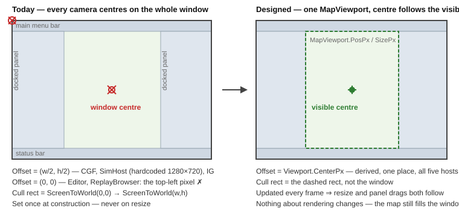

<!--STATUS
state: LIVE
build-state: NOT-BUILT
verified: 2026-08-28 (coordinator source scan)
current-answer: NOT-BUILT (design only). No MapViewport; MapCamera has no viewport/occlusion-aware centring (Offset copied unconditionally).
-->
# Feature design — the map viewport

> **Design for [UXI-09](UX_Issues.md#uxi-09) · drafted 2026-08-12.** Implements
> [UXR-18](UX_Requirements.md#uxr-18). **Status: ❌ NOT-BUILT (design only) — no `MapViewport`; `MapCamera` has no viewport/occlusion-aware centring (`Offset` copied unconditionally).**



## 0. Prior art ([rule 6](UX_Issues.md#rules))

| Exists? | What | Adoption | Bearing |
|:--:|---|---|---|
| ❌ | Any **screen-space viewport** type for the map | — | **the gap.** `MapCamera` has exactly one screen-space member — `Offset`, a raw pixel `Vector2` every caller computes itself (`MapCamera.cs:29-33`) |
| ⚠ | **`MapCameraViewport`** — the *world-space* visible rect + zoom, for culling | **2 of 5** (IG, Editor) | 🔴 **the seam exists in the wrong layer** — it lives in `Hrot.IG.Systems`, and `Hrot.Editor` reaches it only by a **project reference to `Hrot.IG`** (`Hrot.Editor.csproj:29`, `EditorSubsystem.cs:405,971`) |
| ✅ | **`DockspaceLayout.CentralPos/CentralSize`** | **3 call sites, all `Program.cs`** | ⚠ **not the answer** — it sizes the *dockspace host window*; docked panels subtract from it afterwards. **No camera reads it** ([Correction 22](UX_Tasks_Detail.md#corrections)) |
| ✅ | `MapCamera.FocusOn(pos, zoom)` — smoothed centring | 4 of 5 | **reused unchanged** — it sets `Target`; `Offset` decides where `Target` lands |
| ✅ | `MapCameraView` + `IMapCameraProvider` — camera carried across a perspective switch | all | 🔴 **it carries `Offset`** — see the second defect below |
| ✅ | `IInputProvider.IsMouseCaptured` → `ImGui.GetIO().WantCaptureMouse` | 4 of 5 | ⭐ **input is already occlusion-aware; geometry is not.** The whole issue is that one half of the loop knows about panels and the other half does not |

⭐ **Seam-law instances 8 and 9**: a shared type stranded in a subsystem (`MapCameraViewport`), and a
built-and-tested helper that never reached the code that needed it (`DockspaceLayout`).

## 1. The five configuration sites — verified

| # | Site | Zoom | Min/Max | Speed | Target | **Offset** |
|--:|---|---|---|---|---|---|
| 1 | `EditorSubsystem.cs:1395` | 1.0 | .1 / 10 | .1 | (0,0) | 🔴 **never set → (0,0)** |
| 2 | `CgfSubsystem.cs:577` | 1.0 | .1 / 10 | .1 | (0,0) | ⚠ hardcoded `(640, 360)` |
| 3 | `SimHostVisualization.cs:226` | 1.0 | .1 / 10 | .1 | (0,0) | ⚠ hardcoded `(640, 360)` — same literal |
| 4 | `IgApplication.cs:595-617` | 0.5 | .01 / 5 | .2 | (5000,5000) | `(WindowWidth/2, WindowHeight/2)` |
| 5 | `ReplayBrowserSubsystem.cs:134` | 1.0 | .1 / 10 | .1 | (0,0) | 🔴 **never set → (0,0)** |

> The issue said **four**; there are **five** — `Hrot.ReplayBrowser` is the fifth and the most minimal.

### 🔴 Three defects fall out, and only one of them is the filed one

| | Defect | Evidence |
|--:|---|---|
| **A** | **Two hosts do not centre on the window at all** — they place the entity at the **top-left pixel**. `Screen = (World − Target)·Zoom + Offset` (`MapCamera.cs:232`), so `Target = entityPos` lands the entity exactly at `Offset`, and `Offset` is `Vector2.Zero` | sites 1 and 5 above |
| **B** | **`Offset` is set once, at construction — in all five.** Grep returns exactly one assignment per site and none in any resize path | `IgApplication.cs:617` is the *only* `Offset` write in IG ⇒ **resize silently decentres every map** |
| **C** | 🔴 **Perspective switch copies one subsystem's `Offset` into another.** `MapCameraView` carries `Offset` (`MapCameraView.cs:10-18`); `ApplyCameraView` restores it (`MapCamera.cs:253`); `SubsystemOrchestrator.cs:175-177` pipes `from`→`to` on every switch | ⇒ switching **out of the Editor** stamps `(0,0)` onto CGF/SimHost/IG, so a correctly-configured map inherits the broken one |

⚠ **C is the sharpest**: a screen-space quantity is being treated as portable camera state. It is not —
it belongs to *the window you are looking at*, not to *the view you are carrying*.

### And the filed defect, confirmed

Both culling setters project the **whole OS window**, never the visible area:

```csharp
// EditorSubsystem.cs:1600-1602        // IgApplication.cs:961-963 — same two lines
var topLeft     = _camera.ScreenToWorld(Vector2.Zero);
var bottomRight = _camera.ScreenToWorld(new Vector2(GetScreenWidth(), GetScreenHeight()));
```

⚠ **There is no scissor anywhere** (`BeginScissorMode`: 0 hits outside ExtDeps). The map is drawn across
the whole framebuffer and ImGui paints over it — the dockspace host uses `PassthruCentralNode`
(`Program.cs:349`). So *occluded* here means literally **behind a panel**, and the fix is **not** a
rendering change.

## 2. The design

🔒 **One new type, one derived property, one per-frame call. Rendering is untouched.**

### 2.1 `MapViewport` — the missing screen-space seam

```csharp
// FDP/Engine/Fdp.Presentation/Vis2D/Components/MapViewport.cs
public sealed class MapViewport
{
    public Vector2 PosPx    { get; private set; }        // top-left of the *visible* map area
    public Vector2 SizePx   { get; private set; }
    public Vector2 CenterPx => PosPx + SizePx * 0.5f;
    public bool    IsEmpty  => SizePx.X <= 0f || SizePx.Y <= 0f;

    public void Set(Vector2 posPx, Vector2 sizePx);      // host, once per frame
    public bool ContainsPx(Vector2 p);
}
```

### 2.2 `MapCamera` derives `Offset` — nothing else changes

```csharp
public MapViewport? Viewport { get; set; }               // null ⇒ today's behaviour, unchanged

// in Update(float dt), before the lerp:
if (Viewport is { IsEmpty: false } vp) Offset = vp.CenterPx;
```

| Consequence | Why it is free |
|---|---|
| ✅ **Centring is correct in all five hosts** | `FocusOn` already sets `Target`; `Offset` now *is* the visible centre |
| ✅ **Resize follows** (defect B) | the viewport is re-`Set` each frame |
| ✅ **Zoom-to-cursor still anchors** | `ProcessInput` re-derives from `InnerCamera.Offset` (`:141`) — it reads whatever is current |
| ✅ **Pan unaffected** | pan moves `Target` by `Δscreen / Zoom`; `Offset` does not enter |
| ✅ **No render change** | the map still fills the window; only *what is centred* moves |

### 2.3 `ApplyCameraView` stops transporting `Offset` (defect C)

```csharp
public void ApplyCameraView(MapCameraView view)
{
    Target = view.Target; Zoom = view.Zoom; /* smooth targets */
    if (Viewport is null) InnerCamera.Offset = view.Offset;   // legacy path only
}
```

🔒 **`MapCameraView.Offset` stays in the struct** — it is a `readonly struct` with other consumers, and
removing a field is a wider change than this issue owns. It is simply **not applied** once a viewport is
attached.

### 2.4 One setup, five adopters

```csharp
public sealed record MapCameraSetup(
    float   InitialZoom  = 1f,
    float   MinZoom      = 0.1f,
    float   MaxZoom      = 10f,
    float   ZoomSpeed    = 0.1f,
    Vector2 InitialTarget = default,
    float   CullMarginPx = 0f)
{
    public static readonly MapCameraSetup Default = new();
    public MapCamera Create(MapViewport viewport);
}
```

| Site | Becomes |
|---|---|
| Editor, CGF, SimHost, ReplayBrowser | `MapCameraSetup.Default.Create(viewport)` — ⭐ *"unset"* becomes *"chose the default"* |
| IG | one literal built from `IgCameraConstants` — the six scattered assignments collapse |

⚠ **`CullMarginPx` is a round-out, not scope creep**: today's cull rect is the window with **zero**
margin, so edge pop-in already exists; narrowing the rect to the visible area would make it worse. One
field, defaulted to today's behaviour.

### 2.5 The world-space rect moves down a layer and is computed once

```csharp
// promoted: Hrot.IG.Systems.MapCameraViewport → Fdp.Toolkit.Vis2D.MapCullRect
public static MapCullRect Project(MapCamera cam, MapViewport vp, float marginPx);
```

The two copy-pasted setter blocks (`EditorSubsystem.cs:1598-1608`, `IgApplication.cs:961-973`) become one
call. ⚠ **On promotion, break the IG dependency**: `MapCameraViewport.Zoom` currently defaults to
`IgCameraConstants.InitialZoom` — an engine type must not know an IG constant. Default `1f`.

### 2.6 Where the rect comes from — three tiers, ship T1

| Tier | Rect | Needs | Status |
|:--:|---|---|---|
| **T0** | the whole window | nothing | today's behaviour; the fallback when no host supplies a rect |
| **T1** | **work area − status bar** = `DockspaceLayout.CentralPos/CentralSize` | ⭐ **already computed** in `Program.cs:325-326` — it only needs **publishing** to the subsystems | 🎯 **ship this** |
| **T2** | the **central dock node** rect (docked panels subtracted) — the dashed rect in the diagram | **two `DllImport` declarations** — see below | ✅ **verified feasible, 2026-08-12** |

🔒 **The seam is the same for all three.** `MapViewport.Set` does not care who computed the rect, so T2
is later a one-line change at the host, with no subsystem churn.

#### ✅ T2 is reachable — verified against the actual package

Downloaded `ImGui.NET 1.91.6.1` from nuget.org and inspected both halves:

| | Finding |
|---|---|
| **Managed** `lib/net8.0/ImGui.NET.dll` | ❌ **exposes no `DockBuilder*` at all** — the only dock-node symbols are the two enum members `PassthruCentralNode`, `NoDockingOverCentralNode` |
| **Native** `runtimes/win-x64/native/cimgui.dll` | ✅ exports **`igDockBuilderGetCentralNode`** — and, crucially, **`ImGuiDockNode_Rect`** |
| Deployment | ✅ **nothing new to ship** — `cimgui` is the same native library ImGui.NET already `DllImport`s |

⭐ **`ImGuiDockNode_Rect` is what makes this safe.** Without it, T2 would mean reading `Pos`/`Size` at a
hardcoded offset inside an internal struct — the kind of thing that breaks *silently* on an ImGui bump.
With it, there is **no struct-layout dependency at all**:

```csharp
[DllImport("cimgui")] static extern IntPtr igDockBuilderGetCentralNode(uint dockspaceId);
[DllImport("cimgui")] static extern void   ImGuiDockNode_Rect(out ImRect pOut, IntPtr node);
// ImRect = { Vector2 Min; Vector2 Max; } — two ImVec2, 16 bytes, stable
```

⚠ **The pointer may be null** — a dockspace has no central node once something is docked over it. `null`
⇒ **fall back to T1**, never throw. That is the only branch T2 adds.

### 2.7 Frame order — and the one-frame staleness

```
orchestrator.Update(dt)      Program.cs:304   ← subsystems read MapViewport here
  ...
rlImGui.Begin()              Program.cs:316   ← the dock layout is only known here
  dockspace setup                    :325     ← the rect is computed here
```

⇒ The rect a subsystem reads is **the previous frame's**. 🔒 **Accepted**: it changes only when the user
resizes a panel or the window, and a one-frame lag on that is imperceptible. ⚠ **Frame 0 must be seeded**
with the work area, so the first frame is never `(0,0)`.

## 3. Acceptance

| # | Case | Cls |
|---|---|:--:|
| 09.1 | `CenterPx == PosPx + SizePx/2` | H |
| 09.2 | Camera with a viewport → after `Update`, `Offset == viewport.CenterPx` | H |
| 09.3 | `FocusOn(p)` + settle → `WorldToScreen(p) ≈ viewport.CenterPx` | H |
| 09.4 | Inset the viewport by a 300 px left panel → the centre moves right by 150 px | H |
| 09.5 | Viewport `SizePx` changes (resize) → `Offset` follows; 🔴 with **no** viewport it does **not** — the legacy regression, asserted explicitly | H |
| 09.6 | Cull rect corners project `vp.Pos` / `vp.Pos+vp.Size`, **not** `(0,0)`/`(w,h)` | H |
| 09.7 | Zoom-to-cursor: `ScreenToWorld(mouse)` is invariant across a wheel tick **with an off-centre viewport** | H |
| 09.8 | `ApplyCameraView` transfers `Target`/`Zoom` and 🔒 **does not touch `Offset`** when a viewport is attached | H |
| 09.9 | `MapCameraSetup.Default` reproduces today's ctor values **exactly** — guards four subsystems against a silent behaviour change | H |
| 09.10 | IG's setup literal reproduces every `IgCameraConstants` value | H |
| 09.11 | Empty viewport (panels cover everything) → no NaN, no divide-by-zero; the camera holds its last centre | H |
| 09.12 | `CullMarginPx = 0` reproduces the current cull rect for a full-window viewport — the migration is provably a no-op at T0 | H |
| 09.13 | Perspective switch Editor→CGF → CGF's centre is **CGF's** viewport centre, not `(0,0)` | I |
| 09.14 | Drag a docked panel wider → the map centre visibly follows within one frame | I |
| 09.15 | *Center on Entity* with a wide left panel open → the entity lands in the **visible** centre | I |
| 09.16 | ReplayBrowser *CenterOnEntity* no longer parks the entity at the top-left pixel | I |

**12 H · 4 I · 0 V.** ⭐ Everything except the four ImGui round-trips is pure arithmetic on
`MapCamera`/`MapViewport` — no Raylib, no window.

⚠ **09.9 and 09.12 exist to make the refactor safe, not to test a feature.** They pin today's numbers
before five call sites are rewritten.

## 4. 🔒 Out of scope

| | |
|---|---|
| Rendering the map into an ImGui window (render texture) | a much larger change; the passthrough dockspace makes it unnecessary |
| Scissoring the map to the visible rect | nothing needs it — panels already paint over |
| Multi-viewport / multi-monitor | `MapViewport` does not preclude it |
| The status-bar widget | [UXI-27](UX_Issues.md#uxi-27) |
| Minimap / overview inset | not filed |

## 5. Risks

| | |
|---|---|
| ⚠ **T2 crosses into `imgui_internal` by P/Invoke** | ✅ feasibility **verified** (§2.6) — but it is still internal API. Mitigations: `ImGuiDockNode_Rect` removes the struct-layout risk; null-check falls back to T1; and ⭐ **one startup self-check** — on the first frame, with nothing docked, the central node rect must equal the dockspace rect. If it does not, log and stay on T1. That turns an ImGui-bump breakage into a logged downgrade instead of a wrong viewport |
| ⚠ **Removing the hardcoded `1280×720`** changes CGF's and SimHost's initial view | expected and correct — but it is a **visible** change to two subsystems; call it out in the task |
| ⚠ **Narrowing the cull rect culls more** | entities behind panels stop being processed. That is the point, but it changes LOD/culling load in IG — measure, and keep `CullMarginPx` as the escape hatch |
| ⚠ **Promoting `MapCameraViewport`** touches IG culling and the Editor's reference to it | mechanical, but it is engine-layer movement — 09.12 is the guard |
| ⚠ **One-frame staleness** (§2.7) | accepted; only perceptible if a panel is resized every frame |
| ⚠ **`Hrot.Editor → Hrot.IG` project reference** | this design *reduces* the reason for it but does not remove it — `MapCullingModule` still lives in IG. Note it; do not chase it here |
