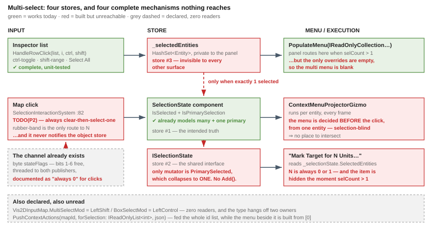

# Feature design — multi-select

> **Design for [UXI-24](UX_Issues.md#uxi-24) · drafted 2026-08-13.** Delivers
> [UXR-91](UX_Requirements.md#uxr-91). **Status: ✅ designed — one decision open ([§2](#2--one-decision-open--two-of-our-own-designs-disagree)).**
> Depends on [UXI-11](UX_Feature_Selection.md) (one store) and [UXI-03](UX_Feature_Entity_Action_Vocabulary.md)
> (the descriptor that carries fan-out).



## 0. Prior art ([rule 6](UX_Issues.md#rules))

⭐ **Almost every part of multi-select is already built. Four separate pieces of it are unreachable.**

| Exists? | What | Adoption | Bearing |
|:--:|---|---|---|
| ✅ | **`EntityInspectorPanel.HandleRowClick(list, i, ctrl, shift)`** (`:410-437`) — ctrl-toggle **and** shift-range with a `_lastClickedIndex` anchor, modifiers read from `ImGuiApi.GetIO()` (`:288-289`) | **the inspector list, in every host** | ⭐ acquisition is **built and working** — [Correction 31](UX_Tasks_Detail.md#corrections) |
| ✅ | The panel routes to the **multi-entity `PopulateMenu` overload** at `selCount > 1` (`:370-377`) and ships one working multi item — *Copy to JSON (N items)* (`:383-387`) | every host with an inspector | the dispatch half of UXR-91 exists; the **handlers** are empty |
| ✅ | **`SelectionState`** component + `ExecuteBoxSelection` (`:185-219`) — rubber-band selects **N**, first is primary | 4 map hosts | the map can **hold** a multi-selection; it cannot **build one by clicking** |
| 🔴 | **`byte stateFlags`** through both interaction publishers — `bit7` mouse/kbd, `bit0` pressed, **bits 1-6 free** | decoded only for `RawInput`; documented *"For Started/DragUpdate/Commit/Cancel, actionId=0 and stateFlags=0"* (`GizmoInteractionProxyTool.cs:18`) | ⭐ **the modifier channel exists and is deliberately zeroed** — §3.1 |
| 🔴 | **`Vis2DInputMap.MultiSelectMod = LeftShift`, `BoxSelectMod = LeftControl`** | **zero readers** — and it hangs off **two** owners (`MapCanvas.cs:15`, `MapCamera.cs:43`) with independent defaults | the binding was declared, never wired |
| 🔴 | **`IEgressWriters.PushContextActions(mapGroupId, IReadOnlyList<int>? forSelection, json)`** — 8 implementations, parameter literally named `forSelection`, fed the **whole** id list (`ContextMenuLogic.cs:143`) | the **menu content** beside it is built from `SelectedEntityIds[0]` (`:99`) | ⭐ the remote menu channel is selection-shaped end to end |
| 🔴 | **`IgApplication.OnCanvasWorldClick`** — shift+right-click fans `CmdAppendPersonalWaypoint` over every selected vehicle (`:2077-2109`) | **zero production callers**; reachable only from `TestHook_SimulateShiftRightClick` (`:1798`) and `TestHook_SimulatePlainRightClick` (`:1808`) | the map's only click-driven fan-out is test-only |
| 🔴 | `DefaultSelectionState.AddSelection` / `ClearSelection` (`:42-53`) — the multi-select mutators | **zero callers**, and **not on the interface** | §1.4 |
| 🔴 | `IEntityContextMenuHandler.PopulateMenu(IReadOnlyCollection<Entity>, …)` — default-interface **no-op** (`:37`) | 2 production implementors: `LambdaEntityContextMenuHandler` uses the default; `JsonEntityContextMenuHandler:67-70` overrides it with *"Multi-entity JSON-driven menus are not supported."* | the issue as filed — correct |

⇒ ⭐ **Four new seam-law instances — 16 through 19** (`stateFlags` · `Vis2DInputMap` · `OnCanvasWorldClick`
· `forSelection`). Instance 18 is the **same shape as [ruling 36](UX_RESUME_INTERACTION.md)'s
continuous-drag find**: a complete implementation reachable only from a test hook.

## 1. What the census changes about the issue

### 1.1 ⚠ Multi-select is **built** — on the wrong surface

> **The register says:** *"no ctrl/shift additive click-select exists anywhere"*.

🔴 **False.** It exists, with shift-range, in the **inspector list**. The **map** half is what is missing.
⇒ [Correction 31](UX_Tasks_Detail.md#corrections).

| Surface | Acquire a multi-selection | Menu honours it | Reaches the other surface |
|---|:--:|:--:|:--:|
| **Inspector list** | ✅ click · ctrl · shift-range · *Select All* (`:176-185`) | ✅ routes to the multi overload | 🔴 **only when exactly 1 is selected** (`:313-317`) |
| **Map** | ⚠ **rubber-band only** — click is unconditionally clear-then-select-one (`:82-83`) | 🔴 menu is **precomputed per entity**, §1.5 | 🔴 never |

### 1.2 🔴 A **third** selection store, private to the panel

[UXI-11](UX_Feature_Selection.md) found two. There are four things holding selection:

| # | Store | Owner | Multi? |
|--:|---|---|:--:|
| 1 | `SelectionState` component | ECS, per map host | ✅ |
| 2 | `ISelectionState` (`DefaultSelectionState`, `SimHostInspectorAdapter`) | in-memory, per host | ⚠ §1.4 |
| 3 | 🔴 **`EntityInspectorPanel._selectedEntities`** — `internal readonly HashSet<Entity>` (`:32`) | **the panel**, private | ✅ |
| 4 | `IInspectorContext.SelectedEntity` | per host — SimHost binds it to #2 | ❌ single |

⚠ Store 3 is invisible to every other surface, so the panel must OR two stores to decide whether a row
looks selected: `_selectedEntities.Contains(e) || context.SelectedEntity == e` (`:300`).

### 1.3 🔴 *"Mark Target for N Units"* can never show N > 1

The Editor's perception-seeding items (`EditorSubsystem.cs:1452-1495`) are the programme's flagship
multi-target actions. **Both are unreachable in the multi case, for two independent reasons.**

| # | Cause | Evidence |
|--:|---|---|
| 1 | They are registered through **`LambdaEntityContextMenuHandler`**, which implements **only the single-entity overload** ⇒ the panel calls them **only when `selCount <= 1`** | `EntityInspectorPanel.cs:370-398` |
| 2 | `perceiverCount` reads `_selectionState.SelectedEntities` — a `DefaultSelectionState` the Editor only ever writes via `PrimarySelected =` (`:1230,:1292,:1297`), which **collapses to one** | `DefaultSelectionState.cs:26-34` |

⇒ **The label renders as *"Mark Target for 1 Units..."*, and the item vanishes the moment a real
multi-selection exists.**

### 1.3b ⚠ And rubber-band selection **is** desynchronised — a refinement of [Correction 28](UX_Tasks_Detail.md#corrections)

Correction 28 established that the Editor's two stores stay consistent **by hand**. That holds for
**click**-select. It does **not** hold for the rubber band:

| Path | Notifies `OnSelectionChanged` → `ISelectionState` |
|---|:--:|
| click on entity (`:84`) | ✅ |
| tiny-drag ⇒ deselect-all (`:193`) | ✅ |
| 🔴 **`ExecuteBoxSelection` selecting N** (`:202-218`) | ❌ **never** |

⇒ rubber-band 5 entities in the Editor: **5 rings appear** (component) while `_selectionState` still holds
0 or 1 — so *Mark Target* would fan out over the **wrong set** even if it were visible. ⚠ Correction 28 was
right about the case it examined and too broad in its conclusion; the desync is real and lives **only in
the multi path**, which is precisely the path nothing exercises.

### 1.4 🔴 `ISelectionState` has **no additive operation**

```csharp
public interface ISelectionState {
    bool IsSelected(Entity e);
    IReadOnlyCollection<Entity> SelectedEntities { get; }   // read-only
    Entity? PrimarySelected { get; set; }                   // ⬅ the ONLY mutator
    Entity? HoveredEntity   { get; set; }
}
```

`DefaultSelectionState`'s setter is commented *"Setting primary resets selection to just that one"*
(`:24-25`); `AddSelection`/`ClearSelection` sit on the **concrete class**, off the interface, with **zero
callers**.

⇒ 🔴 **[UXI-11 §2.1](UX_Feature_Selection.md)'s promise — *"menu handlers need no change; they still set
`PrimarySelected`"* — cannot deliver multi-select.** The interface must gain additive operations. §3.2.

### 1.5 The map menu is a **projection**, not a query

`ContextMenuProjectorGizmo` is `[GizmoProjector(typeof(NetworkIdentity))]`: it runs **per entity, every
frame**, picks one of four pre-serialized JSON constants from that entity's own components, and emits
`DrawContextMenuBinding(networkId, menuJson)` (`:97-127`). On right-click the terminal looks up
`menuBindings[hitNetworkId]` (`GizmoMap.Presentation/Layers/DebugGizmoLayer.cs:227-235`).

| | |
|---|---|
| 🔒 **The menu is decided before the click, per entity, selection-blind** | so *intersect over the selection* has nowhere to happen in this pipeline |
| ⚠ It is also **not registered in CGF or SimHost** | they call their own registrars, never `Hrot.Common.Diagnostics.Gizmos.GizmoRegistrar` — [UXI-23 §2](UX_Feature_Map_Parity.md) |

### 1.6 ExCon: the wire is multi, the reader is not

`SelectionChangedEventDto.SelectedEntityIds` is an `IReadOnlyList<int>`. ExCon keeps `[0]`
(`ExConLogic.cs:770-772`, `ContextMenuLogic.cs:99`) — **while logging the count**:
`$"{evt.SelectedEntityIds?.Count ?? 0} entities"` (`:774`). It then passes the **full list** onward as
`forSelection`.

## 2. 🔴 One decision open — two of our own designs disagree

| Source | Partial applicability (only *some* selected support it) |
|---|---|
| **[UXR-91](UX_Requirements.md#uxr-91)** (P0, user, 2026-08-10) | *"shows **only** items applicable to every selected entity"* ⇒ **hidden** |
| **[UXI-03 §4](UX_Feature_Entity_Action_Vocabulary.md)** | *"shown only if `isVisible` holds for every selected entity"* ⇒ **hidden** |
| **[UXI-11 §2.4](UX_Feature_Selection.md)** | *"shown, **disabled**, with a reason — *3 of 12 selected support this*"* |

⚠ **UXI-11 relaxed a P0 requirement without flagging that it was doing so.** That is mine to own.

### 🎯 The reconciliation I recommend — the registry already has two predicates

[UXI-03 §2](UX_Feature_Entity_Action_Vocabulary.md) registers `isVisible` **and** `isEnabled` separately.
Apply **AND over the selection to each, independently**:

| Predicate | AND fails ⇒ | The registrar uses it for |
|---|---|---|
| `isVisible` | **hidden** | *"meaningless for that kind of thing"* — `Edit Route` on a building |
| `isEnabled` | **shown, disabled, `disabledReason`** | *"applicable in principle, not right now"* — `Delete` on a locked entity |

| | |
|---|---|
| ✅ **UXR-91 is honoured literally** | an item whose *visibility* predicate fails on any selected entity does not appear |
| ✅ **UXI-11's concern is answered** | the menu cannot silently empty, because *explicable* mismatches gray out instead |
| 🔒 **The registrar decides per action, at declaration** | no global policy switch, nothing to tune later |
| ⚠ **Still ruled out** | showing an item and **applying it to the applicable subset** |

🔴 **This needs your nod** — it is the difference between a mixed selection showing a 2-item menu and a
12-item menu that is mostly gray.

## 3. The design

### 3.1 🔒 Modifiers ride the **existing** `stateFlags` byte

```
bit7   1 = mouse, 0 = keyboard     ── in use today
bit0   1 = pressed, 0 = released   ── in use today
bit1   SHIFT held    ⬅ new         ── bits 1-6 are free
bit2   CTRL  held    ⬅ new
bit3   ALT   held    ⬅ reserved, not consumed
```

| Where | Change |
|---|---|
| `GizmoMap.Presentation/Layers/DebugGizmoLayer.cs:159,221` | read modifier state **at the press**, pass it instead of the literal `0` |
| `GizmoInteractionProxyTool.cs:41,58` | forward the byte instead of hardcoding `0` |
| `Fdp.Presentation/Vis2D/Layers/DebugGizmoLayer.cs:172-178` | decode into a `Modifiers` field on `GizmoInteractionStartedEvent` |
| `SelectionInteractionSystem.cs:80-84` | replace the `TODO(P2)` with the three-branch rule (§3.3) |

🔒 **The modifier must travel in the event, never be sampled by the ECS system.** The `TODO` says *"read
Raylib shift/ctrl state"* — right about the **source**, wrong about the **place**:

| | |
|---|---|
| 🔴 `SelectionInteractionSystem` also runs on the **SimHost**, serving the **IG terminal**, whose input arrives as DDS `RawInput` via `GizmoInteractionIngressTranslator.cs:70` | there is no local keyboard to sample |
| ✅ Both publishers already carry the byte | one field serves the local **and** the remote path, with no second mechanism |

⭐ **Wire-compatible** — `stateFlags` is an existing `byte`; only previously-constant bits gain meaning.
An old sender writes `0` = *no modifier* = today's behaviour exactly.

⚠ **`Vis2DInputMap` gets its first reader — after its duplicate owner is resolved.** One `InputMap`, on
`MapCanvas`; `MapCamera.InputMap` deleted. Binding a config surface that exists twice, with independent
defaults, would be worse than leaving it dead.

### 3.2 🔒 One store — and `ISelectionState` gains the operations it lacks

Two changes, both extending [UXI-11 §2.1](UX_Feature_Selection.md) rather than adding a mechanism.

**(a) The interface gets an additive vocabulary** (§1.4 — it has none):

```csharp
public interface ISelectionState {
    bool IsSelected(Entity e);
    IReadOnlyCollection<Entity> SelectedEntities { get; }
    Entity? PrimarySelected { get; set; }     // unchanged: set = replace-with-one
    Entity? HoveredEntity   { get; set; }

    void Add(Entity e);                        // ⬅ new
    void Remove(Entity e);                     // ⬅ new
    void SetMultiple(IEnumerable<Entity> e);   // ⬅ new
    void Clear();                              // ⬅ new
}
```

| | |
|---|---|
| ⭐ **Not invented — copied.** `SimHostSelectionManager` already implements exactly these four (`Add` · `Remove` · `SetMultiple` · `Clear`, `:26-89`) with primary-reassignment on removal | the shape is proven in production; it is simply not on the interface |
| 🔒 `PrimarySelected =` **keeps its collapsing semantics** | every existing caller stays correct — this is additive |
| ✅ `DefaultSelectionState.AddSelection`/`ClearSelection` are **renamed onto the interface**, not duplicated | they exist already (`:42-53`) and gain their first callers |

**(b) The panel's private store becomes a view.** `EntityInspectorPanel._selectedEntities` is replaced by
reads of the injected `ISelectionState`.

| | |
|---|---|
| ✅ **Store 3 disappears**, and with it the double-read at `:300` |
| ✅ **Panel ⇄ map chaining becomes automatic** — the `if (count == 1)` gate (`:313-317`) simply goes away |
| ⚠ **`HandleRowClick` keeps its shape** — the ctrl/shift/range logic is correct and unit-tested; only its **destination** changes |
| ⚠ **`_lastClickedIndex` stays panel-local** — a range anchor is list-order state, a view concern, not selection truth |
| ⚠ **The panel must tolerate a missing `ISelectionState`** — keep a private fallback instance rather than making the panel unusable in hosts that inject none |

**(c) Rubber-band notifies.** `ExecuteBoxSelection` calls `OnSelectionChanged` on the multi branch too
(§1.3b) — or, once (b) lands, the question disappears with the second store.

### 3.3 🔒 Map click semantics — the three branches

| Click | Result |
|---|---|
| plain | clear, select it, primary |
| **+ ctrl** | 🔒 **toggle**; primary moves to it when added, to any remaining member when removed |
| **+ shift** | 🔒 **add** (never removes) |
| plain on empty | clear |

⚠ **No shift-*range* on the map** — range needs an ordering and the map has none. Shift is additive there,
range in the list. ⭐ Exactly the file-manager icon-view convention.

🔒 **Right-click keeps [ruling 28](UX_RESUME_INTERACTION.md)'s semantics and is modifier-blind.** It is
already plumbed: right-click publishes `GizmoInteractionStartedEvent`
(`GizmoMap.Presentation/Layers/DebugGizmoLayer.cs:221`) **before** the menu is scheduled at `:227-235`,
which satisfies [case 11.7](UX_Feature_Selection.md) by construction.

🔴 **And it fixes §1.3's inspector defect:** right-click must apply the same rule there —
`:321-326` sets `_contextMenuEntity` without touching the selection today.

### 3.4 The map menu — where the intersection is computed

§1.5's projection cannot express *intersect over selection*. Two pipelines, per
[Q26-A2](Architect_Question_26_Entity_Action_Model.md)'s existing ruling that IG's DDS-authored menu is
separate:

| Pipeline | Menu built | Intersection computed by |
|---|---|---|
| **Service maps** (Editor · CGF · SimHost · ReplayBrowser) | **at click time**, from [UXI-03](UX_Feature_Entity_Action_Vocabulary.md)'s registry — the same `EntityActionMenuHandler` the inspector uses | the registry, evaluating `isVisible`/`isEnabled` over `ctx.Selection` |
| **IG** | remotely, by **ExCon** | ⭐ **ExCon — which already receives the whole id list and already passes it on as `forSelection`** (§1.6). It stops taking `[0]` and populates from the set |

⭐ **No new transport, no projector change.** The remote half is *"delete an index expression"*, not a
mechanism. ⚠ `SharedContextMenuPopulator.PopulateEntityMenu` is single-entity by signature
(`ContextMenuLogic.cs:120-127`) and needs the collection overload — the same change
[UXI-03](UX_Feature_Entity_Action_Vocabulary.md) already schedules for it.

### 3.5 Fan-out — the descriptor already carries it

[UXI-03](UX_Feature_Entity_Action_Vocabulary.md) defines `EntityActionExecution { PerEntity, Selection }`
and puts `IReadOnlyList<Entity> Selection` in the context. Nothing new is required.

| Mode | Runs | For |
|---|---|---|
| `PerEntity` *(default)* | **once per selected entity** | `Delete`, `Rotate`, `ToggleAiTrace` |
| `Selection` | **once**, reading `ctx.Selection` | *Mark Target*, *Mark Area Targets* — §1.3's items, which a pure fan-out gets wrong |

| | |
|---|---|
| 🔒 **One ECB for the whole fan-out**, not one per entity ([ruling 15](UX_RESUME_INTERACTION.md)) | ⇒ *delete 12* is **one atomic commit**; a fault at #7 leaves **zero** deleted, not seven |
| 🔒 **Authority is per entity, not per action** ([UXI-29](UX_Feature_Authority_Aware_Writes.md)) | a fan-out over mixed ownership routes **each** target locally or as a request. ⚠ It follows that one fan-out may be **partly local, partly network** — correct, not a bug |
| ✅ **`GlobalActionRequestedEvent` needs no change** — it carries one `Entity Target` (`:12-18`) and the dispatch loop is one handler call per event (`GlobalActionDispatchSystem.cs:26-30`) | a `PerEntity` fan-out publishes **N events**; the existing dispatch is already correct |
| ⚠ **Order is the selection's iteration order** — undefined for a `HashSet` | a fan-out must not depend on order; anything that does is a `Selection`-mode action by definition |

### 3.6 The two `Delete` paths converge

[UXI-23 §3.4](UX_Feature_Map_Parity.md) found them:

| | Path | Confirms? |
|---|---|:--:|
| per-entity | menu item → `GlobalActionIds.Delete` → host handler | ❌ |
| **selection** | 🔴 **raw `Delete` key** — `SelectionInteractionSystem.cs:117-152`, its own destroy loop, no action id | ❌ |

🔒 **The key becomes a dispatch of the same action**, so [ruling 29](UX_RESUME_INTERACTION.md)'s modal
confirmation has exactly **one** place to live. ⚠ The destroy loop (`:132-148`) is not deleted — it **is**
the host's `Delete` handler, moved behind the vocabulary.

⭐ **Free fix:** the key path publishes `DestroyEntityCommand` for networked entities and calls
`DestroyEntity` for the rest; each host's menu path does one **or** the other. After convergence there is
one answer per host.

### 3.7 *Select All*, *Select None*, *Invert*

*Select All* exists in the inspector (`:176-185`) and respects the search filter. 🔒 **Round out the
obvious set** — all three are the same loop over the same view, and the first already ships.
⚠ **Filter-scoped, never world-scoped**: selecting 40 000 entities because a button exists is a trap, and
*"respects current search filter"* is already the shipped promise.

## 4. Acceptance

| # | Case | Cls |
|---|---|:--:|
| 24.1 | **Ctrl+click** on the map toggles an entity in and out of the selection | H |
| 24.2 | **Shift+click** on the map adds and never removes | H |
| 24.3 | Plain click still clears and selects one — the no-modifier regression guard | H |
| 24.4 | Removing the primary by ctrl+click leaves **exactly one** primary among the remainder | H |
| 24.5 | 🔒 Modifier bits survive the **DDS round trip** — an IG terminal ctrl+click arrives as a toggle | H |
| 24.6 | A sender writing `stateFlags = 0` behaves **exactly as today** — wire back-compat | H |
| 24.7 | The map context menu is **modifier-blind**: ctrl+right-click behaves as right-click | H |
| 24.8 | 🔴 Right-click on an **unselected inspector row** with others selected clears them and shows **that row's** menu (§1.3, §3.3) | H |
| 24.9 | Inspector and map report the **same selection**, both directions — store 3 is gone | H |
| 24.10 | A **multi**-selection made in the inspector reaches the map (today gated to `count == 1`) | H |
| 24.11 | 🔴 **Rubber-band selecting N updates `ISelectionState`** — the §1.3b desync guard | H |
| 24.12 | `ISelectionState.Add`/`Remove`/`SetMultiple`/`Clear` behave identically across **every** implementation, ECS-backed and DDS-backed | H |
| 24.13 | `PrimarySelected =` still **collapses** the selection — the additive API did not change it | H |
| 24.14 | `isVisible` failing on **any** selected entity hides the item | H |
| 24.15 | `isEnabled` failing on **some** shows it disabled with a reason naming the count | H |
| 24.16 | Both failing on **all** hides it | H |
| 24.17 | 🔴 *"Mark Target for N Units"* is **visible and correct for N > 1** — both §1.3 causes closed | H |
| 24.18 | A `PerEntity` action on a 12-entity selection executes **12 times** | H |
| 24.19 | A `Selection` action on the same executes **once**, seeing all 12 | H |
| 24.20 | 🔒 A fan-out is **one ECB** — a fault midway commits **nothing** | H |
| 24.21 | 🔒 A fan-out over mixed authority routes each target correctly — some local, some as requests | H |
| 24.22 | 🔒 `Delete` key and `Delete` menu item reach the **same handler**; both raise the confirmation | H |
| 24.23 | Cancel on the multi-delete confirmation destroys **nothing** ([ruling 29](UX_RESUME_INTERACTION.md)) | H |
| 24.24 | ExCon builds its menu from the **whole** `SelectedEntityIds`, not `[0]` | H |
| 24.25 | `Select All` selects only entities passing the **current filter**; `Select None` / `Invert` agree with it | H |
| 24.26 | Despawning a selected entity leaves the rest intact and the primary valid | H |
| 24.27 | **Map**: ctrl-click three units → three rings, one green, two yellow | I |
| 24.28 | **Inspector ⇄ map**: shift-range 5 rows → 5 rings on the map | I |
| 24.29 | Mixed selection (unit + building) → only the universal items appear | I |

**26 H · 3 I · 0 V.**

## 5. 🔒 Out of scope

| | |
|---|---|
| The action vocabulary and descriptors | [UXI-03](UX_Feature_Entity_Action_Vocabulary.md) — this design **consumes** it |
| Making selection a single store | [UXI-11](UX_Feature_Selection.md) — **prerequisite**; §3.2 extends it to the panel and the interface |
| The confirmation **dialog** | [UXI-16](UX_Issues.md#uxi-16) + [ruling 13](UX_RESUME_INTERACTION.md)'s modal machinery |
| Registering `ContextMenuProjectorGizmo` in CGF/SimHost | [UXI-23](UX_Feature_Map_Parity.md) |
| Binding the 9 orphan action ids | [UXI-23 §5](UX_Feature_Map_Parity.md) — open |
| Selection **across** subsystems | 🔒 [ruling 27](UX_RESUME_INTERACTION.md): selection is subsystem-local |
| Wiring `OnCanvasWorldClick` back into production | ⚠ **named, not fixed** — the shift+right-click waypoint fan-out is a *feature* decision, not a multi-select one. Filed as [UXI-31](UX_Issues.md#uxi-31) |
| Marquee **modes** (`BoxSelectMod`) | the rubber band already starts on empty space with no modifier; ctrl-drag-to-box over entities is a separate affordance, not needed for UXR-91 |

## 6. Risks

| | |
|---|---|
| 🔴 **Order** | UXI-11 (one store) → UXI-03 (descriptors) → **this**. Fanning out before the descriptor exists means writing the fan-out twice |
| 🔴 **`ISelectionState` gains members — every implementation must follow** | 3 production (`DefaultSelectionState`, `SimHostInspectorAdapter`, `CarKinemInspectorAdapter`) + 1 test fake. ⭐ `SimHostSelectionManager` already has all four, so its adapter is a passthrough. 24.12 is parameterised over all of them |
| ⚠ **Touching `GizmoMap.Presentation` touches the IG production terminal** | [ruling 20](UX_RESUME_INTERACTION.md). The change is additive — previously-constant `0` bits — and 24.6 is the guard |
| ⚠ **`stateFlags` bits become a wire contract** | document them **beside the existing bit7/bit0 comment** (`GizmoInteractionManager.cs:51`), today the only place they are written down |
| 🔴 **Fan-out multiplies side effects** | 🔒 confirmation for destructive actions ([ruling 29](UX_RESUME_INTERACTION.md)); §3.5's single ECB makes the blast radius atomic rather than partial |
| ⚠ **A 40 000-entity *Select All* then *Delete*** | the confirmation names the count exactly; it must **not** enumerate 40 000 names. Cap the naming, keep the count |
| ⚠ **`HashSet` iteration order is unspecified** | §3.5. Anything that cares is `Selection`-mode by definition |
