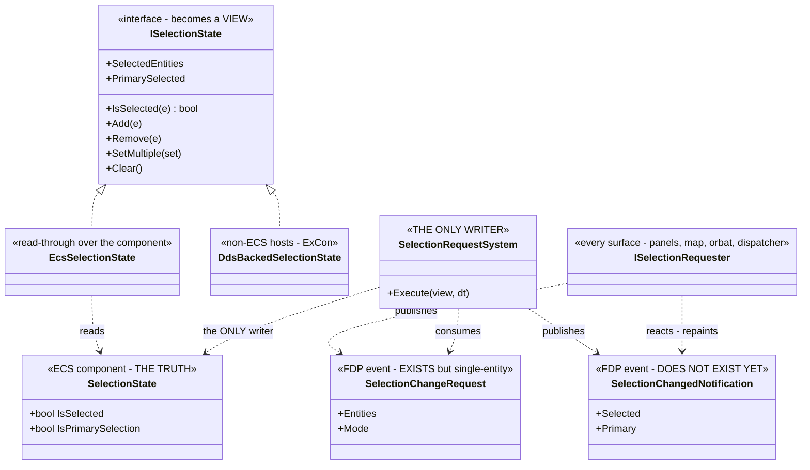
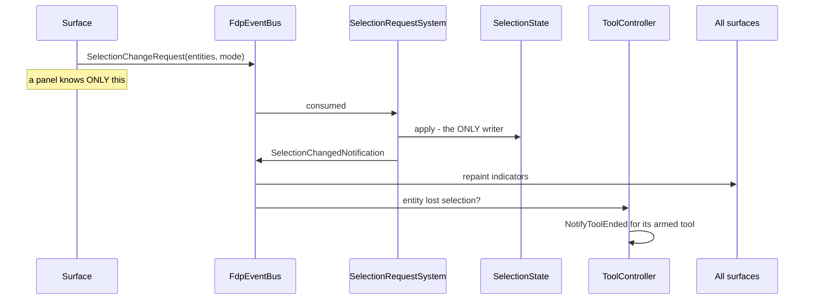
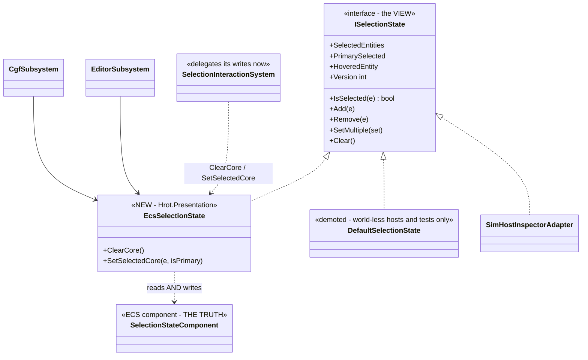
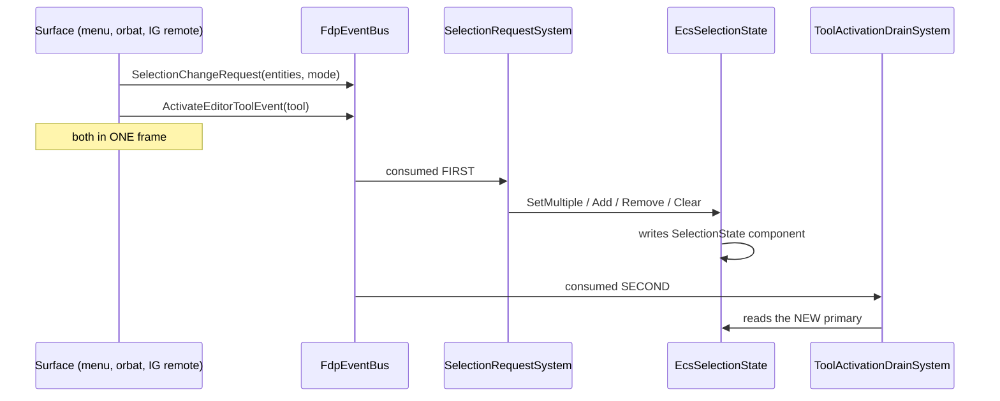
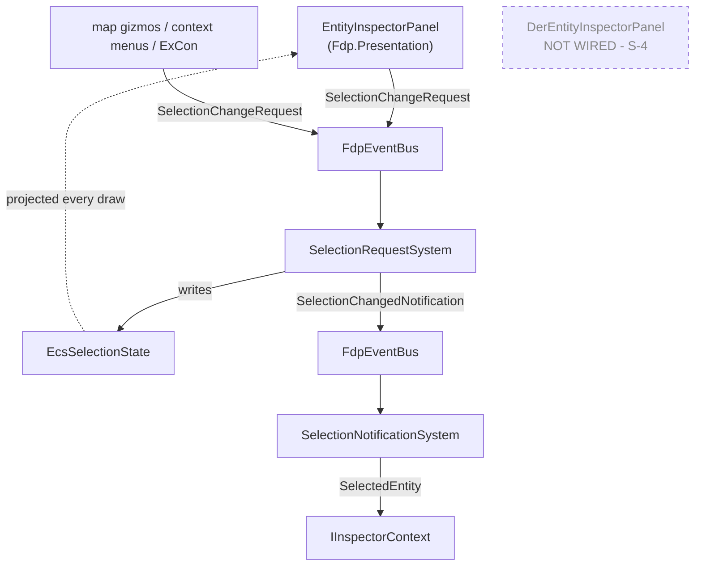
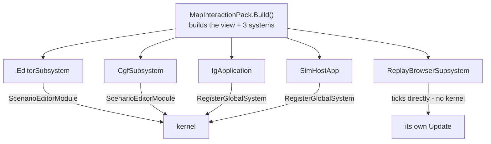

<!--STATUS
state: LIVE
build-state: BUILDING (§2.7 is the consolidated TARGET STATE with class + sequence diagrams;
  §2.7.5 carries the slice order S-1..S-6. ☑ S-1 BUILT 2026-09-20 — as-built in §2.7.6.
  ☑ S-2 BUILT 2026-09-20 — as-built in §2.7.7.
  ☑ S-3 BUILT 2026-09-20 — as-built in §2.7.8.
  ☑ S-3b BUILT 2026-09-20 — user ruling "simhost is not special"; SimHost and ReplayBrowser joined the
  protocol and SimHostSelectionManager/SimHostInspectorAdapter are DELETED. As-built in §2.7.9.
  ☑ S-3c BUILT 2026-09-20 — user ruling "unify the bootstrap too"; MapInteractionPack now CONSTRUCTS the
  selection for all five hosts. As-built in §2.7.10.
  ⚠⚠ S-3d WRITTEN BUT NOT COMPILED 2026-09-20 — the Stride 3-D selection becomes a view of the 2-D one
  and SyncSelection2D3D is deleted. HrotStrideApp.Game is net8.0-windows and outside the root solution,
  so that lane could build neither it nor its tests.
  ✅✅ SUPERSEDED 2026-09-20 — A WINDOWS SESSION RAN IT. S-3d is VERIFIED: compiles (0 errors, whole
  HrotStrideApp.sln incl. HrotStrideApp.Windows), EditorSelectionStateTests 11/11, and the user confirmed
  in the product: "The selection works both ways, clicks as well." Checks 1-5 PASS, check 6 (headless) NOT
  RUN. The blind-written code needed NO fix. Result table: §2.7.11a. ⛔ Check 2 asked for 12 tests and the
  file has 11 — a DOC error, not a missing rail; corrected in §2.7.11a.
  ☑ S-3e BUILT 2026-09-20 — user: "remaining half". CGF has a map-input path at last; every map gesture
  is a REQUEST, which closes S-2 deviation ② AND a regression S-3 had shipped (the inspector context
  stopped following map clicks on four hosts, with the whole suite green). As-built in §2.7.12.
  ☑ S-4 BUILT 2026-09-20 — right-click selects on BOTH inspector panels (§2.3 rows 1 and 2), the DER
  inspector gains its seam (network-id addressed, so no new event was needed) and ExCon wires it, so a
  DER row click moves the remote map's selection. §2.3's same-frame ordering constraint is SUPERSEDED:
  the gesture fixes the menu's subject at open time. As-built in §2.7.13.
  ☑ S-4b BUILT 2026-09-20 — user: "the right click itself should deselect the entity unless the already
  selected group right clicked" + "include the empty-space clear". THE MAP'S RIGHT-CLICK IS FIXED and
  §2.3 is now met on EVERY surface. The vendored GizmoMap terminal tags Started with its button (no new
  field: actionId already existed on that callback and already carries a MapMouseButton for RawInput),
  and a canvas right-click emits a Started that never existed before. MapMouseButton.Left is 0, so the
  change is backward- and wire-compatible by construction. As-built in §2.7.14.
  ⛔ S-4b EDITS THE VENDORED FDP/ExtDeps/GizmoMap TREE — 2 sites, on the user's explicit nod.
  ⛔ STILL OUT OF SCOPE, and the owning design says so: the map menu's CONTENTS (items applicable to all
  selected). canvas-context-menu-design.md parks multi-entity menus. S-4b guarantees the PRECONDITION —
  the selection is still there when the menu opens.
  ⚠ KNOWN LIMIT: the empty-space clear is LOCAL-ONLY. A canvas anchor (id 0/-1) does not survive the
  ingress resolve filter, so a REMOTE terminal's empty-space right-click does not cross the wire. This
  is PRE-EXISTING (no canvas interaction has ever crossed) and deliberately not fixed here.
  ☑ S-5 BUILT 2026-09-20 — ruling ②: an entity that loses the selection loses its edit. The FIRST real
  edge consumer of SelectionChangedNotification. As-built in §2.7.15.
  ⛔⛔ S-5 CORRECTED THE OWNING TOOL DESIGN: UX_Feature_Tool_Model.md §4.14 prescribed NotifyToolEnded,
  which deliberately does NOT tear the gizmo down ("the gizmo ENDED ITSELF") and would have left it armed
  and drawing — the mirror of CE-259q. Cancel() is wrong the other way (it unwinds the whole stack and
  would kill a tool on a still-selected entity). The member ② needs is NEW: IToolController
  .CancelArmedOn(Entity). Red-proved, and folded back into §4.14 with the proof.
  ☑ THE MARQUEE, 2026-09-20 — user ruling: "any perspective showing 2d map should support marquee and
  rubberband, not just editor and cgf." MEASURED: the box-select LOGIC ran on all five hosts; only the
  editor and ReplayBrowser (NOT cgf) ever constructed a RubberBandState or registered a RubberBandGizmo,
  so on IG, SimHost and CGF the drag WORKED and was INVISIBLE. MapInteractionPack now builds and
  registers it for every host, and the two host registrations are deleted so it is not drawn twice.
  As-built in §2.7.16.
  S-6 remains DESIGN.)
verified: 2026-09-10 (measured source scan, graph + grep, coverage checked)
  ⭐ S-1's own inventory re-measured 2026-09-20 on the graph — §2.7.6.
current-answer: ✅ READ §2.7 — the consolidated TARGET STATE (2026-09-10), with the class diagram, the
  request/notify sequence, the delete-list and the S-1..S-6 slice order, THEN §2.7.6 (S-1 as-built)
  and §2.7.7 (S-2 as-built) for what was actually built and where it deviated. §2.1 is its older
  sketch and §2.7 supersedes it where they differ. §2.6 carries the rulings §2.7 encodes.
  ☑ BUILT (S-1): ISelectionState carries Add/Remove/SetMultiple/Clear/Version; EcsSelectionState is
  the read-through view; the editor and CGF hold it instead of a parallel hash set.
  ☑ BUILT (S-2): SelectionChangeRequest (managed, set + mode) + SelectionRequestSystem (the renamed
  SelectEntitySystem), registered on IG too; all FOUR hand-rolled component writers are gone —
  "new SelectionState {" appears in zero production files outside EcsSelectionState.
  ☑ S-3e CLOSED deviation ②: SelectionInteractionSystem now REQUESTS. Two editor facade seams
  (SetSelection2D, Selected2DEntity) remain synchronous — §2.7.7 deviation ③, argued.
  ☑ BUILT (S-3): SelectionChangedNotification (FDP-internal, R-134-clean) published by the one
  writer for every cause; SelectionNotificationSystem points IInspectorContext at it; the entity
  inspector projects the host selection and publishes requests; ChainToMap RETIRED; IG's map->inspector
  hand-sync and its tracker deleted.
  ⚠ Panels PROJECT rather than subscribe (§2.7.8 deviation ②) — a one-frame bus event is unsafe for a
  panel that may not be drawn. The notification is for consumers needing an EDGE (S-5 is the next).
  ☑ BUILT (S-3b): SimHost and ReplayBrowser hold the same EcsSelectionState and run the same
  request/notify pair; SimHostSelectionManager and SimHostInspectorAdapter are DELETED.
  ⇒ THE "4 STORES BECOME 1 + VIEWS" GATE IS MET.
  ☑ BUILT (S-3c): the BOOTSTRAP is shared — MapInteractionPack.Build constructs the view, the gesture
  system and the request/notify pair for all five hosts; ScenarioEditorModule registers the pack's
  instances instead of building its own. The pack's "selection systems are deliberately NOT here"
  exclusion is amended, with the reason, in its own header. Railed by
  OnlyTheSharedPackConstructsTheSelection (red-proved).
  ⛔ NOT unified, deliberately: IsSelectedPredicate stays per-host — `null` ("draw handles on
  everything") is IG's documented policy, so defaulting it would silently change what IG draws.
  ☑ BUILT (S-3e): CGF schedules the gesture system — the map-input path exists on all five hosts; every
  map gesture publishes a SelectionChangeRequest, so SelectionRequestSystem is now LITERALLY the only
  writer and a map click announces (which it did not between S-3 and S-3e — see §2.7.12).
  ☑ BUILT (S-4): right-click SELECTS on both inspector panels and the DER inspector has its seam —
  RequestSelectEntity/HostSelectedNetworkId, addressed by NETWORK id (IDerEntity.EntityId already is
  one), wired in ExCon to SendSetSelection/SelectedEntityId. The menu's subject is fixed BY THE
  GESTURE, which dissolves §2.3's now-unsatisfiable same-frame ordering constraint.
  ☑ BUILT (S-4b): the MAP's right-click obeys §2.3 — inside the selection nothing moves, outside it
  replaces, empty space clears. The button rides in the interaction callback's existing actionId slot
  and in GizmoInteractionBatch.ActionId; Left is 0 so nothing un-migrated changes meaning.
  ⭐ The rule is BUTTON-SPECIFIC on purpose: a LEFT-click inside a multi-selection must still narrow it
  to one, which is why a shared guard would have been wrong and the button had to be carried.
  ☑ BUILT (S-5): losing the selection cancels that entity's edit. The EDGE is the notification; the
  PREDICATE is ISelectionState.IsSelected read live off the one store (a per-entity question, never a
  diff of two sets); the HOME is SelectionNotificationSystem, which already is "what a selection change
  causes"; the WIRING is one constructor argument in MapInteractionPack, so all five hosts get it.
  ❌ STILL NOT BUILT: ClearAll has 0 callers; the map menu's CONTENTS (out of scope, see its own
  design); the empty-space clear does not cross the wire (pre-existing); S-6.
  ⭐ 2026-09-10 — §2.6 is NEW and carries four user rulings: selection is GLOBAL across every host
  (ChainToMap as an opt-in is retired), a selection CHANGE cancels editing of the previously selected
  entity, clicks during an edit must not select (already true on the map via the capture-anchor filter,
  bypassed by panels), and §2.3 row 1 stands (an already-selected entity keeps the whole selection).
  ⛔ §1's headline is SUPERSEDED by its own re-measurement: FOUR stores and ~11 writers, not two/three.
  ⚠ CORRECTED same day: an earlier version of this block said §2.6's rulings all need §2.1 (one store)
    first. WRONG. Only ruling ① (selection is global) needs it — that ruling IS §2.1. Rulings ② (losing
    selection cancels that entity's edit) and §2.3 row 1 (an already-selected entity keeps the selection)
    are BUILDABLE NOW: ② is a per-entity predicate (ISelectionState.IsSelected + IToolController
    .ModalStack's per-entity Target), and row 1 is a conditional in SelectionInteractionSystem.
    Slice order and per-ruling status: §2.7.5 (this file). Tool_Model §4.14 keeps only the
    TOOL-side obligation and points here — one concept, one document.
  ⭐ "Mark Target for N Units..." is RETIRED; replacement in UX_Feature_Tool_Model.md §4.13.
stale-below: §1's title ("two stores and three writers") — read the corrected inventory at the top of §1.
known-conflict: none open. ✅ "Who owns selection" is RULED (2026-09-10): the global ECS repo on
  ECS-enabled nodes and NO ONE ELSE; one similar central piece on non-ECS nodes (ExCon). Selection is
  HOST-LOCAL. ⇒ ① means one store PER HOST with uniform behaviour, NOT a replicated selection, so ① is
  just §2.1 and is UNBLOCKED. This closes the former conflict between MapMessages.cs:103 ("The IG is
  authoritative for the selection state" — true only of the IG's own map, for remote observers) and §2.1.
  DDS selection traffic exists only for direct 2-D map control (ExCon ↔ IG); it is JUST ANOTHER REQUESTER
  and must translate into the same FDP selection-change request event a panel publishes.
  🔴 Two as-built consequences recorded in §2.6: the CMD_SET_SELECTION case sits inline in IgApplication
  rather than in MapCommandController (whose header already claims that job), and its echo-loop
  suppression works by NOT publishing the notification — which would leave every local panel stale under
  the request/notify protocol. Echo suppression belongs at the egress translator.
  ⚠ ONE OPEN OBSERVATION, deliberately not a verdict: ExCon's ingress hands SelectionChangedEventDto
  straight to ContextMenuLogic without it becoming an FDP event, and ExCon does have an FdpEventBus.
  Either an R-134 shape or a deliberate DDS-client architecture — §2.6's last subsection; not measured.
-->
# Feature design — selection

> **Design for [UXI-11](UX_Issues.md#uxi-11) · drafted 2026-08-12 · target state consolidated `2026-09-10` in §2.7.** **Status: 🟡 BUILDING — ☑ `S-1` (§2.7.6), ☑ `S-2` (§2.7.7), ☑ `S-3` (§2.7.8), ☑ `S-3b` (§2.7.9), ☑ `S-3c` (§2.7.10), ✅ `S-3d` (§2.7.11a, Windows-verified), ☑ `S-3e` (§2.7.12) 🟡 `S-4` (§2.7.13) and ☑ `S-4b` (§2.7.14) built `2026-09-20`: one store, one request, one writer, one announcement, on every node — **one place that builds them**, and right-click selects on both inspector panels. **§2.3 is now met on every surface.** ❌ Still open — the map menu's *contents* (parked by its own design), `ClearAll` has 0 callers, and `S-5`–`S-6` remain design.** Implements [rulings 27-28](UX_RESUME_INTERACTION.md). Feeds
> [UXI-24](UX_Issues.md#uxi-24) (multi-select) and [UXI-23](UX_Issues.md#uxi-23) (map parity).

## 0. Prior art ([rule 6](UX_Issues.md#rules))

| Exists? | What | Adoption | Bearing |
|:--:|---|---|---|
| ✅ | **`SelectionState`** ECS component — `IsSelected`, `IsPrimarySelection` | the model is **already correct for multi-select** | ⭐ nothing to redesign; one primary, many selected |
| ✅ | **`SelectionInteractionSystem`** — click + rubber-band → writes the component; `OnSelectionChanged` hook for network publishing | IG · ReplayBrowser · SimHost · Editor — ⚠ **not CGF** | **reused as the single input path** |
| ✅ | `SelectionHighlightGizmo` — green primary / yellow secondary ring | Editor · IG · ReplayBrowser — ⚠ **not SimHost, not CGF** | reused |
| 🔴 | **`ISelectionState`** — a **second, parallel** in-memory store (`DefaultSelectionState` HashSet; `SimHostInspectorAdapter`) | Editor · CGF · SimHost | 🔴 **the defect** — see §1 |
| 🔴 | `SelectionInteractionSystem.ClearAll()` — *"call before a world reset"* | **0 callers** | ⇒ **reload does not clear selection today** (ruling 28 ②) |
| ⚠ | `IEntityActionController` | duplicated in 2 projects | **single-entity only** (`long entityId` per method) ⇒ fan-out belongs on the descriptor layer ([UXI-03](UX_Feature_Entity_Action_Vocabulary.md)), not this facade |

## 1. The defect: two stores and **three** writers, synchronised by hand

⚠⚠ **RE-MEASURED `2026-09-10` — the headline of this section UNDERSTATES it. There are FOUR stores and
~11 production writers.** ⛔ The audit below is still correct about what it covers; it simply does not
cover the panel-private stores or the full `PrimarySelected` write set. ⭐ The corrected inventory:

| # | store | measured |
|--:|---|---|
| 1 | **`SelectionState` ECS component** | written by `SelectionInteractionSystem` |
| 2 | **`ISelectionState`** — **2** production implementations ⚠ *(corrected `2026-09-19`: this said **3**, counting the Examples adapter as production; measured on the graph via `IMPLEMENTS` edges)* | `DefaultSelectionState` · `SimHostInspectorAdapter` *(+`CarKinemInspectorAdapter` in Examples, +1 test fake)* |
| 3 | 🔴 **`EntityInspectorPanel._selectedEntities`** — its own multi-select `HashSet` | `FDP/Engine/Fdp.Presentation/ImGui/Panels/EntityInspectorPanel.cs:377` |
| 4 | 🔴 **`DerEntityInspectorPanel._selectedEntityId`** — its own single `int` | `FDP/Engine/Fdp.Presentation/ImGui/Panels/DerEntityInspectorPanel.cs:77` |

📐 **`PrimarySelected` alone has 9 production write sites:** `CgfSubsystem.cs:1461`, `:2884` ·
`EditorSubsystem.cs:754`, `:789`, `:1946`, `:2008`, `:2013` · `SelectEntitySystem.cs:83`.

⇒ ⚠⚠ **CORRECTED same day — an earlier version of this line said this is why ALL of §2.6's rulings
"cannot be built before §2.1". That is too coarse.** ⭐ Only ruling ① *(selection is global)* needs §2.1 —
that ruling **is** §2.1. Rulings ② and §2.3 row 1 are **per-entity / local** and buildable without it
*(§2.7.5 carries the slice order)*. ⭐ What the four stores DO block is the
**request/notify protocol** of §2.7, because *"the selection changed"* has four possible meanings until
S-1 lands. *(Coverage when measured: index mode `full`, recording complete; no parse gaps in any file
named here.)*

⚠ **Corrected 2026-08-12** ([Correction 28](UX_Tasks_Detail.md#corrections)) — an earlier draft of this
section claimed the two stores are *desynchronised in the Editor*. **They are not.** The audit below is
what the code actually does.

| # | Writer | Writes | |
|--:|---|---|---|
| 1 | `SelectionInteractionSystem:170-172` — click, rubber-band | **component** | |
| 2 | `EditorSubsystem.cs:1226-1230` — the *Select* action handler | **component *and* object** | ⚠ **re-implements `SetSelected` by hand**, including the clear-previous loop |
| 3 | `EditorSubsystem.cs:1292-1297` — `OnSelectionChanged` callback | **object** | deliberate propagation *from* writer 1 |

⇒ 🔒 **The Editor is consistent — by manual effort.** The cost is not a live bug but **duplicated
selection logic in two places and a sync that must be remembered at every new call site.**

| Host | Reality |
|---|---|
| **Editor** | both stores, hand-synced by writers 2 and 3 |
| **CGF** | 🔴 **object only** — no `SelectionState` component exists at all, so nothing to desync and **no ring possible** |
| **SimHost** | component written; `ISelectionState` via `SimHostInspectorAdapter`; ⚠ no ring registered |

⭐ **This strengthens the case for one store rather than weakening it**: writer 2 exists *only* because
there are two stores. A view deletes it.

## 2. The design

### 2.1 One store; `ISelectionState` becomes a *view*

🔒 **The ECS component is the single source of truth.** `ISelectionState` keeps its shape — every shared
panel keeps compiling — but its implementation becomes a **read-through adapter over the component**:

```csharp
sealed class EcsSelectionState : ISelectionState      // replaces DefaultSelectionState in map hosts
{
    public bool IsSelected(Entity e);                  // → component
    public IReadOnlyCollection<Entity> SelectedEntities { get; }
    public Entity? PrimarySelected { get; set; }       // setter routes through the interaction system
}
```

| | |
|---|---|
| ✅ **The desync cannot recur** | there is only one place to write |
| ⚠ **Menu handlers need no change** — 🔴 **amended 2026-08-13 by [UXI-24 §1.4](UX_Feature_Multi_Select.md)** | true for *single* selection only. `PrimarySelected` is the interface's **only** mutator and its setter **collapses the selection to one** (`DefaultSelectionState.cs:24-34`); `AddSelection`/`ClearSelection` are off the interface with **zero callers**. ⇒ `ISelectionState` must gain `Add`/`Remove`/`SetMultiple`/`Clear` |
| ⭐ **ExCon fits without an exception** | 🔒 [ruling 27](UX_RESUME_INTERACTION.md) — **same interface, DDS-backed implementation**, no ECS. The interface is the seam; the store is the binding |

### 2.2 One pipeline, identical in every map subsystem

```
pick box  (per entity, emitted by the presentation gizmo)
   ↓  GizmoInteractionStartedEvent
SelectionInteractionSystem        ← click · right-click · rubber-band
   ↓  writes
SelectionState component          ← single source of truth
   ↓  read by
ring gizmo   ·   ISelectionState view   ·   actions
```

🔒 **Selection is subsystem-local** — each subsystem owns its world, so this needs no machinery and
carries nothing across a perspective switch.

| | Pick box | Interaction system | Ring gizmo | Today |
|---|:--:|:--:|:--:|---|
| Editor · IG · ReplayBrowser | ✅ | ✅ | ✅ | works |
| **SimHost** | ✅ | ✅ | ❌ | selects, **invisibly** |
| **CGF** | ❌ | ❌ | ❌ | **nothing** — no click target at all |
| ExCon | — | — | — | 🔒 correct: no map, remote selection |

⭐ CGF's first link — the pick box — is already in the [UXI-10 design](UX_Feature_Entity_Symbology.md).
SimHost's gap is one registrar call.

### 2.3 🔒 Click semantics — RULED (user, 2026-08-12)

| Right-click on… | Selection afterwards | Menu shows |
|---|---|---|
| an entity **already selected** | 🔒 **unchanged** — the whole selection survives | items applicable to **all** selected |
| an entity **not selected** | 🔒 **cleared, then that entity selected** (primary) | items for that one entity |
| **empty space** | 🔒 **cleared** | the canvas menu |

⚠ **Ordering constraint:** the selection mutation must happen **before** the menu is populated, in the
same frame — ImGui builds a context menu on the frame the click arrives, so a menu built from the old
selection would be wrong exactly once, which is the hardest kind of bug to see.

> ⛔⛔ **SUPERSEDED `2026-09-20` by §2.7.13 (`S-4`) — the REQUIREMENT stands, the MECHANISM does not.**
> Since `S-3e` a selection change is a **request** served next frame, so no ordering inside the draw can
> make the store hold the new selection before the menu is built. ⭐ Instead **the gesture fixes the
> menu's subject at open time** — which of the rows above a click is, is knowable at the click. The
> menu still matches the gesture; it just no longer depends on the write having landed.

**Clearing** — the complete list: empty-space click · **scenario reload / world reset** (⇒ call the
existing `ClearAll()`, which today has **no callers**) · entity despawn (automatic — the component dies
with the entity, but ⚠ **the view must not cache a stale primary**).

### 2.4 Multi-select: AND for visibility, fan-out for execution

The component already models it; what is missing is input and menu policy.

| | |
|---|---|
| ⚠ **Ctrl/Shift additive click does not exist — 🔴 [corrected 2026-08-13](UX_Tasks_Detail.md#corrections)** | true **on the map** — click is unconditionally `SetSelected(entity, isPrimary: true)` (`:83`), and rubber-band is the only route there. **False as written**: the *inspector list* has ctrl-toggle **and** shift-range (`EntityInspectorPanel.cs:410-437`). [UXI-24](UX_Feature_Multi_Select.md) owns the reconciliation |
| 🔒 **Menu = items applicable to *all* selected** | the AND/intersection rule, per the ruling |
| **Execution fans out** over the selection — [UXI-03](UX_Feature_Entity_Action_Vocabulary.md)'s `EntityActionDescriptor` is the layer that carries it | ⚠ **not** `IEntityActionController`, which is single-entity by signature |

| Applicable to… | Treatment |
|---|---|
| **all** selected | shown, enabled |
| **some** selected | 🔒 **absent** |
| **none** selected | 🔒 **absent** |

> ✅ **RULED 2026-08-13 ([ruling 47](UX_RESUME_INTERACTION.md))** — *"incompatible ones should simply not
> be present… we do not need a huge menu full of grayed items, each with different reasoning for a
> different incompatible entity."*
>
> ⚠ **An earlier draft of this section said the middle row was *"shown, disabled, with a reason —
> 3 of 12 selected support this"***, borrowing [UXI-08](UX_Feature_Layout_Defaults.md) case 5's
> *disabled-with-a-reason* principle. That **relaxed a P0 requirement** ([UXR-91](UX_Requirements.md#uxr-91))
> without flagging it, and it is now **refuted** — [Correction 38](UX_Tasks_Detail.md#corrections).
>
> ⭐ **Why hiding is right, not merely simpler:** a reason does not aggregate. Twelve selected entities can
> be incompatible for twelve different reasons, so there is no single sentence to display — which is
> exactly why the greyed-item design produced no usable text.

### 2.4b 🔒 One pick box, one ring — shared everywhere

> **User, 2026-08-12:** *"CGF pick box and ring appearance should be the same in all map subsystems,
> shared and reused."*

⭐ **They already are single implementations — the gap is adoption, not variants.** Verified:

| | What | Where | Adopted by |
|---|---|---|---|
| **Pick box** | `EntityPresentationGizmoShared.EmitPickBox` — 8 px box, fully transparent, `PipelineTarget.Map2D` | one shared static (`:21-32`) | IG · SimHost — ⚠ **not CGF** |
| **Ring** | `SelectionHighlightGizmo` — 20 px radius, 2 px thickness, **green** primary / **yellow** secondary, `SizeMode.ScreenPixels` | one shared class (`:26-51`) | Editor · IG · ReplayBrowser — ⚠ **not SimHost, not CGF** |

🔒 **No host may have its own.** Neither type takes a per-host parameter today, and none is to be added —
the pick box comes from the merged presentation gizmo ([UXI-10](UX_Feature_Entity_Symbology.md) §3.3), so
adopting that gizmo *is* adopting the pick box. ⇒ **CGF and SimHost need registration, not code.**

#### ⚠ And a mismatch worth fixing once, centrally

| | Size |
|---|---|
| pick box | **8 px** |
| selection ring | **20 px** radius |

⇒ **The visible affordance is larger than the clickable one** — the ring you see is more than twice the
target you can hit. ⚠ Both are screen-space, so this is zoom-independent and identical in every host.
🔒 **Fix it in the shared constants**, so all five agree by construction; do not tune per host.

### 2.5 🔒 Structural changes go through the command buffer

> **User, 2026-08-12:** *"So why not modify ECS using command buffers, which is safe always?"*

🔒 **Adopted — and the objection I raised against it does not survive checking**
([Correction 29](UX_Tasks_Detail.md#corrections)).

**What I claimed:** that a view-backed `PrimarySelected` risks corrupting chunk arrays, because
`SetSelected` adds the component when absent (`:170-171`) and the guide says *"Never add/remove ECS
components inside … chunk iteration"*.

**What the code says:**

| | |
|---|---|
| The guide's rule is **scoped** | it reads *"Never add/remove ECS components inside **HSM/BTree `SharedAi` thunks** — they write directly during chunk iteration"* (`HROT-PROGRAMMERS-GUIDE.md:483-484`). It is about a **different iteration mechanism** |
| `EntityQuery` does **not** walk chunks | `EntityEnumerator` is an **index scan** — `_currentIndex` from `-1` to a `_maxIndex` **snapshotted at construction** (`EntityQuery.cs:106-123`), testing masks per entity |
| ⇒ adding a component mid-iteration **does not invalidate it** | and `SelectionState` is not in any live filter, so it cannot change which entities match |
| ⇒ the **existing** rubber-band code is fine | `SetSelected` inside `foreach (var e in q)` (`:205-217`) is safe, not a latent defect |

⇒ **The "pre-add the component" option loses its justification, and the command buffer wins on its own
merits:**

| | |
|---|---|
| ✅ **The documented path** for structural changes (`HROT-PROGRAMMERS-GUIDE.md:64`) — no new convention |
| ✅ **Uniform** — no call site needs to know whether it is inside an iteration; the question stops existing |
| ✅ **Already the rule for action handlers** — [ruling 15](UX_RESUME_INTERACTION.md) gives every action a per-action ECB, and a menu item that changes selection **is** an action handler. Selection stops being a special case |
| ⚠ **Cost: one frame** before the ring moves — *"one-frame latencies are structural, not bugs"* (guide `:114`), and 16 ms is below notice |

🔒 **The one exception stays as-is:** `SelectionInteractionSystem` writes the repository directly during
its own main-thread `Tick`. That is correct today, immediate, and has no reason to change — the ECB rule
applies to **callers outside the tick**, which is where the view's setter lives.

> ⚠⚠ **AS-BUILT `2026-09-20` — `S-1` DID NOT DO THIS, deliberately.** `EcsSelectionState`'s mutators
> write the repository **directly**. 📐 The paragraph above already establishes that the corruption
> risk is not real *(`EntityQuery` is an index scan)*, so the ECB was winning on uniformity alone — and
> ⛔ **the one-frame deferral is not free here**: `EditorStrideSubsystem.SyncSelection2D3D` reads
> `Selection2DVersion` back **in the same frame** it writes the selection, which the risk table below
> already flags. ⭐⭐ **`S-2` retires the question rather than answering it** — once every caller
> publishes a `SelectionChangeRequest` and `SelectionRequestSystem` applies it during its own tick,
> the only writer IS the blessed exception and no caller sits outside a tick. ⇒ an ECB path built at
> `S-1` is a path `S-2` deletes. 📄 §2.7.6 deviation ③.

### 2.6 🔒🔒🔒 SELECTION IS GLOBAL, AND ONLY THE SELECTED ENTITY IS EDITABLE *(user rulings, `2026-09-10`)*

| # | 🔒 the ruling | consequence |
|---|---|---|
| **①** | *"inspector selection changes global entity selection state. not just map, not just editor, everywhere, every host, unified behavior."* | ⛔ **`EntityInspectorPanel.ChainToMap` as an opt-in is RETIRED.** 📐 It defaults to `false` (`:148`); the only production host that sets it true is **ReplayBrowser** (`:676-677`), and there is an operator toggle at `:663-667` ⇒ **in the editor, inspector selection does not reach the map today.** ⭐ Under §2.1 the question disappears: there is one store, so a panel writing selection IS the global selection |
| **②** | *"Changing selection to another entity should cancel any currently active editing of the previously selected entity as we want just selected entity be editable."* ⭐ **restated by the user the same day, and this form is the buildable one:** *"if entity becomes unselected, it should cancel any editing on the entity losing the selection"* | ⭐⭐ **a PER-ENTITY predicate, not a global change event** — *"is THIS entity still selected?"* asked of the store the ARMING used. ⛔ **It does NOT require §2.1.** 📄 the measurements and the shape are in [`UX_Feature_Tool_Model.md` §4.14](UX_Feature_Tool_Model.md) |
| **③** | clicks while an edit is in progress must not select another entity — *"something like mouse capture"*, defined by the gizmo | ✅ **already true, and it is a MAP-INPUT rule only** (`GizmoMap…/DebugGizmoLayer.cs:213` + `:491` — the capture-anchor filter). ⛔ It does **not** extend to panels |
| **④** | 🔒 *"panels should not need to read tool state. panel can force selection change. they should stay unaware of any map or map tools whatsoever."* | ⭐⭐ **panels WRITE selection and know nothing else.** ⇒ ② is the whole mechanism for a panel-driven change, with no panel involvement. ⛔ An earlier version of this table said panels must consult tool state — **wrong, it would couple every shared panel to the map.** 📐 Measured: the only map/tool reference in all of `FDP/…/ImGui/` is `ChainToMap` *(5 sites in `EntityInspectorPanel`)*, which ruling ① already retires ⇒ **①  and ④ converge on one deletion.** ⭐ **This row is the SPECIFICATION** — `UX_Feature_Tool_Model.md` §4.14 keeps only the TOOL-side half and points here. |

⭐⭐ **② and ③ do not conflict:** while a tool is armed the map cannot change the selection at all, so ②
never fires from a map click. ② governs the surfaces that are not captured — and it does so **without those
surfaces knowing anything about tools.**

#### ⚠ AS-BUILT DIVERGENCE from §2.3, measured `2026-09-10` — **half CLOSED `2026-09-20` by `S-4` (§2.7.13)**

| §2.3 row | as-built `2026-09-10` | after `S-4` |
|---|---|---|
| right-click an **unselected** entity ⇒ cleared, then selected | ✅ on the **map** — right-release emits a `Started` event (`GizmoMap…/DebugGizmoLayer.cs:227`) which `SelectionInteractionSystem` turns into clear+select. 🔴 **NOT in the inspector** — `EntityInspectorPanel.cs:398-403` only opens the popup; left-click selects (`:385-395`), right-click does not | ☑ **both inspectors** now request a `Replace`; the map was already right |
| right-click an **already-selected** entity ⇒ **selection unchanged** | 🔴 **VIOLATED** — the clear+select is unconditional, so right-clicking one of five selected **collapses the selection to one** | ☑ **panels** (`S-4`) and ☑ **map** (`S-4b`, §2.7.14) — the terminal now tags `Started` with its button, so the two gestures part company at `SelectionInteractionSystem` |
| right-click **empty space** ⇒ cleared | 🔴 **not implemented on the map** — the terminal emitted **no event at all** for a canvas right-click *(the `Started` sat inside the hit guard)*, so nothing downstream could act | ☑ **map** (`S-4b`); ⛔ n/a on the panels *(a list has no canvas)*. ⚠ **local-only** — a canvas anchor does not survive the ingress filter, which is pre-existing (§2.7.14) |
| mutate selection **before** the menu is populated | ⚠ **not asserted anywhere** — no rail found | ⭐ **the constraint is superseded** (§2.7.13): the gesture fixes the menu's subject at open time, and `TheInspectorPanelsRightClickSelectsTests` rails it |

🔒 **The second row is load-bearing, not cosmetic:** the `2026-09-10` fan-out ruling (*"context menu opened
on selection … should affect all selected entities as long as they support that"*) is impossible if the
gesture that opens the menu destroys the multi-selection. ⇒ **§2.3 row 1 stands and the unconditional clear
is a defect.**

#### 📐📐 EVERY SELECTION-FORCING SURFACE, measured `2026-09-10` — **the inventory ruling ① needs**

🔒 **User, `2026-09-10`:** *"der entity inspector as well should force entity selection change (as it plays
similar role as the ecs entity inspector)"* · *"[the orbat rule] should apply to orbat panel for editor and
everywhere else the orbat panel is (cgf, stride editor, everywhere brain role is)"*.

| surface | forces selection today? |
|---|---|
| ⭐⭐ **orbat — the SHARED seam** `IOrbatController.SelectEntity(int networkId)` | ✅ **the seam already exists**, 2 production impls |
| ↳ `ScenarioOrbatAdapter.cs:156-160` *(ECS hosts)* | ✅ publishes `ActivateEditorToolEvent(Select)` **then** `SelectEntityCommand`. ⚠ It was `ActivateTool(Select)` ALONE — *"it activated the SELECT TOOL and **ignored `entityId` entirely**, so clicking an ORBAT row selected nothing"* (`CE-060`, fixed `2026-08-27`, recorded at `:137-155`) |
| ↳ `ExConOrbatAdapter.cs:124` *(ExCon, DDS)* | 🔴 `_logic.SelectEntity(id)` ⇒ `ExConLogic.cs:359-363` sets `SelectedEntityId` **LOCALLY ONLY**. ⛔ `SendSetSelection` (`:366-377`) is the one that also writes `CMD_SET_SELECTION` over DDS — see `CE-259t` |
| **ECS entity inspector** `EntityInspectorPanel` | ⚠ **left-click yes** (`:385-395`, via `IInspectorContext.SelectedEntity` + `OnEntitySelected`); 🔴 **right-click NO** (`:398-403`) |
| 🔴 **DER entity inspector** `DerEntityInspectorPanel` | ⛔ **no selection seam AT ALL** — only a private `_selectedEntityId` (`:77`) and the context-menu handler list. ⚠ Unlike its ECS twin it has **no `IInspectorContext`, no `OnEntitySelected`, no callback** ⇒ ruling ① needs a seam ADDED here, not just a right-click arm |
| **map** | ✅ left-press and right-release both emit `Started` → `SelectionInteractionSystem` |

##### 📐 Where the orbat panel actually is — **and where it is NOT**

`SharedOrbatPanel` is constructed in **CGF** (`CgfSubsystem.cs:1408`, registered `:1605`), the **Editor**
(`EditorSubsystem.cs:2461`, registered `:4890`) and **`ExConMock.cs:111`**.
⛔⛔ **No Stride host registers it** — 📐 `grep` over `Stride/` finds none. ⇒ ⚠ *"everywhere the orbat panel
is … stride editor"* is **not** satisfied today; the Stride editor has no orbat panel to apply the rule to.
⭐ That is a PORT, not a fix, and it is out of this document's scope — recorded so nobody assumes coverage.

⚠⚠ **And ExCon's PRODUCTION orbat is its own private panel, not the shared one:** `ExConSubsystem.cs:498`
constructs `Hrot.ExCon/Panels/OrbatPanel.cs` and `:570` registers `ExConOrbatWindow`; that panel calls
`logic.SendSetSelection(...)` (`OrbatPanel.cs:312`) — the **correct** local+DDS path. `ExConWindows.cs:57`
acknowledges the split in its own words: *"Not the same panel as `SharedOrbatPanel` (group 5)"*.
⇒ 🔴 **the shared path and the private path have DIFFERENT selection semantics, and the SHARED one is the
weaker** — `CE-259t`.

##### ⭐⭐ THE PRECEDENT FOR RULING ② ALREADY EXISTS — **and it argues for doing it CENTRALLY**

📐 `ScenarioOrbatAdapter.SelectEntity` arms the **null `Select` tool** before changing the selection, and
`Select` is `ToolArbiter.None`, so `Activate` runs `CancelActiveModalWithoutNotify()` **and**
`CancelOtherArbiter(None)` — which clears BOTH arbiters. ⇒ ⭐ **selecting from the orbat already cancels any
armed editing.** ⚠ But as a **per-call-site side effect**, not a rule, and **only the orbat does it**.

⇒ ⭐⭐⭐ **Ruling ② should be the central per-entity predicate, NOT this idiom copied to every surface.**
🔒 Copying it would (a) make every selection-forcing surface arm a *tool* — which ruling ④ forbids, since a
panel may not know tools exist — and (b) be the duplication this programme keeps finding. ⭐ The orbat's own
line then becomes redundant and can drop the `ActivateEditorToolEvent`.
⚠ `CE-259s`'s stale-target ordering does **not** bite here: `Select` ignores its target.

#### 🔒🔒🔒 THE PANEL↔SELECTION PROTOCOL — **request / notify, and no tool knowledge** *(user ruling, `2026-09-10`)*

🔒 **User, verbatim:** *"panels should be sending selection change request fdp events and listen and react
to selection changed (by changing their own selection indicators). no tool knowledge should be needed. only
selection concept knowledge, including multiselect."*

| ⭐ the protocol | |
|---|---|
| a panel **PUBLISHES A REQUEST** — *"select these"* | ⛔ it does not write a store, and it does not hold the truth |
| a panel **LISTENS FOR "selection changed"** and repaints its own indicator | ⇒ **panel-private selection becomes VIEW STATE**, derived from the notification — ⛔ never a source |
| a panel knows **the selection concept, including MULTI-select** | ⛔ and nothing else — no tools, no map, no arbiters *(ruling ④)* |

##### 📐 What exists, measured `2026-09-10` — **the request half exists; the notify half does NOT**

| half | state |
|---|---|
| ⭐ **request** | ✅ `SelectEntityCommand` is already an FDP-internal bus event *(`Hrot/Engine/Hrot.Core/Events/Common/SelectEntityCommand.cs`)* consumed by `SelectEntitySystem`. 🔴 **but SINGLE-entity — `long NetworkId`, nothing else** ⇒ it cannot express *"select these three"* |
| 🔴 **notify** | ⛔⛔ **THERE IS NO FDP-INTERNAL SELECTION-CHANGED EVENT.** 📐 Both existing types are NETWORK: `Hrot.Network.NED/MapMessages.cs:106` is `[DdsTopic("SelectionChangedEvent")]` `[DdsIdlFile("hrot-map-msgs")]`, and `Hrot.Core/Network/Commands.cs:117` `SelectionChangedEventDto` is the adapter-boundary DTO *(egress `NedIgNetworkAdapter.WriteSelectionChanged:92`; ingress `NedExConIngressTranslators:67-77` → ExCon's queue)* |
| the existing "notification" | ⚠ `SelectionInteractionSystem.OnSelectionChanged` is an `Action<Entity, Vector3>` **CALLBACK**, not a bus event — ⭐ and single-entity. It is the seam that becomes the publisher |
| multi-select mutators | 🔴 `ISelectionState` has only `IsSelected` · `SelectedEntities` · `PrimarySelected{get;set}` · `HoveredEntity{get;set}` ⇒ **no `Add`/`Remove`/`SetMultiple`/`Clear`** — exactly as §2.1's own amendment warned |

⛔⛔ **AND `R-134` DECIDES WHERE THE NOTIFY EVENT MAY COME FROM:** *network is strictly separated from
internal FDP event processing; no DDS type crosses into the FDP-internal path; the egress translator is the
sole boundary.* ⇒ ⭐⭐ **panels may NOT listen to `SelectionChangedEvent` or `SelectionChangedEventDto`.** The
FDP-internal notification is a **new, internal** record with its own types, and the translator converts —
🔒 *"even at the cost of keeping the same enum duplicated in two namespaces"* is the pattern `R-134` already
blesses for exactly this shape.

⭐⭐ **A pleasing asymmetry worth keeping in mind:** the **WIRE** model is already multi-select — the DDS
event carries `List<int> SelectedEntityIds`, *"the complete list of currently selected Entity IDs. Replaces
any previous selection state"* — while the **internal** request is single-entity. ⇒ **the internal model is
the one that is behind**, not the network.

##### ✅✅ RESOLVED — **SELECTION IS HOST-LOCAL** *(user ruling, `2026-09-10`)*

🔒 **User, verbatim:** *"selection is host local, no dds entity selection stuff needs to exist (unless this
is a part of direct 2d map control which is a different story and even this one needs to be translated to
fdp events)"*.

⇒ ⭐⭐⭐ **THE THREE-OWNER CONFLICT DISSOLVES rather than being settled**, and it re-reads ruling ①:

| ⭐ what ① means | |
|---|---|
| *"global … every host, unified behavior"* = **one store PER HOST, and every host behaves the same** | ⛔ **NOT** one selection replicated across the cluster |
| ⇒ ① is exactly **`UXI-11` §2.1** *(the ECS component is the source of truth; `ISelectionState` is a view)* | ⭐ with **no cluster-authority question attached** |
| ⇒ ⭐⭐ **① IS UNBLOCKED** | the `known-conflict` in this file's STATUS block is closed by this ruling |

⛔ **And it retires the general reading of `MapMessages.cs:103`** — *"The IG is authoritative for the
selection state"*. ⭐ That is true only of **the IG's own map**, for the benefit of remote observers; it is
**not** a statement about who owns selection in the system.

##### ⭐ THE CARVE-OUT: direct 2-D map control — **it stays, and it must translate**

🔒 *"unless this is a part of direct 2d map control which is a different story and even this one needs to
be translated to fdp events"*.

📐 **Measured — that is precisely what the existing DDS selection traffic is:**

| direction | site |
|---|---|
| **IG → observers**: the IG publishes when **its own map** selection changes | `IgApplication.cs:2160-2172` — `WriteSelectionChanged(new SelectionChangedEventDto { MapId, SelectedEntityIds })` |
| **ExCon → IG**: *"select this on your map"* | `ExConLogic.SendSetSelection:366-377` → `CMD_SET_SELECTION` |

⇒ ⭐ **Remote map control, not a general selection mechanism.** It stays; ⛔ it does **not** become the
selection concept, and no host needs DDS to know what it has selected.

##### 🔒🔒🔒 WHO OWNS SELECTION — **RULED `2026-09-10`**

🔒 **User, verbatim:** *"the global ecs repo on ecs enabled nodes, no one else. Some similar central piece
on non ecs nodes like excon. map control message for selection change need to be handled by ig map
controller handling all similar map control messages, changing the selection via the some global
selectionstate owner (i.e likely by issuing fdp selection change request event as everyone else does)"*.

| ⭐ the owner | |
|---|---|
| **ECS-enabled nodes** | 🔒 **the global ECS repo. NO ONE ELSE.** ⇒ exactly §2.1: the `SelectionState` component is the truth, `ISelectionState` is a view |
| **non-ECS nodes** *(ExCon)* | 🔒 **one similar central piece** — ⛔ not per-panel state |
| ⭐⭐⭐ **remote map control is JUST ANOTHER REQUESTER** | the DDS command is translated and then *"issu[es an] fdp selection change request event as everyone else does"*. ⇒ **no privileged path** |

##### 📐 The IG map-control path, measured — **the piece exists and the selection case is in the wrong place**

⭐⭐ **`MapCommandController` IS the controller this ruling names.** Its own header: *"Orchestrates IG-side
tool activation from `MapCommandRequest` messages and bridges the results back to the ExCon via
`MapCommandAck`. **This control layer decouples IG map tools from any specific network protocol.**"*

🔴 **But the map-command switch lives INLINE IN `IgApplication`** *(`:1120-1160`)*, not in it — cases
`CMD_START_EDITING` · `CMD_PICK_LOCATION` · `CMD_PICK_ENTITY` · **`CMD_SET_SELECTION`** · `CMD_SET_VIEW` ·
`CMD_DRAW_PERSONAL_ROUTE`.

⚠⚠ **CORRECTED `2026-09-10`, same day — an earlier version of this subsection called the ruling "a
RELOCATION into a class whose stated purpose already covers it". That was imprecise.** 📐 Measured: the
class's **HEADER** claims the dispatch role; its **ACTUAL SURFACE is session management**, and the
dispatcher role does not exist as a class anywhere today.

| 📐 `MapCommandController`'s real responsibility | |
|---|---|
| `ActivatePlacementCommand` `:185` · `BeginAreaAuthoringSession` `:276` · `OnAreaEntityCreated` `:294` · `OnAreaToolCancelled` `:318` · `OnCreateEntityAck` `:340` | ⭐ **remote-driven entity-creation SESSIONS** — placement and area authoring — with request↔ack correlation and three ExCon status codes |
| single-session state | `_sessionRequestId` · `_sessionContextId` · `_toolFinished` · `_activePlacementId` ⇒ **one active session at a time** |
| ⛔ it handles **none** of the selection/view/pick/edit commands | those are the inline switch |
| **IG-specific?** | ⛔ **only by namespace and wiring.** Dependencies are host-neutral — `MapCanvas`, `FdpEventBus`, `Action<MapCommandAckDto>`, `long localNodeId`, `GlobalGizmoManager?` — and it is constructed at exactly one site *(`IgApplication.cs:863`)* |
| **DDS-specific?** | ⛔ **NO, and it is checkable:** every `Hrot.NED.Messages.*` reference is in a DOC COMMENT *(`:20`, `:66`, `:84`, `:168`)* and **none in code**. ⇒ `R-134`-clean, exactly as its header claims |

⇒ ⭐ **LEAN — widen `MapCommandController` into the dispatcher the ruling names** *(its name and header
already promise it, and its host-neutral dependencies mean it could later be SHARED rather than IG-only,
which matters because `CMD_PICK_*` and `CMD_START_EDITING` have direct analogues in the editor's own tool
model)*.
⛔⛔ **WITH ONE CONSTRAINT:** the **session state must stay separate from dispatch.** Selection and view
commands are **stateless one-shots**; placement and area authoring are **stateful single-session**. ⇒ folding
stateless cases into a class that guards `_sessionContextId` is how a selection command ends up silently
refused because a placement session happens to be open.

##### 🔴🔴 AND THE ECHO-LOOP SUPPRESSION IS IMPLEMENTED IN THE WRONG PLACE

📐 `ParseCommandAndSetSelection` *(`IgApplication.cs:2949-2976`)* resolves the id and calls
`SelectEntityOnMap`. 🔒 **Its own doc comment:** *"Selects the entity identified by `entityId` in the ECS
**without publishing a `SelectionChangedEvent`** (to avoid ExCon→IG→ExCon echo loops)."*

⇒ ⛔⛔ **echo avoidance is achieved by NOT NOTIFYING** — which under the request/notify protocol above would
leave **every local panel stale** after a remote selection change, because the notification they listen for
is precisely the thing being suppressed. ⭐⭐ **Echo suppression belongs at the EGRESS translator** *(do not
re-publish outward what ingress produced)*, ⛔ never by muting the internal notification.

📐 **And `SelectEntityOnMap` (`:1596-1614`) is a THIRD hand-rolled `SetSelected`:** it clears
`SelectionState` on every entity in a loop, sets it on the target, **and** hand-syncs
`_fdpInspectorState.SelectedEntity` + `_fdpLastMapSelection`. ⇒ 🔒 exactly the *"duplicated selection logic
and a sync that must be remembered at every new call site"* §1 describes — alongside
`SelectionInteractionSystem`'s and `EditorSubsystem`'s. ⭐ Under this ruling all three collapse into
*request → owner applies → notification*, and those two fields become notification CONSUMERS.

##### ⚠ OPEN, and recorded as an OBSERVATION rather than a verdict

📐 `ExCon` **does have `FdpEventBus`** *(`ExConSubsystem.cs:152`, `:280`; observer bus `:172`, `:296`)*, so
*"translated to fdp events"* is applicable there. 📐 Today the ingress does **not** do that: DDS
`SelectionChangedEvent` → `SelectionChangedEventDto` *(`NedExConIngressTranslators:67-77`)* →
`ConcurrentEventQueue<SelectionChangedEventDto>` → `ExConLogic._selectionQueue` →
`ContextMenuLogic.OnSelectionChanged(SelectionChangedEventDto evt, …)` — ⇒ **the network DTO reaches ExCon
application logic without becoming an FDP-internal event.**

⚠⚠ **TWO READINGS, and I am not choosing between them here:** either this is the `R-134` shape *(a network
type inside the internal path — the same class as the `AttributeRecord` finding that row already records)*,
**or** ExCon's queue-based ingress is a deliberate architecture for a DDS client and the FDP bus is used for
other concerns. ⛔ **Not measured:** what ExCon's two buses actually carry. ⇒ settle that before treating it
as a defect.

#### 📄 What this retires elsewhere

⛔ **`"Mark Target for N Units…"` is retired** and replaced by *"Pick target…"* on the selected perceiver's
menu — 🔒 user ruling `2026-09-10`, recorded with its measurements in
[`UX_Feature_Tool_Model.md` §4.13](UX_Feature_Tool_Model.md). ⭐ It was already incoherent: it **gates** on
the right-clicked entity holding `TargetMemory` and then **acts** on the selected entities instead.

### 2.7 ⭐⭐⭐ TARGET STATE — **consolidated `2026-09-10`** *(supersedes §2.1's sketch where they differ)*

⭐ §2.1 got the *store* right and predates every ruling of `2026-09-10`. This section is the **whole target**:
one owner, two events, four stores collapsing to one, and every surface a requester.

#### 2.7.1 The classes



| element | state today |
|---|---|
| `SelectionState` component | ✅ exists, already models multi-select |
| `ISelectionState` | ☑ **`S-1`, `2026-09-20`** — carries `Add`/`Remove`/`SetMultiple`/`Clear`, plus `Version` *(§2.7.6 deviation ①)*. ⛔ *Was: only `IsSelected`, `SelectedEntities`, `PrimarySelected`, `HoveredEntity`.* |
| `EcsSelectionState` | ☑ **`S-1`, `2026-09-20`** — `Hrot.Presentation`, a read-through over the component; the editor and CGF hold it. ⛔ *Was: did not exist; `DefaultSelectionState` was a parallel `HashSet` store on both hosts.* |
| `DdsBackedSelectionState` | 🔴 does not exist; 🔒 ruling: *"some similar central piece on non ecs nodes"* |
| `SelectionRequestSystem` | ☑ **`S-2`, `2026-09-20`** — `SelectEntitySystem` **renamed** *(Roslyn)* and extended; consumes both request forms and is the only thing that serves them. ⚠ One other writer survives *(§2.7.7 deviation ②)*. |
| 🔴 **notification** event | ☑ **`S-3`, `2026-09-20`** — `SelectionChangedNotification`, a plain managed FDP record in `Fdp.Toolkits`. ⛔ *Was: DOES NOT EXIST; both `SelectionChangedEvent` (`[DdsTopic]`) and `SelectionChangedEventDto` are NETWORK types.* |
| **request** event | ☑ **`S-2`, `2026-09-20`** — `SelectionChangeRequest` *(managed, entity-addressed, `Entities` + `Mode`)*. ⚠ `SelectEntityCommand` is **kept** as the network-id boundary *(§2.7.7 deviation ①)*. ⛔ *Was: only `SelectEntityCommand`, a single `long NetworkId`.* |

#### 2.7.2 The flow



#### 2.7.3 The rules this encodes

| # | rule | source |
|---|---|---|
| **1** | ⭐⭐ **ONE writer.** `SelectionRequestSystem` is the only thing that mutates the truth | 🔒 *"the global ecs repo … no one else"* |
| **2** | **Every surface is a requester** — map, ECS inspector, DER inspector, orbat, **and the remote-map-control dispatcher** | 🔒 *"just another requester"* |
| **3** | ⛔ **No surface reads tool state**, and none writes the store | 🔒 *"panels … stay unaware of any map or map tools whatsoever"* |
| **4** | ⭐ Panels repaint from the **notification**; their own sets are VIEW state | 🔒 *"listen and react to selection changed"* |
| **5** | **Losing selection cancels that entity's edit** — the tool side observes, via `NotifyToolEnded` per `Tool_Model` §4.7h | 🔒 ruling ② |
| **6** | ⭐ Right-click SELECTS *(§2.3, and row 1 — an already-selected entity keeps the whole selection)* | 🔒 `2026-08-12` + `2026-09-10` |
| **7** | Selection is **HOST-LOCAL**; DDS carries it only for direct 2-D map control, translated at the boundary | 🔒 ruling ⑤/⑥ |
| **8** | ⛔ **Echo suppression at the EGRESS translator**, never by muting the notification | §2.6 |

#### 2.7.4 What must be deleted, not merely added

| 🔴 | |
|---|---|
| `DefaultSelectionState`'s own `HashSet` | ☑ **`S-1`** — becomes `EcsSelectionState`, a read-through *(the class survives for world-less hosts; §2.7.6 deviation ②)* |
| 🔴 `SimHostSelectionManager` + `SimHostInspectorAdapter` | ☑ **`S-3b`** — **DELETED.** ⚠ Not in this list before: `Hrot.Editor.AiShared/Shell/IEntitySelectionSource.cs` named the adapter as *"the defect — a second, parallel in-memory store"* and this delete-list never picked it up |
| the **3 hand-rolled `SetSelected`** | ☑ **`S-2`** — and 🔴 **there were FOUR**: `SelectionInteractionSystem` *(discharged at `S-1`)* · `EditorSubsystem`'s `GlobalActionIds.Select` · `IgApplication.SelectEntityOnMap` · ⚠ **`EditorSubsystem.SetSelection2D`, which this list had MISSED**. 📄 §2.7.7 |
| `EntityInspectorPanel._selectedEntities` · `DerEntityInspectorPanel._selectedEntityId` | ☑ **`S-3` + `S-4`** — the entity inspector's set became a projection of `ISelectionState` at `S-3`; ☑ the **DER** panel's id became one at `S-4`, through `HostSelectedNetworkId`. ⭐ **The "DER ids" that looked like the obstacle are NETWORK ids** — the boundary the protocol already has (§2.7.13) |
| `EntityInspectorPanel.ChainToMap` | ☑ **`S-3`** — retired with its operator toggle |
| `ScenarioOrbatAdapter`'s `ActivateEditorToolEvent(Select)` | ⭐ redundant once rule 5 is central |
| `IgApplication._fdpInspectorState` hand-sync | ☑ **`S-2`** — deleted with `SelectEntityOnMap`'s rewrite; `DrawUI`'s own change-detector does the follow-through *(§2.7.7 deviation ④)* |

#### 2.7.5 Sequencing — **derived from the measurements, not preference**

| # | slice | gate |
|---|---|---|
| ☑ **S-1** *(`2026-09-20`, §2.7.6)* | `ISelectionState` gains the multi mutators; `EcsSelectionState` replaces `DefaultSelectionState` | 🟡 the 4 stores become 1 + views — **2 of 4** here; ☑ **met at `S-3b`** |
| ☑ **S-2** *(`2026-09-20`, §2.7.7)* | the **request** event gains a set + mode; `SelectionRequestSystem` becomes the only writer | ☑ the hand-rolled writers are deleted *(4, not 3)*; 🟡 one writer survives — §2.7.7 deviation ② |
| ☑ **S-3** *(`2026-09-20`, §2.7.8)* | the **notification** event *(new, FDP-internal)*; panels subscribe | ☑ `R-134` met; 🟡 panels PROJECT rather than subscribe |
| ☑ **S-3b** *(`2026-09-20`, §2.7.9)* | 🔒 *"simhost is not special … make the nodes use same (best shared) stuff in the same way"* — SimHost + ReplayBrowser join the protocol | ☑ **the 4 stores → 1 + views is MET**; two types deleted |
| ☑ **S-3c** *(`2026-09-20`, §2.7.10)* | 🔒 *"unify across host also the bootstrap code … including this entity selection stuff"* — `MapInteractionPack` constructs the selection for all five hosts | ☑ `new EcsSelectionState(` and `new SelectionInteractionSystem(` appear in production **once** |
| ☑ **S-3e** *(`2026-09-20`, §2.7.12)* | 🔒 *"remaining half"* — CGF gains a map-input path; every gesture becomes a request | ☑ `SelectionRequestSystem` is **literally** the only writer; ☑ a regression `S-3` shipped is closed |
| 🟡 **S-4** *(`2026-09-20`, §2.7.13)* | right-click selects on every surface *(§2.3 incl. row 1)*; DER inspector gains a seam | ☑ **both inspector panels**, bound and unbound, railed and red-proved; ☑ the DER seam, wired in ExCon; ☑ `CE-259s`'s ordering **already discharged at `S-2`** — and §2.3's same-frame constraint is now SUPERSEDED, not merely unmet. ⛔ **the MAP is NOT done**: the vendored terminal's event carries no mouse button *(§2.7.13 "NOT BUILT")* |
| ☑ **S-4b** *(`2026-09-20`, §2.7.14)* | 🔒 *"the right click itself should deselect the entity unless the already selected group right clicked"* — the MAP joins §2.3 | ☑ all three §2.3 rows on the map, incl. the empty-space clear; ☑ the button is carried with **no new field** and Left-defaults to the old meaning; ⚠ **2 vendored sites**, on the user's nod |
| ☑ **S-5** *(`2026-09-20`, §2.7.15)* | rule 5 — losing selection cancels that entity's edit | ☑ `CancelArmedOn` tears the gizmo down per entity; ☑ the notification gets its first EDGE consumer; ⛔ **the design's own prescribed member was WRONG and is corrected in `Tool_Model` §4.14**, red-proved |
| **S-6** | remote-map-control dispatcher becomes a requester; echo suppression moves to egress | 📄 `DESIGN_Remote_Map_Control.md` |

⚠ **`UXI-24` (multi-select) rides on S-1 + S-2** — its map additive-click needs the mutators and the mode.

#### 2.7.6 ☑ **`S-1` AS-BUILT — `2026-09-20`**

⭐ **What shipped, against §2.7.1's element table:**

| element | designed | as-built |
|---|---|---|
| `ISelectionState` mutators | `Add`/`Remove`/`SetMultiple`/`Clear` | ☑ as designed |
| `ISelectionState.Version` | ⛔ **not in the design** | ☑ **ADDED — see deviation ① below** |
| `EcsSelectionState` | *"read-through over the component"* | ☑ `Hrot/Engine/Hrot.Presentation/ScenarioEditor/Selection/EcsSelectionState.cs` |
| `DefaultSelectionState` | *"becomes `EcsSelectionState`"* | ⚠ **kept, demoted** — see deviation ② |
| the 4 stores | *"become 1 + views"* | 🟡 **2 of 4 collapsed** — see the gate below |



⭐ *What the picture shows that the prose hid: `SelectionInteractionSystem` no longer writes the
component itself — it went from a parallel writer to a caller of the same view the hosts hold. That is
what collapses the writers, and it is invisible in a list of classes.*

##### ⚠ Deviations, and why

| # | deviation | why |
|---|---|---|
| **①** | ⭐ **`Version` added to the interface** — a per-observer change token | 📐 `EditorSubsystem.Selection2DVersion` exposed `DefaultSelectionState.Version`, so the host had to hold the CONCRETE type to reach it — the coupling `S-1` exists to remove. ⭐⭐ **And deriving it from the observed ECS truth is a free win**: `EditorStrideSubsystem.SyncSelection2D3D` polls it, so a MAP click now reaches the 3-D view. 🔴 It could not before — the hash set only bumped when editor code assigned through it |
| **②** | ⚠ **`DefaultSelectionState` kept, not deleted** | §2.7.1 itself specifies `DdsBackedSelectionState` for hosts with no world (ExCon) — **the same shape**. ⇒ deleting the one in-memory implementation and re-adding it at `S-3` is churn. ⭐ **The gate is enforced instead of the deletion**: `NoProductionHostKeepsAParallelSelectionStoreTests` fails if any host under `Hrot/` or `Stride/` constructs one, and it carries a negative control proving the scan reaches `CgfSubsystem.cs`/`EditorSubsystem.cs` |
| **③** | ⚠ **writes go DIRECT to the repository, not through a command buffer** — a deviation from **§2.5** | 📐 §2.5's own analysis already shows the corruption risk does not exist (`EntityQuery` is an index scan). ⛔ Deferral would put a one-frame lag inside `SyncSelection2D3D`'s same-frame read-back of `Selection2DVersion`. ⭐⭐ **`S-2` deletes the question**: every caller publishes a request, `SelectionRequestSystem` writes during its own tick — which §2.5's stated exception already blesses. ⇒ building an ECB path here is work `S-2` throws away |
| **④** | ⭐ **`SelectionInteractionSystem` delegates its component writes** to `EcsSelectionState.ClearCore`/`SetSelectedCore` | ⛔ not in the slice text, but it had its own private `SetSelected`/`ClearAllSelections` — **two implementations of "what selected looks like on the component"** (ruling 9). ⭐ Safe because the view is a read-through HANDLE with no store: two instances over one world cannot disagree |

##### 🟡 The gate, reported honestly — **2 of the 4 stores collapsed, not 4**

| store | after `S-1` |
|---|---|
| `DefaultSelectionState` × 2 hosts *(editor, CGF)* | ☑ **gone** — both now read through the ECS component |
| the `SelectionState` component | ☑ the one truth on those hosts |
| `SimHostSelectionManager` | ❌ **still separate** — SimHost has no FDP world behind its view |
| `SharedEntitySelection` *(`Hrot.Editor.AiShared.Selection`, wrapped per-editor by `EditorSelectionStore`; `CgfSubsystem.cs:199`)* | ❌ **still separate** |
| the Stride 3-D `SelectionState` | ❌ **still separate** — ⚠ **not in §2.7.4's delete-list**; it syncs through `Version` and is out of scope until someone rules on it |

⇒ 🔒 **The *"4 stores become 1 + views"* gate lands at `S-3`, not here** — the remaining three need the
notification event before they can become views. ⛔ Do not read `S-1` as having met it.

##### ⭐ Rails

| suite | |
|---|---|
| `SelectionInteractionSystemTests` *(the feature's own, `T-1`)* | **8/8 green** after the delegation — the behaviour-preserving check on deviation ④ |
| `EcsSelectionStateTests` *(new, 17)* | acceptance **11.1 · 11.2 · 11.3 · 11.9**, the `Version` contract, and the cached-query-sees-later-entities trap |
| `NoProductionHostKeepsAParallelSelectionStoreTests` *(new, 2)* | the gate, **red-proved** by re-introducing `new DefaultSelectionState()` in `CgfSubsystem` — it named the exact line |

#### 2.7.7 ☑ **`S-2` AS-BUILT — `2026-09-20`**

⭐ **What shipped, against §2.7.1's element table:**

| element | designed | as-built |
|---|---|---|
| **request** event | *"`SelectEntityCommand` exists but is `long NetworkId` — needs a set + a mode"* | ☑ **`SelectionChangeRequest`** *(NEW, managed, entity-addressed, `Entities` + `Mode` + `Reason`)*. ⚠ `SelectEntityCommand` **KEPT** as the network-id boundary — deviation ① |
| `SelectionChangeMode` | *"replace · add · remove · clear"* | ☑ as designed |
| `SelectionRequestSystem` | *"`SelectEntitySystem` is its single-entity ancestor"* | ☑ **renamed** *(Roslyn)* and extended; consumes **both** events |
| the 3 hand-rolled `SetSelected` | *"all become requests"* | ☑ **all four** — ⚠ the delete-list had **missed one**, see below |



⭐ *What the picture shows that the prose hid: the two systems' ORDER is part of the contract. The drain
reads the selection the request just wrote, so registering them the other way round arms the tool on the
previous selection — silently.*

##### 🔴 A finding: **the delete-list was short by one**

📐 §2.7.4 named three hand-rolled `SetSelected`. Measured `2026-09-20`, there were **four**:

| site | disposition |
|---|---|
| `SelectionInteractionSystem` | ☑ discharged at **`S-1`** *(delegates to the view)* |
| `EditorSubsystem`'s `GlobalActionIds.Select` handler | ☑ publishes a request |
| `IgApplication.SelectEntityOnMap` | ☑ publishes a request |
| 🔴 **`EditorSubsystem.SetSelection2D`** — **not in the delete-list** | ☑ reduced to a one-line view write — deviation ③ |

⇒ ⭐ **that is why the gate is now a SOURCE SCAN** *(`OnlyTheViewWritesTheSelectionStateComponent`)* and
not a checklist: a checklist is only as complete as the sweep that wrote it.

##### ⚠ Deviations, and why

| # | deviation | why |
|---|---|---|
| **①** | ⭐ **`SelectEntityCommand` kept** beside `SelectionChangeRequest` | 🔒 §2.7.3 rule 7 — selection is host-local and the wire form is **translated at the boundary**. Panels and the orbat address entities by **network id** and must not learn ECS handles; the internal request speaks the host's own handle. ⇒ two *addressings* of one concept, **one consumer, one writer** — ⛔ not two implementations |
| **②** | ⛔ **`SelectionInteractionSystem` still writes** *(through the view)*, so `SelectionRequestSystem` is **not literally the only writer** | 📄 §2.5's own blessed shape is *"a system writing during its own main-thread tick"*, which is what both are. ⛔ Converting it needs the request system on **ReplayBrowser and SimHost** *(which run it and have no request system)* and a rework of `OnSelectionChanged`'s immediate-callback contract — real regression risk on hosts this lane cannot run. ⭐ `S-4` touches this path anyway *(right-click selects on every surface)*; it lands there |
| **③** | ⚠ **`SetSelection2D` and the `Selected2DEntity` setter stay synchronous** view writes | 📐 `SetSelection2D`'s ONE caller is `EditorStrideSubsystem.SyncSelection2D3D`, which reads `Selection2DVersion` **back in the same frame** to arm its anti-bounce tracker; a deferred request has not bumped it by then. ⛔ `HrotStrideApp.Game` is `net8.0-windows` and **cannot be built or tested on this lane** ⇒ the change with the least untestable risk wins. ⭐ Both are now **one line over the shared view** instead of a hand-rolled loop |
| **④** | ⭐ **`IgApplication`'s two hand-syncs deleted**, not merely bypassed | 📐 `SelectEntityOnMap` pre-set `_fdpInspectorState` and `_fdpLastMapSelection` so `DrawUI`'s change-detector would see *"no change"*. ⛔ Under a one-frame deferral that pre-set **inverts** — for one frame the component holds the OLD entity and the tracker the new one, so the detector pushes the OLD one back. ⭐ Letting the detector do its own job is correct by construction |
| **⑤** | ⭐ **`SelectionRequestSystem` registered on IG** | 📐 Measured: `ScenarioEditorModule` is registered by the **editor and CGF only** ⇒ on IG `SelectEntityCommand` had **no consumer at all** — the same silent no-op `CE-051` found elsewhere. ⛔ Publishing a request from IG without this would have recreated it exactly |

##### ☑ `CE-259s` discharged — **it stopped being latent the moment the write was deferred**

📌 `CE-259s` *(the tool drain registered before the select system ⇒ the menu arms on the pre-menu
selection)* was parked with the lean *"resolves with `S-4`"*. ⛔ **It could not wait:** *"select this,
then arm Rotate"* is two events in one frame, and once the select became a request the drain read the
**previous** selection. ⇒ `ScenarioEditorModule` now registers **`SelectionRequestSystem` first**, and
the registration-order rail is the only thing holding it.

##### 🟡 The gate, reported honestly

| §2.7.5 gate for `S-2` | result |
|---|---|
| *"the 3 hand-rolled writers are deleted"* | ☑ **met, and it was 4** — `new SelectionState {` now appears in **zero** production files outside `EcsSelectionState` |
| *"`SelectionRequestSystem` becomes the ONLY writer"* | 🟡 **one writer remains**: `SelectionInteractionSystem`, via the shared view — deviation ② |
| the 4 stores | unchanged from `S-1` — **2 of 4**; the rest needs `S-3`'s notification |

##### ⭐ Rails

| suite | |
|---|---|
| `TheViewportInteractionIsSharedTests` *(the system's own suite, `T-1`)* | **+5**: replace-a-set · add/remove modes · clear · a dead entity in the request · **the registration order** |
| `NoProductionHostKeepsAParallelSelectionStoreTests` | **+1**: `OnlyTheViewWritesTheSelectionStateComponent`, a whitelist scan |
| `TheSharedViewportEventsArePublishableAfterOnlyTheSharedRegistry` | extended with the new event — ⛔ under strict mode an unregistered publish throws, which was the `2026-08-27` CGF crash |
| 🔴 **`SetSelectionCommandTests` *(IG's own, `OC1-G001`)* — it CAUGHT the change** | ⭐⭐ **the `T-1` payoff, and I had missed this suite on the first sweep.** It asserted the component **immediately** after `CMD_SET_SELECTION`; a deferred request had not landed. ⭐ Fixed by pumping one kernel frame, which makes it **stronger**: it now proves request → bus → *the system being registered on IG at all* → view, where before it proved only that a private method wrote two booleans |

##### ⚠ A finding filed, not fixed — **a process-global flag under parallel tests**

📐 `TheSharedViewportEventsArePublishableAfterOnlyTheSharedRegistry` must flip
`FdpConfig.EnforceExplicitEventRegistration`, a **process-global**, because registration can only be
observed by publishing under strict mode *(⛔ `FdpEventBus.HasEvent`/`HasManagedEvent` do **not** answer
"is it registered" — they answer *"was one published THIS FRAME"*; read the body before reaching for
them)*. xUnit serialises within a collection but runs other collections in parallel ⇒ whichever class
happens to publish a managed event during that window throws.

📌 Documented `2026-09-09` against `JsonEntityContextMenuHandlerTests`; `S-2`'s five added tests changed
the scheduling and it surfaced on `EditorOrbatAdapterTests` and once on `EditorMapPickAdapterTests`.
⭐ `EditorOrbatAdapterTests` joined the serialized collection; ⛔ **that treats a victim, not the cause.**

🔒 **Lean, for whoever picks it up:** `[assembly: CollectionBehavior(DisableTestParallelization = true)]`
on `Hrot.Editor.Tests` *(~4 s → ~10 s)*, or give `FdpConfig` an `AsyncLocal` override so a test's flip
cannot escape its own flow. ⚠ Out of `S-2`'s scope — it is a suite-wide policy call.

#### 2.7.8 ☑ **`S-3` AS-BUILT — `2026-09-20`**

| element | designed | as-built |
|---|---|---|
| **notification** event | *"DOES NOT EXIST. Both `SelectionChangedEvent` and `SelectionChangedEventDto` are NETWORK types ⇒ `R-134` requires a NEW FDP-internal record"* | ☑ **`SelectionChangedNotification`** — a plain managed record carrying the **whole** selection + primary. ⛔ Neither DDS type is touched |
| panels subscribe | *"panels repaint from the notification; their own sets are VIEW state"* | 🟡 **panels PROJECT, they do not subscribe** — deviation ② |
| `EntityInspectorPanel._selectedEntities` | *"view state fed by the notification"* | ☑ a projection of `ISelectionState`, refreshed every draw; clicks publish requests |
| `EntityInspectorPanel.ChainToMap` | ⛔ *"retired — a panel may not know a map exists"* | ☑ **gone**, with its operator toggle |
| `IgApplication._fdpInspectorState` hand-sync | *"a notification consumer"* | ☑ replaced by `SelectionNotificationSystem`; IG's map-selection tracker deleted |
| `DerEntityInspectorPanel._selectedEntityId` | *"view state fed by the notification"* | ❌ **not done** — it is `S-4`'s seam *(it speaks DER ids, not `Entity`)* |



⭐ *What the picture shows that the prose hid: the panel has TWO edges of different kinds — a solid one
out (it requests) and a dotted one in (it re-reads, it does not listen). The dashed box is the surface
still outside the protocol.*

##### 🔴 A layering finding: **`S-2` put the request event in the wrong assembly**

📐 `Fdp.Presentation` references `Fdp.Core`, `Fdp.Toolkits` and the ExtDeps — ⛔ **never `Hrot.Core`**.
`S-2` declared `SelectionChangeRequest` in `Hrot.Common.Events`, which made §2.7.3 **rule 2**
*("every surface is a requester")* **unbuildable for the ImGui panels** — half the surfaces in the design.
⇒ ⭐ both events now live in **`Fdp.Toolkits`** *(`Fdp.Toolkit.Vis2D`)*, the one layer the panels **and**
`Hrot.Core`'s registry can both see. ⚠ `SelectEntityCommand` stays in Hrot: it is the **network-id**
boundary and a network id is a Hrot concept.

##### ⚠ Deviations, and why

| # | deviation | why |
|---|---|---|
| **①** | ⭐ **`SelectionNotificationSystem` is a SYSTEM, not a panel subscription** | ⛔ A bus event is readable for exactly one frame. A system runs every frame by construction; an ImGui panel does not — collapsed, on a hidden tab, or not drawn, it misses the event and is stale **forever** |
| **②** | 🟡 **Panels PROJECT from `ISelectionState` each draw rather than subscribing** | same hazard, same answer: re-reading is idempotent and cannot miss. ⭐ The design's intent — *"their own sets are VIEW state"* — is met; ⛔ the mechanism is a pull, not a push. The notification still exists and has real consumers: the ones that need an **edge** *(`S-5`'s "losing selection cancels that entity's edit" is the next)* |
| **③** | ⚠ **BEHAVIOUR CHANGE on IG: clearing the selection now clears the inspector** | 📐 IG's retired detector *deliberately refused* to clear, to protect a list-made selection from a map clear. 🔒 Ruling ① removes the premise — one selection per host means a list selection and a map selection **are the same thing**. ⭐ Railed by `ClearingTheSelectionClearsTheInspectorContext` |
| **④** | ⛔ **ReplayBrowser is deliberately NOT wired** | it inspects a **recording**; there is no global selection for it to agree with, and inventing one would be the parallel store `S-1` removed. ⭐ It keeps its own set and its `OnEntitySelected` — now fired unconditionally, since `ChainToMap` was the gate |

##### 🔴 The defect the rails caught — **a `Clear` was never announced**

📌 `Apply`'s `Clear` branch returned **before** the announcement, so emptying the selection told nobody
and every subscriber kept painting what had just been cleared — the *"accepted and silently discarded"*
shape this programme keeps producing. ⭐ Caught by `ClearingTheSelectionClearsTheInspectorContext`
within minutes of being written. ⚠ **Note what did NOT catch it:** the build, and every other rail.

##### 🟡 The gate

| | |
|---|---|
| ☑ *"⛔ `R-134`: no DDS type in the internal path"* | **met** — a plain managed record; neither `SelectionChangedEvent` (`[DdsTopic]`) nor `SelectionChangedEventDto` is referenced |
| 🟡 the 4 stores → 1 + views | **3 of 4.** ☑ editor · CGF · IG; ❌ **`SimHostSelectionManager` remains.** 📐 Measured: SimHost has a world **and** runs `SelectionInteractionSystem` (writing the component) **and** keeps a separate manager for its panels ⇒ the same desync, on that host. 🔒 **Lean: give SimHost an `EcsSelectionState` and retire `SimHostSelectionManager`** — ⛔ §2.7.1's `DdsBackedSelectionState` is for hosts with **no** world, which SimHost is not. ⚠ Not built here: it retires a type with its own `IInspectorContext` wiring, and this lane cannot run SimHost |
| ❌ `DerEntityInspectorPanel` | untouched — §2.7.5 assigns its seam to **`S-4`** |

#### 2.7.9 ☑ **`S-3b` — EVERY NODE, THE SAME WAY** *(user ruling, `2026-09-20`)*

> 🔒 **User, verbatim:** *"we shoulf unify, simhost is not special in how it should handle the UI; lets
> make the nodes use same (best shared) stuff in the same way."*

⛔ **`S-3` left two hosts outside the protocol and justified one of them with a claim that was false.**

| host | before `S-3b` | after |
|---|---|---|
| **SimHost** | 🔴 **THREE** stores: the `SelectionState` component *(written by `SelectionInteractionSystem`)* · a `SimHostSelectionManager` `HashSet` behind a `SimHostInspectorAdapter` · `_fdpInspectorState`; a hand-written callback bridged them **for map clicks only** | ☑ `EcsSelectionState` + the shared request/notify pair. ⛔ **`SimHostSelectionManager` and `SimHostInspectorAdapter` are DELETED** |
| **ReplayBrowser** | 🔴 the component *(it runs `SelectionInteractionSystem` over a real repository)* + its own map→inspector callback; the panel owned its set; **history navigation wrote the inspector behind the map's back** | ☑ same view, same pair; history navigation **publishes a request** |

##### 🔴 The claim `S-3` got wrong

⛔ §2.7.8 deviation ④ said ReplayBrowser *"inspects a **recording**; there is no global selection for it
to agree with."* 📐 **Measured false:** it holds a real `EntityRepository` and constructs
`SelectionInteractionSystem` over it, so it had **exactly** the two-store split every other host had.
⇒ ⭐ **the tell was available and I did not look for it**: *"does this host run the system that writes
the component?"* is one grep, and it is now the rail
*(`EveryHostThatRunsTheInteractionSystemAlsoHoldsTheSharedView`)* rather than something to remember.

##### ⭐ What "the same way" means, concretely — **four lines per host**

```csharp
_selection              = new EcsSelectionState(repo);                      // the view
_selectionRequests      = new SelectionRequestSystem(() => _selection);     // the ONE writer
_selectionNotifications = new SelectionNotificationSystem(() => _inspector);// the announcement
panel.Selection = _selection;  panel.RequestSelectionChange = repo.Bus.PublishManaged;
```

⚠ **The only per-host difference left is WHERE the two systems are ticked**, and it is a pre-existing
property of the host, not of selection: the editor and CGF register them through
`ScenarioEditorModule`; **IG and SimHost register them on their kernel**; **ReplayBrowser drives them
directly, because it alone has no kernel** — 📄 `DESIGN_Subsystem_Composition_Unification.md`:
*"`ReplayBrowserSubsystem` has **zero** `ModuleHostKernel`/`RegisterGlobalSystem` references — it is a
**viewer**, not an ECS node"*. 🔒 **Order is load-bearing everywhere: requests apply, then the
announcement is consumed.**

> 🔴🔴 **RETRACTED `2026-09-20`, caught by the user *("SimHost does NOT run a ModuleHost kernel? are you
> sure? why wouldn't it?")*.** An earlier version of this paragraph said *"SimHost and ReplayBrowser
> drive their presentation systems directly because **neither** runs a `ModuleHostKernel`"*.
> 📐 **False for SimHost:** `SimHostCapabilities.cs:67·79·100` call `context.Kernel.RegisterModule(…)`
> and `:116` `RegisterGlobalSystem(…)`; `SimHostApp.cs:512` registers global systems in a block whose
> own comment reads *"before kernel.Initialize()"*; `StrideNodeBootstrapper.cs:199` drives
> `Context.Kernel.Update()`. ⇒ SimHost is a full ECS node and its pair is now **on the kernel**, like
> IG's. ⚠⚠ **The mechanism of the error is worth more than the correction:** ReplayBrowser's
> no-kernel fact is *cited and true*, and I **generalised it onto the host named beside it in the same
> sentence** without searching. ⭐ What is actually true of SimHost is far narrower —
> `SimHostVisualization` ticks `SelectionInteractionSystem` by hand, which is a property of that class.
> ⭐ Safe by construction either way: `ModuleHostKernel.RegisterGlobalSystem` **throws** after
> `Initialize()` (`:165`), so a wrong ordering dies loudly rather than silently not scheduling.

##### ⚠ THE COUNT IS SIX, NOT FIVE — **the Stride host was never counted** *(open)*

🔒 **User, same message:** *"Did you count with stride host as well?"* ⛔ **No — and it is a node.**

| measured `2026-09-20` | |
|---|---|
| is it an ECS node? | ✅ `StrideNodeBootstrapper` composes `Hrot.SimHost` **and** `Hrot.IG` systems, calls `PresentationComponentRegistry.RegisterAll(world)` and drives `Context.Kernel.Update()` |
| its own selection | 🔴 `EditorSelectionState` *(`Stride/HrotStrideApp.Game/StrideInspectorWindow.cs:80`)*, written on a 3-D ray hit *(`StrideHrotGame.cs:597`)* — **plus a second instance** at `StrideNodeShell.cs:678` |
| how it reaches the 2-D selection | ⛔ **version polling** — `EditorStrideSubsystem.SyncSelection2D3D` compares `Selection2DVersion` against `SelectionState.Version`, one direction per frame, with anti-bounce trackers |
| can it be unified? | ✅ it is over `Fdp.Core.Entity`, the same type ⇒ `EcsSelectionState` + the shared pair replaces it and **`SyncSelection2D3D` disappears entirely** |

⛔⛔ **NOT DONE, and the reason is a lane constraint, not a design one:** `HrotStrideApp.Game` targets
`net8.0-windows` and sits outside the root solution, so **this lane can build neither it nor its own
`EditorSelectionStateTests`.** 🔒 **Lean: DO IT** — deleting a version-polling bridge between two
selection stores is the largest remaining win here and the edit is mechanical — ⚠ **but it wants a
Windows build before it ships**, which is why it is recorded here rather than pushed blind.
📌 `S-1` excluded this store on the grounds that §2.7.4's delete-list did not name it; ⛔ that is the
ledger asserting what the code is, which is precisely the failure this programme keeps repeating.

##### 🟡 The gate

| | |
|---|---|
| ☑ **the 4 stores → 1 + views** | **MET.** `SimHostSelectionManager` — the last one — is deleted, along with the adapter that wrapped it. 📌 `Hrot.Editor.AiShared/Shell/IEntitySelectionSource.cs` named that adapter as *"the defect — a second, parallel in-memory store"* in its own header; that note is now marked discharged |
| ⚠ **CGF is the fifth map host and runs NO `SelectionInteractionSystem`** | ⛔ **not a store problem** — CGF holds the shared view and serves requests. Its **map-input path** is missing, which is `UXI-11`'s remaining open half *(measured `2026-09-19`: "the input path is missing", not "selection is missing")*. ⭐ The rail's anti-vacuity comment names it, so the day CGF gains one it must bring the view with it |
| ⚠ **behaviour change on SimHost and ReplayBrowser** | selecting from the inspector list, the context menu, or replay history now moves the **map ring** too. 🔴 It did not before — that is the defect, not a side effect |

##### ⭐ Rails, and a `T-1` miss worth recording

| suite | |
|---|---|
| `EveryHostThatRunsTheInteractionSystemAlsoHoldsTheSharedView` *(new)* | the ruling, made checkable: a file that constructs `SelectionInteractionSystem` must also construct `EcsSelectionState`. ⭐ Carries an **anti-vacuity** assertion naming the four hosts, so a scan that stops matching fails loudly |
| `Hrot.SimHost.Tests` | **1001/1007** — the 3 reds are **pre-existing**, confirmed by stashing and re-running at base *(identical set)* |
| `Hrot.ReplayBrowser.Tests` | **30/30** |

⚠⚠ **I changed both hosts before running either host's own suite** — the same `T-1` miss as `S-2`.
⛔ And the first attempt reported *"The argument …dll is invalid"*, which reads like a broken suite:
📐 it was the **un-restored project** trap *(`obj/project.assets.json` missing)*, and it failed
identically at base. ⇒ 🔒 **`dotnet restore <tests.csproj>` costs 2 s and is the first thing to try when
a suite "cannot run"** — ⛔ never report it as un-gateable without that.

#### 2.7.10 ☑ **`S-3c` — THE BOOTSTRAP IS SHARED TOO** *(user ruling, `2026-09-20`)*

> 🔒 **User, verbatim:** *"we want to unify across host also the bootstrap code as far as possible,
> including this entity selection stuff, pls check if unifieable and unify if possible."*

⭐ **It was unifiable, and the seam already existed.** `MapInteractionPack.Build` is called by **all five
hosts** — it is the *"one place the map's machinery is constructed"*, written for exactly this disease:
*"five hosts built the same buffer, the same two registries, the same reflection call, the same three
systems … by hand, in five composition roots."*

🔴 **Its header listed `"selection systems"` among what is deliberately NOT here.** ⚠ That exclusion was
written when selection genuinely **was** host-shaped — five hosts, three parallel stores, five
hand-rolled writers. ⇒ `S-1`…`S-3b` made the wiring **identical everywhere**, at which point the
exclusion preserved precisely the five-way duplication the pack exists to remove. **Amended, with the
reason recorded in the pack's own header.**

| what the pack now builds | was |
|---|---|
| `EcsSelectionState` | constructed in **5** composition roots |
| `SelectionInteractionSystem` | constructed in **5** composition roots |
| `SelectionRequestSystem` + `SelectionNotificationSystem` | constructed in **3** places — two hosts inline, and `ScenarioEditorModule` for the other two, so the editor and CGF got **different instances** from the rest |
| `MapInteractionContext.SelectedEntitiesOnly` | the same 4-line predicate hand-written in **3** hosts |

🔒 **The `2026-08-28` ruling is untouched: THE PACK CONSTRUCTS, THE HOST SCHEDULES.** Enforced
structurally — `MapInteractionContext` carries no kernel. What moved is construction only.



⭐ *What the picture shows that the prose hid: construction converges to one node, scheduling stays
five-way — and that fan-out is a pre-existing property of the hosts, not of selection.*

##### ⭐ How each host schedules, and why they differ

| host | schedules via | why |
|---|---|---|
| Editor · CGF | `ScenarioEditorModule` — which now **registers the pack's ordered pair** instead of constructing its own | both already register that module |
| IG · SimHost | `ctx.Kernel.RegisterGlobalSystem` | both are full ECS nodes with a kernel |
| ReplayBrowser | ticks them in its own `Update` | 📄 it **alone** has no kernel — *"zero `ModuleHostKernel` references — a **viewer**, not an ECS node"* |

⚠ `MapInteraction.SelectionSystemsInOrder` hands back an **ordered pair** rather than two properties,
because requests must apply before the announcement is consumed and the pack cannot enforce ordering it
does not own.

##### ⛔ What was NOT unified, and why — **the check the ruling asked for**

| candidate | verdict |
|---|---|
| 🔴 **`IsSelectedPredicate`** | ⛔ **NOT defaulted.** 📐 Three hosts pass the same predicate; **IG and CGF pass `null`** — and `null` is a *documented policy*, not drift: *"an IG draws handles on everything, an editor draws them only on the selection."* ⇒ defaulting it would silently change what IG draws. ⭐ Unified the **copy-paste** only, via `SelectedEntitiesOnly`, leaving the choice explicit |
| ⚠ **where the systems are ticked** | ⛔ cannot be unified from the pack — it holds no kernel by construction, which is the ruling |
| ⚠ **`SelectionInteractionSystem`'s tick** | still per-host *(kernel adapter on IG, map update on SimHost/ReplayBrowser)*. Pre-existing and out of this slice |

##### ⭐ The rail, and what it replaced

`OnlyTheSharedPackConstructsTheSelection` — `new EcsSelectionState(` and `new SelectionInteractionSystem(`
appear in production in **one place**. ⭐ **Red-proved:** turning either surviving `?? new …` test
fallback into an unconditional `new` fails it by name and line.

⚠⚠ **It replaced a rail written one commit earlier** — *"every host that runs the interaction system also
holds the shared view"* — which was correct for the world where each host wired its own and **became
false on the commit that unified them.** ⇒ 🔒 **a rail that encodes the CURRENT wiring dies with the next
refactor; one that encodes the INVARIANT (*nobody wires their own*) survives it.**

##### ⚠ And a process miss, recorded because it nearly shipped a false green

📐 `Hrot.Editor.Tests` **failed to compile** during this slice *(the module's parameter changed)*, and the
suite still reported **419 passed** — from the previous binary. ⛔ That is the stale-binary trap, and the
only reason it was caught is that the build error scrolled past above the results. ⇒ ⭐ **every test
project's build is now checked, and its error count printed, BEFORE any result is read.**

#### 2.7.11 ✅✅ **`S-3d` — THE STRIDE HOST — VERIFIED ON WINDOWS `2026-09-20`**

> 🔒 **User, `2026-09-20`:** chose option **(a)** — make the change, marked as unbuilt on this lane, and
> compile on Windows.

✅✅✅ **STATE: COMPILED, RAILED AND CONFIRMED IN THE PRODUCT** *(Windows session, `2026-09-20`)*.
🔒 **User, verbatim, after running it: *"The selection works both ways, clicks as well."*** ⇒ checks **1–5**
of §"What a Windows run must confirm" are **PASS**; check 6 *(headless)* was not run. ⭐⭐ **The code needed
NO fix — it compiled and behaved as written.** 📄 Full result table in §2.7.11a below.
⚠ **`stale-below` for this subsection:** the paragraph that follows is the pre-verification framing, kept
because it explains *why* the slice was written blind. ⛔ **Do not quote it as current state.**

⛔⛔ **HISTORY — STATE AT THE TIME OF WRITING: WRITTEN, NOT COMPILED.** `HrotStrideApp.Game` targets
`net8.0-windows` and sits outside the root solution, so **neither it nor `HrotStrideApp.Game.Tests` could be
built on the Linux lane.** ⚠ Every claim below was *reasoned from source*, not measured — 📄 the Windows
verification prompt is in [`RESUME_UI_Lane.md`](../blueprints/RESUME_UI_Lane.md).

##### 🔴 What it closes — **the sixth store, and a per-frame bridge**

| before | after |
|---|---|
| `EditorSelectionState` held its **own** `Entity` and `Version` | it is a **VIEW** of the 2-D selection when bound |
| `SyncSelection2D3D` moved the selection **one direction per frame** between two stores, with two anti-bounce trackers | ⛔ **DELETED**, with `_last2dSelVersion`/`_last3dSelVersion` |
| a 3-D ray hit moved the 3-D highlight, and the map ring followed **a frame later** | a 3-D hit **is** the selection — map ring, inspector and ORBAT follow because they read the same one. ⚠ **STRUCTURALLY true and OPERATIONALLY unproven:** the ray path writes to the shared selection, but `CE-299` finds that ray has never resolved an entity, so this particular payoff has never been observed |

⚠ **Deleting the bridge is mandatory, not tidying.** With one truth, each "push" writes through
`PrimarySelected`, which bumps the version, which the other arm reads as a change ⇒ **a bump every
frame, forever.**

##### ⭐ How it binds, and why that shape

`EditorSelectionState.BindTo(read, write, version, available)` is wired to the editor's **existing**
public trio — `Selected2DEntity` · `SetSelection2D` · `Selection2DVersion` — all of which already route
to the shared `EcsSelectionState`. ⇒ ⛔ **no new API on the 2-D side**, which keeps an unbuildable
change to one Stride file plus the bridge deletion.

⚠ **Deferred rather than a constructor argument** because `EditorStrideSubsystem` creates the
`EditorSubsystem` it binds to *after* the property is initialised; a field initializer cannot reference
an instance field (CS0236).

##### 🔴🔴 The defect the audit caught before it shipped — **`available` is the whole ballgame**

📐 `EditorSelectionStateTests` drives `EditorStrideSubsystem` **headless**, and the editor builds
`_selectionState` only during **window registration**. ⇒ bound unconditionally, `SetSelection2D` would
write nowhere and `Selection2DVersion` would answer a constant `0` — **indistinguishable from "nothing
selected"**. The 3-D highlight would simply never appear on a headless subsystem, and every rail would
still pass.

⇒ ⭐ `BindTo` takes a fourth delegate, `available`, re-asked every call; `EditorSubsystem.Has2DSelection`
is the new (Linux-built, tested) property behind it. ⛔ `0` could not serve — it is a legitimate version,
so absence had to be stated rather than inferred. ⚠ Unbound behaviour is **unchanged**, which is what
keeps both the headless path and `StrideNodeShell`'s world-less `_operatorSelection` working.

##### ⚠ What a Windows run must confirm

| # | check | why it is the risk |
|---|---|---|
| **1** | `HrotStrideApp.Game` **compiles** | the only unverified thing about the whole slice |
| **2** | `HrotStrideApp.Game.Tests` — `EditorSelectionStateTests` **12/12** | they drive the UNBOUND path; if any fail, `available` is returning true when it should not |
| **3** | click an entity **in the 3-D view** → the 2-D map ring moves **in the same frame** | the payoff, and the bridge's removal |
| **4** | click an entity **on the 2-D map** → the 3-D highlight follows | the other direction, now free |
| **5** | watch for a **per-frame version churn** — selection flicker, or `[SelDiag]` logging a change every second with no input | the loop the bridge would have caused if it had survived |
| **6** | run the Stride app **headless / without the inspector window**, if that configuration exists | the `available` path |

#### 2.7.11a ✅ THE WINDOWS RESULT — **obligation ③/⑤, `2026-09-20`**

| # | check | result |
|---|---|---|
| **1** | `HrotStrideApp.Game` compiles | ✅ **0 errors** — and so does the whole `HrotStrideApp.sln`, **including `HrotStrideApp.Windows`**. ⭐⭐ **No code fix was required: the blind-written slice was correct as written** |
| **2** | `EditorSelectionStateTests` | ✅ **11/11**, twice *(before and after the `CE-297` edit)*. ⛔⛔ **THE "12" IN CHECK 2 ABOVE WAS WRONG** — see the correction below |
| **3** | 3-D click → 2-D ring, same frame | ⚠⚠ **VERIFIED FOR THE STRIDE HOST'S INSPECTOR WINDOW, NOT FOR THE 3-D VIEWPORT RAY** — 🔒 user: *"selection works both ways"*, and the binding's write path is genuinely proven. ⛔ **But it cannot have been the viewport ray:** `CE-299`, measured the same session, finds a 3-D left-click has **never once** resolved an entity *(13 LMB presses, every one `hitEntity=#-1`; `"LMB selected entity"` appears **zero** times in the whole log history)*. ⇒ ⭐ the gesture exercised was the inspector window's row click — the OTHER writer into `SelectionState.Select` *(`StrideHrotGame.cs:1324` hands it the shared state for exactly that)*. 📌 See the reconciliation below |
| **4** | 2-D click → 3-D highlight | ✅ same; 📐 independently visible in the log **before** the user's confirmation — `[SelDiag] HasSelection=True entity=#2` with **no preceding `[ClickDiag]`**, i.e. the 3-D state reporting a selection made on the 2-D side, which is the bound read working |
| **5** | 🔴 **no per-frame churn** | ✅✅ **PASS, in its strong form** — 30 consecutive `[SelDiag]` lines with a **live** selection *(`entity=#2`)* over ~30 s of no input, **all identical**. ⭐ Structurally confirmed too: `SyncSelection2D3D` and both trackers are gone *(only explanatory comments remain)*, and the 3-D side has exactly **one** writer, `StrideHrotGame.cs:597` |
| **6** | headless / no inspector window | ⚠ **NOT RUN** — no such configuration was exercised this session. ⛔ The `available` path remains covered only by the unbound rails |

⛔⛔ **A DOC DEFECT THIS RUN FOUND — check 2 asked for `12/12` and the file has ELEVEN tests.** 📐 Measured:
`EditorSelectionStateTests.cs` carries **11** `[Fact]`s, and carried 11 at `S-3d`'s parent commit too — the
file was last touched by the Bullet port, not by this slice. ⇒ ⭐ **nothing is missing; the number was
wrong.** ⚠ **Worth the correction because the failure mode is expensive:** a later session reads "12",
counts 11, and goes hunting for a deleted rail that never existed.

##### ⛔⛔ RECONCILIATION — **check 3 and `CE-299` cannot both be read as written** *(`2026-09-20`)*

📐 **The contradiction:** check 3 is marked ✅ for *"click an entity in the 3-D view"*, while `CE-299` —
measured in the same session — reports that gesture has **never once** selected an entity.

⭐ **What is actually established, and it is still the thing that mattered:**

| | |
|---|---|
| ✅ **the BINDING works, both directions** | the 3-D side writing reaches the 2-D ring, and the 2-D side writing is visible to the 3-D side. ⭐ Check 4's evidence is independent of the user's phrasing — `[SelDiag] HasSelection=True entity=#2` with **no preceding `[ClickDiag]`** |
| ✅ **the churn is gone** | 30 identical `[SelDiag]` lines over ~30 s with a live selection, plus one writer structurally |
| ⛔ **the 3-D VIEWPORT RAY is NOT verified** | it never resolves an entity *(`CE-299`)*, so it cannot have been the gesture that proved check 3. ⇒ the write almost certainly came from the **inspector window's row click**, the other caller of `SelectionState.Select` |

⚠ **Why this correction is worth making rather than letting ✅ stand:** a later session reads *"3-D click
→ 2-D ring ✅"* and concludes 3-D picking works — then `CE-299`'s discriminator looks like a
contradiction of a verified result instead of the open question it is. 🔒 **`S-3d` unified the 3-D
selection; it did not, and could not, fix 3-D picking.**

⭐ **What would close it:** `CE-299`'s own discriminator — now that `CE-298` makes the camera steerable,
orbit onto a mannequin at close range and read `[ClickDiag]`; a `hasHit=True` with `hitEntity=#-1` **on a
model** proves the raycast cannot resolve entities, rather than the operator having missed.

⚠ **ONE ENVIRONMENT FINDING, not about this slice but blocking anyone who repeats it:** the first build
FAILED — `MSB4061`, *"the `Stride.Core.AssemblyProcessor` task could not be instantiated … Type must be a
type provided by the runtime"* — in `Hrot.Stride.Animation` and `Hrot.Stride.Core`, **two projects `S-3d`
never touched.** 📐 Cause: `dotnet` resolved **SDK 10.0.300** and nothing pinned it. ⇒ a root `global.json`
pinning **8.0.408** turns it into **0 errors**. ⛔ `BOOTSTRAP_Stride_Windows_Session.md` §2.1 still presents
this build as working unconditionally; it is true only under SDK 8.

#### 2.7.12 ☑ **`S-3e` — CGF'S MAP-INPUT PATH, AND A REGRESSION `S-3` SHIPPED**

> 🔒 **User, `2026-09-20`:** *"Remaining half"* — `UXI-11`'s other open half, CGF having no map input.

🔴🔴 **Measuring it found something worse first: `S-3` broke the inspector context on EVERY host, and
the whole suite stayed green.**

##### 🔴 The regression, stated plainly

📐 Before `S-3`, every host hand-synced `IInspectorContext.SelectedEntity` off
`SelectionInteractionSystem.OnSelectionChanged`. `S-3` deleted those in favour of
`SelectionChangedNotification` — **correctly**, because they fired for a map click and nothing else.
⛔ **But this system wrote the component DIRECTLY and published no notification**, so the replacement
never fired for a map click either. ⇒ on the **editor, IG, SimHost and ReplayBrowser**, the details
pane stopped following the map.

| ⚠ why nothing caught it | |
|---|---|
| the entity-inspector **panel** kept working | it PROJECTS from `ISelectionState` each draw *(§2.7.8 deviation ②)*, so row highlighting still followed the map — ⭐ a partial symptom that reads as *"fine"* |
| no rail asserted the chain | the gesture system's rails asserted it wrote **two booleans**; nothing asserted anything downstream of it |
| 📐 measured after the fact | `SelectionChangedNotification` has exactly **one** publisher — `SelectionRequestSystem` — and `SelectionInteractionSystem` contained no publish at all |

##### ⭐ The fix is one change that closes three things

**Every map gesture is now a `SelectionChangeRequest`** — click, empty-click, rubber band, Delete-key
clear. ⇒ the request system applies **and announces**, so the notification reaches every host.

| it closes | |
|---|---|
| ☑ the regression above | the announcement now happens for map clicks |
| ☑ **`S-2` deviation ②** | `SelectionRequestSystem` is now **literally** the only writer. 📌 `S-2` deferred this because ReplayBrowser and SimHost had no request system — ⭐ `S-3b` gave them one, so the blocker was already gone |
| ☑ **CGF's map-input path** — the remaining half | see below |

⭐ **A rubber band is now ONE request carrying the set** rather than a clear plus N writes, which is
what `SelectionChangeMode` was for: panels and the announcement see the finished selection, not N
intermediate ones.

⚠ **`ClearAllSelections()` stays immediate** — a world reset cannot wait a frame for a request to be
served against the world being torn down. 📐 It has **no production callers**; it exists for the reset
path and the rails, which is what makes the exception safe.

##### ☑ CGF — **and it was one line, for a reason worth recording**

📐 **The filed text says *"CGF has no `SelectionInteractionSystem` at all"*. Measured, the shape is
sharper:** CGF was never missing a *selection* — it holds the shared view and serves requests like
every other host. What it never had was **anything turning a map gesture into one**.

🔴 **The events were already arriving.** `CreateGizmoTranslators(_cgfInteractionBus, …)` wires a remote
terminal's clicks onto CGF's interaction bus, and CGF schedules the gizmo group. ⇒ **nothing consumed
them**: a click on a CGF-backed map selected nothing, silently, and no rail could see it.

⭐ The fix is `RegisterGlobalSystem(new SelectionInteractionSystemAdapter(pack.SelectionInteraction))`
— **one line, because `S-3c` made the pack build the gesture system for all five hosts.** ⛔ Before
that it would have needed a construction, a view and an ordering decision as well.

⚠ **The adapter was IG-PRIVATE**, which is part of why CGF had none: the wrapper CGF needed existed and
could not be seen from there. It now lives in `Hrot.Presentation` beside the system.
⛔ **Deliberately still an adapter rather than making the system an `IEcsModuleSystem`:** three hosts
tick it from their own map update and two schedule it — if it implemented the interface, a host doing
both would tick it **twice**, and a double tick means the Delete key destroying on one pass and
clearing on the next.

##### ⭐ Rails

| | |
|---|---|
| `AMapClickReachesTheInspectorContext` *(new)* | the chain the regression broke, end to end: gesture → request → the one writer → announcement → context. ⭐ **Red-proved** — restoring the direct write fails it |
| `ARubberBandSelectsTheWholeBoxInOneRequest` *(new)* | the set-valued path |
| `SelectionInteractionSystemTests` *(the feature's own, `T-1`)* | **3 of 8 reddened** on the deferral and were folded, not routed around: they now pump the request system, so they prove the whole chain rather than two booleans |

#### 2.7.13 ☑ **`S-4` — RIGHT-CLICK SELECTS ON THE PANELS; THE DER INSPECTOR GETS ITS SEAM** *(`2026-09-20`)*

⭐ **Two of the three surfaces §2.3 names are done. The third — the MAP — is NOT, and the reason is a
missing seam in a vendored dependency, not an oversight.** It is stated in full below rather than
carried as a silent gap.

##### ⭐⭐⭐ The finding that shaped the slice: **the GESTURE decides the menu's subject**

🔴 **§2.3 carries an ordering constraint that `S-3e` made impossible to satisfy by sequencing:**

> *"the selection mutation must happen **before** the menu is populated, in the same frame — ImGui
> builds a context menu on the frame the click arrives, so a menu built from the old selection would be
> wrong exactly once."*

⛔ Since `S-3e` a selection change is a **REQUEST**: it is served next frame, by design, because
`SelectionRequestSystem` is the only writer (§2.7.3 rule 1). ⇒ **no ordering of calls inside the draw
can make the store hold the new selection before the menu is built.** ⚠ The constraint as written was
unsatisfiable, not merely unmet.

⭐⭐ **It does not need to be satisfied.** Which of §2.3's rows a right-click is — *"inside the
selection"* or *"outside it"* — is **knowable at the gesture**, from the set the panel is already
projecting. So the menu's subject is **fixed when the menu opens** and never re-derived:

```csharp
_contextMenuUsesSelection = _selectedEntities.Contains(entity);   // decided by the CLICK
...
int selCount = ContextMenuSubjectCount;                            // 1, or the selection's size
```

⇒ 🔒 **a right-click on an unselected entity gets a ONE-entity menu on the very frame it opens**, while
the store still holds the old selection and will not change until the request is served. ⭐ **The
"wrong exactly once" bug is dissolved rather than raced.** ⚠ **§2.3's ordering paragraph is therefore
superseded by this section** — the requirement it protects (the menu matches the gesture) holds; the
mechanism it prescribes (mutate first, same frame) does not apply to a deferred write.

##### ☑ `EntityInspectorPanel` — §2.3 rows 1 and 2, both

| §2.3 row | before `S-4` | after |
|---|---|---|
| right-click an **already-selected** entity ⇒ unchanged | 🔴 the popup opened and the selection was untouched — accidentally right, but the menu could still be built from a set the click had not fixed | ☑ explicit: `_contextMenuUsesSelection = true`, no request, MULTI menu |
| right-click an **unselected** entity ⇒ cleared, then that one | 🔴 **not implemented** — the popup opened over a foreign selection | ☑ a `Replace` request *(`"Inspector.RightClick"`)*, and a ONE-entity menu |
| right-click **empty space** | — | ⛔ **n/a on this surface**: the list has no canvas, only rows |

⚠ **Unbound hosts still mutate locally** and §2.3 holds there too — that is not a test fallback, it is
ReplayBrowser inspecting a recording (§2.7.8).

##### ☑ `DerEntityInspectorPanel` — **and the obstacle was the answer**

🔒 **User ruling, `2026-09-10`:** *"der entity inspector as well should force entity selection change
(as it plays similar role as the ecs entity inspector)"*.

📐 **§2.7.8 recorded why `S-3` left this panel alone: it addresses entities by DER id, not by
`Fdp.Core.Entity`.** ⭐⭐⭐ **Measured at `S-4`, that is what makes it EASY: `IDerEntity.EntityId` IS
the network entity id** — the same id `SelectEntityCommand` carries and `SelectionRequestSystem`
already resolves (§2.7.7 deviation ①, the network-id boundary, kept for exactly this kind of surface).

⇒ ⛔ **no new event, no `Entity` handle, no DER→ECS bridge.** Two optional members:

| member | |
|---|---|
| `Action<int>? RequestSelectEntity` | *"select this network id"* — the host turns it into its own command |
| `Func<int>? HostSelectedNetworkId` | the host's selection, **re-read every draw** — a PROJECTION, for the same reason the ECS panel projects rather than subscribes (§2.7.8 deviation ②) |

⚠ **Both or neither.** `DefersToHostSelection` requires both, so half-wiring is a visible bug rather
than a silent no-op — the shape `CLAUDE.md`'s silent-default rule warns about.
⭐ **Unbound the panel keeps its own id**, unchanged, which is correct for a DER viewer over a
recording.

⚠ **One deliberate asymmetry with the ECS panel:** when the selected entity vanishes, only the **local**
id is scrubbed. ⛔ Bound, a vanished entity is the host's to clear — a view must not write the shared
selection from a draw (§2.7.3 rule 1). ⭐ The pane reports *"no longer exists"* either way.

##### ☑ ExCon wiring — **a behaviour change, named**

`ExConSubsystem` binds the DER panel to `IExConLogic`: `RequestSelectEntity → SendSetSelection(id)`,
`HostSelectedNetworkId → SelectedEntityId` *(promoted onto the interface; its one implementor already
had it public)*.

🔒 **This CHANGES behaviour and that is the point:** a DER inspector row click now moves the **remote
map's** selection. ⭐ That is ruling ① (*"inspector selection changes global entity selection state …
everywhere, every host"*).

⚠ **It does NOT discharge [`CE-259t`](../blueprints/Blueprint_Issues_Tracker.md)** *(ExCon's shared
orbat adapter sets selection locally and never tells the cluster)* — ⛔ that row is about
`ExConOrbatAdapter.SelectEntity`, a different surface, and it is untouched. ⭐ What this does is follow
**the very precedent that row names as correct**: `SendSetSelection`, which assigns locally **and**
writes `CMD_SET_SELECTION` over DDS, rather than `SelectEntity`, which only assigns. ⇒ one more surface
on the right side of that split, and one more reason to close it.

##### ⛔⛔ NOT BUILT — **the MAP's right-click, and exactly why**

🔴 **§2.3's map rows cannot be implemented without a new seam in the vendored terminal**
(`FDP/ExtDeps/GizmoMap/`). 📐 Measured:

| what the map delivers | |
|---|---|
| `GizmoInteractionStartedEvent` *(`Fdp.Toolkits/…/GizmoInteractionEvents.cs:9`)* | carries **`Token` and `WorldPos` only** — ⛔ **no mouse button.** A right-press and a left-press are indistinguishable downstream |
| `GizmoInteractionEventKind` *(`GizmoMap.Network/GizmoInteractionEventKind.cs`)* | `Started · DragUpdate · Commit · Cancel · MenuAction · RawInput · StructUpdate` — ⛔ **`MenuAction` fires only when an item is CHOSEN.** There is no *"a menu opened on token X"* kind |

⇒ 🔴 **`SelectionInteractionSystem` treats every `Started` on an entity as a left-click and issues an
unconditional `Replace`** — so right-clicking one of five selected entities on the map still collapses
the selection to one, which §2.3 row 1 forbids and the `2026-09-10` fan-out ruling depends on.

⭐ **The fix is a dependency change, sized honestly:** either a `Button` field on the terminal's
interaction record *(smallest, and it makes every downstream consumer able to tell the two apart)*, or
a `MenuOpened` kind *(narrower, but it adds a wire event for one consumer)*. ⛔ **Neither is a
`Fdp.Presentation` edit**, which is why it is not in this slice. ⚠ **Acceptance 11.4 therefore passes
on the panels and FAILS on the map** — stated here so nobody reads `S-4` as closing it.

##### ⭐ Rails

| | |
|---|---|
| `TheInspectorPanelsRightClickSelectsTests` *(new, 8)* | §2.3 rows 1 and 2 on **both** panels, bound and unbound, plus the gesture-fixes-the-subject invariant. ⭐ **Red-proved:** reverting `ContextMenuSubjectCount` to `_selectedEntities.Count` and `EffectiveSelectedId` to `_selectedEntityId` reddens **3 of the 8** |
| ⚠ a new class, not an addition | 📌 `T-1` ④ prefers the feature's own suite — the two panels' existing suites are `PanelSnapshot`/projection suites (*"what the dump carries"*), and §2.3's click semantics had **no** suite on either panel. This is it, and it covers both so they cannot drift apart |
| ⛔ what it does NOT cover | that the ImGui draw calls `RightClick` at all — one `IsMouseClicked(Right)` guard inside a draw, not reachable headlessly. ⭐ `RightClick` / `RequestSelect` were **extracted from the draw** so everything the gesture MEANS is railed; the guard itself belongs to the operator pass |

#### 2.7.14 ☑ **`S-4b` — THE MAP'S RIGHT-CLICK. §2.3 IS NOW MET ON EVERY SURFACE** *(`2026-09-20`)*

> 🔒 **User:** *"the right click itself should deselect the entity unless the already selected group
> right clicked"* · *"include the empty-space clear"*.

⭐ **§2.7.13 left this open and named the reason. This closes it.** ⚠ It edits the **vendored**
`FDP/ExtDeps/GizmoMap` tree — ⭐ done on the user's explicit nod, the same bar `Q22` and `CE-259x` set
for that boundary.

##### 🔴 The defect, in one line

📐 [`GizmoMap.Presentation/Layers/DebugGizmoLayer.cs:218`](../../FDP/ExtDeps/GizmoMap/GizmoMap.Presentation/Layers/DebugGizmoLayer.cs)
emitted `Started` for a right-release with `actionId = 0`, and `GizmoInteractionProxyTool`'s ctor emits
the **same kind** for a left-press. ⇒ ⛔ **the two gestures were indistinguishable downstream**, so
`SelectionInteractionSystem` treated every press as a left-click and issued an unconditional `Replace`
— right-clicking one of five selected entities **collapsed the selection to one**.

##### ⭐⭐⭐ The rule, and why it is BUTTON-SPECIFIC rather than a shared guard

| gesture | selection afterwards |
|---|---|
| **right**-press on an entity **in** the selection | ⭐ **unchanged** — the group survives |
| **right**-press on an entity **not** in the selection | ⭐ **Replace** — it deselects the others, exactly as a left-click would |
| **right**-press on **empty space** | ⭐ **Clear** |
| **left**-press | ⛔ **Replace, unconditionally — UNCHANGED** |

⛔⛔ **The last row is why the button had to be carried at all.** 🔒 A left-click on a member of a
five-selection must still narrow it to that one — that is how an operator drills down. ⇒ **a guard
applied to both buttons would have silently removed that**, and §2.3 exempts the right-click only.
⭐ `LeftClickingAnEntityInsideTheSelection_StillNarrowsTheSelectionToIt` is the rail that pins it.

##### ⭐⭐ The transport: **no new field, and wire-compatible by construction**

📐 The callback **already had** an `int actionId` slot that `Started` passed `0` into, and the
`RawInput` path in the *same file* already puts `(int)MapMouseButton` in it. Likewise
`GizmoInteractionBatch.ActionId` already carries a `MapMouseButton` for `RawInput` (ingress `:162`).

⇒ ⭐⭐⭐ **`MapMouseButton.Left == 0` and `ActionId` defaults to `0`**, so every producer that does not
set it — the proxy tool, every left-press path, an un-migrated sender on the wire — decodes as **Left**,
which is precisely what its `Started` meant before the field existed. ⛔ **Not a silent default**: it is
the value those producers genuinely have. Railed both ways
(`SC_S4b_TheStartedButton_SurvivesEgressAndIngress`, `SC_S4b_AStartedRecordWithNoActionId_DecodesAsLeft`).

| edit | where |
|---|---|
| ⚠ **vendored, 2 sites** | `:218` tags the button; a new `else` emits the **empty-space** `Started` that never existed |
| ours, 5 | `GizmoInteractionStartedEvent.Button` · `Fdp.Presentation`'s layer decodes `actionId` · egress writes `ActionId` · ingress reads it · `SelectionInteractionSystem` applies the table above |

##### ⭐ Two things measured while building it, neither of them cosmetic

| | |
|---|---|
| ⭐⭐ **the modifier trap** | `MapMouseButton` is `[Flags]` with `Shift/Ctrl/AltMask` in bits 28-30 ⇒ ⛔ a plain `Button == Right` is **false for a shift-right-click**. Masked with `ButtonMask`, and pinned by `AShiftRightClickInsideTheSelection_IsStillARightClick` — a bug that would surface only once an operator held a modifier |
| ⭐⭐ **the exclusive-capture guard** | the new empty-space arm is skipped when a tool holds exclusive capture, mirroring the suppression the menu path already does two lines below. ⛔ Without it a right-click away from an armed tool would deselect the entity being edited — 🔒 **§2.6 rules the opposite** *("clicks during an edit must not select")* |

⭐ The modifier masks also retire `SelectionInteractionSystem`'s `TODO(P2): read Raylib shift/ctrl state
for multi-select` — the information now arrives with the event; only the policy is left to write.

##### ⛔ KNOWN LIMIT — **empty-space clear is LOCAL-ONLY, and it is pre-existing**

📐 A canvas gesture carries anchor id `0`/`-1`, and the ingress drops any record whose anchor does not
resolve *(`NetworkIdResolver.ResolveNetworkId` returns `Entity.Null` for `networkId <= 0`;
`GizmoInteractionIngressTranslator` `:110`)*. ⇒ **a remote terminal's empty-space right-click does not
cross the wire.** ⚠ **This is not new and not caused by this slice** — today's left-press canvas
fallback emits a `default` token and is dropped by the same guard, so no canvas interaction has ever
crossed. ⛔ **Not fixed here on purpose:** that guard is `R-144`'s protection against one operator's
gesture reaching another's tool, and relaxing it is its own change with its own blast radius.
⭐ On every host with its own window — editor, IG, SimHost, CGF, ReplayBrowser — the clear works, because
the event never leaves the process.

##### ⛔ STILL OUT OF SCOPE — **the map menu's CONTENTS**

§2.3's second column (*"the menu shows items applicable to all selected"*) is **not** this slice. 📄 The
owning design says so itself — `docs/designs/gizmos-1/canvas-context-menu-design.md` parks
*"multi-entity selection menus"* until requirements are pinned. ⭐ What `S-4b` guarantees is the
**precondition** that ruling needs: the selection is still there when the menu opens.

#### 2.7.15 ☑ **`S-5` — LOSING THE SELECTION CANCELS THAT ENTITY'S EDIT** *(`2026-09-20`)*

> 🔒 **User ruling ②, `2026-09-10`:** *"if entity becomes unselected, it should cancel any editing on the
> entity losing the selection"*.

⭐ **This is the FIRST real edge consumer of `SelectionChangedNotification`** — the thing §2.7.8 deviation
② said the notification existed for while the panels projected instead. ⇒ the notification is no longer
a surface with one consumer; it is the mechanism ② needs and projection cannot supply.

##### ⭐⭐⭐ The correction: **the design named a member that would NOT have worked**

📄 `UX_Feature_Tool_Model.md` §4.14 prescribed *"the tool armed on that entity ends via `NotifyToolEnded`"*.
🔴 **Measured, and red-proved:**

| candidate | what it actually does | verdict |
|---|---|---|
| `NotifyToolEnded(id, target)` | removes the stack entry and **deliberately does NOT tear the gizmo down** — its own body: *"the gizmo ENDED ITSELF, so there is nothing of ours left to tear down"* | ⛔ **would leave the gizmo ARMED AND DRAWING** — the exact mirror of `CE-259q` *(there the arbiter forgot and the stack remembered)* |
| `Cancel()` | unwinds the **whole** stack via the `CancelInteractiveTools` sweep | ⛔ **destroys a tool armed on a different, still-selected entity.** ② is per-entity |
| `PopModalAt(depth)` | tears down **and** resumes — the right shape | ⛔ **top-only, and private** |

⇒ ⭐⭐ **`IToolController.CancelArmedOn(Entity)` is new**, and it is the smallest thing that is correct:
pop every entry targeting that entity **with** its arbiter teardown *(`CancelFocused` per entry, ⛔ not
the sweep)*, resuming whatever each had suspended.

⭐ **The correction is folded back into `UX_Feature_Tool_Model.md` §4.14** with the red-proof, per
obligation ⑤ — ⛔ not left in a report.

##### ⭐ The shape

| | |
|---|---|
| **the EDGE** | `SelectionChangedNotification` — *when* to ask |
| **the PREDICATE** | `ISelectionState.IsSelected(target)`, read **live** off the one store — *the answer*. 🔒 §4.14 ②: ruling ② is *"is THIS entity still selected?"*, a per-entity question ⛔ **not a diff of two selection sets**, which would need a latch (`R-126`) |
| **driven off the ARMED SET, not the selection** | the modal stack is short by construction *(🔒 `Q27-F`: nothing needs more than 2)*; a selection can be large. ⭐ And it is ②'s own wording |
| **the HOME** | `SelectionNotificationSystem` — ⛔ **not a parallel system.** That class already IS *"what a selection change causes"*; a second consumer of one edge would be two implementations of one concept *(ruling 9)* |
| **the WIRING** | one constructor argument in `MapInteractionPack`, which already builds **both** the `ToolController` and the selection ⇒ all five hosts, one place, exactly as `S-3c` did for the selection itself |

⚠ **`Entity.Null` is exempt BY CONSTRUCTION** — a target-less tool *(Measure, the picker, placement)* is
not editing an entity. 📄 §4.14's arming-path inventory measured that every entity-targeted arming goes
through the controller, which is the completeness ② needs.

⚠ **A silent-default check, passed deliberately:** both new parameters are optional so a lightweight host
or a test need not supply them — ⭐ but `MapInteractionPack` **holds** them and therefore **passes** them.
⛔ That is the rule the `CLAUDE.md` silent-default section states; the inverse edit that drops them
reddens the end-to-end rail.

##### 🔴 One defect found and fixed while wiring it

`SelectionNotificationSystem` began with `if (inspector == null) return;`. ⛔ A host with no inspector
context would have skipped `S-5`'s cancel **silently**. ⇒ the early return is gone and the inspector
write is now conditional instead.

##### ⭐ Rails

| | |
|---|---|
| `CancelArmedOn_*` ×4 *(new, in `ToolControllerTests` — the feature's own suite, `T-1`)* | tears down the **gizmo** and not just the entry · leaves a tool on a **different** entity alone · `Entity.Null` is a no-op · idempotent |
| `SelectingAnotherEntity_CancelsTheEditOnTheOneThatLostTheSelection` *(new)* | ②, end to end: request → the one writer → the announcement → the cancel → **the gizmo is gone** |
| `AnEntityThatKeepsTheSelection_KeepsItsEdit` *(new)* | ⛔ the anti-sweep rail: if this reddens, someone replaced the per-entity predicate with *"selection changed ⇒ cancel everything"*, which §4.14 forbids by name |
| ⭐ **red-proofs, two** | ① the pack not passing the controller ⇒ the end-to-end rail reddens; ② implementing it **as §4.14 prescribed**, via `NotifyToolEnded` ⇒ **2 rails redden** — which is how the design error above was established rather than argued |

#### 2.7.16 ☑ **THE MARQUEE BELONGS TO EVERY 2-D MAP** *(user ruling, `2026-09-20`)*

> 🔒 **User:** *"Any perspective showing 2d map should support marquee and rubberband, not just editor
> and cgf."*

##### 🔴 The gap, measured — **and it is sharper than "it is missing"**

📐 **The box-select LOGIC already ran on all five hosts.** `SelectionInteractionSystem` tracks
`_isBoxSelecting`, follows the drag and commits the box, and every host schedules it *(IG
`IgApplication.cs:870`, CGF `CgfSubsystem.cs:1384`, ReplayBrowser `:235`, SimHost
`SimHostVisualization.cs`, editor `EditorSubsystem.cs:2074`)*.

🔴 **What only TWO hosts had was the STATE OBJECT and the GIZMO THAT DRAWS IT** — `RubberBandState` +
`RubberBandGizmo`, constructed in `EditorSubsystem.cs:1892`/`:2070` and
`ReplayBrowserSubsystem.cs:188`/`:210`. ⛔ **Nowhere in IG, SimHost or CGF.**

⇒ ⭐⭐ **on those three the operator dragged a box that WORKED and was INVISIBLE.** ⚠ That is the worst
shape a gap can take: not a missing feature, a feature with **no feedback** — indistinguishable from
"nothing happened", which is exactly how it was reported.

⚠ **A correction to what was said in chat, in both directions:** the pair was **editor and
ReplayBrowser**, ⛔ **not editor and CGF** — CGF lacked the marquee too. ⛔ **Searched `docs/` and
`.dev/`: no design record says any host should lack it.** It is three composition roots that were never
given it, which is precisely the disease `MapInteractionPack` exists to cure.

##### ⭐ The fix — **the `S-3c` pattern, third time**

`MapInteractionPack.Build` now constructs the `RubberBandState` and registers the `RubberBandGizmo`
itself, and `MapInteraction` exposes the state. ⇒ **every host with a 2-D map has the marquee by
construction**, and a new host cannot forget it.

⚠ **`ctx.RubberBand` is still honoured**: a host that needs the handle before `Build()` returns passes
its own and the pack **adopts that instance** rather than making a second one. ⛔ The editor does
exactly that, so its state is created once and shared, not duplicated.

⛔ **The two host registrations are DELETED, and that deletion is load-bearing:** leaving them would
draw the marquee **twice** on the hosts that already had it — a doubled overlay reads as a rendering
artefact, not a wiring bug, and would have been hunted in the wrong place.

##### ⭐ Rails

| | |
|---|---|
| `OnlyTheSharedPackRegistersTheMarquee` *(new)* | `new RubberBandGizmo(` appears in production **exactly once**, in the pack. ⭐ **Red-proved:** restoring the editor's own registration reddens it |
| ⚠ anti-vacuity | the rail asserts `packHits == 1`, so **the pack dropping it** fails too — the state this rail exists to prevent returning to |

## 3. Acceptance

| # | Case | Cls |
|---|---|:--:|
| 11.1 | `PrimarySelected` set through the view is visible in the **component** — the desync regression guard | H |
| 11.2 | A component change is visible through the **view** — both directions | H |
| 11.3 | Exactly one entity has `IsPrimarySelection` after any selecting operation | H |
| 11.4 | 🔒 Right-click on a **selected** entity leaves the selection **unchanged** — ☑ **panels** (`S-4`, §2.7.13) and ☑ **map** (`S-4b`, §2.7.14) | H |
| 11.5 | 🔒 Right-click on an **unselected** entity clears the selection and selects **only** it — ☑ **panels** (`S-4`); ☑ **map** | H |
| 11.6 | 🔒 Right-click on **empty space** clears the selection — ☑ **map** (`S-4b`); ⛔ n/a on the panels (no canvas). ⚠ local-only, see §2.7.14 | H |
| 11.7 | The menu is populated **after** the selection mutation, same frame | H |
| 11.8 | 🔒 **Reload clears the selection** — `ClearAll()` is actually called (it never is today) | H |
| 11.9 | Despawning the primary leaves **no stale primary** in the view | H |
| 11.10 | 🔒 Multi-selection menu = items applicable to **all**; anything applicable to only *some* is **absent** — not greyed, no reason ([ruling 47](UX_RESUME_INTERACTION.md)) | H |
| 11.11 | An action on a 12-entity selection executes **12 times**, once per entity | H |
| 11.12 | Ctrl/Shift click **adds to** the selection instead of replacing it | H |
| 11.13 | Selection in one subsystem does not appear in another (subsystem-local) | H |
| 11.14 | ExCon's `ISelectionState` implementation satisfies the same tests with **no ECS world** | H |
| 11.15 | **CGF**: click an entity → ring appears, inspector follows — the full chain | I |
| 11.16 | **SimHost**: the ring is visible (today it selects invisibly) | I |
| 11.17 | Rubber-band over 5 entities → 5 selected, 1 primary, ring on all | I |
| 11.18 | 🔒 **Multi-delete raises a modal confirmation** naming the count; Cancel deletes **nothing** | H |
| 11.19 | A view-driven selection change is **recorded on the command buffer**, not written directly, and is visible after the next flush | H |
| 11.20 | 🔒 **Every map subsystem emits the identical pick box** — same size, same transparency, same pipeline target — from the one shared helper | H |
| 11.21 | 🔒 **Every map subsystem registers the identical ring** — same radius, thickness and colours; **no host-specific override exists** | H |
| 11.22 | The pick target is **not smaller than the ring** — what is visible is clickable | H |

**19 H · 3 I · 0 V.**

## 4. 🔒 Out of scope

| | |
|---|---|
| The action vocabulary itself | [UXI-03](UX_Feature_Entity_Action_Vocabulary.md) / [UXI-04](UX_Feature_Cross_Surface_Actions.md) |
| CGF's pick box | [UXI-10](UX_Feature_Entity_Symbology.md) — this design **depends** on it |
| The rest of CGF/SimHost map parity | [UXI-23](UX_Issues.md#uxi-23) |
| Selection over the wire for ExCon | its transport already exists; only the interface binding is in scope |
| **Re-designing** how the ring or pick box *looks* | 🔒 but their **sharing is in scope** (§2.4b) — one implementation, registered everywhere, no per-host variants |

## 5. Risks

| | |
|---|---|
| ⚠ **`ISelectionState` becomes a view — writes now have side effects** | ✅ **closed, §2.5** — writes go through the command buffer, so no call site can be wrong. ⚠ Callers that read back the selection **in the same frame** will see the old value |
| ⚠ **Same-frame ordering (§2.3)** is invisible when wrong | 11.7 is the guard; prefer an explicit "selection settled" point over relying on call order |
| ⚠ **Right-click-selects changes Editor behaviour** for anyone who relied on right-click *not* disturbing a selection | it is the ruling, and it matches file-manager convention; note it in the changelog |
| 🔒 **Fan-out multiplies side effects** — *Delete* on 12 entities is 12 deletes | 🔒 **RULED (user, 2026-08-12): multi-delete gets a modal confirmation dialog.** ⭐ Intersects [UXI-16](UX_Issues.md#uxi-16) (no `Delete` confirms anywhere, in any host) — that issue now has a hard requirement rather than a preference, and [ruling 13](UX_RESUME_INTERACTION.md)'s modal-dialog machinery is the vehicle |
| ⚠ **CGF depends on UXI-10 landing first** | strict order: pick box → interaction system → component → ring |
