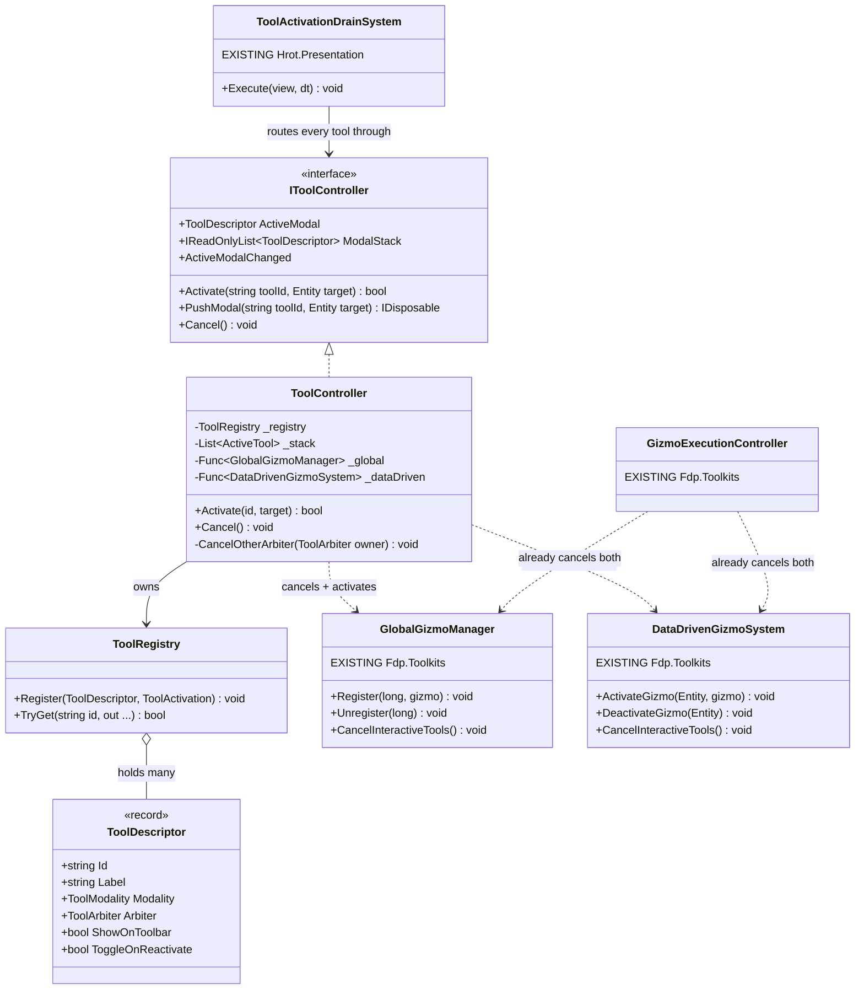
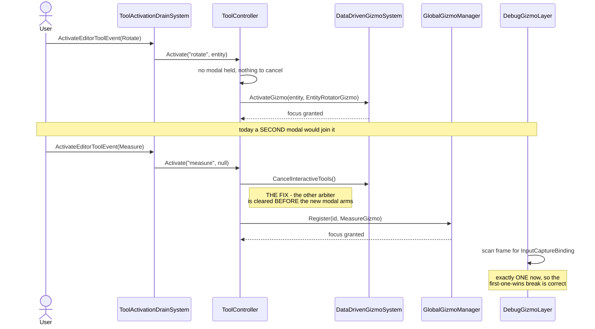

<!--STATUS
state: LIVE
build-state: BUILDING (A1 steps 1-3 + 3b BUILT 2026-09-09 - see 4.7 / 4.7b / 4.7c as-built; 4-6 open)
verified: 2026-09-09 (PREMISE SWEEP - all 13 premises re-tested against source, see 0b; and the RED
  defect REPRODUCED by a headless probe with an inverse-edit red-proof - two exclusive tools hold focus
  at once and ONE mouse event reaches BOTH)
current-answer: 4 (the A1 build) + 4.7/4.7b (the AS-BUILT). Steps 1-3 of Migration are BUILT: the
  ToolController arbitrates, ToolActivationDrainSystem arms every tool through it, and the editor's D-prime
  duplicate (GlobalActionIds.Rotate/EditOverlay/EditRoute) is DELETED. Step 3b moved the arbiter INTO
  MapInteractionPack, so all FIVE hosts (IG, CGF, ReplayBrowser, SimHost, Editor) get one with the full
  tool set, and the D-prime idiom is gone from every production site. Steps 4-6 (the bypassing adapters,
  the toolbar binding, central Escape) and PushModal's suspend/resume are OPEN.
  >>> READ 0b FIRST <<< - the premises SURVIVE, but four moved and three are now WIDER than this
  document says, because CE-051/CE-061/UXI-23-S2b reworked this exact area after the 2026-08-28 scan.
known-rot: the line citations in the body are pre-CE-051 and mostly MOVED. 0b carries the current ones.
  Specifically: the idiom table's "EditorSubsystem.cs:3806-3894" is now the shared ToolActivationDrainSystem;
  "EditorSubsystem.cs:1122-1134" (the two-arbiter construction) is now MapInteractionPack.cs:92-100 and
  therefore structural on FIVE hosts, not one; EditorSpawnAdapter no longer exists (it is the SHARED
  ScenarioSpawnAdapter); and the D-prime duplicate has a SECOND instance on IG that this document never named.
-->
# Feature design — making a tool a thing

> **Design for [UXI-07](UX_Issues.md#uxi-07) 🔴 · drafted 2026-08-10.**
> 📐 **API: [UX_Interaction_API.md](UX_Interaction_API.md) · ✅ Acceptance: [UX_Interaction_UseCases.md](UX_Interaction_UseCases.md)**
> The API contract lives in the first — this doc keeps the
> evidence and the rulings; that one holds the types, the arbitration order and the threading model.
> 📐 **Architecture context: [`DESIGN_Map_Rendering_And_Interaction.md`](../DESIGN_Map_Rendering_And_Interaction.md)** —
> how the tool path sits inside the render/interaction stack, and §4.2's `stateDiagram` of the modal
> stack this issue builds.
> **Status: ❌ NOT-BUILT (design only; Q27 answered) — no `IToolController`/`ToolDescriptor`/modal-stack in source, only fossil comments.**
> This is the first issue in the programme that is **genuinely new architecture**, not adoption of an
> existing seam. Implements [UXR-81](UX_Requirements.md#uxr-81), [UXR-84](UX_Requirements.md#uxr-84).

## 0. Prior art — ❌ **empty, and that is the finding** ([rule 6](UX_Issues.md#rules))

| Searched | Result |
|---|---|
| `ITool` · `ToolDescriptor` · `ToolRegistry` · `ToolState` · `ToolController` · `ActiveTool` | **0 types repo-wide** |
| Anything holding "the current tool" | **nothing** — `IEditorLogic` has no such property (full-file read) |

⚠ **Every other design in this programme adopted a seam that already existed.** This one has none — so
the [seam-law prior](UX_Seam_Inventory.md) is genuinely absent here, and that is *why* it needs an
architect round rather than a recipe.

## 0b. ⭐⭐⭐ PREMISE SWEEP — **`2026-09-09`, all 13 premises re-tested against source**

> ⛔⛔ **Why it was owed.** This document's previous `verified:` date is `2026-08-28`. **After** it,
> `CE-051` *(Axis-C `E3` — the viewport interaction went shared)*, `CE-061` *(Axis-C `E5` — the
> Scenario windows + a CGF spawn adapter)* and `UXI-23` `S2b` *(`MapInteractionPack`)* reworked
> **exactly this area**. ⇒ 🔒 the design's rulings are user rulings and do not decay — ⛔ **but its
> LINE CITATIONS are state claims, and `§M` says those rot.**
>
> ⭐⭐ **VERDICT: the design SURVIVES INTACT — every premise still holds.** ⚠ But **four moved** and
> ⭐⭐⭐ **three are now WIDER than the body says**, in ways that change the migration's economics.

| # | premise | verdict | measured `2026-09-09` |
|--:|---|:--:|---|
| **1** | prior art empty — `ITool`/`ToolDescriptor`/`ToolRegistry`/`ToolController`/`ActiveTool` = 0 types | ✅ **HOLDS** | `search_graph` + grep agree: **0**. ⭐ And the code now **says so deliberately** — `Hrot.Common/Editor/EditorTool.cs` header: *"There is deliberately still no `ITool`/`ToolManager` registry — inventing a registry is not what `E3` is for."* ⇒ `E3` **declined** this scope; it did not absorb it |
| **2** | 🔴 two exclusive-focus arbiters, one bus, no arbitration | ✅ **HOLDS — and is now WIDER** | ⛔⛔ **MOVED and became STRUCTURAL.** The construction is no longer `EditorSubsystem.cs:1122-1134`; it is **`MapInteractionPack.cs:92-100`**, which hands the **same `bus`** to `GlobalGizmoManager` and `DataDrivenGizmoSystem` — ⇒ **on all FIVE hosts, by construction.** ⚠ It was an editor composition accident; it is now a guaranteed property of the shared pack. ⭐ The per-arbiter guards are unchanged: `DataDrivenGizmoSystem.cs:91` · `GlobalGizmoManager.cs:66` |
| **3** | terminal half — first `InputCaptureBinding` wins, no arbitration | ✅ **HOLDS** | `DebugGizmoLayer.cs:121-135` — the loop still `break`s on the first match |
| **4** | exclusivity is only per-`Entity` | ✅ **HOLDS** | `DataDrivenGizmoSystem.cs:74` `_injectedGizmos` is still `Dictionary<Entity, …>` |
| **5** | six activation idioms | ✅ **HOLDS — MOVED** | ⭐ Idioms **A/B/D/E/F migrated wholesale into the shared `ToolActivationDrainSystem`** (`Hrot.Presentation/ScenarioEditor/Systems/`), registered by `ScenarioEditorModule` on **both** Editor and CGF. ⛔ `EditorSubsystem.cs:3806-3894` no longer holds the switch. ⭐⭐ **A real improvement `E3` delivered for free: the drain now REPORTS** *(`Unserviceable(tool, reason)`)* instead of failing silently |
| **6** | 🔴 **D′ — the toggle duplicated via `GlobalActionRegistry`** | ✅ **HOLDS — and there are now TWO instances** | ⛔ **Editor:** `EditorSubsystem.cs:1875-1912` *(`EditOverlay`/`EditRoute`, `HasInjectedGizmo` at `:1879`/`:1898`)* + `:1857` *(`Rotate`, the E/F shape)* — duplicating `ToolActivationDrainSystem.cs:176`. 🔴🔴 **AND IG, which this document never named:** `IgApplication.cs:3167` and `:3199`, the same `HasInjectedGizmo` toggle for `RoutePlan`/`EditablePolyline`, in `ActivateAreaEditingTool`. ⚠⚠ **CORRECTED — an earlier version of this row said *"step 3's blast radius is TWO hosts"*, which is too glib:** 📐 measured, **IG registers no `ScenarioEditorModule` at all** *(the only registrars are `EditorSubsystem.cs:1560`, `CgfSubsystem.cs:1236` and two test harnesses)* ⇒ ⛔ **IG has no shared drain and no `ActivateEditorToolEvent` path**, so its duplicate cannot be *rerouted* — IG must first **adopt** the drain, which is an `E3`-shaped adoption slice, not a step-3 edit. ⇒ ⭐ **step 3 proper is EDITOR-ONLY; IG is a separate, larger item** |
| **6b** | — | ⭐ **PARTIALLY DONE ALREADY** | `GlobalActionIds.Measure` (`:1867`) and `PlaceEntity` (`:1871`) **already publish `ActivateEditorToolEvent`** instead of duplicating ⇒ **2 of 5 action-path routes are converted**; step 3 is the remaining 3 (`Rotate`, `EditOverlay`, `EditRoute`) × 2 hosts |
| **7** | no button can show active state | ✅ **HOLDS — restate the count** | ⛔ *"six bare `ImGui.Button` calls reading no state"* is now inaccurate: `EditorToolbarPanel.DrawContent` has **four TOOL buttons reading no state** *(`Select`, `Place Entity`, `Edit Shape`, `Edit Route`)* plus two **non-tool** buttons, one of which *(the mode toggle)* **does** read state. ⭐⭐ **And step 5 got cheaper:** the panel now has `BuildViewModel` → `EditorToolbarPanelViewModel`, a state projection that did not exist on `2026-08-28` ⇒ `ActiveModal` binds into an existing seam |
| **8** | `Measure`/`Rotate` have no toolbar button | ✅ **HOLDS** | absent from `DrawContent` |
| **9** | `Select` is a dead no-op | ✅ **HOLDS — MOVED** | now `ToolActivationDrainSystem.Execute`'s `case EditorTool.Select: break;` |
| **10** | the enum names four deleted classes | ✅ **HOLDS — MOVED** | the enum moved to `Hrot.Common/Editor/EditorTool.cs` (`CE-051`) and its doc comments **still** name `CreationTool` · `EditTool` · `RouteEditTool` · `MeasureTool` — **all four still 0 declarations** |
| **11** | Escape re-implemented per gizmo | ✅ **HOLDS** | **16 files** handle Escape themselves *(11 in-tree gizmos + `DebugGizmoLayer` + ExtDeps)*. ⚠ The body says *"8 gizmos"* — the true count is higher, so the premise is understated, not overstated |
| **12** | fossils of the deleted stack | ✅ **HOLDS** | `EditorMapPickAdapter.cs:26` still carries the **broken `<see cref="MapCanvas.PopTool"/>`**; `GizmoInteractionProxyTool.cs:16` still says *"optional exit callback instead of `MapCanvas.PopTool()`"* |
| **13** | three bypassing adapters call `Register` directly | ✅ **HOLDS — and step 4 got CHEAPER** | ⭐⭐⭐ **`EditorSpawnAdapter` NO LONGER EXISTS.** It is the **shared `Hrot.Presentation/Adapters/ScenarioSpawnAdapter`**, composed by **both** Editor (`EditorSubsystem.cs:2263`) and CGF (`CgfSubsystem.cs:1400`), still bypassing at `:153`, `:215`, `:271`. ⇒ **converting it once fixes two hosts.** The other two remain editor-private: `EditorMapPickAdapter.cs:73,109,~125` · `EditorZoneAdapter.cs:74` |

### ⭐⭐ Two mechanisms the `§0` prior-art table MISSED — **both are partial building blocks, not substitutes**

| found | what it is | bearing on the design |
|---|---|---|
| ⭐⭐ **`CancelInteractiveTools()` on BOTH arbiters** — `GlobalGizmoManager.cs:96` · `DataDrivenGizmoSystem.cs:124` | cancels the focused gizmo, calls `OnCancel()`, keeps permanent/modeless ones. **Driven from one place**: `GizmoExecutionController.cs:48-49` calls both **when the last terminal disconnects** | ⛔ **NOT a user-facing Escape** and not a stack — so *"no central cancel"* still holds for the user. ⭐⭐ **But `IToolController.Cancel()` should DELEGATE to these rather than invent a third teardown** — they already encode *"cancel the interactive, spare the permanent"*, which is exactly the modal/modeless split `Q27` ruled. 🔒 seam law |
| ⭐⭐ **`DebugGizmoLayer._activeTool`** — a live `GizmoInteractionProxyTool?` (`:28`), created at `:180`/`:187`, self-clears via `onExit`, and **handles Escape at `:266`** | the **frontend** routing tool that `gizmo-input-focus-design.md` §14 promised would survive | ⭐⭐⭐ **§14's proxy tool DID survive — what did not survive is that it is a SINGLE NULLABLE SLOT, not a stack.** ⇒ refines this document's §"the tool stack was deleted": the *routing* half is alive and correct; only the **LIFO depth** is missing. ⛔ Do not re-implement the proxy; the backend `IToolController` supplies the depth the frontend slot cannot |

### 🔴🔴🔴 A **THIRD** ARBITER INSTANCE ON SIMHOST — **found while syncing with the Stride lane, `2026-09-09`** *(hand-off, NOT fixed here)*

⛔⛔ **The design counts TWO arbiters. On SimHost there are THREE — and the extra one is never ticked.**

| # | the instance | on which bus | ticked? |
|---|---|---|:--:|
| ① | the pack's `GlobalGizmoManager` — `SimHostApp.cs:405` *(`= mapInteraction.GlobalManager`)*, holds `LayerControlGizmo` (`:415`), scheduled in the gizmo group (`:470`) | the pack's bus | ✅ |
| ② | the pack's `DataDrivenGizmoSystem` — `SimHostApp.cs:406` | the pack's bus | ✅ |
| 🔴 ③ | **`SimHostVisualization.cs:236` — `new GlobalGizmoManager(_gizmoBuffer!)`, constructed UNCONDITIONALLY and with NO bus** | ⛔ falls back to the **world** bus | ⛔ **NO — grep for `_globalGizmoManager` in that file returns exactly `:93`, `:236`, `:268`; nothing registers or `Execute`s it** |

⇒ 🔴 **Its ONLY use is `:268`** — handed to `CanvasMapPickAdapter` as `globalGizmoManager:`. ⇒ ⭐⭐ **SimHost's map-pick modal gizmos are registered on an arbiter that never runs**, so they cannot draw and cannot receive routed events.

📐 **And exactly one host does this** — the other two pass the pack's manager, correctly:

| host | what `CanvasMapPickAdapter` gets |
|---|---|
| IG — `IgApplication.cs:507` | ✅ `_globalGizmoManager`, the pack's |
| CGF — `CgfSubsystem.cs:1552` | ✅ `_cgfGizmoManager`, the pack's |
| 🔴 **SimHost — `SimHostVisualization.cs:268`** | ⛔ **its own, private, never-ticked one** |

🔒 **This is the SILENT-DEFAULT pattern verbatim** *(`CLAUDE.md`: "a production caller that HAS a dependency must PASS it")*: `SimHostApp` **holds** the pack's manager at `:405` and passes `gizmoBuffer`, `gizmoSystem` **and** `interactionBus` into `Initialize` (`:568-570`) — ⛔ **but not the manager, because `Initialize` has no parameter for it.** ⇒ the fix is one parameter plus a `??`, exactly like the other three.

⚠⚠ **WHY IT IS URGENT AND WHOSE IT IS:** 📐 `StrideNodeShell.cs:614` constructs `SimHostVisualization` and reuses it **WHOLE** *(`R-S18`, the mode-2 operator window)* ⇒ **the Stride mode-2 node inherits this defect**, and that lane is building on it right now. ⛔ **Deliberately NOT fixed in this sweep** — `Hrot.SimHost` + `Stride/` is the Windows lane's live area, and rule 6 says the ids are theirs to allocate. ⭐ **Handed over, with the measurement above.**

### ⭐ What the sweep does NOT change

⭐ **Every `Q27` ruling stands** — they are user rulings, answered `2026-08-10` directly, and nothing measured
here touches them. ⭐ The **migration's 7 steps stand as written**; only their sizing moves: **step 3 doubles**
*(two hosts)*, **step 4 shrinks** *(the spawn adapter is now one shared conversion serving two hosts)*, and
**step 5 gets a seam it did not have** *(`EditorToolbarPanelViewModel`)*.

### 🔴🔴🔴 THE DEFECT IS **REPRODUCED** — *not theoretical* *(headless probe, `2026-09-09`)*

⚠⚠ **An earlier version of this section said the symptom was NOT measured. That is now SUPERSEDED — it was
measured, and it reproduces.**

📐 **A throwaway headless probe wired exactly as `MapInteractionPack.Build` does** *(one `DebugPrimitiveBuffer`,
one `FdpEventBus`, `GlobalGizmoManager` + `DataDrivenGizmoSystem` both given that bus)*, then: activate a
modal on the DataDriven side *(the `Rotate`/`Edit`/`Route` shape)*, activate a modal on the Global side
*(the `Measure`/picker/spawn shape)*, publish **ONE** `GizmoMouseEvent`, tick both.

| assertion | result |
|---|:--:|
| both tools report `IsFocused` — two "exclusive" holders at once | ✅ **confirmed** |
| the single mouse event reaches **both** — `MouseCount == 1` on each | 🔴 **confirmed** |
| ⭐ **inverse-edit red-proof** — flip *only* the Global tool's `RequiresExclusiveFocus` to `false`: the DataDriven tool still gets its input, the Global one gets **0** | ✅ **confirmed** ⇒ the probe measures focus routing, not an artefact |

⇒ 🔒 **`UXI-07`'s 🔴 severity is EARNED, and it is now a property of SHARED code on all five hosts.**

⚠⚠ **One probe bug worth recording, because it would silently fake a clean result:** `FdpEventBus.Publish`
is **double-buffered** — *"visible in the next frame (after `SwapBuffers`)"* (`FdpEventBus.cs:30`). The first
probe omitted `bus.SwapBuffers()` and both counters read **0**, which looks exactly like *"something
arbitrates."* ⛔ **Any future rail here must swap before ticking.**

⭐ **The probe was NOT kept** — it was a parallel test class, and `R-142` ④ says a kept rail belongs **inside
the feature's own suite** (`Fdp.Toolkits.Tests/Diagnostics/Gizmos/GizmoHeadlessTests.cs`, the `GZH-` series).
⇒ **it should land there as the hazard rail of whichever slice fixes this**, phrased to go GREEN when one
arbiter exists — ⛔ not as a rail that asserts today's duplicate delivery forever.

### 🔴🔴🔴 AND THE RAW-INPUT HALF IS **DETERMINISTIC**, not arbitrary — **the Global side ALWAYS wins** *(probe, `2026-09-09`)*

⚠⚠ **This CORRECTS the body's §"the TERMINAL half".** That section says *"whichever system runs earlier in
the group"* captures raw input, and frames it as **arbitrary**. 📐 **Measured: it is FIXED, on every host.**

📐 **The probe** *(same pack wiring, then read the `DebugPrimitiveBuffer` frame)*:

| assertion | result |
|---|:--:|
| one frame carries **TWO** `InputCaptureBinding` primitives | ✅ confirmed |
| the **FIRST** one — the only one the terminal reads before its `break` — is the **Global** tool's | ✅ confirmed |
| ⭐ **reverse the ACTIVATION order** *(arm the Global tool first instead)* — outcome **unchanged** | ✅ confirmed |

⇒ 🔒 **The winner is decided by the pack's fixed group order — `MapInteractionPack.cs:121-122` builds
`("GizmoExecution", globalManager, dataDriven, stateless, selfCheck)` and `TogglablePostSimulationGroup`
executes `_innerSystems` in order** *(`:82-83`)* ⇒ `GlobalGizmoManager` emits its binding first, **always**.
⛔ **Not a race, and not activation-dependent: a structural, reproducible bias toward the Global arbiter on
all five hosts.**

#### ⭐⭐ THE SPLIT, STATED CONCRETELY — **which tools sit on which side**

| arbiter | the tools on it | what it gets when both are armed |
|---|---|---|
| **`GlobalGizmoManager`** | `MeasureGizmo` · `EntityPlacementGizmo` · `PointSequenceGizmo` · `EntityPickerGizmo` · `FdpLocationPickerGizmo` · `LocationPickerGizmo` · `ObstaclePlacementGizmo` · `ModalBoxSelectionGizmo` | ⭐ **raw input AND typed events** — it feels like it works |
| **`DataDrivenGizmoSystem`** *(entity-scoped)* | `EntityRotatorGizmo` · `VertexEditGizmo` · `RouteWaypointGizmo` | 🔴 **typed events ONLY, never the raw stream** — it still MUTATES, but its direct manipulation is dead |

⇒ ⭐⭐ **The derived symptom:** arm `Rotate`/`Edit Shape`/`Edit Route` on an entity, then start `Measure`, a
picker, or entity placement — **the picker captures the hardware, and the entity tool keeps acting on the
typed mouse events at the same time.** ⇒ a stray rotation / vertex drag *while measuring or placing*, and an
entity tool that feels half-dead if armed second.

⛔⛔ **Stated honestly — this last paragraph is DERIVED from the two measured mechanisms, NOT observed on
screen.** ⭐ What is measured: two focus holders · one event reaching both · two capture bindings · the
Global one always first. ⚠ **What is NOT measured: the on-screen presentation.** 📄 Closing that needs the
real thing — `RUNBOOK_Cluster_Debugging_Over_Http.md`, the `T3` lane — and ⭐ **it does not change the fix**,
only how the bug is described to a user.

**But two *partial* mechanisms exist**, and they are the problem as much as the starting point:

| | Tracks | Scope |
|---|---|---|
| `DataDrivenGizmoSystem._focusedGizmo` (`:65`) + `_injectedGizmos` (`:74`) | which gizmo has raw input; per-`Entity` injections | entity-bound tools |
| `GlobalGizmoManager._focusedGizmo` (`:31`) + `_activeGizmos` (`:30`) | the same, independently | non-entity tools |

## 🔴 The defect that changes this issue's severity

**Two exclusive-focus arbiters share one event bus, and nothing arbitrates between them.**

```csharp
// EditorSubsystem.cs:1122-1134 — same bus into both
var interactionBus = new FdpEventBus();
_editorDataDrivenGizmoSystem = new DataDrivenGizmoSystem(..., interactionBus: interactionBus, ...);
_globalGizmoManager          = new GlobalGizmoManager(_gizmoBuffer, interactionBus, ...);
```

Each guards exclusivity **only within itself** — `DataDrivenGizmoSystem.cs:91`:
`if ((gizmo.RequiresExclusiveFocus || gizmo.WantsRawInput) && _focusedGizmo == null)`.

`FdpEventBus.Read<T>()` is a non-destructive `ReadOnlySpan<T>`, so both systems read **the same**
`GizmoMouseEvent`/`GizmoKeyEvent` stream every frame.

> ⇒ **`Rotate` (DataDriven) and `Measure` (GlobalGizmoManager) can both hold "exclusive" focus at once
> and both act on the same drag.** Not a smell — a correctness defect. 🔴

#### ⭐⭐ ADDED `2026-08-28` — **the TERMINAL half of the same defect: raw-input capture is decided by EMISSION ORDER**

📐 The section above is the **bus** side *(both systems ACT on the same typed stream)*. ⚠ **The raw-input
side is different, and worse in a quieter way.** Each arbiter also emits an `InputCaptureBinding` for its
own focus holder — `GlobalGizmoManager:138`, `DataDrivenGizmoSystem:334,373` — and the terminal resolves it
like this *(`GizmoMap.Presentation/Layers/DebugGizmoLayer.cs:118-134`)*:

```csharp
for (int i = 0; i < primitives.Length; i++) {
    if (prim.Shape != DebugPrimitiveShape.InputCaptureBinding) continue;
    if ((prim.ConditionMask & 1u) != 0) exclusiveAnchorId = prim.StructNetworkId;  // suppress hit-testing
    if ((prim.ConditionMask & 2u) != 0) routeRawInput      = true;                 // all raw HW to me
    captureToken = …;
    break;                       // 🔴 FIRST ONE WINS. No arbitration, no report.
}
```

⇒ 🔒 **When both arbiters hold "exclusive" focus, the one whose primitive lands FIRST IN THE BUFFER captures
raw input** — i.e. **whichever system runs earlier in the group**. ⛔ The other one still receives the typed
events *(the defect above)* but never the raw stream. ⇒ ⚠ **the two halves of one tool's input can end up
split across two tools**, and nothing anywhere says so.

📌 **The design predicted exactly this** *(`gizmo-input-focus-design.md` §6.2)*: *"If two tools
simultaneously emitted `InputCaptureBinding(Exclusive=true)`, the terminal would have no honest way to
choose. **We prevent that situation entirely on the backend**"* — ⛔ **and the prevention is what is
missing**, because there are two backends-within-the-backend.

⭐⭐ **Consequence for `A1`:** the single `IToolController` fixes BOTH halves at once — one arbiter means one
capture binding per frame, so the terminal's `break` becomes correct rather than arbitrary.

**And exclusivity is narrower still than that:** `_injectedGizmos` is keyed **per `Entity`**, so
activating `Rotate` on entity A then `Edit` on entity B leaves **both** alive.

## The rest of the evidence

### Six activation idioms — and two of them for the same tools in one class

| | Idiom | Tools |
|---|---|---|
| A | **No-op case** — `case Select: break;` (`EditorSubsystem.cs:3814-3816`) | `Select` |
| B | Enum → `ActivateEditorToolEvent` → switch (`EditorApplication.cs:189`, drained `:3806-3894`) | all 6 |
| C | Delegate to an adapter that calls `GlobalGizmoManager.Register` (`EditorSpawnAdapter.cs:81-150`) | `Spawn` |
| D | **Toggle** keyed on `HasInjectedGizmo` (`:3823-3869`) | `Edit`, `Route` |
| **D′** | 🔴 **the same toggle, duplicated verbatim**, reached via `GlobalActionRegistry` instead (`:1160-1197`) | `Edit`, `Route` **again** |
| E/F | Direct inject / bare `Register`, **no toggle guard** (`:3871-3893`, duplicated at `:1143-1151`) | `Measure`, `Rotate` |

⇒ `Edit`, `Route` and `Rotate` are each reachable through **two independent pipelines inside
`EditorSubsystem.cs`** — the toolbar's event path and the context menu's action path — with the logic
copy-pasted between them.

### Consequences a user can see

| | Evidence |
|---|---|
| **No button can show active state** — and *cannot in principle* | `EditorToolbarPanel.DrawContent` is six bare `ImGui.Button` calls reading no state ([UXR-84](UX_Requirements.md#uxr-84)) |
| **`Measure` and `Rotate` have no toolbar button at all** | reachable only via context menu |
| **`Select` is a dead button** | the enum's only no-op case |
| **Repeat-click means different things per tool** | `Edit`/`Route` toggle off; `Measure`/`Rotate` do not — a genuine inconsistency, not a reporting artefact |
| **Escape is re-implemented in 8 gizmos** | `EntityRotatorGizmo.cs:98`, `VertexEditGizmo.cs:184`, `RouteWaypointGizmo.cs:197`, `MeasureGizmo.cs:149`, +4. No central cancel, because there is no central state |
| **No keyboard shortcut activates any tool** | only `Ctrl+O`/`Ctrl+N` exist, for assets |

### The vocabulary is a fossil, and the tools are scattered

`EditorTool`'s own doc comments name `CreationTool`, `EditTool`, `RouteEditTool`, `MeasureTool` —
**all four have zero declarations.** PACK2-E002 deleted them and converted the behaviour to gizmos
([Correction 11](UX_Tasks_Detail.md#corrections)). The enum is the surviving vocabulary of a deleted
architecture, and it is still the toolbar's contract.

| Tool gizmo | Lives in | Adopted by |
|---|---|---|
| `MeasureGizmo` · `RouteWaypointGizmo` · `VertexEditGizmo` | `Hrot.Presentation/ScenarioEditor/Gizmos/` | Editor, IG |
| **`EntityRotatorGizmo`** | ✅ **`Hrot.Presentation/ScenarioEditor/Gizmos/`** — ⚠⚠ **CORRECTED `2026-08-28`: this row said `Hrot.SimHost/Gizmos/` and that is STALE.** 📐 Measured: the only other copy is the `GizmoMap.Example` test bed. 📌 It was moved by *"AX item 4 — make `EntityRotatorGizmo` subsystem-agnostic"*, and the row was never updated ⇒ 🔒 **§M's rule exactly: a STATE CLAIM rots while the DECISION around it does not** | Editor, SimHost, **CGF** |

⇒ Editor and CGF depend on a tool that lives **inside the SimHost subsystem**.

## The resolved shape — ✅ all five Q27 questions ruled by the user, 2026-08-10

### ⭐ `gizmo ≠ tool` — and the distinction is **already encoded**, just not enforced

> **User:** *"Many tools are modal per subsystem, i.e. up to one currently active tool requiring focus —
> like rotate entity. But a tool can be modeless, i.e. permanent until turned off — for example one that
> renders an info box for a given entity with its own buttons. Note a gizmo is not equal to a tool: some
> gizmos are stateless, showing status per entity (health bar); many such can be active per entity."*

| Category | Existing encoding | Live examples | How many active |
|---|---|---|---|
| **Not a tool** — status draw | `IStatelessGizmo { void Draw(); }` | `RouteGizmo`, `RubberBandGizmo`, health bars | many, per entity |
| **Modeless tool** | `IEntityStatefulGizmo`, `RequiresExclusiveFocus => false` | `LayerControlGizmo`, `EntityDragGizmo` | several, concurrently |
| **Modal tool** | `IEntityStatefulGizmo`, `RequiresExclusiveFocus => true` | `EntityRotatorGizmo`, `EntityPickerGizmo`, `PointSequenceGizmo`, `MeasureGizmo` | 🔒 **at most one per subsystem** |

`RequiresExclusiveFocus` is declared on `IGizmoInteractionHandler:19`. ⇒ **The taxonomy exists; the
enforcement does not** — each engine consults the flag only within itself, which is the 🔴 defect above.

### The descriptor — registration-time flags, per the ruling

> **User:** *"Tool handling should be defined by registration-time flags. No less flexibility than now."*
> And: *"Tools do not necessarily need to be shown on the toolbar — this must be optional."*

```csharp
public enum ToolModality { Modal, Modeless }

public sealed record ToolDescriptor(
    string       Id,                          // its own vocabulary — NOT a GlobalActionId
    string       Label,
    ToolModality Modality,
    bool         ShowOnToolbar       = false, // 🔒 optional by default (user ruling)
    bool         ToggleOnReactivate  = false);// 🔒 re-activating does NOT cancel unless flagged
```

> ### ⚠ Corrected 2026-08-10 — `SurvivesActions` was on the wrong object
>
> An earlier revision put `SurvivesActions` on the **tool**. **Wrong.**
>
> > **User:** *"`SurvivesActions` can't be a tool property — it must be driven by **focus changes only**.
> > Actions might need flagging if they **steal focus**."*
>
> ⇒ the flag moves to the **action**, because the action is what causes the effect:
>
> ```csharp
> // EntityActionDescriptor — UXI-03. Additive.
> bool CancelsModalTool = false;   // true ⇒ dispatching it clears the modal stack
> ```
>
> ⚠ **Renamed from `StealsFocus` 2026-08-10** — *"`StealsFocus` is now a misleading name; the flag should
> actually mean **cancel any running modal tool**"* (user). It never described focus acquisition; it
> described a consequence.
>
> 🔒 **Cross-issue:** this adds one field to
> [UXI-03](UX_Feature_Entity_Action_Vocabulary.md)'s descriptor. Recorded there too.
> [Corrections 20](UX_Tasks_Detail.md#corrections).

### The controller — one per subsystem (B1)

```csharp
public interface IToolController
{
    ToolDescriptor?                     ActiveModal    { get; }   // = top of the stack, or null
    IReadOnlyList<ToolDescriptor>       ModalStack     { get; }   // bottom → top
    IReadOnlyCollection<ToolDescriptor> ActiveModeless { get; }   // several, unaffected by the stack

    void        Activate (string toolId, Entity? target = null);  // REPLACES the top
    IDisposable PushModal(string toolId, Entity? target = null);  // SUSPENDS the top; dispose pops & resumes
    void        Cancel();                                         // pops ONE level

    event Action<ToolDescriptor?> ActiveModalChanged;             // toolbar/status bind here
}
```

## ⭐ The modal tool **stack** — user requirement, 2026-08-10

> **User:** *"Sometimes in the middle of editing one thing we might need to temporarily jump to another
> and then back. A tool stack. I bet it was implemented."*

### ✅ It was — and it was deleted with the rest of the tool model

| Fossil | Evidence |
|---|---|
| `<see cref="MapCanvas.PopTool"/>` in a live doc comment — **a broken cref**; the member does not exist | `EditorMapPickAdapter.cs:26` |
| *"Uses an optional exit callback instead of `MapCanvas.PopTool()`"* | `GizmoInteractionProxyTool.cs:16` |
| `MapCanvas.KeyboardConsumedByTool` — a property named for the deleted model | `MapCanvas.cs:69` |
| *"tool-emitted primitives (written during `canvas.Update → ActiveTool.Draw`)"* | `EditorSubsystem.cs:1613` |

⚠ **Not recoverable from git** — `PopTool` appears only in comments even at the squashed import commit
(`e999566`), so the implementation lived in an ancestor repo. **The comments are the only survivors**, and
they are the fourth fossil of the same deleted architecture ([Correction 11](UX_Tasks_Detail.md#corrections)).

#### ⭐⭐ ADDED `2026-08-28` — **the replacement design EXPECTED the stack to survive** *(answers "intentional or accident?")*

📄 **[`docs/designs/gizmos-1/gizmo-input-focus-design.md`](../designs/gizmos-1/gizmo-input-focus-design.md)** —
the design of the very mechanism that replaced the tool model — **separates the two questions, and answers
them differently**:

| what | the design says | verdict |
|---|---|---|
| **single EXCLUSIVE focus on the backend** | §6.2: *"If two tools simultaneously emitted `InputCaptureBinding(Exclusive=true)`, the terminal would have no honest way to choose. **We prevent that situation entirely on the backend**"* — one `ActiveGlobalGizmo.ActiveInstance` slot | ✅ **INTENTIONAL, with a stated reason** |
| ⭐⭐⭐ **the frontend TOOL STACK** | §14: *"**The frontend keeps its tool stack for routing**, but stripped of business logic — the proxy tool remains as a generic input capturer that **pops itself** when the backend stops emitting the capture binding. No semantic decisions in the stack."* | 🔴 **the design assumed it would STILL BE THERE** |

⇒ 🔒 **So the loss was NOT a decision.** ⛔ Nothing in this repo records dropping the stack; the design of its
replacement **explicitly planned around keeping it**, stripped of semantics but present for routing.
⚠ **Stated fairly:** that document is marked *"Design proposal"*, and the deletion happened in an **ancestor
repo** — so this is *"no decision record exists, and the nearest intent says keep it"*, ⛔ **not** *"someone
decided to remove it."*

📌 **`R-137`** *(user, `2026-08-28`: unification may not cost a feature; if it does, put it back as
configuration)* **is the general form of what this section found on `2026-08-10`** — ⭐ the same disease,
recorded twice, eighteen days apart.

### 🔴 What replaced it is flat — and the "come back" is only half-implemented

`EditorMapPickAdapter`'s own comment still describes the old model — *"push tool → wire callbacks →
return `tcs.Task`; the cancellation handler calls `MapCanvas.PopTool`"* — but all three pick methods now
just call `_globalGizmoManager.Register(id, gizmo)`. **No LIFO, nothing saved, nothing restored.**

| Half of "jump away and back" | State |
|---|---|
| The **caller's control flow** resumes | ✅ `TaskCompletionSource` + `ct.Register` — works today |
| The **previous tool** resumes | ❌ **nothing restores it.** Interrupt a half-drawn route to pick a point and the route editor is not brought back |

### 🔑 Suspend ≠ deactivate — and the mechanism already exists

Both teardown paths **destroy** the gizmo:

```csharp
DataDrivenGizmoSystem.DeactivateGizmo(e)   // :102-114 → SetFocus(false); gizmo.Dispose();
GlobalGizmoManager.Unregister(id)          // :78-90   → SetFocus(false); gizmo.Dispose();
```

⭐ **But `SetFocus(false)` is a separate call that already precedes the `Dispose()`.** So *suspend* needs
no new gizmo API — it is **`SetFocus(false)` without the `Dispose()`**. Nothing calls it that way today;
that is the entire missing capability.

### Semantics

| | `Activate` | `PushModal` |
|---|---|---|
| **Current top** | cancelled and **disposed** | **suspended** — alive, unfocused, state intact |
| **On completion** | — | popped; the tool beneath **resumes with its state** |
| **Intent** | a deliberate switch — toolbar, menu | an **interruption** — pick a point, pick an entity |
| **Escape** | cancels it | pops **one** level, revealing the tool beneath |

⇒ **The caller chooses**, because only the caller knows whether it is switching or interrupting. The
descriptor cannot express that.

### It fits the existing async pattern exactly

```csharp
using var _ = tools.PushModal(ToolIds.EntityPicker);
int netId = await _pick.PickEntityAsync(ct);
// dispose → pop → the route editor beneath resumes, half-drawn route intact
```

That is today's `ct.Register(… Unregister …)` cleanup **plus the restore it is missing** — and it is what
*Mark Target for N Units* (`async void`, awaits an interactive pick) needs to stop stranding whatever was
running.

### ⭐ The stack and the focus rule are the same mechanism

The [B ruling](Architect_Question_27_Tool_Model.md#answers) requires an **unfocused subsystem's** modal
tool to stay armed but consume no input. That is *suspension* — of the whole stack rather than one
frame. 🔒 **One implementation serves both**, which is the strongest argument that suspend/resume belongs
in the controller rather than in each gizmo.

### ✅ Resolved — cancel is declarable, **suspend is not**

> **User:** *"Maybe another flag to just suspend the tool? But when to resume the tool again? The action
> handler would need to be async and resume on finish."*

**That question answers itself, and the asymmetry is the design:**

| | Expressible as a flag? | Why |
|---|:--:|---|
| **Cancel** | ✅ yes | a **point event**. Dispatch happens, the stack clears, nothing is owed afterwards |
| **Suspend** | ❌ **no** | it needs a matching **resume**, and only the handler knows when its work is done. A flag has no end |

🔒 **So there is no suspend flag.** Suspension is **scoped, not declared** — the handler takes it and
gives it back:

```csharp
// declarative: the descriptor says so, the handler need not touch the controller
new EntityActionDescriptor(..., CancelsModalTool: true)

// scoped: no flag; the handler owns the suspension for exactly as long as it needs it
async Task Execute(EntityActionContext ctx) {
    using var _ = ctx.Tools.PushModal(ToolIds.LocationPicker);
    var pt = await ctx.Pick.PickLocationAsync(ctx.Cancellation);
    ...
}   // dispose → pop → the suspended tool resumes
```

⇒ **`await` *is* the resume point.** The user's own objection — *"the handler would need to be async"* —
is the mechanism, not an obstacle.

> ### ⭐ And this settles the "is the flag redundant?" question I raised last turn — **it is not**
>
> I suggested `StealsFocus` might be redundant because focus transfer is observable when a handler calls
> `PushModal`. **Wrong for the cancel case:** *Delete entity* fired while a route editor runs must cancel
> that editor, yet its handler **never touches the controller** — it just deletes. Only a declaration can
> express that. ⇒ the two mechanisms are **complementary, not alternatives**:
>
> | | Handler touches the controller? |
> |---|---|
> | `CancelsModalTool` | **no** — the action invalidates the interaction from outside |
> | `PushModal` scope | **yes** — the handler takes over the interaction and returns it |

⚠ **`CancelsModalTool` clears the *whole* modal stack**, not just the top. A flag cannot express "cancel
two levels", and the honest reading is that the action asserts the whole interaction context is stale —
resuming a route editor beneath a popped picker, on an entity the action just deleted, would be worse.

### 🔗 Action concurrency lives in [UXI-03](UX_Feature_Entity_Action_Vocabulary.md#1b-concurrency--borrowed-not-invented)

Async actions can overlap each other, which is a **dispatch** question, not a tool question. Resolved
there by borrowing established models — AutoCAD transparent commands, Blender modal operators, Qt
modality levels, the reactive merge/switch/exhaust/concat set — rather than inventing flags. ⭐ Notably,
an action with `CancelsModalTool = false` **is** AutoCAD's *transparent command*, arrived at
independently.

### ⭐ A second, independent reason `execute` must return `Task`

[Q26-B](Architect_Question_26_Entity_Action_Model.md) already wanted it so the host can observe failure,
closing [UXI-17](UX_Issues.md#uxi-17)'s two `async void` handlers. **The stack adds a second reason:
without `await`, there is no resume point.** Two unrelated arguments converging on one signature is the
strongest case in this design.

### ⚠ Two sub-questions the stack raises

| | |
|---|---|
| **Does a suspended tool still draw?** | Lean **yes — draw, do not interact.** A half-drawn route that vanishes while you pick a point, then reappears, reads as a bug; leaving it visible is what makes "come back" legible |
| **Is depth bounded?** | Nothing needs more than 2 today (tool → picker). Lean: no hard limit, but **log** beyond 3 — an unbounded stack is a leak, not a feature |


**Rules, each traceable to a ruling:**

| Rule | Source |
|---|---|
| ⭐ **Focus is the only currency.** A modal tool holds focus; whatever takes focus displaces it | user, 2026-08-10 — *"driven by focus changes only"* |
| Activating a modal tool takes focus ⇒ cancels the current modal tool | C — *"up to one currently active tool requiring focus"* |
| **Re-activating the current modal tool does NOT cancel it** — no-op, or re-target when a different target is supplied. Toggle only if `ToggleOnReactivate` | 🔒 user, 2026-08-10 — *"if toggle behaviour is required it must be set via flag"* |
| An action cancels the modal tool **only if it is marked `StealsFocus`** — a *"recenter map"* shortcut fired mid-tool must leave the tool armed | 🔒 user, 2026-08-10 |
| Modeless tools coexist and toggle independently | C — *"permanent until turned off"* |
| Stateless gizmos are untouched | C — *"a gizmo is not equal to a tool"* |
| **An action activates a tool; a tool is not an action** | D — two vocabularies, one relationship |
| Escape is centralised **for modal tools**; gizmos keep their own cleanup | E — *"centralize for modal tools, keep local where necessary"* |
| 🔒 An **unfocused** subsystem's modal tool stays armed but consumes no input | B — *"perspective switch often means focus switch to another subsystem"* |

### ✅ No sub-decisions left

The previous open item (`SurvivesActions`'s default) is **void** — the flag moved to the action and its
default is `false`: an action leaves the active modal tool alone unless it declares that it steals focus.
That is both the safe default and the one that preserves today's behaviour, so the dilemma disappears.

### A1 without A3 — the condition

> **User:** *"A1 if doable without the A3 intermezzo, but no problem with A3 first if it helps."*

**A1 alone fixes the 🔴 defect *iff* every modal activation routes through the controller.** The bypass
routes are `EditorMapPickAdapter`, `EditorZoneAdapter` and `EditorSpawnAdapter`, which call
`GlobalGizmoManager.Register` directly — and their gizmos are `RequiresExclusiveFocus => true`, i.e.
genuinely modal. ⇒ **Convert those in the same change and A3 is unnecessary. If they cannot be, do A3
first**, because until then a bypassing picker can still fight the controller for the same drag.

### What the toolbar becomes

`ActiveModal` + `ActiveModalChanged` make [UXR-84](UX_Requirements.md#uxr-84) fall out — but only for
tools that opted in via `ShowOnToolbar`. ⇒ **`Select` becomes the null modal tool** (a real state, not a
dead case), and `Measure`/`Rotate` may stay button-less by choice rather than by omission.

## 4. ⭐⭐⭐ `A1` — THE BUILD: **ONE ARBITER, AND IT DELEGATES RATHER THAN REPLACES** *(`2026-09-09`; `build-state: READY-TO-BUILD`)*

> 🔒 **Why now, and it is not my reason — it is a MEASUREMENT from the Windows lane.** `CE-254` tried to
> hand `CanvasMapPickAdapter` the pack's live `GlobalGizmoManager` on SimHost and **it broke
> `hill-attack-close`**: baseline `1007 t=34 / 1006 t=44`; with the live manager, twice, both hostiles
> either stalled at `hp=25` for 140+ s or took no damage. ⇒ ⭐⭐ **the two-arbiter defect is no longer
> latent — it is what stops a real fix from landing**, and closing it is the precondition for `CE-254`.

### 4.1 📐 INVENTORY — `search_graph(name_pattern=".*(GizmoManager|GizmoSystem|GizmoExecutionController|InteractionHost|FocusHolder).*", label="Class")` → **total 12**

| production class | file | in-degree | holds focus? |
|---|---|:--:|:--:|
| `GlobalGizmoManager` | `Fdp.Toolkits/Diagnostics/Gizmos/Systems/` | 13 | ✅ `_focusedGizmo` |
| `DataDrivenGizmoSystem` | same | 9 | ✅ `_focusedGizmo` |
| `StatelessGizmoSystem` | same | 9 | ⛔ no |
| `GizmoExecutionController` | `Fdp.Toolkits/Diagnostics/Gizmos/` | 4 | ⛔ drives both on teardown |
| ⚠ `BehaviorGizmoManagerSystem` | `…/Systems/` | **0** | ⛔ **no focus code at all** |

⇒ ⭐⭐ **EXACTLY TWO ARBITERS — confirmed, not assumed.** `BehaviorGizmoManagerSystem` looked like a third
and is not: no `RequiresExclusiveFocus`, no `_focusedGizmo`, no `SetFocus`, no `InputCaptureBinding`. It
manages behaviour-bound gizmo *lifecycle*. ⚠ **It also has ZERO production callers** despite carrying
`[UpdateInPhase(PostSimulation)]` — recorded, ⛔ **not proposed for deletion**: *"unreferenced is not
unintentional"* needs a corpus search first, and it does not block this slice.

### 4.2 ⭐⭐⭐ THE DESIGN CALL — **`Cancel()` DELEGATES to `CancelInteractiveTools()`; it does NOT invent a third teardown**

📐 Both arbiters already expose `CancelInteractiveTools()` (`GlobalGizmoManager.cs:96` ·
`DataDrivenGizmoSystem.cs:124`), already driven from ONE place (`GizmoExecutionController.cs:48-49`), and
they already encode *"cancel the interactive, spare the permanent"* — ⭐ **which IS `Q27`'s modal/modeless
split, written in code before the ruling existed.** 🔒 Seam law: the controller **adopts** that, it does not
duplicate it. ⛔ A third teardown path would be the exact disease this issue exists to cure.

### 4.3 🔒 THE SAFETY PROPERTY THAT PROTECTS `hill-attack-close`

⭐⭐⭐ **Nothing changes when only ONE modal is active — which is every case that works today.** The
controller only acts when a SECOND modal would take focus. ⇒ ⛔ this slice makes nothing newly live; it
makes concurrency *impossible*. **That is precisely what `CE-254` needs before it can wire the pick adapter.**

### 4.4 ⭐⭐ THE CLASS DIAGRAM *(existing classes carry their file; obligation ②)*



### 4.5 ⭐⭐ THE SEQUENCE — **the defect, and where it dies**



### 4.6 ⭐ ITEMS

| # | item | gate |
|--:|---|---|
| **1** | `ToolModality` · `ToolArbiter` · `ToolDescriptor` · `ToolRegistry` · `IToolController` · `ToolController` in `Hrot.Presentation/ScenarioEditor/Tools/` *(namespace `Hrot.ScenarioEditor.Tools`, beside `MapInteractionPack`)*; register the six `EditorTool` values | nothing calls it yet |
| **2** | `ToolActivationDrainSystem` routes every arm through `IToolController` | every tool behaves as today |
| **3** | the editor's action path (`GlobalActionIds.Rotate/EditOverlay/EditRoute`) routes through it — 🔴 **deletes the `D′` duplicate** | context-menu activation identical |
| **4** | ⭐⭐ **the rails, INTO `GizmoHeadlessTests` (`GZH-` series)** per `R-142` — ⛔ not a parallel class: ① two modals cannot both hold focus ② exactly ONE `InputCaptureBinding` per frame ③ inverse-edit red-proof | the reproduced defect goes green |

### 4.7 🔴🔴🔴 AS-BUILT — **THE FIRST RAILS WERE VACUOUS, AND THE RED-PROOF IS WHAT CAUGHT IT** *(obligation ⑤, `2026-09-09`)*

📐 **Measured.** The first draft armed BOTH tools **through the controller**, then deleted
`CancelOtherArbiter` to red-proof it — and **all seven rails still PASSED.**

⭐⭐ **The reason is the valuable part:** `CancelActiveModalWithoutNotify()` already tears the previous
modal down through **its own** arbiter when the stack pops. ⇒ with both tools registered, the cross-cancel
is **redundant** and the rails proved nothing.

⭐⭐⭐ **`CancelOtherArbiter` earns its keep in exactly ONE situation: the other arbiter holds a modal the
controller DID NOT ARM.** ⛔ That is not hypothetical — it is `EditorMapPickAdapter`, `EditorZoneAdapter`
and `ScenarioSpawnAdapter`, which call `GlobalGizmoManager.Register` directly and are **not converted in
this slice**. ⇒ the rails now simulate that bypass, and the re-run red-proof is clean:

| | with the fix | fix removed |
|---|:--:|:--:|
| `ABypassingModalLosesFocusWhenAToolArms` | ✅ | 🔴 |
| `OneInputReachesOnlyTheActiveTool` | ✅ | 🔴 |
| `ExactlyOneInputCaptureBindingPerFrame` | ✅ | 🔴 |
| the other four *(modeless survival, reporting, toggle, `PushModal` refusal)* | ✅ | ✅ *(correctly unaffected)* |

#### ⚠⚠ SECOND CORRECTION — **`ToolActivation` returns THREE outcomes, not a `bool`** *(same day, driven by reading the drain)*

📐 **Measured in `ToolActivationDrainSystem`:** its `Edit`/`Route` arms **toggle** — `ToggleEntityGizmo:176`
calls `DeactivateGizmo` and returns when a gizmo is already injected on that entity. ⇒ ⛔ a `bool` cannot
express it: **`false` would make the controller cry *unserviceable* and mislead the operator; `true` would
leave a dismissed tool on the modal stack.** ⭐ Hence
`ToolActivationOutcome { Armed, Dismissed, Unserviceable }`.

⛔⛔ **And the toggle is PER-ENTITY, not per-descriptor** — pressing `Edit` on entity A then entity B must
MOVE to B, not toggle off.

> ⚠⚠ **SUPERSEDED `2026-09-09` by §4.7b, and the correction is load-bearing.** This paragraph used to end:
> *"`ToolDescriptor.ToggleOnReactivate` is the coarser same-tool-twice rule and the drain's arms deliberately
> do **not** use it; the per-entity decision stays inside the activation, which is the only thing holding the
> target."* 📐 **That cannot work** — see §4.7b: the controller cancels the armed modal **before** invoking the
> activation, so by then `HasInjectedGizmo(e)` is already false. ⇒ the drain's `Edit`/`Route` **do** set the
> flag and the controller keys it on the **(tool, target)** pair.

### 4.7b 🔴🔴🔴 AS-BUILT, STEPS 2 + 3 — **THE TOGGLE NEARLY DIED IN THE ROUTING** *(obligation ⑤, `2026-09-09`)*

📐 **The measurement that changed the design.** `DataDrivenGizmoSystem.CancelInteractiveTools()`
(`:124-137`) clears **every** injected gizmo; `GlobalGizmoManager`'s (`:112-119`) clears every
exclusive-focus / raw-input one and spares the permanent. ⚠ All four scenario gizmos declare
`RequiresExclusiveFocus: true` *(`MeasureGizmo:39` · `VertexEditGizmo:55` · `RouteWaypointGizmo:63` ·
`EntityRotatorGizmo:41`)*, so **all four are torn down by their own arbiter's cancel** — which is correct for
the fix and **fatal for the toggle**: by the time an activation runs, the gizmo whose presence
`ToggleEntityGizmo:176` tests is already gone ⇒ a second `Edit` press would **re-arm instead of turning
off.** 🔒 `R-137` — unification may not cost a capability.

⭐⭐⭐ **The resolution: the modal stack stores `ArmedTool(Tool, Target)`, not a bare descriptor**, and the
reactivation rule keys on **both**. Same tool + same target + `ToggleOnReactivate` ⇒ cancel. Same tool,
different target ⇒ fall through to the arm path, which **is** what re-targeting means. ⭐ It is also what
`PushModal`'s suspend/resume will need: a resumed modal must come back on the entity it was armed on.

| ⭐ TWO DELIBERATE BEHAVIOUR CHANGES — **neither is a capability lost, and both are user-visible** | |
|---|---|
| 🔒 **`Select` is now LIVE.** It was an empty `break` — the toolbar button did nothing. `Q27` makes it the **null modal tool**, so it registers with `ToolArbiter.None` and arming it clears **both** arbiters. ⇒ it is how an operator leaves a tool | ⚠ this **supersedes** `IToolController`'s original *"makes nothing newly live"* claim, which is now qualified in its own header |
| ⭐ **The same modal tool on a different entity retargets.** Before, `Edit` on A then on B left injected gizmos on **both** | ⛔ not a loss: only one can hold focus (`DataDrivenGizmoSystem.cs:91` grants on `_focusedGizmo == null`), so the second was **drawable-but-inert**. `Q27` ruling C allows one modal per subsystem |

#### 🔴🔴 STEP 3 FOUND A BLIND RAIL — **`R-142` ③, and it had been green over the very duplicate it forbids**

📐 `TheViewportInteractionIsSharedTests.NoCompositionRootConstructsAToolGizmoItself` asserted the literal
`"new EntityRotatorGizmo"` was absent from `EditorSubsystem.cs`. ⛔ The file wrote
`new Hrot.ScenarioEditor.Gizmos.EntityRotatorGizmo(` — **fully qualified** — so the rail passed while
`GlobalActionIds.Rotate`/`EditOverlay`/`EditRoute` carried a **verbatim copy of the drain's three arms**
(guards, `NetworkIdentity` lookup, toggle, `EntityWriteRouter`). ⚠⚠ **The lesson is the substring, not the
copy: a source scan that pins the SPELLING of a reference tests the spelling.** ⇒ it is a regex now,
tolerant of any qualification — **fixed in place, not routed around**.

⭐ **That fix is also step 3's red-proof**: un-blinded it fails on `Hrot.Editor` at the pre-step-3 tree
(1 failed / 1 passed across the `[Theory]`'s two hosts) and passes once the three handlers publish
`ActivateEditorToolEvent`, exactly as `Measure` and `PlaceEntity` two lines above already did.

🔒 **Where the context menu's entity goes.** `ActivateEditorToolEvent` carries only the tool, and the drain
acts on `PrimarySelected`. ⇒ the editor's handlers **select, then activate** — which is not a workaround but
the rule `ToolActivationDrainSystem.ActivateRotate`'s own remarks already stated: *"CGF's copy did ONE thing
extra: it set `PrimarySelected` first … that stays a CALLER concern."* ⛔ Widening the event was rejected: it
is a registered wire type both hosts publish (`PresentationComponentRegistry`), so the blast radius is far
larger than the problem.

⚠ **The per-tool component guards were not lost** — the drain applies the same ones and now **reports the
reason** (ruling 49) where the handlers returned in silence.

#### 🔒 AND THIS SHARPENS `Q27-A`'s CONDITION — **`§Migration` step 4 is now an END STATE, not a precondition**

⚠⚠ **`§A1 without A3` says A1 closes the defect *iff* every modal activation routes through the
controller.** 📐 **Measured otherwise:** the controller **also defends against a bypassing activation**, so
converting the three adapters makes the guard *unnecessary* rather than being required *for correctness*.
⇒ ⭐ **step 4 remains the right end state** — one arbiter beats one arbiter plus a sweeper — ⛔ but it is no
longer what stands between this slice and a closed defect. **The prior wording is SUPERSEDED by this
paragraph.**

⛔ **NOT in this slice, and named so nobody thinks it shipped:** the three bypassing adapters *(step 4 of
§Migration)*, the toolbar binding *(step 5)*, central Escape *(step 6)*, and `PushModal`'s suspend/resume —
the interface carries `PushModal` but this slice implements `Activate`/`Cancel`. ⚠ **Until the adapters are
converted a bypassing picker can still fight the controller** — that is `Q27-A`'s stated condition and it is
the next slice, not this one.

### 4.7c 🔴🔴🔴 AS-BUILT, STEP 3b — **THE ARBITER WAS IN THE WRONG PLACE, AND THE USER CAUGHT IT** *(obligation ⑤, `2026-09-09`)*

> 🔒 **User, verbatim:** *"SimHost has a full 2d map and a potential for spawning entities and doing many
> things affecting existing entities … Does it need ToolController? what is a tool controller? i thought
> the tools are something reusable not bound to scenario editor only."*

⭐⭐⭐ **They were right, and the design record already said so.** Steps 1–3 built the controller behind
`ToolActivationDrainSystem`. 📐 **Measured:** `MapInteractionPack.Build` is called by **FIVE** hosts — IG,
CGF, ReplayBrowser, SimHost, Editor — and only **TWO** compose the drain. ⇒ three hosts had **no arbiter at
all**, and each hand-rolled the same gizmos inline.

| 📐 the `D′` idiom was on FIVE production sites, not one | |
|---|---|
| `EditorSubsystem.cs` ×3 *(Rotate · EditOverlay · EditRoute)* | ✅ deleted in step 3 |
| `IgApplication.cs` ×3 *(Measure · Route · Edit)* | ✅ deleted here |
| `SimHostApp.cs` *(Rotate action)* · `SimHostVisualization.cs` *(Rotate context menu)* | ✅ deleted here |
| `IG/Gizmos/MeasureToolGizmoAdapter.cs` | ⛔ **KEPT — a duplicate SURFACE, not duplicate CODE** *(see below)* |

#### 🔒 THE SPLIT, AND IT IS A RULING RATHER THAN A PREFERENCE

⭐⭐ **`Q26` constraint 3**, quoted in `Architect_Question_27`: *"a tool descriptor is shared; its activation
is host-bound."* ⇒
- **`ScenarioToolRegistrations`** holds the six descriptors **and their arm bodies** — one implementation each.
- **`MapInteractionPack.Build`** constructs `MapInteraction.Tools` and registers that set, so **every** host
  gets the whole vocabulary for free.
- The **host-bound** halves are two optional context inputs: `StartPlacementMode` and `ReportUnserviceableTool`.

⭐⭐ **The registrations need NO selection state** — every activation takes its `target` as an argument. That
is what let the pack own registration; only the *drain* needs a selection, because its job is turning a
target-less `ActivateEditorToolEvent` into a target.

| 🔒 the two user rulings this makes true BY CONSTRUCTION | |
|---|---|
| *"all map subsystems share the **full** tool set; differences are data availability or host rules, never set membership"* *(`2026-08-10`)* | a host with no spawn adapter still **registers** `Spawn`; it reports why it did nothing (ruling 49). ⛔ No per-subsystem whitelist exists to drift |
| **`Q27-B` = B1, per subsystem** — the worked example is SimHost holding `Measure` across a perspective switch | the arbiter's lifetime **is** `MapInteraction`'s. Railed: two packs ⇒ two controllers |

#### ⭐ WHAT EACH HOST GAINED, stated as behaviour rather than structure

| host | before | after |
|---|---|---|
| **SimHost** · **IG** · **ReplayBrowser** | no arbiter; tools hand-rolled or absent | the full set, **modal** — arming one cancels the other arbiter's focus holder |
| **IG `Measure`** | pressing it twice **registered a second gizmo** (fresh `NewId`) that could never take focus | the first is cancelled first — `Q27` ruling C |
| **all five** | `ToolController` was reachable on two hosts | reachable on five, from one construction site |

⚠ **IG keeps ONE guard the shared arm does not have**, deliberately: `SimTransform` must be present before
`Edit`/`Route` **arm**. 📐 IG receives entities over the network, so a shape can arrive before its transform;
the editor and CGF author locally and never see that window. 🔒 That is exactly the *"host rules"* the
`2026-08-10` ruling allows, so it lives at IG's call site — ⛔ pushing it into the shared arm would make the
editor refuse a legitimately transform-less shape. ⭐ It gates **arming only**: a toggle-OFF still works, or
the gizmo would be unkillable from the UI.

#### ⚠⚠ A HAZARD FOUND WHILE MEASURING, NOT SHIPPED BLIND — **no id allocated, see below**

📐 `MeasureToolGizmoAdapter` (IG) keeps a `MeasureGizmo` alive while a **persisted setting** is true and syncs
its units. ⭐ That is a duplicate **SURFACE**, not duplicate code *(the `2026-08-17` three-way test)*, so it is
KEPT. ⛔ **But it registers straight on `GlobalGizmoManager`, bypassing the controller** — it is a step-4
adapter. 🔴 **Measured:** `MeasureGizmo.Dispose()` and `OnCancel()` are **both empty** (`:159`, `:164`), so
neither invokes the `onRemove` the adapter passes ⇒ if a cancel disposes that gizmo, the adapter's
`_wasActive` stays `true` and **its toggle dies until the setting is cycled**.
⚠ **Pre-existing** — `GizmoExecutionController` already cancels on terminal disconnect — but this slice makes
it reachable from ordinary tool switching on IG. ⛔ **The obvious fix (have `Dispose` call `onRemove`)
recurses** through `GlobalGizmoManager.Unregister` → `Dispose`. ⇒ **the real fix is step 4** (route the
adapter through the controller). 🔒 **No tracker id allocated: this lane is out of range under the two-lane
stopgap and reaching upward is what caused the `CE-256` collision.**

### 4.7f 🔴🔴 A RAW RELEASE WITHOUT ITS PRESS — **a panel right-click destroyed a map gizmo** *(`CE-259n`, `2026-09-09`)*

📌 **Operator, running `T1`:** *"vertex handle appeared. right clicking targetmemory entity opens context
menu which kills the selection of area entity and gizmo disappears."*
⇒ ⭐ **the gizmo died BEFORE any pick armed** — this is not a `PushModal` failure.

#### ⭐⭐ The mechanism — an ASYMMETRY, and it is two lines apart

| | `DebugGizmoLayer.HandleInput` |
|---|---|
| raw **PRESS** | ✅ gated — `if (!isMouseCaptured && IsMouseButtonPressed(...))` |
| raw **RELEASE** | 🔴 **NOT gated on capture** — *"…but ALWAYS send released events to prevent stuck backend input queues."* |

⇒ 🔴 **a right-click inside an ImGui PANEL delivers a raw right-RELEASE to the map's focus holder**, and
`VertexEditGizmo.OnMouseEvent` reads *right + `!isPressed`* as **"commit and exit"** (`:174-179`) ⇒ it
writes back, calls `_onRemove()`, and the gizmo is gone.

⚠⚠ **The ungated release was DELIBERATE and its reason is REAL** — a gizmo that took its press on the map
and released over a panel MUST still get the release, or it hangs mid-drag for ever. ⛔ **So "gate the
release on capture" is the WRONG fix**: it reintroduces exactly that hang.

#### ⭐⭐⭐ The distinction that satisfies both

🔒 **A release is legitimate when ITS OWN PRESS was delivered** — wherever the pointer has since
travelled. ⇒ `RawButtonGate` remembers that one bit, one instance per button, held across frames.

| case | before | after |
|---|---|---|
| press on map → release on map | ✅ delivered | ✅ delivered |
| ⭐ press on **map** → release over a **panel** *(the stuck-drag case the comment guards)* | ✅ delivered | ✅ **still delivered** |
| 🔴 press swallowed by a **panel** → release | ⛔ **delivered** *(the defect)* | ✅ **suppressed** |
| release with no press at all | ⛔ delivered | ✅ suppressed |

⚠ `!contextMenuOpened` is **preserved** on the right button — the map's own canvas menu still consumes
its release.

#### ⭐⭐ Why the logic was EXTRACTED rather than fixed in place

⛔ `HandleInput` polls `Raylib.IsMouseButtonPressed/Released` **directly**, so the decision cannot be
driven from a headless test — ⚠ fixing it inline would have shipped an **unrailed** fix, in a subsystem
that has already had one operator-found defect sail past a green ~8 000-rail suite today (`CE-259k`).
⇒ ⭐ `RawButtonGate` is a 4-member struct with `RawButtonGateTests` **6/6**, inverse-edit red-proofed:
restoring *"always deliver"* reddens **4 of 6**, and ⭐ **the 2 that stay green are precisely the
legitimate-release cases** — which is what proves the fix did not re-break the hang.

⚠ **Blast radius, stated:** `DebugGizmoLayer` is the shared terminal, so this reaches every host. ⭐ The
change only ever **suppresses a release whose press was suppressed** — any gizmo pairing correctly is
untouched, and a gizmo that acted on an unpaired release was, by definition, acting on a click that was
not for it.

### 4.7e ✅ WHERE A REFUSAL ACTUALLY SURFACES — **measured `2026-09-09`, and it is NOT invisible**

📌 **The operator report that prompted this:** *"Edit Shape and Edit Route buttons from the editor toolbar
do nothing visible — but Edit from the context menu works."*

| # | measured | source |
|---|---|---|
| ① | the toolbar path is **target-less**: the drain supplies `PrimarySelected` as the target | `ToolActivationDrainSystem.cs:119` |
| ② | ⭐ **the wiring is CORRECT** — clicking writes `_selectionState.PrimarySelected` and the drain resolves `() => _selectionState`, **the same instance** | `EditorSubsystem.cs:2013` + `:1570` |
| ③ | `Edit`/`Route` refuse **explicitly**: *"nothing is selected"* · *"the selected entity has no `EditablePolyline`"* | `ScenarioToolRegistrations.cs:147-149` |
| ④ | ⚠ `EditorSubsystem` passes **NO** `ReportUnserviceableTool` sink — 📐 `grep -c` ⇒ **0** ⇒ `ToolReport` takes its fallback: `FdpLog<ToolController>.Info("[Tools] …")` | `ToolReport.cs:46` |
| ⑤ | ⭐⭐⭐ **…and that fallback IS a user-visible surface.** `AddRule(Trace..Fatal, NLogMessageLogTarget.SharedInstance)` plus `registry.RegisterSource(NLogMessageLogTarget.SharedInstance)` ⇒ every refusal appears in the **Message Log** window, tab **"NLog (Global)"**, with a status-bar notification badge | `ClusterRunner/Program.cs:62` · `LocalWindowController.cs:79` · `EditorSubsystem.cs:4964` |

⇒ ⭐⭐ **`ToolReport`/ruling 49 WORKS — the message reaches the screen.** ⛔ **Do NOT build a second sink**;
📌 an earlier reading of ④ alone concluded *"the refusal is invisible, wire a sink"* — ⑤ refutes it, and
building one would have been a duplicate surface for a mechanism already delivering.

#### ⚠ The REAL gap, and it is a different one — **`CE-259m`**

🔒 **Why the context menu works and the toolbar does not, in one line:** the context menu is
**COMPONENT-AWARE** — *"Edit Shape"* is only offered `if (hasPolyline)` and it **selects first**
(`EditorSubsystem.cs:2306-2309`). ⛔ **The toolbar button is ALWAYS drawn and ALWAYS enabled**, on a
hand-coded row that reads no state (`EditorToolbarPanel.cs:53-59`).

⇒ ⭐ the operator gets *"press it and read the log to find out why not"* where the context menu gets
*"it is not offered unless it applies."* ⚠ **That is step 5's job** — nothing reads `ShowOnToolbar`
(📐 measured: set on **6** descriptors, **0** consumers) and nothing binds `ActiveModalChanged`, so no
toolbar button can show applicability OR active state.

### 4.7d ⭐⭐ THE UNIFICATION PASS — **one rule, one sentence, one serial collection** *(`2026-09-09`)*

> 🔒 **User:** *"make sure every change is revised from unification perspective — the more unified
> everything is, the better."*

| # | what was duplicated | what it is now |
|---|---|---|
| **①** | 🔴 **THREE idioms for activating a tool**, and step 3 introduced the worst: the editor SET `PrimarySelected` and published an event purely to smuggle the target to the drain, while SimHost and IG called `Activate(id, target)` directly | ⭐⭐⭐ **ONE RULE:** *targeted* activation calls `Tools.Activate(id, target)`; *target-less* activation (toolbar, `ScenarioOrbatAdapter`) publishes `ActivateEditorToolEvent` and the drain supplies the selection. ⚠ This also **reverts an unflagged behaviour change** — the editor's original handlers never touched the selection, so a context-menu `Rotate` had begun re-selecting |
| **②** | **THREE refusal phrasings and two log categories** — `"tool 'Edit' did nothing — nothing is selected."` vs `"tool 'x' is not registered on this host"` (no verb, no full stop), each with its own `sink ?? log` fallback | ⭐ **`ToolReport`** owns the sentence and the fallback; every refusal reads the same to the operator |
| **③** | ⛔ a **second** serial test collection was tempting for the strict-mode global | 🔒 **reused `PanelSnapshotTestCollection`** — its own header says *"do not invent a different shape"*; widened from *"the `PanelSnapshot` singleton"* to *"process-global state"*, name unchanged because it is mirrored across four assemblies |

🔴 **③ was a real race, not tidiness.** 📐 `TheViewportInteractionIsSharedTests` is the only class in its
assembly that flips `FdpConfig.EnforceExplicitEventRegistration`; with xUnit running classes in parallel the
flip leaked into `JsonEntityContextMenuHandlerTests`, which threw
`"Strict Mode Violation: … 'ContextActionTriggered'"` while passing **6/6 in isolation**. ⚠ The race
**pre-dates** the rail that exposed it — the same shape as `CE-099`'s `AssetRoots` race — and three tests
added the same day merely widened the window until it bit most runs. ✅ After the collection fix: **4 runs,
zero strict-mode failures.**

⭐ **The forwarding rail** (`EveryRootThatBuildsAPackForwardsItsToolArbiter`) is the control for the
silent-default pattern's tenth instance: `InteractionDeps.Tools` is optional so a partial host still
constructs, which is exactly the shape that lets a root forget it — and a forgotten arbiter drops every
tool press.

### 4.8 📐 STEP 4's REAL INVENTORY — **the design said THREE adapters; it is EIGHT sites across FOUR hosts** *(`2026-09-09`)*

⛔⛔ **`§Migration` step 4 names `EditorMapPickAdapter`, `EditorZoneAdapter`, `EditorSpawnAdapter`. That
list is INCOMPLETE, and the omissions are not minor** — one of them is the adapter `CE-254` is about.

📐 **The enumeration, and the test that defines membership.** *"Registers on `GlobalGizmoManager`"* is the
wrong filter — `LayerControlGizmo` does that and is explicitly **permanent** (`RequiresExclusiveFocus:
false`). ⭐ The right filter is **arms a STATEFUL gizmo that CONTENDS FOR FOCUS**
(`RequiresExclusiveFocus` or `WantsRawInput`), because that is exactly what `CancelInteractiveTools`
acts on.

| site | host(s) | exclusive-focus gizmos it arms | in the design's list? |
|---|---|---|---|
| `ScenarioSpawnAdapter` | shared *(Editor + CGF)* | `EntityPlacementGizmo` · `PointSequenceGizmo` | ✅ *(as "EditorSpawnAdapter")* |
| `EditorMapPickAdapter` | Editor | `EntityPickerGizmo` · `LocationPickerGizmo` · `ModalBoxSelectionGizmo` | ✅ |
| `EditorZoneAdapter` | Editor | `ObstaclePlacementGizmo` | ✅ |
| ⛔ **`CanvasMapPickAdapter`** | **SimHost · CGF · IG** | `EntityPickerGizmo` · `FdpLocationPickerGizmo` | 🔴 **NOT NAMED — and this is `CE-254`'s adapter** |
| ⛔ **`IgApplication`** | IG | `EntityPickerGizmo` · `FdpLocationPickerGizmo` · `PointSequenceGizmo` | 🔴 **NOT NAMED** |
| ⛔ **`MapCommandController`** | IG | `EntityPlacementGizmo` | 🔴 **NOT NAMED** |
| ⛔ **`ReplayBrowserSubsystem`** | ReplayBrowser | `BoundingBoxPickerGizmo` | 🔴 **NOT NAMED** |
| ⛔ **`MeasureToolGizmoAdapter`** | IG | `MeasureGizmo` | 🔴 added `2026-09-09`, §4.7c |

⭐ **Correctly OUT of scope, by TYPE rather than by assumption:** `MissionPresentationGizmo`,
`ReplaySpatialBoundsGizmo`, `RubberBandGizmo`, `EntityEditorLabelGizmo`/`EntityEditorPolylineGizmo` all
implement `IStatelessGizmo`/`IGlobalStatelessGizmo` — a different interface with **no focus concept at
all** — and `LayerControlGizmo` declares `RequiresExclusiveFocus: false`.

#### ⛔⛔⛔ AND STEP 4 IS THE SAME MECHANISM AS `PushModal` — **`Q27-F`, which the design defers**

📐 **Measured:** `EditorMapPickAdapter` uses `TaskCompletionSource` **5×** and `CanvasMapPickAdapter` **2×**;
`EditorMapPickAdapter.cs:26` still carries a live `<see cref="MapCanvas.PopTool"/>` reference. ⇒ these are
**precisely** the case `Q27-F`'s answer describes: *"the pick adapters `Register` without LIFO, so the
CALLER's control flow resumes via `TaskCompletionSource` but the previous tool never does."*

⇒ ⭐⭐⭐ **A picker cannot simply `Activate`: that CANCELS the tool underneath, and the operator never gets
it back.** 🔒 `Q27-F` ruled the fix — *"suspend = `SetFocus(false)` WITHOUT the `Dispose()` that both
teardown paths currently pair it with"* — and that is `PushModal`, which `ToolController` currently
**throws** on.

| ⭐ THE SPLIT, and the dividing line is MEASURED, not invented | |
|---|---|
| ⭐ **4a — FIRE-AND-FORGET arms** *(no `TaskCompletionSource`)*: `ScenarioSpawnAdapter` · `EditorZoneAdapter` · `MapCommandController` · `MeasureToolGizmoAdapter` | ✅ **buildable now** on plain `Activate` — they arm and forget, so cancel-the-other is the whole requirement |
| ⛔ **4b — SUSPEND/RESUME pickers** *(`TaskCompletionSource`)*: `EditorMapPickAdapter` · `CanvasMapPickAdapter` · `IgApplication`'s picker arms · `ReplayBrowserSubsystem` | ✅ **UNBLOCKED `2026-09-09`** — `PushModal` is BUILT (§4.11). ⛔ Still never `Activate`: that would destroy the tool the operator was using instead of suspending it |

⚠⚠ **This supersedes the plan's implicit claim that step 4 is one batch.** ⛔ It is two, and the second is
`Q27-F`'s increment — which the Migration table lists *after* step 6.

### 4.9 ⭐ STEP 4a AS-BUILT — **two converted, and the other two have a MEASURED constraint** *(`2026-09-09`)*

| site | state | note |
|---|---|---|
| `EditorZoneAdapter` | ✅ converted | new tool `scenario.place.obstacle` |
| `MapCommandController` *(IG)* | ✅ converted | new tool `scenario.place.remote-entity` — ⭐ a remote creation request now DISPLACES the operator's armed tool instead of fighting it for raw input |
| `ScenarioSpawnAdapter` | ✅ **converted** *(`2026-09-09`, second unit)* — see §4.9b | new tools `scenario.place.area` / `scenario.place.route`; placement reaches the arbiter by `Activate(Spawn)` |
| `MeasureToolGizmoAdapter` *(IG)* | ✅ **converted** *(`2026-09-09`, third unit)* — see §4.9c | the settings checkbox becomes a BRIDGE; §4.7c's dead-toggle hazard is FIXED |

⭐⭐ **THE PATTERN, established by the two conversions and to be repeated:** the adapter takes an optional
`ToolController`, `Register`s its arm ONCE in the constructor *(⛔ not per activation — the duplicate-id
guard is the `G4` lesson and stays strict)*, stashes the per-invocation parameters in fields, and its
public method calls `Activate(id)`. ⚠ The parameters need fields because `ToolActivation` takes only an
`Entity`; ⛔ widening that delegate to carry arbitrary payloads was rejected — it would make every tool pay
for one tool's parameters. 🔒 It is the same shape `Spawn` already used: its arm calls back into the
adapter, which holds *"what is being placed."*

#### 🔴🔴 WHY `ScenarioSpawnAdapter` CANNOT TAKE THAT PATTERN AS-IS — **it would RECURSE**

📐 **Measured call chain:** the `Spawn` tool's arm calls `startPlacementMode()` → the hosts pass
`() => _spawnAdapter.StartPlacementModeWithLastType()` → which calls `StartPlacementMode(LastSelectedTkbType)`.
⇒ ⛔ **making `StartPlacementMode` call `Activate(Spawn)` closes a loop**: `Activate` → arm →
`StartPlacementMode` → `Activate` → …

⚠ **And it is a real bypass, not a theoretical one:** `StartPlacementMode` is ALSO called directly from
**ExCon** — `ExConOrbatAdapter.CreateUnit`, `OrbatPanel.cs:212`, `ExConPanelAdapters.cs:19` — none of which
goes anywhere near the arbiter.

| ⭐ the resolution, for the next unit | |
|---|---|
| **①** split the adapter's **arm body** from its **public API**: `ArmPlacement()` *(the body)* vs `StartPlacementMode(type, json)` *(stash + `Activate(Spawn)`)* | |
| **②** the hosts pass the **arm body** as the pack's `StartPlacementMode`, ⛔ not `StartPlacementModeWithLastType` | ⇒ the loop cannot form |
| ⛔⛔ **③ SUPERSEDED — THIS CLAIM IS FALSE.** *(measured `2026-09-09`, see §4.9b)* ~~ExCon's three direct callers then become arbitrated for free~~ | 🔴 they call **`IExConLogic`**, not this adapter — `ExConLogic` is its own `ISpawnController` and sends a wire command. ⭐ **The real payoff is `ScenarioOrbatAdapter.CreateUnit` + `SpawnerPanel`; see §4.9b** |
| **④** `StartAreaAuthoringMode` / `StartRouteAuthoringMode` have **no tool id and no recursion** ⇒ they take the plain pattern, as `scenario.place.area` / `scenario.place.route` | |

### 4.9b ✅ `ScenarioSpawnAdapter` AS-BUILT — **and ⛔ §4.9's claim ③ was WRONG** *(obligation ⑤, `2026-09-09`)*

⛔⛔ **THE CORRECTION FIRST, because the rest of §4.9 rests on it.** §4.9 ③ said the restructure's payoff
was *"ExCon's three direct callers become arbitrated for free"*, naming `ExConOrbatAdapter.CreateUnit`,
`OrbatPanel.cs:212` and `ExConPanelAdapters.cs:19`.

🔴 **Measured, and it is false.** Those three call **`IExConLogic.StartPlacementMode`**, and
**`ExConLogic` is its OWN `ISpawnController` implementation** *(`ExConLogic.cs:41` — `: IExConLogic,
IMapPickService, ISpawnController`)*. Its body writes a `MapCommandDto` *(`CMD_PLACE_ENTITY`)* over the
wire and **never touches `ScenarioSpawnAdapter` or any gizmo manager**.

| ⚠ how the claim was made | ⭐ the lesson, and it is already in `CLAUDE.md` |
|---|---|
| a text search for `StartPlacementMode(` returned ExCon call sites, and I read them as callers of THIS adapter | 🔒 ***"is this text hit REALLY this symbol?"*** — **two interfaces declare the same method name.** Text search cannot tell them apart; that is the documented escalation case, and Roslyn was not consulted |

⇒ ⭐⭐ **ExCon was never a bypass.** It is a REMOTE surface: it sends a command, and the arbitration happens
on the **receiving** host — which `MapCommandController` *(converted in the first 4a unit as
`scenario.place.remote-entity`)* **already** does. **That payoff was delivered by a different item.**

#### ⭐ The REAL payoff, measured

| the actual bypassing callers of `ISpawnController.StartPlacementMode` on THIS adapter | |
|---|---|
| `ScenarioOrbatAdapter.CreateUnit` *(`:165`)* | the ORBAT tree's *"create unit"* |
| `SpawnerPanel.HandleActivatePlacementTool` *(`:145`)* | the Spawner panel's Place button |

⭐ **Both are SHARED surfaces**, and on every host composing this adapter *(Editor `:2260`, CGF `:1405`)*
they armed an `EntityPlacementGizmo` straight on `GlobalGizmoManager` — §4.8's bypass, on the two most
ordinary spawn gestures in the product. ⇒ **the restructure is still worth doing; the reason changed.**

#### ⭐⭐ As built — §4.9 ①②④ hold unchanged

| | |
|---|---|
| **①** | `ArmPlacement()` / `ArmAreaAuthoring()` / `ArmRouteAuthoring()` are the bodies; the public `Start*` API stashes and calls `Activate`. ⚠ The adapter registers **only** `PlaceArea` + `PlaceRoute` — ⛔ **not `Spawn`**, which `MapInteractionPack` owns, and the duplicate-id guard is strict |
| **②** | both hosts now pass `() => _spawnAdapter?.ArmPlacement()` as the pack's `StartPlacementMode` ⇒ 🔒 **the cycle cannot form** |
| **④** | area/route took the plain pattern, as predicted — no recursion, because no host wires them into the pack |

⚠⚠ **ONE BEHAVIOUR-PRESERVING SUBTLETY, and it is load-bearing:** `_pendingPropertiesJson` is **CONSUMED**
by the arm *(read-then-null)*, not merely stored. 📐 Before the split, the toolbar path was
`StartPlacementModeWithLastType()` → `StartPlacementMode(last, json: null)` — i.e. **the toolbar always
cleared the properties.** ⛔ A field that merely persisted would make a toolbar press after an ORBAT create
silently re-apply that unit's affiliation JSON. ⚠ **NOT RAILED:** `GlobalGizmoManager` exposes no accessor
for a registered gizmo, so the json is not observable through any existing seam — ⛔ and adding production
surface for a test was rejected. ⇒ **this claim is held by construction *(three lines, one reader)*, not by
a gate. Stated here so nobody assumes it is covered.**

#### 📐 Rails — **4 new behavioural + 2 new structural, all red-proofed**

| rail | red-proof |
|---|---|
| `EditorSpawnAdapterTests` **3 → 7** — the three modals assert **`controller.ActiveModal`**, ⭐ not just a gizmo count *(a count of 1 was already true BEFORE the change, so counting alone could never have caught the bypass)*, plus `ArmingRouteAfterAreaDisplacesIt` for ruling C | deleting the three dispatch blocks ⇒ **4🔴 / 3✅**, on a **clean build** |
| `EveryRootThatBuildsAPackForwardsItsToolArbiter` gains a **third** assertion — the delegate may **not** name the public API | pointing it back at `StartPlacementModeWithLastType` ⇒ **1🔴** |
| `EveryRootThatBuildsASpawnAdapterHandsItTheArbiter` *(new `[Theory]`, both roots)* | dropping `_editorToolController` from the ctor call ⇒ **1🔴** |

⚠⚠ **A PROCESS NOTE WORTH MORE THAN THE RAILS.** The first attempt at the third red-proof used
`if (false)`, which produced **6 compile errors** — and `dotnet test --no-build` then ran a **STALE BINARY
and printed `PASSED`**. 🔒 That is exactly the trap `CLAUDE.md` records *("it REFUSES to test a failed
build … both times it looked like a green")*. ⇒ ⭐ **every red-proof here asserts `build errors == 0`
BEFORE trusting the result**, and the invalid run was discarded.

⭐ **Second trap, same session:** the first `new ScenarioSpawnAdapter` grep found **one** root — CGF writes
`new Hrot.UI.Common.Adapters.ScenarioSpawnAdapter(`, **fully qualified**. 🔒 The identical blindness that
hid `D′` for a whole issue *(§4.7b finding 2)*; the new rail's regex is qualification-tolerant by
construction.

### 4.9c ✅ `MeasureToolGizmoAdapter` AS-BUILT — **STEP 4a IS COMPLETE** *(obligation ⑤, `2026-09-09`)*

⭐⭐⭐ **The finding was BIGGER than §4.7c's recorded hazard: IG had TWO Measure implementations.**

| | |
|---|---|
| the Measure **action** | `IgApplication.cs:2641` → `Activate(Measure)` → the shared `ScenarioToolRegistrations` arm |
| the Measure **checkbox** | `IgApplication.cs:865` → `MeasureToolGizmoAdapter` → **its own** `MeasureGizmo`, registered straight on `GlobalGizmoManager` |

🔒 **Ruling 9 forbids two implementations of one concept**, and the second one was also §4.8's bypass.

#### 🔴🔴 The dead toggle — mechanism confirmed exactly

📐 `MeasureGizmo.RequiresExclusiveFocus` is **`true`** ⇒ `GlobalGizmoManager.CancelInteractiveTools()`
sweeps it, calling `OnCancel()` and `Dispose()` — ⛔ **both EMPTY on `MeasureGizmo`** *(`:159`, `:164`)*.
⇒ the adapter's `onRemove` never fired, `_wasActive` stayed `true` while the gizmo was gone, and **Measure
was dead until the operator cycled the setting.** ⚠ Pre-existing via the terminal-disconnect cancel, but
newly reachable from ORDINARY TOOL SWITCHING once `ToolController` began cancelling the other arbiter.

⚠⚠ **§4.7c's claim that the obvious fix *"RECURSES through `Unregister`→`Dispose`"* is WRONG — measured.**
Both teardown paths **remove from `_activeGizmos` before disposing** *(`Unregister:80`, and
`CancelInteractiveTools`'s focused branch)*, so a `Dispose()`→`onRemove()`→`Unregister()` chain hits the
`if (!_activeGizmos.Remove(id, out var gizmo)) return;` early-out and **terminates**. ⭐ Routing through the
controller is still the right fix — ⛔ but for the **ruling-9** reason, not the recursion one. *(Corrected
in place; §4.7c's parenthetical is superseded by this paragraph.)*

#### ⭐⭐ The three-way test *(`2026-08-17`)* applied — **duplicate SURFACE, not duplicate CODE**

⇒ ⭐ **KEEP the checkbox + unit selector, ROUTE the implementation.** ⛔ Deleting it would cost IG a
capability.

| | |
|---|---|
| **units: PUSH → PULL** | the adapter used to set `gizmo.DisplayUnits` every frame on an instance it owned. It now **exposes** `ReadUnits()`, and `MapInteractionContext.MeasureUnits` hands that source to the ONE shared gizmo. ⭐ The per-frame sync branch is **gone entirely** |
| ⚠ **why the pack cannot just read the setting** | `MeasureToolGizmoSettings` is **IG-INTERNAL** *(`Hrot.IG/Gizmos/`, registered by IG's own `GizmoRegistrar:27`)* — `Hrot.Presentation` cannot reference it. 🔒 That is `Q26` constraint 3 again: shared arm, host-bound input |
| ⭐⭐⭐ **the dead-toggle fix** | the adapter subscribes to **`ActiveModalChanged`**; when anything else takes the modal slot it writes the `Active` setting **false** *(and clears `_wasActive`, or the edge-triggered `Update` would read the next FALSE→FALSE as "no change")*. ⇒ the checkbox follows the arbiter back down, and switching it on again **re-arms** |
| ⚠ `Disarm()` cancels **only if Measure is what is armed** | ⛔ otherwise the checkbox turning ITSELF off would tear down the tool that displaced it |

#### 📐 Rails — **the spec-traced suite was RE-HOMED, not renamed**

⚠⚠ `SC_GZ021_MT_1..7` asserted through `TestHook_ActiveGizmo`, which no longer exists. 🔒 Each claim was
**re-homed to its new owner** *(the `HN-037` lesson: a reroute is not a mechanical `s/old/new/`)* —
*"a gizmo is registered"* now also asserts **WHO armed it** (`controller.ActiveModal`), and *"units reach
the gizmo"* became *"the source reads correctly"* (`ReadUnits`). ⭐ The harness drives the **production**
`ScenarioToolRegistrations.RegisterAll`, ⛔ not a hand-rolled tool set that would pass over a broken arm.

| **7 → 9** | red-proof *(each on a build verified at 0 errors)* |
|---|---|
| `MT_3/4` arm+cancel **through the arbiter**, `MT_9` the adapter registers nothing itself | restoring the bypass ⇒ **4🔴 / 5✅** |
| `MT_8` — another tool displaces Measure ⇒ the setting follows, **and the toggle still re-arms** | removing the `ActiveModalChanged` subscription ⇒ **1🔴**, exactly `MT_8` |

#### ⚠⚠ `Hrot.Presentation.Tests` — **an A/B that reversed my first reading, recorded because it nearly became a false finding**

📐 A first sample looked like a regression: **base 3/3 green, mine 1–2 reds per run.** ⛔ I did not write it
off as the known flake — I measured, and the **5-vs-5 A/B reversed it**:

| | reds |
|---|---|
| ⭐ **base tree** *(stashed)* | **3 reds in 5 runs** — `MapInteractionPackTests`, `ScenarioFileServiceTests`, `SelectionInteractionSystemTests` |
| ⭐ **with the change** | **1 red in 5 runs** — `MapCullingPolicyTests` |

⇒ ⭐⭐ **the base tree was WORSE in the larger sample; the first "3/3 green" was luck** *(`CE-084` clocks this
suite at ~1 red per 4 runs, so P(3 green) ≈ 0.42)*. ⭐ Every failure text is process-global
`ComponentTypeRegistry` state — *"Component type ID 121 is not registered"*, *"'TkbIdentity' is not
registered"* — which this diff does not touch, and every `Hrot.Presentation` change here is **additive and
inert when `MeasureUnits` is null**, as it is in those tests. 🔒 `CE-084`'s own rule stands: **neither a red
nor a green from this suite is evidence** — ⇒ the row gains three new rotating identities.

### 4.10 🔴🔴🔴 A REGRESSION I SHIPPED IN STEP 3b, FOUND AND FIXED *(`2026-09-09`)*

⛔⛔ **`Spawn` was unserviceable on the Editor and CGF — hosts that compose a spawn adapter.** It reported
*"this host composes no spawn adapter"* and did nothing.

📐 **The mechanism, and it is worth stating exactly because the shape recurs.** Step 3b moved the tool
REGISTRATIONS out of `ScenarioEditorModule` and into `MapInteractionPack`, which takes the spawn delegate
through `MapInteractionContext`. ⚠ **Both hosts kept handing it to `InteractionDeps`** — the record that no
longer read it. ⇒ two parallel dependency-carrying records, a dependency moved from one to the other, and
the WIRING left behind.

| ⭐ the fix, in three parts — **the third is the one that matters** | |
|---|---|
| **①** both hosts set `StartPlacementMode` on the **`MapInteractionContext`** | the delegate reaches the pack that registers the tool |
| **②** ⛔ **`InteractionDeps.GlobalGizmos` and `.StartPlacementMode` are DELETED** | 📐 measured: after step 3b the module read neither, yet both hosts dutifully passed them. ⭐ Deleting makes the mistake **unrepresentable**, not merely fixed — a host that tries the old wiring no longer compiles |
| **③** ⭐⭐⭐ **the forwarding rail gained a SECOND assertion** | 🔒 *"one rail per forwarded dependency"* was already the stated control; `Tools` had one and `StartPlacementMode` did not. ⚠⚠ **A behavioural rail could NOT have caught this** — it builds its own pack and passes regardless. The failure is an OMISSION at a composition root, which only a source scan reaches. Red-proofed by deleting the editor's line: **1🔴, exactly that rail** |

⚠ **Two behavioural rails were added as well** (`APackGivenASpawnDelegateHasAServiceableSpawnTool` and its
no-delegate complement) — ⭐ they pin the pack's half of the contract, which is genuinely a different claim
from the wiring's half. ⛔ Neither substitutes for the other.

#### ⚠⚠ AND `UXI-07` CANNOT BE VERIFIED HEADLESSLY — **measured by the Windows session, `2026-09-09`**

🔒 **Reported after three independent checks:** `/editor/commands` is per-document; **no route publishes
`GlobalActionRequestedEvent` or `ActivateEditorToolEvent`**; and `ClusterRunner` **deliberately** never
calls `AttachEditorCommands` (`Program.cs:545`).

⇒ ⛔⛔ **There is no API entry point that arms a tool**, so the whole tool path — this issue's subject — is
outside what the ai-debug MCP surface can drive. ⭐ **Consequence, stated plainly so nobody plans around a
capability that is absent:** `UXI-07`'s user-visible behaviour *(the `Select` button, retargeting, the
Measure toggle)* can be confirmed **only by a human driving the editor**, and the `T3` "run the real thing"
tier does not reach it. ⚠ That also bounds steps 5–6 *(toolbar binding, central `Escape`)*: they will ship
with unit rails and a manual check, and saying so now is better than discovering it at their gate.

### 4.11 ✅ `PushModal` AS-BUILT — **suspend/resume, and 4b is unblocked** *(obligation ⑤, `2026-09-09`)*

🔒 **`Q27-F` named the missing capability exactly:** *"suspend = `SetFocus(false)` WITHOUT the `Dispose()`
that both teardown paths currently pair it with."* ⭐ **Confirmed by measurement, both ways:**

| the seam-law pass | |
|---|---|
| ⭐ **grep** over `Fdp.Toolkits/Diagnostics/` + `Hrot.Presentation/ScenarioEditor/` | **no suspend/resume seam** |
| ⭐ **`search_graph`** `.*(Suspend\|Resume\|PushModal\|PushTool\|PopTool).*`, total **180** | every hit is **time-control**, **blueprint-compiler latency**, or **file-sync** — ⛔ **nothing in the gizmo/tool focus domain** |
| ⚠ the design's own unported `GizmoInteractionManager` *(`GizmoMap.Example`)* | ⛔ **same shape** — `SetFocus(false)` then `Dispose()`. **No prior art there either** |

⇒ ⭐⭐ **Genuinely absent, so it was BUILT rather than adopted** — the one case where this repo's usual
*"the seam already exists and is under-adopted"* answer does **not** apply.

#### ⭐⭐ What was added — **additive, three methods per arbiter**

| | |
|---|---|
| `GlobalGizmoManager` · `DataDrivenGizmoSystem` | ⭐ **`SuspendFocus()`** → returns the suspended gizmo *(`SetFocus(false)`, **no** `Dispose`, **stays registered so it keeps DRAWING**)* · ⭐ **`ResumeFocus(gizmo)`** *(no-ops if it is gone)* · ⭐⭐ **`CancelFocused()`** — see the defect below |
| `ArmedTool` | gains **`Suspended`** — stored on the **PUSHED** entry, so a pop knows exactly what to resume and the entry beneath names the arbiter. ⛔ A parallel side-list would be a second stack to keep in step |
| `ToolController.PushModal` | suspends the top, arms, pushes, returns a depth-keyed `IDisposable`. ⛔ It does **NOT** call `CancelOtherArbiter` — an interruption must leave everything it interrupted alive, on **both** arbiters |

🔒 **The suspend STACK lives in the controller, not in the arbiters** — ⛔ otherwise the two arbiters grow
two half-copies of one stack, which is the duplication `CE-259c` already documents.

#### 🔴🔴 THE DEFECT A RAIL CAUGHT — **a POP is not a SWEEP**

📐 The first implementation popped with **`CancelInteractiveTools()`**, which clears **every**
exclusive-focus gizmo on that arbiter ⇒ ⛔ **it destroyed the very tool the push had just suspended**, and
the resume then had nothing to resume. ⭐ `PoppingResumesTheToolBeneathAndDisposesTheInterrupter` reddened
on `Assert.False(route.Disposed)`.

⇒ ⭐⭐⭐ **`CancelFocused()` was added: cancel + dispose + unregister ONLY the focus holder.**
⚠ **Two different operations that looked like one** — `CancelInteractiveTools` is *"the terminal
disconnected, drop everything interactive"*; a pop is *"one interruption ended."*

#### ⭐ Two semantics decided here, both traceable

| decision | basis |
|---|---|
| ⭐⭐ **`Activate` UNWINDS THE WHOLE STACK**, cancelling each level and resuming none | 🔒 ruling C — `Activate` is *"a deliberate switch"*. ⛔ Popping only the top would strand suspended tools: a scope pops **by depth**, and that depth now belongs to the new tool ⇒ **nothing could ever resume them** |
| ⭐ **depth > 3 LOGS, does not throw** | 🔒 `Q27-F` — *"no hard limit, but log beyond 3."* ⛔ Refusing a legitimate deep interaction is worse than a warning |

#### 📐 Rails — `ToolControllerTests` **10 → 15**, red-proofed

⚠⚠ **The old `PushModalRefusesLoudlyUntilItIsBuilt` was RE-HOMED, not deleted** — its premise
*("declared and NOT built")* is void, but its real claim *("must not quietly behave like `Activate`")*
survives as `PushingAnUnknownToolRefusesAndArmsNothing` + `PushingAModelessToolRefuses`, which assert the
refusal is **reported** and returns a usable no-op handle *(⛔ never null, never a throw — the call site is
`using var _ = …`)*.

| red-proof *(each on a build verified at 0 errors)* | |
|---|---|
| pop with `CancelInteractiveTools` instead of `CancelFocused` | **1🔴**, exactly the resume rail |
| `PushModal` cancels instead of suspending *(i.e. behaves like `Activate`)* | **4🔴 / 11✅** |

⇒ ✅ **§4.8's 4b row is UNBLOCKED.** The four picker sites can now `PushModal` instead of `Activate`.

### 4.12 ✅ STEP 4b AS-BUILT — **the picker protocol becomes ONE implementation** *(obligation ⑤, `2026-09-09`)*

⭐⭐⭐ **The unification is bigger than "convert four sites."** 📐 Measured: the same twelve-line body —
*make a `TaskCompletionSource` · mint a gizmo id · build a picker whose `onRemove` unregisters that id ·
hook cancellation · `Register` straight on `GlobalGizmoManager`* — was written **six times**
*(`CanvasMapPickAdapter` and `EditorMapPickAdapter`, three picks each)*, and **`IgApplication`** +
**`ReplayBrowserSubsystem`** hand-roll the same thing with a **private one-slot arbiter**
*(`_activeLocationPickerId`, `_activeGizmoId`)* instead of a task. ⛔ Every copy was §4.8's bypass.

⇒ ⭐⭐ **`PickerToolHost`** is the one implementation: it owns the id, the arm, the push, the cancellation
hook and the pop. The adapters keep only what is genuinely theirs — *which gizmo, and what a pick means*.

| ⭐ decision | why |
|---|---|
| ⭐⭐ **`PushModal`, never `Activate`** | a pick INTERRUPTS. `Activate` would cancel and dispose the half-drawn route underneath — §4.8's measured reason 4b could not precede `PushModal` |
| ⭐⭐⭐ **a RESOLVER for the controller, and LAZY registration** | 🔴 measured: `IgApplication.cs:513` builds its pick adapter **before** `:816` assigns the controller. ⛔ An instance would have been permanently `null` and every IG pick would have kept bypassing — **the silent-default shape, caught by reading the composition order rather than by a test** |
| ⭐ registration is **idempotent per controller** | the duplicate-id guard stays strict (`G4`) |

#### 🔴🔴 THE DEFECT THE RAIL CAUGHT — **the pop was tied to a TASK CONTINUATION, and that is a RACE**

📐 The first implementation popped from `tcs.Task.ContinueWith(...)`. ⛔ A caller's `await` continuation and
that one are queued **independently**, so the caller could resume from `PickLocationAsync` **before the
tool underneath was restored.** ⚠⚠ **`PushModal` was correct and the SUSPEND rail passed** — only the
rail that asserts the **RESUME** (`CompletingAPickResumesTheToolUnderneath`) caught it.

⇒ ⭐⭐⭐ **The pop now lives in `Remove()`**, the callback the gizmo invokes when it actually goes away, so
the resume is deterministic. ⭐ The continuation stays as a **backstop** for the one case it still covers —
a `TaskCompletionSource` completed *without* the gizmo being removed. ⚠ Both are idempotent
(`ModalScope.Dispose` guards, `PopModalAt` re-checks depth, `Unregister` early-outs), so the
`Unregister → Dispose → onRemove` re-entry terminates.

🔒 **This is the THIRD distinct route by which *"the tool underneath never comes back"* has been attempted
in this issue** *(§4.9c's dead toggle · §4.11's pop-is-not-a-sweep · this race)*. ⇒ ⭐⭐ **a rail that
asserts only the SUSPEND is not enough; assert the RESUME.**

#### 📐 Rails — `EditorMapPickAdapterTests` **3 → 5**, red-proofed

| | |
|---|---|
| `APickSuspendsTheActiveToolRatherThanDestroyingIt` | `Assert.False(route.Disposed)` **is** step 4b |
| `CompletingAPickResumesTheToolUnderneath` | the half that caught the race |
| ⭐ red-proof: `Activate` in place of `PushModal` *(clean build)* | **2🔴 / 3✅** — exactly the two new rails |

⚠⚠ **THREE BUILD-LEVEL MISTAKES WORTH RECORDING, all mine, all caught BEFORE commit:**
① a trailing `//` comment inside a call swallowed `, repo);` in `SimHostVisualization` — ⛔ and it reddened
**Editor and CGF too**, which build SimHost as a dependency, so one break looked like three;
② `using Fdp.Toolkit.Diagnostics.Gizmos.Interaction;` **rebound `MapMouseButton`/`MapKeyboardKey`
file-wide** and broke a pre-existing `TestInputProvider` I never touched — 🔒 **two sibling namespaces
declare the same enum names**, and a `using` is not a local decision;
③ `GizmoPickToken` is in `Fdp.Toolkit.Diagnostics.Gizmos`, **not** the `.Interaction` child — ⛔ guessing a
namespace from the folder path was wrong twice, grepping the declaration was right immediately.
⇒ ⭐ and between ① and ②, a `dotnet test --no-build` reported **`Passed! 3/3` off a STALE BINARY** while the
test project did not compile. **Every test invocation in this batch is now gated on `errors == 0` first.**

#### ⛔ NOT YET CONVERTED — **the other two 4b sites**

`IgApplication`'s picker arms and `ReplayBrowserSubsystem.ReplaySpatialPickerContext` still hold their
private one-slot arbiters. ⚠ They are **callback-style, not `await`-style** *(no `TaskCompletionSource` —
the repo-wide grep confirms only the two adapters combine TCS with a picker gizmo)*, so they need a
push/pop keyed on their own callbacks rather than `RunPickAsync`. ⭐ Named here so 4b is not read as closed.

### 4.12b ✅ STEP 4b COMPLETE — **all four sites, and a rail caught a defect in an already-shipped deletion** *(obligation ⑤, `2026-09-09`)*

| site | how it converted |
|---|---|
| `CanvasMapPickAdapter` · `EditorMapPickAdapter` | ✅ `RunPickAsync` — the `await` half *(§4.12)* |
| `IgApplication` — location + entity remote arms | ✅ `PushPicker` — the callback half; `_activeLocationPickerId` and `_activeEntityPickerId` **deleted** |
| `ReplayBrowserSubsystem.ReplaySpatialPickerContext` | ✅ `PushPicker`; `_activeGizmoId` **deleted** |
| ⛔ `IgApplication._activeSequenceGizmo` | **SCOPED OUT — not a picker.** Remote-driven area/route authoring with ExCon context ids, 8+ sites; the same shape as `MapCommandController` in 4a, not 4b |

⭐ **`PushPicker` is the callback-style half of ONE protocol, not a second protocol** — same push, same
arm-through-the-arbiter, same pop on the gizmo's `onRemove`. ⛔ Only the completion signal differs, because
those sites publish their result *(over the wire, or into a field a panel reads)* rather than completing a task.

⭐⭐ **`ReplayBrowser`'s `_activeGizmoId` did TWO jobs and only ONE was duplication.** *"Unregister my previous
picker"* is the private one-slot arbiter ⇒ deleted. *"Is a pick in flight"* is a **real contract** — the search
panel reads it through `IsPickPendingFor` ⇒ re-homed to a plain `_pickActive` flag, set on push and cleared
exactly where `_activeGizmoId = null` used to sit. ⚠ A mechanical deletion would have taken both.

⭐ **`PickBounds` is its own tool id, deliberately.** Same gesture as `PickArea`, different meaning and result:
`PickArea` yields the ENTITIES in the box, this yields THE BOX, as a search filter. ⛔ Collapsing them would
make one of the two lie about what it returns.

#### 🔴🔴🔴 THE DEFECT THE RAIL CAUGHT — **in a deletion that was ALREADY COMMITTED**

📐 `CE-259g` deleted IG's two private slots on the premise *"the controller already guarantees one modal at a
time."* ⛔⛔ **That premise was verified against `Activate` and then applied to `PushModal` — a different
method, which had no such rule.**

⇒ 🔴 a second pick would have **GROWN the stack** and left the first picker **alive and suspended beneath**,
recoverable only by popping twice. ⚠ Nothing throws; the picker just quietly accumulates — the same silent
shape as every other defect in this issue.

⭐⭐⭐ **Fixed in `PushModal`, not per host:** re-pushing the SAME tool now pops that level first *(cancelling
it and resuming what it suspended)*, then pushes fresh. 🔒 Stacking two identical interruptions is never
meaningful — the operator asked for **this** tool, not two of it.

| ⚠ the lesson, and it recurred WITHIN THE HOUR of being written down | |
|---|---|
| 🔒 This is `CLAUDE.md`'s **WHOLE-FIELD READ** rule — *"read for what would FALSIFY the framing, not for what serves the edit"* | ⛔ I checked the guarantee on the method I was **not** calling |
| ⭐⭐ **The rail that caught it is the one written to JUSTIFY the deletion** | 📐 `RePushingTheSamePickerRetargetsRatherThanStacking`. Had only the suspend/resume rails existed, all six would have passed and the defect would have stayed |
| ⛔⛔ **Committing IG's conversion "compiling but not yet railed" was a real mistake** | ⭐ it was flagged as unrailed at the time and shipped anyway; the rails would have found this an hour earlier |

📐 **Rails:** `PickerToolHostTests` **NEW, 6/6** *(the shared protocol's own suite — the four sites differ only
in which gizmo they pass, so per-host copies would be four spellings of one claim)*. `ToolControllerTests`
**15/15** as a regression check, since `PushModal`'s semantics changed for every caller.
**Red-proof:** removing the re-target ⇒ **1🔴**, exactly that rail, on a 0-error build.

## Migration

| Step | Change | Gate |
|--:|---|---|
| 1 | `ToolDescriptor` + `IToolController`; **Editor only**; register the 6 existing tools with their real modality (`Select` = null modal tool) | nothing calls it yet |
| ✅ 2 | Route the **toolbar event path** (`ActivateEditorToolEvent` switch) through `Activate()` — **BUILT `2026-09-09`**, see §4.7b | every tool behaves as today *(+ `Select` is now live, and a retarget no longer leaves two gizmos)* |
| ✅ 3 | Route the **action path** (`GlobalActionIds.Rotate/EditOverlay/EditRoute`) through `Activate()` — 🔴 **the D′ duplicate is DELETED**; **BUILT `2026-09-09`**, see §4.7b | ⭐ red-proofed by un-blinding `NoCompositionRootConstructsAToolGizmoItself`, which had been green over the duplicate |
| **4a** | Convert the FIRE-AND-FORGET arms — ✅ `EditorZoneAdapter`, ✅ `MapCommandController`; ⛔ `ScenarioSpawnAdapter` *(needs §4.9's arm/API split — it would RECURSE)*, ⛔ `MeasureToolGizmoAdapter`. ⭐ **§4.8 has the measured inventory: EIGHT sites, not three** | ⭐ **completes A1 — the 🔴 two-arbiter defect closes here** |
| **4b** | Convert the SUSPEND/RESUME pickers — `EditorMapPickAdapter`, `CanvasMapPickAdapter`, `IgApplication`, `ReplayBrowserSubsystem`. ⛔ **BLOCKED on `PushModal` (`Q27-F`)**: they resume via `TaskCompletionSource`, so plain `Activate` would destroy the tool underneath instead of suspending it (§4.8) |
| 5 | Toolbar binds `ActiveModalChanged`; opt tools in via `ShowOnToolbar` | [UXR-84](UX_Requirements.md#uxr-84): active tool visibly active |
| 6 | Central Escape → `Cancel()`; gizmos keep their own cleanup | Escape cancels the modal tool from anywhere |
| 7 | Repeat for SimHost / CGF | same descriptors, host-bound activation |

⚠ **Steps 1-4 are behaviour-preserving except for the bug fix.** Step 5 is the first visible change.

🔒 **Step 4 is not optional.** Until those three adapters route through the controller, a picker can still
fight the controller for the same drag — that is precisely the condition under which
[Q27-A](Architect_Question_27_Tool_Model.md#answers) says A3 would be needed first.

## Sequencing against the rest

⚠ **Not on the critical path.** [UXI-01](UX_Feature_DeadUI_Removal.md) /
[UXI-02](UX_Feature_HalfBuilt_Decisions.md) / [UXI-06](UX_Feature_Perspective_Restore.md) are cheaper and
independent.

⭐ **But steps 1-4 close a 🔴 correctness defect**, which argues for doing them earlier than the toolbar
work they enable.

⚠ **Touches [UXI-02](UX_Feature_HalfBuilt_Decisions.md):** that design proposed deleting the dead
`EditorTool.Select` button. **Supersede it** — `Select` becomes the *null modal tool*, a real state.
