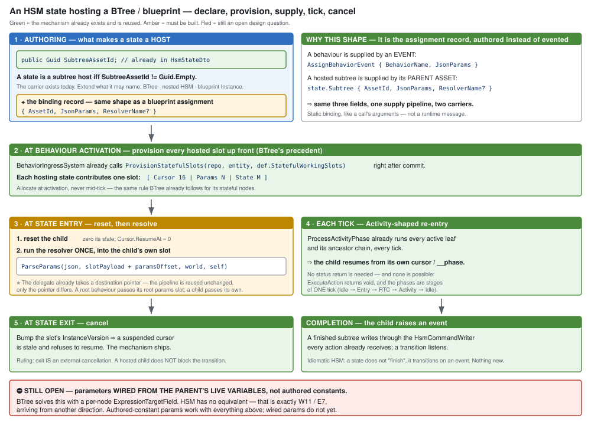

# Architect Question #33 — blueprint as a brain tier, and suspendable sub-behaviours

> **Coordinator, `2026-08-16`.**
> ⛔ **`N = 33` taken across ALL active branches** (rule 3a); highest existing is `32`.
> 📄 Context: [`EXPLAINER_Where_Parameters_And_State_Live.md`](EXPLAINER_Where_Parameters_And_State_Live.md)
>
> ---
>
> ## ⭐ UNPARKED `2026-08-16` — resolved jointly with the user, **NOT relayed**
>
> ⭐⭐ **§1.5 added:** `BrainTier` stays a discriminant (not a bitmask), and latent hosting is measured
> down to **an Activity-slot capability**. ⚠ **The parking note below is kept for its two carve-outs,
> which still stand.**
>
> ### ⛔ Was parked `2026-08-16` behind the parameter story
>
> ⭐⭐ **User: no architect is available to answer this — *"we need to resolve that ourselves, together."***
> ⇒ ⛔ **This document is NOT a relay.** It is the agenda for a joint working session.
> ⭐ **`2026-08-16`: the NotebookLM architect is GENERALLY unavailable** — `.claude/CLAUDE.md` updated.
> ⭐⭐ **These documents keep being written**, because forcing a question into decision-shaped options
> is what **isolates the truly architectural issues with large blast radius** from the merely fiddly.
>
> ⭐ **User: finish the PARAMETER story first.** ⇒ **parked behind it**, with two carve-outs:
>
> | | disposition |
> |---|---|
> | ⭐⭐ **`Q33-E`'s first slice — *"HSM emitter consumes `Role`/`Scope`"*** | ⛔ **PULLED OUT — it is parameter work.** BTree's `BTreeBridgeEmitCore` has **45** `Role`/`Scope` refs; both HSM emitters have **0** ⇒ *"multi-field editor-authored inputs for BTree **and HSM**"* **cannot work on HSM** until this lands, and it needs none of `A`–`D` |
> | **`Q33-D`** | ⭐ **answered provisionally: `D1`** *(keep `blueprintId` identity)*. ✅ **Safe to postpone `D2`:** `BlueprintBlackboard*` is `[DataPolicy(NoSave)]` so the slot table **never hits disk**, and `InitialBlueprintsIntent.Blueprints` is already a `List<BlueprintAssignmentDto>` with per-entry `Overrides` ⇒ two entries for one `AssetId` are **already expressible on disk**; only the idempotent attach collapses them. ⇒ **widening later is a RUNTIME change, not a migration** |
>
> ⚠ **One carry-forward for Track C:** its row identity `(AssetId, Entity, VariablePath)` gains a
> **fourth component** if `D2` ever happens. ⭐ **Note it in the design; do not build for it.**
>
> ⛔ **Everything else here — `A`, `B`, `C`, `D2`, and `Q33-E`'s other three gaps (subtree hosting, the
> dead validator guards, parallel-region slot keys) — waits.**

---

## 0. ⭐⭐⭐ Three USER RULINGS — settled, not open

| | ruling, `2026-08-16` |
|---|---|
| ⭐ **blueprint IS a brain tier** | *"blueprint should be brain tier **exactly to inherit behavior lifecycle**"* |
| ⭐⭐ **latent ≠ ended** | *"calling a delay node (latent) does not mean the behaviour has ended so **no brain death because of latent call**. The blueprint needs to **exit itself or be cancelled from outside** to enter brain death"* |
| ⭐⭐⭐ **tiers are NOT mutually exclusive** | *"there are behaviors combining **strategical HSM on top with tactical BTree or blueprint under it** (running as part of an HSM state)"* |

⇒ ⛔ **Do not re-litigate these.** The questions below are what they leave open.

---

## 1. The situation, measured on `HEAD` (`2026-08-16`)

### 1.1 ⭐ `BrainTier` is the ROOT interpreter — composition is a different axis

```csharp
public struct BehaviorState {
    public int  ActiveBehaviorHash;
    public uint InstanceId;   // preemption token, monotonic, wrapping
    public byte BrainTier;    // which interpreter INGRESS starts.  Hsm = 1, BTree = 2
}
```

Composition is **subtree hosting**, already in the authoring model:

```csharp
// When non-empty, this state acts as a "Subtree host" that runs an external
// behavior asset (BTree or nested HSM) identified by this GUID.
public Guid SubtreeAssetId;
```

⇒ *"blueprint as a tier"* and *"blueprint under an HSM state"* are **two mechanisms**, both needed.

### 1.2 🔴 Latent calls REQUIRE Instance dispatch — the composition path has no cursor

`FieldLayout.StateStructBase` is **8** for `AiPrimitive` and **16** for `Instance`, and the 16 is
*because* an Instance's state opens with the cursor:

```csharp
public BlueprintLatentCursor Cursor;   // ResumeAt(4) + WaitUntilTime(4) + InstanceVersion(4) + pad
```

⇒ ⭐⭐ **A blueprint hosted as a BTree/HSM action node CANNOT suspend.** It is a leaf that runs to
completion each tick. So *"a blueprint with delay nodes running as part of an HSM state"* is **not**
the existing AiPrimitive path with more wiring — it needs the **Instance** path hosted as a
sub-behaviour, **which does not exist in any host.**

### 1.3 ⚠ HSM's authoring model is ahead of its runtime — in four places

| | measured |
|---|---|
| `SubtreeAssetId` | read **only** by `HsmValidator`. FastHSM kernel: **0** mentions. HSM emitters: **0**. Shipped `.hsm.json` using it: **0** |
| `Role` / `Scope` | persisted on `HsmBlackboardVariableDto`; **0** references in either HSM emitter (`BTreeBridgeEmitCore` has **45**) |
| validator rules **8**/**8b** | correct errors for concurrent-region collisions; injected resolvers default to `_ => false`, and **both production call sites use the default ctor** ⇒ never fire |
| parallel regions | the kernel genuinely runs several leaves per tick, but the action slot key is `hash(method@compileTimeOffset)` with **no region in the path** ⇒ two concurrent regions running one action write the same bytes |

⇒ ⭐ **BTree and blueprints both provision per-scope / per-slot storage; HSM alone does not.**

### 1.4 The lifecycle machinery a tier inherits

`InstanceId` is monotonic and wrapping, bumped on assign/clear, and drives `ChannelArbitrationSystem`
to preempt a superseded behaviour's in-flight commands. Ingress **parses before it commits**, so a
failed parse leaves the entity wholly on its old behaviour. `BlueprintSlotEntry.InstanceVersion` is
the blueprint twin — bumped on hard reload, compared against the cursor to invalidate stale resumes.

---

## 1.5 ⭐⭐⭐ UNPARKED `2026-08-16` — two findings that narrow `A` and `B`

### 1.5.1 ⛔ "Should `BrainTier` be a bitmask?" — **no**, and the reason is precise

Values are already bit-distinct (`Hsm = 1`, `BTree = 2`), so a mask would *work*. ⛔ **But every use is
an equality test** — `BehaviorIngressSystem:162`, `TraceBufferLifecycleSystem:58/64`.

| question | shape |
|---|---|
| *"which interpreter does **ingress start**?"* | ⭐ **singular, always** — the **root**; nesting does not change it |
| *"which interpreters are **present**?"* | a **set**, once nesting exists |

⇒ ⭐⭐ **A mask answers the second and DESTROYS the first**: with two bits set, `BrainTier == Hsm` can no
longer tell ingress what to start. ⚠ **Same "one field, two meanings" error as `BP-224`'s bool-for-a-
three-way — too wide instead of too narrow.**

⚖️ **Keep the root as a DISCRIMINANT.** If presence is genuinely needed *(trace-buffer allocation is the
plausible consumer)*, ⭐ **derive it from the composition** — the root asset's subtree references already
say which interpreters are involved — **or add a separate mask.** ⛔ **Do not overload one field.**
📌 `BehaviorState` is `[DataPolicy(NoSave)]` ⇒ **deferring costs nothing.**

### 1.5.2 ⭐⭐⭐ "In what way are latent nodes a problem?" — **not at all for Instance dispatch**

⭐ **Hosted as an Instance they SHIP AND WORK**: `BlueprintTickSystem` re-enters every tick, the cursor
holds the resume point, `InstanceVersion` rejects a stale resume. ⛔ **Nothing to fix there.**

**They are a problem only when HOSTED, in three specific ways:**

| # | |
|---|---|
| **①** | ⛔ **the hosting path has no cursor** — `StateStructBase` 8 (AiPrimitive) vs 16 (Instance), and the 16 **is** the cursor ⇒ a blueprint hosted as an action node **must finish within the tick** |
| **②** | ⭐⭐ **the host must own re-entry, and the two hosts differ SHARPLY** — see below |
| **③** | cancellation ✅ **already solved** by `InstanceVersion`; ⚠ **but `WaitUntilTime` is ABSOLUTE sim time**, so a child suspended across a preemption can resume with its deadline **already passed** — a semantic call, not a mechanism gap |

#### ⭐⭐ ② is the decisive one

| | can it express *"not finished"*? |
|---|---|
| **BTree** | ✅ **YES, already** — `NodeStatus.Running` = *"Node is still executing (multi-frame)"*. A node returns `Running` while its child waits ⇒ **the concept fits with NOTHING NEW** |
| **HSM** | ⛔ **NO** — `public static void ExecuteAction(ushort actionId, void* instance, void* context, HsmCommandWriter* writer)` **returns `void`.** An HSM action **cannot** say "not done" |

⭐⭐⭐ **But HSM has a free way out: `Activity` runs EVERY TICK while the state is active**
(`ProcessActivityPhase`), so a latent child hosted as an **Activity** is naturally re-entered and
resumes from its cursor — ⭐ **no status needed, no kernel change.**

⛔⛔ **`Entry` / `Exit` / `Timer` are ONE-SHOT** — a latent child there suspends and is **never
re-entered.**

⇒ ⭐⭐⭐ **THE CONSTRAINT THAT FALLS OUT: a latent sub-behaviour is an ACTIVITY-SLOT capability, not a
four-slot one.** ⚠ **This narrows `Q33-A` and `Q33-B`** — the hosting question is no longer *"how does a
host re-enter a suspended child"* in general, but *"do we accept Activity-only, or extend the action
contract to carry a status?"*

### 1.5.3 ⭐⭐⭐ "Does the AiPrimitive path need to differ from the Instance path?" — **NO, and they have already converged**

> ⭐ **User:** *"isn't a blueprint action running on an entity just another instance of a blueprint?"*
> ⇒ ✅ **Yes — at the storage layer, and the code already agrees.**

⚠ **There are THREE paths, not two:**

| path | storage | keyed by | cursor | params |
|---|---|---|---|---|
| **Instance** | `BlueprintBlackboard` partition slot | `blueprintId` | ✅ **16 B** | ⛔ *(ruled: add)* |
| ⭐⭐ **AiPrimitive — COMPOSITION** *(bridge, per node)* | ⭐⭐⭐ **the SAME partition allocator** | `FNV-1a(assetId, scope, nodeVisualId, variableId)` | ⛔ | `bb.BehaviorParameters` |
| **AiPrimitive — STANDALONE hosting** *(`BTreeTick` thunk)* | `Blackboard1024 + 8` | ⛔ **unkeyed — one per entity** | ⛔ | `bb.BehaviorParameters[0]` |

```csharp
// StatefulBTreeActionBinder — the composition path
int slotKey = ComputeStatefulSlotKey(manifest.AssetId, scope, keyVisualId, variableId);
BlueprintBlackboardPartitions.TryGetSlotOffset(mem, slotKey, out int wsOff);
```

⭐ **That is the exact allocator `BlueprintInstanceService.TryAttach` uses.**

| does it need to differ? | |
|---|---|
| **storage** | ⛔ **no — already converged.** Unifying **finishes an 80%-done convergence**, it is not a rewrite |
| **params** | ⛔ no — the parameter model already rules them **occurrence-scoped** |
| **cursor** | ⛔ **no — and this is the payoff.** Give the composition path the same **`[Cursor][Params][State]`** slot shape and ⭐⭐ **latent hosting FALLS OUT** |
| ⭐ **the invoker** | ✅ **YES, genuinely** — a hosted action is called **when the tree reaches that node**; an Instance ticks **unconditionally every frame**. ⭐ **Keep this difference; it is the only real one** |

⇒ ⭐⭐⭐ **`Q33-A` largely ANSWERS ITSELF.** `A2` *("the child gets its own partition slot")* was offered
as an option with a cost — ⛔ **it is not an option, it is what the composition path already does.**
⇒ **`A2` is adopt-don't-invent; `A1` stays a trap.** The remaining work is **one slot shape across
Instance and composition**, plus the invoker distinction, plus §1.5.2's Activity-slot constraint.

⚠ **The standalone hosting path is the OUTLIER** — unkeyed, one per entity. ⭐ That is the documented
opt-in *blueprint-as-behaviour* case (`SLICE1-DESIGN`), where one-per-entity is arguably **correct**, and
it is the path `W13` already repaired once. ⇒ **leave it; do not assume it keys like the others.**

### 1.5.4 ✅ RESOLVED — `C` over `A`, and latency needs a RAIL that does not exist

> ⭐⭐⭐ **User ruling `2026-08-16`: `C` — SUBTREE HOSTING.** A latent sub-behaviour is hosted via the
> state's `SubtreeAssetId`, **not** as an action. ⛔ **`B` (extend the action contract) is RULED OUT.**
> ⭐ **A hosted subtree does NOT block its state's transitions** — *"it could be a configurable state
> flag if we ever find the need for it."*

⛔ **Why `B` is ruled out is stronger than cost:**

```csharp
public enum InstancePhase : byte { Idle = 0, Entry = 1, RTC = 2, Activity = 3 }
```

⭐⭐ **These are stages of ONE tick**, every path ending `header->Phase = InstancePhase.Idle`, and the
middle one is literally **run-to-completion**. ⇒ **an action returning "Running" leaves a state neither
entered nor not-entered at end of tick.** ⛔ **That is a different machine, not an extended contract.**
*(BTree can afford `Running` because its model is "re-tick and resume at the running node" — it has a
resumption model by construction.)*

⭐ **`C` also serves two requirements with one mechanism** — HSM subtree hosting is what ruling 3's
HSM-over-BTree composition needs anyway, and ⭐⭐ **`HsmValidator` rules 8/8b already reason about
concurrent stateful subtrees**, so the *validation* is written; only the runtime is missing.
📌 **Completion is signalled idiomatically** — a finished subtree raises an event through the
`HsmCommandWriter` every action already receives, and a transition listens. **Nothing new.**

#### 🔴 THE GAP: *"how is it ensured a CONDITION contains no latent stuff?"* — **it is not**

| | measured |
|---|---|
| **no rail** | `V_DispatchKindCompatibility` checks intent-vs-hosting (`BP1022`/`BP1023`) and event graphs (`BP1025`). ⛔ **Nothing about latency** |
| **no cursor** | `AiPrimitiveEmitter` emits **zero** `Cursor`/`latent` — only `InstanceEmitter` emits `public BlueprintLatentCursor Cursor;` |
| 🔴 **what actually happens** | `StatementEmitter:844` emits `s.Cursor.ResumeAt = N;` against a `WorkingState` with **no `Cursor` member** ⇒ **a C# compile error in GENERATED code** |

⇒ ⛔⛔ **Caught, but at the worst place** — *Roslyn naming a generated file and a field the designer
never wrote*, instead of a blueprint diagnostic naming the node. ⚠ **The same failure shape this
codebase criticises elsewhere.**

#### ⭐⭐ The rule to build — latency is legal **iff the hosting can RE-ENTER**

| intent → hosting | latency |
|---|---|
| ⛔ **`Condition`** → `BTreeCondition`, `HsmGuard` | **NEVER legal** — a condition must answer **this tick**; that is what a condition *is* |
| ✅ `Action` → `BTreeAction` | legal — `NodeStatus.Running` |
| ✅ `Action` → HSM **Activity / subtree host** | legal — re-entered every tick |
| ⛔ `Action` → HSM **Entry / Exit / Timer** | **not legal** — one-shot ⇒ **a silent hang** |

⇒ ⭐ **A third dimension on a validator that already exists**, same shape as `BP1022`/`BP1023`.
⭐⭐ **The detector is already built** — `MacroLatency.IsLatent(Node)` /
`FindTransitivelyLatentNode(...)`, used today by `BP1661`. ⇒ **the rule is missing, not the analysis.**

📌 **Filed, not numbered** (rule 3): *"a latent node in an AiPrimitive fails as a generated-code compile
error instead of a Stage 2 diagnostic."*

### 1.5.5 ⛔⛔ TWO CORRECTIONS — **§1.2 and §1.5.4 were WRONG**

#### ⛔ Correction 1 — **AiPrimitives CAN suspend.** There are TWO mechanisms, not one

`AiPrimitiveLowering.Apply` appends **`__phase` (byte)** and **`__waitUntilTime` (float)** to the
working state whenever a graph has a latent op, then runs `WaitLowering_AiPrimitive`.

| | suspension mechanism |
|---|---|
| **Instance** | the 16-byte `BlueprintLatentCursor` — `ResumeAt` + `WaitUntilTime` + `InstanceVersion` |
| ⭐ **AiPrimitive** | **`ws.__phase` + `ws.__waitUntilTime`** in working state |

⇒ ⛔ **"latent REQUIRES Instance dispatch" (§1.2) is FALSE**, and so is *"a blueprint hosted as an
action node cannot suspend."* ⚠ **§1.5.3's cursor argument was overstated** — the composition path is
not missing suspension, it has a **different** one. ⭐ **Two implementations of one concept** *(ruling
9's shape)* ⇒ **converge them when the slot shape unifies, not before.**

#### 🔴 Correction 2 — a latent CONDITION is **silently wrong**, not a compile error

⛔ **§1.5.4 said it fails as a generated-code compile error. It does not — it compiles.**

```csharp
public static unsafe bool BTreeEvaluate(…)
    return TickCore(…) == global::Fbt.NodeStatus.Success;
```

⇒ 🔴🔴 **`Running` maps to `false`.** A latent condition **reads as FALSE while it waits**, then flips
true on a later evaluation, with `__phase` left **mid-sequence** in between — resuming on whatever
unrelated evaluation comes next. ⛔ **No error, no warning, wrong answer.**

⭐⭐ **This STRENGTHENS the rail in §1.5.4** — it is not a poor error message, it is **silent wrong
behaviour**, and `MacroLatency.IsLatent` already provides the detector.

### 1.5.6 ✅ `WaitUntilTime` semantics — **keep ABSOLUTE**; my concern was unfounded

⚠ **The flagged worry** — *"a child suspended across a preemption resumes with a passed deadline"* —
⛔ **does not arise.** Measured:

| | |
|---|---|
| **global pause** | `if (deltaTime <= 0f) return;` — the tick is skipped **and the time controller holds sim time** ⇒ absolute deadlines do not advance either |
| **re-activation** | ⭐ **both mechanisms reset** — `InstanceVersion` invalidates a stale cursor; working state is **zero-inited** on re-provision, so `__phase` restarts at 0 |
| ⭐⭐ **LOD / tier throttling** | **absolute is the CORRECT choice** — *"wait 5 s"* means **5 sim-seconds** regardless of poll rate. ⛔ **A remaining-duration decrement would be WRONG** unless `dt` were true-elapsed-since-that-occurrence's-own-last-tick |

⇒ ⭐⭐ **Keep absolute.** Switching to remaining-duration is a **regression under throttling**, which is
the case that actually occurs.

**What genuinely remains:**

| | |
|---|---|
| ⚠ **float precision at large sim time** | `float` ulp ≈ **8 ms at ~28 h**, ≈ **62 ms at ~11 days** — at 28 h already **half a tick** |
| ⭐⭐ **and the fix is FREE** | the cursor is `ResumeAt(4) + WaitUntilTime(4) + InstanceVersion(4) + **padding(4)**` ⇒ **a `double` deadline fits in the existing 16 bytes** by reordering |
| ⚠ **two mechanisms** | cursor vs `__phase`/`__waitUntilTime` ⇒ converge with the slot unification |

⚖️ **Recommendation: absolute, widened to `double` using the padding already there, and converge the
two suspension mechanisms as part of the slot unification.** ⛔ **No semantic change, no throttling
regression.**

### 1.5.7 ⭐⭐⭐ THE MECHANISM, END TO END — how a state hosts a BTree / blueprint



#### ① How a state is DECLARED a host — ⭐ **the carrier already exists**

```csharp
public Guid SubtreeAssetId;   // HsmStateDto — "runs an external behavior asset"
```

⭐ **A state is a subtree host iff `SubtreeAssetId != Guid.Empty`.** ⛔ **Nothing new to invent** — what
must be extended is only **what it may name**: BTree · nested HSM · ⭐ **blueprint Instance**.

⚠ **Plus a binding record on the state** — and it is ⭐⭐ **the assignment record, authored instead of
evented**:

| supplied how | carrier |
|---|---|
| a **behaviour**, by event | `AssignBehaviorEvent { BehaviorName, JsonParams }` |
| ⭐ a **hosted subtree**, by its parent asset | `state.Subtree { AssetId, JsonParams, ResolverName? }` |

⇒ ⭐⭐ **Same three fields, one supply pipeline, two carriers.** A hosted subtree is a **static
binding** — like a call's arguments — not a runtime message.

#### ② Lifecycle — every step reuses something that ships

| when | what | reuse |
|---|---|---|
| **behaviour activation** | ⭐ **provision every hosting state's slot up front** — `[Cursor 16][Params N][State M]` | ✅ `BehaviorIngressSystem:149` already calls `ProvisionStatefulSlots` right after commit. ⛔ **allocate at activation, never mid-tick** — BTree's own rule |
| **state entry** | reset the child *(zero state, `Cursor.ResumeAt = 0`)*, then **run the resolver once into the child's slot** | ⭐⭐ `ParseParams(json, slotPayload + paramsOffset, world, self)` — **the delegate already takes a destination pointer**, so the pipeline is reused **unchanged** |
| **each tick** | the child resumes from its own cursor / `__phase` | ✅ `ProcessActivityPhase` already runs every active leaf and its ancestors, every tick ⇒ ⭐ **no status return needed — and none is possible** |
| **state exit** | **cancel** — bump the slot's `InstanceVersion` ⇒ a suspended cursor is stale and refuses to resume | ✅ ships. ⭐ **Exit IS external cancellation** *(ruling 2)*; ⛔ **a hosted child does NOT block the transition** *(ruling `2026-08-16`)* |
| **child completes** | raises an event; a transition listens | ✅ the `HsmCommandWriter` every action already receives. ⭐ **Idiomatic — a state does not "finish", it transitions** |

#### ③ ⚠ Sizing consequence — **one slot per hosting state**

`MaxSlots` is **4 / 8 / 16** for the 1024 / 4096 / 16384 tiers. ⇒ **an HSM with many hosting states
drives the tier choice**, and `ChooseTier` must size against the **sum**, exactly as
`BlueprintMaterializationSystem` already pre-provisions *"from the aggregate slot + byte requirements"*.

#### ⛔ WHAT IS STILL OPEN — **parameters wired from the parent's LIVE variables**

⭐ Everything above works for **authored-constant** params. ⛔ **It does not cover *"pass the parent's
`TargetPos` to the child"***.

⚠ **BTree solves this with a per-node `ExpressionTargetField`; HSM has no equivalent** —
`FIX-01-REPORT:43`, *"the HSM binding model is structurally different."* ⇒ ⭐⭐⭐ **that is exactly
`W11` / `E7`, arriving from another direction**, and it is the one piece of this mechanism that still
needs a joint design call.

### 1.5.8 ✅ RESOLVED — wired params (`W11`/`E7`). ⛔ **`ExpressionTargetField` was described BACKWARDS**

#### ⛔ Correction — it is an **OUTPUT** binding

```csharp
/// Blackboard field that receives the expression result of ActionFunction.
public string? ExpressionTargetField;
```

⇒ ⭐ ***"run this action, write its RESULT into that named blackboard field."*** ⛔ **Not input wiring**,
which is how §1.5.7 and `W11`'s framing described it.

⚠ **Both hosts have it** — BTree on action/condition **nodes**, HSM on **transitions** and global
transitions. ⭐ **`FIX-01-REPORT:43`'s *"no per-node `ExpressionTargetField`"* meant PER-NODE
specifically**; HSM binds per *transition*. And `HsmAsset:199`'s *"HSM does not use it in this phase"*
is about the editor's **reference counting** (`CountNodesReferencingVariable` returns `0`), not the
field's existence.

#### ⭐⭐⭐ Which collapses the premise: **neither host has input wiring**

In BTree a node binds a **field of the behaviour's params struct** — statically, at authoring — and the
**value** there was written by **the resolver at activation**. ⛔ **There is no per-node "pull this from
a variable at runtime" anywhere.**

⇒ ⭐⭐ ***"The resolver fills the params; nodes read fields of them"* is ALREADY the universal answer.**
For a hosted subtree, the same mechanism applies **at state entry**.

| tier | covered? |
|---|---|
| **authored constants** | ✅ §1.5.7's mechanism, nothing extra |
| ⭐ **resolve-at-entry from world state** | ✅ **exactly what a resolver is for** |
| **live binding** *(child sees the parent's variable change mid-run)* | ⛔ **DELIBERATELY OUT** — *resolve once at activation* is a ruled property whose stated payoff is that **the double-conversion trap becomes structurally impossible** |

#### ⚠ What is actually missing: **addressing, not access**

A resolver receives `world` + `self`, so it can already reach any component — including
`BlueprintBlackboard*`, and `BlueprintBlackboardPartitions.TryGetSlotOffset` is public. ⛔ **But to read
*"my parent's `TargetPos`"* it needs the parent's slot key, and it is given only the entity.**

⇒ ⭐ **Pass a HOST CONTEXT** *(the parent's slot handle / a variable accessor)* alongside `world, self` —
the same kind of signature extension already accepted for `ExecuteAction`. ⛔ **Not a second supply
mechanism** *(ruling 9)*.
⚠ **By NAME, never raw offset** — cross-asset byte reads are `StructureHash`-versioned.

#### ⇒ `E7` RE-SCOPED — one conflated item becomes two small independent ones

| | |
|---|---|
| **`E7a`** ⭐ **wired params** | pass **host context** to the resolver. **Not a new mechanism**; serves every host |
| **`E7b`** **the output binding** | wire HSM's existing `ExpressionTargetField` at runtime + fix `CountNodesReferencingVariable` returning `0` ⇒ ⚠ **references through it are currently UNCOUNTED** |

⭐ **`VE-DEBT-001`'s *"needs an architect design call, not an autonomous guess"* is DISCHARGED** — it was
about the **four-slot / one-DTO** question, and ⭐⭐ **the subtree ruling removed it: a subtree is HOSTED,
not slotted.**

---

## 2. The sub-questions

### Q33-A — ⭐⭐ What hosts a suspendable sub-behaviour, and who owns its cursor?

| | option | reuse vs build |
|---|---|---|
| **A1** | **the parent's slot** — the child's cursor is a field in the parent's state struct | ✅ **no allocator work**; parent exit is a plain field reset ⛔ the child's layout becomes part of the parent's `StructureHash` ⇒ **editing the child re-versions and zeroes the parent** |
| **A2** | ⭐ **the child gets its OWN partition slot**, keyed by `(parentAsset, hostSite)`; the parent holds a handle | ✅ ⭐⭐ **reuses the shipped allocator verbatim** — `TryAttach` already does free-list + bump + per-slot `StructureHash` + zero-on-attach ⛔ needs a key algorithm and a detach-on-exit rule |
| **A3** | **root-only first** — a suspendable blueprint may only be a ROOT behaviour; nesting uses non-latent AiPrimitive leaves | ✅ **satisfies the "behaviour script" requirement with the least new machinery** ⛔ **defers ruling 3's composition case**, which is the half the user named explicitly |

⚖️ **Coordinator's lean: A2, phased behind A3.** ⭐ A2 is the only option where the child's latent
state survives independent of the parent's layout, and it is **reuse, not build** — the partition
allocator is shipped, proven and already zeroes every slot at a single choke point. ⚠ **But A3 first
is honest sequencing**: the root case alone delivers *"a behaviour defined as a tickable blueprint
with latent calls"*, and it needs no nesting decision at all. ⛔ **A1 is a trap** — coupling the
child's layout into the parent's `StructureHash` means editing a sub-script wipes its parent's state.

### Q33-B — When the parent state exits while the child is mid-wait, what happens to the cursor?

| | option | reuse vs build |
|---|---|---|
| **B1** | ⭐ **cancel** — invalidate the cursor, zero the child's slot | ✅ matches ruling 2's *"cancelled from outside ⇒ brain death"* exactly ✅ **reuses `InstanceVersion` staleness**, which already invalidates cursors ⛔ a long wait restarts on re-entry |
| **B2** | **preserve** — re-entering the state resumes where it left off | ⭐ **HSM already has history semantics** (`HistorySlots[8]`) ⇒ a precedent exists ⛔ but "resume a 30-second wait started a minute ago" needs a rule for `WaitUntilTime` |
| **B3** | **authored per host site** — a checkbox on the hosting state | ✅ most expressive ⛔ **a third semantic to test**, and it must agree with HSM's own shallow/deep history |

⚖️ **Coordinator's lean: B1 as the default, B3 only if it can be made to MEAN the same thing as HSM
history.** ⭐ Ruling 2 defines brain death as exit-or-cancel, and a parent state exiting *is* an
external cancellation of its child. ⚠ **The open half is `WaitUntilTime`** — it is absolute sim time,
so any "preserve" answer must say whether a preserved wait keeps its original deadline or re-bases.

### Q33-C — Does a nested blueprint get its own preemption token, or share the root's `InstanceId`?

| | option | reuse vs build |
|---|---|---|
| **C1** | **share the root's `InstanceId`** — one token per entity | ✅ trivially consistent; any reassignment invalidates everything ⛔ **a parent state change cannot invalidate one child without invalidating all of them** |
| **C2** | ⭐⭐ **per-slot token — `BlueprintSlotEntry.InstanceVersion`** | ✅ ⭐⭐⭐ **the field EXISTS and already does exactly this job**: bumped on hard reload, compared against `BlueprintLatentCursor.InstanceVersion` to reject a stale resume ⇒ **pure reuse** ⛔ two token spaces to reason about |

⚖️ **Coordinator's lean: C2, with high confidence.** ⭐ This is the strongest reuse case in the
document — the mechanism is shipped, its semantics are already *"invalidate a suspended resume point"*,
and Q33-B's cancel is then **a version bump**, not new code.

### Q33-D — Does a parameterised script need more than one instance per entity?

Slot identity is `blueprintId` **alone**, and attach is idempotent on it (`AlreadyAttached`, a no-op).

| | option | reuse vs build |
|---|---|---|
| **D1** | **keep `blueprintId` identity** — one instance per script per entity, params per-entity | ✅ **zero change** ⛔ **two HSM states cannot host the same script with different params** — and that is ⚠ **the HSM parallel-region collision reappearing in a new place** |
| **D2** | ⭐ **widen to `(blueprintId, instanceKey)`** | ✅ removes the whole class ⛔ touches the slot table, `TryGetSlotOffset`'s hot-path scan, and every by-id lookup ⚠ **`InstanceVersion` is NOT free for this** — it is already the staleness token |

⚖️ **Coordinator's lean: D2 if nesting happens (A2), D1 if root-only (A3).** ⭐ The requirement only
bites when one entity runs the same script twice, which nesting is what makes possible.

### Q33-E — ⚠ Does this work include building HSM's missing runtime?

§1.3 measures four places where HSM's authoring model has no runtime behind it. **`SubtreeAssetId` is
one of them**, and *"blueprint under an HSM state"* cannot exist until HSM subtree hosting does.

| | option |
|---|---|
| **E1** | ⭐ **this work builds HSM subtree hosting**, because ruling 3 depends on it |
| **E2** | **HSM's gaps are deliberately phased** and belong to the HSM programme — this work does root-only (A3) and waits |
| **E3** | some of the four are **abandoned**, not deferred — say which |

⚖️ **Coordinator's lean: E2, then E1.** ⛔ **No lean on which of the four are abandoned — that is
exactly the question a grep cannot answer**, and this programme has twice deleted something a design
record said was wanted.

---

## 3. What would be most useful back

1. ⭐⭐ **Q33-E** — whether HSM's four gaps are phased or abandoned. **Everything about ruling 3
   depends on it**, and it is the one question no measurement can settle.
2. ⭐⭐ **Q33-A** — hosting and cursor ownership; A2-vs-A3 is really *"nesting now or later."*
3. **Q33-B** — cancel vs preserve, and ⚠ **what a preserved `WaitUntilTime` means.**
4. **Q33-C / Q33-D** — leans are strong; a nod or a correction is enough.
5. ⭐ **Any correction to §1.** ⚠ **§1.3 says HSM subtree hosting has no runtime. The user described
   HSM-over-BTree behaviours as existing** — if they run through a mechanism this sweep did not find,
   that changes A, D and E together.
