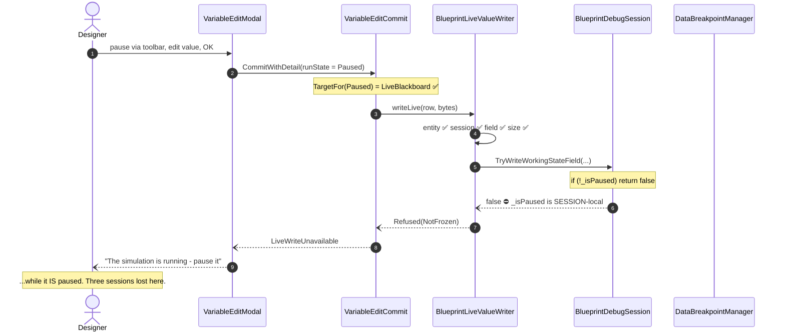
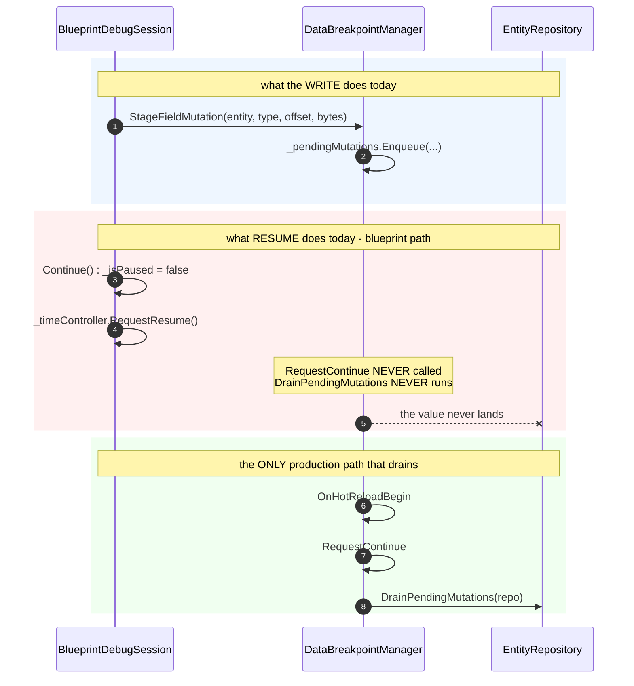
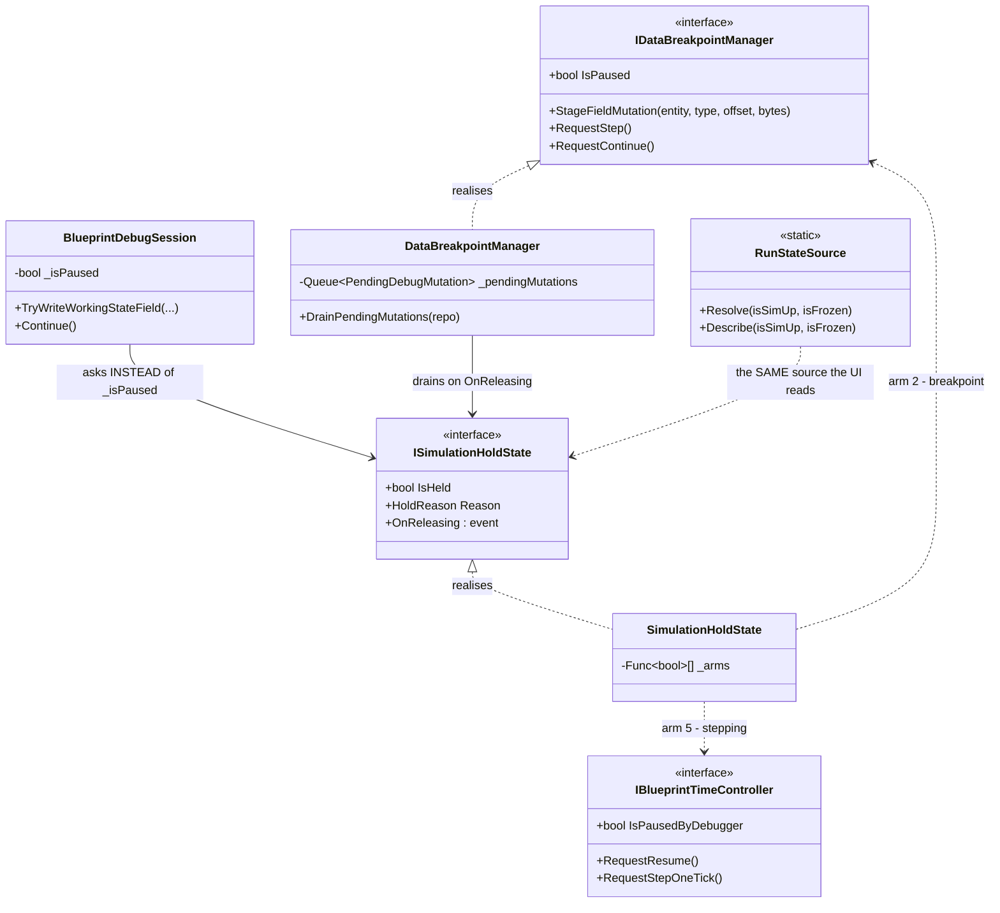

<!--STATUS
state: LIVE
build-state: DESIGN
updated: 2026-08-21
current-answer: §5 — the recommended answers, awaiting the user's approval.
stale-below: nothing.
known-rot: none.
known-conflict: none. R-63 (staged, not direct, while paused) is UPHELD by this document,
  not overturned — §3 shows the staging is right and the DRAIN is what is missing.
-->
# ⭐⭐⭐ Q48 — **What does "the simulation is stopped" mean, and WHO DRAINS the write?**

> ⛔⛔ **NOT RELAYED.** The architect is generally unavailable *(`2026-08-16` user ruling)*.
> ⭐ **I analyse and recommend; the user approves** — every sub-question in §5 carries a lean.

> ## 🔴 THE TRIGGER — **the user's own measurement, `2026-08-21`**
> ⭐ *"livewrite unavailable, simup true, frozen true => paused"* — the run state is **correct**, and the
> edit is **still refused**. ⇒ ⛔ **the run-state seam was never the whole problem.**
>
> 🔒 **And the user has already ruled on the first half** *(`2026-08-21`)*:
> ⭐⭐ *"time is paused OR debugger hit a breakpoint — in both cases the simulation is stopped and we
> can write new values."*
>
> ⚠⚠ **This document exists because obeying that ruling naively makes things WORSE**, and §3 is the
> measurement that shows why.

---

## 0. ⭐⭐⭐ INVENTORY — **enumerated with the graph BEFORE deciding anything** *(`R-74`)*

Graph: `home-user-HROT`, **175 663 nodes / 438 004 edges**, indexed at `ac7860dd8`.

### ⭐ Query 1 — every notion of "paused / frozen" in the tree

```
search_graph(name_pattern=".*(IsPaused|IsFrozen|IsStopped|PausedBy).*")   → total 91, has_more false
```

⭐ **91 declarations; 12 distinct PRODUCTION notions** *(tests and `.dev/` filtered out)*:

| # | notion | home | what it actually means |
|---|---|---|---|
| ① | `GlobalTime.IsPaused` | `Fdp.Core` | ⭐ **the clock** |
| ② | `DataBreakpointManager.IsPaused` | `Hrot.Diagnostics.Breakpoints` | ⭐⭐ **a data breakpoint holds the repo** |
| ③ | `BlueprintDebugSession.IsPaused` | `Hrot.Blueprints.Editor` | ⛔⛔ **session-local — THE GATE THAT REFUSED** |
| ④ | `IAiDebugSession.IsPaused` · `AiDebugSessionBase` | `Hrot.Editor.AiShared` | the BTree/HSM twin of ③ |
| ⑤ | `IBlueprintTimeController.IsPausedByDebugger` | `Hrot.Blueprints.Core` | ⭐ **deterministic stepping** |
| ⑥ | `MasterSyncTimeControllerAdapter.IsPausedByDebugger` | `Hrot.Blueprints.Editor` | ⑤'s implementation |
| ⑦ | `CgfSubsystem.IsPausedByDebugger` | `Hrot.CGF` | ⚠ **a THIRD host of the same name** |
| ⑧ | `ITimeTransportFacade.IsPaused` · `ClusterTimeTransportAdapter` | `Hrot.Presentation` | ⭐ **the cluster transport** |
| ⑨ | `EditorTimeTransportFacade/Adapter.IsPaused` | `Hrot.Editor` | the editor's own transport view |
| ⑩ | `IExConLogic.IsPaused` | `Hrot.ExCon` | external control |
| ⑪ | `ClusterUiCache.IsPaused` | `Hrot.Orchestrator` | ⚠ a **panel's cached** view of ⑧ |
| ⑫ | `IMutationInterceptor.IsPaused` | `Fdp.Toolkits` | the gizmo/inspector write gate |

⇒ ⛔⛔ **`M-38` said "five". It is TWELVE.** ⭐ Exactly `R-74`'s point: grep confirms a guess, only the
graph enumerates. *(Plus `PerspectiveWorkspaceServices.IsFrozen`, which is not a notion — it is the
**predicate** that combines ②+⑤+① for the UI, fixed `2026-08-20`.)*

### ⭐⭐ Query 2 — the staging and the drain

```
search_graph(name_pattern=".*(StageFieldMutation|StageMutation|DrainStaged|PendingMutations|ApplyStaged|FlushStaged).*")
                                                                          → total 50, has_more false
trace_path("DataBreakpointManager.DrainPendingMutations", direction=inbound, depth=3)
```

| ⭐ | result |
|---|---|
| **one queue** | `DataBreakpointManager._pendingMutations` — `Queue<PendingDebugMutation>` |
| **one drain** | `DataBreakpointManager.DrainPendingMutations(EntityRepository)` |
| ⛔⛔ **its production callers** | **`RequestStep` · `RequestContinue` · `OnHotReloadBegin`. That is ALL** — every other caller in the trace is a test |

⚠ **Corroborated by grep** *(the canon's rule: the graph under-reports C# interface dispatch, so an
absence claim needs both)* — `grep -rn "RequestContinue\|RequestStep"` over `Hrot/` and `FDP/`, tests
excluded, finds **no production caller of `IDataBreakpointManager.RequestContinue` or `.RequestStep`
outside `DataBreakpointManager` itself.** ⭐ The `RequestStep`s it does find are a **different** method on
`IExConLogic` / `NedTimeControlGateway`, and the `RequestStepOneTick`s are the **time controller's**.

---

## 1. ⭐⭐ THE CHAIN THE USER HIT — **measured end to end**



⭐ **Everything up to step 7 is correct.** ⛔ **Step 8 asks a question nobody upstream asked:
*"did THIS SESSION pause it?"*** — and the designer paused **time**, not the session.

---

## 2. ⛔⛔⛔ THE FINDING THAT CHANGES THE ANSWER — **there is no production DRAIN**

⭐ The obvious fix is *"widen `_isPaused` to `_isPaused || timeController.IsPausedByDebugger`"*, exactly
as the user ruled. ⛔⛔ **Measured: that would make the bug WORSE, not better.**



| ⭐ | |
|---|---|
| ⭐⭐ **The staging is RIGHT** | 📌 `R-63`, measured `2026-08-18`: while paused `ActiveView` is the **pre**-tick snapshot and resume restores from the **post**-tick one ⇒ ⛔ a direct write is overwritten. **This document upholds `R-63`** |
| ⛔⛔ **The drain is MISSING** | the blueprint session resumes through `_timeController.RequestResume()` and **never tells the queue** |
| ⚠⚠ **So widening the gate ALONE** | turns *"refused, with a wrong reason"* into ⛔ **"accepted, and silently discarded"** — 📌 precisely the *"looks accepted and vanishes"* failure `VariableEditCommit`'s own remarks warn about |

> ⚠ **Stated at the confidence it deserves.** Two independent enumerations agree *(graph + grep)*, and
> `trace_path`'s known weakness is interface dispatch — which grep covers. ⛔ **But neither runs the
> program.** ⭐ **The decisive artefact is a RAIL, and it is `Q48-E` below** — a claim this size should
> not rest on reading.

---

## 3. ⭐ THE SHAPE OF THE FIX



⭐⭐ **One object answers *"is it held?"*, and the same object announces *"it is about to be
released."*** ⛔ The release event is what the queue has never had.

---

## 4. ⭐ WHY THIS IS NOT A `VariableRunState` QUESTION

⚠ `M-38` framed this as *"map `ClusterState`'s 14 members onto `VariableRunState`."* ⛔ **That framing is
wrong and this document supersedes it.** 📐 `VariableRunState` is a **display** concern — which arm the
Value column shows. ⭐ **The write gate is a SAFETY concern** — may bytes be queued, and will anything
apply them. ⇒ ⛔ **collapsing them would make a cell's rendering decide whether memory is written.**

---

## 5. ⭐⭐⭐ THE SUB-QUESTIONS — **each with my recommended answer**

### `Q48-A` — **What counts as "stopped" for a WRITE?**

| option | |
|---|---|
| **A1** | session-local `_isPaused` only *(today)* |
| ⭐ **A2** | ⭐⭐⭐ **any arm: breakpoint ② **or** deterministic stepping ⑤ **or** clock ①** — 🔒 the user's ruling |
| **A3** | A2 **plus** the cluster transport ⑧ |

> ⭐⭐ **RECOMMEND `A2`, gated on `Q48-C` landing first.** 🔒 It is the user's own ruling and it matches
> what a designer can see. ⛔ **Not `A3` yet** — ⑧ is a *remote* claim about other nodes, and a write
> gated on it would be *"someone else says they are stopped"*; that belongs with the cluster-wide
> breakpoint work *(UX Ruling 62)*, not here.
> ⚠ **Blast radius: ONE line**, and it is **inert until `C`.**

### `Q48-B` — **WHERE does that predicate live?**

| option | |
|---|---|
| **B1** | each caller ORs its own arms *(what the UI does today — the shape that produced 12 notions)* |
| ⭐ **B2** | ⭐⭐ **one `ISimulationHoldState`**, in `Hrot.Diagnostics.Breakpoints`, read by the session, the DBM **and** `RunStateSource` |
| **B3** | put it on `IDataBreakpointManager` |

> ⭐⭐ **RECOMMEND `B2`.** 📌 The seam law: *"we need a shared X"* here really is a **13th** notion unless
> it **retires** the ones it replaces — ⇒ the deliverable is `RunStateSource`'s `isFrozen` and the
> session's `_isPaused` **both reading it**, not a new one beside them.
> ⛔ **Not `B3`:** *"is the sim held?"* is not the breakpoint manager's question, and putting it there is
> why ③ exists at all. ⚠ It **lives** in that assembly for dependency reasons; it is not **owned** by
> the manager.

### `Q48-C` — ⭐⭐⭐ **WHO DRAINS, and WHEN?** *(the blocking one)*

| option | |
|---|---|
| **C1** | leave it — only `OnHotReloadBegin` drains ⇒ ⛔ **the feature does not work at all** |
| ⭐ **C2** | ⭐⭐⭐ **drain on RELEASE, whoever releases** — `ISimulationHoldState.OnReleasing` fires before the hold lifts; the DBM drains there |
| **C3** | the blueprint session calls `_dataBreakpointManager.RequestContinue()` in `Continue()` |
| **C4** | drain every tick while held |

> ⭐⭐ **RECOMMEND `C2`.** ⛔ **`C3` fixes ONE of the four resume paths** *(blueprint `Continue`, blueprint
> step, HSM/BTree coordinator, the time controller's own resume)* — ⚠ and the next one added would go
> unnoticed, which is exactly how this got here.
> ⛔ **Not `C4`:** draining while held applies the edit to the **pre**-tick snapshot that resume then
> overwrites — 📌 that is `R-63` again, from the other side.
> ⚠⚠ **Blast radius is REAL and this is why `A` is gated on it:** the drain takes an
> `EntityRepository`, so `OnReleasing` must carry one, and **every** release path must raise it.

### `Q48-D` — **What does a designer see while stopped-but-unwritable?**

> ⭐ **RECOMMEND: keep OK LIVE and refuse with a named cause** — ⛔ do not grey it.
> 📌 `VariableEditModal:41` is right that this cannot be known in advance. ⭐ **Already landed
> `2026-08-21`**: every refusal carries its enum name and the observed run state, which is how this
> question got answered at all.

### `Q48-E` — ⭐⭐ **What proves it?**

> ⭐⭐⭐ **RECOMMEND: one END-TO-END rail, and it is the acceptance criterion for the whole slice.**
> *"Pause by each supported means → edit a variable → resume by the matching means → **the value is in
> the repository**."*
> ⛔ **A rail that asserts the queue LENGTH proves nothing** — 📌 that is the mistake `2026-08-19` named:
> *"is it connected?" is not "does anything flow?"*
> ⚠ **Write this rail FIRST and watch it fail** — it is the only thing that turns §2 from a
> well-corroborated reading into a fact.

---

## 6. ⭐ SEQUENCING — **if approved**

| # | | why here |
|---|---|---|
| **①** | ⭐⭐ **`Q48-E`'s rail, RED** | ⛔ nothing else starts until §2 is a measurement, not a reading |
| **②** | **`Q48-C`** — `ISimulationHoldState` + `OnReleasing`, DBM drains on it | ⭐ makes ① green **for the breakpoint path alone**, changing no gate |
| **③** | **`Q48-B`** — the session and `RunStateSource` both read the one source | ⛔ retires ③ and shrinks the 12 |
| **④** | **`Q48-A`** — widen to the stepping arm | ⭐ **one line, and by now it is SAFE** |
| **⑤** | ⚠ BTree/HSM — ④'s twin via `IAiDebugSession` | ⛔ **out of scope until ①–④ hold for one host** |

⚠ **`A3` / the cluster arm stays OUT**, and joins UX Ruling 62's cluster-wide breakpoint work.
