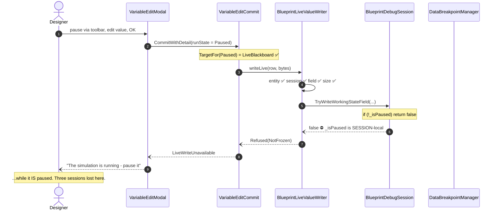
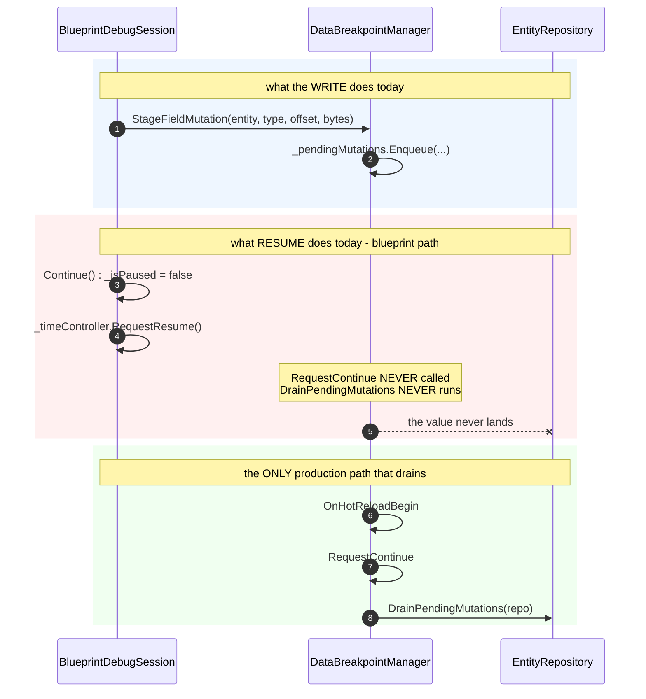

<!--STATUS
state: LIVE
build-state: DESIGN
updated: 2026-08-21
current-answer: §5 — THE USER'S RULING. All five sub-questions are ANSWERED; §6 is the sequencing.
stale-below: nothing above the HISTORY heading.
known-rot: none.
known-conflict: none. R-63 (stage, do not write the paused view directly) is UPHELD and
  is in fact SATISFIED by the ruling — §5.3.
superseded-by: nothing. ⛔ My own §5 recommendations of earlier today ARE superseded, by the
  user's ruling in the same section; they are kept at the bottom under HISTORY.
-->
# ⭐⭐⭐ Q48 — **What does "the simulation is stopped" mean, and WHO DRAINS the write?**

> ⭐⭐⭐ **ANSWERED by the user, `2026-08-21`.** ⛔ This is no longer an open question — §5 carries the
> ruling verbatim, and it **overturned three of my five recommendations.** ⭐ The measurements in §0–§3
> stand; they are what the ruling was decided against.

> ## 🔴 THE TRIGGER — **the user's own measurement**
> ⭐ *"livewrite unavailable, simup true, frozen true => paused"* — the run state is **correct**, and the
> edit is **still refused.** ⇒ ⛔ **the run-state seam was never the whole problem.**

---

## 0. ⭐⭐⭐ INVENTORY — **enumerated with the graph BEFORE deciding anything** *(`R-74`)*

Graph: `home-user-HROT`, **175 663 nodes / 438 004 edges**, indexed at `ac7860dd8`.

### ⭐ Query 1 — every notion of "paused / frozen" in the tree

```
search_graph(name_pattern=".*(IsPaused|IsFrozen|IsStopped|PausedBy).*")   → total 91, has_more false
```

⭐ **91 declarations; 12 distinct PRODUCTION notions** *(tests and `.dev/` filtered out)*:

| # | notion | home | what it actually means | ⭐ under the ruling |
|---|---|---|---|---|
| ① | `GlobalTime.IsPaused` | `Fdp.Core` | ⭐⭐⭐ **the clock — `TimeScale == 0`** | ✅ **THE SOURCE** |
| ② | `DataBreakpointManager.IsPaused` | `Hrot.Diagnostics.Breakpoints` | a data breakpoint holds the repo | ⇒ **derive** *(and see §5.2)* |
| ③ | `BlueprintDebugSession.IsPaused` | `Hrot.Blueprints.Editor` | ⛔ session-local — **the gate that refused** | ⇒ **derive** |
| ④ | `IAiDebugSession.IsPaused` · `AiDebugSessionBase` | `Hrot.Editor.AiShared` | the BTree/HSM twin of ③ | ⇒ **derive** |
| ⑤ | `IBlueprintTimeController.IsPausedByDebugger` | `Hrot.Blueprints.Core` | deterministic stepping | ⇒ **derive** |
| ⑥ | `MasterSyncTimeControllerAdapter.IsPausedByDebugger` | `Hrot.Blueprints.Editor` | ⑤'s implementation | ⇒ **derive** |
| ⑦ | `CgfSubsystem.IsPausedByDebugger` | `Hrot.CGF` | ⚠ a THIRD host of the same name | ⇒ **derive** |
| ⑧ | `ITimeTransportFacade.IsPaused` · `ClusterTimeTransportAdapter` | `Hrot.Presentation` | the cluster transport | ⇒ **derive** |
| ⑨ | `EditorTimeTransportFacade/Adapter.IsPaused` | `Hrot.Editor` | the editor's own transport view | ⇒ **derive** |
| ⑩ | `IExConLogic.IsPaused` | `Hrot.ExCon` | external control | ⇒ **derive** |
| ⑪ | `ClusterUiCache.IsPaused` | `Hrot.Orchestrator` | ⛔⛔ a panel's **CACHE** | ⇒ **delete the cache** *(§5.1)* |
| ⑫ | `IMutationInterceptor.IsPaused` | `Fdp.Toolkits` | the gizmo/inspector write gate | ⇒ **derive** |

⇒ ⛔⛔ **`M-38` said "five". It is TWELVE.** ⭐ Exactly `R-74`'s point: grep confirms a guess, only the
graph enumerates. *(Plus `PerspectiveWorkspaceServices.IsFrozen`, the UI **predicate** that ORs ②+⑤+①,
fixed `2026-08-20` — ⛔ under the ruling that predicate is itself the wrong shape.)*

### ⭐⭐ Query 2 — the staging and the drain

```
search_graph(name_pattern=".*(StageFieldMutation|StageMutation|DrainStaged|PendingMutations|ApplyStaged|FlushStaged).*")
                                                                          → total 50, has_more false
trace_path("DataBreakpointManager.DrainPendingMutations", direction=inbound, depth=3)
```

| ⭐ | result |
|---|---|
| **one queue** | `DataBreakpointManager._pendingMutations` — `Queue<PendingDebugMutation>` |
| **one drain** | `DataBreakpointManager.DrainPendingMutations(EntityRepository)` |
| ⛔⛔ **its production callers** | **`RequestStep` · `RequestContinue` · `OnHotReloadBegin`. That is ALL** — every other caller in the trace is a test |

⚠ **Corroborated by grep** *(the graph under-reports C# interface dispatch, so an absence claim needs
both)* — no production caller of `IDataBreakpointManager.RequestContinue` or `.RequestStep` exists
outside `DataBreakpointManager` itself. ⭐ The `RequestStep`s grep does find are a **different** method on
`IExConLogic` / `NedTimeControlGateway`; the `RequestStepOneTick`s are the **time controller's**.

### ⭐⭐⭐ Query 3 — **added after the ruling: does the single source already exist?**

| 📐 measured | ⭐ finding |
|---|---|
| `FDP/Engine/Fdp.Core/GlobalTime.cs` | ⭐⭐⭐ **`public bool IsPaused => TimeScale == 0.0f`** — ⛔ **already DERIVED, not latched**, and it is an **ECS singleton pushed into the world every frame** ⇒ every node has it and any system can read it |
| `ModuleHostKernel.UpdateInternal:483-487` | ⭐⭐⭐ **ONE tick loop**: `_liveWorld.Tick()` → `SetSingletonUnmanaged(globalTime)` → `ExecutePhase(Input)` → … ⇒ **the drain point the ruling asks for already exists as a place** |
| `SwitchTimeModeEvent` / `SwitchTimeModeWireDto` | ⭐⭐ **time MODE and `TimeScale` already travel over DDS** *(`TimeNetworkModule`, `MasterSyncController:89`)* ⇒ ⛔ **cluster-wide stepping is not a new mechanism** — it is an unused one |

⇒ ⭐⭐⭐ **The ruling is not asking for new machinery. It is asking the twelve to stop inventing their
own answer to a question the kernel already answers every frame.**

---

## 1. ⭐⭐ THE CHAIN THE USER HIT — **measured end to end**



⭐ **Everything up to step 7 is correct.** ⛔ **Step 8 asks a question nobody upstream asked:
*"did THIS SESSION pause it?"*** — and the designer paused **time**, not the session.

---

## 2. ⛔⛔⛔ THE SECOND FINDING — **there is no production DRAIN**



| ⭐ | |
|---|---|
| ⭐⭐ **The staging is RIGHT** | 📌 `R-63`, measured `2026-08-18`: while paused `ActiveView` is the **pre**-tick snapshot and resume restores from the **post**-tick one ⇒ ⛔ a direct write is overwritten |
| ⛔⛔ **The drain is MISSING** | the blueprint session resumes through `_timeController.RequestResume()` and **never tells the queue** |
| ⚠⚠ **So widening the gate ALONE** | turns *"refused with a wrong reason"* into ⛔ **"accepted and silently discarded"** |

> ⚠ **Stated at the confidence it deserves.** Two independent enumerations agree *(graph + grep)*.
> ⛔ **But neither runs the program.** ⭐ **The decisive artefact is a rail — `Q48-E`.**

---

## 3. ⭐ WHY THIS IS NOT A `VariableRunState` QUESTION

⚠ `M-38` framed this as *"map `ClusterState`'s 14 members onto `VariableRunState`."* ⛔ **That framing is
wrong and this document supersedes it.** 📐 `VariableRunState` is a **display** concern — which arm the
Value column shows. ⭐ **The write path is a TIMING concern** — when may bytes reach the repository.
⇒ ⛔ **collapsing them would make a cell's rendering decide when memory is written.**

---

## 4. ⭐⭐ THE SHAPE UNDER THE RULING

```mermaid
classDiagram
    class GlobalTime {
        <<ECS singleton>>
        +float TimeScale
        +float DeltaTime
        +bool IsPaused
    }
    class ModuleHostKernel {
        +GlobalTime CurrentTime
        -UpdateInternal(dt, globalTime)
    }
    class IPendingWrites {
        <<interface>>
        +Stage(write)
        +DrainInto(repo)
        +int Count
    }
    class DataBreakpointManager {
        -Queue~PendingDebugMutation~ _pendingMutations
        +DrainPendingMutations(repo)
    }
    class PendingWriteDrainSystem {
        <<Input phase>>
        +Execute(world, dt)
    }
    class BlueprintDebugSession {
        +TryWriteWorkingStateField(...)
    }
    class RunStateSource {
        <<static>>
        +Resolve(isSimUp, isFrozen)
    }

    ModuleHostKernel --> GlobalTime : pushes each tick
    IPendingWrites <|.. DataBreakpointManager : realises
    PendingWriteDrainSystem --> IPendingWrites : drains on the first UNPAUSED tick
    PendingWriteDrainSystem ..> GlobalTime : reads TimeScale
    BlueprintDebugSession ..> IPendingWrites : stages, never gates on time
    RunStateSource ..> GlobalTime : reads through, never latches
```



⭐⭐ **No combining predicate, no hold-state object, no release event.** ⛔ Those were my answer and the
ruling replaced them: **the clock is the source, and the tick loop is the drain.**

---

## 5. ⭐⭐⭐ THE ANSWER — **the user's ruling, `2026-08-21`**

> ⭐⭐⭐ **Verbatim:**
> *"i see just two real sources of IsPaused: (1) the sim clock itself (giving dt=0 from whatever reason
> - deterministic stepping, or just paused the continuous run) and (2) the debugger pause. Debugger
> pause should basically force the deterministic time stepping mode cluster wide (now just inside the
> editor process) so the final real source is just one - the (1). All others should be derived from this
> (1) and likely they should not be latched/cached as the state should be read from the original source
> all the time (via some delegates or something).*
>
> *if there are any changes staged that can not be applied immediately when they happen (like watch row
> new value or something) this should be applied from the sim tick loop. On the first next simulation
> tick or whenever they need, maybe in first brain non-frozen tick.*
>
> *I do not understand how comes that something can be unwritable. The only real reason might be
> threading issues when the write would introduce race conditions (then staging and postponing to
> suitable time is the solution - command buffers, or staging area drained next tick or something).
> Otherwise we should be able to write anything anywhere."*

### 5.1 ⭐⭐⭐ `Q48-A` + `Q48-B` — **COLLAPSED. There is ONE source: the clock.**

⛔ **My `A2`/`B2` are overturned.** I proposed *"any arm counts"* plus a new `ISimulationHoldState` to OR
them. ⭐ **The ruling is stronger and simpler:** the arms are not peers to be OR-ed — **②–⑫ are
DERIVATIONS of ①**, and the OR-ing predicate is itself the thirteenth notion.

| ⭐ | |
|---|---|
| ⭐⭐⭐ **the source** | `GlobalTime.TimeScale == 0` — ⭐ **already derived, already an ECS singleton, already pushed every tick** |
| ⭐⭐ **the debugger arm** | ⛔ **not a second source — a CAUSE.** A breakpoint hit **switches time mode**, and the clock reports the result |
| ⭐⭐ **read-through, never latched** | ⛔ **a cached `bool` is a copy that can disagree** — 📌 ⑪ `ClusterUiCache.IsPaused` is literally that, and the twelve exist because each one latched its own |
| ⚠ **the honest refinement** | ⭐ *"do not latch"* applies to the **QUERY**. ⛔ Some `_isPaused` fields are **mechanism**, not readout — `BlueprintDebugSession._isPaused` also gates recording, temp breakpoints and step mode *(`:165`, `:216`, `:268`)*. ⇒ **the mechanism may keep internal state; it must stop being the thing OTHERS ask.** ⭐ Flagging this rather than promising a blanket deletion |

### 5.2 ⭐⭐ **Cluster-wide is the same seam, and it is NOT now**

🔒 The user: *"(now just inside the editor process)"*, and earlier *"(not now, it was planned in one of
the UX docs)"* — 📌 **UX Ruling 62**, a breakpoint on CGF freezes the whole cluster.
⭐ 📐 **And the transport already exists** — `SwitchTimeModeEvent` over DDS *(Query 3)*.
⇒ ⭐⭐ **Build the local collapse now, through the same seam the cluster hop will use** — ⛔ do not invent
an editor-only mechanism that would have to be replaced.

### 5.3 ⭐⭐⭐ `Q48-C` — **the SIM TICK LOOP drains. ⛔ Not a release event.**

⛔ **My `C2` is overturned, and the ruling's answer is better.** I proposed an `OnReleasing` event every
release path must raise — ⚠ **push, and a path can be forgotten** *(which is exactly how we got here)*.
⭐⭐⭐ **The ruling is PULL: the tick loop drains whatever is queued, on the first tick that actually
runs.** ⛔ **No path can forget to raise anything, because there is nothing to raise.**

| ⭐ | |
|---|---|
| **where** | `ModuleHostKernel.UpdateInternal`, after the `GlobalTime` push and before `ExecutePhase(Input)` — ⭐ or **as** an `Input`-phase system, which keeps the kernel out of it |
| **when** | ⭐ **the first tick with `TimeScale != 0`** — 🔒 *"on the first next simulation tick… maybe in first brain non-frozen tick"* |
| ⭐⭐ **and this SATISFIES `R-63`** | ⛔ `R-63` says do not write the paused view, because resume restores from the post-tick snapshot. ⭐ **Draining on the first unpaused tick is AFTER that restore** ⇒ the two agree; ⚠ my earlier `C4` objection was aimed at draining *while held*, which is a different thing |

### 5.4 ⭐⭐⭐ `Q48-D` — **"unwritable" is nearly a fiction, and the refusal vocabulary shrinks**

🔒 *"I do not understand how comes that something can be unwritable… we should be able to write anything
anywhere."* ⭐⭐ **Correct, and the five refusals split cleanly:**

| refusal | ⭐ verdict under the ruling |
|---|---|
| ⛔ `RefusedRunning` *(`VariableEditCommit`)* | ⛔⛔ **DELETED.** Running is not a reason to refuse — ⭐ **it is a reason to STAGE** |
| ⛔ `NotFrozen` *(`LiveWriteRefusal`)* | ⛔⛔ **DELETED**, same reason. 📌 This is the sentence that cost three sessions |
| ✅ `NoSelectedEntity` | ⭐ **stays** — a data question, not a time question |
| ✅ `FieldNotResolvable` | ⭐ **stays** — stale layout / no blackboard on this entity |
| ✅ `SizeMismatch` | ⭐⭐ **stays, and must** — 📌 `Q32` §2.1: *"an out-of-range offset is MEMORY CORRUPTION, not a wrong value"* |

⇒ ⭐⭐ **Three refusals, all data-shaped. ⛔ Zero time-shaped.**
⚠ **My reading, stated so it can be corrected:** the ruling removes the **time**-shaped refusals; it does
not remove the size guard, which is the race-free case of exactly the corruption the ruling's own
"threading" clause is about.

### 5.5 ⭐⭐ `Q48-E` — **UNCHANGED, and now it is the acceptance criterion**

⭐⭐⭐ **One end-to-end rail:** *"pause by each supported means → edit → resume by the matching means →
**the value is in the repository**."*
⛔ A rail asserting the queue LENGTH proves nothing — 📌 *"is it connected?" is not "does anything
flow?"* ⚠ **Write it FIRST and watch it fail.**

---

## 6. ⭐ SEQUENCING

| # | | why here |
|---|---|---|
| **①** | ⭐⭐ **`Q48-E`'s rail, RED** | ⛔ nothing starts until §2 is a measurement, not a reading |
| **②** | ⭐⭐⭐ **the tick-loop drain** *(`5.3`)* | ⭐ makes ① green **without touching a single gate** — the smallest change that proves the model |
| **③** | ⭐⭐ **delete the time-shaped refusals** *(`5.4`)* — running ⇒ stage | ⭐ **this is what the designer feels**; ⛔ safe only after ② |
| **④** | ⭐⭐ **read-through the clock** *(`5.1`)* — `RunStateSource`, then ②–⑫ one at a time | ⛔ **the big one.** ⚠ Each notion is a separate caller with a separate meaning; ⭐ do them individually with the ⑪ cache **deleted**, not re-pointed |
| **⑤** | ⚠ **the debugger→time-mode collapse** | ⭐ makes ① literally the only source |
| **⑥** | ⛔ **cluster-wide** *(`5.2`)* | 🔒 **not now** — joins UX Ruling 62 |

⚠ **Open for the user, and it is a real fork:** ⭐ **②+③ alone deliver the visible fix** *(edit while
paused, value lands next tick)* — ⛔ **④ is a large refactor of twelve call sites that changes nothing a
designer can see.** ⇒ **Recommend shipping ②+③ first and scheduling ④ separately**, so the thing that has
failed the visual check five times stops failing it while the cleanup is still in flight.

---

## ⛔ HISTORY — **my recommendations, superseded by §5 on the same day**

⚠ Kept because §6's ordering is an argument **against** them, and deleting them would hide why.

| # | ⛔ what I recommended | ⭐ what the ruling said |
|---|---|---|
| `A` | *"any arm counts"* — OR breakpoint, stepping and clock | ⛔ **the arms are DERIVATIONS of one source**, not peers |
| `B` | a new `ISimulationHoldState` combining them | ⛔⛔ **that is the thirteenth notion.** Read the clock |
| `C` | drain on an `OnReleasing` event every release path raises | ⛔ **PUSH — a path can be forgotten.** ⭐ The tick loop is PULL |
| `D` | keep OK live and name the cause | ⭐ **kept**, but far narrower: the causes it names shrink to three |
| `E` | one end-to-end rail | ⭐ **kept, unchanged** |

📌 **Worth naming: `C` is the one I got most wrong**, and for a reason worth remembering — ⛔ **I designed
an event because I was thinking about the RESUME, and the resume is not the thing that must be true.**
⭐ **What must be true is that a queued write lands** — and the tick loop is the only place that is
guaranteed to happen.
