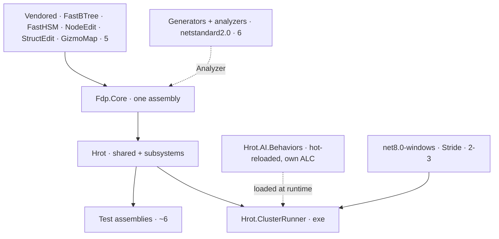

<!--STATUS
state: LIVE
build-state: DESIGN (analysis + options; nothing is buildable until an option is chosen)
updated: 2026-08-23
current-answer: §5 carries the recommendation per sub-question, §6 the sequencing constraint that
  decides WHEN. §2 is the finding that reframes the whole question — read it before the options.
design-basis: user request 2026-08-23 ("we have too many csharp projects… analyze how to restructure
  project to greatly reduce the numbers of projects"), motivated by compilation time and maintenance.
  Charter: PROGRAMME_Unification_And_Harness.md (this is housekeeping ahead of its step 1).
known-conflict: none.
-->
# Q51 — **157 projects. How few could we have, and what would it buy?**

> ⭐ **The ask:** *"I noticed we have too many csharp projects… Naively i imagine we could have one HROT
> assembly, one FDP assembly, and one hot-reloadable AI stuff assembly and one exe, few Unit/integration
> test assemblies."*

## 0. ⭐⭐ THE ANSWER IN ONE LINE

⭐ **The instinct is right and the target is roughly reachable — ~25–30 projects instead of 151, a 5–6×
cut** — ⛔ **but the stated reason for doing it is unmeasured, and the naive shape is not achievable as
written**: four classes of hard boundary make ~12 projects irreducible, and the thing that actually costs
build time is **dependency DEPTH, not project count**.

## 1. ⭐ INVENTORY — measured `2026-08-23` at `477b31f52`

```bash
git ls-files '*.csproj' | wc -l                      # 157 (94 production, 63 test)
grep -c 'Project(' IOS-IG-SimHost.sln                # 151 in the main solution
# + a python walk of every csproj's <ProjectReference> to build the DAG
```

| measure | value |
|---|---|
| `.csproj` in the repo | **157** — 94 production, **63 test** |
| in the main solution | **151** *(+ 9 in `Stride/HrotStrideApp.sln`, + 4 vendored solutions)* |
| `ProjectReference` edges | **511** |
| 🔴 **max dependency-chain depth** | ⭐⭐⭐ **17** |
| highest fan-in | `Fdp.Toolkits` **49** · `Fdp.Core` **44** · `Fdp.Presentation` **25** |
| production C# | **~410k LOC** — `Hrot/Subsystems` 153k · `FDP/Toolkits` 60k · `FDP/Engine` 47k · `FDP/ExtDeps` 45k · `Hrot/Editor` 31k · `Stride` 20k · `Hrot/Network` 19k · `Hrot/Engine` 17k · `FDP/Examples` 12k |
| TFMs | **136** `net8.0` · 9 `net8.0-windows` · 6 `netstandard2.0` · **3 `net10.0`** · 3 multi-target |
| biggest clusters | `Hrot/Subsystems` **43** *(AI 8, Blueprints 7, one per subsystem)* · `FDP/ExtDeps` **37** *(FastBTree 10, GizmoMap 9, FastHSM 7, NodeEdit 6, StructEdit 5)* · `FDP/Examples` **12** |
| ⭐ ExtDeps by role | **12 src · 5 tests · 4 examples · 4 demos** + benchmarks — ⚠ **23 of the 37 are in the main solution** |
| ⭐ the 3 `net10.0` | **all ExtDeps benchmarks / demo-tests** — a stray TFM in vendored demo code, not product code |

## 2. ⭐⭐⭐ THE FINDING THAT REFRAMES THE QUESTION

### ⭐⭐ Depth, not count, sets the build-time floor

📐 **The DAG is 17 levels deep.** `dotnet build` parallelises across independent projects but **serialises
along the dependency chain** ⇒ ⭐⭐⭐ **17 sequential compilations is the floor, on any number of cores.**

⇒ ⛔ **Merging 157 → 40 while leaving the spine 17 deep would barely move incremental build time.**
⭐ What buys speed is **flattening the deep spine** *(`Fdp.Core` → `Fdp.Toolkits` → `Fdp.Presentation` →
`Hrot.Common` → `Hrot.Core` → … → subsystems → runner → tests)*, which is exactly what merging **within**
that chain does — and merging *siblings* does not.

### ⛔⛔ And the compile-time premise is UNMEASURED — 📌 last time we measured, it was RESTORE

📐 `M-37`, `2026-08-20`: full build **79 s** → `--no-restore` **16 s** → `quick-check.sh` **8 s end to
end**. ⇒ ⭐⭐ **the small-fix loop was 10× slower for a reason unrelated to project count**, and it was
fixed without touching structure.

⚠ **A fresh measurement, `2026-08-23`:** full rebuild of the merged solution **2 m 38 s**; a no-change
incremental **~21 s**. ⭐⭐ **That ~21 s is almost pure MSBuild overhead** — 151 up-to-date checks and a
17-level graph walk, compiling nothing. ⇒ **that is the number consolidation attacks**, and it is the one
worth quoting when deciding whether the refactor pays.

⛔ **A correction to my own earlier report:** I described this tree as *"0 errors, 12 warnings"*. That was
an **incremental** build, where up-to-date projects re-emit nothing — the 12 were NuGet advisories only.
⚠ **It was never a whole-tree figure and should not have been quoted as one.**

## 3. ⛔⛔ THE HARD BOUNDARIES — **~12 projects that cannot merge, whatever we decide**

| # | boundary | why it is HARD | projects |
|---|---|---|---|
| **H1** | ⭐⭐ **Roslyn source generators + analyzers** | must target **`netstandard2.0`** and ship as `OutputItemType="Analyzer"`; ⛔ **a generator cannot live inside the `net8.0` assembly it generates into** | **5** — `Fbt.SourceGen` · `Tkb.SourceGen` · `Fdp.Toolkits.Analyzers` · `Hrot.AiEditor.Generators` · `Hrot.Blueprints.Generators` |
| **H2** | ⭐ **`Hrot.Blueprints.Compiler` is `netstandard2.0`** *(a source generator)* | ⚠ **its inability to load game assemblies is a FEATURE** that keeps the compiler pure. ⛔ But this is also the known **netstandard2.0/net8.0 wall that duplicates whole algorithms** *(`BATCH-03-REPORT.md:100`)* — ⭐ consolidation is a chance to *reduce* that duplication, not a reason to ignore it | **1** |
| **H3** | 🔴 **Hot-reloaded assemblies** | 📐 `AiHotReloadCoordinator` loads behaviour DLLs into **collectible `AssemblyLoadContext`s** keyed by blueprintId, and `FbtAssemblyHotReloader` watches a directory **by filename** *(its own doc example: `"Hrot.AI.Behaviors.dll"`)* ⇒ ⭐⭐⭐ **`Hrot.AI.Behaviors` must stay its own assembly — the user's instinct is exactly right, and it is load-bearing, not stylistic** | **1+** |
| **H4** | **`net8.0-windows`** | the Stride tree and the Win32 bits. ⛔ Merging them into the shared assemblies would make **everything** Windows-only | **9** |
| **H5** | **test assemblies** | consolidatable *(63 → ~6)*, ⛔ never into production | — |

## 4. ⭐ SO WHAT IS THE REACHABLE FLOOR?

| | naive target | ⭐ reachable |
|---|---|---|
| FDP | 1 | **1** core + **5** vendored *(see below)* |
| HROT | 1 | **1–3** *(shared + subsystems; possibly editor separate)* |
| hot-reloadable AI | 1 | **1** ✅ exactly as imagined *(H3)* |
| exe | 1 | **1** ✅ |
| generators/compiler | *(not considered)* | ⛔ **6** *(H1+H2)* |
| windows/Stride | *(not considered)* | **2–3** *(H4)* |
| tests | "a few" | **~6** |
| **total** | **~8** | ⭐ **~25–30 in the main solution, from 151** |

⚠ **On the 5 vendored libraries** *(`FastBTree` · `FastHSM` · `NodeEdit` · `StructEdit` · `GizmoMap`)*:
`R-48` records them as **vendored as source, co-evolved, no stable ABI**, each with its own solution for
standalone development. ⭐ **They CAN merge technically** *(it is all source)* ⛔ **but doing so destroys the
standalone dev loop and `R-47`'s enforcement** — see §7. ⇒ ⭐ **keep 5, drop their examples/demos/benchmarks
from the main solution.**



## 5. ⭐⭐ THE OPTIONS — **recommendation per option**

| | option | verdict |
|---|---|---|
| **A** | **Big bang** — one HROT, one FDP, one AI, one exe, few tests, in one batch | ⛔⛔ **REJECT.** Not achievable as stated *(§3)*, and it is the single largest merge-conflict surface any change in this repo could have — ⚠ it would invalidate every in-flight branch simultaneously |
| **B** | ⭐⭐⭐ **Drop non-product projects from the main solution** — ExtDeps examples/demos/benchmarks, `FDP/Examples` where not needed, `tools/ui-probe` | ✅ ⭐⭐ **DO THIS FIRST.** ~20–30 projects leave the build for **near-zero risk** — no code moves, only solution membership. ⭐ It also removes the `net10.0` anomaly entirely *(all 3 are vendored benchmarks/demo-tests)*. **Measurable in an afternoon** |
| **C** | ⭐⭐ **Merge by cluster, DEPTH-FIRST** — collapse the deep spine and the 43 `Hrot/Subsystems` projects, keeping H1–H4 separate | ✅ **the real answer, staged.** ⭐ **Order clusters by how much DEPTH they remove, not by how many projects they remove** *(§2)*. ⛔ **Spike ONE cluster first and measure** before committing to the rest |
| **D** | **Leave structure alone; attack the measured cost** *(restore caching, `--no-restore` habits, `quick-check.sh`)* | ⚠ **already largely done** *(`M-37`)* — ⛔ not an alternative to C, but it is why C must justify itself with a number |

## 6. ⛔⛔ WHEN — **the sequencing constraint, and it is strict**

⭐ **The charter already puts the Stride integration first for exactly this reason** *(done, `477b31f52`)*.
⛔ **But a project/namespace restructure has the largest conflict surface of any change here**, and `R-128`
runs **two implementation lanes**. ⇒

| ⭐ rule | |
|---|---|
| ⭐⭐⭐ **Both lanes must be IDLE**, and stay idle for the duration | ⛔ a lane rebasing across a project split loses a day |
| ⭐⭐ **One cluster per batch, each ending green** | ⛔ never a half-migrated solution across a batch boundary |
| ⭐ **`B` needs no lane freeze at all** | ⇒ another reason to do it first |

## 7. ⚠⚠ WHAT WE LOSE — **stated so the trade is deliberate**

⭐⭐ **An assembly boundary is the only thing that ENFORCES a layering rule. Merging turns every such rule
into a convention nothing checks.**

| ⛔ what merging costs | |
|---|---|
| 🔴 **`R-47`: *"`NodeEditor.Core` must stay ImGui-free"*** | enforced today **because the assembly does not reference ImGui**. ⛔ Inside one merged assembly the rule is unenforceable — ⚠ and it is a rule this repo has needed |
| ⭐ **H2's purity** | the compiler *cannot* load game assemblies because of its TFM. ⛔ Merge it and that guarantee is gone |
| ⭐ **the vendored standalone dev loop** | 5 libraries with their own solutions, co-evolved upstream *(`R-48`)* |
| ⚠ **blast-radius visibility** | 📐 today `Fdp.Toolkits`' 49 dependents make a change's reach *visible*. In one assembly, everything depends on everything and the tooling can no longer tell you |

⇒ ⭐⭐ **The honest framing: consolidation buys build time and less ceremony, and pays for it in lost
enforcement.** ⭐ Where a boundary encodes a RULE *(`R-47`, H2)*, **keep it**; where it merely reflects a
folder, **merge it**.

## 8. ⭐⭐ RECOMMENDED PLAN

| step | action | gate |
|---|---|---|
| **1** | ⭐⭐⭐ **Option B** — prune the main solution to product projects only | ⛔ **measure the no-change incremental build before and after** *(baseline: **~21 s**, full rebuild **2 m 38 s**)*. ⭐ That number is the whole justification for step 3 |
| **2** | **Record the depth reduction per candidate cluster** — which merges remove chain levels, which only remove project count | ⛔ no cluster is scheduled on project count alone |
| **3** | ⭐ **Option C, one cluster per batch**, cheapest-and-deepest first — 🅰 lean: the `Hrot/Subsystems` AI cluster *(8)* and Blueprints cluster *(7)*, then the spine | each batch: solution builds, full gate suite, and **the measured new incremental time in the report** |
| **4** | ⛔ **STOP and re-decide if step 1's measurement shows the win is small** | ⭐ this is the step that keeps us honest — 📌 `M-37` is precedent: the obvious cause was the wrong one |

## 9. ⭐ SUB-QUESTIONS FOR THE USER

| # | question | ⭐ my lean |
|---|---|---|
| **51-A** | Do B (prune the solution) now, before anything else? | ⭐⭐ **yes** — cheap, reversible, no lane freeze, and it produces the number that justifies the rest |
| **51-B** | Accept ~25–30 projects as the target rather than ~8? | ⭐⭐ **yes** — §3's boundaries are real; ⛔ pretending otherwise would mean discovering them mid-refactor |
| **51-C** | Keep the 5 vendored libraries as separate projects? | ⭐⭐ **yes** — `R-47`/`R-48`; merge only their examples/demos out of the build |
| **51-D** | Merge `Hrot.Editor` into the HROT assembly, or keep it separate? | ⚠ **keep separate for now** — ⛔ the unification programme is actively moving features **out** of it; merging mid-programme would hide exactly the boundary we are trying to observe |
| **51-E** | Is a lane freeze acceptable for step 3? | ⭐ **it must be** — otherwise step 3 does not happen at all |
