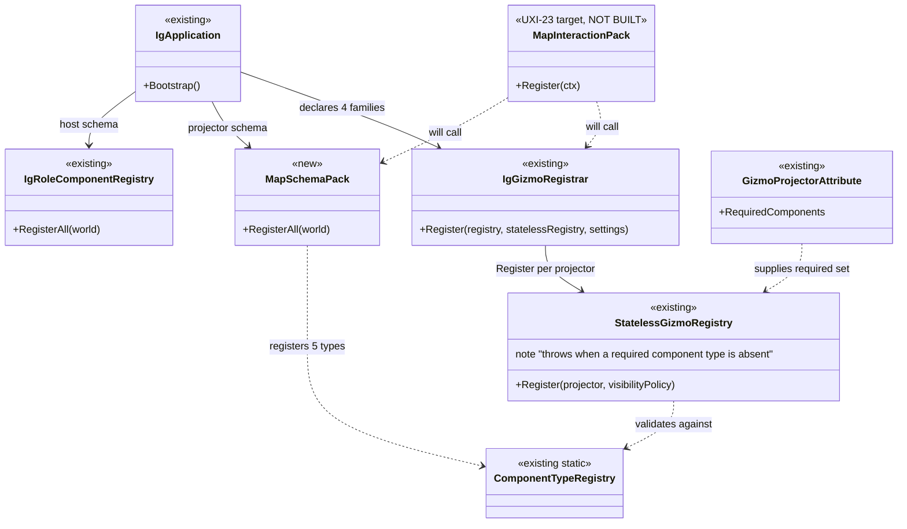
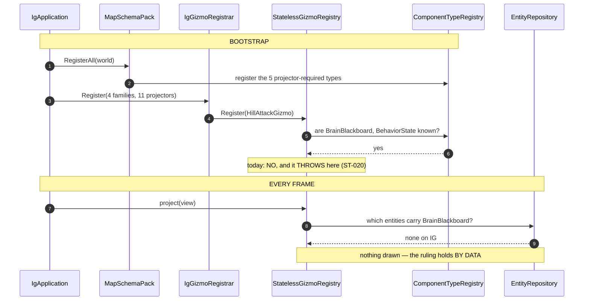

<!--STATUS
state: LIVE
build-state: BUILT
updated: 2026-08-23
current-answer: §0 — the user's rule, and it settles the whole question: support ALL, decide on the
  CURRENT PRESENCE of the component. §2 is the fix, §3 the rail, §4 the UML.
design-basis: 🔒 user ruling 2026-08-23 (§0) · docs/UX/UX_Feature_Map_Parity.md §3.2 (uniform
  membership — the TARGET this fix moves toward) · docs/UX/UX_Tasks_Detail.md Correction 47
  (registering a component TYPE ≠ an entity carrying it).
known-conflict: none. ⭐ UXI-23's MapInteractionPack is the TARGET and is not built; this is the
  bootstrap half of it, landed early because --mode ig is dead today.
-->
# Q52 — **schema follows declaration** *(the `--mode ig` bootstrap crash)*

## 0. ⭐⭐⭐ THE RULE — **user, `2026-08-23`, and it dissolves the question**

> 🔒 *"navigation intent is for sure brain tier — brain wants to navigate somewhere, **but what for is
> that important if we should support all and decide on current presence of component?**"*
>
> 🔒 *"ig is not meant to draw brain tier gizmos. brain components are not **instantiated** on IG."*
>
> 🔒 *"no losening."*

| ⭐ | |
|---|---|
| ⭐⭐⭐ **EVERY host SUPPORTS every projector** | ⛔ **no per-host curation, no per-tier verdict.** 📄 UXI-23 §3.2's *"the pack decides; the host does not curate"* |
| ⭐⭐⭐ **WHETHER A GIZMO DRAWS is decided at RUNTIME by whether the ENTITY carries the components** | ⇒ ⭐ **no IG entity carries `BrainBlackboard`, so `HillAttackGizmo` matches nothing and never draws.** 🔒 The ruling holds **by data**, not by curation |
| ⭐⭐⭐ **TIER IS IRRELEVANT to the decision** | ⛔ so `NavigationIntent` being brain-tier — ⭐ **which it is** — changes nothing |
| ⭐⭐ **the registry keeps THROWING** | ⛔ no loosening. ⭐ It is a **bootstrap-time SCHEMA** check, a different thing from **runtime component PRESENCE** |

⭐⭐ **The distinction the whole question rests on** *(📄 Correction 47, `2026-08-14`)*: **registering a
component TYPE with the world is not an entity CARRYING it.** ⇒ ⭐⭐⭐ **register the type, never instantiate
it** — the registry is satisfied and the gizmo still never draws.

⚠ **Two earlier drafts of this document got this wrong** in opposite directions *(per-host curation, then a
per-projector tier taxonomy)*. ⛔ Both are gone; ⭐ this is the answer.

## 1. INVENTORY — **the queries, and what they found**

| query run | total | result |
|---|---|---|
| `grep ProjectReference Hrot/Subsystems/Hrot.IG/Hrot.IG.csproj` | **9** | ⭐ **`Hrot.SimHost` is NOT among them** ⇒ ⛔ a `Hrot.IG` → `Hrot.SimHost` edge is not an option |
| `grep -rh "GizmoProjector(" Hrot.{Common,AI.Behaviors,IG,ScenarioEditor}` | **11** | `Hrot.Common` **7** · `Hrot.AI.Behaviors` **1** · `Hrot.IG` **3** · ⛔⛔ **`Hrot.ScenarioEditor` ZERO — WRONG, see §6.3.** 📐 There is **no `Hrot.ScenarioEditor` PROJECT**; the **namespace** lives inside `Hrot.Presentation` and holds **7** projector files. ⇒ 🔴 **my grep searched for a DIRECTORY and read the miss as an absence** — the exact failure CLAUDE.md names *("an absence claim from grep is an absence in your pattern, not in the repo")*. ⭐ The real total is **18**, not 11 |
| `grep Register Hrot/Subsystems/Hrot.IG/Gizmos/GizmoRegistrar.cs` | **4 families** | IG declares **all four** |
| `grep RegisterComponent .../IgRoleComponentRegistry.cs` | ~20 | style · culling · selection · trails · effects · overlays · perception · weapon visuals |
| the 4 components those 11 projectors need and IG lacks | **4** | ⛔ `BrainBlackboard` · `BehaviorState` · `EqsSensor` · `BallisticProjectile` · `NavigationIntent` **(5 with the intent)** |
| ⭐ all of them located | **5 / 5** | ⭐⭐ **all in `Fdp.Toolkits`** — a project IG **already references** ⇒ ⛔ **zero new edges** |

### ⭐⭐ The two facts worth keeping

| 🔴 | |
|---|---|
| ⭐⭐⭐ **TWO of the unsatisfied projectors are IG's OWN** | `EqsSensorGizmo` and `ProjectilePresentationGizmo` live in `Hrot/Subsystems/Hrot.IG/Gizmos/` and read `EqsSensor` / `BallisticProjectile`, which IG **never registers**. ⇒ ⛔ **IG declares projectors it cannot satisfy in its own assembly** — a plain omission, no policy |
| ⛔⛔ **~~`Hrot.ScenarioEditor` declares ZERO projectors~~ — RETRACTED** | 🔴 **it declares 7** *(§6.3)*. ⇒ my *"that registrar call is a no-op today"* and the whole of `D`'s answer *("drop it, and say in the commit that it fixed nothing")* were **false**. ⭐⭐ **The fix survived because it does not depend on this** — `MapSchemaPack` registers what the projectors need either way; ⛔ **but the RAIL would have inherited the error**, which is what §6.3 caught |
| ⭐ **why `--mode all` hides it** | SimHost's `Cognitive`/`Combat`/`MuscleRole` registries put the missing schema on the shared world ⇒ IG's declaration is satisfied **by accident of co-tenancy** |
| ⭐ **why the lane's mirror-pattern fix "cascaded"** | it added **one** component at a time. 📐 **The set is 5. It was finite; it just was not enumerated** |

## 2. ⭐⭐⭐ THE FIX — **schema follows declaration**

⭐ **IG registers the component types required by every projector family it declares.** 📐 Five
`RegisterComponent<T>()` calls over `Fdp.Toolkits` types IG already references.

| ⭐ | |
|---|---|
| ⛔ **NOT** *"drop the brain family call"* | that is the host curating — §0 forbids it |
| ⛔ **NOT** *"a new `Hrot.IG` → `Hrot.SimHost` edge"* | the inventory rules it out |
| ⛔ **NOT** *"make the registry skip absent components"* | 🔒 **no loosening** |
| ⭐⭐ **AND IT GENERALISES — which is the point** | 📄 UXI-23's **`MapInteractionPack`** *(designed, **not built** — 📐 zero `.cs` occurrences)* will make **all five hosts** declare all four families. ⇒ ⛔ **it would crash all five the day it lands, exactly as `--mode ig` crashes now**, unless the schema half exists. ⭐⭐ **This fix is that half, landed early** |

## 3. ⭐⭐ THE RAIL — **because a convention nothing checks decays**

⭐ **Per host: every component required by a projector family this host declares is in this host's
registry.** ⛔ Not a comment, not a checklist.

| ⭐ | |
|---|---|
| ⭐⭐ **it covers every host for free** | editor · simhost · cgf · ig · replaybrowser — ⚠ **and it may redden others on first run.** ⭐⭐ **Each red is a FINDING** *(the same omission, elsewhere)*, ⛔ not a number to tune down. ⚠⚠ **SUPERSEDED IN SCOPE `2026-08-23`:** this rail checks invariant **A** *(schema follows declaration)* and ⛔ **not invariant B** *(the declaration is COMPLETE)* — 📐 measured: **the editor declares 6 of 6 families and every other host declares a SUBSET** *(simhost and cgf **1 of 6**, missing the SEVEN-projector `Common` family)*. ⇒ 📄 **[`DESIGN_Uniform_Gizmo_Membership.md`](../DESIGN_Uniform_Gizmo_Membership.md)** carries `B` and the matrix, on the user ruling *"replaybrowser is no exception… same for ig"* |
| ⭐ **it is the acceptance case `MapInteractionPack` will need** | ⇒ ⛔ **do not write a second one later** |
| ⚠ **what it does NOT check** | that a gizmo ever **draws** — ⭐ that is runtime presence, and under §0 it is *supposed* to be empty on IG |

## 4. ⭐⭐⭐ THE UML

### 4.1 Class view — ⭐ **existing vs the one new type**

### 4.2 Sequence — ⭐⭐ **where it throws today, and where the draw decision really lives**

## 5. ⛔ SCOPE

| | |
|---|---|
| ⭐ **in** | the 5 registrations · the per-host rail · `ST-020`'s tripwire **removed** *(it must fail the day this is fixed — that day is this batch)* |
| ⛔ **out** | `MapInteractionPack` itself *(UXI-23)* · the `TagMask` layer filter *(UXI-28 — ⭐ a separate, operator-facing feature; ⛔ **not** the mechanism for "IG has no brain data")* · anything CGF-side |

---

## ⭐⭐⭐ 6. AS-BUILT *(`ST-022`…`ST-025`, Batch gizmo-schema)*

⭐ **Obligation ③:** this design carried **1 `classDiagram` (9 boxes)** and **1 `sequenceDiagram`**. What was
built **matches** on the mechanism — `MapSchemaPack.RegisterAll` in the host's component phase, the
registry still throwing, the draw decision left to runtime data — with **two deviations**, both recorded
below and folded into §4.1.

### ✅ 6.1 Built as designed

| §0/§2 said | as built |
|---|---|
| register the types, never instantiate them | ✅ 5 `RegisterComponent<T>()` calls, no entity ever given one |
| ⭐ zero new project edges | ✅ all five are `Fdp.Toolkits` types IG already referenced |
| the registry keeps throwing | ✅ untouched |
| `--mode ig` starts and ticks | ✅ `ModeStartupRails` **8 / 8**, `ig` an ordinary healthy row |
| `ST-020`'s tripwire removed | ✅ and it **failed first**, exactly as built to (`ST-025`) |

### ⚠ 6.2 DEVIATION 1 — **the schema pack lives in `Hrot.Common`, not `Hrot.IG`** *(`ST-022`)*

§4.1 drew `MapSchemaPack` without naming an assembly and left the home to the implementer. ⇒ It is
**`Hrot/Engine/Hrot.Common/Diagnostics/Gizmos/MapSchemaPack.cs`**, beside the projectors it serves.
⭐ **Reason:** §2's own generalisation argument — `MapInteractionPack` will make **all five** hosts declare
all four families, so the schema half must sit where **every** host can call it. `Hrot.IG` would have
forced a second copy or a new edge the day the next host needed it. ⭐ The call site is
`IgNodeBootstrapper.RegisterDomainComponents` (**Phase 2**), not `IgApplication` as the diagram's box
suggests — Phase 2 is the hook, and it must precede the Phase 6d registrars that validate against it.

### 🔴 6.3 DEVIATION 2 — **the rail keys on NAMESPACE, not assembly** *(`ST-023`)*

⛔ **§1's inventory is subtly wrong and the rail would have inherited the error.** It records
*"`Hrot.ScenarioEditor` declares ZERO projectors"* — 📐 true of a *project* (there is none) but **false of
the namespace**: `Hrot.ScenarioEditor.Gizmos` holds **7** projector files, inside the **`Hrot.Presentation`
assembly**. ⇒ ⭐⭐ `GizmoRegistrarGenerator` emits *"one source file per namespace group"* (`:136`), so that
one assembly carries **two** registrars and a host declaring one does **not** get the other's projectors.
⛔ Grouping by assembly would over-state every host's declarations and redden hosts that are fine.

⇒ ⭐ **`HostProfile.DeclaredRegistrars` is a list of registrar NAMESPACES**, matched against
`type.Namespace`. ⚠ Per-**world** too: `ComponentTypeRegistry` is a process-global monotonic static, so a
fresh `EntityRepository` per case is what keeps the hosts independent.

### ⭐⭐ 6.4 What `T3` found on the other hosts — **§3's "it may redden others"**

| host | verdict |
|---|---|
| `ig` · `simhost` · `cgf` · `editor` | ✅ green after the fix |
| ⚠ **`editor` — reddened FIRST, and the RAIL was wrong** | 📐 my profile stopped at `EditorSubsystem.cs:857-858`; it also registers `CullingState`/`VisualEffectState` **inline at `:864`/`:868`**. ⭐ Settled by a fact already in hand — **`--mode editor` boots**, so a host that would throw in bootstrap cannot be starting. Profile corrected to the host's real code, ⛔ **not loosened** *(`ST-024`)* |
| ⛔ **`replaybrowser` — NOT COVERED** | 📐 declares four families; a grep for `RegisterComponent<`/`ComponentRegistry` across that subsystem returns **nothing**. It boots, so it inherits a world registered elsewhere — ⛔ **the entry point was not guessed at.** Profile owed *(`ST-024`)* |
| ⭐ **no orphan projectors** | a reflection check finds no projector in a namespace no host declares. ⚠ A file-level grep had suggested one in namespace `Hrot.CGF`; the reflective read is authoritative and says no |

### ⚠⚠ 6.5 The limit of the rail, measured not assumed

⛔ **It does not check that a host WIRES its registration.** Each profile calls the registries directly ⇒
commenting out IG's `MapSchemaPack.RegisterAll(world)` left this rail **entirely green**, while
`ModeStartupRails`'s `ig` case reddened. ⇒ ⭐⭐ **the two rails are complementary and neither suffices
alone**: this one catches a projector whose component nothing registers; the mode rail catches a host that
stops calling what it needs. ⭐ Written into the rail's own summary so a green is not over-read.
