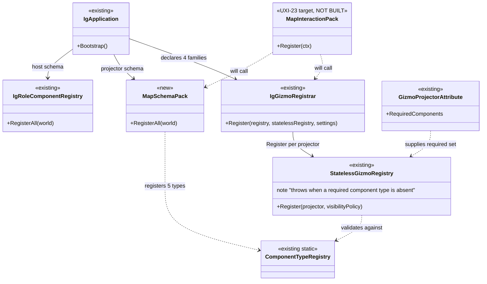
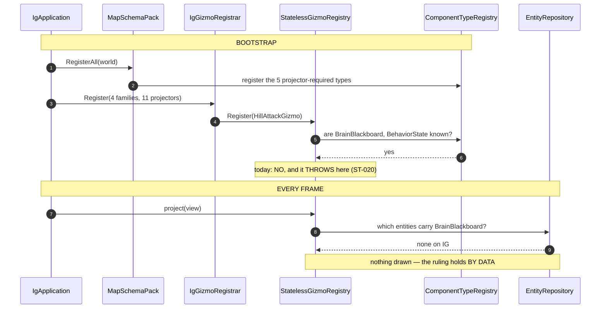

<!--STATUS
state: LIVE
build-state: READY-TO-BUILD
updated: 2026-08-23
current-answer: §0 — the user's rule, and it settles the whole question: support ALL, decide on the
  CURRENT PRESENCE of the component. §2 is the fix, §3 the rail, §4 the UML.
design-basis: 🔒 user ruling 2026-08-23 (§0) · docs/UX/UX_Feature_Map_Parity.md §3.2 (uniform
  membership — the TARGET this fix moves toward) · docs/UX/UX_Tasks_Detail.md Correction 47
  (registering a component TYPE ≠ an entity carrying it).
known-conflict: none. ⭐ UXI-23's MapInteractionPack is the TARGET and is not built; this is the
  bootstrap half of it, landed early because --mode ig is dead today.
-->
# Q52 — **schema follows declaration** *(the `--mode ig` bootstrap crash)*

## 0. ⭐⭐⭐ THE RULE — **user, `2026-08-23`, and it dissolves the question**

> 🔒 *"navigation intent is for sure brain tier — brain wants to navigate somewhere, **but what for is
> that important if we should support all and decide on current presence of component?**"*
>
> 🔒 *"ig is not meant to draw brain tier gizmos. brain components are not **instantiated** on IG."*
>
> 🔒 *"no losening."*

| ⭐ | |
|---|---|
| ⭐⭐⭐ **EVERY host SUPPORTS every projector** | ⛔ **no per-host curation, no per-tier verdict.** 📄 UXI-23 §3.2's *"the pack decides; the host does not curate"* |
| ⭐⭐⭐ **WHETHER A GIZMO DRAWS is decided at RUNTIME by whether the ENTITY carries the components** | ⇒ ⭐ **no IG entity carries `BrainBlackboard`, so `HillAttackGizmo` matches nothing and never draws.** 🔒 The ruling holds **by data**, not by curation |
| ⭐⭐⭐ **TIER IS IRRELEVANT to the decision** | ⛔ so `NavigationIntent` being brain-tier — ⭐ **which it is** — changes nothing |
| ⭐⭐ **the registry keeps THROWING** | ⛔ no loosening. ⭐ It is a **bootstrap-time SCHEMA** check, a different thing from **runtime component PRESENCE** |

⭐⭐ **The distinction the whole question rests on** *(📄 Correction 47, `2026-08-14`)*: **registering a
component TYPE with the world is not an entity CARRYING it.** ⇒ ⭐⭐⭐ **register the type, never instantiate
it** — the registry is satisfied and the gizmo still never draws.

⚠ **Two earlier drafts of this document got this wrong** in opposite directions *(per-host curation, then a
per-projector tier taxonomy)*. ⛔ Both are gone; ⭐ this is the answer.

## 1. INVENTORY — **the queries, and what they found**

| query run | total | result |
|---|---|---|
| `grep ProjectReference Hrot/Subsystems/Hrot.IG/Hrot.IG.csproj` | **9** | ⭐ **`Hrot.SimHost` is NOT among them** ⇒ ⛔ a `Hrot.IG` → `Hrot.SimHost` edge is not an option |
| `grep -rh "GizmoProjector(" Hrot.{Common,AI.Behaviors,IG,ScenarioEditor}` | **11** | `Hrot.Common` **7** · `Hrot.AI.Behaviors` **1** · `Hrot.IG` **3** · 🔴 **`Hrot.ScenarioEditor` ZERO** |
| `grep Register Hrot/Subsystems/Hrot.IG/Gizmos/GizmoRegistrar.cs` | **4 families** | IG declares **all four** |
| `grep RegisterComponent .../IgRoleComponentRegistry.cs` | ~20 | style · culling · selection · trails · effects · overlays · perception · weapon visuals |
| the 4 components those 11 projectors need and IG lacks | **4** | ⛔ `BrainBlackboard` · `BehaviorState` · `EqsSensor` · `BallisticProjectile` · `NavigationIntent` **(5 with the intent)** |
| ⭐ all of them located | **5 / 5** | ⭐⭐ **all in `Fdp.Toolkits`** — a project IG **already references** ⇒ ⛔ **zero new edges** |

### ⭐⭐ The two facts worth keeping

| 🔴 | |
|---|---|
| ⭐⭐⭐ **TWO of the unsatisfied projectors are IG's OWN** | `EqsSensorGizmo` and `ProjectilePresentationGizmo` live in `Hrot/Subsystems/Hrot.IG/Gizmos/` and read `EqsSensor` / `BallisticProjectile`, which IG **never registers**. ⇒ ⛔ **IG declares projectors it cannot satisfy in its own assembly** — a plain omission, no policy |
| ⚠ **`Hrot.ScenarioEditor` declares ZERO projectors** | ⇒ that registrar call is a **no-op today**. ⭐ Under §0 it **stays** *(support all)*; ⛔ it was never the problem |
| ⭐ **why `--mode all` hides it** | SimHost's `Cognitive`/`Combat`/`MuscleRole` registries put the missing schema on the shared world ⇒ IG's declaration is satisfied **by accident of co-tenancy** |
| ⭐ **why the lane's mirror-pattern fix "cascaded"** | it added **one** component at a time. 📐 **The set is 5. It was finite; it just was not enumerated** |

## 2. ⭐⭐⭐ THE FIX — **schema follows declaration**

⭐ **IG registers the component types required by every projector family it declares.** 📐 Five
`RegisterComponent<T>()` calls over `Fdp.Toolkits` types IG already references.

| ⭐ | |
|---|---|
| ⛔ **NOT** *"drop the brain family call"* | that is the host curating — §0 forbids it |
| ⛔ **NOT** *"a new `Hrot.IG` → `Hrot.SimHost` edge"* | the inventory rules it out |
| ⛔ **NOT** *"make the registry skip absent components"* | 🔒 **no loosening** |
| ⭐⭐ **AND IT GENERALISES — which is the point** | 📄 UXI-23's **`MapInteractionPack`** *(designed, **not built** — 📐 zero `.cs` occurrences)* will make **all five hosts** declare all four families. ⇒ ⛔ **it would crash all five the day it lands, exactly as `--mode ig` crashes now**, unless the schema half exists. ⭐⭐ **This fix is that half, landed early** |

## 3. ⭐⭐ THE RAIL — **because a convention nothing checks decays**

⭐ **Per host: every component required by a projector family this host declares is in this host's
registry.** ⛔ Not a comment, not a checklist.

| ⭐ | |
|---|---|
| ⭐⭐ **it covers every host for free** | editor · simhost · cgf · ig · replaybrowser — ⚠ **and it may redden others on first run.** ⭐⭐ **Each red is a FINDING** *(the same omission, elsewhere)*, ⛔ not a number to tune down |
| ⭐ **it is the acceptance case `MapInteractionPack` will need** | ⇒ ⛔ **do not write a second one later** |
| ⚠ **what it does NOT check** | that a gizmo ever **draws** — ⭐ that is runtime presence, and under §0 it is *supposed* to be empty on IG |

## 4. ⭐⭐⭐ THE UML

### 4.1 Class view — ⭐ **existing vs the one new type**

### 4.2 Sequence — ⭐⭐ **where it throws today, and where the draw decision really lives**

## 5. ⛔ SCOPE

| | |
|---|---|
| ⭐ **in** | the 5 registrations · the per-host rail · `ST-020`'s tripwire **removed** *(it must fail the day this is fixed — that day is this batch)* |
| ⛔ **out** | `MapInteractionPack` itself *(UXI-23)* · the `TagMask` layer filter *(UXI-28 — ⭐ a separate, operator-facing feature; ⛔ **not** the mechanism for "IG has no brain data")* · anything CGF-side |
