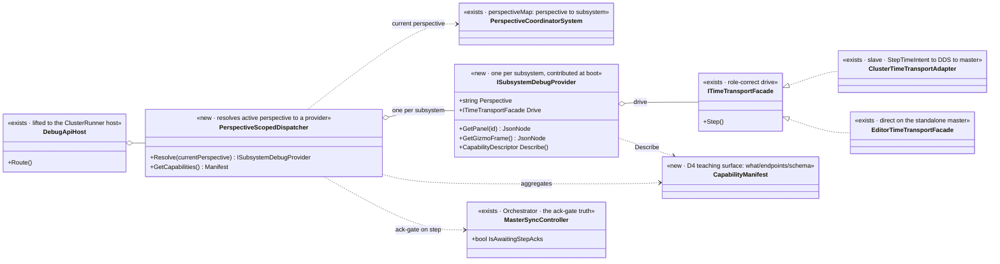
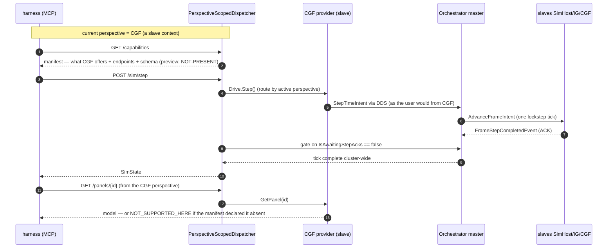

<!--STATUS
state: LIVE
build-state: DESIGN — decision-shaped, awaiting the user's approval on the leans (I analyse/suggest, user approves)
updated: 2026-08-24
current-answer: the whole file — the `--mode all` MCP/DebugApi contract: (Q54-1) how missing / not-yet-ported /
  not-desired features are handled via the capability manifest, and (Q54-2) how perspective-dependent commands
  are routed from the currently-selected perspective's subsystem context.
design-basis: PROGRAMME_Unification_And_Harness.md D3 (lifted API accepts absent capabilities) + D4 (the
  capability manifest is a teaching surface that makes absence assertable) · DESIGN_Perspective_Unification.md
  §1d (three-way verdict SAME/DIFFERENT/NOT-PRESENT, declared not inferred) + §1b (perspective is the finer
  key; perspectiveMap → subsystem) · DESIGN_Headless_Testability.md §"Step 6".
known-conflict: none. ⚠ This SUPERSEDES the framing in DESIGN_Headless_Testability.md §6a that modelled the lift
  as one minimal `ClusterReadDriveService`; §6a is being re-pointed here (task in flight).
-->
# Architect Question 54 — **the `--mode all` MCP / DebugApi contract**

> 🔒 **User, `2026-08-24`, verbatim (the trigger):** *"if the debugApi now requires features that are editor
> only, those features soon become part of the subsystems (at least the cgf subsystem); and we decided to
> provide capability discovery in the MCP api (and thus the internal DebugApi). Also … the MCP in case of
> 'mode all' might need to distinguish from what subsystem's context/perspective the commands are sent. Like
> the step request can be issued from different non-master subsystems like cgf/simhost/excon/ig (the only
> master is the orchestrator) and they might have different implementation - going via dds to master, or maybe
> directly if on master … MCP in 'mode all' should work from the context of the currently selected perspective
> to be closest to how the user would control it."*

⭐⭐⭐ **Two questions, one contract.** ⛔ The earlier design leaned toward *"extract one minimal read+drive
service for `--mode all`."* 📌 **That framing was wrong for the unification:** editor-only features do not stay
editor-only — they **migrate into the subsystems** *(charter D3)*, and a single frozen "cluster service" would
have to be re-split every time one lands. ⇒ ⭐⭐ **The right shape is a PERSPECTIVE-SCOPED DISPATCHER over
per-subsystem capability providers, with a manifest that DECLARES what the current context offers.**

## INVENTORY — measured `2026-08-24` at `878cf022d`

```bash
# search_graph + targeted reads
search_graph(name_pattern=".*TimeTransportFacade.*", label="Class")     # the drive seam, per role
grep -rn "new ClusterTimeTransportAdapter" --include=*.cs Hrot/         # per-subsystem construction
grep -rn "perspectiveMap|PerspectiveCoordinatorSystem" Hrot/Runner/Hrot.ClusterRunner/
grep -rniE "/capabilities|CapabilityManifest" docs/MCP_Integration.md Hrot/Subsystems/Hrot.Editor/DebugApi/
```

| # | fact | where |
|---|---|---|
| ① | **`ITimeTransportFacade` is the drive seam, and it already has ONE impl PER ROLE** | editor: `EditorTimeTransportFacade` *(direct on the standalone `MasterSyncController`)*; slave: **`ClusterTimeTransportAdapter : ITimeTransportFacade`** *(publishes `StepTimeIntent` → `ClusterOpEgressTranslator` → DDS → Orchestrator master)* |
| ② | **each slave subsystem constructs its OWN adapter** | `CgfSubsystem.cs:803`, `SimHostSubsystem.cs:269` *(IG/ExCon fill the same role)* ⇒ ⭐ the role-correct "how do I step" already lives in each subsystem |
| ③ | **the Orchestrator owns the master; only it steps directly** | `OrchestratorSubsystem.cs:153,289` — `MasterSyncController.Update()` drains `StepTimeIntent`; roster = SimHost·IG·CGF |
| ④ | **perspective → subsystem is already a declared map** | `perspectiveMap` *(`Program.cs:263`)*; `PerspectiveCoordinatorSystem(orchestrator, perspectiveMap, …)` — perspective is the finer key *(`DESIGN_Perspective_Unification.md` §1b)* |
| ⑤ | **the orchestrator has NO perspective** | 📐 both its windows are `Global`/empty ⇒ ⭐ **every user-selectable perspective in `--mode all` maps to a NON-master subsystem** ⇒ a step is always issued *"as a slave"* |
| ⑥ | **no capability endpoint exists today** | 📐 `grep` over `docs/MCP_Integration.md` + `DebugApi/` — **zero hits.** The manifest is a fresh build |
| ⑦ | **`GetStatus`/`GetSimState` use editor-only deps** *(`_preview`, `_editor`)* and expose no `awaitingStepAcks` | `DebugApiService.cs:284` — the read surface must be split from those deps *(D3: accept nulls)* |

## ⭐⭐⭐ Q54-1 — missing / not-yet-ported / not-desired features

> **The question:** when the current configuration cannot answer a command or draw a panel — because the
> feature is **not yet ported** *(CGF preview, D3)* or **not desired** in this runner config — what does the
> DebugApi do, and how does conformance tell *"legitimately absent"* from *"broken"*?

| option | shape | ⇒ verdict |
|---|---|---|
| **A** | **404 / throw on absent** *(today's implicit behaviour)* | ⛔ **NO.** D4's whole point: *"a 404 to interpret"* is exactly what makes absence un-assertable. A genuinely broken panel and an unported one look identical |
| **B** | **silent null / empty model** | ⛔ **NO — worse.** This is the false-green the programme exists to kill: a broken panel reads as *"not implemented yet"* forever *(`DESIGN_Perspective_Unification.md` §1d)* |
| ⭐ **C** *(LEAN)* | **A CAPABILITY MANIFEST the host DECLARES** — `GET /capabilities`, per D4 a **teaching surface**: each capability carries **① what it does · ② its endpoints · ③ their schema**; a command against a **declared-absent** capability returns a typed `NOT_SUPPORTED_HERE` *(not a bare 404)*, and conformance is **THREE-way — SAME · DIFFERENT · NOT-PRESENT** with NOT-PRESENT **read from the manifest, never inferred from absence** | ✅ **build.** D4 is already the decided requirement; this is its shape. A should-be-present-but-missing panel is a **failure**; a declared-absent one is tolerated *(D3)*; the day it flips to present is a **reviewed manifest diff** |
| **D** | **static per-mode capability table in the harness** | ⛔ **NO.** Puts host truth in the test; it rots the moment a feature ports. ⭐ The manifest must be emitted BY the host, so it moves WITH the code |

⭐⭐ **Reuse vs build (C):** the manifest is **new** *(inventory ⑥)*, but it is small and additive, and it is the
**only** new mechanism — everything it describes already exists. ⛔ It does not gate features; it *describes*
them. ⚠ **Scope of the first slice:** declare the capabilities conformance actually reads *(panels present per
perspective, gizmo frame, step/perspective drive)* — ⛔ not a boil-the-ocean manifest of all 48 routes on day one.

## ⭐⭐⭐ Q54-2 — perspective-dependent command routing in `--mode all`

> **The question:** a command *(e.g. step)* issued while the **CGF** perspective is selected must behave as if
> the user issued it from the CGF node. Master vs slave, direct vs DDS — how does the DebugApi choose?

| option | shape | ⇒ verdict |
|---|---|---|
| **A** | **one global stepper** — the API always drives the Orchestrator master directly | ⛔ **NO.** It ignores the user's framing *(control from the selected context)*, and it hard-codes the master path where the real UI would go slave→DDS→master. Two code paths would drift from what a user actually triggers |
| ⭐ **B** *(LEAN)* | **PERSPECTIVE-SCOPED DISPATCH** — the DebugApi resolves the **current perspective → owning subsystem** *(inventory ④)* and dispatches read+drive to **that subsystem's own `ITimeTransportFacade` / provider** *(inventory ①②)*. On a slave perspective *(CGF/SimHost/IG/ExCon)* that is `ClusterTimeTransportAdapter` → `StepTimeIntent` → DDS → master; a master-hosted provider would step directly | ✅ **build, and it is almost entirely REUSE.** *"Same call, same intent, two drainers chosen by the node's role"* already exists — this selects the drainer by the **active perspective** instead of by which single process you booted. It is the faithful *"how the user would control it"* |
| **C** | **explicit `?subsystem=` / `?perspective=` param on every command** | ⚠ **partial.** Useful as an *override* for a test that wants to force a context, ⛔ but the DEFAULT must be the selected perspective *(the user's requirement)*. ⇒ **C is an optional add-on to B, not an alternative** |

⭐⭐ **Consequence that makes this clean:** because the orchestrator has no perspective *(inventory ⑤)*, in
`--mode all` **every** selectable perspective routes through a slave adapter → DDS → master. ⇒ ⛔ **there is no
"direct on master" case among user-selectable perspectives today** — the master-direct path is the editor's
single-node case. The design still keeps the per-provider seam so a future master-owned perspective *(if one is
ever added)* drops in without a special case.

⚠ **One risk to name:** the ack-gate *(§Step 6c — `Step()` returns only when `IsAwaitingStepAcks` clears)* must
be evaluated on the **master**, even when the command entered through a slave adapter. ⇒ the dispatcher issues
via the slave provider but **gates on the master's `MasterSyncController`** — the one place that knows the tick
is done cluster-wide. ⭐ Not a contradiction: issue-where-the-user-is, confirm-where-the-truth-is.

## ⭐ UML — the contract





## ⭐ How this changes the conformance batch *(steps 6+7)*

| was *(superseded)* | is |
|---|---|
| extract one minimal `ClusterReadDriveService` | ⭐ a **`PerspectiveScopedDispatcher`** over **per-subsystem `ISubsystemDebugProvider`s** — each subsystem contributes its read surface + drive facade + capability descriptor |
| two-way panel diff | ⭐⭐ **three-way** — SAME / DIFFERENT / **NOT-PRESENT** *(declared by the manifest)* |
| *(no capability surface)* | ⭐ **`GET /capabilities`** *(D4)* — the harness reads it to know what to assert, and a manifest FLIP is a reviewed change |
| step = whatever the lifted service does | ⭐ step routes through the **active perspective's** provider, ack-gated on the **master** |

## Recommended answer *(the user approves)*

- **Q54-1 → Option C** — the capability manifest *(D4)*, three-way conformance verdict, typed `NOT_SUPPORTED_HERE`.
- **Q54-2 → Option B** *(+ C as an optional override)* — perspective-scoped dispatch over per-subsystem providers,
  ack-gated on the master.

⭐ **Both are reuse-heavy**: the only genuinely new pieces are the manifest *(⑥)* and the thin dispatcher; the
drive seam, the per-subsystem adapters and the perspective→subsystem map all exist. ⛔ **On approval:**
`DESIGN_Headless_Testability.md` §6a is re-pointed to this contract, and the conformance handoff *(unstarted)* is
re-issued against it.
