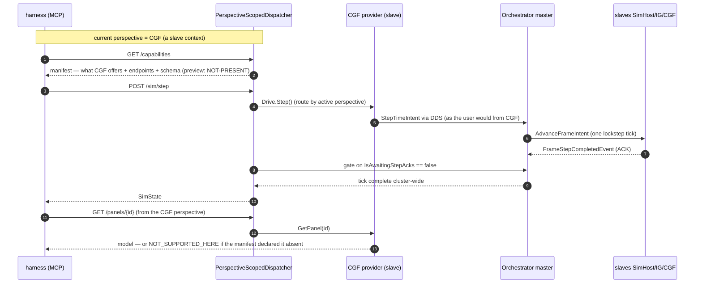

<!--STATUS
state: LIVE
build-state: BUILT — `2026-08-24`. Q54-1 (Option C) and Q54-2 (Option B + C) shipped; `--mode all` answers
  MCP. ⭐ READ § AS-BUILT then § AS-BUILT-2 FIRST: five deviations, one a FOURTH VERDICT the three-way scheme
  did not have. ⭐⭐ AS-BUILT-2 (HN-028) closes the ack-gate's cluster half AND corrects the gate's condition:
  it was level-triggered and confirmed nothing in --mode all.
updated: 2026-08-24
stale-below: § AS-BUILT deviation ② describes the ack-gate as CROSS-LANE BLOCKED — SUPERSEDED by
  § AS-BUILT-2; the row says so and keeps the prior state for history only.
current-answer: § AS-BUILT + § AS-BUILT-2 (at the end) are what SHIPPED and where it deviated. The rest of the file — the
  `--mode all` MCP/DebugApi contract: (Q54-1) how missing / not-yet-ported /
  not-desired features are handled via the capability manifest, and (Q54-2) how perspective-dependent commands
  are routed from the currently-selected perspective's subsystem context. ⭐ The RESOLUTION is in the
  "✅ RESOLVED" section; the sub-questions below are kept as the reasoning of record.
design-basis: PROGRAMME_Unification_And_Harness.md D3 (lifted API accepts absent capabilities) + D4 (the
  capability manifest is a teaching surface that makes absence assertable) · DESIGN_Perspective_Unification.md
  §1d (three-way verdict SAME/DIFFERENT/NOT-PRESENT, declared not inferred) + §1b (perspective is the finer
  key; perspectiveMap → subsystem) · DESIGN_Headless_Testability.md §"Step 6".
known-conflict: none. ⚠ This SUPERSEDES the framing in DESIGN_Headless_Testability.md §6a that modelled the lift
  as one minimal `ClusterReadDriveService`; §6a is being re-pointed here (task in flight).
-->
# Architect Question 54 — **the `--mode all` MCP / DebugApi contract**

> 🔒 **User, `2026-08-24`, verbatim (the trigger):** *"if the debugApi now requires features that are editor
> only, those features soon become part of the subsystems (at least the cgf subsystem); and we decided to
> provide capability discovery in the MCP api (and thus the internal DebugApi). Also … the MCP in case of
> 'mode all' might need to distinguish from what subsystem's context/perspective the commands are sent. Like
> the step request can be issued from different non-master subsystems like cgf/simhost/excon/ig (the only
> master is the orchestrator) and they might have different implementation - going via dds to master, or maybe
> directly if on master … MCP in 'mode all' should work from the context of the currently selected perspective
> to be closest to how the user would control it."*

⭐⭐⭐ **Two questions, one contract.** ⛔ The earlier design leaned toward *"extract one minimal read+drive
service for `--mode all`."* 📌 **That framing was wrong for the unification:** editor-only features do not stay
editor-only — they **migrate into the subsystems** *(charter D3)*, and a single frozen "cluster service" would
have to be re-split every time one lands. ⇒ ⭐⭐ **The right shape is a PERSPECTIVE-SCOPED DISPATCHER over
per-subsystem capability providers, with a manifest that DECLARES what the current context offers.**

## ✅ RESOLVED — user, `2026-08-24`

| # | decision |
|---|---|
| **Q54-1** | ✅ **Option C** — the capability manifest, three-way conformance verdict *(SAME/DIFFERENT/NOT-PRESENT)*, typed `NOT_SUPPORTED_HERE` |
| **Q54-2** | ✅ **Option B + C** — perspective-scoped dispatch over per-subsystem providers, **plus** the optional `?perspective=` override, ack-gated on the master |
| ⭐⭐⭐ **Manifest scope** | ✅ **FULL FROM DAY ONE** *(user, against my incremental lean)* — see below |
| ⭐⭐⭐ **Q54-3 — scenario load** | ✅ **TWO endpoints — `scenario/load/live` + `scenario/load/edit` — both CLUSTER-WIDE via 2PC, on ANY host** *(user, `2026-08-24`)*. ⛔ `scenario/load` is the wrong abstraction; ⛔ the editor is **not special** — a one-node cluster that also uses 2PC. See "§ Scenario load" below |

### ⭐⭐⭐ The manifest is DESCRIPTION × AVAILABILITY — describe every endpoint now; only the matrix changes

> 🔒 **User, verbatim:** *"all endpoints are known, is there any risk doing it at once? the only thing what we
> do not know is when the capabilities will be supported on what subsystem. The manifest could likely be
> describing all the apis, implemented internally just with some matrix what works where - and the matrix will
> change but not the manifest itself (once fully covering the endpoints)."*

⭐⭐ **Accepted, and it is the better model.** Two layers that change at different rates:

| layer | rate | source of truth |
|---|---|---|
| ⭐ **DESCRIPTION** — every endpoint: what it does · params · response schema | ⛔ **STATIC** = complete and config-independent *(all 48 routes exist today)*, ⛔ **NOT hardcoded** | 🔴🔴 **DERIVED FROM CODE** *(user, `2026-08-24`)* — reflected from the **route registrations** and their **request/response DTO types + attributes** *(precedent: `GET /behaviors` emits schema from the registry the runtime parses with)*. ⇒ ⭐⭐ **add a route, the manifest grows itself; nothing to keep in sync.** For panel dumps the response is honestly *"a model JSON per `PanelId`"* — state it as dynamic, do not fake a rigid contract |
| ⭐⭐ **AVAILABILITY MATRIX** — `(capability × perspective/subsystem) → present?` | ⚠ **MUTABLE** — cells flip absent→present as features migrate *(D3)* | 🔴🔴 **MEASURED AT RUNTIME, never hand-authored** — see the risk below |

⭐⭐⭐ **The unifying principle across BOTH layers: NOTHING is hand-authored.** The description is derived from the
**route + DTO attributes** in code; the matrix is derived from **wired-dependency** ground truth. ⇒ ⛔ **the
manifest cannot drift from the code** — neither *what the API is* nor *what this host offers* is a document
someone must remember to update.

### ⛔⛔ The ONE real risk — **a hand-authored matrix is the "green-and-false" rot**

📌 **Not a risk of doing it at once** *(there is none — the endpoints are all known)*. The risk is **where the
matrix's truth lives.** ⛔ A hand-written *"works here / not there"* table is exactly `CLAUDE.md` §M's
*"the ledger may not assert what the code is"* — it stays green while the code drifts *(the `R-04`/`R-25`
class)*. ⇒ ⭐⭐⭐ **each provider DERIVES its own cells from ground truth** — *is the dependency actually wired*
*(CGF preview absent = the preview controller is `null`, not because a table said so)*. The manifest reports
what the host **actually** exposes.

### ⭐⭐ The gap the measured matrix leaves, and the cheap fix — a REVIEWED known-absent baseline

⛔ During migration, *"absent in `--mode all`"* is the **expected** state ⇒ conformance cannot treat
cluster-absence as failure ⇒ a **silently-broken** capability *(wired-but-defaulted-to-`null`, the
silent-default defect)* would read as *"not ported yet"* forever — the exact false green D4 exists to kill.

⇒ ⭐⭐ **Pair the measured matrix with a small COMMITTED `known-absent` baseline** *(the `(perspective,
capability)` cells legitimately not yet present)*. Conformance asserts: **every capability is present in both
modes UNLESS its cell is in the baseline.** Then:

| event | outcome |
|---|---|
| ⭐ a genuine port lands | remove one cell from the baseline — ⭐⭐ **a reviewed one-line diff** *(D4's "the flip is a deliberate, reviewed change")* |
| 🔴 a capability that SHOULD be present is measured absent AND is not in the baseline | ⛔ **FAILS** — the silent-default regression is caught, not shrugged at |

📌 This is the **golden pattern applied to capability**: the runtime manifest is the *live dump*, the baseline is
the *golden*, and a diff is either a reviewed port or a regression. ⭐ Same shape as the gizmo
completeness rail *(source count vs runtime)* already in the repo.

## Q54-3 — Scenario load: two modes, cluster-wide *(→ MCP doc)*

⭐ **Decided `2026-08-24` (user):** two endpoints — `scenario/load/live` + `scenario/load/edit` — both
cluster-wide via 2PC, on any host; ⛔ `scenario/load` is the wrong abstraction and the editor is not special
*(a one-node cluster that also uses 2PC)*.

⛔⛔ **This is an ENDPOINT-DESIGN fix, not an architect-level decision, so the DESIGN LIVES IN THE MCP DOC —**
📄 **[`MCP_Integration.md` § Group U](../MCP_Integration.md)** *(the endpoints, the host-agnostic
`TransitionStateIntent` seam, the live/edit table, the sequence diagram, the built-vs-gap)*. The load state
machine itself is owned by 📄 [`docs/designs/mgmt-1/DESIGN.md` §12](../designs/mgmt-1/DESIGN.md). ⭐ Kept here
only as the record that the decision was taken in this thread; ⛔ do not duplicate the design back into this doc.
## INVENTORY — measured `2026-08-24` at `878cf022d`

```bash
# search_graph + targeted reads
search_graph(name_pattern=".*TimeTransportFacade.*", label="Class")     # the drive seam, per role
grep -rn "new ClusterTimeTransportAdapter" --include=*.cs Hrot/         # per-subsystem construction
grep -rn "perspectiveMap|PerspectiveCoordinatorSystem" Hrot/Runner/Hrot.ClusterRunner/
grep -rniE "/capabilities|CapabilityManifest" docs/MCP_Integration.md Hrot/Subsystems/Hrot.Editor/DebugApi/
```

| # | fact | where |
|---|---|---|
| ① | **`ITimeTransportFacade` is the drive seam, and it already has ONE impl PER ROLE** | editor: `EditorTimeTransportFacade` *(direct on the standalone `MasterSyncController`)*; slave: **`ClusterTimeTransportAdapter : ITimeTransportFacade`** *(publishes `StepTimeIntent` → `ClusterOpEgressTranslator` → DDS → Orchestrator master)* |
| ② | **each slave subsystem constructs its OWN adapter** | `CgfSubsystem.cs:803`, `SimHostSubsystem.cs:269` *(IG/ExCon fill the same role)* ⇒ ⭐ the role-correct "how do I step" already lives in each subsystem |
| ③ | **the Orchestrator owns the master; only it steps directly** | `OrchestratorSubsystem.cs:153,289` — `MasterSyncController.Update()` drains `StepTimeIntent`; roster = SimHost·IG·CGF |
| ④ | **perspective → subsystem is already a declared map** | `perspectiveMap` *(`Program.cs:263`)*; `PerspectiveCoordinatorSystem(orchestrator, perspectiveMap, …)` — perspective is the finer key *(`DESIGN_Perspective_Unification.md` §1b)* |
| ⑤ | **the orchestrator has NO perspective** | 📐 both its windows are `Global`/empty ⇒ ⭐ **every user-selectable perspective in `--mode all` maps to a NON-master subsystem** ⇒ a step is always issued *"as a slave"* |
| ⑥ | **no capability endpoint exists today** | 📐 `grep` over `docs/MCP_Integration.md` + `DebugApi/` — **zero hits.** The manifest is a fresh build |
| ⑦ | **`GetStatus`/`GetSimState` use editor-only deps** *(`_preview`, `_editor`)* and expose no `awaitingStepAcks` | `DebugApiService.cs:284` — the read surface must be split from those deps *(D3: accept nulls)* |

## ⭐⭐⭐ Q54-1 — missing / not-yet-ported / not-desired features

> **The question:** when the current configuration cannot answer a command or draw a panel — because the
> feature is **not yet ported** *(CGF preview, D3)* or **not desired** in this runner config — what does the
> DebugApi do, and how does conformance tell *"legitimately absent"* from *"broken"*?

| option | shape | ⇒ verdict |
|---|---|---|
| **A** | **404 / throw on absent** *(today's implicit behaviour)* | ⛔ **NO.** D4's whole point: *"a 404 to interpret"* is exactly what makes absence un-assertable. A genuinely broken panel and an unported one look identical |
| **B** | **silent null / empty model** | ⛔ **NO — worse.** This is the false-green the programme exists to kill: a broken panel reads as *"not implemented yet"* forever *(`DESIGN_Perspective_Unification.md` §1d)* |
| ⭐ **C** *(LEAN)* | **A CAPABILITY MANIFEST the host DECLARES** — `GET /capabilities`, per D4 a **teaching surface**: each capability carries **① what it does · ② its endpoints · ③ their schema**; a command against a **declared-absent** capability returns a typed `NOT_SUPPORTED_HERE` *(not a bare 404)*, and conformance is **THREE-way — SAME · DIFFERENT · NOT-PRESENT** with NOT-PRESENT **read from the manifest, never inferred from absence** | ✅ **build.** D4 is already the decided requirement; this is its shape. A should-be-present-but-missing panel is a **failure**; a declared-absent one is tolerated *(D3)*; the day it flips to present is a **reviewed manifest diff** |
| **D** | **static per-mode capability table in the harness** | ⛔ **NO.** Puts host truth in the test; it rots the moment a feature ports. ⭐ The manifest must be emitted BY the host, so it moves WITH the code |

⭐⭐ **Reuse vs build (C):** the manifest is **new** *(inventory ⑥)*, but it is small and additive, and it is the
**only** new mechanism — everything it describes already exists. ⛔ It does not gate features; it *describes*
them. ⚠ **Scope of the first slice:** declare the capabilities conformance actually reads *(panels present per
perspective, gizmo frame, step/perspective drive)* — ⛔ not a boil-the-ocean manifest of all 48 routes on day one.

## ⭐⭐⭐ Q54-2 — perspective-dependent command routing in `--mode all`

> **The question:** a command *(e.g. step)* issued while the **CGF** perspective is selected must behave as if
> the user issued it from the CGF node. Master vs slave, direct vs DDS — how does the DebugApi choose?

| option | shape | ⇒ verdict |
|---|---|---|
| **A** | **one global stepper** — the API always drives the Orchestrator master directly | ⛔ **NO.** It ignores the user's framing *(control from the selected context)*, and it hard-codes the master path where the real UI would go slave→DDS→master. Two code paths would drift from what a user actually triggers |
| ⭐ **B** *(LEAN)* | **PERSPECTIVE-SCOPED DISPATCH** — the DebugApi resolves the **current perspective → owning subsystem** *(inventory ④)* and dispatches read+drive to **that subsystem's own `ITimeTransportFacade` / provider** *(inventory ①②)*. On a slave perspective *(CGF/SimHost/IG/ExCon)* that is `ClusterTimeTransportAdapter` → `StepTimeIntent` → DDS → master; a master-hosted provider would step directly | ✅ **build, and it is almost entirely REUSE.** *"Same call, same intent, two drainers chosen by the node's role"* already exists — this selects the drainer by the **active perspective** instead of by which single process you booted. It is the faithful *"how the user would control it"* |
| **C** | **explicit `?subsystem=` / `?perspective=` param on every command** | ⚠ **partial.** Useful as an *override* for a test that wants to force a context, ⛔ but the DEFAULT must be the selected perspective *(the user's requirement)*. ⇒ **C is an optional add-on to B, not an alternative** |

⭐⭐ **Consequence that makes this clean:** because the orchestrator has no perspective *(inventory ⑤)*, in
`--mode all` **every** selectable perspective routes through a slave adapter → DDS → master. ⇒ ⛔ **there is no
"direct on master" case among user-selectable perspectives today** — the master-direct path is the editor's
single-node case. The design still keeps the per-provider seam so a future master-owned perspective *(if one is
ever added)* drops in without a special case.

⚠ **One risk to name:** the ack-gate *(§Step 6c — `Step()` returns only when `IsAwaitingStepAcks` clears)* must
be evaluated on the **master**, even when the command entered through a slave adapter. ⇒ the dispatcher issues
via the slave provider but **gates on the master's `MasterSyncController`** — the one place that knows the tick
is done cluster-wide. ⭐ Not a contradiction: issue-where-the-user-is, confirm-where-the-truth-is.

### ⛔⛔ PARTICIPATE ≠ OBSERVE — **why ExCon is not in the roster, and why the MCP still knows the step finished**

📌 **The confusion this heads off** *(user, `2026-08-24`)*: *"ExCon never ACKs — does that mean it can't tell the
step finished? does it need an ECS core? the MCP must know completion."* ⭐ **Two different things:**

| | PARTICIPATE — send a `FrameStepCompletedEvent` per tick | OBSERVE — know the cluster-wide step finished |
|---|---|---|
| means | *"I executed this frame"* | *"the simulating nodes are done"* |
| needs | ⛔ an **ECS kernel** with a frame to execute | ⭐ only a **read of the master's aggregate state** |
| who | **SimHost · IG · CGF** *(the roster)* | ⭐ **anyone** — the master, ExCon, the MCP, from any perspective |

⇒ ⭐⭐⭐ **The MCP learns completion by OBSERVING, not by ACKing.** The authoritative signal is the master's
`IsAwaitingStepAcks` clearing *(all roster nodes applied the tick)*, which the dispatcher reads in-process
regardless of the active perspective. ⛔ **ExCon needs NO kernel to know the step finished** — a kernel would
only make it a barrier *participant*, and putting a console in the roster would **stall the cluster forever**
waiting on an ACK it has no frame to produce. ⇒ ⛔ **do not "fix" ExCon into the roster.**

⚠ **The genuine second-order point:** ExCon's own `SlaveSyncController` snaps to the master's sim time one drained
frame behind the roster ⇒ if the MCP reads **ExCon's own panels** right after a step, the **settle ticks**
*(switch → step → settle(N) → read)* are what let the observing node catch up. ⭐ Irrelevant to the
editor-vs-cluster diff *(disjoint perspective sets — editor has no ExCon perspective)*.

## ⭐ UML — the contract




## ⭐ How this changes the conformance batch *(steps 6+7)*

| was *(superseded)* | is |
|---|---|
| extract one minimal `ClusterReadDriveService` | ⭐ a **`PerspectiveScopedDispatcher`** over **per-subsystem `ISubsystemDebugProvider`s** — each subsystem contributes its read surface + drive facade + capability descriptor |
| two-way panel diff | ⭐⭐ **three-way** — SAME / DIFFERENT / **NOT-PRESENT** *(declared by the manifest)* |
| *(no capability surface)* | ⭐ **`GET /capabilities`** *(D4)* — the harness reads it to know what to assert, and a manifest FLIP is a reviewed change |
| step = whatever the lifted service does | ⭐ step routes through the **active perspective's** provider, ack-gated on the **master** |

## Recommended answer *(the user approves)*

- **Q54-1 → Option C** — the capability manifest *(D4)*, three-way conformance verdict, typed `NOT_SUPPORTED_HERE`.
- **Q54-2 → Option B** *(+ C as an optional override)* — perspective-scoped dispatch over per-subsystem providers,
  ack-gated on the master.

⭐ **Both are reuse-heavy**: the only genuinely new pieces are the manifest *(⑥)* and the thin dispatcher; the
drive seam, the per-subsystem adapters and the perspective→subsystem map all exist. ⛔ **On approval:**
`DESIGN_Headless_Testability.md` §6a is re-pointed to this contract, and the conformance handoff *(unstarted)* is
re-issued against it.

---

## ⭐⭐⭐ AS-BUILT — **`2026-08-24`, and the five deviations**

> ⭐⭐ Obligation ⑤. ⛔ Where this section disagrees with the reasoning above, **it wins** — the sub-questions
> are the reasoning of record, this is what the code does.

### ⭐ What shipped

| piece | where | note |
|---|---|---|
| ⭐⭐⭐ **`ISubsystemDebugProvider`** · **`SubsystemDebugProvider`** · **`IProvidesDebugSurface`** | `Hrot.Presentation/DebugApi/` | one per subsystem; **CGF · SimHost · IG · ExCon** all contribute |
| ⭐⭐⭐ **`PerspectiveScopedDispatcher`** | *(same folder)* | resolves the LIVE perspective → provider; `Resolve(name)` is `Q54-2`'s `?perspective=` override |
| ⭐⭐ **`NotSupportedHereException`** → **HTTP 501** `{code:"NOT_SUPPORTED_HERE", capability}` | `Hrot.Presentation/DebugApi/` + `DebugApiHost` | `Q54-1` Option C, typed and machine-readable |
| ⭐⭐⭐ **`GET /capabilities`** | `Hrot.Editor/DebugApi/CapabilityManifest.cs` | **64 endpoints enumerated from the live route table**, `unclassifiedRoutes: []`, matrix MEASURED per perspective |
| ⭐⭐ **the API lifted to the ClusterRunner host** | `Program.cs` | the four wiring points, gated on `HROT_DEBUG_API_PORT` **and** on the editor subsystem being absent |
| ⭐⭐ **the dependency split** | `DebugApiService` | a SECOND constructor for the cluster shape; the nine editor deps became resolving members |

📐 **Measured, on a real `--mode all` boot:** `routablePerspectives = [ExCon, IG, Scenario, SimHost]`;
`POST /sim/step` **200** from `Scenario`/`SimHost` and **501 `NOT_SUPPORTED_HERE(time.drive)`** from
`IG`/`ExCon`; `/panels/cgf_fdp_inspector` returns a real model. ⇒ ⭐ perspective-scoped dispatch works as
designed, including its refusals.

### ⛔⛔ The five deviations

| # | the design said | 📐 what was measured, and what was built |
|---|---|---|
| **①** | §6c: *"the ack-gate lives INSIDE `Step()` (preferred — one return contract)"* | ⛔⛔ **IMPOSSIBLE.** `MasterSyncController.Update()` drains the ACKs on the MAIN THREAD and `Step()` is itself a main-thread job ⇒ a blocking wait there deadlocks the loop that clears the flag. ⭐ The gate lives in the HTTP handler, which polls across frames — **the return contract is preserved**, only the location moved |
| **②** | *(the cluster half of the gate)* | ⭐⭐⭐ **RESOLVED `2026-08-24` — see §AS-BUILT-2 below.** *(Prior state, SUPERSEDED: a cross-lane blocker — `IsAwaitingStepAcks` was reachable only through the `MasterSyncController` instance in a private field of `OrchestratorSubsystem`, so the dispatcher took `master: null` and the manifest reported `hasMaster:false` with a rail asserting it.)* |
| **③** | Q54-2's provider carries its deps | ⛔ **A VALUE-CAPTURED provider LIES.** 📐 The first cut reported `time.drive:false` for **SimHost and CGF** — the two that definitely have adapters — because `_clusterTimeAdapter` is built in **`RegisterWindows`**, which runs AFTER the composition root builds providers. ⇒ ⭐ the accessors are `Func<>`s and the matrix measures at READ time. ⚠ A manifest lying in the *safe-looking* direction is worse than one lying loudly |
| **④** | Q54-1: three-way SAME / DIFFERENT / NOT-PRESENT | ⭐⭐⭐ **A FOURTH VERDICT WAS FORCED: *"DIFFERENT BY DESIGN"*.** 📐 Of four comparable shared kinds, two diverge for non-regression reasons — `entity-inspector` *(the hosts hold different worlds)* and `spawner` *(the editor offers platforms, ExCon offers composites)*. ⇒ ⭐ a **declared** set with a REASON per entry, plus a control that reddens if a declared divergence starts AGREEING *(an exemption nothing needs must be deleted)* |
| **⑤** | *(implicit)* the state payloads are readable anywhere | ⛔ **`/status` AND `/sim/state` had to DEGRADE.** 📐 `POST /sim/step` first answered `NOT_SUPPORTED_HERE(preview.control)` on a **fully supported** step, because the RESPONSE read `_preview`. ⇒ ⭐ absent fields are `null` in those two payloads *(and only those two)*; every other endpoint still 501s with the key. ⚠ Absence reported about the wrong thing is worse than no answer |

### 🔴🔴 What the manifest cannot yet describe — **two measured gaps**

| ⛔ | 📐 |
|---|---|
| **`POST /scenario/load` in `--mode all` ⇒ `NOT_SUPPORTED_HERE(editor.authoring)`** | a cluster loads through the orchestrator's 2PC `PrepareLive`, not `IEditorLogic`. ⇒ ⭐⭐ **the conformance sequence *"load S in BOTH, then diff"* is NOT EXECUTABLE today**, so only world-INDEPENDENT structure is comparable. ⚠ This is the single biggest limit on what conformance can currently claim |
| **no cluster host publishes a gizmo frame** | 📐 kind `_gizmo` is editor-only; the handoff's *"dump K **+ the gizmo frame**"* is therefore half-done. ⭐ Declared in the baseline so the suite is green and the gap is visible |

## ⭐⭐⭐ AS-BUILT-2 — **`HN-028`: the ack-gate confirms cluster-wide, and the gate itself was WRONG** *(`2026-08-24`)*

> ⭐⭐ Obligation ⑤. ⛔ This SUPERSEDES deviation ② above **and** amends deviation ①: the gate's *location* was
> right, its *condition* was not.

### ⭐ The exposure — one property, deliberately not the controller

```csharp
// OrchestratorSubsystem.cs, beside the TestHook_ accessors
public bool? IsAwaitingStepAcks => _masterSync?.IsAwaitingStepAcks;
```

| ⭐ | |
|---|---|
| **`bool?`, not `bool`** | `null` ⇒ **no master on this node** *(headless construction, or after `Shutdown` disposes it)*. ⇒ ⭐ absence is ASSERTABLE, the same idiom as charter `D3`/`D4`, and `HasMaster` needs no second member |
| ⛔ **not `MasterSyncController`** | that type also exposes `Step`/`SetTimeScale`; handing it to the debug host invites driving time directly, **bypassing the perspective-scoped drive facade `Q54-2` established**. ⚠ Narrowness here prevents an architectural wrong turn, it is not tidiness |
| ⚠ **read LIVE through a lambda** | `PerspectiveScopedDispatcher` now takes `Func<bool?>? acksPending`, not a value. 📌 `_masterSync` is created in `Initialize` and **set to `null` in `Shutdown`** ⇒ a captured value lies. **This is deviation ③ repeating**, caught before it shipped this time |

### 🔴🔴 The real finding — **the gate was LEVEL-triggered, so in `--mode all` it confirmed NOTHING**

📐 **Measured `2026-08-24`, `--mode all`, paused, one step:** `isAwaitingStepAcks` read **`false` 2 ms after
issuing** and `totalTime` was **unchanged**; the tick appeared **~0.5 s later**.

⛔⛔ **Because `false` means two different things** — *"the barrier drained"* and *"the barrier has not
begun"*. A step is published as an **intent that crosses DDS**, so the flag is reliably in the second state
when the old gate polled it. ⇒ ⭐⭐ **wiring the master in was necessary and not sufficient: the gate would
have returned instantly, looking like a guarantee.** 📌 **The same level-vs-edge defect as the scenario-load
readiness race** — found the same way, one batch apart.

⭐⭐⭐ **The fix is an AND with a MONOTONE observable, not an edge on the flag:**

```
return when   !IsAwaitingStepAcks   &&   totalTime > totalTime-before-the-step
```

⛔ **An edge-trigger *("wait for awaiting to go true, then false")* cannot work in both hosts:** the editor's
standalone master has an **empty roster** and is never observably awaiting, so phase one would always time
out. ⭐ Clock progress is the one signal that means the same thing in the editor and in the cluster.
⚠ **Degrades deliberately:** a host with no clock *(IG/ExCon — `TotalTimeOrNull()` is `null`)* falls back to
the flag alone rather than hanging; those perspectives `501` before reaching the gate today.

### ⭐ What now holds, and what is only a postcondition

| | |
|---|---|
| ⭐⭐ `GET /capabilities` reports **`hasMaster:true`** in `--mode all` | the rail did not disappear when the gap closed — it **INVERTED**, so silently unwiring the master reddens |
| ⭐⭐ `POST /sim/step` returns only once the tick **landed** | new field **`isAwaitingStepAcks` on `/sim/state`** makes the gate's own state observable |
| ⚠⚠ **the rail is a POSTCONDITION, not proof the wait happened** | ⭐ what proves the gate is load-bearing is the MUTATION: pinning the master to *"always awaiting"* turns the step into a **`504`** naming the stalled roster. ⛔ Stated so nobody reads more into the green than it earned |
