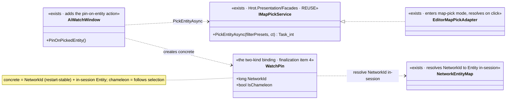
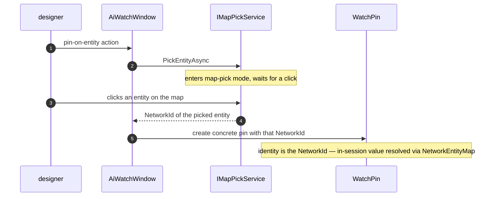

<!--STATUS
state: LIVE
build-state: READY-TO-BUILD — user APPROVED all recommended answers Q55-A..E (2026-08-24). Carries classDiagram + sequenceDiagram.
updated: 2026-08-24
current-answer: the whole file — how a watch row binds to an ARBITRARY concrete entity (one that is NOT the
  current selection). §"RESOLVED" carries the recommended answers; the sub-questions carry the reasoning.
design-basis: DESIGN_Variable_Watch_Pinning.md §3 (the TWO-KIND binding: concrete NetworkId vs chameleon) + §9c
  (the picker, previously "a lead, not a decision"). This question SETTLES §9c. HANDOFF_Watch_List_Finalization.md
  deferred it here.
known-conflict: none. ⚠ Surfaces two ruling-9 duplicates (two IMapPickService, two MapPickableEntityAttribute) —
  flagged, NOT resolved here; the watch reuse consumes ONE and the reconciliation is a separate cleanup.
-->
# Architect Question 55 — **binding a watch to an arbitrary concrete entity (the picker)**

> 📄 **Settles `DESIGN_Variable_Watch_Pinning.md` §9c**, which named a `MapPickableEntityAttribute` lead but was
> explicitly *"not measured; a lead, not a decision."* The watch-list finalization batch
> *([`HANDOFF_Watch_List_Finalization.md`](batches/HANDOFF_Watch_List_Finalization.md))* ships the
> concrete-vs-chameleon CHOICE via the **current selection**; this question settles how to bind a concrete entity
> that is **not** currently selected — i.e. the picker.

## The question, in one line
When a designer wants to watch a variable on a **specific** entity they are not currently selecting, how do they
pick that entity — and what does the watch store so the binding is restart-stable *(§3: a `NetworkIdentity.Value`,
never a recycled `Entity` handle)*?

## INVENTORY — measured `2026-08-24` *(seam-law: a picker already exists and is adopted)*

```
search_graph(name_pattern=".*(MapPick|PickService|PickableEntity).*", label="Interface")
grep MapPickableEntityAttribute · IMapPickService · PickEntityAsync
```

| exists? | mechanism | where | note |
|---|---|---|---|
| ✅✅ | **`IMapPickService.PickEntityAsync(string[]? filterPresets, ct) : Task<int>`** | `Hrot.Presentation/Facades/IMapPickService.cs` *(in-degree 8)* | ⭐⭐⭐ **returns the picked entity's `NetworkId` (int)** — 📐 `EditorSubsystem.cs:1916` `int targetNetId = await _mapPickAdapter.PickEntityAsync()`. **This IS §3's restart-stable identity, already produced by an existing seam** |
| ✅ | **`EditorMapPickAdapter : IMapPickService`** | `Hrot.Editor/Adapters/EditorMapPickAdapter.cs:33` | the editor's impl; async — enters a map-pick mode, resolves when the user clicks an entity |
| ✅ | **adopted across hosts** | editor · IG · CGF · SimHost · ExCon | the pick affordance is not editor-only — mission/spawn/attribute editing already use it |
| ⚠🔴 | **TWO `IMapPickService` interfaces** | `Hrot.Presentation/Facades` **and** `Hrot.ExCon/Services` *(in-degree 22)* — same signature | ruling-9 duplicate — flagged below |
| ⚠🔴 | **TWO `MapPickableEntityAttribute`** | `Fdp.Toolkits/Behavior/Attributes` **and** `Fdp.Presentation/ImGui/Editing/PickerAttributes` | the DECLARATIVE variant — mark a DTO field ⇒ auto-rendered pick button *(mission/behavior params)*. Also a duplicate |
| ✅ | the watch binding target today | `VariableRowOrigin.Entity` *(an `Entity` handle; `default` = chameleon)* | §3 wants this to become a NetworkId for the concrete case — ④ of the finalization batch |

⇒ ⭐⭐⭐ **The seam law holds exactly:** *"we need a picker"* = a picker exists *(`IMapPickService.PickEntityAsync`)*,
is adopted everywhere, and **already returns the NetworkId the watch binding needs.** This is a reuse question,
not a build.

## ✅ RESOLVED — recommended answers *(✅ APPROVED by the user 2026-08-24)*

| # | sub-question | ✅ recommended answer |
|---|---|---|
| **Q55-A** | Build a new picker, or reuse? | ✅ **REUSE `IMapPickService.PickEntityAsync`.** It already returns a `NetworkId`, is host-agnostic, and its async "enter pick mode → click → resolve" shape is exactly the gesture. ⛔ Do not build a watch-specific picker — that would be a third pick path |
| **Q55-B** | Which `IMapPickService` *(two exist)*? | ✅ **the `Hrot.Presentation/Facades` one** — it lives in the shared presentation assembly the watch panel already depends on, and `EditorMapPickAdapter` implements it. ⚠ The `Hrot.ExCon/Services` twin is a **ruling-9 duplicate**; ⛔ **not reconciled here** — filed as a follow-up. The watch consumes the Facades one |
| **Q55-C** | How is the pick invoked from the watch UI, and what is stored? | ✅ **a "pin on entity…" watch action** *(beside the existing "pin chameleon")*: call `PickEntityAsync()`, take the returned `NetworkId`, and create a **concrete** `WatchPin` carrying that `NetworkId` *(identity/persistence)* + the resolved in-session `Entity` *(display)*. ⛔ **Direct call, NOT the attribute path** *(Q55-D)* — a watch pin is a first-class gesture, not a DTO form field |
| **Q55-D** | Reuse the declarative `MapPickableEntityAttribute` instead? | ✅ **NO for the watch pin** — the attribute auto-renders a pick button on a **DTO field** *(mission/spawn params)*; a watch binding is not a serialized DTO field, so the direct `PickEntityAsync` call is the right fit. ⚠ The **two** `MapPickableEntityAttribute` definitions are a separate ruling-9 duplicate — flagged, not this batch |
| **Q55-E** | Filter what is pickable? | ✅ **pass no filter for v1** *(`PickEntityAsync()` with `filterPresets = null` = any entity)*. ⭐ `filterPresets` is there if we later want "only entities of this asset/type" — a cheap round-out, not required now |

⭐⭐ **Reuse-vs-build tradeoff, per sub-question:** every answer is REUSE except the thin new UI action (Q55-C) —
one call site into an existing service. ⛔ **The only genuinely new code is the "pin on entity…" action and the
concrete-`WatchPin` construction**, both of which the finalization batch's ④ already introduces the binding model
for. So AQ55 is the *"how to set the concrete binding to a non-selected entity"* cap on that item.

## ⭐ UML





## ⚠ Two ruling-9 duplicates this question SURFACES but does NOT resolve

⭐ Filed so they are not forgotten; ⛔ **out of scope for the watch reuse** *(which consumes exactly one of each)*:
1. **`IMapPickService` ×2** — `Hrot.Presentation/Facades` vs `Hrot.ExCon/Services`, identical signature. Reconcile to one shared seam *(its own cleanup batch)*.
2. **`MapPickableEntityAttribute` ×2** — `Fdp.Toolkits/Behavior` vs `Fdp.Presentation/ImGui`. Reconcile *(its own cleanup)*.

## ⛔ NOT this question
⭐ Restart SURVIVAL of the concrete binding *(resolving the stored `NetworkId` back to a live `Entity` after a
scenario restart, via the remap)* is **slice `94g`** — HN-037's lane *(`DESIGN_Deterministic_Network_Ids.md` §11
territory)*. AQ55 stores the `NetworkId`; 94g makes it survive a restart.
