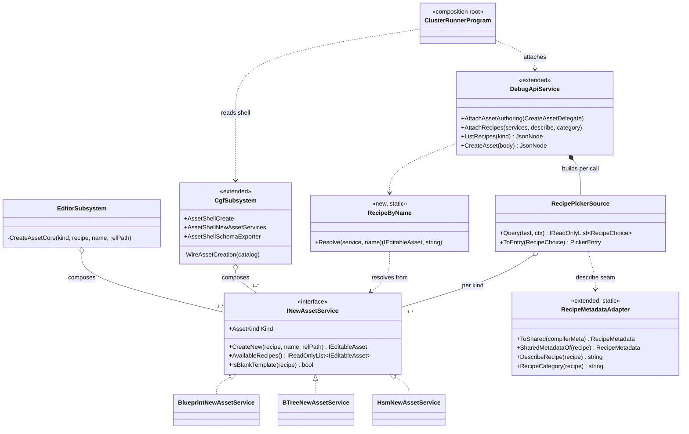
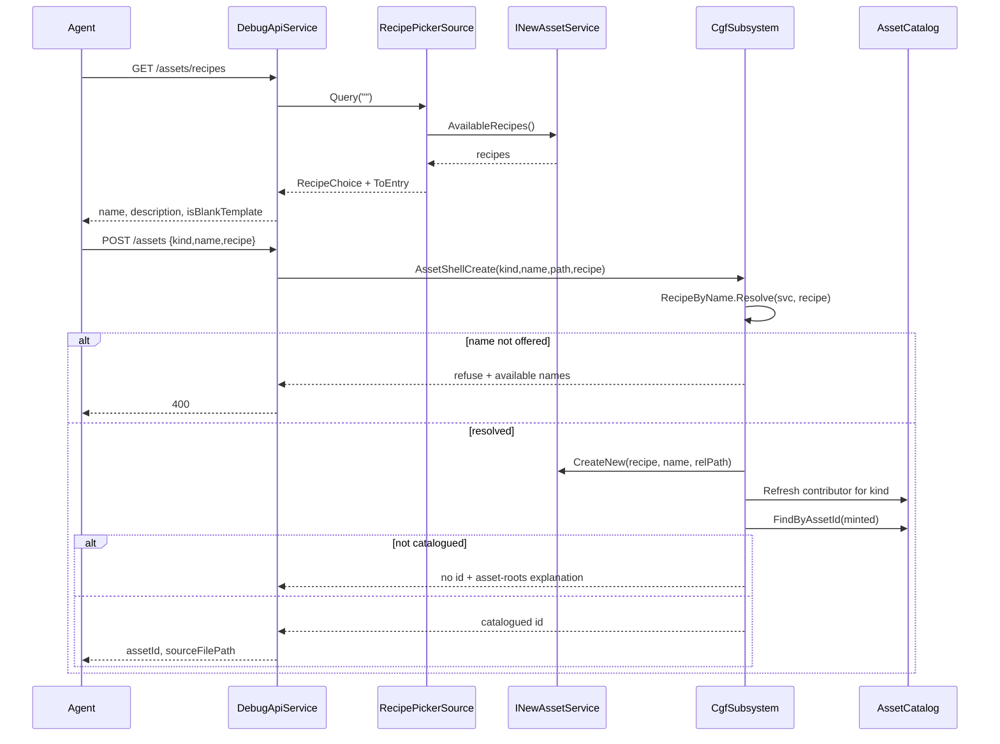

<!--STATUS
state: LIVE
build-state: BUILT — `2026-08-25`, ids `MA-019`…`MA-023`. All three recommended answers were APPROVED by
  dispatch (HANDOFF_Mcp_Create_Recipes_Wiring.md) and are now shipped. ⭐ §"AS BUILT" carries the UML and
  the two deviations; it WINS over the sections above it where they disagree.
updated: 2026-08-25
current-answer: ⭐⭐ §"AS BUILT" (the shipped shape). §"RECOMMENDED ANSWERS" remains true as the DECISION —
  ⛔ but read the as-built for what the code actually does.
stale-below: nothing is stale; §1–§2 are the measurement that produced the decision and still hold.
former-answer: §"RECOMMENDED ANSWERS". ⭐ REVISED `2026-08-25` by prior-art (user): recipe DISCOVERY already
  exists (`RecipePickerSource` over `INewAssetService.AvailableRecipes`) ⇒ this is NOT a packaging decision but
  a small WIRING slice — construct the per-kind service dict at CGF's root (reuse `RecipePickerSource`) + a
  `GET /assets/recipes` MCP route. No new registry/assembly. The authoring SHELL / undo / role-gating / Q25-C
  are already recommended in AQ25 (§0). The variable-model freeze is LIFTED (`2026-08-25`).
design-basis: PROGRAMME_Cgf_Equals_Editor_Gap_Map.md (the two rows "Hrot.Editor catalog/NewAssetService
  packaging" + "Behavior/scenario authoring on CGF") · Architect_Question_25_Scenario_Authoring_Golden_Path.md
  (the authoring-shell decisions, recommendations awaiting approval) · AQ51 Project_Consolidation / AQ53
  Gizmo_Pack_Home (the precedent family: "where does a shared capability's home live") · ruling 66 (editor =
  one-node cluster) · MA-011..018 (MCP create-asset already reuses INewAssetService per kind).
known-conflict: none. ⚠ Number 57 taken as the next free across all active branches (rule 3a).
-->
# Architect Question #57 — **CGF authoring packaging: where does create-asset live?**

> 🎯 CGF now OPENS, EDITS and hot-reloads AI assets, and drives all of it over MCP *(CE-001..036, MA-001..018)*.
> The remaining gap to a **full authoring node** is **CREATE** — a new asset from a template. The create-asset
> machinery *(the catalog + per-kind `INewAssetService`)* is wired behind **`Hrot.Editor`**, which CGF does not
> reference. ⛔ **This is the one packaging decision the autonomous CGF run flagged and routed around** *(it
> avoided it for ruling 67 because `AssetRoots.Configure` takes a plain path — but create-asset cannot dodge it)*.

## 0. ⭐ WHAT IS ALREADY DECIDED *(do NOT re-draft — approve in place)*
📄 The authoring **shell / recoverability / role-gating / problems-list / behavior-affinity** decisions are
already recommended in **[`Architect_Question_25_Scenario_Authoring_Golden_Path.md`](../UX/Architect_Question_25_Scenario_Authoring_Golden_Path.md)** §"RECOMMENDED ANSWERS" *(added `2026-08-25`, awaiting your approval)*:
| AQ25 sub-q | recommendation *(awaiting approval)* |
|---|---|
| Q25-A undo/recoverability | autosave + Revert-to-Saved + **bounded single-step undo** of the gizmo gestures *(runtime host registers no inverses ⇒ Ctrl+Z correctly absent)* |
| Q25-C behavior affinity + **schema-driven param UI** | ✅ **C′ MEASURED feasible by REUSE** — a schema-driven sibling of the existing `BlueprintFieldDescriptor` renderer, ⛔ not `BehaviorUiCompiler` codegen *(which is strictly CLR-type-driven)* |
| Q25-D role/mode gating | per-host composition *(Q26)* — an SME host simply never composes the engineer-only controls |
| Q25-E problems list | one host-agnostic contract *(severity · message · source-ref · navigate)* |
⇒ ⭐ **They are postponable FEATURES** *(AQ25's own scoping: missing on the editor too, shared for free once built)* — ⛔ **not blockers for CGF authoring.** This AQ covers only the packaging that IS a blocker for CREATE.

## 1. ⭐⭐ INVENTORY — measured `2026-08-25` *(where create-asset lives today)*
```
search_graph name_pattern=".*NewAssetService" · ".*(Asset)?Catalog"
```
| ✅ exists | assembly | CGF references it? |
|---|---|---|
| **`INewAssetService`** *(the seam)* + `IAssetCatalog` / `IAssetCatalogContributor` | ⭐ **`Hrot.Editor.AiShared`** *(the SHARED assembly)* | ✅ **yes** — CGF built the shell on it |
| `BlueprintNewAssetService` *(182 ln)* | `Hrot.Blueprints.Editor` | ⚠ partly — CGF references it for the command sink/document factory *(slices 2–3)* |
| `BTreeNewAssetService` *(169)* · `HsmNewAssetService` | `Hrot.BTree.Editor` · `Hrot.Hsm.Editor` | ⚠ same |
| ⭐⭐⭐ **`RecipePickerSource`** — enumerates **`INewAssetService.AvailableRecipes` per kind** *(from a `Dictionary<AssetKind, INewAssetService>`)*; `RecipeMetadata`; `NewFromRecipeService` *(create-from-recipe)* | ⭐ **`Hrot.Editor.AiShared`** *(SHARED)* | ✅ **yes** — recipe DISCOVERY + create-from-recipe already live in the shared assembly |
| the New-Asset **dialog wiring** that constructs the `Dictionary<AssetKind, INewAssetService>` | 🔴 **`Hrot.Editor`** *(the editor SUBSYSTEM/app assembly)* | ⛔ **NO** — the only real gap |

⇒ ⭐⭐⭐ **PRIOR ART (user, `2026-08-25`): recipe DISCOVERY already exists.** `RecipePickerSource` over
`INewAssetService.AvailableRecipes` **is** the "available recipes" registry — ⛔ **do NOT build a new
`NewAssetRegistry`.** The interfaces, the recipe enumeration, and create-from-recipe are ALL in the shared
`AiShared`. ⇒ ⭐⭐ **the decision collapses to a WIRING question:** who constructs the
`Dictionary<AssetKind, INewAssetService>` at CGF's composition root, and expose recipe-discovery over MCP.

## 2. ⭐ THE SUB-QUESTIONS *(collapsed by the recipe-discovery prior art — §1)*

### Q57-A — Who constructs the per-kind `INewAssetService` set at CGF's root?
📐 **Measured:** the impls live in the per-subsystem AI editor assemblies *(`Hrot.Blueprints.Editor` etc.)*, which CGF **already references** for the command sinks/document factories *(slices 2–3)*. ⇒ the services can be constructed at CGF's composition root **with no new assembly dependency** — the same place slice 1 built `AssetCatalog`. The `Dictionary<AssetKind, INewAssetService>` the editor's dialog assembles is the only thing `Hrot.Editor` currently owns; CGF builds its own from services it can already see.
| option | trade |
|---|---|
| ⭐ **A1 — construct the dict at CGF's root** *(mirroring slice-1's `AssetCatalog` construction)* + feed `RecipePickerSource` | ⭐ **no new assembly, no new type** — reuse `RecipePickerSource`; ⚠ confirm CGF references the three per-kind editor assemblies *(it should, post slices 2–3)* |
| **A2 — CGF references `Hrot.Editor`** | ⛔ pulls the whole editor subsystem into a runtime node *(ruling 66)*; rejected |
| **A3 — a new shared assembly** | ⛔ unnecessary now that recipe discovery already lives in AiShared |

### Q57-B — Expose recipe DISCOVERY over MCP *(the one genuinely-new surface)*
`RecipePickerSource` gives the list; expose it as **`GET /assets/recipes`** *(per kind: recipe name · description from `RecipeMetadata`)* — the recipe analog of node-kind discovery *(MA-013)*, so the agent knows what it can create.

### Q57-C — Create goes through the SAME shipped route
📌 **Measured:** MA- shipped **`POST /assets` create → `INewAssetService` per kind**. It works on the editor because the services are wired there. ⇒ CGF gains create the moment A1 wires the dict at its root — ⛔ no new create route.

## ✅ RECOMMENDED ANSWERS — *(coordinator; approve or redirect)*
| # | ✅ recommended |
|---|---|
| **Q57-A** | **A1 — construct the `Dictionary<AssetKind, INewAssetService>` at CGF's composition root** *(exactly where slice 1 built `AssetCatalog`)* and feed the existing **`RecipePickerSource`**. ⛔ **No `NewAssetRegistry`, no new assembly** — the recipe-discovery registry already exists in AiShared. ⚠ Only confirm CGF references the three per-kind editor assemblies *(it should, post slices 2–3)*; if one is missing that is the whole of the work. |
| **Q57-B** | expose **`GET /assets/recipes`** over MCP from `RecipePickerSource` — the recipe analog of node-kind discovery. |
| **Q57-C** | **reuse the shipped `POST /assets` create route** — no new MCP surface. |

⇒ ⭐⭐ **Net, revised: this is NOT a packaging decision — it is a WIRING slice.** Construct the per-kind service dict at CGF's root *(reusing `RecipePickerSource`)* + one `GET /assets/recipes` route. **No new registry, no new assembly, no freeze coordination** *(the freeze is lifted anyway, `2026-08-25`)*. ⇒ small enough to fold into a CGF-lane batch, ⛔ not really an architect decision — flagged here only because the overnight run correctly refused to guess the assembly boundary.

## ⛔ NOT this AQ
- The authoring **shell / undo / role-gating / problems-list** — **AQ25**, awaiting approval *(§0)*.
- **Q25-C** schema-driven param UI — **AQ25**, resolved feasible-by-reuse, awaiting approval.
- **Axis B** map/entity authoring — gated on **UXI-30** *(separate; see the gap map)*.

---

# ⭐⭐⭐ AS BUILT — `2026-08-25`, ids `MA-019`…`MA-023` *(obligation ⑤)*

> ⭐⭐ **All three recommended answers shipped as recommended.** ⭐ Two things the design did NOT say are
> below as **deviations**, both argued. ⛔ This section wins over §2/§"RECOMMENDED ANSWERS" on what the
> code does.

## A. ⭐ The measurement that made this cheap — **confirmed, not assumed**

| §1 claimed | 📐 measured `2026-08-25` |
|---|---|
| CGF already references the three per-kind editor assemblies | ✅ **true** — `Hrot.CGF.csproj` lines 43/52/53. ⇒ **no reference was added; item ① was a dictionary literal** |
| recipe discovery already exists | ✅ **true** — `RecipePickerSource` + `RecipeMetadata` + `INewAssetService.AvailableRecipes()`, all in the SHARED `Hrot.Editor.AiShared`. ⛔ **Nothing was built to enumerate recipes** |
| `POST /assets` create is already shipped | ✅ **true** — and it gained ONE optional field, not a route |

📐 **The node now offers 21 recipes across Blueprint / BTree / Hsm where it offered none.**

## B. ⭐⭐ CLASSES — *existing in grey prose, NEW marked* `«new»`



⭐⭐ **The whole diagram is REUSE except two boxes** — `RecipeByName` *(new)* and `RecipeMetadataAdapter`
*(extended)*. ⛔ **No new registry, no new assembly** — Q57-A1 / A3 as recommended.

## C. ⭐⭐ SEQUENCE — discover, then create from what you discovered



⭐⭐⭐ **The two `alt` arms are the design.** ⛔ Both were built as REFUSALS rather than best-effort
successes, because this surface has now been bitten twice by the opposite *(`MA-004` — an id that
resolved to nothing; `MA-017` — a command accepted that built nothing)*.

## D. ⚠⚠ DEVIATION 1 — **`POST /assets` gained a `recipe` field** *(`MA-021`)*

⛔ §Q57-C said *"reuse the shipped create route"*, and §Q57-B said *"expose recipe discovery."*
📐 **Taken literally, together, they are incoherent:** the shipped route resolved the kind's **blank
template** and nothing else, so **every recipe discovery listed would have been unbuildable.**

⇒ ⭐ the route takes an OPTIONAL `recipe` name. ⭐⭐ **Still not a new route** — the constraint that
mattered *(⛔ no second create path)* holds; `CreateAssetDelegate` gained a parameter.
⚠ **An unmatched name is an ERROR carrying the available names**, never a silent fall back to blank.

## E. ⚠ DEVIATION 2 — **the `describe` seam was inert, and is now wired** *(`MA-020`)*

📐 **Measured:** `RecipePickerSource(services, describe, recipeCategory)` has carried both seams since
it was written; **`RecipeMetadataAdapter.ToShared` had ZERO production callers**; and
`NewAssetLauncher` was constructed with neither. ⇒ **every recipe rendered with a null description
while `BlueprintAsset.EditorMetadata.Recipe` held one** — 📌 the silent-default shape *(the caller HAD
the value and did not pass it)*.

⭐ **Wired for BOTH surfaces from one resolver** — the New-Asset picker and `GET /assets/recipes`.
📐 **Proven, not asserted: `17 / 21` recipes now carry a description; the revert probe measures `0 / 21`.**
⚠ The four without are the synthetic BTree/HSM `Empty` and `Starter` entries, which genuinely have none.

## F. ⭐ Item ④ — the schema exporter *(`MA-022`)*

⭐ CGF constructs `ActionSchemaExporter` and calls `Rebuild()` before publishing it.
⛔ **`Rebuild()` is not optional:** the exporter is born empty and is otherwise refreshed only by
`ActionSchemaExporterCatalogWatcher`, which CGF does not wire — ⚠ an un-rebuilt exporter would make every
kind report an EMPTY param list, which reads as *"this kind has no params"* rather than *"nothing was
reflected."* 📐 `paramsSource: none:no-exporter-wired` no longer occurs on a cluster node.

## G. ⛔ Scenario is NOT creatable on CGF — **measured, and reported as such**

📐 `ScenarioNewAssetService` takes an `IEditorLogic` session adapter; **CGF has no `IEditorLogic`.**
⇒ `POST /assets {"kind":"Scenario"}` answers with the composition explanation.
⭐ **The kinds a host offers are DATA** — `GET /assets/recipes` returns `kinds[]`, so an agent reads the
difference instead of discovering it by failure.
