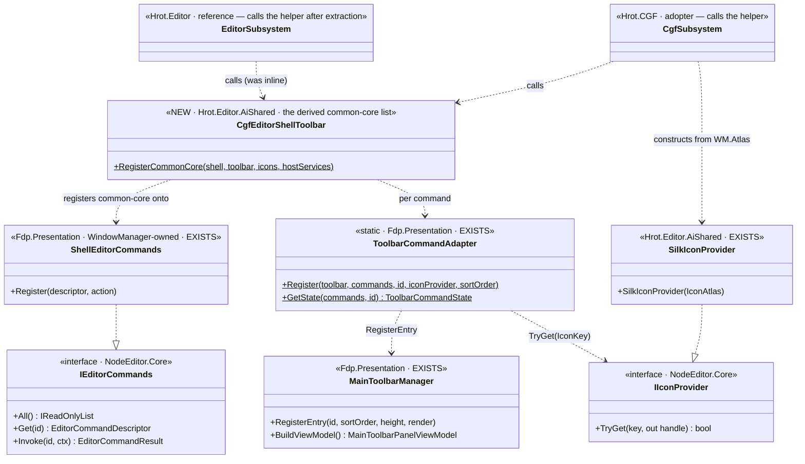
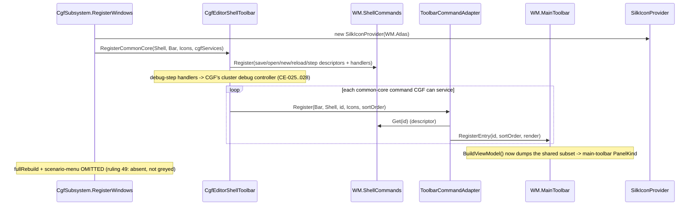

<!--STATUS
state: LIVE
build-state: DESIGN — decision-shaped; carries a RECOMMENDED LEAN per sub-question. Not READY-TO-BUILD
  until the lean (or an alternative) is approved. The §7 classDiagram+sequenceDiagram are for the LEAN.
updated: 2026-08-26
current-answer: §6 (the recommendations) + §7 (the UML for the lean). Approve or name the option to change.
known-conflict: none. The canvas /editor/commands bus is a SEPARATE surface (MD-008) — see §2.
-->
# Architect Question 58 — **CGF shell-command + main-toolbar adoption** *(CE-016 §7)*

> 🎯 **The gap:** CGF's main toolbar carries a time section + two **ad-hoc `ImGui.Button`** entries
> (Save All / Reload AI) with **no icons**, registered **outside** the shared
> `ShellEditorCommands → ToolbarCommandAdapter (+IIconProvider)` pipeline the editor runs. CGF registers
> **zero** shell commands and constructs **no** icon provider. This is **seam-law instance 30**
> *(ruling 58: the four shell registries have ONE writer — the editor)*.
> ⭐ **I analyse and SUGGEST; you APPROVE** *(CLAUDE.md)*. Every sub-question below carries a lean.

## 1. ⭐⭐⭐ INVENTORY *(codebase-memory `search_graph`, graph @ 192k nodes, `2026-08-26`)*

Queries run: `search_graph(name_pattern=".*(Toolbar|Command|Icon).*", label="Interface")` → **19**;
`search_graph(name_pattern=".*(Toolbar|EditorCommand|IconProvider).*", label="Class")` → **51**.

| the shared pipeline *(all EXISTS; the point is CGF under-adopts it)* | home | on CGF's build graph? |
|---|---|---|
| `IEditorCommands` *(All · Get · Invoke · AvailabilityChanged)* + `EditorCommandDescriptor` *(Id, DisplayName, Category, Description, IconKey, DefaultKey, IsEnabled, IsChecked, DynamicDisplayName)* | `NodeEditor.Core/Action` | ✅ |
| `ShellEditorCommands : IEditorCommands` — WindowManager-owned; `Register(descriptor, action)` | `Fdp.Presentation/…/WindowManager` | ✅ **CGF's WM already OWNS one — empty** |
| `ToolbarCommandAdapter.Register(toolbar, commands, id, iconProvider, sortOrder, perspective?)` *(static; `GetState`/`ResolveTooltip` = headless seams)* | `Fdp.Presentation/…/WindowManager` | ✅ **never called by CGF** |
| `MainToolbarManager` *(`RegisterEntry` · `BuildViewModel` → readable `main-toolbar` PanelKind)* | `Fdp.Presentation/…/WindowManager` | ✅ **CGF's WM owns one — 2 ad-hoc entries + time** |
| `IIconProvider.TryGet(key, out IconHandle)`; real impl `SilkIconProvider(IconAtlas)` | iface `NodeEditor.Core`; impl `Hrot.Editor.AiShared/Adapters` | ✅ **reachable transitively; CGF builds NONE** |
| `ShellSaveCommands.Register(...)` *(host-agnostic static; id consts `shell.save/saveAs/saveAll`)* | `Hrot.Editor.AiShared/Documents` | ✅ **used by editor, not CGF** |
| `PerspectiveToolbarSection` | `Fdp.Presentation/…/WindowManager` | ✅ **absent on CGF *(a dangling `ToolbarSep_TimeToPersp` sep, no section)*** |

**What CGF registers today** *(`CgfSubsystem.cs`)*: `MainToolbarTimeControlSection` (`:1082`, CE-034) · `"SaveAllAiDocuments"`/`"QuickReloadAiAsset"` as raw `ImGui.Button` `RegisterEntry` delegates (`:1657-1667`, CE-022) · a dangling separator (`:1087`). No `ShellEditorCommands` use, no `ToolbarCommandAdapter`, no `IIconProvider`. Three silent-defaults: `ShellCommands` left empty · `Atlas` in hand but no `SilkIconProvider` · the WM (hence `.MainToolbar`/`.ShellCommands`) reaches `Program.cs` but no toolbar accessor is exposed.

**The editor's wiring** *(the reference — `EditorSubsystem.cs:4464-4587`, sole writer)*: builds `new SilkIconProvider(windowManager.Atlas)`, registers Save/Open/New + AI-debug + compileReload/fullRebuild on `windowManager.ShellCommands`, then `ToolbarCommandAdapter.Register(...)` per command at fixed sort orders, plus `PerspectiveToolbarSection` and `MenuCommandAdapter` for the menu.

## 2. ⛔ WHAT THIS IS **NOT** — the MD-008 disambiguation *(measured `2026-08-26`)*

⚠ The **canvas** `/editor/commands` MCP bus *(the per-document `EditorCommandsImpl` via `AiCanvasContext.Commands`)* **already answers 68 commands on a CGF node** — `ResolveEditorCommands` falls back to `_documents.Active`, and `_documents` arrives via `AttachAssetShell`. ⇒ that surface needs nothing (MD-008 shipped a rail, not a fix).
⭐⭐ **CE-016 §7 is a DIFFERENT `IEditorCommands` instance** — the **shell** set (`ShellEditorCommands`: Save/Open/New/debug-step) feeding the **toolbar + menu**, which per Agent-A the editor does **not** put on the MCP bus at all. ⇒ no overlap with the canvas bus or with MD-008.

## 3. ⭐⭐ THE OWNING DESIGN INTENT *(non-superseded; cited, not inferred)*

| source *(STATUS)* | ruling that binds this slice |
|---|---|
| `UX/UX_Feature_Shell_Parity.md` **(LIVE, UXI-35, ruling 59)** | ⭐⭐⭐ **the item set is DERIVED, not per-host**: *"One registration list for the whole product. Each host renders the subset whose written components it owns. No per-host menu file, no `if (host == …)`."* Names an **`ISubsystemShell`** helper that *"registers the common-core commands into `GlobalMenu` + `MainToolbar` for a host."* |
| ruling **58** *(`UX_RESUME_INTERACTION.md` §2, in force)* | *"all subsystems need the menu and toolbar… **Editor is the richest**… **CGF is almost like the editor, just it works in network distributed mode**."* Four shared registries, **one writer (editor) = seam-law 30.** |
| ruling **49** | ⭐ *"A permanently greyed item is useless — it is absent."* ⇒ a command CGF cannot service is **OMITTED**, not disabled. |
| ruling **13** | status bar reserved for progress ⇒ time control belongs on the **toolbar** *(CE-034 already did this)*. |
| `DESIGN_..._Slice2_Open_Asset.md` §7 **(LIVE/BUILT)** | *"its toolbar button must be wired AND instrumented on CGF too… Every feature slice's acceptance must include 'its toolbar affordance is present and SAME on CGF.'"* |
| sequencing *(UXI-35 §5)* | ⚠ #1 *"depends on **UXI-05**"* *(menu-follows-focus, designed, **unbuilt**)* — *"a shared registry is useless while four hosts draw their own bar."* |

⛔ **No `Architect_Question` designs the CGF toolbar/command routing** — the intent lives in UXI-35/UXI-05 + the two `main-toolbar-1/2` designs + the slice-2 §7 rule. No superseded toolbar plan to avoid.

## 4. ⭐⭐⭐ THE DECISION — **how does CGF adopt, given "derived, not per-host"?**

Ruling 58 forbids CGF hand-registering a **parallel** command list (that makes a *second writer* of the one registration list). But doing it to the design's full endpoint means extracting the editor's inline wiring into the shared `ISubsystemShell` helper **and** pulling in UXI-05 (the menu). The fork is **how much to extract now**.

## 5. ⭐ THE OPTIONS

| | **58-A · extraction scope** | what it costs |
|---|---|---|
| **A1** | Extract the FULL `ISubsystemShell` (toolbar **+** menu) now; editor + CGF both call it | ⛔ pulls in **UXI-05** (menu-follows-focus, unbuilt) + a large `EditorSubsystem` refactor. Biggest, most correct, most collision-prone |
| ⭐ **A2** | Extract a shared **TOOLBAR-only** common-core helper (`CgfEditorShellToolbar`/`ISubsystemShell` toolbar half); editor + CGF both call it; **defer the menu (UXI-05)** to its own slice | one well-scoped `EditorSubsystem` extraction *(move `:4464-4562` into the helper, editor calls it)*; no menu dependency; honors "one registration list" for the toolbar |
| **A3** | CGF-local mirror now *(CGF registers its own shell commands + toolbar entries via the shared adapter)*; extract the helper LATER | fastest / cleanest-lane, but a **second writer** — transient ruling-58 debt, repaid by a named follow-up |

| | **58-B · the common-core subset CGF registers** |
|---|---|
| ⭐ **lean** | Save · SaveAll · Open Asset · New Asset · QuickReload — CGF already has all the services *(save/reload CE-022; create/recipe MA-019..023)*. **AI-debug step** *(Continue/Step*/Pause)* routed through CGF's **own** cluster debug controller *(CE-025..028)*, not the editor's `AiDebugCommands`. **OMIT** `fullRebuild` + scenario-menu on CGF *(declared absent, ruling 49)* |

| | **58-C · icon provider** | **58-D · conformance rail** | **58-E · the menu (UXI-05)** |
|---|---|---|---|
| ⭐ **lean** | build `new SilkIconProvider(windowManager.Atlas)` on CGF *(exact editor pattern)* — replaces the text-button fallback | **delete** the `main-toolbar` known-divergence entry; assert the **shared subset** is SAME by id+sortOrder+visibility *(NOT full-array identity — editor has more, legitimately)* | **DEFER** — its own slice; UXI-05 is a distinct designed feature *(per-perspective bindings)*; bundling balloons scope |

## 6. ⭐⭐⭐ RECOMMENDED LEAN *(approve, or name the one to change)*

**58-A → A2** · **58-B → the subset above** · **58-C → `SilkIconProvider` on CGF** · **58-D → shared-subset SAME** · **58-E → defer the menu.**

**Why A2 over A1/A3.** A3 is the fastest but knowingly creates the *second writer* ruling 58 exists to prevent — and this programme's whole thesis is *"no two implementations."* A1 is right in the limit but drags in UXI-05 (unbuilt) and a big `EditorSubsystem` refactor for a "next candidate" slice. **A2 does it correctly for the toolbar** — one shared common-core list both hosts call — at a well-scoped extraction cost, and leaves the menu as the clean UXI-05 follow-up the design already sequences.

**Lane.** Dispatch to the **UI/CGF lane** *(owns both `CgfSubsystem.cs` and `EditorSubsystem.cs`)* — so the `EditorSubsystem` extraction is **in-lane**, not a cross-lane edit. Sequence it **after** that lane's current work; ⛔ it does **not** touch the diagnostics lane's files.

**Blast radius.** `EditorSubsystem.cs` *(extract `:4464-4562` → the helper, editor calls it — behaviour-preserving)* · a new shared `ISubsystemShell`/`CgfEditorShellToolbar` helper *(`Hrot.Editor.AiShared` — reachable by both)* · `CgfSubsystem.cs` *(construct `SilkIconProvider`, call the helper, delete the two ad-hoc buttons + dangling sep)* · `ClusterConformanceRails.cs` *(flip the divergence)*. The editor's rendered toolbar must be **byte-identical** after the extraction — that is the extraction's own gate.

## 7. ⭐⭐ UML FOR THE LEAN (A2)

## 8. ✅ ACCEPTANCE *(for the buildable design, once approved)*

- CGF's `main-toolbar` PanelKind dumps the shared-subset entries **with icons**, by id+sortOrder, and the `main-toolbar` known-divergence entry is **deleted** ⇒ the three-way conformance rail asserts SAME on the shared subset.
- The editor's rendered toolbar is **unchanged** after the extraction *(byte-identical entry list)*.
- Each registered command **invokes** through `IEditorCommands.Invoke` *(headless `ToolbarCommandAdapter.GetState` rail)*; debug-step reaches CGF's cluster controller.
- Omitted commands *(fullRebuild, scenario-menu)* are **declared absent**, not greyed *(ruling 49)*.
