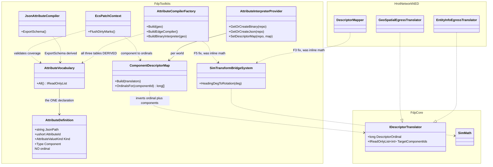
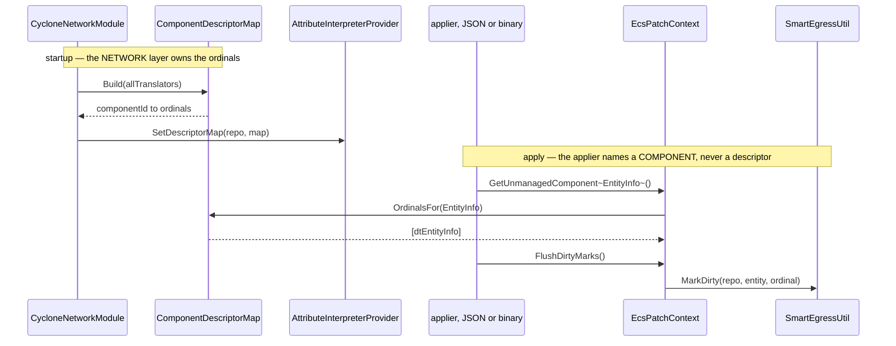

<!--STATUS
state: LIVE
build-state: BUILT — ⭐⭐⭐ APPROVED and BUILT 2026-08-26. §10 is the AS-BUILT and carries three
  corrections the build discovered; read it after §7/§8/§9.
  Approved set: C1 · N1 · N3/B1 · E-pre · E · A1' · D1 · F3/F4/F5 · N4. ⛔ WITHDRAWN: C2, A3, N2, D2.
  ⭐ N4 was RULED on 2026-08-26 ("logged as warning and ignored, no throw") and is BUILT — §11.
  ⚠ §12 asked "is CycloneNetworkModule obsolete?" and leaned M1 (adopt). ⛔ §13 MEASURED IT AND
  OVERTURNED THAT: a successor exists (NedReplicationModule/BdcReplicationModule, both live), so the
  module IS superseded. Read §13, not §12.4's lean. ⭐ §14 is the AS-BUILT: M2 done (module DELETED, both
  docs corrected) plus AX-022.
  §9 carries the classDiagram + sequenceDiagram for the approved shape (obligation 1/2).
updated: 2026-08-26
current-answer: ⭐⭐⭐ §7 (the ATTRIBUTE / DESCRIPTOR SPLIT, user 2026-08-26) is the CURRENT answer and it
  REVISES §3 and §4. Read §7 FIRST, then §4's revised leans, then §8. Nothing here is approved yet.
  ⭐⭐ §8 answers two follow-ups: (a) the multiple-tables issue is NOT solved — AX-018 went 4 tables to 3
  and added a RAIL, which detects drift rather than preventing it; (b) Heading vs GeoHeading is a real
  trap with measured cost, and the fix is to rename the CONSTANT (source-only) never the PATH (wire).
stale-below: ⛔ §3's "6-tuple" is SUPERSEDED by §7.2 — it is TWO tuples joined by component identity.
  ⛔ §4's Q59-A1 (6 fields) and Q59-C2 (adopt ATTR-DESIGN Phase 6) are SUPERSEDED by §7.4/§7.5.
known-conflict: none. §5 F3 is a NEW defect this investigation found; it has no prior design record.
-->
# ⭐⭐⭐ `Q59` — **One attribute, declared how many times?** *(consistency · architectural correctness · redundancy)*

> ⭐⭐⭐ **User, `2026-08-26`:** *"so what can we do to achieve consistency and architectural correctness and
> eliminated redundancy?"*
>
> ⭐⭐ **Context:** `AX-018` fixed three *symptoms* with a rail. ⛔ **A rail detects drift; it does not make
> drift impossible.** This asks the structural question instead.

---

## 1. ⭐⭐⭐ INVENTORY — *what actually exists* **(`search_graph`, not grep)**

```
search_graph(name_pattern=".*AttributeInstaller.*|.*AttributeIds.*|.*JsonToRecordCompiler.*|.*Installer$")
  → total: 42.  Production IBinaryAttributeInstaller implementations: EXACTLY THREE
    (EntityDataAttributeInstaller · SimTransformAttributeInstaller · SimTransformHeadingInstaller)
    + one test DelegateInstaller.
search_graph(name_pattern=".*AttributeSchema.*|.*ExportSchema.*|.*AttributeManifest.*|.*AttributeDescriptor.*|.*EdgeSchema.*")
  → total: 20.  NO manifest/descriptor type exists. The only "schema" surfaces are
    JsonAttributeCompiler.ExportSchema (lossy — see §5 F4), EdgeSchemaEntry (id+kind),
    the EntityAttributeSchema DDS topic, and EntityAttributeSchemaPublisherSystem.
```

⭐⭐ **Design corpus read** *(`R-129` — intent before code)*:
`docs/designs/attribs-to-ecs/ATTR-DESIGN.md` · `docs/designs/attribs2/ATTR2-DESIGN.md` ·
`docs/DESIGN_Cgf_AxisB_Rotation_Slice.md` §16/§17.

### 1.1 ⭐⭐ ONE attribute is currently described in **five** places

| # | surface | what it declares | derived from anything? |
|---|---|---|---|
| ① | `AttributeCompilerFactory.Build()` | JSON path → ECS component + field setter + **descriptor ordinal** | ⛔ no |
| ② | `AttributeCompilerFactory.BuildEdgeCompiler()` | JSON path → **`AttributeId`** + value kind | ⛔ no |
| ③ | the three installers | `AttributeId` → ECS component + field setter + **descriptor ordinal** | ⛔ no |
| ④ | `DescriptorMapper.MapToComponents` *(2-arg overload)* | wire descriptor → ECS component + field, **hand-coded** | ⛔ no |
| ⑤ | `JsonAttributeCompiler.ExportSchema()` | the published JSON-Schema | ⭐ from ① only, **lossily** |

⇒ ⭐⭐⭐ **Adding one attribute correctly means editing ①②③ and possibly ④, and ⑤ then under-describes it.**
📐 **`AX-018` measured what that costs: `Heading` reached ① and ③ and NEITHER edge table**, for months.

---

## 2. ⛔ WHAT THE OWNING DESIGNS ALREADY SAY — **the principle exists; it was never extended**

| where | verbatim |
|---|---|
| ⭐⭐⭐ `ATTR-DESIGN.md` §3.8 | *"the same `JsonAttributeCompiler` routing table and delegate set serves both entity creation and live entity updates — **a single source of truth**."* |
| ⭐⭐ `ATTR2-DESIGN.md` §3.4 | `AttributeId` is *"A static well-known table **shared** between the Edge Compiler and the Binary Interpreter to ensure the two components agree on IDs."* |
| ⭐⭐ `ATTR2-DESIGN.md` §3.2 | the edge compiler *"Registers the same … paths … so the JSON→ECS and JSON→Binary pipelines **stay in perfect sync**."* |
| 🔴 `ATTR-DESIGN.md` **"Phase 6: Unified Descriptor Routing (Advanced)"** | *"`DescriptorMapper` reuses the same compiled delegates; field-mapping logic is defined **in one place**."* ⚠ **marked optional — and only HALF built** |

⇒ ⭐⭐⭐ **The single-source-of-truth principle is ALREADY the stated architecture.** ⛔ It was honoured for
*ids* (②③ share `AttributeIds`) and for *one* table (①), and abandoned for the mapping itself.
⚠ **This is the seam law:** the seam exists and is under-adopted — ⛔ **do NOT invent a new concept.**

---

## 3. ⛔ THE ARCHITECTURAL DIAGNOSIS *(SUPERSEDED by §7.2 — kept because §7 argues against it)*

> ⭐⭐⭐ **There is no single declaration of *"what an attribute IS."*** An attribute is a **6-tuple**
> — *(JSON path, `AttributeId`, value kind, ECS component, field setter, descriptor ordinal)* — and the code
> stores **projections** of that tuple in five hand-maintained tables.

⭐ **Every defect this session found is a consequence, not a coincidence:**

| defect | which projection disagreed |
|---|---|
| `AX-015` — a binary rename never republished | the **ordinal** projection was missing on the binary side |
| `AX-018 D1` — a heading could be applied but never emitted | ② lacked a row ①③ had |
| `AX-018 D2` — `{"Affiliation":2}` threw | the **kind** projection was single-valued where the consumer accepts two |
| ⭐ **`Q59 F3`** *(§5, NEW)* | ④'s hand-coded field mapping **diverged numerically** |

---

## 4. ⭐⭐⭐ THE DECISION — sub-questions, each with a RECOMMENDED answer

> ⭐⭐ **`A`–`D` are ordered so each is useful alone.** ⛔ Nothing here is approved; ⭐ reply *"approved"*, or
> name the one to change.

### `Q59-A` — ⭐⭐⭐ Do we introduce a single attribute declaration that ①②③ are DERIVED from?

| option | |
|---|---|
| **A1** ⭐⭐⭐ **RECOMMENDED — one `AttributeDefinition` list; the three tables are BUILT from it** | one `record` per attribute carrying the 6-tuple; `Build()`, `BuildEdgeCompiler()` and the installer registrations all **iterate the same list**. ⇒ ⭐⭐ **half-registration becomes UNREPRESENTABLE** — the `UXI-30`/`AX-001` shape *(move the obligation to where it cannot be skipped)*, which is strictly stronger than `AX-018`'s rail |
| **A2** keep three tables + the rail | ⭐ zero risk, already shipped. ⛔ But drift is *detected*, not *prevented*, and ⚠ **the rail's vocabulary list is itself hand-maintained** *(it is pinned to ①, so it cannot rot silently — but it is a 4th place to edit)* |
| **A3** codegen the tables from a manifest file | ⛔ **rejected.** ⚠ A build-time generator for **6 attributes** is a large mechanism and a new failure mode; ⭐ revisit only if the vocabulary reaches tens of entries |

⭐ **Why A1 and not A2:** 📐 `AX-018` is the *second* time these tables silently disagreed, and the first
went unnoticed for months. ⚠ **Honest cost:** the setter delegates have different *shapes* per path
*(`ValueAttributeSetter<T>` vs a binary handler)*, so a definition holds **two delegates**, not one — ⛔ the
tuple does not collapse to a single lambda, and any design claiming it does is wrong.

### `Q59-B` — ⭐⭐ Is `ExportSchema` the natural CONSUMER of that declaration?

| option | |
|---|---|
| **B1** ⭐⭐ **RECOMMENDED — yes; derive it from the definitions and make it truthful** | 📐 today it emits `"type": "string"` for **every** path *(including the three float geo paths)* and drops the id and the kind. ⇒ ⭐ with `A1` it becomes correct **for free**, and the DDS `EntityAttributeSchema` topic finally describes the real contract |
| **B2** leave it | ⛔ it stays a published, wrong schema |

### `Q59-C` — ⭐⭐⭐ What about `DescriptorMapper`'s hand-coded arm? *(this is where the live defect is)*

| option | |
|---|---|
| **C1** ⭐⭐⭐ **RECOMMENDED — fix the divergence NOW as its own item; adopt Phase 6 LATER** | 📐 §5 `F3` is a **live wrong rotation** on the CGF spawn path; ⭐ the one-line fix is *"call `HeadingDegToRotation`"*, which is small, reviewable and independent of `A1` |
| **C2** finish `ATTR-DESIGN` Phase 6 *(route ④ through the compiler)* in the same batch | ⚠ the 3-arg overload already exists and is **used only by tests**; ⛔ the 2-arg one is production. Switching the production caller is a **real behaviour change on the spawn path** ⇒ ⭐ worth doing, ⛔ **not in the same batch as a correctness fix** |
| **C3** delete the hand-coded overload | ⛔ **rejected — "no rush removals."** ⚠ It is the production path; retiring it is `C2`'s outcome, not its premise |

### `Q59-D` — ⭐ The third `eForceIdentifier` copy?

| option | |
|---|---|
| **D1** ⭐⭐ **RECOMMENDED — leave the two pre-existing Hrot copies; the `AX-017` rail already pins all three** | ⭐ cheapest correct answer. ⛔ Consolidating `Hrot.Core.Mission` vs `Hrot.NED.Descriptors` touches mission code far outside this lane |
| **D2** consolidate | ⚠ a separate slice with its own blast radius |

---

## 5. 🔴 FINDINGS THIS INVESTIGATION PRODUCED — **measured, and `F3` is NEW**

| # | finding |
|---|---|
| 🔴🔴 **`F3`** | **`DescriptorMapper.MapToComponents` computes a DIFFERENT — and wrong — heading rotation from every other path, on the LIVE CGF spawn path.** 📐 Canonical *(`SimTransformBridgeSystem.HeadingDegToRotation`, documented *"X=East, Y=North, 0=North, 90=East, clockwise"*)*: `axis Z, angle (90−h)`. 📐 `DescriptorMapper:118`: `CreateFromYawPitchRoll(−h·π/180, 0, 0)` = **yaw about Y, no 90° offset**. ⇒ **measured forward vectors:** `h=0` → canonical **North** `(0,1,0)` vs mapper **East** `(1,0,0)`; ⛔ `h=90` → canonical **East** vs mapper **straight UP** `(0,0,1)`. ⚠ **It disagrees at EVERY heading and is not merely a different convention — it rotates in the wrong plane.** 🔴 **Live:** `NedCgfEntityLifecycleAdapters.cs:70` calls the 2-arg overload for `msg.InitialDescriptors`, and **nothing overwrites it** — the per-tick `SimTransformBridgeSystem.Execute` *"has been removed"* per its own class doc ⇒ this is the entity's persisted initial rotation |
| ⚠ **`F4`** | **`ExportSchema` publishes a schema that says `"type": "string"` for every path**, including the three `Float64` geo paths, and omits the id and kind entirely. ⭐ It is derived from `_registeredPaths` — a `string[]` — so it **cannot** be truthful without `Q59-A`. 📌 Also carries a **leaked, unused `Utf8JsonWriter`** over a throwaway `MemoryStream` *(lines 383–386)* — dead code |
| ⚠ **`F5`** | **`AttributeCompilerFactory.Build()`'s `"Heading"` handler INLINES the conversion math** instead of calling `HeadingDegToRotation`. 📐 Numerically identical **today** *(both `axis Z, (90−h)`)*, so ⛔ not a defect — ⚠ but it is the third copy of one formula, and `F3` is what the third copy of a formula eventually becomes. 📌 `AttributeIds`' own doc claims *"no new conversion math was written; the installer reuses the bridge"* — ⭐ **true of the installer, false of the JSON arm** |

---

## 6. ⭐ IF APPROVED — sequencing *(no UML yet: obligation ② says draw it AFTER the option is chosen)*

| order | item | why here |
|---|---|---|
| **1** | ⭐⭐⭐ `C1` — fix `F3`'s rotation, with a rail asserting **all** heading paths agree | ⛔ a live correctness defect outranks a refactor |
| **2** | ⭐⭐ `A1` — the `AttributeDefinition` list; ①②③ derived | ⭐ makes `AX-018`'s class of defect unrepresentable |
| **3** | ⭐ `B1` + `F4`/`F5` cleanup | ⭐ falls out of `A1` almost free |
| **4** | ⚠ `C2` — Phase 6 adoption for `DescriptorMapper` | ⛔ its own batch: a real behaviour change on the spawn path |

⛔ **`D2` is not scheduled.**

---

## 7. ⭐⭐⭐ THE ATTRIBUTE / DESCRIPTOR SPLIT — **user, `2026-08-26`. It changes the design, and SIMPLIFIES it.**

> ⭐⭐⭐ **User, verbatim:** *"we might need to differentiate between attributes and descriptors. attributes
> are entity-related, network agnostic. In contrary, descriptors are Ned network concept and descriptor
> compiler/translator belongs to network namespace. Does that change the design?"*
>
> ⭐⭐⭐ **Yes — materially. ⛔ And it retires three things I built in the last two steps.**

### 7.1 ⭐⭐ Applying the split to §1.1's five surfaces

| # | surface | ⭐ attribute *(FDP)* or descriptor *(NED)*? | ⚠ verdict |
|---|---|---|---|
| ① | `Build()` — path → component + setter **+ ordinal** | **attribute** | 🔴 **but it carries a DESCRIPTOR ORDINAL** |
| ② | `BuildEdgeCompiler()` — path → id + kind | **attribute** | ✅ clean |
| ③ | the three installers — id → component + setter **+ ordinal** | **attribute** | 🔴 **same leak** |
| ④ | `DescriptorMapper.MapToComponents` | ⭐ **descriptor** | ✅ **already in `Hrot.Network.NED/…/Map/Utils/`** — exactly where the user says it belongs |
| ⑤ | `ExportSchema` | **attribute** | ✅ clean |

⇒ ⭐⭐ **The split cleanly separates them, and ④ is already on the right side of the line.**
⛔ **The violation is the opposite of what I assumed: it is `DescriptorOrdinal` sitting in FDP.**

### 7.2 ⭐⭐⭐ THE CORRECTED DIAGNOSIS — **two tuples, joined by COMPONENT IDENTITY**

⛔ §3 said an attribute is a **6-tuple**. ⭐⭐ **Under the split it is TWO tuples:**

| | tuple | owner |
|---|---|---|
| ⭐ **attribute** | *(JSON path, `AttributeId`, value kind, ECS component, field setter)* — **5 fields, NO ordinal** | **FDP** |
| ⭐ **descriptor** | *(descriptor ordinal, the ECS components it covers, the wire struct)* | **NED** |
| ⭐⭐⭐ **the join** | ⭐ **the ECS COMPONENT** — the one thing both sides legitimately share, and `ComponentTypeRegistry` is already that shared identity | both |

### 7.3 ⭐⭐⭐ AND THE SEAM ALREADY EXISTS — **`IDescriptorTranslator` declares BOTH halves**

📐 **Measured `2026-08-26`** *(`FDP/Engine/Fdp.Core/Abstractions/IDescriptorTranslator.cs`)*:

```csharp
long DescriptorOrdinal { get; }                                        // line 57
IReadOnlyList<int> TargetComponentIds => System.Array.Empty<int>();    // line 75
```

⇒ ⭐⭐⭐ **the component→descriptor map is the INVERSE of what the network layer ALREADY declares, per
translator.** 📌 **This is the seam law in its purest form** — *"we need a shared X"* meant X existed.

⚠⚠ **And it is UNDER-ADOPTED: `search_graph` → 41 egress translators; only 9 declare `TargetComponentIds`.**
⛔ **With a silent EMPTY default** — 📌 the *"a production caller that HAS a dependency must PASS it"* rule,
so a derived map would be **silently sparse**. 🔴 **`EntityInfoEgressTranslator` is one of the 32 that
declare nothing — the exact descriptor `AX-015` was about.**

⭐⭐ **Note the shape `IDescriptorTranslator` already gets right, because it is the model for the fix:**
**FDP declares the SEAM** *(an opaque `long`, network-agnostic)*; **NED declares the VALUES**
*(`(long)EDescriptorType.dtWorldPos`)*. ⇒ ⭐ that is precisely what ① and ③ should have done and did not.

### 7.4 ⛔⛔ WHAT THIS RETIRES — **three things I built in the last two steps**

| built | ⛔ verdict under the split |
|---|---|
| `Fdp.Toolkit.Replication.DescriptorOrdinal` *(`AX-017`)* | ⛔ **unnecessary.** FDP should have no descriptor vocabulary at all. ⚠ I justified it as *"an ordinal is just a bit index, network-agnostic"* — **mechanically true, and it misses the point: its MEANING is a NED grouping** |
| `DescriptorOrdinalConversion` *(`AX-017`)* | ⛔ **unnecessary** — nothing left to convert |
| `IEntityPatchContext.MarkDescriptorDirty` *(`AX-015`)* | ⛔ **unnecessary.** 📐 **Measured: every one of the 5 call sites sits immediately after `GetUnmanagedComponent<T>()` on the SAME component**, and the ordinal is a constant function of that type ⇒ **100 % derivable** |

⭐⭐⭐ **`AX-015` had a strictly better fix available, and I missed it.** 📐 `EcsPatchContext` **already** holds
`_ordinalByType` and **already** calls `RecordOrdinal(typeof(T))` inside `GetUnmanagedComponent<T>()`. The
binary path failed only because `EcsPatchContext.Create` passes `s_emptyRoutes` ⇒ an **empty map**.
⇒ ⭐⭐ **give that context the map and the defect disappears with ZERO installer changes and no new seam
member.** ⚠ What I shipped works and is railed — ⛔ but it added a member to a public interface to carry
information the context could already derive.

### 7.5 ⛔⛔ `Q59-C2` IS WITHDRAWN — **`ATTR-DESIGN` Phase 6 is architecturally WRONG under the split**

⚠ §4 recommended *"finish Phase 6: route `DescriptorMapper` through the attribute compiler, in its own
batch."* ⛔ **The split says do NOT.** 📐 A descriptor is a **wire-shaped BUNDLE** *(`dtEntityInfo` carries
Name **and** ForceId together)*; an attribute is an **individually addressed FIELD**. ⇒ the two mappings
share their **field-level conversion**, ⛔ **not their addressing** — and Phase 6 conflates exactly that.
⚠ **Phase 6 predates this split**; it is not wrong so much as **written before the distinction existed.**

⭐⭐ **What IS shared, and must be:** the field-level conversion helpers — `HeadingDegToRotation`,
`IGeographicTransform.ToCartesian`, `MapAffiliation*`. ⭐ All FDP, all network-agnostic, and **both sides
should CALL them.** ⇒ 📌 **that is exactly what `F3` and `F5` are about**, so `C1` absorbs the useful half of
Phase 6 and the rest is dropped.

### 7.6 ⭐⭐ THE REVISED RECOMMENDATION

| # | ⭐ revised lean | change vs §4 |
|---|---|---|
| **`A1′`** | ⭐⭐⭐ **one `AttributeDefinition` with FIVE fields — no ordinal.** ①②③ derived from it | ⭐ **simpler than `A1`**: the hardest field to share is gone |
| **`E`** ⭐ NEW | ⭐⭐⭐ **the ordinal map is INJECTED by the network layer**, assembled from the translator registry's `{DescriptorOrdinal, TargetComponentIds}`; both patch contexts get it; `RecordOrdinal` already does the rest. ⭐ On a **networkless** host the map is legitimately **empty** — nothing to republish | ⭐ **replaces `MarkDescriptorDirty`** and retires the FDP descriptor enum |
| **`E-pre`** ⭐ NEW | ⚠⚠ **PREREQUISITE — adopt `TargetComponentIds` on the translators that need it, and RAIL it:** any translator gating on `SmartEgressUtil.ShouldPublish` with `MarkDirty` **must** declare it. ⛔ Without this the derived map is silently sparse *(9/41 today)* | 🔴 **the real cost of `E`, and it must not be hidden** |
| **`B1`** | ⭐⭐ unchanged — derive `ExportSchema` from the definitions | — |
| **`C1`** | ⭐⭐⭐ unchanged and now **more** important: fix `F3`, and make **both** the descriptor and attribute paths call the shared FDP conversion | ⭐ absorbs the sound half of Phase 6 |
| **`C2`** | ⛔⛔ **WITHDRAWN** *(§7.5)* | ⭐ was *"worth doing, separate batch"* |
| **`D1`** | ⭐ unchanged | — |

⚠⚠ **One caveat that `E` must not gloss:** ⭐ **a component maps to a SET of ordinals, not one.** 📐 Measured:
`GlobalComponentIds.SimTransform` is declared by **both** `BdcWorldPosTranslator` and
`GeoSpatialEgressTranslator`; `NetworkIdentity`/`TkbIdentity` by **both** `BdcEntityMasterTranslator` and
`EntityMasterEgressTranslator`. ⇒ marking **every** covering descriptor dirty is the correct behaviour, ⛔ but
it is a real change from today's one-ordinal-per-component and `_ordinalByType` must become
`Dictionary<int, long[]>`.

### 7.7 ⭐ REVISED SEQUENCING

| order | item | why |
|---|---|---|
| **1** | ⭐⭐⭐ `C1` — fix `F3`; both paths call the shared conversion | ⛔ a live wrong rotation outranks all refactoring |
| **2** | ⭐⭐ `E-pre` — adopt + rail `TargetComponentIds` | ⛔ `E` is unsound without it |
| **3** | ⭐⭐ `E` — inject the ordinal map; retire `MarkDescriptorDirty`, `DescriptorOrdinal`, `DescriptorOrdinalConversion` | ⭐ **removes FDP's descriptor vocabulary entirely** |
| **4** | ⭐ `A1′` + `B1` | ⭐ the attribute tuple, now 5 clean fields |

⛔ **`C2` withdrawn · `D2` not scheduled.**

---

## 8. ⭐⭐ TWO FOLLOW-UP QUESTIONS, ANSWERED WITH MEASUREMENTS *(user, `2026-08-26`)*

### 8.1 ⛔ *"the multiple tables for same thing issue — was that already solved?"* — **NO.**

📐 **Measured, current `HEAD`:** all **six** rows are still spelled out in **three** hand-maintained tables.

| | before `AX-018` | now | designed fix |
|---|---|---|---|
| tables | **4** | ⭐ **3** *(IG now calls the factory)* | ⭐⭐ **1** — `A1′` + `E` |
| enforcement | ⛔ **a code comment** | ⚠ **a rail** *(`TheFourRoutingTablesAgreeTests`)* | ⭐⭐⭐ **construction** |

⇒ ⭐⭐ **`AX-018` removed the duplicate and made drift DETECTABLE. ⛔ It did not make drift IMPOSSIBLE.**
⚠ **That is the honest status:** *"solved"* is `A1′`+`E`, which is **designed and not built.** ⛔ Do not read
the green rail as the problem being closed — 📌 it is the `R-131`-adjacent trap of mistaking a detector for a
fix.

### 8.2 ⭐⭐⭐ *"what about `Heading` vs `GeoHeading` … between json and binary way?"* — **a real trap, and it costs something measurable**

⭐⭐ **There are TWO naming mismatches, not one:**

| JSON path *(the wire-visible authoring name)* | `AttributeIds` constant | |
|---|---|---|
| `Name` · `Affiliation` | `Name` · `Affiliation` | ✅ identical |
| `GeoPosition.Latitude` / `.Longitude` / `.Altitude` | `GeoLat` · `GeoLon` · `GeoAlt` | ⚠ **dotted + full ↔ flat + abbreviated** |
| ⭐ `Heading` | 🔴 **`GeoHeading`** | 🔴 **the path LACKS the prefix the id HAS** |

#### 🔴 What it costs — **measured, `2026-08-26`**

| # | measurement |
|---|---|
| **①** | 🔴🔴 **GUESSING IS SILENT.** `{"GeoPosition":{"Heading":90.0}}` ⇒ `HasAppliedAny = **False**`, **no exception, no log**; `{"Heading":90.0}` ⇒ `True`. ⇒ ⛔ **the id name `GeoHeading` ADVERTISES a path that does not exist**, and reading it alongside the `GeoPosition.*` family leads to exactly the guess that silently does nothing. ⚠ **And the corpus says nothing about unknown paths** — the silence is **undesigned**, not deliberate forward-compat |
| **②** | 🔴 **`ExportSchema` — the one artefact that could tell a client the real paths — is MALFORMED.** 📐 Actual output: `"GeoPosition"` appears as a property key **THREE TIMES** *(the three geo paths collapse to their root segment)* and **every** type is `"string"`, including four `Float64` paths. ⇒ a consumer sees **4 properties instead of 6**, all mistyped. ⚠ **Nobody subscribes today** *(only generated reader extensions exist)* — ⛔ so it cannot even be caught in the field |

#### ⭐⭐⭐ THE ASYMMETRY THAT DECIDES THE FIX

| | on the wire? | ⇒ renaming is |
|---|---|---|
| ⭐ the **JSON path** | ✅ **YES** — external senders write it *(ExCon, the debug API, authoring JSON)* | ⛔ **a BREAKING contract change** |
| ⭐⭐⭐ the **`AttributeIds` constant NAME** | ⛔ **NO** — 📐 the wire carries the `ushort` **13**; `search` finds **no `.idl`** naming it, and all 91 `Geo*` references are C# | ✅ **FREE — source-only** |

⇒ ⭐⭐ **Fix the id name, never the path.** ⛔ And note the path `Heading` is arguably *more* correct than
`GeoPosition.Heading` would be — **heading is orientation, not position** *(the wire itself splits them:
`WorldPos.Pos` vs `WorldPos.Ori.Heading`)*.

#### ⭐ The options

| option | |
|---|---|
| **N1** ⭐⭐⭐ **RECOMMENDED — rename the constant `GeoHeading` → `Heading`** | ⭐ removes the exact trap ① describes: the id stops advertising a path that does not exist. 📐 **Source-only, ~11 files, zero wire impact**, and no `AttributeIds.Heading` exists to collide with. ⛔ Leaves `GeoLat ↔ GeoPosition.Latitude` non-derivable — ⭐ **accepted deliberately, see below** |
| **N2** make every id name mechanically derived *(path minus dots ⇒ `GeoPositionLatitude`…)* and **rail** it | ⭐ the only version that can be *enforced*. ⛔ **Not recommended:** 91 references of churn, verbose names, ⚠ **and it duplicates a guarantee `A1′` already gives** — the 5-tuple holds the path AND the id, so the definition IS the mapping. ⇒ a name rule would be a **second** mechanism enforcing the same thing |
| **N3** ⭐⭐ **RECOMMENDED alongside N1 — make the paths DISCOVERABLE instead of guessable** | ⭐ fix `ExportSchema` *(`B1`)* so it emits one property per **full** path with the **real** type, derived from `A1′`. ⇒ ⭐⭐ **the artefact answers *"what paths exist?"***, which is the actual need behind the naming question |
| **N4** ⚠ make an unregistered path LOUD | ⛔ **needs a ruling, not a lean.** ⭐ Unknown-key tolerance is genuinely valuable across mixed-version nodes ⇒ the right shape is a **count + one log line**, ⛔ never a throw. 📌 And the corpus is silent, so this is a NEW decision |

⭐⭐ **Why N1 and not N2, stated plainly:** ⛔ **name symmetry is the symptom, not the goal.** ⭐ Once `A1′`
exists, the id constant's *name* is internal convenience and the **definition** is the mapping; `ExportSchema`
is the external answer. ⇒ ⭐ N1 is worth doing anyway because it costs nothing and removes a live trap — ⛔ but
chasing full derivability would spend 91 edits to re-guarantee what one declaration already guarantees.

### 8.3 ⭐ SEQUENCING — where these land in §7.7

| order | item | change |
|---|---|---|
| **1** | `C1` — fix `F3`'s rotation | unchanged |
| **1b** ⭐ NEW | **N1** — rename `GeoHeading` → `Heading` | ⭐ **cheap and independent; fold into `C1`'s batch** |
| **2** | `E-pre` — adopt + rail `TargetComponentIds` | unchanged |
| **3** | `E` — inject the ordinal map, retire FDP's descriptor vocabulary | unchanged |
| **4** | `A1′` + `B1`/**N3** + `F4`/`F5` | ⭐ `B1` now carries the duplicate-key and wrong-type fixes |
| **?** | **N4** — loud unknown paths | ⛔ **needs your ruling first** |

---

## 9. ⭐⭐⭐ THE APPROVED SHAPE — UML *(obligation ①/②: drawn AFTER §1/§7.3's enumeration; existing boxes marked)*

> ⭐⭐ **Approved `2026-08-26`.** ⛔ `C2`, `A3`, `N2`, `D2` withdrawn; ⚠ `N4` still needs a ruling.

### 9.1 ⭐⭐ Refinement found while drawing it — **`E-pre` is ONE translator, not five**

📐 **Measured:** the map only needs to cover components the **attribute apply path writes** — today
`Fdp.Core.EntityInfo` and `SimTransform`.

| translator | gates on `ShouldPublish`? | declares `TargetComponentIds`? | needed for `E`? |
|---|---|---|---|
| `EntityInfoEgressTranslator` | ✅ | 🔴 **NO** | ⭐⭐⭐ **YES — the one gap** |
| `GeoSpatialEgressTranslator` | ⛔ *(state comparison — `SmartEgressUtil`'s split)* | ✅ `{SimTransform, NetworkTransform, NetworkVelocity}` | ✅ already covered |
| `EntityMission` · `EqsSensorConfig` · `Perception*` | ✅ | ⛔ no | ⛔ **NOT needed** — 📐 their dirty marks come from `MissionControlExecutionSystem` / `UnitHierarchySystem` calling `MarkDirty` with an explicit ordinal, **not** from the attribute path |

⇒ ⛔ **§7.6's *"adopt across the translators that need it"* was too broad.** ⭐⭐ **The correct invariant is
narrower and exactly checkable:** *every component named by an attribute definition must be covered by at
least one translator's `TargetComponentIds`.* ⇒ ⭐ adding an attribute for an uncovered component is a RED.

### 9.2 ⭐ Class diagram



⭐ **Existing, unchanged:** `IDescriptorTranslator` · `SimMath` · `SimTransformBridgeSystem` ·
`JsonAttributeCompiler` · `EcsPatchContext` · `AttributeInterpreterProvider` · the translators ·
`DescriptorMapper`.
⭐⭐ **NEW, and only two:** `AttributeDefinition`/`AttributeVocabulary` *(`A1′`)* · `ComponentDescriptorMap`
*(`E`)*.
⛔ **DELETED:** `Fdp.Toolkit.Replication.DescriptorOrdinal` · `DescriptorOrdinalConversion` ·
`IEntityPatchContext.MarkDescriptorDirty`.

### 9.3 ⭐ Sequence — the dirty mark after `E`



⭐⭐⭐ **The point of the sequence:** the applier's only act is touching a **component**. ⛔ No installer, no
routing table and no FDP type names a descriptor — and on a networkless host the map is absent, so
`OrdinalsFor` returns empty and nothing is marked, which is correct.

---

## 10. ⭐⭐⭐ AS-BUILT `2026-08-26` — **built as approved, with THREE corrections the build found**

> ⭐⭐ Obligation ③: *"what I built matches / deviates HERE and why."* ⛔ Three deviations, all reported.

### 10.1 ⛔⛔ CORRECTION 1 — **`ComponentDescriptorMap` was written and DELETED before shipping. The seam already existed.**

🔴 §7.6's `E` said *"assembled from the translator registry"* and I built a new
`Fdp.Toolkit.Replication.ComponentDescriptorMap` to hold it. ⛔ **Then `IDescriptorTranslator`'s own doc
named the existing consumer**, and measuring it found:

| 📐 `DescriptorOwnershipMap` *(`Fdp.Toolkits/Replication/Services/`)* | |
|---|---|
| calls itself | *"the **Single Source of Truth** for the descriptor → component mapping"* |
| already had | `RegisterFromTranslator(ordinal, targetComponentIds)` — **the exact entry point** |
| already had | `_componentTypeToDescriptor` — a reverse map |

⇒ ⭐⭐⭐ **the rival type was deleted and the existing one EXTENDED.** 📌 **The seam law caught in the act** —
*"we need a shared X"* meant X existed and was under-adopted. ⚠ **This is the rule I have been documenting
all session and I still nearly shipped the duplicate;** what caught it was reading the interface's doc
comment, not the graph.

⭐ **Two genuine gaps it had, which is WHY it looked missing:**
① `RegisterFromTranslator` filled **only** the forward direction, so `GetDescriptorForComponent` never saw
anything from a translator — only from the manual `Type[]` overload.
② `_componentTypeToDescriptor` is **single-valued**, and a component genuinely has several covering
descriptors. ⇒ ⭐ added `GetDescriptorsForComponentId` *(multi-valued, keyed by the id translators actually
declare)*, leaving the old getter untouched for its existing callers.

### 10.2 ⛔ CORRECTION 2 — **the wiring seam is `CycloneEgressSystem`, not a module or a host**

📐 Measured: **`CycloneNetworkModule` is never instantiated in production** *(`grep` for `new
CycloneNetworkModule` → nothing outside `bin`/`obj`)*, and the translator lists are assembled in **4+
host-side places** — a main pack **and** a gizmo pack per host. ⇒ ⛔ neither is a single seam.

⭐⭐ **`CycloneEgressSystem` is the one type that already receives the translator array AND is handed the
world**, so it contributes on its first `Execute` and **no host has to remember anything** — the
`UXI-30`/`AX-001` shape. ⚠ **The one-frame window is stated, not hidden**: a patch before the first egress
Execute would not mark, which is benign because `SmartEgressUtil.ShouldPublish` returns `true` for an entity
with no publication state at all. ⛔ Unlike `AX-015`, nothing is *permanently* lost.

### 10.3 ⛔ CORRECTION 3 — **`A1′` and `E` were SWAPPED, and `A1′`'s scope narrowed**

⭐ §7.7 ordered `E` third and `A1′` fourth. 📐 Building `E` first showed it cannot remove the routing
table's ordinal until the map is wired everywhere, and **two ordinal sources in the meantime is worse than
either** ⇒ `A1′` *(no behavioural risk, well-railed)* went first and gave `E` a clean base.

⚠⚠ **And `A1′` delivers LESS than §4 implied — measured, and worth stating plainly.** The JSON setter and the
binary handler each carry **per-attribute logic** with different delegate signatures and shared accumulator
state. ⇒ ⛔ **they are not redundancy, they are distinct code**, and folding them into one record produces
something worse than three tables. ⭐ **Only the edge table and the schema are pure metadata**, and those
two now derive; the setters are **cross-checked** by rails instead.

### 10.4 ⭐ WHAT SHIPPED

| item | |
|---|---|
| ⭐⭐⭐ **`C1`/`F3`** | `DescriptorMapper`'s wrong rotation fixed in **both** arms; the Phase-6 helper now sets `Rotation`, discharging its own `ATTR-BATCH-03` TODO |
| ⭐⭐ **`F5`** | the JSON arm's inlined formula now CALLS the bridge — one formula, three callers |
| ⭐⭐ **`N1`** | `AttributeIds.GeoHeading` → `Heading`; source-only, no wire impact |
| ⭐⭐⭐ **`A1′`** | `AttributeVocabulary` + `AttributeDefinition`; the edge table DERIVED |
| ⭐⭐ **`N3`/`F4`** | `ExportSchema` emits one property per full path with the real type; leaked writer removed |
| ⭐⭐ **`E-pre`** | `EntityInfoEgressTranslator` declares `TargetComponentIds` — **the one gap**, not five |
| ⭐⭐⭐ **`E`** | `DescriptorOwnershipMap` per world, wired by `CycloneEgressSystem`; **DELETED** `DescriptorOrdinal`, `DescriptorOrdinalConversion`, `IEntityPatchContext.MarkDescriptorDirty` |
| ⭐ **`D1`** | unchanged, as approved |
| ⛔ **`N4`** | **not built** — offered as a question needing a ruling, and none was given |

### 10.5 ⭐ RAILS — **68 green across six files**

| rail file | |
|---|---|
| `TheHeadingConversionIsSharedTests` *(26)* | JSON · binary · **descriptor** routes all agree with the bridge; compass semantics pinned; production source scan. 📐 Red-proved by restoring the old formula |
| `TheFourRoutingTablesAgreeTests` *(26)* | edge emits every attribute · vocabulary pinned to `RegisteredPaths` · int affiliation crosses · both routes agree · **every attribute has a binary handler AND a JSON setter** · schema has one property per path with the right type · ruling-9 source scan |
| `TheDescriptorMapIsWiredTests` *(4)* | ⭐⭐⭐ **executing the egress system populates the map with no host call** · several systems UNION · every written component is covered · **a networkless world marks nothing and does not throw**. 📐 Red-proved by removing the hook *(4 red)* |
| `TheJsonAndBinaryPathsAgreeTests` · `TheBinaryApplyTellsSmartEgressTests` · `StrictNetworkSeparationTests` | re-based on the map; ⚠ they now **contribute a translator**, so they exercise applier → component → map → SmartEgress instead of a constant |

⛔⛔ **Two tests were REMOVED, with the reason recorded in place:**
`BinaryInstallersTests.{EntityData,SimTransform}_DescriptorDirtyBit_*` asserted that an **installer names a
descriptor** — precisely what the ruling forbids. ⭐ The claim they protected is carried, more strongly, by
`TheBinaryApplyTellsSmartEgressTests` *(through SmartEgress, which actually drives republication, rather
than a local mask `AX-015` measured as read by nothing in production)*.

⭐⭐ **`StrictNetworkSeparationTests`' boundary set shrank 2 → 1** — `DescriptorOrdinalConversion` is gone
because there is nothing left to convert. 📌 **That shrink is the proof `E` landed**, exactly as the
allowlist shrink was for `AX-017`.

---

## 11. ⭐⭐⭐ `N4` — RULED AND BUILT `2026-08-26`

> ⭐⭐⭐ **User ruling, verbatim:** *"N4 - if about unsupported attribute name (key), this should be logged as
> warning and ignored, no throw."*

⭐ §8.2 left `N4` needing a ruling and offered *"a count plus one log line, never a throw"*. ⇒ **built as
ruled**, on **all three** paths — ⛔ adding the diagnostic to only one would repeat exactly the `AX-018`
defect.

| path | before | after |
|---|---|---|
| JSON → ECS *(`JsonAttributeCompiler`)* | ⛔ silence | ⭐ warn once, ignore |
| JSON → record *(`JsonToRecordCompiler`)* | ⛔ silence | ⭐ warn once, ignore |
| record → ECS *(`BinaryInterpreter`)* | ⛔ a comment: *"Unknown IDs: silently skipped (forward-compatibility)"* | ⭐ warn once per id, ignore |

⭐⭐ **The TOLERANCE is kept; only the SILENCE is fixed** — ignoring unknown keys is what lets a newer sender
talk to an older node. ⛔ Throwing would turn a forward-compatible patch into a failed request.

### 11.1 ⚠ Three honest limits

| | |
|---|---|
| ⭐ **warn ONCE per key/id, per compiler** | ⚠ a sender repeating a bad key at 60 Hz would bury the log, and a buried warning is the same as no warning |
| ⚠ **the key reported is the LEAF property name, not the full dotted path** | ⭐ the compiler carries hashes, not strings; a full path would cost an allocation per property. ⭐⭐ For the FLAT form — `{"GeoPosition.Latitude": …}`, what ExCon and the debug API send — the leaf name IS the whole path, so the common case is exact |
| ⚠ **the dedup is proven INDIRECTLY** *(via allocation)* | ⛔ asserting on log output needs a logging harness this project does not have. Stated, not glossed |

### 11.2 ⭐⭐⭐ THE RAIL EARNED ITS KEEP IMMEDIATELY — **it caught a regression I had just introduced**

📐 `TheDiagnosticCostsNothingWhenEveryKeyIsKnown` measured **416 bytes** on a fully-known numeric patch.
🔴 **Cause: my own `Q59-E` code.** `DescriptorOwnershipMap.GetDescriptorsForComponentId` returned
`set.ToArray()` — **allocating on every component access during an attribute apply.**
⭐ Fixed by storing `long[]` and merging at REGISTRATION *(a handful of calls at startup)* instead of on
every lookup.

⚠⚠ **And the rail itself was wrong twice before it was right** — both worth recording, because both were
the rail measuring the wrong thing:

| cut | measured | why it was the rail's fault |
|---|---|---|
| ① | **688 B** | the payload included `"Name":"A"` — ⛔ `reader.GetString()` legitimately allocates for a string attribute. The zero-alloc mandate has only ever applied to **non-string** paths |
| ② | **216 B** | a **fresh** `EcsPatchContext` allocates its `HashSet` buckets on first insert — ⛔ the cost of CREATING a context, not of the diagnostic |

⇒ ⭐⭐ **the assertion is now: a WARMED context, a NUMERIC payload, exactly zero bytes.** 📌 The lesson is
the one this session keeps relearning: *an allocation rail that measures the wrong window manufactures
either a false alarm or a false green.*

### 11.3 ⭐ Rails

| rail | |
|---|---|
| `TheUnknownKeyIsWarnedNotThrownTests` *(7)* | ⭐⭐ an unknown key on each of the three paths **does not throw AND does not stop the known keys beside it** *(the half that matters in production)* · the quiet path allocates **zero** · a repeated key is reported once |

---

## 12. ⚠⚠ `CycloneNetworkModule` — **NOT obsolete. BYPASSED, and the bypass has a measured cost.**

> ⭐⭐ **User, `2026-08-26`:** *"what is CycloneNetworkModule? maybe something obsolete?"*

### 12.1 📐 WHAT IT IS, AND WHAT THE DESIGN SAYS

⭐ A 161-line `IEcsModule` in `Fdp.Network.Cyclone` that takes a translator list and registers the ingress,
egress and gateway systems itself.

| the DESIGN, in `docs/` — **current, not archived** | |
|---|---|
| `docs/projects/FDP/Network/Fdp.Network.Cyclone.md:207` | *"**Root `IEcsModule`**. Constructs and registers all systems, serialization providers, and the gateway system."* |
| ⛔⛔ `docs/designs/IG/DESIGN-IG.md:281` | *"**Do NOT** register `SmartEgressSystem`, `CycloneIngressSystem`, or `CycloneEgressSystem` manually. They are **private implementation details** of `CycloneNetworkModule`. Provide your translators to the module constructor; the module installs all required systems itself."* |

### 12.2 🔴 WHAT THE CODE DOES

📐 **Measured `2026-08-26`:** `new CycloneNetworkModule` appears **nowhere** outside `bin`/`obj` — **zero
production instantiations, zero test instantiations.** ⛔ And all four hosts do precisely what
`DESIGN-IG.md` forbids: `SimHostApp:421`, `IgApplication:849`, `IgNodeBootstrapper:340` and
`CgfSubsystem:778` each hand-register `CycloneNetworkIngressSystem` + `CycloneEgressSystem`.

⇒ ⭐⭐⭐ **So the honest answer is NOT "obsolete".** 📌 `CLAUDE.md`'s rule applies exactly: *"what is not used
does not mean it is existing without reason — a design doc gives answers."* ⭐ Here the design doc gives a
clear answer: **it is meant to exist and to be used.** The CODE drifted from it — the same disease as every
other finding in this document.

### 12.3 ⭐⭐ THE COST IS NOT HYPOTHETICAL — **`Q59-E` paid it**

⭐⭐⭐ `E` needed one place where *"the world"* and *"all the translators"* meet. **`CycloneNetworkModule` is
that place** — its `RegisterSystems` builds `allTranslators`. ⛔ Because nothing instantiates it, I had to
hook `CycloneEgressSystem.Execute` instead, which introduced the **one-frame window** §10.2 has to document
and justify. ⇒ ⭐ **the bypass cost this slice a weaker seam and a caveat**, today.

### 12.4 ⛔ RECOMMENDATION — **SUPERSEDED by §13, which measured it. `M1` was WRONG.**

| option | |
|---|---|
| **M1** ⭐⭐ **RECOMMENDED — adopt the module in the four hosts** *(route, don't delete)* | ⭐ restores the documented architecture and gives `E` the seam it wanted, removing the one-frame window. ⚠ **Real risk**: it changes system REGISTRATION ORDER on a working cluster, and the module registers a `_gatewaySystem` the hosts may register themselves ⇒ ⛔ its own batch, with the integration suite as the gate |
| **M2** ⚠ **delete the module and CORRECT the two design docs** | ⭐ honest if hand-registration is genuinely preferred *(four hosts each compose a main pack **and** a gizmo pack, which a single-constructor module may not express)*. ⛔ But `CLAUDE.md`: *"no rush removals"* — and this would drop the only existing single-seam candidate |
| **M3** ⛔ **leave as-is** | ⛔ **not recommended**: `docs/` keeps telling the next author to use a type nothing uses, and forbidding what everything does |

⚠ **I lean `M1` but weakly**, and the reason is worth stating: 📐 I have **not** measured *why* the hosts
bypass it. ⭐ There is a plausible good reason in plain sight — the module takes ONE translator list, and
each host builds TWO *(main + gizmo)*. ⇒ ⛔ **until that is measured, "the hosts were sloppy" is an
assumption, not a finding**, and `M2` may well be the right answer.

---

## 13. ⭐⭐⭐ MEASURED `2026-08-26` — **WHY the hosts bypass `CycloneNetworkModule`. §12.4's `M1` lean is OVERTURNED.**

> ⭐⭐ **User:** *"measure why please."* ⇒ ⛔ **I leaned `M1` (adopt the module) weakly and said the reason was
> unmeasured. Measured, the lean is WRONG: there is a SUCCESSOR, and the module is genuinely superseded.**

### 13.1 ⭐⭐⭐ REASON 1 — **a successor exists, and it is live**

📐 **Measured:** two composite modules do the job `CycloneNetworkModule` was documented to do, and **both are
instantiated in production**:

| module | instantiated at | what it is |
|---|---|---|
| ⭐⭐ `NedReplicationModule` | `NedNetworkFactory.cs:84` *(`CreateReplicationModule()`)* | *"Composite `IEcsModule` that bundles NED translator packs with their **tightly-coupled ECS systems** (ghost lifecycle, dead-reckoning, cleanup) behind a single module boundary"* |
| ⭐ `BdcReplicationModule` | `BdcNetworkFactory.cs:46` | the BDC equivalent |

⇒ ⭐⭐⭐ **They are strictly MORE than the Cyclone module, in three ways that matter:**
① **role-aware** — `MuscleGround`, `ImageGenerator` and `Brain` each get a different combination of packs;
② they bundle **`CycloneNetworkCleanupSystem`**, which `CycloneNetworkModule` explicitly **refuses** to
register *(*"Applications must provide it directly"*)*;
③ they are typed `IReplicationModule` — a HROT abstraction with a factory seam — rather than a bare
`IEcsModule`.

### 13.2 ⭐⭐ REASON 2 — **the architecture is PACK-based; the module takes ONE list**

📐 **Measured:** **23** production construction sites of `CycloneNetworkIngressSystem`/`CycloneEgressSystem`
across **12 files** — `NedSimHostPerceptionTranslators`, `…PathfindingTranslators`,
`…AuxiliaryTranslators`, `NedReplicationModule`, `BdcReplicationModule`,
`SlaveTimeTranslatorRegistration`, `EntityStatesIngressPack`, and the four hosts.

⭐ `NedReplicationModule` alone holds **three** translator lists — `_sharedTranslators`,
`_kinematicTranslators`, `_cognitiveTranslators` — selected by role.
⇒ ⛔ `CycloneNetworkModule`'s single `customTranslators` parameter **cannot express that**, and forcing it to
would mean flattening the role logic that is the successor's whole point.

### 13.3 ⚠⚠ REASON 3 RETRACTED — **the module would NOT have blocked `DQ30-C`**

⛔ **I nearly shipped this as a finding and it is false.** The lead looked strong:
`CycloneNetworkIngressSystem.IsWorldStateFrozen` is a **settable property**, `CgfSubsystem:1988` sets it, and
`CycloneNetworkModule.RegisterSystems` constructs the ingress system inline keeping no reference — so I
inferred a host adopting the module could not reach it.

📐 **Then I read the call site.** CGF walks **`_context.Kernel.SystemScheduler.GetAllSystems()`** and sets the
gate on every `CycloneNetworkIngressSystem` it finds. ⇒ ⭐ **who CONSTRUCTED the system is irrelevant** — the
debugger gate would work fine under the module. ⚠ **Recorded because the near-miss is the point:** *"the
module hides the constructed object"* was a plausible mechanism, and only reading the consumer disproved it.

### 13.4 ⭐⭐ REASON 4 — **why nobody noticed it went dead**

📐 `CycloneNetworkIngressSystem` — used at **23 sites** — is declared **in the same file** as the dead module,
with the comment *"Local implementation of Ingress System since it appears missing from Core"*.
⇒ ⭐⭐ **the FILE is alive because of a class that happens to share it**, so no unused-file sweep, no compiler
warning and no reference count would ever flag the module. ⛔ Exactly the shape that keeps dead code
invisible.

### 13.5 ⭐⭐⭐ THE ANSWER, and the corrected recommendation

⛔ **Not "the hosts were sloppy."** ⭐ The hosts moved to **per-domain composite modules** that express what
this one cannot, and the Cyclone module was left behind — while `docs/` was never updated.

| | ⭐ revised |
|---|---|
| ⛔ **`M1` adopt the module** | **WITHDRAWN.** It would be a step BACKWARDS from `NedReplicationModule`: it cannot express role-based packs and does not bundle the cleanup system |
| ⭐⭐⭐ **`M2` delete `CycloneNetworkModule` and CORRECT the two `docs/` statements** | **RECOMMENDED.** ⚠ With one mechanical care: **move `CycloneNetworkIngressSystem` into its own file first** *(same namespace, so no `using` changes)* — it is the live class sharing the file. ⭐ Then correct `Fdp.Network.Cyclone.md:207` and `DESIGN-IG.md:281`, which currently tell the next author to use a dead type and forbid what all 12 files do |
| ⛔ **`M3` leave as-is** | still not recommended, for the same reason |

⚠ **And `Q59-E`'s seam choice is VINDICATED, not compromised.** §12.3 said the bypass cost `E` a weaker
seam. ⭐ Correcting that: `NedReplicationModule` would have been **worse** for `E` — it is NED-specific, so
the editor's networkless host would not have it, whereas `CycloneEgressSystem` covers every host that
registers egress at all. ⇒ ⛔ the one-frame window is the price of host-independence, not of the bypass.

### 13.6 ⚠ ONE FOLLOW-UP THIS MEASUREMENT SURFACED

📐 `NedReplicationModule:86` holds its **own private** `DescriptorOwnershipMap`, populated from
`TargetComponentIds` at construction and handed to `OwnershipIngressSystem`, `DeferredTakeoverSystem` and
`LocalAuthorityYieldSystem`. ⭐ `Q59-E` added a **per-world** one for the attribute path.
⇒ ⚠ **two instances of one type in a process, populated from the same translators, for different consumers.**
⛔ Not a duplicate *implementation* — the module's is private and unreachable — ⭐ but the clean end state is
**one map per world, shared by both**. 📌 Filed, not built: the module has no world at `RegisterSystems`,
so publishing it needs the same seam hunt `E` just did.

---

## 14. ⭐⭐⭐ AS-BUILT `2026-08-26` — **`AX-021` (`M2` done) and `AX-022`**

> ⭐⭐ **User:** *"ok detete the superseded module. snd update docs. if ax 021 and ax 022 can be done as well,
> even better."* ⇒ both done.

### 14.1 ⭐⭐ `AX-021` — the module is DELETED, and the docs no longer contradict the code

| step | |
|---|---|
| **①** | ⭐ **`CycloneNetworkIngressSystem` extracted to its own file** — `Fdp.Network.Cyclone/Systems/CycloneNetworkIngressSystem.cs`. ⚠ **Namespace unchanged** *(`Fdp.Network.Cyclone.Modules`)*, so **none of the 23 call sites needed a `using` edit** |
| **②** | ⭐⭐ **`CycloneNetworkModule.cs` deleted.** 📐 14 projects rebuilt, **0 errors**; `Fdp.Network.Cyclone.Tests` **44/44** |
| **③** | ⭐⭐⭐ **`docs/designs/IG/DESIGN-IG.md`** — the *"Do NOT register … they are private implementation details of `CycloneNetworkModule`"* note replaced by the current architecture *(ask the network factory for `CreateReplicationModule()`)*, with the old text quoted and marked stale. Its capability table rows, its time-pulse instruction and its code sample also corrected |
| **④** | ⭐⭐ **`docs/projects/FDP/Network/Fdp.Network.Cyclone.md`** — the type table now documents the ingress system *(and why it matters)*; the module's row is replaced by a deletion note; the DDS-participant ASCII diagram now names `NedReplicationModule`/`BdcReplicationModule`; the API-reference section is marked **HISTORY** rather than removed, so a reader meeting the name in an old document can still resolve it |

⭐⭐ **No new rail, and that is deliberate.** ⛔ A test asserting *"`CycloneNetworkModule` does not exist"*
cannot even be written — it would not compile. ⇒ **the compiler is the rail** for a deletion, and the 14
clean project builds are the evidence.

⭐⭐⭐ **The lesson recorded in the extracted file's own doc comment** — because it is the reusable part:
**one live class and one dead class sharing a file defeats every automatic check.** The file was always
referenced, so no unused-file sweep, compiler warning or reference count could flag the module beside it.

### 14.2 ⭐⭐ `AX-022` — the world's map is now a SUPERSET, not a subset

🔴 **The real hazard, restated:** `AX-019` fed the per-world map from `CycloneEgressSystem` — i.e. from
**egress** translators only. ⛔ `NedReplicationModule`'s packs also contain **ingress** translators that
declare `TargetComponentIds`. ⇒ ⚠ **a component covered only by an ingress-side declaration was invisible to
the attribute path**, so a write to it would never have been marked for republication — `AX-015`'s failure
mode reached by a different route.

⭐ **Fix:** `NedReplicationModule.Tick` publishes its pairings into the world's map on the first tick that
hands it a world *(the same `view is not EntityRepository repo` pattern the translators use)*.

⛔⛔ **What this deliberately does NOT do — and why refusing was the right call.** It does **not** collapse
the two `DescriptorOwnershipMap` instances into one. The module's private instance is handed to
`OwnershipIngressSystem`, `DeferredTakeoverSystem` and `LocalAuthorityYieldSystem` **at construction, before
any world exists**; rewiring those three to resolve from the world would change how **authority** is decided.
⇒ ⭐⭐ **the hazard was the world's map being a SUBSET, and that is what is fixed.** 📌 Two instances holding
the *same* knowledge is cosmetic; one holding *less* was not.

### 14.3 ⭐ RAILS — `TheDescriptorMapIsWiredTests` 4 → 7

| rail | |
|---|---|
| ⭐⭐⭐ **registering the same pairing five times is idempotent** | ⚠ **`AX-022`'s load-bearing property.** Two sources now feed one map, so a duplicate would make `SmartEgressUtil.MarkDirty` fire N times for one change |
| ⭐⭐ **two different ordinals on one component both survive** | 📐 real production data needs it: `SimTransform` is declared by **both** `BdcWorldPosTranslator` and `GeoSpatialEgressTranslator` |
| ⭐ **a participant-less `NedReplicationModule` ticks safely and contributes nothing** | ⚠ **What it cannot prove, stated:** with `participant: null` the packs are empty, so this proves the tick is SAFE — ⛔ **not** that a populated module publishes. That needs a live DDS participant and belongs to the integration suite |

### 14.4 ⚠ GATES — two pre-existing red sets confirmed against the previous commit

| suite | result | |
|---|---|---|
| `Fdp.Network.Cyclone.Tests` | ✅ **44/44** | ⭐ the suite closest to the deletion |
| `Hrot.Network.NED.Tests` | ✅ **106/106** | |
| `Hrot.SimHost.Tests` | **771 · 3 failed** | ⚠ `HillAttackNodeTests` + `EditLoadCluster` are the rotating static-order flake — 📐 **51/51 in isolation**; `FullBranchPipeline` is the known stable pre-existing red |
| `Hrot.ClusterRunner.Tests` | **273 · 2 failed** | 📐 **`DataDrivenGizmoPredicateTests` fails IDENTICALLY at the previous commit `2e6aa64fe`** — an `InvalidCastException` in `DataDrivenGizmoSystem`, unrelated ⇒ **PRE-EXISTING**. ⚠ First time this suite was run in the batch, so it had no baseline until now |
| builds | ✅ **14 projects, 0 errors** | |
