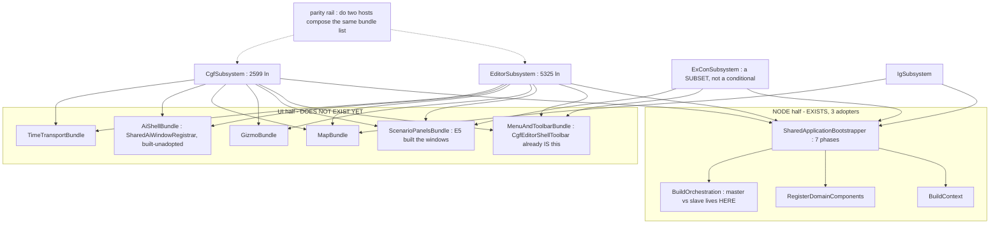

<!--STATUS
state: LIVE
build-state: DESIGN — architect question, largest blast radius in the programme (EVERY host). Resolve WITH
  the user before any build (WHO-DESIGNS amendment: I analyse and suggest, the user approves).
updated: 2026-08-27
current-answer: §4 the decision sub-questions with my leans. §2 = the measured INVENTORY. §3 = the finding
  that reframes AQ62.
design-basis: SharedApplicationBootstrapper (the existing 7-phase node base, 3 adopters) ·
  Architect_Question_62 (CGF↔editor composition unification — this AQ WIDENS and partly SUPERSEDES it) ·
  PROGRAMME_Cgf_Equals_Editor_Gap_Map.md §2c · ruling 66 · ruling 58 (one registration list) ·
  ruling 49 · CE-016/CE-037..045 (CgfEditorShellToolbar — the derived-subset pattern that already works) ·
  CE-046..064 (five measured drift instances + the silent-default class).
known-conflict: ⛔ AQ62 §3 Q62-A proposes ONE `ComposeEditorExperience(deps)` for editor+CGF. §4 Q63-B
  argues that is a TWO-HOST answer that does not generalise to N hosts, and that Q62-C's god-facade
  prerequisite is OBSOLETE by measurement (§3.3). AQ62's DIRECTION stands; its SHAPE and STAGING do not.
  ⚠ Nothing here overturns the ruled network/authority divergence (Q26/ruling 22).
-->
# Architect Question 63 — **Unify subsystem composition across ALL hosts**

> 🔒 **User, `2026-08-27`:** *"the subsystem bootstrap need much bigger unification than there is now. and
> not just between cgf and editor (where the unification should be largest), but also other like simhost
> etc. we tried to unify so much like map, menus, gizmos… so we should share its composition code as well."*

## 1. ⭐⭐⭐ BOTTOM LINE

| | |
|---|---|
| ⭐⭐⭐ **The user's premise is correct and MEASURABLE** | 📐 The features were unified *(map · menus · gizmos · panels · catalogs · inspector)*. ⛔ **The composition of them was not.** Each host still wires the shared pieces by hand |
| ⭐⭐⭐ **There are TWO composition halves. ONE already exists and works** | ⭐ the **NODE** half is `SharedApplicationBootstrapper` — 7 phases, **3 adopters**. 🕳️ the **UI/EXPERIENCE** half **has no shared root at all** |
| 🔴 **The correlation is the whole argument** | 📐 the three hosts that adopted the node base have roots of **385 · 208 · small** lines. The five that hand-roll: **5325 · 2599 · 1086 · 602 · 460** |
| ⭐⭐⭐ **And the seam for the UI half ALREADY EXISTS — used the wrong way round** | 📐 `IWindowRegistrar` has **10** implementations and **8 of them are the SUBSYSTEMS THEMSELVES.** ⇒ the unit of composition is the **host**, not the **feature** — which is exactly why there is nothing to share |

## 2. ⭐⭐ INVENTORY — the measured landscape

⭐ Queries run *(codebase-memory CLI unavailable this session — MCP server disconnected mid-batch; these are
`grep`/`wc` over the full source tree, and every claim below is a COUNT, not an absence claim)*:

```
grep -rln ": *ISubsystem\b" --include=*.cs Hrot/ Stride/        # 10 hosts, then wc -l each
grep -rn  ": *SharedApplicationBootstrapper"                     # 3 production adopters + 1 test
grep -rln ": *IWindowRegistrar"                                  # 10 — of which 8 ARE hosts
grep -rln ": *IEcsModule\b"                                      # 50
```

### 2.1 The hosts

| host | root LOC | node bootstrap | UI composition |
|---|--:|---|---|
| `EditorSubsystem` | 🔴 **5325** | ⛔ hand-rolled | ⛔ hand-rolled *(is its own `IWindowRegistrar`)* |
| `CgfSubsystem` | 🔴 **2599** | ⛔ hand-rolled | ⛔ hand-rolled |
| `ReplayBrowserSubsystem` | ⚠ 1086 | ⛔ hand-rolled | ⛔ hand-rolled |
| `ExConSubsystem` | 602 | ⛔ hand-rolled | ⛔ hand-rolled |
| `OrchestratorSubsystem` | 460 | ⛔ hand-rolled | ⛔ hand-rolled |
| `SimHostSubsystem` | ⭐ **385** | ✅ `SimHostNodeBootstrapper` | ⛔ hand-rolled |
| `IgSubsystem` | ⭐ **208** | ✅ `IgNodeBootstrapper` | ⛔ hand-rolled |
| Stride | ⭐ small | ✅ `StrideNodeBootstrapper` | ⛔ hand-rolled |

### 2.2 ⭐⭐ The two halves

| half | what it composes | status |
|---|---|---|
| ⭐ **NODE bootstrap** | world+context · ECS components · scenario serializer · togglable system groups · orchestration handlers · spawn pipeline · DDS translators · time-sync · kernel `Initialize` | ✅ **EXISTS** — `SharedApplicationBootstrapper`, phase order documented *"non-negotiable"*, **3 adopters**. ⛔ Five hosts bypass it |
| 🕳️ **UI / EXPERIENCE composition** | map+canvas+layers · menus+toolbar · gizmos · panels/windows · asset catalogs+contributors · inspector · perspectives · time transport · AI shell | ⛔⛔ **NO shared root.** Every windowed host wires all of it inline |

### 2.3 ⭐⭐⭐ The asymmetry that names the fix

| the SYSTEM half | the UI half |
|---|---|
| composed as **50 `IEcsModule`s** — objects a host registers | composed as **8 monolithic `IWindowRegistrar`s** — the hosts themselves |
| ⭐ `ScenarioEditorModule` *(E3)* is the proof it works: systems + `InteractionDeps`, registered by both hosts | ⛔ `SharedAiWindowRegistrar` is the prototype that was **BUILT AND NEVER ADOPTED** *(in-degree 0)* |

⇒ ⭐⭐⭐ **The unification the user is asking for is: bring the UI half to the pattern the system half already
has.** ⛔ It is not a new abstraction — it is finishing one that exists.

## 3. ⭐⭐ WHAT THIS CHANGES ABOUT `AQ62`

### 3.1 ⭐ AQ62's direction is right; its SHAPE is a two-host answer
⭐ `Q62-A` proposes ONE `ComposeEditorExperience(deps)` shared by **editor + CGF**. ⛔ That does not
generalise: ExCon needs mission/orbat/spawner but **no** AI-graph perspectives; IG is a display node;
ReplayBrowser has its own timeline; SimHost is headless-first. ⇒ a single monolithic *"editor experience"*
forces one of two things we have ruled against:

| forced outcome | why it is barred |
|---|---|
| `if (host == …)` inside the shared method | ⛔ **ruling 58** — one registration list, no host conditionals |
| a giant `deps` object of nullable knobs | ⛔⛔ **that is a silent-default GENERATOR.** 📌 Five measured instances this programme *(`CE-052` `CE-059` `CE-061` + the two the rule was written from)* — every one was *"the caller HAD the value and did not pass it"* |

### 3.2 ⭐⭐ The pattern that DOES generalise is already in the repo and already proved
📐 `CgfEditorShellToolbar.RegisterCommonCore` *(`CE-016`/`CE-037`…`045`)*: **ONE shared table**, and each
host's subset is **DERIVED from what that host can service** — an entry exists only for a command the
shell can actually run. ⇒ ⭐⭐ **no host list, no `if (host==…)`, and ruling 49 by construction.**
⭐ That is the template for every feature bundle.

### 3.3 ⛔⛔ `Q62-C`'s prerequisite — **the god-facade — is OBSOLETE by measurement**
📐 Measured `2026-08-27`. AQ62 calls `IEditorLogic`/`EditorApplication` *"the god-facade the editor root
uses pervasively"*, *"the one hard blocker"*, blast radius *"large"*. **It is not, any more** — `E1`–`E5`
hollowed it out:

| measured | |
|---|---|
| `IEditorLogic` | **128 ln, ~15 members** |
| `EditorApplication` | **297 ln**, and its body is now almost entirely ONE-LINE DELEGATION |
| the 5 scenario verbs | → `_session.*` *(`E1`)* |
| `ActivateTool` · `CenterOnEntity` · `SelectEntity` | → a **single `_simBus.Publish(...)`** each |
| `CommitPropertyEdit` | → one `PublishManaged(new UpdateEntityCommand …)`; its only consumer is the already-shared `EntityRenameModal` *(`E4`)* |
| `Hrot.Editor.AiShared` references to it | ⭐ **ZERO in code** — all matches are doc-comment prose |
| genuinely editor-only left | ⭐ ~**3**: `SwitchToExternalAsync`/`SwitchToInternalAsync` *(in-process kernel mode — the RULED (c) core)* and `RebuildAndReloadAI` |

⇒ ⭐⭐⭐ **The cheaper move is DISSOLUTION, not extraction.** 📌 `CE-060` already did it once: replacing
`_logic.ActivateTool(...)` with the shared event it publishes **deleted the dependency in one line** and let
the adapter leave `Hrot.Editor` entirely. ⇒ ⛔ **do not front-load a god-facade lift**; dissolve the ~10
dissolvable members call-site by call-site and `IEditorLogic` shrinks to the (c) core, which never needed to
move.

### 3.4 ⚠ And AQ62's "(c) is small and irreducible per-host" is half wrong
📐 Three hosts already **share** the (c) mechanics through `SharedApplicationBootstrapper` — world, kernel,
serializer, orchestration, time-sync. ⇒ ⭐ the (c) core is not irreducible; it is **already shared, just not
by the two bespoke hosts.** ⛔ What genuinely stays per-host is narrower: the **role** *(master vs slave)*,
the **handler binding** *(networkless vs networked — Q26/ruling 22)*, and the editor's **in-process
kernel-mode**. ⚠ Those are exactly what the base's abstract hooks are FOR *(`BuildOrchestration`,
`RegisterDomainComponents`)*.

## 4. ⭐⭐⭐ THE DECISION — sub-questions, each with my lean

| | question | ⭐ my lean | blast radius |
|---|---|---|---|
| **Q63-A** | Widen the goal from *cgf==editor* to **one composition model for EVERY host**? | ✅ **YES** — it is the user's ask, and §2.1 shows the LOC correlation makes the case on its own. ⚠ But it crosses lanes *(ExCon, ReplayBrowser, Orchestrator are not the UI lane's files)* ⇒ needs a coordination ruling, `Q63-E` | 🔴 every host |
| **Q63-B** | ONE `ComposeEditorExperience(deps)` *(AQ62)* **or** **per-FEATURE composition bundles** a host opts into? | ✅ **BUNDLES.** §3.1: a monolith forces a host conditional or a nullable-knob bag, both barred. ⭐ Bundles mirror the 50-module system half and the derived-subset toolbar that already works | ⭐ shape only, but decides everything downstream |
| **Q63-C** | Adopt `SharedApplicationBootstrapper` on the **hand-rolling hosts**, starting with editor + CGF? | ✅ **YES, and do it FIRST.** ⭐ It already exists, is proved on 3 hosts, needs NO new abstraction, and is the largest single LOC reduction available. ⚠ **One genuine unknown to measure before committing:** whether the editor's in-process kernel-mode *(`SwitchToExternal/Internal`)* fits a phase hook or fights the *"non-negotiable"* phase order | ⚠ medium — touches the (c) core |
| **Q63-D** | Keep AQ62's `Q62-C` god-facade extraction as the prerequisite? | ⛔ **NO — drop it** *(§3.3)*. Replace with **incremental dissolution**, which is strictly cheaper, is already demonstrated by `CE-060`, and needs no staging of its own | ⭐ removes the plan's biggest risk item |
| **Q63-E** | Who builds the non-UI hosts' migration *(ExCon · ReplayBrowser · Orchestrator · SimHost)*? | ⭐ **The UI lane defines the SEAM and migrates editor + CGF only**; each owning lane adopts it for its host, against a rail. ⛔ One session rewriting five hosts' roots across three lanes is how a merge conflict eats a week | ⚠ coordination |
| **Q63-F** | Does the parity rail *(the user's absolute-must)* still go first? | ✅ **YES — but scope it honestly.** ⚠⚠ Measured this batch: it **cannot** be built as *"assert on the constructed object"* from a bare ctor — CGF's UI pieces are built inside `Initialize`'s `!_headless` block from `_context`, so `new CgfSubsystem()` reaches nulls *(this is why `E5`'s rails fell back to source scans, as their own remarks say)*. ⇒ ⭐ build it on the **integration harnesses that already boot hosts for real** *(`CgfHarness`, `HrotRunnerHarness`, `EditorHarness`)* | ⭐ scaffolding |

### ⭐⭐ Q63-F, the part worth saying out loud
⛔ **Most of a per-piece parity rail becomes tautological the moment bundles land** *(a bundle either is
composed or is not — there is no per-piece drift left)*. ⭐ It is still worth building, because it protects
the migration itself, which is when a mistake breaks every host at once. ⚠ **But build it CHEAPLY** — it is
a scaffold, not a monument, and roughly half of it gets deleted at the end.

## 5. ⭐⭐ THE SHAPE, if Q63-B is approved



⭐ **Read the diagram as the claim it makes:** a host's root becomes *"one node bootstrapper + a list of
bundles"*. ⛔ ExCon composing fewer bundles is a **subset**, never a branch.

## 6. ⭐ SEQUENCING, if approved *(each phase its own design + UML, one per batch)*

| phase | what | why here |
|---|---|---|
| **0** | the parity rail, on the integration harnesses; seeded from the 8 known drift instances | ⭐ user ruling — absolute must; it protects every later phase |
| **1** | ⭐⭐ **editor + CGF adopt `SharedApplicationBootstrapper`** | ⭐ the half that already exists; biggest LOC win; no new abstraction. ⚠ measure the kernel-mode hook FIRST |
| **2** | define the **bundle seam** + migrate **menus/toolbar** across all windowed hosts | ⭐ `CgfEditorShellToolbar` already IS the pattern ⇒ proves the seam cheaply before betting map/gizmos on it |
| **3+** | one bundle per batch, in the order drift bit us: scenario panels → gizmos → map → AI shell → time transport | ⭐ each collapses a measured drift site permanently |
| **last** | delete the per-piece half of the phase-0 rail | ⛔ it is tautological once bundles hold |

⛔ **What must NOT change at any phase:** the ruled network/authority divergence *(Q26/ruling 22)* — role,
handler binding, unowned-write authority. ⚠ A phase that would blur it is a STOP-and-report.

## 7. ⚠ THE COUNTER-CASE, stated fairly

- ⭐ Surface-by-surface **has been working** — `E1`–`E5` shipped and were verified. This is a bigger bet.
- ⚠ **Phase 1 is the risky one, not phase 2+**: `SharedApplicationBootstrapper`'s phase order is documented
  *"non-negotiable"*, and the editor is the host with the most bespoke boot *(in-process kernel mode, the
  networkless binding)*. ⛔ If it does not fit a hook, phase 1 stalls — ⇒ **measure that hook before
  approving phase 1**, not during it.
- ⚠ Widening to five more hosts multiplies coordination cost; `Q63-E` exists to bound it.
- ⭐ **The cheap fallback, if appetite is low:** phase 0's rail alone. It does not end the drift class, but
  it turns it from *"the user finds it by eye"* into *"CI goes red"* — which is the immediate pain.
