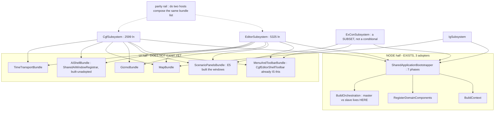

<!--STATUS
state: LIVE
build-state: DESIGN — architect question, largest blast radius in the programme (EVERY host). Resolve WITH
  the user before any build (WHO-DESIGNS amendment: I analyse and suggest, the user approves).
updated: 2026-08-27
current-answer: §4 the decision sub-questions with my leans. §2 = the measured INVENTORY. §3 = the finding
  that reframes AQ62. ⭐⭐ §8 = Q63-C MEASURED (2026-08-27): the kernel-mode hook is NOT a blocker, the
  pre/post-Initialize line already IS the node/UI boundary, phase 1 touches only editor+CGF, and CGF goes
  FIRST. §8 WINS over §4 Q63-C's 'genuine unknown' and over §7's counter-case on that point.
  🔒🔒 §9 = USER RULING 2026-08-27, the ASYMMETRIC sharing direction: editor is the specimen for UI/editing/
  monitoring/debugging; network translator sets are per-host and must NOT be unified. §9 is CANON and WINS
  over §8.5's sequencing (§9.4 reverses it: UI bundles FIRST, node adoption later) and over §8.2's
  'translatorPacks is a defect' reading (§9.3 retracts it).
  🔒🔒 §10 = USER RULING part 2: the RUN-SET (modules/systems/services) is per-ROLE and NOT unifiable —
  the editor runs almost everything, CGF/IG/SimHost run only what their role needs. §10.2 separates the
  two axes (editor = UI specimen, NOT run-set template); §10.3 is the bundle design rule; ⭐⭐ §10.4
  CORRECTS the frame handoff's phase-0 rail wording, which would have encoded a violation. §10 is CANON.
user-approved: 2026-08-27 — Q63-B bundles, Q63-D dissolution, and Q63-E resolved as SINGLE SESSION owns
  every composition root (so no cross-lane split is needed).
design-basis: SharedApplicationBootstrapper (the existing 7-phase node base, 3 adopters) ·
  Architect_Question_62 (CGF↔editor composition unification — this AQ WIDENS and partly SUPERSEDES it) ·
  PROGRAMME_Cgf_Equals_Editor_Gap_Map.md §2c · ruling 66 · ruling 58 (one registration list) ·
  ruling 49 · CE-016/CE-037..045 (CgfEditorShellToolbar — the derived-subset pattern that already works) ·
  CE-046..064 (five measured drift instances + the silent-default class).
known-conflict: ⛔ AQ62 §3 Q62-A proposes ONE `ComposeEditorExperience(deps)` for editor+CGF. §4 Q63-B
  argues that is a TWO-HOST answer that does not generalise to N hosts, and that Q62-C's god-facade
  prerequisite is OBSOLETE by measurement (§3.3). AQ62's DIRECTION stands; its SHAPE and STAGING do not.
  ⚠ Nothing here overturns the ruled network/authority divergence (Q26/ruling 22).
-->
# Architect Question 63 — **Unify subsystem composition across ALL hosts**

> 🔒 **User, `2026-08-27`:** *"the subsystem bootstrap need much bigger unification than there is now. and
> not just between cgf and editor (where the unification should be largest), but also other like simhost
> etc. we tried to unify so much like map, menus, gizmos… so we should share its composition code as well."*

## 1. ⭐⭐⭐ BOTTOM LINE

| | |
|---|---|
| ⭐⭐⭐ **The user's premise is correct and MEASURABLE** | 📐 The features were unified *(map · menus · gizmos · panels · catalogs · inspector)*. ⛔ **The composition of them was not.** Each host still wires the shared pieces by hand |
| ⭐⭐⭐ **There are TWO composition halves. ONE already exists and works** | ⭐ the **NODE** half is `SharedApplicationBootstrapper` — 7 phases, **3 adopters**. 🕳️ the **UI/EXPERIENCE** half **has no shared root at all** |
| 🔴 **The correlation is the whole argument** | 📐 the three hosts that adopted the node base have roots of **385 · 208 · small** lines. The five that hand-roll: **5325 · 2599 · 1086 · 602 · 460** |
| ⭐⭐⭐ **And the seam for the UI half ALREADY EXISTS — used the wrong way round** | 📐 `IWindowRegistrar` has **10** implementations and **8 of them are the SUBSYSTEMS THEMSELVES.** ⇒ the unit of composition is the **host**, not the **feature** — which is exactly why there is nothing to share |

## 2. ⭐⭐ INVENTORY — the measured landscape

⭐ Queries run *(codebase-memory CLI unavailable this session — MCP server disconnected mid-batch; these are
`grep`/`wc` over the full source tree, and every claim below is a COUNT, not an absence claim)*:

```
grep -rln ": *ISubsystem\b" --include=*.cs Hrot/ Stride/        # 10 hosts, then wc -l each
grep -rn  ": *SharedApplicationBootstrapper"                     # 3 production adopters + 1 test
grep -rln ": *IWindowRegistrar"                                  # 10 — of which 8 ARE hosts
grep -rln ": *IEcsModule\b"                                      # 50
```

### 2.1 The hosts

| host | root LOC | node bootstrap | UI composition |
|---|--:|---|---|
| `EditorSubsystem` | 🔴 **5325** | ⛔ hand-rolled | ⛔ hand-rolled *(is its own `IWindowRegistrar`)* |
| `CgfSubsystem` | 🔴 **2599** | ⛔ hand-rolled | ⛔ hand-rolled |
| `ReplayBrowserSubsystem` | ⚠ 1086 | ⛔ hand-rolled | ⛔ hand-rolled |
| `ExConSubsystem` | 602 | ⛔ hand-rolled | ⛔ hand-rolled |
| `OrchestratorSubsystem` | 460 | ⛔ hand-rolled | ⛔ hand-rolled |
| `SimHostSubsystem` | ⭐ **385** | ✅ `SimHostNodeBootstrapper` | ⛔ hand-rolled |
| `IgSubsystem` | ⭐ **208** | ✅ `IgNodeBootstrapper` | ⛔ hand-rolled |
| Stride | ⭐ small | ✅ `StrideNodeBootstrapper` | ⛔ hand-rolled |

### 2.2 ⭐⭐ The two halves

| half | what it composes | status |
|---|---|---|
| ⭐ **NODE bootstrap** | world+context · ECS components · scenario serializer · togglable system groups · orchestration handlers · spawn pipeline · DDS translators · time-sync · kernel `Initialize` | ✅ **EXISTS** — `SharedApplicationBootstrapper`, phase order documented *"non-negotiable"*, **3 adopters**. ⛔ Five hosts bypass it |
| 🕳️ **UI / EXPERIENCE composition** | map+canvas+layers · menus+toolbar · gizmos · panels/windows · asset catalogs+contributors · inspector · perspectives · time transport · AI shell | ⛔⛔ **NO shared root.** Every windowed host wires all of it inline |

### 2.3 ⭐⭐⭐ The asymmetry that names the fix

| the SYSTEM half | the UI half |
|---|---|
| composed as **50 `IEcsModule`s** — objects a host registers | composed as **8 monolithic `IWindowRegistrar`s** — the hosts themselves |
| ⭐ `ScenarioEditorModule` *(E3)* is the proof it works: systems + `InteractionDeps`, registered by both hosts | ⛔ `SharedAiWindowRegistrar` is the prototype that was **BUILT AND NEVER ADOPTED** *(in-degree 0)* |

⇒ ⭐⭐⭐ **The unification the user is asking for is: bring the UI half to the pattern the system half already
has.** ⛔ It is not a new abstraction — it is finishing one that exists.

## 3. ⭐⭐ WHAT THIS CHANGES ABOUT `AQ62`

### 3.1 ⭐ AQ62's direction is right; its SHAPE is a two-host answer
⭐ `Q62-A` proposes ONE `ComposeEditorExperience(deps)` shared by **editor + CGF**. ⛔ That does not
generalise: ExCon needs mission/orbat/spawner but **no** AI-graph perspectives; IG is a display node;
ReplayBrowser has its own timeline; SimHost is headless-first. ⇒ a single monolithic *"editor experience"*
forces one of two things we have ruled against:

| forced outcome | why it is barred |
|---|---|
| `if (host == …)` inside the shared method | ⛔ **ruling 58** — one registration list, no host conditionals |
| a giant `deps` object of nullable knobs | ⛔⛔ **that is a silent-default GENERATOR.** 📌 Five measured instances this programme *(`CE-052` `CE-059` `CE-061` + the two the rule was written from)* — every one was *"the caller HAD the value and did not pass it"* |

### 3.2 ⭐⭐ The pattern that DOES generalise is already in the repo and already proved
📐 `CgfEditorShellToolbar.RegisterCommonCore` *(`CE-016`/`CE-037`…`045`)*: **ONE shared table**, and each
host's subset is **DERIVED from what that host can service** — an entry exists only for a command the
shell can actually run. ⇒ ⭐⭐ **no host list, no `if (host==…)`, and ruling 49 by construction.**
⭐ That is the template for every feature bundle.

### 3.3 ⛔⛔ `Q62-C`'s prerequisite — **the god-facade — is OBSOLETE by measurement**
📐 Measured `2026-08-27`. AQ62 calls `IEditorLogic`/`EditorApplication` *"the god-facade the editor root
uses pervasively"*, *"the one hard blocker"*, blast radius *"large"*. **It is not, any more** — `E1`–`E5`
hollowed it out:

| measured | |
|---|---|
| `IEditorLogic` | **128 ln, ~15 members** |
| `EditorApplication` | **297 ln**, and its body is now almost entirely ONE-LINE DELEGATION |
| the 5 scenario verbs | → `_session.*` *(`E1`)* |
| `ActivateTool` · `CenterOnEntity` · `SelectEntity` | → a **single `_simBus.Publish(...)`** each |
| `CommitPropertyEdit` | → one `PublishManaged(new UpdateEntityCommand …)`; its only consumer is the already-shared `EntityRenameModal` *(`E4`)* |
| `Hrot.Editor.AiShared` references to it | ⭐ **ZERO in code** — all matches are doc-comment prose |
| genuinely editor-only left | ⭐ ~**3**: `SwitchToExternalAsync`/`SwitchToInternalAsync` *(in-process kernel mode — the RULED (c) core)* and `RebuildAndReloadAI` |

⇒ ⭐⭐⭐ **The cheaper move is DISSOLUTION, not extraction.** 📌 `CE-060` already did it once: replacing
`_logic.ActivateTool(...)` with the shared event it publishes **deleted the dependency in one line** and let
the adapter leave `Hrot.Editor` entirely. ⇒ ⛔ **do not front-load a god-facade lift**; dissolve the ~10
dissolvable members call-site by call-site and `IEditorLogic` shrinks to the (c) core, which never needed to
move.

### 3.4 ⚠ And AQ62's "(c) is small and irreducible per-host" is half wrong
📐 Three hosts already **share** the (c) mechanics through `SharedApplicationBootstrapper` — world, kernel,
serializer, orchestration, time-sync. ⇒ ⭐ the (c) core is not irreducible; it is **already shared, just not
by the two bespoke hosts.** ⛔ What genuinely stays per-host is narrower: the **role** *(master vs slave)*,
the **handler binding** *(networkless vs networked — Q26/ruling 22)*, and the editor's **in-process
kernel-mode**. ⚠ Those are exactly what the base's abstract hooks are FOR *(`BuildOrchestration`,
`RegisterDomainComponents`)*.

## 4. ⭐⭐⭐ THE DECISION — sub-questions, each with my lean

| | question | ⭐ my lean | blast radius |
|---|---|---|---|
| **Q63-A** | Widen the goal from *cgf==editor* to **one composition model for EVERY host**? | ✅ **YES** — it is the user's ask, and §2.1 shows the LOC correlation makes the case on its own. ⚠ But it crosses lanes *(ExCon, ReplayBrowser, Orchestrator are not the UI lane's files)* ⇒ needs a coordination ruling, `Q63-E` | 🔴 every host |
| **Q63-B** | ONE `ComposeEditorExperience(deps)` *(AQ62)* **or** **per-FEATURE composition bundles** a host opts into? | ✅ **BUNDLES.** §3.1: a monolith forces a host conditional or a nullable-knob bag, both barred. ⭐ Bundles mirror the 50-module system half and the derived-subset toolbar that already works | ⭐ shape only, but decides everything downstream |
| **Q63-C** | Adopt `SharedApplicationBootstrapper` on the **hand-rolling hosts**, starting with editor + CGF? | ✅ **YES, and do it FIRST.** ⭐ It already exists, is proved on 3 hosts, needs NO new abstraction, and is the largest single LOC reduction available. ⚠ **One genuine unknown to measure before committing:** whether the editor's in-process kernel-mode *(`SwitchToExternal/Internal`)* fits a phase hook or fights the *"non-negotiable"* phase order | ⚠ medium — touches the (c) core |
| **Q63-D** | Keep AQ62's `Q62-C` god-facade extraction as the prerequisite? | ⛔ **NO — drop it** *(§3.3)*. Replace with **incremental dissolution**, which is strictly cheaper, is already demonstrated by `CE-060`, and needs no staging of its own | ⭐ removes the plan's biggest risk item |
| **Q63-E** | Who builds the non-UI hosts' migration *(ExCon · ReplayBrowser · Orchestrator · SimHost)*? | ⭐ **The UI lane defines the SEAM and migrates editor + CGF only**; each owning lane adopts it for its host, against a rail. ⛔ One session rewriting five hosts' roots across three lanes is how a merge conflict eats a week | ⚠ coordination |
| **Q63-F** | Does the parity rail *(the user's absolute-must)* still go first? | ✅ **YES — but scope it honestly.** ⚠⚠ Measured this batch: it **cannot** be built as *"assert on the constructed object"* from a bare ctor — CGF's UI pieces are built inside `Initialize`'s `!_headless` block from `_context`, so `new CgfSubsystem()` reaches nulls *(this is why `E5`'s rails fell back to source scans, as their own remarks say)*. ⇒ ⭐ build it on the **integration harnesses that already boot hosts for real** *(`CgfHarness`, `HrotRunnerHarness`, `EditorHarness`)* | ⭐ scaffolding |

### ⭐⭐ Q63-F, the part worth saying out loud
⛔ **Most of a per-piece parity rail becomes tautological the moment bundles land** *(a bundle either is
composed or is not — there is no per-piece drift left)*. ⭐ It is still worth building, because it protects
the migration itself, which is when a mistake breaks every host at once. ⚠ **But build it CHEAPLY** — it is
a scaffold, not a monument, and roughly half of it gets deleted at the end.

## 5. ⭐⭐ THE SHAPE, if Q63-B is approved



⭐ **Read the diagram as the claim it makes:** a host's root becomes *"one node bootstrapper + a list of
bundles"*. ⛔ ExCon composing fewer bundles is a **subset**, never a branch.

## 6. ⭐ SEQUENCING, if approved *(each phase its own design + UML, one per batch)*

| phase | what | why here |
|---|---|---|
| **0** | the parity rail, on the integration harnesses; seeded from the 8 known drift instances | ⭐ user ruling — absolute must; it protects every later phase |
| **1** | ⭐⭐ **editor + CGF adopt `SharedApplicationBootstrapper`** | ⭐ the half that already exists; biggest LOC win; no new abstraction. ⚠ measure the kernel-mode hook FIRST |
| **2** | define the **bundle seam** + migrate **menus/toolbar** across all windowed hosts | ⭐ `CgfEditorShellToolbar` already IS the pattern ⇒ proves the seam cheaply before betting map/gizmos on it |
| **3+** | one bundle per batch, in the order drift bit us: scenario panels → gizmos → map → AI shell → time transport | ⭐ each collapses a measured drift site permanently |
| **last** | delete the per-piece half of the phase-0 rail | ⛔ it is tautological once bundles hold |

⛔ **What must NOT change at any phase:** the ruled network/authority divergence *(Q26/ruling 22)* — role,
handler binding, unowned-write authority. ⚠ A phase that would blur it is a STOP-and-report.

## 7. ⚠ THE COUNTER-CASE, stated fairly

- ⭐ Surface-by-surface **has been working** — `E1`–`E5` shipped and were verified. This is a bigger bet.
- ⚠ **Phase 1 is the risky one, not phase 2+**: `SharedApplicationBootstrapper`'s phase order is documented
  *"non-negotiable"*, and the editor is the host with the most bespoke boot *(in-process kernel mode, the
  networkless binding)*. ⛔ If it does not fit a hook, phase 1 stalls — ⇒ **measure that hook before
  approving phase 1**, not during it.
- ⚠ Widening to five more hosts multiplies coordination cost; `Q63-E` exists to bound it.
- ⭐ **The cheap fallback, if appetite is low:** phase 0's rail alone. It does not end the drift class, but
  it turns it from *"the user finds it by eye"* into *"CI goes red"* — which is the immediate pain.

## 8. ✅✅ `Q63-C` MEASURED — **the kernel-mode hook is NOT a blocker** *(`2026-08-27`, user asked for this first)*

> ⭐⭐ **§7's counter-case named this as the thing that could stall phase 1. It does not.**

### 8.1 ⭐⭐⭐ The switch runs AFTER bootstrap, so it cannot fight a bootstrap order

📐 `EditorApplication.SwitchToExternalAsync` / `SwitchToInternalAsync`, in full:

```csharp
await _kernel.UninstallModulesAsync(_logicPacks);
if (_translatorPacks != null) await _kernel.InstallModulesAsync(_translatorPacks);
_currentMode = SimHostMode.External;          // and the mirror image for Internal
```

| measured | ⇒ |
|---|---|
| it is **runtime module hot-swap on an already-initialized kernel** | ⛔ it does not construct the world, the kernel, or a context |
| its only callers are `EditorToolbarPanel` — **a toolbar click** *(`_ = logic.SwitchToExternalAsync()`, fire-and-forget)* | ⭐ it runs **long after Phase 7** |
| what it needs FROM bootstrap is **one value**: the `logicPacks` list | ⭐⭐ the editor's bootstrapper subclass keeps it as a field and hands it to `EditorApplication` after `BootstrapNode` returns ⇒ **NO base-class change** |

⇒ ✅ **`Q63-C`'s unknown is discharged.** ⛔ The *"non-negotiable phase order"* is a bootstrap-time constraint and `SimHostMode` is a run-time concern; they do not intersect.

### 8.2 🔴 A DEFECT fell out of the measurement — **`translatorPacks` is never supplied in production**

📐 `grep -rn translatorPacks` — **one supplier repo-wide, and it is a TEST harness** *(`EditorHarness.cs:270`)*.
The production site *(`EditorSubsystem:1761`)* passes `logicPacks` and **omits it**; and the editor builds
**nothing** translator-pack-shaped *(zero `ACL`/`TranslatorPack` hits in that file)*.

⇒ ⚠⚠ **"Go External" uninstalls the local logic packs and installs NOTHING** — the editor enters a mode with
no simulation logic and no translators, while the toolbar button reads *"Go External"* as though it worked.
📌 The `VC-3`/ruling-49 shape: a control that silently does the wrong thing.

⛔ **Stated as measured-and-suspicious, NOT as a confirmed defect.** ⚠ It is possible External mode is *meant*
to be *"no local logic, receive state over DDS"* with the translators coming from the network factory rather
than a module pack. ⭐ **Next check, one command:** whether the DDS ingress translators are registered
unconditionally at bootstrap *(Phase 6b)* — if they are, the mode is coherent and only the dead
`translatorPacks` parameter is misleading. ⇒ filed for a `CE-` row either way.

### 8.3 ⭐⭐⭐ The REAL shape of phase 1 — **the split line already exists**

| host | kernel `Initialize()` at | of | ⇒ |
|---|--:|--:|---|
| `EditorSubsystem` | **1757** | 5325 | 33% node bootstrap · ⭐ **67% UI composition** |
| `CgfSubsystem` | **850** | 2599 | 33% · ⭐ **67%** — *the same ratio* |
| `ExConSubsystem` · `ReplayBrowserSubsystem` · `OrchestratorSubsystem` | ⛔ **none** | — | ⭐⭐ **they own NO kernel** |

📐 And the boundary is clean: **after** `Initialize()` the editor has **54** window/menu/toolbar composition
calls and ⭐ **ZERO** kernel-module registrations.

⇒ ⭐⭐⭐ **The pre/post-`Initialize()` line is already almost exactly the node/UI boundary.** Phase 1 is not
surgery on a tangle — it is formalising a line the code already draws.

### 8.4 ⭐⭐ Two findings that RE-SEQUENCE the plan

| # | measured | ⇒ decision |
|---|---|---|
| **①** | `ExCon` · `ReplayBrowser` · `Orchestrator`: **0** `ModuleHostKernel`, **0** `RegisterModule`, only `RegisterWindow` *(9 · 6 · 2)* | ⭐⭐ **Phase 1 applies to editor + CGF ONLY.** The other three are **pure bundle consumers** and skip it entirely ⇒ the risky phase touches **two** hosts, not five |
| **②** | CGF already uses `HrotNodeBuilder` *(5 hits)* **and** `HrotNodeContext`; the editor uses ⛔ **NEITHER (0/0)** | ⭐⭐⭐ **Do CGF FIRST, not the editor.** It is half the size, already holds the context shape, and proving the subclass on it de-risks the 5325-line host. ⚠ The editor is the outlier here — ⛔ not "the pair is equally bespoke" |

### 8.5 ⭐ Phase 1, as it should now be sequenced

| step | what | why |
|---|---|---|
| **1a** | **CGF** subclasses `SharedApplicationBootstrapper`; everything above its `Initialize()` *(≤ ln 850)* moves into the phase hooks | ⭐ already has the context + builder; smallest real migration |
| **1b** | **editor** does the same for its ≤ ln 1757 half; `logicPacks` becomes a field of the subclass | ⚠ bigger, but 1a has proved the shape |
| **1c** | ⛔ **STOP.** ExCon/ReplayBrowser/Orchestrator get **no** phase-1 work | ⭐ finding ① — they own no kernel |

## 9. 🔒🔒🔒 USER RULING `2026-08-27` — **the sharing direction is ASYMMETRIC BY DOMAIN**

> 🔒 **User, verbatim:** *"regarding ui and scenario editing and monitoring and debugging editor is
> obviously the source and specimen of what to share with others. regarding network stuff like translator
> packs this is very different, the cgf and simhost and ig are very likely using a precisely tailored set
> of translators that can not be unified easily and blindly, the opposite is true."*

⭐⭐⭐ **This is CANON, not a state claim** — it is a decision about direction and it does not decay.

| domain | direction | ⇒ what that means for this AQ |
|---|---|---|
| ⭐⭐⭐ **UI · scenario editing · monitoring · debugging** | **the EDITOR is the SOURCE AND SPECIMEN**; other hosts adopt FROM it | ⭐ bundles are extracted from the editor's wiring, and *"what does the editor do here"* is the reference answer. ⛔ Not a negotiation between two hosts' habits |
| ⛔⛔ **NETWORK — translator packs, DDS wiring, egress/ingress sets** | ⭐⭐ **THE OPPOSITE.** Each host's set is **precisely tailored** and ⛔ **must NOT be unified easily or blindly** | ⛔ **there is NO network bundle, and none may be added.** The per-host translator set stays per-host |

### 9.1 📐 MEASURED — the ruling is right, and the sets are near-DISJOINT

| host | translators its bootstrapper registers |
|---|---|
| `SimHostNodeBootstrapper` | `CreateSimHostAuxiliaryTranslator` · `CreateSimHostPathfindingTranslator` · `CreateSimHostPerceptionTranslator` |
| `IgNodeBootstrapper` | ⭐ **`CreateIgEgressTranslator` only** — a *different* translator, not a subset |
| `StrideNodeBootstrapper` | `CreateSimHostAuxiliaryTranslator` only |

⇒ ⭐⭐ **Almost no overlap.** ⛔ Any attempt to hoist a *"shared translator set"* would either give a host
translators it must not run, or strip ones it needs — ⚠ and both failures are **silent on a single box**
and only appear on a real multi-node cluster.

### 9.2 ✅✅ AND THE EXISTING BASE ALREADY ENCODES THIS — **adopting it does NOT unify the network**

📐 This is the reassurance that matters for `Q63-C`: `SharedApplicationBootstrapper` Phase 6b
`RegisterNetworkTranslators` is an **`abstract` hook**. ⇒ ⭐⭐⭐ **the base does not supply a translator set —
it FORCES each host to declare its own**, and a host that forgets does not compile.

| what the base shares UNCONDITIONALLY *(marked "base class ONLY, NOT a subclass hook")* | ⚠ checked against the ruling |
|---|---|
| Phase 6a+ `NedReplicationModule` | ⭐ replication PLUMBING, not a translator set. ⚠ Inert without a participant |
| Phase 6c `SlaveTimeTranslatorRegistration` | ⭐ its own comment: translators *"accept a null participant and become safe no-ops"* ⇒ inert on a networkless host |
| the phase ORDER | ⭐ ordering, not content |
| ⛔ **a translator SET** | ⭐⭐ **nothing** — it is abstract, per host |

⇒ ⭐⭐ **The base shares WHEN, never WHAT.** That is exactly the split the ruling asks for, already built.

### 9.3 ⚠ TWO CORRECTIONS TO MY OWN EARLIER SECTIONS

| # | what I said | ⭐ corrected |
|---|---|---|
| **①** | §8.2 called the un-supplied `translatorPacks` a **defect** — *"Go External uninstalls the logic packs and installs nothing"*, and I was lining it up as a sixth silent-default instance | ⛔⛔ **RETRACTED as the primary reading.** Under §9's ruling the editor's Internal↔External is a **NETWORK POSTURE** change, and network posture is precisely the tailored-per-host thing. ⇒ ⭐ the favoured reading is now: *External* means **stop simulating locally and receive from a real SimHost over DDS**, with ingress coming from the **network factory / Phase-6b translators**, ⛔ NOT from a module pack. ⇒ `translatorPacks` is a **DEAD PARAMETER**, not a missing dependency. ⚠ Still worth one confirming check + deleting the parameter, but it is **not** a silent default and I should not have reached for that label first |
| **②** | I flagged Phase 5's mandatory `ClusterSlave` return as possible friction for editor adoption | ✅ **Unfounded — measured.** BOTH hosts already build one *(`EditorSubsystem:1113`, `CgfSubsystem:687`)*. ⭐ The editor's *offline* `ClusterMaster` *(`:1769`)* is an **extra**, and it is constructed **AFTER** `Kernel.Initialize()` *(`:1757`)* ⇒ it belongs to the **UI half**, not the node half |

### 9.4 ⭐⭐⭐ AND IT RE-SEQUENCES THE PLAN — **UI bundles FIRST, node adoption LATER**

⚠⚠ **This reverses §8.5's recommendation, and the ruling is the reason.**

| | |
|---|---|
| ⛔ **What §8.5 said** | phase 1 *(node-bootstrap adoption)* first, CGF then editor |
| ⭐⭐⭐ **What §9 implies instead** | ⭐ **the UI/experience bundles go FIRST.** That is where the ruling's direction is UNAMBIGUOUS *(editor = specimen)*, where the **entire measured drift bug class lives** *(`CE-046`…`CE-064` — every one a UI/composition gap, ⛔ not one a node-bootstrap gap)*, and where nothing touches network posture |
| ⚠ **Node adoption becomes a LATER, optional consolidation** | ⭐ its LOC win is real *(385/208 vs 5325/2599)* — ⛔ but it is the phase that touches **orchestration, participant and time authority**, i.e. exactly the area the ruling says not to move blindly. ⇒ do it when the UI half is done and the parity rail is mature, ⛔ not as the opening move |

⇒ ⭐⭐ **Revised order:** **phase 0** parity rail → **phase 1** bundle seam + menus/toolbar *(the pattern
already exists)* → **phase 2+** one bundle per batch, **extracted from the editor as specimen** → **phase N**
*(optional)* node-bootstrap adoption, CGF first.

### 9.5 ⛔ A STANDING CONSTRAINT for every later batch
⭐⭐ **No bundle may register a DDS translator, an egress/ingress system, or a participant.** ⚠ If a bundle
appears to need one, that is the signal it has reached the (c) boundary ⇒ ⛔ **STOP and report** *(`R-106`)*,
do not parameterize across it.

## 10. 🔒🔒🔒 USER RULING `2026-08-27` (part 2) — **the RUN-SET is per-ROLE and is NOT unifiable either**

> 🔒 **User:** *"similar situation is with what modules and systems that should run in the subsystem, this is
> also very sensitive topic where the unification does not apply."*
> 🔒 **and:** *"the all in one editor runs likely almost everything but cgf ig and simhost are again
> tailored to run just the services and modules and systems they really need for their role."*

### 10.1 📐 MEASURED — the editor runs ~2.5× what CGF runs, and the tailoring is already STRUCTURAL

| host | modules + global systems it registers | n |
|---|---|--:|
| `EditorSubsystem` | `BehaviorDiagnosticsModule` · **`EditorSimulationModule`** · **`EditorSystemsModule`** · `EventEffectModule` · `EventHistoryCaptureSystem` · `GizmoInteractionModule` · **`MapCullingModule`** · **`MapLayerAssignmentSystem`** · **`SimHostModule`** · **`StyleResolutionModule`** | **10** |
| `CgfSubsystem` | `BehaviorDiagnosticsModule` · **`CgfSimulationModule`** · `EventHistoryCaptureSystem` · `GizmoInteractionModule` | **4** |
| overlap | 3 | |
| ⭐ editor-only | **7** — incl. **`SimHostModule`** *(it hosts the simulation IN-PROCESS)*, map culling, style resolution, visual effects | |

⭐⭐ **And the role tailoring is already encoded as SEPARATE TYPES, not as a shared module with flags:**
`EditorSimulationModule` · `CgfSimulationModule` · `SimHostModule`. ⇒ ⛔ **there is no "shared simulation
module" to converge on, and inventing one would be the mistake.**

⚠ **Honest limit on this measurement:** the three `SharedApplicationBootstrapper` adopters build their system
lists through factories rather than inline `new X()`, so the same grep returned little for them. ⛔ That is a
grep limitation, **not** evidence their sets are small. The editor↔CGF comparison above is direct and holds.

### 10.2 ⭐⭐⭐ THE TRAP THIS HEADS OFF — **"specimen" and "superset" are TWO DIFFERENT AXES**

⛔⛔ §9 says *the editor is the source and specimen for UI*. §10 says *the editor runs almost everything*.
⚠⚠ **Conflating those two is the failure mode**, and it is the one a naive *"extract the editor's wiring"*
would walk straight into: extracting the editor's composition **wholesale** would export its
**runs-almost-everything posture** onto role-tailored nodes.

📌 **Concretely:** a *"map bundle"* that registered `MapCullingModule` + `StyleResolutionModule` +
`MapLayerAssignmentSystem` — because that is what the editor does — would **silently change what CGF
computes every frame**. ⚠ Perf, and plausibly determinism. ⛔ And it would look like a successful
unification.

| axis | reference | unify? |
|---|---|---|
| ⭐⭐⭐ **UI SURFACES** — windows · panels · menus · toolbars · commands · perspectives | ⭐ **the EDITOR** *(§9 — specimen)* | ✅ **aggressively** |
| ⛔⛔ **the RUN-SET** — modules · systems · services | ⛔ **each host's ROLE** | ⛔ **never** |
| ⛔⛔ **NETWORK** — translators · DDS · participant | ⛔ **each host's ROLE** | ⛔ **never** *(§9)* |

⇒ ⭐⭐ **The same fact that makes the editor the best UI specimen — it has the most UI — makes it the WORST
run-set template: it runs the most.** ⛔ It is the reference on axis 1 and explicitly NOT on axes 2–3.

### 10.3 ⭐⭐⭐ THE DESIGN RULE FOR BUNDLES — **declare, don't register; degrade honestly**

| ⭐ a bundle MAY | ⛔ a bundle MAY NOT |
|---|---|
| register **windows · panels · commands · menu items · toolbar entries** | ⛔ register a **module**, a **global system**, a **DDS translator**, or a **participant** |
| **DECLARE** the systems its affordances require | ⛔ decide the node's simulation topology |
| **report unserviceable** when the host does not run them | ⛔ silently no-op |

⭐⭐ **And the house pattern already works this way — this ruling is codifying it, not inventing it:**

| existing precedent | why it is compliant |
|---|---|
| ⭐⭐ **`ScenarioEditorModule`** *(`E3`)* — the one shared system module | 📐 **each host CONSTRUCTS AND REGISTERS IT ITSELF**, with its own `InteractionDeps` *(`EditorSubsystem:1290`, `CgfSubsystem:921`)*. ⇒ ⭐ **the HOST decides it runs** — the module is opt-in, never ambient |
| ⭐⭐ **`ToolActivationDrainSystem(reportUnserviceable:)`** *(`E3`)* | ⭐ built precisely so a host that cannot service a tool **SAYS SO** instead of dropping the intent. 📌 That is `ruling 49`/`VC-3` at the system level, and it is exactly *"degrade honestly"* |
| ⭐⭐ **`CgfEditorShellToolbar`** derived subset *(`CE-037`…`045`)* | ⭐ an entry exists only for a command the host can service ⇒ the surface follows the capability, ⛔ never the reverse |

### 10.4 ⛔⛔ AND IT CORRECTS THE PHASE-0 RAIL — **the frame's wording would encode a violation**

⚠⚠ The frame handoff says the parity rail should assert, *"for each shared **(b)** piece, that it is
composed/wired on **BOTH** hosts."* ⛔⛔ **Applied to modules and systems that is a VIOLATION of this
ruling** — it would assert the very thing that must legitimately differ, and the "fix" for a red would be to
give a role-tailored node a module it must not run.

| ⭐ what the parity rail MUST assert | ⛔ what it MUST NOT |
|---|---|
| **surface** parity — both hosts offer the same *windows/commands/menu items* for a capability they both have | ⛔ **run-set** parity — *"CGF registers the same modules as the editor"* |
| **self-consistency of the run-set** — every system a host's *declared* affordances need, that host actually runs | ⛔ any cross-host equality over modules/systems/translators |
| **honest degradation** — an affordance whose systems are absent **reports** it | ⛔ treating an absence as a defect without asking whether the ROLE wants it |

⇒ ⭐⭐⭐ **Restated: the rail proves each host is INTERNALLY COHERENT and that shared SURFACES match. It must
never prove two hosts RUN the same thing.** 📌 This supersedes the frame's §1 wording on that point and is
the single most important correction to phase 0's design.

### 10.5 ⭐ Supersedes §9.5's constraint — the standing rule, final form
⛔⛔ **No bundle may register a module, a global system, a DDS translator, an egress/ingress system, or a
participant.** ⭐ A bundle that appears to need one has reached the **role boundary** ⇒ ⛔ **STOP and report**
*(`R-106`)*; ⛔ do not parameterize across it, and ⛔ do not "just add it on the other host too".
