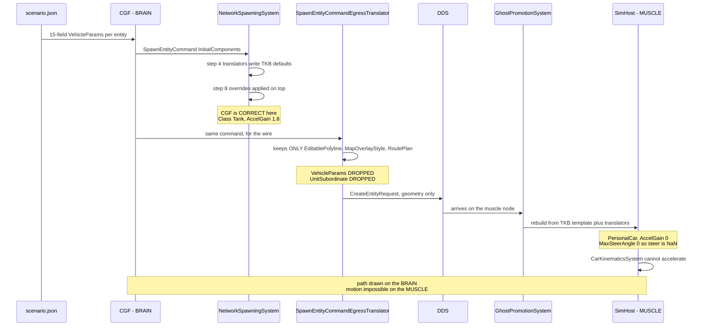

<!--STATUS
state: LIVE
updated: 2026-08-28
current-answer: ⭐⭐⭐ §6 (USER RULING, 2026-08-28) is the CURRENT answer and it OVERRIDES §4.
  ⛔ §4's Q64-1 lean A (the receiving node reads the scenario) is REJECTED — read §6 first, then
  §7 (the baseline) and §8 (the investigation). build-state: DESIGN, nothing built.
stale-below: ⛔ §4's Q64-1/Q64-2 leans are SUPERSEDED by §6. §4 is kept as the record of what was
  asked and why my lean was wrong; do not quote its recommendations as current.
known-rot: nothing yet.
known-conflict: DESIGN_Subsystem_Composition_Unification.md §5c.18.5 said CE-103's fix was
  CE-109's live-path handler unification. ⛔ THAT IS NOW REFUTED by §2 below and is corrected
  in §5c.18.6 of that document. This file is the authority for CE-103's cause.
-->
# ⭐⭐⭐ `Q64` — **Per-entity scenario component overrides do not cross the wire.** `build-state: DESIGN`

> 🔒 **The symptom, user, `2026-08-28`:** *"When i press Play, the tanks show blue line to their
> destination, but they do not move."*

⭐⭐ **This is `CE-103`'s real cause.** ⛔ It is **not** the TKB catalog *(byte-identical on both hosts)*,
**not** the load handlers *(all three funnel through one extractor)*, and **not** `CE-109`'s live-path
duplicate. ⚠ Two earlier diagnoses of mine were wrong; §2 is measured on a live `--mode all` boot.

---

## 1. 🔴 INVENTORY — **the queries actually run** *(`2026-08-28`)*

| query | result |
|---|---|
| `grep -rn "VehicleParams"` filtered to writers, production only | ⭐ **exactly 2** — `VehicleKinematicsTkbTranslator:34` *(5 fields from the DTO)* and `VehicleCommandSystem:73` *(the `CmdSpawnVehicle` demo path)*. ⛔ **Neither writes the scenario's stored values** |
| `grep -rn "AccelGain"` production | ⭐ **1** non-test occurrence outside the struct and the presets: `VehicleClass.cs:90`, the `Tank` preset. ⇒ grepping the **VALUE** rather than the type is what settled the hunt |
| `grep -rn "InitialComponents"` production | ⭐ producers: `StagingEntityExtractor:351` · `CreateEntityRequestSystem:213/305` · several UI spawn adapters. ⭐ consumers: **`NetworkSpawningSystem:136`** *(applies)* · 🔴 **`SpawnEntityCommandEgressTranslator:143`** *(the loss — see §2)* |
| `grep -rn "class CreateEntityRequestSystem"` production | ⭐ **1** — `Hrot.CGF.Systems`. ⛔ No ruling-9 duplicate; the editor and CGF use the same class |
| `grep -rn "HrotEditLoadHandler"` production registrations | ⭐ **3** — editor `:1277`, SimHost node `NodeBootstrapper:288`, CGF `:843` *(added by `CE-102`)*. ⇒ **all three hosts have it** |
| `grep -rn "\.Resolve("` over the DebugApi assemblies | 🔴 **ZERO callers** ⇒ `Q64`'s instrument finding, filed as **`CE-112`** *(§3)* |

⚠⚠ **Graph note — CORRECTED `2026-08-28`, and the original note was MY ERROR.** This section first said
the graph was unavailable *(`codebase-memory-mcp: command not found`)*. ⛔ **It was available the whole
time — I invoked the CLI by bare name instead of its documented full path**
`/opt/codebase-memory-mcp/codebase-memory-mcp`, which `CLAUDE.md` states explicitly. 📌 A tool reported
absent because I called it wrongly is exactly the class of mistake `CE-106` already cost this programme.
⭐ **§8's inventory IS graph-derived** *(`search_graph(name_pattern=".*TkbTranslator", label="Class")` →
**10 translators**, the enumeration §8.2 rests on)*, and it found the two duplicate writers that grep's
filtered view had not surfaced. ⚠ The §1 rows above remain grep + live-API measurement; ⭐ the
*"exactly 2 `VehicleParams` writers"* row is the one exhaustive claim still worth re-running through
`search_graph`.

---

## 2. 📐 THE MEASUREMENT — **the two worlds DISAGREE, and that is the whole finding**

⭐ One `--mode all` boot, one `POST /scenario/load/live {hill-attack}`, entity **1001**, read once per
perspective via `POST /perspective` *(⛔ **not** `?perspective=` — see `CE-112`)*:

| | `Class` | `AccelGain` | `MaxSteerAngle` | `UnitSubordinate` | components |
|---|---|---|---|---|---|
| ⭐ **CGF** *(`Scenario`, the BRAIN — authoritative spawner)* | **Tank** | **1.8** | **0.8** | ⭐ present | 24 |
| 🔴 **SimHost** *(the MUSCLE — runs `CarKinematicsSystem`)* | ⛔ **PersonalCar** | 🔴 **0** | 🔴 **0** | ⛔ **ABSENT** | 33 |
| ⭐ **editor** *(one process, one world)* | **Tank** | **1.8** | **0.8** | ⭐ present | 39 |

⭐⭐⭐ **CGF is CORRECT.** The scenario stores a full 15-field `VehicleParams` per entity
*(`scenarios/hill-attack/scenario.json`, 6 blocks)*, and `NetworkSpawningSystem` step 8 — *"apply
caller-supplied component overrides **on top of** TKB defaults"* — applies it. ⭐ The mechanism works as
designed.

🔴🔴 **The loss is the WIRE HOP.** `SpawnEntityCommandEgressTranslator:143-160` walks
`cmd.InitialComponents` and keeps **exactly three types** — `EditablePolyline`, `MapOverlayStyle`,
`RoutePlan` — building geometry/overlay descriptors. ⛔ **Everything else is silently dropped**, including
`VehicleParams` and `UnitSubordinate`. On the receiving node `GhostPromotionSystem:103-123` rebuilds the
entity from **the TKB template plus the translators only** ⇒ SimHost gets
`VehicleKinematicsTkbTranslator`'s 5 DTO fields and template defaults for the rest.

⇒ ⭐⭐ **`AccelGain 0` on the muscle node means the speed controller has zero gain
*(`CarKinematicsSystem:248`)* and `MaxSteerAngle 0` makes `SteerAngle` NaN.** 📌 **The tanks have a valid
destination and a drawn path — computed on the BRAIN, which is healthy — and no way to accelerate on the
MUSCLE, which is where motion happens.** ⭐ That is exactly the reported symptom, and it explains why the
path renders: the two halves live on different nodes.

⭐ **Why the editor is immune:** it is one process with one world, so there is no wire hop to lose the
override. ⛔ **The editor is therefore NOT the reference for this defect** — it cannot exhibit it, so
*"make the cluster do what the editor does"* has nothing to copy here.



---

## 3. ⚠ `CE-112` — **the instrument fault this investigation had to fix first** *(FIXED)*

`PerspectiveScopedDispatcher.Resolve(perspective)` exists, is documented as *"Q54-2's optional
`?perspective=` override"*, and has **zero callers**. ⇒ ⛔ passing `?perspective=` on a read route was
**silently ignored** and served the ACTIVE perspective.

📐 **How it was caught:** reading entity 1001 with `?perspective=` set to SimHost, Scenario, IG **and
ExCon** returned **four identical non-empty answers** — and **ExCon has no world at all**, so an answer
from ExCon cannot be real. ⭐ That single impossible reading is what exposed the ignored key.

⛔⛔ **It had already produced a wrong conclusion**: all four reads were SimHost's world, so *"the cluster
shows `PersonalCar`"* was recorded as a property of **the cluster** when it is a property of **one node** —
and it hid the very CGF-vs-SimHost disagreement that is the answer.

✅ **Fixed** as a single guard at the one envelope site: any request carrying `perspective` gets a hint
naming `POST /perspective`. ⛔ Not a `400`, per `CE-107`'s standing ruling *(leniency is right for a
diagnostic endpoint; going silent was the defect)*. ⭐ One guard, not per-route, so it cannot rot — and it
is skipped when a route supplies its own hint, so implementing the override later supersedes it cleanly.

⚠⚠ **This is the THIRD instrument fault in one investigation** — `CE-107` *(ignored `/logs` key)*,
`CE-110` *(empty TKB catalog)*, `CE-112` *(ignored perspective)*. ⇒ ⭐⭐ **all three had the same shape: a
plausible, well-formed answer to a different question.** 📌 The lesson worth keeping is not *"check your
tools"* in general but the specific test that worked all three times: **ask the instrument something it
CANNOT truthfully answer, and see whether it answers anyway.**

---

## 4. ⭐⭐⭐ THE DECISIONS — **each with my recommended answer**

> 🔒 **Why this is a question and not a batch.** `CLAUDE.md`: *large-blast-radius decisions still get an
> architect question resolved WITH the user — e.g. a serialization/engine contract — those are NOT
> delegated.* ⭐ Every option below changes what crosses DDS or what a receiving node reconstructs.

### `Q64-1` — **Where should the muscle node get per-entity overrides?**

| option | | blast radius |
|---|---|---|
| **A** ⭐⭐⭐ **RECOMMENDED — the receiving node reads the scenario itself** | Each node already **stages the scenario file** *(`TkbLoadClusterStateHandler` reads `{staging}/TKB/`, `ReferencePrefetchHandler` stages the scenario)* and already registers `HrotScenarioLoadHandler` + `HrotEditLoadHandler`. ⇒ the override data is **already on the node**; it is simply not applied to ghosts. Apply the scenario's stored components during/after ghost promotion, keyed by network id | ⭐ **No wire change.** Touches the promotion path and needs the id mapping to be stable |
| **B** | **Carry the overrides on the wire** — extend the egress translator + `CreateEntityRequest` to serialise arbitrary component overrides | ⛔ **DDS contract change**, a generic component serialiser, version skew between nodes. ⚠ The biggest blast radius of the three |
| **C** | **Put the values in the TKB template** so the template alone is sufficient | ⛔ Wrong layer: these are **per-entity** authored values *(6 distinct blocks in one scenario)*, not per-type defaults. ⚠ It would also make the scenario's stored block dead data |

⭐⭐ **Why A.** The data is already present on every node; only the *application* is missing. It keeps the
wire contract frozen, and it matches the existing division of labour — the TKB and the scenario are both
staged per node precisely so a node can reconstruct locally. ⚠ **Its one real risk** is id mapping:
promotion is keyed by network id, and the scenario's authored ids are remapped during extraction
*(`HN-037` measured 1000–1007 on the editor vs 2–9 on the cluster)*. ⇒ **A depends on the muscle node
being able to map a promoted ghost back to its authored scenario entity.** ⛔ **That must be measured
before A is built** — if the mapping is not recoverable, A collapses and B becomes the honest answer.

### `Q64-2` — **Which components are in scope?**

| option | | |
|---|---|---|
| **A** ⭐⭐ **RECOMMENDED — every component the scenario stores for that entity** | The scenario is the authored truth; a receiving node should reconstruct what was authored | ⚠ Must exclude the **host-specific** ones the §2 diff exposed — `MapDisplayComponent`, `VisualData`, `ResolvedStyle`, `CullingState` are editor-render concerns and `NetworkVelocity`/`PendingAuthorityGrants` are cluster-only |
| **B** | Only a named allow-list *(start with `VehicleParams`)* | ⭐ Smallest change, ⛔ and it is the shape that produced this defect: the egress translator's three-type allow-list **is** option B, eight years of components later. 📌 An allow-list nobody revisits silently drops every component added after it |

⭐⭐ **Why A, with an explicit EXCLUDE list rather than an INCLUDE list.** 📌 The measured lesson from
`SpawnEntityCommandEgressTranslator`: an include-list of three types looked complete when written and is
now the bug. ⭐ An exclude-list fails in the safe direction — a new component is carried by default and a
host that cannot use it ignores it.

### `Q64-3` — **Should the divergence be detectable, not just fixed?**

⭐⭐⭐ **RECOMMENDED: yes, and this is the part I would not skip.** 📌 The defect survived because **nothing
compares two nodes' view of one entity**, and the one tool that could was silently broken (`CE-112`).
⇒ ⭐ a conformance rail that loads a scenario on `--mode all` and asserts that the **authored** components
match on **brain and muscle** for at least one entity. ⚠ It belongs in the `T3` async lane
*(`run-system-tests.sh`)*, not the fix loop.

⛔ **Without `Q64-3` this class of defect returns** — it is invisible to every unit rail by construction,
because a unit rail builds one world.

### `Q64-4` — **Does `CE-109`'s live-path unification still have value?**

⭐ **Yes, but it is now decoupled from `CE-103` and its priority drops.** 📐 Measured: `HrotScenarioLoadHandler`
and `CgfScenarioLoadHandler` both funnel into the same `_extractor.Extract(...)`; the differences are
**zones** *(only the SimHost/editor handler loads them)* and a **`behaviorRemapper`** *(only CGF passes
one)*. ⇒ still a genuine ruling-9 duplicate worth collapsing, ⛔ **but it fixes nothing the user reported.**

---

## 5. ⛔ WHAT I HAVE **NOT** MEASURED — **stated so nobody builds on it**

| ⚠ | |
|---|---|
| ⛔ **Whether a promoted ghost can be mapped back to its authored scenario entity** | ⭐⭐ **`Q64-1` option A stands or falls on this.** Measure it FIRST |
| ⛔ **Whether `UnitSubordinate`'s absence on the muscle has its own symptom** | it is the same drop, but its consequence is unmeasured |
| ⛔ **Whether the 8 editor-only / 2 cluster-only components in §2's diff are all legitimately host-specific** | ⭐ they look it *(render vs networking)*, ⚠ but *"looks host-specific"* is not measured |
| ⛔ **`search_graph` confirmation of *"exactly 2 `VehicleParams` writers"*** | grep cannot guarantee an exhaustive claim; re-run when the graph is up |


---

## 6. 🔒🔒🔒 USER RULING `2026-08-28` — **TKB IS THE SOURCE; THE LOADING NODE IS AUTHORITATIVE AND SENDS OVER DDS**

> ⭐⭐⭐ **User, verbatim:** *"The vehicle parameter values need to be stored just in the TKB and loaded
> equally by all nodes needing them. Their saving to the scenario is an error at this stage. Later we might
> allow specifying/overriding the TKB values in the scenario and sending the overrides from the entity
> creator node over DDS in the same manner as the SimTransform is sent now as part of the entity lifecycle
> (mandatory component). We are not there yet. We should NOT load the scenario file on the other nodes; the
> loading node (initiating the load) needs to stay authoritative and need to send all (but the TKB stuff)
> over network - this way we can later create any non-scenario entity at runtime."*

### 6.1 ⛔⛔ MY `Q64-1` LEAN **A** IS REJECTED — **and the reason is better than my argument for it**

📌 I recommended *"the receiving node reads the scenario it already stages"* on the strength of *"no wire
change."* ⛔⛔ **It is fatally wrong for a reason I never considered:** ⭐⭐⭐ **a runtime-created entity has
no scenario file to read.** Option A makes correctness depend on the entity having come from a file, so it
would work for scenario load and **fail for every non-scenario spawn** — and that is precisely the
capability the ruling is protecting.

⇒ ⭐⭐ **The lesson for me: I optimised the cost axis (*"cheapest change"*) and never checked the
CAPABILITY axis (*"what must still be possible later"*).** ⚠ A cheap fix that forecloses a planned
capability is not cheap. 📌 This is the second time in this investigation that a *"no change to X"*
argument led me somewhere wrong.

### 6.2 ⭐ THE RULED ARCHITECTURE

| # | 🔒 the rule | consequence here |
|---|---|---|
| ① | ⭐⭐⭐ **Per-TYPE values live ONLY in the TKB**, loaded equally by every node that needs them | ⭐ `VehicleParams` is per-type ⇒ **the TKB must be sufficient on its own** |
| ② | ⛔⛔ **The scenario storing `VehicleParams` is AN ERROR at this stage** | ⇒ it is **data to remove**, not data to transport |
| ③ | ⛔⛔ **A receiving node MUST NOT read the scenario file** | ⇒ `Q64-1` **A is dead**; `TkbLoadClusterStateHandler` staying TKB-only is correct |
| ④ | ⭐⭐⭐ **The LOADING node is authoritative and sends everything EXCEPT TKB material over DDS** | ⇒ the transport is the **entity-lifecycle** path, exactly as `SimTransform` travels today |
| ⑤ | ⭐ **Later**: the scenario MAY override TKB values, and the override travels the same lifecycle path | ⛔ **not now** |
| ⑥ | ⭐⭐ **Why ④ matters more than the cheap fix:** it is what makes **any non-scenario entity creatable at runtime** | ⚠ the axis I missed |

---

## 7. ⭐⭐⭐ THE BASELINE — **smaller than expected, and HALF-WRITTEN ALREADY**

📐 **Measured `2026-08-28`.** The TKB is *not* sufficient today, and the gap is three dropped fields.

### 7.1 🔴 THE GAP, EXACTLY

`NedTkbBuilder.WithPhysics` *(`BdcTkbBuilder.cs:78`)* receives a **`SimVehicleDef` that already carries
`Height`, `TurnRate` and `Mobility`** — and **drops all three** when building the descriptor:

```csharp
template.AddDescriptor(new VehicleParametersDto { Mass, Length, Width, MaxSpeedFwd, MaxSpeedRev, MaxAccel });
// Height, TurnRate, Mobility mapped to VehicleParams by translator in Phase 6.
```

⭐⭐⭐ **Phase 6 never happened.** `VehicleParametersDto` has **6 fields**; `Mobility` is the field that
decides `VehicleClass.Tank`, and `TurnRate` is the one that becomes `MaxSteerRate`. ⇒ ⛔ **the TKB
physically cannot express a Tank today**, so every node's translator produces `Class = 0 = PersonalCar`
with `AccelGain 0`.

### 7.2 ⭐⭐⭐ AND THE MAPPING IS ALREADY WRITTEN — **`BuildVehicleParams`, in the SAME FILE, with ZERO callers**

📐 `NedTkbBuilder.BuildVehicleParams(SimVehicleDef)` *(`:271`)* does **exactly** what Phase 6 describes:
maps `Mobility → VehicleClass` *(`Tracked→Tank`, `Wheeled→Truck`, `Infantry→Pedestrian`)*, takes
`VehiclePresets.GetPreset(class)` as the base, then overrides `Length`/`WheelBase = Length×0.6`/`Width`/
`MaxSpeedFwd`/`MaxSpeedRev`/`MaxAccel` and computes `MaxSteerRate = TurnRate × π/180`.

⇒ 🔒 **`CLAUDE.md`: *"UNREFERENCED IS NOT UNINTENTIONAL"* and *"prefer ROUTING to DELETING"*, almost
verbatim.** ⭐ **The right move is to ROUTE this function into the translator, not to delete it and not to
rewrite it.** ⚠ Note it is the function whose arithmetic fingerprint I matched and then retracted twice —
⭐ **it was never the live path, and it was always the INTENDED one.** 📌 The scenario file's stored block
is a **fossil of its last run**, which is why the numbers matched so exactly.

### 7.3 ⭐ THE BASELINE WORK, AS I NOW SEE IT

| # | item | size |
|---|---|---|
| **B1** | widen `VehicleParametersDto` with **`Height`, `TurnRate`, `Mobility`** *(the three the comment names)* | ⭐ small — the source `SimVehicleDef` already has them |
| **B2** | ⭐⭐ **route `BuildVehicleParams`' preset+override mapping into `VehicleKinematicsTkbTranslator`**, so every node derives the full struct from the template alone | ⭐ the logic exists; this is adoption, not authoring |
| **B3** | ⛔ **stop saving translator-derived components to the scenario** *(ruling ②)* — starting with `VehicleParams` | ⚠ see §8.2: it is **14 components**, not one |
| **B4** | ⚠ **resolve a ruling-9 duplicate first:** 📐 **TWO** translators write `VehicleParams` — `VehicleKinematicsTkbTranslator` **and** `InfantryVehicleStateStripTkbTranslator` — and both guard with `!HasComponent`, so it is **first-writer-wins by registration order** | ⛔ decide which owns it before B2 |

⭐⭐ **Once B1+B2 land, `CE-103` is fixed for the right reason:** the muscle node derives `Class Tank`,
`AccelGain 1.8` **from the TKB**, with no scenario read and no wire change.

---

## 8. ⭐⭐⭐ THE INVESTIGATION — **what it would take to send more components over DDS**

> 🔒 **Scope per the user:** *"only components that the SimHost needs (those that are actually registered on
> simhost) are in scope."*

### 8.1 ⚠⚠ THE PROPOSED FILTER BARELY NARROWS ANYTHING — **22 of 23**

📐 Measured on the **running** SimHost node *(`GET /components` after `POST /perspective`, ⛔ never
`?perspective=` — `CE-112`)*: **103 component types registered.** The scenario stores **23** distinct types
across its 8 entities. ⇒ ⭐ **22 are registered on SimHost. Only `MissionPlan` is not.**

⇒ ⚠ **"registered on SimHost" is not a useful scoping device on its own** — it excludes one type.
⭐⭐ **A far sharper filter falls straight out of ruling ①**, and it is the next table.

### 8.2 ⭐⭐⭐ THE SHARP FILTER — **14 of the 22 are TRANSLATOR-DERIVED, so per ruling ① they must NOT travel**

📐 `search_graph(name_pattern=".*TkbTranslator", label="Class")` → **10 translators**; what each injects,
intersected with the scenario's 23:

| ⛔ **TKB-DERIVED — a translator already writes it ⇒ the TKB is its source, it must NOT be sent** | translator |
|---|---|
| `VehicleParams` · `VehicleState` | ⚠ `VehicleKinematics` **and** `InfantryVehicleStateStrip` *(duplicate — B4)* |
| `NavState` · `NavigationIntent` · `PhysicsCollider` | `VehicleKinematics` *(collider also `Combat`)* |
| `Health` · `WeaponState` | `Combat` |
| `PerceptionReceptor` · `TargetMemory` | `Perception` |
| `SimTransform` · `SimVelocity` | `SpatialCore` |
| `ActorCapabilityState` | `Behavior` |
| `EntityInfo` | ⚠ `Behavior` **and** `Presentation` *(a second duplicate)* |
| `VisualData` | `Presentation` |

| ⭐ **NOT translator-derived — the genuine per-entity set** | note |
|---|---|
| `UnitSubordinate` | ⭐⭐ **authored command hierarchy** *(4 of 8 entities)*. ⛔ Currently LOST on the muscle node — the second half of `CE-103`'s measured diff |
| `MapDisplayComponent` | presentation; ⚠ likely host-specific rather than transportable |
| `EditablePolyline` · `MapOverlayStyle` | ⭐ **already cross the wire** — two of the three types the egress translator keeps |
| `NetworkIdentity` · `NetworkAuthority` · `TkbIdentity` · `NetworkTransform` | ⭐ stamped locally by `NetworkSpawningSystem`/replication. ⛔ **Correctly never sent** |

⇒ ⭐⭐⭐ **The real candidate set is TINY: `UnitSubordinate`, plus the per-entity VALUES of components whose
existence is TKB-derived** *(a Tank's starting position, its initial order, its name/force)*.
📌 **`SimTransform` is exactly that shape already** — TKB-derived *(SpatialCore writes a default)* **and**
per-entity on the wire *(a typed field)*. ⭐ **So the user's cited precedent is not an analogy; it is the
existing instance of the pattern**, and generalising it means *"more fields like `InitialTransform`"*, not
*"ship arbitrary components."*

### 8.3 ⭐⭐⭐ THE CHANNEL ALREADY EXISTS — **and one half of it is BUILT-AND-UNADOPTED**

📐 The DDS `CreateEntityRequest` *(`Hrot.Network.NED/GenericMessages.cs:187`)* carries **three** payloads,
two of them documented verbatim as *"applied AFTER TKB defaults"*:

| channel | status |
|---|---|
| `InitialDescriptors` — `List<EntityDescriptorUnion>` | ⭐ live; this is the geometry path the egress translator fills |
| `InitialAttributesJson` — JSON property paths, compiled by `JsonAttributeCompiler` | ⭐⭐ **WIRED END-TO-END**: egress forwards it *(`:168`)*, `CreateEntityRequestSystem:220-226` compiles it on arrival. ⛔ **The scenario path never populates it** — `StagingEntityExtractor:351` sets only `InitialComponents` |
| `InitialAttributeRecords` — `List<AttributeRecord>`, 16-bit ids, *"eliminating JSON parsing on the receiving host"* | 🔴🔴 **DECLARED AND NEVER POPULATED by anything in production.** Built, documented *(`ATTR2-DESIGN.md` §3.1)*, unadopted |

⇒ ⭐⭐⭐ **The seam law, 25th instance: the transport the ruling describes as *"later"* is ALREADY ON THE
WIRE.** ⛔ **What is missing is not a contract — it is that the scenario extractor never fills it.**
⚠ **This also retires my own `Q64-2`**: I framed the choice as *include-list vs exclude-list* over
`InitialComponents`. ⭐ Under ruling ④ **`InitialComponents` is the wrong layer entirely** — it is a
local in-process list, and the attribute channel is the transported one.

### 8.4 ⚠ THE REAL COST — **the attribute VOCABULARY, not the transport**

📐 `AttributeIds` *(`Fdp.Toolkits/Replication/Patching/AttributeIds.cs`)* declares **8 ids total**, and
**not one** covers vehicle/kinematics *(no `Vehicle`, `Steer`, `Accel`, `Wheel`, `MaxSpeed` match)*.
⇒ ⛔ **`VehicleParams` alone would need ~15 new ids** plus their installers.

⭐⭐ **And the governing design is already RULED and BUILT** — 📄 **`Architect_Question_59` §7**
*(user, `2026-08-26`, the ATTRIBUTE/DESCRIPTOR SPLIT)*:

| ⭐ | |
|---|---|
| **attribute** = *(JSON path, `AttributeId`, value kind, ECS component, field setter)* — **FDP, network-agnostic** | |
| **descriptor** = *(descriptor ordinal, the components it covers, the wire struct)* — **NED** | |
| ⭐⭐⭐ **the join is the ECS COMPONENT** | `ComponentTypeRegistry` is already that shared identity |
| 🔴 **`IDescriptorTranslator.TargetComponentIds` ALREADY declares the component→descriptor map** | ⛔ **under-adopted: 9 of 41 egress translators declare it, with a SILENT EMPTY DEFAULT** ⇒ a derived map would be silently sparse |

⇒ ⭐⭐ **Any "send more components" work must be built ON `Q59` §7's vocabulary, not beside it** — and its
first obstacle is `TargetComponentIds`' silent-empty adoption gap, which is the *"a production caller that
HAS a dependency must PASS it"* pattern again.

### 8.5 ⭐ MY RECOMMENDED SEQUENCING

| # | | why |
|---|---|---|
| **①** | ⭐⭐⭐ **The baseline, §7 (B4→B1→B2→B3)** | fixes `CE-103` for the right reason; no wire change, no scenario read. ⭐ Small, and mostly adoption of code that already exists |
| **②** | ⭐⭐ **A brain-vs-muscle conformance rail** *(`Q64-3`, unchanged)* | ⛔ this defect is invisible to every unit rail **by construction** — a unit rail builds one world. 📌 It is also the only thing that would have caught it |
| **③** | ⭐ **`UnitSubordinate`** as the FIRST override to travel | it is genuinely per-entity, currently lost, and small enough to prove the pattern end-to-end |
| **④** | ⭐ **Then generalise** via `Q59` §7's attribute vocabulary + `TargetComponentIds` | ⛔ not before ③ proves one case |
| ⛔ | **NOT the `InitialComponents` include-list** | §8.3 — wrong layer under ruling ④ |

---

## 9. ⛔ WHAT I STILL HAVE **NOT** MEASURED

| ⚠ | |
|---|---|
| ⛔ **Which of the two `VehicleParams` translators wins today, and by what registration order** | ⭐⭐ **B4 blocks B2.** Measure before building |
| ⛔ **Whether widening `VehicleParametersDto` breaks TKB serialisation compatibility** | it is a `record` with `[TkbDescriptor]`; the ZIP-loaded TKB path *(`TkbDeserializer`)* is unmeasured against added fields |
| ⛔ **Whether the other 13 translator-derived components are ALSO wrong on the muscle node** | 📐 only `VehicleParams` and `UnitSubordinate` were checked. ⚠ `Health`, `WeaponState`, `PerceptionReceptor` have the same shape and could be silently degraded too — ⭐ **this is the single most valuable next measurement** |
| ⛔ **Whether `MapDisplayComponent`/`VisualData` are legitimately host-specific** | assumed, not measured |
| ⛔ **What removing `VehicleParams` from scenario SAVING breaks** | 📌 the editor's save path is the one the user warned is hand-tested |
