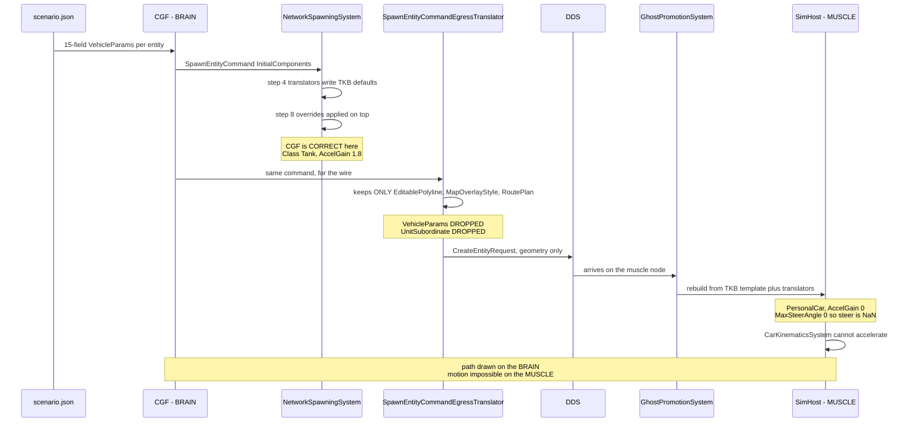

<!--STATUS
state: LIVE
updated: 2026-08-28
current-answer: ⭐⭐⭐ §13 (the DESCRIPTOR-SPACE readiness mask) is the CURRENT answer. ⛔ §12.4's
  component-id mask is REJECTED — it leaked an FDP component id onto the wire, which breaks Q59 §7.
  Then §12 (which CORRECTS
  §11.3's overstatement — the readiness gate IS built and working for EntityInfo + SimTransform).
  Then §11 (the design sweep) — it supersedes §10.5's
  invented recipe with the design's OWN specified mechanism. Read §11, then §10 (the retractions),
  then §6 (the user ruling) and §7 (the baseline, still valid). build-state: DESIGN, nothing built.
  ⛔⛔ §10 RETRACTS THIS DOCUMENT'S CENTRAL CLAIM: there is NO "wire-hop loss". SimHost's entity is
  a PROMOTED GHOST built from the TKB by design, and the channel §2 blamed is inbound-to-CGF only.
  CE-103 therefore has exactly ONE cause and ONE fix: CE-113 (the TKB cannot express a Tank).
stale-below: ⛔⛔ §2's "the loss is the WIRE HOP" framing is WRONG — see §10.1. ⛔ §4's Q64-1/Q64-2
  leans are superseded by §6. ⛔ §8.3/§8.4's "use InitialAttributesJson / grow the attribute
  vocabulary" is WRONG — see §10.3. §8.1/§8.2's measured inventories remain valid.
known-rot: nothing yet.
known-conflict: DESIGN_Subsystem_Composition_Unification.md §5c.18.5 said CE-103's fix was
  CE-109's live-path handler unification. ⛔ THAT IS NOW REFUTED by §2 below and is corrected
  in §5c.18.6 of that document. This file is the authority for CE-103's cause.
-->
# ⭐⭐⭐ `Q64` — **Per-entity scenario component overrides do not cross the wire.** `build-state: DESIGN`

> 🔒 **The symptom, user, `2026-08-28`:** *"When i press Play, the tanks show blue line to their
> destination, but they do not move."*

⭐⭐ **This is `CE-103`'s real cause.** ⛔ It is **not** the TKB catalog *(byte-identical on both hosts)*,
**not** the load handlers *(all three funnel through one extractor)*, and **not** `CE-109`'s live-path
duplicate. ⚠ Two earlier diagnoses of mine were wrong; §2 is measured on a live `--mode all` boot.

---

## 1. 🔴 INVENTORY — **the queries actually run** *(`2026-08-28`)*

| query | result |
|---|---|
| `grep -rn "VehicleParams"` filtered to writers, production only | ⭐ **exactly 2** — `VehicleKinematicsTkbTranslator:34` *(5 fields from the DTO)* and `VehicleCommandSystem:73` *(the `CmdSpawnVehicle` demo path)*. ⛔ **Neither writes the scenario's stored values** |
| `grep -rn "AccelGain"` production | ⭐ **1** non-test occurrence outside the struct and the presets: `VehicleClass.cs:90`, the `Tank` preset. ⇒ grepping the **VALUE** rather than the type is what settled the hunt |
| `grep -rn "InitialComponents"` production | ⭐ producers: `StagingEntityExtractor:351` · `CreateEntityRequestSystem:213/305` · several UI spawn adapters. ⭐ consumers: **`NetworkSpawningSystem:136`** *(applies)* · 🔴 **`SpawnEntityCommandEgressTranslator:143`** *(the loss — see §2)* |
| `grep -rn "class CreateEntityRequestSystem"` production | ⭐ **1** — `Hrot.CGF.Systems`. ⛔ No ruling-9 duplicate; the editor and CGF use the same class |
| `grep -rn "HrotEditLoadHandler"` production registrations | ⭐ **3** — editor `:1277`, SimHost node `NodeBootstrapper:288`, CGF `:843` *(added by `CE-102`)*. ⇒ **all three hosts have it** |
| `grep -rn "\.Resolve("` over the DebugApi assemblies | 🔴 **ZERO callers** ⇒ `Q64`'s instrument finding, filed as **`CE-112`** *(§3)* |

⚠⚠ **Graph note — CORRECTED `2026-08-28`, and the original note was MY ERROR.** This section first said
the graph was unavailable *(`codebase-memory-mcp: command not found`)*. ⛔ **It was available the whole
time — I invoked the CLI by bare name instead of its documented full path**
`/opt/codebase-memory-mcp/codebase-memory-mcp`, which `CLAUDE.md` states explicitly. 📌 A tool reported
absent because I called it wrongly is exactly the class of mistake `CE-106` already cost this programme.
⭐ **§8's inventory IS graph-derived** *(`search_graph(name_pattern=".*TkbTranslator", label="Class")` →
**10 translators**, the enumeration §8.2 rests on)*, and it found the two duplicate writers that grep's
filtered view had not surfaced. ⚠ The §1 rows above remain grep + live-API measurement; ⭐ the
*"exactly 2 `VehicleParams` writers"* row is the one exhaustive claim still worth re-running through
`search_graph`.

---

## 2. 📐 THE MEASUREMENT — **the two worlds DISAGREE, and that is the whole finding**

⭐ One `--mode all` boot, one `POST /scenario/load/live {hill-attack}`, entity **1001**, read once per
perspective via `POST /perspective` *(⛔ **not** `?perspective=` — see `CE-112`)*:

| | `Class` | `AccelGain` | `MaxSteerAngle` | `UnitSubordinate` | components |
|---|---|---|---|---|---|
| ⭐ **CGF** *(`Scenario`, the BRAIN — authoritative spawner)* | **Tank** | **1.8** | **0.8** | ⭐ present | 24 |
| 🔴 **SimHost** *(the MUSCLE — runs `CarKinematicsSystem`)* | ⛔ **PersonalCar** | 🔴 **0** | 🔴 **0** | ⛔ **ABSENT** | 33 |
| ⭐ **editor** *(one process, one world)* | **Tank** | **1.8** | **0.8** | ⭐ present | 39 |

⭐⭐⭐ **CGF is CORRECT.** The scenario stores a full 15-field `VehicleParams` per entity
*(`scenarios/hill-attack/scenario.json`, 6 blocks)*, and `NetworkSpawningSystem` step 8 — *"apply
caller-supplied component overrides **on top of** TKB defaults"* — applies it. ⭐ The mechanism works as
designed.

🔴🔴 **The loss is the WIRE HOP.** `SpawnEntityCommandEgressTranslator:143-160` walks
`cmd.InitialComponents` and keeps **exactly three types** — `EditablePolyline`, `MapOverlayStyle`,
`RoutePlan` — building geometry/overlay descriptors. ⛔ **Everything else is silently dropped**, including
`VehicleParams` and `UnitSubordinate`. On the receiving node `GhostPromotionSystem:103-123` rebuilds the
entity from **the TKB template plus the translators only** ⇒ SimHost gets
`VehicleKinematicsTkbTranslator`'s 5 DTO fields and template defaults for the rest.

⇒ ⭐⭐ **`AccelGain 0` on the muscle node means the speed controller has zero gain
*(`CarKinematicsSystem:248`)* and `MaxSteerAngle 0` makes `SteerAngle` NaN.** 📌 **The tanks have a valid
destination and a drawn path — computed on the BRAIN, which is healthy — and no way to accelerate on the
MUSCLE, which is where motion happens.** ⭐ That is exactly the reported symptom, and it explains why the
path renders: the two halves live on different nodes.

⭐ **Why the editor is immune:** it is one process with one world, so there is no wire hop to lose the
override. ⛔ **The editor is therefore NOT the reference for this defect** — it cannot exhibit it, so
*"make the cluster do what the editor does"* has nothing to copy here.



---

## 3. ⚠ `CE-112` — **the instrument fault this investigation had to fix first** *(FIXED)*

`PerspectiveScopedDispatcher.Resolve(perspective)` exists, is documented as *"Q54-2's optional
`?perspective=` override"*, and has **zero callers**. ⇒ ⛔ passing `?perspective=` on a read route was
**silently ignored** and served the ACTIVE perspective.

📐 **How it was caught:** reading entity 1001 with `?perspective=` set to SimHost, Scenario, IG **and
ExCon** returned **four identical non-empty answers** — and **ExCon has no world at all**, so an answer
from ExCon cannot be real. ⭐ That single impossible reading is what exposed the ignored key.

⛔⛔ **It had already produced a wrong conclusion**: all four reads were SimHost's world, so *"the cluster
shows `PersonalCar`"* was recorded as a property of **the cluster** when it is a property of **one node** —
and it hid the very CGF-vs-SimHost disagreement that is the answer.

✅ **Fixed** as a single guard at the one envelope site: any request carrying `perspective` gets a hint
naming `POST /perspective`. ⛔ Not a `400`, per `CE-107`'s standing ruling *(leniency is right for a
diagnostic endpoint; going silent was the defect)*. ⭐ One guard, not per-route, so it cannot rot — and it
is skipped when a route supplies its own hint, so implementing the override later supersedes it cleanly.

⚠⚠ **This is the THIRD instrument fault in one investigation** — `CE-107` *(ignored `/logs` key)*,
`CE-110` *(empty TKB catalog)*, `CE-112` *(ignored perspective)*. ⇒ ⭐⭐ **all three had the same shape: a
plausible, well-formed answer to a different question.** 📌 The lesson worth keeping is not *"check your
tools"* in general but the specific test that worked all three times: **ask the instrument something it
CANNOT truthfully answer, and see whether it answers anyway.**

---

## 4. ⭐⭐⭐ THE DECISIONS — **each with my recommended answer**

> 🔒 **Why this is a question and not a batch.** `CLAUDE.md`: *large-blast-radius decisions still get an
> architect question resolved WITH the user — e.g. a serialization/engine contract — those are NOT
> delegated.* ⭐ Every option below changes what crosses DDS or what a receiving node reconstructs.

### `Q64-1` — **Where should the muscle node get per-entity overrides?**

| option | | blast radius |
|---|---|---|
| **A** ⭐⭐⭐ **RECOMMENDED — the receiving node reads the scenario itself** | Each node already **stages the scenario file** *(`TkbLoadClusterStateHandler` reads `{staging}/TKB/`, `ReferencePrefetchHandler` stages the scenario)* and already registers `HrotScenarioLoadHandler` + `HrotEditLoadHandler`. ⇒ the override data is **already on the node**; it is simply not applied to ghosts. Apply the scenario's stored components during/after ghost promotion, keyed by network id | ⭐ **No wire change.** Touches the promotion path and needs the id mapping to be stable |
| **B** | **Carry the overrides on the wire** — extend the egress translator + `CreateEntityRequest` to serialise arbitrary component overrides | ⛔ **DDS contract change**, a generic component serialiser, version skew between nodes. ⚠ The biggest blast radius of the three |
| **C** | **Put the values in the TKB template** so the template alone is sufficient | ⛔ Wrong layer: these are **per-entity** authored values *(6 distinct blocks in one scenario)*, not per-type defaults. ⚠ It would also make the scenario's stored block dead data |

⭐⭐ **Why A.** The data is already present on every node; only the *application* is missing. It keeps the
wire contract frozen, and it matches the existing division of labour — the TKB and the scenario are both
staged per node precisely so a node can reconstruct locally. ⚠ **Its one real risk** is id mapping:
promotion is keyed by network id, and the scenario's authored ids are remapped during extraction
*(`HN-037` measured 1000–1007 on the editor vs 2–9 on the cluster)*. ⇒ **A depends on the muscle node
being able to map a promoted ghost back to its authored scenario entity.** ⛔ **That must be measured
before A is built** — if the mapping is not recoverable, A collapses and B becomes the honest answer.

### `Q64-2` — **Which components are in scope?**

| option | | |
|---|---|---|
| **A** ⭐⭐ **RECOMMENDED — every component the scenario stores for that entity** | The scenario is the authored truth; a receiving node should reconstruct what was authored | ⚠ Must exclude the **host-specific** ones the §2 diff exposed — `MapDisplayComponent`, `VisualData`, `ResolvedStyle`, `CullingState` are editor-render concerns and `NetworkVelocity`/`PendingAuthorityGrants` are cluster-only |
| **B** | Only a named allow-list *(start with `VehicleParams`)* | ⭐ Smallest change, ⛔ and it is the shape that produced this defect: the egress translator's three-type allow-list **is** option B, eight years of components later. 📌 An allow-list nobody revisits silently drops every component added after it |

⭐⭐ **Why A, with an explicit EXCLUDE list rather than an INCLUDE list.** 📌 The measured lesson from
`SpawnEntityCommandEgressTranslator`: an include-list of three types looked complete when written and is
now the bug. ⭐ An exclude-list fails in the safe direction — a new component is carried by default and a
host that cannot use it ignores it.

### `Q64-3` — **Should the divergence be detectable, not just fixed?**

⭐⭐⭐ **RECOMMENDED: yes, and this is the part I would not skip.** 📌 The defect survived because **nothing
compares two nodes' view of one entity**, and the one tool that could was silently broken (`CE-112`).
⇒ ⭐ a conformance rail that loads a scenario on `--mode all` and asserts that the **authored** components
match on **brain and muscle** for at least one entity. ⚠ It belongs in the `T3` async lane
*(`run-system-tests.sh`)*, not the fix loop.

⛔ **Without `Q64-3` this class of defect returns** — it is invisible to every unit rail by construction,
because a unit rail builds one world.

### `Q64-4` — **Does `CE-109`'s live-path unification still have value?**

⭐ **Yes, but it is now decoupled from `CE-103` and its priority drops.** 📐 Measured: `HrotScenarioLoadHandler`
and `CgfScenarioLoadHandler` both funnel into the same `_extractor.Extract(...)`; the differences are
**zones** *(only the SimHost/editor handler loads them)* and a **`behaviorRemapper`** *(only CGF passes
one)*. ⇒ still a genuine ruling-9 duplicate worth collapsing, ⛔ **but it fixes nothing the user reported.**

---

## 5. ⛔ WHAT I HAVE **NOT** MEASURED — **stated so nobody builds on it**

| ⚠ | |
|---|---|
| ⛔ **Whether a promoted ghost can be mapped back to its authored scenario entity** | ⭐⭐ **`Q64-1` option A stands or falls on this.** Measure it FIRST |
| ⛔ **Whether `UnitSubordinate`'s absence on the muscle has its own symptom** | it is the same drop, but its consequence is unmeasured |
| ⛔ **Whether the 8 editor-only / 2 cluster-only components in §2's diff are all legitimately host-specific** | ⭐ they look it *(render vs networking)*, ⚠ but *"looks host-specific"* is not measured |
| ⛔ **`search_graph` confirmation of *"exactly 2 `VehicleParams` writers"*** | grep cannot guarantee an exhaustive claim; re-run when the graph is up |


---

## 6. 🔒🔒🔒 USER RULING `2026-08-28` — **TKB IS THE SOURCE; THE LOADING NODE IS AUTHORITATIVE AND SENDS OVER DDS**

> ⭐⭐⭐ **User, verbatim:** *"The vehicle parameter values need to be stored just in the TKB and loaded
> equally by all nodes needing them. Their saving to the scenario is an error at this stage. Later we might
> allow specifying/overriding the TKB values in the scenario and sending the overrides from the entity
> creator node over DDS in the same manner as the SimTransform is sent now as part of the entity lifecycle
> (mandatory component). We are not there yet. We should NOT load the scenario file on the other nodes; the
> loading node (initiating the load) needs to stay authoritative and need to send all (but the TKB stuff)
> over network - this way we can later create any non-scenario entity at runtime."*

### 6.1 ⛔⛔ MY `Q64-1` LEAN **A** IS REJECTED — **and the reason is better than my argument for it**

📌 I recommended *"the receiving node reads the scenario it already stages"* on the strength of *"no wire
change."* ⛔⛔ **It is fatally wrong for a reason I never considered:** ⭐⭐⭐ **a runtime-created entity has
no scenario file to read.** Option A makes correctness depend on the entity having come from a file, so it
would work for scenario load and **fail for every non-scenario spawn** — and that is precisely the
capability the ruling is protecting.

⇒ ⭐⭐ **The lesson for me: I optimised the cost axis (*"cheapest change"*) and never checked the
CAPABILITY axis (*"what must still be possible later"*).** ⚠ A cheap fix that forecloses a planned
capability is not cheap. 📌 This is the second time in this investigation that a *"no change to X"*
argument led me somewhere wrong.

### 6.2 ⭐ THE RULED ARCHITECTURE

| # | 🔒 the rule | consequence here |
|---|---|---|
| ① | ⭐⭐⭐ **Per-TYPE values live ONLY in the TKB**, loaded equally by every node that needs them | ⭐ `VehicleParams` is per-type ⇒ **the TKB must be sufficient on its own** |
| ② | ⛔⛔ **The scenario storing `VehicleParams` is AN ERROR at this stage** | ⇒ it is **data to remove**, not data to transport |
| ③ | ⛔⛔ **A receiving node MUST NOT read the scenario file** | ⇒ `Q64-1` **A is dead**; `TkbLoadClusterStateHandler` staying TKB-only is correct |
| ④ | ⭐⭐⭐ **The LOADING node is authoritative and sends everything EXCEPT TKB material over DDS** | ⇒ the transport is the **entity-lifecycle** path, exactly as `SimTransform` travels today |
| ⑤ | ⭐ **Later**: the scenario MAY override TKB values, and the override travels the same lifecycle path | ⛔ **not now** |
| ⑥ | ⭐⭐ **Why ④ matters more than the cheap fix:** it is what makes **any non-scenario entity creatable at runtime** | ⚠ the axis I missed |

---

## 7. ⭐⭐⭐ THE BASELINE — **smaller than expected, and HALF-WRITTEN ALREADY**

📐 **Measured `2026-08-28`.** The TKB is *not* sufficient today, and the gap is three dropped fields.

### 7.1 🔴 THE GAP, EXACTLY

`NedTkbBuilder.WithPhysics` *(`BdcTkbBuilder.cs:78`)* receives a **`SimVehicleDef` that already carries
`Height`, `TurnRate` and `Mobility`** — and **drops all three** when building the descriptor:

```csharp
template.AddDescriptor(new VehicleParametersDto { Mass, Length, Width, MaxSpeedFwd, MaxSpeedRev, MaxAccel });
// Height, TurnRate, Mobility mapped to VehicleParams by translator in Phase 6.
```

⭐⭐⭐ **Phase 6 never happened.** `VehicleParametersDto` has **6 fields**; `Mobility` is the field that
decides `VehicleClass.Tank`, and `TurnRate` is the one that becomes `MaxSteerRate`. ⇒ ⛔ **the TKB
physically cannot express a Tank today**, so every node's translator produces `Class = 0 = PersonalCar`
with `AccelGain 0`.

### 7.2 ⭐⭐⭐ AND THE MAPPING IS ALREADY WRITTEN — **`BuildVehicleParams`, in the SAME FILE, with ZERO callers**

📐 `NedTkbBuilder.BuildVehicleParams(SimVehicleDef)` *(`:271`)* does **exactly** what Phase 6 describes:
maps `Mobility → VehicleClass` *(`Tracked→Tank`, `Wheeled→Truck`, `Infantry→Pedestrian`)*, takes
`VehiclePresets.GetPreset(class)` as the base, then overrides `Length`/`WheelBase = Length×0.6`/`Width`/
`MaxSpeedFwd`/`MaxSpeedRev`/`MaxAccel` and computes `MaxSteerRate = TurnRate × π/180`.

⇒ 🔒 **`CLAUDE.md`: *"UNREFERENCED IS NOT UNINTENTIONAL"* and *"prefer ROUTING to DELETING"*, almost
verbatim.** ⭐ **The right move is to ROUTE this function into the translator, not to delete it and not to
rewrite it.** ⚠ Note it is the function whose arithmetic fingerprint I matched and then retracted twice —
⭐ **it was never the live path, and it was always the INTENDED one.** 📌 The scenario file's stored block
is a **fossil of its last run**, which is why the numbers matched so exactly.

### 7.3 ⭐ THE BASELINE WORK, AS I NOW SEE IT

| # | item | size |
|---|---|---|
| **B1** | widen `VehicleParametersDto` with **`Height`, `TurnRate`, `Mobility`** *(the three the comment names)* | ⭐ small — the source `SimVehicleDef` already has them |
| **B2** | ⭐⭐ **route `BuildVehicleParams`' preset+override mapping into `VehicleKinematicsTkbTranslator`**, so every node derives the full struct from the template alone | ⭐ the logic exists; this is adoption, not authoring |
| **B3** | ⛔ **stop saving translator-derived components to the scenario** *(ruling ②)* — starting with `VehicleParams` | ⚠ see §8.2: it is **14 components**, not one |
| **B4** | ⚠ **resolve a ruling-9 duplicate first:** 📐 **TWO** translators write `VehicleParams` — `VehicleKinematicsTkbTranslator` **and** `InfantryVehicleStateStripTkbTranslator` — and both guard with `!HasComponent`, so it is **first-writer-wins by registration order** | ⛔ decide which owns it before B2 |

⭐⭐ **Once B1+B2 land, `CE-103` is fixed for the right reason:** the muscle node derives `Class Tank`,
`AccelGain 1.8` **from the TKB**, with no scenario read and no wire change.

---

## 8. ⭐⭐⭐ THE INVESTIGATION — **what it would take to send more components over DDS**

> 🔒 **Scope per the user:** *"only components that the SimHost needs (those that are actually registered on
> simhost) are in scope."*

### 8.1 ⚠⚠ THE PROPOSED FILTER BARELY NARROWS ANYTHING — **22 of 23**

📐 Measured on the **running** SimHost node *(`GET /components` after `POST /perspective`, ⛔ never
`?perspective=` — `CE-112`)*: **103 component types registered.** The scenario stores **23** distinct types
across its 8 entities. ⇒ ⭐ **22 are registered on SimHost. Only `MissionPlan` is not.**

⇒ ⚠ **"registered on SimHost" is not a useful scoping device on its own** — it excludes one type.
⭐⭐ **A far sharper filter falls straight out of ruling ①**, and it is the next table.

### 8.2 ⭐⭐⭐ THE SHARP FILTER — **14 of the 22 are TRANSLATOR-DERIVED, so per ruling ① they must NOT travel**

📐 `search_graph(name_pattern=".*TkbTranslator", label="Class")` → **10 translators**; what each injects,
intersected with the scenario's 23:

| ⛔ **TKB-DERIVED — a translator already writes it ⇒ the TKB is its source, it must NOT be sent** | translator |
|---|---|
| `VehicleParams` · `VehicleState` | ⚠ `VehicleKinematics` **and** `InfantryVehicleStateStrip` *(duplicate — B4)* |
| `NavState` · `NavigationIntent` · `PhysicsCollider` | `VehicleKinematics` *(collider also `Combat`)* |
| `Health` · `WeaponState` | `Combat` |
| `PerceptionReceptor` · `TargetMemory` | `Perception` |
| `SimTransform` · `SimVelocity` | `SpatialCore` |
| `ActorCapabilityState` | `Behavior` |
| `EntityInfo` | ⚠ `Behavior` **and** `Presentation` *(a second duplicate)* |
| `VisualData` | `Presentation` |

| ⭐ **NOT translator-derived — the genuine per-entity set** | note |
|---|---|
| `UnitSubordinate` | ⭐⭐ **authored command hierarchy** *(4 of 8 entities)*. ⛔ Currently LOST on the muscle node — the second half of `CE-103`'s measured diff |
| `MapDisplayComponent` | presentation; ⚠ likely host-specific rather than transportable |
| `EditablePolyline` · `MapOverlayStyle` | ⭐ **already cross the wire** — two of the three types the egress translator keeps |
| `NetworkIdentity` · `NetworkAuthority` · `TkbIdentity` · `NetworkTransform` | ⭐ stamped locally by `NetworkSpawningSystem`/replication. ⛔ **Correctly never sent** |

⇒ ⭐⭐⭐ **The real candidate set is TINY: `UnitSubordinate`, plus the per-entity VALUES of components whose
existence is TKB-derived** *(a Tank's starting position, its initial order, its name/force)*.
📌 **`SimTransform` is exactly that shape already** — TKB-derived *(SpatialCore writes a default)* **and**
per-entity on the wire *(a typed field)*. ⭐ **So the user's cited precedent is not an analogy; it is the
existing instance of the pattern**, and generalising it means *"more fields like `InitialTransform`"*, not
*"ship arbitrary components."*

### 8.3 ⭐⭐⭐ THE CHANNEL ALREADY EXISTS — **and one half of it is BUILT-AND-UNADOPTED**

📐 The DDS `CreateEntityRequest` *(`Hrot.Network.NED/GenericMessages.cs:187`)* carries **three** payloads,
two of them documented verbatim as *"applied AFTER TKB defaults"*:

| channel | status |
|---|---|
| `InitialDescriptors` — `List<EntityDescriptorUnion>` | ⭐ live; this is the geometry path the egress translator fills |
| `InitialAttributesJson` — JSON property paths, compiled by `JsonAttributeCompiler` | ⭐⭐ **WIRED END-TO-END**: egress forwards it *(`:168`)*, `CreateEntityRequestSystem:220-226` compiles it on arrival. ⛔ **The scenario path never populates it** — `StagingEntityExtractor:351` sets only `InitialComponents` |
| `InitialAttributeRecords` — `List<AttributeRecord>`, 16-bit ids, *"eliminating JSON parsing on the receiving host"* | 🔴🔴 **DECLARED AND NEVER POPULATED by anything in production.** Built, documented *(`ATTR2-DESIGN.md` §3.1)*, unadopted |

⇒ ⭐⭐⭐ **The seam law, 25th instance: the transport the ruling describes as *"later"* is ALREADY ON THE
WIRE.** ⛔ **What is missing is not a contract — it is that the scenario extractor never fills it.**
⚠ **This also retires my own `Q64-2`**: I framed the choice as *include-list vs exclude-list* over
`InitialComponents`. ⭐ Under ruling ④ **`InitialComponents` is the wrong layer entirely** — it is a
local in-process list, and the attribute channel is the transported one.

### 8.4 ⚠ THE REAL COST — **the attribute VOCABULARY, not the transport**

📐 `AttributeIds` *(`Fdp.Toolkits/Replication/Patching/AttributeIds.cs`)* declares **8 ids total**, and
**not one** covers vehicle/kinematics *(no `Vehicle`, `Steer`, `Accel`, `Wheel`, `MaxSpeed` match)*.
⇒ ⛔ **`VehicleParams` alone would need ~15 new ids** plus their installers.

⭐⭐ **And the governing design is already RULED and BUILT** — 📄 **`Architect_Question_59` §7**
*(user, `2026-08-26`, the ATTRIBUTE/DESCRIPTOR SPLIT)*:

| ⭐ | |
|---|---|
| **attribute** = *(JSON path, `AttributeId`, value kind, ECS component, field setter)* — **FDP, network-agnostic** | |
| **descriptor** = *(descriptor ordinal, the components it covers, the wire struct)* — **NED** | |
| ⭐⭐⭐ **the join is the ECS COMPONENT** | `ComponentTypeRegistry` is already that shared identity |
| 🔴 **`IDescriptorTranslator.TargetComponentIds` ALREADY declares the component→descriptor map** | ⛔ **under-adopted: 9 of 41 egress translators declare it, with a SILENT EMPTY DEFAULT** ⇒ a derived map would be silently sparse |

⇒ ⭐⭐ **Any "send more components" work must be built ON `Q59` §7's vocabulary, not beside it** — and its
first obstacle is `TargetComponentIds`' silent-empty adoption gap, which is the *"a production caller that
HAS a dependency must PASS it"* pattern again.

### 8.5 ⭐ MY RECOMMENDED SEQUENCING

| # | | why |
|---|---|---|
| **①** | ⭐⭐⭐ **The baseline, §7 (B4→B1→B2→B3)** | fixes `CE-103` for the right reason; no wire change, no scenario read. ⭐ Small, and mostly adoption of code that already exists |
| **②** | ⭐⭐ **A brain-vs-muscle conformance rail** *(`Q64-3`, unchanged)* | ⛔ this defect is invisible to every unit rail **by construction** — a unit rail builds one world. 📌 It is also the only thing that would have caught it |
| **③** | ⭐ **`UnitSubordinate`** as the FIRST override to travel | it is genuinely per-entity, currently lost, and small enough to prove the pattern end-to-end |
| **④** | ⭐ **Then generalise** via `Q59` §7's attribute vocabulary + `TargetComponentIds` | ⛔ not before ③ proves one case |
| ⛔ | **NOT the `InitialComponents` include-list** | §8.3 — wrong layer under ruling ④ |

---

## 9. ⛔ WHAT I STILL HAVE **NOT** MEASURED

| ⚠ | |
|---|---|
| ⛔ **Which of the two `VehicleParams` translators wins today, and by what registration order** | ⭐⭐ **B4 blocks B2.** Measure before building |
| ⛔ **Whether widening `VehicleParametersDto` breaks TKB serialisation compatibility** | it is a `record` with `[TkbDescriptor]`; the ZIP-loaded TKB path *(`TkbDeserializer`)* is unmeasured against added fields |
| ⛔ **Whether the other 13 translator-derived components are ALSO wrong on the muscle node** | 📐 only `VehicleParams` and `UnitSubordinate` were checked. ⚠ `Health`, `WeaponState`, `PerceptionReceptor` have the same shape and could be silently degraded too — ⭐ **this is the single most valuable next measurement** |
| ⛔ **Whether `MapDisplayComponent`/`VisualData` are legitimately host-specific** | assumed, not measured |
| ⛔ **What removing `VehicleParams` from scenario SAVING breaks** | 📌 the editor's save path is the one the user warned is hand-tested |


---

## 10. ⭐⭐⭐ SECOND REVIEW `2026-08-28` — **the user challenged four claims. Three were wrong, and the fourth was the whole thesis.**

> 🔒 **User:** *"you mentioned TKB translators. I do not understand what for could they be useful… TKB
> exists as a static parameter database available on every node offline. Is TKB published over DDS…? Is
> `UnitSubordinate` a TKB descriptor? I remember it as a dynamic entity property… I believe the
> scenario-overridden entity components are different animal than TKB descriptors… We might use the
> `InitialAttributesJson` but I believe this is another creation path, not used for creating scenario
> entities. Pls investigate how that works."*

⭐⭐ **Every challenge was correct.** 📐 Measured below, and the last one collapses §2's thesis.

### 10.1 ⛔⛔⛔ THE BIG RETRACTION — **there is NO "wire-hop loss"**

📐 **Measured:** the **only** reader of the `CreateEntityRequest` DDS topic is
`NedCgfEntityLifecycleAdapters` *(`:24/:29`)*, and the **only** node that composes it is **CGF**
*(`CgfSubsystem:646`; the editor's `OfflineNetworkFactory:96` and `BdcNetworkFactory:135` both return
`null`)*.

⇒ ⭐⭐⭐ **`CreateEntityRequest` is INBOUND-TO-THE-CREATOR ONLY** — the *"someone asks CGF to make an
entity"* channel *(ExCon · IG · editor placement · MCP spawn)*. ⛔⛔ **It is NOT how CGF tells SimHost
about an entity CGF created.**

⇒ ⛔⛔ **So `SpawnEntityCommandEgressTranslator`'s three-type filter, which §2 named as *"the loss"*, is
NOT on the path that produced the symptom at all.** 📌 I found a real filter, on a real translator, that
really does drop components — **and then attributed the defect to it without checking that the path was
the one in play.**

⭐⭐ **How SimHost actually gets the entity, measured:** a replication **descriptor** arrives for an unknown
network id → `GhostCreationSystem.CreateGhost` *(its own comment: "called by ingress translators")* →
`GhostPromotionSystem.PromoteGhost`, which waits on `template.MandatoryComponents` and **then runs the TKB
translators**. ⭐ **Confirmed by the data I already had and misread:** SimHost's entity **lacks
`NetworkOwnership`**, which `NetworkSpawningSystem` stamps at step 5 ⇒ it never went through the local
spawn path ⇒ **it is a promoted ghost.** ⚠ That fact was sitting in my own §2 component diff.

⇒ ⭐⭐⭐ **SimHost built its entity from the TKB, exactly as designed. Nothing was lost. The TKB simply
cannot express a Tank *(`CE-113`)*.** ⇒ ⭐⭐ **`CE-103` has ONE cause and ONE fix, and needs no wire change,
no descriptor work and no ownership change.**

### 10.2 ⭐ THE TWO TERMINOLOGY CHALLENGES — **both correct, and my wording invited the confusion**

| challenge | 📐 measured |
|---|---|
| *"TKB translators sound weird — translators are for dynamic replication"* | ⭐⭐ **`ITkbEntityTranslator.Inject(EntityRepository, Entity, TkbTemplate)` is PURELY LOCAL — no DDS, no network type anywhere in the contract.** Its own summary explains the name: *"Projects N TKB descriptor DTOs into M ECS components… **Mirrors `IDescriptorTranslator` for TKB content; same N:M projection mechanics**."* ⇒ the word is an **analogy to the projection shape**, not a claim about replication. ⚠ **Two distinct families share the word**, and my report never said which — that is my defect, not the code's |
| *"Is TKB published over DDS? Can't remember anything like that"* | ⭐⭐⭐ **It is not.** 📐 Zero DDS topics mention TKB. A node obtains its TKB as a **staged ZIP**: `TkbLoadClusterStateHandler` → `new TkbUnifiedLoader({staging}/TKB/{name}.zip)` → `TkbDeserializer.ParseAndRegister`. ⭐ **Exactly the static, offline, per-node parameter DB you describe** |
| *"Is `UnitSubordinate` a TKB descriptor?"* | ⛔ **No — it is dynamic, as you remember.** 📐 It lives in `Fdp.Core.CommandHierarchy`, holds a runtime `Entity` handle, is rebuilt by `UnitHierarchySystem`, read by squad/formation behaviour inputs, **replicated inside the `dtEntityInfo` descriptor as `CommanderId`** *(`EntityInfoEgressTranslator:127-137`, with the matching ingress)*, and is **runtime-updatable** via `UpdateEntityAttributeRequestSystem` *(there is a `CommanderId` test for it)*. ⛔ **No `[TkbDescriptor]` DTO for it exists.** ⚠ **So my "make `UnitSubordinate` the first override to travel" was wrong — it ALREADY travels** |

⚠ **Its absence on SimHost is therefore a different question from `CE-103`** — most likely correct-by-design
*(the hierarchy is Brain-owned)* or a separate replication gap. ⛔ **UNMEASURED; do not fold it into
`CE-103`.**

### 10.3 ⭐⭐ `InitialAttributesJson` — **you were right: it is another creation path**

📐 **Its producers, complete:** `NedTranslationHelper:125` *(ExCon)* · `DebugApiService:1274` *(MCP spawn)*
· `EntityPlacementGizmo:219` *(editor manual placement)* · `ScenarioSpawnAdapter:141` *(forwards)*.
⛔⛔ **`StagingEntityExtractor` — the scenario path — never sets it.** ⇒ ⭐ it is the **interactive /
external request** channel, consumed by CGF as the creator. **Not the scenario-entity channel.**

⇒ ⛔ **§8.3's recommendation to carry scenario overrides on `InitialAttributesJson`, and §8.4's
"grow the attribute vocabulary" costing, are both WRONG-HEADED.** ⭐ They describe how to ask CGF to
create something, not how CGF propagates what it created.

### 10.4 ⭐⭐⭐ THE MECHANISM YOU DESCRIBED **ALREADY EXISTS** — measured, in full

> 🔒 *"applied AFTER the params from TKB… and only on the node that OWNS that component… it needs to be
> sent to the owner as part of entity lifecycle process, likely must be marked mandatory or something"*

| your requirement | 📐 what exists today |
|---|---|
| ⭐ **per-component ownership** | `EntityMetadataCold.AuthorityMask` — a **`BitMask512` keyed by component type id**; `EntityRepository.HasAuthority(entity, componentId)` |
| ⭐⭐ **the creator decides who owns what** | `IOwnershipDistributionStrategy.GetInitialGrants(entityType, masterNodeId)` → `DescriptorGrant[]`, *"Descriptors absent from the returned list remain on the creator"*; broadcast as the pre-genesis routing table **before** the EntityMaster |
| ⭐⭐⭐ **the brain/muscle split, concretely** | `BrainMuscleOwnershipStrategy`: **`dtWorldPos` → Muscle** · **`dtNavigationStatus` → Muscle** · `dtEntityMission` and `dtNavigationIntent` **stay on the Brain**. ⇒ *the Brain issues the intent, the Muscle owns position and status* |
| ⭐⭐⭐ **"marked mandatory"** | **`TkbTemplate.MandatoryComponents`** — `{ComponentTypeId, IsHard, SoftTimeoutFrames}`. `GhostPromotionSystem` **blocks promotion indefinitely on a HARD requirement** and waits `SoftTimeoutFrames` on a soft one. ⭐ **This is exactly the gate you half-remembered** |
| ⭐⭐ **"applied AFTER the TKB params"** | ⭐ **the semantics already hold, by a different sequence.** On the **ghost** path the replicated components arrive FIRST and the translators run after — but every translator is `!HasComponent`-guarded, so they **fill gaps only and never overwrite**. On the **local** path `NetworkSpawningSystem` runs translators at step 4 and overrides at step 8 with `SetComponent`. ⇒ ⭐⭐ **both orders end with the override winning**; the ghost path achieves it by fill-only rather than by ordering |
| ⭐ **`SimTransform` as the precedent** | **`dtWorldPos`** — TKB default from `SpatialCoreTkbTranslator`, per-entity truth owned by the Muscle. ⇒ **your cited precedent is the existing instance of the pattern, not an analogy** |

### 10.5 ⭐⭐ SO: WHAT IT WOULD TAKE, PER COMPONENT — **the honest cost, now that the path is right**

⭐ For **one** scenario-overridable component to reach its owner at creation:

| # | | note |
|---|---|---|
| ① | a **descriptor type** in `EDescriptorType` + IDL, or reuse an existing arm | 📐 **38 exist today**; there is **no vehicle-params descriptor**, correctly |
| ② | an **egress translator** *(component → descriptor)* on the creator | ⚠ and it should declare `TargetComponentIds` — 📐 **under-adopted, 9 of 41, behind a silent empty default** *(`Q59` §7.3)* |
| ③ | an **ingress translator** *(descriptor → component)* on the owner | ⭐ this is also what makes the ghost appear at all |
| ④ | a **`MandatoryComponents` entry** on the template | ⛔ **without it the ghost can promote with the TKB default and the override lands later — a visible race** |
| ⑤ | possibly a **`DescriptorGrant`** so the right node owns it | only if the owner is not the creator |
| ⛔ | **nothing on `InitialComponents` or `InitialAttributesJson`** | §10.1/§10.3 — wrong paths |

⇒ ⭐⭐ **~4 artefacts per component, and the vocabulary is per-descriptor, not per-field.** ⛔ **This is
real work and it buys nothing for `CE-103`** — which is why `CE-113` should land alone first.

### 10.6 ⚠ WHAT I GOT WRONG, LISTED — **so the pattern is visible**

| # | my claim | why it was wrong |
|---|---|---|
| ① | *"the loss is the wire hop"* | ⛔ I found a real filter on a real translator and **never checked that its topic was on the path in play**. The evidence against it *(no `NetworkOwnership`)* was already in my own diff |
| ② | *"`UnitSubordinate` should be the first override to travel"* | ⛔ it already travels, inside `dtEntityInfo` |
| ③ | *"use `InitialAttributesJson`"* | ⛔ inbound-request channel, single reader, CGF-only |
| ④ | *"the real cost is the attribute vocabulary"* | ⛔ wrong axis: the vocabulary that matters is **descriptors**, and it is per-descriptor not per-field |

⭐⭐ **The common thread: I kept reasoning about *"the cluster"* and *"the wire"* as single things.**
📐 They are not — there are **two creation directions** *(inbound request vs outbound replication)*, **two
translator families** *(TKB-local vs NED-descriptor)*, and **two ownership scopes** *(component mask vs
descriptor grant)*. ⇒ ⭐ **every one of my four errors was collapsing one of those pairs.**


---

## 11. ⭐⭐⭐ THE DESIGN-CORPUS SWEEP — **`R-129` applied late, and it changes the answer** *(`2026-08-28`)*

> 🔒 **User, mid-turn:** *"btw there is lots of design documents where some of these concepts might be
> written - remember - code might be lagging behind, design docs are the intents"*

⚠⚠ **This section exists because I ran §8 and §10 as CODE investigations and swept the design corpus only
after being reminded.** ⛔ That is `R-129`'s exact failure mode — *"you failed to read existing designs
before touching or designing changes"* — and it is the second time in this programme. ⭐ The sweep changed
the answer, which is the argument for doing it first.

### 11.1 ✅ THE DESIGN CONFIRMS THE USER, VERBATIM

📄 **`docs/designs/tkb-1/tkb-design-ideas.md`** *(Status: Draft for implementation)*:

| # | the design's own words | ⇒ |
|---|---|---|
| §2 *(line 52)* | 🔒 **"DDS is not used for TKB transport. TKB is static asset data.** Funneling thousands of static blueprints through DDS topics… would flood discovery and history caches. TKB distribution piggybacks on the existing `StorageGatewayModule` SMB pull pipeline used for scenario files." | ⭐⭐⭐ **the user's memory, in the design.** ⛔ My report should never have left this ambiguous |
| §1 *(line 18)* | "The TKB is **loaded before any scenario content is loaded**, so scenario-driven entity creation always finds the required blueprints in memory." | ⭐ the TKB-first ordering is intent, and `TkbLoadClusterStateHandler` implements it |
| §10.1 | "TKB data is engine-agnostic… performed by **domain-specific translators at the moment an entity is spawned**. The TKB itself never references ECS component types." ⭐ Property 1: *"The same TKB ZIP can feed a SimHost, an IG, and an ExCon — **each runs its own translators and ignores descriptors it does not care about**."* | ⭐⭐⭐ **the "TKB translators" are the DESIGNED mechanism, not an oddity** |

⇒ ⭐⭐ **And §10.2's sequence diagram is exactly what I measured in §10.1** — ingress → `GhostCreationSystem`
→ `GhostPromotionSystem` *(readiness check)* → translators → `Constructing`. ⭐ Measurement and intent agree.

### 11.2 ⭐⭐⭐ THE NAMING COLLISION IS REAL — **the design calls the TKB projector `IDescriptorTranslator`**

📐 The design's **§10.5** specifies the TKB→ECS projector as **`IDescriptorTranslator`**:

```csharp
void TranslateBlueprint(TkbTemplate template, ITranslationContext ctx);   // once per template, after load
```

📐 **In the code, that name went to the NED role instead** *(`DescriptorOrdinal`, `TargetComponentIds`,
`ApplyToEntity`)*, and the TKB projector was renamed **`ITkbEntityTranslator`** with a **different
contract** — `Inject(repo, entity, template)`, **per entity at spawn**.

⇒ ⭐⭐ **So the user's *"translators are for dynamic replication, this sounds weird"* is not a
misremembering — it is design/code drift.** One name in the design now denotes two different things in the
code, and the survivor took the network role. 📌 **`Q59` §7 already ruled on this vocabulary**
*(attribute = FDP, descriptor = NED, joined by the ECS component)* — ⚠ **but it never reconciled the
TKB-side use of the word.**

### 11.3 🔴🔴🔴 THE MECHANISM THE USER ASKED ABOUT IS **DESIGNED AND NOT BUILT**

> 🔒 **User:** *"it needs to be sent to the owner as part of entity lifecycle process, likely must be
> marked mandatory or something, i dont know."*

⭐⭐⭐ **The design specifies precisely that, in §10.4:**

> **"Hard — the entity cannot be promoted until this component is present in `EntityHeader.ComponentMask`.
> Used for state that must arrive via the network before simulation can begin."**
>
> **"`MandatoryComponent` entries are populated PER TRANSLATOR when the template is loaded. Each engine's
> translators add only the components that engine cares about. A pure IG node's template for the same
> entity will have a different (smaller) `MandatoryComponents` list than a SimHost's."**

📐 **MEASURED — the producer side does not exist:**

| | |
|---|---|
| ⭐ **consumer** | `GhostPromotionSystem:105` reads `template.MandatoryComponents` and blocks on Hard / times out on Soft — ✅ **BUILT** |
| 🔴🔴 **producer** | ⛔ **NO translator registers a `MandatoryComponent`.** A grep across the Behavior · CarKinem · Combat · Perception · Spatial translators returns **nothing**. The **only** production writer is `BdcTkbBuilder.cs:242`, **hand-authored, for `EntityInfo` alone** |
| 🔴 **the design's whole shape** | ⛔ `TranslateBlueprint` and `ITranslationContext` **do not exist anywhere in the codebase** — so the *"register applicators and MandatoryComponent requirements at load"* step was never built, and with it the **pre-compiled applicator** hot path of §10.1 property 3 |

⇒ ⭐⭐⭐ **THIS IS THE REAL GAP, and it is not the transport.** The user's *"mark it mandatory"* is a
**designed, ~unbuilt** mechanism whose consumer is already waiting for it. ⛔ **Without it, any override
that travels can lose a race**: the ghost promotes on TKB defaults and the override lands afterwards.

⭐⭐ **And it answers the SCOPING question better than the filter I measured in §8.1.** 📌 The design says
each engine's translators declare **their own** `MandatoryComponents` ⇒ *"only what SimHost needs"* is
**derived from the translators registered on that node**, not from a hand-kept list. ⭐ That is exactly
the user's criterion, expressed as a mechanism rather than a policy.

### 11.4 ⭐ WHAT IS BUILT vs DESIGNED — **the honest ledger for this area**

| capability | state |
|---|---|
| TKB as static per-node asset, staged ZIP, never DDS | ✅ **BUILT** and matches intent |
| ghost creation → readiness → projection → promote | ✅ **BUILT** *(§10.2 matches the code)* |
| per-**component** authority (`AuthorityMask`, `BitMask512`) | ✅ **BUILT** |
| descriptor→component ownership map from `TargetComponentIds`, feeding `SetAuthority(entity, exactComponentId, …)` | ✅ **BUILT** — ⚠ **under-adopted, 9 of 41** *(`Q59` §7.3)* |
| creator-side ownership grants *(`BrainMuscleOwnershipStrategy`: `dtWorldPos` + `dtNavigationStatus` → Muscle)* | ✅ **BUILT** |
| `MandatoryComponents` **consumer** | ✅ **BUILT** |
| 🔴 `MandatoryComponents` **populated per translator at load** | ⛔⛔ **DESIGNED (§10.4), NOT BUILT** |
| 🔴 pre-compiled per-template applicators *(§10.1 property 3)* | ⛔ **DESIGNED, NOT BUILT** — the code does per-entity reflection-free but per-entity work |
| 🔴 a vehicle-params descriptor on the wire | ⛔ **does not exist, and correctly so** — TKB material |
| 🔴 scenario→per-entity override transport | ⛔ **not designed anywhere I found.** ⭐ `DESIGN-NetworkSpawning.md:112` covers only *"Initial components (position, entity master, etc.) set as an override on top of TKB template defaults"* — the **lifecycle essentials**, not authored scenario content |

### 11.5 ⭐⭐ THE CORRECTED RECIPE — **§10.5's is SUPERSEDED by the design's own**

⛔ **§10.5 listed five artefacts I derived from code.** ⭐ The design already specifies the shape, so the
honest sequencing is:

| # | | basis |
|---|---|---|
| **①** | ⭐⭐⭐ **`CE-113` alone fixes `CE-103`** — widen the TKB DTO, route `BuildVehicleParams` into the translator | §7 · unaffected by anything in §10/§11 |
| **②** | ⭐⭐ **Build §10.4's producer: translators declare their own `MandatoryComponents` at template load** | ⛔ **the prerequisite for ANY override transport** — without it, overrides race promotion. ⭐ And it makes the per-node scope self-declaring |
| **③** | ⭐ **Reconcile the `IDescriptorTranslator` naming** *(design §10.5 vs code)* into `Q59` §7's vocabulary | ⚠ cheap, and it is what made this whole exchange necessary |
| **④** | ⭐ **Then**, per component that genuinely needs to travel: descriptor arm + egress + ingress + mandatory entry + grant if the owner is not the creator | §10.5's list, but now ordered behind ② |
| ⛔ | **NOT** `InitialComponents`, **NOT** `InitialAttributesJson` | §10.1 / §10.3 |

### 11.6 ⚠ STILL UNMEASURED

| ⚠ | |
|---|---|
| ⛔ **whether `tkb-design-ideas.md` is superseded** | its STATUS is *"Draft for implementation"* with **no STATUS block**; ⭐ its §10.2/§10.4 match the code's consumer side, so it reads live — ⚠ **but it is a `docs/designs/` doc predating the STATUS-block convention and I have not proven nothing overrides it** |
| ✅ **why `MandatoryComponents`' producer was dropped — CLOSED** | 📄 **`.dev/_DONE/tkb-1/tkb-design-ideas.md:743`**, verbatim: *"`MandatoryComponent` and `ChildBlueprintDefinition` are also still owned by `TkbTemplate` for use by the ECS promotion path (§10), but **they are populated by domain translators during/after load, not by the JSON parser**."* ⭐ And `design-talk.md:149`: *"Implement domain-specific applicators that project pure TKB DTOs into ECS memory chunks."* ⇒ ⛔⛔ **the programme states the producer as intent and closed as `_DONE` WITHOUT building it.** ⚠ No deferral note found — it looks dropped, not deferred. Filed as **`CE-115`** |
| ⛔ **whether the 13 other translator-derived components are also degraded on the muscle** | §9's row, still the most valuable next measurement |


---

## 12. ⭐⭐⭐ THE CONDITIONAL-OVERRIDE PROBLEM — **and a correction to §11.3** *(`2026-08-28`)*

> 🔒 **User:** *"At least the SimTransform must already work via ghost promotion. And the question remains -
> how we could solve the scenario-saved components that are not mandatory ALWAYS (as SimTransform is), but
> only if overridden in the scenario"*

### 12.1 ⛔⛔ CORRECTION — **`SimTransform` IS hard-mandatory, and §11.3 UNDERSTATED what is built**

📐 **Measured.** `BdcTkbBuilder.DefineVehicle` *(`:33-38`)*, on **every** template it creates:

```csharp
template.AddMandatoryComponent<EntityInfo>(isHard: true);      // id 164
template.AddMandatoryComponent<SimTransform>(isHard: true);    // id 0
```

⭐ Confirmed live — templates **100 · 103 · 303** each carry exactly `{164 EntityInfo, 0 SimTransform}`,
both **Hard**. ⇒ ⭐⭐⭐ **ghost promotion genuinely blocks until the network delivers position and identity.
The mechanism is BUILT AND WORKING**, exactly as the user said.

⚠⚠ **Why §11.3 got it wrong: a fourth grep-as-hypothesis miss.** I searched the **property**
(`MandatoryComponents`) and found only the `:242` `Exists(...)` guard; ⛔ **I never searched the METHOD**
(`AddMandatoryComponent`), which is where `:36-38` live. 📌 Same failure shape as `BdcTkbBuilder.cs`
containing class `NedTkbBuilder`, and as `CreateTkb` truncated by `head -20`.

⇒ ⭐ **`CE-115`'s scope shrinks and sharpens.** ⛔ **NOT** *"the readiness gate is unbuilt"*. ⭐ The real gap is narrower: the design says entries are **"populated PER TRANSLATOR… each engine's translators add
only the components that engine cares about"** — 📐 in the code they are **hand-authored centrally in one
builder**, identically for every host. ⇒ **a SimHost-only component cannot declare its own requirement**,
and a pure-IG node gets the same list the design says should be smaller.

### 12.2 🔴 THE ACTUAL PROBLEM — **`MandatoryComponents` is PER TEMPLATE, and an override is PER ENTITY**

⭐⭐ **That is the whole difficulty, stated exactly.** `SimTransform` can be unconditionally Hard because
**every** entity has a position. ⛔ A scenario-overridden `Health` is present on **6 of 8** entities in
`hill-attack`; `UnitSubordinate` on **4 of 8**.

| ⛔ naive option | why it fails |
|---|---|
| mark the overridable component **Hard** on the template | 🔴 **DEADLOCK** — `IsHard` blocks promotion *indefinitely*, so every entity of that type that does **not** override it never promotes |
| mark it **Soft** with a timeout | ⛔ **every non-overriding entity of that type pays the stall**, and a late override lands **after** systems already ran a full timeout's worth of frames on the TKB default. ⚠ Silent and timing-dependent |
| always send it *(make it unconditional like `SimTransform`)* | ⛔ every entity pays the bandwidth for every overridable component ⇒ **defeats TKB-as-source**, which is the whole point of ruling ① |

### 12.3 ⭐ WHAT IS ALREADY FREE — **ingress runs BEFORE promotion**

📐 Measured registration order in `NedReplicationModule`: `GhostCreationSystem` *(`:252`)* →
**`CycloneNetworkIngressSystem`** *(`:284`, applies descriptors)* → `OwnershipIngressSystem` *(`:306`)* →
**`GhostPromotionSystem`** *(`:308`)*.

⇒ ⭐⭐ **Any descriptor that arrives in the same batch is ALREADY APPLIED when readiness is evaluated.** So
if the creator emits the overrides in the same tick as the `EntityMaster`, there is **no race and nothing
to declare**. ⛔ **But this is an ORDERING ASSUMPTION over DDS**, which gives no cross-topic delivery
guarantee ⇒ ⚠ **it works until it doesn't, and the failure is silent** *(promotion on TKB defaults)*.
📌 **That is precisely why `SimTransform` is Hard rather than trusting the batch.**

### 12.4 ⭐⭐⭐ RECOMMENDED — **`A`: a PER-ENTITY expected-override mask, declared by the creator**

⭐ The creator tells the receiving node, **for this entity**, which components to wait for. Readiness
becomes `template.MandatoryComponents ∪ perEntityExpected`.

| ⭐ why this is the right shape | |
|---|---|
| ⭐⭐⭐ **it matches the data** | an override is a **per-entity** fact; expressing it per-template is the category error that makes every option in §12.2 fail |
| ⭐⭐⭐ **THE MASK IS DERIVABLE, NOT AUTHORED** | 📌 the creator **already knows** the set — it is exactly the components it applied at `NetworkSpawningSystem` **step 8**. ⇒ **no per-template config, no hand-kept list, nothing to drift.** ⭐ The *"MEASURED from what is wired, never declared"* property this codebase already prizes |
| ⭐⭐ **the comparison machinery EXISTS** | readiness is already a `BitMask512` vs `EntityHeader.ComponentMask` check *(design §10.4: "a single bitwise AND… O(1), allocation-free, lock-free")* ⇒ a per-entity `BitMask512` **slots straight in** |
| ⭐ **it degrades honestly** | an override that never arrives leaves the ghost unpromoted and **visible as such**, instead of a silently-wrong entity |

**The pieces needed:** ① a `BitMask512` *(or a short component-id list)* on the ghost-creating descriptor —
`dtEntityMaster` is the natural home · ② `GhostCreationSystem` stores it beside `GhostStateTracker` ·
③ `GhostPromotionSystem` unions it into the readiness check · ④ the creator fills it from its step-8 set.

⚠ **Open sub-questions I have NOT resolved** *(they need the user, or measurement)*:

| # | |
|---|---|
| **12.4a** | ⭐ **Hard or Soft for the per-entity set?** ⭐ My lean: **Hard** — the creator is asserting *"I authored an override for this entity"*, so proceeding without it is silently wrong. ⚠ But a lost sample then wedges one entity forever ⇒ **Soft with a loud warning** may be the operationally safer default. 🔒 **Needs a ruling** |
| **12.4b** | ⚠ **`dtEntityMaster` is an existing wire struct** — adding a field is a contract change. ⭐ A separate small descriptor avoids touching it but adds a second sample to order against. ⛔ **Unmeasured** |
| **12.4c** | ⛔ **Does `BitMask512` fit the IDL budget?** 512 bits = 64 bytes per entity-master sample. ⚠ A short `list<uint16>` of component ids is far smaller for the typical 1–3 overrides. ⭐ **Prefer the list unless a mask is already marshalled somewhere** |

⇒ ⭐⭐ **`B` (rely on the same-tick batch) is the fast path this design gets for free, and `A` is the
backstop that makes it safe.** ⛔ **Neither is needed for `CE-113`**, which remains the only thing
`CE-103` requires.


---

## 13. ⭐⭐⭐ THE DESCRIPTOR-SPACE READINESS MASK — **third iteration, and the first that respects the layering** *(`2026-08-28`)*

> 🔒 **User:** *"This must be hard - if scenario wants it, is must be fulfilled. ECS components are likely
> using transient local reliable QoS or some other reliability mechanism so lost sample is not so big issue.
> entityMaster vs component bitmask - network layer has no idea about internal component id. Would need to
> use network descriptor ids (enums) and ESC component-to-network-descriptor translator. Nothing of that is
> elegant enough. Need to look further."*

### 13.1 ✅ THE THREE POINTS, RESOLVED BY MEASUREMENT

| # | | 📐 |
|---|---|---|
| **`12.4a` — Hard** | 🔒 **RULED: Hard.** *"if scenario wants it, it must be fulfilled"* ⇒ ⛔ my Soft hedge is withdrawn | — |
| **reliability** | ⭐ **You are right and my objection was weak.** 📐 Measured in `GenericMessages.cs`: the descriptor topics are **`Reliable` + `KeepAll`** *(one `KeepLast/1`, one `TransientLocal`)* ⇒ DDS retransmits until delivered; **a dropped sample is not the failure mode.** ⚠ **The real edge is `Durability = Volatile`** on `CreateEntityRequest` and most descriptors — a **late-joining** reader gets nothing already sent. ⛔ That is a different problem from loss and it is not solved by a readiness gate | ✅ |
| **`12.4c` — the component bitmask** | ⛔⛔ **REJECTED, and it broke a standing ruling.** Component type ids are **FDP-internal**; the wire vocabulary is `EDescriptorType`. 📌 **`Q59` §7.4 retired `Fdp.Toolkit.Replication.DescriptorOrdinal` for exactly the mirror-image violation** *(a NED concept living in FDP)* — ⭐ and I proposed the inverse leak *(an FDP concept on the NED wire)* without noticing | ✅ |

### 13.2 ⛔ AND THE OPTION I WAS ABOUT TO PROPOSE DIED ON A MEASUREMENT

⭐ I had a candidate I liked better than the mask: **nest the override descriptors inside the sample that
creates the ghost**, so there is nothing to wait for. 📌 Its precedent looked strong —
`CreateEntityRequest.InitialDescriptors` is a `List<EntityDescriptorUnion>` and **already crosses DDS**
*(`NedIgNetworkAdapter:217`, `NedTranslationHelper:17`)*, so a nested union sequence is proven marshalable.

⛔⛔ **It does not work, because there is no privileged creating sample.** 📐 Measured:
**`GhostCreationSystem.CreateGhost` is called from at least TEN ingress translators** — `EntityInfo`,
`GeoSpatial`, `EntityDamage`, `MapEntitySymbol`, `EntityMission`, `ContextActions`, `BdcEntityMaster`, … ⇒
⭐⭐ **the ghost is created by WHICHEVER descriptor arrives first for an unknown network id.** A
first-touch model, not a master-creates-it model.

⭐⭐⭐ **This is the fact that justifies the whole `MandatoryComponents` design, and I had been treating it
as a workaround.** ⇒ **creation is unordered across topics, so a readiness gate is the CORRECT mechanism**,
not a patch over one. ⭐ The question is only how to express a *conditional, per-entity* requirement inside
it — legally.

### 13.3 ⭐⭐⭐ THE INVARIANT TO LEAN ON — **`EntityMaster` is a promotion prerequisite BY CONSTRUCTION**

📐 Measured:

| | |
|---|---|
| `EntityMaster` carries | `EntityId` · **`TkbType`** · `DisType` · `Flags` |
| ⭐⭐⭐ **`EntityMasterIngressTranslator:140` is the ONLY place `TkbIdentity` is stamped** | `cmd.AddComponent(entity, new TkbIdentity { TkbType = master.TkbType })` |
| `GhostPromotionSystem` | queries `Ghost ∧ TkbIdentity` and **opens** with `GetComponent<TkbIdentity>` — without it the template cannot even be looked up |

⇒ ⭐⭐ **No ghost can promote before its `EntityMaster` has arrived.** ⭐⭐⭐ **So a declaration carried in
`EntityMaster` is GUARANTEED present before the readiness check can ever pass** — no marker sample, no
timeout, no new ordering assumption. ⭐ That is the missing piece the previous two iterations lacked.

### 13.4 ⭐⭐⭐ THE PROPOSAL — **readiness evaluated ENTIRELY IN DESCRIPTOR SPACE**

⭐⭐ **The elegance comes from never mentioning a component on either side of the wire.**

| # | | |
|---|---|---|
| ① | **`EntityMaster` gains one `uint64`: `RequiredDescriptors`** | ⭐ a bitmask over `EDescriptorType`. 📐 **38 descriptor types exist ⇒ they fit in a single 64-bit word** — ⛔ compare `BitMask512`'s 64 **bytes** in component space. ⭐ Self-documenting, not an overload of the existing `Flags` |
| ② | **`GhostStateTracker` gains one `uint64`: `AppliedDescriptors`** | it already exists on every ghost and already carries `FirstSeenFrame` |
| ③ | **each ingress translator ORs its own ordinal in** after applying | ⭐ it already knows its `DescriptorOrdinal` — that member is on `IDescriptorTranslator` today |
| ④ | **promotion checks `(applied & required) == required`** | ⭐ one AND, beside the existing `MandatoryComponents` mask check. **Hard by default**, per the ruling |
| ⑤ | **the creator derives `RequiredDescriptors`** from the components it actually overrode | ⭐⭐ via the **inverse of `TargetComponentIds`** — *the map `NedReplicationModule` already builds at startup for `DescriptorOwnershipMap`* |

⇒ ⭐⭐⭐ **What this buys, against each of your objections:**

| ⭐ | |
|---|---|
| **no component id on the wire** | the mask is `EDescriptorType` space ⇒ **`Q59` §7 respected**; FDP never learns a descriptor ordinal, NED never learns a component id |
| **no new "component→descriptor translator" to write** | ⭐⭐ **`TargetComponentIds` IS that translator**, declared per translator and already consumed. 📌 The seam law again — ⛔ **but see the blocker below** |
| **derived, not authored** | the creator's override set is exactly its `NetworkSpawningSystem` step-8 list ⇒ **no per-template config, nothing to drift** *(the "measured from what is wired, never declared" property)* |
| **no ordering assumption** | §13.3's invariant carries it |
| **Hard, and fulfilled** | promotion simply does not happen until every declared descriptor has been applied |
| **cost** | **one `uint64` on one existing struct, one `uint64` on an existing component, one OR per ingress, one AND per promotion** |

### 13.5 🔴 THE ONE REAL BLOCKER — **and it is already on the books**

⛔⛔ **Step ⑤ depends on `TargetComponentIds`, which is UNDER-ADOPTED: 9 of 41 egress translators declare
it, behind a SILENT EMPTY DEFAULT** *(`Q59` §7.3, measured `2026-08-26`)*. ⇒ ⭐ the inverse map is
**silently sparse**, so a component whose descriptor declares nothing **cannot be resolved to a bit** and
would be omitted from `RequiredDescriptors` — ⚠ **failing exactly the way this design is meant to prevent,
and silently.**

⇒ ⭐⭐ **`CE-116` therefore DEPENDS on closing that adoption gap for the descriptors in scope**, and that
dependency is honest rather than hand-waved. 📌 It is the *"a production caller that HAS a dependency must
PASS it"* pattern for the fourth time in this area.

### 13.6 ⚠ WHAT I HAVE NOT MEASURED — **do not build on these**

| ⚠ | |
|---|---|
| ⛔ **whether `EntityMaster` can gain a field without breaking IDL compatibility** | it is `[DdsTopic]`/`[DdsIdlFile("hrot-generic-msgs")]` with a generated counterpart. ⭐ Adding a trailing field is usually safe in XCDR2-appendable, ⚠ **but the IDL's extensibility annotation is unverified** |
| ⛔ **whether `Volatile` durability defeats this for a late-joining node** | 📌 a node that joins after the `EntityMaster` was published may never see it. ⚠ **That is a pre-existing hole this design neither fixes nor worsens — but it does mean readiness can never be the ONLY guarantee** |
| ⛔ **whether every ingress translator has a clean place to OR its ordinal** | ⚠ some apply several descriptors, some are ingress-only with no ordinal declared |
| ⛔ **whether 38 stays under 64** | ⭐ ample headroom today; ⚠ a `uint64` is a ceiling and should be stated as one |

⇒ ⭐ **This is the third iteration and I believe it is the right shape** — ⛔ **but it is a proposal, not a
ruling**, and §13.5's blocker has to be measured before anyone estimates it.
