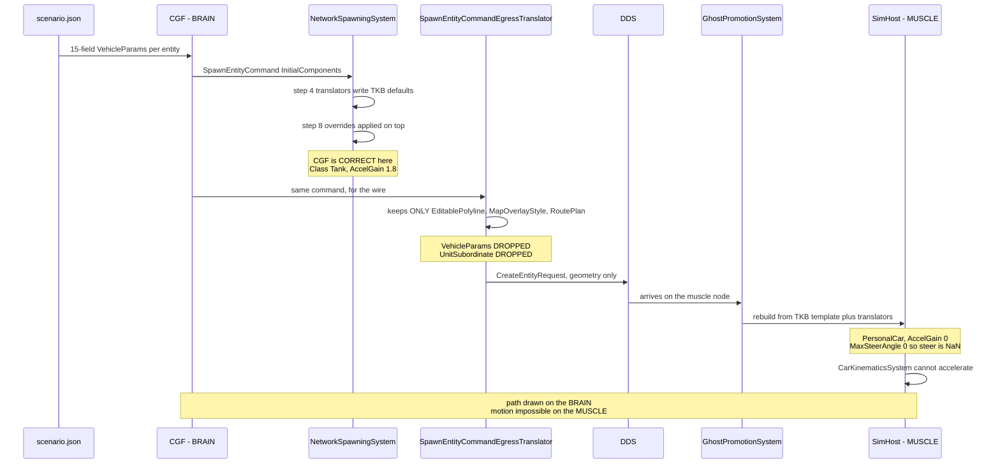

<!--STATUS
state: LIVE
updated: 2026-08-28
current-answer: §4 carries the RECOMMENDED ANSWERS. Nothing is built. build-state: DESIGN —
  this is a DDS wire-contract decision, which CLAUDE.md reserves for resolution WITH the user
  rather than delegation, so it is deliberately not dispatched.
stale-below: nothing — this document is new.
known-rot: nothing yet.
known-conflict: DESIGN_Subsystem_Composition_Unification.md §5c.18.5 said CE-103's fix was
  CE-109's live-path handler unification. ⛔ THAT IS NOW REFUTED by §2 below and is corrected
  in §5c.18.6 of that document. This file is the authority for CE-103's cause.
-->
# ⭐⭐⭐ `Q64` — **Per-entity scenario component overrides do not cross the wire.** `build-state: DESIGN`

> 🔒 **The symptom, user, `2026-08-28`:** *"When i press Play, the tanks show blue line to their
> destination, but they do not move."*

⭐⭐ **This is `CE-103`'s real cause.** ⛔ It is **not** the TKB catalog *(byte-identical on both hosts)*,
**not** the load handlers *(all three funnel through one extractor)*, and **not** `CE-109`'s live-path
duplicate. ⚠ Two earlier diagnoses of mine were wrong; §2 is measured on a live `--mode all` boot.

---

## 1. 🔴 INVENTORY — **the queries actually run** *(`2026-08-28`)*

| query | result |
|---|---|
| `grep -rn "VehicleParams"` filtered to writers, production only | ⭐ **exactly 2** — `VehicleKinematicsTkbTranslator:34` *(5 fields from the DTO)* and `VehicleCommandSystem:73` *(the `CmdSpawnVehicle` demo path)*. ⛔ **Neither writes the scenario's stored values** |
| `grep -rn "AccelGain"` production | ⭐ **1** non-test occurrence outside the struct and the presets: `VehicleClass.cs:90`, the `Tank` preset. ⇒ grepping the **VALUE** rather than the type is what settled the hunt |
| `grep -rn "InitialComponents"` production | ⭐ producers: `StagingEntityExtractor:351` · `CreateEntityRequestSystem:213/305` · several UI spawn adapters. ⭐ consumers: **`NetworkSpawningSystem:136`** *(applies)* · 🔴 **`SpawnEntityCommandEgressTranslator:143`** *(the loss — see §2)* |
| `grep -rn "class CreateEntityRequestSystem"` production | ⭐ **1** — `Hrot.CGF.Systems`. ⛔ No ruling-9 duplicate; the editor and CGF use the same class |
| `grep -rn "HrotEditLoadHandler"` production registrations | ⭐ **3** — editor `:1277`, SimHost node `NodeBootstrapper:288`, CGF `:843` *(added by `CE-102`)*. ⇒ **all three hosts have it** |
| `grep -rn "\.Resolve("` over the DebugApi assemblies | 🔴 **ZERO callers** ⇒ `Q64`'s instrument finding, filed as **`CE-112`** *(§3)* |

⚠ **Graph note:** the `codebase-memory-mcp` MCP tools were **not connected** this session and the CLI
binary at `/opt/codebase-memory-mcp/codebase-memory-mcp` was **not on `PATH`** *(`command not found`)*, so
the inventory above is **grep + live API measurement, not `search_graph`**. ⛔ Per `CLAUDE.md` that is a
MISS and it is stated rather than hidden. ⭐ **What compensates here:** every claim below is confirmed by a
**runtime read of two live hosts**, which is stronger evidence than either tool for *"what does this node
actually hold"* — and the one exhaustive claim (*"exactly 2 writers"*) is the kind grep cannot fully
guarantee. ⚠ **Re-verify that count with `search_graph` when the graph is available.**

---

## 2. 📐 THE MEASUREMENT — **the two worlds DISAGREE, and that is the whole finding**

⭐ One `--mode all` boot, one `POST /scenario/load/live {hill-attack}`, entity **1001**, read once per
perspective via `POST /perspective` *(⛔ **not** `?perspective=` — see `CE-112`)*:

| | `Class` | `AccelGain` | `MaxSteerAngle` | `UnitSubordinate` | components |
|---|---|---|---|---|---|
| ⭐ **CGF** *(`Scenario`, the BRAIN — authoritative spawner)* | **Tank** | **1.8** | **0.8** | ⭐ present | 24 |
| 🔴 **SimHost** *(the MUSCLE — runs `CarKinematicsSystem`)* | ⛔ **PersonalCar** | 🔴 **0** | 🔴 **0** | ⛔ **ABSENT** | 33 |
| ⭐ **editor** *(one process, one world)* | **Tank** | **1.8** | **0.8** | ⭐ present | 39 |

⭐⭐⭐ **CGF is CORRECT.** The scenario stores a full 15-field `VehicleParams` per entity
*(`scenarios/hill-attack/scenario.json`, 6 blocks)*, and `NetworkSpawningSystem` step 8 — *"apply
caller-supplied component overrides **on top of** TKB defaults"* — applies it. ⭐ The mechanism works as
designed.

🔴🔴 **The loss is the WIRE HOP.** `SpawnEntityCommandEgressTranslator:143-160` walks
`cmd.InitialComponents` and keeps **exactly three types** — `EditablePolyline`, `MapOverlayStyle`,
`RoutePlan` — building geometry/overlay descriptors. ⛔ **Everything else is silently dropped**, including
`VehicleParams` and `UnitSubordinate`. On the receiving node `GhostPromotionSystem:103-123` rebuilds the
entity from **the TKB template plus the translators only** ⇒ SimHost gets
`VehicleKinematicsTkbTranslator`'s 5 DTO fields and template defaults for the rest.

⇒ ⭐⭐ **`AccelGain 0` on the muscle node means the speed controller has zero gain
*(`CarKinematicsSystem:248`)* and `MaxSteerAngle 0` makes `SteerAngle` NaN.** 📌 **The tanks have a valid
destination and a drawn path — computed on the BRAIN, which is healthy — and no way to accelerate on the
MUSCLE, which is where motion happens.** ⭐ That is exactly the reported symptom, and it explains why the
path renders: the two halves live on different nodes.

⭐ **Why the editor is immune:** it is one process with one world, so there is no wire hop to lose the
override. ⛔ **The editor is therefore NOT the reference for this defect** — it cannot exhibit it, so
*"make the cluster do what the editor does"* has nothing to copy here.

---

## 3. ⚠ `CE-112` — **the instrument fault this investigation had to fix first** *(FIXED)*

`PerspectiveScopedDispatcher.Resolve(perspective)` exists, is documented as *"Q54-2's optional
`?perspective=` override"*, and has **zero callers**. ⇒ ⛔ passing `?perspective=` on a read route was
**silently ignored** and served the ACTIVE perspective.

📐 **How it was caught:** reading entity 1001 with `?perspective=` set to SimHost, Scenario, IG **and
ExCon** returned **four identical non-empty answers** — and **ExCon has no world at all**, so an answer
from ExCon cannot be real. ⭐ That single impossible reading is what exposed the ignored key.

⛔⛔ **It had already produced a wrong conclusion**: all four reads were SimHost's world, so *"the cluster
shows `PersonalCar`"* was recorded as a property of **the cluster** when it is a property of **one node** —
and it hid the very CGF-vs-SimHost disagreement that is the answer.

✅ **Fixed** as a single guard at the one envelope site: any request carrying `perspective` gets a hint
naming `POST /perspective`. ⛔ Not a `400`, per `CE-107`'s standing ruling *(leniency is right for a
diagnostic endpoint; going silent was the defect)*. ⭐ One guard, not per-route, so it cannot rot — and it
is skipped when a route supplies its own hint, so implementing the override later supersedes it cleanly.

⚠⚠ **This is the THIRD instrument fault in one investigation** — `CE-107` *(ignored `/logs` key)*,
`CE-110` *(empty TKB catalog)*, `CE-112` *(ignored perspective)*. ⇒ ⭐⭐ **all three had the same shape: a
plausible, well-formed answer to a different question.** 📌 The lesson worth keeping is not *"check your
tools"* in general but the specific test that worked all three times: **ask the instrument something it
CANNOT truthfully answer, and see whether it answers anyway.**

---

## 4. ⭐⭐⭐ THE DECISIONS — **each with my recommended answer**

> 🔒 **Why this is a question and not a batch.** `CLAUDE.md`: *large-blast-radius decisions still get an
> architect question resolved WITH the user — e.g. a serialization/engine contract — those are NOT
> delegated.* ⭐ Every option below changes what crosses DDS or what a receiving node reconstructs.

### `Q64-1` — **Where should the muscle node get per-entity overrides?**

| option | | blast radius |
|---|---|---|
| **A** ⭐⭐⭐ **RECOMMENDED — the receiving node reads the scenario itself** | Each node already **stages the scenario file** *(`TkbLoadClusterStateHandler` reads `{staging}/TKB/`, `ReferencePrefetchHandler` stages the scenario)* and already registers `HrotScenarioLoadHandler` + `HrotEditLoadHandler`. ⇒ the override data is **already on the node**; it is simply not applied to ghosts. Apply the scenario's stored components during/after ghost promotion, keyed by network id | ⭐ **No wire change.** Touches the promotion path and needs the id mapping to be stable |
| **B** | **Carry the overrides on the wire** — extend the egress translator + `CreateEntityRequest` to serialise arbitrary component overrides | ⛔ **DDS contract change**, a generic component serialiser, version skew between nodes. ⚠ The biggest blast radius of the three |
| **C** | **Put the values in the TKB template** so the template alone is sufficient | ⛔ Wrong layer: these are **per-entity** authored values *(6 distinct blocks in one scenario)*, not per-type defaults. ⚠ It would also make the scenario's stored block dead data |

⭐⭐ **Why A.** The data is already present on every node; only the *application* is missing. It keeps the
wire contract frozen, and it matches the existing division of labour — the TKB and the scenario are both
staged per node precisely so a node can reconstruct locally. ⚠ **Its one real risk** is id mapping:
promotion is keyed by network id, and the scenario's authored ids are remapped during extraction
*(`HN-037` measured 1000–1007 on the editor vs 2–9 on the cluster)*. ⇒ **A depends on the muscle node
being able to map a promoted ghost back to its authored scenario entity.** ⛔ **That must be measured
before A is built** — if the mapping is not recoverable, A collapses and B becomes the honest answer.

### `Q64-2` — **Which components are in scope?**

| option | | |
|---|---|---|
| **A** ⭐⭐ **RECOMMENDED — every component the scenario stores for that entity** | The scenario is the authored truth; a receiving node should reconstruct what was authored | ⚠ Must exclude the **host-specific** ones the §2 diff exposed — `MapDisplayComponent`, `VisualData`, `ResolvedStyle`, `CullingState` are editor-render concerns and `NetworkVelocity`/`PendingAuthorityGrants` are cluster-only |
| **B** | Only a named allow-list *(start with `VehicleParams`)* | ⭐ Smallest change, ⛔ and it is the shape that produced this defect: the egress translator's three-type allow-list **is** option B, eight years of components later. 📌 An allow-list nobody revisits silently drops every component added after it |

⭐⭐ **Why A, with an explicit EXCLUDE list rather than an INCLUDE list.** 📌 The measured lesson from
`SpawnEntityCommandEgressTranslator`: an include-list of three types looked complete when written and is
now the bug. ⭐ An exclude-list fails in the safe direction — a new component is carried by default and a
host that cannot use it ignores it.

### `Q64-3` — **Should the divergence be detectable, not just fixed?**

⭐⭐⭐ **RECOMMENDED: yes, and this is the part I would not skip.** 📌 The defect survived because **nothing
compares two nodes' view of one entity**, and the one tool that could was silently broken (`CE-112`).
⇒ ⭐ a conformance rail that loads a scenario on `--mode all` and asserts that the **authored** components
match on **brain and muscle** for at least one entity. ⚠ It belongs in the `T3` async lane
*(`run-system-tests.sh`)*, not the fix loop.

⛔ **Without `Q64-3` this class of defect returns** — it is invisible to every unit rail by construction,
because a unit rail builds one world.

### `Q64-4` — **Does `CE-109`'s live-path unification still have value?**

⭐ **Yes, but it is now decoupled from `CE-103` and its priority drops.** 📐 Measured: `HrotScenarioLoadHandler`
and `CgfScenarioLoadHandler` both funnel into the same `_extractor.Extract(...)`; the differences are
**zones** *(only the SimHost/editor handler loads them)* and a **`behaviorRemapper`** *(only CGF passes
one)*. ⇒ still a genuine ruling-9 duplicate worth collapsing, ⛔ **but it fixes nothing the user reported.**

---

## 5. ⛔ WHAT I HAVE **NOT** MEASURED — **stated so nobody builds on it**

| ⚠ | |
|---|---|
| ⛔ **Whether a promoted ghost can be mapped back to its authored scenario entity** | ⭐⭐ **`Q64-1` option A stands or falls on this.** Measure it FIRST |
| ⛔ **Whether `UnitSubordinate`'s absence on the muscle has its own symptom** | it is the same drop, but its consequence is unmeasured |
| ⛔ **Whether the 8 editor-only / 2 cluster-only components in §2's diff are all legitimately host-specific** | ⭐ they look it *(render vs networking)*, ⚠ but *"looks host-specific"* is not measured |
| ⛔ **`search_graph` confirmation of *"exactly 2 `VehicleParams` writers"*** | grep cannot guarantee an exhaustive claim; re-run when the graph is up |
