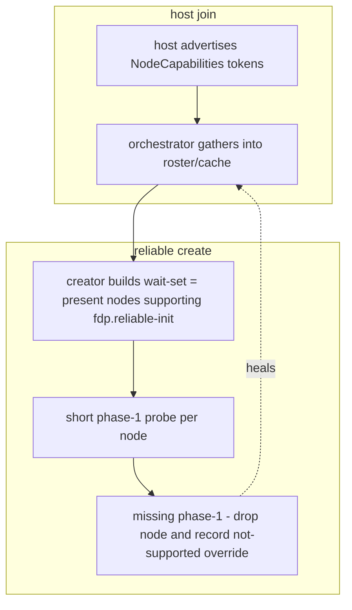

<!--STATUS
state: LIVE
build-state: DESIGN — RESOLVED with the user (`2026-09-16`). Not dispatched. The facility (host capabilities)
  is general; its first consumer is reliable-init graceful degradation.
updated: 2026-09-16
current-answer: §3 is the resolution — Q70-A (degradation via capabilities + a short phase-1 probe) and
  Q70-B (capability representation = an OpenGL-extension-style namespaced token set) are both settled.
  §2 is the INVENTORY the resolution rests on.
related-designs:
  - ../DESIGN_Cross_Node_Construction_Barrier.md — §3b the reliable-init barrier (the first consumer); §3c the degradation consumer view.
  - ../designs/two-ack/TwoAck-DESIGN.md — §3.2 SstStatusCode {InProgress, NotSupported} — the status vocabulary reused, not reinvented.
  - ../designs/cluster-master-cqrs-1/DESIGN.md — owns the ClusterMaster roster (NodeHealthProfile) the capability set extends.
  - projects/Hrot/Subsystems/Hrot.Orchestrator.md — the orchestrator that gathers the capability advertisements.
-->
# Architect Question 70 — host capabilities + graceful degradation when a host does not support reliable init

## 1. 🎯 THE QUESTION
A peer that does **not** support reliable init never creates/updates `EntityLifecycleStatusDescriptor`. If it is
not in the cluster orchestration, no one waits for it (the wait-set is built from the roster — solved). But a host
that **is** orchestrated and simply does not support reliable init *(an older/external version)* must not make a
creator **block forever**. Two sub-questions:
- **Q70-A** — how does the creator avoid waiting on a non-supporting host, gracefully?
- **Q70-B** — how is "supports reliable init" expressed, **generically and extensibly**, so external hosts can declare it?

## 2. 📐 INVENTORY *(measured `2026-09-16`)*
| query | result |
|---|---|
| roster/cache capability fields | `NodeHealthProfile` {NodeId, SubsystemName, LocalClusterState, LastHeartbeat, **Roles** (CE-282), Cpu, Ram}; `NodeCapability` {NodeId, **Role**, Cpu, Ram, LastSeen} — ⛔ **no capability/feature/version field** |
| heartbeat mask precedent | CE-282: `NodeHeartbeat.RolesMask` piggybacked + ingested into the roster — a proven "gather a per-host attribute" path |
| peer status state | `EntityLifecycleStatusDescriptor.State : EntityLifecycle` (Constructing/Active/TearDown/Ghost) — an "in-progress" reply needs **no new field** |
| status vocabulary | `SstStatusCode` {Success=0, **InProgress=1**, …, **NotSupported=7**, VersionConflict=8} — already models the states this needs |
| `SimHostCapabilities`/`CgfCapabilities`/`IgCapabilities` | ⚠ a **different axis** — the host's LOCAL role→ECS-module registration, NOT a cross-host wire capability. Do not conflate |

## 3. ✅ RESOLUTION

### Q70-A — degradation = capabilities (proactive) + a short phase-1 probe (reactive, self-healing)
Two mechanisms that compose:

**① Proactive — capability filter.** The creator builds its wait-set from the roster and **includes only hosts
that advertise the `fdp.reliable-init` capability** (§Q70-B). A host that doesn't advertise it is never waited for.

**② Reactive — short phase-1 probe.** Reuses the existing status `State`, no new field:
- a **supporting** host publishes `EntityLifecycleStatusDescriptor(State=Constructing)` **promptly on receipt**
  *(phase-1 = "participating, in progress")*, then `Active` *(phase-2)*. A host with nothing to wait for publishes
  `Active` immediately *(phases coincide)*.
- the creator arms a **short phase-1 timeout** per wait-set host. **No phase-1 within it ⇒ the host does not
  support reliable init** *(older/external, or stale capability)* ⇒ **drop it from the wait-set, do not block, and
  REMEMBER it** by writing an observed `!fdp.reliable-init` override into its roster/cache entry, so later creates
  skip it. The observation **heals** missing/stale capability data.
- the **long** `ReliableInitTimeout` *(§3b.3)* still governs phase-2 *(sent Constructing but never Active ⇒ abort-via-dispose)*.

⭐ ① is the clean path for declared hosts; ② is the safety net for undeclared/older hosts and feeds ① back.

*Caption: capabilities (declared) build the wait-set; the phase-1 probe (observed) prunes and corrects it — the two sources converge on the roster.*

### Q70-B — representation = an OpenGL-extension-style namespaced token set *(user lean, `2026-09-16`)*
> 🔒 **User:** *"i lean B, something like existing software so that (openGL extension etc)."*

Model it on the **OpenGL extension registry**: a host advertises a **set of namespaced capability tokens**; a
consumer queries membership; unknown tokens are ignored; absence = unsupported.

| aspect | decision |
|---|---|
| token form | `<owner>.<feature>[.<version>]`, e.g. `fdp.reliable-init`, `fdp.sst.two-ack`; vendor-prefixed for third parties *(`acme.foo`)* — exactly OpenGL's `GL_ARB_`/`GL_EXT_`/`GL_NV_` namespacing |
| query | `caps.Supports(nodeId, "fdp.reliable-init")` — membership test; unknown ignored; absent = unsupported |
| wire | a new **durable** descriptor `NodeCapabilities` `[DdsQos(Reliable, TransientLocal, KeepLast 1)]`, keyed by `NodeId`, field `Capabilities : string[]` — published **once at join** *(and on rare change)*. ⛔ NOT on the per-tick heartbeat: capabilities are static, so a durable-at-join descriptor is correct and weightless |
| gather | the orchestrator ingests it into `NodeHealthProfile.Capabilities` *(a set)* + `NodeCapability.Capabilities`, beside CE-282's role mask |
| versioning | carried as tokens *(`fdp.sst.v2`)* — no separate version int; OpenGL treats core-version and extensions similarly, and tokens keep it registry-free |
| graceful degrade | an older/external host advertises a subset *(or nothing)*; new tokens never break it; absent `fdp.reliable-init` = "don't wait for me" ✅ |

⛔ **Rejected — Option A (a `[Flags]` capability bitmask on the heartbeat):** cheaper *(reuses CE-282 wholesale)* but
needs a **shared bit registry** *(the collision hazard already measured)* and an external host cannot express bits
it does not know. It fails the "generic + extensible + external" requirement. *(Kept as HISTORY: viable only if the
capability set were small and strictly first-party.)*

## 4. 🔗 REUSE, NOT REINVENT
- **Status codes:** reuse `SstStatusCode.NotSupported` / `InProgress` *(two-ack §3.2)* for the requestor-facing view;
  the peer barrier reuses `EntityLifecycle.Constructing`/`Active` on the existing status descriptor.
- **Gather path:** extend the CE-282 roster-ingest, adding a `NodeCapabilities` durable descriptor beside the heartbeat.
- **Facility scope:** host capabilities is **general**; `fdp.reliable-init` is its first token. If the vocabulary grows
  beyond reliable-init, the facility earns its own `DESIGN_Host_Capabilities.md` *(flagged, not built speculatively now)*.
