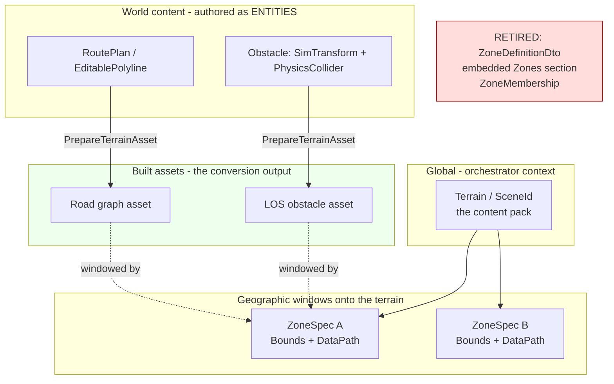
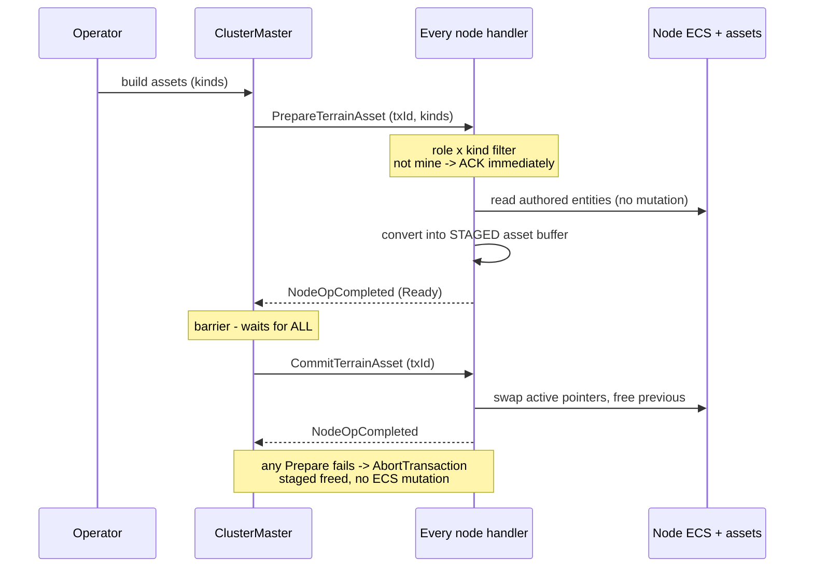

<!--STATUS
state: LIVE
build-state: DESIGN (the WHY only) — ✅ **APPROVED IN FULL AS A CONCEPT (user, 2026-09-16)** with a FAKE-FIRST scope
  ruling (§5). ⛔ STILL NOT BUILDABLE — §6 lists what must be specified first, and the concrete asset
  semantics are explicitly POSTPONED by the same ruling.
updated: 2026-09-17
current-answer: ⭐ §7 is the LATEST state, and R4/R5 within it are THEMSELVES superseded
  (2026-09-17): R4's version counter is replaced by a footprint HASH, and R5's AreaType field is
  replaced by TkbType discrimination. Both supersessions are marked in the R-table in place.
  ⭐ §7 is the LATEST state — the 2026-09-17 refinement dissolved S1/S3/S4/S5 (and
  WITHDREW Q71-C) and added rulings R1–R7. Read §7 before §3 or §6, both of which it edits.
  §5 is the fake-first scope ruling, §1 the INVENTORY, §2 the measured conflict.
  📄 The WHAT is now docs/DESIGN_Terrain_Zones_And_Assets.md (READY-TO-BUILD); this stays the WHY.
stale-below-note: Q71-C is WITHDRAWN in place; §6's S1/S3/S4/S5 are dissolved by §7.1 — do not quote
  any of them as open work.
stale-below: nothing — new document.
known-rot: nothing yet.
known-conflict: docs/designs/packs-3/DESIGN.md §2.B/§2.C contradicts its OWN design conversation
  (.dev/_DONE/packs-3/design_talk.md:555-567) and contradicts docs/designs/mgmt-1/DESIGN.md §11.
  This document exists to resolve that; it does not pretend the conflict is already settled.
related-designs:
  - docs/DESIGN_Terrain_Zones_And_Assets.md — ⭐ THE WHAT: the component model, both invocation paths,
    the module diagram and the slice-1 real-vs-faked split. THIS document is only the WHY.
  - docs/designs/mgmt-1/DESIGN.md — §11 owns the ZONE as a geographic staged-load unit (ZoneSpec,
    PrepareZone/CommitZone 2PC); it does NOT own authoring or asset production.
  - docs/designs/packs-3/DESIGN.md — §2.B/§2.C/§2.E own the AS-BUILT embedded `Zones` bundle and
    `ZoneManagerService`; this document proposes reverting that half.
  - docs/DESIGN_Distributed_Scenario_Persistence.md — owns WHICH FILE scenario data rides in and the
    ownership save gate; it does not own what a zone IS. Its line 511 needs correcting either way.
  - docs/designs/navig-2/Navigation_Design_v2_0.md — owns per-layer navmesh bake parameters; any
    asset-build design must land on it. It assumes SCENE GEOMETRY as the bake source, not entities.
  - docs/DESIGN_Node_Roles_And_Policies.md — owns which role consumes what; the zone/terrain
    consumers (MuscleGround, Perception, NavigationSolver) are named there.
  - docs/designs/cgf-1/mgmt-DESIGN.md — ⚠ near-duplicate of mgmt-1 carrying the same §11 (R-132 two
    producers). Read mgmt-1; that copy must not be quoted as current.
-->

# Architect Question 71 — **What is a zone, what is a terrain, and how do authored entities become loadable assets?**

> **One sentence:** `packs-3` made a *zone* a content bundle (roads + terrain-db + obstacles);
> `mgmt-1` made it a *geographic window* onto a terrain — and `packs-3`'s own design conversation
> argued for `mgmt-1`'s shape before the opposite was built.

## 0. Why this document exists

Three threads converged: the CE-277 zone follow-on (*"give CGF a zone service"*), the measured
round-trip duplication of zone obstacles, and the question of how operator-authored routes and
obstacles ever become the heavy data the simulation actually consumes. All three dissolve into one
prior question — **what is a zone** — which two designs answer differently.

### 0.1 ⛔ Relay discipline

This document carries **my leans**. Per `CLAUDE.md`, if it is ever relayed to the NotebookLM
architect, ask **before** it lands in a corpus refresh, and phrase the ask as *evidence-only*
(*"name the producers of X"*), never *"which option should we pick?"* — a verdict from something
that has ingested my verdict is worth nothing.

---

## 1. INVENTORY — enumerated, not guessed

Graph queries (codebase-memory, project `home-user-HROT`), each with its `total`:

| query | total | what it settled |
|---|---|---|
| `search_graph(name_pattern=".*Terrain.*")` | 112 | terrain exists as a **height-query provider** (`ITerrainProvider`, `TerrainQuery*System`), **not** as an identified loadable content pack |
| `search_graph(".*(RoadNetwork\|NavMesh\|Navmesh).*")` | 315 | navmesh baking exists (`StrideNavmeshBaker`) but bakes **Stride scene geometry**, never ECS entities, and writes no file |
| `search_graph(".*(EditablePolyline\|RoutePlan\|ZoneMembership\|ZoneObstacle\|ZoneDefinition).*")` | 81 | routes/shapes are **already entities**, already replicated, already saved |
| `search_graph(".*(IClusterStateHandler\|TkbLoadClusterStateHandler).*")` | 50 | the 2PC prepare/commit/abort seam is generic and live |

Corroborating greps (both trees; ⚠ `check_index_coverage` not run, so absences below are strong but
not proof):

| # | measured | site |
|---|---|---|
| ① | `NodeOpType` has **24** values; `PrepareZone = 7` / `CommitZone = 8` are **reserved on the wire** in *two* enums | `FDP/.../Enums/NodeOpType.cs:15-16`, `Hrot.Network.Orchestration/.../OrchestrationMessages.cs:53-54` |
| ② | the only implementor of either op is a **dummy ACK**; **no publisher exists** | `Hrot.IG/Modules/Orchestration/IgZoneDummyHandler.cs:41-42` |
| ③ | `CmdSwapZone` (the designed swap event) — **zero code hits** | designed only, `mgmt-1` §11.1 |
| ④ | the 2PC barrier is **BUILT and in daily use** — waits for all nodes' `NodeOpCompletedEvent` | `Hrot.Orchestrator/ClusterMaster.cs:1242-1254` (`GenericTransactionTracker`) |
| ⑤ | `PrepareAsync` is contractually *"async prep… **must not mutate ECS state**"*; `Commit` is main-thread; `Abort` rolls back | `FDP/.../IClusterStateHandler.cs:16-51` |
| ⑥ | **`TerrainDatabaseId` is DEAD** — 3 sites total (1 declaration + 2 lines of a DTO round-trip test), **zero production readers** | `Hrot.Core/Scenario/Map/ZoneDefinitionDto.cs:21` |
| ⑦ | terrain identity **already exists and is global** — `SceneId`, documented *"the map/terrain identifier"* | `Hrot.Orchestrator/GlobalContextClusterOpHandler.cs:78,279,291` ⚠ written `string.Empty` at `AssetInventoryProcessManager.cs:215` |
| ⑧ | `RoadNetworkLoader` is **load-only** — no writer anywhere | `FDP/.../CarKinem/Road/RoadNetworkLoader.cs` |
| ⑨ | zone obstacles are created as plain `SimTransform`+`PhysicsCollider`, **untagged** ⇒ the save gate persists them *as entities* while the `Zones` section re-creates them ⇒ **round-trip duplication** | `Hrot.Core/Services/ZoneManagerService.cs:59-68` vs `ScenarioSerializer.cs:557-563` |
| ⑩ | the merge enforces **exactly one `Zones` source**, throwing, citing *"brain-only"* — a rule the wiring does not follow (the **muscle** is the node wired to emit zones) | `ScenarioMergeCore.cs:115-123` vs `Hrot.SimHost/NodeBootstrapper.cs:306,313` |
| ⑪ | the authoring UI treats the road network as **a path you type to an existing asset** — it never produces one | `Hrot.Presentation/Panels/ZoneEditorPanel.cs` |
| ⑫ | **no entity→asset conversion exists**, in code or in either design tree | corpus sweep for bake/generate/convert→navmesh\|terrain\|road: every hit is scene-geometry-bake-at-load or a "future stage" note |

---

## 2. The measured conflict

| | `mgmt-1` §11 | `packs-3` §2.B/§2.C (**as built**) |
|---|---|---|
| a zone is | `ZoneSpec { ZoneId, GeoPoint[] Bounds, DataPath }` — *"a named high-resolution area… defined by a 2D polygon"* | `ZoneDefinitionDto { RoadNetworkPath, TerrainDatabaseId, Obstacles[] }` — a content bundle |
| where it lives | a zone artefact, referenced | **embedded** in the scenario file under `Zones` |
| terrain | global — `BaseTerrain` / `SceneId`, loaded at `LoadingEdit` | a **property of the zone** (dead field ⑥) |

🔴 **`packs-3` contradicts its own design conversation.**
`.dev/_DONE/packs-3/design_talk.md:555` (the user): *"The Zone concept… serves mainly for **EXERCISE
RUNTIME loading of terrain areas**. Maybe instead of directly referencing the static asset in scenario
files, we can reference some kind of predefined **ZONE name** used to locate zone json files… the
scenario loader will load these zones as part of loadingEdit or loadingLive."*
The reply agreed: *"**Rather than adding a new section to the scenario JSON file**, you should utilize
this existing Orchestration pipeline"* → `ScenarioHeader(SubsystemType, SchemaVersion, string? ZoneId)`.
`packs-3/DESIGN.md` §2.B then specified **exactly the embedded section the talk rejected**, with no
stated reason beyond *"one road network per zone — KISS"*.

⇒ this is a **regression from its own record**, not a later evolution. That matters for `R-137`
(*unification may not cost a feature*): reverting here removes a bundle nobody argued for, not a
capability someone chose.

### 2.1 The model this document proposes

*What the picture shows that the prose hid:* content and zones are **orthogonal** — an authored road
crosses zone boundaries freely, and a zone windows whatever content falls inside it. The retired box
is exactly the place where `packs-3` fused the two axes.

---

## 3. THE SUB-QUESTIONS — each with a recommended lean

### Q71-A — Is a zone a content bundle, or a geographic window onto a terrain?

⭐ **LEAN: geographic window (`mgmt-1`). Revert `packs-3`'s bundle.**
A zone is `{ ZoneId, Bounds, DataPath }`; roads and obstacles are world content that crosses zone
boundaries and is not owned by any zone.
**Blast radius:** retires `ZoneDefinitionDto`, the embedded `Zones` section, `ZoneMembership`, and the
`ScenarioMergeCore` one-`Zones`-source rule (⑩). **Reuse-vs-build:** pure reuse — `ZoneSpec` is
already specified in `mgmt-1` §11.2.
**What would change the lean:** a consumer that genuinely needs per-zone road/obstacle *scoping*
rather than spatial windowing. None found (⑫).

### Q71-B — Where does terrain identity live?

⭐ **LEAN: it already lives in the orchestrator's global context — `SceneId` (⑦), *"the map/terrain
identifier"*.** No ECS component, no new field. A zone's identity is then the pair
**(terrain, zoneId)** — the terrain-db id is part of *which zone this is*, never a property carried
inside it, which is why ⑥ was dead.
**Build:** populate `SceneId` (today written `string.Empty` at `AssetInventoryProcessManager.cs:215`).
**What would change the lean:** if a single exercise must host two terrains at once — then terrain
becomes per-zone after all. Believed false; worth one sentence of confirmation.

### Q71-C — How does a scenario reference the zones it needs? ⛔ **WITHDRAWN `2026-09-17`**

⛔⛔ **This sub-question no longer exists.** The `2026-09-17` refinement makes a zone **an Area entity
saved to the scenario like any other** ⇒ the scenario *contains* its zones; there is nothing to
reference and no resolution step to build. ⚠ The approved lean below is **superseded by a simpler
answer**, and is kept only so nobody re-derives the foreign-key design.

> ⛔ **HISTORY — the withdrawn lean:** *a foreign key in the scenario header*, exactly as the `packs-3` talk concluded —
`ScenarioHeader(SubsystemType, SchemaVersion, ZoneIds)` — resolved to zone artefacts by name.
Loading them reuses the **same executive code** as the runtime zone load, invoked during
`LoadingEdit`/`LoadingLive` rather than via `PrepareZone`.
**Alternative considered:** keep zones wholly out of the scenario and drive them only from the
orchestrator context. Rejected — the scenario is what knows *where the action is*.

### Q71-D — How are roads and obstacles represented for authoring?

⭐ **LEAN: as ordinary entities, reusing what exists.** `RoutePlan` and `EditablePolyline` are already
entity components — replicated (`EditablePolylineTranslator`), operator-editable (context menu), and
already persisted (`scenarios/hill-attack/scenario.json` carries an `EditablePolyline`). Obstacles
keep `SimTransform`+`PhysicsCollider` and **lose** `ZoneMembership`.
**Cost to state plainly:** obstacles become individually persisted entities, so a scenario grows by
the obstacle count — the same behaviour as every other entity, and it removes duplication ⑨.
**Reuse-vs-build:** ~all reuse; the only new thing is deciding whether "this polyline is a road"
needs a marker component or is inferred from an existing one. ⛔ **Open inside this sub-question.**

### Q71-E — The asset build: `PrepareTerrainAsset` / `CommitTerrainAsset`

> 🔒 **User's proposal, `2026-09-16`:** *"The entity→asset conversion is basically an asset build and
> as such it would probably need similar cross cluster operation `PrepareTerrainAsset` /
> `CommitTerrainAsset` (cross cluster as we do not know what node handles it — anyone can do its part,
> in distributed manner). Prepare converts the entities into assets and loads the stuff (roads,
> obstacles…) into some separate memory area, Commit then switches pointers to apply (forgetting the
> previous no longer valid ones). Asset preparation might be limited to just some entity kinds like
> routes or obstacles… so the asset kinds involved should be part of `PrepareTerrainAsset`
> parameters."*

⭐ **LEAN: adopt it as stated — a new op pair mirroring `PrepareZone`/`CommitZone`, carrying an
asset-KIND mask.** It fits the existing contract exactly: `PrepareAsync` is already *"must not mutate
ECS"* (⑤), which is precisely "convert into a separate memory area"; `Commit` is main-thread, which is
precisely "switch pointers"; `Abort` already frees staged work. The barrier (④) is built and proven.

*What the picture shows that the prose hid:* the **kind × role filter** is what makes "anyone does its
part" safe — a node that consumes no road graph ACKs without building one, the same shape
`IgZoneDummyHandler` already uses, so no node can stall the round.

**Three things inside this that are genuinely open:**

| | question | ⭐ lean |
|---|---|---|
| **E1** | does **each node convert locally**, or does **one node build and distribute** the artefact? | ⭐ **convert locally.** The authored entities are replicated, so every node already has the input; and the existing staging/NAS push path is a heavier hammer. ⚠ **Hazard to rail:** conversion must be **deterministic**, or two nodes get different road graphs and diverge with nothing to detect it — the `R-136` failure shape. A conformance rail comparing a hash of the built asset across nodes is the cheap control |
| **E2** | what are the **kinds**, and are they a flags mask? | ⭐ flags mask (`Roads \| Obstacles \| …`), extensible, so one op serves every future asset. Follows the round-out preference |
| **E3** | what **triggers** a build — explicit operator action, or automatically on edit commit? | ⭐ **explicit.** It is heavy; auto-building on every vertex drag would thrash. An explicit "build" affordance also makes the staged/committed distinction visible to the operator |

### Q71-F — What happens to the existing `Zones` section?

⭐ **LEAN: retire it, and do not write a migration shim.** Measured: **no scenario in the repo carries
a `Zones` section at all**, so there is no corpus to migrate. `Deserialize` already skips unknown
sections (§6b format recognition), so an old file with one degrades to "zones ignored" rather than
failing.
**⚠ Separate, unmeasured flag found while investigating:** `scenarios/hill-attack/scenario.json` uses
lowercase `entities`/`header` while `ScenarioMergeCore` indexes `dom["Entities"]`/`dom["Zones"]`
(case-sensitive `JsonNode`). Likely old-format assets vs the new writer — **needs its own check**, and
it is not this document's question.

### Q71-G — The spatial coupling: a rebuilt asset that overlaps a loaded zone

> The user's framing: a built asset *"is likely not related to zones much. Maybe just when the assets
> falls into the already loaded zone(s) — then their asset… might need reloading."*

⭐ **LEAN: defer, and do not design it until A–E are settled.** It is a *consequence* of the split,
not a mechanism of its own: once zones window world content, `CommitTerrainAsset` simply needs to
re-window whatever zones are currently loaded. Whether that is a fresh `PrepareZone` round or an
internal re-slice is a detail that A–E decide.

---

## 4. Sequencing — if the leans are approved

| # | step | why here |
|---|---|---|
| 1 | fold the **terrain/zone split** (A+B) into `mgmt-1` §11 and mark `packs-3` §2.B/§2.C/§2.E **SUPERSEDED** in place; add the reciprocal `related-designs` links | the documents must stop disagreeing before anything is built against either |
| 2 | correct `DESIGN_Distributed_Scenario_Persistence.md` §6a (zones are **not** brain-owned) + its line 511, and the `ScenarioMergeCore` I4 message | ⑩ — a throw citing a rule the wiring never followed |
| 3 | retire the embedded `Zones` bundle (F) + `ZoneMembership`; obstacles become plain entities (D) | closes the round-trip duplication ⑨ |
| 4 | the asset build (E) — **its own design doc with the UML**, not a batch | new mechanism, new wire ops |
| 5 | zone reference by id (C) + `PrepareZone`/`CommitZone` made real | the delivery half, already specified in `mgmt-1` §11 |
| ⛔ | G | only after 1–5 |

⚠ **`CE-277(a)` — *"give CGF a real `IZoneManagerService`"* — should be CLOSED, not built**: it
would add a zone service to the one role with no zone consumer, and the class it would instantiate is
what step 3 retires.

---

## 5. ✅ RULING `2026-09-16` — **approved in full, FAKE-FIRST**

> 🔒 **User, verbatim:** *"approved in full as a concept… Zone handling needs detailed design of how
> terrain-asset-entities are built (into what?), how the Commit swap is done (what gets replaced?) etc.
> Concrete solution of these is to be postponed. Asset build (prepare/commit) can be just fake. But
> zones (themselves being assets — likely including a navmesh or even something else) needs to be
> persisted/cached to a local storage (manifest only — still just fake) and referenced from scenario
> (no fake — real referencing). Zone load (prepare/commit) can be just fake implementation loading
> nothing real… so zones can be edited as area entities, obstacles can be edited as specific entities,
> roads can be edited as specific entities, the cluster control panel should have UI controls for
> initiating terrain asset build same as for zones… terrain asset prep/commit and zone prep/commit
> operation implemented with fake immediately ACKing handlers, shared code on every host."*

⇒ **Q71-A … Q71-G are all DECIDED as leaned.** What the ruling adds is a **scope split**: build the
*authoring surface and the mechanism* for real; fake the *heavy asset semantics*.

| axis | ⭐ REAL in this slice | ⛔ FAKE / postponed |
|---|---|---|
| zone definition | **authored as an AREA ENTITY** | — |
| obstacles | **authored as specific entities** | — |
| roads | **authored as specific entities** | — |
| scenario → zone reference | ⭐⭐ **REAL referencing — explicitly not faked** | — |
| zone artefact on local storage | a **real file** at a real path | its **content is a manifest stub** |
| `PrepareZone` / `CommitZone` | registered on **every host, shared code**, real 2PC round, real ACKs | the handler **loads nothing** |
| `PrepareTerrainAsset` / `CommitTerrainAsset` | same — real op, real round | **converts nothing**; no asset is produced |
| cluster control panel | **real buttons** initiating both builds | — |
| *what* an asset IS, and *what the swap replaces* | — | ⛔⛔ **POSTPONED — the detailed design is deliberately not attempted here** |

⭐⭐ **Why a fake that ACKs is legitimate here and is NOT the `R-133` disease:** `R-133` warns that *"a
cell reported present that silently no-ops is worse than an absent one."* The distinction is
**visibility** — ⇒ 🔒 **a fake handler MUST announce itself**: log its fake-ness on every round, and
the capability manifest must **not** advertise a real terrain/zone capability. A silent fake would be
exactly the defect `R-133` names. ⛔ This is a constraint on the build, not a caveat.

---

## 6. ⛔ WHAT MUST STILL BE SPECIFIED before this is buildable

📐 Measured `2026-09-16` while scoping the ruling — the state of the zone pipeline is **more built
than expected in the transport and less built than expected in the middle**:

| # | measured | consequence |
|---|---|---|
| ⑬ | `ClusterOpType.LoadZone = 3` exists, the wire translator has a **real arm** publishing `LoadZoneIntent` (`ClusterOpMasterTranslator.cs:238-241`), and the intent is bus-registered | the operator-facing op and its wire path **already exist** |
| ⑭ | 🔴 **`LoadZoneIntent` has NO CONSUMER** — and its own doc comment says *"Consumed by `ClusterMaster`"* (`ClusterOpIntents.cs:133`), which is **FALSE** | the path dead-ends; the comment must be corrected either way |
| ⑮ | the cluster panel has **no zone control** — its op switch handles time/transition/episode/archive/checkpoint/seek/cancel and **no `LoadZone` arm** (`ClusterScenarioPanel.cs:55-136`) | ⚠ the ruling's *"same as for zones"* assumes a zone UI that **does not exist**; both buttons are new |
| ⑯ | the `LoadZone` payload reuses **`ArchivePayloadDto`**, stuffing `ExerciseId` into `ZoneId` | a purpose-built payload DTO is needed |
| ⑰ | `ClusterOpType` next free value = **17** (2 is a documented reserved gap). `NodeOpType` has **undocumented** gaps at 6, 17, 18, 19 | ⛔ do **not** silently reuse an undocumented gap — pick new high values and document, or establish the gaps are free |

### The open specification items

| # | what must be decided | why it blocks |
|---|---|---|
| **S1** | **the zone entity's component set** — bounds (reuse `EditablePolyline`? a dedicated `ZoneBounds`?), the zone id, the terrain link | decides the authoring surface and what the save gate persists |
| **S2** | **road / obstacle marker components** — "this polyline is a road" vs a zone boundary vs a tactical drawing. ⚠ `R-44`: component ids are **globally unique and capped at 256** — new ids must be allocated deliberately | without a discriminator the asset build cannot select by KIND (`Q71-E2`) |
| **S3** | ⭐⭐ **the duality rule: a zone is BOTH an authored entity AND an artefact.** Which is canonical, and does the entity persist to the scenario *as well as* export to the zone manifest? | ⛔ **the highest-risk gap** — get this wrong and there are two producers for one slot (`R-132`) |
| **S4** | **the zone artefact: path convention, manifest schema, and who writes it** (the build? the save?) | the ruling says real file / stub content — the *path* must still be real |
| **S5** | **how the scenario references zones** — header field shape, and resolution from id → local storage | ruled REAL, so it must be fully specified |
| **S6** | **ownership / role for zone, road and obstacle entities** — which node owns them, hence which node SAVES them under the §6 gate | `DESIGN_Role_Affinity_Ownership` + the save gate both key on this |
| **S7** | **the two op pairs' enum values + payload DTOs** — see ⑰ and ⑯; both enums are **wire contracts in two places** | a wrong value is a wire break |
| **S8** | **shared registration** — one registrar for both op pairs across all hosts, mirroring `SerializeLocalRegistrar` (`CE-279`) | the ruling says *"shared code on every host"* |
| **S9** | **the fake's honesty contract** — how the fake announces itself (log + capability manifest), per §5 | `R-133` |
| **S10** | **the retirement + re-home plan** — `ZoneDefinitionDto`, the embedded `Zones` section, `ZoneMembership`, `ZoneManagerService`, the `ScenarioMergeCore` I4 rule, `ZoneEditorPanel`, and the **five test suites** that assert the retiring behaviour (`ZoneManagerServiceTests`, `ZoneScenarioLoadIntegrationTests`, `ZoneEditorPanelTests`, `ScenarioFileServiceZoneTests`, the two `SpyZoneManagerService` doubles) | ⚠ `HN-037`: a deletion whose TEST surface was not measured is not a "mechanical deletion" |
| **S11** | **the UML** — `classDiagram` + `sequenceDiagram` + the **module diagram** (who registers each handler on which host, and who ticks it) | obligation ① — a design with no UML may not be dispatched |

⇒ ⭐ **S1–S3 are design calls that belong in a `DESIGN_*` doc** *(this question is the WHY; that doc is
the WHAT)*. S4–S11 are specification work that can be done inside it. ⛔ **No handoff until S11 exists.**

---

## 7. ✅ THE REFINEMENT `2026-09-17` — **four gaps DISSOLVED, seven rulings ADDED**

> 🔒 **User, verbatim (abridged):** *"Zone entity is like a tactical drawing of an area. Those Areas
> should carry an area type field, and Zone is one of them. Saved to scenario as any other entity.
> **Zone as an artifact does not really exist.** Zone loading might generate, stream and cache some
> terrain tile data… These cached tiles can be reused by different zones… Zone loading is idempotent.
> Once zone is loaded, it needs to be indicated by the presence of a marker ecs component… never
> persisted to scenario nor replay recording… assets = just a cached reconstructable data (entity is
> the definition, so **no duality risk**)… On scenario load the loading of these is executed by calling
> same loading implementations locally on each node… but not invoked via nodeOps."*

### 7.1 Dissolved — these gaps no longer exist

| was | why it is gone |
|---|---|
| **S1** zone component set | a zone is an **Area entity with `AreaType = Zone`** |
| **S3** ⭐ the duality *(my highest-risk item)* | **there is no artefact.** The entity is the definition; an asset is a cache. A cache cannot disagree — it can only be stale, which is detectable |
| **S4** artefact path / schema / writer | nothing to write |
| **S5** + **Q71-C** scenario→zone reference | the scenario **contains** its zones as entities |

### 7.2 Added — rulings from the measurement of that refinement

📐 **Two claims in the refinement did not survive measurement, and both are now rulings:**

| # | ruling | basis |
|---|---|---|
| **R1** | ⚠ **NARROWED `2026-09-17`: only MOVABLE obstacles are excluded.** The measurement stands — `RaycastSolverSystem.cs:145-147` reads `PhysicsCollider` off broadphase candidates, so a movable obstacle occludes LOS the instant it exists, with nothing to cache. ⛔ **But STATIC obstacles (buildings) are a different kind**: 🔒 *"they are certainly not runtime dynamic… building might need baking them into navmesh and physics world"* ⇒ they DO earn a build and a marker, and the two kinds are split by `TkbType`. ⭐ This is what keeps the asset-build op from being vacuous. 📄 design §2.1c | measured + user |
| **R2** | ⭐ **the road-blob swap seam is a PRECONDITION**, not a cleanup | 🔴 `PathfindingSolverSystem` holds `readonly RoadNetworkBlob _roadNetwork` assigned once in its ctor (`:32`,`:63`) — same shape in `NavigationSolverModule` + `EngineBackedNavigationModule` ⇒ a commit swap reaches `CarKinematicsSystem` (per-tick singleton read) and **silently does nothing for pathfinding.** Fix by reuse: navigation re-reads the singleton per tick |
| **R3** | the marker carries **state**, not a bare tag: `{ LoadPhase, SourceVersion }`, `[DataPolicy(NoScenario \| NoReplay)]` | streaming has an in-flight state and loads can fail; both flags already exist |
| **R4** | ⛔⛔ **SUPERSEDED `2026-09-17` — the key is a HASH, not a version counter.** The original key (`EditablePolyline.Version`) is MEASURED BROKEN: **nothing increments it**, `VertexEditGizmo.cs:227` **resets** it on every committed edit, and — since points are RELATIVE — it could not see a MOVE at all. ⇒ the key is **`hash(SimTransform ⊕ Points)`**, computed by the loader and the gizmo and maintained by nobody. 📄 [`DESIGN_Terrain_Zones_And_Assets.md`](../DESIGN_Terrain_Zones_And_Assets.md) §9.7 ③c; defect filed as `BP-516` | measured |
| **R5** | ⛔⛔ **SUPERSEDED `2026-09-17` (user): `AreaType` was WRONG — `TkbType` is the ONE discriminator.** 🔒 *"own TkbType for zones approved. prev ruling 'Areas carry an area type field' was wrong, now superseded with the TkbType differentiation."* ⇒ the `Area{AreaType}` and `RoadFeature` components are **deleted**; zones and roads get their own `TkbType` values beside `8801`/`8802`/`8803`. ⭐ `TkbIdentity` already IS the kind axis and already selects the gizmo, so `AreaType` would have been a second mechanism for one distinction. 📄 §2.1 of the design | user |
| **R6** | zone/terrain loading is **role-filtered** — the tile consumers run it, the brain loads nothing | `DESIGN_Node_Roles_And_Policies` |
| **R7** | the tile cache is **per-node local and keyed geographically** *(mechanism postponed)* | otherwise *"reusable across zones"* cannot be true |

⭐ **And one claim that was better than expected:** `RoadNetworkBuilder` *("constructing RoadNetworkBlob
from components": `AddNode`/`AddSegment`/`Build`)* **already exists** ⇒ the entity→road compile is
mostly reuse, so **roads ship REAL, not faked** — only the terrain *tiles* are stubbed.

📄 ⇒ **The WHAT now lives in [`docs/DESIGN_Terrain_Zones_And_Assets.md`](../DESIGN_Terrain_Zones_And_Assets.md)**
*(`build-state: READY-TO-BUILD`; classDiagram + 2 sequenceDiagrams + the module diagram carrying both
dead edges)*. ⛔ **S2/S6–S11 are specified there**; this document stays the WHY.
