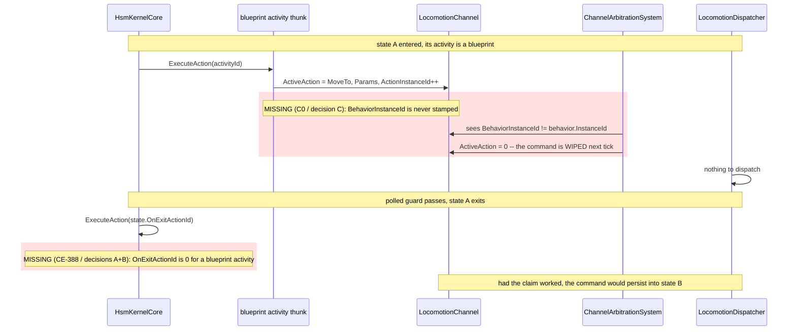
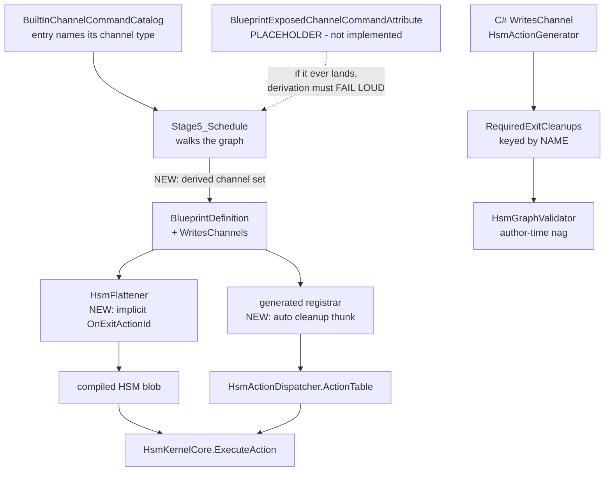

<!--STATUS
state: LIVE
updated: 2026-09-28
build-state: DESIGN - nothing is built from this until the user approves section 4.
current-answer: section 4 is the five decisions, each with a lean. Read section 0 FIRST - it
  carries a defect found while writing this question (C0: a blueprint channel command is WIPED
  by ChannelArbitrationSystem on the next tick) which reframes CE-388 from "exit cleanup" to
  "the whole channel lifecycle, and the CLAIM half is missing too". Section 1 is the INVENTORY,
  section 3 the diagrams, section 5 the blast radius, section 6 the acceptance rails.
stale-below: nothing.
known-rot: nothing yet. ONE claim in the CE-388 tracker row is already known wrong and is
  corrected in section 0: "the .bp.json declares its channels" presumes hand-declaration, and
  D-A's lean is that the compiler DERIVES them instead.
known-conflict: nothing.
related-designs:
  - DESIGN_Hsm_Blueprint_Behaviour_Authoring.md - OWNS CE-388 (its section 8, item G5) and the
    whole HSM-hosts-a-blueprint programme. This question resolves the one item that design left
    unspecified. It does NOT own the channel components or the arbitration system.
  - ../designs/brain-death/BD1-DESIGN.md - section 1.1 OWNS the ChannelArbitrationSystem OnExit
    guarantee and the "zero ActiveAction, INCREMENT ActionInstanceId" idiom that every cleanup in
    this question reuses. It owns cleanup at BEHAVIOUR granularity; this question is about STATE
    granularity inside one running behaviour.
  - DESIGN_Occurrence_Scoped_Storage.md - owns the hosted-occurrence storage a blueprint activity
    runs out of. It does NOT own actuator channels.
-->

# ⭐ `Q74` — **the channel lifecycle of a blueprint-hosted HSM activity** *(`CE-388`, and a defect it uncovered)*

> 🔒 **User, `2026-09-28`:** *"i want some clean and flexible solution where the most common use
> case is a default so the user does not need to author unless he needs something extra."*

---

## 0. 🔴 THE PROBLEM IN THREE MEASUREMENTS — **and the third one is new**

A channel (`LocomotionChannel`, `WeaponChannel`, `InteractionChannel`) is a **standing order**: an
actuator keeps executing `ActiveAction` until something changes it. So a channel has a **lifecycle**
with two halves — **CLAIM** it on entry, **RELEASE** it on exit. Both halves are currently missing
on the blueprint route, and only one of them was filed.

| # | measurement | consequence |
|---|---|---|
| **①** | ⭐ For a C# `[HsmAction]` with `[WritesChannel]`, `HsmActionGenerator.cs:503` **auto-emits** `ExitCleanup_<Name>` — `ActiveAction = 0; ActionInstanceId++` — and registers it under `HsmActionKey.ForExitCleanup(name)` | ⚠ the cleanup BODY is already automatic; only the **binding** is manual |
| **②** | ⛔ `RequiredExitCleanups` maps **action NAME → cleanup NAME**, and `HsmGraphValidator.ValidateChannelSafety:84` then demands the author bind that name as the state's `OnExitAction`. A blueprint activity has **no name** — only a baked `ushort` (`HsmEmitCore.cs:721`) | ⇒ **the validator is BLIND**, nothing is generated, and the author is never told. The state exits and the entity keeps driving |
| **③** | 🔴🔴 **NEW, found while writing this question.** `ChannelCommandLowering.Emit:21` writes `ActiveAction`, the params and `ActionInstanceId++` — but **never sets `BehaviorInstanceId`**. `ChannelArbitrationSystem.cs:44` clears any channel where `ActiveAction != 0 && channel.BehaviorInstanceId != behavior.InstanceId` | ⇒ ⛔⛔ **a blueprint-issued channel command is WIPED on the next tick.** Measured: **every** production channel writer is a hand-written C# node that stamps `channel.BehaviorInstanceId = behavior.InstanceId` explicitly — `CgfNodes.cs:297,345,381,458,570`, `HillAttackTankNodes.cs:271,408,470`, `EqsCombatNodes.cs:91`, `HsmChannelRegionNodes.cs:50,63`. **The blueprint lowering is the only channel writer that does not** |

### ⭐⭐⭐ WHY ③ REFRAMES THE WHOLE ITEM

⛔ **`CE-388` was filed as "exit cleanup".** ⭐⭐ Measurement ③ says the **entry** half is broken
too, and it is **not HSM-specific** — it bites a BTree-hosted blueprint identically. ⇒ 🔒 **building
`CE-388`'s release half without ③'s claim half produces a demo where the entity never moves at all,
and the missing cleanup is invisible because there was never a command to clean up.**

⚠ **This also invalidates one line of the `CE-388` tracker row**, which says *"the `.bp.json`
declares its channels"*. ⭐ `D-A`'s lean is that **nothing is declared** — the compiler already knows.

### ⚠ WHAT IS *NOT* BROKEN — said plainly, so the scope stays honest

⭐ **Cleanup at BEHAVIOUR granularity already works and is automatic.** `ChannelArbitrationSystem`
clears a stale channel the moment the *behaviour* is swapped, using exactly the idiom every cleanup
below reuses (📄 `brain-death/BD1-DESIGN.md` §1.1, which owns that guarantee). ⇒ this question is
only about **STATE granularity inside one running HSM**, which nothing covers.

---

## 1. ⭐⭐ INVENTORY *(`R-74`)*

⚠ **`check_index_coverage` was NOT run** — the `codebase-memory` MCP tools were disconnected for
this session and the CLI does not expose that tool. ⛔ Per the standing rule, **every count below is
therefore corroborated by grep, and none is presented as exhaustive.**

```
search_graph(name_pattern=".*ChannelKind.*|.*AiPrimitiveHosting.*")  -> 8
search_graph(name_pattern=".*ChannelCommand.*")                      -> 30
search_graph(name_pattern=".*ExitCleanup.*")                         -> 8
grep  "BehaviorInstanceId ="  (production, non-test)                 -> 17 sites, 11 of them AI nodes
```

| # | what exists today | where | note |
|---|---|---|---|
| ① | **`ChannelKind`** — `Locomotion`, `Weapon`, `Interaction` | `SharedAiAttributes.cs:93` | ⭐ three, closed set |
| ② | **The three channel components** | `ChannelComponents.cs:11,26,41` | each carries `ActiveAction`, `ActionInstanceId`, `BehaviorInstanceId`, `Params` |
| ③ | **`[WritesChannel(ChannelKind)]`**, `AllowMultiple` | `SharedAiAttributes.cs:79` | ⭐ the C# declaration. ⛔ has no blueprint counterpart |
| ④ | **`EmitExitCleanupThunk`** — generates the cleanup BODY | `HsmActionGenerator.cs:503` | ⭐⭐ **already automatic**; reuse it verbatim |
| ⑤ | **`RequiredExitCleanups`** — `IReadOnlyDictionary<string,string>` | `HsmActionGenerator.cs:554` | ⛔ **keyed by action NAME** ⇒ blind to a baked id |
| ⑥ | **`HsmGraphValidator.ValidateChannelSafety`** | `HsmGraphValidator.cs:84` | the author-time nag. ⛔ **there is no runtime wrapper on the HSM route** |
| ⑦ | **`BuiltInChannelCommandCatalog`** — `MoveTo`→Locomotion(1), `FollowRoute`→Locomotion(3), `AimAndFire`→Weapon(1), `OpenDoor`/`EjectPassengers`→Interaction, `DemoEnumAction`→Locomotion(99) | `BuiltInChannelCommandCatalog.cs:73-87` | ⭐⭐⭐ **THE KEY FACT: every entry already names its channel type.** This is what makes `D-A`'s derivation possible with no authoring |
| ⑧ | **`ChannelCommandLowering.Emit`** — the blueprint write site | `ChannelCommandLowering.cs:8-49` | 🔴 the defect in ③ lives here |
| ⑨ | **`ChannelArbitrationSystem`** | `ChannelArbitrationSystem.cs:44,62,80` | ⭐ behaviour-granularity cleanup, already automatic |
| ⑩ | **`AiPrimitiveHosting`** — where `HsmAction`/`HsmGuard` are declared | `BlueprintAsset.cs:154` | the existing per-asset declaration surface, if a hand-declared override is ever needed |
| ⑪ | **`BlueprintExposedChannelCommandAttribute`** | `BlueprintExposedChannelCommandAttribute.cs:1` | ⚠ **a PLACEHOLDER — "implemented in Slice 2", i.e. not implemented.** ⛔ A second source of channel commands is designed-but-absent; `D-A` must fail loud rather than derive an empty set if it ever lands |

⭐ **Nothing named "blueprint channel lifecycle" exists.** ⛔ The only channel declaration mechanism
is `[WritesChannel]`, which is a **C#-symbol** attribute and cannot reach a `.bp.json`.

---

## 2. ⛔ What this does NOT change

| | |
|---|---|
| ⛔ **the arbitration idiom** | `ActiveAction = 0` + `ActionInstanceId++`, never `= default`. 📄 `BD1-DESIGN.md` §1.1 explains why: resetting to `default` makes `ActionInstanceId == DispatchedInstanceId`, so the executor's `OnExit` never fires and the muscle drives forever |
| ⛔ **behaviour-granularity cleanup** | `ChannelArbitrationSystem` keeps doing its job untouched |
| ⛔ **the C# `[WritesChannel]` authoring surface** | `D-D` asks whether its *binding* becomes automatic; the attribute itself stays |
| ⛔ **`ChannelKind`'s membership** | three channels, closed set, not extended here |

---

## 3. ⭐ THE DIAGRAMS

### 3.1 The lifecycle, with both halves and where each is missing



*What the picture shows that the prose hid: the two defects are on **opposite sides of the same
lifecycle**, and they **mask each other** — with the claim broken there is no standing command, so
the missing release is invisible. Fixing only `CE-388` would look like it changed nothing.*

### 3.2 Who produces the channel set, and who consumes it



*What the picture shows that the prose hid: the C# route and the blueprint route reach the kernel
through **two entirely separate producers**, joining only at `HsmActionDispatcher`. `D-D` asks
whether they should share a binding policy; the diagram shows they currently share nothing.*

---

## 4. ⭐⭐⭐ THE DECISIONS — **each with a lean; nothing built until approved**

### `D-A` — where does the channel set come from?

| arm | reasoning |
|---|---|
| ⭐⭐⭐ **`D-A1` — DERIVE it in the compiler, author nothing** *(**LEAN**)* | `Stage5_Schedule` walks the graph; every channel-command op already carries its channel type from ⑦. Bake the derived set onto `BlueprintDefinition`. 🔒 **This is what makes the user's "default with no authoring" possible at all** — a declaration the author can forget is a declaration that will be forgotten |
| ⛔ `D-A2` — hand-declare in the `.bp.json` | what the `CE-388` row assumed. ⛔ Duplicates a fact the compiler already has, and goes stale silently when the graph changes |
| ⛔ `D-A3` — an attribute on the asset | same duplication, plus it needs ⑪, which is a placeholder |

⚠ **`D-A1` carries a MANDATORY clause:** derivation must **fail loud** on a construct whose channels
it cannot see — a peer call, a future ⑪ node, a custom C# node inside the graph. ⛔ **An empty
derived set silently meaning "no cleanup needed" is the silent-default disease this repo keeps
filing.** ⭐ The escape hatch is an explicit list in the `.bp.json`, which exists **only** for that
case and is never the normal path.

### `D-B` — who binds the cleanup?

| arm | reasoning |
|---|---|
| ⭐⭐⭐ **`D-B1` — the FLATTENER auto-binds it when the state has no `OnExit`** *(**LEAN**)* | zero authoring, and it is a **fill-an-empty-slot** rule, so an author who binds their own cleanup still wins. ⭐ The cleanup body is already generated (④); only the wiring is new |
| ⛔ `D-B2` — validator errors, author binds by hand | today's C# behaviour. ⛔ **Exactly the authoring burden the user asked to remove** |
| ⛔ `D-B3` — a runtime wrapper in `HsmKernelCore` | would clean up channels the kernel knows nothing about, and puts an engine-generic concern in `Fhsm.Kernel`, which has no dependency on `Fdp.Toolkits` channel types |

### `D-C` — the missing CLAIM *(measurement ③ — file as `CE-402`, not part of `CE-388`)*

| arm | reasoning |
|---|---|
| ⭐⭐⭐ **`D-C1` — stamp `BehaviorInstanceId` in `ChannelCommandLowering.Emit`** *(**LEAN**)* | one line, at the single site that writes a channel from a blueprint, matching what all 11 hand-written nodes already do. ⚠ needs `BehaviorState` on the entity — guard it the way the existing `HasComponent` guard already guards the channel itself |
| ⛔ `D-C2` — stamp centrally after the tick | a post-pass would have to know **which** channels this blueprint touched, which is `D-A`'s output — so it is `D-A` plus an extra system, for nothing |
| ⛔ `D-C3` — make arbitration treat `BehaviorInstanceId == 0` as "unclaimed" | ⛔⛔ **silently disables arbitration for every entity whose `behavior.InstanceId` is 0**, and turns a missing claim into a permanent standing order. This is the arm that looks cheapest and is worst |

🔒 **`D-C` is NOT HSM-specific and should not be gated behind `CE-388`** — it breaks a BTree-hosted
blueprint channel command identically. ⭐ It is the one item here that is a plain defect fix rather
than a design choice, and it is what unblocks the live editor check.

### `D-D` — does the same default apply to the C# route?

| arm | reasoning |
|---|---|
| ⭐⭐ **`D-D1` — YES: auto-bind there too; the validator then fires only on a CONFLICT** *(**LEAN**, with a caveat)* | ⭐ one policy, one mental model: *"a channel-writing activity releases its channel on exit unless you say otherwise."* ⛔ Today forgetting the bind is a hard error you must go fix by hand — the same burden, in the older half of the system |
| ⚠ `D-D2` — NO: leave C# as it is | ⛔ two policies for one concept, which `R-132` exists to prevent. ⭐ But it is the **zero-risk** arm |

⚠⚠ **The caveat, stated plainly: `D-D1` changes a SHIPPED contract.** An asset that today fails
validation would start compiling, with an auto-bound `OnExit` it did not ask for. ⇒ ⭐ **I recommend
`D-D1` but as a SEPARATE, second commit**, so it can be reverted without touching the blueprint work.

📐 **Blast radius, measured — and the measurement found a live instance of the defect.** Enumerating
every action bound by every shipped `.hsm.json` gives **three**: `Activity_DriveChannel`,
`Activity_FireChannel` (`HsmChannelRegionNodes.cs:42,55`) and `CgfHsmNodes.StubIdle`. ⛔ **None
carries `[WritesChannel]`**, so `RequiredExitCleanups` is empty for all of them and no validation
fires today ⇒ **`D-D1` changes the outcome for zero existing assets.**

🔴 **But the first two DO write channels** — they were authored two commits ago for acceptance rail
⑥ (`CE-400`) and set `LocomotionChannel`/`WeaponChannel` directly. ⇒ ⭐⭐ **`HsmTwoChannelRegionsDemo`
leaks its channels on state exit right now, on the C# route, and nothing reports it** — because the
enforcement is opt-in through an attribute nobody applied. ⚠ **That is the strongest argument for
`D-D1`:** the existing mechanism did not fail loudly, it simply never engaged. ⛔ It is also a small
finding in its own right — whichever arm is chosen, those two thunks should gain `[WritesChannel]`.

### `D-E` — the opt-out shape

| arm | reasoning |
|---|---|
| ⭐⭐ **`D-E1` — a per-STATE flag, `KeepChannelsOnExit`** *(**LEAN**)* | the deliberate hand-off case is per-state, not per-blueprint: state A → state B both driving, and you do not want the command dropped for a frame. ⭐ Mirrors `IsPolled`, so the editor surface and the DTO gating are a known pattern (`CE-385`) |
| ⛔ `D-E2` — a per-BLUEPRINT flag | wrong grain: the same activity blueprint may want release in one machine and hand-off in another |
| ⛔ `D-E3` — no opt-out | ⛔ forces a one-frame gap on every hand-off, which is a visible stutter on a driving vehicle |

⚠ **Whether the gap is real is MEASURABLE and should be measured before `D-E` is built:**
`CE382_R5` already proved the newly entered state's activity runs **in the same tick** as the
transition, so release-then-reclaim may cost nothing observable. ⭐ If the rail in §6 ⑤ shows no gap,
`D-E` can be **deferred entirely** — which would be the cleanest outcome.

---

## 5. ⚠ BLAST RADIUS — **what it costs if all five are approved**

| | |
|---|---|
| ⛔⛔ **golden churn** | an implicit `OnExitActionId` **changes the compiled HSM blob** for every affected asset, and `StructureHash` covers state flags ⇒ expect movement in the HSM corpus AND the blueprint corpus. ⚠ 📌 The `CE-399` lesson applies: **enumerate the snapshot ROOTS before regenerating**, not the files the diff points at |
| ⚠ **`BlueprintDefinition` gains a member** | `WritesChannels`. Every registrar emission moves — the same shape as `CE-399`'s `ParamsSize`, which was 34 files / 67 insertions |
| ⭐ **`D-C` alone is tiny** | one line in `ChannelCommandLowering`, plus a guard. ⛔ But it moves every golden containing a channel command |
| ⚠ **the flattener gains a rule** | `HsmFlattener` must consult the blueprint definition, which it does not do today. ⭐ It already consults the id resolver for `.ActivityId(n)`, so the seam exists |
| ⛔ **`Fhsm.Kernel` is untouched** | deliberately — `D-B3` was rejected partly to keep it that way |

---

## 6. ✅ ACCEPTANCE — **every one red-proved**

| # | rail | the inverse edit |
|---|---|---|
| ① | a blueprint channel command **survives the next tick** *(`D-C`)* | remove the `BehaviorInstanceId` stamp ⇒ the channel is 0 one tick later |
| ② | an HSM state whose blueprint activity writes Locomotion gets a **non-zero `OnExitActionId`** with no authoring *(`D-A`+`D-B`)* | bind an explicit `OnExit` ⇒ it must be preserved, not overwritten |
| ③ | on exit, `ActiveAction == 0` **and `ActionInstanceId` INCREMENTED** *(never `= default`)* | set `= default` ⇒ red, per `BD1-DESIGN.md` §1.1 |
| ④ | a blueprint that commands **no** channel emits **byte-identical** output | ⭐ the no-churn gate `E3b-0` and `CE-397` both learned the hard way |
| ⑤ | 📐 **the MEASUREMENT that may delete `D-E`:** release-on-exit then claim-on-entry in the **same tick** leaves no observable gap | — |
| ⑥ | derivation **fails loud** on a construct it cannot see | add an opaque node ⇒ a diagnostic, ⛔ never an empty set |

---

## 7. ⚠ WHAT WOULD CHANGE THE LEANS

| if | then |
|---|---|
| rail ⑤ shows a **visible** one-frame gap | `D-E1` becomes necessary rather than optional |
| ⑪ `BlueprintExposedChannelCommandAttribute` is implemented | `D-A1`'s derivation must cover it, or its mandatory fail-loud clause fires on every asset using it |
| a real case wants **different** exit behaviour per channel on one state | `D-E1`'s boolean is too coarse ⇒ a channel mask, not a flag |
| the user wants zero risk to the existing C# route | take `D-D2`; everything else is unaffected |

---

## 8. ⭐ SEQUENCING

| order | what | why here |
|---|---|---|
| **1** | ⭐⭐⭐ **`D-C` as `CE-402`** | it is a plain defect, not HSM-specific, and **nothing visible works until it lands** |
| **2** | `D-A` + `D-B` as `CE-388` | the release half, once there is something to release |
| **3** | rail ⑤ | measure the gap before deciding `D-E` |
| **4** | `D-E`, only if ⑤ says so | |
| **5** | `D-D1` as its own commit | separable, revertible, and it touches a shipped contract |

⚠ **Not relayed to the NotebookLM architect.** Per the standing rule the relay is one input and the
user has the last word; this question is for the user. ⛔ If it is ever relayed, ask for **evidence**
(*"name every producer that writes a channel and what stamps `BehaviorInstanceId`"*), never a verdict,
and say that this document is my own reasoning and must not be cited as evidence.
