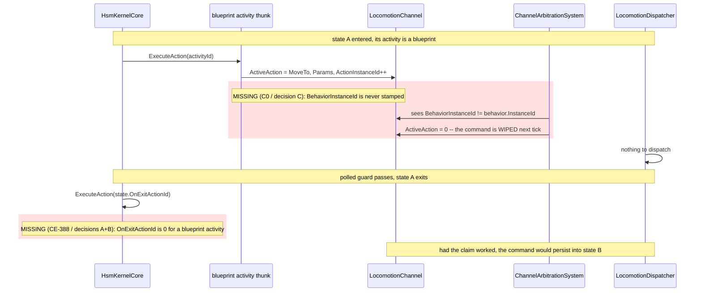
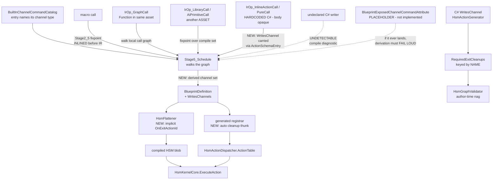

<!--STATUS
state: LIVE
updated: 2026-09-28
build-state: BUILT except one open user decision. Section 4 APPROVED by the user 2026-09-28
  ("approved, go ahead and build it, including retrofitting"). BUILT: D-C as CE-402 and D-A2's
  retrofit as CE-403 (2c320079c); D-A2's derivation as CE-388 slice 1 (c69405a0d); D-F, D-B1 and
  D-D1 (6dcde3542). WITHDRAWN: D-E - rail 5 MEASURED 2026-09-28 and its premise is false, see 9.6.
  RESOLVED 2026-09-28 by the user ("ok, (C)"): the VALIDATOR question - kept and RE-AIMED as
  CE-406, neither wired into production nor deleted, see 9.8. STILL OPEN: CE-405 only (found
  while measuring rail 5, see 9.7). Section 9 is the AS-BUILT and carries every deviation.
current-answer: section 4 is the five decisions, each with a lean. Read section 0 FIRST - it
  carries a defect found while writing this question (C0: a blueprint channel command is WIPED
  by ChannelArbitrationSystem on the next tick) which reframes CE-388 from "exit cleanup" to
  "the whole channel lifecycle, and the CLAIM half is missing too". Then read D-A, whose lean was
  CORRECTED by the user on 2026-09-28 - it opens with the reachability table that decides it.
  Section 1 is the INVENTORY, section 3 the diagrams, section 5 the blast radius, section 6 the
  acceptance rails - ALL SIX NOW CLOSED. SECTION 9 IS THE AS-BUILT - read it before quoting
  section 4 as a plan, because FOUR of its decisions were amended by measurement during the build,
  and D-E was withdrawn outright (9.6). 9.7 carries CE-405.
stale-below: nothing.
known-rot: nothing outstanding; two corrections are recorded IN PLACE and must not be re-inherited.
  (1) The CE-388 tracker row says "the .bp.json declares its channels" - D-A does not hand-declare.
  (2) 2026-09-28, USER CORRECTION: this document's FIRST draft of D-A leaned on pure derivation
  (D-A1) after measuring exactly ONE producer. A graph can also reach a channel through a macro,
  a Function graph, another asset, and HARDCODED C# - six IrOp kinds, and the compiler can only
  see the body of some. D-A1 is kept as a REJECTED arm; the lean is now D-A2 (derive what is
  derivable, READ the existing [WritesChannel] declaration on the callee for what is not). Do not
  quote D-A1. (3) Same day, second user input: the hardcoded-C# case is resolved by marking those
  methods with [WritesChannel], and measuring showed the READER already exists -
  RoslynClrSignatureResolver holds the IMethodSymbol, so the PureCall surface needs nothing new.
  An earlier line costing D-A2 as "a new ActionSchemaEntry member" is narrowed to the
  InlineActionCall surface only, and is marked NOT YET MEASURED.
known-conflict: nothing.
related-designs:
  - DESIGN_Hsm_Blueprint_Behaviour_Authoring.md - OWNS CE-388 (its section 8, item G5) and the
    whole HSM-hosts-a-blueprint programme. This question resolves the one item that design left
    unspecified. It does NOT own the channel components or the arbitration system.
  - ../designs/brain-death/BD1-DESIGN.md - section 1.1 OWNS the ChannelArbitrationSystem OnExit
    guarantee and the "zero ActiveAction, INCREMENT ActionInstanceId" idiom that every cleanup in
    this question reuses. It owns cleanup at BEHAVIOUR granularity; this question is about STATE
    granularity inside one running behaviour.
  - DESIGN_Occurrence_Scoped_Storage.md - owns the hosted-occurrence storage a blueprint activity
    runs out of. It does NOT own actuator channels.
-->

# ⭐ `Q74` — **the channel lifecycle of a blueprint-hosted HSM activity** *(`CE-388`, and a defect it uncovered)*

> 🔒 **User, `2026-09-28`:** *"i want some clean and flexible solution where the most common use
> case is a default so the user does not need to author unless he needs something extra."*

---

## 0. 🔴 THE PROBLEM IN THREE MEASUREMENTS — **and the third one is new**

A channel (`LocomotionChannel`, `WeaponChannel`, `InteractionChannel`) is a **standing order**: an
actuator keeps executing `ActiveAction` until something changes it. So a channel has a **lifecycle**
with two halves — **CLAIM** it on entry, **RELEASE** it on exit. Both halves are currently missing
on the blueprint route, and only one of them was filed.

| # | measurement | consequence |
|---|---|---|
| **①** | ⭐ For a C# `[HsmAction]` with `[WritesChannel]`, `HsmActionGenerator.cs:503` **auto-emits** `ExitCleanup_<Name>` — `ActiveAction = 0; ActionInstanceId++` — and registers it under `HsmActionKey.ForExitCleanup(name)` | ⚠ the cleanup BODY is already automatic; only the **binding** is manual |
| **②** | ⛔ `RequiredExitCleanups` maps **action NAME → cleanup NAME**, and `HsmGraphValidator.ValidateChannelSafety:84` then demands the author bind that name as the state's `OnExitAction`. A blueprint activity has **no name** — only a baked `ushort` (`HsmEmitCore.cs:721`) | ⇒ **the validator is BLIND**, nothing is generated, and the author is never told. The state exits and the entity keeps driving |
| **③** | 🔴🔴 **NEW, found while writing this question.** `ChannelCommandLowering.Emit:21` writes `ActiveAction`, the params and `ActionInstanceId++` — but **never sets `BehaviorInstanceId`**. `ChannelArbitrationSystem.cs:44` clears any channel where `ActiveAction != 0 && channel.BehaviorInstanceId != behavior.InstanceId` | ⇒ ⛔⛔ **a blueprint-issued channel command is WIPED on the next tick.** Measured: **every** production channel writer is a hand-written C# node that stamps `channel.BehaviorInstanceId = behavior.InstanceId` explicitly — `CgfNodes.cs:297,345,381,458,570`, `HillAttackTankNodes.cs:271,408,470`, `EqsCombatNodes.cs:91`, `HsmChannelRegionNodes.cs:50,63`. **The blueprint lowering is the only channel writer that does not** |

### ⭐⭐⭐ WHY ③ REFRAMES THE WHOLE ITEM

⛔ **`CE-388` was filed as "exit cleanup".** ⭐⭐ Measurement ③ says the **entry** half is broken
too, and it is **not HSM-specific** — it bites a BTree-hosted blueprint identically. ⇒ 🔒 **building
`CE-388`'s release half without ③'s claim half produces a demo where the entity never moves at all,
and the missing cleanup is invisible because there was never a command to clean up.**

⚠ **This also invalidates one line of the `CE-388` tracker row**, which says *"the `.bp.json`
declares its channels"*. ⭐ `D-A`'s lean is that **nothing is declared** — the compiler already knows.

### ⚠ WHAT IS *NOT* BROKEN — said plainly, so the scope stays honest

⭐ **Cleanup at BEHAVIOUR granularity already works and is automatic.** `ChannelArbitrationSystem`
clears a stale channel the moment the *behaviour* is swapped, using exactly the idiom every cleanup
below reuses (📄 `brain-death/BD1-DESIGN.md` §1.1, which owns that guarantee). ⇒ this question is
only about **STATE granularity inside one running HSM**, which nothing covers.

---

## 1. ⭐⭐ INVENTORY *(`R-74`)*

⚠ **`check_index_coverage` was NOT run** — the `codebase-memory` MCP tools were disconnected for
this session and the CLI does not expose that tool. ⛔ Per the standing rule, **every count below is
therefore corroborated by grep, and none is presented as exhaustive.**

```
search_graph(name_pattern=".*ChannelKind.*|.*AiPrimitiveHosting.*")  -> 8
search_graph(name_pattern=".*ChannelCommand.*")                      -> 30
search_graph(name_pattern=".*ExitCleanup.*")                         -> 8
grep  "BehaviorInstanceId ="  (production, non-test)                 -> 17 sites, 11 of them AI nodes
```

| # | what exists today | where | note |
|---|---|---|---|
| ① | **`ChannelKind`** — `Locomotion`, `Weapon`, `Interaction` | `SharedAiAttributes.cs:93` | ⭐ three, closed set |
| ② | **The three channel components** | `ChannelComponents.cs:11,26,41` | each carries `ActiveAction`, `ActionInstanceId`, `BehaviorInstanceId`, `Params` |
| ③ | **`[WritesChannel(ChannelKind)]`**, `AllowMultiple` | `SharedAiAttributes.cs:79` | ⭐ the C# declaration. ⛔ has no blueprint counterpart |
| ④ | **`EmitExitCleanupThunk`** — generates the cleanup BODY | `HsmActionGenerator.cs:503` | ⭐⭐ **already automatic**; reuse it verbatim |
| ⑤ | **`RequiredExitCleanups`** — `IReadOnlyDictionary<string,string>` | `HsmActionGenerator.cs:554` | ⛔ **keyed by action NAME** ⇒ blind to a baked id |
| ⑥ | **`HsmGraphValidator.ValidateChannelSafety`** | `HsmGraphValidator.cs:84` | the author-time nag. ⛔ **there is no runtime wrapper on the HSM route** |
| ⑦ | **`BuiltInChannelCommandCatalog`** — `MoveTo`→Locomotion(1), `FollowRoute`→Locomotion(3), `AimAndFire`→Weapon(1), `OpenDoor`/`EjectPassengers`→Interaction, `DemoEnumAction`→Locomotion(99) | `BuiltInChannelCommandCatalog.cs:73-87` | ⭐⭐⭐ **THE KEY FACT: every entry already names its channel type.** This is what makes `D-A`'s derivation possible with no authoring |
| ⑧ | **`ChannelCommandLowering.Emit`** — the blueprint write site | `ChannelCommandLowering.cs:8-49` | 🔴 the defect in ③ lives here |
| ⑨ | **`ChannelArbitrationSystem`** | `ChannelArbitrationSystem.cs:44,62,80` | ⭐ behaviour-granularity cleanup, already automatic |
| ⑩ | **`AiPrimitiveHosting`** — where `HsmAction`/`HsmGuard` are declared | `BlueprintAsset.cs:154` | the existing per-asset declaration surface, if a hand-declared override is ever needed |
| ⑪a | **`ActionSchemaEntry(Fqn, DtoType, Hosting, Access, IsCondition, DtoFields, IsAiPrimitive)`** | `IActionSchemaExporter.cs:100` | 🔴 **NO channel member.** ⇒ `[WritesChannel]` on a C# node is invisible to the blueprint compiler. `D-A2` adds one, exactly as `CE-386` added the `HsmGuard`/`HsmActivity` hosting bits to this same surface |
| ⑪b | **`BehaviorActionEntry.ChannelTypeFqn`** | `IBehaviorActionCatalog.cs:73` | ⛔ its own doc: *"Non-null only for `ChannelCommand` entries"* ⇒ a `Hardcoded` C# action contributes **no** channel information |
| ⑪c | **`Stage2_5_ExpandMacros`** — compile-time fixpoint, removes the `MacroCallNode` | `MacroExpander.cs:16`, `BlueprintCompiler.cs:100` | ⭐⭐ **why macros are a NON-ISSUE for derivation:** they are gone before IR exists |
| ⑫ | **`BlueprintExposedChannelCommandAttribute`** | `BlueprintExposedChannelCommandAttribute.cs:1` | ⚠ **a PLACEHOLDER — "implemented in Slice 2", i.e. not implemented.** ⛔ A second source of channel commands is designed-but-absent; `D-A` must fail loud rather than derive an empty set if it ever lands |

⭐ **Nothing named "blueprint channel lifecycle" exists.** ⛔ The only channel declaration mechanism
is `[WritesChannel]`, which is a **C#-symbol** attribute and cannot reach a `.bp.json`.

---

## 2. ⛔ What this does NOT change

| | |
|---|---|
| ⛔ **the arbitration idiom** | `ActiveAction = 0` + `ActionInstanceId++`, never `= default`. 📄 `BD1-DESIGN.md` §1.1 explains why: resetting to `default` makes `ActionInstanceId == DispatchedInstanceId`, so the executor's `OnExit` never fires and the muscle drives forever |
| ⛔ **behaviour-granularity cleanup** | `ChannelArbitrationSystem` keeps doing its job untouched |
| ⛔ **the C# `[WritesChannel]` authoring surface** | `D-D` asks whether its *binding* becomes automatic; the attribute itself stays |
| ⛔ **`ChannelKind`'s membership** | three channels, closed set, not extended here |

---

## 3. ⭐ THE DIAGRAMS

### 3.1 The lifecycle, with both halves and where each is missing



*What the picture shows that the prose hid: the two defects are on **opposite sides of the same
lifecycle**, and they **mask each other** — with the claim broken there is no standing command, so
the missing release is invisible. Fixing only `CE-388` would look like it changed nothing.*

### 3.2 Who produces the channel set, and who consumes it



*What the picture shows that the prose hid: the C# route and the blueprint route reach the kernel
through **two entirely separate producers**, joining only at `HsmActionDispatcher`. `D-D` asks
whether they should share a binding policy; the diagram shows they currently share nothing.*

---

## 4. ⭐⭐⭐ THE DECISIONS — **each with a lean; nothing built until approved**

### `D-A` — where does the channel set come from?

> #### 🔴🔴 CORRECTED `2026-09-28` — **"just derive it" is UNSOUND, and the user caught it**
>
> 🔒 **User, verbatim:** *"can the compiler really know from blueprint what channels it drives? if it
> contains directly the channel control command, then yes, but it can call macros and functons and
> even hardcoded c#"*
>
> ⛔ **The first draft of this section leaned on `D-A1` — pure derivation — after measuring exactly
> ONE producer** (`IrOp_ChannelCommand` + the catalog). 📐 **Enumerated properly, a graph lowers to
> 50+ `IrOp_*` kinds and SIX of them can reach a channel.** The lean held for one of the six.
> ⭐ The corrected arms are below; ⚠ the old `D-A1` is kept as an arm so the record shows what was
> rejected and why.

📐 **The complete reachability table, measured** *(`IrOperation.cs`)*:

| what the graph can reach | can the compiler know the channels? |
|---|---|
| ⭐ `IrOp_ChannelCommand` — a direct channel-command node | ✅ **YES** — the catalog entry names the channel type (⑦) |
| ⭐⭐ **a MACRO** | ✅ **YES, and it is a NON-ISSUE.** 📐 `Stage2_5_ExpandMacros` is a **compile-time fixpoint pass that runs BEFORE IR** and *removes* the `MacroCallNode` from `host.Nodes` (`BlueprintCompiler.cs:100`, `MacroExpander.cs:16`) ⇒ by IR time a macro's channel commands are **ordinary inlined nodes in the host graph**. Nothing to do |
| ⭐ `IrOp_GraphCall` — a Function graph in the SAME asset | ✅ **YES** — the compiler holds its IR; walk the local call graph |
| ⚠ `IrOp_LibraryCall` · `IrOp_AiPrimitiveCall` · `IrOp_PeerCall` — another blueprint ASSET | ⚠ **ONLY with a fixpoint over the compile set.** ⛔ Unknown if the callee is not in this compile. *(`PeerCall` is additionally "designed-only and non-functional" per `DESIGN_Resolver_World_Reach.md` §8)* |
| 🔴 `IrOp_InlineActionCall(ActionFqn, …)` · `IrOp_PureCall(MethodFqn, …)` — **ARBITRARY HARDCODED C#** | ⛔⛔ **NO.** The compiler holds a **string FQN and nothing else**, and the netstandard2.0 generator host **does not load `Fdp.Toolkits`** (the same wall that makes `NodePinSchema` degrade, ⑦'s own comment). **This is the user's objection, and it is correct** |

⭐⭐⭐ **THE RESOLUTION: don't analyse the BODY — read the DECLARATION on the CALLEE.** 🔒 The
attribute already exists and is already applied by the people who write these nodes:
**`[WritesChannel(ChannelKind)]`** (③). ⛔ It is simply **never exported** anywhere the blueprint
compiler can see it — 📐 measured: `ActionSchemaEntry` (`IActionSchemaExporter.cs:100`) has **no
channel member at all**, and `BehaviorActionEntry.ChannelTypeFqn` is documented *"Non-null only for
`ChannelCommand` entries"* ⇒ for a `Hardcoded` C# action the catalog carries **nothing**.

| arm | reasoning |
|---|---|
| ⭐⭐⭐ **`D-A2` — DERIVE what is derivable + CARRY the declaration for what is not** *(**LEAN**)* | ① derive `IrOp_ChannelCommand` and `IrOp_GraphCall` (macros already gone); ② **export `[WritesChannel]` through `ActionSchemaEntry`** so `InlineActionCall`/`PureCall` resolve by FQN lookup; ③ fixpoint across `LibraryCall`/`AiPrimitiveCall` within the compile set. 🔒 **The blueprint author still declares NOTHING** — the one declaration lives on the C# node, where its author already writes it for the BTree/HSM route. ⭐⭐ **Exact precedent, one week old: `CE-386` carried the `hsmAction`/`hsmGuard` flags through this same `ActionHosting` surface** because they were collapsed and invisible — same file, same shape, known cost |
| ⛔ **`D-A1` — derive ONLY** *(the rejected first draft)* | ⛔ silently returns an incomplete set the moment a graph calls hardcoded C#, which is the most likely thing a "do something visible" activity does |
| ⛔ `D-A3` — hand-declare on the `.bp.json` | duplicates what ① and ③ already know, and goes stale when the graph changes. ⭐ Survives only as the **escape hatch** under `D-A2`'s unknown case |
| ⚠ **`D-A4` — no declaration at all: RUNTIME ATTRIBUTION** | snapshot each channel's `ActionInstanceId` on state entry; on exit release those this state bumped. ⭐ **Needs nothing from anyone and is immune to every escape hatch above** — genuinely the most "it just works" arm. ⛔ Costs per-state storage in the occupancy slot, and ⚠ **it does not solve the ORTHOGONAL-REGION attribution problem** (region 1 writes Locomotion, region 0 exits and sees it changed since its entry) — though neither does the existing C# `ExitCleanup_` thunk, which zeroes unconditionally. ⭐ **Worth costing properly if `D-A2`'s unknown case turns out to be common** |

#### ⭐⭐⭐ `D-A2` IS CHEAPER THAN FIRST WRITTEN — **the compiler can already read the callee's attributes** *(user, `2026-09-28`)*

> 🔒 **User:** *"hardcoded c# can be marked with the existing attribute, whoch would resolve that, no?"*

✅ **Yes.** 📐 And measuring it shows the plumbing is already in place, on **both** C# surfaces:

| the C# surface | what the target IS | can `[WritesChannel]` be read? |
|---|---|---|
| ⭐ **`IrOp_InlineActionCall`** *(`Stage5_Schedule.cs:711`)* | 📐 its own comment: *"`[SharedAiAction]` methods are direct static method FQNs"* ⇒ the targets are the **`[SharedAiAction]`/`[BTreeAction]`/`[HsmAction]` family** | ✅ **trivially — `[WritesChannel]` is from the SAME attribute family** (`Fbt.Kernel.SharedAiAttributes.cs`) and was designed to sit beside them. Marking them is what it is FOR |
| ⭐⭐ **`IrOp_PureCall`** *(`Stage5_Schedule.cs:1762,1781`, from `FunctionCallNode`)* | 📐 `IClrSignatureResolver`'s own header: *"the signature of a `FunctionCall` target method (**a curated C# helper**)"* | ✅ **and the READER ALREADY EXISTS.** `RoslynClrSignatureResolver` *(in the generator project)* resolves these through the **Roslyn semantic model** — `GetTypeByMetadataName` → `IMethodSymbol` — so `GetAttributes()` is right there. ⭐ The in-process host resolves by **reflection**, which reads attributes just as well |

⭐⭐ **The check is one line and already written elsewhere:** `HsmActionGenerator.cs:129` does exactly
`a.AttributeClass?.ToDisplayString() == "Fbt.Kernel.WritesChannelAttribute"`. ⇒ 🔒 **no new
mechanism, no reflection where there was none, no assembly the host cannot load.**

⭐ **And the unknown case plugs into an existing seam:** `IClrSignatureResolver.TryResolve` **already
returns `false`** when the type or method cannot be found, with a defined fallback. `D-A2`'s
fail-loud is a new arm on a branch that exists.

⚠ **What this revises:** the sequencing step *"export `[WritesChannel]` through `ActionSchemaEntry`"*
may be needed **only for the `InlineActionCall` surface**, and only if `Stage5` holds the catalog FQN
rather than a symbol at that point. ⛔ **Not yet measured** — size it before building; the
`PureCall` surface needs nothing new.

⚠⚠ **What it does NOT fix, and this is the residual risk:** an **undeclared** C# writer is still
undetectable — the attribute is opt-in and always will be. ⭐⭐ **But the difference matters: the
compiler KNOWS it is calling C#**, so it can *demand* the declaration rather than silently assume an
empty set. ⇒ 🔒 **that is what moves `D-A2` from "unsound" to "sound, given a required
declaration"** — and it is why the unknown case below must be an error, not a default.

#### 🔴🔴 MEASURED WHILE WRITING `D-A2` — **`[WritesChannel]` HAS ZERO PRODUCTION ADOPTION**

📐 **Repo-wide, attribute APPLICATIONS of `[WritesChannel(...)]`: TWO — and both are inside
`Fbt.Tests/Unit/SharedAiAttributeTests.cs:98-99`, a unit test of the attribute itself.**
⛔⛔ **Production applications: ZERO.** Meanwhile **four** production node files write channels —
`CgfNodes.cs` (6 sites), `EqsCombatNodes.cs` (2), `HsmChannelRegionNodes.cs` (2),
`HillAttackTankNodes.cs` (12) — **and not one declares it.**

⇒ 🔒 **The whole `[WritesChannel]` → `RequiredExitCleanups` → `ValidateChannelSafety` chain is
BUILT, GENERATED, VALIDATED — and INERT.**

> #### 🔴🔴🔴 IT HAS **THREE** INDEPENDENT BREAKS — measured `2026-09-28` by APPLYING the retrofit
>
> ⭐ After marking the two `[HsmAction]` writers, `RequiredExitCleanups` is **non-empty for the first
> time in this repo's history** and the `ExitCleanup_*` thunks are emitted and registered — **and
> nothing about the build changes.** Chasing why found two more breaks:
>
> | # | the break | evidence |
> |---|---|---|
> | **①** | **zero adoption** | 2 applications repo-wide, both in a unit test OF the attribute *(now fixed for the 2 HSM writers)* |
> | **②** | ⛔⛔ **`ValidateChannelSafety` has NO production caller** | its only callers are its own unit tests. The two real `HsmGraphValidator.Validate` sites are FastHSM's **demo and example apps** *(`Fhsm.Demo.Visual/MachineDefinitions.cs:156`, `Fhsm.Examples.Console/TrafficLightExample.cs:103`)*, and both use the **1-arg overload that does no channel safety** |
> | **③** | ⛔⛔ **key-shape mismatch** | the dictionary is keyed on the **SHORT method name** (`HsmActionGenerator.cs:565` emits `m.Name` ⇒ `"Activity_DriveChannel"`), the asset holds the **FQN** (`"Hrot.AI.Behaviors.Brains.HsmChannelRegionNodes.Activity_DriveChannel"`) ⇒ `ContainsKey(state.ActivityAction)` misses even with ② fixed |
>
| ⭐⭐⭐ what this does to the decisions | |
|---|---|
| **`D-B1` is not the nicer half of the answer — it is the WHOLE of it** | ⛔ there is no validator to fall back on, and repairing the nag chain means fixing ② AND ③ for a mechanism that only warns. ⭐ The flattener binding an id is the only path that actually makes cleanup HAPPEN |
| ⚠ **`D-D1` must be restated** | it says *"the validator then fires only on a conflict"* — ⛔ **there is no validator firing.** `D-D1` reduces to *"auto-bind for the C# route too"*; whether to wire the validator up at all is a separate, smaller question |
| ⭐ **③ tells `D-B1` what to key on** | the generator registers the cleanup under `HsmActionKey.ForExitCleanup(m.Name)` — the **SHORT** name. ⛔ A flattener that derives it from the FQN will silently bind a non-existent id. **Rail this coupling explicitly** |

⭐ It is the *"a capability that looks built and does nothing"* shape this repo keeps filing, in its
purest form — three times over.

| ⚠ what this does to the decisions | |
|---|---|
| ⛔ **`D-A2`'s fail-loud case is not rare — on day one it is the NORM** | every existing channel-writing node is undeclared ⇒ the first activity blueprint that calls one gets the diagnostic |
| 🔴 **but the retrofit is TWO sites, not ~22 — CORRECTED ON MEASUREMENT `2026-09-28`, before applying** | 📐 **①** `BehaviorActionCatalog.MapHosting:196` maps **only `ActionHosting.Shared`** to `BehaviorActionHosts.Blueprint` ⇒ a plain `[BTreeAction]`/`[HsmAction]` is **not blueprint-callable**, so `D-A2` never needs to read it — and **zero** `[SharedAiAction]` in the repo writes a channel. **②** ⛔⛔ **the BTree route already has its own cleanup mechanism, `[BTreeDeactivator("<target>@<offset>")]`** *(`ai-btree-deactivator-1`; `HillAttackTankNodes` already uses it)* ⇒ marking the ~9 `[BTreeAction]` writers would be a **second producer for one slot**, the `R-132` violation this repo keeps filing. ✅ **Applied to the 2 `[HsmAction]` writers only** — which is exactly what `ValidateChannelSafety` governs, and they did leak. ⚠ *"~22"* was a count of channel WRITES, not of sites this mechanism governs |
| ⚠ **`D-A4` (runtime attribution) gained weight, then LOST it again** | ⭐ zero adoption made it attractive — ⛔ but once ① showed the blueprint-callable C# surface has **no channel writers at all**, the declaration burden `D-A4` avoids is **currently empty**. ⇒ `D-A2` stands |
| ⭐ **this deserves its own id whichever arm wins** | an inert validation chain is worth a row on its own — it will otherwise be "fixed" again by someone who assumes it works |

⇒ ⭐⭐ **The lean SURVIVES and its cost came DOWN, not up.** 📐 Measured before applying: the
blueprint-callable C# surface (`ActionHosting.Shared` only) contains **no channel writers at all**,
so `D-A2`'s declaration burden today is **zero**, and the retrofit that is genuinely owed is the
**two `[HsmAction]` writers** the HSM validator governs. ⛔ *"Retrofit ~22 attribute applications"*
was wrong — it counted channel WRITES, not sites this mechanism governs, and ~9 of them belong to
`[BTreeDeactivator]`, a different and already-working producer.

#### 🔴 `D-A2`'s UNKNOWN CASE — **a sub-decision, and the tempting answer is dangerous**

⛔ A C# node with **no** `[WritesChannel]` that writes a channel anyway is **undetectable, full
stop** — exactly as it is today on the BTree/HSM C# route. ⚠ Not a regression, but it must be said,
and 📐 **it is live right now**: `Activity_DriveChannel`/`Activity_FireChannel` write channels and
carry no attribute (see `D-D`'s blast radius).

| what to do when the set cannot be determined | |
|---|---|
| ⭐⭐ **fail loud — a compile diagnostic naming the node** *(**LEAN**)* | the author adds `[WritesChannel]` to their node, or the explicit `D-A3` list to the asset. ⭐ One-time, local, and it makes the gap **visible** rather than silent |
| ⛔⛔ **assume it writes ALL THREE channels** | ⚠ **looks like the safe default and is not:** an over-clean on exit **wipes a channel a PARALLEL REGION is currently driving**. ⛔ Turns a missing cleanup into a cross-region defect |
| ⛔ assume NONE | today's behaviour, and the disease being treated |

### `D-B` — who binds the cleanup?

| arm | reasoning |
|---|---|
| ⭐⭐⭐ **`D-B1` — the FLATTENER auto-binds it when the state has no `OnExit`** *(**LEAN**)* | zero authoring, and it is a **fill-an-empty-slot** rule, so an author who binds their own cleanup still wins. ⭐ The cleanup body is already generated (④); only the wiring is new |
| ⛔ `D-B2` — validator errors, author binds by hand | today's C# behaviour. ⛔ **Exactly the authoring burden the user asked to remove** |
| ⛔ `D-B3` — a runtime wrapper in `HsmKernelCore` | would clean up channels the kernel knows nothing about, and puts an engine-generic concern in `Fhsm.Kernel`, which has no dependency on `Fdp.Toolkits` channel types |

### `D-C` — the missing CLAIM *(measurement ③ — file as `CE-402`, not part of `CE-388`)*

| arm | reasoning |
|---|---|
| ⭐⭐⭐ **`D-C1` — stamp `BehaviorInstanceId` in `ChannelCommandLowering.Emit`** *(**LEAN**)* | one line, at the single site that writes a channel from a blueprint, matching what all 11 hand-written nodes already do. ⚠ needs `BehaviorState` on the entity — guard it the way the existing `HasComponent` guard already guards the channel itself |
| ⛔ `D-C2` — stamp centrally after the tick | a post-pass would have to know **which** channels this blueprint touched, which is `D-A`'s output — so it is `D-A` plus an extra system, for nothing |
| ⛔ `D-C3` — make arbitration treat `BehaviorInstanceId == 0` as "unclaimed" | ⛔⛔ **silently disables arbitration for every entity whose `behavior.InstanceId` is 0**, and turns a missing claim into a permanent standing order. This is the arm that looks cheapest and is worst |

🔒 **`D-C` is NOT HSM-specific and should not be gated behind `CE-388`** — it breaks a BTree-hosted
blueprint channel command identically. ⭐ It is the one item here that is a plain defect fix rather
than a design choice, and it is what unblocks the live editor check.

### `D-D` — does the same default apply to the C# route?

| arm | reasoning |
|---|---|
| ⭐⭐ **`D-D1` — YES: auto-bind there too; the validator then fires only on a CONFLICT** *(**LEAN**, with a caveat)* | ⭐ one policy, one mental model: *"a channel-writing activity releases its channel on exit unless you say otherwise."* ⛔ Today forgetting the bind is a hard error you must go fix by hand — the same burden, in the older half of the system |
| ⚠ `D-D2` — NO: leave C# as it is | ⛔ two policies for one concept, which `R-132` exists to prevent. ⭐ But it is the **zero-risk** arm |

⚠⚠ **The caveat, stated plainly: `D-D1` changes a SHIPPED contract.** An asset that today fails
validation would start compiling, with an auto-bound `OnExit` it did not ask for. ⇒ ⭐ **I recommend
`D-D1` but as a SEPARATE, second commit**, so it can be reverted without touching the blueprint work.

📐 **Blast radius, measured — and the measurement found a live instance of the defect.** Enumerating
every action bound by every shipped `.hsm.json` gives **three**: `Activity_DriveChannel`,
`Activity_FireChannel` (`HsmChannelRegionNodes.cs:42,55`) and `CgfHsmNodes.StubIdle`. ⛔ **None
carries `[WritesChannel]`**, so `RequiredExitCleanups` is empty for all of them and no validation
fires today ⇒ **`D-D1` changes the outcome for zero existing assets.**

🔴 **But the first two DO write channels** — they were authored two commits ago for acceptance rail
⑥ (`CE-400`) and set `LocomotionChannel`/`WeaponChannel` directly. ⇒ ⭐⭐ **`HsmTwoChannelRegionsDemo`
leaks its channels on state exit right now, on the C# route, and nothing reports it** — because the
enforcement is opt-in through an attribute nobody applied. ⚠ **That is the strongest argument for
`D-D1`:** the existing mechanism did not fail loudly, it simply never engaged. ⛔ It is also a small
finding in its own right — whichever arm is chosen, those two thunks should gain `[WritesChannel]`.

### `D-E` — the opt-out shape · ⛔⛔ **WITHDRAWN `2026-09-28` — MEASURED AWAY, NOT DEFERRED**

> 🔴 **Rail ⑤ measured the premise and it is FALSE. See §9.6.** The arms below are kept so the record
> shows what was considered; ⛔ **none of them is to be built.**


| arm | reasoning |
|---|---|
| ⭐⭐ **`D-E1` — a per-STATE flag, `KeepChannelsOnExit`** *(**LEAN**)* | the deliberate hand-off case is per-state, not per-blueprint: state A → state B both driving, and you do not want the command dropped for a frame. ⭐ Mirrors `IsPolled`, so the editor surface and the DTO gating are a known pattern (`CE-385`) |
| ⛔ `D-E2` — a per-BLUEPRINT flag | wrong grain: the same activity blueprint may want release in one machine and hand-off in another |
| ⛔ `D-E3` — no opt-out | ⛔ forces a one-frame gap on every hand-off, which is a visible stutter on a driving vehicle |

⚠ **Whether the gap is real is MEASURABLE and should be measured before `D-E` is built:**
`CE382_R5` already proved the newly entered state's activity runs **in the same tick** as the
transition, so release-then-reclaim may cost nothing observable. ⭐ If the rail in §6 ⑤ shows no gap,
`D-E` can be **deferred entirely** — which would be the cleanest outcome.

---

## 5. ⚠ BLAST RADIUS — **what it costs if all five are approved**

| | |
|---|---|
| ⛔⛔ **golden churn** | an implicit `OnExitActionId` **changes the compiled HSM blob** for every affected asset, and `StructureHash` covers state flags ⇒ expect movement in the HSM corpus AND the blueprint corpus. ⚠ 📌 The `CE-399` lesson applies: **enumerate the snapshot ROOTS before regenerating**, not the files the diff points at |
| ⚠ **`BlueprintDefinition` gains a member** | `WritesChannels`. Every registrar emission moves — the same shape as `CE-399`'s `ParamsSize`, which was 34 files / 67 insertions |
| ⭐ **`D-C` alone is tiny** | one line in `ChannelCommandLowering`, plus a guard. ⛔ But it moves every golden containing a channel command |
| ⚠ **the flattener gains a rule** | `HsmFlattener` must consult the blueprint definition, which it does not do today. ⭐ It already consults the id resolver for `.ActivityId(n)`, so the seam exists |
| ⚠ **`ActionSchemaEntry` gains a member** *(`D-A2`)* | ⭐ cheap and precedented — `CE-386` added the `HsmGuard`/`HsmActivity` hosting bits to the same surface a week ago. ⛔ Every consumer of the record recompiles; it is a `record` with defaulted trailing members, so add the new one LAST |
| ⛔ **`Fhsm.Kernel` is untouched** | deliberately — `D-B3` was rejected partly to keep it that way. ⚠ `D-A4` *(runtime attribution)* would break this, which is part of its cost |

---

## 6. ✅ ACCEPTANCE — **every one red-proved**

| # | rail | the inverse edit |
|---|---|---|
| ① | a blueprint channel command **survives the next tick** *(`D-C`)* | remove the `BehaviorInstanceId` stamp ⇒ the channel is 0 one tick later |
| ② | an HSM state whose blueprint activity writes Locomotion gets a **non-zero `OnExitActionId`** with no authoring *(`D-A`+`D-B`)* | bind an explicit `OnExit` ⇒ it must be preserved, not overwritten |
| ③ | on exit, `ActiveAction == 0` **and `ActionInstanceId` INCREMENTED** *(never `= default`)* | set `= default` ⇒ red, per `BD1-DESIGN.md` §1.1 |
| ④ | a blueprint that commands **no** channel emits **byte-identical** output | ⭐ the no-churn gate `E3b-0` and `CE-397` both learned the hard way |
| ⑤ | ✅ **MEASURED `2026-09-28` — NO GAP.** release-on-exit then claim-on-entry in the **same tick** leaves nothing observable. `CE404_R5a`/`R5b` in `LocomotionDispatcherTests.cs`; **⇒ `D-E` WITHDRAWN**. See §9.6 | ⭐ **`R5b` IS the inverse edit**: run the dispatcher BETWEEN the release and the claim ⇒ one frame with no executor at all |
| ⑥ | derivation **fails loud** on a construct it cannot see | add an opaque node ⇒ a diagnostic, ⛔ never an empty set |

---

## 7. ⚠ WHAT WOULD CHANGE THE LEANS

| if | then |
|---|---|
| rail ⑤ shows a **visible** one-frame gap | `D-E1` becomes necessary rather than optional |
| ⑫ `BlueprintExposedChannelCommandAttribute` is implemented | `D-A1`'s derivation must cover it, or its mandatory fail-loud clause fires on every asset using it |
| a real case wants **different** exit behaviour per channel on one state | `D-E1`'s boolean is too coarse ⇒ a channel mask, not a flag |
| ⭐ the `D-A2` unknown case turns out to be **common** — many activity blueprints call undeclared hardcoded C# | ⇒ **`D-A4` (runtime attribution) becomes the better arm**, because it needs no declaration from anyone. ⚠ Cost it against the orthogonal-region attribution problem before switching |
| ~~a survey shows most channel-writing C# nodes already carry `[WritesChannel]`~~ | 📐 **MEASURED `2026-09-28`, and the answer is the opposite: ZERO production applications.** See the subsection under `D-A2`. ⇒ the fail-loud case is the norm on day one, and `D-A2` costs a ~22-site retrofit |
| the user wants zero risk to the existing C# route | take `D-D2`; everything else is unaffected |

---

## 8. ⭐ SEQUENCING

| order | what | why here |
|---|---|---|
| **1** | ⭐⭐⭐ **`D-C` as `CE-402`** | it is a plain defect, not HSM-specific, and **nothing visible works until it lands** |
| **1a** | ⭐⭐ **make `[WritesChannel]` readable on both C# call surfaces** *(part of `D-A2`)* | ⭐ **the `PureCall` surface needs NOTHING NEW** — `RoslynClrSignatureResolver` already holds the `IMethodSymbol`. ⚠ The `InlineActionCall` surface may need the attribute carried through `ActionSchemaEntry` (mirroring `CE-386`) **if** `Stage5` holds only the catalog FQN there — ⛔ **measure that first**; it is the only unknown left in `D-A2`'s cost |
| **2** | `D-A` + `D-B` as `CE-388` | the release half, once there is something to release |
| **3** | rail ⑤ | measure the gap before deciding `D-E` |
| **4** | `D-E`, only if ⑤ says so | |
| **5** | `D-D1` as its own commit | separable, revertible, and it touches a shipped contract |

⚠ **Not relayed to the NotebookLM architect.** Per the standing rule the relay is one input and the
user has the last word; this question is for the user. ⛔ If it is ever relayed, ask for **evidence**
(*"name every producer that writes a channel and what stamps `BehaviorInstanceId`"*), never a verdict,
and say that this document is my own reasoning and must not be cited as evidence.

---

## 9. ⭐⭐⭐ THE AS-BUILT — **what landed, and every place measurement amended §4**

🔒 **User, `2026-09-28`:** *"approved, go ahead and build it, including retrofitting"* — then, on the
sharing mechanism: *"no duplicating the HsmActionKey formula, must be shared. (A) sounds good, no
problem with making it public."*

⚠⚠ **Read this section before quoting §4 as a plan.** Three decisions were amended by measurement
DURING the build; §4 keeps the original arms so the record shows what was rejected and why, but
where the two disagree, **§9 wins**.

### 9.1 ✅ BUILT

| decision | id | what landed | commit |
|---|---|---|---|
| **`D-C1`** | **`CE-402`** | `ChannelCommandLowering.Emit` claims the channel — `BehaviorInstanceId = BehaviorState.InstanceId`, guarded exactly as the channel itself is. ⭐ Before it, EVERY blueprint-issued channel command was zeroed by arbitration on the next tick | `2c320079c` |
| **`D-A2`** *(retrofit half)* | **`CE-403`** | `[WritesChannel]` on the two `[HsmAction]` channel writers. `RequiredExitCleanups` is non-empty **for the first time in this repo's history** | `2c320079c` |
| **`D-A2`** *(derivation half)* | **`CE-388` slice 1** | `BlueprintChannelDerivation` — exact for `IrOp_ChannelCommand` + `IrOp_GraphCall` reachability, **incomplete-with-names** for hardcoded C# and cross-asset calls | *this batch* |

⭐ **Rails:** `CE402_R1/R2` · `CE403_R1/R2` · `CE388_R1`–`R7` *(9 cases)*. ✅ Every one red-proved.

### 9.2 🔴 AMENDMENT ① — **the retrofit was 2 sites, not ~22**

📐 `BehaviorActionCatalog.MapHosting:196` maps **only `ActionHosting.Shared`** to
`BehaviorActionHosts.Blueprint` ⇒ a plain `[BTreeAction]`/`[HsmAction]` is **not blueprint-callable**,
so `D-A2`'s derivation never reads it — and **no `[SharedAiAction]` in the repo writes a channel**.
⛔⛔ And the BTree route **already has its own cleanup mechanism**, `[BTreeDeactivator]`
*(`ai-btree-deactivator-1`)*, which `HillAttackTankNodes` uses ⇒ marking the ~9 `[BTreeAction]`
writers would be **a second producer for one slot** (`R-132`). ⚠ *"~22"* counted channel WRITES, not
sites this mechanism governs.

### 9.3 🔴 AMENDMENT ② — **the chain had THREE breaks, and `D-B1` absorbed the consequence**

📄 Full evidence in §4's zero-adoption subsection. ⇒ **`D-B1` is the WHOLE answer, not the nicer
half** — there is no validator to fall back on — and **`D-D1` must be restated**: *"the validator then
fires only on a conflict"* presumes a validator that runs, and none does.

### 9.4 🔴 AMENDMENT ③ — **`D-F`, the SHARING MECHANISM: approved as public, BUILT as a linked file**

⚠ **A decision `§4` never posed, and `CE-403`'s break ③ is why it matters:** the blueprint registrar
and `HsmEmitCore` must agree on **one `ushort`** for the cleanup thunk, or the flattener binds a hash
nothing is registered under — silently.

🔒 **The user ruled: one shared formula, no copies, and public is acceptable.** ⭐ The first half is
delivered. ⛔ **The second is NOT, and the reason is measured, not stylistic:**

| project | target |
|---|---|
| `Fdp.Toolkits` — where a shared type would live | **net8.0** |
| `Hrot.AiEditor.Persistence` — `HsmEmitCore` | ⛔ **netstandard2.0 ONLY** |
| `Hrot.Blueprints.Compiler` | netstandard2.0**;**net8.0 |
| `Fdp.Toolkits.Analyzers` — `HsmActionKey`'s current home | ⛔ **netstandard2.0** |

⇒ ⛔⛔ **all three consumers are behind the netstandard wall, so a `public` type in a net8.0 assembly
is UNREACHABLE from every one of them** — public or not, they cannot reference it. ⚠ And making it
public *while linking the file* is actively worse: four assemblies would each declare the same public
type, so anything referencing two of them — `Hrot.AiEditor.Generators.Tests` references both the
compiler and persistence — gets **`CS0433` ambiguity**. 🔒 **That is exactly why `OccurrenceSlotKey`
is `internal`.**

⭐⭐ **BUILT AS:** `HsmActionKey.cs` moves to `FDP/Toolkits/Fdp.Toolkits/Behavior/Shared/`, stays
`internal`, and is `<Compile Link=…>`-ed into the analyzer, the Blueprints compiler and
`Hrot.AiEditor.Persistence`. **One source file, compiled into each assembly** — the repo's own
four-for-four pattern for this wall: `OccurrenceSlotKey`, `BlueprintTierLadder`,
`StructSizeResolver`, `BlackboardParamsExpression`.

⭐ **Gated by a PARITY RAIL** mirroring `OccurrenceSlotKeyParityTests`: the id computed on each side
of the wall must agree. ⛔ Without it this is the same trust-by-convention that produced break ③.

⚠ **The rejected alternative, named so it is not re-proposed:** a new netstandard2.0 shared assembly
all four reference would give a genuinely public single type. ⭐ Cleaner in principle; ⛔ a new
project plus four reference edits, against a linked-file precedent that is already four-for-four.

### 9.5 ⏭ STILL OPEN

| | |
|---|---|
| ⭐ **`CE-405`** | the blueprint lowering bumps `ActionInstanceId` unconditionally where every C# writer guards it — found while measuring rail ⑤. See §9.7 |
| ⭐⭐ **the EDITOR END-TO-END CHECK** | §8.4 of the resume doc. ⛔ needs the WINDOWS session |

⭐ **Closed since this section was written:** `D-B1` and `D-D1` both BUILT (`6dcde3542`); `D-F` BUILT as a
linked file (§9.4); `D-E` **WITHDRAWN** (§9.6); the **VALIDATOR question RESOLVED** by the user as
`CE-406` — kept and re-aimed, neither wired into production nor deleted (§9.8).

### 9.6 🔴 AMENDMENT ④ — **`D-E` is DELETED, and the measurement says why**

📐 **What rail ⑤ measured.** `D-E`'s premise was that release-then-reclaim *"drops the command for a
frame — a visible stutter on a driving vehicle."* ⛔ **It does not, and the reason is frame ordering,
not luck:**

| the claim | measured |
|---|---|
| the dispatcher is the ONLY observer of a channel | ✅ `LocomotionDispatcherSystem.cs:62,88` — it alone reads `ActionInstanceId`/`ActiveAction` and drives the executor |
| it runs ONCE per frame, AFTER the brain | ✅ **`CgfLogicPack.cs:193-194`** — the pack appends `_cognitiveRuntimeModule.SimulationSystems` to the Simulation list and THEN `_actionDispatchModule.SimulationSystems`, and module-group order **is** array position *(its own comment at `:206`)*. ⭐ Corroborated for the blueprint route by `BlueprintTickSystem.cs:17` `[UpdateBefore(typeof(LocomotionDispatcherSystem))]` |
| the new state's activity runs in the SAME tick as the transition | ✅ `CE382_R5` *(`PolledTransitionKernelTests.cs:208`)* |

⇒ 🔒 **the `ActiveAction == 0` written by the `ExitCleanup_*` thunk lives between two statements of one
brain tick and is overwritten before anything reads it.**

✅ **`CE404_R5a`** applies the two production idioms verbatim inside one tick and asserts a clean
hand-off with the muscle driven on the hand-off frame itself. ⭐⭐ **`CE404_R5b` is the red-proof and it
is the interesting half**: the same two writes with the dispatcher run BETWEEN them produce exactly one
frame on which **no executor runs at all**. ⇒ the gap `D-E` feared is real — and the schedule, not an
opt-out flag, is what prevents it.

⛔⛔ **So `D-E` is WITHDRAWN rather than deferred.** A `KeepChannelsOnExit` flag would add an authoring
surface, an editor field and a DTO bit to prevent something that cannot happen.

### 9.7 ⚠ FOUND WHILE MEASURING RAIL ⑤ — **`CE-405`, the unconditional `ActionInstanceId++`**

📐 **The asymmetry.** `ChannelCommandLowering.cs:68` emits `__ch.ActionInstanceId++` with **no
condition**. ⛔ Every production C# channel writer guards it instead — `CgfNodes.cs:305,313` /
`348-351` / `384-387` / `580-582` compute
`bool needsActivation = channel.ActiveAction != <id> || channel.Status == NodeStatus.Failure`.

⇒ 🔴 `LocomotionDispatcherSystem.cs:62` reads any change in `ActionInstanceId` as *"a new action was
dispatched"* and calls `OnExit(previous)` + `OnEnter(current)`. For `MoveTo`, `OnEnter` re-plans the
path. **A blueprint issuing a channel command on a per-tick path re-plans every frame.**

⚠⚠ **Not exercised today, and the reason is incidental.** 📐 Measured over 6 frames against the one
shipped blueprint that issues a channel command, `HillAssault2ReverseToBaseline`: `ActionInstanceId`
stays at **1**, `OnEnter` fires **once** — because its generated `TickCore` gates the command behind
`ws.__phase` (`__block_entry` sets `ws.__phase = 1` and never re-enters). ⇒ **the graph's own wait
structure is doing the guarding the emitter does not.**

⭐⭐ **And §8.4's planned editor fixtures are exactly the unguarded shape** — an HSM activity blueprint
issuing `MoveTo` while in the state, with no wait to gate it.

⛔ **Filed, not fixed, deliberately.** Copying `needsActivation` verbatim would suppress the re-enter
when the ACTION is unchanged but the PARAMS changed — and `CgfNodes.cs:461-463` *(Wander)* re-enters
deliberately on a fresh destination. ⇒ **the open question is what counts as a NEW command** — action
id only · action id + params bytes · an explicit re-issue op — and it is a `Q74` decision, not a
mechanical edit.

### 9.8 ⭐⭐ THE VALIDATOR QUESTION — **RESOLVED: kept and RE-AIMED** *(`CE-406`)*

🔒 **User, `2026-09-28`,** choosing option **(C)** from three put to them *(delete · wire into the
editor · re-aim it)*: *"ok, (C)"*.

⛔⛔ **The question `CE-403` left open was *"wire it up or delete it?"* — and MEASURING IT REFRAMED THE
QUESTION BEFORE ANSWERING IT.** Both halves of that framing were wrong:

| the framing | ⛔ what measurement said |
|---|---|
| *"it has no production caller ⇒ it is dead"* | ✅ **as designed.** `docs/projects/FDP/Toolkits/Fdp.Toolkits.Analyzers.md` §7 item 7 specifies it as *"part of your **test suite**"*. ⇒ deleting it on "nothing calls it" is the `UNREFERENCED IS NOT UNINTENTIONAL` error, against a live doc |
| *"fix the key shape and it works"* | 🔴🔴 **it would become ACTIVELY WRONG.** `D-B1`/`D-D1` bake `.OnExitId(hash)` into `ExitActionId` and leave `OnExitAction == null`; the rule demanded `state.OnExitAction == required` ⇒ a key-repaired validator **red-flags `HsmTwoChannelRegionsDemo`, the asset the auto-bind fixed** |

⚠ **The rule was written (`BHU-014`) when binding the cleanup BY NAME was the only way to release a
channel. The auto-bind changed the world underneath it** — this is the `AN INVESTIGATION THAT LEARNS
SOMETHING MUST UPDATE THE OWNING DESIGN` shape, caught here rather than later.

### ✅ What landed — three edits in `HsmGraphValidator.cs`

| # | edit | ⭐ why |
|---|---|---|
| **a** | `if (state.ExitActionId != 0) continue;` | a baked exit id means **something** releases, whoever bound it. This is what makes the check compatible with the auto-bind |
| **b** | match on the **short member name** | ⭐ **not a loosening.** `HsmActionDispatcher` itself keys registrations on the short name (`HsmActionGenerator.cs:565` emits `m.Name`), so this makes the validator **agree with runtime**; a direct `ContainsKey(FQN)` silently missed every editor-authored state |
| **c** | the message re-aimed, and it now distinguishes two cases | ⛔ the old text *"Add `OnExitAction = X` to this state"* is now **wrong advice** — the emitter does it for you. The two cases are *nothing bound at all* and *an authored `OnExit` displaced the cleanup* |

⭐⭐ **What it can still catch — the reason it is kept rather than deleted:** the one hole the auto-bind
cannot fill, **a state that authors its OWN `OnExitAction`**. `HsmEmitCore` fills an empty slot and never
overwrites an authored name *(and it must stay at the emit site — `HsmFlattener:173` makes the baked id
win over the name)*, so such a state silently loses its cleanup and nothing else in the toolchain says
so. ⚠ 📐 **Measured: 28 `OnExitAction` entries across the six shipped `.hsm.json`, ALL 28 null** ⇒ a hole
with no occupants today.

✅ **Rails `CE406_R1`/`R2`/`R3`** in `HsmGraphValidatorChannelSafetyTests.cs` — the feature's own suite,
joining the six `BHU-014` tests, **all of which still pass unchanged**. ⭐ **Each red-proved by its own
inverse edit:** drop the `ExitActionId` guard ⇒ `R1` alone reddens *(1 failed / 8 passed)*; revert to the
raw-name `ContainsKey` ⇒ `R2`+`R3` redden *(2 failed / 7 passed)*.

⛔ **Deliberately NOT done: wiring it into production or into the editor.** It stays the test-suite
helper its own doc specifies.
