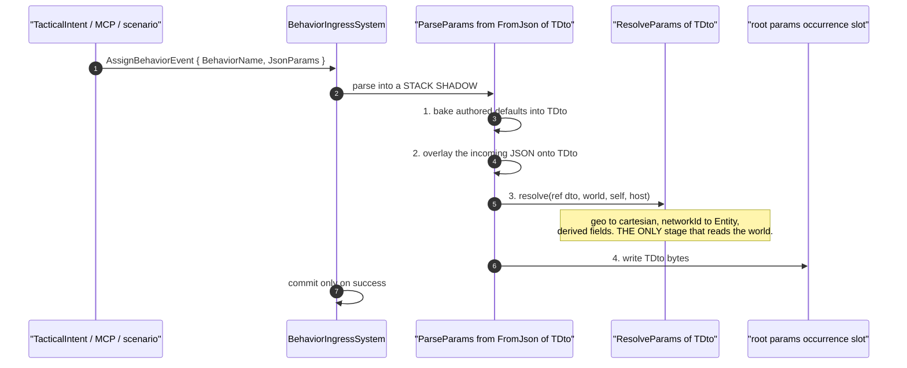
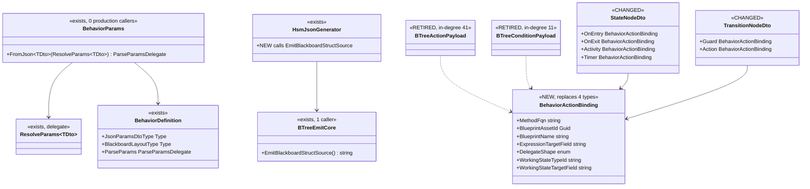
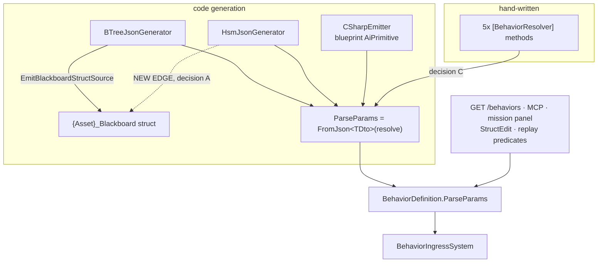

<!--STATUS
state: LIVE
updated: 2026-09-28
build-state: DESIGN
current-answer: §4 carries the four decisions, each with a lean. §5 is the sequenced plan.
  Nothing here is approved yet — the user approves per sub-question (ARCHITECT QUESTIONS rule).
stale-below: nothing yet.
known-rot: none.
known-conflict: none known. §2's inventory supersedes two claims Claude made in chat on 2026-09-28
  ("the curated path has a resolve stage" and "IsBlackboardEditorManaged is BTree-specific") —
  both were wrong and the measurements that refute them are in §2.
related-designs:
  - DESIGN_Parameter_Model.md — owns WHAT a parameter is and the bake/overlay/resolve ORDER. This
    document proposes making its §3.1 three-shape model TRUE on every path; G1 in its §6 is the
    gap being closed. It wins on any disagreement about the model itself.
  - DESIGN_Occurrence_Scoped_Storage.md — owns WHERE the bytes live and HOW an occurrence is
    addressed. §28.6c/§28.6d there are the as-built this document builds on; nothing here moves
    a byte.
  - Behavior_Parameter_Resolver_Detailed_Design.md — the 2026-07-13 design that FIRST specified
    the deserialize/resolve split as G1. This document is its delivery, 14 months late.
  - DESIGN_Hsm_Blueprint_Behaviour_Authoring.md — owns the HSM authoring surface; its §3.5 is the
    compose step, and decision B here changes the DTO that surface edits.
  - Variable_Model_Unification.md — owns the one-variable-model ruling this serves.
-->
# Architect Question 75 — ONE params pipeline, and ONE action binding

> 🔒 **User, `2026-09-28`:** *"at least the actions are same for btree and hsm, and conditions are very
> close to hsm guards i guess, so i would expect some similarity and unification opportunity here"* ·
> *"we need same mechanism like everywhere else — json params in the behavior intent, resolver that
> converts these into the HSM parameter/blackboard dto"* · *"unify it as much as possible, no matter
> the cost"*

⭐⭐⭐ **The cost constraint is lifted by ruling. What this document owes is therefore not a cheap
option — it is the RIGHT shape, sequenced so the tree is green at every step.**

---

## 1. ⭐⭐ THE TWO PROBLEMS, IN ONE SENTENCE EACH

| | |
|---|---|
| **P1 — the params pipeline** | Four producers fill `BehaviorDefinition.ParseParams`, **none of the generated ones has a resolve stage**, and the one type that expresses *"deserialize, then resolve"* as separable steps has **zero production callers** |
| **P2 — the action binding** | A BTree action/condition carries a 5-member payload object; an HSM state and transition carry the same information as **flat parallel strings with three of the five members missing** |

---

## 2. 🔴 INVENTORY — **measured `2026-09-28`, and it refutes two things Claude said in chat**

⭐ Queries run: `search_graph(name_pattern=".*(Payload|PayloadDto)$", label=Class)` ·
`trace_path(BehaviorParams.FromJson, inbound)` · `trace_path(IBlackboardManagedAsset.AddVariable,
inbound)` · greps for `ParseParams =`, `[BehaviorResolver]`, `RegisterResolver`,
`EmitBlackboardStructSource`, `HostedParamResolvers.Register`.

### 2.1 Who fills `BehaviorDefinition.ParseParams` — the COMPLETE set

| producer | shape | resolve stage? |
|---|---|---|
| hand-written `[BehaviorResolver]` *(5 in production: `FireAtTarget`, `FollowRoute`, `HullDownAttackRun`, `MoveToLocation`, `PlatoonHillAttack`)* | one method, **deserialize and resolve FUSED** | ◑ fused, not separable |
| `BTreeBridgeEmitCore:481` | emitted per-variable `switch` | ⛔ **none** |
| `HsmBridgeEmitCore:167` | emitted per-variable `switch` | ⛔ **none** |
| `CSharpEmitter:710` *(blueprint AiPrimitive as a ROOT behaviour)* | `{class}.ParseParams` | ⛔ **none** |
| ⛔ **a curated behaviour with NO `[BehaviorResolver]`** | **nothing at all** | `BehaviorIngressSystem:754` returns 0 ⇒ its JSON params are **silently dropped** |

🔴🔴 **`BehaviorParams.FromJson<TDto>(ResolveParams<TDto>? resolve)` — the ONE factory that expresses the
split — has `callers_total: 0` in production** *(exact; `ParameterSupplyRailsTests` only)*.
⇒ ⛔⛔ **`G1` is not "partly done". It is declared and entirely unadopted**, and Claude's chat claim
that *"the curated path has ✅ a resolve stage"* was wrong: the curated path has five methods that do
both at once, which is the thing `G1` exists to separate.

⭐ **Where a resolver IS adopted in production — and it is the OTHER seam:**
`CSharpEmitter:474` emits `HostedParamResolvers.Register<Params>` and `:395`
`BlueprintResolverEntry.For<TDto>`. Both are **per hosted occurrence** (`C1′`), not the root ingress.

### 2.2 The typed-schema surface

| behaviour kind | `JsonParamsDtoType` | `BlackboardLayoutType` |
|---|---|---|
| generated **BTree** | ✅ `{Asset}_Blackboard` | ✅ the same type |
| generated **HSM** | ⛔ **none** — falls back to the `ManagedBlackboardVariables` manifest | ⛔ **none** |
| **curated** | ⛔ not set *(deliberate, `R-132`)* | ✅ e.g. `CgfNodes.FireAtTargetParams` |

⭐⭐ **The emitter the HSM is missing ALREADY EXISTS:** `BTreeEmitCore.EmitBlackboardStructSource`,
**one production caller** *(`BTreeJsonGenerator:277`)*.

### 2.3 The action-binding surface

| | BTree | HSM |
|---|---|---|
| carrier | `BTreeActionPayload` *(in-degree **41**)* · `BTreeConditionPayload` *(**11**)*; DTO twins **24** / **7** | ⛔ **no carrier** — flat fields |
| `MethodFqn` | ✅ | ✅ ×4 on a state *(`OnEntry`/`OnExit`/`Activity`/`Timer`)*, ×2 on a transition *(`Guard`/`Action`)* |
| blueprint id + name | ✅ *(via the schema entry)* | ✅ but only for **Activity** and **Guard** |
| `ExpressionTargetField` | ✅ **per site** | ⚠ **ONE per state, shared by all four slots**; one per transition |
| `DelegateShape` | ✅ | ⛔ **absent** |
| `WorkingStateTypeId` | ✅ | ⛔ **absent** |
| `WorkingStateTargetField` | ✅ | ⛔ **absent** |

📐 **Total references to move if the carrier is unified: ~83** *(41+11+24+7)*, plus every HSM state and
transition field. ⇒ **the file format changes ⇒ a migrator is mandatory.**

### 2.4 ⚠ And the thing the inventory found that nobody asked about

⛔⛔ **`IsBlackboardEditorManaged` is NOT BTree-specific** — `HsmBridgeEmitCore.PackParams:464` gates the
HSM params path on the same flag and returns an **empty field list silently**, where
`BTreeJsonGenerator` raises `BTREE0002` and skips the asset loudly. ⭐ Already fixed in `54570bde0`
*(the flip moved into the shared compose)*, ⚠ **but the missing HSM DIAGNOSTIC is not** — filed as
part of `CE-416`.

---

## 3. ⭐⭐⭐ THE TARGET — **diagram first**

### 3.1 The pipeline, as it must become

*What the picture shows that the prose hid: steps 1–2 are pure and testable without a world, step 3 is
the only one that is not, and step 4 is the only one that writes. Today steps 1–2 and 4 are fused in
three emitted switches and step 3 does not exist at the root at all.*

### 3.2 The classes

### 3.3 Who produces what, per module — **and the edge that does not exist today**

*The dotted edge is the whole of decision A. Every solid edge exists today; the HSM simply never
reaches the struct emitter, which is why it has no typed schema and cannot use `FromJson<TDto>`.*

---

## 4. ⭐⭐⭐ THE DECISIONS — **four, each with a lean**

### A — does the HSM generator emit a blackboard struct? ⚖️ **LEAN: YES**

⭐ Call the existing `BTreeEmitCore.EmitBlackboardStructSource` from `HsmJsonGenerator`, exactly as
`BTreeJsonGenerator:277` does. ⇒ the HSM gains `JsonParamsDtoType` + `BlackboardLayoutType`, and
becomes visible to `GET /behaviors`, MCP, the mission panel, StructEdit and the replay predicate
compiler on the same footing as a BTree.
⛔ **Rejected — keep the manifest fallback as the only shape:** it is a second schema mechanism for one
concept *(ruling 9)*, and without a `TDto` decision C is impossible.
⚠ **Cost:** the struct must be nameable from the `.hsm.json`'s `BlackboardTypeName` *(already present,
currently unused on the HSM path)*, and every HSM asset's generated output moves.

### B — one `BehaviorActionBinding` carrier for both hosts? ⚖️ **LEAN: YES, and it is the expensive one**

⭐ One record replaces `BTreeActionPayload`, `BTreeConditionPayload` and their two DTO twins, and becomes
the type of a state's four slots and a transition's two.
⭐⭐ **What the HSM GAINS, which is the real argument:** `DelegateShape`, `WorkingStateTypeId`,
`WorkingStateTargetField` — an HSM C# action can bind working state for the first time — and a
**per-slot** `ExpressionTargetField` instead of one shared by four slots.
⛔ **Rejected — a common base class for the two BTree payloads only:** it collapses 2 of 6 sites and
leaves the HSM exactly as it is, which is the half-measure the ruling forbids.
🔴 **Cost, stated plainly:** ~83 references, both mappers, both editors' facets and drawers, both
emitters, the validator, and **the file format** ⇒ a `.btree.json` + `.hsm.json` migrator, and the
golden corpus moves wholesale.
⚠ **The one semantic question inside B:** four slots each gaining their own `ExpressionTargetField`
changes what `HsmParamBindings` must key on — today `(machine, state, site)` where site is the child
asset. Four slots hosting the SAME blueprint at one state would still collide.
⚖️ **Sub-lean:** widen the site key to `(childAssetId, slotKind)`. It is one enum in the key and it
closes the last collision in the model.

### C — do all four producers route through `FromJson<TDto>(resolve)`? ⚖️ **LEAN: YES — this is `G1`**

⭐ The emitted `ParseParams` becomes *bake+overlay into `TDto`* → `resolve?.Invoke` → write, i.e. the
emitters stop emitting a write and start emitting a `TDto` filler. The five hand-written
`[BehaviorResolver]` methods split into a deserialize half *(deleted — the factory does it)* and a
resolve half *(kept, as `ResolveParams<TDto>`)*.
⭐⭐ **This is what the user asked for in their own words:** *"json params in the behavior intent,
resolver that converts these into the HSM parameter/blackboard dto."*
⛔ **Rejected — add a resolve hook to each emitted switch separately:** three hooks for one concept.
⚠ **Blocked on A** for the HSM, and on nothing for BTree.
🔴 **Risk to name:** the five curated resolvers are the only production code that understands
geo-authored shapes (`PlatoonHillAttack`'s `[lat, lon]`). ⛔ **Splitting them is where a silent
regression would hide** — each needs a before/after rail on real authored JSON.

### D — what happens to a curated behaviour with NO resolver? ⚖️ **LEAN: FAIL THE BUILD**

📐 Measured: it registers no `ParseParams` at all, so `BehaviorIngressSystem:754` returns 0 and **its
JSON params are silently dropped**. ⭐ With A+C every behaviour has a `TDto`, so the identity case
*(deserialize only, no resolve)* is expressible — there is no longer any reason to have none.
⇒ an analyzer error when a `[BehaviorContract]` DTO has members and nothing supplies a parse.
⛔ **Rejected — default to an identity parse silently:** it would fix the symptom and keep the
authoring mistake invisible.

---

## 5. ⭐⭐ THE PLAN — **five slices, green at every step**

| # | slice | decisions | depends on | shape |
|---|---|---|---|---|
| **S1** | **HSM emits `{Asset}_Blackboard`**; set `JsonParamsDtoType` + `BlackboardLayoutType`; keep the manifest as a fallback for assets that do not emit one | A | — | additive; HSM goldens move |
| **S2** | **Route the three EMITTED producers through `FromJson<TDto>`** — BTree, HSM, blueprint-AiPrimitive. Resolve arg stays `null` | C | S1 | behaviour-identical by construction; rail: byte-for-byte equality before/after |
| **S3** | **Split the five `[BehaviorResolver]` methods** into `ResolveParams<TDto>` halves and register them through the same factory | C | S2 | ⚠ **the risky slice** — one rail per behaviour on real authored JSON |
| **S4** | **Analyzer error for a parameterised behaviour with no parse** | D | S3 | may redden real assets — that is the point |
| **S5** | **`BehaviorActionBinding`** + the file-format migrator + per-slot `ExpressionTargetField` + the `(childAssetId, slotKind)` site key | B | — *(independent of S1–S4)* | 🔴 the big one; both mappers, both editors, both emitters, whole-corpus golden move |

⭐ **S5 is independent** and can run in parallel or after. ⛔ **Do not interleave it with S2/S3** — a
format migration and a pipeline change landing together makes a bisect useless.

### 5.1 ⚠ What would make me revise this plan

| | |
|---|---|
| **if `EmitBlackboardStructSource` cannot name an HSM struct** | S1 grows a naming decision; `BlackboardTypeName` is present in the DTO but unused on the HSM path — ⛔ **unverified that it is populated for HSM assets** |
| **if any of the five curated resolvers reads the world during DESERIALIZE** *(not just after)* | S3's clean split is impossible for that one and it keeps a fused method — a named exception, not a silent one |
| **if `DelegateShape` has BTree-only members** | B's carrier needs a host-neutral vocabulary first, which is a decision this document has not taken |

---

## 6. Rails the programme owes

| | |
|---|---|
| ⭐⭐ **one parse factory** | a reflection rail: every registered `BehaviorDefinition.ParseParams` was produced by `FromJson<TDto>` ⇒ a fourth mechanism fails the build |
| ⭐⭐ **byte-for-byte** *(S2)* | for every corpus asset, the bytes written by the new pipeline equal the old ones for the same JSON |
| ⭐⭐ **the geo shapes survive** *(S3)* | `PlatoonHillAttack`'s `[lat, lon]` still reaches cartesian; `TankSpacing` still clamps to 30 — the exact tell that caught the last regression here |
| ⭐ **one carrier** *(S5)* | no type but `BehaviorActionBinding` carries a `MethodFqn` + `ExpressionTargetField` pair |
| ⭐ **the migrator round-trips** | every shipped `.btree.json`/`.hsm.json` migrates and re-serialises canonically |
| ⭐ **HSM schema parity** | `DtoJsonSchemaExtractor.ExtractParams(def)` returns the same names from the struct as from the manifest, for every HSM corpus asset |
