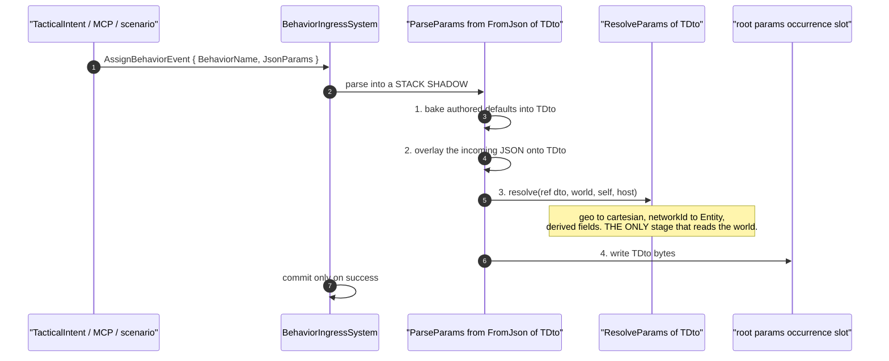
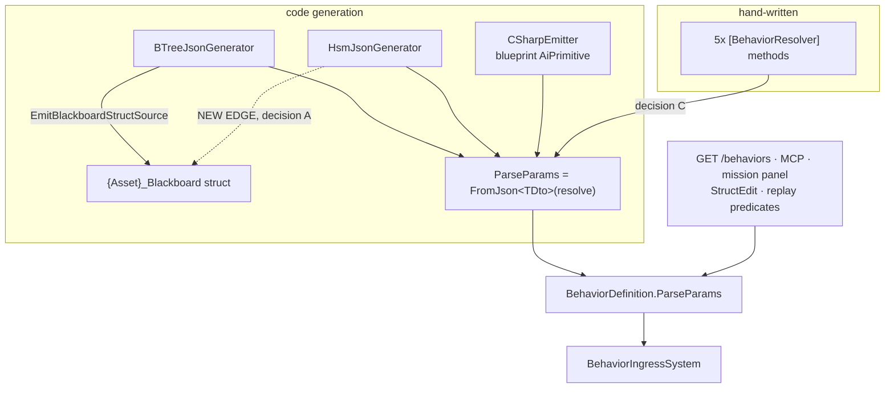

<!--STATUS
state: LIVE
updated: 2026-09-30 (CE-448 known-rot)
build-state: ⛔ DESIGN — SUBSUMED 2026-09-29 BY Q76 §12, WHICH IS APPROVED AND BUILDING.
  ⭐⭐⭐ READ Q76 FIRST. Q76-B ("one blackboard block per running behaviour") was APPROVED by the
  user on 2026-09-29 and Q76 §4-E already ruled that THIS document depends on it. As of that
  approval:
    · S0 (one layout authority) IS Q76's CE-418 — same fix, now tracked there. BUILD IT THERE.
    · S1 (the HSM blackboard struct) IS the HSM arm of Q76's CE-425. BUILD IT THERE.
    · C / S2 (one whole-behaviour BehaviorParams.FromJson replacing the two emitted lambdas) is
      SUBSUMED by Q76's CE-426 — one bake→supply→resolve helper. CE-419 (three claimants on two
      emit sites) is RESOLVED: E8c is WITHDRAWN by R-152 and CE-426 is the survivor.
    · A / B / D still stand as this document's own decisions and are NOT re-litigated by Q76.
  ⛔ DO NOT START ANY SLICE FROM THIS DOCUMENT. Its live work now has tracker rows under Q76 §12.6.
  (Historic: DESIGN — REVISED 2026-09-28 BY A SECOND MEASUREMENT PASS, AND S1/S2 ARE BLOCKED.)
  ⚠⚠ This document WAS marked READY-TO-BUILD with all four decisions approved. The approval was
  explicitly ON TRUST — "approved, but just by trusting your judgement, not because i understand
  all the internals" — and it therefore never verified the mechanisms. ⛔ A second measurement
  pass, asked for by the user ("measure rather than rushing to implementation"), found TWO things
  that unblock nothing and block S1/S2: ① the corpus has TWO DISAGREEING OFFSET AUTHORITIES (§2.5,
  measured: 3 of 15 behaviours, 9 of 31 fields), which makes S2's "byte-for-byte identical" premise
  FALSE as written; ② a LIVE design on this same lane — DESIGN_Per_Variable_Param_Resolver.md —
  prescribes a change to the SAME emit site at the OPPOSITE grain (§2.6), and neither document
  named the other. ⇒ decisions A/B/D stand; C is REOPENED, and a new decision E precedes it.
current-answer: ⭐⭐⭐ READ §0 FIRST — it is the revision summary and says which of the earlier
  approved decisions survive. Then §2.5 (the offset authorities) and §2.6 (the E8c overlap), which
  are the two findings that moved the plan. §4 carries the decisions — E is NEW and A/B/D are
  unchanged; C is reopened and says why. §5 is the resequenced plan: S0 is new and S1/S2 depend
  on it. ⛔ Do NOT start at S1 — the previous revision said to, and that instruction is now WRONG.
stale-below: ⛔ §5's slice table and §4's decision C were written before the second measurement
  pass. Both are CORRECTED IN PLACE and say so; nothing below is quotable as a plan without
  reading §0.
known-rot: ⛔ 2026-09-30 (CE-448) — BlueprintResolverEntry / BlueprintDefinition.Resolvers (cited as a
  publication currency) are DELETED.
  known-rot: ⚠ 2026-09-30 (R-155) — wherever this document places a resolve step
  AFTER the automatic copy, or on an action binding, read DESIGN_Parameter_Model.md §P instead: the
  resolver replaces the copy (§P.2) and action bindings have no resolver (§P.3).
  earlier: 🔴 THREE claims this document made on 2026-09-28 that its own second pass overturned,
  recorded here so nobody re-derives them: ① §5's S2 row said routing the emitted producers
  through the factory is "behaviour-identical by construction" — FALSE, §2.5 measures 9 fields
  where it would move bytes; ② §3.1's sequence diagram draws "bake authored defaults" as a step of
  BehaviorParams.FromJson, which does NOT do it (§5.1c) — the diagram was aspirational and was not
  labelled as such; ③ §4-C treated "route every producer through one factory" as a decision this
  document could take alone — §2.6 shows the grain is owned jointly with E8c.
known-conflict: ⛔⛔ DESIGN_Per_Variable_Param_Resolver.md (E8c, build-state DESIGN, its D1-a/D2/D3
  awaiting approval) changes the SAME two emit sites this document's S2 would replace, at a
  per-VARIABLE grain where this one assumed whole-behaviour. §2.6 states the overlap and §4-C is
  reopened on it. ⛔ NEITHER may build until the grain is settled jointly. ⭐ §2's inventory still
  supersedes two claims Claude made in chat on 2026-09-28 ("the curated path has a resolve stage"
  and "IsBlackboardEditorManaged is BTree-specific") — both were wrong; the refutations are in §2.
related-designs:
  - DESIGN_Behavior_Action_Binding.md — the BUILD design of decision B (CE-417); refines §2.3 (eight sites, not six)
    and §4-B's per-slot ETF premise. Read it before starting S5.
  - DESIGN_Parameter_Model.md — ⭐⭐ §P is the CANONICAL parameter contract by kind (R-155): the
    contract the unified pipeline and action binding must implement.
  - Architect_Question_76_One_Blackboard_Block_Per_Primitive.md — ⭐⭐⭐ SUPERSEDES the storage
    half of this document and OWNS the live slices. Its §12 is the approved design; §12.6 the
    ordered slice list. S0→CE-418, S1→CE-425's HSM arm, C/S2→CE-426.
  - DESIGN_Per_Variable_Param_Resolver.md — ⭐⭐⭐ THE NEAREST NEIGHBOUR, and it was MISSING from this
    list until 2026-09-28. It owns the RESOLVE STEP at per-variable grain in the same two emitters
    this document's S2 would replace, and it owns how a params variable NAMES its resolver (R-149).
    ⛔ Read its §3.2 and §4 before touching decision C.
  - DESIGN_Resolver_World_Reach.md — owns what a resolver graph can REACH and, in its §7.2, the
    SELECTION ruling (R-149) that decides how two resolvers for one region are made unrepresentable
    rather than arbitrated. ⛔ Also missing from this list until 2026-09-28; D.1's precedence
    reasoning has to agree with it (§D.2).
  - DESIGN_Parameter_Model.md — owns WHAT a parameter is and the bake/overlay/resolve ORDER. This
    document proposes making its §3.1 three-shape model TRUE on every path; G1 in its §6 is the
    gap being closed. It wins on any disagreement about the model itself.
  - DESIGN_Occurrence_Scoped_Storage.md — owns WHERE the bytes live and HOW an occurrence is
    addressed. §28.6c/§28.6d there are the as-built this document builds on; nothing here moves
    a byte.
  - Behavior_Parameter_Resolver_Detailed_Design.md — the 2026-07-13 design that FIRST specified
    the deserialize/resolve split as G1. This document is its delivery, 14 months late.
  - DESIGN_Hsm_Blueprint_Behaviour_Authoring.md — owns the HSM authoring surface; its §3.5 is the
    compose step, and decision B here changes the DTO that surface edits.
  - Variable_Model_Unification.md — owns the one-variable-model ruling this serves.
-->
# Architect Question 75 — ONE params pipeline, and ONE action binding

> 🔒 **User, `2026-09-28`:** *"at least the actions are same for btree and hsm, and conditions are very
> close to hsm guards i guess, so i would expect some similarity and unification opportunity here"* ·
> *"we need same mechanism like everywhere else — json params in the behavior intent, resolver that
> converts these into the HSM parameter/blackboard dto"* · *"unify it as much as possible, no matter
> the cost"*

⭐⭐⭐ **The cost constraint is lifted by ruling. What this document owes is therefore not a cheap
option — it is the RIGHT shape, sequenced so the tree is green at every step.**

---

## 0. 🔴🔴 THE SECOND MEASUREMENT PASS — **what it changed, and what survives** *(`2026-09-28`)*

> 🔒 **User, verbatim:** *"revise the architect question, measure rather than rushing to
> implementation. use codebase memory, not just grep."*

⭐⭐ **Why a second pass at all.** This document was marked `READY-TO-BUILD` on an approval the user
gave **on trust**, not on verification. ⛔ That makes its measurements the *only* thing standing
between the plan and the code — so they were re-run, wider, before a line was written. **Two of them
came back different, and both block the slice this document told the next session to start at.**

### 0.1 ⭐ The verdict per decision

| | decision | verdict after re-measurement |
|---|---|---|
| **A** | HSM emits a blackboard struct | ⭐ **STANDS** — and §2.5 gives it a *second, stronger* reason: an HSM behaviour has **no** `BlackboardLayoutType` today, so it is the one host that cannot yet inherit the defect A would otherwise spread. ⚠ **But A must now land AFTER `S0`**, or it hands the HSM a wrong layout on purpose |
| **B** | one `BehaviorActionBinding` carrier | ⭐ **STANDS, untouched.** `S5` is independent of everything below and nothing in the second pass reaches it |
| **C** | all producers route through `FromJson` | 🔴🔴 **REOPENED.** Two independent reasons: §2.5 (its "byte-for-byte identical" premise is measurably false) and §2.6 (the *grain* is not this document's to choose alone) |
| **D** | the three states of a behaviour with no resolver | ⭐ **STANDS** — ⚠ with §D.2 added: `R-149` reaches this and agrees with `D.1`'s mechanism, which is worth saying because `R-149` explicitly retired a *precedence* answer |
| **E** | ⭐⭐⭐ **NEW — one layout authority** | the finding below, turned into a decision |

### 0.2 🔴 Finding ① — **the corpus already has TWO offset authorities, and they disagree**

📐 **Measured on the shipped generated corpus** *(method and full table in §2.5)*: of the **15**
generated behaviours that carry **both** a `ManagedBlackboardVariables` manifest and a
`BlackboardLayoutType`, **3 disagree** about where a variable's bytes are — **9 of 31 manifest
fields**. `PlatoonHillAttack2` disagrees on **4 of its 7**.

⇒ ⛔⛔ **`S2`'s stated rail — *"the bytes written by the new pipeline equal the old ones for the same
JSON"* — cannot pass on 3 of 15 assets**, because routing the emitted producers through
`FromJson<TLayout>` swaps the *write* path from the manifest's offsets to the struct's. ⚠ **That is
not a rail failing; it is the plan being wrong.** ⭐ And the divergence is **already live** on two
read/write surfaces (§2.5.3) — filed as its own defect, not as a cost of this programme.

### 0.3 🔴 Finding ② — **a live design on this lane changes the same emit site, at the opposite grain**

⛔ [`DESIGN_Per_Variable_Param_Resolver.md`](DESIGN_Per_Variable_Param_Resolver.md) *(`E8c`)* — updated
the **same day** as this document, `build-state: DESIGN`, decisions awaiting approval — adds a
**third step** to `BTreeBridgeEmitCore.EmitParseParamsLocal` and its HSM mirror, **per variable**.
⭐ `S2` proposes to **delete those same two lambdas** and replace them with one whole-DTO factory
call. **Neither document named the other**, and both are on the `behaviors` lane. §2.6 has the table.

⇒ ⭐⭐ **This is the failure mode `related-designs` was made mandatory to prevent**, arriving between
two documents written a day apart. Both STATUS blocks now carry the reciprocal link.

### 0.4 ⚠ What the second pass did NOT overturn — **said explicitly, so the re-measurement is legible**

⭐ `§2.1`'s five producers · `§2.2`'s schema table · **`FromJson<TDto>`'s zero production callers** ·
`§5.1a`'s two-shape hole · `§5.1`'s three answers · `§5.1b`'s `DelegateShape` decision · `D`'s three
states. ⛔ **All re-checked, all still true.** ⚠ One correction inside `§5.1`, measurement 1:
*"`BlackboardTypeName` is populated on ALL 7 HSM assets"* is true, but **only 4 of the 7 are
`Managed`** — the other three have zero variables, so `S1` emits nothing for them. That does not
change the decision; it changes the acceptance count from 7 to 4.

---

## 1. ⭐⭐ THE TWO PROBLEMS, IN ONE SENTENCE EACH

| | |
|---|---|
| **P1 — the params pipeline** | Four producers fill `BehaviorDefinition.ParseParams`, **none of the generated ones has a resolve stage**, and the one type that expresses *"deserialize, then resolve"* as separable steps has **zero production callers** |
| **P2 — the action binding** | A BTree action/condition carries a 5-member payload object; an HSM state and transition carry the same information as **flat parallel strings with three of the five members missing** |

---

## 2. 🔴 INVENTORY — **measured `2026-09-28`, and it refutes two things Claude said in chat**

⭐ Queries run: `search_graph(name_pattern=".*(Payload|PayloadDto)$", label=Class)` ·
`trace_path(BehaviorParams.FromJson, inbound)` · `trace_path(IBlackboardManagedAsset.AddVariable,
inbound)` · greps for `ParseParams =`, `[BehaviorResolver]`, `RegisterResolver`,
`EmitBlackboardStructSource`, `HostedParamResolvers.Register`.

### 2.1 Who fills `BehaviorDefinition.ParseParams` — the COMPLETE set

| producer | shape | resolve stage? |
|---|---|---|
| hand-written `[BehaviorResolver]` *(5 in production: `FireAtTarget`, `FollowRoute`, `HullDownAttackRun`, `MoveToLocation`, `PlatoonHillAttack`)* | one method, **deserialize and resolve FUSED** | ◑ fused, not separable |
| `BTreeBridgeEmitCore:481` | emitted per-variable `switch` | ⛔ **none** |
| `HsmBridgeEmitCore:167` | emitted per-variable `switch` | ⛔ **none** |
| `CSharpEmitter:710` *(blueprint AiPrimitive as a ROOT behaviour)* | `{class}.ParseParams` | ⛔ **none** |
| ⛔ **a curated behaviour with NO `[BehaviorResolver]`** | **nothing at all** | `BehaviorIngressSystem:754` returns 0 ⇒ its JSON params are **silently dropped** |

🔴🔴 **`BehaviorParams.FromJson<TDto>(ResolveParams<TDto>? resolve)` — the ONE factory that expresses the
split — has `callers_total: 0` in production** *(exact; `ParameterSupplyRailsTests` only)*.
⇒ ⛔⛔ **`G1` is not "partly done". It is declared and entirely unadopted**, and Claude's chat claim
that *"the curated path has ✅ a resolve stage"* was wrong: the curated path has five methods that do
both at once, which is the thing `G1` exists to separate.

⭐ **Where a resolver IS adopted in production — and it is the OTHER seam:**
`CSharpEmitter:474` emits `HostedParamResolvers.Register<Params>` and `:395`
`BlueprintResolverEntry.For<TDto>`. Both are **per hosted occurrence** (`C1′`), not the root ingress.

### 2.2 The typed-schema surface

| behaviour kind | `JsonParamsDtoType` | `BlackboardLayoutType` |
|---|---|---|
| generated **BTree** | ✅ `{Asset}_Blackboard` | ✅ the same type |
| generated **HSM** | ⛔ **none** — falls back to the `ManagedBlackboardVariables` manifest | ⛔ **none** |
| **curated** | ⛔ not set *(deliberate, `R-132`)* | ✅ e.g. `CgfNodes.FireAtTargetParams` |

⭐⭐ **The emitter the HSM is missing ALREADY EXISTS:** `BTreeEmitCore.EmitBlackboardStructSource`,
**one production caller** *(`BTreeJsonGenerator:277`)*.

### 2.3 The action-binding surface

| | BTree | HSM |
|---|---|---|
| carrier | `BTreeActionPayload` *(in-degree **41**)* · `BTreeConditionPayload` *(**11**)*; DTO twins **24** / **7** | ⛔ **no carrier** — flat fields |
| `MethodFqn` | ✅ | ✅ ×4 on a state *(`OnEntry`/`OnExit`/`Activity`/`Timer`)*, ×2 on a transition *(`Guard`/`Action`)* |
| blueprint id + name | ✅ *(via the schema entry)* | ✅ but only for **Activity** and **Guard** |
| `ExpressionTargetField` | ✅ **per site** | ⚠ **ONE per state, shared by all four slots**; one per transition |
| `DelegateShape` | ✅ | ⛔ **absent** |
| `WorkingStateTypeId` | ✅ | ⛔ **absent** |
| `WorkingStateTargetField` | ✅ | ⛔ **absent** |

📐 **Total references to move if the carrier is unified: ~83** *(41+11+24+7)*, plus every HSM state and
transition field. ⇒ **the file format changes ⇒ a migrator is mandatory.**

### 2.4 ⚠ And the thing the inventory found that nobody asked about

⛔⛔ **`IsBlackboardEditorManaged` is NOT BTree-specific** — `HsmBridgeEmitCore.PackParams:464` gates the
HSM params path on the same flag and returns an **empty field list silently**, where
`BTreeJsonGenerator` raises `BTREE0002` and skips the asset loudly. ⭐ Already fixed in `54570bde0`
*(the flip moved into the shared compose)*, ⚠ **but the missing HSM DIAGNOSTIC is not** — filed as
part of `CE-416`.

### 2.5 🔴🔴 THE SECOND PASS'S FINDING — **`ManagedBlackboardVariables` and `BlackboardLayoutType` are TWO offset authorities, and they already disagree**

⭐ **Queries run** *(graph first, then the runtime — a text search cannot answer this at all)*:
`search_code("JsonParamsDtoType")` → 33 results / 60 grep matches ·
`search_code("BlackboardLayoutType")` → 54 results / 99 grep matches ·
`check_index_coverage` on all 11 cited paths → `no_recorded_issue`, `generation_matches: true`
*(best-effort, never proof)* · then **a runtime probe over the built `Hrot.AI.Behaviors.dll`**,
because the question is *"what does the CLR actually do with this struct"* and **no static tool
answers that**.

#### 2.5.1 ⭐ The mechanism — two packers, and one of them derives alignment from SIZE

| authority | who computes it | the rule |
|---|---|---|
| **the manifest** — `ManagedBlackboardVariable.ByteOffset` | `BTreeBlackboardPackHelper.Pack:136` *(netstandard2.0, build-time)* | declaration order, `int alignment = Math.Min(size, AlignmentCap=8)` |
| **the struct** — `JsonParamsDtoType` / `BlackboardLayoutType` | the CLR, from `BTreeEmitCore.EmitBlackboardStructSource:130`'s `[StructLayout(LayoutKind.Sequential)]` | declaration order, **alignment of the TYPE**, not of its size |

🔴 **`Math.Min(size, 8)` is the bug, and it is one line.** A type's alignment is **not** its size:
📐 `System.Numerics.Vector3` is **12 bytes with alignment 4** *(probed, managed and marshalled both)*,
so `Pack` aligns it to **8** and the CLR to **4**. ⚠ **A second source, also measured:** a generated
`Params` struct with **no fields** is **size 0** to `Pack` and **1 byte** to the CLR — which is why
`PlatoonHillAttack2`'s manifest has two variables at offset **40** and two more at **48**.

#### 2.5.2 📐 The measurement — **3 of 15 behaviours, 9 of 31 fields**

```
15 generated behaviours carry BOTH a manifest and a BlackboardLayoutType
 3 of them disagree on at least one offset          9 of 31 manifest fields disagree
```

| asset | field | manifest says | the struct says |
|---|---|---|---|
| **`PlatoonHillAttack2`** *(4 of 7 wrong)* | `bpParamsDispatchAllToBaseline` | 24 | **20** |
| | `bpParamsAreAllAtBaseline` | 40 | **36** |
| | `bpParamsDispatchWaveWithTargets` | 48 | **52** |
| | `bpParamsIsWaveCompleted` | 88 | **92** |
| **`T09_BlackboardManaged`** | `HomePosition` *(`Vector3`)* | 8 | **4** |
| | `PatrolLoops` | 20 | **16** |
| | `IsAlerted` | 24 | **20** |
| **`T39_TwoDistinctPrimitives`** | `bpParamsB` | 8 | **4** |
| | `bpParamsC` | 16 | **12** |

⚠ **And a THIRD number disagrees with both:** `RootParamsAccess.RootParamsBytes:275` sizes the region
as `max(ByteOffset + Marshal.SizeOf(v.Type))`, and 📐 **`Marshal.SizeOf(typeof(bool))` is 4** even
where the struct field carries `[MarshalAs(I1)]` ⇒ for `T09` the manifest extent is **28** while
`Marshal.SizeOf(layout)` is **24**. ⭐ Harmless today *(it over-allocates)*, ⛔ but it is a third
spelling of one fact.

#### 2.5.3 ⛔⛔ It is LIVE, not latent — **two surfaces read the WRONG authority today**

📐 `RootParamsBytes:269` prefers the manifest, so **sizing is right**. ⛔ But the two typed surfaces
take the struct:

| surface | path | consequence on those 3 assets |
|---|---|---|
| 🔴 **StructEdit "Active Parameters"** *(reads AND writes)* | `BlackboardReflection.Apply:63` → `RootParamsViewProvider.CreateView` → `ProjectBufferAs(dtoType, …, payloadOffset)` | the typed editor binds each field at the **struct's** offset while the runtime wrote it at the **manifest's** ⇒ shows, and **edits**, the wrong bytes |
| 🔴 **replay predicates** | `BehaviorParamSlotResolver.ResolveDtoType:36` returns `def.BlackboardLayoutType` for the root slot | a predicate on `HomePosition` reads +4 where the recorded bytes hold it at +8 |
| ⭐ the ImGui read-only render | `RootParamsProjection.RenderRootParams:66` — **manifest arm first** | correct ⇒ ⚠ **the two panels disagree with each other on the same entity** |

⭐ **Nothing rails it.** 📐 The manifest's rails *(`AGeneratedBehaviourAdvertisesItsManifestTests`,
`RootParamsProjectionTests`)* assert **names** and round-tripping; **none compares an offset to the
struct.** ⚠ Stated as the bounded claim it is: graph + grep over `*Tests*.cs`, coverage clean — not
proof of absence.

⇒ 📄 **Filed as `CE-418`** *(its own defect, independent of this programme)*, and it is **why `S0`
exists**: 🔒 **`S2` cannot be byte-for-byte identical while there are two answers to "where is this
variable".**

### 2.6 ⛔⛔ THE OVERLAP — **`E8c` changes the same emit site at the opposite grain**

⭐ **Found by following `R-149`**, which this document did not cite and which is canon about exactly
this question. 📄 [`DESIGN_Per_Variable_Param_Resolver.md`](DESIGN_Per_Variable_Param_Resolver.md).

| | **this document — `C`/`S2`** | **`E8c`** |
|---|---|---|
| the emit site | `BTreeBridgeEmitCore.EmitParseParamsLocal:1236` + `HsmBridgeEmitCore:313` | ⭐ the **same two** |
| what happens to it | ⛔ **DELETED** — replaced by one `FromJson<TJson,TLayout>` call | ⭐ **KEPT** — gains a **Step 3** |
| grain of resolve | **whole behaviour**, one `ResolveParams<TDto>` | **per VARIABLE**, `HostedParamResolvers.TryRun` per ref |
| who names the resolver | a `[BehaviorResolver]` attribute, keyed by BEHAVIOUR name | 🔒 **the params VARIABLE names it** — `R-149` |
| bake + overlay | ⛔ **lost** *(§5.1c — the factory has no bake)* | ⭐ untouched; they are Steps 1 and 2 |

⇒ ⭐⭐⭐ **These are not two views of one plan — they are contradictory instructions for one file**,
and both were `build-state`-marked on `2026-09-28`. ⛔ Whichever builds second silently undoes the
first.

🔒 **`R-149` also decides something `D.1` reasoned out independently:** *"a params region names ONE
resolver, so two resolvers for one region are unrepresentable, not arbitrated"* — and it
**explicitly supersedes a "rank by authorship" answer.** ⭐ `D.1`'s mechanism *(generate the identity
parse only when no resolver is declared, decided at GENERATION time)* is the unrepresentable form,
not the precedence form, so the two agree — ⚠ **but that agreement was luck, not citation.** §D.2
records it.

---

## 3. ⭐⭐⭐ THE TARGET — **diagram first**

### 3.1 The pipeline, as it must become



*What the picture shows that the prose hid: steps 1–2 are pure and testable without a world, step 3 is
the only one that is not, and step 4 is the only one that writes. Today steps 1–2 and 4 are fused in
three emitted switches and step 3 does not exist at the root at all.*

> 🔴🔴 **CORRECTION `2026-09-28` — this diagram is the TARGET, and step 1 does NOT exist in the box it
> is drawn in.** 📐 `BehaviorParams.FromJson:78` is three lines: `Deserialize<TDto>` →
> `resolve?.Invoke` → `Unsafe.Write`. ⛔ **There is no bake.** The baked defaults live in the EMITTED
> lambda *(`BTreeBridgeEmitCore:1310`, "Step 1 — baked defaults")*, and an absent JSON key there keeps
> the authored default where `Deserialize` would hand back `default(TDto)`. ⇒ ⭐⭐ **routing an emitted
> producer through today's factory silently discards every authored default** — §5.1c. ⚠ The diagram
> was drawn as intent and read as inventory; it is left standing **as the target** with this warning
> attached rather than redrawn, because the target is still right.

### 3.2 The classes


### 3.3 Who produces what, per module — **and the edge that does not exist today**



*The dotted edge is the whole of decision A. Every solid edge exists today; the HSM simply never
reaches the struct emitter, which is why it has no typed schema and cannot use `FromJson<TDto>`.*

---

## 4. ⭐⭐⭐ THE DECISIONS — **four, each with a lean**

### A — does the HSM generator emit a blackboard struct? ⚖️ **LEAN: YES**

⭐ Call the existing `BTreeEmitCore.EmitBlackboardStructSource` from `HsmJsonGenerator`, exactly as
`BTreeJsonGenerator:277` does. ⇒ the HSM gains `JsonParamsDtoType` + `BlackboardLayoutType`, and
becomes visible to `GET /behaviors`, MCP, the mission panel, StructEdit and the replay predicate
compiler on the same footing as a BTree.
⛔ **Rejected — keep the manifest fallback as the only shape:** it is a second schema mechanism for one
concept *(ruling 9)*, and without a `TDto` decision C is impossible.
⚠ **Cost:** the struct must be nameable from the `.hsm.json`'s `BlackboardTypeName` *(already present,
currently unused on the HSM path)*, and every HSM asset's generated output moves.

### B — one `BehaviorActionBinding` carrier for both hosts? ⚖️ **LEAN: YES, and it is the expensive one**

⭐ One record replaces `BTreeActionPayload`, `BTreeConditionPayload` and their two DTO twins, and becomes
the type of a state's four slots and a transition's two.
⭐⭐ **What the HSM GAINS, which is the real argument:** `DelegateShape`, `WorkingStateTypeId`,
`WorkingStateTargetField` — an HSM C# action can bind working state for the first time — and a
**per-slot** `ExpressionTargetField` instead of one shared by four slots.
⛔ **Rejected — a common base class for the two BTree payloads only:** it collapses 2 of 6 sites and
leaves the HSM exactly as it is, which is the half-measure the ruling forbids.
🔴 **Cost, stated plainly:** ~83 references, both mappers, both editors' facets and drawers, both
emitters, the validator, and **the file format** ⇒ a `.btree.json` + `.hsm.json` migrator, and the
golden corpus moves wholesale.
⚠ **The one semantic question inside B:** four slots each gaining their own `ExpressionTargetField`
changes what `HsmParamBindings` must key on — today `(machine, state, site)` where site is the child
asset. Four slots hosting the SAME blueprint at one state would still collide.
⚖️ **Sub-lean:** widen the site key to `(childAssetId, slotKind)`. It is one enum in the key and it
closes the last collision in the model.

### E — ⭐⭐⭐ **NEW, and it precedes everything: ONE layout authority** ⚖️ **LEAN: `E-2`, the struct carries the packer's offsets explicitly**

> 📐 The finding is §2.5: **two packers, 3 of 15 behaviours disagreeing, 9 of 31 fields.** ⛔ This
> decision did not exist in the approved set because the divergence had not been measured.

| option | ⭐ |
|---|---|
| **`E-1`** teach `Pack` the CLR's real alignment rules *(alignment of the TYPE, empty struct = 1)* | ⛔⛔ **it MOVES RUNTIME BYTES.** Every generated manifest offset changes on the 3 divergent assets, so every recorded replay and every live params region shifts under the new build. ⚠ It is also the arm that needs a per-type alignment table on the **netstandard2.0** side of the wall, where `Marshal` does not exist — the exact wall `E8c`'s `ResolverKey` note documents |
| ⭐⭐⭐ **`E-2`** **LEAN** — emit `[StructLayout(LayoutKind.Explicit, Size = totalBytes)]` with a `[FieldOffset(n)]` per field, **taken from `Pack`** | ⭐⭐ **the manifest and the struct stop being two answers — the struct BECOMES the manifest, by construction.** ⭐ **Zero runtime bytes move**: `Pack` stays the single authority and the struct is re-expressed to agree with it. ⭐ It fixes `CE-418`'s two live surfaces *(StructEdit, replay predicates)* as a side effect, because they read the struct. ⭐⭐ And it is what makes `S2` **possible at all**: `Unsafe.Write(memory, dto)` and the per-variable writes become the same bytes **by construction, not by luck** |
| **`E-3`** delete `JsonParamsDtoType`/`BlackboardLayoutType` from generated behaviours and keep only the manifest | ⛔ **`R-137` — unification may not cost a feature.** The typed surfaces *(StructEdit, replay predicates, `GET /behaviors`)* exist BECAUSE there is a type; removing it to end the disagreement removes the capability instead of fixing it. ⛔ And it makes decision `A` pointless |

⚠ **What `E-2` costs, stated plainly:** every generated `*_Blackboard.g.cs` golden moves *(17 BTree
files)*, and explicit layout forbids overlapping fields — 📐 which **`PlatoonHillAttack2` currently
has**, two zero-size `Params` sharing offset 40 and two sharing 48. ⇒ ⭐ **that is a finding, not a
blocker**: a zero-size params region is a variable that occupies nothing, and `E-2` forces the
question *"what should an empty `Params` occupy?"* to be answered once instead of differently by two
packers. ⚖️ **Sub-lean: give it 0 in the manifest and OMIT the field from the struct** — a field that
cannot hold a byte has nothing to project, and omitting it keeps `Size` honest.

⚠ **What would change this lean:** if a consumer is found that needs the struct to be *naturally*
laid out — a P/Invoke, a DDS wire type, a `MemoryMarshal.Cast` over an array of them. 📐 **Searched
the consumers in §2.5.3 and the `BlackboardLayoutType` call sites: none does.** ⛔ Not searched
outside them.

### C — do all four producers route through `FromJson<TDto>(resolve)`? 🔴 **REOPENED `2026-09-28` — the lean below is unchanged in DIRECTION and no longer sufficient as written**

⭐ The emitted `ParseParams` becomes *bake+overlay into `TDto`* → `resolve?.Invoke` → write, i.e. the
emitters stop emitting a write and start emitting a `TDto` filler. The five hand-written
`[BehaviorResolver]` methods split into a deserialize half *(deleted — the factory does it)* and a
resolve half *(kept, as `ResolveParams<TDto>`)*.
⭐⭐ **This is what the user asked for in their own words:** *"json params in the behavior intent,
resolver that converts these into the HSM parameter/blackboard dto."*
⛔ **Rejected — add a resolve hook to each emitted switch separately:** three hooks for one concept.
⚠ **Blocked on A** for the HSM, and on nothing for BTree.
🔴 **Risk to name:** the five curated resolvers are the only production code that understands
geo-authored shapes (`PlatoonHillAttack`'s `[lat, lon]`). ⛔ **Splitting them is where a silent
regression would hide** — each needs a before/after rail on real authored JSON.

#### 🔴🔴 C.1 — **WHY THIS IS REOPENED, and the three things it now owes** *(`2026-09-28`)*

⭐ **The DIRECTION survives** — one factory, `G1` delivered, is still right and is still what the user
asked for in their own words. ⛔ **Three premises under it did not:**

| # | the premise, as written | 📐 what the second pass measured | what C now owes |
|---|---|---|---|
| **①** | *"behaviour-identical by construction; rail: byte-for-byte equality"* | ⛔ **false on 3 of 15 assets** — the write path changes authority from the manifest to the struct *(§2.5)* | ⭐ **depend on `E`**. With `E-2` the premise becomes true **by construction**, which is the only honest way to make that claim |
| **②** | the factory does bake → overlay → resolve → write | ⛔ `FromJson` does **deserialize → resolve → write.** There is **no bake**, and the emitted lambda's baked defaults would be **silently discarded** *(§5.1c)* | ⭐ the factory gains a **bake stage** — the emitter already holds the default JSON per field, so the shape is `FromJson<TJson,TLayout>(bake, convert)` or a pre-seeded `TLayout` |
| **③** | the resolve grain is whole-behaviour, and this document may choose it | ⛔ **`E8c` is building the SAME step at per-VARIABLE grain**, and `R-149` rules that a params region names its own resolver *(§2.6)* | ⛔⛔ **the grain is a JOINT decision.** It is not resolvable inside this document, and `S2`/`S3` must not start until it is |

⚖️ **My lean on ③, offered so the joint decision has a starting position** — ⭐ **the per-variable
grain wins, and the whole-behaviour resolver becomes the degenerate case of it.** 📐 Three
measurements carry it: `R-149` is canon and already chose it; a behaviour's params region **is** a
set of variables, and `PlatoonHillAttack2` has **7** of them from **7 different blueprints**, so one
whole-DTO `convert` would have to know all seven; and `E8c` measured that a curated resolver
**structurally cannot own less than a whole behaviour** *(`def.ParseParams` is one delegate)*, which
is a limitation to keep supporting, not a grain to standardise on. ⛔ **What would change it:** a
two-shape case where the JSON DTO and the layout differ **across the whole behaviour** rather than
per variable — 📐 `MoveToLocation` is exactly that, and it is **curated**, so it keeps the
whole-behaviour arm. ⇒ ⭐⭐ **both grains exist; the question is which one the EMITTED path uses, and
that is per-variable.**

### D — a behaviour with no resolver ⚖️ **LEAN REVISED — the first lean was wrong**

> 🔒 **User, `2026-09-28`:** *"there are behaviors having no parameters. There are also behavior not
> requiring any special resolver (their behavior parameter DTO == the parameter DTO in the blackboard,
> automatically convertible from json). both needs to be supported."*

⛔ **My first lean — *"fail the build"* — collapsed three different states into one and would have
rejected two legitimate ones.** 📐 Measured on the shipped curated registrar, and all three states are
real today:

| state | shipped example | what must happen |
|---|---|---|
| **① no parameters at all** | `Idle`, `WanderMilitary` — no `BlackboardLayoutType`, no resolver | ⭐ **legal and silent.** No parse is needed and none is generated |
| **② params, JSON DTO ≡ layout** | the entire generated BTree/HSM corpus, and any curated behaviour whose contract mirrors its layout | ⭐⭐ **IDENTITY PARSE, generated automatically** — `FromJson<TDto>()` with `resolve: null`. ⛔ No author action, no attribute, no error |
| **③ params needing conversion** | `FireAtTarget` *(networkId → `Entity`)*, `MoveToLocation` / `PlatoonHillAttack` *(`[lat, lon]` → cartesian)*, `FollowRoute`, `HullDownAttackRun` | `[BehaviorResolver]` supplying the conversion half only |

⇒ ⭐⭐⭐ **The rule is: ① and ② need NO declaration. Only ③ does.** The build error is reserved for the
one genuinely broken state — **a contract that advertises members which nothing can fill**.

⚠ **And exactly one shipped behaviour sits in a FOURTH state, which is neither a bug nor ②:**
`JoinFormation` declares `JoinFormationParams { int LeaderNetworkId; byte FormationTypeId; }` as its
layout while its `[BehaviorContract]` DTO is **deliberately memberless** — *"currently parameterless;
the contract exists to anchor the behavior ID and category"*, carved out explicitly in
`AGeneratedBehaviourAdvertisesItsManifestTests`. ⛔ **Claude's chat claim that its params are "silently
dropped" OVERSTATED it:** nothing advertises those two fields, so nothing can be dropped. ⭐ It is a
reserved-for-later layout, and the right treatment is a **warning** — *"layout declares members the
contract does not"* — not an error, and an authoring decision to either fill the contract or drop the
fields.

#### D.1 🔒 `R-132` BINDS THIS — **an auto-generated identity parse must never outrank a curated one**

⭐⭐ **Surfaced by `rulings-check.py`'s staleness warning, which is what that gate is for.**
📄 `RULINGS.md` `R-132`, from the user on `2026-08-23`: *"if curated (hand-authored) exists, then no
other is needed — having automatically generated is undesired in such a case."*

🔴 **The case behind it is this exact mechanism.** `ApplyResolverOverlay` once read
`if (def.ParseParams == null)`, so a **generated** `ParseParams` won the slot, the curated geo-aware
resolver for `PlatoonHillAttack` never ran, every mission key hit `default: break` and the params
region stayed zeros — **no exception, no log line**, and the platoon drove to `(0,0)`.

⇒ ⛔⛔ **Decision D's auto-generated identity parse is a NEW generated producer for a slot a curated
declaration may also fill.** ⭐ It must inherit the same precedence, and the precedence must be
**structural, not ordering-dependent**:

| ⭐ the rule S4 must honour | |
|---|---|
| ⭐⭐⭐ **a `[BehaviorResolver]` declaration wins, always** | the identity parse is generated **only when no resolver is declared** — decided at GENERATION time, not by who registers last |
| ⛔ **never `if (ParseParams == null)`** | that is the exact shape `R-132` was filed against |
| ⭐ **and the rail already exists in spirit** | `Q75` §6's *"one parse factory"* reflection rail should also assert that no behaviour has BOTH a generated identity parse and a declared resolver |

#### D.2 ⭐ `R-149` REACHES THIS TOO — **and it agrees, which was luck rather than citation** *(added `2026-09-28`)*

🔒 **`R-149`** *(a params region NAMES its resolver, so two resolvers for one region are
unrepresentable, not arbitrated)* is the newer ruling and it **explicitly supersedes its own author's
"rank by AUTHORSHIP" answer** of the same day — i.e. it retired a *precedence* rule in favour of
making the collision unrepresentable. ⚠ `D.1` was written citing only `R-132` and reasoned its way to
*"decided at GENERATION time, never `if (ParseParams == null)`"*.

⭐⭐ **Those are the same thing.** *"Generate the identity parse only when no resolver is declared"* is
an unrepresentability rule — there is never a second producer to rank — not a precedence rule. ⇒
✅ **`D.1` stands as written**, and `R-149` reinforces rather than overturns it.

⛔ **Recorded anyway, because agreeing by accident is not a method.** `R-149` is canon, it names this
exact question, and this document reached §4 without citing it. ⚠ **The next reader must not
conclude the ledger was consulted just because the answer matches it** — §2.6 is how it was actually
found, and the sweep that found it was the second pass, not the first.

---

## 5. ⭐⭐ THE PLAN — **RESEQUENCED `2026-09-28`: six slices, and the first one is new**

> 🔴 **What changed and why.** `S0` is new *(decision `E`)* and `S1`/`S2` now depend on it; `S2`/`S3`
> additionally gain a **blocking prerequisite that is not a slice** — the joint grain decision with
> `E8c` *(§2.6, `C.1` ③)*. ⛔ **The row below that says "start at S1" no longer applies.**

| # | slice | decisions | depends on | shape |
|---|---|---|---|---|
| ⭐⭐⭐ **S0** | **ONE LAYOUT AUTHORITY** — emit the blackboard struct with explicit `[FieldOffset]` taken from `Pack`, so the struct and the manifest are one fact. Add the **parity rail** *(§6)*. Fixes `CE-418` | **E** | — | 17 BTree `*.Blackboard.g.cs` goldens move; ⛔ **zero runtime bytes move**; two live surfaces stop lying |
| ⛔ **PRE** | ⛔⛔ **NOT A SLICE — the joint grain decision with `E8c`** *(§2.6)*. Whole-behaviour vs per-variable resolve, taken ONCE, across both documents, with the user | **C**③ | — | ⛔ **`S2` and `S3` may not start before it.** `S0`/`S1` are unaffected |
| **S1** | **Make `EmitBlackboardStructSource` host-neutral** *(it reads only 3 things from the BTree DTO)*, then **HSM emits `{Asset}_Blackboard`** from its existing `BlackboardTypeName`; set `JsonParamsDtoType` + `BlackboardLayoutType`; keep the manifest as a fallback | A | ⭐ **S0** | additive; **4** HSM assets emit *(the other 3 are unmanaged with zero variables)*. ⛔ **After S0, not before** — otherwise it hands the HSM the `CE-418` divergence on purpose |
| **S2** | **Widen the factory** — `FromJson<TJson, TLayout>` *(§5.1a)* **AND a bake stage** *(§5.1c)* — then route the EMITTED producers through it | C | S1 **+ PRE** | ⭐ byte-for-byte identical **by construction once S0 lands**, not by luck; ⛔ the rail is meaningless before S0 |
| **S3** | **Split the five `[BehaviorResolver]` methods** into `ResolveParams<TDto>` halves and register them through the same factory | C | S2 **+ PRE** | ⚠ **the risky slice** — one rail per behaviour on real authored JSON |
| **S4** | **The three states of D:** auto-generate the identity parse for ②, leave ① alone, and warn on the `JoinFormation` shape *(layout declares members the contract does not)* | D | S3 | ⭐ mostly REMOVES author obligations rather than adding one |
| **S5** | **`BehaviorActionBinding`** + the file-format migrator + per-slot `ExpressionTargetField` + the `(childAssetId, slotKind)` site key | B | — *(independent of S1–S4)* | 🔴 the big one; both mappers, both editors, both emitters, whole-corpus golden move |

⭐ **S5 is independent** and can run in parallel or after. ⛔ **Do not interleave it with S2/S3** — a
format migration and a pipeline change landing together makes a bisect useless.

### 5.1 ✅ THE THREE OPEN QUESTIONS — **measured `2026-09-28`, none left open**

> 🔒 **User:** *"measure, leave no open questions what you can answer yourself."*

| # | the question | ✅ the measurement | effect on the plan |
|---|---|---|---|
| **1** | can the struct emitter name an HSM struct? | ✅ **`BlackboardTypeName` is populated on ALL 7 HSM assets** and follows the same `{Name}_Blackboard` convention as the BTree. ⚠ **But `EmitBlackboardStructSource` takes a `BehaviorTreeAssetDto`** — it reads only three things from it: `Blackboard.Managed`, `Blackboard.Variables`, and the type name | ⭐ **S1 gains a first step: make the emitter HOST-NEUTRAL** — `(string typeName, IReadOnlyList<BlackboardVariableDto> vars, …)`. The HSM already has the projection it needs, `HsmBridgeEmitCore.ToPackable`. ⛔ Not a blocker; it is the sharing the user asked for |
| **2** | do any curated resolvers read the world during DESERIALIZE? | ✅ **No — the split is already there in the source.** `ResolveMoveToParams` fetches `IGeographicTransform` and delegates to `ParseMoveToParams(json, ptr, capacity, geo)`; `ResolveFireAtTargetParams` does the same with `NetworkEntityMap`. The world read is a **dependency fetch**, used only during conversion | ⭐⭐ **S3 is much safer than feared.** The `Resolve*` wrapper is already the world-fetch half and `Parse*` the conversion half |
| **3** | does `DelegateShape` have BTree-only members? | 🔴 **YES.** `ThreeParamReusable`, `FourParamFull` *("full blackboard access")*, `AiPrimitiveTickCore = 3`, and ⚠ **value 2 (`ThreeParamReusableStateful`) has NO named member in the editor enum** — it round-trips as a bare number. These are **BTree interpreter arities**; the HSM dispatches one fixed `(void*, void*, HsmCommandWriter*)` signature | ⭐ **decision B takes the vocabulary decision below rather than leaving it open** |

#### 5.1a 🔴 WHAT MEASUREMENT 2 ALSO EXPOSED — **`FromJson<TDto>` CANNOT EXPRESS THE TWO-SHAPE CASE**

⛔⛔ **This is the most important thing the measurement found, and it is a hole in the TARGET, not in
today's code.** `MoveToLocation` has **two shapes**: `MoveToLocationParamsJsonDto` *(authored, geo)* and
`MoveToLocationParams` *(the blittable layout, cartesian)* — exactly `DESIGN_Parameter_Model.md` §3.1's
*"two shapes only on divergence"*. 📐 But the factory writes the type it deserialized:

```csharp
TDto dto = JsonSerializer.Deserialize<TDto>(json, JsonOptions);
resolve?.Invoke(ref dto, world, self, host);
Unsafe.Write(memory, dto);          // ⛔ assumes JsonDto == layout
```

⇒ ⭐⭐⭐ **`BehaviorParams.FromJson` must become two-typed** —
`FromJson<TJson, TLayout>(Convert<TJson, TLayout> convert)`, with the identity case
`FromJson<T>() == FromJson<T, T>(identity)` for states ① and ②. ⛔ Without this, **S3 cannot land for
three of the five curated resolvers** and `CE-235`'s whole point — `JsonParamsDtoType` and
`BlackboardLayoutType` are two members because they are two types — would be contradicted by the one
factory meant to serve both.
⇒ **S2 gains this signature change**, before any caller is routed through it.

#### 5.1c 🔴🔴 THE SECOND HOLE IN THE TARGET — **`FromJson` HAS NO BAKE, so routing an emitter through it DISCARDS EVERY AUTHORED DEFAULT** *(measured `2026-09-28`)*

⛔⛔ **This is the same class of hole as §5.1a and it is larger, because it hits every asset rather
than three curated behaviours.** 📐 Put the two implementations side by side:

| | the EMITTED lambda *(`BTreeBridgeEmitCore:1297`–`1362`)* | `BehaviorParams.FromJson:78` |
|---|---|---|
| **step 1** | ⭐ **bake** — per field, `Deserialize(defaultJson)` → `Unsafe.Write(memory + offset)` | ⛔ **absent** |
| **step 2** | overlay — walk the JSON's properties, `switch` on **variable name**, write each at its own offset | `Deserialize<TDto>(json)` — whole object at once |
| **absent key** | ⭐ **the baked default stands** *("that is what overlay means" — its own header)* | 🔴 **`default(TDto)`** — the field is **zeroed** |
| **empty/null json** | ⭐ defaults only | 🔴 `default` — **all zeros** |

⇒ ⛔⛔ **Routing an emitted producer through today's factory turns every unspecified authored default
into a zero, silently.** ⚠ **And it is silent in exactly `R-132`'s way** — no exception, no log line,
a params region that is merely *wrong*.

⭐⭐ **The one piece of good news, and it is what makes `S2` tractable at all:** 📐 the two **wire
formats already agree**. The emitted overlay keys on **variable name** and deserializes each value as
that variable's own DTO; the generated struct declares **one field per variable, named by the
variable, of that DTO type** *(`BTreeEmitCore:134`–`144`)* ⇒ `Deserialize<{Asset}_Blackboard>` over
`{"varName": {...}}` binds the same values. ⛔ **So the JSON contract survives the move. The DEFAULTS
and the OFFSETS do not** — §5.1c and §2.5 respectively, and they are the two things `S2` must carry.

⭐ **Shape of the fix:** the emitter already holds every field's default JSON at emit time, so the
cheapest correct form is a **pre-seeded layout** — `FromJson<TJson,TLayout>(TLayout seed, convert)`,
where the generated code hands in a `TLayout` with the defaults already baked as a `static readonly`.
⚠ That also keeps the factory free of per-field string parsing at runtime, which the emitted version
does on **every assignment** today.

#### 5.1b ⚖️ THE `DelegateShape` VOCABULARY DECISION *(inside B, taken not deferred)*

⭐ **The shared carrier does NOT carry `DelegateShape`.** 📐 Measured: every member is a BTree
interpreter arity, and the HSM has exactly one dispatch signature — so a shared field would be
meaningless on half its uses. ⇒ **`BehaviorActionBinding` carries the host-neutral five**
*(`MethodFqn`, `BlueprintAssetId`, `BlueprintName`, `ExpressionTargetField`,
`WorkingStateTypeId`/`WorkingStateTargetField`)*, and **`DelegateShape` stays a BTree-side field
alongside it**.
⛔ **Rejected — a host-neutral shape enum:** it would have to enumerate both hosts' dispatch
conventions, which is two vocabularies wearing one name.
⚠ **And S5 must first NAME value 2** — an unnamed enum member surviving a carrier migration is how a
shape silently becomes `ThreeParamReusable`.

## 6. Rails the programme owes

| | |
|---|---|
| ⭐⭐⭐ **THE LAYOUT PARITY RAIL** *(`S0`, and it is the one this programme most needed and did not have)* | for **every** generated behaviour carrying both, `ManagedBlackboardVariables[i].ByteOffset` **equals** the layout type's actual field offset, and the manifest's extent equals its size. 📐 **Red-proved by construction: it fails on today's tree for 3 of 15 assets, 9 of 31 fields** *(§2.5.2)* — ⭐ so it is written FIRST, watched to go red, and `S0` turns it green. ⚠ It must assert the **managed** offset *(what `Unsafe.Write` uses)*, not only `Marshal.OffsetOf`, and probe both — 📐 they coincide on the corpus today and nothing guarantees it |
| ⭐⭐ **the defaults survive** *(`S2`, §5.1c)* | for every corpus asset with a `DefaultValueJson`, assigning the behaviour with **empty JSON** leaves the baked defaults in the region. ⛔ Red-proves the hole: today's `FromJson` returns `default(TDto)` |
| ⭐⭐ **one parse factory** | a reflection rail: every registered `BehaviorDefinition.ParseParams` was produced by `FromJson<TDto>` ⇒ a fourth mechanism fails the build |
| ⭐⭐ **byte-for-byte** *(S2)* | for every corpus asset, the bytes written by the new pipeline equal the old ones for the same JSON |
| ⭐⭐ **the geo shapes survive** *(S3)* | `PlatoonHillAttack`'s `[lat, lon]` still reaches cartesian; `TankSpacing` still clamps to 30 — the exact tell that caught the last regression here |
| ⭐ **one carrier** *(S5)* | no type but `BehaviorActionBinding` carries a `MethodFqn` + `ExpressionTargetField` pair |
| ⭐ **the migrator round-trips** | every shipped `.btree.json`/`.hsm.json` migrates and re-serialises canonically |
| ⭐ **HSM schema parity** | `DtoJsonSchemaExtractor.ExtractParams(def)` returns the same names from the struct as from the manifest, for every HSM corpus asset |
