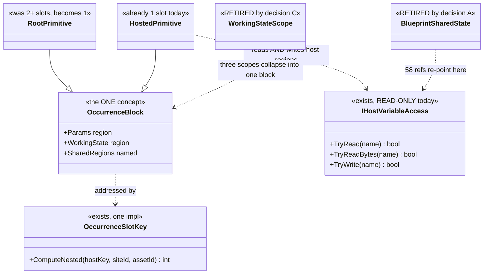
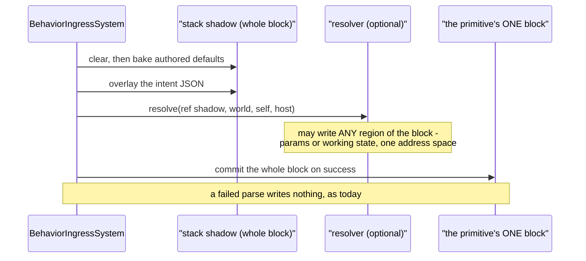
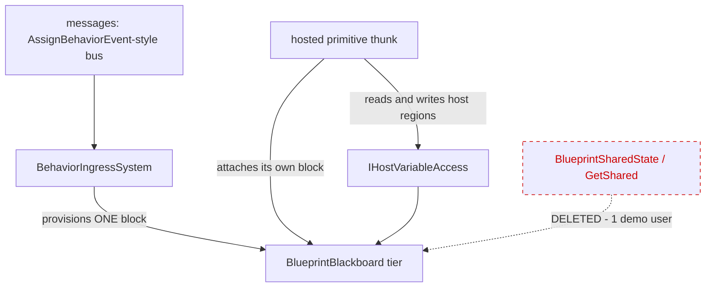

<!--STATUS
state: LIVE
updated: 2026-09-28
build-state: DESIGN — decisions A–E carry leans; nothing built. A requires the user's ruling
  because R-137 governs it (a capability is being removed, not refactored).
current-answer: §0 is the proposal in one paragraph and §1 the measurements that justify it.
  §4 carries the decisions. §5 is what is DELETED and §6 what is KEPT-BUT-RE-EXPRESSED — read
  both before quoting a deletion. §7 is why this is cheap (nothing here is persisted).
stale-below: nothing.
known-rot: none.
known-conflict: ⚠ Blueprint_SharedState_GetShared_Design.md §7 rules the opposite on ONE point —
  "Group/squad scope is not a separate scope — it is an Entity-scoped slot on the coordinator, read
  by members via the Slice-2 accessor", i.e. squad coordination by SHARED MEMORY. This document
  proposes messages instead, on the user's ruling and on the adoption measurement in §1.4. That
  design's own status note already defers cross-entity WRITE to "a deferred-event bus", so it is
  half-conceded there.
related-designs:
  - DESIGN_Occurrence_Scoped_Storage.md — owns the slot model this simplifies. Its §3 thesis ("an
    occurrence is a running instance of an asset; identity is (assetId, hostPath)") IS this
    proposal; its O3 row is the unfinished key unification this completes.
  - Blueprint_SharedState_GetShared_Design.md — owns GetShared/SetShared, the feature §5 retires
    and §6 re-expresses. Read its §1 for WHY the capability exists before removing anything.
  - DESIGN_Parameter_Model.md — owns the three data shapes and the bake/overlay/resolve order.
    Its §3.1 "AS MEASURED 2026-09-28" subsection records the scope findings this acts on.
  - Architect_Question_75_One_Params_Pipeline_And_One_Action_Binding.md — owns the params pipeline.
    ⛔ Q75 DEPENDS ON THIS: its S0 (one layout authority) is this document's first step, and its
    S1/S2 assume one answer to "where is this variable".
  - Architect_Question_39_Merge_Variables_And_Working_State.md — ruled "two names, one concept" for
    Variable/WorkingState. This is the storage half of that ruling.
-->
# Architect Question 76 — ONE blackboard block per running AI primitive

> 🔒 **User, `2026-09-28`, and it is the frame for everything below** *(verbatim, typo included —
> the ledger probes on the exact text)*: *"whatever more complex will anyway not survive the contact
> with behavior author's reality - too many options and complxity = not adopted"* ·
> *"i could imagine there is exactly one slot per behavior, keeping everything."*

---

## 0. ⭐⭐⭐ THE PROPOSAL, IN ONE PARAGRAPH

**One contiguous blackboard memory block per running AI primitive — root and hosted children
alike.** A primitive's block holds its parameters and its working state together. There are no
scopes, no name-keyed global regions and no second key scheme. Coordination between primitives of
one behaviour is a **named region of the host's block**, which children may read *and write*.
Coordination between entities is **messages**, not shared memory.

⭐ This is not a new model. It is [`DESIGN_Occurrence_Scoped_Storage`](DESIGN_Occurrence_Scoped_Storage.md)
§3's own thesis — *"an occurrence is a running instance of an asset on an entity"*, payload
`[cursor][Params][State]` — finished and applied to the root, which today is the one place that
does **not** follow it.

---

## 1. 🔴 INVENTORY — **measured `2026-09-28`; every removal below rests on a count**

⭐ **Queries run:** `search_code("JsonParamsDtoType")` · `search_code("BlackboardLayoutType")` ·
`check_index_coverage` on 11 cited paths *(`no_recorded_issue`, `generation_matches: true`)* · a
**runtime probe** over the built `Hrot.AI.Behaviors.dll` for struct-vs-manifest offsets · a parse of
every `.btree.json`, `.hsm.json` and `.bp.json` in the repo · `grep`+graph over the emitters,
`BehaviorIngressSystem`, `OccurrenceSlotKey` and `BlueprintSharedState`.

### 1.1 What a behaviour owns today

| region | count | contiguous |
|---|---|---|
| root params slot — every `Role=Input` variable | exactly 1 | ✅ |
| root brain state (BTree tree state / HSM instance) | 1 | separate slot |
| stateful working slots | **0 … 7** *(`PlatoonHillAttack2` = 7)* | one slot each |
| hosted occurrence — a child's `[cursor][Params][State]` | 0…N, at first tick | ✅ **one slot, both together** |

⇒ 🔴 **the ROOT is split across ≥2 slots while a HOSTED CHILD is not.** Same concept, two layouts,
and the root's split is the *newer* work *(`P3`, `CE-302`, `CE-319`)*.

### 1.2 Two key schemes for one concept

| scheme | keyed on | used for |
|---|---|---|
| scope-based — `OccurrenceSlotKey.Compute` | `Node`: asset+node · `Behavior`: asset+name · `Entity`: **name only** | per-node and declared working state |
| occurrence — `ComputeNested` | `(assetId, hostPath)` | hosted children |

⭐ The key **function** is already unified *(one implementation, thin forwarders)*. ⛔ The **model**
is not — and `DESIGN_Occurrence_Scoped_Storage`'s `O3` row is exactly that job, with its own note:
*"No behaviour changes yet."*

### 1.3 The three `WorkingStateScope` values, as built

| scope | declared users | verdict |
|---|---|---|
| `Node` = 0 — **the default** | **0** | 🔴 a standalone `Role=State` variable at this scope is **silently skipped** *(`BTreeBridgeEmitCore:1055`)* — no slot, no diagnostic. `CE-423` |
| `Behavior` = 1 | 4 | ✅ the only one that works as documented |
| `Entity` = 2 | 4 | ⚠ name-only key, entity-global. `CE-422` |

### 1.4 ⭐⭐⭐ Shared state — **the adoption measurement that decides `A`**

📐 Over **every** `.bp.json` in the repo:

| | |
|---|---|
| assets using `GetShared`/`SetShared` | **8** *(38 reads, 23 writes)* |
| distinct shared variables in existence | **2** — `state` (58 refs) and `rally` (3) |
| **cross-entity reads** | 🔴 **1**, in `SharedStateCrossEntityDemo`, whose own description says it exists to *prove the `Target` pin compiles* |
| reads of another primitive's **own** working state | ⛔ **0, and not expressible** — `SharedTypeId` is by definition *"a hand-written blittable struct, NOT a generated `_Bp+WorkingState`"* |
| production behaviours using any of it | ⛔ **0** — all six `state` users are `HillAssault2I_*`, the graphs of `PlatoonHillAttack2`, which lives in `Assets/BTrees/`**`Authoring/`**. The hill attack actually in use, `PlatoonHillAttack`, is hand-written C# and uses **no** `GetShared` |

⚠⚠ **But it is NOT unreferenced: 16 `HillAssault2*` proof-test files rest on it**, and
`PlatoonHillAttack2` is the **only end-to-end evidence that the blueprint route can express a
complex behaviour.** ⇒ §6, not §5.

---

## 2. ⭐⭐⭐ THE DIAGRAMS

### 2.1 Classes — grey = exists, and only the seam member is new

> ⭐ **Caption — what the picture shows that the prose hid.** `TryWrite` is the only genuinely new
> member in the whole proposal. Everything else is a deletion or a merge: drawing it made clear that
> the 58 `state` references do not need a mechanism, they need **one more method on a seam that
> already exists**.

### 2.2 Sequence — activation, with the scatter gone

> ⭐ **Caption.** Today this needs a *scatter* — the shadow covers only the params region and the
> working state lives in up to 7 other slots. With one block there is one copy and no scatter, which
> is what makes *"the resolver may write anywhere"* a one-line property rather than a feature.

### 2.3 Modules — who provisions, and the edge that disappears

> ⭐ **Caption — the dead edge is the whole of decision `A`.** Every other edge exists today.
> Cross-entity coordination moves from the dotted edge to `MSG`, which is the path the shared-state
> design **already chose for writes** and never built for reads.

---

## 3. ⛔ What this does NOT change

| | |
|---|---|
| ⛔ the bake → overlay → resolve ORDER | `DESIGN_Parameter_Model.md` §3.2 rules it |
| ⛔ parse-before-commit | the shadow still commits only on success |
| ⛔ tier promotion | the allocator is untouched; slot COUNT falls |
| ⛔ `IHostVariableAccess`'s read semantics | `TryWrite` is added beside them |

---

## 4. ⭐⭐⭐ THE DECISIONS

### A — retire cross-entity shared memory? ⚖️ **LEAN: YES — and it needs the USER's ruling, not mine**

⭐ 1 consumer, and it is its own proof (§1.4). ⭐ Cross-entity **write** was already deferred to
*"a deferred-event bus… mirroring `AssignBehaviorEvent`→`BehaviorIngressSystem`"* — so today's shape
is reads-by-memory and writes-by-messages, which is where slicing stopped rather than a decision.
⛔ **Rejected — keep it as an unpublished feature:** it is the arm that forces **name-only keying**,
and 37 same-entity reads pay that collision domain for it.
🔒 **`R-137` governs this** — a capability is being removed. ⇒ **the user rules; this document only
measures.**

### B — one block per running primitive? ⚖️ **LEAN: YES**

⭐ It is already the model for hosted children and for the root params table; only the root's
*split* deviates. ⭐ Slot count falls, so the tier budget *(`MaxSlots` 12/16/16/16)* improves.
⚠ **Cost:** one `StructureHash` per block instead of per region ⇒ a hot reload that changes any
variable invalidates that primitive's whole state. Acceptable — reload reprovisions anyway.

### C — retire `WorkingStateScope`? ⚖️ **LEAN: YES, all three values**

`Node` has **0** users and silently does nothing *(`CE-423`)*; `Behavior` becomes "a region of the
block"; `Entity` goes with decision `A`. ⇒ the enum, its authoring surface and its three key arms
all disappear. ⭐ **This is the single biggest cut in author-facing complexity**, and it is what the
user's framing asks for.

### D — add `IHostVariableAccess.TryWrite`? ⚖️ **LEAN: YES — the only new capability**

📐 The seam is read-only today. The 58 `state` references need a host-owned region they can write.
⛔ **Rejected — let a child write the host's block directly:** the seam exists to keep a child from
knowing the host's layout, and `TryWrite` preserves that.

### E — does `Q75` depend on this, or the reverse? ⚖️ **LEAN: `Q75` DEPENDS ON THIS**

`Q75`'s `S0` *(one layout authority — `CE-418`)* is this document's first step, and its `S1`/`S2`
assume a single answer to *"where is this variable"*. ⇒ **build `S0` here, then `Q75` resumes.**

---

## 5. 🔴 DELETED

| | users | note |
|---|---|---|
| `GetShared`'s cross-entity `Target` pin | 1 *(a proof)* | decision `A` |
| `SharedStateCrossEntityDemo`, `SharedStateRallyDemo` and the `rally` variable | 2 demos | delete with `A` |
| `WorkingStateScope` and its three key arms | see §1.3 | decision `C` |
| `BlueprintSharedState` + `IrOp_ReadShared`/`IrOp_WriteShared` | — | re-expressed, §6 |

## 6. ⭐⭐ KEPT, RE-EXPRESSED — **and this is the part that must not be read as a deletion**

| | |
|---|---|
| ⭐⭐⭐ **`PlatoonHillAttack2` and its six `HillAssault2I_*` graphs** | ⛔⛔ **DO NOT DELETE.** 📐 **16 `HillAssault2*` proof-test files rest on them**, and they are the **only end-to-end evidence the blueprint route can express a complex behaviour.** ⚠ *"Never used in production"* is true and is **not** the test — `R-129`'s rule applies: unreferenced ≠ unintentional, and these are heavily referenced. ⇒ **re-author `state` from a shared slot onto a host blackboard variable**; every rail survives |
| the capability *"several hosted primitives of one behaviour share one plan struct"* | ⭐ becomes a **named region of the host's block**, read and written through `IHostVariableAccess` |

## 7. ⭐⭐ WHY THIS IS CHEAPER THAN IT LOOKS

🔒 **The occurrence store is `[DataPolicy(NoScenario)]` — nothing in it is serialised**, and inputs
are re-supplied at every activation. ⇒ **every slot key may change with NO save-file or replay
migration.** That removes what is normally the expensive half of a storage change.

⚠ **What it does cost:** every rail that hard-codes a slot key is re-authored
*(`OccurrenceSlotKeyParityTests`, the `*_ProofTests` that compute expected keys)*, and the 17 BTree
blackboard goldens move.

## 8. Rails this owes

| | |
|---|---|
| ⭐⭐⭐ **one block per primitive** | for every corpus behaviour, the slot count equals the number of running primitives — ⛔ no per-node or per-variable extras |
| ⭐⭐ **the layout parity rail** *(`Q75` `S0`)* | manifest offset == the layout type's actual field offset. 📐 **Red-proves on today's tree: 3 of 15 assets, 9 of 31 fields** |
| ⭐⭐ **the resolver writes anywhere** | a resolver that writes a working-state region has its bytes visible after commit, and **nothing** after a failed parse |
| ⭐ **`PlatoonHillAttack2` still passes** | all 16 `HillAssault2*` proof suites green after the re-author — the acceptance test for §6 |
| ⭐ **no scope remains** | `WorkingStateScope` has no references outside history |
