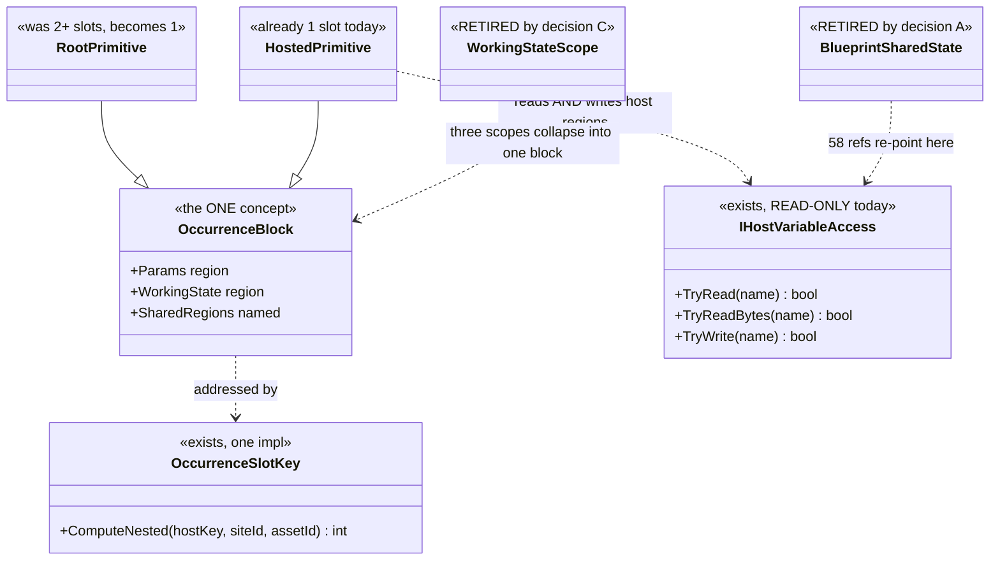
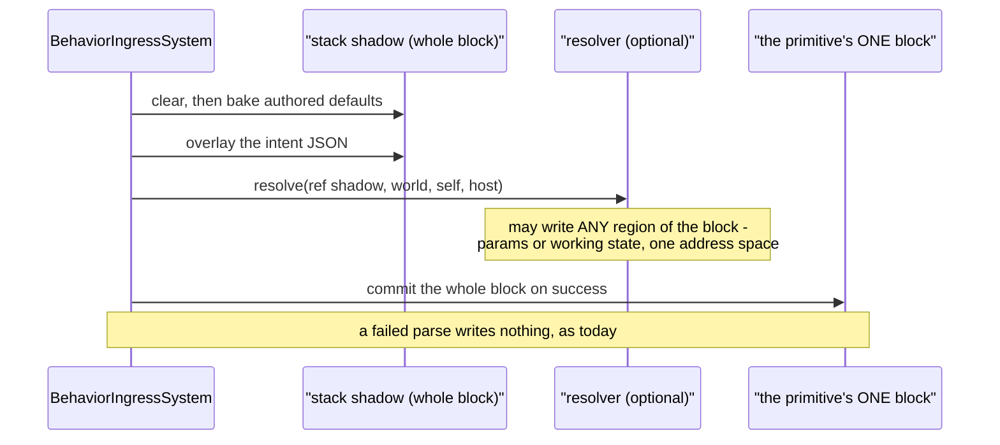
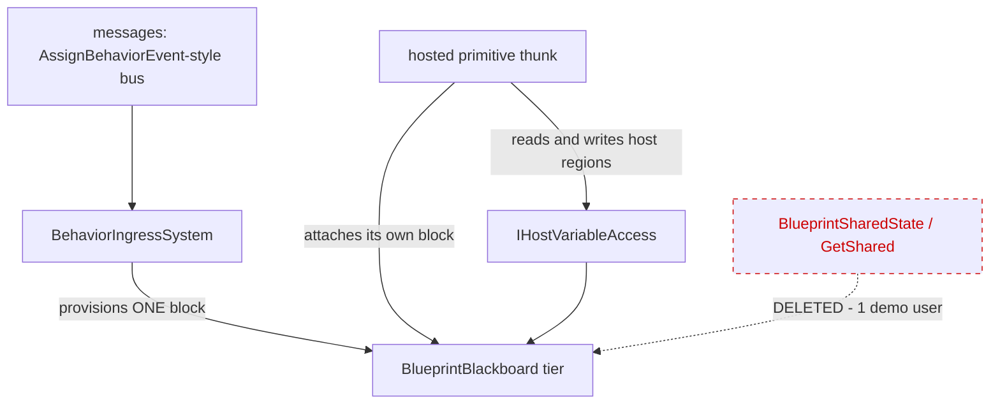

<!--STATUS
state: LIVE
updated: 2026-09-28
build-state: DESIGN — NOTHING BUILT, AND NOTHING IS TO BE STARTED (user, 2026-09-28: "yes, record
  both, do not start anything" · "not approved, i want it recorded so i can return to it any time").
  A and C are RESOLVED (remove, both sequenced inside B); B, D and E carry leans and are NOT
  approved. ⛔ A resolved decision is not a licence to build: no slice of this document, including
  Q75's S0, has been authorised.
  ⛔⛔ AND A AND C ARE INERT ON THEIR OWN — read this before treating them as work in hand. Both
  resolve to "remove, sequenced inside B", and B is undecided. If B is never taken, NEITHER removal
  happens: A standalone is ~200 lines and PARKS under the user's own rule, and C is impossible
  because scope can only go once occurrence identity supplies the keying. ⇒ the two resolutions are
  real decisions hanging off an open premise, not a backlog. §10 is the way back in.
current-answer: §0 is the proposal in one paragraph and §1 the measurements that justify it.
  §4 carries the decisions — A and C are RESOLVED with the measurement each was decided on; B, D, E
  are leans. §5 is what is DELETED and §6 what is KEPT-BUT-RE-EXPRESSED — read both before quoting
  a deletion. §7 is why this is cheap (nothing here is persisted).
decision-rule: 🔒 The user's test for both resolved decisions, verbatim: "will the removal simplify
  the code dramatically? if not, let's park it. if yes, let's remove it." Each resolution therefore
  carries its measurement inline, and BOTH answers are "remove ONLY as part of B" — A alone is
  ~200 lines and would park under the same rule. Reuse the rule on the next such question.
stale-below: nothing.
known-rot: none.
known-conflict: ⚠ Blueprint_SharedState_GetShared_Design.md §7 rules the opposite on ONE point —
  "Group/squad scope is not a separate scope — it is an Entity-scoped slot on the coordinator, read
  by members via the Slice-2 accessor", i.e. squad coordination by SHARED MEMORY. This document
  proposes messages instead, on the user's ruling and on the adoption measurement in §1.4. That
  design's own status note already defers cross-entity WRITE to "a deferred-event bus", so it is
  half-conceded there.
related-designs:
  - DESIGN_Occurrence_Scoped_Storage.md — owns the slot model this simplifies. Its §3 thesis ("an
    occurrence is a running instance of an asset; identity is (assetId, hostPath)") IS this
    proposal; its O3 row is the unfinished key unification this completes.
  - Blueprint_SharedState_GetShared_Design.md — owns GetShared/SetShared, the feature §5 retires
    and §6 re-expresses. Read its §1 for WHY the capability exists before removing anything.
  - DESIGN_Parameter_Model.md — owns the three data shapes and the bake/overlay/resolve order.
    Its §3.1 "AS MEASURED 2026-09-28" subsection records the scope findings this acts on.
  - Architect_Question_75_One_Params_Pipeline_And_One_Action_Binding.md — owns the params pipeline.
    ⛔ Q75 DEPENDS ON THIS: its S0 (one layout authority) is this document's first step, and its
    S1/S2 assume one answer to "where is this variable".
  - Architect_Question_39_Merge_Variables_And_Working_State.md — ruled "two names, one concept" for
    Variable/WorkingState. This is the storage half of that ruling.
-->
# Architect Question 76 — ONE blackboard block per running AI primitive

> 🔒 **User, `2026-09-28`, and it is the frame for everything below** *(verbatim, typo included —
> the ledger probes on the exact text)*: *"whatever more complex will anyway not survive the contact
> with behavior author's reality - too many options and complxity = not adopted"* ·
> *"i could imagine there is exactly one slot per behavior, keeping everything."*

---

## 0. ⭐⭐⭐ THE PROPOSAL, IN ONE PARAGRAPH

**One contiguous blackboard memory block per running AI primitive — root and hosted children
alike.** A primitive's block holds its parameters and its working state together. There are no
scopes, no name-keyed global regions and no second key scheme. Coordination between primitives of
one behaviour is a **named region of the host's block**, which children may read *and write*.
Coordination between entities is **messages**, not shared memory.

⭐ This is not a new model. It is [`DESIGN_Occurrence_Scoped_Storage`](DESIGN_Occurrence_Scoped_Storage.md)
§3's own thesis — *"an occurrence is a running instance of an asset on an entity"*, payload
`[cursor][Params][State]` — finished and applied to the root, which today is the one place that
does **not** follow it.

---

## 1. 🔴 INVENTORY — **measured `2026-09-28`; every removal below rests on a count**

⭐ **Queries run:** `search_code("JsonParamsDtoType")` · `search_code("BlackboardLayoutType")` ·
`check_index_coverage` on 11 cited paths *(`no_recorded_issue`, `generation_matches: true`)* · a
**runtime probe** over the built `Hrot.AI.Behaviors.dll` for struct-vs-manifest offsets · a parse of
every `.btree.json`, `.hsm.json` and `.bp.json` in the repo · `grep`+graph over the emitters,
`BehaviorIngressSystem`, `OccurrenceSlotKey` and `BlueprintSharedState`.

### 1.1 What a behaviour owns today

| region | count | contiguous |
|---|---|---|
| root params slot — every `Role=Input` variable | exactly 1 | ✅ |
| root brain state (BTree tree state / HSM instance) | 1 | separate slot |
| stateful working slots | **0 … 7** *(`PlatoonHillAttack2` = 7)* | one slot each |
| hosted occurrence — a child's `[cursor][Params][State]` | 0…N, at first tick | ✅ **one slot, both together** |

⇒ 🔴 **the ROOT is split across ≥2 slots while a HOSTED CHILD is not.** Same concept, two layouts,
and the root's split is the *newer* work *(`P3`, `CE-302`, `CE-319`)*.

### 1.2 Two key schemes for one concept

| scheme | keyed on | used for |
|---|---|---|
| scope-based — `OccurrenceSlotKey.Compute` | `Node`: asset+node · `Behavior`: asset+name · `Entity`: **name only** | per-node and declared working state |
| occurrence — `ComputeNested` | `(assetId, hostPath)` | hosted children |

⭐ The key **function** is already unified *(one implementation, thin forwarders)*. ⛔ The **model**
is not — and `DESIGN_Occurrence_Scoped_Storage`'s `O3` row is exactly that job, with its own note:
*"No behaviour changes yet."*

### 1.3 The three `WorkingStateScope` values, as built

| scope | declared users | verdict |
|---|---|---|
| `Node` = 0 — **the default** | **0** | 🔴 a standalone `Role=State` variable at this scope is **silently skipped** *(`BTreeBridgeEmitCore:1055`)* — no slot, no diagnostic. `CE-423` |
| `Behavior` = 1 | 4 | ✅ the only one that works as documented |
| `Entity` = 2 | 4 | ⚠ name-only key, entity-global. `CE-422` |

### 1.4 ⭐⭐⭐ Shared state — **the adoption measurement that decides `A`**

📐 Over **every** `.bp.json` in the repo:

| | |
|---|---|
| assets using `GetShared`/`SetShared` | **8** *(38 reads, 23 writes)* |
| distinct shared variables in existence | **2** — `state` (58 refs) and `rally` (3) |
| **cross-entity reads** | 🔴 **1**, in `SharedStateCrossEntityDemo`, whose own description says it exists to *prove the `Target` pin compiles* |
| reads of another primitive's **own** working state | ⛔ **0, and not expressible** — `SharedTypeId` is by definition *"a hand-written blittable struct, NOT a generated `_Bp+WorkingState`"* |
| production behaviours using any of it | ⛔ **0** — all six `state` users are `HillAssault2I_*`, the graphs of `PlatoonHillAttack2`, which lives in `Assets/BTrees/`**`Authoring/`**. The hill attack actually in use, `PlatoonHillAttack`, is hand-written C# and uses **no** `GetShared` |

⚠⚠ **But it is NOT unreferenced: 16 `HillAssault2*` proof-test files rest on it**, and
`PlatoonHillAttack2` is the **only end-to-end evidence that the blueprint route can express a
complex behaviour.** ⇒ §6, not §5.

---

## 2. ⭐⭐⭐ THE DIAGRAMS

### 2.1 Classes — grey = exists, and only the seam member is new

> ⭐ **Caption — what the picture shows that the prose hid.** `TryWrite` is the only genuinely new
> member in the whole proposal. Everything else is a deletion or a merge: drawing it made clear that
> the 58 `state` references do not need a mechanism, they need **one more method on a seam that
> already exists**.

### 2.2 Sequence — activation, with the scatter gone

> ⭐ **Caption.** Today this needs a *scatter* — the shadow covers only the params region and the
> working state lives in up to 7 other slots. With one block there is one copy and no scatter, which
> is what makes *"the resolver may write anywhere"* a one-line property rather than a feature.

### 2.3 Modules — who provisions, and the edge that disappears

> ⭐ **Caption — the dead edge is the whole of decision `A`.** Every other edge exists today.
> Cross-entity coordination moves from the dotted edge to `MSG`, which is the path the shared-state
> design **already chose for writes** and never built for reads.

---

## 3. ⛔ What this does NOT change

| | |
|---|---|
| ⛔ the bake → overlay → resolve ORDER | `DESIGN_Parameter_Model.md` §3.2 rules it |
| ⛔ parse-before-commit | the shadow still commits only on success |
| ⛔ tier promotion | the allocator is untouched; slot COUNT falls |
| ⛔ `IHostVariableAccess`'s read semantics | `TryWrite` is added beside them |

---

## 4. ⭐⭐⭐ THE DECISIONS

### A — retire cross-entity shared memory? ✅ **RESOLVED `2026-09-28`: REMOVE, SEQUENCED INSIDE `B`**

> 🔒 **The user's decision RULE, verbatim:** *"will the removal simplify the code dramatically? if
> not, let's park it. if yes, let's remove it."* ⇒ ⭐⭐ **the ruling is the rule plus the
> measurement below**, not a preference — and it is reusable on the next such question.

⭐ 1 consumer, and it is its own proof (§1.4). ⭐ Cross-entity **write** was already deferred to
*"a deferred-event bus… mirroring `AssignBehaviorEvent`→`BehaviorIngressSystem`"* — so today's shape
is reads-by-memory and writes-by-messages, which is where slicing stopped rather than a decision.
⛔ **Rejected — keep it as an unpublished feature:** it is the arm that forces **name-only keying**,
and 37 same-entity reads pay that collision domain for it.

📐 **THE SIMPLIFICATION, MEASURED** *(this is what the rule was applied to)*:

| | |
|---|---|
| **whole files deleted** | **10, totalling 1 356 lines** — `SharedNodeDrawers.cs` 534 · `BlueprintSharedStateTests.cs` 277 · `BlueprintSharedState.cs` 216 · `ISharedStructTypeProvider.cs` 75 · `HillAttackSharedStateOps` 58 · `HillAttackSharedState` 50 · `SquadRallyState` 44 · `StatefulScopeQueries.cs` 46 · `IStatefulScopeAsset.cs` 36 · `StatefulSlotScope.cs` 20 |
| scattered arms | `GetSharedNode`/`SetSharedNode` **119 refs / 19 files** · `SharedTypeId` 79/12 · `BlueprintSharedState` 26/13 · `IrOp_ReadShared`/`WriteShared` 15/4 |
| ⭐⭐ **it is a FULL VERTICAL SLICE of the compiler** | an arm in **every** stage: node model → pin schema → `Stage0_Rehydrate` → `Stage2_Validate` + `BP2040`–`2042` → `Stage5_Schedule` → IR + `IrPrinter` → `StatementEmitter` → editor palette/drawers/command sink/graph model → the runtime accessor. ⇒ **one whole node kind leaves the blueprint language, end to end** |
| replacement cost | ~150 lines — `IHostVariableAccess.TryWrite`, re-point `PlatoonHillAttack2` at the clean twins (§6), one composition rail |

⚠⚠ **SEQUENCING, and it is part of the ruling:** 📐 **`A` ALONE is NOT dramatic** — the `Target`
pin, one `Stage0` arm, one demo asset and `T38`, order of 200 lines. ⛔ On the user's own rule that
would be *"park"*. ⭐⭐ **The 1 356 lines only become available once `B` gives the 58 `state`
references a home** ⇒ **do NOT cut `A` standalone**; it lands inside `B` or not at all.

🔒 **`R-137` is satisfied** — the capability is removed by an explicit user decision against a
measurement, not silently lost to a refactor. 📄 `R-150` is the general form.

### B — one block per running primitive? ⚖️ **LEAN: YES**

⭐ It is already the model for hosted children and for the root params table; only the root's
*split* deviates. ⭐ Slot count falls, so the tier budget *(`MaxSlots` 12/16/16/16)* improves.
⚠ **Cost:** one `StructureHash` per block instead of per region ⇒ a hot reload that changes any
variable invalidates that primitive's whole state. Acceptable — reload reprovisions anyway.

### C — retire `WorkingStateScope`? ✅ **RESOLVED `2026-09-28`: REMOVE, SEQUENCED INSIDE `B`**

> 🔒 **User:** *"..same rule should be applied to scoping the blackboard variables"* — i.e. the same
> measure-the-simplification test as `A`. ⭐ It clears, and **more decisively than `A` does.**

`Node` has **0** declared users and silently does nothing *(`CE-423`)*; `Behavior` becomes "a named
region of the block"; `Entity` goes with decision `A`.

📐 **THE SIMPLIFICATION, MEASURED** *(production references, tests excluded unless stated)*:

| | |
|---|---|
| 🔴 **THREE PARALLEL ENUMS FOR ONE CONCEPT** | `WorkingStateScope` *(authoring, netstandard2.0)* **38 refs / 16 files** · `StatefulSlotScope` *(runtime)* **29 / 10** · `OccurrenceSlotScope` *(the key)* **27** ⇒ **94 references across three spellings.** ⚠ The triplication is itself a symptom of `F5`'s two key schemes |
| ⭐⭐⭐ **author-facing surface** | **77** references of Scope in the variable panel, the authoring window and the variable editor — **a three-valued dropdown on every blackboard variable** |
| file format | **3 members** — `BehaviorTreeAssetDto:50`, `HsmAssetDto:300`, `BlackboardVariableEntry:41` ⇒ both hosts and the editor model |
| runtime manifest | **102** `Scope` references under `Fdp.Toolkits/Behavior/` |
| resolution machinery | `ResolveStatefulSlotKey` 11 · `StatefulScopeVariable` 11 · `ResolveVariableRoleScope` 2, plus their bodies |
| whole files | `StatefulScopeQueries.cs` 46 · `IStatefulScopeAsset.cs` 36 · `StatefulSlotScope.cs` 20 = **102 lines** *(also counted in `A`)* |
| test files referencing it | **37** *(27 + 10)* |
| ⭐⭐⭐ **against AUTHORED USES in the whole corpus** | **8** — 4 `Behavior`, 4 `Entity`, **0 `Node`** *(and `Node` is the DEFAULT)* |

⇒ ⭐⭐⭐ **~200 production reference sites, 77 of them author-facing, for 8 authored uses.**

⭐⭐ **Why this is the stronger case even though `A` deletes more lines.** Scope is **the only one of
these concepts an author must hold in their head**: a dropdown where *one value is silently broken*,
*one means something other than its name* and *one works*. The shared-state accessor, for all its
1 356 lines, is invisible to an author who never places the node. 🔒 That is exactly `R-150`'s
criterion — complexity the author must understand is the cost that matters.

⭐ **The residue is small:** the 4 `Behavior`-scoped variables become named regions of the host's
block — which is what `Behavior` scope already means. ⚠ **The key function SHRINKS, it does not
vanish:** `ComputeNested(hostKey, siteId, assetId)` survives for hosted occurrences; only the three
scope arms go.

⚠ **Same sequencing as `A`:** `C` is only possible once `B` supplies keying from occurrence
identity. ⇒ **not a standalone cut.**

### D — add `IHostVariableAccess.TryWrite`? ⚖️ **LEAN: YES — but it CONTRADICTS A DOCUMENTED RULE, and that must be argued, not skipped**

📐 The seam is read-only today. The 58 `state` references need a host-owned region they can write.
⛔ **Rejected — let a child write the host's block directly:** the seam exists to keep a child from
knowing the host's layout, and `TryWrite` preserves that.

#### 🔴🔴 D.1 — **THE SEAM'S OWN HEADER FORBIDS THIS, IN TERMS**

⚠⚠ **This lean was first written without reading `IHostVariableAccess`'s header — an `R-129` miss,
and the intent was sitting in the file being extended.** 📐 Verbatim, `IHostVariableAccess.cs`:

> ⛔ **READ-ONLY.** *A resolver never writes its host — **a write path here would be a second supply
> mechanism.***

🔒 That is **ruling 9** *(one supply mechanism)* applied to this seam, alongside a second stated
rule — *"Resolve-once still holds. This reads the host at the CHILD'S ACTIVATION, not continuously
— live binding stays out of the model."*

⚖️ **The counter-argument, offered as an argument rather than an omission:**

| the rule guards | does `TryWrite` breach it? |
|---|---|
| ⭐ **PARAMS SUPPLY** — how a params region gets its values at activation, which must have exactly one path | ⛔ **No, if `TryWrite` is restricted to `Role=State` regions.** Working state is not supplied; it is zero-init and mutated each tick by the primitive that owns it. A second *supply* path would be a child writing another region's **params** |
| ⭐ **resolve-once / no live binding** | ⚠ **Partly yes, and this is the real cost.** A child writing a host region **every tick** is exactly the continuous coupling the header excludes. ⇒ if `D` is taken, the write must be **as unrestricted in time as an ordinary working-state write already is**, and the *"resolve-once"* rule must be restated as applying to **params only** |

⇒ ⭐⭐ **`D` is therefore a DELIBERATE NARROWING of the header's rule, not a reading of it:**
*"read-only for params, read-write for shared working state."* ⛔ **It must not be built until that
narrowing is accepted**, because the header's rule is the one thing standing between this and a
second supply mechanism. 📄 The header itself is also **factually stale** — see `CE-424`.

⚠ **What would change the lean:** if the 4 `Behavior`-scoped uses can be re-expressed as the host
*owning* the mutation *(children return values, the host writes)*, `TryWrite` is unnecessary and the
header's rule survives intact. 📐 **Not yet measured** — it needs a read of the six
`HillAssault2I_*` graphs' actual write patterns, which is a prerequisite of `B` rather than of `D`.

### E — does `Q75` depend on this, or the reverse? ⚖️ **LEAN: `Q75` DEPENDS ON THIS**

`Q75`'s `S0` *(one layout authority — `CE-418`)* is this document's first step, and its `S1`/`S2`
assume a single answer to *"where is this variable"*. ⇒ **build `S0` here, then `Q75` resumes.**

---

## 5. 🔴 DELETED

| | users | note |
|---|---|---|
| `GetShared`'s cross-entity `Target` pin | 1 *(a proof)* | decision `A` |
| `SharedStateCrossEntityDemo`, `SharedStateRallyDemo` and the `rally` variable | 2 demos | delete with `A` |
| `WorkingStateScope` and its three key arms | see §1.3 | decision `C` |
| `BlueprintSharedState` + `IrOp_ReadShared`/`IrOp_WriteShared` | — | re-expressed, §6 |

## 6. ⭐⭐ KEPT, RE-EXPRESSED — **and this is the part that must not be read as a deletion**

| | |
|---|---|
| ⭐⭐⭐ **`PlatoonHillAttack2` — the COMPOSED TREE** | ⭐ **KEEP, but re-point it.** It is the only **large-scale** composition demonstrator: one tree hosting **7** blueprint primitives. The `T*` suite proves composition at 2–3 primitives; nothing else proves it at 7 |
| 🔴 **the six `HillAssault2I_*` graphs** | ⛔⛔ **DELETE — and this REVERSES this document's first draft.** 📐 **Every one has a CLEAN TWIN**: `HillAssault2_CalculateSegments`, `_DispatchAllToBaseline`, `_DispatchWaveWithTargets`, `_IsAreaQueryResolved`, `_IsWaveCompleted`, `_RequestAreaQuery` all exist **without** shared state. ⇒ **the `I` generation exists to exercise the shared-state mechanism, not because the behaviour needs it** — 🔒 the user's *"the demo is pretty old, used to lift/develop the blueprint capabilities, so it might be a bit synthetic"* is measurably correct. ⇒ **re-point `PlatoonHillAttack2` at the clean twins**, delete the six `I` duplicates |
| the 2 shared-state proof files | ⛔ **DELETE with the feature** — `PlatoonHillAttack2_Integration_ProofTests` (3) and `HillAssault2I_Integration_Smoke_ProofTests` (3). ⚠ Two of those six are **the same test duplicated across both files** *(`StandaloneStateVariable_EmitsManifestEntry_MatchingBlueprintSharedStateExpectedHash`)*, and one asserts only that generated SOURCE TEXT contains `GetShared`. ⭐ A replacement composition rail for the re-pointed tree replaces them |
| ⭐ the other ~14 `HillAssault2_*` proof files *(≈50 tests)* | ⭐⭐ **UNTOUCHED** — they test blueprint NODE semantics *(`ForEachSubordinate`, `HasTarget`, `AimAndFireSpecific`, `IsSelfArrived`, `ReverseToBaseline`, …)* on the clean assets and never reference shared state |

> 🔴🔴 **CORRECTION, and the user's persistence produced it.** This section first said *"DO NOT DELETE — 16 proof-test files rest on them and they are the only end-to-end evidence the blueprint route can express a complex behaviour."* 📐 **Both halves were wrong.** Only **2** of the 17 proof files are shared-state-specific, and the capability coverage is **duplicated**: the focused `T30`–`T39` suite proves each mechanism minimally *(`T35` shared working state, `T36` `GetShared`/`SetShared`, `T37` manifest provisioning, `T38` cross-entity read)*, while the `I` generation proves the same things through a large synthetic behaviour. ⇒ ⭐ **removing shared state costs ZERO unique node-semantics coverage.** ⚠ What it genuinely costs is the 7-primitive composition example — which the re-point preserves.
| the capability *"several hosted primitives of one behaviour share one plan struct"* | ⭐ becomes a **named region of the host's block**, read and written through `IHostVariableAccess` |

## 7. ⭐⭐ WHY THIS IS CHEAPER THAN IT LOOKS

🔒 **The occurrence store is `[DataPolicy(NoScenario)]` — nothing in it is serialised**, and inputs
are re-supplied at every activation. ⇒ **every slot key may change with NO save-file or replay
migration.** That removes what is normally the expensive half of a storage change.

⚠ **What it does cost:** every rail that hard-codes a slot key is re-authored
*(`OccurrenceSlotKeyParityTests`, the `*_ProofTests` that compute expected keys)*, and the 17 BTree
blackboard goldens move.

## 8. Rails this owes

| | |
|---|---|
| ⭐⭐⭐ **one block per primitive** | for every corpus behaviour, the slot count equals the number of running primitives — ⛔ no per-node or per-variable extras |
| ⭐⭐ **the layout parity rail** *(`Q75` `S0`)* | manifest offset == the layout type's actual field offset. 📐 **Red-proves on today's tree: 3 of 15 assets, 9 of 31 fields** |
| ⭐⭐ **the resolver writes anywhere** | a resolver that writes a working-state region has its bytes visible after commit, and **nothing** after a failed parse |
| ⭐ **`PlatoonHillAttack2` still passes** | all 16 `HillAssault2*` proof suites green after the re-author — the acceptance test for §6 |
| ⭐ **no scope remains** | `WorkingStateScope` has no references outside history |

---

## 9. 📌 PROVENANCE — **why the shared-state model was built, and what the user said about it the next day**

> 🔒 **User, `2026-09-28`:** *"I am still wondering why the sharing concept was implemented at all -
> not used, complex to implement, might have some reason"*

⭐ **It had a reason, it was reviewed, and the complaint being made today was made 14 months ago —
within 24 hours of it shipping.**

| when | what |
|---|---|
| `2026-07-15` | Slices 1, 2a and 2b ship. 📄 `Blueprint_SharedState_GetShared_Design.md`, **architect-reviewed** *(`Q1`–`Q5` + `2b-Q1`–`Q4`)*. ⭐ The stated need is a **capability ceiling**, not a behaviour: *"a blueprint AiPrimitive generates one `TickCore` with **exactly one** `WorkingState` struct… a ceiling for two distinct needs"* — cross-node sharing, and one node reaching a second slot |
| 🔴 **`2026-07-16`, the NEXT DAY** | 📄 **`Blueprint_Subsystem_Slice2_Candidates.md` §A11**, *"Raised by the user from hands-on Windows testing of the composed-blueprint + `GetShared`/`SetShared` authoring path"*, verbatim: *"all the variable and scope and default values and GetShared/SetShared and params vs working state, this is a lot to digest for a user … beyond the capability of an ordinary user (needs a programmer mindset). Without [visual documentation] the system is incomprehensible."* |
| ⚠ **the response at the time** | **A11 — "Visual conceptual documentation for the shared-state / working-state model" `[HIGH | S]`**: a scope decision tree, a two-entity data-flow diagram, an end-to-end authoring flow. ⛔ **Triaged as a DOCUMENTATION gap, not as a design one** |
| `2026-09-28` | The same complaint, in the same words, produces `R-150` and this document instead |

⇒ ⭐⭐⭐ **The lesson worth keeping, and it is the general form of `R-150`:** the evidence that the
model was over-built existed **one day** after it shipped, from the only person who would ever
author with it. ⛔ It was answered with *"explain it better"*. 📐 The adoption measurement in §1.4 is
what that answer cost: 14 months later the feature has **six duplicate assets and two demos**, and
the six duplicates each shadow a clean twin that predates them.

⚠ **Stated fairly, because the decision was not careless:** the ceiling was real *(one
`WorkingState` per primitive genuinely is a limit)*, the design was architect-reviewed, and `Q4`
gated the hazardous scope behind safeguards. ⛔ **What went wrong was not the build — it was
treating an author's "this is incomprehensible" as a documentation request.**

---

## 10. ⭐⭐⭐ THE WAY BACK IN — **parked deliberately, `2026-09-28`**

> 🔒 **User:** *"not approved, i want it recorded so i can return to it any time."*
> ⇒ ⛔ **This is NOT a stalled batch and NOT a backlog item.** It is a decision left open on
> purpose, with everything needed to take it already measured. **Nothing expires.**

### 10.1 ⭐ The ONE question to answer on return

> **Do we adopt `B` — one contiguous blackboard block per running AI primitive, root and children
> alike?**

⭐ **Everything else follows.** `A` and `C` are already decided *and fire only if `B` is yes*; `D`
and `E` are subordinate to it. ⛔ **There is no second question to prepare.**

### 10.2 📐 What is already measured, so it need not be re-derived

| the question | ✅ the answer, and where |
|---|---|
| does the root really differ from a hosted child? | ✅ §1.1 — root is ≥2 slots, a hosted child is 1 |
| is this a new model? | ⛔ no — §0, it is `DESIGN_Occurrence_Scoped_Storage` §3's own thesis, and its `O3` row is the unfinished half |
| what does `B` cost in data migration? | ✅ **nothing** — §7, the store is `[DataPolicy(NoScenario)]` |
| what does retiring shared memory save? | ✅ **10 files / 1 356 lines** + a vertical slice of the compiler — §4-`A` |
| what does retiring scope save? | ✅ **~200 production sites, 77 author-facing, for 8 authored uses** — §4-`C` |
| will anything shipped break? | ⛔ **no production behaviour uses any of it** — §1.4 |
| does `PlatoonHillAttack2` have to die? | ⛔ **no** — §6: keep it, re-point it at the clean twins |
| why was it built? | ✅ §9 — an architect-reviewed capability slice, and the author's complaint arrived the next day |

### 10.3 ⚠ The ONE thing still unmeasured, and it belongs to `B`'s first step

📐 **Whether the four `Behavior`-scoped uses can be re-expressed with the HOST owning the mutation**
*(children return values, the host writes)*. ⭐ If yes, decision `D`'s `TryWrite` is unnecessary and
`IHostVariableAccess`'s read-only rule survives untouched *(§D.1)*. ⇒ **a read of the six
`HillAssault2I_*` graphs' write patterns** — ⛔ not needed to decide `B`, only to execute it.

### 10.4 🔴 The findings that are waiting on this, and what happens to each

| id | if `B` is taken | if `B` is dropped |
|---|---|---|
| [`CE-418`](Blueprint_Issues_Tracker.md) *(two offset authorities)* | ⭐ its fix is `B`'s first step | 🔴 **must still be fixed on its own** — it is a live defect either way, and `Q75` is blocked on it |
| [`CE-420`](Blueprint_Issues_Tracker.md) *(`Role=State` default dropped)* | ⭐ subsumed | must be fixed in `ProvisionStatefulSlots` |
| [`CE-421`](Blueprint_Issues_Tracker.md) *(shadow carry-over)* | ⭐ independent — fix either way | same |
| [`CE-422`](Blueprint_Issues_Tracker.md) *(`Entity` scope)* · [`CE-423`](Blueprint_Issues_Tracker.md) *(`Node` scope silently skipped)* | ⭐⭐ **both DISSOLVE** — the scope they describe stops existing | 🔴 **both become real fixes** — reword one, diagnose the other |
| [`CE-424`](Blueprint_Issues_Tracker.md) *(stale seam header)* | ⭐ fix while touching the seam | fix anyway, it is two sentences |

⇒ ⭐⭐⭐ **`CE-418` is the one that does not wait.** It is a live defect in two user-facing surfaces
*(StructEdit's typed params editor and the replay predicate compiler)*, it blocks `Q75`, and its fix
is identical under both outcomes. ⛔ **Everything else can sit.**
