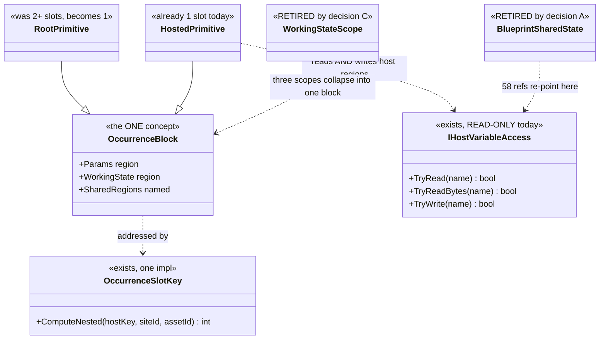
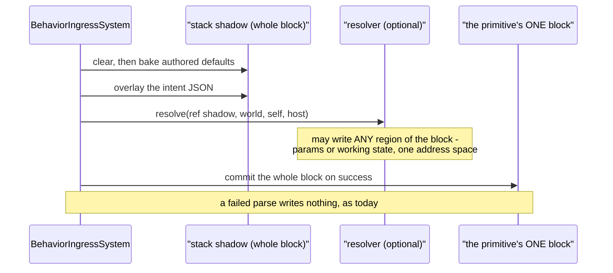
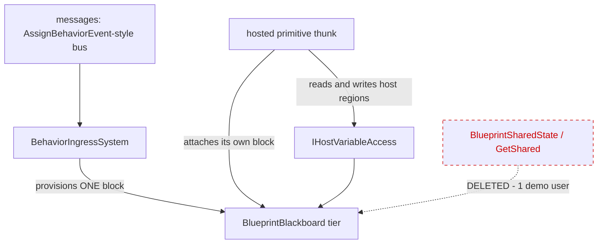
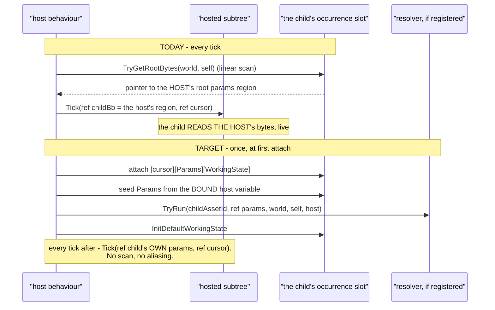
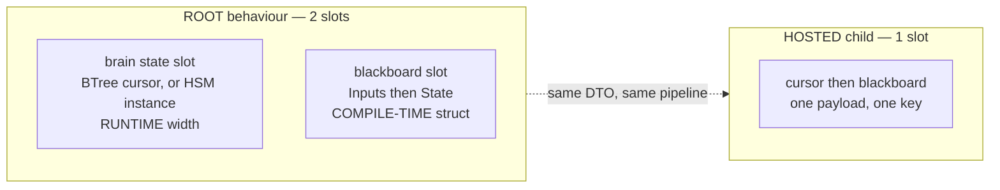
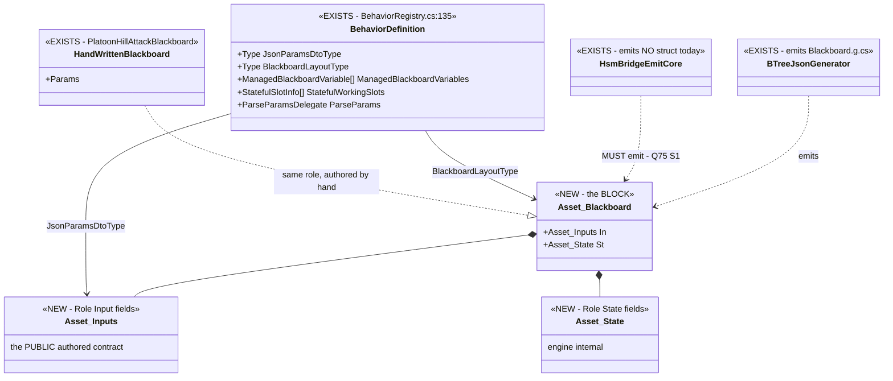
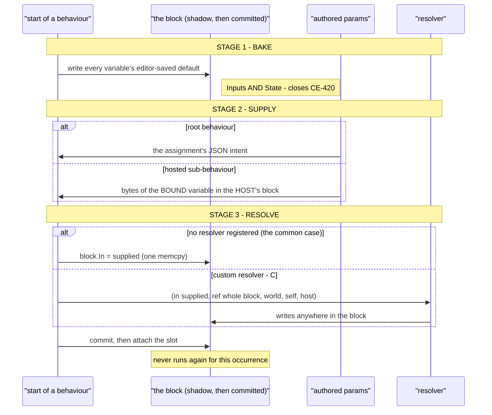
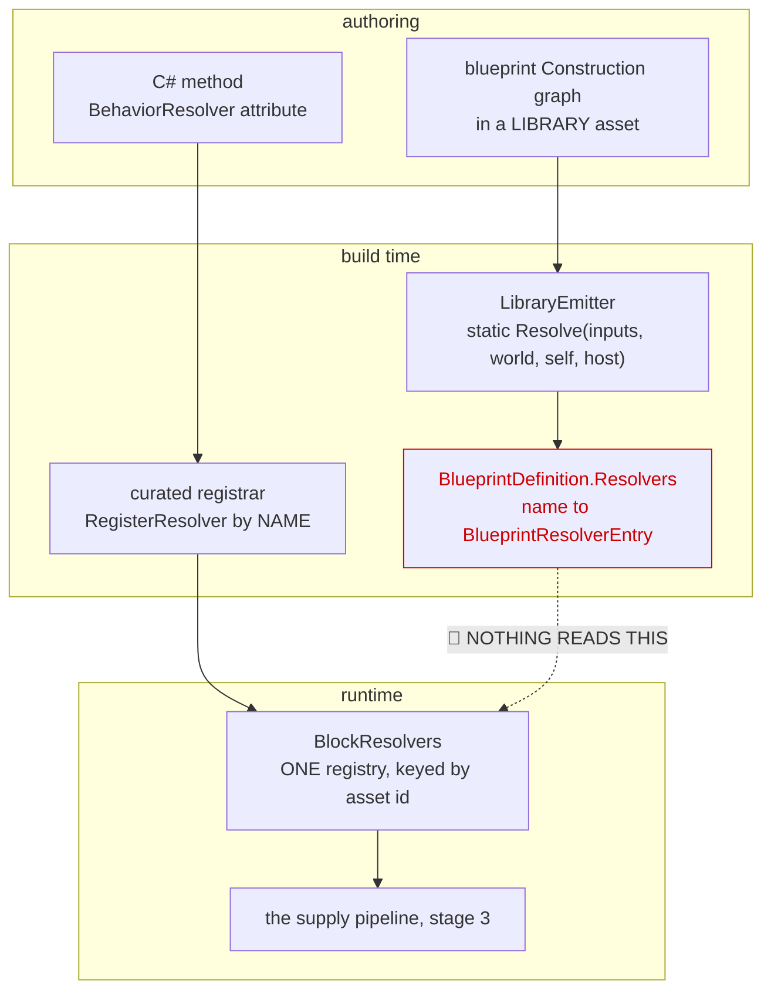

<!--STATUS
state: LIVE
updated: 2026-09-29
build-state: ✅ READY-TO-BUILD — **B IS APPROVED** (user, 2026-09-29, verbatim: "whatever leads to
  this single-blackboard-slot-per-running-behavior is authorized"). ⇒ A and C, which resolved to
  "remove, sequenced inside B", are no longer inert. D remains an UNAPPROVED lean and is NOT
  covered by the authorisation — see §12.0's warning: the grant is a resolver writing its OWN
  block, NOT IHostVariableAccess.TryWrite against its HOST. E is settled (Q75 depends on this).
  ⛔ NOTHING IS BUILT YET. §12.6 is the ordered slice list; CE-418 is slice 1 and is a live defect
  whose fix is identical either way.
current-answer: ⭐⭐⭐ **START AT §12** — the APPROVED design: who defines the block's DTO, and how
  parameters reach it (bake → supply → resolve). §12.6 is the ordered slice list and §12.7 the rails.
  §11 is the S-SUB slice, still valid but ⚠ §12.1 SUPERSEDES its §11.3 ① on the payload shape
  ([cursor][one blackboard struct], two regions, not three). §0/§1 are the proposal and the
  measurements; §4 the decisions; §5 DELETED and §6 KEPT-BUT-RE-EXPRESSED — read both before
  quoting a deletion. §7 is why this is cheap (nothing here is persisted).
decision-rule: 🔒 The user's test for both resolved decisions, verbatim: "will the removal simplify
  the code dramatically? if not, let's park it. if yes, let's remove it." Each resolution therefore
  carries its measurement inline, and BOTH answers are "remove ONLY as part of B" — A alone is
  ~200 lines and would park under the same rule. Reuse the rule on the next such question.
stale-below: nothing.
known-rot: none.
known-conflict: ⚠ Blueprint_SharedState_GetShared_Design.md §7 rules the opposite on ONE point —
  "Group/squad scope is not a separate scope — it is an Entity-scoped slot on the coordinator, read
  by members via the Slice-2 accessor", i.e. squad coordination by SHARED MEMORY. This document
  proposes messages instead, on the user's ruling and on the adoption measurement in §1.4. That
  design's own status note already defers cross-entity WRITE to "a deferred-event bus", so it is
  half-conceded there.
related-designs:
  - DESIGN_Occurrence_Scoped_Storage.md — owns the slot model this simplifies. Its §3 thesis ("an
    occurrence is a running instance of an asset; identity is (assetId, hostPath)") IS this
    proposal; its O3 row is the unfinished key unification this completes.
  - Blueprint_SharedState_GetShared_Design.md — owns GetShared/SetShared, the feature §5 retires
    and §6 re-expresses. Read its §1 for WHY the capability exists before removing anything.
  - DESIGN_Parameter_Model.md — owns the three data shapes and the bake/overlay/resolve order.
    Its §3.1 "AS MEASURED 2026-09-28" subsection records the scope findings this acts on.
  - Architect_Question_75_One_Params_Pipeline_And_One_Action_Binding.md — owns the params pipeline.
    ⛔ Q75 DEPENDS ON THIS: its S0 (one layout authority) is this document's first step, and its
    S1/S2 assume one answer to "where is this variable".
  - Architect_Question_39_Merge_Variables_And_Working_State.md — ruled "two names, one concept" for
    Variable/WorkingState. This is the storage half of that ruling.
  - Behavior_Parameter_Resolver_Detailed_Design.md — owns the RESOLVER's model and the
    bake/overlay/resolve pipeline this keeps unchanged; §10 owns "a curated resolver outranks a
    generated one". §12 widens its reach to the whole block and adds a stage-2 supplier.
  - Architect_Question_43_Blueprint_Authored_Param_Resolver.md — owns the BLUEPRINT-authored
    resolver (GraphKind.Construction, V_ResolverPurity, BlueprintDefinition.Resolvers). ⛔ It does
    NOT own the binding to a behaviour, which does not exist; §12.4 is that binding.
-->
# Architect Question 76 — ONE blackboard block per running AI primitive

> 🔒 **User, `2026-09-28`, and it is the frame for everything below** *(verbatim, typo included —
> the ledger probes on the exact text)*: *"whatever more complex will anyway not survive the contact
> with behavior author's reality - too many options and complxity = not adopted"* ·
> *"i could imagine there is exactly one slot per behavior, keeping everything."*

---

## 0. ⭐⭐⭐ THE PROPOSAL, IN ONE PARAGRAPH

**One contiguous blackboard memory block per running AI primitive — root and hosted children
alike.** A primitive's block holds its parameters and its working state together. There are no
scopes, no name-keyed global regions and no second key scheme. Coordination between primitives of
one behaviour is a **named region of the host's block**, which children may read *and write*.
Coordination between entities is **messages**, not shared memory.

⭐ This is not a new model. It is [`DESIGN_Occurrence_Scoped_Storage`](DESIGN_Occurrence_Scoped_Storage.md)
§3's own thesis — *"an occurrence is a running instance of an asset on an entity"*, payload
`[cursor][Params][State]` — finished and applied to the root, which today is the one place that
does **not** follow it.

---

## 1. 🔴 INVENTORY — **measured `2026-09-28`; every removal below rests on a count**

⭐ **Queries run:** `search_code("JsonParamsDtoType")` · `search_code("BlackboardLayoutType")` ·
`check_index_coverage` on 11 cited paths *(`no_recorded_issue`, `generation_matches: true`)* · a
**runtime probe** over the built `Hrot.AI.Behaviors.dll` for struct-vs-manifest offsets · a parse of
every `.btree.json`, `.hsm.json` and `.bp.json` in the repo · `grep`+graph over the emitters,
`BehaviorIngressSystem`, `OccurrenceSlotKey` and `BlueprintSharedState`.

### 1.1 What a behaviour owns today

| region | count | contiguous |
|---|---|---|
| root params slot — every `Role=Input` variable | exactly 1 | ✅ |
| root brain state (BTree tree state / HSM instance) | 1 | separate slot |
| stateful working slots | **0 … 7** *(`PlatoonHillAttack2` = 7)* | one slot each |
| hosted occurrence — a child's `[cursor][Params][State]` | 0…N, at first tick | ✅ **one slot, both together** |

⇒ 🔴 **the ROOT is split across ≥2 slots while a HOSTED CHILD is not.** Same concept, two layouts,
and the root's split is the *newer* work *(`P3`, `CE-302`, `CE-319`)*.

### 1.2 Two key schemes for one concept

| scheme | keyed on | used for |
|---|---|---|
| scope-based — `OccurrenceSlotKey.Compute` | `Node`: asset+node · `Behavior`: asset+name · `Entity`: **name only** | per-node and declared working state |
| occurrence — `ComputeNested` | `(assetId, hostPath)` | hosted children |

⭐ The key **function** is already unified *(one implementation, thin forwarders)*. ⛔ The **model**
is not — and `DESIGN_Occurrence_Scoped_Storage`'s `O3` row is exactly that job, with its own note:
*"No behaviour changes yet."*

### 1.3 The three `WorkingStateScope` values, as built

| scope | declared users | verdict |
|---|---|---|
| `Node` = 0 — **the default** | **0** | 🔴 a standalone `Role=State` variable at this scope is **silently skipped** *(`BTreeBridgeEmitCore:1055`)* — no slot, no diagnostic. `CE-423` |
| `Behavior` = 1 | 4 | ✅ the only one that works as documented |
| `Entity` = 2 | 4 | ⚠ name-only key, entity-global. `CE-422` |

### 1.4 ⭐⭐⭐ Shared state — **the adoption measurement that decides `A`**

📐 Over **every** `.bp.json` in the repo:

| | |
|---|---|
| assets using `GetShared`/`SetShared` | **8** *(38 reads, 23 writes)* |
| distinct shared variables in existence | **2** — `state` (58 refs) and `rally` (3) |
| **cross-entity reads** | 🔴 **1**, in `SharedStateCrossEntityDemo`, whose own description says it exists to *prove the `Target` pin compiles* |
| reads of another primitive's **own** working state | ⛔ **0, and not expressible** — `SharedTypeId` is by definition *"a hand-written blittable struct, NOT a generated `_Bp+WorkingState`"* |
| production behaviours using any of it | ⛔ **0** — all six `state` users are `HillAssault2I_*`, the graphs of `PlatoonHillAttack2`, which lives in `Assets/BTrees/`**`Authoring/`**. The hill attack actually in use, `PlatoonHillAttack`, is hand-written C# and uses **no** `GetShared` |

⚠⚠ **But it is NOT unreferenced: 16 `HillAssault2*` proof-test files rest on it**, and
`PlatoonHillAttack2` is the **only end-to-end evidence that the blueprint route can express a
complex behaviour.** ⇒ §6, not §5.

---

## 2. ⭐⭐⭐ THE DIAGRAMS

### 2.1 Classes — grey = exists, and only the seam member is new



> ⭐ **Caption — what the picture shows that the prose hid.** `TryWrite` is the only genuinely new
> member in the whole proposal. Everything else is a deletion or a merge: drawing it made clear that
> the 58 `state` references do not need a mechanism, they need **one more method on a seam that
> already exists**.

### 2.2 Sequence — activation, with the scatter gone



> ⭐ **Caption.** Today this needs a *scatter* — the shadow covers only the params region and the
> working state lives in up to 7 other slots. With one block there is one copy and no scatter, which
> is what makes *"the resolver may write anywhere"* a one-line property rather than a feature.

### 2.3 Modules — who provisions, and the edge that disappears



> ⭐ **Caption — the dead edge is the whole of decision `A`.** Every other edge exists today.
> Cross-entity coordination moves from the dotted edge to `MSG`, which is the path the shared-state
> design **already chose for writes** and never built for reads.

---

## 3. ⛔ What this does NOT change

| | |
|---|---|
| ⛔ the bake → overlay → resolve ORDER | `DESIGN_Parameter_Model.md` §3.2 rules it |
| ⛔ parse-before-commit | the shadow still commits only on success |
| ⛔ tier promotion | the allocator is untouched; slot COUNT falls |
| ⛔ `IHostVariableAccess`'s read semantics | `TryWrite` is added beside them |

---

## 4. ⭐⭐⭐ THE DECISIONS

### A — retire cross-entity shared memory? ✅ **RESOLVED `2026-09-28`: REMOVE, SEQUENCED INSIDE `B`**

> 🔒 **The user's decision RULE, verbatim:** *"will the removal simplify the code dramatically? if
> not, let's park it. if yes, let's remove it."* ⇒ ⭐⭐ **the ruling is the rule plus the
> measurement below**, not a preference — and it is reusable on the next such question.

⭐ 1 consumer, and it is its own proof (§1.4). ⭐ Cross-entity **write** was already deferred to
*"a deferred-event bus… mirroring `AssignBehaviorEvent`→`BehaviorIngressSystem`"* — so today's shape
is reads-by-memory and writes-by-messages, which is where slicing stopped rather than a decision.
⛔ **Rejected — keep it as an unpublished feature:** it is the arm that forces **name-only keying**,
and 37 same-entity reads pay that collision domain for it.

📐 **THE SIMPLIFICATION, MEASURED** *(this is what the rule was applied to)*:

| | |
|---|---|
| **whole files deleted** | **10, totalling 1 356 lines** — `SharedNodeDrawers.cs` 534 · `BlueprintSharedStateTests.cs` 277 · `BlueprintSharedState.cs` 216 · `ISharedStructTypeProvider.cs` 75 · `HillAttackSharedStateOps` 58 · `HillAttackSharedState` 50 · `SquadRallyState` 44 · `StatefulScopeQueries.cs` 46 · `IStatefulScopeAsset.cs` 36 · `StatefulSlotScope.cs` 20 |
| scattered arms | `GetSharedNode`/`SetSharedNode` **119 refs / 19 files** · `SharedTypeId` 79/12 · `BlueprintSharedState` 26/13 · `IrOp_ReadShared`/`WriteShared` 15/4 |
| ⭐⭐ **it is a FULL VERTICAL SLICE of the compiler** | an arm in **every** stage: node model → pin schema → `Stage0_Rehydrate` → `Stage2_Validate` + `BP2040`–`2042` → `Stage5_Schedule` → IR + `IrPrinter` → `StatementEmitter` → editor palette/drawers/command sink/graph model → the runtime accessor. ⇒ **one whole node kind leaves the blueprint language, end to end** |
| replacement cost | ~150 lines — `IHostVariableAccess.TryWrite`, re-point `PlatoonHillAttack2` at the clean twins (§6), one composition rail |

⚠⚠ **SEQUENCING, and it is part of the ruling:** 📐 **`A` ALONE is NOT dramatic** — the `Target`
pin, one `Stage0` arm, one demo asset and `T38`, order of 200 lines. ⛔ On the user's own rule that
would be *"park"*. ⭐⭐ **The 1 356 lines only become available once `B` gives the 58 `state`
references a home** ⇒ **do NOT cut `A` standalone**; it lands inside `B` or not at all.

🔒 **`R-137` is satisfied** — the capability is removed by an explicit user decision against a
measurement, not silently lost to a refactor. 📄 `R-150` is the general form.

### B — one block per running primitive? ✅✅ **APPROVED `2026-09-29`**

> 🔒 **User, verbatim:** *"whatever leads to this single-blackboard-slot-per-running-behavior is
> authorized"* · *"brain state was never part of the blackboard so it is ok to be in another slot."*

⭐ It is already the model for hosted children and for the root params table; only the root's
*split* deviates. ⭐ Slot count falls, so the tier budget *(`MaxSlots` 12/16/16/16)* improves.
⚠ **Cost:** one `StructureHash` per block instead of per region ⇒ a hot reload that changes any
variable invalidates that primitive's whole state. Acceptable — reload reprovisions anyway.

⭐⭐⭐ **THE APPROVAL CARRIES A SCOPE AND FOUR REQUIREMENTS — 📄 §12 is the design, and it is where
the work starts.** The scope: **the brain state stays in its own slot** and is not part of the
blackboard. The requirements: bake editor-saved defaults · overlay the behaviour parameters *(for a
sub-behaviour, a variable of the HOST's block)* · a custom resolver may write **the whole block** ·
`Role=Input` becomes **optional**. ⛔ **`D` is NOT approved by this** — §12.0 ③.

### C — retire `WorkingStateScope`? ✅ **RESOLVED `2026-09-28`: REMOVE, SEQUENCED INSIDE `B`**

> 🔒 **User:** *"..same rule should be applied to scoping the blackboard variables"* — i.e. the same
> measure-the-simplification test as `A`. ⭐ It clears, and **more decisively than `A` does.**

`Node` has **0** declared users and silently does nothing *(`CE-423`)*; `Behavior` becomes "a named
region of the block"; `Entity` goes with decision `A`.

📐 **THE SIMPLIFICATION, MEASURED** *(production references, tests excluded unless stated)*:

| | |
|---|---|
| 🔴 **THREE PARALLEL ENUMS FOR ONE CONCEPT** | `WorkingStateScope` *(authoring, netstandard2.0)* **38 refs / 16 files** · `StatefulSlotScope` *(runtime)* **29 / 10** · `OccurrenceSlotScope` *(the key)* **27** ⇒ **94 references across three spellings.** ⚠ The triplication is itself a symptom of `F5`'s two key schemes |
| ⭐⭐⭐ **author-facing surface** | **77** references of Scope in the variable panel, the authoring window and the variable editor — **a three-valued dropdown on every blackboard variable** |
| file format | **3 members** — `BehaviorTreeAssetDto:50`, `HsmAssetDto:300`, `BlackboardVariableEntry:41` ⇒ both hosts and the editor model |
| runtime manifest | **102** `Scope` references under `Fdp.Toolkits/Behavior/` |
| resolution machinery | `ResolveStatefulSlotKey` 11 · `StatefulScopeVariable` 11 · `ResolveVariableRoleScope` 2, plus their bodies |
| whole files | `StatefulScopeQueries.cs` 46 · `IStatefulScopeAsset.cs` 36 · `StatefulSlotScope.cs` 20 = **102 lines** *(also counted in `A`)* |
| test files referencing it | **37** *(27 + 10)* |
| ⭐⭐⭐ **against AUTHORED USES in the whole corpus** | **8** — 4 `Behavior`, 4 `Entity`, **0 `Node`** *(and `Node` is the DEFAULT)* |

⇒ ⭐⭐⭐ **~200 production reference sites, 77 of them author-facing, for 8 authored uses.**

⭐⭐ **Why this is the stronger case even though `A` deletes more lines.** Scope is **the only one of
these concepts an author must hold in their head**: a dropdown where *one value is silently broken*,
*one means something other than its name* and *one works*. The shared-state accessor, for all its
1 356 lines, is invisible to an author who never places the node. 🔒 That is exactly `R-150`'s
criterion — complexity the author must understand is the cost that matters.

⭐ **The residue is small:** the 4 `Behavior`-scoped variables become named regions of the host's
block — which is what `Behavior` scope already means. ⚠ **The key function SHRINKS, it does not
vanish:** `ComputeNested(hostKey, siteId, assetId)` survives for hosted occurrences; only the three
scope arms go.

⚠ **Same sequencing as `A`:** `C` is only possible once `B` supplies keying from occurrence
identity. ⇒ **not a standalone cut.**

### D — add `IHostVariableAccess.TryWrite`? ⚖️ **LEAN: YES — but it CONTRADICTS A DOCUMENTED RULE, and that must be argued, not skipped**

📐 The seam is read-only today. The 58 `state` references need a host-owned region they can write.
⛔ **Rejected — let a child write the host's block directly:** the seam exists to keep a child from
knowing the host's layout, and `TryWrite` preserves that.

#### 🔴🔴 D.1 — **THE SEAM'S OWN HEADER FORBIDS THIS, IN TERMS**

⚠⚠ **This lean was first written without reading `IHostVariableAccess`'s header — an `R-129` miss,
and the intent was sitting in the file being extended.** 📐 Verbatim, `IHostVariableAccess.cs`:

> ⛔ **READ-ONLY.** *A resolver never writes its host — **a write path here would be a second supply
> mechanism.***

🔒 That is **ruling 9** *(one supply mechanism)* applied to this seam, alongside a second stated
rule — *"Resolve-once still holds. This reads the host at the CHILD'S ACTIVATION, not continuously
— live binding stays out of the model."*

⚖️ **The counter-argument, offered as an argument rather than an omission:**

| the rule guards | does `TryWrite` breach it? |
|---|---|
| ⭐ **PARAMS SUPPLY** — how a params region gets its values at activation, which must have exactly one path | ⛔ **No, if `TryWrite` is restricted to `Role=State` regions.** Working state is not supplied; it is zero-init and mutated each tick by the primitive that owns it. A second *supply* path would be a child writing another region's **params** |
| ⭐ **resolve-once / no live binding** | ⚠ **Partly yes, and this is the real cost.** A child writing a host region **every tick** is exactly the continuous coupling the header excludes. ⇒ if `D` is taken, the write must be **as unrestricted in time as an ordinary working-state write already is**, and the *"resolve-once"* rule must be restated as applying to **params only** |

⇒ ⭐⭐ **`D` is therefore a DELIBERATE NARROWING of the header's rule, not a reading of it:**
*"read-only for params, read-write for shared working state."* ⛔ **It must not be built until that
narrowing is accepted**, because the header's rule is the one thing standing between this and a
second supply mechanism. 📄 The header itself is also **factually stale** — see `CE-424`.

⚠ **What would change the lean:** if the 4 `Behavior`-scoped uses can be re-expressed as the host
*owning* the mutation *(children return values, the host writes)*, `TryWrite` is unnecessary and the
header's rule survives intact. 📐 **Not yet measured** — it needs a read of the six
`HillAssault2I_*` graphs' actual write patterns, which is a prerequisite of `B` rather than of `D`.

### E — does `Q75` depend on this, or the reverse? ⚖️ **LEAN: `Q75` DEPENDS ON THIS**

`Q75`'s `S0` *(one layout authority — `CE-418`)* is this document's first step, and its `S1`/`S2`
assume a single answer to *"where is this variable"*. ⇒ **build `S0` here, then `Q75` resumes.**

---

## 5. 🔴 DELETED

| | users | note |
|---|---|---|
| `GetShared`'s cross-entity `Target` pin | 1 *(a proof)* | decision `A` |
| `SharedStateCrossEntityDemo`, `SharedStateRallyDemo` and the `rally` variable | 2 demos | delete with `A` |
| `WorkingStateScope` and its three key arms | see §1.3 | decision `C` |
| `BlueprintSharedState` + `IrOp_ReadShared`/`IrOp_WriteShared` | — | re-expressed, §6 |

## 6. ⭐⭐ KEPT, RE-EXPRESSED — **and this is the part that must not be read as a deletion**

| | |
|---|---|
| ⭐⭐⭐ **`PlatoonHillAttack2` — the COMPOSED TREE** | ⭐ **KEEP, but re-point it.** It is the only **large-scale** composition demonstrator: one tree hosting **7** blueprint primitives. The `T*` suite proves composition at 2–3 primitives; nothing else proves it at 7 |
| 🔴 **the six `HillAssault2I_*` graphs** | ⛔⛔ **DELETE — and this REVERSES this document's first draft.** 📐 **Every one has a CLEAN TWIN**: `HillAssault2_CalculateSegments`, `_DispatchAllToBaseline`, `_DispatchWaveWithTargets`, `_IsAreaQueryResolved`, `_IsWaveCompleted`, `_RequestAreaQuery` all exist **without** shared state. ⇒ **the `I` generation exists to exercise the shared-state mechanism, not because the behaviour needs it** — 🔒 the user's *"the demo is pretty old, used to lift/develop the blueprint capabilities, so it might be a bit synthetic"* is measurably correct. ⇒ **re-point `PlatoonHillAttack2` at the clean twins**, delete the six `I` duplicates |
| the 2 shared-state proof files | ⛔ **DELETE with the feature** — `PlatoonHillAttack2_Integration_ProofTests` (3) and `HillAssault2I_Integration_Smoke_ProofTests` (3). ⚠ Two of those six are **the same test duplicated across both files** *(`StandaloneStateVariable_EmitsManifestEntry_MatchingBlueprintSharedStateExpectedHash`)*, and one asserts only that generated SOURCE TEXT contains `GetShared`. ⭐ A replacement composition rail for the re-pointed tree replaces them |
| ⭐ the other ~14 `HillAssault2_*` proof files *(≈50 tests)* | ⭐⭐ **UNTOUCHED** — they test blueprint NODE semantics *(`ForEachSubordinate`, `HasTarget`, `AimAndFireSpecific`, `IsSelfArrived`, `ReverseToBaseline`, …)* on the clean assets and never reference shared state |

> 🔴🔴 **CORRECTION, and the user's persistence produced it.** This section first said *"DO NOT DELETE — 16 proof-test files rest on them and they are the only end-to-end evidence the blueprint route can express a complex behaviour."* 📐 **Both halves were wrong.** Only **2** of the 17 proof files are shared-state-specific, and the capability coverage is **duplicated**: the focused `T30`–`T39` suite proves each mechanism minimally *(`T35` shared working state, `T36` `GetShared`/`SetShared`, `T37` manifest provisioning, `T38` cross-entity read)*, while the `I` generation proves the same things through a large synthetic behaviour. ⇒ ⭐ **removing shared state costs ZERO unique node-semantics coverage.** ⚠ What it genuinely costs is the 7-primitive composition example — which the re-point preserves.
| the capability *"several hosted primitives of one behaviour share one plan struct"* | ⭐ becomes a **named region of the host's block**, read and written through `IHostVariableAccess` |

## 7. ⭐⭐ WHY THIS IS CHEAPER THAN IT LOOKS

🔒 **The occurrence store is `[DataPolicy(NoScenario)]` — nothing in it is serialised**, and inputs
are re-supplied at every activation. ⇒ **every slot key may change with NO save-file or replay
migration.** That removes what is normally the expensive half of a storage change.

⚠ **What it does cost:** every rail that hard-codes a slot key is re-authored
*(`OccurrenceSlotKeyParityTests`, the `*_ProofTests` that compute expected keys)*, and the 17 BTree
blackboard goldens move.

## 8. Rails this owes

| | |
|---|---|
| ⭐⭐⭐ **one block per primitive** | for every corpus behaviour, the slot count equals the number of running primitives — ⛔ no per-node or per-variable extras |
| ⭐⭐ **the layout parity rail** *(`Q75` `S0`)* | manifest offset == the layout type's actual field offset. 📐 **Red-proves on today's tree: 3 of 15 assets, 9 of 31 fields** |
| ⭐⭐ **the resolver writes anywhere** | a resolver that writes a working-state region has its bytes visible after commit, and **nothing** after a failed parse |
| ⭐ **`PlatoonHillAttack2` still passes** | all 16 `HillAssault2*` proof suites green after the re-author — the acceptance test for §6 |
| ⭐ **no scope remains** | `WorkingStateScope` has no references outside history |

---

## 9. 📌 PROVENANCE — **why the shared-state model was built, and what the user said about it the next day**

> 🔒 **User, `2026-09-28`:** *"I am still wondering why the sharing concept was implemented at all -
> not used, complex to implement, might have some reason"*

⭐ **It had a reason, it was reviewed, and the complaint being made today was made 14 months ago —
within 24 hours of it shipping.**

| when | what |
|---|---|
| `2026-07-15` | Slices 1, 2a and 2b ship. 📄 `Blueprint_SharedState_GetShared_Design.md`, **architect-reviewed** *(`Q1`–`Q5` + `2b-Q1`–`Q4`)*. ⭐ The stated need is a **capability ceiling**, not a behaviour: *"a blueprint AiPrimitive generates one `TickCore` with **exactly one** `WorkingState` struct… a ceiling for two distinct needs"* — cross-node sharing, and one node reaching a second slot |
| 🔴 **`2026-07-16`, the NEXT DAY** | 📄 **`Blueprint_Subsystem_Slice2_Candidates.md` §A11**, *"Raised by the user from hands-on Windows testing of the composed-blueprint + `GetShared`/`SetShared` authoring path"*, verbatim: *"all the variable and scope and default values and GetShared/SetShared and params vs working state, this is a lot to digest for a user … beyond the capability of an ordinary user (needs a programmer mindset). Without [visual documentation] the system is incomprehensible."* |
| ⚠ **the response at the time** | **A11 — "Visual conceptual documentation for the shared-state / working-state model" `[HIGH | S]`**: a scope decision tree, a two-entity data-flow diagram, an end-to-end authoring flow. ⛔ **Triaged as a DOCUMENTATION gap, not as a design one** |
| `2026-09-28` | The same complaint, in the same words, produces `R-150` and this document instead |

⇒ ⭐⭐⭐ **The lesson worth keeping, and it is the general form of `R-150`:** the evidence that the
model was over-built existed **one day** after it shipped, from the only person who would ever
author with it. ⛔ It was answered with *"explain it better"*. 📐 The adoption measurement in §1.4 is
what that answer cost: 14 months later the feature has **six duplicate assets and two demos**, and
the six duplicates each shadow a clean twin that predates them.

⚠ **Stated fairly, because the decision was not careless:** the ceiling was real *(one
`WorkingState` per primitive genuinely is a limit)*, the design was architect-reviewed, and `Q4`
gated the hazardous scope behind safeguards. ⛔ **What went wrong was not the build — it was
treating an author's "this is incomprehensible" as a documentation request.**

---

## 10. ⭐⭐⭐ THE WAY BACK IN — **parked deliberately, `2026-09-28`**

> 🔒 **User:** *"not approved, i want it recorded so i can return to it any time."*
> ⇒ ⛔ **This is NOT a stalled batch and NOT a backlog item.** It is a decision left open on
> purpose, with everything needed to take it already measured. **Nothing expires.**

⭐ **§11 is a fully designed slice** — `S-SUB`, the subtree unification — ready to cost but **not
authorised**. It is the cheapest part of `B` and the natural pilot.

### 10.1 ⭐ The ONE question to answer on return

> **Do we adopt `B` — one contiguous blackboard block per running AI primitive, root and children
> alike?**

⭐ **Everything else follows.** `A` and `C` are already decided *and fire only if `B` is yes*; `D`
and `E` are subordinate to it. ⛔ **There is no second question to prepare.**

### 10.2 📐 What is already measured, so it need not be re-derived

| the question | ✅ the answer, and where |
|---|---|
| does the root really differ from a hosted child? | ✅ §1.1 — root is ≥2 slots, a hosted child is 1 |
| is this a new model? | ⛔ no — §0, it is `DESIGN_Occurrence_Scoped_Storage` §3's own thesis, and its `O3` row is the unfinished half |
| what does `B` cost in data migration? | ✅ **nothing** — §7, the store is `[DataPolicy(NoScenario)]` |
| what does retiring shared memory save? | ✅ **10 files / 1 356 lines** + a vertical slice of the compiler — §4-`A` |
| what does retiring scope save? | ✅ **~200 production sites, 77 author-facing, for 8 authored uses** — §4-`C` |
| will anything shipped break? | ⛔ **no production behaviour uses any of it** — §1.4 |
| does `PlatoonHillAttack2` have to die? | ⛔ **no** — §6: keep it, re-point it at the clean twins |
| why was it built? | ✅ §9 — an architect-reviewed capability slice, and the author's complaint arrived the next day |

### 10.3 ⚠ The ONE thing still unmeasured, and it belongs to `B`'s first step

📐 **Whether the four `Behavior`-scoped uses can be re-expressed with the HOST owning the mutation**
*(children return values, the host writes)*. ⭐ If yes, decision `D`'s `TryWrite` is unnecessary and
`IHostVariableAccess`'s read-only rule survives untouched *(§D.1)*. ⇒ **a read of the six
`HillAssault2I_*` graphs' write patterns** — ⛔ not needed to decide `B`, only to execute it.

### 10.4 🔴 The findings that are waiting on this, and what happens to each

| id | if `B` is taken | if `B` is dropped |
|---|---|---|
| [`CE-418`](Blueprint_Issues_Tracker.md) *(two offset authorities)* | ⭐ its fix is `B`'s first step | 🔴 **must still be fixed on its own** — it is a live defect either way, and `Q75` is blocked on it |
| [`CE-420`](Blueprint_Issues_Tracker.md) *(`Role=State` default dropped)* | ⭐ subsumed | must be fixed in `ProvisionStatefulSlots` |
| [`CE-421`](Blueprint_Issues_Tracker.md) *(shadow carry-over)* | ⭐ independent — fix either way | same |
| [`CE-422`](Blueprint_Issues_Tracker.md) *(`Entity` scope)* · [`CE-423`](Blueprint_Issues_Tracker.md) *(`Node` scope silently skipped)* | ⭐⭐ **both DISSOLVE** — the scope they describe stops existing | 🔴 **both become real fixes** — reword one, diagnose the other |
| [`CE-424`](Blueprint_Issues_Tracker.md) *(stale seam header)* | ⭐ fix while touching the seam | fix anyway, it is two sentences |

⇒ ⭐⭐⭐ **`CE-418` is the one that does not wait.** It is a live defect in two user-facing surfaces
*(StructEdit's typed params editor and the replay predicate compiler)*, it blocks `Q75`, and its fix
is identical under both outcomes. ⛔ **Everything else can sit.**

---

## 11. ⭐⭐⭐ SLICE `S-SUB` — **a hosted SUB-BEHAVIOUR gets its own block, seeded once** *(designed `2026-09-29`)*

> 🔒 **User, `2026-09-29`:** *"I want to unify all that for sure, so same concept work for any
> sub-behavior. The subtree sharing hosts memory looks like relic from time what we had one single
> blackboard slot per entity. no longer true. I need each behavior having its own allocated slot.
> and resolving behavior params (that are stored in host blackboard as variable) exactly once at
> starting the sub-behavior, by calling resolver if exists or auto-copying the params to
> sub-behavior's blackboard."*

⭐⭐⭐ **This is `B` applied to hosted SUBTREES, and it is the cheapest part of `B` because the target
already ships.** ⛔ It is **not** a new mechanism: the hosted-**AiPrimitive** path already does
exactly what the user describes. `S-SUB` converts the subtree path to it.

### 11.1 🔴 The gap, measured

| | hosted **AiPrimitive** *(the target, ships today)* | hosted **SUBTREE** *(the relic)* |
|---|---|---|
| the child's params | ⭐ **its own region**, inside its own occurrence slot | ⛔ **none** — `TickFromContext` aliases `ref childBb` onto the **host's** root params region |
| when | ⭐ **seeded ONCE** at `freshlyAttached`, then the per-asset resolver runs, then working state is default-init'd *(`AiPrimitiveEmitter.EmitParamSeed:464`)* | ⛔ **re-resolved EVERY TICK** — `RootParamsAccess.TryGetRootBytes` per tick, a linear scan of attached slots |
| the slot holds | `[cursor][Params][WorkingState]` | ⛔ **the cursor ONLY** — `TreeStatePayloadSize => sizeof(BehaviorTreeState)` *(`HostedSubtree.cs:33` → `BTreeHostedSites.cs:189`)* |
| which host variable feeds it | ⭐ a **per-site** binding — `SeedParamsOffset(instance, writer, AssetId)` *(`CE-414`)* | 🔴 **NOTHING SAYS** — it gets the host's *whole* region |
| freshness | snapshot | live alias |

📐 **The sizing is the tell that this is a relic:** the subtree slot is sized for a **cursor and
nothing else** — which is what you build when the params have nowhere else to live. `P3` gave params
their own slot and this path was never revisited.

### 11.2 The sequence — **what changes**



> ⭐ **Caption — what the picture shows that the table could not.** The per-tick arrow **disappears
> entirely**: the scan exists only because the child has nowhere of its own to read from. ⛔ And the
> `Res` arrow **cannot** exist today — there is no point in a subtree's life at which a resolver
> could run, because nothing is ever "started" for it.

### 11.3 ⭐ The seven pieces, and where each lands

| # | piece | file(s) | note |
|---|---|---|---|
| **①** | the slot payload becomes `[cursor][Params][WorkingState]` | `HostedSubtree.cs:33` | drop `TreeStatePayloadSize`'s cursor-only assumption |
| **②** | size it from the CHILD's definition | `BTreeHostedSites.cs:189` · the ingress demand | `+ RootParamsBytes(childDef)`; `TryGetHostedOccurrenceDemand` already feeds tier selection |
| **③** | 🔴 **a per-site params binding** | the subtree hosting DTO, both emitters, the picker | ⛔ **the real work.** ⭐ **Template: `CE-414`** did exactly this for AiPrimitives one week earlier — compose step, auto-managed variable, per-site seed key |
| **④** | seed + resolve at first attach | `HostedSubtree` | ⭐ reuse `EmitParamSeed`'s body verbatim |
| **⑤** | tick reads the child's own region | `HostedSubtree.TickFromContext` · `OccurrenceSubtreeHost.cs:49` · `BrainTickSystem.TickHostedChildren` | ⭐ **deletes** the per-tick scan |
| **⑥** | the child's blackboard TYPE | BTree child ✅ `{Asset}_Blackboard` · **HSM child ⛔ none** | 🔴 **depends on `Q75`-`S1`** — HSM children only |
| **⑦** | authoring binds a params variable | the subtree picker | mirrors the AiPrimitive compose |

⭐ **Surface: under ten production files.** ⚠ The emitters are `HsmBridgeEmitCore.CollectHostedSubtrees`
and the BTree hosted-slot arm.

### 11.4 ⛔⛔ TWO BEHAVIOUR CHANGES — **named here so they are not DISCOVERED**

| | |
|---|---|
| 🔴 **a subtree stops seeing host param changes live** | it takes a snapshot at start. ⭐ This MATCHES the AiPrimitive path and the stated rule *(`IHostVariableAccess`: "live binding stays out of the model")*. ⚠ **It is still a semantic change**: anything that writes a param at runtime — **StructEdit's typed editor does** — stops reaching a running subtree |
| ⚠ **a subtree hosted on a NO-PARAMS host** | today it is handed a **scratch byte** *(the `WanderMilitary` shape, `HostedSubtree.cs:82`)*; it would get its own **defaulted** params region. ⭐ Better, ⛔ but different |

### 11.5 ⚠ Dependencies and ordering

⭐ **`S0` *(`CE-418`, one layout authority)* → `S1` *(HSM blackboard struct)* → `S-SUB`.**
⚠ Only piece ⑥ needs `S1`, and **only for HSM children** ⇒ 📌 **the BTree arm of `S-SUB` could go
first**, which also makes it the natural pilot for `B`.

### 11.6 Rails `S-SUB` owes

| | |
|---|---|
| ⭐⭐⭐ **seeded once, not per tick** | a host whose params are mutated AFTER the child starts: the child keeps its seeded values. ⛔ **Red-proves on today's tree**, where it sees the change |
| ⭐⭐ **the resolver runs, exactly once** | a subtree whose child asset declares a resolver: it fires on attach and not on subsequent ticks |
| ⭐⭐ **per-site binding** | one host, the SAME child asset at two sites, two different bound variables ⇒ two different seeded values. ⛔ **Not expressible today at all** |
| ⭐ **the scan is gone** | `TickFromContext` no longer calls `TryGetRootBytes` |
| ⭐ **no-params host** | a child hosted by a params-less behaviour gets its defaults, not a scratch byte |
| ⭐ **`E5`/`E6` still pass** | the existing HSM-hosts-BTree and BTree-hosts-BTree suites are the regression net |

---

## 12. ⭐⭐⭐ THE BLOCK'S DTO — **who defines it, and how parameters reach it** *(APPROVED `2026-09-29`)*

> 🔒 **User, `2026-09-29` — THE AUTHORISATION, verbatim:** *"brain state was never part of the
> blackboard so it is ok to be in another slot. whatever leads to this
> single-blackboard-slot-per-running-behavior is authorized. Note: must support the pre-seeding the
> params from editor saved defaults and overriding from the behavior parameters (which in case of
> sub-behavior are stored in hosting behavior blackboard) and using custom resolver that can access
> (write) the whole (now single) blackboard DTO; default resolver would just copy the behavior params
> to the blackboard INPUT role part; custom resolver can do whatever; in case of custom resolver
> there noes not even need to be any role=Input variable defined (but can be); custom resolver could
> be c# hardcoded or defined as a blueprint (not exactly sure how if the resolver is for non-blueprint
> behavior)"*

### 12.0 ⭐ What that message SETTLED

| # | settled | consequence |
|---|---|---|
| **①** | ⭐⭐⭐ **`B` is APPROVED** — one blackboard block per running behaviour, root and child alike | `A` and `C`, which were "remove, sequenced inside `B`", stop being inert |
| **②** | ⭐ **the BRAIN STATE is NOT part of the blackboard** and stays in its own slot | ⭐⭐ this is the *simplifying* answer: a BTree cursor is `sizeof(BehaviorTreeState)` but an HSM instance is `HsmInstanceManager.SelectTier(blob)` — **64/128/256 chosen at RUNTIME from the blob** *(`RootHsmAccess.cs:46`)*. A runtime-width region cannot be a field of a compile-time struct ⇒ folding it in would have forced a byte-level escape hatch into the one thing we are making typed |
| **③** | ⭐⭐ **the supply pipeline has THREE stages and the resolver owns the WHOLE block** | §12.3. The resolver's reach widens from the params region to the block; `Role=Input` becomes **optional** |

⚠ **What it did NOT settle: decision `D`.** `D` is `IHostVariableAccess.TryWrite` — a resolver writing
**its HOST's** variables. The authorisation grants a resolver write access to **its OWN** block. ⛔ Do
not read ③ as resolving `D`; it stays a lean, and its counter-argument in `D.1` is untouched.

---

### 12.1 ⭐ The block, and the two slot shapes



> ⭐ **Caption — what the picture shows that prose hid.** The root needs **two** slots and the child
> **one**, and that is not an inconsistency: the child's brain state is a fixed-width cursor so it
> rides in the same payload, while the root's may be a runtime-width HSM instance so it cannot.
> ⛔ **The BLACKBOARD is one block in both** — which is the whole claim. The asymmetry is in the brain
> state, where the user has now placed it deliberately.

📐 **Both shapes are already served by one shipping allocator** — `OccurrenceWorkingState.cs:109-158`,
`ResolveOrAttach<TParams, TWorkingState>`, generic over two `unmanaged` types, **state at BASE and
params AFTER** *(§28.3a — load-bearing: every existing reader decodes at the base)*:

| | call |
|---|---|
| root blackboard slot | `ResolveOrAttach<TBlackboard>` — the existing one-region overload |
| child slot | `ResolveOrAttach<TBlackboard, BehaviorTreeState>` ⇒ **cursor at base, blackboard after** |

⭐⭐ **The cursor lands at the base by construction**, so every reader that decodes a hosted subtree's
`BehaviorTreeState` today stays correct without being touched. ⚠ **This supersedes §11.3 ①'s spelling**
`[cursor][Params][WorkingState]`: that reads as three regions needing a new helper. It is **two** —
`[cursor][one blackboard struct]` — and the shipping generic covers it unchanged.

---

### 12.2 ⭐⭐⭐ WHO DEFINES THE DTO



> ⭐ **Caption.** Drawing it forces the answer to *"who defines the DTO"*: **nobody new.**
> `BehaviorDefinition` already carries both members and both type lists; the only new types are the
> two halves of a struct the generator already emits half of.

#### The three authoring routes — one emitted shape

| route | who authors the table | who emits the struct | status |
|---|---|---|---|
| **BTree JSON asset** | the editor — `.btree.json` `Blackboard.Variables[]` *(name, type, role, scope, `DefaultValueJson`)* | ⭐ the **build-time generator** — `BTreeJsonGenerator.cs:270-287` → `{Asset}.Blackboard.g.cs` | ✅ ships, **Input only** |
| **HSM JSON asset** | the editor — `.hsm.json`, same table | 🔴 **nobody.** `HsmBridgeEmitCore.cs:178-181` states it: *"the HSM generator emits NO blackboard struct… there is no type to name"* | ⛔ `Q75`-`S1` |
| **hand-written C#** | the author | the author | ✅ the concept already exists — `TBlackboard` of `BTreeBuilder<TBlackboard, BTreeContext>` |

⛔⛔ **The editor does NOT emit the struct, and must not start.** `BlackboardDtoEmitter`
*(`Hrot.Editor.AiShared/Blackboard/BlackboardDtoEmitter.cs:73`)* writes a `{Asset}.Blackboard.cs`
companion and has **zero production callers** — measured `2026-09-29` with `scripts/find.sh`: only its
own test class, plus `BlackboardTypeHelper.cs:14` reusing its `TypeAliases` map. ⇒ ⭐ it is a dormant
second producer for one slot *(`R-132`)*; leave it dormant.

#### 12.2a ⭐⭐⭐ WHY `Role=Input` FIRST — **the Input region stays byte-identical**

Every offset in `ManagedBlackboardVariables` is relative to the params base. Emitting the `Inputs`
sub-struct **first, at offset 0, with its internal layout unchanged** means:

| ⭐ | |
|---|---|
| ⭐⭐⭐ **nothing that reads params today moves** | StructEdit's typed editor, `RootParamsProjection`, the ReplayBrowser predicate compiler, the debug API — all keep their offsets |
| ⭐⭐ **the default resolver is one `memcpy`** | `block.In = supplied` — the Input region is a contiguous prefix by construction, so *"copy the behaviour params to the INPUT role part"* needs no offset table |
| ⭐ **the goldens move additively** | the State fields append; the Input prefix is unchanged bytes |

#### 12.2b ⚠ THE TWO MEMBERS FINALLY DIVERGE — **and that is what they were split for**

📐 Measured: today a generated behaviour sets **both** members to the same type, and a rail asserts it —
`AGeneratedBehaviourAdvertisesItsManifestTests.cs:83` `Assert.Same(def.JsonParamsDtoType,
def.BlackboardLayoutType)`; its curated twin asserts `NotEqual`
*(`ABehaviourAdvertisesItsRealParametersTests.cs:183`)*. Under this design a generated behaviour
becomes `JsonParamsDtoType = Asset_Inputs` and `BlackboardLayoutType = Asset_Blackboard` ⇒ ⭐ **the
generated route starts behaving like the curated one**, which is exactly the separation `CE-235` made
after `CE-224` published an engine-internal layout as a wire contract.
⛔ **That rail must be updated, not deleted** — flip `Assert.Same` to "the layout's first field is the
published contract". ⚠ Naming it here so it is a planned change and not a surprise red.

---

### 12.3 ⭐⭐⭐ HOW PARAMETERS REACH THE BLOCK — **bake → supply → resolve, exactly once**



> ⭐ **Caption — what the picture shows that the table could not.** The **only** thing that differs
> between a root and a child is the arrow in stage 2: *where the authored params come from.* Stage 1
> and stage 3 are byte-identical for both. ⇒ that is what makes "one pipeline" a real claim rather
> than a slogan, and it is why the helper can be **one** implementation called from two places.

| stage | what it does | where it exists today |
|---|---|---|
| **1 BAKE** | write every variable's `DefaultValueJson` | ✅ emitted — `BTreeBridgeEmitCore.EmitParseParamsLocal` step 1. ⛔ **only for PACKED variables, i.e. `Role=Input`** ⇒ a `Role=State` default is silently dropped *(`CE-420`)*. ⭐ Extending the bake to the whole DTO **closes `CE-420` for free** |
| **2 SUPPLY** | overlay the authored params | ✅ root: JSON overlay, same emitter, step 2 · ✅ child (AiPrimitive): the per-site seed copy, `AiPrimitiveEmitter.EmitParamSeed:464` · 🔴 child (subtree): **does not exist** — it aliases the host instead *(§11)* |
| **3 RESOLVE** | default `memcpy`, or the custom resolver | ✅ hosted: `HostedParamResolvers.TryRun(AssetId, ref params, world, self, host)` · ✅ root: `BehaviorDefinition.ParseParams` · ⛔ both are scoped to the **params region**, not the block |

🔒 **The ORDER is a standing ruling, not a choice** — `DESIGN_Parameter_Model.md` §3.2: *"defaults are
baked, scenario JSON overlays them, runtime wins."* This design adds a third supplier to stage 2 (the
host variable) and widens stage 3's reach; **it does not reorder the stages.**

#### 12.3a ⛔ The shadow must grow to the whole block

📌 A resolver runs inside `BehaviorIngressSystem`'s **shadow parse**: parsed into a stack copy,
committed only on success, so *"a parse failure leaves the entity 100% on its old behaviour"*
*(`Q43` §4)*. ⇒ ⭐ if the resolver may write the whole block, **the shadow must be the whole block.**
🔒 The user anticipated this on `2026-09-28`: *"we can size the shadow to the full blackboard."*
⚠ And it **raises** the value of `V_ResolverPurity`, which exists precisely because a side effect
escapes the shadow — a resolver that can write more is a resolver whose purity matters more.

#### 12.3b ⭐ `Role=Input` becomes OPTIONAL — **and that changes the sizing rule**

🔒 *"in case of custom resolver there does not even need to be any role=Input variable defined."*
📐 Today `RootParamsAccess.RootParamsBytes:265` sizes the region as the **manifest extent** —
`max(ByteOffset + sizeof)` over the packed variables — falling back to `Marshal.SizeOf(BlackboardLayoutType)`
and then to `0`. ⛔ With no `Role=Input` variable the manifest is empty ⇒ **0 bytes**, and the block
would not be allocated at all. ⇒ ⭐ **the size must come from the DTO** (`sizeof(TBlackboard)`), with
the manifest extent kept as the separate `InputBytes` the stage-2 copy needs. `CE-429`.

⭐ **This shape is not new — it is what a CURATED behaviour already is.** `PlatoonHillAttack` takes
geographic lat/lon in its authored DTO and its resolver writes Cartesian metres plus a resolved
`Entity` into a layout that shares almost no field with it. ⇒ 🔒 **the "custom resolver can do
whatever" case is the SHIPPED curated case, and the generated case is the degenerate one where the
authored DTO equals the Input region and the resolver is a memcpy.** That is the unification.

---

### 12.4 ⭐⭐⭐ THE RESOLVER — **one seam, two authoring routes**



> 🔴 **Caption — the dead edge is the finding.** Every box exists and ships. The **dotted red edge does
> not**: `BlueprintDefinition.Resolvers` is populated by the compiler and, measured `2026-09-29`, read
> by **nothing in production** — its only consumers are three test files
> *(`BlueprintAuthoredResolver_InvokeTests`, `ResolverWorldReachTests`, `OwnParamResolverTests`)*.
> ⇒ ⭐⭐ **a blueprint-authored resolver is built, purity-checked and PROVEN INVOCABLE, and cannot be
> attached to any behaviour.** That is one binding, not a feature.

#### 12.4a ⭐⭐⭐ "How would a BLUEPRINT resolver work for a NON-blueprint behaviour?"

🔒 The user's stated uncertainty. **Answer: the question dissolves — a `Construction` graph is not part
of the behaviour.** It lives in a **Library** blueprint asset, is emitted as a plain static method
`static TOut Name(inputs…, EntityRepository world, Entity self, IHostVariableAccess host)`
*(`LibraryEmitter.cs:196-236`)*, and is published by graph NAME. ⇒ ⭐ **nothing about it requires the
consumer to be a blueprint.** A BTree or HSM asset references it exactly as a curated C# resolver is
referenced today — by name, at registration.

📐 **What already exists, measured:**

| | |
|---|---|
| the graph kind | ✅ `GraphKind.Construction`, authorable in the editor as **"Construction Script"** *(`BlueprintGraphModel.cs:141`)* |
| purity | ✅ enforced — `V_ResolverPurity`, a deny-list plus a completeness rail *(`Q43-C1`)*, with two honestly-documented gaps |
| emission | ✅ `LibraryEmitter.cs:40` — deliberately the **same** emit as a Function graph; the KIND is what makes it a resolver, never a naming convention *(`Q43-A3`)* |
| publication | ✅ `BlueprintDefinition.Resolvers` — `Dictionary<string, BlueprintResolverEntry>`, `CSharpEmitter.cs:283,395` |
| ⛔ **binding to a behaviour** | 🔴 **MISSING.** `CE-428` |

⭐ **The binding, in three parts:** ① the behaviour asset gains a resolver reference
*(library asset id + graph name)* · ② the editor gains a picker over `Construction` graphs *(the
`ActionSchemaExporter` pattern the action/guard pickers already use, `CE-386`)* · ③ the generated
registrar resolves `BlueprintDefinition.Resolvers[graphName].As<TDto>()` and binds it.
🔒 **`R-149` already governs the collision case** — two explicit bindings for one params region
**throw**, they do not race.

#### 12.4b ⭐ Two registries collapse into one

| today | keyed by | for |
|---|---|---|
| `BehaviorDefinition.ParseParams` + `BehaviorRegistry.RegisterResolver(name, …)` | behaviour **NAME** | the root |
| `HostedParamResolvers.Register(assetId, …)` | asset **GUID** | a hosted child |

⇒ ⭐⭐ **One registry keyed by ASSET ID**, invoked at block creation for root and child alike — because
under `B` those are the same event. ⚠ `RegisterResolver`'s by-name overlay stays as the **curated
binding surface** *(a curated artefact outranks a generated one — `R-132`, and §10 of
`Behavior_Parameter_Resolver_Detailed_Design`)*; only the *lookup at run time* unifies.

#### 12.4c The seam, widened

```csharp
// today — FDP/Toolkits/Fdp.Toolkits/Behavior/BehaviorParams.cs:18
delegate void ResolveParams<TDto>(ref TDto dto, EntityRepository w, Entity s, IHostVariableAccess? h)
    where TDto : unmanaged;

// target — two types: what was AUTHORED, and the BLOCK it writes
delegate void ResolveBlock<TAuthored, TBlock>(
    in TAuthored authored, ref TBlock block, EntityRepository w, Entity s, IHostVariableAccess? h)
    where TAuthored : unmanaged where TBlock : unmanaged;
```

⭐ The one-type form is the special case `TAuthored == TBlock.In`; the default resolver is
`block.In = authored`.

---

### 12.5 📐 EXISTS vs MISSING — **the honest ledger**

| piece | state |
|---|---|
| a generic one-block allocator | ✅ `OccurrenceWorkingState.ResolveOrAttach<,>` — generic, unmanaged, alignment-correct, tier-aware |
| a per-asset resolver invoked once at attach | ✅ `HostedParamResolvers.TryRun`, inside `if (freshlyAttached)` |
| seed-from-a-bound-host-variable | ✅ for AiPrimitives — `EmitParamSeed` + per-site `SeedParamsOffset` *(`CE-414`)* |
| bake-then-overlay | ✅ `EmitParseParamsLocal`, and the order is a ruling |
| blueprint-authored resolver | ✅ authorable, pure, compiled, published — 🔴 **bound to nothing** |
| tier sizing from a declared demand | ✅ `HostedOccurrenceDemand.Of`, one rounding shared with the attach |
| **a struct containing State fields** | 🔴 **0 of 15** generated blackboard structs have one *(swept `2026-09-29`; `Pack:146` excludes `Role=State`)* |
| **an HSM blackboard struct** | 🔴 none, for any asset |
| **a subtree's own block** | 🔴 none — it aliases the host, per tick |
| **one layout authority** | 🔴 two, and they disagree — `CE-418` |

---

### 12.6 ⏭ THE SLICES — **ordered, and each independently shippable**

| # | id | slice | depends on |
|---|---|---|---|
| **1** | `CE-418` | 🔴 **one layout authority** — the struct carries `[FieldOffset]` from `Pack`. ⭐ Live defect, fix is identical either way | — |
| **2** | `CE-425` | emit the two-part struct `{ Inputs In; State St; }`, **Input first and byte-identical**; `Q75`-`S1` is its HSM arm | 1 |
| **3** | `CE-429` | size the block from the DTO, keep `InputBytes` separately ⇒ a behaviour with **no** `Role=Input` variable is legal | 2 |
| **4** | `CE-426` | one **bake → supply → resolve** helper, called by the ingress and by the hosting thunk; shadow widened to the block | 2 |
| **5** | `CE-427` | widen the seam to `ResolveBlock<TAuthored,TBlock>`; collapse the two resolver registries into one keyed by asset id | 4 |
| **6** | `CE-431` | **`S-SUB`** *(§11)* — a hosted subtree gets its own block, seeded once. ⭐ **the pilot**: its BTree arm needs neither `S1` nor the scope work | 4 |
| **7** | `CE-428` | bind a blueprint `Construction` graph as a behaviour's resolver — asset field, editor picker, registrar lookup | 5 |
| **8** | `CE-430` | fold `HillAttackMutableState` back into `PlatoonHillAttackBlackboard`; retire `StatefulAction`'s manifest/scope arguments | 4 |
| **9** | `A` + `C` | retire cross-entity shared memory and `WorkingStateScope` — now unblocked | 6, 8 |

⭐ **`CE-420`** *(an authored default on a `Role=State` variable is silently dropped)* **closes inside
`CE-426`** — the bake stage covers the whole DTO.

---

### 12.7 Rails §12 owes

| | |
|---|---|
| ⭐⭐⭐ **the Input region is byte-identical** | the generated `Inputs` sub-struct's field offsets equal today's manifest offsets for every one of the 15 assets. ⛔ Assert on the ARTEFACT, not on a re-computation |
| ⭐⭐⭐ **a `Role=State` default survives** | author a default on a State variable; read it back at first tick. ⛔ **Red-proves on today's tree** *(`CE-420`)* |
| ⭐⭐⭐ **no `Role=Input` variable + a custom resolver** | the block is allocated, the resolver runs, the values land. ⛔ **Not expressible today at all** |
| ⭐⭐ **resolve runs exactly once** | mutate the source after start; the block keeps its resolved values |
| ⭐⭐ **a blueprint resolver drives a BTree behaviour** | a `Construction` graph in a Library asset, bound to a JSON BTree asset, writes its block. ⛔ **The binding does not exist today** |
| ⭐⭐ **a failed resolve leaves the old behaviour intact** | throw inside the resolver ⇒ the entity keeps its previous block, unmodified. ⭐ This is the shadow's whole purpose and the block is now what is shadowed |
| ⭐ **the two definition members diverge** | `JsonParamsDtoType != BlackboardLayoutType` for a generated asset, and the published schema is the **Inputs** half only |
| ⭐ **`E5`/`E6` still pass** | the HSM-hosts-BTree and BTree-hosts-BTree suites are the regression net |

---

### 12.8 ⚠ OPEN — **not settled by the authorisation**

| | |
|---|---|
| **`D`** | `IHostVariableAccess.TryWrite` — a resolver writing its **HOST's** variables. ⛔ Distinct from ③ above; `D.1`'s argument stands. The measurement that decides it is the six `HillAssault2I_*` graphs' write patterns |
| ⚠ **the subtree freshness change** | a subtree stops seeing host param changes live *(§11.4)*. ⭐ Correct, matches the AiPrimitive path and the stated rule — ⛔ still a behaviour change |
| ⚠ **`V_ResolverPurity`'s two gaps** | a CLR-method `FunctionCallNode` is allowed and unanalysable. ⭐ Unchanged by this design, but a resolver that writes more makes the gap worth re-reading before `CE-428` |
