<!--STATUS
state: LIVE
updated: 2026-09-29
build-state: ✅ READY-TO-BUILD — **B IS APPROVED** (user, 2026-09-29, verbatim: "whatever leads to
  this single-blackboard-slot-per-running-behavior is authorized"). ⇒ A and C, which resolved to
  "remove, sequenced inside B", are no longer inert. D remains an UNAPPROVED lean and is NOT
  covered by the authorisation — see §12.0's warning: the grant is a resolver writing its OWN
  block, NOT IHostVariableAccess.TryWrite against its HOST. E is settled (Q75 depends on this).
  BUILDING — CE-418, CE-436, CE-435, CE-425, CE-437 + CE-429, CE-426 + CE-432, CE-427 are BUILT (§12.15–§12.19). ⚠ §12.6's order is REVISED by
  §12.16: a missing slice (CE-437) was filed, and it lands together with CE-429.
current-answer: ⭐⭐⭐ **START AT §12** — the APPROVED design: who defines the block's DTO, and how
  parameters reach it (bake → supply → resolve). ⭐⭐ **§12.10 answers the user's five resolver
  requirements** and SUPERSEDES §12.9b's shape-② lean (a behaviour asset has no graph container). §12.6 is the ordered slice list and §12.7 the rails.
  §11 is the S-SUB slice, still valid but ⚠ §12.1 SUPERSEDES its §11.3 ① on the payload shape
  ([cursor][one blackboard struct], two regions, not three). §0/§1 are the proposal and the
  measurements; §4 the decisions; §5 DELETED and §6 KEPT-BUT-RE-EXPRESSED — read both before
  quoting a deletion. §7 is why this is cheap (nothing here is persisted).
decision-rule: 🔒 The user's test for both resolved decisions, verbatim: "will the removal simplify
  the code dramatically? if not, let's park it. if yes, let's remove it." Each resolution therefore
  carries its measurement inline, and BOTH answers are "remove ONLY as part of B" — A alone is
  ~200 lines and would park under the same rule. Reuse the rule on the next such question.
stale-below: nothing.
known-rot: none.
known-conflict: ⚠ Blueprint_SharedState_GetShared_Design.md §7 rules the opposite on ONE point —
  "Group/squad scope is not a separate scope — it is an Entity-scoped slot on the coordinator, read
  by members via the Slice-2 accessor", i.e. squad coordination by SHARED MEMORY. This document
  proposes messages instead, on the user's ruling and on the adoption measurement in §1.4. That
  design's own status note already defers cross-entity WRITE to "a deferred-event bus", so it is
  half-conceded there.
related-designs:
  - DESIGN_Occurrence_Scoped_Storage.md — owns the slot model this simplifies. Its §3 thesis ("an
    occurrence is a running instance of an asset; identity is (assetId, hostPath)") IS this
    proposal; its O3 row is the unfinished key unification this completes.
  - Blueprint_SharedState_GetShared_Design.md — owns GetShared/SetShared, the feature §5 retires
    and §6 re-expresses. Read its §1 for WHY the capability exists before removing anything.
  - DESIGN_Parameter_Model.md — owns the three data shapes and the bake/overlay/resolve order.
    Its §3.1 "AS MEASURED 2026-09-28" subsection records the scope findings this acts on.
  - Architect_Question_75_One_Params_Pipeline_And_One_Action_Binding.md — owns the params pipeline.
    ⛔ Q75 DEPENDS ON THIS: its S0 (one layout authority) is this document's first step, and its
    S1/S2 assume one answer to "where is this variable".
  - Architect_Question_39_Merge_Variables_And_Working_State.md — ruled "two names, one concept" for
    Variable/WorkingState. This is the storage half of that ruling.
  - Behavior_Parameter_Resolver_Detailed_Design.md — owns the RESOLVER's model and the
    bake/overlay/resolve pipeline this keeps unchanged; §10 owns "a curated resolver outranks a
    generated one". §12 widens its reach to the whole block and adds a stage-2 supplier.
  - Architect_Question_43_Blueprint_Authored_Param_Resolver.md — owns the BLUEPRINT-authored
    resolver (GraphKind.Construction, V_ResolverPurity, BlueprintDefinition.Resolvers). ⛔ It does
    NOT own the binding to a behaviour, which does not exist; §12.4 is that binding.
-->
# Architect Question 76 — ONE blackboard block per running AI primitive

> 🔒 **User, `2026-09-28`, and it is the frame for everything below** *(verbatim, typo included —
> the ledger probes on the exact text)*: *"whatever more complex will anyway not survive the contact
> with behavior author's reality - too many options and complxity = not adopted"* ·
> *"i could imagine there is exactly one slot per behavior, keeping everything."*

---

## 0. ⭐⭐⭐ THE PROPOSAL, IN ONE PARAGRAPH

**One contiguous blackboard memory block per running AI primitive — root and hosted children
alike.** A primitive's block holds its parameters and its working state together. There are no
scopes, no name-keyed global regions and no second key scheme. Coordination between primitives of
one behaviour is a **named region of the host's block**, which children may read *and write*.
Coordination between entities is **messages**, not shared memory.

⭐ This is not a new model. It is [`DESIGN_Occurrence_Scoped_Storage`](DESIGN_Occurrence_Scoped_Storage.md)
§3's own thesis — *"an occurrence is a running instance of an asset on an entity"*, payload
`[cursor][Params][State]` — finished and applied to the root, which today is the one place that
does **not** follow it.

---

## 1. 🔴 INVENTORY — **measured `2026-09-28`; every removal below rests on a count**

⭐ **Queries run:** `search_code("JsonParamsDtoType")` · `search_code("BlackboardLayoutType")` ·
`check_index_coverage` on 11 cited paths *(`no_recorded_issue`, `generation_matches: true`)* · a
**runtime probe** over the built `Hrot.AI.Behaviors.dll` for struct-vs-manifest offsets · a parse of
every `.btree.json`, `.hsm.json` and `.bp.json` in the repo · `grep`+graph over the emitters,
`BehaviorIngressSystem`, `OccurrenceSlotKey` and `BlueprintSharedState`.

### 1.1 What a behaviour owns today

| region | count | contiguous |
|---|---|---|
| root params slot — every `Role=Input` variable | exactly 1 | ✅ |
| root brain state (BTree tree state / HSM instance) | 1 | separate slot |
| stateful working slots | **0 … 7** *(`PlatoonHillAttack2` = 7)* | one slot each |
| hosted occurrence — a child's `[cursor][Params][State]` | 0…N, at first tick | ✅ **one slot, both together** |

⇒ 🔴 **the ROOT is split across ≥2 slots while a HOSTED CHILD is not.** Same concept, two layouts,
and the root's split is the *newer* work *(`P3`, `CE-302`, `CE-319`)*.

### 1.2 Two key schemes for one concept

| scheme | keyed on | used for |
|---|---|---|
| scope-based — `OccurrenceSlotKey.Compute` | `Node`: asset+node · `Behavior`: asset+name · `Entity`: **name only** | per-node and declared working state |
| occurrence — `ComputeNested` | `(assetId, hostPath)` | hosted children |

⭐ The key **function** is already unified *(one implementation, thin forwarders)*. ⛔ The **model**
is not — and `DESIGN_Occurrence_Scoped_Storage`'s `O3` row is exactly that job, with its own note:
*"No behaviour changes yet."*

### 1.3 The three `WorkingStateScope` values, as built

| scope | declared users | verdict |
|---|---|---|
| `Node` = 0 — **the default** | **0** | 🔴 a standalone `Role=State` variable at this scope is **silently skipped** *(`BTreeBridgeEmitCore:1055`)* — no slot, no diagnostic. `CE-423` |
| `Behavior` = 1 | 4 | ✅ the only one that works as documented |
| `Entity` = 2 | 4 | ⚠ name-only key, entity-global. `CE-422` |

### 1.4 ⭐⭐⭐ Shared state — **the adoption measurement that decides `A`**

📐 Over **every** `.bp.json` in the repo:

| | |
|---|---|
| assets using `GetShared`/`SetShared` | **8** *(38 reads, 23 writes)* |
| distinct shared variables in existence | **2** — `state` (58 refs) and `rally` (3) |
| **cross-entity reads** | 🔴 **1**, in `SharedStateCrossEntityDemo`, whose own description says it exists to *prove the `Target` pin compiles* |
| reads of another primitive's **own** working state | ⛔ **0, and not expressible** — `SharedTypeId` is by definition *"a hand-written blittable struct, NOT a generated `_Bp+WorkingState`"* |
| production behaviours using any of it | ⛔ **0** — all six `state` users are `HillAssault2I_*`, the graphs of `PlatoonHillAttack2`, which lives in `Assets/BTrees/`**`Authoring/`**. The hill attack actually in use, `PlatoonHillAttack`, is hand-written C# and uses **no** `GetShared` |

⚠⚠ **But it is NOT unreferenced: 16 `HillAssault2*` proof-test files rest on it**, and
`PlatoonHillAttack2` is the **only end-to-end evidence that the blueprint route can express a
complex behaviour.** ⇒ §6, not §5.

---

## 2. ⭐⭐⭐ THE DIAGRAMS

### 2.1 Classes — grey = exists, and only the seam member is new

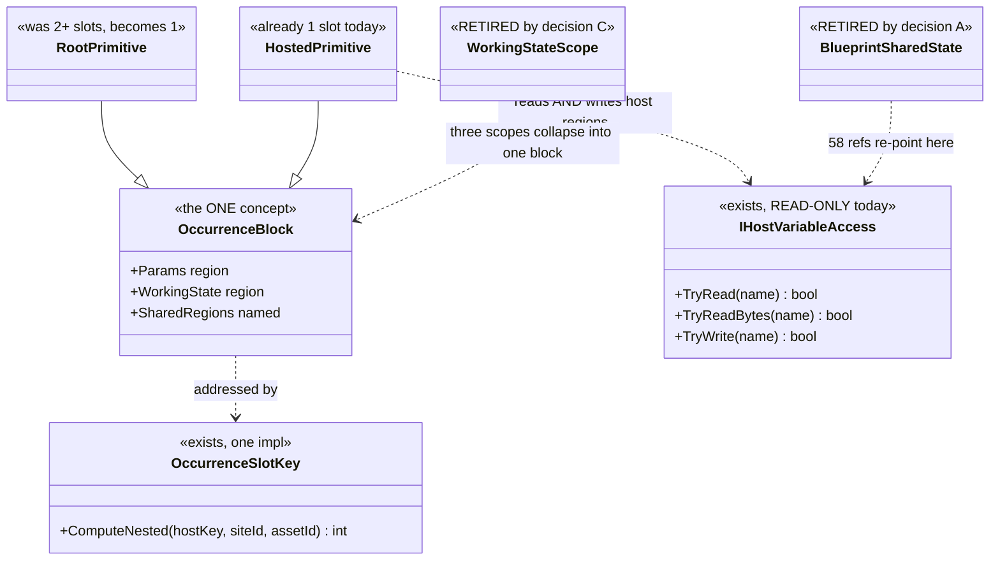

> ⭐ **Caption — what the picture shows that the prose hid.** `TryWrite` is the only genuinely new
> member in the whole proposal. Everything else is a deletion or a merge: drawing it made clear that
> the 58 `state` references do not need a mechanism, they need **one more method on a seam that
> already exists**.

### 2.2 Sequence — activation, with the scatter gone

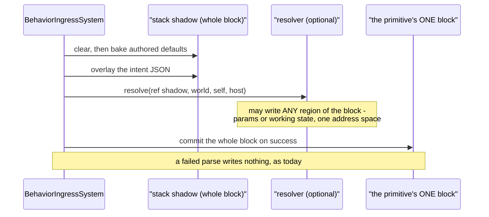

> ⭐ **Caption.** Today this needs a *scatter* — the shadow covers only the params region and the
> working state lives in up to 7 other slots. With one block there is one copy and no scatter, which
> is what makes *"the resolver may write anywhere"* a one-line property rather than a feature.

### 2.3 Modules — who provisions, and the edge that disappears

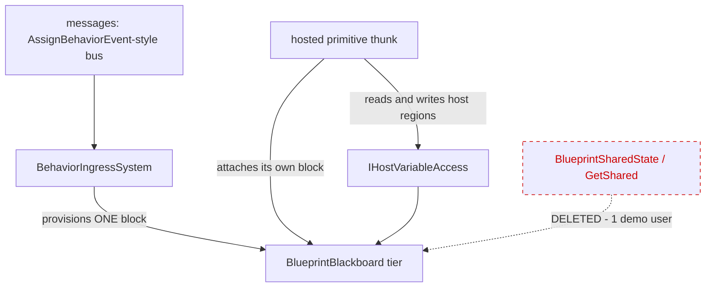

> ⭐ **Caption — the dead edge is the whole of decision `A`.** Every other edge exists today.
> Cross-entity coordination moves from the dotted edge to `MSG`, which is the path the shared-state
> design **already chose for writes** and never built for reads.

---

## 3. ⛔ What this does NOT change

| | |
|---|---|
| ⛔ the bake → overlay → resolve ORDER | `DESIGN_Parameter_Model.md` §3.2 rules it |
| ⛔ parse-before-commit | the shadow still commits only on success |
| ⛔ tier promotion | the allocator is untouched; slot COUNT falls |
| ⛔ `IHostVariableAccess`'s read semantics | `TryWrite` is added beside them |

---

## 4. ⭐⭐⭐ THE DECISIONS

### A — retire cross-entity shared memory? ✅ **RESOLVED `2026-09-28`: REMOVE, SEQUENCED INSIDE `B`**

> 🔒 **The user's decision RULE, verbatim:** *"will the removal simplify the code dramatically? if
> not, let's park it. if yes, let's remove it."* ⇒ ⭐⭐ **the ruling is the rule plus the
> measurement below**, not a preference — and it is reusable on the next such question.

⭐ 1 consumer, and it is its own proof (§1.4). ⭐ Cross-entity **write** was already deferred to
*"a deferred-event bus… mirroring `AssignBehaviorEvent`→`BehaviorIngressSystem`"* — so today's shape
is reads-by-memory and writes-by-messages, which is where slicing stopped rather than a decision.
⛔ **Rejected — keep it as an unpublished feature:** it is the arm that forces **name-only keying**,
and 37 same-entity reads pay that collision domain for it.

📐 **THE SIMPLIFICATION, MEASURED** *(this is what the rule was applied to)*:

| | |
|---|---|
| **whole files deleted** | **10, totalling 1 356 lines** — `SharedNodeDrawers.cs` 534 · `BlueprintSharedStateTests.cs` 277 · `BlueprintSharedState.cs` 216 · `ISharedStructTypeProvider.cs` 75 · `HillAttackSharedStateOps` 58 · `HillAttackSharedState` 50 · `SquadRallyState` 44 · `StatefulScopeQueries.cs` 46 · `IStatefulScopeAsset.cs` 36 · `StatefulSlotScope.cs` 20 |
| scattered arms | `GetSharedNode`/`SetSharedNode` **119 refs / 19 files** · `SharedTypeId` 79/12 · `BlueprintSharedState` 26/13 · `IrOp_ReadShared`/`WriteShared` 15/4 |
| ⭐⭐ **it is a FULL VERTICAL SLICE of the compiler** | an arm in **every** stage: node model → pin schema → `Stage0_Rehydrate` → `Stage2_Validate` + `BP2040`–`2042` → `Stage5_Schedule` → IR + `IrPrinter` → `StatementEmitter` → editor palette/drawers/command sink/graph model → the runtime accessor. ⇒ **one whole node kind leaves the blueprint language, end to end** |
| replacement cost | ~150 lines — `IHostVariableAccess.TryWrite`, re-point `PlatoonHillAttack2` at the clean twins (§6), one composition rail |

⚠⚠ **SEQUENCING, and it is part of the ruling:** 📐 **`A` ALONE is NOT dramatic** — the `Target`
pin, one `Stage0` arm, one demo asset and `T38`, order of 200 lines. ⛔ On the user's own rule that
would be *"park"*. ⭐⭐ **The 1 356 lines only become available once `B` gives the 58 `state`
references a home** ⇒ **do NOT cut `A` standalone**; it lands inside `B` or not at all.

🔒 **`R-137` is satisfied** — the capability is removed by an explicit user decision against a
measurement, not silently lost to a refactor. 📄 `R-150` is the general form.

### B — one block per running primitive? ✅✅ **APPROVED `2026-09-29`**

> 🔒 **User, verbatim:** *"whatever leads to this single-blackboard-slot-per-running-behavior is
> authorized"* · *"brain state was never part of the blackboard so it is ok to be in another slot."*

⭐ It is already the model for hosted children and for the root params table; only the root's
*split* deviates. ⭐ Slot count falls, so the tier budget *(`MaxSlots` 12/16/16/16)* improves.
⚠ **Cost:** one `StructureHash` per block instead of per region ⇒ a hot reload that changes any
variable invalidates that primitive's whole state. Acceptable — reload reprovisions anyway.

⭐⭐⭐ **THE APPROVAL CARRIES A SCOPE AND FOUR REQUIREMENTS — 📄 §12 is the design, and it is where
the work starts.** The scope: **the brain state stays in its own slot** and is not part of the
blackboard. The requirements: bake editor-saved defaults · overlay the behaviour parameters *(for a
sub-behaviour, a variable of the HOST's block)* · a custom resolver may write **the whole block** ·
`Role=Input` becomes **optional**. ⛔ **`D` is NOT approved by this** — §12.0 ③.

### C — retire `WorkingStateScope`? ✅ **RESOLVED `2026-09-28`: REMOVE, SEQUENCED INSIDE `B`**

> 🔒 **User:** *"..same rule should be applied to scoping the blackboard variables"* — i.e. the same
> measure-the-simplification test as `A`. ⭐ It clears, and **more decisively than `A` does.**

`Node` has **0** declared users and silently does nothing *(`CE-423`)*; `Behavior` becomes "a named
region of the block"; `Entity` goes with decision `A`.

📐 **THE SIMPLIFICATION, MEASURED** *(production references, tests excluded unless stated)*:

| | |
|---|---|
| 🔴 **THREE PARALLEL ENUMS FOR ONE CONCEPT** | `WorkingStateScope` *(authoring, netstandard2.0)* **38 refs / 16 files** · `StatefulSlotScope` *(runtime)* **29 / 10** · `OccurrenceSlotScope` *(the key)* **27** ⇒ **94 references across three spellings.** ⚠ The triplication is itself a symptom of `F5`'s two key schemes |
| ⭐⭐⭐ **author-facing surface** | **77** references of Scope in the variable panel, the authoring window and the variable editor — **a three-valued dropdown on every blackboard variable** |
| file format | **3 members** — `BehaviorTreeAssetDto:50`, `HsmAssetDto:300`, `BlackboardVariableEntry:41` ⇒ both hosts and the editor model |
| runtime manifest | **102** `Scope` references under `Fdp.Toolkits/Behavior/` |
| resolution machinery | `ResolveStatefulSlotKey` 11 · `StatefulScopeVariable` 11 · `ResolveVariableRoleScope` 2, plus their bodies |
| whole files | `StatefulScopeQueries.cs` 46 · `IStatefulScopeAsset.cs` 36 · `StatefulSlotScope.cs` 20 = **102 lines** *(also counted in `A`)* |
| test files referencing it | **37** *(27 + 10)* |
| ⭐⭐⭐ **against AUTHORED USES in the whole corpus** | **8** — 4 `Behavior`, 4 `Entity`, **0 `Node`** *(and `Node` is the DEFAULT)* |

⇒ ⭐⭐⭐ **~200 production reference sites, 77 of them author-facing, for 8 authored uses.**

⭐⭐ **Why this is the stronger case even though `A` deletes more lines.** Scope is **the only one of
these concepts an author must hold in their head**: a dropdown where *one value is silently broken*,
*one means something other than its name* and *one works*. The shared-state accessor, for all its
1 356 lines, is invisible to an author who never places the node. 🔒 That is exactly `R-150`'s
criterion — complexity the author must understand is the cost that matters.

⭐ **The residue is small:** the 4 `Behavior`-scoped variables become named regions of the host's
block — which is what `Behavior` scope already means. ⚠ **The key function SHRINKS, it does not
vanish:** `ComputeNested(hostKey, siteId, assetId)` survives for hosted occurrences; only the three
scope arms go.

⚠ **Same sequencing as `A`:** `C` is only possible once `B` supplies keying from occurrence
identity. ⇒ **not a standalone cut.**

### D — add `IHostVariableAccess.TryWrite`? ⛔⛔ **WITHDRAWN `2026-09-29` — IT WAS ON THE WRONG SEAM**

> 🔒 **User:** *"why would resolver write the host's blackboard? still the relic from time subtree
> could not have own slot? Is any use case described in its owning design?"*

📐 **Measured, and the answer is no on every count** — 📄 **§12.9e carries it.** In short: the seam is
**resolve-time** *(the host accessor is constructed only as an argument to `EmitParamSeed`, inside
`if (freshlyAttached)`; the tick path `TickCore(ref p, ref ws, self, world, time)` receives none)*
while the need it was invented for — `SetShared` — is **tick-time**; and **no owning design describes
a write use case at all**. ⛔ `D` is WITHDRAWN. ⚠ The read seam is untouched and keeps its documented
use case *(`DESIGN_Parameter_Model` §3.4)*; whether even THAT survives the per-site binding is §12.9d,
and is not decided.

#### ⛔ HISTORY — the withdrawn lean, kept because `D.1` is the lesson

### ~~D — add `IHostVariableAccess.TryWrite`?~~ ⚖️ **LEAN WAS: YES — but it CONTRADICTS A DOCUMENTED RULE, and that must be argued, not skipped**

📐 The seam is read-only today. The 58 `state` references need a host-owned region they can write.
⛔ **Rejected — let a child write the host's block directly:** the seam exists to keep a child from
knowing the host's layout, and `TryWrite` preserves that.

#### 🔴🔴 D.1 — **THE SEAM'S OWN HEADER FORBIDS THIS, IN TERMS**

⚠⚠ **This lean was first written without reading `IHostVariableAccess`'s header — an `R-129` miss,
and the intent was sitting in the file being extended.** 📐 Verbatim, `IHostVariableAccess.cs`:

> ⛔ **READ-ONLY.** *A resolver never writes its host — **a write path here would be a second supply
> mechanism.***

🔒 That is **ruling 9** *(one supply mechanism)* applied to this seam, alongside a second stated
rule — *"Resolve-once still holds. This reads the host at the CHILD'S ACTIVATION, not continuously
— live binding stays out of the model."*

⚖️ **The counter-argument, offered as an argument rather than an omission:**

| the rule guards | does `TryWrite` breach it? |
|---|---|
| ⭐ **PARAMS SUPPLY** — how a params region gets its values at activation, which must have exactly one path | ⛔ **No, if `TryWrite` is restricted to `Role=State` regions.** Working state is not supplied; it is zero-init and mutated each tick by the primitive that owns it. A second *supply* path would be a child writing another region's **params** |
| ⭐ **resolve-once / no live binding** | ⚠ **Partly yes, and this is the real cost.** A child writing a host region **every tick** is exactly the continuous coupling the header excludes. ⇒ if `D` is taken, the write must be **as unrestricted in time as an ordinary working-state write already is**, and the *"resolve-once"* rule must be restated as applying to **params only** |

⇒ ⭐⭐ **`D` is therefore a DELIBERATE NARROWING of the header's rule, not a reading of it:**
*"read-only for params, read-write for shared working state."* ⛔ **It must not be built until that
narrowing is accepted**, because the header's rule is the one thing standing between this and a
second supply mechanism. 📄 The header itself is also **factually stale** — see `CE-424`.

⚠ **What would change the lean:** if the 4 `Behavior`-scoped uses can be re-expressed as the host
*owning* the mutation *(children return values, the host writes)*, `TryWrite` is unnecessary and the
header's rule survives intact. 📐 **Not yet measured** — it needs a read of the six
`HillAssault2I_*` graphs' actual write patterns, which is a prerequisite of `B` rather than of `D`.

### E — does `Q75` depend on this, or the reverse? ⚖️ **LEAN: `Q75` DEPENDS ON THIS**

`Q75`'s `S0` *(one layout authority — `CE-418`)* is this document's first step, and its `S1`/`S2`
assume a single answer to *"where is this variable"*. ⇒ **build `S0` here, then `Q75` resumes.**

---

## 5. 🔴 DELETED

| | users | note |
|---|---|---|
| `GetShared`'s cross-entity `Target` pin | 1 *(a proof)* | decision `A` |
| `SharedStateCrossEntityDemo`, `SharedStateRallyDemo` and the `rally` variable | 2 demos | delete with `A` |
| `WorkingStateScope` and its three key arms | see §1.3 | decision `C` |
| `BlueprintSharedState` + `IrOp_ReadShared`/`IrOp_WriteShared` | — | re-expressed, §6 |

## 6. ⛔⛔ SUPERSEDED `2026-09-29` BY §12.14 — `PlatoonHillAttack2` IS DELETED (`CE-436`)

> 🔒 **User:** *"We can delete the blueprint based platoon hill attack 2 if it stands in the way.
> Not needed."* ⇒ 📐 measured: it does. **Read §12.14, not this section, on what is kept.**
> ⭐ What survives from below: the **60 `HillAssault2_*` twins** are KEPT — they use no `GetShared`
> and carry the per-node proof coverage. ⚠ The two families differ by ONE LETTER.

### ⛔ HISTORY — the KEEP argument, superseded

## 6a. ⭐⭐ KEPT, RE-EXPRESSED — **and this is the part that must not be read as a deletion**

| | |
|---|---|
| ⭐⭐⭐ **`PlatoonHillAttack2` — the COMPOSED TREE** | ⭐ **KEEP, but re-point it.** It is the only **large-scale** composition demonstrator: one tree hosting **7** blueprint primitives. The `T*` suite proves composition at 2–3 primitives; nothing else proves it at 7 |
| 🔴 **the six `HillAssault2I_*` graphs** | ⛔⛔ **DELETE — and this REVERSES this document's first draft.** 📐 **Every one has a CLEAN TWIN**: `HillAssault2_CalculateSegments`, `_DispatchAllToBaseline`, `_DispatchWaveWithTargets`, `_IsAreaQueryResolved`, `_IsWaveCompleted`, `_RequestAreaQuery` all exist **without** shared state. ⇒ **the `I` generation exists to exercise the shared-state mechanism, not because the behaviour needs it** — 🔒 the user's *"the demo is pretty old, used to lift/develop the blueprint capabilities, so it might be a bit synthetic"* is measurably correct. ⇒ **re-point `PlatoonHillAttack2` at the clean twins**, delete the six `I` duplicates |
| the 2 shared-state proof files | ⛔ **DELETE with the feature** — `PlatoonHillAttack2_Integration_ProofTests` (3) and `HillAssault2I_Integration_Smoke_ProofTests` (3). ⚠ Two of those six are **the same test duplicated across both files** *(`StandaloneStateVariable_EmitsManifestEntry_MatchingBlueprintSharedStateExpectedHash`)*, and one asserts only that generated SOURCE TEXT contains `GetShared`. ⭐ A replacement composition rail for the re-pointed tree replaces them |
| ⭐ the other ~14 `HillAssault2_*` proof files *(≈50 tests)* | ⭐⭐ **UNTOUCHED** — they test blueprint NODE semantics *(`ForEachSubordinate`, `HasTarget`, `AimAndFireSpecific`, `IsSelfArrived`, `ReverseToBaseline`, …)* on the clean assets and never reference shared state |

> 🔴🔴 **CORRECTION, and the user's persistence produced it.** This section first said *"DO NOT DELETE — 16 proof-test files rest on them and they are the only end-to-end evidence the blueprint route can express a complex behaviour."* 📐 **Both halves were wrong.** Only **2** of the 17 proof files are shared-state-specific, and the capability coverage is **duplicated**: the focused `T30`–`T39` suite proves each mechanism minimally *(`T35` shared working state, `T36` `GetShared`/`SetShared`, `T37` manifest provisioning, `T38` cross-entity read)*, while the `I` generation proves the same things through a large synthetic behaviour. ⇒ ⭐ **removing shared state costs ZERO unique node-semantics coverage.** ⚠ What it genuinely costs is the 7-primitive composition example — which the re-point preserves.
| the capability *"several hosted primitives of one behaviour share one plan struct"* | ⭐ becomes a **named region of the host's block**, read and written through `IHostVariableAccess` |

## 7. ⭐⭐ WHY THIS IS CHEAPER THAN IT LOOKS

🔒 **The occurrence store is `[DataPolicy(NoScenario)]` — nothing in it is serialised**, and inputs
are re-supplied at every activation. ⇒ **every slot key may change with NO save-file or replay
migration.** That removes what is normally the expensive half of a storage change.

⚠ **What it does cost:** every rail that hard-codes a slot key is re-authored
*(`OccurrenceSlotKeyParityTests`, the `*_ProofTests` that compute expected keys)*, and the 17 BTree
blackboard goldens move.

## 8. Rails this owes

| | |
|---|---|
| ⭐⭐⭐ **one block per primitive** | for every corpus behaviour, the slot count equals the number of running primitives — ⛔ no per-node or per-variable extras |
| ⭐⭐ **the layout parity rail** *(`Q75` `S0`)* | manifest offset == the layout type's actual field offset. 📐 **Red-proves on today's tree: 3 of 15 assets, 9 of 31 fields** |
| ⭐⭐ **the resolver writes anywhere** | a resolver that writes a working-state region has its bytes visible after commit, and **nothing** after a failed parse |
| ⭐ **`PlatoonHillAttack2` still passes** | all 16 `HillAssault2*` proof suites green after the re-author — the acceptance test for §6 |
| ⭐ **no scope remains** | `WorkingStateScope` has no references outside history |

---

## 9. 📌 PROVENANCE — **why the shared-state model was built, and what the user said about it the next day**

> 🔒 **User, `2026-09-28`:** *"I am still wondering why the sharing concept was implemented at all -
> not used, complex to implement, might have some reason"*

⭐ **It had a reason, it was reviewed, and the complaint being made today was made 14 months ago —
within 24 hours of it shipping.**

| when | what |
|---|---|
| `2026-07-15` | Slices 1, 2a and 2b ship. 📄 `Blueprint_SharedState_GetShared_Design.md`, **architect-reviewed** *(`Q1`–`Q5` + `2b-Q1`–`Q4`)*. ⭐ The stated need is a **capability ceiling**, not a behaviour: *"a blueprint AiPrimitive generates one `TickCore` with **exactly one** `WorkingState` struct… a ceiling for two distinct needs"* — cross-node sharing, and one node reaching a second slot |
| 🔴 **`2026-07-16`, the NEXT DAY** | 📄 **`Blueprint_Subsystem_Slice2_Candidates.md` §A11**, *"Raised by the user from hands-on Windows testing of the composed-blueprint + `GetShared`/`SetShared` authoring path"*, verbatim: *"all the variable and scope and default values and GetShared/SetShared and params vs working state, this is a lot to digest for a user … beyond the capability of an ordinary user (needs a programmer mindset). Without [visual documentation] the system is incomprehensible."* |
| ⚠ **the response at the time** | **A11 — "Visual conceptual documentation for the shared-state / working-state model" `[HIGH | S]`**: a scope decision tree, a two-entity data-flow diagram, an end-to-end authoring flow. ⛔ **Triaged as a DOCUMENTATION gap, not as a design one** |
| `2026-09-28` | The same complaint, in the same words, produces `R-150` and this document instead |

⇒ ⭐⭐⭐ **The lesson worth keeping, and it is the general form of `R-150`:** the evidence that the
model was over-built existed **one day** after it shipped, from the only person who would ever
author with it. ⛔ It was answered with *"explain it better"*. 📐 The adoption measurement in §1.4 is
what that answer cost: 14 months later the feature has **six duplicate assets and two demos**, and
the six duplicates each shadow a clean twin that predates them.

⚠ **Stated fairly, because the decision was not careless:** the ceiling was real *(one
`WorkingState` per primitive genuinely is a limit)*, the design was architect-reviewed, and `Q4`
gated the hazardous scope behind safeguards. ⛔ **What went wrong was not the build — it was
treating an author's "this is incomprehensible" as a documentation request.**

---

## 10. ⭐⭐⭐ THE WAY BACK IN — **parked deliberately, `2026-09-28`**

> 🔒 **User:** *"not approved, i want it recorded so i can return to it any time."*
> ⇒ ⛔ **This is NOT a stalled batch and NOT a backlog item.** It is a decision left open on
> purpose, with everything needed to take it already measured. **Nothing expires.**

⭐ **§11 is a fully designed slice** — `S-SUB`, the subtree unification — ready to cost but **not
authorised**. It is the cheapest part of `B` and the natural pilot.

### 10.1 ⭐ The ONE question to answer on return

> **Do we adopt `B` — one contiguous blackboard block per running AI primitive, root and children
> alike?**

⭐ **Everything else follows.** `A` and `C` are already decided *and fire only if `B` is yes*; `D`
and `E` are subordinate to it. ⛔ **There is no second question to prepare.**

### 10.2 📐 What is already measured, so it need not be re-derived

| the question | ✅ the answer, and where |
|---|---|
| does the root really differ from a hosted child? | ✅ §1.1 — root is ≥2 slots, a hosted child is 1 |
| is this a new model? | ⛔ no — §0, it is `DESIGN_Occurrence_Scoped_Storage` §3's own thesis, and its `O3` row is the unfinished half |
| what does `B` cost in data migration? | ✅ **nothing** — §7, the store is `[DataPolicy(NoScenario)]` |
| what does retiring shared memory save? | ✅ **10 files / 1 356 lines** + a vertical slice of the compiler — §4-`A` |
| what does retiring scope save? | ✅ **~200 production sites, 77 author-facing, for 8 authored uses** — §4-`C` |
| will anything shipped break? | ⛔ **no production behaviour uses any of it** — §1.4 |
| does `PlatoonHillAttack2` have to die? | ⛔ **no** — §6: keep it, re-point it at the clean twins |
| why was it built? | ✅ §9 — an architect-reviewed capability slice, and the author's complaint arrived the next day |

### 10.3 ⚠ The ONE thing still unmeasured, and it belongs to `B`'s first step

📐 **Whether the four `Behavior`-scoped uses can be re-expressed with the HOST owning the mutation**
*(children return values, the host writes)*. ⭐ If yes, decision `D`'s `TryWrite` is unnecessary and
`IHostVariableAccess`'s read-only rule survives untouched *(§D.1)*. ⇒ **a read of the six
`HillAssault2I_*` graphs' write patterns** — ⛔ not needed to decide `B`, only to execute it.

### 10.4 🔴 The findings that are waiting on this, and what happens to each

| id | if `B` is taken | if `B` is dropped |
|---|---|---|
| [`CE-418`](Blueprint_Issues_Tracker.md) *(two offset authorities)* | ⭐ its fix is `B`'s first step | 🔴 **must still be fixed on its own** — it is a live defect either way, and `Q75` is blocked on it |
| [`CE-420`](Blueprint_Issues_Tracker.md) *(`Role=State` default dropped)* | ⭐ subsumed | must be fixed in `ProvisionStatefulSlots` |
| [`CE-421`](Blueprint_Issues_Tracker.md) *(shadow carry-over)* | ⭐ independent — fix either way | same |
| [`CE-422`](Blueprint_Issues_Tracker.md) *(`Entity` scope)* · [`CE-423`](Blueprint_Issues_Tracker.md) *(`Node` scope silently skipped)* | ⭐⭐ **both DISSOLVE** — the scope they describe stops existing | 🔴 **both become real fixes** — reword one, diagnose the other |
| [`CE-424`](Blueprint_Issues_Tracker.md) *(stale seam header)* | ⭐ fix while touching the seam | fix anyway, it is two sentences |

⇒ ⭐⭐⭐ **`CE-418` is the one that does not wait.** It is a live defect in two user-facing surfaces
*(StructEdit's typed params editor and the replay predicate compiler)*, it blocks `Q75`, and its fix
is identical under both outcomes. ⛔ **Everything else can sit.**

---

## 11. ⭐⭐⭐ SLICE `S-SUB` — **a hosted SUB-BEHAVIOUR gets its own block, seeded once** *(designed `2026-09-29`)*

> 🔒 **User, `2026-09-29`:** *"I want to unify all that for sure, so same concept work for any
> sub-behavior. The subtree sharing hosts memory looks like relic from time what we had one single
> blackboard slot per entity. no longer true. I need each behavior having its own allocated slot.
> and resolving behavior params (that are stored in host blackboard as variable) exactly once at
> starting the sub-behavior, by calling resolver if exists or auto-copying the params to
> sub-behavior's blackboard."*

⭐⭐⭐ **This is `B` applied to hosted SUBTREES, and it is the cheapest part of `B` because the target
already ships.** ⛔ It is **not** a new mechanism: the hosted-**AiPrimitive** path already does
exactly what the user describes. `S-SUB` converts the subtree path to it.

### 11.1 🔴 The gap, measured

| | hosted **AiPrimitive** *(the target, ships today)* | hosted **SUBTREE** *(the relic)* |
|---|---|---|
| the child's params | ⭐ **its own region**, inside its own occurrence slot | ⛔ **none** — `TickFromContext` aliases `ref childBb` onto the **host's** root params region |
| when | ⭐ **seeded ONCE** at `freshlyAttached`, then the per-asset resolver runs, then working state is default-init'd *(`AiPrimitiveEmitter.EmitParamSeed:464`)* | ⛔ **re-resolved EVERY TICK** — `RootParamsAccess.TryGetRootBytes` per tick, a linear scan of attached slots |
| the slot holds | `[cursor][Params][WorkingState]` | ⛔ **the cursor ONLY** — `TreeStatePayloadSize => sizeof(BehaviorTreeState)` *(`HostedSubtree.cs:33` → `BTreeHostedSites.cs:189`)* |
| which host variable feeds it | ⭐ a **per-site** binding — `SeedParamsOffset(instance, writer, AssetId)` *(`CE-414`)* | 🔴 **NOTHING SAYS** — it gets the host's *whole* region |
| freshness | snapshot | live alias |

📐 **The sizing is the tell that this is a relic:** the subtree slot is sized for a **cursor and
nothing else** — which is what you build when the params have nowhere else to live. `P3` gave params
their own slot and this path was never revisited.

### 11.2 The sequence — **what changes**

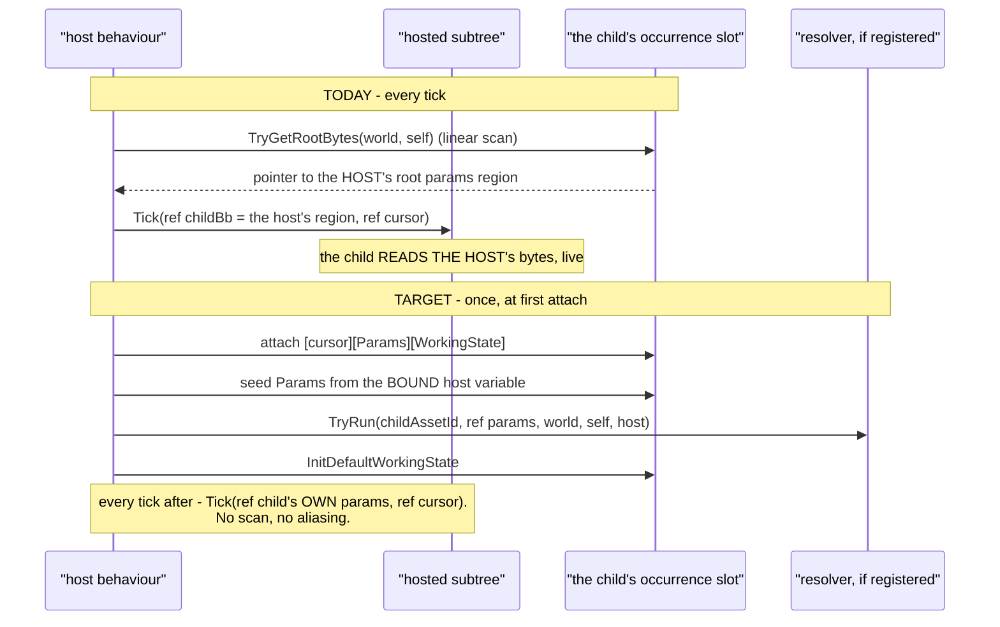

> ⭐ **Caption — what the picture shows that the table could not.** The per-tick arrow **disappears
> entirely**: the scan exists only because the child has nowhere of its own to read from. ⛔ And the
> `Res` arrow **cannot** exist today — there is no point in a subtree's life at which a resolver
> could run, because nothing is ever "started" for it.

### 11.3 ⭐ The seven pieces, and where each lands

| # | piece | file(s) | note |
|---|---|---|---|
| **①** | the slot payload becomes `[cursor][Params][WorkingState]` | `HostedSubtree.cs:33` | drop `TreeStatePayloadSize`'s cursor-only assumption |
| **②** | size it from the CHILD's definition | `BTreeHostedSites.cs:189` · the ingress demand | `+ RootParamsBytes(childDef)`; `TryGetHostedOccurrenceDemand` already feeds tier selection |
| **③** | 🔴 **a per-site params binding** | the subtree hosting DTO, both emitters, the picker | ⛔ **the real work.** ⭐ **Template: `CE-414`** did exactly this for AiPrimitives one week earlier — compose step, auto-managed variable, per-site seed key |
| **④** | seed + resolve at first attach | `HostedSubtree` | ⭐ reuse `EmitParamSeed`'s body verbatim |
| **⑤** | tick reads the child's own region | `HostedSubtree.TickFromContext` · `OccurrenceSubtreeHost.cs:49` · `BrainTickSystem.TickHostedChildren` | ⭐ **deletes** the per-tick scan |
| **⑥** | the child's blackboard TYPE | BTree child ✅ `{Asset}_Blackboard` · **HSM child ⛔ none** | 🔴 **depends on `Q75`-`S1`** — HSM children only |
| **⑦** | authoring binds a params variable | the subtree picker | mirrors the AiPrimitive compose |

⭐ **Surface: under ten production files.** ⚠ The emitters are `HsmBridgeEmitCore.CollectHostedSubtrees`
and the BTree hosted-slot arm.

### 11.4 ⛔⛔ TWO BEHAVIOUR CHANGES — **named here so they are not DISCOVERED**

| | |
|---|---|
| 🔴 **a subtree stops seeing host param changes live** | it takes a snapshot at start. ⭐ This MATCHES the AiPrimitive path and the stated rule *(`IHostVariableAccess`: "live binding stays out of the model")*. ⚠ **It is still a semantic change**: anything that writes a param at runtime — **StructEdit's typed editor does** — stops reaching a running subtree |
| ⚠ **a subtree hosted on a NO-PARAMS host** | today it is handed a **scratch byte** *(the `WanderMilitary` shape, `HostedSubtree.cs:82`)*; it would get its own **defaulted** params region. ⭐ Better, ⛔ but different |

### 11.5 ⚠ Dependencies and ordering

⭐ **`S0` *(`CE-418`, one layout authority)* → `S1` *(HSM blackboard struct)* → `S-SUB`.**
⚠ Only piece ⑥ needs `S1`, and **only for HSM children** ⇒ 📌 **the BTree arm of `S-SUB` could go
first**, which also makes it the natural pilot for `B`.

### 11.6 Rails `S-SUB` owes

| | |
|---|---|
| ⭐⭐⭐ **seeded once, not per tick** | a host whose params are mutated AFTER the child starts: the child keeps its seeded values. ⛔ **Red-proves on today's tree**, where it sees the change |
| ⭐⭐ **the resolver runs, exactly once** | a subtree whose child asset declares a resolver: it fires on attach and not on subsequent ticks |
| ⭐⭐ **per-site binding** | one host, the SAME child asset at two sites, two different bound variables ⇒ two different seeded values. ⛔ **Not expressible today at all** |
| ⭐ **the scan is gone** | `TickFromContext` no longer calls `TryGetRootBytes` |
| ⭐ **no-params host** | a child hosted by a params-less behaviour gets its defaults, not a scratch byte |
| ⭐ **`E5`/`E6` still pass** | the existing HSM-hosts-BTree and BTree-hosts-BTree suites are the regression net |

---

## 12. ⭐⭐⭐ THE BLOCK'S DTO — **who defines it, and how parameters reach it** *(APPROVED `2026-09-29`)*

> 🔒 **User, `2026-09-29` — THE AUTHORISATION, verbatim:** *"brain state was never part of the
> blackboard so it is ok to be in another slot. whatever leads to this
> single-blackboard-slot-per-running-behavior is authorized. Note: must support the pre-seeding the
> params from editor saved defaults and overriding from the behavior parameters (which in case of
> sub-behavior are stored in hosting behavior blackboard) and using custom resolver that can access
> (write) the whole (now single) blackboard DTO; default resolver would just copy the behavior params
> to the blackboard INPUT role part; custom resolver can do whatever; in case of custom resolver
> there noes not even need to be any role=Input variable defined (but can be); custom resolver could
> be c# hardcoded or defined as a blueprint (not exactly sure how if the resolver is for non-blueprint
> behavior)"*

### 12.0 ⭐ What that message SETTLED

| # | settled | consequence |
|---|---|---|
| **①** | ⭐⭐⭐ **`B` is APPROVED** — one blackboard block per running behaviour, root and child alike | `A` and `C`, which were "remove, sequenced inside `B`", stop being inert |
| **②** | ⭐ **the BRAIN STATE is NOT part of the blackboard** and stays in its own slot | ⭐⭐ this is the *simplifying* answer: a BTree cursor is `sizeof(BehaviorTreeState)` but an HSM instance is `HsmInstanceManager.SelectTier(blob)` — **64/128/256 chosen at RUNTIME from the blob** *(`RootHsmAccess.cs:46`)*. A runtime-width region cannot be a field of a compile-time struct ⇒ folding it in would have forced a byte-level escape hatch into the one thing we are making typed |
| **③** | ⭐⭐ **the supply pipeline has THREE stages and the resolver owns the WHOLE block** | §12.3. The resolver's reach widens from the params region to the block; `Role=Input` becomes **optional** |

⚠ **What it did NOT settle: decision `D`.** `D` is `IHostVariableAccess.TryWrite` — a resolver writing
**its HOST's** variables. The authorisation grants a resolver write access to **its OWN** block. ⛔ Do
not read ③ as resolving `D`; it stays a lean, and its counter-argument in `D.1` is untouched.

---

### 12.1 ⭐ The block, and the two slot shapes

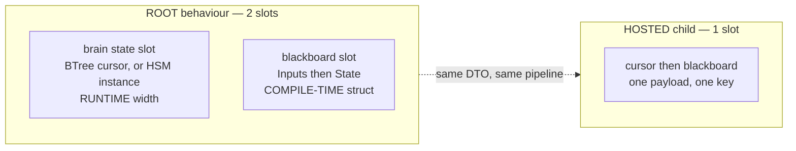

> ⭐ **Caption — what the picture shows that prose hid.** The root needs **two** slots and the child
> **one**, and that is not an inconsistency: the child's brain state is a fixed-width cursor so it
> rides in the same payload, while the root's may be a runtime-width HSM instance so it cannot.
> ⛔ **The BLACKBOARD is one block in both** — which is the whole claim. The asymmetry is in the brain
> state, where the user has now placed it deliberately.

📐 **Both shapes are already served by one shipping allocator** — `OccurrenceWorkingState.cs:109-158`,
`ResolveOrAttach<TParams, TWorkingState>`, generic over two `unmanaged` types, **state at BASE and
params AFTER** *(§28.3a — load-bearing: every existing reader decodes at the base)*:

| | call |
|---|---|
| root blackboard slot | `ResolveOrAttach<TBlackboard>` — the existing one-region overload |
| child slot | `ResolveOrAttach<TBlackboard, BehaviorTreeState>` ⇒ **cursor at base, blackboard after** |

⭐⭐ **The cursor lands at the base by construction**, so every reader that decodes a hosted subtree's
`BehaviorTreeState` today stays correct without being touched. ⚠ **This supersedes §11.3 ①'s spelling**
`[cursor][Params][WorkingState]`: that reads as three regions needing a new helper. It is **two** —
`[cursor][one blackboard struct]` — and the shipping generic covers it unchanged.

---

### 12.2 ⭐⭐⭐ WHO DEFINES THE DTO


> ⭐ **Caption.** Drawing it forces the answer to *"who defines the DTO"*: **nobody new.**
> `BehaviorDefinition` already carries both members and both type lists; the only new types are the
> two halves of a struct the generator already emits half of.

#### The three authoring routes — one emitted shape

| route | who authors the table | who emits the struct | status |
|---|---|---|---|
| **BTree JSON asset** | the editor — `.btree.json` `Blackboard.Variables[]` *(name, type, role, scope, `DefaultValueJson`)* | ⭐ the **build-time generator** — `BTreeJsonGenerator.cs:270-287` → `{Asset}.Blackboard.g.cs` | ✅ ships, **Input only** |
| **HSM JSON asset** | the editor — `.hsm.json`, same table | 🔴 **nobody.** `HsmBridgeEmitCore.cs:178-181` states it: *"the HSM generator emits NO blackboard struct… there is no type to name"* | ⛔ `Q75`-`S1` |
| **hand-written C#** | the author | the author | ✅ the concept already exists — `TBlackboard` of `BTreeBuilder<TBlackboard, BTreeContext>` |

⛔⛔ **The editor does NOT emit the struct, and must not start.** `BlackboardDtoEmitter`
*(`Hrot.Editor.AiShared/Blackboard/BlackboardDtoEmitter.cs:73`)* writes a `{Asset}.Blackboard.cs`
companion and has **zero production callers** — measured `2026-09-29` with `scripts/find.sh`: only its
own test class, plus `BlackboardTypeHelper.cs:14` reusing its `TypeAliases` map. ⇒ ⭐ it is a dormant
second producer for one slot *(`R-132`)*; leave it dormant.

#### 12.2a ⭐⭐⭐ WHY `Role=Input` FIRST — **the Input region stays byte-identical**

Every offset in `ManagedBlackboardVariables` is relative to the params base. Emitting the `Inputs`
sub-struct **first, at offset 0, with its internal layout unchanged** means:

| ⭐ | |
|---|---|
| ⭐⭐⭐ **nothing that reads params today moves** | StructEdit's typed editor, `RootParamsProjection`, the ReplayBrowser predicate compiler, the debug API — all keep their offsets |
| ⭐⭐ **the default resolver is one `memcpy`** | `block.In = supplied` — the Input region is a contiguous prefix by construction, so *"copy the behaviour params to the INPUT role part"* needs no offset table |
| ⭐ **the goldens move additively** | the State fields append; the Input prefix is unchanged bytes |

#### 12.2b ⚠ THE TWO MEMBERS FINALLY DIVERGE — **and that is what they were split for**

📐 Measured: today a generated behaviour sets **both** members to the same type, and a rail asserts it —
`AGeneratedBehaviourAdvertisesItsManifestTests.cs:83` `Assert.Same(def.JsonParamsDtoType,
def.BlackboardLayoutType)`; its curated twin asserts `NotEqual`
*(`ABehaviourAdvertisesItsRealParametersTests.cs:183`)*. Under this design a generated behaviour
becomes `JsonParamsDtoType = Asset_Inputs` and `BlackboardLayoutType = Asset_Blackboard` ⇒ ⭐ **the
generated route starts behaving like the curated one**, which is exactly the separation `CE-235` made
after `CE-224` published an engine-internal layout as a wire contract.
⛔ **That rail must be updated, not deleted** — flip `Assert.Same` to "the layout's first field is the
published contract". ⚠ Naming it here so it is a planned change and not a surprise red.

---

### 12.3 ⭐⭐⭐ HOW PARAMETERS REACH THE BLOCK — **bake → supply → resolve, exactly once**

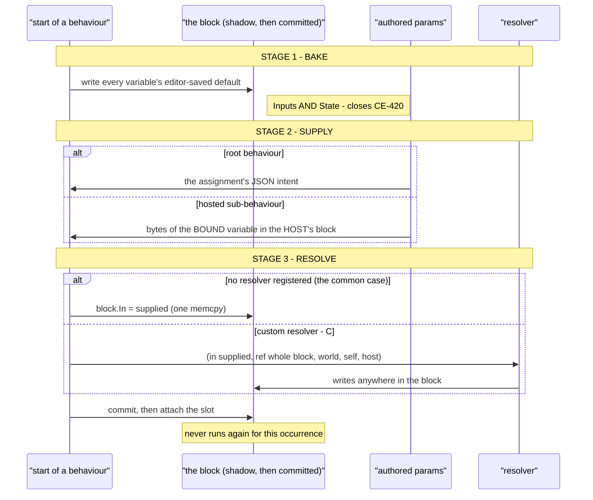

> ⭐ **Caption — what the picture shows that the table could not.** The **only** thing that differs
> between a root and a child is the arrow in stage 2: *where the authored params come from.* Stage 1
> and stage 3 are byte-identical for both. ⇒ that is what makes "one pipeline" a real claim rather
> than a slogan, and it is why the helper can be **one** implementation called from two places.

| stage | what it does | where it exists today |
|---|---|---|
| **1 BAKE** | write every variable's `DefaultValueJson` | ✅ emitted — `BTreeBridgeEmitCore.EmitParseParamsLocal` step 1. ⛔ **only for PACKED variables, i.e. `Role=Input`** ⇒ a `Role=State` default is silently dropped *(`CE-420`)*. ⭐ Extending the bake to the whole DTO **closes `CE-420` for free** |
| **2 SUPPLY** | overlay the authored params | ✅ root: JSON overlay, same emitter, step 2 · ✅ child (AiPrimitive): the per-site seed copy, `AiPrimitiveEmitter.EmitParamSeed:464` · 🔴 child (subtree): **does not exist** — it aliases the host instead *(§11)* |
| **3 RESOLVE** | default `memcpy`, or the custom resolver | ✅ hosted: `HostedParamResolvers.TryRun(AssetId, ref params, world, self, host)` · ✅ root: `BehaviorDefinition.ParseParams` · ⛔ both are scoped to the **params region**, not the block |

🔒 **The ORDER is a standing ruling, not a choice** — `DESIGN_Parameter_Model.md` §3.2: *"defaults are
baked, scenario JSON overlays them, runtime wins."* This design adds a third supplier to stage 2 (the
host variable) and widens stage 3's reach; **it does not reorder the stages.**

#### 12.3a ⛔ The shadow must grow to the whole block

📌 A resolver runs inside `BehaviorIngressSystem`'s **shadow parse**: parsed into a stack copy,
committed only on success, so *"a parse failure leaves the entity 100% on its old behaviour"*
*(`Q43` §4)*. ⇒ ⭐ if the resolver may write the whole block, **the shadow must be the whole block.**
🔒 The user anticipated this on `2026-09-28`: *"we can size the shadow to the full blackboard."*
⚠ And it **raises** the value of `V_ResolverPurity`, which exists precisely because a side effect
escapes the shadow — a resolver that can write more is a resolver whose purity matters more.

#### 12.3b ⭐ `Role=Input` becomes OPTIONAL — **and that changes the sizing rule**

🔒 *"in case of custom resolver there does not even need to be any role=Input variable defined."*
📐 Today `RootParamsAccess.RootParamsBytes:265` sizes the region as the **manifest extent** —
`max(ByteOffset + sizeof)` over the packed variables — falling back to `Marshal.SizeOf(BlackboardLayoutType)`
and then to `0`. ⛔ With no `Role=Input` variable the manifest is empty ⇒ **0 bytes**, and the block
would not be allocated at all. ⇒ ⭐ **the size must come from the DTO** (`sizeof(TBlackboard)`), with
the manifest extent kept as the separate `InputBytes` the stage-2 copy needs. `CE-429`.

⭐ **This shape is not new — it is what a CURATED behaviour already is.** `PlatoonHillAttack` takes
geographic lat/lon in its authored DTO and its resolver writes Cartesian metres plus a resolved
`Entity` into a layout that shares almost no field with it. ⇒ 🔒 **the "custom resolver can do
whatever" case is the SHIPPED curated case, and the generated case is the degenerate one where the
authored DTO equals the Input region and the resolver is a memcpy.** That is the unification.

---

### 12.4 ⭐⭐⭐ THE RESOLVER — **one seam, two authoring routes**

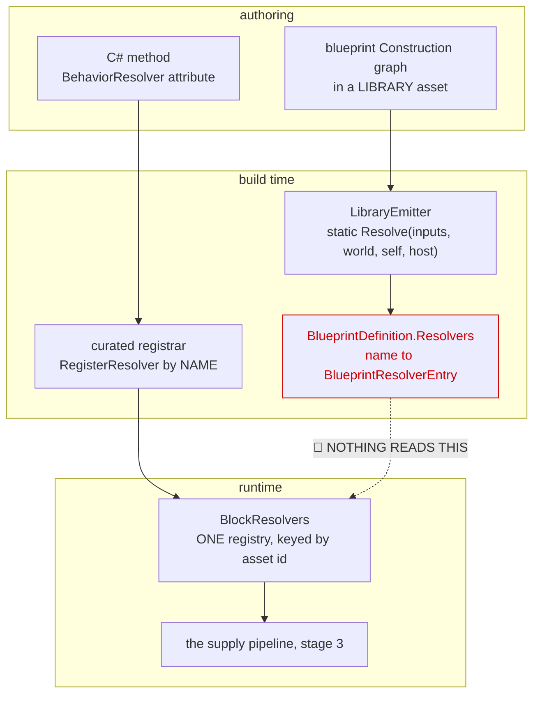

> 🔴 **Caption — the dead edge is the finding.** Every box exists and ships. The **dotted red edge does
> not**: `BlueprintDefinition.Resolvers` is populated by the compiler and, measured `2026-09-29`, read
> by **nothing in production** — its only consumers are three test files
> *(`BlueprintAuthoredResolver_InvokeTests`, `ResolverWorldReachTests`, `OwnParamResolverTests`)*.
> ⇒ ⭐⭐ **a blueprint-authored resolver is built, purity-checked and PROVEN INVOCABLE, and cannot be
> attached to any behaviour.** That is one binding, not a feature.

#### 12.4a ⭐⭐⭐ "How would a BLUEPRINT resolver work for a NON-blueprint behaviour?"

🔒 The user's stated uncertainty. **Answer: the question dissolves — a `Construction` graph is not part
of the behaviour.** It lives in a **Library** blueprint asset, is emitted as a plain static method
`static TOut Name(inputs…, EntityRepository world, Entity self, IHostVariableAccess host)`
*(`LibraryEmitter.cs:196-236`)*, and is published by graph NAME. ⇒ ⭐ **nothing about it requires the
consumer to be a blueprint.** A BTree or HSM asset references it exactly as a curated C# resolver is
referenced today — by name, at registration.

📐 **What already exists, measured:**

| | |
|---|---|
| the graph kind | ✅ `GraphKind.Construction`, authorable in the editor as **"Construction Script"** *(`BlueprintGraphModel.cs:141`)* |
| purity | ✅ enforced — `V_ResolverPurity`, a deny-list plus a completeness rail *(`Q43-C1`)*, with two honestly-documented gaps |
| emission | ✅ `LibraryEmitter.cs:40` — deliberately the **same** emit as a Function graph; the KIND is what makes it a resolver, never a naming convention *(`Q43-A3`)* |
| publication | ✅ `BlueprintDefinition.Resolvers` — `Dictionary<string, BlueprintResolverEntry>`, `CSharpEmitter.cs:283,395` |
| ⛔ **binding to a behaviour** | 🔴 **MISSING.** `CE-428` |

⭐ **The binding, in three parts:** ① the behaviour asset gains a resolver reference
*(library asset id + graph name)* · ② the editor gains a picker over `Construction` graphs *(the
`ActionSchemaExporter` pattern the action/guard pickers already use, `CE-386`)* · ③ the generated
registrar resolves `BlueprintDefinition.Resolvers[graphName].As<TDto>()` and binds it.
🔒 **`R-149` already governs the collision case** — two explicit bindings for one params region
**throw**, they do not race.

#### 12.4b ⭐ Two registries collapse into one

| today | keyed by | for |
|---|---|---|
| `BehaviorDefinition.ParseParams` + `BehaviorRegistry.RegisterResolver(name, …)` | behaviour **NAME** | the root |
| `HostedParamResolvers.Register(assetId, …)` | asset **GUID** | a hosted child |

⇒ ⭐⭐ **One registry keyed by ASSET ID**, invoked at block creation for root and child alike — because
under `B` those are the same event. ⚠ `RegisterResolver`'s by-name overlay stays as the **curated
binding surface** *(a curated artefact outranks a generated one — `R-132`, and §10 of
`Behavior_Parameter_Resolver_Detailed_Design`)*; only the *lookup at run time* unifies.

#### 12.4c The seam, widened

```csharp
// today — FDP/Toolkits/Fdp.Toolkits/Behavior/BehaviorParams.cs:18
delegate void ResolveParams<TDto>(ref TDto dto, EntityRepository w, Entity s, IHostVariableAccess? h)
    where TDto : unmanaged;

// target — two types: what was AUTHORED, and the BLOCK it writes
delegate void ResolveBlock<TAuthored, TBlock>(
    in TAuthored authored, ref TBlock block, EntityRepository w, Entity s, IHostVariableAccess? h)
    where TAuthored : unmanaged where TBlock : unmanaged;
```

⭐ The one-type form is the special case `TAuthored == TBlock.In`; the default resolver is
`block.In = authored`.

---

### 12.5 📐 EXISTS vs MISSING — **the honest ledger**

| piece | state |
|---|---|
| a generic one-block allocator | ✅ `OccurrenceWorkingState.ResolveOrAttach<,>` — generic, unmanaged, alignment-correct, tier-aware |
| a per-asset resolver invoked once at attach | ✅ `HostedParamResolvers.TryRun`, inside `if (freshlyAttached)` |
| seed-from-a-bound-host-variable | ✅ for AiPrimitives — `EmitParamSeed` + per-site `SeedParamsOffset` *(`CE-414`)* |
| bake-then-overlay | ✅ `EmitParseParamsLocal`, and the order is a ruling |
| blueprint-authored resolver | ✅ authorable, pure, compiled, published — 🔴 **bound to nothing** |
| tier sizing from a declared demand | ✅ `HostedOccurrenceDemand.Of`, one rounding shared with the attach |
| **a struct containing State fields** | 🔴 **0 of 15** generated blackboard structs have one *(swept `2026-09-29`; `Pack:146` excludes `Role=State`)* |
| **an HSM blackboard struct** | 🔴 none, for any asset |
| **a subtree's own block** | 🔴 none — it aliases the host, per tick |
| **one layout authority** | 🔴 two, and they disagree — `CE-418` |

---

### 12.6 ⏭ THE SLICES — **ordered, and each independently shippable**

> ⚠ **Revised by §12.16 (`2026-09-29`):** slices 1–4 are built; a slice this table never named — **`CE-437`**, moving a generated behaviour's `Behavior`-scoped State into the block and flipping `BlackboardLayoutType` — was filed and lands **together with `CE-429`**.

| # | id | slice | depends on |
|---|---|---|---|
| **1** | `CE-418` | 🔴 **one layout authority** — the struct carries `[FieldOffset]` from `Pack`. ⭐ Live defect, fix is identical either way | — |
| **2** | `CE-436` | 🔒 **delete `PlatoonHillAttack2` + the six `HillAssault2I_*` graphs** *(~28 files; the 60 `HillAssault2_*` twins STAY)*. ⭐ Removes 2 of 4 `Entity` variables, all 58 shared-`state` refs, and the only 9-slot asset ⇒ halves `CE-435` and most of `A` | 1 |
| **3** | `CE-435` | 🔒 **retire `Scope=Node` and `Scope=Entity` from the AUTHORING surface** — 8 authored State variables in the whole corpus, 4 to re-home, **0 at Node**. ⭐ Moved here from slice 10 at the user's request so the refactor carries ONE scope, not three. ⛔ Authoring only; the key arms go with `A`+`C` | 1 |
| **4** | `CE-425` | emit the two-part struct `{ Inputs In; State St; }`, **Input first and byte-identical**; `Q75`-`S1` is its HSM arm | 1 |
| **3** | `CE-429` | size the block from the DTO, keep `InputBytes` separately ⇒ a behaviour with **no** `Role=Input` variable is legal | 2 |
| **4** | `CE-426` | one **bake → supply → resolve** helper, called by the ingress and by the hosting thunk; shadow widened to the block | 2 |
| **5** | `CE-427` | widen the seam to `ResolveBlock<TAuthored,TBlock>`; collapse the two resolver registries into one keyed by asset id | 4 |
| **7** | `CE-431` | **`S-SUB`** *(§11)* — a hosted subtree gets its own block, seeded once. ⭐ **the pilot**: its BTree arm needs neither `S1` nor the scope work | 4 |
| **7** | `CE-432` | widen `BP1677` from "one DTO in → the SAME DTO out" to "authored DTO in → the BLOCK out" — one Stage-2 rule, one emitter lambda | 5 |
| **8** | `CE-428` | bind a blueprint `Construction` graph as a behaviour's resolver — asset field, editor picker, registrar lookup | 7 |
| **8b** | `CE-434` | the behaviour picks or CREATES its resolver *(a dedicated resolver asset)*, and the editor invalidates the pick when the authored params change — 📄 §12.10 | 8 |
| **8a** | `CE-433` | ⭐ OPTIONAL ergonomics — a `Get All / Set Blackboard Variables` pin pair baked from the variable table. ⛔ The capability already ships *(§12.9a)*; this is the `GetAllParameters`-style wrapper | 7 |
| **9** | `CE-430` | fold `HillAttackMutableState` back into `PlatoonHillAttackBlackboard`; retire `StatefulAction`'s manifest/scope arguments | 4 |
| **10** | `A` + `C` | retire cross-entity shared memory and `WorkingStateScope` — now unblocked | 6, 8 |

⭐ **`CE-420`** *(an authored default on a `Role=State` variable is silently dropped)* **closes inside
`CE-426`** — the bake stage covers the whole DTO.

---

### 12.7 Rails §12 owes

| | |
|---|---|
| ⭐⭐⭐ **the Input region is byte-identical** | the generated `Inputs` sub-struct's field offsets equal today's manifest offsets for every one of the 15 assets. ⛔ Assert on the ARTEFACT, not on a re-computation |
| ⭐⭐⭐ **a `Role=State` default survives** | author a default on a State variable; read it back at first tick. ⛔ **Red-proves on today's tree** *(`CE-420`)* |
| ⭐⭐⭐ **no `Role=Input` variable + a custom resolver** | the block is allocated, the resolver runs, the values land. ⛔ **Not expressible today at all** |
| ⭐⭐ **resolve runs exactly once** | mutate the source after start; the block keeps its resolved values |
| ⭐⭐ **a blueprint resolver drives a BTree behaviour** | a `Construction` graph in a Library asset, bound to a JSON BTree asset, writes its block. ⛔ **The binding does not exist today** |
| ⭐⭐ **a failed resolve leaves the old behaviour intact** | throw inside the resolver ⇒ the entity keeps its previous block, unmodified. ⭐ This is the shadow's whole purpose and the block is now what is shadowed |
| ⭐ **the two definition members diverge** | `JsonParamsDtoType != BlackboardLayoutType` for a generated asset, and the published schema is the **Inputs** half only |
| ⭐ **`E5`/`E6` still pass** | the HSM-hosts-BTree and BTree-hosts-BTree suites are the regression net |

---

### 12.8 ⚠ OPEN — **not settled by the authorisation**

| | |
|---|---|
| **`D`** | `IHostVariableAccess.TryWrite` — a resolver writing its **HOST's** variables. ⛔ Distinct from ③ above; `D.1`'s argument stands. The measurement that decides it is the six `HillAssault2I_*` graphs' write patterns |
| ⚠ **the subtree freshness change** | a subtree stops seeing host param changes live *(§11.4)*. ⭐ Correct, matches the AiPrimitive path and the stated rule — ⛔ still a behaviour change |
| ⚠ **`V_ResolverPurity`'s two gaps** | a CLR-method `FunctionCallNode` is allowed and unanalysable. ⭐ Unchanged by this design, but a resolver that writes more makes the gap worth re-reading before `CE-428` |

---

### 12.9 ⭐⭐⭐ THE RESOLVER GRAPH — **what already exists, and the one signature that must widen** *(measured `2026-09-29`)*

> 🔒 **User, `2026-09-29`:** *"no host accessor needed i guess; resolver works just between the
> behavior dto and its blackboard dto"* · *"we will need a blueprint node that can access its
> blackboard DTO (access the variable within that DTO as pins), both reading and writing"* · *"the
> construction graph based resolver might need to get the behavior param dto as its own input param
> and would need to use the blueprint node i mentioned above to write into behavior's dto (or it
> could take the behavior dto as another param if supported - but i don't think multiple params are
> supported, that is for you to check)"*

#### 12.9a ⭐⭐ THE NODE ALREADY EXISTS — **twice, in two different styles**

📐 Enumerated with `search_graph` over every `*Node` class, then read:

> ⛔⛔ **CORRECTED `2026-09-29`, same day, after the user asked *"how to make them work on the slot
> blackboard dto?"*** — the first draft of this table listed `BreakStruct`/`MakeStruct`/`SetMembers`
> as an equivalent *style* for addressing the blackboard. 🔴 **They are not, and cannot be:** they
> operate on a struct **value flowing on a data pin**, and **no node produces the blackboard as a
> value**. ⇒ they are the tools for a **nested struct FIELD**, never for the block itself. The block
> is addressed by the name-keyed pair, through `ScopeVarFor` — §12.9a-1.

| style | nodes | what it addresses |
|---|---|---|
| ⭐⭐⭐ **the block — name-keyed, implied subject** | `GetParameterNode` · `GetAllParametersNode` · `SetVariableNode` | ⭐ **THE right tools.** They emit `{scopeVar}.{field}`, where `scopeVar` is a **parameter of the emitted method** — see §12.9a-1 |
| ⭐ **a nested struct FIELD — by value** | `BreakStructNode` · `MakeStructNode` · `SetMembersNode` | a struct **value** on a data pin. ⛔ Cannot reach the block: nothing produces it as a value. ✅ All three are pure *(absent from the deny-list)*, so they are legal **inside** a resolver on a field |

#### 12.9a-1 🔴🔴 HOW A NODE ADDRESSES THE SLOT — **it does not, and it must not**

🔒 **The user's question:** *"how to make them work on the slot blackboard dto? or SetVariable — does
it know what blackboard slot to operate on?"* ⇒ ⭐⭐⭐ **No. Slot addressing is the CALLER's job, and
that is what keeps a resolver a pure static method.**

📐 The whole mechanism is two lines of `EmissionContext`:

```csharp
ContainerVarFor(kind) => kind == VariableKind.Parameter ? ParamsVar : StateVar;   // :114
ParamsVar             => Asset.Dispatch == AiPrimitive ? "p" : $"{StateVar}.Params";  // :133
```

`IrOp_WriteVariable(Target, Value)` emits `{ContainerVarFor(kind)}.{field} = value`, and
`IrOp_ReadParam` emits `{ParamsVar}.{field}`. ⇒ **the node names a FIELD of an in-scope C# variable**;
the emitted method receives that variable as `ref Params p` and the **thunk or the ingress** resolved
the slot before calling. ⛔ A node that knew a slot key would be addressing storage from inside a pure
function — precisely what the shadow-commit model forbids.

⭐⭐⭐ **AND `Q76`-`B` SIMPLIFIES THIS FUNCTION RATHER THAN COMPLICATING IT.** 📌 **The one-struct world
already ships for `Instance` dispatch** — its payload is `[Cursor 16][Params N][State M]`, one struct,
and `ParamsVar` answers **`s.Params`** *(`:127`)*. ⇒ a behaviour under `B` takes the **same** arm:
`ContainerVarFor` returns `block.In` or `block.St`, and `ParamsVar`/`StateVar` stop being two
different objects. **No new addressing mechanism; one fewer.**

🔴🔴 **AND THE SECOND STYLE IS ALREADY WIRED AS A RESOLVER.** `AiPrimitiveEmitter.EmitOwnResolverMethod:138-165`
emits an asset's own `Construction` graph as:

```csharp
public static NodeStatus Resolve(ref Params p, EntityRepository world, Entity self, IHostVariableAccess host)
```

and its own header states the authoring shape verbatim: *"the subject is IMPLIED, `BP1677` requires
the graph to declare nothing, and **the graph reads through `Get Parameter` and writes back through
`Set Variable`** — which `V_ResolverPurity` permits here precisely because **that write IS the return
value**."*

⇒ ⭐⭐⭐ **the requested capability — the DTO's variables as pins, read and write — is SHIPPED for an
AiPrimitive's own params.** ⛔ **No new node KIND is needed.** What `Q76`-`B` changes is only the
**subject**: `ref Params p` becomes `ref TBlock`, and the pin list comes from the behaviour's
blackboard variable table instead of the AiPrimitive's `Parameters` list.

#### 12.9b 🔴 MULTIPLE PARAMS — **the user's guess is correct, and precisely so**

| level | supported? |
|---|---|
| the **platform** | ✅ **yes.** `LibraryEmitter.cs:207` emits one C# parameter per `graph.Inputs` entry, and `CSharpReturnType` handles **0 ⇒ `void` · 1 ⇒ that type · N ⇒ an unnamed `ValueTuple`**. ⭐ Struct-typed graph inputs are measured to work *(`LibraryEmitter.cs:32`, `2026-09-21`: §8.1's "R3 — struct/DTO-typed graph inputs, Hard (architectural)" is **STALE**)* |
| the **resolver arm** | ⛔ **NO — narrowed to exactly one, deliberately.** `BP1677` = *"a resolver graph is not (one DTO in → **the same DTO out**)"*, and `CSharpEmitter.EmitResolverEntry:387` returns early on `graph.Inputs.Count != 1`, emitting `__dto = Class.Graph(__dto, world, self, host)` |

📐 **And there are already TWO resolver-graph shapes**, `V_ResolverPurity.cs:87-95`:

| | shape | declares its DTO? | why |
|---|---|---|---|
| **①** | a **Library** asset's `Construction` graph — a **reusable** resolver something else names | ✅ yes — one in, one out, **same type** | it must be nameable by another asset |
| **②** | an **asset's own** `Construction` graph — refines **this** asset's params | ⛔ no, the subject is implied | 🔴 measured: an AiPrimitive's params struct is GENERATED and its FQN **embeds the BlueprintId hash**, so no authored `TypeId` could name it |

⭐⭐ **A BEHAVIOUR is not in ②'s bind.** A behaviour's generated types are named from the ASSET NAME
*(`T09_BlackboardManaged_Blackboard`, `PlatoonHillAttack2_…BrainBlackboard`)*, **not** from a hash ⇒
both shapes are technically available to it.

⛔⛔ **SUPERSEDED THE SAME DAY BY §12.10a — READ THAT FIRST.** 📐 A behaviour asset has **no graph
container at all** *(`BehaviorTreeAssetDto` and its HSM twin carry no `Graphs` member)*, so shape ②
is **unavailable to a behaviour**: it requires the asset to BE a blueprint asset. ⇒ the answer is
**shape ③, a dedicated resolver ASSET with an asset-level subject and an injected `ref`** — ②'s
ergonomics, ①'s file layout. ⚠ The reasoning below is kept because its comparison of ① and ② is
still correct and still decides how ③ is shaped.

⚖️ ~~**LEAN: use shape ② — the implied subject — for a behaviour's OWN resolver**, and keep ① for a
*reusable* resolver shared across behaviours.~~ ⭐ The author then never types a generated FQN, and it
reuses the `Get Parameter` / `Set Variable` authoring that already ships. ⚠ **What would change the
lean:** if one resolver graph must serve several behaviours with different blackboards, ① is the only
shape that can express it — but that needs a use case, and none is measured.

#### 12.9c ⛔⛔ THE RESOLVER MODIFIES; IT DOES NOT PRODUCE — **and the shipped shape already does**

> 🔒 **User, `2026-09-29`:** *"resolver can not output authored blackboard. it must MODIFY what was
> pre-seeded from editor defined defaults."*

🔴🔴 **CORRECT, AND IT INVALIDATES THIS SECTION'S FIRST DRAFT**, which proposed
`__block = Graph(__authored, …)`. ⛔ **That discards stage 1.** A block returned from the authored DTO
alone carries **no baked defaults** — every `Role=State` default and every un-overlaid `Role=Input`
default would be zeroed by the assignment. ⚠ The first draft was written from the *signature* rather
than from the *pipeline*, one section after §12.3 spelled the pipeline out.

⭐⭐⭐ **The shipped own-resolver shape is already right** —
`AiPrimitiveEmitter.EmitOwnResolverMethod:138` emits **`(ref Params p, world, self, host)`**, and
`V_ResolverPurity:141-148` states why the write is legal in the same breath:

> *"An own-asset resolver's OUTPUT **is** its parameters region — the emitted method takes
> `ref Params p` and the graph writes through it. ⇒ a `SetVariable` that targets a **PARAMETER** is
> this graph's return value, not an escape from the ingress shadow. ⛔ A `SetVariable` targeting
> **STATE** is still refused."*

⇒ ⭐ **the target is that shape widened to the block: `(ref TBlock block, world, self, host)`.**
⚠ Note the exemption's condition inverts under `B`: today it is *"parameter yes, state no"*, because
state lives in a different slot that outlives a failed parse. **Under `B` the state IS the block**, so
the exemption becomes *"any field of the block, because the block is what is shadowed"* — ⛔ and that
is only true once the shadow covers the whole block *(§12.3a)*. **The two must land together.**

| case | inputs the graph needs | `BP1677` today |
|---|---|---|
| ⭐⭐ **common — the authored DTO IS `block.In`** | ⭐ **NONE.** Stage 2 already copied the authored values into `block.In` *before* the resolver runs, so the graph reads `block.In.*` and writes `block.*` | ✅ **satisfied unchanged** — shape ② declares nothing |
| ⚠ **the authored DTO differs from `block.In`** *(no `Role=Input` variable, or a curated shape like `PlatoonHillAttack`'s geo lat/lon)* | the authored DTO as a **second** subject | ⛔ **must widen** — from *"exactly 1 input"* to *"the block, plus optionally the authored DTO"* |

⇒ ⭐⭐ **`CE-432` is NARROWER than first written**: the modify-in-place shape needs **no** signature
change at all. ⭐⭐⭐ **And §12.9f narrows it further still** — the second subject can be **INJECTED**
the way `ref Params p` already is, so `BP1677` need not change in any measured case.
⛔ **Do not change the return shape.** 📄 `CE-432`, and read §12.9f before building it.

⭐ **The convenience node is separate and optional** — a `Get All Blackboard Variables` /
`Set Blackboard Variables` pair whose pin list is baked from the behaviour's variable table, so an
author does not chain one `Get Parameter` per field. 📌 **The precedent is exact**:
`GetAllParametersNode` exists for precisely this reason over `GetParameterNode`. 📄 `CE-433`.

#### 12.9f ⭐⭐⭐ THE SUBJECT IS **INJECTED**, NOT DECLARED — **the user's proposal, and it costs almost nothing** *(`2026-09-29`)*

> 🔒 **User:** *"can the blackboard dto be passed as ref param to the resolver (second param for its
> construction graph)? that worl resolve everything"* · *"resolver graph does not declare anything i
> guess."*

⭐⭐ **Yes — and the second sentence is exactly half right, which is the useful part.** 📐 `BP1677` is
**two different rules**, one per shape *(`V_ResolverPurity.cs:187-230`)*:

| shape | what `BP1677` demands today |
|---|---|
| ① **Library, reusable** | ⛔ *"must declare **exactly one input and one output**… its input and output must be the **same type**"* ⇒ it **does** declare — in its **graph signature**, not as a node |
| ② **an asset's OWN** | ⭐ *"must declare **no inputs and no outputs**… read with `Get Parameter`, write back with `Set Variable`"* ⇒ **declares nothing**, exactly as the user assumed |

⇒ ⭐ *"a resolver graph does not declare anything"* is **true of ②, false of ①** — and ② is the shape
a behaviour's own resolver should use *(§12.9b)*.

#### 🔴 THE MEASUREMENT THAT MAKES THE PROPOSAL CHEAP

📐 A **declared** graph input is emitted **by value**: `LibraryEmitter.cs:207` is
`graph.Inputs.Select(f => $"{CSharpType(f.Type)} {f.Name}")` — ⛔ **no `ref`, and no pin shape for
one.** ⭐⭐ But the **trailing context arguments are INJECTED by the emitter**, never declared
*(`world`, `self`, `host` — `:208-226`)* — and 🔴 **shape ② ALREADY INJECTS A `ref` SUBJECT**:
`AiPrimitiveEmitter.EmitOwnResolverMethod:152` writes `ref Params p,` into the signature by hand.

⇒ ⭐⭐⭐ **the user's `ref` parameter is not a new mechanism — it is the mechanism already in use,
widened from `Params` to the block:**

```csharp
// shape ② — a behaviour's OWN resolver, TARGET
public static void Resolve(
    ref TBlock block,                 // ⭐ INJECTED, the whole blackboard — was `ref Params p`
    in  TAuthored authored,           // ⭐ INJECTED, and ONLY when authored != block.In
    EntityRepository world, Entity self)
```

#### ⭐⭐ WHAT THIS COSTS — **`BP1677` may not need to change at all**

| | |
|---|---|
| ② **own** | ⭐ **`BP1677` UNCHANGED** — *"declare nothing"* is still right; the subject is injected, so there is nothing to declare |
| ① **reusable** | ⭐ **`BP1677` UNCHANGED** — *"one in, one out, same type"* still holds; the declared type simply **becomes the block's** instead of the params'. ✅ And it still preserves the bake: the caller passes the **pre-seeded** block in and assigns the result back *(`__dto = Class.Graph(__dto, …)`)* |
| ⚠ the **only** case that would widen it | a **reusable Library** resolver that also needs the authored DTO as a **second declared** subject ⇒ 2 declared inputs. 📐 **Unmeasured and probably hypothetical** — the one shipped resolver with a differing authored DTO, `PlatoonHillAttack`'s geo→Cartesian, is **curated C#, not a blueprint.** ⇒ **DEFER it**; do not widen a rule for a case nobody has |

⇒ ⭐⭐⭐ **`CE-432` collapses from "widen the signature rule" to three re-pointings:**
① `ContainerVarFor`/`ParamsVar` resolve against the block · ② the emitter injects `ref TBlock` where
it injects `ref Params p` today · ③ the purity exemption widens *(next)*. ⛔ **No new pin shape, no
`ref` graph inputs, no diagnostic change in the measured cases.**

#### 12.9g ⛔⛔ SUPERSEDED — *"an own-asset resolver's OUTPUT **is** its parameters region"*

> 🔒 **User, `2026-09-29`:** *"this is superseded by new requirement the resolver needs to access its
> whole blackboard dto."*

⭐ **Agreed, and it is recorded here because the sentence is load-bearing in CODE**, not only in
prose: it is the stated justification for `V_ResolverPurity`'s single exemption
*(`V_ResolverPurity.cs:141-148`)*, which lets a `SetVariable` through **iff** `TargetsAParameter`
*(`:237`)*.

| | today | under `B` |
|---|---|---|
| the resolver's subject | the **params region** | ⭐ **the whole block** |
| the exemption's test | `TargetsAParameter(asset, sv)` | ⭐ **targets any field of the block** |
| why a STATE write is refused today | ⛔ state lives in a **different slot**, which **outlives a failed parse** ⇒ genuine corruption *(`Q43` §4)* | ⭐ **the state IS the block, and the block is what is shadowed** ⇒ the reason evaporates |

🔒 **AND THAT IS A HARD SEQUENCING CONSTRAINT, not a note.** ⛔⛔ **The reason evaporates only once
the shadow covers the whole block.** ⇒ `CE-426` *(the widened shadow)* and `CE-432` *(the widened
subject + exemption)* **must land in the same slice.** ⚠ Shipping the exemption first would let a
resolver's state write survive a failed parse — **precisely the corruption the validator exists to
prevent**, re-introduced by the validator's own relaxation.

#### 12.9d ⚠ THE `host` ARGUMENT — **probably droppable, and NOT decided here**

🔒 The user: *"no host accessor needed i guess; resolver works just between the behavior dto and its
blackboard dto."* ⭐ **That is consistent with the withdrawal of `D`** *(§12.9e)* and with the
pipeline: under §12.3 a hosted child's authored params arrive as **stage 2's supply from a BOUND host
variable**, so the child no longer needs to *reach* into its host to be configured.

⚠ **But the two are not identical, and the difference is the whole question:** the binding supplies
**ONE** variable, chosen at the hosting site; `IHostVariableAccess.TryRead` reads **ANY** host
variable by name. ⇒ **the binding subsumes the seam only if one variable per site suffices.**
📐 **Not yet measured**, and it is cheap to measure: the one shipped implementation is
`HsmHostVariableAccess`, reached only from `EmitParamSeed`'s resolve call.
⛔ **Do not drop the argument on this section's authority** — removing it is a breaking change to
every resolver signature, and the seam's own header warns that churning the delegate twice is the
avoidable cost. ⭐ If it goes, it goes in `CE-427`'s one signature change, not separately.

#### 12.9e ✅ DECISION `D` IS WITHDRAWN — **it was on the wrong seam**

> 🔒 **User, `2026-09-29`:** *"why would resolver write the host's blackboard? still the relic from
> time subtree could not have own slot? Is any use case described in its owning design?"*

📐 **Answered, measured:**

| | |
|---|---|
| ⭐ **where `D` came from** | ⛔ **not** the subtree relic — from decision `A`. The six `HillAssault2I_*` graphs write a shared `state` region *(58 refs)*, and §0 re-expresses that as *"a named region of the host's block, which children may read and write"*. `TryWrite` was the proposed write path. ⚠ Putting it in the same document as the aliasing relic made it read as one problem; **they are two** |
| 🔴 **the seam is RESOLVE-time; the need is TICK-time** | `AiPrimitiveEmitter.cs:717` constructs `HsmHostVariableAccess.For(…)` **only** as an argument to `EmitParamSeed`, inside `if (freshlyAttached)`. The tick path is `TickCore(ref p, ref ws, self, world, time)` — **it receives no host accessor at all**. `SetShared` writes happen every tick ⇒ **a resolve-time seam cannot carry a tick-time capability** |
| 📄 **a WRITE use case in any owning design?** | ⛔ **None.** `DESIGN_Parameter_Model.md` §3.4 *(the owning design, user ruling `2026-08-16` "use that interface for host context")* describes only the READ case — a child's params computed from its host's variables, *"not a new supply mechanism… the one thing it lacks is **addressing**"* — and states the prohibition in the same words as the header. The only child→host write in the corpus is `SetShared`, in the design `A` retires |

⇒ ⭐⭐ **`D` is WITHDRAWN as written**, not parked. ⚠ `D.1`'s self-criticism stands and is the lesson:
the lean was formed, then the rule was narrowed to fit it, when the measurement said the seam was
wrong. ⛔ **If child→host coordination is still wanted after `A`, it is a TICK-time question** and
belongs with the messaging alternative — 🔒 the user's own framing: *"if commander wants something
from subordinate, it sends command to it; if subordinate needs to tell something back, it reports."*

---

### 12.10 ⭐⭐⭐ THE SOLUTION AGAINST THE FIVE REQUIREMENTS *(`2026-09-29`)*

> 🔒 **User's five requirements, verbatim:** ① *"resolver reads authored behavior dto and outputs
> nothing because it must be possible to read and write the variable of 'its' complete blackboard dto
> (preferably passed as second argument)"* · ② *"resolver must be implementable as a blueprint
> graph"* · ③ *"resolver must be assignable to edited behavior - picked from picker (hardcoded c#
> ones with matching parameters) or it must be creatable from that behavior (new blueprint graph
> taking the parameters - input and blackboard DTOs)"* · ④ *"The editor needs to check that if we
> change the authored parameter for the behavior, we need to update also the resolver (we invalidate
> the resolver selection if no longer matching, and we allow to edit its parameters or select another
> one...)"* · ⑤ *"Basically reusing a resolver for multiple behaviors is a rare case and i am not sure
> if we need to support it at all"*

#### 12.10a 🔴🔴 THE MEASUREMENT THAT RESHAPES THE ANSWER — **a behaviour asset has NO graph container**

📐 `BehaviorTreeAssetDto` *(and its HSM twin)* carries `Blackboard.Variables`, nodes and canvas —
**and no `Graphs` member at all** *(grepped: zero `Graphs` references under `…Persistence/BTree/` and
`…Persistence/Hsm/`)*. ⇒ ⛔⛔ **shape ② — "an asset's OWN `Construction` graph" — is UNAVAILABLE to a
behaviour**, because it requires the asset to *be* a blueprint asset.

⚠⚠ **This falsifies §12.9b's lean** *("use shape ② for a behaviour's own resolver")*, committed
earlier the same day. ⭐ A behaviour's resolver graph must live in a **separate blueprint asset** —
which is mechanically shape ①, but should not inherit ①'s pin-declared signature.

#### 12.10b ⭐⭐⭐ SHAPE ③ — **the DEDICATED RESOLVER ASSET**

A blueprint asset holding **exactly one `Construction` graph**, whose subject is declared **at asset
level** and **injected** by the emitter — ②'s ergonomics with ①'s file layout:

```csharp
// emitted for a dedicated resolver asset — NOTHING is declared as a graph pin
public static void Resolve(
    in  TAuthored authored,     // ⭐ the authored behaviour DTO   — injected, read-only
    ref TBlock    block,        // ⭐ the WHOLE blackboard         — injected, read/write  (req ①)
    EntityRepository world, Entity self)
```

| in the graph | lowers to | already exists? |
|---|---|---|
| `Get Parameter` | `authored.{field}` | ✅ `IrOp_ReadParam` |
| `Set Variable` | `block.{field} = v` | ✅ `IrOp_WriteVariable` via `ContainerVarFor` |
| `Break`/`Make`/`SetMembers` | on a **nested struct field** | ✅ pure, already legal |

⭐ **No output, no return type** — requirement ① exactly, and it is what makes the pre-seeded bake
survive *(§12.9c)*. ⚠ `BP1677` gains a **third arm**, identical in spirit to ②'s: *"a dedicated
resolver asset's graph declares no inputs and no outputs; its subjects are its asset-level
declarations."*

#### 12.10c ⚠ THE BINDING DIRECTION IS BACKWARDS TODAY — **and `R-149` is on the user's side**

📐 `[BehaviorResolver("BehaviourName")]` *(with optional `ParamsType`)* is **resolver → behaviour**:
the C# method names the behaviour it resolves, harvested at build by `CuratedBehaviorGenerator`.
⛔ Requirement ③ wants **behaviour → resolver** — the behaviour asset picks. 🔒 **And that is what
`R-149` actually rules:** *"a params region NAMES its resolver."*

⭐⭐ **Both directions can coexist safely, and the guard already ships:**
`BehaviorRegistry.RegisterResolver:536` **throws** on two explicit bindings for one region — *"two
CURATED bindings have no tie-break… the silent last-writer-wins this line used to be would pick one
by source order"* ⇒ a collision is a **startup error, not a race.**

⭐ **Consequence for the picker:** a resolver meant to be *picked* should declare its **shapes**
*(authored DTO + block type)* and **omit** `BehaviorName`; one that keeps `BehaviorName` is
**self-binding** and must not appear in the picker. ⇒ `BehaviorName` becomes optional, and its
presence is the discriminator.

#### 12.10d 📋 THE FIVE REQUIREMENTS, ANSWERED

| # | requirement | answer | exists? |
|---|---|---|---|
| **①** | authored DTO in, **no output**, read/write the whole block as the 2nd argument | ⭐ shape ③'s injected signature. The `ref` subject is **the mechanism already in use** — `EmitOwnResolverMethod:152` writes `ref Params p,` by hand today | ⭐ widen the injected type; **no new pin shape, no `ref` graph inputs** |
| **②** | implementable as a blueprint graph | ⭐ `GraphKind.Construction` — authorable *("Construction Script")*, purity-checked by `V_ResolverPurity`, compiled by `LibraryEmitter`, published in `BlueprintDefinition.Resolvers` | ✅ **ships** — 🔴 and is **read by no production code**. `CE-428` is the binding |
| **③** | assignable: **pick** a curated C# one with matching params, **or create** a new graph from the behaviour | ⭐ a `resolverRef` on the behaviour asset + a picker. **Precedent is exact:** `ActionSchemaExporter` feeds the action/guard pickers *(`CE-386`)*; a resolver exporter mirrors it. **Create** = the editor mints a dedicated resolver asset *(§12.10b)*, auto-named after the behaviour, and binds it | ⛔ **new**: the asset field, the exporter, the picker, the create command |
| **④** | changing the authored params **invalidates** the resolver; offer edit / re-pick | ⭐ store the resolver ref **with a hash of the authored DTO's shape**; recompute on load and save, and on mismatch mark the selection invalid with three actions *(edit the graph · pick another · clear)*. ⭐⭐ **Compile-time backstop already exists** — `BP1677`'s type check fails the build when a declared subject no longer matches, so an editor miss is **caught, never silent** | ⛔ **new** — but the pattern is the subtree programme's heal rule + `StructureHash` |
| **⑤** | reuse across behaviours is rare — support it at all? | ⚖️ **LEAN: do not build for it.** Shape ③ gives it **for free** when two behaviours share a blackboard type *(point both at the same asset)*; nothing prevents it and nothing special supports it. ⭐ Keep shape ① as-is because it **already ships** — ⛔ do not extend it | ✅ no work |

#### 12.10e ⚖️ THE ONE JUDGEMENT CALL IN HERE

**Where does a dedicated resolver asset name its subject?** Two options:

| | |
|---|---|
| ⚖️ **LEAN — it names the BEHAVIOUR asset** | the generator derives both `TAuthored` and `TBlock` from it. ⭐ One reference, and the editor can offer *"create resolver"* with nothing to fill in |
| ⛔ rejected — it names the two TYPES | ⚠ the author would type two generated FQNs, and the two could drift apart from the behaviour independently ⇒ two producers for one relationship *(`R-132`)* |

⚠ **What would change the lean:** if a resolver must be authorable **before** its behaviour exists.
📐 Not measured, and the editor's create-from-behaviour flow *(requirement ③)* makes it unlikely.

⛔⛔ **AND IT CREATES A TWO-WAY REFERENCE** — the behaviour names the resolver *(req ③)* and the
resolver names the behaviour. ⚠ That is a **heal-rule obligation**, not a blocker: the subtree
authoring programme already solved the same shape *(a host names a child asset; the child does not
name the host)*. ⇒ ⭐ **the resolver's reference is DERIVED and read-only in the editor** — written
when the asset is created, repaired if the behaviour is renamed, never hand-edited.

---

### 12.11 ✅✅ RULED — **ONE RESOLVER PER BEHAVIOUR, NOT PER VARIABLE** *(`2026-09-29`; decided `2026-09-28`)*

> 🔒 **User, `2026-09-28`, verbatim:** *"the resolver is one and fills whatever blackboard variable
> needs to be filled. we can hardly have multiple construction scripts per blueprint so one per
> variable seems impossible."*
> 🔒 **User, `2026-09-29`, verbatim:** *"We already decided that per variable resolver is NOT wanted
> nor possible. Resolves does conversion if needed."*

⛔⛔ **RECORDED LATE, AND THAT COST SOMETHING.** The decision was taken on `2026-09-28` **in
conversation and written nowhere** — 📐 grepped `2026-09-29`: neither quote appears anywhere under
`docs/`. ⇒ `CE-419` kept reading as an **open three-way grain question** for a day, and the user had
to answer the same question twice. 🔒 That is `RULE ZERO` obligation 2 *(every ruling discovered gets
a row IMMEDIATELY)* missed on a ruling the user had already given.

#### What it settles

| | |
|---|---|
| ⛔ **`DESIGN_Per_Variable_Param_Resolver.md` (`E8c`) is WITHDRAWN** | its `D1`/`D2`/`D3` are never built |
| ✅ **`CE-419` is RESOLVED** | the three claimants on `EmitParseParamsLocal` + its HSM mirror collapse to one: §12.3's pipeline |
| ✅ **`CE-426` is UNBLOCKED** | |
| ⭐ **the resolver's JOB is CONVERSION** | *"resolves does conversion if needed"* — not supply, not selection |

#### ⭐⭐ Why it costs nothing — **§12.3 dissolves `E8c`'s motivating measurement**

📐 `E8c`'s problem statement: *"a behaviour's params can be authored and overridden, but never
REFINED… which is why a behaviour with one geo variable must hand-write the parse for **all** of
them."* ⭐ **That is true only because a curated resolver today REPLACES the whole `__parseParams`.**

⇒ 🔴 **§12.3 changes exactly that.** Bake and overlay stay **generated, for every variable, always**;
the resolver is a **third stage that refines the block IN PLACE**. ⭐⭐ So a behaviour with one geo
variable fixes **that one field** and the rest are already correct. **The granularity `E8c` wanted
was a workaround for a pipeline shape this design removes.**

⚠ **This SHARPENS `R-149`, it does not replace it.** `R-149` — *"a params region NAMES its
resolver"* — stands; §12.11 fixes what *"region"* means: ⭐ **the behaviour's whole blackboard, never
a single variable.** 📌 And `E8c`'s own `D2` already leaned the same way from the other end — a
whole-behaviour resolver and a per-variable ref *"genuinely compete for one region… making it
unrepresentable beats arbitrating it."*

---

### 12.12 ⭐⭐⭐ THE TWO SUBJECTS — **and they map onto a vocabulary that already exists** *(measured `2026-09-29`)*

> 🔒 **User:** *"Will the blueprint based resolver get 2 params? Is that supported in the blueprint
> editor, will i be able to access the variables of both params as pins on param nodes?"*

#### 12.12a 🔴 THE MEASUREMENT — **two subjects are already the compiler's model**

📐 `IrOp_ReadVariable` / `IrOp_WriteVariable` carry a `VariableRef.Kind`, and `StatementEmitter:64,68`
emits **`{ContainerVarFor(Kind)}.{field}`**, where `ContainerVarFor(kind) => kind == Parameter ?
ParamsVar : StateVar` *(`EmissionContext:114`)*. 📐 And `DeclarationKind` has **exactly two** members —
`Parameter` and `Variable`, *"the ONE state kind"* *(`R-01`/`R-02`)*.

⇒ ⭐⭐⭐ **the blueprint vocabulary ALREADY has two subjects with two pin families.** The resolver's two
params are not a new concept; they are **a re-pointing of the pair that ships**:

| the resolver's subject | declaration kind | the nodes | direction |
|---|---|---|---|
| ⭐ **the authored behaviour DTO** | `Parameter` ⇒ `ParamsVar` → `authored` | `Get Parameter` · `Get All Parameters` | **read-only** *(`in`)* |
| ⭐⭐ **the whole blackboard block** | `Variable` ⇒ `StateVar` → `block` | `Get Variable` · `Set Variable` | **read AND write** *(`ref`)* |

⭐ **Answering the three questions directly:**

| question | answer |
|---|---|
| *"will the resolver get 2 params?"* | ✅ **yes** — `(in TAuthored authored, ref TBlock block, world, self)`, **both INJECTED** by the emitter, neither declared as a graph pin |
| *"is that supported in the blueprint editor?"* | ✅ **yes, and nothing new is needed.** The editor already edits two declaration lists per asset — **Parameters** and **Variables**. The resolver asset's two lists are simply **derived from the bound behaviour** *(`CE-434`)* rather than hand-authored |
| *"can I access the variables of BOTH as pins on param nodes?"* | ✅ **authored: yes today** — `Get Parameter` per field, or `Get All Parameters` for every field at once. ⭐ **block: yes per field today** — `Get Variable` / `Set Variable`. ⛔ **No `Get All Variables` node exists** — that one convenience is `CE-433`, and `GetAllParametersNode` is its exact template |

⇒ ⛔⛔ **NOT needed:** a two-input graph signature · a `ref` pin shape · a subject discriminator on the
nodes · a new IR op · a new node kind. **`BP1677` is untouched.**

#### 12.12b ⛔⛔ THE PURITY EXEMPTION EXACTLY INVERTS — **and that is the whole risk of this slice**

📐 Today `V_ResolverPurity:141-148` lets a `SetVariable` through **iff `TargetsAParameter`**, because
an own-resolver's subject is `ref Params p`. ⇒ under the mapping above the test **flips**:

| `SetVariable` targets… | today | under `B` | why |
|---|---|---|---|
| a **`Parameter`** | ✅ allowed *(it is the return value)* | 🔴 **REFUSED** | the authored DTO is the resolver's **`in`** input — writing it is writing a copy that nobody reads |
| a **`Variable`** | 🔴 refused *(state outlives a failed parse)* | ✅ **allowed** | the block **is** what the shadow holds ⇒ nothing escapes |

🔒 **A ONE-LINE CHANGE THAT INVERTS A SAFETY RULE IS THE MOST DANGEROUS EDIT IN THIS PROGRAMME.**
⛔⛔ It is only sound once `CE-426`'s shadow covers the whole block — **`CE-426` and `CE-432` land
together**, and the rail that proves it is *"throw inside the resolver ⇒ the entity keeps its previous
block, unmodified"* *(§12.7)*.

#### 12.12c ⭐ The authoring surface

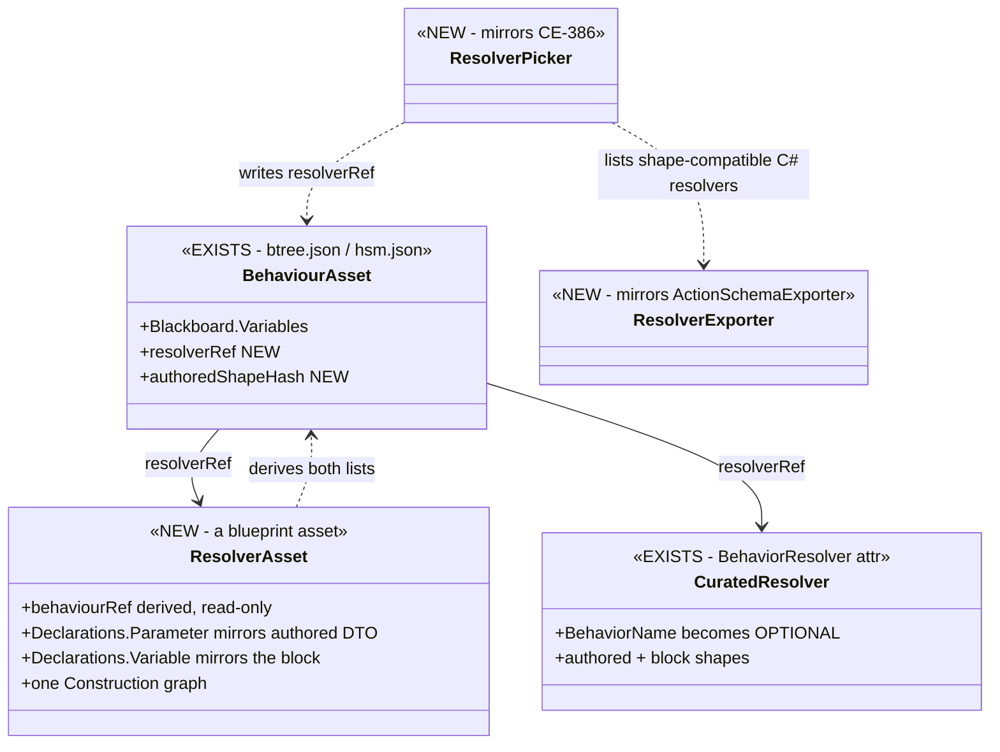

> ⭐ **Caption.** Drawing it exposes the **two-way reference** — `BehaviourAsset` names the resolver
> *(the user picks it)* and `ResolverAsset` names the behaviour *(so the generator can derive both
> declaration lists)*. ⛔ That is why the back-reference is **derived and read-only**: written at
> creation, repaired on rename, never hand-edited. Same shape the subtree authoring programme solved.

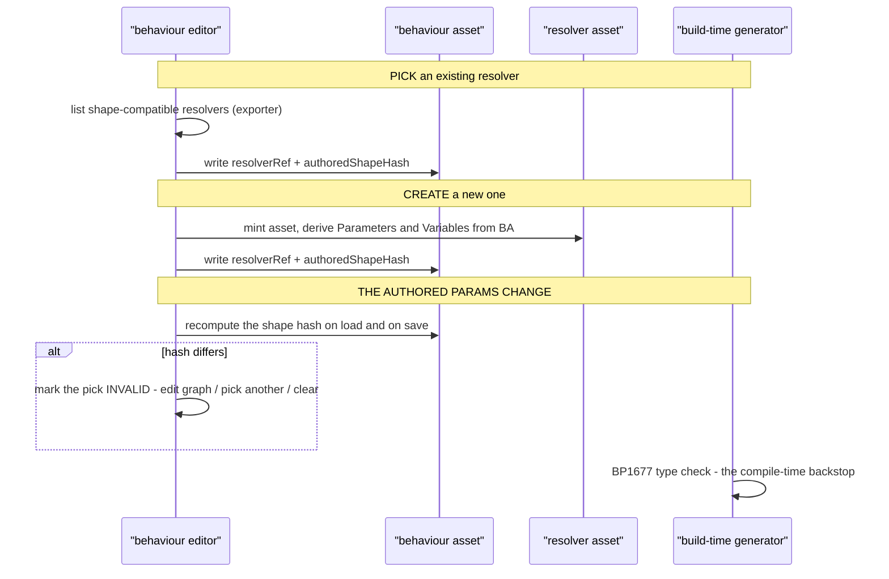

> ⚠ **Caption — what the picture shows that the table could not.** There are **two** invalidation
> points, and only one is the editor's. The editor's hash check is the *ergonomic* one, and it can
> miss; the generator's type check **cannot**, so a stale pick fails the build rather than shipping.
> ⇒ ⛔ do not build the hash check as if it were the safety mechanism — it is the **convenience**.

---

### 12.13 🔒 SEQUENCING CORRECTION — **the two bad scopes go EARLY, not last** *(user, `2026-09-29`)*

> 🔒 **User, verbatim:** *"I want to remove the entity scope and node scope on the blackboard
> variables because they have issues and there is no real need for them. I want to avoid the need to
> support these two as it might unnecessarily complicate the refactor."*

⛔⛔ **The point is SEQUENCING, and the plan had it wrong.** Decision `C` was resolved *"remove,
sequenced inside `B`"* and landed at slice **10** — the last. ⇒ every slice from `CE-425` to `CE-430`
would have had to keep **three** scope values alive while rewriting the storage under them.
⚠ **And it was not even a task:** `CE-422`/`CE-423` are FINDINGS marked *"dissolves if `B`"*, and the
slice-table entry was the bare letters `A` + `C` with **no id**. ⇒ 📋 **`CE-435`, now slice 2.**

📐 **The whole author-facing surface, measured over every `.btree.json` and `.hsm.json`:**

| | count | where |
|---|---|---|
| `Role=Input` | 36 | scope is meaningless for them |
| `Role=State` @ **`Behavior`** | **4** | `PlatoonHillAttack:State` · `T35:bpSharedWorkingState` · `HsmOrthogonalRegions:SharedCursor` · `HsmVariableShowcase:Cursor` |
| `Role=State` @ **`Entity`** | **4** | `PlatoonHillAttack2:state` · `HillAssault2I_Smoke:state` · `T37:rally` · `HsmVariableShowcase:Ticks` |
| `Role=State` @ **`Node`** | ⭐⭐⭐ **0** | not one authored use, explicit **or** implicit |

⇒ ⭐ **Eight variables decide a three-valued author-facing option**, and the value that is **the
default** has **zero** users. 🔒 That is `R-150` stated as arithmetic.

#### ⭐⭐ Why it CAN move early — the split that makes it cheap

| goes now *(`CE-435`)* | stays until `A`+`C` |
|---|---|
| the **author-facing option** — the dropdown, the schema's legal values, a loud validator | ⛔ **`OccurrenceSlotKey.Compute`'s arms.** 📌 `Node` is **not dead in the KEY function**: it keys node-bound working state for hosted AiPrimitives, the common case |
| re-homing the **4** `Entity` variables to `Behavior` | the key scheme's collapse, which needs the block to exist |

⇒ **one scope value survives** — `Behavior` — which `B` then dissolves into *"a named region of the
block"*. **The refactor carries one concept instead of three.**

⚠ **The one caution, named not discovered:** two of the four `Entity` variables are the cross-entity
`state` of `PlatoonHillAttack2` and `HillAssault2I_Smoke`; re-homing them **changes their semantics**
*(entity-global by name ⇒ per-behaviour)*. 📐 Safe for production — 1 cross-entity read exists in the
whole corpus, in a proof asset — ⛔ but **16 `HillAssault2*` proof files assert on it** *(`R-137`)*, so
`CE-435` must state, per proof file, whether it is re-pointed or retired with decision `A`.

---

### 12.14 ⛔⛔ §6 IS SUPERSEDED — **`PlatoonHillAttack2` GOES** *(user, `2026-09-29`)*

> ✅✅ **DONE `2026-09-29` — `CE-436` executed.** 28 files deleted, the 60 twins untouched
> *(`git ls-files | grep HillAssault2I_` ⇒ 0; `grep HillAssault2_` ⇒ 60)*. Generators **343/343**,
> Blueprints **4038/0/18**, Editor **425/1**. 🔴 **The one-letter trap fired in GREP** — `HillAssault2I`
> matches `HillAssault2IsSelfArrived` and two more SURVIVING twins ⇒ **only `HillAssault2I_` is safe**,
> and the deletion was driven off filenames, never a text sweep. ⚠ Four stale citations re-pointed, and
> **one was already wrong before the deletion** *(the `GetParameterNode` exclusion named an asset with
> zero `GetParameter` nodes)*.

> 🔒 **User, verbatim:** *"We can delete the blueprint based platoon hill attack 2 if it stands in
> the way. Not needed."*

⚠ **§6 says KEEP** — *"the only end-to-end evidence that the blueprint route can express a complex
behaviour"*. 📐 **Measured against the offer, and it does stand in the way.** 📋 **`CE-436`, slice 2.**

#### ⭐⭐⭐ TWO FAMILIES, AND ONLY ONE IS IN THE WAY

| family | files | uses shared `state`? | verdict |
|---|---|---|---|
| `HillAssault2I_*` — the **integrated** graphs | **23** | ✅ yes — this is where the 58 refs live | 🔴 **DELETE** |
| `PlatoonHillAttack2` — the tree that composes them | **5** | — | 🔴 **DELETE** |
| `HillAssault2_*` — **the twins** | **60** | ⛔ **no `GetShared` at all** | ⭐⭐ **KEEP** — the per-node proof coverage, and nothing about them obstructs anything |

⇒ **~28 files go, 60 stay.** ⚠ The two families differ by **one letter**; a sweep that matches
`HillAssault2` matches both. **That is the trap in this slice.**

#### 📐 What the removal buys

| | |
|---|---|
| **2 of the 4 `Entity` variables** | ⇒ **`CE-435`'s entire named caution evaporates.** The survivors — `T37:rally`, `HsmVariableShowcase:Ticks` — re-home to `Behavior` with no semantic question and no proof-file audit |
| **all 58 shared-`state` references** | the bulk of decision `A`'s surface |
| 🔴 **the only asset above 4 slots** | **9**, against a next-highest of **4** — the single largest consumer of the multi-slot model `B` dismantles |
| production impact | ✅ **none.** All three non-test source hits are COMMENTS: `BlueprintTierLadder.cs:62`, `Nodes.cs:837` *(a different type)*, `NodePinSchema.cs:138` |

#### ⚠⚠ THE ONE THING IT UNIQUELY COVERS — **and why NO replacement should be built**

📐 `BlueprintTierLadder.cs:62` names it as the tier-promotion case: *"PlatoonHillAttack2 holds 8 slots
(9 after `O4`'s root) at 320 B and is promoted to…"*. It is the **only** corpus asset whose declared
demand actually promotes the tier end to end. ⭐ The tier FUNCTION keeps unit coverage either way —
`OccurrenceStoreAccessTests:303` drives `SelectTierForPayload` with synthetic payloads.

⛔⛔ **Do not mint a synthetic 9-slot replacement.** 🔒 **Under `B` a behaviour has ONE block and each
child owns its own, so "9 stateful slots" stops being a shape the system can produce** ⇒ that
coverage is coverage of **a model being deleted**, and re-creating it would pin the thing we are
removing. ⭐⭐ **Instead `CE-425`/`CE-429` owe an end-to-end tier-promotion case in the NEW shape** — a
block large enough to promote. 🔒 That is `R-137` *(a unification may not cost a capability)*
**honoured by re-homing the coverage, not waived.**

---

### 12.15 ✅ `CE-435` AS BUILT — **and a measured correction to §12.13** *(`2026-09-29`)*

✅ **The authoring surface is one scope.** Both Scope dropdowns became a static label *(no choice at
all, which beats a one-item combo)*; `BehaviorTreeAsset`/`HsmAsset.UpdateVariableRole` now **force
`Scope = Behavior` whenever Role becomes `State`**; `HsmVariableShowcase:Ticks` re-homed; the enum
documents what is authorable. ⭐⭐ **`CE-423` is no longer reachable through the UI** — before this,
flipping a variable to `State` left it at the default `Node`, whose standalone slot both emitters
silently skip, so **two clicks produced a variable with no storage and no diagnostic.**

#### 🔴🔴 THE CORRECTION — **`Entity` scope and `GetShared` are ONE feature**

⚠ **§12.13 said "re-home the 4 `Entity` variables". That was too glib**, and the measurement that
shows why was never taken until the attempt failed:

| | |
|---|---|
| what was tried | `T37:rally` re-homed `Entity` → `Behavior` |
| what broke | the slot key moved from `FNV("rally")` to `FNV(assetId ++ "rally")`, and 🔴 **`BlueprintSharedState.TryGetShared` computes the ENTITY key at runtime** ⇒ `GetShared` could no longer find its own slot |
| who caught it | `T37_…_ProofTests.StandaloneRallyVariable_EmitsManifestEntry_MatchingBlueprintSharedStateExpectedHash`, which asserts `SlotKey == 970386679` |
| the resolution | ⭐ **`rally` STAYS at `Entity`**, with the reason written into the asset's own comment. It is now the **LAST** Entity-scoped variable in the repo |

⇒ 🔒 **`CE-422` and decision `A` are ONE removal, not two.** Any variable read through `GetShared` is
pinned to the Entity key by the accessor itself; the scope value cannot go until the accessor does.

⭐ **The slice's GOAL is unaffected:** nothing can AUTHOR `Node` or `Entity` any more, so **the
refactor carries one scope.** A legacy asset keeps its value in JSON until `A` retires the feature.

📐 **Corpus now:** `Behavior` **5** · `Entity` **1** *(blocked on `A`)* · `Node` **0**.
📐 **Gates:** generators **343/343** · BTree.Editor **636** · Hsm.Editor **619** · Persistence **147**
· AiShared **2095/1 skip**. ⭐ Golden diff **3 files / 3 lines** — `Ticks`'s scope plus two
persistence hashes, nothing else.

---

### 12.16 ✅ `CE-425` AS BUILT — **the block is EMITTED; the flip is NOT, and a slice was missing** *(`2026-09-29`)*

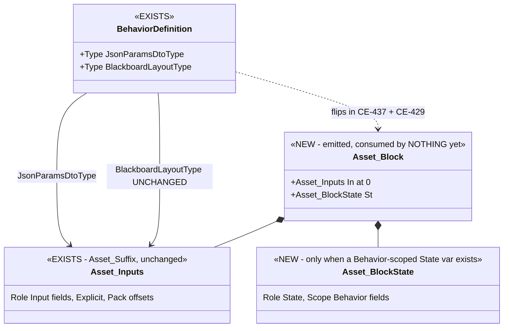

> ⭐ **Caption.** What the picture shows that §12.2's did not: the arrow to `Asset_Block` is **dashed**.
> §12.2 drew `BlackboardLayoutType → Asset_Blackboard` as if `CE-425` made it; ⛔ it cannot, safely, on
> its own — see below. ⭐ The `In` field **is the existing params type**, so the Input region is
> byte-identical **by construction**, not by a re-computed offset table.

| | |
|---|---|
| ✅ **built** | `BTreeEmitCore.EmitBlockStructs` appends `{Asset}_BlockState` + `{Asset}_Block` to every `*.Blackboard.g.cs`; `BTreeBlackboardPackHelper.PackBehaviorState` packs the State half by the SAME alignment rule *(one layout authority, `CE-418`)*. ⚠ An empty half is **omitted**, never emitted empty — an empty C# struct is one byte and would resize the block for nothing. ⛔ A State type no resolver can size skips the BLOCK only, never the Inputs struct |
| ⛔⛔ **NOT built, deliberately** | the flip of `BlackboardLayoutType`. 📐 The root slot is sized from the **manifest extent** *(`RootParamsAccess.RootParamsBytes`)*; `BrainDiagnosticsTranslator.cs:108` does `PtrToStructure(ptr, BlackboardLayoutType)` and StructEdit **writes** at the layout type's offsets ⇒ a layout type wider than the slot **reads and writes past the region**. ⇒ the flip rides with `CE-429` *(size from the block)* |
| 🔴 **the MISSING slice — filed `CE-437`** | §12.6 has slices that EMIT the State half, SIZE the slot and ROUTE the supply — ⛔ **none moves a GENERATED behaviour's State off its side slot or re-points its readers** *(`CE-430` covers only the hand-written hill attack)*. Surface: **2** BTree assets *(`T35:bpSharedWorkingState`, `PlatoonHillAttack:State`)* + **3** HSM variables after `Q75`-`S1` |
| 🔴 **measured gap — `PlatoonHillAttack` gets NO block** | its `HillAttackMutableState` has `fixed` buffers and `StructSizeResolver.GetTypeSize` returns `-1` for them. ⭐ The skip is written into the artefact *(`// CE-425: no block emitted — …`)*, never silent. ⚠ Fixing it needs (size, **alignment**) pairs — a `fixed byte[8]` is 8 bytes aligned 1, the `CE-418` trap again — and the resolver is shared with blueprint Params sizing. Owned by `CE-437` |
| ⏭ **not yet** | the HSM arm *(`Q75`-`S1`)* — the HSM generator still emits no struct at all |

⭐ **Revised order:** ~~`CE-425`~~ ✅ → **`CE-437` + `CE-429` together** → `CE-426` + `CE-432` together → `CE-427` → `CE-431` → `CE-428` → `CE-434` → `CE-433` → `CE-430` → `A` + `C`.

---

### 12.17 ✅ `CE-437` + `CE-429` AS BUILT — **the block is the root region; `Behavior` State lives in it** *(`2026-09-29`)*

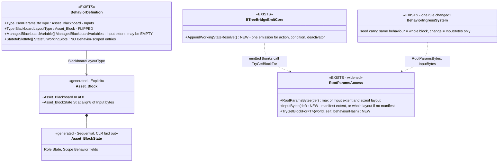

> ⭐ **Caption.** The arrow §12.16 drew dashed is now solid. ⭐ What the picture shows that prose
> would blur: **the State half is `Sequential`**, not `Explicit` like the Inputs. ⇒ `CE-418`'s rule
> ("the struct IS the manifest") applies only where a manifest exists — the State offsets are stated
> nowhere and read only by typed field access, so the CLR may lay them out. That is what dissolved the
> `fixed`-buffer blocker §12.16 recorded: `PlatoonHillAttack` now HAS a block.

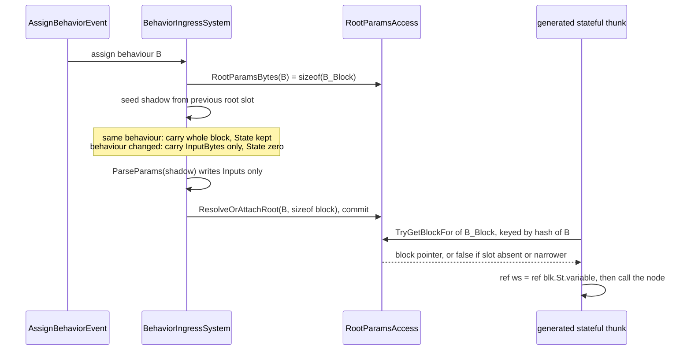

> ⛔⛔ **SUPERSEDED by §12.18a the same day** — the note box's carry rule is the gate `CE-421`'s ruling (`R-153`) rejects; every assign now starts from an empty block. Kept below as history.
>
> ⭐ **Caption.** The note box is the one semantic decision: the State half keeps **exactly** the
> lifetime its side slot had — kept on a same-behaviour re-assign (`ProvisionStatefulSlots` kept an
> identical slot), zeroed on a change (the slot was detached and re-attached). ⭐ The thunk keys on
> **its own** behaviour, never the active one: a hosted subtree runs under its HOST's hash, so the
> active-keyed lookup would hand it the host's block. Keyed on its own identity it finds nothing and
> fails loudly — `CE-431` gives it a block of its own.

| decision | why — and the alternative rejected in one line |
|---|---|
| ⭐ **`RootParamsBytes` = `max(Input extent, sizeof(layout))`** | a curated overlay can pair a JSON manifest with a wider hand-written layout (`HullDownAttackRun`). ⛔ *"prefer the layout"* — under-allocates if a manifest ever outgrows it |
| ⭐ **an EMPTY manifest is an authority** (`InputBytes` = 0) | a behaviour with no `Role=Input` variable declares `ManagedBlackboardVariables = []` ⇒ nothing carries into its State across a change. ⛔ *"no manifest ⇒ whole layout"* — would carry another behaviour's bytes into `St` |
| ⭐ **an input-less block gets a parse that supplies nothing** | ingress allocates the root region only for a behaviour with a `ParseParams`. ⛔ *"allocate whenever a layout type exists"* — widens to CURATED behaviours, which declare a layout without a parse |
| 🔴 **a curated resolver overlay no longer DEMOTES the block** — *found by the build, not the design* | `BehaviorRegistry.ApplyResolverOverlay` replaced `BlackboardLayoutType` with the resolver's params type. For `PlatoonHillAttack` that shrank the root slot to its 56-byte params and the State half had nowhere to live — ⭐ caught by the SimHost `HillAttackIntegrationTests`, whose thunks hit the new loud *"no block for behaviour"* guard. ⇒ the resolver's type describes what it WRITES (the Input region), so when it fits the Input region the block stays the layout; wider **and** the block has a State half ⇒ registration throws rather than let the parse overwrite State. ⛔ *"let the overlay win as before"* — silently loses the State half |
| ⭐ **`BehaviorHash.FromName` is called in the thunk** | ⛔ baking the hash as a constant would put a second copy of the FNV in the emitter — `R-132`, a silent-divergence risk for one hash per stateful tick |

⚠ **Behaviour changes a user can see:** the Active Parameters panel, the Replay Browser's slot
picker and `BrainDiagnosticsTranslator`'s dump all read `BlackboardLayoutType` generically, so they now
show the block **nested** — `In.X` and `St.Y` — and the state becomes visible in them. A Replay
Browser predicate saved against a root-param path `X` must now say `In.X`; **none is persisted in the
repo** (swept `2026-09-29`).

⏭ **Not in this slice:** the HSM arm (`Q75`-`S1`, the HSM generator still emits no struct) · baking a
`Role=State` default into the block (`CE-420`, closes in `CE-426`) · `T37:rally` stays `Entity` on its
side slot until decision `A`.

---

### 12.18 ✅ `CE-426` + `CE-432` AS BUILT — **one pipeline, and the resolver's subject is the whole block** *(`2026-09-29`)*

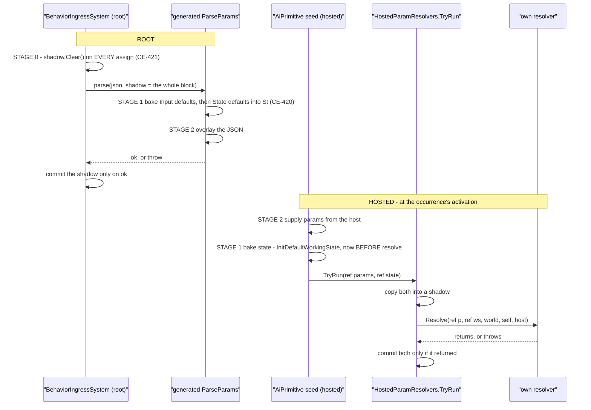

> ⭐ **Caption — what the picture shows that the prose would not.** There are **two shadows**, one per
> entry point, and **both now cover the whole block**. That is the precondition §12.12b named for
> relaxing the purity rule — so the relaxation and the shadow landed in ONE commit. ⭐ And the hosted
> lane's stage 1 moved: `InitDefaultWorkingState` used to run *after* the resolver, which was harmless
> while a resolver could only write parameters and would have wiped every state value a `CE-432`
> resolver wrote.

#### 12.18a 🔒 THE RE-ASSIGN RULE — **your `CE-421` ruling, and my `CE-437` got it wrong**

> 🔒 **User, `2026-09-28` (recorded in `CE-421`):** *"why would re-assigning the same behaviour deserve special handling, this happens rarely (certainly not every tick or two)."*

⇒ ⭐⭐ **every assign starts the whole block from empty** → bake → overlay → resolve. An unmentioned
variable lands on its **authored default** — predictable, inspectable, identical on first assign and
re-assign. ⛔⛔ **`CE-437` (same day, earlier) had kept the whole block on a same-behaviour re-assign**
— precisely the gate this ruling rejected. The ruling lived in a tracker row and was not read before
building. ⇒ recorded now as ledger row `R-153`, so it is found by `RULE ZERO`'s first read.
📐 **Measured before deleting the carry-over:** every production publisher of `AssignBehaviorEvent`
sends a COMPLETE parameter set — the mission adapter (via tactical-intent resolution) and the three
maneuver mappers; the adapter's own header says a restart must *"force the BTree parameters to cleanly
re-initialize"*. ⇒ nothing relied on a partial re-assign.

#### 12.18b ⚠ The purity rule — **§12.12b's prediction refined for the shape that ships**

| resolver shape | `SetVariable` target | before | now | why |
|---|---|---|---|---|
| ② an AiPrimitive's OWN resolver | a **Parameter** | ✅ | ✅ | `p` is `ref` and IS the block's input part — writing it is writing the block |
| ② an AiPrimitive's OWN resolver | a **state Variable** | ⛔ | ✅ | `ws` is now `ref` and inside `TryRun`'s shadow |
| ② any OTHER dispatch *(e.g. `Instance`)* | a state Variable | ⛔ | ⛔ | no shadowed resolve stands behind it |
| any | a name that is none of its declarations · shared memory · a component · a collection | ⛔ | ⛔ | outside the block — outlives a failed resolve |
| ③ a BEHAVIOUR's resolver asset *(`CE-428`, not built)* | a Parameter | — | ⛔ *(planned)* | there the parameters mirror a separate **`in`** authored DTO; §12.12b's inversion applies **there** |

⭐ **The rule, stated once:** *a `SetVariable` is legal iff it targets the resolver's `ref` subject.*
§12.12b's "Parameter ⇒ REFUSED" is the shape-③ instance of it, not a shape-② rule.

| decision | the alternative rejected, in one line |
|---|---|
| ⭐ **the shadow lives inside `TryRun`**, not in each caller | ⛔ a per-call-site shadow — `CE-427`'s root arm would have to re-implement it |
| ⭐ **one table, two shapes** (`ResolveOccurrence<P,S>` and hand-written `ResolveParams<P>`) | ⛔ a second registry — two resolver registries for one concept is exactly what `CE-427` collapses |
| ⭐ **the demo's resolver now writes `Ticks`** — the end-to-end proof is the shipped asset | ⛔ a builder-made fixture — its `SetVariable` is unwired and emits nothing |

⏭ **Not in this slice, named:** the ROOT behaviour's resolve stage through the same seam — today a
curated resolver still REPLACES the generated parse wholesale; routing it through `TryRun` after
bake+overlay is `CE-427`'s registry collapse. · a hosted subtree's supply (`CE-431`). · the HSM arm
(`Q75`-`S1`). · a `ListWrite` on a state list variable is still refused in a resolver — the same
argument would admit it; not measured, not needed by any asset.

### 12.19 ✅ `CE-427` AS BUILT — **a curated resolver replaces the SUPPLY, never the BAKE; the typed block seam exists** *(`2026-09-29`)*

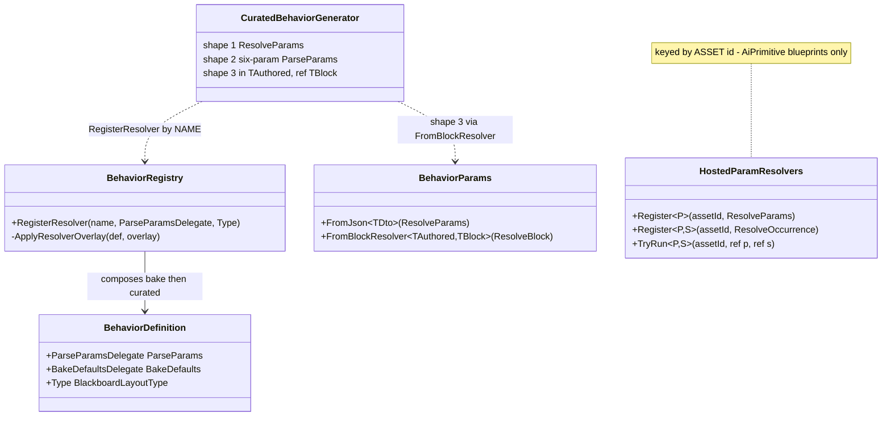

> ⭐ **Caption — what the picture shows that the prose would not.** There are still **two tables**,
> and they are keyed differently on purpose: the behaviour table by **name**, the hosted-blueprint
> table by **asset id**. The only new edge is `BehaviorRegistry → BehaviorDefinition.BakeDefaults`:
> the overlay no longer overwrites the parse, it **composes** the generated bake in front of the
> curated resolver.

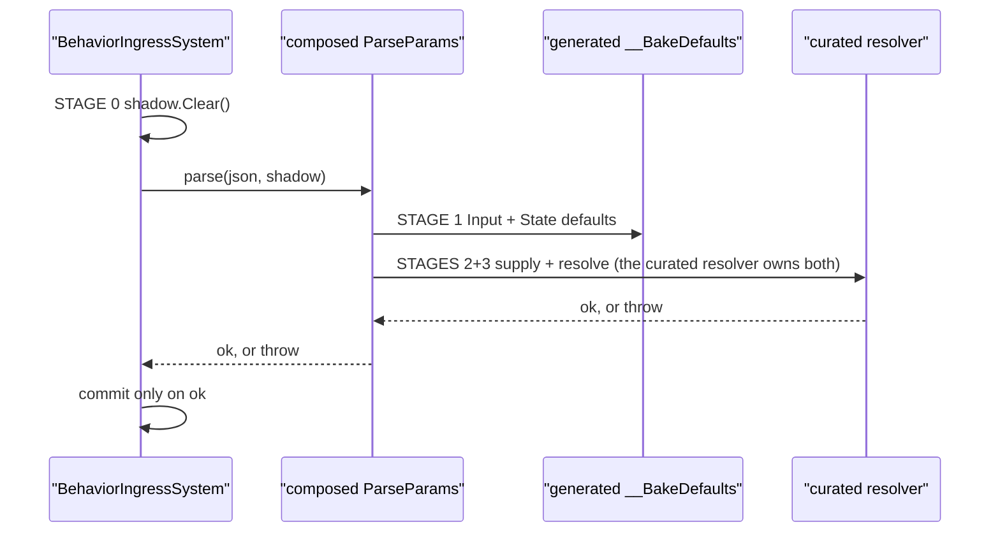

> ⭐ **Caption.** Before `CE-427` the curated resolver ran on an **unbaked** block: a generated
> asset's authored State defaults (`CE-420`) silently vanished the moment a curated resolver was
> bound to the same name. Now stage 1 survives the overlay, and the generated JSON overlay does
> **not** run — the curated resolver owns supply.

| decision | the alternative rejected, in one line |
|---|---|
| ⭐ **bake exported as its own delegate** (`BehaviorDefinition.BakeDefaults`, a static local function in the registrar) | ⛔ keep the generated parse and run the curated one after it — the generated overlay would then double-supply the same JSON |
| ⭐ **typed shape `ResolveBlock<TAuthored,TBlock>(in TAuthored, ref TBlock, …)` + `FromBlockResolver`** as the curated generator's third shape | ⛔ widen `ResolveParams<TDto>` in place — it would break the shipped `FromJson` resolvers for nothing |
| ⭐ **`TAuthored` unconstrained** | ⛔ `unmanaged` — the authored DTOs are classes (`[BehaviorContract]`) |
| ⭐ **the hosted `ResolveBlock<P,S>` renamed `ResolveOccurrence`** (Roslyn rename) | ⛔ two delegates named `ResolveBlock` with different arities and meanings |
| ⭐⭐ **the run-time lookup stays keyed by NAME for behaviours** | ⛔ unify on asset id (the row's wording) — 3 of 5 curated resolvers (`MoveToLocation`, `FireAtTarget`, `FollowRoute`) belong to hand-written behaviours that **have no asset id**, and `Behavior_Parameter_Resolver_Detailed_Design` §3.1/§3.3 keys by behaviour name |
| ⭐ **no shipped curated resolver migrated to the typed shape** | ⛔ migrating `MoveToLocation` would change its JSON options (`CgfNodes` vs `DefaultRelaxed`) — a behaviour change nobody asked for |

> 🔒 **User, `2026-09-29`, APPROVING the lean below:** *"approved, go ahead with CE-431. hand written behaviors have no assets, they are just code."* ⇒ ledger row `R-154`.

⚠ **Premise that failed, reported rather than silently worked around:** the row's *"the run-time lookup
unifies on asset id"* is not buildable for hand-written behaviours (no asset). The two tables do not
duplicate a concept: one keys **behaviours** by name (`R-132`), the other keys **hosted AiPrimitive
blueprints** by asset id. ⭐ A hosted **subtree**'s resolve (`CE-431`) will use the name table.

⏭ **Not in this slice, named:** `CE-428` (bind a blueprint `Construction` graph as a resolver — the
typed seam is now its target shape) · `CE-431` (hosted subtree supply) · the HSM arm (`Q75`-`S1`).

