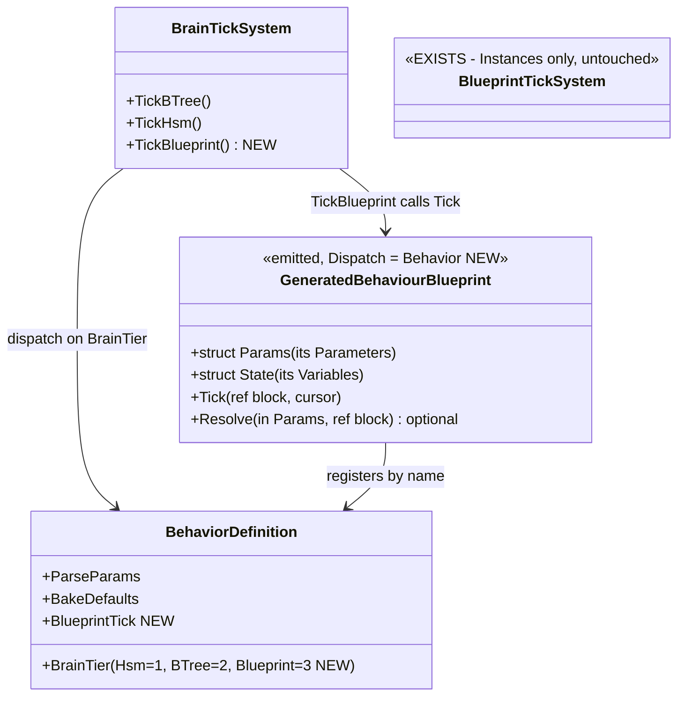
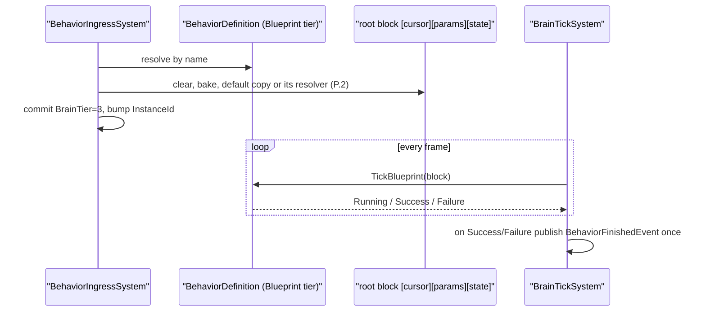
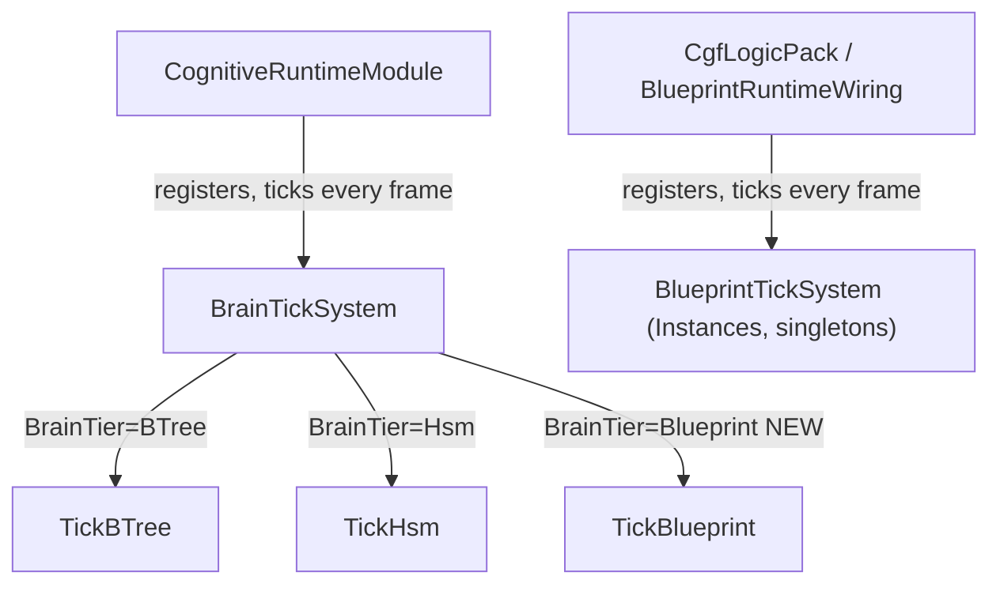
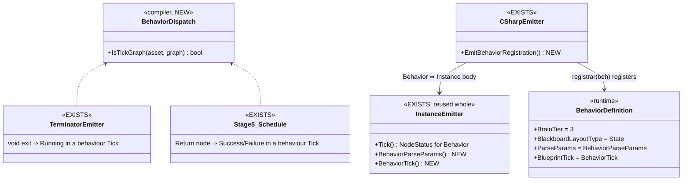
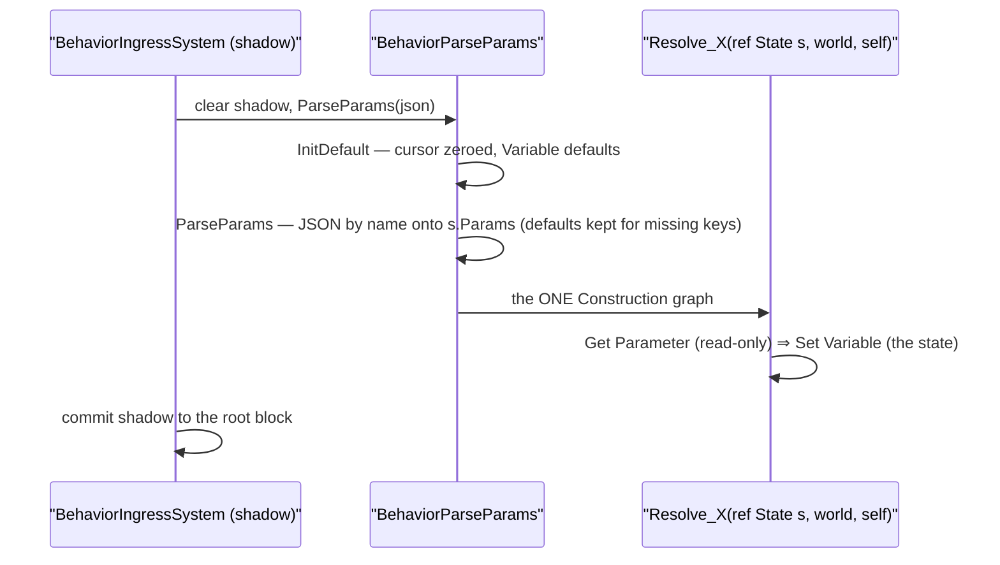
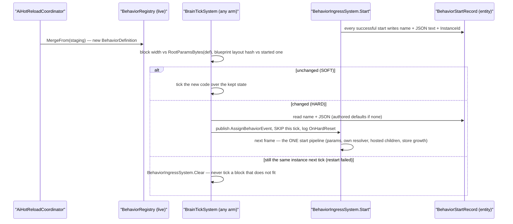

<!--STATUS
state: LIVE
updated: 2026-09-30 (§5 — runtime half built; lean A re-opened by measurement)
build-state: BUILDING (compiler + runtime built 2026-09-30, §5.9) — ✅ APPROVED by the user 2026-09-30, verbatim: "blueprint behavior also looks good!" — leans
  A–E adopted as written.
current-answer: §3 (the decisions, each with a lean) and §4 (the UML). §1 is the inventory, §2 the claim table.
stale-below: nothing.
known-rot: ⚠ §3 A ("reuses the Instance emitter's tick") and §3 C ("[Cursor][Params][State], the Instance payload
  shape") are OVERTAKEN by measurement — see §5. §5.2 (hosting) was approved and is then OVERTAKEN by §5.6 (approved 2026-09-30); §5.3's first row is SUPERSEDED — the block is freed AT FINISH.
known-conflict: none. This question does NOT reopen Q33's three rulings (§0 there) — it builds on them.
related-designs:
  - Architect_Question_33_Blueprint_Brain_Tier.md — owns the three settled rulings (blueprint IS a brain tier; latent ≠
    ended; tiers compose) and §1.5.1's "discriminant, not bitmask". This document is its build design.
  - DESIGN_Occurrence_Scoped_Storage.md — §12 lists O9's four gaps; §31.14.2 is why BlueprintTickSystem stays out of
    BrainTickSystem; §32.3 "BrainTickSystem hosts". This document closes §12's gaps ②③④.
  - DESIGN_Parameter_Model.md — §P.2 is the parameter contract a blueprint behaviour inherits unchanged; §P.7 is how a
    blueprint reads its authored input (Parameters + Get All Parameters).
  - Architect_Question_76_One_Blackboard_Block_Per_Primitive.md — owns the ONE block per running behaviour a blueprint
    behaviour gets (R-151).
-->

# Architect Question #77 — a behaviour implemented by a blueprint (`CE-446` = `O9`)

> 🔒 **User, `2026-09-30`:** *"I need also blueprint instance to be usable as a behavior, having its optional
> resolver"* → *"I meant i need the behavior to be implementable by blueprint, not sure id it requires blueprint
> instance."* · on the options: *"do not do A (while it would work, it is not archtecturally clean)"* — A was a BTree
> wrapper around a blueprint action. ⇒ **B: a blueprint is a behaviour in its own right — the third brain tier.**
>
> ⭐ Settled before this question (do not re-litigate): `Q33` §0 — *"blueprint should be brain tier exactly to inherit
> behavior lifecycle"* · *"latent ≠ ended … needs to exit itself or be cancelled from outside"* · tiers compose; `Q33`
> §1.5.1 — a third **discriminant** value, not a bitmask.

## 1. INVENTORY *(`search_graph` name-pattern over the brain/blueprint runtime + grep, `2026-09-30`)*

| thing | where | what it does today |
|---|---|---|
| `BehaviorConstants.BrainTierHsm = 1`, `BrainTierBTree = 2` | `BehaviorConstants.cs:78/81` | the whole tier set — **no blueprint value** |
| `BrainTickSystem` | `Behavior/Systems/BrainTickSystem.cs:169-172` | the ONE root ticker: `BrainTier == BTree ⇒ TickBTree`, `== Hsm ⇒ TickHsm`; publishes `BehaviorFinishedEvent` once per `InstanceId` (`:316-324`) |
| `BlueprintTickSystem` | `Blueprints/Systems/BlueprintTickSystem.cs` | ticks every **Instance** slot + world singletons; ⛔ stays separate (`DESIGN_Occurrence_Scoped_Storage` §31.14.2: other module, not entity-scoped, walks all slots, no authority gate) |
| `BehaviorIngressSystem` | `Behavior/Systems/BehaviorIngressSystem.cs` | resolves the intent by NAME in `BehaviorRegistry`, runs `ParseParams` into a shadow, commits `BrainTier`/`InstanceId`, attaches the root block |
| `BlueprintDispatchKind { Library, AiPrimitive, Instance }` | `Blueprints/BlueprintDispatchKind.cs:10` | Instance = attached, several per entity, has a latent cursor, no resolver |
| channel command stamp | `ChannelCommandLowering.cs:122` | writes `BehaviorState.InstanceId` into every channel command ⇒ **preemption already works** for any blueprint that runs as the entity's behaviour |
| generated registrars | BTree/HSM bridge emitters | register a `BehaviorDefinition` by NAME with `BrainTier`, `ParseParams`, `BakeDefaults`, `BlackboardLayoutType` |

## 2. CLAIM TABLE

| the design rests on | code — how it IS | design — how it was MEANT to be |
|---|---|---|
| a new tier needs only a new arm in the ONE root ticker | ✅ `BrainTickSystem.cs:169-172` (an equality dispatch) | ✅ `DESIGN_Occurrence_Scoped_Storage` §32.3 *"BrainTickSystem hosts"*, §31.14.2 |
| preemption of in-flight channel commands needs no new work | ✅ `ChannelCommandLowering.cs:122` stamps `BehaviorState.InstanceId` | ✅ `Q33` §1.4 (InstanceId is the behaviour lifecycle token) |
| resolving by name needs no second registry lookup if the blueprint registers itself as a behaviour | ✅ ingress uses `BehaviorRegistry.TryGetId(name)` only | ✅ `O9` gap ②, closed by self-registration (the BTree/HSM registrars already do this) |
| the Instance tick emitter already supports latent nodes with a cursor | ✅ `InstanceEmitter` Tick + `BlueprintTickSystem` re-entry | ✅ `Q33` §1.5.2 *"latent … ship and work"* |
| ⚠ the cursor for a ROOT blueprint must live beside the root block, not in an Instance slot | ⛔ not built | ⛔ searched `docs/`+`.dev/` for a root blueprint cursor home — none found; §3 C proposes one |

## 3. The sub-questions — **each with a lean** *(user decides)*

### A — What is a "blueprint behaviour" to the compiler?

- **Lean: a new dispatch kind `BlueprintDispatchKind.Behavior`.** It reuses the Instance emitter's tick/latent/cursor
  body, but its registrar registers a `BehaviorDefinition` (by NAME, `BrainTier = Blueprint`) instead of an Instance.
- ⭐ **Why not reuse `Instance`:** an Instance is attached, several per entity, lifecycle-free; a behaviour is assigned,
  exactly one, with start/finish/preempt. One enum value per meaning (`Q33` §1.5.1's rule applied to dispatch).
- ⛔ Rejected: *A* (a BTree wrapping a blueprint action) — user, *"not architecturally clean"*.

### B — Parameters and resolver

- **Lean: exactly §P.2 / §P.7, nothing new.** The blueprint's **Parameters** are its authored input (Get All
  Parameters reads them); its **Variables** are its state; **its own Construction graph is its ONE optional resolver**
  (receives the parsed authored DTO, writes the block — the resolver-asset contract of `CE-443`, but on the behaviour
  itself). No resolver ⇒ the default copy (intent JSON by name onto the Parameters).
- ⚠ **This re-opens one `CE-445` refusal on purpose:** `BP1676` refuses a Construction graph on a non-Library asset
  because *actions* have no resolver. A `Behavior`-dispatch asset **is** a behaviour ⇒ `BP1676` allows exactly one there.

### C — Where does a root blueprint keep its latent cursor and state?

- **Lean: in its root block** — `[Cursor][Params][State]`, the Instance payload shape, allocated by ingress as the
  root params slot (the same slot a BTree/HSM root gets, sized by `BlackboardLayoutType`). ⭐ One block per running
  behaviour (`R-151`); the cursor is lifecycle state and is reset with the rest of the block on every assign (`R-153`).
- ⛔ Rejected: an Instance slot in the occurrence store — that is the attached-instance path and would make "assigned
  root" and "attached Instance" indistinguishable (`O9` gap ③).

### D — How does it end?

- **Lean: the tick graph's `Return` status.** `Running` (including suspended on a latent node) keeps it alive;
  `Success`/`Failure` is the exit ⇒ `BrainTickSystem` publishes `BehaviorFinishedEvent` once per `InstanceId`, exactly as
  for BTree. Cancellation = a new assign / clear (ingress bumps `InstanceId`). ⭐ This is `Q33` ruling 2 literally.

### E — Slice order *(after approval)*

| slice | delivers |
|---|---|
| E1 | `BrainTierBlueprint = 3`; `BlueprintDispatchKind.Behavior`; the compiler accepts it (validation, `BP1676` exemption) |
| E2 | the emitter: Instance tick body over the root block + a registrar that registers a `BehaviorDefinition` (ParseParams = bake + default copy or its resolver) |
| E3 | `BrainTickSystem.TickBlueprint` + finish/preempt; a demo asset + the proof rail (assign → runs → latent wait → finishes → `BehaviorFinishedEvent`) |
| E4 | editor: create/assign a blueprint behaviour (dispatch picker + the behaviour picker lists it) |

## 4. UML

> ⭐ **Caption.** No new registry and no new ticker: the blueprint registers into the SAME behaviour table and is
> ticked by the SAME root system as BTree/HSM; only the tick body differs. `BlueprintTickSystem` is untouched.

> ⭐ **Caption (module view).** The new arm lands in the system `CognitiveRuntimeModule` already ticks every frame on
> every host that runs behaviours — so there is no host where a blueprint behaviour is registered but never ticked.
> `BlueprintTickSystem` keeps its own module and is not on this path.

## 5. Measured during the build *(`2026-09-30`)*

### 5.1 ✅ Runtime half — BUILT (common to either compiler shape)

| piece | where |
|---|---|
| `BrainTierBlueprint = 3` | `BehaviorConstants.cs` |
| `BlueprintBehaviorTickDelegate(ref byte block, world, self, time, dt) → NodeStatus` + `BehaviorDefinition.BlueprintTick` | `BlueprintBehaviorTickDelegate.cs`, `BehaviorRegistry.cs` |
| `BrainTickSystem.TickBlueprint` — block = root params slot; `Success`/`Failure` ⇒ `BehaviorFinishedEvent` once per `InstanceId`; ⛔ a finished instance is **not ticked again** (a blueprint tick has no restart semantics, unlike a BTree root) | `BrainTickSystem.cs` ARM 3 |
| root block declared `OccurrenceKind.BlueprintBehavior = 4` — ⛔ not `Blueprint`, which `BlueprintTickSystem` walks as an Instance and ingress sweeps as hosted (`O9` gap ③ closed by construction) | `OccurrenceKind.cs`, ingress `KindOf` / `EnsureOccurrenceStore` |
| rails | `BrainTickSystemBlueprintArmTests` (runs over the block, finishes once, not re-ticked; re-assign runs again from an empty block; slot kind) |

### 5.2 ✅ APPROVED `2026-09-30` — the COMPILER shape: `AiPrimitiveHosting.Behavior` (§3 A overtaken)

> 🔒 **User, `2026-09-30`:** *"I would approve your lean again … but i expect you back your judgement by measurements
> and you do not offer something which is not implementable."* ⇒ §5.4 lists what was measured implementable and what is NOT.

| the lean rested on | code — how it IS | design basis |
|---|---|---|
| the Instance tick can end a behaviour | ⛔ **no** — an Instance `Tick` returns `void` (golden `Count5.cs.txt`); it has no way to say *finished* | `Q33` ruling 2 needs a status |
| a status-returning, latent-capable, `(Params, WorkingState)` body already exists | ✅ **AiPrimitive `TickCore(ref Params p, ref WorkingState ws, self, world, time) → NodeStatus`**, latent phase in `ws.__phase`, `Running` while suspended (`WaitLowering_AiPrimitive.cs`, golden `HillAssault2_ReverseToBaseline.cs.txt`) | ✅ exactly `§P.2`'s `[In][St]` block |
| a new DISPATCH KIND is cheap | ⛔ **~30 compiler sites** branch on `Dispatch == AiPrimitive` to pick that body (`EmissionContext` ×6, `Stage5_Schedule` ×5, `FieldLayout` ×2, `Stage6_Lower`, `CSharpEmitter` ×5, `Stage2_Validate` ×8 …) — each would need `|| Behavior`, plus the mirrored runtime enum and ~25 editor sites | — |
| **where** a primitive runs is already a first-class axis | ✅ `AiPrimitiveHosting { BTreeAction, BTreeCondition, HsmAction, HsmGuard, BlueprintCall }` — the emitter picks the thunks by hosting | `Q74`/`CE-383` |

⭐ **Lean (awaiting the user): `AiPrimitiveHosting.Behavior`** — an AiPrimitive hosted as the entity's ROOT behaviour. Its
emitter adds a registrar that registers a `BehaviorDefinition { BrainTier = Blueprint, BlackboardLayoutType = Block, BlueprintTick }`
over `Block { In = Params; St = WorkingState }` and calls the existing `TickCore`. Rules: `Behavior` must be the asset's
ONLY hosting (a behaviour's params come from its intent, an action's from its host — one asset cannot have both
contracts, `R-155`); `BP1676` allows exactly one Construction graph there (its resolver, §3 B).
⛔ **Rejected:** a new `BlueprintDispatchKind.Behavior` — the same emitted body behind a second discriminant, paid for
at ~30 compiler sites + the runtime mirror enum + editor switches, with no behavioural difference. ⚠ This reverses §3 A
as approved.

### 5.3 Lifecycle — **who frees the block** *(measured)*

| claim | code | design |
|---|---|---|
| ⛔ SUPERSEDED same day — ~~finishing does NOT free the block~~ ⇒ ✅ **freed AT FINISH** (user: *"isn't it well defined when a behavior finished so when to free its resources?"*); the following clear is a no-op. Blueprint tier only: a BTree root is re-run after Success (`Interpreter.cs:359-366`); HSM clears Terminated and returns to Idle — not measured to closure | ✅ `TickBlueprint` → `RootParamsAccess.DetachRoot`; rail `CE446_AFinishedBlueprintBehaviour_FreesItsBlockAtFinish_AndTheClearAfterIsANoOp` (red-proof run) | ✅ `docs/designs/brain-death/BD1-DESIGN.md` §1 — `BehaviorFinishedEvent` is a bottom-up NOTIFICATION; the mission tier decides |
| the decider's `ClearBehaviorEvent` / next assign frees it | ✅ ingress detaches the previous root slots by behaviour key (`RootParamsAccess.DetachRoot`, kind-agnostic) — rail `CE446_AFinishedBlueprintBehaviour_IsFreedByTheClearThatFollowsIt` | ✅ same § — `MissionDirectorSystem` answers a finish with `CurrentPhase++` ⇒ next assign or clear |
| there is no blueprint INSTANCE to remove | ✅ the behaviour is not an Instance slot and spawns nothing (§3 C, kind `BlueprintBehavior`) | ✅ `O9` gap ③ |
| ⚠ with no mission, a finished behaviour holds its block (not ticked) until reassign / clear / entity destruction | ✅ only mission systems and one hand-written node publish `ClearBehaviorEvent` | — identical for BTree and HSM today |

### 5.4 Implementability of §5.2 *(measured before building)*

| needed | status |
|---|---|
| a generated blueprint registrar can register a `BehaviorDefinition` | ✅ `BlueprintRegistrarScanner` injects `BehaviorRegistry` by parameter type (startup AND hot reload); id = `BehaviorHash.FromName` like BTree/HSM |
| the tick body with a status and latent waits | ✅ `TickCore → NodeStatus`; delay / wait-for-channel / wait-for-event supported for AiPrimitive (`Stage5_Schedule.cs:454-469`) |
| its own resolver | ✅ emit the Construction graph as `Resolve(in Params p, ref WorkingState ws, world, self)` — the AiPrimitive `p`/`ws` names already in `EmissionContext`; BP1676/BP1675 exempt Variables writes for `Behavior` hosting only |
| ⛔ **NOT available in v1** | `When` nodes (BP2001), EQS sensor nodes (BP2020/BP2030), Event graphs (BP1025) are Instance-only today ⇒ a blueprint behaviour has the node vocabulary blueprint actions have. Widening is a follow-up, not part of E1–E3 |

### 5.5 E4 re-framed — **product first, technology second** *(user, `2026-09-30`)*

> 🔒 *"User adds certain product features/building blocks like behaviors, conditions, actions and the technology is a
> secondary choice … when picking conditions i need to see all available ones no matter what technology."*

⭐ Already the ruled intent: `docs/UX/UX_Requirements.md` **UXR-40** (one New Behavior entry) / **UXR-41** (assignable
without restart), `docs/UX/UX_Design.md` **UXD-03** (one assignment path over N implementations, OPEN), `Q25-C`
(`BehaviorRegistry` the single source). Measured today: creation is technology-first (`NewAssetLauncher`, kinds
Blueprint/BTree/Hsm; AiPrimitive NOT offered, `BlueprintNewAssetService.cs:28`); action/condition pickers ALREADY merge
technologies (`ActionSchemaExporter`); the behaviour assignment list is curated + BTree ONLY
(`ScenarioMissionService.cs:103`). ⇒ E4 = New Behaviour/Action/Condition entries with a technology choice + list every
`BrainTier` in the assignment picker, with the technology as a label.

### 5.6 ✅ APPROVED `2026-09-30` (*"instance based blueprints - ok as described"*) — §5.2 is overtaken: build on the INSTANCE body + a status *(measured `2026-09-30`)*

> 🔒 User: *"what makes behavior blueprint different from instance ones? … Why not the instance node set?"*

| claim | code |
|---|---|
| `When` / EQS / Event graphs are Instance-only by ACCIDENT, not semantics | ✅ `When` = synthesized prev-value fields (`WhenLowering_Instance.cs`); Event graphs = static `BlueprintEventDispatch.DispatchForSlot`; EQS spawn needs `ecb`, obtainable as `view.GetCommandBuffer()` (`BlueprintTickSystem.cs:57`) |
| ⛔ §5.2's "~30 sites" was the cost of the WRONG body | ✅ those are `AiPrimitive ? … : …` binaries — a new kind falls on the Instance side; only **11** compiler sites test `Instance` explicitly (Stage2 ×5, CSharpEmitter ×3, Stage6, parser, registrar) |
| blackboard access exists on either body | ✅ Parameters = `In`, Variables = `St`, via Get/Set Variable |

⭐ **Lean:** `BlueprintDispatchKind.Behavior` (§3 A's kind) on the **Instance** emitter + a status: `Return` ⇒ `Success`/`Failure`, suspended ⇒ `Running`; registrar registers the tier-3 `BehaviorDefinition`; `TickBlueprint` runs `BlueprintEventDispatch` then the tick with an `ecb`. ⛔ Rejected: `AiPrimitiveHosting.Behavior` (§5.2) — no `When`/EQS/Event graphs, and widening it re-plumbs what Instance has. ⚠ Editor switch sites not yet measured.

### 5.7 Finish is terminal for EVERY tier — `CE-449` ✅ BUILT `2026-09-30` (finish = the clear, channels reset; `BD1-DESIGN` §1.0b)

| tier | after it finishes, today | intent (`BD1-DESIGN` §1.0a) |
|---|---|---|
| Blueprint | ✅ not ticked again; block freed (`CE-446`) | concluded |
| BTree | ⛔ re-runs every frame (`Interpreter.cs:359-366` resets, no guard in `TickBTree`) | concluded |
| HSM | ⛔ `TickHsm` clears `Terminated` (`BrainTickSystem.cs:515-526`) ⇒ the kernel runs it again | concluded |

### 5.8 The Instance node set on a blueprint behaviour *(measured, for §5.6)*

| Instance feature | runtime need | on the behaviour tier |
|---|---|---|
| `When` | synthesized prev-value fields in `State` | ✅ same lowering |
| Event graphs | `BlueprintEventDispatch.DispatchForSlot` (static) | ✅ `TickBlueprint` calls it before the tick |
| EQS spawn | an `ecb` | ✅ `view.GetCommandBuffer()` |
| peer calls | a static call into the peer's generated class (`StatementEmitter.cs:331-350`) | ✅ nothing to wire |
| latent cursor | `instanceVersion` for reload | ✅ pass `BehaviorState.InstanceId` (bumps on every assign) |
| Get/Set Variable, Get All Parameters/Variables | `s.X` / `s.Params.X` on `[Cursor][Params][State]` | ✅ that IS the root block |
| ⚠ hot reload of a RUNNING blueprint behaviour whose layout changed | `BlueprintTickSystem` re-inits on a hash mismatch; nothing does this for the behaviour tier yet | ⚠ build item, not a blocker |

### 5.9 ✅ AS-BUILT `2026-09-30` — the compiler half (§5.6)

> ⭐ **Caption — what the picture shows that prose hid:** there is NO behaviour emitter. `Behavior` rides the Instance
> lowering and `InstanceEmitter` unchanged; the whole difference is ONE predicate (`BehaviorDispatch.IsTickGraph`) read by
> the two places that decide an exit — Stage 5 (a `Return` node) and `TerminatorEmitter` (every void exit ⇒ `Running`) —
> plus two entry points and a registration. ⇒ every Instance node (`When`, EQS, Event graphs, peer calls) is available.

| piece | where |
|---|---|
| `BlueprintDispatchKind.Behavior` (compiler + runtime mirror) · parser `"behavior"` | `BlueprintAsset.cs`, `BlueprintDispatchKind.cs`, `BlueprintSignatureParser.cs` |
| Stage 2: the Instance arms + `When`/EQS allowed; a Construction graph refused with *"own resolver not built yet"* | `Stage2_Validate.cs`, `V_ResolverPurity.cs` |
| Stage 5: `Return` ⇒ `IrTerm_ReturnStatus` in the Tick · Stage 6: Instance lowering | `Stage5_Schedule.cs`, `Stage6_Lower.cs` |
| `BehaviorParseParams` = `InitDefault` (whole `[Cursor][Params][State]`) + Instance `ParseParams` at `ParamsOffset` · `BehaviorTick` = event dispatch then `Tick` | `InstanceEmitter.cs` |
| registrar takes `BehaviorRegistry beh`, registers by name on `BrainTierBlueprint`; ⛔ never staged as an Instance | `CSharpEmitter.EmitBehaviorRegistration` |
| runtime: the tick delegate gains `ecb` + `instanceId`; `BrainTickSystem` passes `view.GetCommandBuffer()`; `BlueprintEventDispatch.Dispatch(handlers, …)` | `BlueprintBehaviorTickDelegate.cs`, `BrainTickSystem.cs`, `BlueprintEventDispatch.cs` |
| rails | `BlueprintBehaviourTests` — status Tick + registration; fall-off ⇒ Running; compile → load → assign → wait (latent) → Success → finished once → cleared |

⭐ **Shipped demo:** `BlueprintBehaviourDemo.bp.json` — compiled by the production generator; the production registrar scan registers it on `BrainTierBlueprint` (rail `CE446_TheShippedDemo_…`).

⚠ **Still open inside `CE-446`:** ~~hot reload of a running blueprint
behaviour whose layout changed~~ (built, §5.12 — restarts with its parameters) · E4 editor (§5.5).

### 5.10 ✅ The Instance node set, PROVEN in a blueprint behaviour *(`2026-09-30`)*

| node | rail (each in the feature's own suite) |
|---|---|
| `When` | `WhenNodeValidatorTests.CE446_Validate_BehaviorDispatch_AllowsWhen` · `WhenNodeRuntimeTests.CE446_EventFired_Fires_InABlueprintBehaviour` (compiled, assigned, ticked by `BrainTickSystem`, fires on the event) |
| EQS spawn | `SpawnEqsSensorValidatorTests.CE446_Validate_BehaviorDispatch_AllowsSpawn` · `SpawnEqsSensorLoweringTests.CE446_Lower_InABehaviour_SpawnsThroughTheCommandBuffer` |
| Event graph | `BlueprintBehaviourTests.CE446_AnEventGraph_ReceivesItsEvent_InABlueprintBehaviour` (runtime: the handler writes the block) |

⚠ **Semantic difference, by design (§3 D):** an Instance `Return` ends THIS frame; a behaviour `Return` FINISHES it. An
Instance graph copied into a behaviour changes meaning wherever it returns per frame.

⛔⛔ **Found and fixed (pre-existing, all Instances):** a `When` with an UNCONNECTED exit compiled to a bare label before the
method's closing brace (CS1525). Stage 5 now seals it like a Branch arm (`SealFallThrough`); rail
`WhenNodeRuntimeTests.AWhenWithUnconnectedExits_CompilesAndTicks_ForAnInstance`.

### 5.11 ✅ BUILT `2026-09-30` — the behaviour's OWN resolver (§3 B)

> ⭐ **Caption:** the resolver runs LAST and INSIDE the shadow, so a throw leaves the entity on its old behaviour. ⭐
> **Decision (logged):** a blueprint behaviour's Parameters are ONE struct — the authored input AND the block's `Params` —
> so the parse always fills them and there is no "default copy" to skip (unlike `§P.2`, where the authored DTO and `In` are
> different types). The resolver derives STATE from them. ⛔ Writing a Parameter is `BP1675`; two resolvers `BP1676`; a
> declared input/output `BP1677`.

Rails (`BlueprintBehaviourTests`): `CE446_TheOwnResolver_RunsAtAssign_FromTheParsedParameters` (✅ red-proof: drop the call ⇒
fails) · `…_SeesTheParameterDefault_WhenTheJsonOmitsIt` · `CE446_AResolverWritingAParameter_IsBP1675` · `CE446_TwoResolvers_AreBP1676` ·
`CE446_AResolverDeclaringAnInput_IsBP1677`.

### 5.12 ✅ BUILT `2026-09-30` — hot reload of a RUNNING behaviour restarts it, WITH ITS PARAMETERS (`CE-452`)

> ⭐ **Caption:** the restart is not a reset done in the tick — it is an ordinary assign, so everything a start does (the
> shadow, the store growth that is structural and ingress-only, the hosted-slot detach so sub-behaviours re-seed) happens
> through ONE path. 🔒 User `2026-09-30`: *"i hope you are reusing whatever init/setup code there is"*.

| design basis | how this applies it |
|---|---|
| `btree-ai-action-binding/SLICE2-DESIGN.md` Flaw 2 — *"re-publish `AssignBehaviorEvent` for every entity running that behavior"* | exactly that, per entity, from the tick (no reload path knows the entities — `DESIGN_Cgf_Editor_Sharing_Slice3` §10.3) |
| `AI_Editor_Shared_Infrastructure.md` §17 — Soft keeps state, Hard restarts | layout hash (blueprint tier) or block width (every tier) decides |
| `R-153` — a start begins from an empty block | the restart is a start: `InstanceId` bumps, so each channel resets once |

⭐ **What is kept:** the parameter TEXT (`BehaviorStartRecord`, transient, `ComponentId` 154) — layout-independent and
owned by no assembly (a DTO would be a type from the old, collectible ALC). ⭐ **Sub-behaviours need nothing:** a hosted
child seeds from its parent's block (`HostedSubtree`), which the restart rebuilds. ⚠ **Not detected:** a BTree/HSM root
whose layout changed at the SAME width (they carry no layout hash yet).

Rails (`BrainTickSystemBlueprintArmTests`, each red-proofed): `CE452_AReloadThatKeepsTheLayout_KeepsTheRunningState` ·
`…ChangesTheLayout_RestartsTheInstance_WithTheAssignedParameters` · `…GrowsTheBlock_BeforeItsFirstTick_RestartsItAtTheNewWidth` ·
`CE452_ARestartWhoseStartFails_ClearsTheBehaviour_InsteadOfTickingIt` · `CE452_TheStartRecord_IsWrittenAtStart_AndDroppedAtClear`;
`CE-451` (the hash path through the same `Start`): `CE451_AnAssignByHash_ProvisionsTheParamsBlock_AndTicks` ·
`CE451_AnAssignByHash_ThatDuplicatesANamedAssignInTheSamePass_IsDropped`.

⛔ HISTORY — the first build of §5.12 (same day), SUPERSEDED by the above

The first build reset the block IN the tick (`ResolveOrAttachRoot` + `ParseParams("{}")`) — a third copy of the start
sequence, without the shadow, the hosted detach or store growth, and on AUTHORED DEFAULTS because the JSON was not kept.
Filed as `CE-452` and replaced.

### 5.13 E4 — first slice BUILT `2026-09-30`; the rest is editor UI (§5.5)

| §5.5 item | state |
|---|---|
| the assignment picker lists every `BrainTier` | ✅ `ScenarioMissionService.AppendEditorBTreeBehaviors` now admits BTree, HSM and Blueprint (rail `EditorMissionServiceTests.CE446_GetAvailableBehaviors_ListsEveryTechnology`, red-proofed by restoring the BTree-only predicate). ⚠ The method keeps its old name — renaming is a Roslyn job, left for the slice that touches it next |
| the technology shown as a label | ⛔ not built — `IMissionEditorService.GetAvailableBehaviors` returns bare names (four implementations incl. `Hrot.ExCon`), so a label is an interface change |
| New Behaviour / Action / Condition with a technology choice (additive to New Asset) | ⛔ not built — editor menus, the UI lane's surface |
