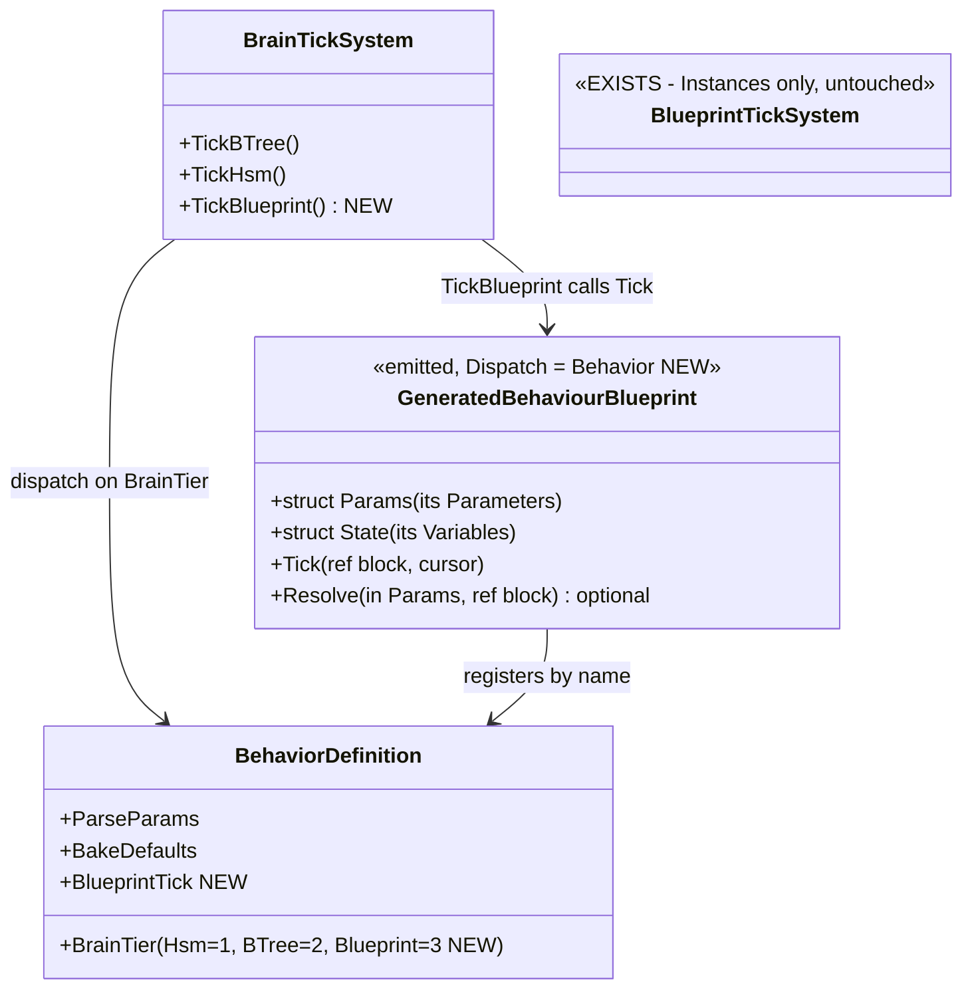
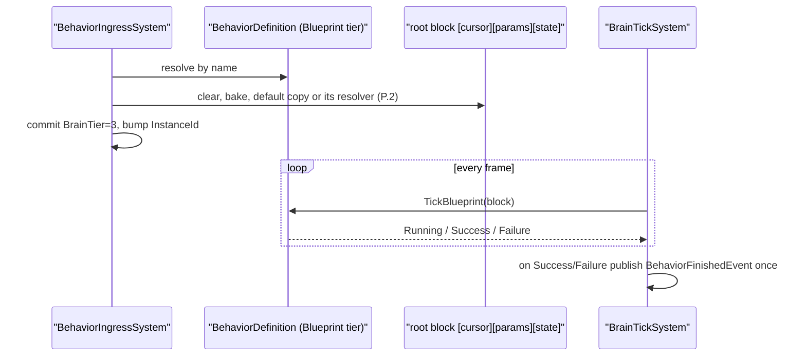
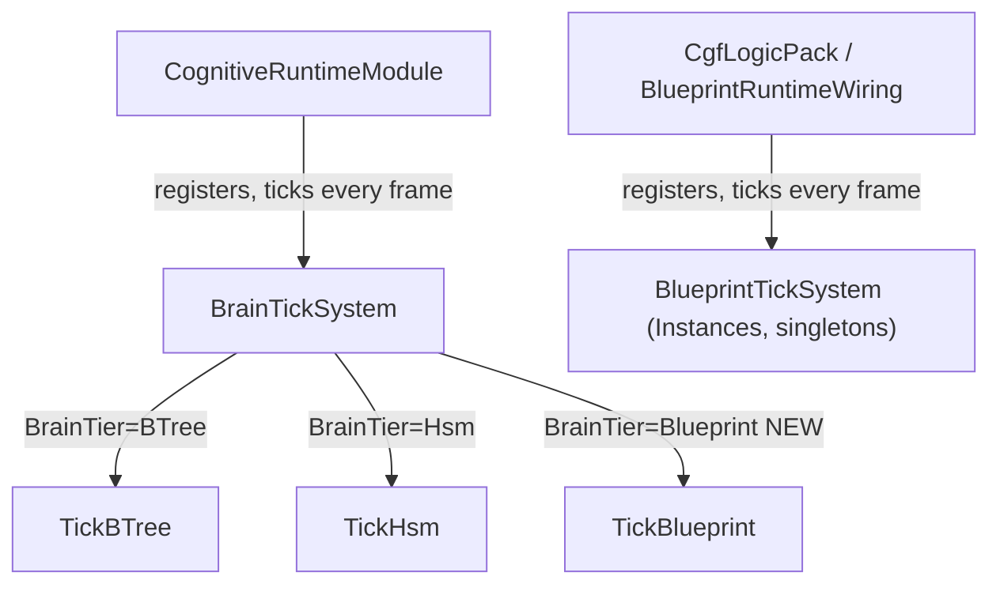

<!--STATUS
state: LIVE
updated: 2026-09-30
build-state: READY-TO-BUILD — ✅ APPROVED by the user 2026-09-30, verbatim: "blueprint behavior also looks good!" — leans
  A–E adopted as written.
current-answer: §3 (the decisions, each with a lean) and §4 (the UML). §1 is the inventory, §2 the claim table.
stale-below: nothing.
known-rot: none.
known-conflict: none. This question does NOT reopen Q33's three rulings (§0 there) — it builds on them.
related-designs:
  - Architect_Question_33_Blueprint_Brain_Tier.md — owns the three settled rulings (blueprint IS a brain tier; latent ≠
    ended; tiers compose) and §1.5.1's "discriminant, not bitmask". This document is its build design.
  - DESIGN_Occurrence_Scoped_Storage.md — §12 lists O9's four gaps; §31.14.2 is why BlueprintTickSystem stays out of
    BrainTickSystem; §32.3 "BrainTickSystem hosts". This document closes §12's gaps ②③④.
  - DESIGN_Parameter_Model.md — §P.2 is the parameter contract a blueprint behaviour inherits unchanged; §P.7 is how a
    blueprint reads its authored input (Parameters + Get All Parameters).
  - Architect_Question_76_One_Blackboard_Block_Per_Primitive.md — owns the ONE block per running behaviour a blueprint
    behaviour gets (R-151).
-->

# Architect Question #77 — a behaviour implemented by a blueprint (`CE-446` = `O9`)

> 🔒 **User, `2026-09-30`:** *"I need also blueprint instance to be usable as a behavior, having its optional
> resolver"* → *"I meant i need the behavior to be implementable by blueprint, not sure id it requires blueprint
> instance."* · on the options: *"do not do A (while it would work, it is not archtecturally clean)"* — A was a BTree
> wrapper around a blueprint action. ⇒ **B: a blueprint is a behaviour in its own right — the third brain tier.**
>
> ⭐ Settled before this question (do not re-litigate): `Q33` §0 — *"blueprint should be brain tier exactly to inherit
> behavior lifecycle"* · *"latent ≠ ended … needs to exit itself or be cancelled from outside"* · tiers compose; `Q33`
> §1.5.1 — a third **discriminant** value, not a bitmask.

## 1. INVENTORY *(`search_graph` name-pattern over the brain/blueprint runtime + grep, `2026-09-30`)*

| thing | where | what it does today |
|---|---|---|
| `BehaviorConstants.BrainTierHsm = 1`, `BrainTierBTree = 2` | `BehaviorConstants.cs:78/81` | the whole tier set — **no blueprint value** |
| `BrainTickSystem` | `Behavior/Systems/BrainTickSystem.cs:169-172` | the ONE root ticker: `BrainTier == BTree ⇒ TickBTree`, `== Hsm ⇒ TickHsm`; publishes `BehaviorFinishedEvent` once per `InstanceId` (`:316-324`) |
| `BlueprintTickSystem` | `Blueprints/Systems/BlueprintTickSystem.cs` | ticks every **Instance** slot + world singletons; ⛔ stays separate (`DESIGN_Occurrence_Scoped_Storage` §31.14.2: other module, not entity-scoped, walks all slots, no authority gate) |
| `BehaviorIngressSystem` | `Behavior/Systems/BehaviorIngressSystem.cs` | resolves the intent by NAME in `BehaviorRegistry`, runs `ParseParams` into a shadow, commits `BrainTier`/`InstanceId`, attaches the root block |
| `BlueprintDispatchKind { Library, AiPrimitive, Instance }` | `Blueprints/BlueprintDispatchKind.cs:10` | Instance = attached, several per entity, has a latent cursor, no resolver |
| channel command stamp | `ChannelCommandLowering.cs:122` | writes `BehaviorState.InstanceId` into every channel command ⇒ **preemption already works** for any blueprint that runs as the entity's behaviour |
| generated registrars | BTree/HSM bridge emitters | register a `BehaviorDefinition` by NAME with `BrainTier`, `ParseParams`, `BakeDefaults`, `BlackboardLayoutType` |

## 2. CLAIM TABLE

| the design rests on | code — how it IS | design — how it was MEANT to be |
|---|---|---|
| a new tier needs only a new arm in the ONE root ticker | ✅ `BrainTickSystem.cs:169-172` (an equality dispatch) | ✅ `DESIGN_Occurrence_Scoped_Storage` §32.3 *"BrainTickSystem hosts"*, §31.14.2 |
| preemption of in-flight channel commands needs no new work | ✅ `ChannelCommandLowering.cs:122` stamps `BehaviorState.InstanceId` | ✅ `Q33` §1.4 (InstanceId is the behaviour lifecycle token) |
| resolving by name needs no second registry lookup if the blueprint registers itself as a behaviour | ✅ ingress uses `BehaviorRegistry.TryGetId(name)` only | ✅ `O9` gap ②, closed by self-registration (the BTree/HSM registrars already do this) |
| the Instance tick emitter already supports latent nodes with a cursor | ✅ `InstanceEmitter` Tick + `BlueprintTickSystem` re-entry | ✅ `Q33` §1.5.2 *"latent … ship and work"* |
| ⚠ the cursor for a ROOT blueprint must live beside the root block, not in an Instance slot | ⛔ not built | ⛔ searched `docs/`+`.dev/` for a root blueprint cursor home — none found; §3 C proposes one |

## 3. The sub-questions — **each with a lean** *(user decides)*

### A — What is a "blueprint behaviour" to the compiler?

- **Lean: a new dispatch kind `BlueprintDispatchKind.Behavior`.** It reuses the Instance emitter's tick/latent/cursor
  body, but its registrar registers a `BehaviorDefinition` (by NAME, `BrainTier = Blueprint`) instead of an Instance.
- ⭐ **Why not reuse `Instance`:** an Instance is attached, several per entity, lifecycle-free; a behaviour is assigned,
  exactly one, with start/finish/preempt. One enum value per meaning (`Q33` §1.5.1's rule applied to dispatch).
- ⛔ Rejected: *A* (a BTree wrapping a blueprint action) — user, *"not architecturally clean"*.

### B — Parameters and resolver

- **Lean: exactly §P.2 / §P.7, nothing new.** The blueprint's **Parameters** are its authored input (Get All
  Parameters reads them); its **Variables** are its state; **its own Construction graph is its ONE optional resolver**
  (receives the parsed authored DTO, writes the block — the resolver-asset contract of `CE-443`, but on the behaviour
  itself). No resolver ⇒ the default copy (intent JSON by name onto the Parameters).
- ⚠ **This re-opens one `CE-445` refusal on purpose:** `BP1676` refuses a Construction graph on a non-Library asset
  because *actions* have no resolver. A `Behavior`-dispatch asset **is** a behaviour ⇒ `BP1676` allows exactly one there.

### C — Where does a root blueprint keep its latent cursor and state?

- **Lean: in its root block** — `[Cursor][Params][State]`, the Instance payload shape, allocated by ingress as the
  root params slot (the same slot a BTree/HSM root gets, sized by `BlackboardLayoutType`). ⭐ One block per running
  behaviour (`R-151`); the cursor is lifecycle state and is reset with the rest of the block on every assign (`R-153`).
- ⛔ Rejected: an Instance slot in the occurrence store — that is the attached-instance path and would make "assigned
  root" and "attached Instance" indistinguishable (`O9` gap ③).

### D — How does it end?

- **Lean: the tick graph's `Return` status.** `Running` (including suspended on a latent node) keeps it alive;
  `Success`/`Failure` is the exit ⇒ `BrainTickSystem` publishes `BehaviorFinishedEvent` once per `InstanceId`, exactly as
  for BTree. Cancellation = a new assign / clear (ingress bumps `InstanceId`). ⭐ This is `Q33` ruling 2 literally.

### E — Slice order *(after approval)*

| slice | delivers |
|---|---|
| E1 | `BrainTierBlueprint = 3`; `BlueprintDispatchKind.Behavior`; the compiler accepts it (validation, `BP1676` exemption) |
| E2 | the emitter: Instance tick body over the root block + a registrar that registers a `BehaviorDefinition` (ParseParams = bake + default copy or its resolver) |
| E3 | `BrainTickSystem.TickBlueprint` + finish/preempt; a demo asset + the proof rail (assign → runs → latent wait → finishes → `BehaviorFinishedEvent`) |
| E4 | editor: create/assign a blueprint behaviour (dispatch picker + the behaviour picker lists it) |

## 4. UML

> ⭐ **Caption.** No new registry and no new ticker: the blueprint registers into the SAME behaviour table and is
> ticked by the SAME root system as BTree/HSM; only the tick body differs. `BlueprintTickSystem` is untouched.

> ⭐ **Caption (module view).** The new arm lands in the system `CognitiveRuntimeModule` already ticks every frame on
> every host that runs behaviours — so there is no host where a blueprint behaviour is registered but never ticked.
> `BlueprintTickSystem` keeps its own module and is not on this path.
