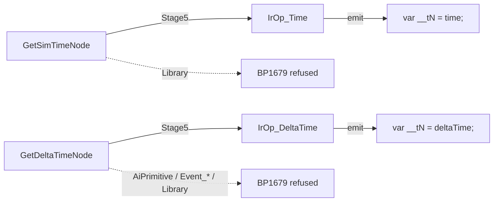

<!--STATUS
state: LIVE
updated: 2026-09-30
build-state: DESIGN — §6 leans APPROVED (user 2026-09-30: "paragraph 6 leans approved"), with §6.5's two amendments open; A approved in principle (user 2026-09-30: "Agreed on the single blueprint behavior, could be broken
  to blueprint functions whenever suitable"); everything else awaits review of §5. "Measure first … No blind coding."
current-answer: ⭐⭐⭐ §7 (THE PLAN — ordered tasks, status, what is decided and what is still open) FIRST; then §6 (the user's 2026-09-30 revision of the old rulings + the measured cost of each blueprint-way
  node) FIRST — it overrides §5.1 and §5.4 where they disagree. Then §5 (EQS, measurements), then §3 A/E.
stale-below: §3's rows C1, C2, C4, D1, D2 (overtaken by §5); §5.1's "effect on §3" column and §5.4's "revised lean"
  column wherever §6 disagrees (§6 wins — the user revised the Q6 rulings §5.1 leaned on).
known-rot: ⚠ §3 was written without reading Q6's approved rulings (2026-07-17) and Q#5-C; four of its leans contradicted
  them (§5.1). §2's "replaced by" column for AreaQueryBatchOps and the intent JSON is wrong the same way.
known-conflict: HillAssault_Blueprint_Migration.md §"What blueprintize means" keeps the BTree topology and turns only the
  node logic into blueprints. Decision A here departs from that on purpose; the reason is in A.
related-designs:
  - HillAssault_Blueprint_Migration.md — owns the July rebuild log and its GAP-1..GAP-10 list, part of which is now
    out of date (§1 here re-measures it).
  - Architect_Question_77_Blueprint_As_A_Behaviour.md — owns the blueprint-behaviour runtime this rebuild runs on
    (a Tick graph with its own block, latent waits, Return finishes it).
  - Architect_Question_76_One_Blackboard_Block_Per_Primitive.md — owns "one block per running behaviour" (R-151).
  - DESIGN_Parameter_Model.md — §P.9 owns "a leaf reads its host live"; no node writes a Parameter. That is why A leans
    away from blueprint leaves.
  - docs/designs/hill-attack/DESIGN.md — owns the doctrine itself (phases, slots, waves). Its behaviour is the spec;
    CE-460's known quirk is part of it (WON'T FIX).
  - Blueprint_Fixed_Collections_Design.md — owns the fixed-list variable and the curated-accessor collection nodes (C4).
  - Architect_Question_6_Access_Shapes_And_Vocabulary.md — ⭐ owns FOUR APPROVED rulings this question must honour
    (demand-driven vocabulary, no GetSingleton node, curated JSON builder, area query ≠ EqsSensor). §5.1.
  - Architect_Question_17_Component_Collection_Read.md — carries Q#5-C (raw fixed buffers stay out of the graph). §5.1.
  - DESIGN_Resolver_World_Reach.md — §6 refuses a read-singleton node; world reach in a resolver is a curated call.
  - docs/designs/eqs-2/EQS_Design_v1.3_final.md — the template EqsSensor system; §5.3 finds it inert in production.
-->

# Architect Question #78 — the hill attack, the blueprint-node way (`CE-464`)

> 🔒 **User, `2026-09-30`:** *"The C# helpers for basically everything is exactly what i found non elegant. The goal was
> making it the blueprint node way."* · earlier the same day: *"lets leave its old behavior as is. What is important is
> that it keeps working as before."*

**Goal.** Rebuild the platoon hill attack commander as a blueprint whose **logic is nodes**. Hill-attack-specific C#
helpers are not allowed. The C# `PlatoonHillAttack` stays the live doctrine and becomes the reference the blueprint
version is compared against.

## 1. INVENTORY *(`2026-09-30`)*

| query | total | result |
|---|---|---|
| `search_graph name_pattern=".*(Ops\|Math\|IntentJson)$" label=Class file=*Hrot.AI.Behaviors/Brains/*` | **18** | 15 hill-attack helpers + `UnitRosterOps`, `BpCollectionDemoOps`, `BpFixedListDemoOps` (the last two are demos) |
| `search_graph name_pattern=".*Node$" label=Class file=*Nodes.cs` | **54** | the node classes; 48 serialised kinds, all lowered by `Stage5_Schedule` except the 4 squad primitives, `ArrayMake/ArrayGet`, the dispatcher pair |
| node census of the 15 `HillAssault2_*.bp.json` twins (script) | **191 nodes** | FunctionCall **44** · SetVariable 35 · Literal 33 · Return 25 · Branch 21 · GetVariable 19 · Compare 13 · PublishEvent 6 · FlowForEach 4 · GetComponent 3 · BinaryOp 3 |
| distinct helper methods called | **28** | listed in §2 |
| grep `BlueprintCallable` outside `Brains/` | — | ⭐ **`FDP/Toolkits/Fdp.Toolkits/Blueprints/BlueprintMath.cs`**: a general-purpose library that already has `Lerp`, `Clamp`, `Min/Max`, int and float arithmetic |

⚠ `check_index_coverage` is not available through the CLI, so the counts above are what the graph and grep returned,
not a proven complete set.

## 2. Claim table — the 28 helper calls, sorted by what replaces them

| helper call(s) | code (how it is) | replaced by | design basis |
|---|---|---|---|
| `SegmentMath.Lerp` ×6, `LerpParam` ×3, `TotalSlots` | `SegmentMath.cs:13-55`: plain arithmetic | ✅ `BlueprintMath.Lerp` (**already exists**) + `BinaryOp` + `Compare` | seam law: a duplicate of `BlueprintMath` |
| `VectorOps.Vec3` | `new Vector3(x,y,z)` | ✅ `MakeStruct` | — |
| `WorldOps.IsNull`, `WaveParityOps.*`, `WaveDispatchOps.ShouldConsider` | compare to `Entity.Null`; `index % 2 == wave` | ✅ `Compare` + `BinaryOp(Modulo)` (+ is-alive, C2) | — |
| `SlotOps.PickClosestBaselineSlot` | two loops over slots, min distance | ✅ a loop + variables, or a **blueprint** function/macro | — |
| `WaveMonitorOps.Update` | loop over runners, read each one's `BehaviorState`, remove dead or finished | ✅ loop + `GetComponent` on a target entity (`GetComponentTargetDemo` has a `Target` pin) + list write | `Blueprint_Fixed_Collections_Design.md` |
| `MemberSlotListOps.*` ×5 | four parallel fixed arrays (SoA), capacity 8 | ✅ **a fixed-list variable of a `Runner` struct** (`ListWriteNode`, Q19's `BlackboardFixedList`) | `Architect_Question_19` |
| `MaskOps.WithBitSet` ×3 | `mask \| (1 << i)` | ⛔ no bit operators (`ArithmeticOperator` = Add/Subtract/Multiply/Divide/Modulo, `Nodes.cs:465`) → **C1** | searched `docs/`, no ruling |
| `WorldOps.SimTime`, `WorldOps.IsAlive` | downcast `view` to `EntityRepository` | ⛔ no node → **C2** | — |
| `NetworkEntityMapOps.ResolveTarget`, `TargetPoolOps.ResolveNetId`, `HillAssault2TankOps.HasTarget` | read a managed **singleton** (`NetworkEntityMap`) | ⛔ no singleton read → **C2** | migration doc GAP-10, still open |
| `SlotOps.PickRandomFreeSlot` | `SimRng.FromSim(self, wave, simTime)`, deterministic | ⛔ no random node → **C3** | — |
| `AreaQueryBatchOps.*` ×8 | `AreaQueryBatchHelper` (`Fdp.Toolkits/Spatial/Eqs`): request event + 64-slot ring buffer | ⚠ **a different pipeline** from the built-in `SpawnEqsSensor`/`ReadEqsResult` (template-based sensor) → **D1** | ⛔ not measured whether the sensor can answer "hostiles in area" |
| `MoveIntentJson.Build`, `HullDownIntentJson.Build` | a DTO serialised to a string; `AssignTacticalIntentEvent` carries `JsonParams: string` (`BuiltInEngineEventCatalog.cs:218`) | ⛔ `MakeStruct` exists, **struct → JSON** does not → **D2** | — |
| `FlowForEach` over `UnitRoster` | needs `UnitRosterOps.Count/Subordinate` (curated C# accessors) | ⚠ **every collection node needs curated C# accessors** → **C4** | `Blueprint_Fixed_Collections_Design.md` (`CuratedStatic`) |

⇒ About half the helper calls can be replaced with nodes that exist today. The rest need **six generic capabilities**
(C1–C4, D1, D2). None of them is hill-attack-specific.

## 3. Decisions — each with a lean

### A — Shape: one blueprint behaviour, or a behaviour tree with blueprint leaves?

- **A1 — ONE blueprint behaviour** (Q77's `Dispatch = Behavior`): one Tick graph. The phases (segments → staging → waves
  → return) are an enum variable plus `Branch`, with latent waits (`Delay`, `When`) where the doctrine waits. All state
  lives in its own block.
- **A2 — keep the BTree, and make each leaf a blueprint** (the migration doc's original intent).
- **Lean: A1.** Measured: the commander's leaves **write** shared doctrine state (segments, wave number, slot masks,
  the runner list). A blueprint leaf **reads** its host's `Params` live (`DESIGN_Parameter_Model` §P.9, `CE-444`), and
  the thunk even passes them by `ref` (`AiPrimitiveEmitter.EmitLiveHostParams`: `ref var p = ref *(Params*)(__root +
  __at)`). But **no node writes a Parameter**: `GetParameter` exists, and `SetVariable` targets only the leaf's own
  variables (`Nodes.cs:196`). So A2 needs a new "write my host's parameter" node, which makes leaves write shared host
  bytes. That is the hazard the user named on `2026-09-21` (*"two actions running in two hsm regions would overwrite the
  params"*, §P "the ruling that forced it"). The last version that worked around it (`PlatoonHillAttack2` plus
  GetShared/SetShared) was deleted by `CE-436`.
  **What would change the lean:** if the user wants the tree picture kept for readability, A2 is possible, but only
  after a ruling that a leaf may write its host's parameters.

### B — What "no C# helpers" means precisely

- **B1** — zero C# calls of any kind. **B2** — only *general-purpose* library functions are allowed (like `BlueprintMath`,
  kept in a shared toolkit library), never doctrine-specific ones. **B3** — status quo.
- **Lean: B2**, enforced by a rail: *no blueprint under `Assets/` calls a type in `Hrot.AI.Behaviors/Brains/`*.
  B1 would force re-inventing arithmetic as nodes; the engine's own standard library is the node palette.

### C — The four missing general-purpose capabilities

| | capability | lean | blast radius |
|---|---|---|---|
| **C1** | bit operations | ⭐ **model slots as a fixed list of a slot-state enum (Free/Burned/Reserved) instead of a bitmask.** It reads better and needs no bit maths. Round-out: add `BitAnd/BitOr/BitXor/ShiftLeft/ShiftRight` to `ArithmeticOperator` for integer types anyway (cheap, generic) | compiler: one enum + lowering |
| **C2** | world reads: sim time, is-alive, **singleton read** | library functions `SimTime`, `IsAlive(entity)` in the shared library; a **`GetSingleton`** node (the migration doc's GAP-10 / "P3") plus a library `ResolveNetworkId(long) → Entity` in the network toolkit | ⚠ if `ISimulationView` needs a singleton accessor, that touches **Fdp.Core, which belongs to the backend lane** → STOP and report. Otherwise keep the downcast inside the shared library, once |
| **C3** | deterministic random | library `RandomInt(self, key, min, max)` built on `SimRng.FromSim`, so replay stays deterministic | toolkit only |
| **C4** | collection loops without per-collection C# accessors | let the compiler read an `[InlineArray]` / fixed-buffer **field** directly (as the `ManagedMember` mode already does for managed collections) | compiler; ⚠ **the reason `CuratedStatic` was chosen is NOT yet read**. The session must read `Blueprint_Fixed_Collections_Design.md` + Q20 before deciding. If the reason still holds, keep the accessors but put them in the shared library, one per engine collection type, never per doctrine |

### D — The two engine pipelines the graph must reach

| | | lean |
|---|---|---|
| **D1** | the area query | measure first whether the EQS sensor nodes can answer "hostile units in an area". If they can, use them. If not, add **request / is-ready / read / free** nodes over `AreaQueryBatchHelper` as a generic EQS family, not as hill-attack helpers |
| **D2** | the intent's JSON payload | a generic **`ToJson`** node: baked struct FQN in, string out, the `MakeStruct` pattern. ⚖️ Alternative: a typed intent event. Rejected because it changes a wire contract the C# doctrine also uses |

### E — Scope, reference and proof

- **Commander only** (`PlatoonHillAttack`). The members keep running the C# `HullDownAttackRun`; that is a later
  question.
- **The C# doctrine is the reference, quirks included** (`CE-460` WON'T FIX): same scenario, same outcomes. Proof:
  `hill-attack-close` in `SimHost` (the suite `HillAttackIntegrationTests` already uses) plus one live
  `ClusterRunner --mode all` run. Both targets destroyed, platoon back on its baseline.
- **The 15 `HillAssault2_*` twins:** keep them until the rebuild's proofs cover their node types, then retire them with
  coverage re-pointed (`R-137`). This is not a rush removal.

## 4. Suggested order

① C1 round-out + C2 + C3 (small, generic, independent) → ② C4 and D1 (each needs its own measurement first) → ③ D2 →
④ author the behaviour (A1) → ⑤ the proof (E). Each generic node gets its own rail in its feature's suite.

## 5. ⭐ ROUND 2 — measured `2026-09-30`, and what it changed

> 🔒 **User, `2026-09-30`:** *"Approved roughly but measure first and then let me review again. No blind coding. Agreed
> on the single blueprint behavior, could be broken to blueprint functions whenever suitable. Pls measure the missing
> pieces. Especially the eqs is a bit alarming, how many env query systems we have?"*

### 5.1 ⛔ Rulings §3 missed — the C# helpers were the APPROVED design

| ruling | says | effect on §3 |
|---|---|---|
| **Q6-A** (`Architect_Question_6…md:111`) | add `BinaryOp` vocabulary **strictly demand-driven**; no speculative visual math | ⛔ drops C1's bit-operator round-out |
| **Q6-B** (`:115`) | ⛔ **do NOT build a `GetSingleton` node** — a curated context-aware `FunctionCall` | ⛔ drops C2's singleton node; `DESIGN_Resolver_World_Reach` §6 refuses it too |
| **Q6-C** (`:121`) | a **curated typed→JSON `FunctionCall` helper** feeds `PublishEvent`; *"without exposing … JSON nodes to the graph"* | ⛔ contradicts D2's `ToJson` node |
| **Q6-D** (`:125`) | *"Do NOT force the batch query into the `SpawnEqsSensor` template path"*; a curated helper trio | ✅ confirms D1 — and §5.3 measures why |
| **Q#5-C** (`Architect_Question_17…md:63-70`) | raw fixed/inline-array access stays **out of the graph**, in a tiny curated accessor | ⛔ flips C4 |

⭐ **The reconciliation:** Q6's principle is *"orchestration-first + **curated-generic**"*. What went wrong is that the
helpers stopped being generic: `SegmentMath`, `SlotOps`, `WaveMonitorOps`, `HullDownIntentJson` are the doctrine
itself, written in C#. ⇒ §3 B's lean (B2) *is* Q6 applied faithfully: **curated C# only where it is generic (engine
access, serialisation, geo), doctrine logic in nodes and blueprint functions.**

### 5.2 Blueprint functions in a behaviour — ✅ supported

| claim | code |
|---|---|
| a `Behavior` blueprint may carry `Function` graphs | ✅ `Stage2_Validate.cs:1190` (same rule as Instance) |
| a graph calls a local function | ✅ `FunctionCall` with `TargetGraphId`, lowered at `Stage5_Schedule.cs:1639`; rails `BATCH03A_FunctionGraphCallTests`, `BP73_MultipleFunctionOutputsTests` |
| ⚠ limits | `When` is refused in a pure function (`:1191`); `SpawnEqsSensor`/`ReadEqsResult` only in event graphs (`:1498`, `:1535`); **no Break node** — a loop runs to its bound |

### 5.3 🔴 The EQS answer — **TWO systems, separate solvers; only one works in production**

| | **A — AreaQuery** (the one the C# hill attack uses) | **B — template EqsSensor** ("EQS v1.3") |
|---|---|---|
| types | `AreaQueryRequestEvent`/`ResultEvent`, `AreaQueryBatchData` ring, `AreaQueryBatchHelper` (`Fdp.Toolkits/Spatial/Eqs`) | `EqsSensor`, `EqsCognitiveBuffer`, `IEqsTemplateRegistry`, generators + tests, `[EqsTemplate]` |
| solver | `AreaQuerySolverSystem` in `CognitiveSpatialModule` | `EqsSolverSystem` in `EqsModule` — ⛔ **does not delegate to A** (`EqsModule.cs:17-19`) |
| registered on | SimHost, Stride, editor | SimHost, Stride (not the non-Stride editor) |
| answers | entities of one force **inside an area polygon** — exactly the hill attack's need | radius searches, cover points, navmesh samples; ⛔ **no area/polygon generator** |
| production callers | the C# hill attack (5 methods) | `HideInCoverBehavior` — whose BTree is *"registered as behaviours nowhere"* (`CuratedBehaviorGenerator.cs:26`) |
| tests | 12 files | 81 files |
| 🔴 **production state** | ✅ live, tested, proven by the hill attack | ⛔ **INERT: no production code ever installs `IEqsTemplateRegistry`.** Every implementer and every `SetSingletonManaged<IEqsTemplateRegistry>` is in a test (verified by grep). Without it `EqsSolverSystem.cs:143-158` takes the *"Phase 1 stub fallback (empty result)"* on every query |
| design | `docs/designs/hill-attack/DESIGN.md` Phase 1 | `docs/designs/eqs-2/EQS_Design_v1.3_final.md:19` — *"upgrades the engine's current minimalistic `AreaQuerySolverSystem`"* — an intent to supersede, **never carried out** |

⇒ **Lean D1 (revised): use System A.** It is the only one that answers the question and the only one that works.
Keep Q6-D's curated trio, but **make it generic**: move `AreaQueryBatchOps` beside `AreaQueryBatchHelper` and take
the force as an argument (today `ForceId.Hostile` is hard-coded, `AreaQueryBatchOps.cs`). ⚠ System B's inert state
is a separate defect, filed as **`CE-465`** — not this question's to fix. The blueprint nodes that target it
(`SpawnEqsSensor`, `ReadEqsResult`) would return nothing at runtime today.

### 5.4 The revised gap list — what stays C#, and it is all generic

| need | measured | revised lean |
|---|---|---|
| is-alive, sim time | ✅ `ISimulationView` has `IsAlive` and `Time` (`ISimulationView.cs`); `Time` = `SimulationTime` (`EntityRepository.View.cs:29`); a behaviour's view IS the repository at runtime (`BrainTickSystem.cs:414`) | curated generic `FunctionCall`s (today's `WorldOps`, moved to a shared library). No engine change; no new node (Q6-A) |
| singletons | ✅ **only the resolver** needs them — geo transform + network map (`HillAttackCommanderNodes.cs:669-674`); the tick never does. The behaviour resolver gets `EntityRepository` (`InstanceEmitter.cs:505`) | curated generic calls in the resolver (geo `ToCartesian`, network-id lookup) — the reach `DESIGN_Resolver_World_Reach` §6 designed. No singleton node (Q6-B) |
| random | ✅ `SimRng` exists, deterministic, with `SimRngRails` | one curated generic `RandomInt(seed…, min, max)` over `SimRng` |
| slot bookkeeping (was bitmasks) | ✅ blackboard fixed lists are built end to end; a **struct** element is tested (`ListVariableFoundationTests:82,101`); ⚠ an **enum** element is accepted by the type rule (`StaticTypeRegistry.cs:266`) but no test uses one | a fixed list of slot states → **no bit operations needed at all** (Q6-A: no demand, no vocabulary). ⚠ measure the enum element first |
| the runner list | ✅ fixed list of a `Runner` struct; iterable with `ComponentForEach` and no accessor | nodes only — `MemberSlotListOps` disappears |
| the roster loop | `UnitRoster.SubordinateEntities` is a raw `fixed long[16]`; ⛔ no accessor-free path (Q#5-C) | **keep the curated accessor** (`UnitRosterOps`) — it is an ENGINE collection's accessor, so move it beside `UnitRoster`'s toolkit, not the doctrine folder |
| the order's JSON | the whole assign pipeline is JSON (`AssignTacticalIntentEvent.JsonParams` → `AssignBehaviorEvent` → the start record); `FormatString` builds a culture-formatted `FixedString` — ⛔ unfit for JSON | ⚖️ **needs your call** — see D2′ below |
| "is this member running HullDownAttackRun?" | the C# compares `BehaviorState.ActiveBehaviorHash` to `BehaviorHash.FromName(...)` | `GetComponent` on the member + a curated generic `BehaviorHash.FromName` call |

**D2′ — the JSON payload, two honest options:**
- **D2′a (lean): ONE generic curated serialiser.** `MakeStruct` builds the existing `HullDownAttackParams` /
  `MoveToLocationParams` struct in the graph; one generic C# function serialises any struct. It keeps Q6-C's letter
  (C# serialises, no JSON nodes) and drops the per-intent builders. ⚠ **Unmeasured:** whether `FunctionCall` accepts
  an `object`/generic parameter. If it does not, this needs a small compiler change.
- **D2′b: keep per-intent builders**, as Q6-C literally approved. Two small C# functions stay (`MoveIntentJson`,
  `HullDownIntentJson`) — they are pure data mapping, not doctrine logic.

### 5.5 What moves into NODES and blueprint FUNCTIONS (the doctrine itself)

`SegmentMath` → `BlueprintMath.Lerp` + arithmetic · `SlotOps.PickClosestBaselineSlot` / `PickRandomFreeSlot` → blueprint
functions over the slot list · `WaveMonitorOps.Update` → a blueprint function looping the runner list · `WaveParityOps`,
`WaveDispatchOps.ShouldConsider`, `WorldOps.IsNull` → `Compare`/`BinaryOp(Modulo)` · `MemberSlotListOps`, `MaskOps` →
fixed-list writes · `TargetPoolOps.ResolveNetId` → a function over the area-query result + `GetComponent<NetworkIdentity>`
on the target · `VectorOps` → `MakeStruct`. ⇒ **12 of the 15 doctrine helper classes disappear;** what remains in C#
is engine access (area query, world, roster accessor, geo/network in the resolver), random, the behaviour hash and the
serialiser — all generic.

### 5.6 Still unmeasured — to settle before any build

① an **enum** as a fixed-list element (no test uses one) · ② `FunctionCall` with an `object`/generic parameter (D2′a) ·
③ the block budget for the doctrine's state (slot list + runner list + wave bookkeeping) against the tier ladder
(`BlueprintTierLadder`, max 16 384 B — expected to fit easily; not computed) · ④ whether `When` or a polled `Branch` +
`Return Running` better expresses "wait until all at baseline" (both exist; a style call).

## 6. ⭐⭐ ROUND 3 — the old rulings REVISED by the user, and the measured cost of the blueprint way

> 🔒 **User, `2026-09-30`:** *"the architect rulings seem obsolete and need revising. why not GetSingleton node? why not
> typed Send Behavior Intent node taking parameters as pins, internally converting to Json string? why is alive not as
> reading ECS component? Why not getting sim time as built-in blueprint function? why not random number as built-in
> generic blueprint function? why not geo conversion as built-in blueprint function? why not generic json-serializer and
> deserializer dto typed blueprint nodes? formatString should be always culture neutral. why not bit operations …
> **Non-generic c# helpers are a band aid and last resort, our desire is to represent those via standard blueprint nodes
> as much as possible.** Measure what is needed."* · on EQS: *"until then we need to use the 'good old' area query here,
> likely via c# helper … (no new node for old eqs system)"*.

⭐ **The new principle (ledger `R-156`)** — supersedes Q6-A (*demand-driven vocabulary*) and the "curated helper"
leans of Q6-B/C: **standard blueprint nodes and built-in functions first; a non-generic C# helper is a last resort.**
Q6-D (area query ≠ `EqsSensor`) is overtaken the other way: the two systems are to be **unified**
([`HANDOFF_EQS_Unification`](batches/HANDOFF_EQS_Unification.md)).

### 6.1 What a "built-in function" is today — the mechanism every answer below reuses

| fact | code |
|---|---|
| a built-in function IS a `FunctionCall` node on a static C# method — there is no separate kind | `Nodes.cs:146-185` |
| the palette auto-discovers `public static` methods with `[BlueprintCallable]` in `Hrot*`/`Fdp*` assemblies | `BlueprintCallablePaletteEntries.cs:27-61` |
| ⚠ that attribute lives in a Hrot assembly FDP does not reference — so **`BlueprintMath` (FDP) is listed by hand** | `BlueprintMathPaletteEntries.cs:22`, `BlueprintEditorBootstrap.cs:144` |
| the world reaches a call through `TrailingContext` (`View` = an `ISimulationView` last parameter; `Self` = an `Entity self`) | `Stage5_Schedule.cs:3753-3878` |

⇒ **"Built-in" = a generic library in the engine, surfaced in the palette under a standard category.** The one open
design point: where that library lives so the palette finds it (**lean:** beside `BlueprintMath` in
`Fdp.Toolkits/Blueprints`, with the palette's hand-list generalised to a small FDP-side marker the scanner also
accepts — one mechanism instead of two).

### 6.2 The questions, answered — measured cost and lean

| # | the user's question | measured today | lean | cost |
|---|---|---|---|---|
| **1** | GetSingleton node | no node; `ISimulationView` has no singleton accessor; ⛔ the type registry assumes **any** `global::` type is an unmanaged 4-byte value (`StaticTypeRegistry.cs:266-290`) — a managed singleton would be mistyped. And the two singletons the hill attack needs are **services** (`NetworkEntityMap.TryGetEntity`, `IGeographicTransform.ToCartesian`): a node that returns the object leaves you with an object you cannot call (a `FunctionCall` calls static methods only) | **built-in functions over the services** (rows 6 and network-id → entity) — they are what the graph actually wants. A GetSingleton node for **unmanaged data** singletons is cheap to add later; for managed ones it needs a managed-type story first | functions: 1 file each; node: a type-registry design pass |
| **2** | typed **Send Behaviour Intent** node, params as pins, JSON inside | only `PublishEvent` with a raw `JsonParams: string` (`BuiltInEngineEventCatalog.cs:218`); per-behaviour builders (`MoveIntentJson`, `HullDownIntentJson`). `MakeStruct` already bakes a type + per-field pins (`StatementEmitter.cs:202-208`). A behaviour's params DTO is known at run time (`BehaviorRegistry.JsonParamsDtoType`, `BehaviorRegistry.cs:262`) but the editor does not read it | ⭐⭐ **BUILD IT.** The node bakes the behaviour name and its DTO's fields (editor-side, from the registry), shows one pin per field, and emits `new Dto{…}` + serialise + publish. **Retires both intent builders and the whole JSON question for orders** | ~5–6 files (node, Stage0 pins, Stage5, emitter, editor drawer) |
| **3** | is-alive as reading an ECS component | liveness is **entity-index metadata, not a component** (`EntityIndex.cs:197`). `GetComponent`'s `Found` pin is false for a dead entity (`EntityRepository.cs:1007`) — but ⚠ the read is emitted **before** the check (`Stage5_Schedule.cs` GetComponent arm: `IrOp_GetComponentRO` then `IrOp_HasComponent`); whether that read throws on a dead entity is **not traced** | **a built-in `Is Alive (entity)`** — a component read is only a proxy that depends on which component. ⚠ Separately: measure the read-before-check order (a possible defect) | 1 file |
| **4** | sim time as a built-in | `IrOp_Time` / `IrOp_DeltaTime` **already exist** in the IR and are emitted (`IrOperation.cs:52-53`, `StatementEmitter.cs:247-253`) — only the wait lowerings produce them; no node does | **a `Get Sim Time` / `Get Delta Time` node over the existing IR op** — no view argument, no C# | ~4 files |
| **5** | random as a built-in | no node; `SimRng` exists (deterministic, `FromSim(entity, salt, time)`, `NextInt/NextSingle`) with `SimRngRails` | **built-in `Random Int (min, max, salt)` / `Random Float`**, seeded from self + salt + sim time. ⚠ Stateless: two calls with the same salt in one tick return the same value — the salt pin is how an author separates them | 1 file |
| **6** | geo conversion as a built-in | none; `IGeographicTransform` is read via `GetSingletonManaged` in doctrine C# (`CgfNodes.cs:149`, `HillAttackCommanderNodes.cs:669`) | **built-in `Geo → Cartesian (lat, lon, alt)` and the inverse** | 1 file |
| **7** | generic JSON serialise / deserialise, DTO-typed | none. ⛔ `FunctionCall` cannot call generic methods (lookup by name only, `Stage0_Rehydrate.cs:1421`) | **`To JSON` / `From JSON` nodes with a baked DTO type** (the `MakeStruct` pattern). Shares its emitter with row 2 — build them together | ~5 files, shared with 2 |
| **8** | FormatString always culture-neutral | ⛔ **it is not**: `TryWrite($"…")` with no provider (`StatementEmitter.cs:1001`) — a cs-CZ machine writes `1,5`. `PrintString` is the same. No test pins culture | **fix: `TryWrite(CultureInfo.InvariantCulture, $"…")`** + a rail run under cs-CZ. A defect, not a design question | 1 line + 1 test |
| **9** | bit operations | none: `ArithmeticOperator` = Add/Subtract/Multiply/Divide/Modulo (`Nodes.cs:465`); `BlueprintMath` has only boolean And/Or/Xor/Not. Lowering is operator-agnostic (`Stage5:3262-3300`) | **add `BitAnd/BitOr/BitXor/ShiftLeft/ShiftRight/BitNot`**, integer types only (a Stage2 type check — none exists today). ⚠ byte/short widen to int in C# | ~4–5 files |

### 6.3 Two measured findings that change the rebuild

| finding | evidence | consequence |
|---|---|---|
| 🔴 **an engine enum pin must be spelled `global::Fdp.Core.ForceId`** — ⛔ *the "assumes 4 bytes" half of this row is WRONG for block fields; see §7 row 8 (`CE-473`)* | measured `2026-09-30`: the bare FQN fails **`BP1500` "does not resolve"**; the `global::` rule is `StaticTypeRegistry.cs` AN2 (*"default enum underlying size of 4 bytes"*). `ForceId` is a **byte** enum | harmless for a pin (a C# local); ⛔ **a byte-backed enum stored in a block would get the wrong layout.** The slot-state list's enum must be `int`-backed, or the size rule fixed first |
| ✅ the stop-gap area query is generic now | `AreaQueryBatchOps.Request(targetArea, force, self, view)` (force was hard-coded Hostile) + new `TargetAt(groupHandle, index, view) → Entity` | the blueprint rebuild can use it until the EQS unification lands; no new node for the old system |

### 6.4 What is left in C# after §6 — the whole list

- The **area-query functions** — until the EQS unification replaces them with the EQS 1.3 nodes.
- The **roster accessor** (`UnitRosterOps`) — Q#5-C (raw fixed buffers stay out of the graph); it is an engine
  collection's accessor, not doctrine.
- **Nothing doctrine-specific.**

### 6.5 After approval — two follow-ups from the user *(`2026-09-30`)*

> 🔒 *"paragraph 6 leans approved. isAlive checking entity existence (while entity can be destroyed) is confusing name,
> we need something like IsExistingEntity. Isnt there some more blueprint native way of representing the roster so that
> the need for c# helper disappears? (we still want unmanaged ECS component though)"*

**① The name — measured: the engine has THREE different notions, and "alive" blurs them**

| notion | where | what it answers |
|---|---|---|
| **the handle is valid** | `EntityIndex.IsAlive` (`EntityIndex.cs:197-207`): slot active **and** generation matches | "does this entity still exist?" |
| **lifecycle state** | `EntityRepository.GetLifecycleState` (`:358`) → `EntityLifecycle` = `Constructing` / `Active` / `TearDown` / `Ghost` (`EntityLifecycleState.cs`) | "is it fully set up, or being torn down?" — ⚠ an entity in `TearDown` still **exists** |
| **gameplay-destroyed** (a knocked-out tank) | a component (health/damage) | "is it out of the fight?" — not an engine notion |

⇒ **Lean:** row 3 becomes **`Entity Exists (entity)`** — the handle test, named for what it checks. Round-out: **`Get
Lifecycle State (entity)`** returning the `EntityLifecycle` enum, so "exists but being torn down" is expressible.
"Destroyed" in the gameplay sense stays a component read — the doctrine chooses which component means it.
⚠ `EntityLifecycle` is a **byte** enum: fine as a pin, but see §6.3 before storing it in a block.

**② The roster — ✅ a blueprint-native path ALREADY EXISTS; `UnitRoster` just does not use it**

| fact | code |
|---|---|
| a component field that is an `[InlineArray]` buffer marked **`[BlueprintCollectionField(nameof(Count))]`** gets its accessors **generated** — no hand-written C# | `CollectionOpsGenerator` (`Fdp.Toolkits.Analyzers`); attribute in `Fdp.Core` |
| the graph then reads it with the standard collection nodes (`GetComponent` collection pin → `ComponentForEach` / `ItemGet` / `ItemCount`), and writes it with `CollectionWrite` | Q#20; `Blueprint_Fixed_Collections_Design.md` |
| proven: `BpGenListDemo` — the attribute is its *entire* authoring surface | `BpGenListDemo.cs:36`; rails `CollectionOpsGeneratorTests`, `GeneratedCollectionOpsTests` |
| ⛔ `UnitRoster` uses raw **`fixed long SubordinateEntities[16]`** + `fixed ushort TacticalDesignations[16]` — the generator refuses `fixed` buffers (`FCOL002`), which is the only reason `UnitRosterOps` is hand-written | `UnitRoster.cs:41,47` |
| it stays an unmanaged ECS component — `[InlineArray]` is unmanaged | — |
| Q#5-C is satisfied: raw buffer access stays out of the graph, inside **generated** accessors | `Architect_Question_17…md:63-70` |

**Lean:** convert `UnitRoster`'s two `fixed` buffers to two `[InlineArray(16)]` fields — **`Entity`** elements
(not packed `long`, so the graph gets real entity pins) and `ushort` designations — each marked
`[BlueprintCollectionField(nameof(Count))]`. Same 168 bytes, same parallel layout, the generator writes the
accessors, **`UnitRosterOps` is deleted**, and the hill attack loops the roster with `ComponentForEach`.
⚖️ Alternative: one `[InlineArray]` of a `RosterEntry { Entity; ushort Designation; }` struct — nicer in a graph
(one loop yields both) but padding grows the component to ~256 B. Rejected on size unless the user prefers it.

**Blast radius, measured:** 14 non-test files / 36 sites use the two buffers (`UnitHierarchySystem`, 5 squad
systems, `SquadInputs`, `ThreatMatrixAssignmentSystem`, `GenesisMaterializationSystem`, `UnitRosterRenderer`, an
overlay, the hill attack, `UnitRosterOps`), plus 5 test files. ⛔ **`UnitRoster` lives in `FDP/Engine/Fdp.Core`, which
belongs to the backend lane (a cross-lane STOP for this lane)** ⇒ it goes to the backend lane as its own small
handoff, independent of the EQS unification. Unverified: whether anything serialises `UnitRoster` byte-for-byte
(it is `NoScenario` and rebuilt by `UnitHierarchySystem`, so probably not; the session must check the network path).

### 6.6 User decisions on §6.5 *(`2026-09-30`)*

> 🔒 *"i think the "is alive" in platoon hill attack context means "health > 0", not "entity does not exist". EntityExists
> (in the ECS) blueprint function is still useful of course. getLifecycle is not useful much fo game AI blueprints, at
> leas not at this stage. ok to your roster lean. Take the roster tasks your self"*

- ✅ **`Entity Exists`** — built-in, as §6.5 ①. ⛔ **`Get Lifecycle State` dropped** (not now).
- ✅ **"alive" in the doctrine = `Health.Current > 0`** — a `GetComponent<Fdp.Toolkit.Combat.Components.Health>` read
  in the graph, no C#. **Measured, it matches the engine's own rule:** since `2026-09-13` combat death is the STATE
  `Health.Current <= 0` and the body stays in the world (`DamageSystem.cs:72-80`, `HealthApplicationSystem.cs:88-101`,
  the `CE-267` revert). The EQS already filters on it (`AreaQuerySolverSystem.cs:161`).
- 🔴 **Consequence for the C# reference:** `HillAttackCommanderNodes` still tests **`ctx.World.IsAlive`** (ECS
  existence) at `:98, :154, :209, :338, :380, :466`. Since the revert, a knocked-out tank still "exists", so e.g.
  `Condition_IsWaveCompleted:466`'s *"Tank died: burn the slot"* branch **can no longer fire**. Filed as **`CE-466`**.
  Per the user's ruling the C# doctrine keeps its behaviour, so the blueprint rebuild will **diverge from the C#
  reference exactly when one of the platoon's own tanks is knocked out**. The proof must name that case, not hide it.
- ✅ **Roster** — §6.5 ② approved; the behaviours lane builds it (the `Fdp.Core` fence waived by the user for this task).

## 7. ⭐⭐⭐ THE PLAN — ordered, with status *(written `2026-09-30`; the durable record — resume from here)*

> 🔒 **User, `2026-09-30`:** *"pls do not rush into implementation, we are still talking about what to do, then we need
> to create tasks/plan that survives compaction. keep what you did but implement not more, summarize our plan."*
> ⛔ **Nothing below marked OPEN may be started without the user's go.** The tracker rows carry the same ids.

| # | id | task | status | depends on |
|---|---|---|---|---|
| 0 | `CE-465` | template EQS inert in production — handed to the backend lane with the unification ([`HANDOFF_EQS_Unification`](batches/HANDOFF_EQS_Unification.md)) | 📋 backend lane, draft handoff | — |
| 1 | — | area-query blueprint helpers made generic (force argument, `TargetAt`) — the stop-gap until the EQS unification | ✅ **DONE** (commit `6675608e5`) | — |
| 2 | `CE-467` | **roster blueprint-native** — `UnitRoster`'s buffers are `[InlineArray]` of `Entity` / `ushort` + `[BlueprintCollectionField]` (read-only); accessors GENERATED (`UnitRosterSubordinateEntitiesOps`); `UnitRosterOps` deleted; `CollectionOpsGenerator` moved to the new engine analyzer `FDP/Engine/Fdp.Core.Generators`; 168 → 164 B. ⭐ Needed and done with it (**CE-467-A**): `FdpAutoSerializer` serialises an `[InlineArray]` of `Entity` through the `IGuidResolver` (it used to throw) — the route `.dev/_DONE/cgf-scn-2/design-talk.md:291` named; invariant 3 of `cgf-scn-2/DESIGN.md` holds (no raw handle is written) | ✅ **DONE** — gates: Fdp.Toolkits 2383/0 · Blueprints 3980/0/17 · Generators 341/0 · SimHost `HillAttack/UnitHierarchy/Genesis/Squad` 125/0 · Overlays 29/0 · Hrot.Core 170/2 (the 2 `EcsPatchContextTests` reds fail identically on base `e76814777`) | — |
| 3 | `CE-468` | `FormatString` / `PrintString` culture-neutral (`TryWrite(InvariantCulture, …)` / `String.Create(InvariantCulture, …)`) — rail pins the provider in the generated C# | ✅ DONE `2026-09-30` | — |
| 4 | `CE-469` | **built-in function library** — `BlueprintWorldLibrary` (`Hrot.AI.Behaviors/StandardLibrary`): `Entity Exists`, `Is Alive In Combat`, `Entity From Network Id`, `Random Int/Float` (seeded, salt pin), `Geo To Cartesian` + inverse. ⚠ Home is Hrot, not beside `BlueprintMath`: FDP cannot see the attribute / `GeoPoint` / `SimRng`; one palette mechanism = the `[BlueprintCallable]` scan. Legacy `WorldOps.IsAlive` / `NetworkEntityMapOps.ResolveTarget` delegate to it, off the palette | ✅ DONE `2026-09-30` | — |
| 5 | `CE-470` | `Get Sim Time` / `Get Delta Time` — `GetTimeNode` over the existing `IrOp_Time` / `IrOp_DeltaTime`; `BP1679` where the clock is not in scope (design §8) | ✅ DONE `2026-09-30` | — |
| 6 | `CE-471` | bit operators on `BinaryOp` (`BitAnd/BitOr/BitXor/ShiftLeft/ShiftRight`), integer operands only — `BP1678` (Stage5 deny-list). ⚠ no unary `BitNot` (A/B-shaped node; XOR with all-ones) | ✅ DONE `2026-09-30` | — |
| 7 | `CE-472` | typed **Send Behaviour Intent** node (params as pins, JSON inside) + DTO-typed **To JSON / From JSON** nodes — one shared emitter | 📋 OPEN — approved (§6 rows 2, 7) | — |
| 8 | `CE-473` | enum sizes. ✅ **ALREADY SOLVED BEFORE THIS QUESTION — my §6.3 claim was wrong.** 📐 Measured `2026-09-30`: the generator passes a field-size oracle (`StructSizeResolver.MakeFieldSizeDelegate`, `BlueprintIncrementalGenerator.cs:124`) that sizes an enum by its underlying type (`StructSizeResolver.cs:274`); `Stage4_TypeResolve.WithOracleSize` replaces the 4-byte guess with it, and without an answer marks the size unreliable so the emitter keeps `Sequential` layout (proven for structs by `EmittedStateLayoutTests`). ⚠ The only remaining approximation is Stage2's tier-budget estimate (`ComputeStructSize`), which is a budget check, not a layout. ⭐ Added the missing enum rail: `StructSizeResolverEnumTests` (byte 1 · short 2 · int 4 · ulong 8). The `global::` spelling rule for enum PINS stands (a bare FQN is `BP1500`) | ✅ **DONE** — rail added; no compiler change needed | — |
| 9 | `CE-474` | `GetComponent` emits the read before the `Found` check — measure whether it throws on a missing/dead entity | 📋 OPEN — measure only | — |
| 10 | `CE-466` | the C# hill attack's "alive" = `Health.Current > 0`: `Fdp.Toolkit.Combat.CombatLife.IsAlive` at the 5 commander sites + the tank's `Action_AimAndFireSpecific`; the area stays an existence test. Rails `CE466_*` in `HillAttackNodeTests` (red-proofed) | ✅ **DONE** — live `hill-attack-close` re-verification: see the tracker row | — |
| 11 | `CE-464` | **the rebuild itself** — the hill-attack commander as ONE blueprint behaviour (Q77), broken into blueprint functions where suitable, "alive" = `Health.Current > 0`, roster via the generated collection, area query via the generic helpers (until the EQS unification), orders via the typed intent node | 📋 OPEN — after 2–7 | 2, 3, 4, 5, 6, 7 |
| 12 | — | the 15 `HillAssault2_*` twins — retire once the rebuild's proofs cover their node types (`R-137`) | 📋 OPEN — last | 11 |

**Decided (do not re-open):** single blueprint behaviour (§3 A) · the blueprint way first, C# helpers last resort
(`R-156`) · §6 leans · `Entity Exists` naming · no `Get Lifecycle State` now · alive = health > 0 · roster lean
(§6.5 ②) · the behaviours lane does the roster; the backend lane does EQS in parallel.

**Still open for the user:** the order of 3–7 (proposed as listed) · the built-in library's home (§6.1 lean) ·
`CE-473`'s fix · `CE-466`.

## 8. `CE-470` design note — `Get Sim Time` / `Get Delta Time` *(measured `2026-09-30`)*

⭐ A trivial mirror-pattern node (a pure, pin-less data node like `GetParameter`) — ⛔ **except for ONE measured fact
the §6 lean did not know: `deltaTime` is not in scope in every emitted method.** 📐 The emitters' signatures:

| emitted method | `time` | `deltaTime` | source |
|---|---|---|---|
| Instance / Behavior `Tick`, `Func_*` | ✅ | ✅ | `InstanceEmitter.cs:463`, `:613` |
| Instance `Event_*` | ✅ | ⛔ | `InstanceEmitter.cs:443` |
| AiPrimitive `TickCore`, `Func_*` | ✅ | ⛔ | `AiPrimitiveEmitter.cs:225`, `:283` |
| Library functions / resolvers | ⛔ | ⛔ | `LibraryEmitter.cs:165` |

*What the picture shows that prose hid: the two nodes reuse the IR ops the `Wait` lowering already emits
(`WaitLowering_*`), so no new IR and no new emit — the only new logic is the scope refusal.*

**Decision (as built `2026-09-30`):** one node class `GetTimeNode { TimeKind Kind }` (`SimTime` /
`DeltaTime`), pure, a single `System.Single` `Value` out-pin; Stage5 lowers to `IrOp_Time` / `IrOp_DeltaTime`; a
compile error **`BP1679`** where the value is not in scope (table above) — said in the compiler's own language, not as
a `CS0103` in a generated file.
**Rejected:** thread `deltaTime` into every signature — changes every AiPrimitive thunk and hosting contract for a value
an AiPrimitive can already derive · two node classes — one class + a kind enum mirrors `BinaryOp`/`Compare` · keep
`WorldOps.SimTime` as the surface — it is a C# helper per `R-156`; it loses its palette attribute once the node ships
and retires with the twins (`CE-464`).
