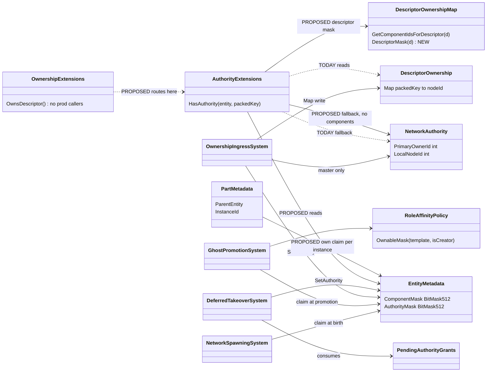
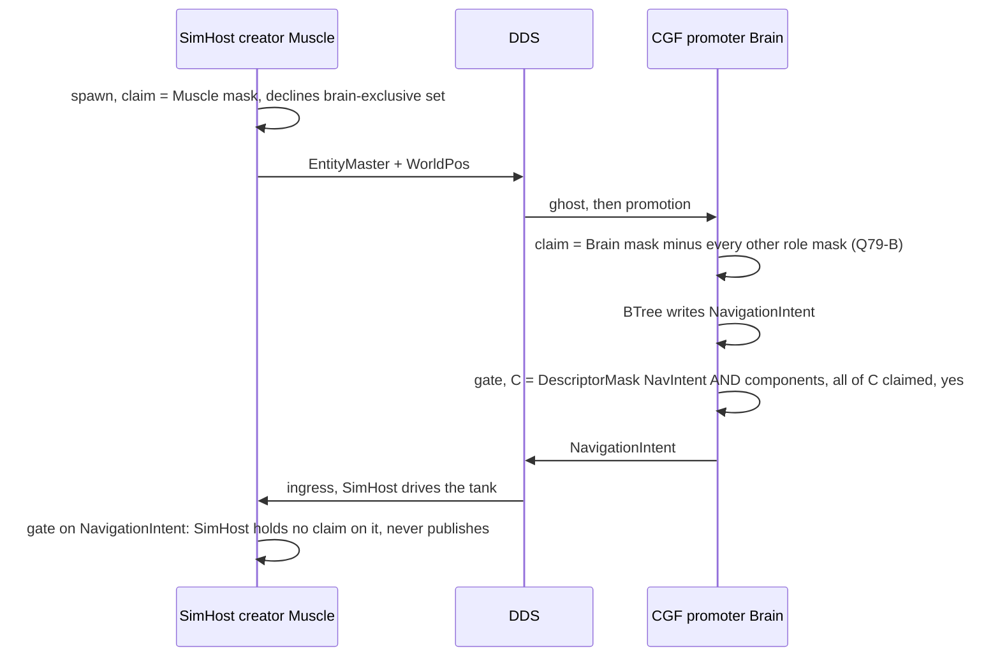
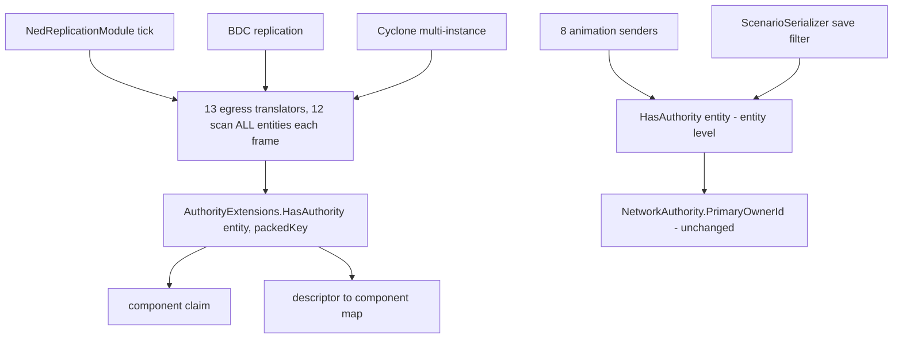

<!--STATUS
state: LIVE
updated: 2026-10-01
build-state: DESIGN — awaiting the user's approval of §4 (Q79-A…F). Nothing is built.
current-answer: §4 (the sub-questions with leans) · §3 (what derivation LOSES — the trade-offs) · §5 (measurements)
stale-below: nothing
known-rot: nothing known
known-conflict: DESIGN_Role_Affinity_Ownership.md §3.9c tolerates a promote-leg OVER-CLAIM ("tolerated, not correct") because
  no sender reads the claim. Q79-B removes that tolerance: once senders derive from the claim, an over-claim is a second
  publisher. Not reconciled until Q79-B is approved.
related-designs:
  - docs/DESIGN_Role_Affinity_Ownership.md — owns WHO claims WHICH component (role tables, birthright, promote leg); §3.6 found
    that no sender reads the claim; §4.2 carries CE-500. THIS question owns how a SENDER turns that claim into "may I publish".
  - docs/DESIGN_Entity_Ownership_Transfer.md — owns transfer INITIATION; its §3 already states the derivation rule
    ("authority-based, not Map-based") for transfers only; §4 keeps save ownership on EntityMaster. THIS question applies §3
    to every sender.
  - docs/DESIGN_Distributed_Scenario_Persistence.md — owns the SAVE GATE (`NetworkAuthority.PrimaryOwnerId`), which this
    question leaves exactly as it is.
  - FDP/Docs/projects/toolkits/FDP.Toolkit.Replication.md §2 — the ORIGINAL three-level model (primary · descriptor override ·
    hierarchical) that the current gate implements.
  - docs/reference/BDC_NED_SST_Descriptor_Rules.md — the wire spec: per-descriptor partial owners, "only the descriptor
    owner is allowed to publish", a disposed descriptor returns to the EntityMaster owner.
-->

# Architect Question 79 — **one ownership truth: senders derive descriptor ownership from the component claim**

> 🔒 **User, `2026-10-01`:** *"How can we make them agree in a clean way? We should not invent workarounds to a bug."* ·
> *"Per instance ownership should be honored even if not currently used. Unused is not equal to unneeded."* ·
> *"There must have been some reason for why it is implemented using the current mechanism. There is likely some trade off."*

**Trigger:** [`CE-500`](Blueprint_Issues_Tracker.md) — on Role-Affinity *Path B* (SimHost creates, CGF thinks) the brain
writes `NavigationIntent` and never sends it: CGF **claims** the component, but every sender reads a **different** record.

## 1. INVENTORY

| query | total | list |
|---|---|---|
| `search_graph name_pattern=".*(Authority\|Ownership).*" label=Class` *(production)* | 25 | `AuthorityExtensions` · `OwnershipExtensions` · `NetworkAuthority` · `DescriptorOwnership` · `DescriptorOwnershipMap` · `PendingAuthorityGrants` · `DescriptorAuthorityChanged` ×2 · `OwnershipIngressSystem` · `OwnershipEgressSystem` · `OwnershipTransferInitiationSystem` · `LocalAuthorityYieldSystem` · `BrainMuscleOwnershipStrategy` · `DeferredTakeOwnership` (+command, egress, ingress) · `OwnershipUpdate` ×3 · `OwnershipUpdateTranslator` · `TransferEntityOwnershipRequest` · `QueryBuilderAuthorityExtensions` · `WorldIdAuthority.AllocatorAuthority` *(unrelated: id allocation)* · `SplitAuthorityStrideSyncScript` |
| `grep "HasAuthority(<entity>, <packedKey>)"` *(production)* | 18 | 13 senders (NED ×10, BDC ×2, Cyclone multi-instance ×1) · `EntityInfoIngressTranslator:176` · `UpdateEntityDescriptorRequestSystem:142,190` · `OwnershipTransferInitiationSystem:155` · debug API |
| `grep "HasAuthority(<entity>)"` *(entity-level, production)* | 10 | 8 animation senders · `WeaponFireIntentEgressTranslator:87` · `ScenarioSerializer:612` (save filter) |
| `OwnsDescriptor` / `GetDescriptorOwner` *(a THIRD gate, `OwnershipExtensions.cs:40-90`)* | 0 production callers | ignores the map entirely — *"per-descriptor ownership map was removed as part of Core simplification (BATCH-07)"* |
| live world descriptor→component map, SimHost + CGF *(probe, `2026-10-01`)* | 6 / 5 | `EntityMaster`→NetworkIdentity,TkbIdentity · `EntityInfo`→EntityInfo · `MapVisualOverlay`→EditablePolyline · `MapRoute`→RoutePlan · `NavigationStatus` · `NavigationIntent`. ⚠ The WorldPos block (`NedReplicationModule.cs:623`) is in the MODULE's map only |

## 2. THE DIAGRAMS

### 2.1 Class — as it IS (two records, three gates) → as PROPOSED (one truth, one gate)

*What the picture shows that prose hid:* **every writer already writes the claim** (`EntityMetadata.AuthorityMask`) — spawn,
promotion, both handover paths — but the one gate every sender calls reads `DescriptorOwnership` + `NetworkAuthority`, which
only the handover paths and spawn write. Promotion writes the claim and nothing else; that is CE-500. Proposed, the gate
reads what everyone writes.

### 2.2 Sequence — Path B under the proposal

*What it shows:* both nodes decide **locally from the same role tables** and agree without a message; exactly one publisher
per descriptor, which is the spec's only hard rule.

### 2.3 Module — who calls the gate each frame

*What it shows:* one function sits under every sender, so the change is made **once**; the entity-level gate (lifecycle,
save) is untouched.

## 3. ⭐⭐ WHY IT IS BUILT THIS WAY — AND WHAT DERIVATION LOSES

📐 **Why the current mechanism exists.** The replication toolkit was designed **wire-first**
([`FDP.Toolkit.Replication.md`](../../FDP/Docs/projects/toolkits/FDP.Toolkit.Replication.md) §2): three levels — the primary
owner, a per-descriptor override map, and parts inheriting their root. It mirrors the wire spec one-to-one, so the gate needs
**no knowledge of ECS components** and works for a translator that declares none (today: all but six). The per-component
`AuthorityMask` came separately, from the ECS core, for queries (`WithOwned<T>`). Role affinity (`2026-09`) then moved the
*decision* onto the mask because ownership must be network-agnostic (Role_Affinity §2.3) — and the senders stayed on the wire
record. That is how two truths arose: **each was right for the job it was built for.**

| # | what derivation LOSES (or makes harder) | measured | how the proposal handles it |
|---|---|---|---|
| **L1** | ⭐ **correctness now depends on the descriptor→component declarations.** A missing declaration falls back to today's behaviour (safe); a **wrong** one silently changes who publishes | 6 of ~19 descriptors declare components; WorldPos only in the module's map | Q79-C: one map + a rail that every sender either declares its components or is explicitly entity-level |
| **L2** | **two descriptors that share a component cannot have different owners** (e.g. `SimTransform` is in WorldPos and GeoSpatial). The spec allows it | ✅ `DescriptorOwnershipMap` reverse index is many-valued | accepted: two owners would both *write* that component on ingress — an ECS conflict the map could express but never made correct |
| **L3** | **a claim cannot exist before its component does** (`SetAuthority` throws, `EntityRepository.cs:1133`); the map can say "I own D" for a ghost that has no components yet | ✅ pre-genesis grants already staged in `PendingAuthorityGrants` | Q79-E: an `OwnershipUpdate` for absent components is staged the same way, never dropped |
| **L4** | **"who owns it" (a node id) is gone** — the claim says only *mine / not mine* | readers of an owner id: debug API, replay federation (`PrimaryOwnerId`, kept) | Q79-F: the map stays as **remote bookkeeping** (debug, routing a one-time update to the owner — spec L145), never read by the gate |
| **L5** | **implicit part inheritance is gone** — today a part needs no state; it borrows its root's answer | ✅ parts start with an empty claim (`EqsChildSensor.cs:66`) | Q79-D: a part's claim is set **at creation** from its root's claim (one helper, three creation sites); per-instance ownership becomes expressible without the map |
| **L6** | the gate now needs the transport's map at runtime (a toolkit → transport-populated dependency) | the world already holds it (`AttributeInterpreterProvider.GetDescriptorMap`) | no new dependency, but the map must be complete before the first sender runs |

⚠ **Stated honestly about speed (§5):** the gain is real but is **not** a reason to choose this. Most of today's cost is
generic per-type lookups through the interface, which an optimised version of today's gate could also shed. ⭐ The reason is
**one truth**.

## 4. THE SUB-QUESTIONS — each with a lean

| # | question | ⭐ lean | blast radius | would change it |
|---|---|---|---|---|
| **Q79-A** | Is the component claim the ONE ownership truth, with descriptor ownership DERIVED? Rule: C = D's components the entity has; **own D ⇔ C non-empty and every component of C claimed**; C empty ⇒ the EntityMaster owner (spec default); EntityMaster itself ⇒ `PrimaryOwnerId` | ✅ **yes** — Ownership_Transfer §3 already states it; "every" not "any" because only the owner may publish | the one gate (`AuthorityExtensions`), ~28 callers unchanged | a ruling that a descriptor must be ownable independently of its components (L2) |
| **Q79-B** | Precondition — claims disjoint: the promoter claims only **its role mask minus every other role's mask**; the creator keeps the unclassified rest | ✅ **yes** — uses the existing tables; makes "one publisher" true by construction | `GhostPromotionSystem` claim (one line of mask math) + rails | a deliberate shared component — none known |
| **Q79-C** | Precondition — ONE map: the world map carries the explicit blocks (WorldPos, NavigationStatus); a rail fails when a sender neither declares components nor is marked entity-level | ✅ **yes** | `NedReplicationModule` populate + one rail | — |
| **Q79-D** | Per-instance: an instance IS an entity (root = 0, part = N); the gate derives on the **instance's own entity**; a part's claim is set at creation from its root's; a per-instance transfer writes the part | ✅ **yes** — honours per-instance ownership *("unused is not unneeded")*; drops the implicit root redirect | three part-creation sites (weapon mounts, EQS child sensors, personal routes) + `OwnershipIngressSystem` instance routing | — |
| **Q79-E** | An ownership change for components not yet present is **staged** (`PendingAuthorityGrants`), applied when they appear | ✅ **yes** — reuse, do not invent | `OwnershipIngressSystem` | — |
| **Q79-F** | `DescriptorOwnership.Map` becomes remote bookkeeping (never read by the gate); `OwnsDescriptor`/`GetDescriptorOwner` are **routed** into the one gate, not deleted | ✅ **yes** | debug API, `OwnershipExtensions` | a reader that needs a remote owner id the map no longer tracks after a local promotion — then derive it from the wire's last writer |

**Rejected, one line each:**
- *each sender checks its own component* — 25 edits, and ambiguous where one component belongs to several descriptors.
- *sync the map on promotion* — still two truths kept in step; the next new writer drifts again.
- *send `OwnershipUpdate` on promotion* — that is the transfer protocol; it does not change the local gate.
- *"any component claimed" instead of "every"* — lets two nodes publish one descriptor.
- *cache the derived answer per entity* — a third record needing invalidation; the derivation is cheaper than the lookup it would save.

## 5. MEASUREMENTS *(`2026-10-01`, Release, 10 000 entities, 100 rounds, through `ISimulationView`, 3 runs)*

| gate | ns / call |
|---|---|
| today — keyed, no map entry | 557 – 636 |
| today — keyed, map entry | 620 – 670 |
| today — entity-level only | 160 – 238 |
| **derived** — descriptor mask ∧ component mask, then "all claimed?" | **52 – 74** |

12 of 13 senders scan every entity every frame ⇒ ~12 000 calls/frame at 1 000 entities ≈ **7 ms → 0.7 ms**
*(⚠ extrapolated from the micro-benchmark; not measured in a live cluster)*. No cache: one static mask per descriptor built
when the map is filled; the per-entity inputs are kept current by the ECS itself.

## 6. ACCEPTANCE *(for the batch that builds an approved answer)*

| rail | proves |
|---|---|
| `CgfSubsystemHeadlessTests.SimHost_MoveToLocationMission_…` green | CE-500 closed (Path B publishes) |
| new: Path B ⇒ exactly ONE node publishes `EntityInfo` | Q79-B — no over-claim publisher |
| `SplitAuthoritySpawnTests` green | Path A WorldPos handover unchanged (Q79-C) |
| new: a part transferred alone publishes from its new owner, its root does not | Q79-D per-instance |
| new: an `OwnershipUpdate` before the component exists takes effect when it appears | Q79-E |
| unit: derived gate == today's gate on every case where the two records agree | no behaviour change outside the bug |
