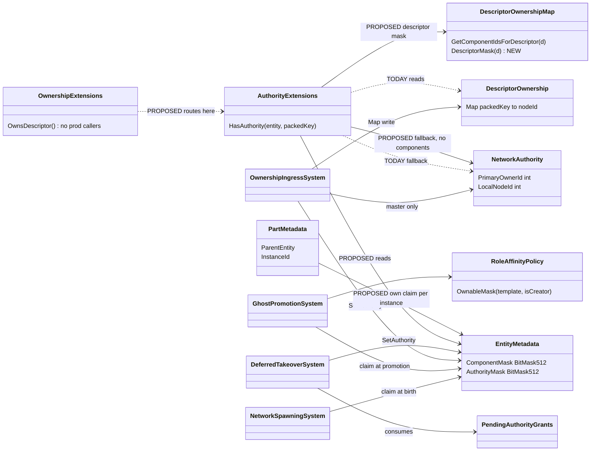
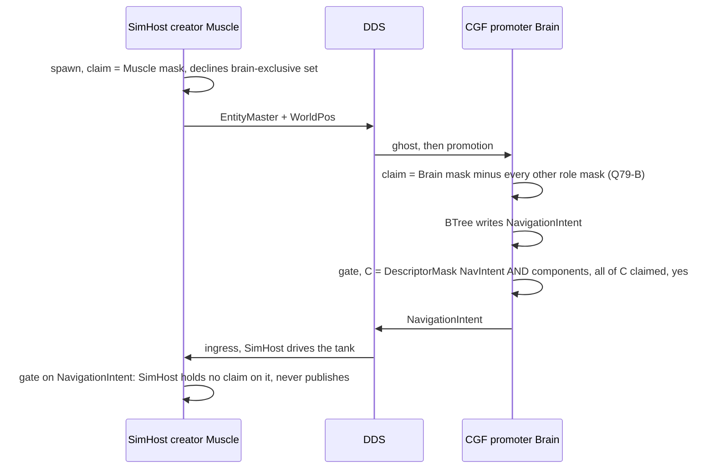
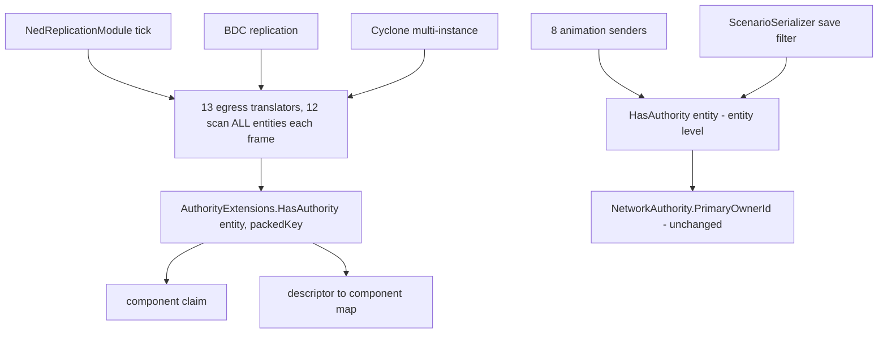

<!--STATUS
state: LIVE
updated: 2026-10-01
build-state: DESIGN — SCOPE RULED 2026-10-01 (one node per role, with the duplicate-role guard). User constraint 2026-10-01: NO change to the existing network protocols, minimal change ⇒ §9 (the one-gate fix) is the proposed build; §8 is DEFERRED, not built.
current-answer: §9a (recompute the network record from the claim — the user's variant, awaiting approval) FIRST, §9 is the one-gate alternative; §8 is the deferred full unification; §7 is the proof both rest on.
stale-below: §4 as a whole — superseded by §8 (its Q79-B is refuted in §7.3, its Q79-A fallback corrected in §7.1). Keep §4 only as the record of the first framing.
known-rot: nothing known
known-conflict: DESIGN_Role_Affinity_Ownership.md §3.9c tolerates a promote-leg OVER-CLAIM ("tolerated, not correct") because
  no sender reads the claim. Q79-B removes that tolerance: once senders derive from the claim, an over-claim is a second
  publisher. Not reconciled until Q79-B is approved.
related-designs:
  - docs/DESIGN_Role_Affinity_Ownership.md — owns WHO claims WHICH component (role tables, birthright, promote leg); §3.6 found
    that no sender reads the claim; §4.2 carries CE-500. THIS question owns how a SENDER turns that claim into "may I publish".
  - docs/DESIGN_Entity_Ownership_Transfer.md — owns transfer INITIATION; its §3 already states the derivation rule
    ("authority-based, not Map-based") for transfers only; §4 keeps save ownership on EntityMaster. THIS question applies §3
    to every sender.
  - docs/DESIGN_Distributed_Scenario_Persistence.md — owns the SAVE GATE (`NetworkAuthority.PrimaryOwnerId`), which this
    question leaves exactly as it is.
  - FDP/Docs/projects/toolkits/FDP.Toolkit.Replication.md §2 — the ORIGINAL three-level model (primary · descriptor override ·
    hierarchical) that the current gate implements.
  - docs/reference/BDC_NED_SST_Descriptor_Rules.md — the wire spec: per-descriptor partial owners, "only the descriptor
    owner is allowed to publish", a disposed descriptor returns to the EntityMaster owner.
-->

# Architect Question 79 — **one ownership truth: senders derive descriptor ownership from the component claim**

> 🔒 **User, `2026-10-01`:** *"How can we make them agree in a clean way? We should not invent workarounds to a bug."* ·
> *"Per instance ownership should be honored even if not currently used. Unused is not equal to unneeded."* ·
> *"There must have been some reason for why it is implemented using the current mechanism. There is likely some trade off."*

**Trigger:** [`CE-500`](Blueprint_Issues_Tracker.md) — on Role-Affinity *Path B* (SimHost creates, CGF thinks) the brain
writes `NavigationIntent` and never sends it: CGF **claims** the component, but every sender reads a **different** record.

## 1. INVENTORY

| query | total | list |
|---|---|---|
| `search_graph name_pattern=".*(Authority\|Ownership).*" label=Class` *(production)* | 25 | `AuthorityExtensions` · `OwnershipExtensions` · `NetworkAuthority` · `DescriptorOwnership` · `DescriptorOwnershipMap` · `PendingAuthorityGrants` · `DescriptorAuthorityChanged` ×2 · `OwnershipIngressSystem` · `OwnershipEgressSystem` · `OwnershipTransferInitiationSystem` · `LocalAuthorityYieldSystem` · `BrainMuscleOwnershipStrategy` · `DeferredTakeOwnership` (+command, egress, ingress) · `OwnershipUpdate` ×3 · `OwnershipUpdateTranslator` · `TransferEntityOwnershipRequest` · `QueryBuilderAuthorityExtensions` · `WorldIdAuthority.AllocatorAuthority` *(unrelated: id allocation)* · `SplitAuthorityStrideSyncScript` |
| `grep "HasAuthority(<entity>, <packedKey>)"` *(production)* | 18 | 13 senders (NED ×10, BDC ×2, Cyclone multi-instance ×1) · `EntityInfoIngressTranslator:176` · `UpdateEntityDescriptorRequestSystem:142,190` · `OwnershipTransferInitiationSystem:155` · debug API |
| `grep "HasAuthority(<entity>)"` *(entity-level, production)* | 10 | 8 animation senders · `WeaponFireIntentEgressTranslator:87` · `ScenarioSerializer:612` (save filter) |
| `OwnsDescriptor` / `GetDescriptorOwner` *(a THIRD gate, `OwnershipExtensions.cs:40-90`)* | 0 production callers | ignores the map entirely — *"per-descriptor ownership map was removed as part of Core simplification (BATCH-07)"* |
| live world descriptor→component map, SimHost + CGF *(probe, `2026-10-01`)* | 6 / 5 | `EntityMaster`→NetworkIdentity,TkbIdentity · `EntityInfo`→EntityInfo · `MapVisualOverlay`→EditablePolyline · `MapRoute`→RoutePlan · `NavigationStatus` · `NavigationIntent`. ⚠ The WorldPos block (`NedReplicationModule.cs:623`) is in the MODULE's map only |

## 2. THE DIAGRAMS

### 2.1 Class — as it IS (two records, three gates) → as PROPOSED (one truth, one gate)

*What the picture shows that prose hid:* **every writer already writes the claim** (`EntityMetadata.AuthorityMask`) — spawn,
promotion, both handover paths — but the one gate every sender calls reads `DescriptorOwnership` + `NetworkAuthority`, which
only the handover paths and spawn write. Promotion writes the claim and nothing else; that is CE-500. Proposed, the gate
reads what everyone writes.

### 2.2 Sequence — Path B under the proposal

*What it shows:* both nodes decide **locally from the same role tables** and agree without a message; exactly one publisher
per descriptor, which is the spec's only hard rule.

### 2.3 Module — who calls the gate each frame

*What it shows:* one function sits under every sender, so the change is made **once**; the entity-level gate (lifecycle,
save) is untouched.

## 3. ⭐⭐ WHY IT IS BUILT THIS WAY — AND WHAT DERIVATION LOSES

📐 **Why the current mechanism exists.** The replication toolkit was designed **wire-first**
([`FDP.Toolkit.Replication.md`](../../FDP/Docs/projects/toolkits/FDP.Toolkit.Replication.md) §2): three levels — the primary
owner, a per-descriptor override map, and parts inheriting their root. It mirrors the wire spec one-to-one, so the gate needs
**no knowledge of ECS components** and works for a translator that declares none (today: all but six). The per-component
`AuthorityMask` came separately, from the ECS core, for queries (`WithOwned<T>`). Role affinity (`2026-09`) then moved the
*decision* onto the mask because ownership must be network-agnostic (Role_Affinity §2.3) — and the senders stayed on the wire
record. That is how two truths arose: **each was right for the job it was built for.**

| # | what derivation LOSES (or makes harder) | measured | how the proposal handles it |
|---|---|---|---|
| **L1** | ⭐ **correctness now depends on the descriptor→component declarations.** A missing declaration falls back to today's behaviour (safe); a **wrong** one silently changes who publishes | 6 of ~19 descriptors declare components; WorldPos only in the module's map | Q79-C: one map + a rail that every sender either declares its components or is explicitly entity-level |
| **L2** | **two descriptors that share a component cannot have different owners** (e.g. `SimTransform` is in WorldPos and GeoSpatial). The spec allows it | ✅ `DescriptorOwnershipMap` reverse index is many-valued | accepted: two owners would both *write* that component on ingress — an ECS conflict the map could express but never made correct |
| **L3** | **a claim cannot exist before its component does** (`SetAuthority` throws, `EntityRepository.cs:1133`); the map can say "I own D" for a ghost that has no components yet | ✅ pre-genesis grants already staged in `PendingAuthorityGrants` | Q79-E: an `OwnershipUpdate` for absent components is staged the same way, never dropped |
| **L4** | **"who owns it" (a node id) is gone** — the claim says only *mine / not mine* | readers of an owner id: debug API, replay federation (`PrimaryOwnerId`, kept) | Q79-F: the map stays as **remote bookkeeping** (debug, routing a one-time update to the owner — spec L145), never read by the gate |
| **L5** | **implicit part inheritance is gone** — today a part needs no state; it borrows its root's answer | ✅ parts start with an empty claim (`EqsChildSensor.cs:66`) | Q79-D: a part's claim is set **at creation** from its root's claim (one helper, three creation sites); per-instance ownership becomes expressible without the map |
| **L6** | the gate now needs the transport's map at runtime (a toolkit → transport-populated dependency) | the world already holds it (`AttributeInterpreterProvider.GetDescriptorMap`) | no new dependency, but the map must be complete before the first sender runs |

⚠ **Stated honestly about speed (§5):** the gain is real but is **not** a reason to choose this. Most of today's cost is
generic per-type lookups through the interface, which an optimised version of today's gate could also shed. ⭐ The reason is
**one truth**.

## 4. THE SUB-QUESTIONS — each with a lean

| # | question | ⭐ lean | blast radius | would change it |
|---|---|---|---|---|
| **Q79-A** | Is the component claim the ONE ownership truth, with descriptor ownership DERIVED? Rule: C = D's components the entity has; **own D ⇔ C non-empty and every component of C claimed**; C empty ⇒ the EntityMaster owner (spec default); EntityMaster itself ⇒ `PrimaryOwnerId` | ✅ **yes** — Ownership_Transfer §3 already states it; "every" not "any" because only the owner may publish | the one gate (`AuthorityExtensions`), ~28 callers unchanged | a ruling that a descriptor must be ownable independently of its components (L2) |
| ⛔ **Q79-B — REFUTED by §7.3** | Precondition — claims disjoint: the promoter claims only **its role mask minus every other role's mask**; the creator keeps the unclassified rest | ✅ **yes** — uses the existing tables; makes "one publisher" true by construction | `GhostPromotionSystem` claim (one line of mask math) + rails | a deliberate shared component — none known |
| **Q79-C** | Precondition — ONE map: the world map carries the explicit blocks (WorldPos, NavigationStatus); a rail fails when a sender neither declares components nor is marked entity-level | ✅ **yes** | `NedReplicationModule` populate + one rail | — |
| **Q79-D** | Per-instance: an instance IS an entity (root = 0, part = N); the gate derives on the **instance's own entity**; a part's claim is set at creation from its root's; a per-instance transfer writes the part | ✅ **yes** — honours per-instance ownership *("unused is not unneeded")*; drops the implicit root redirect | three part-creation sites (weapon mounts, EQS child sensors, personal routes) + `OwnershipIngressSystem` instance routing | — |
| **Q79-E** | An ownership change for components not yet present is **staged** (`PendingAuthorityGrants`), applied when they appear | ✅ **yes** — reuse, do not invent | `OwnershipIngressSystem` | — |
| **Q79-F** | `DescriptorOwnership.Map` becomes remote bookkeeping (never read by the gate); `OwnsDescriptor`/`GetDescriptorOwner` are **routed** into the one gate, not deleted | ✅ **yes** | debug API, `OwnershipExtensions` | a reader that needs a remote owner id the map no longer tracks after a local promotion — then derive it from the wire's last writer |

**Rejected, one line each:**
- *each sender checks its own component* — 25 edits, and ambiguous where one component belongs to several descriptors.
- *sync the map on promotion* — still two truths kept in step; the next new writer drifts again.
- *send `OwnershipUpdate` on promotion* — that is the transfer protocol; it does not change the local gate.
- *"any component claimed" instead of "every"* — lets two nodes publish one descriptor.
- *cache the derived answer per entity* — a third record needing invalidation; the derivation is cheaper than the lookup it would save.

## 5. MEASUREMENTS *(`2026-10-01`, Release, 10 000 entities, 100 rounds, through `ISimulationView`, 3 runs)*

| gate | ns / call |
|---|---|
| today — keyed, no map entry | 557 – 636 |
| today — keyed, map entry | 620 – 670 |
| today — entity-level only | 160 – 238 |
| **derived** — descriptor mask ∧ component mask, then "all claimed?" | **52 – 74** |

12 of 13 senders scan every entity every frame ⇒ ~12 000 calls/frame at 1 000 entities ≈ **7 ms → 0.7 ms**
*(⚠ extrapolated from the micro-benchmark; not measured in a live cluster)*. No cache: one static mask per descriptor built
when the map is filled; the per-entity inputs are kept current by the ECS itself.

## 6. ACCEPTANCE *(for the batch that builds an approved answer)*

| rail | proves |
|---|---|
| `CgfSubsystemHeadlessTests.SimHost_MoveToLocationMission_…` green | CE-500 closed (Path B publishes) |
| new: Path B ⇒ exactly ONE node publishes `EntityInfo` | Q79-B — no over-claim publisher |
| `SplitAuthoritySpawnTests` green | Path A WorldPos handover unchanged (Q79-C) |
| new: a part transferred alone publishes from its new owner, its root does not | Q79-D per-instance |
| new: an `OwnershipUpdate` before the component exists takes effect when it appears | Q79-E |
| unit: derived gate == today's gate on every case where the two records agree | no behaviour change outside the bug |

## 7. ⭐⭐⭐ THE LOGICAL PROOF — and what it refuted *(`2026-10-01`)*

> 🔒 **User:** *"testing on todays (limited) data and use cases is not what proves correctness. can the correctness be derived
> logically?"* — ⭐ yes: correctness reduces to AXIOMS about finite DEFINITIONS (role tables, the descriptor→component map,
> templates). The theorem is proved once; each axiom is discharged by reading the definitions, not by running use cases.

### 7.1 The model and the (corrected) rule

| symbol | meaning |
|---|---|
| `D(d)` | the components descriptor `d` binds — ⭐ **a property of the descriptor, identical on every node** (axiom M) |
| `K(e,n)` | the components entity/instance `e` has on node `n` |
| `A(e,n)` | node `n`'s claim on `e` (`AuthorityMask`), always `⊆ K(e,n)` |
| `master(e)` | the EntityMaster owner (`PrimaryOwnerId`) |

**owns(n,d,e) ⇔** `D(d) = ∅ ∧ n = master(e)`  **∨**  `D(d) ≠ ∅ ∧ D(d)∩K(e,n) ≠ ∅ ∧ D(d)∩K(e,n) ⊆ A(e,n)`

⛔ **Correction to §4 Q79-A:** the fallback keys on `D(d) = ∅` (the GLOBAL definition), never on "this node has none of the
components". 📐 With a local fallback, a node lacking `d`'s components would fall to the master owner while another node claims
them — **two owners by construction**. A node holding none of `d`'s components simply cannot own `d` (it has nothing to send).

### 7.2 The axioms and the two theorems

| axiom | statement |
|---|---|
| **M** | `D(d)` is the same on every node |
| **X — exclusivity** | for every (entity/instance, component) at most ONE node holds the claim, outside the spec's own transfer window |
| **C — coherence** | a descriptor's components are never claimed by different nodes: whoever claims one member of `D(d)` claims every member it has |
| **P — master uniqueness** | `master(e)` is one node on every node's view (the spec: EntityMaster has one writer) |
| **E — claim follows execution** | a node writes a component only if it claims it (the `WithOwned` execution gate, Role_Affinity §3.5) |

**Theorem 1 — safety (at most one sender).** Under M, X, C, P: if `D(d) = ∅`, only `master(e)` owns `d` (P). If `D(d) ≠ ∅` and
`n₁ ≠ n₂` both own `d`, each claims some member of `D(d)`; by C each claims all members it has, so some component is claimed
by both, or the two hold disjoint parts of one descriptor — the first contradicts X, the second contradicts C. ∎
⚠ It holds **outside the transfer window**, exactly as the wire spec itself does (*"This is not true during the short time of
ownership update"*).

**Theorem 2 — liveness (the producer sends).** Under E: the node that writes `D(d)` claims it, so `D(d)∩K ⊆ A` and it owns `d`.
⚠ E is only as strong as the execution gate — §3.5 found un-gated writers; liveness is proved only where execution is gated.

**Per instance:** replace `e` by the instance's entity. Initialising a part's claim from its root's (Q79-D) copies an exclusive,
coherent claim onto a NEW entity, so X and C are preserved.

### 7.3 ⛔⛔ DISCHARGING THE AXIOMS AGAINST THE DEFINITIONS — **X FAILS, and Q79-B does not fix it**

📐 `HrotRoleComponentSets.cs:163-178`: `Brain = ALL − birthCritical` · `MuscleGround = ALL − birthCritical − brainOnly`.
⇒ ⭐ **the Muscle table is a SUBSET of the Brain table.** The overlap is not a "third bucket" — it is the **entire muscle set**.

| path | creator claims | promoter claims today | X? |
|---|---|---|---|
| **A** — CGF creates | Brain ∪ birth = **everything** | SimHost: MuscleGround = everything − brainOnly | ⛔ **violated for every muscle component** (both claim) |
| **B** — SimHost creates | MuscleGround ∪ birth = everything − brainOnly | CGF: Brain = everything − birth | ⛔ violated for every muscle component |

⇒ today works **only because no sender reads the claim** (§3.6). A derived gate on top of these tables would create two
senders on Path A and Path B alike.

⛔⛔ **Q79-B as written ("promoter claims its role minus every other role") is REFUTED.** Brain − Muscle = brainOnly ✅ (Path B
correct), but **Muscle − Brain = ∅** ⇒ on Path A SimHost would claim NOTHING by role, and every gated muscle system
(perception, weapons, kinematics outside the WorldPos handover) would stop on Brain-created entities — Theorem 2 violated.

**What M, C and P look like** *(read from the definitions)*: M ⛔ **fails today** (the world map is per-node and a subset — §1);
C ✅ holds for the six declared descriptors under the current transfers (whole descriptors move); P ✅ by the spec and creation.

### 7.4 ⭐ THE QUESTION THAT REMAINS — how does the claim become EXCLUSIVE?

⇒ the derivation is **provably correct once X and M hold**; the open design decision is **X**, and it touches the `2026-09-13`
ruling that the role tables are COMPLEMENTS (Role_Affinity §3.9c). Candidates, NOT yet leaned — each needs its own check
against Theorem 2:

| option | X by construction? | cost |
|---|---|---|
| promoter claims `role − creator's ownable set` | ✅ | Path A: the Muscle claims ∅ by role ⇒ its computed state must arrive by explicit descriptor handover (extend `DeferredTakeOwnership` beyond WorldPos/NavigationStatus) |
| tables become disjoint POSITIVE sets | ✅ | ⛔ the `2026-09-13` ruling rejected it (fails toward un-ownership, `CE-256`) |
| creator DECLINES every component another role in the cluster serves | ✅ | the creator must know which roles are present — the start-order race §0a removed |

⛔ **Do not approve §4 until §7.4 is decided.**

### 7.5 ⭐⭐ OPTION 1 CHECKED AGAINST THEOREM 2 *(`2026-10-01` — definitions + the live composition, not use cases)*

**Option 1:** the promoter claims `its role table − the creator's ownable set`. ⇒ Path B: CGF claims **brainOnly**;
Path A: SimHost claims **∅ by role**, and gets kinematics only through the `DeferredTakeOwnership` grant (WorldPos block,
NavigationStatus — `BrainMuscleOwnershipStrategy`).

📐 **Method.** Theorem 2 constrains only components bound to a descriptor (unbound ones are never published). The live
composition of a SimHost + CGF pair was dumped (`ArchitectureDiagnosticsService`, 41 SimHost / 58 CGF systems) and the
writers of every bound component were read.

| descriptor (bound components) | producer | Path A — CGF creates | Path B — SimHost creates |
|---|---|---|---|
| `EntityMaster` (NetworkIdentity, TkbIdentity) | creator | ✅ | ✅ |
| `EntityInfo` | creator *(per-spawn name/faction)* | ✅ CGF | ✅ SimHost |
| `NavigationIntent` | CGF BTree | ✅ creator claims | ✅ brainOnly — **CE-500 closed** |
| `WorldPos` (SimTransform, SimVelocity, VehicleState, VehicleParams, NavState) | SimHost after birth; CGF's birth baseline | ✅ **only via the creation-time grant** · ⛔ **no muscle known at creation ⇒ no grant ⇒ the producer never owns** | ✅ creator |
| `NavigationStatus` | SimHost | same as WorldPos | ✅ |
| `MapVisualOverlay` / `MapRoute` | creator | ✅ — Map2D is a pure consumer (Role_Affinity §6i-b) | ✅ |

Two suspected two-node writers were checked and cleared: `LocomotionChannel` (SimHost's bridge write is guarded by
`IsComponentTypeRegistered`, `NavigationIntentBridgeSystem.cs:187`, and SimHost does not register channels) · `WeaponState`
(written only on CGF, `AimAndFireExecutor.cs:53`).

⇒ ⭐⭐ **Option 1 satisfies Theorem 2 everywhere EXCEPT Path A kinematics with a late-joining Muscle** — which is exactly
`CE-256` (Role_Affinity §0a). ⚠ It is **no worse than today** (today the gate also publishes WorldPos only through the grant),
but it does **not** deliver what role affinity promised there — *"the creator declines, the role-holder claims on promotion"*
was never true for publication, because no sender read the claim.

### 7.6 ⭐ The residual, and the lean to close it

The late joiner must take the kinematic block **itself, on promotion**, without the creator knowing the cluster at creation
time. ⭐ **Lean: a promoter-initiated `OwnershipUpdate`** for the descriptors its role produces but the creator owns
(WorldPos, NavigationStatus). It is the **wire spec's own transfer** (*"an arbitrary node sends OwnershipUpdate"*; the
current owner stops, the new owner writes to confirm), **already built** (`CE-276`), and it keeps X and C: the block moves as
a whole, the creator clears before the promoter claims.
⚠ **Why this is not the "re-grant on node-join" §0a rejected:** that was a creator-side re-evaluation — a second policy. Here
the role-holder asks for what its role produces, through the one transfer mechanism. ⛔ **Not yet proved:** the case of two
promoters of the same role (sharding, §3.8) racing for one block — the shard provider's single answer per entity is the
candidate guarantee and needs its own check.

### 7.7 ⭐⭐⭐ SHARDING — Theorem 3, and what it requires *(`2026-10-01`)*

**Axiom S — partition.** For every role `R` and entity key `k`, **at most one node in the cluster** answers
`ServesRole(R, k) = true`. ⚠ Role_Affinity §3.8's contract ① (inputs identical on every node) and ② (stable for the entity's
life) make nodes **agree**; ⛔ **neither says only ONE node answers yes.** S must be stated as contract ③.

**Theorem 3 — sharded promotion with a promoter-initiated transfer (§7.6) is race-free.** Under S, ②, X and C:
1. per (entity, role) at most one node promotes as that role's holder (S) ⇒ at most one claimant per role-exclusive component (X);
2. a promoter requests only the descriptors its role produces; role-produced blocks are disjoint (C) ⇒ **at most one initiator
   per descriptor**;
3. one initiator ⇒ one `OwnershipUpdate` per descriptor ⇒ every node applies the same final owner — the spec's single-transfer
   protocol holds;
4. ② ⇒ no second initiator appears later (no remapping of a live entity). ∎

📐 **Why one initiator is NECESSARY, not just sufficient:** `OwnershipIngressSystem.cs:57-67` applies updates **last-write-wins
per node, in that node's arrival order**, and DDS gives no total order across different writers ⇒ two initiators for one
descriptor can leave nodes disagreeing (A believes B owns it, B believes A does) — a silent two-writer or zero-writer state.

### 7.8 ⛔⛔ DISCHARGING S AGAINST THE DEFINITIONS

| deployment | S holds? | measured |
|---|---|---|
| **one node per role** *(every shipped launch mode: `launchSettings.json` starts one SimHost, one CGF)* | ✅ with `SingleNodePerRoleShardProvider` (it ignores the key; one declarer ⇒ one "yes") | ⚠ **not ENFORCED** — no code detects a second node declaring the same role *(searched: none)* |
| **N > 1 nodes per role** | ⛔ **the default provider answers yes on EVERY declarer** ⇒ two muscles both promote, both claim, both initiate | ⚠ today's grant path ANTICIPATES N muscles (`BrainMuscleOwnershipStrategy` → `GetLeastLoadedNode`) — there ONE decider (the creator) picks one, which is why today does not race |
| **N > 1 with a locally computed rule** *(e.g. hash over the roster)* | ⛔ **unprovable** — the roster comes from 1 Hz heartbeats and is not identical across nodes at the same moment (violates ①); membership changes violate ② | — |

⇒ ⭐⭐ **RESULT.**
- **One node per role: the proof is complete** — given X, C, M (§7.2-7.6) and ONE guard: ⛔ a second node declaring a role
  already held must be **detected and refused loudly** (the roster already knows — `NodeRoster.NodesWithRole`), or S breaks
  silently. Same shape as §5 ②'s approved boot warning.
- **N nodes per role: provably correct only with a SINGLE DECIDER** publishing `(role, entity) → node`, fixed once assigned —
  the shard-table authority §3.8 deliberately left undesigned. ⭐ It must assign **when a holder exists**, not only at
  creation — that is what closes the late joiner for N > 1. ⛔ **No locally computed provider can satisfy S under changing
  membership.**
- ⚠ **Adopting §7.6 with the default provider would REGRESS a multi-muscle cluster** (today the creator's single decision
  prevents the race). ⇒ the guard above is a precondition of §7.6, not an extra.

## 8. ⭐⭐⭐ THE CURRENT ANSWER — consolidated *(`2026-10-01`, after §7)*

> 🔒 **User, `2026-10-01`, verbatim, scope ruling (`R-157`):** *"one node per role with the guard for now"*

| # | decision | basis | status |
|---|---|---|---|
| **D1** | **One truth:** the component claim (`AuthorityMask`). Every sender derives: `owns(n,d,e) ⇔ (D(d)=∅ ∧ n=master(e)) ∨ (D(d)≠∅ ∧ D(d)∩K ≠ ∅ ∧ D(d)∩K ⊆ A)`; EntityMaster ⇒ `PrimaryOwnerId` | §7.1, Theorems 1-2 | ⭐ lean — awaiting approval |
| **D2** | **The promoter claims `its role table − the creator's ownable set`** (replaces the refuted Q79-B) | §7.3 refutation · §7.5 check | ⭐ lean |
| **D3** | **The promoter requests the descriptors its role produces but the creator owns** (WorldPos, NavigationStatus) by an `OwnershipUpdate` through the built transfer (`CE-276`) — closes the late joiner (`CE-256`) | §7.6 · Theorem 3 | ⭐ lean |
| **D4** | ⭐⭐ **Duplicate-role guard:** a node declaring a role another live node already holds is **refused loudly** (from `NodeRoster.NodesWithRole`). One node per role is the supported topology | §7.8 — S holds only with it | ✅ **RULED** (`R-157`) |
| **D5** | **One global map:** the descriptor→component map is a property of the descriptor, identical on every node, including the explicit WorldPos / NavigationStatus blocks; a rail fails when a sender neither declares components nor is marked entity-level | axiom M (§7.2) | ⭐ lean |
| **D6** | **Per instance:** the gate derives on the instance's own entity; a part's claim is set at creation from its root's; a per-instance transfer writes the part | §7.2 "per instance" | ⭐ lean *(user: "unused is not unneeded")* |
| **D7** | An ownership change for components not yet present is **staged** (`PendingAuthorityGrants`), never dropped | L3 | ⭐ lean |
| **D8** | `DescriptorOwnership.Map` becomes **remote bookkeeping** (never read by the gate); `OwnsDescriptor` / `GetDescriptorOwner` are **routed** into the one gate | L4 · Q79-F | ⭐ lean |
| **D9** | **N nodes per role is OUT OF SCOPE** — it needs a single decider (an orchestrator-published, per-entity-fixed shard assignment) and is its own design: [`CE-506`](Blueprint_Issues_Tracker.md) | §7.8 | ✅ **RULED out of scope** (`R-157`) |

⚠ **What the proofs still assume, stated so nobody over-reads them:** Theorem 2 (the producer sends) was discharged for the
**descriptor-bound** components only (§7.5); most simulation writers are un-gated (§7.5's audit), so axiom E is a property of
the descriptor-bound set, not of every component. The transfer window is excluded, exactly as the wire spec excludes it.

## 9. ⭐⭐⭐ THE MINIMAL FIX — no protocol change *(`2026-10-01`, the CURRENT proposal)*

> 🔒 **User, `2026-10-01`, verbatim:** *"basically i do not want to change the existing network protocols like deferred takover.
> This took lots of effort to make them working. Every change is very risky. It means i need a minimalistic change"*

⇒ **§8 is DEFERRED** (D3 adds a new `OwnershipUpdate` initiator; D1/D8 re-gate every sender). **Built instead: ONE gate.**

**Decision:** `NavigationIntentEgressTranslator` gates on the component claim of its source component —
`repo.HasAuthority<NavigationIntent>(entity)` — instead of the network record (`view.HasAuthority(entity, packedKey)`).
Exactly the shape `TacticalIntentEgressTranslator.cs:72` already uses (`HasAuthority<BehaviorState>`). No message, no system,
no `DeferredTakeOwnership` / `OwnershipUpdate` / `PendingAuthorityGrants` change; every other sender untouched.

| the fix rests on | code — how it IS | design — how it was MEANT |
|---|---|---|
| the egress exists ONLY on a networked Brain node | ✅ built only by `CognitiveTranslatorPack.cs:57`, only `if (_roleHasBrain)` (`NedReplicationModule.cs:290`); the editor runs `OfflineNetworkFactory` → `NullReplicationModule`; IG is `Map2D` | ✅ `CognitiveTranslatorPack.cs:25` "Brain and AllInOne" |
| one networked Brain node per cluster | ✅ `R-157` + D4 guard | ✅ §8 D4, ruled |
| Path A (CGF creates): CGF's claim holds `NavigationIntent` | ✅ creator = role table ∪ birthright | ✅ Role-Affinity §3.1 |
| Path B (SimHost creates): CGF's promote leg claims it | ✅ `GhostPromotionSystem.cs:313-324` claims role table ∩ live mask, AFTER template `Inject`; the executors only `GetComponent<NavigationIntent>` (never add it) ⇒ it is template-materialised before the claim | ✅ Role-Affinity §3.2 promote leg |
| the Muscle never claims it | ✅ `NavigationIntent` is in `brainOnly` (muscle READ set), `HrotRoleComponentSets.cs:163-178` | ✅ Role-Affinity §3.1 |
| the receiver does not filter by sender | ✅ `NavigationIntentIngressTranslator.cs:67-89` resolves the entity and writes — no owner check | ⛔ searched `docs/`, no ruling — wire spec says only the owner *publishes*, not that a receiver checks |
| the §3.9c promote over-claim cannot create a second sender | ✅ it is a Brain-only component; the over-claim matters only for components both roles produce | ✅ `known-conflict` above — unaffected for this one component |

**Proof obligation** (§7.2 Theorem 1 restricted to one descriptor): at most one node composes the sender (rows 1-2) and that node
holds the claim on both paths (rows 3-4) ⇒ exactly one sender, and it is the producer (Theorem 2). Late joiner (`CE-256`) does not
arise — no grant is involved.

**Blast radius:** 1 production line · 7 unit tests in `NavigationIntentEgressTranslatorTests` set the claim
(`SetAuthority<NavigationIntent>`) beside the `NetworkAuthority` they set today. **Acceptance:**
`CgfSubsystemHeadlessTests.SimHost_MoveToLocationMission_EntityMovesWithoutGhostTick` green; the feature's own suite
(`NavigationIntentEgressTranslatorTests`) green plus a rail *"no claim ⇒ no publish even with `PrimaryOwnerId == local`"*.

**Rejected (one line each):**
- **§8 full unification** — re-gates 13 senders. That is the protocol-wide risk the user ruled out.
- **D3 (promoter sends `OwnershipUpdate`)** — adds a new initiator to the built transfer, and `OwnershipIngressSystem.cs:57-67` is last-write-wins, so two initiators race.
- **Creator decides the target** — the creator is SimHost on Path B, which has no strategy (`BrainMuscleOwnershipStrategy` is composed on CGF/IG only). Giving it one changes the takeover flow.
- **Spawn on CGF in the test** — hides a real Path B gap.

**What stays open (named, not fixed):** other Brain-produced descriptors that a SimHost-created entity needs published get the same
one-line treatment **only when a rail shows the gap**. The network record and the claim still disagree for every other sender; §8 is
the record of how to unify them later.

### 9a. ⭐⭐⭐ THE USER'S VARIANT — recompute the network record from the claim *(`2026-10-01`, the CURRENT lean)*

> 🔒 **User, `2026-10-01`:** *"but we can recompute the network ownership from component ownership. This must be doable without
> changing the network protocols"*

**Decision:** yes, if it is restricted twice. **At the promote leg** (`GhostPromotionSystem.cs:313-324`, right after the claim), for
every descriptor `d` whose components are **all in the local role's EXCLUSIVE set** (its table minus every other role's table) and
are claimed: write `DescriptorOwnership.Map[d] = local`, **only if `Map` has no entry for `d`**. No sender gate changes.

| the variant rests on | code — how it IS | design — how it was MEANT |
|---|---|---|
| writing `Map` puts nothing on the wire | ✅ the only `Map`-diff→`OwnershipUpdate` publisher, `OwnershipEgressSystem`, is registered only in FDP's `ReplicationLogicModule.cs:46` (examples); NED registers `OwnershipIngress`/`TransferInitiation`/`DeferredTakeover` only (`NedReplicationModule.cs:275,483,489`) | ✅ wire spec: `OwnershipUpdate` is the transfer protocol, not a mirror of local state |
| the protocols always write mask AND `Map` together | ✅ `OwnershipIngressSystem.cs:64-77` · `DeferredTakeoverSystem.cs:94+` · `OwnershipTransferInitiationSystem.cs:76+` | ✅ §7.2 C (coherence) |
| ⛔ an UNRESTRICTED recompute breaks a sender | ✅ `EntityInfo` is not `[BirthCritical]` (`EntityInfo.cs:9`) ⇒ in BOTH the Brain and Muscle tables (`HrotRoleComponentSets.cs:172-175`). On Path B both nodes claim it ⇒ CGF's `EntityInfoEgressTranslator.cs:116` would publish beside SimHost's, and CGF's `EntityInfoIngressTranslator.cs:176` would DROP SimHost's samples. Same for `EntityDamage` | ✅ §7.3 (X fails) · Role-Affinity §3.9c (the over-claim is "tolerated" only because no sender reads it) |
| the exclusive sets | ✅ Brain = `brainOnly` (incl. `NavigationIntent`); Muscle = ∅ (Muscle ⊂ Brain); Map2D = ∅ (Brain ⊇ Map2D) | ✅ `HrotRoleComponentSets` "Brain and Muscle are still DISJOINT over the classified set" |
| "no entry only" ⇒ never overrides a protocol | ✅ by construction; DeferredTakeover's `WorldPos`/`NavigationStatus` are muscle components, disjoint from `brainOnly` | — |

⇒ **The only node that ever writes is a Brain promoter, and only brain-only descriptors** (today: `dtNavigationIntent`). Path A
(CGF is master) and every SimHost/IG promotion are byte-identical to today. One-shot at promotion ⇒ zero per-frame cost.

**Behaviour changes, named:** ① Path B — CGF publishes `NavigationIntent` (the fix). ② An IG-created tank promoted on CGF — same.
③ After an EntityMaster hand-away FROM CGF (Path A, `CE-276`), CGF keeps its brain-only descriptors — but only if they were written at
promotion, which on Path A they are not ⇒ unchanged.

**Gaps it does not close:** `EntityMissionEgressTranslator` gates on `MissionPlanQueue` but declares no `TargetComponentIds`, so no
descriptor→component entry exists and the recompute cannot see it (axiom M). Not needed for movement.

**vs §9:** same reach for `NavigationIntent`; §9a leaves every gate untouched and covers every future brain-only descriptor, at the
cost of ~20 lines in a shared FDP system instead of one line in one translator.

**Root cause of the non-exclusive claim** *(user asked, `2026-10-01`)*: ONE table serves TWO legs. The owned tables are complements
(Role-Affinity §3.9c: Brain = ALL − birthCritical, Muscle = Brain − brainOnly), so the unclassified bucket (`EntityInfo`, health,
map display… ~496 of 512 bits) is in BOTH. On the CREATE leg that is right — the creator keeps what no role claims. On the PROMOTE
leg (`GhostPromotionSystem.cs:313-324`, bare `BitwiseOr`) the same table makes the promoter claim that bucket too — which contradicts
§3.1's own rule *("owns it if, and only if, it holds the role that component belongs to")*; §3.9c records it as *"tolerated, not
correct"*. Re-measured `2026-10-01`: the claim's production readers are still only `SimTransform` ×2, `Position` ×1, `BehaviorState`
×2 — none in the unclassified bucket. ⇒ **Option §9a′:** narrow the promote leg to the role's CLASSIFIED set (Brain: `brainOnly`;
Muscle: ∅; Map2D: `EditablePolyline`+`RoutePlan` — whether an IG promoter should claim those on someone else's entity is open) — local, no protocol, nothing observable changes today — and then the recompute needs no restriction of its own.
